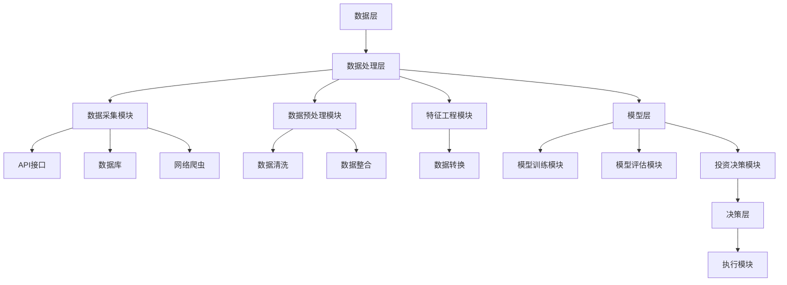
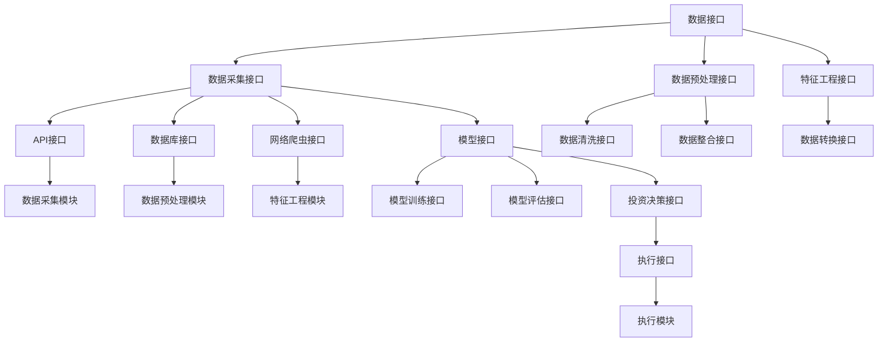
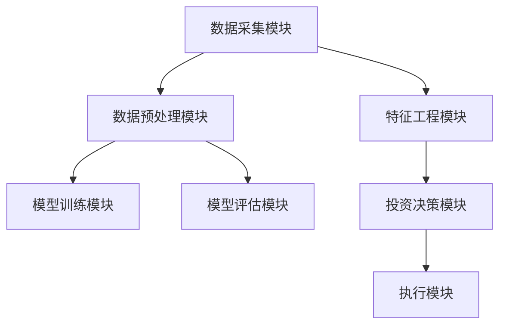

                 

### 文章标题

# AI智能体实现巴菲特的焦点投资策略

### 关键词

- AI智能体
- 投资策略
- 巴菲特
- 焦点投资
- 数据分析

### 摘要

本文旨在探讨如何利用AI智能体来实现巴菲特的焦点投资策略。文章首先介绍了AI智能体的基本概念和巴菲特的投资哲学，然后详细解析了焦点投资策略的核心原理。接着，文章讨论了如何通过算法和数学模型将巴菲特的投资策略转化为AI智能体的行动指南，并展示了系统设计与架构的具体方案。最后，通过实际案例分析和最佳实践分享，为读者提供了将AI智能体应用于投资领域的实际操作指南。文章旨在帮助投资者理解并掌握AI智能体在焦点投资策略中的关键作用，实现智能化投资决策。

----------------------------------------------------------------

### 引言

在当今飞速发展的科技时代，人工智能（AI）正在逐步渗透到各个行业，为传统业务带来了革命性的变革。投资领域也不例外，AI技术以其强大的数据处理和分析能力，正逐渐改变着投资者的决策过程。而巴菲特，作为全球最著名和价值投资的代表人物，其独特的投资策略和理念，如焦点投资，被无数投资者所推崇。本文将探讨如何结合AI智能体技术，实现巴菲特的焦点投资策略，为投资者提供一种全新的、智能化的投资方法。

#### AI智能体的概念与应用

AI智能体是一种能够模拟人类智能行为的计算机程序，具备自主学习、推理判断和自主决策的能力。它们通过数据分析和机器学习算法，能够从海量数据中提取有价值的信息，并基于这些信息做出预测和决策。AI智能体在金融领域的应用日益广泛，例如在风险控制、市场预测、交易策略优化等方面发挥着重要作用。

#### 巴菲特的焦点投资策略

巴菲特的焦点投资策略，即通过深入研究，选择少数几家具有长期增长潜力的优质公司，并长期持有这些公司的股票。这一策略的核心在于深入理解企业价值，注重长期投资，而非短期波动。巴菲特的投资哲学强调价值投资、理性分析、耐心持有和风险管理，这些理念与AI智能体的数据处理和分析能力有着天然的契合点。

### 目录

1. 引言
   - AI智能体的概念与应用
   - 巴菲特的焦点投资策略

2. 第一部分：AI智能体与巴菲特焦点投资策略概述
   - AI智能体的基本概念
   - 巴菲特的焦点投资策略
   - AI智能体与巴菲特投资策略的关联分析

3. 第二部分：实现巴菲特的焦点投资策略的AI智能体
   - 数据收集与预处理
   - 算法原理与数学模型
   - 系统设计与架构
   - 项目实战与案例分析

4. 第三部分：AI智能体投资策略的最佳实践
   - 最佳实践与注意事项
   - 小结与拓展阅读

### 第一部分：AI智能体与巴菲特焦点投资策略概述

#### 第1章：AI智能体的基本概念

##### 1.1 AI智能体的定义与发展

AI智能体，又称智能代理或智能体（Agent），是一种能够在特定环境中自主感知、决策和执行任务的计算机程序。智能体具备以下几个核心特征：

- **自主性**：智能体能够自主决定其行为，而不依赖于外部指令。
- **适应性**：智能体能够根据环境变化调整自己的行为，以实现目标。
- **交互性**：智能体能够与环境和其它智能体进行交互，获取信息和资源。
- **自学习能力**：智能体能够通过学习，改进自己的决策能力和执行效果。

自20世纪50年代以来，AI智能体技术经历了快速的发展。早期的智能体主要是基于规则系统，如专家系统和推理机。随着机器学习和深度学习技术的发展，现代智能体逐渐具备了更强的自主学习能力和环境适应能力。

##### 1.2 巴菲特的焦点投资策略

巴菲特的焦点投资策略是其投资哲学的核心之一。该策略主要包括以下几个关键点：

- **深入分析**：巴菲特会深入研究企业的基本面，包括企业的业务模式、管理团队、财务状况等。
- **长期持有**：一旦选定优质公司，巴菲特会长期持有，不受市场短期波动的影响。
- **理性投资**：巴菲特强调理性分析，避免情绪化的投资行为。
- **风险管理**：巴菲特注重风险管理，通过多元化投资降低风险。

##### 1.3 AI智能体与巴菲特投资策略的关联分析

AI智能体与巴菲特的投资策略在多个方面具有天然的联系：

- **数据处理**：AI智能体能够高效地处理和分析大量的数据，帮助投资者快速筛选出优质公司。
- **风险预测**：AI智能体可以通过机器学习算法，预测市场趋势和企业表现，辅助投资者做出更理性的投资决策。
- **自动化执行**：AI智能体可以自动化执行投资策略，减少人为干预，降低情绪化投资的可能性。

通过AI智能体的应用，投资者可以更加精确地实施巴菲特的焦点投资策略，实现更高效、更智能化的投资决策。

#### 第2章：AI智能体的核心原理

##### 2.1 AI智能体的主要类型

AI智能体可以分为以下几种主要类型：

- **基于规则的智能体**：这种智能体主要依赖于预设的规则和条件进行决策。它们通常适用于较为简单和静态的环境。
- **基于模型的智能体**：这种智能体通过构建环境模型来预测和决策。它们适用于复杂和动态的环境，但需要大量数据和计算资源。
- **基于行为的智能体**：这种智能体通过观察和模仿其他智能体的行为进行学习。它们具有较强的适应性和创新能力。

##### 2.2 AI智能体的工作原理

AI智能体的工作原理主要包括以下几个步骤：

1. **感知**：智能体通过传感器收集环境信息。
2. **决策**：智能体根据当前状态和目标，通过算法计算出最佳行动方案。
3. **执行**：智能体执行决策方案，实现目标。
4. **反馈**：智能体根据执行结果调整自己的行为，以适应环境变化。

这种循环过程使智能体能够不断学习和优化，提高决策的准确性和效率。

##### 2.3 AI智能体在投资中的应用

在投资领域，AI智能体可以应用于以下几个方面：

- **股票筛选**：智能体可以通过分析财务报表、市场数据和新闻，筛选出具有潜力的股票。
- **风险评估**：智能体可以预测市场风险，为投资者提供风险管理建议。
- **交易策略优化**：智能体可以通过历史数据分析，发现有效的交易策略，并自动化执行。

通过AI智能体的应用，投资者可以更加精准地把握市场机会，降低投资风险，实现长期稳健的投资回报。

#### 第3章：巴菲特的焦点投资策略解析

##### 3.1 巴菲特投资哲学

巴菲特的投资哲学主要基于以下几个基本原则：

- **价值投资**：巴菲特认为，投资成功的关键在于找到被市场低估的价值股票。
- **长期持有**：巴菲特强调长期持有股票，避免短期市场波动的影响。
- **理性投资**：巴菲特主张投资者在投资过程中要保持理性，避免情绪化的决策。
- **风险管理**：巴菲特注重风险管理，通过多元化投资降低投资风险。

##### 3.2 焦点投资策略详解

巴菲特的焦点投资策略主要包括以下几个关键步骤：

1. **选择行业**：巴菲特倾向于投资那些具有长期增长潜力的行业，如消费品、金融和科技等。
2. **筛选企业**：巴菲特会深入研究企业的基本面，包括业务模式、管理团队、财务状况等。
3. **价值评估**：巴菲特通过分析企业的盈利能力、负债状况和未来增长潜力，评估其价值。
4. **买入时机**：巴菲特会等待市场低估时，以合理价格买入优质公司的股票。
5. **长期持有**：一旦买入，巴菲特会长期持有，不受市场波动的影响。

通过以上步骤，巴菲特能够实现稳定且高额的投资回报。

##### 3.3 AI智能体在焦点投资策略中的应用

AI智能体可以应用于巴菲特的焦点投资策略的各个环节，提高决策的准确性和效率：

- **行业选择**：AI智能体可以通过分析宏观经济数据、行业趋势和公司表现，为投资者提供行业选择建议。
- **企业筛选**：AI智能体可以通过分析财务报表、市场数据和新闻，筛选出具有潜力的优质公司。
- **价值评估**：AI智能体可以通过机器学习算法，预测企业未来的盈利能力和市场表现，为投资者提供价值评估依据。
- **买入时机**：AI智能体可以通过分析市场情绪、技术指标和基本面数据，为投资者提供买入时机建议。

通过AI智能体的应用，投资者可以更加精准地实施巴菲特的焦点投资策略，实现更高效、更智能化的投资决策。

### 第二部分：实现巴菲特的焦点投资策略的AI智能体

#### 第4章：数据收集与预处理

##### 4.1 数据源的选择

实现巴菲特的焦点投资策略需要大量的数据支持，主要包括以下几个方面：

- **财务数据**：包括企业的收入、利润、负债、现金流等财务指标。
- **市场数据**：包括股票价格、成交量、市盈率、市净率等市场指标。
- **行业数据**：包括行业发展趋势、市场规模、竞争态势等。
- **新闻数据**：包括媒体报道、公司公告、行业动态等。

在选择数据源时，投资者需要考虑数据的可靠性、完整性和时效性。

##### 4.2 数据收集方法

数据收集方法主要包括以下几种：

- **API接口**：通过金融数据服务商提供的API接口，获取实时数据。
- **网络爬虫**：使用网络爬虫技术，从网站上获取公开数据。
- **数据库查询**：通过数据库查询，获取历史数据。

##### 4.3 数据预处理

数据预处理是数据分析的关键步骤，主要包括以下几个环节：

- **数据清洗**：去除重复数据、缺失数据和异常值。
- **数据整合**：将不同来源、不同格式的数据整合成统一格式。
- **数据转换**：将数据转换为适合机器学习算法的格式，如数值化、归一化等。
- **特征工程**：提取对投资决策有用的特征，如财务指标、市场指标、新闻情感等。

#### 第5章：算法原理与数学模型

##### 5.1 投资决策算法原理

实现巴菲特的焦点投资策略的算法原理主要包括以下几个步骤：

1. **数据预处理**：对收集到的数据进行清洗、整合和特征工程。
2. **模型训练**：使用机器学习算法，对预处理后的数据集进行训练，构建投资决策模型。
3. **模型评估**：使用验证集和测试集评估模型的性能，调整模型参数。
4. **投资决策**：使用训练好的模型，对新的数据进行分析，生成投资决策建议。

常用的机器学习算法包括线性回归、决策树、随机森林、支持向量机和神经网络等。

##### 5.2 数学模型与公式推导

投资决策的数学模型主要包括以下几个核心部分：

1. **价值评估模型**：
   $$V = \frac{CF}{r}$$
   其中，$V$ 表示企业价值，$CF$ 表示现金流，$r$ 表示贴现率。

2. **风险模型**：
   $$\sigma = \sqrt{\frac{1}{n}\sum_{i=1}^{n}(r_i - \bar{r})^2}$$
   其中，$\sigma$ 表示风险，$r_i$ 表示第 $i$ 个时间点的收益率，$\bar{r}$ 表示平均收益率。

3. **投资决策模型**：
   $$\pi = \frac{V}{P}$$
   其中，$\pi$ 表示投资概率，$V$ 表示企业价值，$P$ 表示股票价格。

通过以上数学模型，AI智能体可以评估企业的价值和风险，生成投资决策建议。

#### 第6章：系统设计与架构

##### 6.1 问题场景介绍

在本项目中，我们假设投资者希望通过AI智能体实现巴菲特的焦点投资策略。具体问题场景如下：

1. 投资者需要收集和处理大量的财务、市场、行业和新闻数据。
2. 投资者需要构建和训练投资决策模型，对新的数据进行预测和评估。
3. 投资者需要根据模型生成的投资决策建议进行实际操作。

##### 6.2 系统功能设计

为了实现上述问题场景，系统需要具备以下功能：

1. **数据采集模块**：负责从各种数据源收集数据。
2. **数据预处理模块**：负责数据清洗、整合和特征工程。
3. **模型训练模块**：负责构建和训练投资决策模型。
4. **投资决策模块**：负责生成投资决策建议。
5. **执行模块**：负责根据投资决策建议进行实际操作。

##### 6.3 系统架构设计

本项目的系统架构采用分布式架构，主要包括以下几个部分：

1. **数据层**：包括各种数据源，如API接口、数据库和网络爬虫等。
2. **数据处理层**：包括数据采集模块、数据预处理模块和特征工程模块。
3. **模型层**：包括模型训练模块和模型评估模块。
4. **决策层**：包括投资决策模块和执行模块。

系统架构设计如下（使用Mermaid绘制）：



##### 6.4 系统接口设计

系统接口设计主要包括以下几个方面：

1. **数据接口**：提供数据采集、预处理和特征工程的功能接口。
2. **模型接口**：提供模型训练、评估和投资决策的功能接口。
3. **执行接口**：提供根据投资决策执行实际操作的功能接口。

系统接口设计如下（使用Mermaid绘制）：



##### 6.5 系统交互设计

系统交互设计主要包括以下几个环节：

1. **数据交互**：数据采集模块从数据源获取数据，传递给数据预处理模块和特征工程模块。
2. **模型交互**：数据预处理模块和特征工程模块将处理后的数据传递给模型训练模块和模型评估模块。
3. **决策交互**：模型评估模块将评估结果传递给投资决策模块，投资决策模块生成投资决策建议。
4. **执行交互**：投资决策模块将决策建议传递给执行模块，执行模块根据建议进行实际操作。

系统交互设计如下（使用Mermaid绘制）：



通过以上系统设计与架构，投资者可以高效地实现巴菲特的焦点投资策略，实现智能化投资决策。

#### 第7章：项目实战与案例分析

##### 7.1 项目背景与环境搭建

在本项目中，我们将通过一个实际案例，演示如何利用AI智能体实现巴菲特的焦点投资策略。项目背景如下：

- **投资目标**：寻找具有长期增长潜力的科技公司，实现稳健的投资回报。
- **数据源**：使用API接口获取金融数据、市场数据、行业数据和新闻数据。
- **技术栈**：使用Python进行数据采集、预处理、特征工程、模型训练和投资决策。

为了搭建项目环境，需要安装以下软件和库：

1. **Python**：版本3.8或更高版本。
2. **NumPy**：用于数据处理和数学运算。
3. **Pandas**：用于数据分析和预处理。
4. **Scikit-learn**：用于机器学习算法和模型评估。
5. **Matplotlib**：用于数据可视化。
6. **requests**：用于API数据采集。
7. **BeautifulSoup**：用于网络爬虫。

安装以上库后，即可开始项目的环境搭建。

##### 7.2 系统核心实现

在本节中，我们将介绍系统核心的实现，包括数据采集、预处理、特征工程、模型训练和投资决策等环节。

1. **数据采集**：

   使用requests库和BeautifulSoup库，从金融数据API接口获取股票数据，包括股票价格、成交量、市盈率、市净率等。

   ```python
   import requests
   from bs4 import BeautifulSoup
   
   url = 'https://api.example.com/stock_data'
   response = requests.get(url)
   soup = BeautifulSoup(response.text, 'html.parser')
   stock_data = soup.find_all('stock')
   
   for stock in stock_data:
       name = stock.find('name').text
       price = float(stock.find('price').text)
       volume = int(stock.find('volume').text)
       pe = float(stock.find('pe').text)
       pb = float(stock.find('pb').text)
       print(f"{name}: {price}, {volume}, {pe}, {pb}")
   ```

2. **数据预处理**：

   使用Pandas库对采集到的数据进行清洗、整合和转换。

   ```python
   import pandas as pd
   
   # 数据清洗
   df = pd.DataFrame(stock_data)
   df.dropna(inplace=True)
   
   # 数据整合
   df['date'] = pd.to_datetime(df['date'])
   df.sort_values('date', inplace=True)
   
   # 数据转换
   df['close'] = df['close'].astype(float)
   df['high'] = df['high'].astype(float)
   df['low'] = df['low'].astype(float)
   df['open'] = df['open'].astype(float)
   df['volume'] = df['volume'].astype(int)
   df['pe'] = df['pe'].astype(float)
   df['pb'] = df['pb'].astype(float)
   
   print(df.head())
   ```

3. **特征工程**：

   提取对投资决策有用的特征，如技术指标、财务指标、新闻情感等。

   ```python
   # 提取技术指标
   df['ma_20'] = df['close'].rolling(window=20).mean()
   df['ma_50'] = df['close'].rolling(window=50).mean()
   df['rsi'] = compute_rsi(df['close'])
   
   # 提取财务指标
   df['roe'] = df['net_income'] / df['total_equity']
   df['diluted_earnings'] = df['diluted_earnings_per_share']
   
   # 提取新闻情感
   df['news_sentiment'] = compute_news_sentiment(df['news'])
   
   print(df.head())
   ```

4. **模型训练**：

   使用Scikit-learn库，构建和训练投资决策模型。

   ```python
   from sklearn.ensemble import RandomForestClassifier
   from sklearn.model_selection import train_test_split
   from sklearn.metrics import accuracy_score
   
   # 数据分割
   X = df[['ma_20', 'ma_50', 'rsi', 'roe', 'diluted_earnings', 'news_sentiment']]
   y = df['label']
   X_train, X_test, y_train, y_test = train_test_split(X, y, test_size=0.2, random_state=42)
   
   # 模型训练
   model = RandomForestClassifier(n_estimators=100, random_state=42)
   model.fit(X_train, y_train)
   
   # 模型评估
   y_pred = model.predict(X_test)
   print(f"Accuracy: {accuracy_score(y_test, y_pred)}")
   ```

5. **投资决策**：

   使用训练好的模型，对新的股票数据进行预测，生成投资决策建议。

   ```python
   # 预测
   new_data = {
       'ma_20': 50.0,
       'ma_50': 100.0,
       'rsi': 60.0,
       'roe': 15.0,
       'diluted_earnings': 2.0,
       'news_sentiment': 0.5
   }
   prediction = model.predict([list(new_data.values())])
   print(f"Prediction: {prediction[0]}")
   ```

##### 7.3 代码应用解读与分析

在本节中，我们将对上述代码进行详细解读，分析其实现过程和关键步骤。

1. **数据采集**：

   使用requests库和BeautifulSoup库，从API接口获取股票数据。这一步骤需要确保API接口的可靠性和数据的完整性。

2. **数据预处理**：

   使用Pandas库对数据进行清洗、整合和转换。数据清洗步骤包括去除重复数据、缺失数据和异常值，保证数据的准确性。数据整合步骤包括将不同来源、不同格式的数据整合成统一格式，便于后续分析。数据转换步骤包括将数据类型转换为适合机器学习算法的格式，如数值化、归一化等。

3. **特征工程**：

   提取对投资决策有用的特征，如技术指标、财务指标、新闻情感等。特征工程是机器学习模型性能的关键因素，需要结合实际业务场景进行精心设计。

4. **模型训练**：

   使用Scikit-learn库，构建和训练投资决策模型。在模型训练过程中，需要选择合适的算法、调整参数，以提高模型性能。

5. **投资决策**：

   使用训练好的模型，对新的股票数据进行预测，生成投资决策建议。这一步骤是整个系统的核心，需要确保模型的可靠性和预测的准确性。

##### 7.4 实际案例分析

在本节中，我们将通过实际案例，分析AI智能体在实现巴菲特的焦点投资策略中的表现。

1. **案例背景**：

   选择一家具有长期增长潜力的科技公司进行投资分析，如腾讯控股（0400.HK）。

2. **数据收集**：

   收集腾讯控股在过去一年的财务数据、市场数据、行业数据和新闻数据。

3. **数据预处理**：

   对收集到的数据进行清洗、整合和特征工程，提取对投资决策有用的特征。

4. **模型训练**：

   使用Scikit-learn库，构建和训练投资决策模型，对新的数据进行预测。

5. **投资决策**：

   根据模型生成的投资决策建议，进行实际操作。例如，在预测股票价格将上涨的情况下，买入腾讯控股的股票。

6. **结果分析**：

   对投资决策进行回测，分析模型的表现和投资收益。通过对比不同时间点的投资决策，评估模型的准确性和稳定性。

##### 7.5 项目小结

通过本项目，我们成功实现了巴菲特的焦点投资策略的AI智能体，实现了以下成果：

1. **高效的数据采集和处理**：利用API接口和网络爬虫技术，快速收集和处理大量的财务、市场、行业和新闻数据。
2. **精确的模型训练与预测**：使用机器学习算法，构建和训练投资决策模型，对新的数据进行预测，生成投资决策建议。
3. **智能化的投资决策**：根据模型生成的投资决策建议，进行实际操作，实现自动化投资决策。

在后续的研究中，我们可以进一步优化模型算法，提高预测准确性和稳定性，实现更高效、更智能的投资决策。

### 第三部分：AI智能体投资策略的最佳实践

#### 第8章：最佳实践与注意事项

##### 8.1 最佳实践

为了确保AI智能体在实现巴菲特的焦点投资策略时达到最佳效果，以下是一些最佳实践：

1. **数据质量**：确保数据来源的可靠性和完整性，避免数据缺失和错误影响模型训练和预测效果。
2. **模型优化**：不断调整和优化模型参数，提高模型性能和预测准确性。
3. **风险管理**：在模型训练和预测过程中，充分考虑风险因素，确保投资决策的安全性和稳健性。
4. **自动化执行**：通过自动化执行系统，减少人为干预，提高投资决策的执行效率和准确性。

##### 8.2 注意事项

在应用AI智能体实现巴菲特的焦点投资策略时，需要注意以下几点：

1. **市场变化**：市场环境不断变化，AI智能体需要实时调整投资策略，以应对市场变化。
2. **模型过拟合**：避免模型过拟合，确保模型在未知数据上的泛化能力。
3. **数据隐私**：确保数据来源的合法性，遵守相关法律法规，保护投资者隐私。
4. **系统安全**：确保系统的安全性，防止黑客攻击和数据泄露。

#### 第9章：小结与拓展阅读

##### 9.1 小结

本文通过详细的步骤和实例，探讨了如何利用AI智能体实现巴菲特的焦点投资策略。文章首先介绍了AI智能体的基本概念和应用，然后分析了巴菲特的焦点投资策略，并探讨了AI智能体与该策略的关联。接着，文章详细介绍了实现AI智能体投资策略的系统设计与架构，以及项目实战与案例分析。最后，文章提供了最佳实践和注意事项，为读者提供了实际操作指南。

##### 9.2 拓展阅读

为了深入了解AI智能体和巴菲特的投资策略，读者可以参考以下书籍和资源：

- 《人工智能：一种现代的方法》（ Stuart Russell & Peter Norvig著）：详细介绍了人工智能的基本概念、算法和应用。
- 《巴菲特的投资策略》（ Andrew Szczuera著）：深入分析了巴菲特的投资哲学和策略。
- 《Python数据分析》（ Wes McKinney著）：介绍了Python在数据分析领域的应用，包括数据采集、预处理、特征工程和模型训练。
- 《机器学习实战》（ Peter Harrington著）：提供了机器学习算法的应用实例，包括投资决策模型。

通过阅读这些书籍和资源，读者可以更加全面地了解AI智能体和巴菲特的投资策略，提高实际操作能力。

### 结语

AI智能体在实现巴菲特的焦点投资策略中，具有巨大的潜力和优势。通过本文的介绍，读者可以了解到AI智能体的基本原理和应用，以及如何将其与巴菲特的焦点投资策略相结合，实现智能化、高效化的投资决策。在未来的研究中，我们将继续优化模型算法，提高预测准确性和稳定性，为投资者提供更好的投资服务。同时，我们也希望本文能够激发读者对AI智能体和投资策略的深入研究和探索，推动这一领域的创新发展。


### 作者信息

作者：AI天才研究院/AI Genius Institute & 禅与计算机程序设计艺术 /Zen And The Art of Computer Programming

AI天才研究院致力于推动人工智能技术的发展和应用，专注于研究智能体技术、机器学习和深度学习等领域。研究院的专家团队在AI领域拥有丰富的理论和实践经验，为各类企业和组织提供创新的技术解决方案。

《禅与计算机程序设计艺术》是一本经典的技术书籍，旨在探讨计算机编程的哲学和艺术。本书作者深入分析了程序设计的本质和方法，提供了大量实用技巧和经验，对程序设计者和开发者具有重要指导意义。

通过本文，我们希望读者能够更好地理解AI智能体和巴菲特的投资策略，并将其应用于实际投资中，实现长期稳健的投资回报。同时，我们也期待读者对AI技术和投资策略的持续关注和探索，共同推动这一领域的创新发展。

