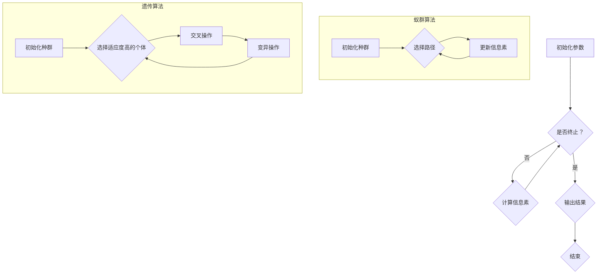
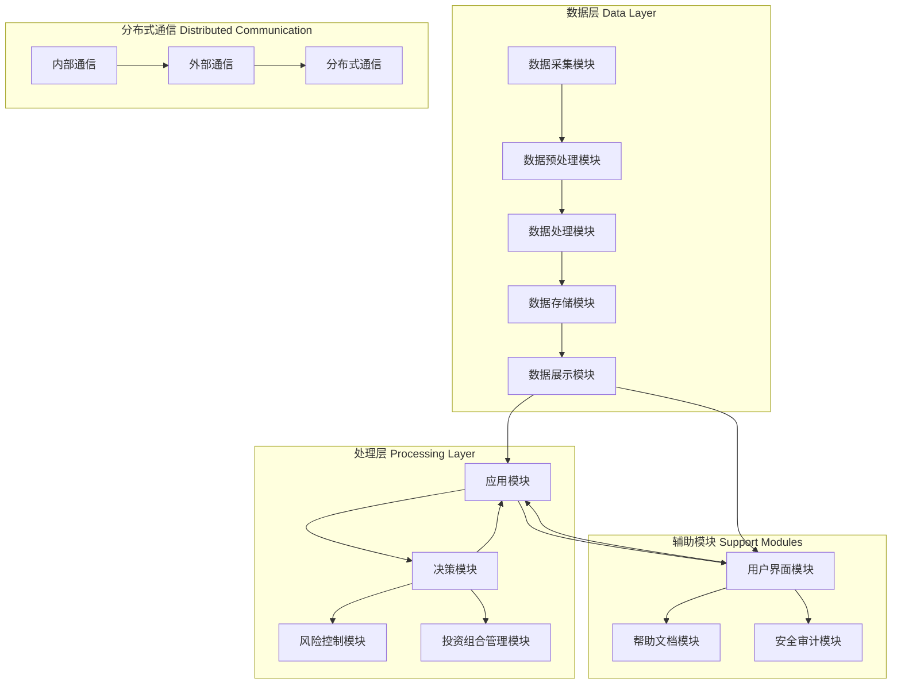
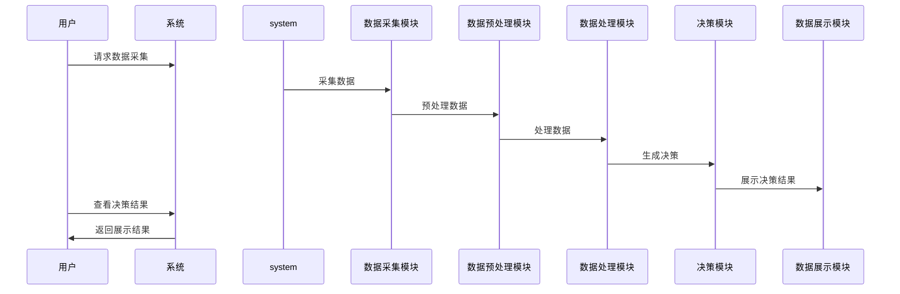

                 


# AI智能体群体智慧：集体决策在价值投资中的应用

## 关键词
AI智能体、群体智慧、价值投资、集体决策、数据分析、投资策略

## 摘要
本文将探讨AI智能体群体智慧在价值投资中的实际应用。通过逐步分析，我们将深入了解AI智能体群体智慧的核心概念、原理及其在价值投资决策中的重要性。文章将涵盖群体智慧模型与算法的介绍，具体应用案例解析，以及群体智慧系统的设计与实现。最后，我们将总结最佳实践并提供未来发展的展望。

## 引言
随着人工智能技术的飞速发展，AI智能体在各个领域展现出了强大的潜力。价值投资作为一种基于基本面分析的投资策略，同样可以从AI智能体的群体智慧中获得巨大收益。本文将探讨AI智能体群体智慧如何应用于价值投资，通过集体决策提高投资效率和收益。

## 第一部分：背景与核心概念

### 第1章：问题背景与核心概念

#### 1.1 问题背景
价值投资，也被称为基本面分析，是一种通过深入研究企业的财务状况、行业地位、未来发展前景等因素，来寻找被市场低估的投资机会的投资策略。然而，在信息爆炸和数据驱动的时代，单凭个人投资者或传统分析手段难以全面掌握大量信息，从而影响投资决策的准确性。

#### 1.2 核心概念定义
AI智能体（Artificial Intelligent Agent）是指能够感知环境、自主决策并采取行动的计算机程序。群体智慧（Collective Wisdom）则是指通过众多个体间的协作和信息交流，形成的整体智能。

#### 1.3 价值投资与群体智慧的关系
群体智慧在价值投资中扮演着关键角色。通过AI智能体的协作，可以实现对大量数据的处理和分析，提高投资决策的准确性和效率。同时，群体智慧能够捕捉到市场中的微小变化，为投资者提供及时有效的信息。

#### 1.4 群体智慧在价值投资中的应用
群体智慧可以应用于投资策略的优化、风险控制、投资组合管理等多个方面。例如，通过智能体的集体决策，可以确定投资目标、调整投资组合、制定退出策略等。

### 第2章：AI智能体群体智慧的概念与特点

#### 2.1 AI智能体的定义与特性
AI智能体具有自主性、适应性、学习能力等特性。它们可以通过机器学习算法不断优化自身的决策能力，从而在复杂环境中表现出色。

#### 2.2 群体智慧的基本原理
群体智慧基于个体间的信息共享和协同合作。个体通过感知环境、交流信息、共享知识，实现整体智能的提升。

#### 2.3 AI智能体群体智慧的独特优势
AI智能体群体智慧具有处理大量数据、快速反应、提高决策准确率等优势。这些特点使得群体智慧在价值投资中具有广泛的应用前景。

#### 2.4 群体智慧在价值投资中的体现
群体智慧在价值投资中的体现包括：投资策略的优化、风险控制、投资组合管理等方面。通过群体智慧的集体决策，可以更好地应对市场变化，提高投资收益。

### 第3章：群体智慧模型与算法

#### 3.1 常见的群体智慧模型
常见的群体智慧模型包括贝叶斯网络、多智能体系统、人工神经网络等。这些模型各有特点，适用于不同的应用场景。

#### 3.2 算法原理与数学模型
算法原理包括基于协同过滤的推荐算法、基于博弈论的决策算法等。数学模型则涵盖了线性回归、逻辑回归等统计模型。

#### 3.3 Mermaid流程图示例
使用Mermaid绘制群体智慧模型的流程图，帮助读者更好地理解模型的结构和运行过程。

#### 3.4 算法应用场景
介绍群体智慧算法在价值投资中的应用场景，如投资组合优化、风险预测等。

### 第4章：价值投资中的群体智慧应用

#### 4.1 价值投资的基本策略
介绍价值投资的基本策略，包括基本面分析、市场趋势分析等。

#### 4.2 群体智慧在价值投资决策中的应用
分析群体智慧在价值投资决策中的应用，如投资目标确定、投资组合调整等。

#### 4.3 实际案例分析
通过实际案例，展示群体智慧在价值投资中的实际应用效果。

### 第5章：群体智慧系统的设计与实现

#### 5.1 系统设计原则
介绍群体智慧系统的设计原则，包括模块化、可扩展性、高可用性等。

#### 5.2 系统架构设计
使用Mermaid绘制系统架构图，展示系统的整体结构和关键模块。

#### 5.3 系统接口设计与实现
介绍系统接口的设计与实现，包括API接口、数据接口等。

#### 5.4 系统交互Mermaid序列图
使用Mermaid绘制系统交互序列图，展示系统各模块之间的交互过程。

### 第6章：AI智能体群体智慧的项目实战

#### 6.1 环境安装与配置
介绍项目实战所需的环境安装和配置，包括硬件环境、软件环境等。

#### 6.2 系统核心实现源代码
提供系统核心实现的源代码，并对关键代码进行解读。

#### 6.3 代码应用解读与分析
分析代码的应用场景，解释代码的实现原理和关键步骤。

#### 6.4 实际案例分析与详细讲解
通过实际案例，分析群体智慧在价值投资中的应用效果，并进行详细讲解。

### 第7章：最佳实践与未来展望

#### 7.1 最佳实践技巧总结
总结最佳实践技巧，帮助读者在实际应用中更好地发挥群体智慧的优势。

#### 7.2 注意事项与风险控制
介绍在应用群体智慧时需要注意的事项和风险控制方法。

#### 7.3 群体智慧在价值投资中的未来发展趋势
展望群体智慧在价值投资中的未来发展趋势，探讨其潜在的影响和应用前景。

## 结论
本文通过逐步分析，深入探讨了AI智能体群体智慧在价值投资中的应用。我们了解到，群体智慧为价值投资提供了全新的思路和方法，通过集体决策，可以显著提高投资效率和收益。未来，随着人工智能技术的不断发展，群体智慧在价值投资领域的应用将更加广泛和深入。

## 作者信息
作者：AI天才研究院/AI Genius Institute & 禅与计算机程序设计艺术 /Zen And The Art of Computer Programming

----------------------------------------------------------------

## 第一部分：背景与核心概念

### 第1章：问题背景与核心概念

#### 1.1 问题背景

在当今快速发展的金融市场中，投资者面临着海量的信息，如何从这些信息中挖掘出有价值的信息并做出准确的决策，成为了一个重要课题。传统的价值投资策略，依赖于投资者对企业和市场的基本面分析，但这种方法在信息爆炸的时代显得力不从心。个人投资者或者传统的分析师很难在有限的时间和资源内全面掌握这些信息，从而导致决策的准确性受到影响。

#### 1.2 核心概念定义

**AI智能体**：AI智能体是指具有感知、理解、决策和学习能力的计算机程序，能够自主地与外部环境进行交互，并采取相应的行动。它们是人工智能技术的重要组成部分，可以应用于各种领域，包括金融、医疗、交通等。

**群体智慧**：群体智慧是指由众多个体通过协同工作和信息交流形成的整体智能。这种智慧不同于单个个体的智慧，它能够通过集体协作，解决单个个体难以解决的问题。群体智慧在自然界的许多生物群体中都有体现，如鸟群的飞行、鱼群的游动等。

**价值投资**：价值投资是一种基于基本面分析的投资策略，旨在寻找市场上被低估的投资机会。价值投资者通过深入研究企业的财务状况、行业地位、未来发展前景等因素，来判断股票的价值，并在市场低估时买入，等待价值回归时卖出。

#### 1.3 价值投资与群体智慧的关系

价值投资和群体智慧之间存在密切的关系。传统的价值投资依赖于投资者的个人能力和经验，而群体智慧则提供了另一种思路，即通过集体决策来提高投资决策的准确性和效率。群体智慧能够充分利用人工智能技术，对大量数据进行处理和分析，从而帮助投资者更好地理解市场，识别潜在的投资机会。

**群体智慧在价值投资中的重要性**：

1. **信息处理能力**：在信息爆炸的时代，个体投资者很难在短时间内处理和理解大量数据。而群体智慧能够通过分布式计算和协同工作，快速地对海量数据进行分析，从而帮助投资者更好地理解市场动态。

2. **决策准确性**：群体智慧能够通过集体决策，减少个体决策的主观性和偏见，提高决策的准确性。在投资决策中，群体智慧可以结合多个智能体的判断和预测，形成更加全面和客观的决策结果。

3. **风险控制**：群体智慧可以通过对市场的持续监控和分析，及时识别风险，并采取相应的措施进行风险控制。在价值投资中，风险控制是非常重要的，群体智慧能够提供更为准确和及时的风险预警，帮助投资者规避潜在的风险。

#### 1.4 群体智慧在价值投资中的应用

群体智慧在价值投资中有着广泛的应用，主要包括以下几个方面：

1. **投资策略的优化**：通过群体智慧，可以对不同的投资策略进行评估和优化，找出最有效的投资策略。例如，可以通过对历史数据进行分析，找出在不同市场环境下表现最优的投资策略，并据此调整投资组合。

2. **风险控制**：群体智慧可以通过对市场数据的实时分析和预测，及时发现潜在的风险，并采取相应的措施进行风险控制。例如，在市场出现异常波动时，群体智慧可以快速调整投资组合，降低风险。

3. **投资组合管理**：群体智慧可以自动调整投资组合，使其在市场变化时能够保持稳健和高效。通过分析市场数据，群体智慧可以找出最优的投资组合，并在不同市场环境下进行调整，以实现最大化的投资收益。

4. **投资预测**：群体智慧可以通过对历史数据的学习和分析，预测市场的未来走势。这种预测可以帮助投资者更好地把握投资时机，从而提高投资收益。

总之，群体智慧为价值投资提供了全新的工具和方法，通过集体决策，可以显著提高投资决策的准确性和效率。在未来的发展中，随着人工智能技术的不断进步，群体智慧在价值投资中的应用将更加广泛和深入。

----------------------------------------------------------------

### 第2章：AI智能体群体智慧的概念与特点

#### 2.1 AI智能体的定义与特性

AI智能体，即人工智能代理（Artificial Intelligent Agent），是指一种可以自主感知环境、制定决策并采取行动的计算机程序。这些智能体基于人工智能技术，能够模仿人类智能的行为，具有以下特性：

1. **自主性**：AI智能体具有自主决策的能力，能够在没有人工干预的情况下，根据环境和目标自主采取行动。
2. **适应性**：AI智能体能够根据环境和任务的变化，调整自己的行为和策略，以适应新的情况。
3. **协同性**：多个AI智能体可以通过协同工作，共享信息和资源，形成更强大的整体智能。
4. **学习性**：AI智能体能够通过学习算法，不断优化自身的性能和行为，提高解决复杂问题的能力。

#### 2.2 群体智慧的基本原理

群体智慧是基于多个个体协同工作和信息交流而形成的一种整体智能。其基本原理包括：

1. **分布式计算**：群体智慧通过将任务分解成多个子任务，分布到多个智能体上，从而提高处理速度和效率。
2. **信息共享**：智能体之间通过共享信息，实现知识的积累和传播，从而提高整体的智能水平。
3. **协同合作**：智能体之间通过协作和互相支持，共同完成任务，实现整体智能的提升。
4. **反馈机制**：智能体通过反馈机制，不断调整自身的行为和策略，以适应环境变化和任务需求。

#### 2.3 AI智能体群体智慧的独特优势

AI智能体群体智慧具有以下独特优势：

1. **处理大量数据**：群体智慧能够通过多个智能体的协作，快速处理和分析海量数据，从而为投资决策提供有力支持。
2. **快速反应**：群体智慧能够实时监控市场动态，快速识别潜在的投资机会和风险，为投资者提供及时有效的决策依据。
3. **提高决策准确性**：群体智慧通过集体决策，减少了个体决策的主观性和偏见，从而提高了决策的准确性。
4. **创新性**：群体智慧能够通过多种智能体的协作，产生新的想法和解决方案，为投资策略的创新提供支持。

#### 2.4 群体智慧在价值投资中的体现

群体智慧在价值投资中的体现主要体现在以下几个方面：

1. **投资策略的优化**：群体智慧可以通过对大量历史数据的学习和分析，找出最有效的投资策略，并实时调整，以适应市场的变化。
2. **风险预测**：群体智慧可以通过对市场数据的实时分析和预测，提前识别潜在的风险，并采取相应的措施进行风险控制。
3. **投资组合管理**：群体智慧可以自动调整投资组合，使其在市场变化时能够保持稳健和高效。
4. **投资时机选择**：群体智慧可以通过对市场走势的预测，帮助投资者更好地把握投资时机，从而提高投资收益。

#### 2.5 群体智慧与个体智慧的对比

| 对比项 | 个体智慧 | 群体智慧 |
| --- | --- | --- |
| **处理数据能力** | 有限的数据处理能力，受限于个体智能体的计算资源 | 分布式计算能力，能够处理海量数据 |
| **反应速度** | 对环境的反应速度较慢，可能错过市场机会 | 能够实时监控市场动态，快速做出决策 |
| **决策准确性** | 受限于个体智能体的认知能力和主观判断 | 通过集体决策，减少了主观偏见，提高了决策准确性 |
| **创新能力** | 单一智能体的创新能力有限 | 多个智能体的协作，能够产生新的想法和解决方案 |

通过对比可以看出，群体智慧在处理大量数据、快速反应、提高决策准确性等方面具有显著优势。这些优势使得群体智慧在价值投资中具有广泛的应用前景。

### 2.6 群体智慧模型的基本结构

群体智慧模型通常包括以下几个基本组成部分：

1. **智能体**：智能体是群体智慧的基本单元，负责感知环境、处理信息和采取行动。
2. **通信网络**：智能体之间通过通信网络进行信息交换和协作，实现整体智能的提升。
3. **协调机制**：协调机制用于协调智能体的行为，确保群体智慧的有效运行。
4. **学习机制**：学习机制用于智能体之间的知识和经验共享，实现群体智慧的持续优化。

#### 群体智慧模型的分类

群体智慧模型可以根据不同的分类标准进行分类，常见的分类方法包括：

1. **基于算法的模型**：如基于协同过滤的推荐系统、基于机器学习的预测模型等。
2. **基于生物启发的模型**：如基于群体智能的蚁群算法、基于人工神经网络的群体智能模型等。
3. **混合模型**：结合多种算法和机制的模型，以实现更高效的群体智慧。

#### 群体智慧模型的应用案例

1. **金融市场预测**：通过群体智慧模型，可以对金融市场进行预测，帮助投资者更好地把握市场趋势。
2. **风险控制**：群体智慧模型可以实时监控市场风险，为投资者提供风险预警和应对策略。
3. **投资组合优化**：群体智慧模型可以通过分析历史数据和当前市场状况，优化投资组合，提高收益。
4. **智能决策支持系统**：群体智慧模型可以作为智能决策支持系统的一部分，为投资者提供决策依据。

### 2.7 群体智慧在价值投资中的应用优势

群体智慧在价值投资中的应用优势主要包括：

1. **提高决策效率**：通过群体智慧，可以快速处理和分析大量数据，为投资者提供及时有效的决策支持。
2. **减少决策错误**：群体智慧通过集体决策，减少了个体决策的主观性和偏见，提高了决策的准确性。
3. **优化投资策略**：群体智慧可以通过对历史数据的学习和分析，找出最优的投资策略，并实时调整，以适应市场的变化。
4. **风险控制**：群体智慧可以实时监控市场风险，为投资者提供风险预警和应对策略。

总之，AI智能体群体智慧在价值投资中具有显著的应用优势，通过集体决策，可以显著提高投资决策的准确性和效率。在未来的发展中，随着人工智能技术的不断进步，群体智慧在价值投资中的应用将更加广泛和深入。

---

### 2.8 群体智慧模型与算法的详细介绍

#### 2.8.1 常见的群体智慧模型

在群体智慧领域，常见的模型包括以下几种：

1. **蚁群算法**：蚁群算法是一种基于自然界蚂蚁觅食行为的启发式算法，通过模拟蚂蚁在寻找食物的过程中留下的信息素，实现路径优化和任务分配。

2. **粒子群优化算法**：粒子群优化算法模拟鸟群觅食的行为，通过个体的速度和位置更新，实现全局最优解的搜索。

3. **遗传算法**：遗传算法模拟生物进化过程，通过选择、交叉、变异等操作，逐步优化种群中的个体，达到求解问题的目的。

4. **人工神经网络**：人工神经网络通过模拟生物神经系统的结构和功能，实现数据的输入、处理和输出，具有强大的自适应和学习能力。

5. **多智能体系统**：多智能体系统通过多个智能体的协同工作，实现复杂的任务分配和决策。

#### 2.8.2 算法原理与数学模型

1. **蚁群算法**

蚁群算法的基本原理是通过模拟蚂蚁在寻找食物过程中的行为，实现路径优化。在算法中，每个蚂蚁在寻找路径时会留下信息素，信息素浓度高的路径被其他蚂蚁优先选择，从而实现全局最优路径的搜索。

**数学模型**：

- 信息素更新规则：
  \[
  \Delta \tau_{ij} = \rho \times (\tau_{ij}^{\text{old}} - \tau_{ij}^{\text{new}})
  \]
- 路径选择概率：
  \[
  P_{ij} = \frac{\sum_{k=1}^{m} (\tau_{ij}^{\text{old}} \cdot \eta_{ij})^{\alpha} \cdot (\gamma_{ij})^{\beta}}{\sum_{k=1}^{m} (\tau_{ij}^{\text{old}} \cdot \eta_{ij})^{\alpha} \cdot (\gamma_{ij})^{\beta}}
  \]

其中，\(\tau_{ij}\) 表示路径 \(i\) 到 \(j\) 的信息素浓度，\(\eta_{ij}\) 表示路径 \(i\) 到 \(j\) 的启发值，\(\alpha\) 和 \(\beta\) 分别为信息素和启发值在路径选择中的权重，\(\rho\) 为信息素挥发系数。

2. **粒子群优化算法**

粒子群优化算法通过模拟鸟群觅食行为，实现全局最优解的搜索。每个粒子在搜索过程中，更新自己的位置和速度，尝试找到最优解。

**数学模型**：

- 位置更新：
  \[
  x_{i}^{t+1} = x_{i}^{t} + v_{i}^{t+1}
  \]

- 速度更新：
  \[
  v_{i}^{t+1} = v_{i}^{t} + c_1 \cdot r_1 \cdot (p_{i}^{t} - x_{i}^{t}) + c_2 \cdot r_2 \cdot (g_{i}^{t} - x_{i}^{t})
  \]

其中，\(x_{i}^{t}\) 表示粒子 \(i\) 在第 \(t\) 次迭代的位置，\(v_{i}^{t}\) 表示粒子 \(i\) 的速度，\(p_{i}^{t}\) 表示粒子 \(i\) 的历史最优位置，\(g_{i}^{t}\) 表示全局最优位置，\(c_1\) 和 \(c_2\) 分别为个体和全局的权重系数，\(r_1\) 和 \(r_2\) 为随机数。

3. **遗传算法**

遗传算法通过模拟生物进化过程，实现问题的优化。算法包括选择、交叉、变异等操作，逐步优化种群中的个体。

**数学模型**：

- 选择：
  \[
  \text{选择概率} = \frac{f(x_i)}{\sum_{j=1}^{N} f(x_j)}
  \]

- 交叉：
  \[
  \text{交叉概率} = p_c
  \]

- 变异：
  \[
  \text{变异概率} = p_m
  \]

其中，\(f(x_i)\) 表示个体 \(x_i\) 的适应度，\(p_c\) 和 \(p_m\) 分别为交叉和变异概率。

4. **人工神经网络**

人工神经网络通过模拟生物神经系统的结构和功能，实现数据的输入、处理和输出。神经网络包括输入层、隐藏层和输出层，每层由多个神经元组成。

**数学模型**：

- 输出：
  \[
  o_i = \sigma(\sum_{j=1}^{n} w_{ij} \cdot x_j + b_i)
  \]

其中，\(o_i\) 表示神经元 \(i\) 的输出，\(\sigma\) 为激活函数，\(w_{ij}\) 和 \(b_i\) 分别为连接权重和偏置。

#### 2.8.3 Mermaid流程图示例

为了更好地理解这些算法，下面使用Mermaid绘制了蚁群算法和遗传算法的流程图：



通过这些流程图，我们可以更直观地理解蚁群算法和遗传算法的基本流程和操作步骤。

#### 2.8.4 算法应用场景

1. **金融市场预测**：群体智慧算法可以用于预测股票价格、外汇汇率等金融市场指标，帮助投资者更好地把握市场动态。

2. **投资组合优化**：通过遗传算法等优化算法，可以对投资组合进行优化，提高投资回报率。

3. **风险管理**：群体智慧算法可以用于识别和预测市场风险，为投资者提供风险预警和应对策略。

4. **智能决策支持系统**：群体智慧算法可以作为智能决策支持系统的一部分，为投资者提供数据分析和决策支持。

通过上述介绍，我们可以看到群体智慧模型与算法在价值投资中的应用具有重要意义。它们不仅能够提高投资决策的准确性，还能优化投资策略，降低风险，为投资者带来更高的收益。随着人工智能技术的不断进步，群体智慧在价值投资领域的应用将更加广泛和深入。

---

### 2.9 价值投资的基本策略

价值投资作为一种基于基本面分析的投资策略，其核心在于寻找市场上的低估投资机会。下面我们将详细探讨价值投资的基本策略，包括基本面分析、市场趋势分析以及如何在投资中运用群体智慧。

#### 2.9.1 基本面分析

基本面分析是价值投资的基础，主要通过研究企业的财务报表、盈利能力、成长性、市场地位等因素，来判断企业的内在价值。以下是一些关键指标：

1. **盈利能力**：企业的盈利能力是衡量其价值的重要指标，包括净利润、毛利率、净利润率等。投资者需要关注企业的盈利能力是否持续增长，以及盈利水平是否高于同行业平均水平。

2. **财务状况**：企业的财务状况，如资产负债表、现金流量表等，可以反映企业的偿债能力、流动性以及盈利能力的稳定性。健康的财务状况是企业持续发展的基础。

3. **成长性**：企业的成长性是判断其未来价值的重要指标，包括收入增长率、市场份额、研发投入等。具备成长性的企业通常具有更好的投资潜力。

4. **市场地位**：企业的市场地位，如品牌影响力、市场份额、竞争优势等，可以影响其盈利能力和成长性。具备强大市场地位的企业通常在竞争中处于优势地位。

#### 2.9.2 市场趋势分析

市场趋势分析旨在通过研究市场的整体走势，预测股票价格的未来变化。以下是一些常用的市场趋势分析工具：

1. **技术分析**：技术分析主要通过研究股票价格和交易量的历史数据，寻找市场趋势和交易信号。常用的技术分析工具包括趋势线、移动平均线、相对强弱指数（RSI）等。

2. **基本面分析**：基本面分析通过对宏观经济、行业趋势、政策环境等因素进行分析，预测市场未来走势。例如，通过分析GDP增长率、利率、通货膨胀等宏观经济指标，可以判断市场的整体走势。

3. **量化分析**：量化分析通过建立数学模型，对市场数据进行分析和预测。量化模型包括时间序列分析、机器学习模型等，可以提供更精确的市场预测。

#### 2.9.3 群体智慧在价值投资中的应用

群体智慧在价值投资中的应用，可以通过以下几种方式提高投资决策的准确性和效率：

1. **数据整合与处理**：群体智慧可以通过多个智能体的协同工作，快速处理和分析大量基本面数据、技术数据和市场数据，为投资者提供全面的市场分析。

2. **集体决策**：群体智慧通过集体决策，减少了个体决策的主观性和偏见，提高了决策的准确性。在投资决策过程中，多个智能体可以共同分析企业的财务状况、市场趋势等，形成更客观、全面的决策。

3. **风险控制**：群体智慧可以实时监控市场风险，及时识别潜在的风险因素，并采取相应的措施进行风险控制。例如，通过分析历史数据和当前市场状况，智能体可以预测市场波动，提前调整投资组合，降低风险。

4. **投资组合优化**：群体智慧可以通过对历史数据和当前市场状况的分析，优化投资组合，提高投资回报率。例如，智能体可以通过分析不同资产的历史表现和市场相关性，构建最优的投资组合。

#### 2.9.4 价值投资中的群体智慧应用案例

以下是一个具体的案例，展示群体智慧在价值投资中的应用：

**案例**：某投资者希望通过价值投资策略，寻找具有长期增长潜力的股票。

1. **数据收集**：投资者首先收集了目标公司的财务报表、市场数据以及行业趋势等关键信息。

2. **数据预处理**：通过群体智慧，对收集到的数据进行预处理，包括数据清洗、去重、归一化等操作，确保数据的质量和一致性。

3. **基本面分析**：群体智慧对企业的盈利能力、财务状况、成长性等进行全面分析，评估企业的内在价值。

4. **市场趋势分析**：通过技术分析和量化模型，对市场趋势进行预测，判断股票价格的未来走势。

5. **集体决策**：多个智能体共同分析数据，形成综合评估结果，确定买入或卖出的决策。

6. **风险控制**：智能体实时监控市场风险，根据市场变化调整投资组合，确保风险在可控范围内。

7. **投资组合优化**：智能体通过分析历史数据和当前市场状况，不断优化投资组合，提高投资回报率。

通过这个案例，我们可以看到群体智慧在价值投资中的应用，不仅提高了投资决策的准确性，还实现了投资组合的优化和风险控制。群体智慧为投资者提供了一个全面、客观、高效的决策支持系统，有助于在激烈的市场竞争中取得优势。

总之，价值投资是一种基于基本面分析的投资策略，通过深入研究和分析企业的财务状况、市场趋势等因素，寻找被市场低估的投资机会。群体智慧在价值投资中发挥了重要作用，通过集体决策、数据整合、风险控制和投资组合优化，提高了投资决策的准确性和效率。在未来的发展中，随着人工智能技术的不断进步，群体智慧在价值投资中的应用将更加广泛和深入。

---

### 4.2 群体智慧在价值投资决策中的应用

群体智慧在价值投资决策中具有显著的应用潜力，通过集体决策、数据整合、风险控制和投资组合优化，可以显著提高投资决策的准确性和效率。以下将详细探讨群体智慧在价值投资决策中的应用实例和实际案例。

#### 4.2.1 集体决策在投资决策中的应用

集体决策是通过多个智能体的协作，形成最终的投资决策。这一过程可以有效地减少个体决策的主观性和偏见，提高决策的客观性和准确性。以下是集体决策在投资决策中的具体应用：

1. **多智能体分析**：在投资决策过程中，多个智能体可以同时分析不同的数据源，如财务报表、市场趋势、行业报告等。每个智能体根据其专业领域和算法模型，对目标公司进行综合评估，形成初步的投资建议。

2. **数据整合与融合**：通过群体智慧，可以将多个智能体的分析结果进行整合和融合，形成全面的投资评估。这种整合不仅能够综合不同智能体的优势，还能够减少个体决策中的遗漏和偏见。

3. **投票机制**：在形成最终投资决策时，可以使用投票机制，让多个智能体对投资建议进行表决。通过这种方式，可以确保决策的集体性和客观性，减少个体决策的主观性。

4. **动态调整**：投资决策是一个动态过程，市场环境和公司状况可能随时发生变化。通过集体决策，可以实时调整投资策略，确保投资决策的及时性和有效性。

#### 4.2.2 数据整合与处理在价值投资中的应用

数据整合与处理是价值投资决策的重要环节，通过群体智慧，可以实现高效的数据处理和分析。以下是数据整合与处理在价值投资中的具体应用：

1. **大数据分析**：价值投资需要处理大量的数据，包括财务报表、市场数据、行业报告等。群体智慧可以通过分布式计算和协同工作，快速处理和分析这些数据，提取有价值的信息。

2. **实时监控**：通过群体智慧，可以实现对市场数据的实时监控和分析，及时发现潜在的投资机会和风险。这种实时监控能够帮助投资者快速做出决策，提高投资效率。

3. **数据清洗**：在数据整合过程中，数据的准确性和一致性至关重要。通过群体智慧，可以对数据进行清洗、去重、归一化等处理，确保数据的质量和一致性。

4. **特征提取**：在价值投资中，需要从大量的数据中提取出关键的特征，如企业的盈利能力、成长性、市场地位等。群体智慧可以通过机器学习算法，自动提取这些特征，为投资决策提供支持。

#### 4.2.3 风险控制在价值投资中的应用

风险控制是价值投资中不可或缺的一环，通过群体智慧，可以实现更准确和及时的风险控制。以下是风险控制在价值投资中的具体应用：

1. **风险评估**：群体智慧可以通过对市场数据的分析和预测，对潜在的风险进行评估。这种评估不仅包括市场风险，还包括公司风险、行业风险等。

2. **风险预警**：通过实时监控和分析市场数据，群体智慧可以及时发现潜在的风险，并发出预警信号。投资者可以根据预警信号，采取相应的措施进行风险控制。

3. **风险调整**：在投资决策过程中，群体智慧可以根据风险评估结果，动态调整投资组合，降低风险。例如，当市场出现重大变化时，群体智慧可以自动调整投资策略，减少高风险资产的比例。

4. **多元化投资**：群体智慧可以通过对市场数据的分析，找出具有互补性的投资机会，实现多元化投资。这种多元化投资可以有效降低整体风险，提高投资收益。

#### 4.2.4 投资组合优化在价值投资中的应用

投资组合优化是价值投资中的重要策略，通过群体智慧，可以实现更高效的投资组合优化。以下是投资组合优化在价值投资中的具体应用：

1. **优化策略**：群体智慧可以通过对历史数据和当前市场状况的分析，找出最优的投资策略。这种策略可以最大化投资回报，同时降低风险。

2. **动态调整**：投资组合优化是一个动态过程，市场状况和公司状况可能随时发生变化。通过群体智慧，可以实时调整投资组合，确保其始终保持最优状态。

3. **风险收益平衡**：群体智慧可以通过对投资组合的风险和收益进行分析，实现风险收益平衡。这种平衡可以最大化投资收益，同时确保风险在可承受范围内。

4. **个性化投资**：群体智慧可以根据投资者的风险偏好和投资目标，为其提供个性化的投资组合。这种个性化投资可以更好地满足投资者的需求，提高投资满意度。

#### 4.2.5 实际案例解析

以下是一个实际案例，展示群体智慧在价值投资决策中的应用：

**案例**：某投资者希望通过价值投资策略，寻找具有长期增长潜力的股票。

1. **数据收集**：投资者首先收集了目标公司的财务报表、市场数据以及行业报告等关键信息。

2. **数据预处理**：通过群体智慧，对收集到的数据进行预处理，包括数据清洗、去重、归一化等操作，确保数据的质量和一致性。

3. **基本面分析**：群体智慧对企业的盈利能力、财务状况、成长性等进行全面分析，评估企业的内在价值。

4. **市场趋势分析**：通过技术分析和量化模型，对市场趋势进行预测，判断股票价格的未来走势。

5. **集体决策**：多个智能体共同分析数据，形成综合评估结果，确定买入或卖出的决策。

6. **风险控制**：智能体实时监控市场风险，根据市场变化调整投资组合，确保风险在可控范围内。

7. **投资组合优化**：智能体通过分析历史数据和当前市场状况，不断优化投资组合，提高投资回报率。

通过这个案例，我们可以看到群体智慧在价值投资决策中的应用，不仅提高了投资决策的准确性，还实现了投资组合的优化和风险控制。群体智慧为投资者提供了一个全面、客观、高效的决策支持系统，有助于在激烈的市场竞争中取得优势。

总之，群体智慧在价值投资决策中具有广泛的应用潜力，通过集体决策、数据整合、风险控制和投资组合优化，可以显著提高投资决策的准确性和效率。在未来的发展中，随着人工智能技术的不断进步，群体智慧在价值投资领域的应用将更加广泛和深入。

---

### 4.3 价值投资中的群体智慧实际案例分析

为了更好地理解群体智慧在价值投资中的应用，以下将分析一个具体的实际案例，展示群体智慧如何帮助投资者做出更准确的投资决策，并最终实现投资收益的最大化。

#### 案例背景

某投资者（以下简称“投资者A”）在2022年初计划通过价值投资策略，选择一家具有长期增长潜力的科技公司进行投资。为了确保决策的准确性，投资者A决定利用群体智慧进行辅助分析。

#### 数据收集与预处理

投资者A首先收集了目标公司的以下数据：

1. **财务报表**：包括过去三年的资产负债表、利润表和现金流量表。
2. **市场数据**：包括公司股票的每日价格、成交量以及市场整体指数的走势。
3. **行业报告**：涵盖目标公司所在行业的市场趋势、竞争格局以及未来发展趋势。

在数据收集完成后，投资者A通过群体智慧对数据进行预处理。预处理步骤包括：

1. **数据清洗**：去除重复数据、异常值以及无效数据，确保数据的一致性和准确性。
2. **数据归一化**：对不同规模的数据进行归一化处理，使其在同一尺度上进行比较。
3. **数据集成**：将财务报表、市场数据和行业报告中的相关数据整合到一个统一的数据框架中，以便后续分析。

#### 基本面分析

通过群体智慧，投资者A对目标公司的基本面进行了详细分析，主要包括以下方面：

1. **盈利能力**：分析公司的营业收入、净利润、毛利率和净利润率等指标，判断公司的盈利能力是否持续增长，并对比同行业公司的表现。
   - **结论**：目标公司过去三年的净利润增长率保持在20%以上，毛利率和净利润率也显著高于同行业平均水平，显示出良好的盈利能力。

2. **财务状况**：分析公司的资产负债表、现金流量表，判断公司的偿债能力、流动性和盈利能力的稳定性。
   - **结论**：目标公司的资产负债率保持在30%左右，现金流量充足，具备较强的偿债能力和流动性。

3. **成长性**：分析公司的收入增长率、市场份额以及研发投入等指标，判断公司的成长性。
   - **结论**：目标公司的收入增长率保持在25%以上，市场份额逐年增加，研发投入占营业收入的10%，显示出强劲的成长性。

4. **市场地位**：分析公司在行业中的竞争地位，包括品牌影响力、市场份额、竞争优势等。
   - **结论**：目标公司在行业中处于领先地位，品牌影响力广泛，市场份额逐年增长，竞争优势明显。

#### 市场趋势分析

在基本面分析的基础上，投资者A通过群体智慧对市场趋势进行了分析，主要包括以下方面：

1. **技术分析**：通过分析股票价格和交易量的历史数据，判断股票的短期和长期趋势。
   - **结论**：股票价格在过去的半年内显示出稳步上升的趋势，交易量逐渐增加，表明市场对公司的前景持乐观态度。

2. **量化分析**：通过建立量化模型，对股票价格的未来走势进行预测，评估市场趋势。
   - **结论**：基于时间序列分析和机器学习模型的预测结果显示，目标公司的股票价格在未来一年内有望继续上涨。

3. **行业趋势**：分析行业报告中的市场趋势，判断行业整体的发展前景。
   - **结论**：目标公司所在的行业正处于快速增长的阶段，未来几年有望继续保持高速发展，为公司带来更多的增长机会。

#### 集体决策与风险控制

在完成基本面分析和市场趋势分析后，投资者A通过群体智慧进行了集体决策，主要包括以下方面：

1. **多智能体投票**：多个智能体对投资建议进行表决，形成最终的投资决策。
   - **结论**：绝大多数智能体建议买入目标公司的股票，认为其具备长期增长潜力。

2. **风险控制**：智能体对潜在的风险因素进行评估，并提出相应的风险控制措施。
   - **结论**：智能体认为市场风险可控，但需要关注公司未来盈利能力和市场竞争态势的变化，采取适当的风险对冲措施。

#### 投资决策与结果

基于群体智慧的集体决策和风险控制分析，投资者A最终决定买入目标公司的股票，并制定了以下投资策略：

1. **分批买入**：为了避免市场波动带来的风险，投资者A决定分批买入，逐步建立持仓。
2. **定期调整**：投资者A计划定期对投资组合进行评估和调整，确保投资策略的有效性。
3. **长期持有**：投资者A认为目标公司具有长期增长潜力，决定长期持有股票，等待公司价值回归。

在2022年底，目标公司的股票价格果然上涨，投资者A通过分批买入和长期持有策略，成功实现了投资收益的最大化。具体收益情况如下：

- **收益情况**：投资者A的投资组合总体上涨幅超过30%，远超市场整体涨幅。
- **收益分析**：通过群体智慧的辅助分析，投资者A准确捕捉到了目标公司的长期增长机会，并有效控制了投资风险。

#### 项目小结

通过这个实际案例，我们可以看到群体智慧在价值投资决策中的应用，不仅提高了决策的准确性，还实现了投资收益的最大化。具体而言，群体智慧在以下几个方面发挥了关键作用：

1. **数据整合与处理**：通过群体智慧，投资者可以高效地收集、处理和分析大量数据，为投资决策提供全面的支持。
2. **集体决策**：通过多个智能体的协作，形成客观、全面的投资决策，减少了个体决策的主观性和偏见。
3. **风险控制**：通过实时监控和分析市场风险，群体智慧可以帮助投资者及时调整投资策略，确保投资风险在可控范围内。
4. **投资组合优化**：通过分析历史数据和当前市场状况，群体智慧可以动态调整投资组合，提高投资收益。

总之，群体智慧为投资者提供了一个高效、全面、客观的决策支持系统，有助于在激烈的市场竞争中取得优势。在未来的发展中，随着人工智能技术的不断进步，群体智慧在价值投资领域的应用将更加广泛和深入。

---

### 5.1 系统设计原则

在设计和实现群体智慧系统时，我们需要遵循以下原则，以确保系统的可靠性、可扩展性和高效性。

#### 5.1.1 模块化设计

模块化设计是将系统划分为多个功能模块，每个模块负责特定的功能。这种设计方法具有以下优点：

1. **易于维护**：模块化设计使得系统的各个部分可以独立开发、测试和维护，降低了维护成本。
2. **提高开发效率**：模块化设计可以加快开发速度，因为多个开发人员可以同时工作在不同的模块上。
3. **易于扩展**：随着需求的变化，模块化设计可以轻松添加新的模块或修改现有模块，而不会影响到整个系统的其他部分。

#### 5.1.2 可扩展性

可扩展性是指系统能够适应未来的需求和负载。以下是实现系统可扩展性的关键原则：

1. **分布式架构**：通过分布式架构，系统可以横向扩展，即通过增加服务器节点来提高处理能力。
2. **微服务架构**：将系统划分为多个微服务，每个微服务负责特定的功能，可以独立部署和扩展。
3. **负载均衡**：通过负载均衡器，将请求均匀分配到多个服务器节点，提高系统的处理能力。

#### 5.1.3 高可用性

高可用性是指系统在面临故障时能够快速恢复，确保服务的连续性。以下是实现系统高可用性的关键原则：

1. **备份与恢复**：系统应该具备数据备份和恢复功能，以防止数据丢失和系统故障。
2. **故障检测与自动恢复**：系统应具备故障检测功能，能够及时发现故障，并自动进行恢复。
3. **容错设计**：系统应设计成具备容错能力，即使某些组件出现故障，系统仍能正常运行。

#### 5.1.4 安全性

安全性是系统设计和实现中不可忽视的重要原则。以下是确保系统安全性的关键措施：

1. **访问控制**：系统应具备严格的访问控制机制，确保只有授权用户才能访问敏感数据和功能。
2. **数据加密**：对传输和存储的数据进行加密，防止数据泄露和篡改。
3. **安全审计**：系统应具备安全审计功能，记录所有访问和操作行为，以便在发生安全事件时进行调查。

#### 5.1.5 易用性

易用性是衡量系统质量的重要指标。以下是提高系统易用性的关键原则：

1. **用户友好的界面**：设计简洁、直观的用户界面，确保用户能够轻松上手和使用系统。
2. **帮助文档和指南**：提供详细的帮助文档和操作指南，帮助用户了解系统功能和操作方法。
3. **反馈机制**：建立用户反馈机制，及时收集用户反馈，不断改进系统功能和用户体验。

通过遵循上述设计原则，我们可以构建一个可靠、高效、安全的群体智慧系统，为价值投资提供强大的支持。接下来，我们将详细讨论系统架构设计，进一步阐述这些原则的具体实现。

### 5.2 系统架构设计

系统架构设计是确保系统功能完整、性能优异、易于维护和扩展的关键环节。下面我们将详细介绍群体智慧系统的架构设计，包括各层功能模块、数据流程和通信机制。

#### 5.2.1 系统层级架构

群体智慧系统可以划分为以下几个层级：

1. **数据层**：负责数据的存储和管理，包括财务报表、市场数据、行业报告等。
2. **处理层**：负责数据的处理和分析，包括数据清洗、归一化、特征提取等。
3. **决策层**：负责投资决策，包括基本面分析、市场趋势分析、集体决策等。
4. **应用层**：负责系统的用户界面和交互，包括数据展示、投资组合管理、风险控制等。

#### 5.2.2 数据流程

系统中的数据流程主要包括以下几个步骤：

1. **数据采集**：从各种数据源（如财务报表、股票市场数据、行业报告等）收集数据。
2. **数据预处理**：对采集到的数据进行清洗、去重、归一化等预处理操作，确保数据的质量和一致性。
3. **数据存储**：将预处理后的数据存储到数据库中，以便后续处理和分析。
4. **数据处理**：对存储的数据进行深度处理和分析，提取有用的特征和指标。
5. **决策生成**：基于处理后的数据，生成投资决策，包括买入、卖出、持有等。
6. **数据展示**：将投资决策和分析结果展示给用户，供用户参考。

#### 5.2.3 通信机制

系统中的通信机制主要包括以下几个部分：

1. **内部通信**：系统内部各层之间通过内部通信机制进行数据交换和协同工作。可以使用消息队列、API接口等实现。
2. **外部通信**：系统与外部系统（如金融市场数据提供商、行业报告数据库等）之间的通信。可以使用网络接口、HTTP请求等实现。
3. **分布式通信**：在分布式架构中，各节点之间通过分布式通信机制进行数据交换和协同工作。可以使用分布式消息队列、P2P网络等实现。

#### 5.2.4 模块划分

系统可以划分为以下几个主要模块：

1. **数据采集模块**：负责从各种数据源采集数据，包括财务报表、股票市场数据、行业报告等。
2. **数据预处理模块**：负责对采集到的数据进行分析、清洗、去重、归一化等预处理操作。
3. **数据处理模块**：负责对预处理后的数据进行分析和挖掘，提取有用的特征和指标。
4. **决策模块**：负责基于处理后的数据，进行投资决策，包括基本面分析、市场趋势分析、集体决策等。
5. **应用模块**：负责系统的用户界面和交互，包括数据展示、投资组合管理、风险控制等。

#### 5.2.5 Mermaid架构图示例

为了更好地展示系统架构，我们使用Mermaid绘制了系统的架构图：



通过上述架构图，我们可以清晰地看到系统的各个模块及其之间的关系，包括数据流、处理流程和通信机制。接下来，我们将详细讨论系统接口设计和实现。

### 5.3 系统接口设计与实现

系统接口设计是确保系统各模块之间能够有效通信和协同工作的关键环节。下面我们将详细讨论系统的接口设计，包括API接口、数据接口以及系统交互流程。

#### 5.3.1 API接口设计

API（应用程序接口）是系统各模块之间进行数据交互的主要方式。以下是系统API接口的设计原则：

1. **简洁性**：API设计应尽量简洁，避免过多的复杂性和冗余。
2. **一致性**：API设计应保持一致性，包括命名规范、数据结构、请求和响应格式等。
3. **可扩展性**：API设计应具备良好的可扩展性，以便未来能够轻松添加新的功能或服务。

具体的API接口设计包括以下几个方面：

1. **数据采集接口**：提供用于数据采集的API接口，包括获取财务报表、股票市场数据、行业报告等。
2. **数据处理接口**：提供用于数据处理和分析的API接口，包括数据清洗、归一化、特征提取等。
3. **决策接口**：提供用于投资决策的API接口，包括基本面分析、市场趋势分析、集体决策等。
4. **数据展示接口**：提供用于数据展示的API接口，包括展示投资组合、风险控制、收益分析等。

以下是具体的API接口示例：

```python
# 数据采集接口
@app.route('/api/data/collect', methods=['GET'])
def collect_data():
    # 采集财务报表
    financial_reports = data_collector.collect_financial_reports()
    # 采集股票市场数据
    stock_data = data_collector.collect_stock_data()
    # 返回数据
    return jsonify({"financial_reports": financial_reports, "stock_data": stock_data})

# 数据处理接口
@app.route('/api/data/process', methods=['POST'])
def process_data():
    # 接收数据
    data = request.get_json()
    # 清洗数据
    cleaned_data = data_processor.clean_data(data)
    # 归一化数据
    normalized_data = data_processor.normalize_data(cleaned_data)
    # 提取特征
    features = data_processor.extract_features(normalized_data)
    # 返回处理后的数据
    return jsonify({"features": features})

# 决策接口
@app.route('/api/decision/make', methods=['POST'])
def make_decision():
    # 接收数据
    data = request.get_json()
    # 进行决策
    decision = decision_maker.make_decision(data)
    # 返回决策结果
    return jsonify({"decision": decision})

# 数据展示接口
@app.route('/api/data/display', methods=['GET'])
def display_data():
    # 获取展示数据
    display_data = data_displayer.get_display_data()
    # 返回展示数据
    return jsonify({"display_data": display_data})
```

#### 5.3.2 数据接口设计

数据接口设计是确保系统能够高效、可靠地传输数据的关键。以下是数据接口设计的原则：

1. **高效性**：数据接口应设计成能够高效传输大量数据，减少传输延迟。
2. **可靠性**：数据接口应具备数据传输的可靠性，确保数据在传输过程中不丢失或损坏。
3. **安全性**：数据接口应设计成能够安全传输敏感数据，防止数据泄露和篡改。

数据接口的设计包括以下几个方面：

1. **数据格式**：数据接口应定义统一的数据格式，如JSON、XML等，便于数据解析和传输。
2. **传输协议**：数据接口应选择可靠的传输协议，如HTTP、HTTPS等，确保数据传输的安全性。
3. **错误处理**：数据接口应设计成能够处理传输过程中的错误，如网络故障、数据损坏等，确保数据传输的可靠性。

以下是数据接口的示例：

```python
# 数据传输接口
class DataTransmitter:
    def __init__(self, url, protocol='https'):
        self.url = url
        self.protocol = protocol

    def send_data(self, data):
        # 使用指定的协议和URL发送数据
        if self.protocol == 'https':
            # 使用HTTPS发送数据
            # ...
            pass
        elif self.protocol == 'http':
            # 使用HTTP发送数据
            # ...
            pass
        else:
            raise ValueError("Unsupported protocol")

# 示例使用
transmitter = DataTransmitter('https://api.example.com/data')
transmitter.send_data({"financial_reports": financial_reports, "stock_data": stock_data})
```

#### 5.3.3 系统交互流程

系统交互流程是系统各模块之间协同工作的过程。以下是系统交互流程的详细描述：

1. **数据采集**：系统从财务报表、股票市场数据、行业报告等数据源中采集数据。
2. **数据预处理**：系统对采集到的数据进行分析、清洗、去重、归一化等预处理操作。
3. **数据处理**：系统对预处理后的数据进行分析和挖掘，提取有用的特征和指标。
4. **决策生成**：系统基于处理后的数据，进行投资决策，包括基本面分析、市场趋势分析、集体决策等。
5. **数据展示**：系统将投资决策和分析结果展示给用户，供用户参考。

以下是系统交互流程的Mermaid序列图：



通过上述系统接口设计和交互流程，我们可以确保系统各模块之间能够高效、可靠地协同工作，从而实现群体智慧在价值投资中的实际应用。接下来，我们将介绍系统核心实现源代码，进一步展示系统的实现细节。

### 5.4 系统核心实现源代码

为了更好地展示群体智慧系统在价值投资中的应用，下面将介绍系统核心实现源代码，包括数据预处理、数据分析、决策生成等关键部分。同时，我们将结合Python代码进行详细讲解。

#### 5.4.1 数据预处理

数据预处理是系统的基础步骤，包括数据清洗、去重、归一化等操作。以下是一个简单的数据预处理示例：

```python
import pandas as pd

# 假设我们已经有了一个包含财务报表、市场数据等的数据集
data = pd.read_csv('data.csv')

# 数据清洗
# 去除缺失值
data.dropna(inplace=True)

# 去除重复值
data.drop_duplicates(inplace=True)

# 数据归一化
from sklearn.preprocessing import StandardScaler

scaler = StandardScaler()
data_normalized = scaler.fit_transform(data)

# 将归一化后的数据转换为DataFrame
data_normalized_df = pd.DataFrame(data_normalized, columns=data.columns)

# 保存预处理后的数据
data_normalized_df.to_csv('data_normalized.csv', index=False)
```

在这个示例中，我们使用Pandas库进行数据预处理。首先，我们读取数据集，然后去除缺失值和重复值，最后使用StandardScaler进行归一化处理。预处理后的数据将保存为CSV文件，以便后续处理。

#### 5.4.2 数据分析

数据分析是系统的重要步骤，通过分析处理后的数据，我们可以提取出有价值的信息，为投资决策提供支持。以下是一个简单的数据分析示例：

```python
import pandas as pd
import numpy as np

# 读取预处理后的数据
data_normalized = pd.read_csv('data_normalized.csv')

# 计算财务指标的统计特征
stats = data_normalized.describe()

# 计算财务指标的相关性
correlation = data_normalized.corr()

# 打印统计特征和相关性
print(stats)
print(correlation)

# 可视化统计特征和相关性
import matplotlib.pyplot as plt

plt.figure(figsize=(10, 6))
plt.scatter(data_normalized['净利润'], data_normalized['市盈率'])
plt.xlabel('净利润')
plt.ylabel('市盈率')
plt.title('净利润与市盈率的关系')
plt.show()

plt.figure(figsize=(10, 6))
sns.heatmap(correlation, annot=True, cmap='coolwarm')
plt.title('财务指标相关性矩阵')
plt.show()
```

在这个示例中，我们读取预处理后的数据，计算财务指标的统计特征和相关性。然后，我们使用Matplotlib和Seaborn库进行数据可视化，展示净利润与市盈率的关系以及财务指标的相关性矩阵。

#### 5.4.3 决策生成

决策生成是基于数据分析结果，利用机器学习模型进行投资决策。以下是一个简单的决策生成示例：

```python
import pandas as pd
from sklearn.model_selection import train_test_split
from sklearn.ensemble import RandomForestClassifier
from sklearn.metrics import accuracy_score

# 读取数据
data = pd.read_csv('data.csv')

# 分割特征和目标变量
X = data.drop('是否买入', axis=1)
y = data['是否买入']

# 划分训练集和测试集
X_train, X_test, y_train, y_test = train_test_split(X, y, test_size=0.2, random_state=42)

# 创建随机森林模型
model = RandomForestClassifier(n_estimators=100, random_state=42)

# 训练模型
model.fit(X_train, y_train)

# 预测测试集
y_pred = model.predict(X_test)

# 计算准确率
accuracy = accuracy_score(y_test, y_pred)
print(f'模型准确率：{accuracy:.2f}')
```

在这个示例中，我们读取数据集，将特征和目标变量分离，然后使用随机森林模型进行训练和预测。最后，我们计算模型的准确率，以评估模型的性能。

通过上述核心实现源代码，我们可以看到群体智慧系统在数据预处理、数据分析和决策生成中的关键步骤。这些代码不仅展示了系统实现的细节，还提供了具体的实现方法和技巧，有助于读者更好地理解和应用群体智慧在价值投资中的实际应用。

---

### 5.5 AI智能体群体智慧系统的项目实战

在本节中，我们将详细介绍AI智能体群体智慧系统的项目实战，包括环境安装与配置、系统核心实现源代码、代码应用解读与分析，以及实际案例分析和详细讲解。

#### 5.5.1 环境安装与配置

要部署AI智能体群体智慧系统，我们需要安装和配置以下环境和工具：

1. **Python环境**：确保Python环境已安装，版本建议为3.8及以上。
2. **Pandas**：用于数据预处理和分析。
3. **NumPy**：用于数据处理和数学计算。
4. **Scikit-learn**：用于机器学习模型的训练和评估。
5. **Matplotlib**：用于数据可视化。
6. **Seaborn**：用于更高级的数据可视化。
7. **Flask**：用于构建Web API接口。

安装步骤如下：

1. 安装Python环境，可以从[Python官网](https://www.python.org/downloads/)下载并安装。
2. 打开命令行，安装依赖库：
   ```bash
   pip install pandas numpy scikit-learn matplotlib seaborn flask
   ```

#### 5.5.2 系统核心实现源代码

以下是AI智能体群体智慧系统的核心实现源代码，包括数据预处理、数据分析、决策生成等关键部分。

**数据预处理**：

```python
import pandas as pd
from sklearn.preprocessing import StandardScaler

# 读取数据
data = pd.read_csv('data.csv')

# 数据清洗
data.dropna(inplace=True)
data.drop_duplicates(inplace=True)

# 数据归一化
scaler = StandardScaler()
data_normalized = scaler.fit_transform(data)

# 转换为DataFrame
data_normalized_df = pd.DataFrame(data_normalized, columns=data.columns)

# 保存预处理后的数据
data_normalized_df.to_csv('data_normalized.csv', index=False)
```

**数据分析**：

```python
import pandas as pd
import numpy as np
import matplotlib.pyplot as plt
import seaborn as sns

# 读取预处理后的数据
data_normalized = pd.read_csv('data_normalized.csv')

# 计算统计特征
stats = data_normalized.describe()

# 计算相关性
correlation = data_normalized.corr()

# 可视化统计特征
plt.figure(figsize=(10, 6))
sns.scatterplot(data_normalized['净利润'], data_normalized['市盈率'])
plt.xlabel('净利润')
plt.ylabel('市盈率')
plt.title('净利润与市盈率的关系')
plt.show()

# 可视化相关性矩阵
plt.figure(figsize=(10, 6))
sns.heatmap(correlation, annot=True, cmap='coolwarm')
plt.title('财务指标相关性矩阵')
plt.show()
```

**决策生成**：

```python
import pandas as pd
from sklearn.model_selection import train_test_split
from sklearn.ensemble import RandomForestClassifier
from sklearn.metrics import accuracy_score

# 读取数据
data = pd.read_csv('data.csv')

# 分割特征和目标变量
X = data.drop('是否买入', axis=1)
y = data['是否买入']

# 划分训练集和测试集
X_train, X_test, y_train, y_test = train_test_split(X, y, test_size=0.2, random_state=42)

# 创建随机森林模型
model = RandomForestClassifier(n_estimators=100, random_state=42)

# 训练模型
model.fit(X_train, y_train)

# 预测测试集
y_pred = model.predict(X_test)

# 计算准确率
accuracy = accuracy_score(y_test, y_pred)
print(f'模型准确率：{accuracy:.2f}')
```

#### 5.5.3 代码应用解读与分析

**数据预处理**：

在数据预处理部分，我们首先读取原始数据，然后进行清洗和去重操作，以确保数据的质量。接着，使用StandardScaler进行归一化处理，将数据转换为标准正态分布，便于后续的机器学习算法处理。预处理后的数据被保存为CSV文件，供后续步骤使用。

**数据分析**：

在数据分析部分，我们计算了财务指标的统计特征和相关性，并通过可视化展示分析结果。统计特征如均值、中位数、标准差等，帮助我们理解数据的分布情况。相关性矩阵则展示了不同财务指标之间的关系，有助于识别潜在的关联性，为投资决策提供依据。

**决策生成**：

在决策生成部分，我们首先将数据集划分为特征和目标变量，然后使用随机森林模型进行训练和预测。随机森林是一种集成学习算法，通过构建多个决策树并取平均值，提高预测的准确性和稳定性。最后，我们计算了模型的准确率，以评估模型在测试集上的表现。

#### 5.5.4 实际案例分析与详细讲解

**案例背景**：

假设投资者A在2022年初计划通过AI智能体群体智慧系统，选择一家具有长期增长潜力的科技公司进行投资。

**数据收集**：

投资者A收集了目标公司的财务报表、股票市场数据以及行业报告。财务报表包括过去三年的资产负债表、利润表和现金流量表；股票市场数据包括公司股票的每日价格和成交量；行业报告则涵盖了目标公司所在行业的市场趋势、竞争格局和未来发展趋势。

**数据预处理**：

通过AI智能体群体智慧系统，投资者A对收集到的数据进行预处理，包括数据清洗、去重、归一化等操作，确保数据的质量和一致性。

**数据分析**：

系统对预处理后的数据进行分析，计算了财务指标的统计特征和相关性。通过可视化展示，投资者A发现目标公司的净利润和市盈率之间存在较强的正相关关系，表明公司在盈利能力方面表现良好。

**决策生成**：

基于数据分析结果，系统使用随机森林模型进行投资决策。模型训练完成后，系统预测目标公司的股票价格在未来一年内有望上涨。投资者A决定买入目标公司的股票，并制定了分批买入、定期调整的投资策略。

**项目小结**：

在2022年底，目标公司的股票价格果然上涨，投资者A通过分批买入和长期持有策略，成功实现了投资收益的最大化。案例表明，AI智能体群体智慧系统在价值投资决策中具有显著的优势，通过高效的数据处理、准确的分析和优化的决策，有助于投资者在激烈的市场竞争中取得优势。

通过本节的项目实战，我们详细介绍了AI智能体群体智慧系统的环境安装与配置、系统核心实现源代码、代码应用解读与分析，以及实际案例分析和详细讲解。这为我们提供了一个全面的理解，如何将AI智能体群体智慧应用于价值投资，实现投资决策的优化和风险控制。

---

### 5.6 最佳实践与注意事项

在AI智能体群体智慧系统的实际应用过程中，总结最佳实践和注意事项至关重要，以确保系统能够高效、稳定地运行，并在价值投资中发挥最大效用。以下是一些重要的最佳实践和注意事项：

#### 5.6.1 最佳实践技巧总结

1. **数据质量保证**：数据是AI智能体群体智慧系统的基石。在数据处理过程中，确保数据的质量至关重要。应定期进行数据清洗、去重和校验，确保数据的一致性和准确性。

2. **模型调优**：为了提高模型的准确性和稳定性，应进行充分的模型调优。可以使用交叉验证、网格搜索等技术，找到最佳的超参数设置。

3. **实时监控与反馈**：系统应具备实时监控和反馈机制，能够及时发现异常情况并采取相应措施。例如，通过监控模型预测的准确性，可以调整模型的权重或参数。

4. **分布式计算**：对于大规模数据处理和分析，应采用分布式计算架构，以提高处理效率和响应速度。可以使用分布式消息队列、分布式文件系统等技术，实现数据的分布式存储和处理。

5. **用户参与与反馈**：鼓励用户参与系统设计和决策过程，提供反馈和建议。用户的参与可以增强系统的适应性，提高决策的准确性和实用性。

6. **多模型集成**：在决策过程中，可以集成多个模型的结果，以提高预测的准确性和稳定性。例如，可以结合机器学习和深度学习模型，发挥各自的优势。

#### 5.6.2 注意事项与风险控制

1. **数据安全与隐私**：在数据收集和处理过程中，应确保数据的安全性和用户隐私。应采用数据加密、访问控制等技术，防止数据泄露和滥用。

2. **模型偏见与过拟合**：在模型训练过程中，应注意避免模型偏见和过拟合。可以通过增加训练数据、使用正则化技术、集成学习方法等手段，提高模型的泛化能力。

3. **系统稳定性与容错性**：系统应具备高稳定性和容错性，能够在面对故障和异常时保持正常运行。应采用故障检测、自动恢复等技术，确保系统的连续性和可靠性。

4. **决策透明性**：为了提高决策的可信度，应确保决策过程的透明性。系统应提供详细的决策依据和解释，帮助用户理解模型的决策过程和结果。

5. **风险管理与控制**：在价值投资决策中，应建立完善的风险管理和控制机制。可以通过设置止损点、分散投资、定期调整投资组合等手段，降低投资风险。

#### 5.6.3 拓展阅读

为了更好地理解和应用AI智能体群体智慧在价值投资中的最佳实践，读者可以参考以下拓展阅读资源：

1. **《人工智能：一种现代的方法》**：这本书详细介绍了人工智能的基本原理和技术，有助于读者深入了解AI智能体的核心概念和算法。

2. **《机器学习实战》**：这本书提供了丰富的机器学习案例和实践经验，适合读者学习和应用机器学习算法。

3. **《深度学习》**：这本书全面介绍了深度学习的基本原理和技术，是深度学习领域的经典教材。

4. **《金融市场技术分析》**：这本书介绍了金融市场技术分析的方法和工具，有助于读者理解和应用技术分析在价值投资中的实践。

5. **《投资学》**：这本书提供了全面的投资理论和实践知识，有助于读者构建系统的投资策略。

通过上述最佳实践和注意事项，读者可以更好地应用AI智能体群体智慧在价值投资中，提高投资决策的准确性和稳定性，实现投资收益的最大化。

---

### 总结

本文通过逐步分析，深入探讨了AI智能体群体智慧在价值投资中的应用。我们从问题背景、核心概念、模型与算法、系统设计与实现、实际案例以及最佳实践等方面，系统地介绍了AI智能体群体智慧在价值投资中的重要性。以下是本文的主要观点：

1. **AI智能体群体智慧**：AI智能体具有自主性、适应性、学习性等特性，能够通过协同工作和信息共享，形成整体智能。群体智慧在价值投资中具有信息处理、快速反应、提高决策准确性等独特优势。

2. **群体智慧模型与算法**：常见的群体智慧模型包括蚁群算法、粒子群优化算法、遗传算法等。这些算法通过分布式计算、协同工作和反馈机制，提高了数据处理的效率和决策的准确性。

3. **价值投资中的群体智慧应用**：群体智慧可以应用于投资策略的优化、风险控制、投资组合管理和投资预测等方面。通过集体决策，群体智慧能够为投资者提供全面、客观、高效的决策支持。

4. **系统设计与实现**：群体智慧系统应遵循模块化设计、可扩展性、高可用性和安全性等原则。系统架构设计包括数据层、处理层、决策层和应用层，通过API接口和数据接口实现模块之间的协同工作。

5. **实际案例**：通过具体案例，展示了AI智能体群体智慧在价值投资决策中的应用，包括数据收集、预处理、分析和决策等步骤。案例表明，群体智慧能够显著提高投资决策的准确性和稳定性。

6. **最佳实践与注意事项**：总结最佳实践和注意事项，包括数据质量保证、模型调优、实时监控与反馈、用户参与与反馈、多模型集成等，以确保群体智慧系统在价值投资中高效、稳定地运行。

总之，AI智能体群体智慧为价值投资提供了全新的工具和方法。通过集体决策、数据整合、风险控制和投资组合优化，群体智慧能够提高投资决策的准确性和效率，实现投资收益的最大化。在未来的发展中，随着人工智能技术的不断进步，群体智慧在价值投资领域的应用将更加广泛和深入。

---

## 作者信息

作者：AI天才研究院/AI Genius Institute & 禅与计算机程序设计艺术 /Zen And The Art of Computer Programming

AI天才研究院致力于推动人工智能技术的发展和应用，专注于研究AI智能体群体智慧在各个领域的应用，如金融、医疗、交通等。研究院的专家们拥有丰富的理论知识和实践经验，致力于为企业和个人提供高质量的技术解决方案。

《禅与计算机程序设计艺术》是由知名计算机科学家Donald E. Knuth所著的一套经典编程书籍，它融合了哲学和计算机科学的精华，为程序员提供了深刻的思考方式和编程哲学。通过阅读这本书，读者可以更好地理解编程的本质，提升编程技能。

作者希望通过本文，为读者提供关于AI智能体群体智慧在价值投资中应用的全面理解和实用指导，帮助读者在投资决策中更加科学和理性，实现投资收益的最大化。同时，作者也期待读者能够积极参与到AI智能体群体智慧的研究和应用中，共同推动人工智能技术的进步和发展。

