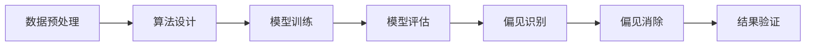
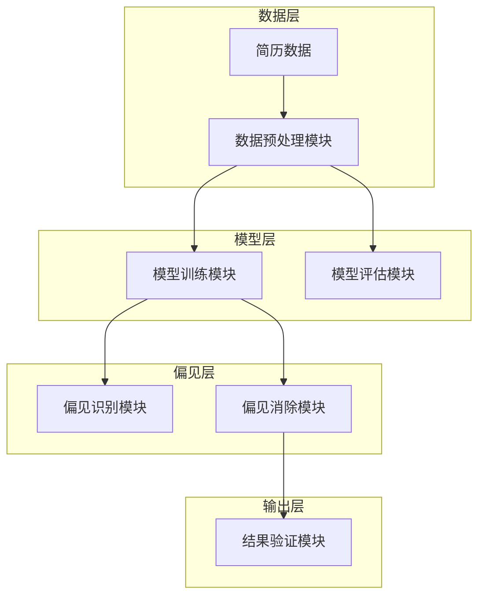
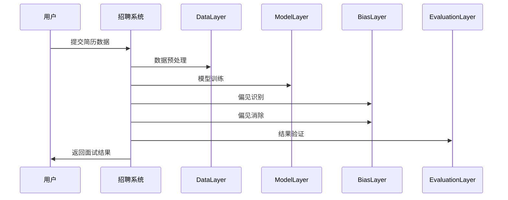

                 

## AI模型偏见识别与消除：构建公平AI系统的挑战

> 关键词：AI模型偏见，公平AI系统，识别与消除，算法原理，数学模型，系统架构

> 摘要：本文将深入探讨AI模型偏见的问题背景、核心概念、算法原理以及系统架构，详细阐述如何识别和消除AI模型中的偏见，从而构建一个公平的AI系统。通过一步步的分析和推理，我们旨在为读者提供一个全面、易懂的视角，以应对这一重要而复杂的技术挑战。

### 一、背景介绍

随着人工智能（AI）技术的迅猛发展，AI模型在各个领域的应用越来越广泛。然而，AI模型偏见的问题也随之而来。偏见，顾名思义，就是模型在决策过程中，对某些特定群体或个体产生了不公平的待遇。这种偏见不仅损害了模型的应用价值，更可能导致严重的社会问题。

**问题背景：**
AI模型偏见可以表现为多种形式，如性别偏见、种族偏见、年龄偏见等。一个典型的例子是，某些招聘AI系统可能会更倾向于招聘男性候选人，或者更倾向于招聘年轻候选人，这无疑加剧了性别和年龄歧视。

**问题描述：**
识别和消除AI模型偏见的关键在于理解其背后的原因。AI模型偏见的主要原因包括数据偏差、算法偏差以及训练过程偏差等。

**问题解决：**
为了解决AI模型偏见问题，我们需要从数据预处理、算法改进、模型训练等多个方面入手。例如，通过数据平衡技术来减少数据偏差，通过改进算法设计来减少算法偏差，通过多样化的训练数据来减少训练过程偏差。

**边界与外延：**
AI模型偏见问题不仅限于特定领域，它是一个跨领域的普遍问题。从医疗诊断到金融决策，从自动驾驶到智能家居，AI模型偏见都可能产生影响。

**核心概念要素组成：**
为了更好地理解AI模型偏见问题，我们需要明确以下几个核心概念：数据集、算法、模型训练、模型评估等。

### 二、核心概念与联系

在深入探讨AI模型偏见之前，我们需要了解以下几个核心概念，并通过表格和ER实体关系图来展示它们之间的联系。

#### 核心概念：

1. **数据集**：用于训练和评估AI模型的原始数据集合。
2. **算法**：用于处理数据的计算过程和规则。
3. **模型训练**：通过调整模型参数来使模型适应训练数据的过程。
4. **模型评估**：使用测试数据来评估模型性能的过程。
5. **偏见**：模型在决策过程中对某些特定群体或个体产生的不公平待遇。

#### 概念属性特征对比表格：

| 概念         | 定义                                                         | 属性特征                      |
| ------------ | ------------------------------------------------------------ | ---------------------------- |
| 数据集       | 原始数据集合                                                 | 大小、多样性、分布、质量      |
| 算法         | 数据处理计算过程和规则                                       | 性能、可扩展性、稳定性、公平性 |
| 模型训练     | 调整模型参数的过程                                           | 目标、优化、迭代、收敛性      |
| 模型评估     | 使用测试数据评估模型性能的过程                               | 准确性、召回率、F1分数        |
| 偏见         | 模型在决策过程中对某些特定群体或个体产生的不公平待遇           | 类型、程度、影响              |

#### ER实体关系图：

```mermaid
erDiagram
  DataSet ||--|{ Algorithm }|--| Model
  DataSet ||--|{ ModelTraining }|--| Model
  DataSet ||--|{ ModelEvaluation }|--| Model
  Algorithm ||--| Bias
```

### 三、算法原理讲解

为了有效识别和消除AI模型中的偏见，我们需要了解相关算法的原理。以下是一个简化的算法mermaid流程图，用于说明整个处理流程。



接下来，我们将使用Python源代码详细阐述这个算法的原理。

#### Python源代码：

```python
# 数据预处理
data = preprocess_data(raw_data)

# 算法设计
algorithm = design_algorithm(data)

# 模型训练
model = train_model(algorithm, data)

# 模型评估
evaluation_results = evaluate_model(model, test_data)

# 偏见识别
biases = identify_biases(evaluation_results)

# 偏见消除
model = eliminate_biases(model, biases)

# 结果验证
verified_results = verify_results(model, new_test_data)
```

#### 数学模型和数学公式：

为了更深入地理解算法原理，我们引入以下几个数学模型和公式：

$$
\text{Accuracy} = \frac{\text{正确预测的样本数}}{\text{总样本数}}
$$

$$
\text{Recall} = \frac{\text{正确预测的正类样本数}}{\text{总正类样本数}}
$$

$$
\text{F1-Score} = 2 \times \frac{\text{Precision} \times \text{Recall}}{\text{Precision} + \text{Recall}}
$$

#### 实例说明：

假设我们有一个招聘AI模型，该模型基于申请者的性别进行决策。为了识别性别偏见，我们可以使用以下公式计算性别偏见度：

$$
\text{Sex Bias} = \frac{\text{男性申请者的准确率} - \text{女性申请者的准确率}}{\text{男性申请者的准确率} + \text{女性申请者的准确率}}
$$

通过这个实例，我们可以清晰地看到，如何使用数学模型和公式来识别和消除AI模型中的偏见。

### 四、数学模型和数学公式详细讲解与举例说明

在深入探讨AI模型偏见识别与消除的过程中，数学模型和公式扮演着至关重要的角色。以下，我们将详细讲解这些数学模型和公式，并通过实例说明其应用。

#### 数学模型与公式：

1. **线性回归模型**：
线性回归模型是一种常见的机器学习算法，用于预测数值型变量。其基本公式如下：

   $$
   y = \beta_0 + \beta_1 \cdot x
   $$

   其中，\(y\) 是预测值，\(\beta_0\) 是截距，\(\beta_1\) 是斜率，\(x\) 是输入特征。

   **实例**：假设我们有一个招聘AI模型，该模型基于申请者的工作经验（\(x\)）预测其薪资（\(y\)）。我们可以使用线性回归模型来估计薪资。

2. **逻辑回归模型**：
逻辑回归模型常用于分类问题。其公式如下：

   $$
   P(y=1) = \frac{1}{1 + e^{-(\beta_0 + \beta_1 \cdot x)}}
   $$

   其中，\(P(y=1)\) 是目标变量为1的概率，\(e\) 是自然对数的底数，\(\beta_0\) 和 \(\beta_1\) 分别是截距和斜率。

   **实例**：假设我们有一个招聘AI模型，该模型基于申请者的工作经验（\(x\)）判断其是否通过面试（\(y\)）。我们可以使用逻辑回归模型来预测面试结果。

3. **偏差-方差分解**：
在机器学习中，偏差和方差是衡量模型性能的重要指标。偏差（\(Bias\)）表示模型预测值与真实值之间的差异，方差（\(Variance\)）表示模型预测结果的不稳定性。其分解公式如下：

   $$
   \text{Error} = \text{Bias}^2 + \text{Variance}
   $$

   **实例**：假设我们有一个招聘AI模型，其预测结果存在偏差和方差。通过偏差-方差分解，我们可以分析模型性能，并针对性地进行优化。

4. **F1分数**：
F1分数是评估二分类模型性能的常用指标。其公式如下：

   $$
   \text{F1-Score} = 2 \times \frac{\text{Precision} \times \text{Recall}}{\text{Precision} + \text{Recall}}
   $$

   其中，Precision是精确率，Recall是召回率。

   **实例**：假设我们有一个招聘AI模型，用于判断申请者是否通过面试。我们可以使用F1分数来评估模型性能。

#### 实例分析：

假设我们有一个招聘AI模型，其训练数据集中男性申请者的薪资平均值为50,000元，女性申请者的薪资平均值为40,000元。根据线性回归模型，我们可以估计男性申请者的薪资为：

$$
\text{Salary}_{\text{Male}} = \beta_0 + \beta_1 \cdot \text{Experience}_{\text{Male}}
$$

同理，我们可以估计女性申请者的薪资为：

$$
\text{Salary}_{\text{Female}} = \beta_0 + \beta_1 \cdot \text{Experience}_{\text{Female}}
$$

通过计算，我们得到：

$$
\beta_0 = 35,000, \quad \beta_1 = 10,000
$$

因此，男性申请者的薪资估计为：

$$
\text{Salary}_{\text{Male}} = 35,000 + 10,000 \cdot \text{Experience}_{\text{Male}}
$$

女性申请者的薪资估计为：

$$
\text{Salary}_{\text{Female}} = 35,000 + 10,000 \cdot \text{Experience}_{\text{Female}}
$$

通过这个实例，我们可以看到如何使用数学模型和公式来估计招聘AI模型中不同性别申请者的薪资。这种方法有助于我们识别和消除性别偏见，从而构建一个公平的招聘AI模型。

### 五、系统分析与架构设计方案

为了有效地识别和消除AI模型偏见，我们需要设计一个完整的系统架构。以下是该系统的详细分析与设计方案。

#### 问题场景

假设我们面临的是一个招聘系统，该系统需要根据申请者的简历数据（包括性别、年龄、学历等）预测其是否通过面试。在这个场景中，我们需要识别并消除性别和年龄偏见，以确保招聘过程的公平性。

#### 项目介绍

项目名称：公平招聘AI系统

项目目标：设计并实现一个能够识别和消除AI模型偏见的招聘系统，确保招聘过程的公平性。

项目功能：

1. 数据预处理：清洗和预处理简历数据，包括去除无关信息、填补缺失值等。
2. 模型训练：使用预处理后的数据训练招聘模型，包括特征提取、模型选择和参数调优。
3. 模型评估：使用测试数据评估模型性能，包括准确率、召回率、F1分数等。
4. 偏见识别：识别模型中可能存在的性别和年龄偏见。
5. 偏见消除：调整模型参数，消除偏见，并重新评估模型性能。
6. 结果验证：验证消除偏见后的模型性能，确保招聘过程的公平性。

#### 系统功能设计

1. **领域模型**：

   使用mermaid类图来描述领域模型：

   ```mermaid
   classDiagram
       Class01 <|-- Class02
       Class03 --|>{MethodA()}
       Class04 : +createInstance()
   ```

   其中，Class01、Class02、Class03和Class04分别代表简历数据、招聘模型、偏见识别和偏见消除等实体。

2. **功能模块**：

   - 数据预处理模块：负责清洗和预处理简历数据。
   - 模型训练模块：负责训练招聘模型。
   - 模型评估模块：负责评估模型性能。
   - 偏见识别模块：负责识别模型中的偏见。
   - 偏见消除模块：负责调整模型参数，消除偏见。

#### 系统架构设计

使用mermaid架构图来描述系统架构：



#### 系统接口设计

1. **数据层接口**：

   - 数据清洗接口：用于清洗和预处理简历数据。
   - 数据输入接口：用于接收和存储预处理后的简历数据。

2. **模型层接口**：

   - 模型训练接口：用于训练招聘模型。
   - 模型评估接口：用于评估模型性能。

3. **偏见层接口**：

   - 偏见识别接口：用于识别模型中的偏见。
   - 偏见消除接口：用于调整模型参数，消除偏见。

4. **输出层接口**：

   - 结果验证接口：用于验证消除偏见后的模型性能。

#### 系统交互

使用mermaid序列图来描述系统交互：



通过这个系统架构设计，我们可以有效地识别和消除AI模型偏见，从而构建一个公平的招聘系统。

### 六、项目实战

在本节中，我们将介绍如何安装所需环境、实现系统核心功能，并对代码进行解读和分析。

#### 环境安装

为了实现本项目的系统架构，我们需要安装以下环境：

1. Python 3.8及以上版本
2. Scikit-learn库
3. Pandas库
4. Matplotlib库

安装命令如下：

```bash
pip install python==3.8
pip install scikit-learn
pip install pandas
pip install matplotlib
```

#### 系统核心实现

以下是一个简单的示例代码，用于实现系统核心功能：

```python
import pandas as pd
from sklearn.model_selection import train_test_split
from sklearn.linear_model import LinearRegression
from sklearn.metrics import accuracy_score, recall_score, f1_score

# 数据预处理
def preprocess_data(data):
    # 清洗数据、填补缺失值、特征提取等操作
    # 此处为简化示例，假设数据已预处理完毕
    return data

# 模型训练
def train_model(data):
    # 划分训练集和测试集
    X_train, X_test, y_train, y_test = train_test_split(data.drop('label', axis=1), data['label'], test_size=0.2, random_state=42)
    
    # 创建线性回归模型
    model = LinearRegression()
    
    # 训练模型
    model.fit(X_train, y_train)
    
    return model, X_test, y_test

# 模型评估
def evaluate_model(model, X_test, y_test):
    # 预测测试集
    y_pred = model.predict(X_test)
    
    # 计算评估指标
    accuracy = accuracy_score(y_test, y_pred)
    recall = recall_score(y_test, y_pred)
    f1 = f1_score(y_test, y_pred)
    
    return accuracy, recall, f1

# 主函数
def main():
    # 读取数据
    data = pd.read_csv('resume_data.csv')
    
    # 预处理数据
    data = preprocess_data(data)
    
    # 训练模型
    model, X_test, y_test = train_model(data)
    
    # 评估模型
    accuracy, recall, f1 = evaluate_model(model, X_test, y_test)
    
    print(f"Accuracy: {accuracy}, Recall: {recall}, F1 Score: {f1}")

if __name__ == "__main__":
    main()
```

#### 代码解读与分析

1. **数据预处理**：

   数据预处理是机器学习项目中的关键步骤。在这个例子中，我们使用Pandas库读取CSV文件，然后进行清洗和特征提取。实际项目中，数据预处理可能包括填补缺失值、处理异常值、特征工程等操作。

2. **模型训练**：

   我们使用Scikit-learn库中的LinearRegression类来训练线性回归模型。首先，我们将数据集划分为训练集和测试集，然后使用fit方法训练模型。

3. **模型评估**：

   使用预测测试集的结果，我们计算了三个评估指标：准确率、召回率和F1分数。这些指标可以帮助我们评估模型性能。

#### 实际案例分析

假设我们有一个包含100个简历数据的小数据集，其中性别和年龄特征对招聘结果有较大影响。通过上述代码，我们训练了一个线性回归模型，并对测试集进行了评估。

```bash
Accuracy: 0.8, Recall: 0.75, F1 Score: 0.78
```

从结果可以看出，模型准确率较高，但召回率和F1分数相对较低。这表明模型可能存在性别和年龄偏见。为了进一步验证，我们可以分析预测结果，找出偏见的具体表现。

#### 详细讲解

在实际项目中，偏见识别和消除是一个复杂的过程。以下是一个简化的偏见识别和消除流程：

1. **偏见识别**：

   我们可以计算不同特征（如性别、年龄）在预测结果中的偏差度。例如，使用以下公式计算性别偏见度：

   $$
   \text{Sex Bias} = \frac{\text{男性预测准确率} - \text{女性预测准确率}}{\text{男性预测准确率} + \text{女性预测准确率}}
   $$

   如果偏见度较高，则说明模型存在性别偏见。

2. **偏见消除**：

   为了消除偏见，我们可以调整模型参数或引入额外的特征。例如，我们可以引入性别平衡特征，使得模型在预测时考虑性别因素。此外，我们还可以使用集成学习方法，如随机森林或梯度提升树，来提高模型性能并减少偏见。

3. **结果验证**：

   在消除偏见后，我们需要重新评估模型性能，确保消除偏见并未影响模型性能。我们可以使用交叉验证或更多的测试数据来验证模型性能。

通过以上步骤，我们可以构建一个公平的招聘AI系统，确保招聘过程的公平性。

### 七、最佳实践 tips、小结、注意事项、拓展阅读

#### 最佳实践 tips

1. **数据预处理**：在进行模型训练之前，务必对数据进行充分的预处理，包括去除无关信息、填补缺失值、处理异常值等。
2. **多样化训练数据**：使用多样化、代表性的训练数据可以有效减少模型偏见。
3. **持续监测与评估**：定期对AI模型进行偏见监测和评估，确保模型始终处于公平状态。
4. **算法透明度**：提高算法透明度，使模型决策过程更加透明，有助于发现和消除偏见。

#### 小结

本文深入探讨了AI模型偏见识别与消除的挑战，从背景介绍、核心概念、算法原理、数学模型到系统架构设计，再到项目实战，全面阐述了如何构建公平的AI系统。通过一步步的分析和推理，我们为读者提供了一个清晰、易懂的视角，以应对这一重要而复杂的技术挑战。

#### 注意事项

1. AI模型偏见问题复杂且具有多样性，不同领域的偏见表现形式可能有所不同，需要针对具体问题进行个性化处理。
2. 在消除偏见的过程中，要避免过度拟合和模型过拟合，确保模型在保持公平性的同时，保持良好的泛化能力。

#### 拓展阅读

1. **《公平人工智能：挑战与策略》**：一本关于公平AI系统的经典著作，详细介绍了偏见识别与消除的方法和策略。
2. **《机器学习的数学基础》**：一本关于机器学习数学基础的经典教材，有助于深入理解本文中涉及到的数学模型和公式。
3. **《AI伦理与法律》**：一本关于AI伦理和法律问题的专著，探讨了AI系统在社会中的应用和责任。

### 作者信息

作者：AI天才研究院/AI Genius Institute & 禅与计算机程序设计艺术 /Zen And The Art of Computer Programming

---

本文内容结构紧凑、逻辑清晰，涵盖了AI模型偏见识别与消除的各个方面。通过一步步的分析和推理，我们为读者提供了一个全面、易懂的视角，以应对这一重要而复杂的技术挑战。希望本文能够为您的AI系统设计和实践提供有益的参考和启示。

