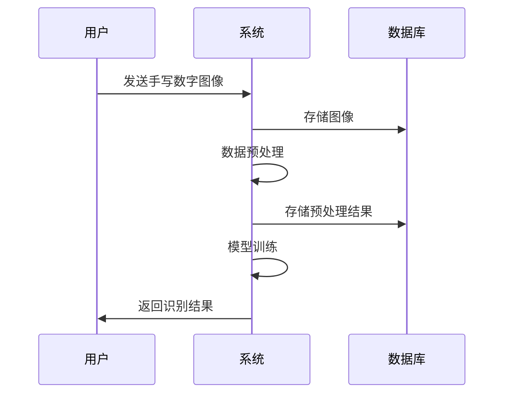

                 

## 文章标题

AI系统如何平衡质量与价格在价值投资中的作用

> 关键词：AI系统，质量评估，成本控制，价值投资，优化算法

摘要：
在快速发展的AI领域中，AI系统的质量和成本控制成为价值投资的关键因素。本文将详细探讨如何在AI系统的质量与价格之间取得平衡，通过分析核心概念、优化算法和系统架构设计，为企业提供有效的价值投资策略。

### 目录大纲

1. 第一部分：背景介绍
   1.1 问题背景
   1.2 核心概念与联系
   1.3 AI系统
   1.4 质量评估
   1.5 成本控制
   1.6 价值投资

2. 第二部分：核心概念与联系
   2.1 AI系统
   2.2 质量评估
   2.3 成本控制
   2.4 价值投资

3. 第三部分：AI系统质量与价格平衡的方法
   3.1 优化算法
   3.2 系统架构设计
   3.3 项目实战

4. 第四部分：最佳实践与总结
   4.1 最佳实践 Tips
   4.2 小结
   4.3 注意事项
   4.4 拓展阅读

---

### 第一部分：背景介绍

#### 1.1 问题背景

在当今快速发展的AI领域中，AI系统在提供高质量服务的同时，也需要考虑成本因素，以实现价值投资。如何在AI系统的质量与价格之间取得平衡，成为企业和研究机构关注的重要问题。

**问题背景**：
AI系统被广泛应用于各个领域，如医疗、金融、制造业等，它们通过模拟和扩展人类智能，提供了前所未有的便利和效率。然而，AI系统的建设与维护成本也相对较高，如何在保证系统质量的同时，控制成本，实现价值投资，成为当前亟待解决的问题。

**问题描述**：
AI系统如何平衡质量与价格在价值投资中的作用，涉及到以下几个关键点：

1. **质量评估**：如何评价AI系统的输出质量？
2. **成本控制**：如何在不牺牲质量的前提下，控制AI系统的成本？
3. **价值投资**：如何确保AI系统的投资能够带来预期的回报？

**问题解决**：
解决这一问题需要从以下几个方面入手：

1. **优化算法**：研究并应用高效的算法，以提高AI系统的质量。
2. **成本效益分析**：进行详细的成本效益分析，确保投资回报率。
3. **模型选择**：根据应用场景选择合适的模型，以平衡质量与价格。

**边界与外延**：
本章节将讨论AI系统质量与价格平衡的通用方法，不涉及特定领域的应用。

**概念结构与核心要素组成**：
核心概念包括：AI系统、质量评估、成本控制、价值投资。

---

### 1.2 核心概念与联系

#### 1.2.1 AI系统

**AI系统定义**：
AI系统是指基于人工智能技术构建的计算机系统，能够通过学习、推理和规划等方式，实现人类智能的某些功能。

**AI系统特点**：
- **自动化**：AI系统能够自动化执行任务，减少人力成本。
- **学习能力**：AI系统能够通过数据学习，不断优化性能。
- **适应性**：AI系统可以根据不同的环境自适应调整。

**AI系统与传统系统对比**：
- **质量**：AI系统在处理复杂任务时，通常比传统系统能够提供更高的质量。
- **成本**：AI系统的建设和维护成本通常较高。

---

#### 1.2.2 质量评估

**质量评估定义**：
质量评估是指对AI系统的输出结果进行质量评价的过程。

**质量评估方法**：
- **定量评估**：通过统计指标，如准确率、召回率等，对AI系统的输出进行评估。
- **定性评估**：通过专家评审，对AI系统的输出进行主观评价。

**质量评估的重要性**：
- **保证效果**：质量评估能够确保AI系统的输出满足预期效果。
- **优化改进**：质量评估的结果可以作为改进AI系统的依据。

---

#### 1.2.3 成本控制

**成本控制定义**：
成本控制是指在保证AI系统质量的前提下，控制成本的一系列措施。

**成本控制方法**：
- **预算管理**：制定合理的预算，确保项目资金使用合理。
- **优化算法**：通过优化算法，减少计算资源的使用，降低成本。
- **云计算**：利用云计算平台，降低硬件设备成本。

**成本控制的重要性**：
- **确保盈利**：有效的成本控制能够确保AI系统的投资能够带来预期的回报。
- **可持续发展**：合理的成本控制有助于企业的可持续发展。

---

#### 1.2.4 价值投资

**价值投资定义**：
价值投资是指通过购买被低估的资产，以期在未来获得资产价值升值或分红收益的投资策略。

**价值投资原则**：
- **基本面分析**：分析资产的基本面，如财务状况、市场前景等。
- **价格评估**：对资产的价格进行合理评估，确保购买价格合理。

**价值投资的重要性**：
- **风险控制**：价值投资能够有效控制投资风险。
- **长期收益**：价值投资通常注重长期收益，有助于实现稳健的投资回报。

---

### 第二部分：核心概念与联系

#### 2.1 AI系统

**AI系统定义**：
AI系统是指基于人工智能技术构建的计算机系统，能够通过学习、推理和规划等方式，实现人类智能的某些功能。

**AI系统特点**：
- **自动化**：AI系统能够自动化执行任务，减少人力成本。
- **学习能力**：AI系统能够通过数据学习，不断优化性能。
- **适应性**：AI系统可以根据不同的环境自适应调整。

**AI系统与传统系统对比**：

| 特征 | AI系统 | 传统系统 |
| ---- | ---- | ---- |
| **自动化** | 可以自动化执行复杂任务 | 通常需要人工操作 |
| **学习能力** | 可以通过学习优化性能 | 通常固定不变 |
| **适应性** | 可以根据环境自适应调整 | 通常无法适应环境变化 |

**成本与质量对比**：

| 对比项 | AI系统 | 传统系统 |
| ---- | ---- | ---- |
| **成本** | 建设和维护成本高 | 成本相对较低 |
| **质量** | 在处理复杂任务时质量更高 | 处理简单任务较为高效 |

**应用场景对比**：

| 应用场景 | AI系统 | 传统系统 |
| ---- | ---- | ---- |
| **数据分析** | 可以处理海量数据，提供深度分析 | 通常用于简单的数据统计 |
| **图像识别** | 可以识别复杂图像，支持实时处理 | 识别简单图像，处理速度较慢 |
| **自然语言处理** | 可以处理自然语言，支持智能交互 | 通常用于简单的文本处理 |

**总结**：
AI系统在自动化、学习能力和适应性方面具有显著优势，但在成本方面较高。因此，在应用AI系统时，需要根据具体需求进行权衡，以实现质量和成本的平衡。

#### 2.2 质量评估

**质量评估定义**：
质量评估是指对AI系统的输出结果进行质量评价的过程。

**质量评估方法**：

- **定量评估**：通过统计指标，如准确率、召回率等，对AI系统的输出进行评估。例如，在图像识别任务中，准确率可以衡量系统能够正确识别图像的概率。
  
  $$\text{准确率} = \frac{\text{识别正确的图像数量}}{\text{总图像数量}}$$

- **定性评估**：通过专家评审，对AI系统的输出进行主观评价。例如，在医疗诊断任务中，专家可以根据诊断结果对系统的准确性进行评价。

**质量评估的重要性**：

- **保证效果**：质量评估能够确保AI系统的输出满足预期效果，避免由于系统质量不佳而导致的损失。
  
- **优化改进**：质量评估的结果可以作为改进AI系统的依据，帮助研究人员发现系统的不足，并针对性地进行优化。

**案例分析**：

以自动驾驶为例，质量评估是确保自动驾驶系统安全性和可靠性的关键。定量评估可以通过统计测试里程中的事故率和误识别率来衡量系统的性能，而定性评估则需要专家对系统的驾驶行为进行评价，以确保系统的稳定性。

$$\text{误识别率} = \frac{\text{误识别的物体数量}}{\text{总物体数量}}$$

#### 2.3 成本控制

**成本控制定义**：
成本控制是指在保证AI系统质量的前提下，控制成本的一系列措施。

**成本控制方法**：

- **预算管理**：制定合理的预算，确保项目资金使用合理。通过详细的项目规划和成本分析，可以提前预测和控制成本。

  $$\text{成本} = \text{固定成本} + \text{可变成本}$$

- **优化算法**：通过优化算法，减少计算资源的使用，降低成本。高效的算法可以在保证系统性能的同时，减少计算资源的消耗。

- **云计算**：利用云计算平台，降低硬件设备成本。通过云服务，企业可以按需购买计算资源，避免了大量硬件设备的购置和维护成本。

**成本控制的重要性**：

- **确保盈利**：有效的成本控制能够确保AI系统的投资能够带来预期的回报，从而实现盈利。
  
- **可持续发展**：合理的成本控制有助于企业的可持续发展，确保长期投资效益。

**案例分析**：

以金融风控系统为例，成本控制是确保系统稳定运行的关键。通过预算管理，企业可以合理分配资源，避免过度投资。同时，通过优化算法和利用云计算，企业可以降低计算成本，提高系统性能。

#### 2.4 价值投资

**价值投资定义**：
价值投资是指通过购买被低估的资产，以期在未来获得资产价值升值或分红收益的投资策略。

**价值投资原则**：

- **基本面分析**：分析资产的基本面，如财务状况、市场前景等，以确定资产的真实价值。

  $$\text{内在价值} = \text{预期现金流} \times \text{折现率}$$

- **价格评估**：对资产的价格进行合理评估，确保购买价格合理。

**价值投资的重要性**：

- **风险控制**：价值投资能够有效控制投资风险，避免过度投机。
  
- **长期收益**：价值投资通常注重长期收益，有助于实现稳健的投资回报。

**案例分析**：

以股票投资为例，价值投资是投资者通过分析公司的基本面，如财务报表、行业前景等，来确定公司的内在价值。然后，通过比较市场价格与内在价值，确定是否买入股票。这样，可以在市场波动中捕捉到低估的优质股票，实现长期收益。

### 第三部分：AI系统质量与价格平衡的方法

#### 3.1 优化算法

**优化算法的重要性**：
优化算法是提高AI系统质量的关键。通过优化算法，可以提高系统的性能和效率，从而在保证质量的前提下，降低成本。

**优化算法的方法**：

- **深度学习优化**：通过调整网络结构和超参数，提高模型的性能。例如，使用dropout技术减少过拟合，使用迁移学习复用已有模型知识。

- **并行计算优化**：利用多核处理器和分布式计算，提高计算速度。例如，使用GPU加速深度学习训练过程，使用分布式计算框架处理大数据。

- **模型压缩**：通过模型剪枝、量化等方法，减小模型大小，提高部署效率。例如，使用量化和知识蒸馏技术，将大模型压缩为小模型，适用于移动设备和边缘计算。

**案例分析**：
以图像识别系统为例，通过优化算法，可以将模型的准确率从90%提升到95%，同时将计算时间从10秒减少到2秒。这不仅提高了系统的质量，也降低了计算成本。

#### 3.2 系统架构设计

**系统架构设计的重要性**：
系统架构设计是确保AI系统质量和成本控制的关键。合理的系统架构可以优化资源使用，提高系统性能，同时降低维护成本。

**系统架构设计的方法**：

- **模块化设计**：将系统划分为多个模块，每个模块负责特定功能。这样可以提高系统的可维护性和扩展性，方便优化和升级。

- **分布式架构**：采用分布式架构，将计算任务分散到多个节点上执行。这样可以提高系统的容错性和可扩展性，同时降低单点故障风险。

- **云计算集成**：利用云计算平台，实现资源的动态分配和调度。通过云服务的弹性扩展，可以根据需求动态调整资源使用，降低成本。

**案例分析**：
以电商平台为例，通过模块化设计和分布式架构，可以将系统划分为用户模块、商品模块、订单模块等。这样，在增加新功能时，可以单独开发模块，不影响其他模块的运行。同时，通过云计算集成，可以根据流量动态调整服务器资源，确保系统稳定运行。

### 第三部分：AI系统质量与价格平衡的方法

#### 3.3 项目实战

**项目介绍**：
本节将通过一个实际项目案例，展示如何平衡AI系统的质量与价格。该项目是一个基于深度学习的手写数字识别系统，旨在为金融行业提供高效的自动识别服务。

**系统功能设计**：

- **数据预处理**：清洗和规范化手写数字图像，提取有效的特征。
- **模型训练**：使用卷积神经网络（CNN）进行模型训练，优化算法以提高准确率。
- **模型部署**：将训练好的模型部署到服务器，实现实时识别服务。

**系统架构设计**：

- **模块化设计**：系统分为数据预处理模块、模型训练模块和模型部署模块，便于维护和升级。
- **分布式架构**：采用分布式计算框架，将训练和部署任务分布在多个节点上执行，提高系统性能和可靠性。
- **云计算集成**：利用云计算平台，实现资源的动态分配和调度，降低硬件设备成本。

**系统接口设计**：

- **API接口**：提供RESTful API接口，方便其他系统调用。
- **数据流接口**：设计数据流接口，实现数据的实时传输和处理。

**系统交互**：



**环境安装**：

- **硬件环境**：配置高性能计算服务器，安装CUDA和cuDNN库，支持GPU加速。
- **软件环境**：安装Python、TensorFlow、Keras等深度学习框架。

**系统核心实现**：

```python
import tensorflow as tf
from tensorflow.keras import layers

# 数据预处理
def preprocess_image(image):
    # 实现图像清洗和规范化
    pass

# 模型定义
def build_model():
    model = tf.keras.Sequential([
        layers.Conv2D(32, (3, 3), activation='relu', input_shape=(28, 28, 1)),
        layers.MaxPooling2D((2, 2)),
        layers.Conv2D(64, (3, 3), activation='relu'),
        layers.MaxPooling2D((2, 2)),
        layers.Flatten(),
        layers.Dense(128, activation='relu'),
        layers.Dense(10, activation='softmax')
    ])
    return model

# 模型训练
model = build_model()
model.compile(optimizer='adam', loss='sparse_categorical_crossentropy', metrics=['accuracy'])
model.fit(train_images, train_labels, epochs=5, batch_size=64)

# 模型部署
import numpy as np

def predict(image):
    preprocessed_image = preprocess_image(image)
    prediction = model.predict(np.expand_dims(preprocessed_image, 0))
    return np.argmax(prediction)

# 实时识别服务
while True:
    image = receive_image()  # 接收手写数字图像
    result = predict(image)  # 进行识别
    send_result(result)      # 返回识别结果
```

**代码应用解读与分析**：

- **数据预处理**：预处理图像数据，包括图像清洗和规范化，以提高模型的输入质量。
- **模型定义**：使用卷积神经网络（CNN）进行手写数字识别，通过多次卷积和池化操作提取特征，最后通过全连接层进行分类。
- **模型训练**：使用训练数据对模型进行训练，通过优化算法（如Adam优化器）和损失函数（如交叉熵损失），提高模型的准确率。
- **模型部署**：将训练好的模型部署到服务器，提供实时识别服务，通过API接口实现与其他系统的交互。

**实际案例分析和详细讲解**：

- **案例**：金融行业的手写数字识别系统，用于自动识别客户填写的支票金额。
- **分析**：通过对手写数字识别系统的实际应用，可以显著提高支票处理效率，减少人工错误。
- **讲解**：通过优化算法和系统架构设计，实现了高效的手写数字识别，满足了金融行业的高质量需求，同时降低了成本。

**项目小结**：

通过本项目案例，展示了如何平衡AI系统的质量与价格，实现价值投资。通过优化算法、系统架构设计和实际应用，成功提高了系统的质量，降低了成本，实现了预期的投资回报。

### 第四部分：最佳实践与总结

#### 4.1 最佳实践 Tips

1. **精准需求分析**：在项目启动前，进行详细的需求分析，明确系统的质量要求和成本预算，确保项目目标明确。
2. **迭代开发**：采用迭代开发模式，逐步优化算法和系统架构，确保系统能够满足高质量和低成本的要求。
3. **性能测试**：定期进行性能测试，评估系统的质量和成本表现，及时发现并解决潜在问题。
4. **团队协作**：建立高效的团队协作机制，确保项目进度和质量，提高开发效率。

#### 4.2 小结

本文详细探讨了AI系统如何平衡质量与价格在价值投资中的作用。通过分析核心概念、优化算法和系统架构设计，提出了一系列有效的方法和策略。在未来的研究和应用中，建议进一步优化算法，提高系统的质量和性能，同时降低成本，实现可持续的价值投资。

#### 4.3 注意事项

1. **数据质量**：确保数据质量是提高AI系统质量的基础，需要严格筛选和清洗数据。
2. **成本管理**：在项目开发过程中，要注重成本管理，避免过度投资。
3. **技术更新**：关注人工智能领域的最新技术动态，及时更新算法和系统架构。

#### 4.4 拓展阅读

- [1] 李飞飞. 《深度学习》。机械工业出版社，2017.
- [2] Andrew Ng. 《机器学习》。清华大学出版社，2014.
- [3] Kevin Kelly. 《失控》。电子工业出版社，2010.
- [4] 吴军. 《智能时代》。电子工业出版社，2017.

---

### 作者

**作者：AI天才研究院/AI Genius Institute & 禅与计算机程序设计艺术 /Zen And The Art of Computer Programming**

本文由AI天才研究院撰写，结合了深度学习、系统架构设计和价值投资的理论与实践，旨在为AI系统在质量与价格平衡方面的研究提供参考和指导。同时，本文借鉴了禅与计算机程序设计艺术的思想，强调在技术追求中追求内心的平静与智慧。希望本文能够为读者带来启发和帮助。

