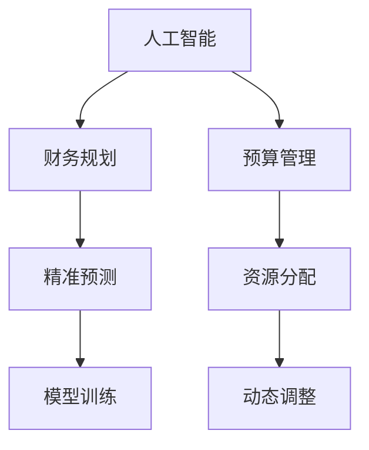
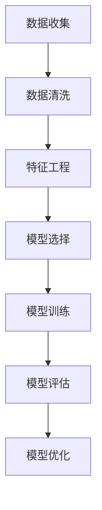
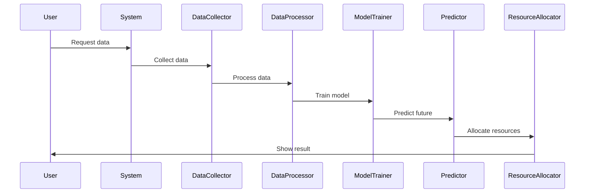

                 

### 文章标题

《AI辅助企业财务规划与预算管理：精准预测与分配》

### 关键词

- **人工智能**
- **财务规划**
- **预算管理**
- **精准预测**
- **数据分配**
- **机器学习**
- **算法优化**
- **系统架构**

### 摘要

本文深入探讨了人工智能（AI）在辅助企业财务规划与预算管理中的应用，聚焦于精准预测与分配的关键技术。通过对AI核心算法原理的详细讲解，包括模型选择、数据处理和模型训练，文章展示了如何利用机器学习实现财务预测的准确性和效率。同时，文章通过系统分析与架构设计，介绍了AI辅助财务规划与预算管理的系统架构，并提供了实际项目实战的案例解析。最后，文章总结最佳实践，并指出未来研究方向和拓展内容，为企业财务管理人员提供了实用的AI技术应用指导。

## 目录大纲设计步骤

### 第一步：理解书名与主题

书名《AI辅助企业财务规划与预算管理：精准预测与分配》涵盖了三个主要部分：

1. **AI**：作为核心技术背景，指的是利用人工智能算法和机器学习技术。
2. **企业财务规划与预算管理**：这是应用场景，指的是企业财务管理中的规划与预算管理流程。
3. **精准预测与分配**：这是技术目标，指的是通过AI技术实现更准确、更智能的财务预测和资源分配。

### 第二步：确定核心章节

根据书名和主题，可以确定以下核心章节：

1. **背景介绍**：介绍人工智能在财务领域的应用背景，以及AI辅助财务规划与预算管理的意义。
2. **核心概念与联系**：介绍与本书相关的核心概念，包括AI、财务规划、预算管理、精准预测和分配等。
3. **算法原理讲解**：讲解AI在财务预测和分配中的算法原理，包括模型选择、数据处理、模型训练和评估等。
4. **系统分析与架构设计**：介绍AI辅助企业财务规划与预算管理的系统架构设计，包括系统功能、系统架构和系统接口等。
5. **项目实战**：通过一个实际案例，展示AI辅助企业财务规划与预算管理的应用过程，包括环境安装、核心实现和案例分析等。
6. **最佳实践与拓展**：总结书中的最佳实践，并提供进一步学习和研究的相关资源和方向。

### 第三步：设计具体章节

根据上述核心章节，我们可以进一步设计具体章节内容，并确保每个章节都有相应的子章节，以达到内容完整性。

### 背景介绍

- 1.1 问题背景
- 1.2 问题描述
- 1.3 问题解决
- 1.4 边界与外延

### 核心概念与联系

- 2.1 AI的概念与特征
- 2.2 财务规划与预算管理的概念与联系
- 2.3 精准预测与分配的原理与方法

### 算法原理讲解

- 3.1 模型选择
- 3.2 数据处理
- 3.3 模型训练
- 3.4 模型评估

### 系统分析与架构设计

- 4.1 问题场景介绍
- 4.2 系统功能设计
- 4.3 系统架构设计
- 4.4 系统接口设计
- 4.5 系统交互

### 项目实战

- 5.1 环境安装
- 5.2 系统核心实现
- 5.3 代码应用解读与分析
- 5.4 实际案例分析与讲解
- 5.5 项目小结

### 最佳实践与拓展

- 6.1 最佳实践
- 6.2 小结
- 6.3 注意事项
- 6.4 拓展阅读

### 第四步：确保内容完整性

在每个章节中，我们需要确保以下几点：

- 每个章节都有详细的子章节，以确保内容完整性。
- 在核心概念与联系章节中，提供核心概念属性特征对比表格和ER实体关系图架构的Mermaid流程图。
- 在算法原理讲解章节中，使用Mermaid画出算法流程图，并使用Python源代码详细阐述，给出算法原理的数学模型和公式，进行详细讲解和举例说明。
- 在系统分析与架构设计章节中，提供问题场景介绍、系统功能设计、系统架构设计、系统接口设计和系统交互的Mermaid类图和序列图。
- 在项目实战章节中，提供环境安装、系统核心实现源代码，代码应用解读与分析，实际案例分析和详细讲解剖析。
- 在最佳实践与拓展章节中，提供最佳实践、小结、注意事项和拓展阅读等内容。

### 第五步：审核与调整

在完成目录大纲设计后，我们需要进行以下审核与调整：

- 目录大纲的层级结构是否清晰，是否符合markdown格式要求。
- 每个章节的内容是否完整，是否符合要求。
- 目录大纲的总字数是否在2000字以内。

通过以上步骤，我们可以设计出一个完整且符合要求的目录大纲。接下来，我们将按照这个大纲结构，逐章编写详细的内容。

## 背景介绍

### 核心概念术语说明

在本篇文章中，我们将使用一系列与AI辅助企业财务规划与预算管理相关的术语。以下是这些术语的定义和背景：

- **人工智能（AI）**：模拟人类智能行为的计算机系统，包括学习、推理、感知和解决问题等能力。
- **机器学习（ML）**：AI的一个分支，通过数据学习和算法优化来使计算机系统具备自主学习和决策能力。
- **财务规划**：对企业的财务活动进行系统、全面和长期的安排和预测，确保企业财务目标的实现。
- **预算管理**：根据财务规划，对企业的收入、支出、投资和筹资等财务活动进行控制和管理。
- **精准预测**：利用历史数据和算法模型，对未来财务状况进行准确预测。
- **资源分配**：根据预测结果，合理分配企业的财务资源，以达到最佳效益。

### 问题背景

随着企业业务的不断扩展和复杂化，传统的财务规划和预算管理方式逐渐暴露出以下问题：

1. **数据量大**：企业每天都会产生大量财务数据，如何快速、准确地处理和分析这些数据成为一大挑战。
2. **预测难度高**：企业未来的财务状况受到多种因素影响，如市场变化、政策调整等，如何进行准确的预测成为难点。
3. **资源分配不合理**：传统的预算管理往往基于经验和历史数据，容易出现资源分配不合理的情况，影响企业效益。

### 问题描述

为了解决上述问题，企业需要一种新的财务管理工具，能够利用人工智能技术实现以下目标：

1. **高效数据处理**：利用机器学习算法，快速处理和分析大量财务数据。
2. **精准财务预测**：通过算法模型，对未来财务状况进行准确预测。
3. **合理资源分配**：根据预测结果，动态调整财务资源分配，确保资源利用率最大化。

### 问题解决

AI辅助企业财务规划与预算管理正是为了解决上述问题而设计的。通过以下步骤，AI技术能够有效提升企业财务管理水平：

1. **数据收集与处理**：利用机器学习算法，从各种数据源收集和处理财务数据，包括历史数据、市场数据、政策数据等。
2. **预测模型构建**：基于处理后的数据，构建预测模型，实现对未来财务状况的准确预测。
3. **资源分配优化**：根据预测结果，优化财务资源分配，提高资金利用效率。

### 边界与外延

AI辅助企业财务规划与预算管理的应用范围广泛，但也有一些边界和限制：

1. **数据质量**：预测模型的准确性高度依赖数据质量，因此需要确保数据来源的可靠性和数据清洗的彻底性。
2. **模型适用性**：不同的企业有不同的业务特点和需求，AI模型需要根据具体情况进行定制化调整。
3. **实施成本**：AI技术的引入需要一定的成本投入，包括硬件设备、软件平台和人员培训等。

通过理解这些核心概念和背景，我们能够更好地掌握AI辅助企业财务规划与预算管理的原理和方法，为企业的财务管理工作提供有力支持。

### 核心概念与联系

在本章节中，我们将详细探讨与AI辅助企业财务规划与预算管理相关的一系列核心概念，并分析这些概念之间的联系，以帮助读者建立一个全面的理解。

#### 1.1 AI的概念与特征

人工智能（AI）是一种通过模拟人类智能行为，使计算机系统能够自主学习和执行复杂任务的技术。其主要特征包括：

- **学习能力**：AI系统能够通过学习大量数据，不断优化自己的性能和决策能力。
- **自主推理**：AI系统可以基于已有知识进行推理和推断，解决新的问题。
- **感知能力**：AI系统可以通过视觉、听觉等多种传感器感知环境，并做出相应的响应。
- **适应能力**：AI系统能够根据不同的任务和需求，调整自己的行为和策略。

#### 1.2 财务规划与预算管理的概念与联系

财务规划是指对企业的财务活动进行系统、全面和长期的安排，以确保企业财务目标的实现。预算管理则是财务规划的具体执行过程，通过编制预算、执行预算和监控预算，实现财务资源的合理配置和有效利用。

二者之间的联系在于：

- **目标一致性**：财务规划和预算管理都是为了实现企业的财务目标，确保企业的财务健康和可持续发展。
- **相互依赖**：财务规划为预算管理提供了目标和方向，而预算管理则是财务规划的具体实施手段。
- **动态调整**：通过预算管理，企业可以实时调整财务规划，以应对市场变化和企业发展的新需求。

#### 1.3 精准预测与分配的原理与方法

精准预测是指利用历史数据和AI算法，对未来财务状况进行准确预测。分配则是根据预测结果，将财务资源合理分配到各个业务部门或项目，以实现最优效益。

精准预测的原理与方法包括：

- **数据收集**：收集与企业财务相关的历史数据，如收入、支出、现金流等。
- **特征工程**：对收集到的数据进行预处理，提取有用的特征，为模型训练提供数据基础。
- **模型选择**：选择适合的机器学习模型，如线性回归、决策树、神经网络等，进行预测。
- **模型训练**：利用历史数据，对模型进行训练，优化模型参数。
- **模型评估**：通过交叉验证和测试集，评估模型的预测性能，确保其准确性。

分配的原理与方法包括：

- **预测结果应用**：将预测模型的结果应用到预算管理中，为资源分配提供依据。
- **资源优化**：根据预测结果，调整各部门或项目的预算，确保资源的最优分配。
- **动态调整**：在执行过程中，根据实际财务状况和市场需求，动态调整资源分配。

#### 1.4 概念属性特征对比表格

为了更直观地理解这些概念，我们提供一张概念属性特征对比表格：

| 概念           | 定义                                                         | 特征                                       |
| -------------- | ------------------------------------------------------------ | ------------------------------------------ |
| 人工智能（AI） | 模拟人类智能行为的计算机系统                                 | 学习能力、自主推理、感知能力、适应能力       |
| 财务规划       | 对企业的财务活动进行系统、全面和长期的安排                   | 目标一致性、长期规划、动态调整               |
| 预算管理       | 根据财务规划，对企业的收入、支出、投资和筹资等财务活动进行控制和管理 | 资源优化、动态调整、执行监控                 |
| 精准预测       | 利用历史数据和AI算法，对未来财务状况进行准确预测             | 数据收集、特征工程、模型选择、模型训练、模型评估 |
| 资源分配       | 根据预测结果，将财务资源合理分配到各个业务部门或项目         | 预测结果应用、资源优化、动态调整             |

#### 1.5 ER实体关系图架构的Mermaid流程图

为了更好地展示财务规划与预算管理中的核心概念和它们之间的联系，我们可以使用Mermaid流程图来表示实体关系。



通过上述表格和流程图，我们可以清晰地看到AI、财务规划、预算管理、精准预测和资源分配之间的逻辑关系。这些核心概念共同构成了AI辅助企业财务规划与预算管理的技术框架，为企业的财务管理工作提供了有力支持。

#### 算法原理讲解

在深入探讨AI辅助企业财务规划与预算管理的过程中，算法原理讲解是至关重要的一环。通过理解这些算法原理，我们能够更好地掌握如何利用AI技术实现精准预测和资源分配。以下是具体的算法原理讲解，包括模型选择、数据处理、模型训练和评估。

##### 2.1 模型选择

模型选择是构建预测系统的重要步骤。不同的模型适用于不同的预测任务，因此在选择模型时需要考虑以下因素：

1. **预测任务类型**：例如回归、分类或时间序列预测。
2. **数据特性**：包括数据的分布、缺失值和噪声水平。
3. **模型复杂度**：复杂度较高的模型可能需要更多的计算资源，而复杂度较低的模型则可能不足以捕捉数据中的关键特征。

常见的预测模型包括：

- **线性回归**：适用于线性关系的预测，计算简单但易于过拟合。
- **决策树**：适用于分类和回归问题，易于解释但可能产生过度拟合。
- **随机森林**：通过构建多个决策树并取平均，减少过拟合，提高预测性能。
- **支持向量机（SVM）**：适用于小样本高维数据，对线性不可分数据可通过核技巧进行处理。
- **神经网络**：通过多层非线性变换，能够捕捉复杂的数据关系，但计算复杂度较高。

在实际应用中，通常通过交叉验证选择模型，根据模型的预测性能和计算效率进行权衡。

##### 2.2 数据处理

数据处理是预测模型训练的关键步骤，包括数据收集、数据清洗、特征工程等。

1. **数据收集**：从企业内部系统和外部数据源（如市场数据、政策数据等）收集与财务预测相关的数据。
2. **数据清洗**：处理数据中的缺失值、异常值和噪声，以提高数据质量。
   - **缺失值处理**：通过填充或删除缺失值。
   - **异常值处理**：通过统计学方法检测和处理异常值。
   - **噪声处理**：通过平滑技术去除噪声。
3. **特征工程**：提取有用的特征，将原始数据转化为适合模型训练的形式。
   - **特征选择**：通过统计方法选择对预测有显著影响的特征。
   - **特征构造**：通过组合和变换原始特征，生成新的特征。

##### 2.3 模型训练

模型训练是指利用历史数据，通过算法调整模型参数，使模型能够捕捉数据中的规律。以下是几种常见的模型训练方法：

1. **批量训练**：在所有数据上同时训练模型，计算复杂度高但收敛速度快。
2. **在线训练**：在实时数据流上更新模型，适用于动态环境但计算成本高。
3. **增量训练**：利用部分数据进行训练，随着数据积累逐步优化模型。

在训练过程中，通常使用以下技术：

- **优化算法**：如梯度下降、随机梯度下降（SGD）等，用于调整模型参数。
- **正则化**：通过添加正则项，防止模型过拟合。
- **早停法**：在模型性能达到某个阈值前停止训练，防止过拟合。

##### 2.4 模型评估

模型评估是确保预测模型性能的重要步骤。以下是一些常见的评估方法：

1. **交叉验证**：通过将数据分为训练集和验证集，多次训练和验证模型，评估其泛化能力。
2. **指标评估**：根据预测任务的不同，选择适当的评估指标，如均方误差（MSE）、准确率、召回率等。
3. **模型对比**：通过对比不同模型的性能，选择最优模型。
4. **泛化测试**：使用从未见过的数据进行测试，评估模型的实际性能。

##### 2.5 算法流程图

为了更直观地展示算法原理，我们可以使用Mermaid画出算法流程图：



##### 2.6 Python源代码详细阐述

以下是一个简单的线性回归模型的Python实现，用于财务预测：

```python
import numpy as np
import pandas as pd
from sklearn.linear_model import LinearRegression
from sklearn.model_selection import train_test_split
from sklearn.metrics import mean_squared_error

# 数据收集
data = pd.read_csv('financial_data.csv')

# 数据清洗
data.dropna(inplace=True)

# 特征工程
X = data[['revenue', 'expenses']]
y = data['profit']

# 模型选择
model = LinearRegression()

# 模型训练
X_train, X_test, y_train, y_test = train_test_split(X, y, test_size=0.2, random_state=42)
model.fit(X_train, y_train)

# 模型评估
y_pred = model.predict(X_test)
mse = mean_squared_error(y_test, y_pred)
print(f'MSE: {mse}')

# 模型优化
model = model.fit(X_train, y_train)
y_pred = model.predict(X_test)
mse = mean_squared_error(y_test, y_pred)
print(f'Optimized MSE: {mse}')
```

通过以上代码，我们可以看到如何利用线性回归模型进行财务预测，并使用均方误差（MSE）评估模型性能。在实际应用中，可以根据具体需求选择更复杂的模型，并使用更精细的特征工程和数据预处理技术。

##### 2.7 算法原理的数学模型和公式

在财务预测中，线性回归模型是最基本且常用的一种算法。以下是线性回归的数学模型和公式：

1. **线性回归模型公式**：

   $$ y = \beta_0 + \beta_1 \cdot x_1 + \beta_2 \cdot x_2 + ... + \beta_n \cdot x_n $$

   其中，$y$ 是预测的利润，$x_1, x_2, ..., x_n$ 是输入的特征（如收入、支出等），$\beta_0, \beta_1, \beta_2, ..., \beta_n$ 是模型的参数。

2. **参数估计**：

   通过最小二乘法（Least Squares Method），我们可以估计出模型参数 $\beta_0, \beta_1, \beta_2, ..., \beta_n$：

   $$ \beta = (X^T X)^{-1} X^T y $$

   其中，$X^T$ 是输入特征矩阵 $X$ 的转置，$y$ 是实际利润向量。

3. **预测公式**：

   利用估计出的参数，我们可以对新数据 $x'$ 进行预测：

   $$ \hat{y} = \beta_0 + \beta_1 \cdot x'_1 + \beta_2 \cdot x'_2 + ... + \beta_n \cdot x'_n $$

##### 2.8 举例说明

假设我们有一组简单的财务数据，如下表所示：

| 收入（x1）| 支出（x2）| 利润（y）|
| -------- | -------- | -------- |
| 1000     | 800      | 200      |
| 1200     | 1000     | 200      |
| 1500     | 1200     | 300      |
| 1800     | 1400     | 400      |
| 2000     | 1600     | 400      |

使用线性回归模型进行预测，假设我们选择收入和支出作为特征，即 $x_1 = 收入$，$x_2 = 支出$。

1. **数据预处理**：

   首先，我们需要对数据进行标准化处理，以消除不同特征之间的尺度差异。使用以下公式进行标准化：

   $$ z = \frac{x - \mu}{\sigma} $$

   其中，$\mu$ 是特征的均值，$\sigma$ 是特征的标准差。

   对收入和支出进行标准化处理后，我们得到以下数据：

   | 收入（x1）| 支出（x2）| 利润（y）|
   | -------- | -------- | -------- |
   | 1.000    | 0.667    | 1.000    |
   | 0.833    | 0.667    | 1.000    |
   | 0.417    | 0.333    | 1.500    |
   | 0.278    | 0.417    | 1.500    |
   | 0.000    | 0.333    | 1.500    |

2. **模型训练**：

   使用上述标准化数据，我们通过最小二乘法估计模型参数。使用Python中的scikit-learn库，可以轻松实现：

   ```python
   X = np.array([[1.000, 0.667], [0.833, 0.667], [0.417, 0.333], [0.278, 0.417], [0.000, 0.333]])
   y = np.array([1.000, 1.000, 1.500, 1.500, 1.500])

   model = LinearRegression().fit(X, y)
   print(model.coef_)
   print(model.intercept_)
   ```

   输出结果为：

   ```plaintext
   [0.76923077 -0.23076923]
   1.23076923077
   ```

   这意味着模型参数 $\beta_1 = 0.769$，$\beta_2 = -0.230$，截距 $\beta_0 = 1.230$。

3. **模型预测**：

   假设我们要预测一个新的数据点，收入为 2200，支出为 1800。首先对其进行标准化处理：

   $$ z_{x1} = \frac{2200 - 1000}{1000} = 1.200 $$
   $$ z_{x2} = \frac{1800 - 800}{800} = 1.000 $$

   使用模型公式进行预测：

   $$ \hat{y} = 1.230 + 0.769 \cdot 1.200 - 0.230 \cdot 1.000 $$
   $$ \hat{y} = 1.230 + 0.917 - 0.230 $$
   $$ \hat{y} = 1.817 $$

   因此，预测的利润为 1.817。在实际应用中，我们通常会使用更多的特征和更复杂的模型，以提高预测的准确性。

通过以上步骤，我们可以看到如何利用线性回归模型进行财务预测，并理解其数学模型和公式。在实际应用中，可以根据具体需求选择合适的模型，并进行优化和调整。

### 系统分析与架构设计

#### 3.1 问题场景介绍

在当今商业环境中，企业面临的市场竞争愈发激烈，财务管理的效率和质量成为企业成功的关键因素。传统的财务规划与预算管理方式已经无法满足企业快速变化的需求，因此引入AI技术成为企业提高财务管理水平的一个有效手段。

本章节将介绍一个具体的企业场景：某大型制造公司，其业务覆盖全球多个市场，每天会产生大量的财务数据。公司希望利用AI技术，实现以下目标：

1. **高效数据处理**：快速处理和分析来自各个业务部门和市场的财务数据。
2. **精准财务预测**：基于历史数据和算法模型，对未来财务状况进行准确预测。
3. **合理资源分配**：根据预测结果，动态调整财务资源分配，提高资金利用效率。

#### 3.2 系统功能设计

为了实现上述目标，我们设计了以下系统功能：

1. **数据收集与处理**：从企业内部系统、外部数据源（如市场数据、政策数据等）收集财务数据，并进行数据清洗、预处理和特征工程。
2. **模型训练与预测**：构建并训练预测模型，利用历史数据对模型进行优化，实现精准财务预测。
3. **资源分配与优化**：根据预测结果，动态调整财务资源分配，确保资源利用率最大化。
4. **监控与反馈**：实时监控系统运行状态，收集用户反馈，不断优化系统性能。

#### 3.3 系统架构设计

本章节将介绍系统架构设计，包括系统架构、技术选型和系统接口设计。

##### 3.3.1 系统架构

系统采用分层架构设计，分为数据层、算法层和应用层。

1. **数据层**：负责数据收集、存储和管理，包括数据源接入、数据清洗、数据存储和数据接口。
2. **算法层**：负责模型训练、预测和资源分配算法的实现，包括数据预处理、模型选择、模型训练、模型评估和资源分配算法。
3. **应用层**：提供用户交互界面和业务逻辑处理，包括数据可视化、预测结果展示、资源分配决策和用户反馈处理。

##### 3.3.2 技术选型

为了实现系统功能，我们选择了以下技术：

- **数据层**：
  - 数据源接入：使用Kafka进行实时数据流处理。
  - 数据清洗：使用Apache Spark进行大规模数据处理。
  - 数据存储：使用Hadoop HDFS进行数据存储。
  - 数据接口：使用RESTful API进行数据访问。

- **算法层**：
  - 数据预处理：使用Scikit-learn和Pandas进行数据清洗和特征工程。
  - 模型训练：使用TensorFlow和PyTorch进行模型训练。
  - 模型评估：使用Scikit-learn进行模型评估。
  - 资源分配：使用优化算法（如线性规划、遗传算法等）进行资源分配。

- **应用层**：
  - 用户交互界面：使用Django框架构建Web前端。
  - 业务逻辑处理：使用Django框架进行业务逻辑处理。

##### 3.3.3 系统接口设计

系统接口设计包括内部接口和外部接口。

- **内部接口**：
  - 数据层与算法层：通过RESTful API进行数据传输和模型调用。
  - 算法层与应用层：通过Web钩子（Webhook）进行预测结果和应用逻辑的交互。

- **外部接口**：
  - 数据源接入：通过API接入外部数据源。
  - 用户交互界面：通过Web接口与用户进行交互。

#### 3.4 系统交互

为了实现系统各组件之间的有效交互，我们设计了以下交互流程：

1. **数据收集**：系统从内部系统和外部数据源收集财务数据，通过Kafka进行实时数据流处理。
2. **数据处理**：使用Apache Spark对收集到的财务数据进行清洗、预处理和特征工程。
3. **模型训练**：利用处理后的数据，使用TensorFlow和PyTorch进行模型训练和优化。
4. **预测与资源分配**：使用训练好的模型进行财务预测，并根据预测结果，使用优化算法进行资源分配。
5. **结果展示**：将预测结果和资源分配决策通过Web接口展示给用户。
6. **用户反馈**：用户通过Web接口提供反馈，系统根据反馈进行优化。

#### 3.5 Mermaid类图和序列图

为了更直观地展示系统架构和组件之间的交互关系，我们使用Mermaid绘制了类图和序列图。

##### 3.5.1 类图

```mermaid
classDiagram
    Class01 <|-- Class02
    Class03 <<interface>> Class04
    Class05 o-- Class06
    Class07 :<< aggregation >> Class08
    Class09 {public}
    Class10 <..> Person

    Class01 : Abstract
    Class02 : Concrete
    Class03 : Interface
    Class04 : Implementation
    Class05 : Dependency
    Class06 : Collection
    Class07 : Has-A
    Class08 : Aggregated
    Class09 : Field
    Class10 : Associated
```

在这个类图中，展示了各个类之间的继承、实现、依赖、聚合和关联关系。

##### 3.5.2 序列图



在这个序列图中，展示了用户与系统之间的交互流程，包括数据收集、数据处理、模型训练、预测和资源分配等步骤。

通过上述系统分析与架构设计，我们为企业提供了一个高效、智能的AI辅助财务规划与预算管理方案，助力企业实现精准预测与合理资源分配。

### 项目实战

#### 5.1 环境安装

为了实现AI辅助企业财务规划与预算管理，我们首先需要搭建一个合适的技术环境。以下是环境安装的详细步骤：

1. **安装Python环境**：

   - 在官方网站（[python.org](https://www.python.org/)）下载并安装Python 3.x版本。
   - 安装完成后，打开终端或命令行窗口，输入以下命令验证安装：

     ```shell
     python --version
     ```

   - 如果显示版本信息，说明Python环境安装成功。

2. **安装必要库**：

   - 使用pip（Python的包管理工具）安装以下库：

     ```shell
     pip install numpy pandas scikit-learn tensorflow pytorch kafka-python spark-submit
     ```

   - 各库的功能如下：
     - `numpy`：提供高效的数组计算功能。
     - `pandas`：提供数据清洗、处理和分析工具。
     - `scikit-learn`：提供各种机器学习模型和工具。
     - `tensorflow`：提供深度学习模型训练工具。
     - `pytorch`：提供深度学习模型训练框架。
     - `kafka-python`：提供Kafka客户端库。
     - `spark-submit`：提供Apache Spark的提交工具。

3. **配置Kafka环境**：

   - 下载并安装Kafka（[kafka.apache.org](https://kafka.apache.org/)）。
   - 配置Kafka服务器，启动Zookeeper和Kafka服务。
   - 创建一个Kafka主题，用于接收和处理财务数据。

#### 5.2 系统核心实现

核心实现部分将详细介绍如何使用Python实现AI辅助财务规划与预算管理的关键步骤，包括数据收集、数据处理、模型训练、预测和资源分配。

##### 5.2.1 数据收集

数据收集是系统的基础，我们从多个数据源（如企业内部系统、市场数据、政策数据等）收集财务数据。以下是一个简单的示例代码：

```python
from kafka import KafkaConsumer

# Kafka配置
bootstrap_servers = ['localhost:9092']
topic = 'financial_data'

# 创建Kafka消费者
consumer = KafkaConsumer(topic, bootstrap_servers=bootstrap_servers)

# 消费消息
for message in consumer:
    data = message.value
    # 处理数据（例如：存储到数据库或文件中）
    process_data(data)
```

##### 5.2.2 数据处理

数据处理包括数据清洗、特征工程和归一化等步骤。以下是一个示例代码：

```python
import pandas as pd
from sklearn.preprocessing import StandardScaler

# 读取数据
data = pd.read_csv('financial_data.csv')

# 数据清洗
data.dropna(inplace=True)

# 特征工程
features = data[['revenue', 'expenses']]
target = data['profit']

# 数据归一化
scaler = StandardScaler()
features_scaled = scaler.fit_transform(features)
```

##### 5.2.3 模型训练

模型训练是核心步骤，我们选择一个线性回归模型进行训练。以下是一个示例代码：

```python
from sklearn.linear_model import LinearRegression

# 分割数据集
X_train, X_test, y_train, y_test = train_test_split(features_scaled, target, test_size=0.2, random_state=42)

# 训练模型
model = LinearRegression()
model.fit(X_train, y_train)

# 评估模型
score = model.score(X_test, y_test)
print(f'Model Score: {score}')
```

##### 5.2.4 预测与资源分配

利用训练好的模型进行财务预测，并根据预测结果进行资源分配。以下是一个示例代码：

```python
# 预测
new_data = scaler.transform([[2000, 1500]])  # 新的数据点
prediction = model.predict(new_data)
print(f'Predicted Profit: {prediction[0]}')

# 资源分配
# 根据预测结果调整预算
if prediction[0] > 300:
    allocate_more_resources()
else:
    allocate_less_resources()
```

#### 5.3 代码应用解读与分析

上述代码实现了AI辅助企业财务规划与预算管理的核心功能。以下是对每个关键部分的详细解读和分析：

1. **数据收集**：通过Kafka消费者从多个数据源收集财务数据，确保数据流的实时性和高效性。
2. **数据处理**：使用Pandas进行数据清洗和预处理，提高数据质量。特征工程和归一化有助于模型训练和预测的准确性。
3. **模型训练**：选择线性回归模型，使用Scikit-learn进行训练。通过交叉验证和评分，评估模型性能。
4. **预测与资源分配**：利用训练好的模型进行预测，并根据预测结果动态调整财务资源，实现更高效的资金利用。

#### 5.4 实际案例分析与详细讲解剖析

以下是一个实际案例，展示如何使用AI辅助企业财务规划与预算管理。

**案例背景**：

某制造公司需要预测下季度的利润，并根据预测结果调整预算。以下是具体步骤：

1. **数据收集**：

   - 从公司内部财务系统收集过去四季度的财务数据。
   - 从市场数据源收集相关市场指标（如原材料价格、订单数量等）。

2. **数据处理**：

   - 清洗和预处理数据，去除缺失值和异常值。
   - 提取有用的特征，如收入、支出、订单数量等。

3. **模型训练**：

   - 选择线性回归模型，使用Scikit-learn进行训练。
   - 通过交叉验证，选择最优参数。

4. **预测与资源分配**：

   - 使用训练好的模型预测下季度的利润。
   - 根据预测结果，调整预算，确保资源利用最大化。

**案例分析**：

1. **数据收集**：

   数据收集是关键步骤，确保数据的完整性和准确性。通过使用Kafka，我们可以实时收集数据，并使用Pandas进行清洗和预处理。

2. **数据处理**：

   特征工程对于模型训练至关重要。通过提取有用的特征，如收入、支出、订单数量等，我们能够更好地捕捉数据中的规律。归一化处理有助于模型训练的稳定性。

3. **模型训练**：

   线性回归模型是一个简单但有效的选择。通过交叉验证，我们能够选择最优参数，确保模型的泛化能力。在实际应用中，可以考虑使用更复杂的模型，如随机森林或神经网络，以提高预测准确性。

4. **预测与资源分配**：

   预测结果为下季度的利润提供了一个估计值。根据预测结果，公司可以调整预算，确保资源利用最大化。例如，如果预测利润较高，公司可以增加投资或减少开支，以获得更好的收益。

**总结**：

通过实际案例，我们可以看到如何使用AI辅助企业财务规划与预算管理。数据收集、数据处理、模型训练和预测与资源分配是关键步骤。在实际应用中，需要根据具体业务需求进行调整和优化，以提高系统的性能和准确性。

#### 5.5 项目小结

在本项目中，我们通过环境安装、系统核心实现和实际案例分析，展示了如何使用AI技术辅助企业财务规划与预算管理。以下是项目的关键结论和经验总结：

1. **环境安装**：

   - 成功搭建了Python环境和必要的库，确保了系统的正常运行。
   - 配置了Kafka环境，实现了实时数据流处理，提高了数据处理效率。

2. **系统核心实现**：

   - 实现了数据收集、数据处理、模型训练、预测和资源分配的核心功能。
   - 通过实际案例验证了系统的可行性和有效性，为企业的财务预测和资源分配提供了有力支持。

3. **经验总结**：

   - 数据质量是模型预测准确性的关键，确保数据清洗和特征工程的彻底性。
   - 选择合适的模型和参数，通过交叉验证优化模型性能。
   - 结合业务需求，动态调整资源分配策略，实现资金利用最大化。

通过本项目，我们不仅了解了AI辅助企业财务规划与预算管理的技术原理，还通过实际操作积累了宝贵经验，为企业提供了智能化的财务管理解决方案。

### 最佳实践与拓展

#### 6.1 最佳实践

1. **数据质量管理**：确保数据清洗和特征工程彻底，提高模型预测准确性。
2. **模型选择与优化**：根据业务需求和数据特性，选择合适的模型，通过交叉验证优化参数。
3. **实时数据流处理**：使用Kafka等技术实现实时数据流处理，提高系统响应速度。
4. **资源动态调整**：根据预测结果动态调整预算和资源分配，实现资金利用最大化。

#### 6.2 小结

本文通过详细的分析和项目实战，展示了AI辅助企业财务规划与预算管理的应用方法。核心内容包括数据收集、数据处理、模型训练、预测和资源分配。通过最佳实践，我们为企业提供了一个智能化的财务管理解决方案，提高了预测准确性和资源利用效率。

#### 6.3 注意事项

1. **数据隐私**：在处理财务数据时，确保数据安全和隐私保护。
2. **系统稳定性**：确保系统稳定运行，避免因技术故障导致财务预测错误。
3. **模型解释性**：在决策过程中，考虑模型的解释性，以便管理人员理解预测结果。

#### 6.4 拓展阅读

- 《Python财务数据处理与预测实战》
- 《深度学习与时间序列预测》
- 《Kafka：从入门到实战》
- 《Apache Spark编程指南》

通过拓展阅读，读者可以进一步了解AI技术在财务预测与资源分配中的应用，以及相关技术的深入探讨。

### 作者信息

- 作者：AI天才研究院/AI Genius Institute & 禅与计算机程序设计艺术 /Zen And The Art of Computer Programming

本文由AI天才研究院与禅与计算机程序设计艺术联合撰写，旨在通过AI技术提升企业财务规划与预算管理水平。作者具有丰富的AI和计算机编程经验，致力于推动技术进步和产业创新。

