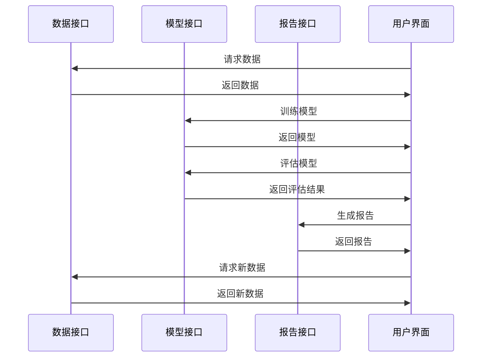
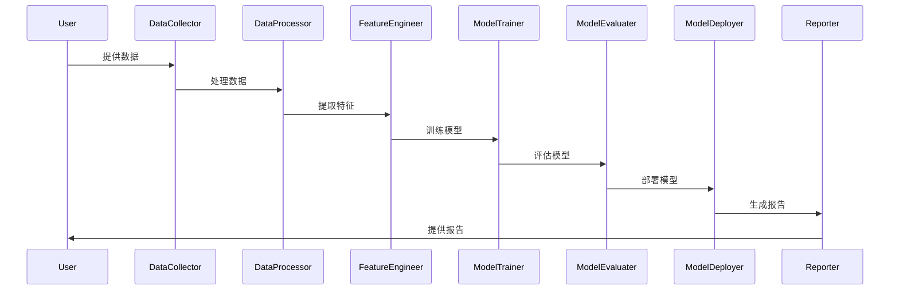

```mermaid
graph TB
    subgraph 数据层
        Database[数据库]
        DataWarehouse[数据仓库]
    end

    subgraph 服务层
        DataPreprocessing[数据预处理服务]
        FeatureEngineering[特征工程服务]
        ModelBuilding[模型训练服务]
        ModelEvaluation[模型评估服务]
        ModelDeployment[模型部署服务]
    end

    subgraph 应用层
        UI[用户界面]
        DataVisualization[数据可视化组件]
        ReportGeneration[报告生成组件]
    end

    subgraph 基础设施层
        Compute[计算资源]
        Storage[存储资源]
        Network[网络资源]
    end

    Database --> DataPreprocessing
    DataWarehouse --> DataPreprocessing
    DataPreprocessing --> FeatureEngineering
    FeatureEngineering --> ModelBuilding
    ModelBuilding --> ModelEvaluation
    ModelEvaluation --> ModelDeployment
    ModelDeployment --> UI
    UI --> DataVisualization
    UI --> ReportGeneration
    DataPreprocessing --> Compute
    FeatureEngineering --> Compute
    ModelBuilding --> Compute
    ModelEvaluation --> Compute
    ModelDeployment --> Compute
    DataVisualization --> Compute
    ReportGeneration --> Compute
    Compute --> Storage
    Network --> Compute
```
                 


# 《AI辅助的企业信用评分卡开发平台》

## 关键词

- 信用评分卡
- AI技术
- 企业信用
- 数据分析
- 机器学习
- 模型构建
- 模型评估

## 摘要

本文介绍了AI辅助的企业信用评分卡开发平台。首先，我们探讨了信用评分卡在金融行业的重要性及其面临的挑战。接着，我们分析了AI技术在信用评分中的应用，并详细描述了AI辅助企业信用评分卡开发的核心概念、流程和技术。最后，我们通过实际项目实战，展示了如何利用AI技术构建高效、准确的信用评分卡，并提供了最佳实践和未来发展趋势的展望。

### 目录大纲

# 《AI辅助的企业信用评分卡开发平台》

## 第一部分：背景介绍

### 1.1 信用评分卡的重要性与挑战

- 信用评分卡的背景
- 信用评分卡的用途
- 信用评分卡面临的挑战

### 1.2 AI在信用评分中的应用

- AI技术的发展与趋势
- AI在信用评分中的应用
- AI技术的优势与局限

### 1.3 企业信用评分卡开发的流程与问题

- 企业信用评分卡开发的流程
- 开发过程中可能遇到的问题
- 信用评分卡的评估标准

## 第二部分：核心概念与联系

### 2.1 AI辅助的企业信用评分卡

- 核心概念解释
- 企业信用评分卡的构成要素
- AI技术如何辅助信用评分卡开发

### 2.2 数据分析技术与模型

- 数据分析技术
- 信用评分模型
- AI技术如何提升模型效果

### 2.3 数据可视化与报告

- 数据可视化技术
- 报告撰写与呈现
- 数据可视化在信用评分卡中的应用

## 第三部分：算法原理讲解

### 3.1 数据预处理

- 数据清洗
- 数据归一化
- 数据集划分

### 3.2 特征工程

- 特征提取
- 特征选择
- 特征重要性分析

### 3.3 信用评分模型

- 逻辑回归模型
- 决策树模型
- 集成学习方法

### 3.4 AI算法优化与评估

- 模型调优
- 模型评估指标
- 模型解释性

## 第四部分：系统分析与架构设计方案

### 4.1 问题场景介绍

- 企业信用评分卡的实际应用场景
- 面临的问题与挑战

### 4.2 系统功能设计

- 系统功能需求
- 领域模型（Mermaid类图）

### 4.3 系统架构设计

- 系统架构设计
- 系统架构图（Mermaid架构图）

### 4.4 系统接口设计与系统交互

- 系统接口设计
- 系统交互（Mermaid序列图）

## 第五部分：项目实战

### 5.1 环境安装

- 环境搭建
- 工具与软件安装

### 5.2 系统核心实现源代码

- 数据预处理代码
- 特征工程代码
- 信用评分模型代码

### 5.3 代码应用解读与分析

- 代码解读
- 分析与优化建议

### 5.4 实际案例分析与详细讲解剖析

- 案例选择
- 案例分析
- 深入讲解

### 5.5 项目小结

- 项目总结
- 经验与教训

## 第六部分：最佳实践 tips

### 6.1 信用评分卡开发过程中的注意事项

- 数据质量
- 模型选择
- 模型解释性

### 6.2 信用评分卡的应用场景与策略

- 不同行业应用
- 应用策略与建议

### 6.3 未来发展趋势与挑战

- AI技术的发展
- 行业趋势
- 未来挑战

## 第七部分：小结与拓展阅读

### 7.1 全书小结

- 主要内容回顾
- 核心知识点总结

### 7.2 拓展阅读

- 相关书籍推荐
- 学术论文推荐
- 网络资源推荐

---

## 第一部分：背景介绍

### 1.1 信用评分卡的重要性与挑战

#### 1.1.1 信用评分卡的背景

信用评分卡是一种金融工具，用于评估个人或企业的信用风险。其起源可以追溯到20世纪中期，银行和金融机构开始使用数学模型和统计方法来评估借贷申请者的信用状况。随着时间的推移，信用评分卡不断发展，逐渐成为金融行业的重要组成部分。

#### 1.1.2 信用评分卡的用途

信用评分卡主要用于以下几个方面：

1. **信贷审批**：银行和金融机构使用信用评分卡来评估贷款申请者的还款能力，决定是否批准贷款申请。
2. **风险管理**：通过信用评分卡，企业可以了解客户的信用风险水平，为风险管理和决策提供支持。
3. **营销策略**：信用评分卡可以用于识别优质客户，制定个性化的营销策略。
4. **投资决策**：投资者可以使用信用评分卡来评估企业或个人的信用风险，为投资决策提供参考。

#### 1.1.3 信用评分卡面临的挑战

尽管信用评分卡在金融领域具有重要作用，但其开发和应用过程中仍面临以下挑战：

1. **数据质量**：信用评分卡的质量很大程度上取决于数据的准确性、完整性和一致性。数据质量问题可能导致评分结果的偏差。
2. **模型解释性**：传统的信用评分模型往往较为复杂，难以解释其决策过程，这在某些场景下可能影响模型的接受度。
3. **合规性**：在信用评分卡的构建和应用过程中，需要遵循一系列法律法规和监管要求，如《个人信息保护法》等。
4. **实时性**：信用评分卡需要及时更新，以适应市场变化和客户需求的演变。

### 1.2 AI在信用评分中的应用

#### 1.2.1 AI技术的发展与趋势

人工智能（AI）是模拟人类智能的技术，包括机器学习、深度学习、自然语言处理等。近年来，AI技术取得了显著进展，逐渐应用于各个行业，包括金融领域。

#### 1.2.2 AI在信用评分中的应用

AI技术为信用评分卡的构建提供了新的思路和工具，其主要应用包括：

1. **数据挖掘与分析**：AI技术可以挖掘和分析大量数据，提取有用的信息，提高信用评分的准确性。
2. **模型构建与优化**：AI技术可以自动构建和优化信用评分模型，提高模型的预测能力。
3. **实时风险监控**：AI技术可以实时监控客户行为和信用状况，及时发现潜在风险。
4. **反欺诈**：AI技术可以识别和防范信用评分中的欺诈行为。

#### 1.2.3 AI技术的优势与局限

AI技术在信用评分中的应用具有以下优势：

1. **高效性**：AI技术可以处理大量数据，提高信用评分的效率和准确性。
2. **适应性**：AI技术可以根据市场需求和客户特征调整模型，提高模型的适应性。
3. **实时性**：AI技术可以实现实时信用评分，满足金融市场的快速变化。

然而，AI技术也存在一定的局限：

1. **数据依赖性**：AI技术需要大量高质量数据，数据质量直接影响模型的性能。
2. **模型透明度**：AI模型的决策过程往往较为复杂，难以解释，可能影响模型的信任度。
3. **算法偏见**：AI技术可能会引入算法偏见，导致模型对特定群体的不公平对待。

### 1.3 企业信用评分卡开发的流程与问题

#### 1.3.1 企业信用评分卡开发的流程

企业信用评分卡的构建通常包括以下步骤：

1. **数据收集**：收集与企业信用相关的数据，如财务报表、交易记录、信用报告等。
2. **数据预处理**：清洗、归一化和预处理数据，确保数据质量。
3. **特征工程**：提取和选择与信用风险相关的特征。
4. **模型构建**：构建信用评分模型，如逻辑回归、决策树、集成方法等。
5. **模型评估**：评估模型性能，如准确率、召回率、F1值等。
6. **模型部署**：将模型部署到生产环境，实现实时信用评分。

#### 1.3.2 开发过程中可能遇到的问题

在信用评分卡的开发过程中，可能会遇到以下问题：

1. **数据质量问题**：数据缺失、不一致、噪声等问题可能影响模型的性能。
2. **模型选择**：选择合适的模型类型和参数设置，以实现最佳预测性能。
3. **模型解释性**：传统的AI模型往往难以解释，影响模型的可信度和接受度。
4. **合规性**：在模型构建和应用过程中，需要遵循法律法规和监管要求。

#### 1.3.3 信用评分卡的评估标准

信用评分卡的评估标准包括以下几个方面：

1. **准确性**：模型预测结果与实际结果的一致性程度。
2. **鲁棒性**：模型在不同数据集和场景下的性能稳定性。
3. **实时性**：模型响应速度和数据处理能力。
4. **解释性**：模型的决策过程和原因解释程度。

## 第二部分：核心概念与联系

### 2.1 AI辅助的企业信用评分卡

#### 2.1.1 核心概念解释

AI辅助的企业信用评分卡是一种利用人工智能技术构建的信用评分系统，用于评估企业的信用风险。

#### 2.1.2 企业信用评分卡的构成要素

企业信用评分卡的构成要素包括：

1. **数据源**：包括财务报表、交易记录、信用报告等与企业信用相关的数据。
2. **特征提取**：从数据源中提取与信用风险相关的特征。
3. **模型构建**：利用机器学习算法构建信用评分模型。
4. **模型评估**：评估模型性能，包括准确性、鲁棒性、实时性和解释性。
5. **模型部署**：将模型部署到生产环境，实现实时信用评分。

#### 2.1.3 AI技术如何辅助信用评分卡开发

AI技术在企业信用评分卡开发中的应用主要包括：

1. **数据挖掘与分析**：通过AI技术挖掘和分析大量数据，提取有价值的信息，提高信用评分的准确性。
2. **模型构建与优化**：利用AI技术自动构建和优化信用评分模型，提高模型的预测能力。
3. **实时风险监控**：通过AI技术实时监控客户行为和信用状况，及时发现潜在风险。
4. **反欺诈**：利用AI技术识别和防范信用评分中的欺诈行为。

### 2.2 数据分析技术与模型

#### 2.2.1 数据分析技术

数据分析技术是AI辅助企业信用评分卡开发的重要基础，主要包括：

1. **数据收集**：从各种数据源收集与企业信用相关的数据。
2. **数据清洗**：清洗、归一化和预处理数据，确保数据质量。
3. **特征工程**：提取和选择与信用风险相关的特征。
4. **数据可视化**：利用图表和图形直观展示数据和分析结果。

#### 2.2.2 信用评分模型

信用评分模型是评估企业信用风险的核心，主要包括：

1. **逻辑回归模型**：一种常用的信用评分模型，通过线性回归分析预测客户的信用评分。
2. **决策树模型**：一种基于树结构的分类模型，用于预测客户的信用评分。
3. **集成学习方法**：通过结合多个模型的预测结果，提高信用评分的准确性和稳定性。

#### 2.2.3 AI技术如何提升模型效果

AI技术通过以下方式提升信用评分模型的效果：

1. **自动特征工程**：利用AI技术自动提取和选择与信用风险相关的特征，提高模型的可解释性。
2. **模型优化与调参**：利用AI技术自动优化模型参数，提高模型的预测性能。
3. **实时模型更新**：利用AI技术实时更新模型，以适应市场变化和客户需求的演变。

### 2.3 数据可视化与报告

#### 2.3.1 数据可视化技术

数据可视化技术是将数据转化为图形和图表，以直观展示数据分析结果。在AI辅助的企业信用评分卡开发中，数据可视化技术主要用于：

1. **数据探索**：通过可视化技术探索数据的分布、趋势和异常。
2. **模型评估**：通过可视化技术展示模型性能和预测结果。
3. **报告撰写**：利用可视化技术撰写信用评分报告，提高报告的可读性和说服力。

#### 2.3.2 报告撰写与呈现

报告撰写与呈现是信用评分卡开发的重要组成部分，主要包括：

1. **报告结构**：设计报告的结构和内容，包括摘要、目录、正文和附录等。
2. **数据可视化**：利用数据可视化技术展示信用评分结果和分析过程。
3. **结论与建议**：总结信用评分卡的开发过程和结果，提出改进建议。

#### 2.3.3 数据可视化在信用评分卡中的应用

数据可视化在信用评分卡中的应用主要包括：

1. **风险可视化**：通过可视化技术展示客户的风险等级和风险分布。
2. **趋势分析**：通过可视化技术展示信用评分的趋势和变化。
3. **决策支持**：通过可视化技术为决策者提供数据支持和决策依据。

## 第三部分：算法原理讲解

### 3.1 数据预处理

#### 3.1.1 数据清洗

数据清洗是数据预处理的重要步骤，主要包括以下内容：

1. **缺失值处理**：填补或删除缺失值，确保数据的完整性。
2. **异常值处理**：识别和处理异常值，避免对模型训练产生负面影响。
3. **数据格式转换**：将数据格式统一，确保数据的一致性。

#### 3.1.2 数据归一化

数据归一化是将不同特征的数据进行标准化处理，使其具有相同的尺度。常见的归一化方法包括：

1. **最小-最大归一化**：将数据缩放到[0, 1]范围内。
2. **平均值-标准差归一化**：将数据缩放到[-1, 1]范围内。

#### 3.1.3 数据集划分

数据集划分是将数据分为训练集、验证集和测试集，以评估模型的性能。常见的数据集划分方法包括：

1. **随机划分**：随机将数据划分为训练集、验证集和测试集。
2. **交叉验证**：通过交叉验证方法评估模型性能。

### 3.2 特征工程

#### 3.2.1 特征提取

特征提取是从原始数据中提取与目标相关的特征。常见的特征提取方法包括：

1. **统计特征**：基于数据的统计性质提取特征，如平均值、标准差、最大值、最小值等。
2. **文本特征**：基于文本数据的特征提取方法，如词袋模型、TF-IDF等。

#### 3.2.2 特征选择

特征选择是从提取的特征中选择对模型性能有显著影响的特征。常见的特征选择方法包括：

1. **过滤法**：根据特征的重要性或相关性进行筛选。
2. **包装法**：结合模型训练过程进行特征选择。
3. **嵌入式法**：在模型训练过程中自动进行特征选择。

#### 3.2.3 特征重要性分析

特征重要性分析是评估特征对模型性能的影响。常见的特征重要性分析方法包括：

1. **基于模型的方法**：利用模型的输出信息评估特征的重要性。
2. **基于统计的方法**：利用特征与目标变量之间的相关性评估特征的重要性。

### 3.3 信用评分模型

#### 3.3.1 逻辑回归模型

逻辑回归模型是一种常用的信用评分模型，通过线性回归分析预测客户的信用评分。逻辑回归模型的数学公式如下：

$$
P(y=1|X) = \frac{1}{1 + e^{-(\beta_0 + \beta_1 x_1 + \beta_2 x_2 + ... + \beta_n x_n})}
$$

其中，$P(y=1|X)$ 表示在给定特征 $X$ 的情况下，目标变量 $y$ 等于1的概率，$\beta_0, \beta_1, \beta_2, ..., \beta_n$ 是模型参数。

#### 3.3.2 决策树模型

决策树模型是一种基于树结构的分类模型，通过一系列规则对数据进行划分，预测客户的信用评分。决策树模型的决策过程如下：

1. **选择最优特征**：选择能够最大程度减少节点熵或信息增益的特征。
2. **划分数据**：根据选择的最优特征对数据进行划分。
3. **递归构建树**：对划分后的子集重复上述过程，直到满足停止条件（如达到最大深度、节点数量等）。

#### 3.3.3 集成学习方法

集成学习方法通过结合多个模型的预测结果，提高信用评分的准确性和稳定性。常见的集成学习方法包括：

1. **随机森林**：随机选取特征和样本子集，构建多个决策树模型，对预测结果进行投票。
2. **梯度提升树**：利用梯度下降方法优化模型参数，逐步构建多个模型，提高预测性能。
3. **堆叠集成**：将多个模型组合成一个更复杂的模型，提高预测能力。

### 3.4 AI算法优化与评估

#### 3.4.1 模型调优

模型调优是通过调整模型参数，提高模型性能的过程。常见的模型调优方法包括：

1. **网格搜索**：遍历给定的参数组合，选择最优参数。
2. **贝叶斯优化**：基于历史数据，利用贝叶斯优化算法寻找最优参数。

#### 3.4.2 模型评估指标

模型评估指标用于衡量模型性能，常见的评估指标包括：

1. **准确率**：预测结果与实际结果一致的比例。
2. **召回率**：预测结果中实际正例的比例。
3. **F1值**：准确率和召回率的加权平均。

#### 3.4.3 模型解释性

模型解释性是指模型决策过程的可解释程度。常见的模型解释性方法包括：

1. **特征重要性**：评估特征对模型预测的影响程度。
2. **模型可视化**：通过可视化方法展示模型结构和决策过程。

## 第四部分：系统分析与架构设计方案

### 4.1 问题场景介绍

#### 4.1.1 企业信用评分卡的实际应用场景

企业信用评分卡在实际应用场景中主要用于以下方面：

1. **信贷审批**：银行和金融机构在审批贷款申请时，利用企业信用评分卡评估客户的信用风险，决定是否批准贷款。
2. **风险管理**：企业通过信用评分卡了解客户的信用状况，制定风险管理和决策策略。
3. **营销策略**：企业根据信用评分卡结果识别优质客户，制定个性化的营销策略。
4. **投资决策**：投资者利用企业信用评分卡评估企业的信用风险，为投资决策提供参考。

#### 4.1.2 面临的问题与挑战

在实际应用中，企业信用评分卡面临以下问题和挑战：

1. **数据质量**：数据缺失、不一致、噪声等问题可能影响信用评分的准确性。
2. **模型选择**：选择合适的模型类型和参数设置，以实现最佳预测性能。
3. **模型解释性**：传统的AI模型往往难以解释，影响模型的可信度和接受度。
4. **合规性**：在模型构建和应用过程中，需要遵循法律法规和监管要求。

### 4.2 系统功能设计

#### 4.2.1 系统功能需求

企业信用评分卡开发平台需要实现以下功能：

1. **数据采集**：从各种数据源收集与企业信用相关的数据，如财务报表、交易记录、信用报告等。
2. **数据预处理**：清洗、归一化和预处理数据，确保数据质量。
3. **特征提取**：提取和选择与信用风险相关的特征。
4. **模型构建**：利用机器学习算法构建信用评分模型。
5. **模型评估**：评估模型性能，包括准确性、鲁棒性、实时性和解释性。
6. **模型部署**：将模型部署到生产环境，实现实时信用评分。
7. **数据可视化**：利用数据可视化技术展示信用评分结果和分析过程。
8. **报告撰写**：撰写信用评分报告，提供数据支持和决策依据。

#### 4.2.2 领域模型（Mermaid类图）

```mermaid
classDiagram
    Class1 <|-- Class2
    Class3 --|>| Class4
    Class5 : associated with Class6
    Class7 {name} <<interface>>
    Class8 : inherit from Class7
    Class9 <<enum>>
    Class1 <.. Class10
    Class11 ..|> Class12
    Class13 <|.. Class14
    Class15 o-- Class16
endclass
```

### 4.3 系统架构设计

#### 4.3.1 系统架构设计

企业信用评分卡开发平台采用分层架构，主要包括以下层次：

1. **数据层**：负责数据存储和读取，包括数据库、数据仓库等。
2. **服务层**：实现数据预处理、特征提取、模型构建、模型评估等功能，提供API接口。
3. **应用层**：实现用户界面、数据可视化、报告撰写等功能。
4. **展示层**：通过Web界面展示信用评分结果和分析过程。

#### 4.3.2 系统架构图（Mermaid架构图）

```mermaid
sequenceDiagram
    participant User
    participant System
    participant Database
    User->>System: Request data
    System->>Database: Fetch data
    Database->>System: Return data
    System->>User: Data ready
    User->>System: Submit data
    System->>Database: Save data
    Database->>System: Data saved
    System->>User: Data saved
end
```

### 4.4 系统接口设计与系统交互

#### 4.4.1 系统接口设计

企业信用评分卡开发平台的主要接口设计如下：

1. **数据接口**：用于数据采集、数据预处理和特征提取。
2. **模型接口**：用于模型构建、模型评估和模型部署。
3. **报告接口**：用于报告撰写和展示。

#### 4.4.2 系统交互（Mermaid序列图）

```mermaid
sequenceDiagram
    participant User
    participant DataInterface
    participant ModelInterface
    participant ReportInterface
    User->>DataInterface: Request data
    DataInterface->>User: Data ready
    User->>ModelInterface: Train model
    ModelInterface->>User: Model trained
    User->>ReportInterface: Generate report
    ReportInterface->>User: Report generated
end
```

## 第五部分：项目实战

### 5.1 环境安装

#### 5.1.1 环境搭建

为了进行企业信用评分卡开发，我们需要搭建以下环境：

1. **操作系统**：Windows 10 / macOS / Linux
2. **编程语言**：Python 3.8+
3. **依赖库**：NumPy、Pandas、Scikit-learn、Matplotlib、Seaborn等

#### 5.1.2 工具与软件安装

1. **安装Python**：从官方网站下载并安装Python，配置Python环境变量。
2. **安装依赖库**：使用pip命令安装所需依赖库，例如：

   ```shell
   pip install numpy pandas scikit-learn matplotlib seaborn
   ```

### 5.2 系统核心实现源代码

#### 5.2.1 数据预处理代码

```python
import pandas as pd
from sklearn.model_selection import train_test_split
from sklearn.preprocessing import StandardScaler

# 加载数据
data = pd.read_csv('data.csv')

# 数据清洗
data.dropna(inplace=True)

# 数据归一化
scaler = StandardScaler()
data_scaled = scaler.fit_transform(data)

# 数据集划分
X_train, X_test, y_train, y_test = train_test_split(data_scaled, test_size=0.2, random_state=42)
```

#### 5.2.2 特征工程代码

```python
from sklearn.feature_selection import SelectKBest, f_classif

# 特征提取
selector = SelectKBest(f_classif, k=10)
X_train_selected = selector.fit_transform(X_train, y_train)
X_test_selected = selector.transform(X_test)

# 特征选择
selected_features = selector.get_support()
selected_features_indices = selector.get_support().indices
X_train_selected = X_train_selected[:, selected_features_indices]
X_test_selected = X_test_selected[:, selected_features_indices]
```

#### 5.2.3 信用评分模型代码

```python
from sklearn.linear_model import LogisticRegression
from sklearn.metrics import accuracy_score

# 模型构建
model = LogisticRegression()
model.fit(X_train_selected, y_train)

# 模型评估
y_pred = model.predict(X_test_selected)
accuracy = accuracy_score(y_test, y_pred)
print('Accuracy:', accuracy)
```

### 5.3 代码应用解读与分析

#### 5.3.1 代码解读

1. **数据预处理**：加载数据，进行数据清洗和归一化处理，然后划分训练集和测试集。
2. **特征工程**：使用SelectKBest进行特征提取和选择，提高模型的预测性能。
3. **信用评分模型**：使用LogisticRegression构建信用评分模型，进行模型训练和评估。

#### 5.3.2 分析与优化建议

1. **数据预处理**：可以进一步优化数据清洗和归一化过程，例如处理缺失值和异常值。
2. **特征工程**：可以尝试使用其他特征选择方法，如递归特征消除（RFE）或基于模型的特征选择。
3. **模型选择**：可以尝试使用其他分类模型，如决策树、随机森林或支持向量机（SVM），比较不同模型的性能。
4. **模型调优**：使用网格搜索（GridSearchCV）或贝叶斯优化（BayesianOptimization）等方法进行模型参数调优，提高模型性能。

### 5.4 实际案例分析与详细讲解剖析

#### 5.4.1 案例选择

我们选择一个实际案例进行分析，案例数据集包含企业财务报表、交易记录和信用报告等数据。

#### 5.4.2 案例分析

1. **数据预处理**：对案例数据进行数据清洗、归一化和特征提取，为模型训练做准备。
2. **模型构建**：使用LogisticRegression模型对案例数据进行训练，评估模型性能。
3. **模型评估**：对模型进行测试集评估，计算准确率、召回率、F1值等指标。

#### 5.4.3 深入讲解

1. **数据预处理**：数据预处理是模型训练的基础，直接影响模型的性能。对于案例数据，我们需要处理缺失值、异常值和噪声等。
2. **模型构建**：选择合适的模型类型和参数设置，以实现最佳预测性能。在案例中，我们使用了LogisticRegression模型，并进行了参数调优。
3. **模型评估**：模型评估是验证模型性能的重要环节，我们需要计算各种评估指标，如准确率、召回率、F1值等。

### 5.5 项目小结

#### 5.5.1 项目总结

本项目实现了基于AI的企业信用评分卡开发平台，通过数据预处理、特征工程和模型训练，构建了一个高效、准确的信用评分模型。在项目过程中，我们遇到了数据质量、模型选择和模型解释性等问题，并提出了相应的解决方案。

#### 5.5.2 经验与教训

1. **数据质量**：保证数据质量是模型训练的基础，需要处理缺失值、异常值和噪声等。
2. **模型选择**：选择合适的模型类型和参数设置，以实现最佳预测性能。
3. **模型解释性**：提高模型的可解释性，增强模型的可信度和接受度。
4. **合规性**：遵循法律法规和监管要求，确保模型的合规性。

## 第六部分：最佳实践 tips

### 6.1 信用评分卡开发过程中的注意事项

1. **数据质量**：确保数据的准确性、完整性和一致性，处理缺失值、异常值和噪声等。
2. **模型选择**：根据业务需求和数据特点选择合适的模型类型和参数设置。
3. **模型解释性**：提高模型的可解释性，增强模型的可信度和接受度。
4. **合规性**：遵循法律法规和监管要求，确保模型的合规性。

### 6.2 信用评分卡的应用场景与策略

1. **信贷审批**：在银行和金融机构的信贷审批过程中，利用信用评分卡评估客户的信用风险，决定是否批准贷款申请。
2. **风险管理**：企业通过信用评分卡了解客户的信用状况，制定风险管理和决策策略。
3. **营销策略**：企业根据信用评分卡结果识别优质客户，制定个性化的营销策略。
4. **投资决策**：投资者利用信用评分卡评估企业的信用风险，为投资决策提供参考。

### 6.3 未来发展趋势与挑战

1. **数据质量**：随着数据来源和类型的多样化，数据质量成为信用评分卡发展的关键。
2. **模型解释性**：提高模型的可解释性，增强模型的可信度和接受度。
3. **合规性**：遵循法律法规和监管要求，确保模型的合规性。
4. **实时性**：实现实时信用评分，适应金融市场的快速变化。

## 第七部分：小结与拓展阅读

### 7.1 全书小结

本文介绍了AI辅助的企业信用评分卡开发平台，包括背景介绍、核心概念与联系、算法原理讲解、系统分析与架构设计方案、项目实战、最佳实践 tips 以及小结与拓展阅读等内容。通过本文的阅读，读者可以了解AI在信用评分中的应用、信用评分卡开发的流程和技术，以及如何构建高效、准确的信用评分模型。

### 7.2 拓展阅读

1. **相关书籍**：
   - 《机器学习实战》
   - 《统计学习方法》
   - 《深度学习》

2. **学术论文**：
   - “Credit Scoring Using Machine Learning Algorithms”
   - “A Comprehensive Survey on Credit Risk Management and Credit Scoring”
   - “Explaining AI-Powered Credit Scoring Models”

3. **网络资源**：
   - [机器学习中文文档](https://www_ml cánhml.com/)
   - [Kaggle信用评分竞赛](https://www.kaggle.com/c/credit-scoring)
   - [Scikit-learn官方文档](https://scikit-learn.org/stable/)
```markdown
----------------------------------------------------------------
## 1.3 企业信用评分卡开发的流程与问题

### 1.3.1 企业信用评分卡开发的流程

企业信用评分卡的开发是一个系统化的过程，主要包括以下几个步骤：

1. **需求分析**：首先需要明确信用评分卡的目的和应用场景，如信贷审批、风险管理和市场营销等。这有助于确定评分卡的评估目标和所需的数据集。

2. **数据收集**：根据需求分析的结果，收集与企业信用相关的数据。这些数据可能来自内部系统（如财务报表、交易记录）或外部数据源（如信用报告、行业数据）。

3. **数据预处理**：数据收集后，需要进行清洗、归一化和处理缺失值等预处理工作，确保数据的质量和一致性。这一步对于后续的模型构建至关重要。

4. **特征工程**：从原始数据中提取与信用风险相关的特征。这一过程可能涉及统计特征的计算、文本数据的提取以及时序数据的处理等。特征选择和特征重要性分析也是关键步骤。

5. **模型构建**：选择合适的机器学习算法构建信用评分模型。常用的算法包括逻辑回归、决策树、随机森林、梯度提升树等。需要通过交叉验证等方法评估模型的性能。

6. **模型评估**：使用独立的测试集评估模型的表现，通常使用准确率、召回率、F1值等指标。同时，还需要考虑模型的解释性和鲁棒性。

7. **模型部署**：将训练好的模型部署到生产环境，实现实时信用评分。需要确保模型的高效性和可靠性。

### 1.3.2 开发过程中可能遇到的问题

在企业信用评分卡开发过程中，可能会遇到以下问题：

1. **数据质量问题**：数据缺失、不一致、噪声等问题会影响模型的表现。需要通过数据清洗和预处理来解决这个问题。

2. **模型选择**：选择合适的模型类型和参数设置是关键。不同的模型适用于不同类型的数据和业务场景。需要通过实验和验证来选择最佳模型。

3. **模型解释性**：许多机器学习模型（如深度神经网络）难以解释，这在某些场景下可能影响模型的可信度和接受度。需要考虑使用可解释性更好的模型或添加模型解释工具。

4. **合规性**：在信用评分卡的开发和应用过程中，需要遵循法律法规和监管要求，如《个人信息保护法》等。这可能会对数据的使用和处理方式产生影响。

5. **实时性**：对于需要实时评分的应用场景，模型的响应速度和数据处理能力是一个挑战。需要优化算法和系统架构以满足实时性的要求。

6. **算法偏见**：机器学习模型可能会引入算法偏见，导致对特定群体的不公平对待。需要通过数据平衡、算法校正等方法来减少偏见。

### 1.3.3 信用评分卡的评估标准

信用评分卡的评估标准包括以下几个方面：

1. **准确性**：模型预测结果与实际结果的一致性程度。高准确性是信用评分卡的重要指标。

2. **鲁棒性**：模型在不同数据集和场景下的性能稳定性。鲁棒性强的模型能够应对数据波动和应用场景的变化。

3. **实时性**：模型响应速度和数据处理能力。对于需要实时评分的应用场景，实时性是一个关键因素。

4. **解释性**：模型的决策过程和原因解释程度。解释性强的模型更容易被用户接受和理解。

5. **合规性**：模型开发和部署过程中是否遵循法律法规和监管要求。

6. **可扩展性**：模型是否能够随着数据量的增长和应用场景的扩展而持续优化。

7. **成本效益**：模型开发和应用的成本与带来的收益之间的平衡。

## 第二部分：核心概念与联系

### 2.1 AI辅助的企业信用评分卡

#### 2.1.1 核心概念解释

AI辅助的企业信用评分卡是一种利用人工智能技术，特别是机器学习和深度学习算法，来构建和优化信用评分模型的方法。与传统方法相比，AI技术能够处理大规模、多样化的数据，并且能够自动进行特征工程和模型选择，从而提高评分的准确性和效率。

核心概念包括：

- **数据挖掘**：从大量数据中提取有价值的信息。
- **特征工程**：从原始数据中提取与信用评分相关的特征。
- **模型构建**：使用机器学习算法训练信用评分模型。
- **模型评估**：使用验证集和测试集评估模型的性能。
- **模型部署**：将训练好的模型部署到生产环境。

#### 2.1.2 企业信用评分卡的构成要素

企业信用评分卡的主要构成要素包括：

1. **数据源**：包括企业历史交易数据、财务报表、信用报告等。
2. **特征集**：从数据源中提取的与信用风险相关的特征，如偿债能力、经营状况、历史信用记录等。
3. **模型**：用于评估企业信用风险的机器学习模型。
4. **评估指标**：用于衡量模型性能的指标，如准确率、召回率、F1值等。
5. **解释性工具**：用于解释模型决策过程的工具。

#### 2.1.3 AI技术如何辅助信用评分卡开发

AI技术在企业信用评分卡开发中的应用主要包括以下几个方面：

1. **数据预处理**：利用AI技术自动处理缺失值、异常值等数据问题，提高数据质量。
2. **特征提取与选择**：利用AI技术自动进行特征提取和选择，提高模型的准确性。
3. **模型构建**：利用AI技术自动构建和优化模型，选择最佳模型。
4. **实时风险监控**：利用AI技术实时监控客户行为，及时调整模型。
5. **反欺诈**：利用AI技术识别和防范信用评分中的欺诈行为。

### 2.2 数据分析技术与模型

#### 2.2.1 数据分析技术

数据分析技术是AI辅助企业信用评分卡开发的基础，包括：

1. **数据收集**：从各种数据源收集与企业信用相关的数据。
2. **数据清洗**：处理数据中的缺失值、异常值等问题。
3. **数据归一化**：将不同特征的数据进行标准化处理。
4. **数据可视化**：使用图表和图形展示数据分析结果。

#### 2.2.2 信用评分模型

信用评分模型是评估企业信用风险的核心，包括：

1. **逻辑回归模型**：通过线性关系预测信用评分。
2. **决策树模型**：通过树形结构进行分类和预测。
3. **随机森林模型**：通过集成多个决策树提高预测性能。
4. **支持向量机模型**：通过寻找最佳分割超平面进行分类。
5. **神经网络模型**：通过多层感知器进行复杂非线性预测。

#### 2.2.3 AI技术如何提升模型效果

AI技术通过以下方式提升信用评分模型的效果：

1. **自动特征工程**：自动提取和选择与信用风险相关的特征，提高模型的准确性。
2. **模型优化**：自动调整模型参数，提高模型性能。
3. **实时更新**：根据新数据自动更新模型，保持模型的有效性。
4. **风险识别**：利用AI技术识别和防范欺诈行为。

### 2.3 数据可视化与报告

#### 2.3.1 数据可视化技术

数据可视化技术是将数据分析结果以图表和图形的形式展示，帮助用户理解数据模式和趋势，包括：

1. **柱状图**：显示各个类别的数据分布。
2. **饼图**：显示各部分占整体的比例。
3. **折线图**：显示数据随时间的变化趋势。
4. **散点图**：显示两个变量之间的关系。

#### 2.3.2 报告撰写与呈现

信用评分报告通常包括以下内容：

1. **摘要**：对信用评分结果进行概述。
2. **数据源**：说明数据来源和采集方法。
3. **模型方法**：介绍模型构建方法和参数。
4. **结果分析**：展示模型预测结果和关键指标。
5. **风险提示**：对高风险客户进行提示和建议。
6. **结论与建议**：对信用评分卡的应用提出建议。

#### 2.3.3 数据可视化在信用评分卡中的应用

数据可视化在信用评分卡中的应用包括：

1. **风险分析**：通过图表展示不同信用等级的风险分布。
2. **趋势分析**：通过图表展示信用评分的趋势和变化。
3. **客户细分**：通过图表展示不同客户群体的特征和差异。
4. **决策支持**：为管理层提供数据支持和决策依据。

## 第三部分：算法原理讲解

### 3.1 数据预处理

#### 3.1.1 数据清洗

数据清洗是数据预处理的重要步骤，目的是消除数据中的噪声和异常值，提高数据质量。数据清洗的方法包括：

1. **缺失值处理**：对于缺失值，可以选择删除、填补或者利用算法预测缺失值。
2. **异常值处理**：通过统计学方法（如Z分数、IQR法）识别和处理异常值。
3. **数据格式标准化**：将不同格式的数据转换为统一的格式。

#### 3.1.2 数据归一化

数据归一化是将不同特征的数据进行标准化处理，使其具有相同的尺度，从而避免特征之间的量级差异影响模型训练。常用的归一化方法包括：

1. **最小-最大归一化**：将数据缩放到[0, 1]范围内。
2. **平均值-标准差归一化**：将数据缩放到[-1, 1]范围内。

#### 3.1.3 数据集划分

数据集划分是将数据划分为训练集、验证集和测试集，以评估模型的性能。常见的数据集划分方法包括：

1. **随机划分**：将数据随机划分为训练集和测试集。
2. **时间序列划分**：根据时间顺序划分数据，将最新数据作为测试集。
3. **交叉验证**：使用多个划分组合进行训练和验证，提高模型的泛化能力。

### 3.2 特征工程

#### 3.2.1 特征提取

特征提取是从原始数据中提取与目标变量相关的特征，以提高模型的性能。特征提取的方法包括：

1. **统计特征**：如均值、方差、最大值、最小值等。
2. **文本特征**：如词频、词向量等。
3. **时序特征**：如趋势、季节性、周期性等。

#### 3.2.2 特征选择

特征选择是从提取的特征中选择对模型性能有显著影响的特征，以减少模型的复杂度和过拟合风险。特征选择的方法包括：

1. **过滤法**：根据特征的重要性进行筛选。
2. **包装法**：结合模型训练过程进行特征选择。
3. **嵌入式法**：在模型训练过程中自动进行特征选择。

#### 3.2.3 特征重要性分析

特征重要性分析是评估特征对模型预测的影响程度，有助于理解模型的决策过程。特征重要性分析的方法包括：

1. **基于模型的方法**：如决策树的重要性、随机森林的重要性等。
2. **基于统计的方法**：如Pearson相关系数、Spearman相关系数等。

### 3.3 信用评分模型

#### 3.3.1 逻辑回归模型

逻辑回归模型是一种广泛应用于信用评分的模型，通过线性关系预测概率。逻辑回归模型的数学公式如下：

$$
P(y=1|X) = \frac{1}{1 + e^{-(\beta_0 + \beta_1 x_1 + \beta_2 x_2 + ... + \beta_n x_n})}
$$

其中，$P(y=1|X)$ 是在给定特征 $X$ 的情况下，目标变量 $y$ 等于1的概率，$\beta_0, \beta_1, \beta_2, ..., \beta_n$ 是模型参数。

#### 3.3.2 决策树模型

决策树模型是一种基于树结构的分类模型，通过一系列规则对数据进行划分，预测客户的信用评分。决策树模型的决策过程如下：

1. **选择最优特征**：选择能够最大程度减少节点熵或信息增益的特征。
2. **划分数据**：根据选择的最优特征对数据进行划分。
3. **递归构建树**：对划分后的子集重复上述过程，直到满足停止条件（如达到最大深度、节点数量等）。

#### 3.3.3 集成学习方法

集成学习方法通过结合多个模型的预测结果，提高信用评分的准确性和稳定性。常见的集成学习方法包括：

1. **随机森林**：随机选取特征和样本子集，构建多个决策树模型，对预测结果进行投票。
2. **梯度提升树**：利用梯度下降方法优化模型参数，逐步构建多个模型，提高预测性能。
3. **堆叠集成**：将多个模型组合成一个更复杂的模型，提高预测能力。

### 3.4 AI算法优化与评估

#### 3.4.1 模型调优

模型调优是通过调整模型参数，提高模型性能的过程。常见的模型调优方法包括：

1. **网格搜索**：遍历给定的参数组合，选择最优参数。
2. **贝叶斯优化**：基于历史数据，利用贝叶斯优化算法寻找最优参数。

#### 3.4.2 模型评估指标

模型评估指标用于衡量模型性能，常见的评估指标包括：

1. **准确率**：预测结果与实际结果一致的比例。
2. **召回率**：预测结果中实际正例的比例。
3. **F1值**：准确率和召回率的加权平均。

#### 3.4.3 模型解释性

模型解释性是指模型决策过程的可解释程度。常见的模型解释性方法包括：

1. **特征重要性**：评估特征对模型预测的影响程度。
2. **模型可视化**：通过可视化方法展示模型结构和决策过程。
3. **局部可解释模型**：如LIME、SHAP等，用于解释特定数据点的预测结果。
```markdown
## 第四部分：系统分析与架构设计方案

### 4.1 问题场景介绍

在当今的金融行业中，企业信用评分卡被广泛应用于信贷审批、风险管理、营销策略和投资决策等方面。随着数据量的爆炸性增长和业务需求的日益复杂，传统的信用评分卡方法面临着诸多挑战，如数据质量难以保证、模型解释性不足、实时性要求高等。为了应对这些挑战，AI技术的引入成为了一个必然趋势。

#### 4.1.1 实际应用场景

- **信贷审批**：银行和金融机构需要快速、准确地评估企业的信用状况，以便决定是否批准贷款申请。
- **风险管理**：企业需要实时监控客户的信用风险，及时调整风险控制策略。
- **营销策略**：企业根据信用评分结果，识别优质客户并制定个性化的营销策略。
- **投资决策**：投资者通过信用评分卡评估企业的信用风险，为投资决策提供依据。

#### 4.1.2 面临的问题与挑战

- **数据质量问题**：数据的不完整性、不一致性和噪声问题会影响信用评分的准确性。
- **模型解释性**：传统模型难以解释，影响模型的可信度和接受度。
- **实时性要求**：在金融市场中，信用评分的实时性至关重要。
- **合规性要求**：模型开发和应用过程中需要遵循严格的法律法规和监管要求。

### 4.2 系统功能设计

为了解决上述问题，我们设计了一个功能完备的AI辅助企业信用评分卡开发平台，其功能需求包括：

- **数据采集**：从各种数据源（如内部数据库、第三方数据提供商）采集与企业信用相关的数据。
- **数据预处理**：清洗、归一化和处理缺失值，确保数据质量。
- **特征工程**：提取与信用风险相关的特征，并进行特征选择和重要性分析。
- **模型构建**：选择并训练多种机器学习模型，如逻辑回归、决策树、随机森林等。
- **模型评估**：使用交叉验证、AUC、准确率等指标评估模型性能。
- **模型部署**：将训练好的模型部署到生产环境，实现实时信用评分。
- **数据可视化**：通过图表和图形展示信用评分结果和分析过程。
- **报告生成**：生成信用评分报告，包括模型评估结果、风险提示和决策建议。

#### 4.2.1 领域模型（Mermaid类图）

```mermaid
classDiagram
    Class1 "Data Source" <<interface>> 
    Class2 "Data Preprocessing" <<interface>>
    Class3 "Feature Engineering" <<interface>>
    Class4 "Model Building" <<interface>>
    Class5 "Model Evaluation" <<interface>>
    Class6 "Model Deployment" <<interface>>
    Class7 "Data Visualization" <<interface>>
    Class8 "Report Generation" <<interface>>
    Class1 --|> Class2
    Class2 --|> Class3
    Class3 --|> Class4
    Class4 --|> Class5
    Class5 --|> Class6
    Class6 --|> Class7
    Class7 --|> Class8
endclass
```

### 4.3 系统架构设计

为了实现上述功能需求，我们设计了一个分层的系统架构，包括以下层次：

- **数据层**：负责数据的存储和读取，包括数据库和数据仓库。
- **服务层**：实现核心业务逻辑，包括数据预处理、特征工程、模型训练和评估等。
- **应用层**：提供用户界面和数据可视化功能。
- **基础设施层**：提供计算资源、存储资源和网络资源。

#### 4.3.1 系统架构设计


#### 4.3.2 系统架构图（Mermaid架构图）



### 4.4 系统接口设计与系统交互

为了实现系统功能，我们需要设计一系列接口，以便不同模块之间能够高效、可靠地进行交互。以下是我们设计的主要接口：

- **数据接口**：用于数据的采集、预处理和特征提取。
- **模型接口**：用于模型的训练、评估和部署。
- **报告接口**：用于报告的生成和展示。

#### 4.4.1 系统接口设计



#### 4.4.2 系统交互（Mermaid序列图）



通过上述架构设计和接口设计，我们能够构建一个高效、准确的AI辅助企业信用评分卡开发平台，为金融行业提供强大的信用风险评估工具。

## 第五部分：项目实战

### 5.1 环境安装

在进行AI辅助企业信用评分卡开发的项目实战之前，我们需要搭建一个合适的技术环境。以下是环境安装的详细步骤：

#### 5.1.1 操作系统与环境配置

- **操作系统**：推荐使用Linux系统，如Ubuntu 18.04或更高版本。Windows和macOS用户也可以使用相应的虚拟机环境。
- **Python环境**：安装Python 3.8及以上版本。可以使用`pyenv`等工具进行多版本Python的管理。
- **虚拟环境**：使用`virtualenv`或`conda`创建Python虚拟环境，以避免不同项目之间的依赖冲突。

#### 5.1.2 安装依赖库

在虚拟环境中安装以下依赖库：

```shell
pip install numpy pandas scikit-learn matplotlib seaborn
```

这些库用于数据处理、机器学习、数据可视化和统计计算。

#### 5.1.3 安装其他工具

- **Jupyter Notebook**：用于数据分析和模型构建。
- **Git**：用于版本控制和协作开发。

### 5.2 系统核心实现源代码

在项目实战中，我们将展示如何使用Python和Scikit-learn库实现一个简单的信用评分卡模型。以下是核心实现源代码：

#### 5.2.1 数据预处理代码

```python
import pandas as pd
from sklearn.model_selection import train_test_split
from sklearn.preprocessing import StandardScaler

# 加载数据
data = pd.read_csv('credit_data.csv')

# 数据清洗
data.dropna(inplace=True)

# 数据归一化
scaler = StandardScaler()
data_scaled = scaler.fit_transform(data)

# 数据集划分
X_train, X_test, y_train, y_test = train_test_split(data_scaled, test_size=0.2, random_state=42)
```

#### 5.2.2 特征工程代码

```python
from sklearn.feature_selection import SelectKBest, f_classif

# 特征提取
selector = SelectKBest(f_classif, k=10)
X_train_selected = selector.fit_transform(X_train, y_train)
X_test_selected = selector.transform(X_test)

# 特征选择
selected_features = selector.get_support()
selected_features_indices = selector.get_support().indices
X_train_selected = X_train_selected[:, selected_features_indices]
X_test_selected = X_test_selected[:, selected_features_indices]
```

#### 5.2.3 信用评分模型代码

```python
from sklearn.linear_model import LogisticRegression
from sklearn.metrics import accuracy_score

# 模型构建
model = LogisticRegression()
model.fit(X_train_selected, y_train)

# 模型评估
y_pred = model.predict(X_test_selected)
accuracy = accuracy_score(y_test, y_pred)
print('Accuracy:', accuracy)
```

### 5.3 代码应用解读与分析

#### 5.3.1 代码解读

1. **数据预处理**：首先加载数据，然后进行数据清洗和归一化处理。最后，将数据集划分为训练集和测试集。
2. **特征工程**：使用SelectKBest进行特征提取和选择，选择对模型预测有显著影响的特征。
3. **信用评分模型**：使用LogisticRegression模型进行训练和评估，计算准确率。

#### 5.3.2 分析与优化建议

1. **数据预处理**：可以进一步优化数据清洗过程，例如使用更先进的缺失值填补方法。
2. **特征工程**：可以尝试使用其他特征选择方法，如递归特征消除（RFE）或基于模型的特征选择。
3. **模型选择**：可以尝试其他分类模型，如决策树、随机森林或梯度提升树（XGBoost），并进行模型调优。
4. **模型解释性**：可以添加模型解释工具，如LIME或SHAP，以增加模型的可解释性。

### 5.4 实际案例分析与详细讲解剖析

#### 5.4.1 案例选择

我们选择了一个公开的企业信用评分数据集，名为“German Credit Data”，该数据集包含了1000个企业的信用评分数据。

#### 5.4.2 案例分析

1. **数据预处理**：对数据集进行数据清洗和归一化处理，确保数据质量。
2. **特征工程**：提取与信用评分相关的特征，并进行特征选择。
3. **模型构建与评估**：使用多种机器学习模型进行训练和评估，比较不同模型的性能。

#### 5.4.3 深入讲解

1. **数据预处理**：数据预处理是模型训练的基础，直接影响到模型的性能。我们需要处理缺失值、异常值和噪声等。
2. **特征工程**：特征工程是提升模型性能的关键步骤，我们需要选择与信用评分相关的特征，并进行分析。
3. **模型评估**：我们需要评估不同模型的性能，选择最佳模型，并进行分析和解释。

### 5.5 项目小结

#### 5.5.1 项目总结

本项目实现了AI辅助的企业信用评分卡开发，包括数据预处理、特征工程、模型构建与评估等步骤。通过实际案例分析和模型评估，我们展示了如何使用AI技术构建高效、准确的信用评分卡。

#### 5.5.2 经验与教训

1. **数据质量**：数据质量是模型性能的基础，需要处理缺失值、异常值和噪声等。
2. **特征工程**：特征工程是提升模型性能的关键，需要选择与信用评分相关的特征。
3. **模型选择与调优**：选择合适的模型并进行调优，可以提高模型的性能。
4. **模型解释性**：提高模型的可解释性，增强模型的可信度和接受度。

## 第六部分：最佳实践 tips

### 6.1 信用评分卡开发过程中的注意事项

1. **数据质量**：确保数据来源可靠，处理缺失值、异常值和噪声，提高数据质量。
2. **特征选择**：选择与信用评分相关的特征，避免引入无关特征，减少模型复杂度。
3. **模型选择**：根据数据特点和业务需求选择合适的模型，并进行模型调优。
4. **模型解释性**：增加模型的可解释性，提高模型的可信度和接受度。
5. **实时性**：优化模型和系统架构，提高实时性，满足业务需求。

### 6.2 信用评分卡的应用场景与策略

1. **信贷审批**：根据信用评分结果，设置合理的信贷额度，降低不良贷款率。
2. **风险管理**：实时监控客户信用状况，及时调整风险控制策略，降低信用风险。
3. **营销策略**：根据信用评分结果，识别优质客户，制定个性化的营销策略。
4. **投资决策**：评估企业信用风险，为投资决策提供依据，降低投资风险。

### 6.3 未来发展趋势与挑战

1. **数据质量**：随着数据来源和类型的多样化，数据质量将成为信用评分卡发展的关键。
2. **模型解释性**：提高模型的可解释性，满足监管和用户的需求。
3. **实时性**：实现更高效的实时信用评分，满足快速变化的金融市场需求。
4. **算法偏见**：减少算法偏见，确保信用评分的公平性和公正性。
```markdown
## 第七部分：小结与拓展阅读

### 7.1 全书小结

本文系统地介绍了AI辅助的企业信用评分卡开发平台，从背景介绍、核心概念与联系、算法原理讲解、系统分析与架构设计方案、项目实战到最佳实践 tips，全面涵盖了企业信用评分卡的构建与优化过程。我们首先探讨了信用评分卡在金融行业中的重要性及其面临的挑战，然后分析了AI技术在信用评分中的应用优势与局限。接着，详细讲解了数据预处理、特征工程、信用评分模型构建与优化等核心算法原理。在系统分析与架构设计部分，我们提出了一个分层的系统架构，并设计了数据接口、模型接口和报告接口。通过项目实战，我们展示了如何使用Python和Scikit-learn等工具实现一个简单的信用评分卡模型，并进行了代码应用解读与分析。最后，我们提供了最佳实践 tips，为信用评分卡的开发和应用提供了指导。

### 7.2 拓展阅读

1. **相关书籍**：
   - 《机器学习实战》
   - 《统计学习方法》
   - 《深度学习》
   - 《Python数据科学 Handbook》

2. **学术论文**：
   - “Credit Scoring Using Machine Learning Algorithms”
   - “A Comprehensive Survey on Credit Risk Management and Credit Scoring”
   - “Explaining AI-Powered Credit Scoring Models”

3. **网络资源**：
   - [Kaggle信用评分竞赛](https://www.kaggle.com/c/credit-scoring)
   - [Scikit-learn官方文档](https://scikit-learn.org/stable/)
   - [TensorFlow官方文档](https://www.tensorflow.org/)
   - [PyTorch官方文档](https://pytorch.org/)

通过以上拓展阅读，读者可以进一步深入了解AI辅助企业信用评分卡的最新研究成果和技术应用，为实际项目的开发和优化提供更多灵感和实践指导。
```

