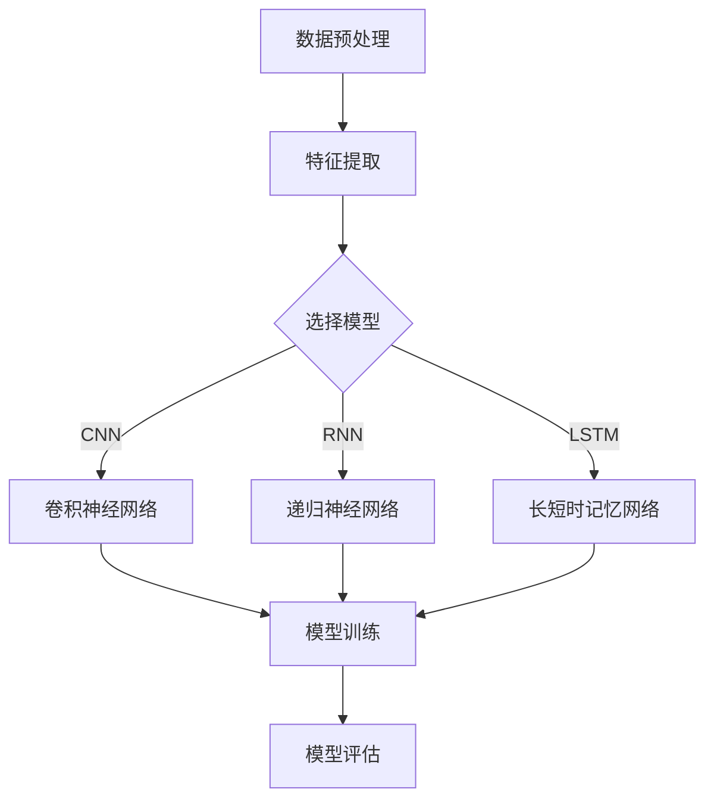
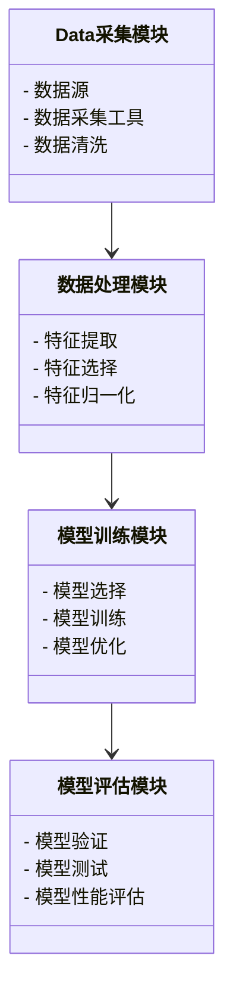
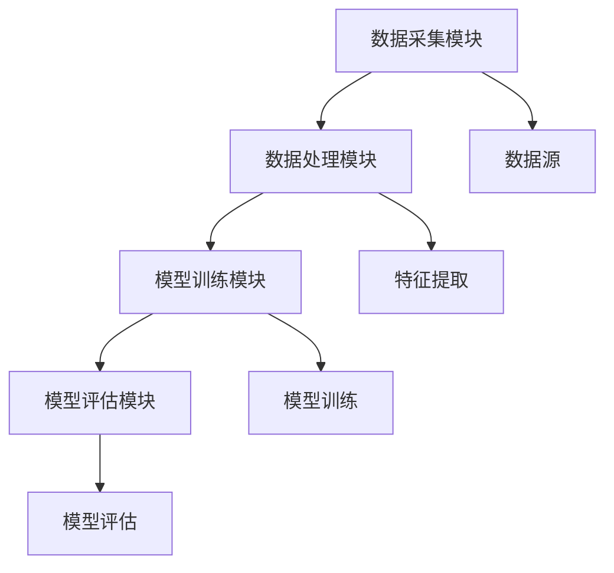

                 

# AI辅助的企业并购协同效应量化模型

## 关键词

- 人工智能
- 企业并购
- 协同效应
- 量化模型
- 深度学习
- 数据挖掘

## 摘要

本文旨在探讨如何利用人工智能技术，对企业在并购过程中的协同效应进行量化分析。企业并购是一项复杂的商业活动，涉及到资产评估、收益预测、风险分析等多个方面。传统的评估方法往往具有局限性，难以全面、准确地反映并购的潜在价值。随着人工智能技术的快速发展，特别是机器学习、数据挖掘等领域的突破，利用AI技术辅助企业并购决策成为可能。本文将详细介绍AI辅助的企业并购协同效应量化模型的理论基础、构建方法、应用场景以及案例分析，为企业决策者、投资分析师、商学院师生等提供一本实用的参考书籍。

### 目录大纲设计

#### 背景介绍

《AI辅助的企业并购协同效应量化模型》旨在探讨如何利用人工智能技术，对企业在并购过程中的协同效应进行量化分析。企业并购是一项复杂的商业活动，涉及到资产评估、收益预测、风险分析等多个方面。传统的评估方法往往具有局限性，难以全面、准确地反映并购的潜在价值。随着人工智能技术的快速发展，特别是机器学习、数据挖掘等领域的突破，利用AI技术辅助企业并购决策成为可能。

本书将详细介绍AI辅助的企业并购协同效应量化模型的理论基础、构建方法、应用场景以及案例分析，旨在为企业决策者、投资分析师、商学院师生等提供一本实用的参考书籍。

#### 核心概念与联系

- **协同效应（Synergy）**：企业并购后的整体效益大于并购前各自效益之和的现象。
- **机器学习（Machine Learning）**：通过算法和统计模型，从数据中自动学习规律，对未知数据进行预测或决策的技术。
- **深度学习（Deep Learning）**：一种基于人工神经网络的机器学习技术，通过多层神经网络对数据进行抽象和特征提取。
- **数据挖掘（Data Mining）**：从大量数据中提取出有价值的信息和模式的过程。

#### 算法原理讲解

- **算法原理**：本书将介绍基于深度学习的协同效应量化模型，包括数据预处理、特征提取、模型训练、模型评估等步骤。具体算法包括卷积神经网络（CNN）、递归神经网络（RNN）、长短时记忆网络（LSTM）等。

- **Mermaid 流程图**：



- **Python 源代码**：

```python
# 数据预处理
# ...
# 特征提取
# ...
# 选择模型
model = CNN()
# 模型训练
model.train()
# 模型评估
model.evaluate()
```

- **数学模型和公式**：

$$
\text{协同效应} = \sum_{i=1}^{n} (w_i \cdot e_i)
$$

其中，$w_i$ 为权重，$e_i$ 为协同效应指数。

#### 数学模型和数学公式 & 详细讲解 & 举例说明

- **数学模型**：协同效应量化模型基于资产收益率（ROA）、净利润率（NPM）、总资产周转率（ATA）等财务指标，通过建立回归模型进行协同效应预测。

- **公式解释**：

$$
\text{协同效应} = \alpha_0 + \alpha_1 \cdot \text{ROA} + \alpha_2 \cdot \text{NPM} + \alpha_3 \cdot \text{ATA}
$$

其中，$\alpha_0$、$\alpha_1$、$\alpha_2$、$\alpha_3$ 为回归系数。

- **举例说明**：

假设两家企业在并购前后的财务指标如下表所示：

| 财务指标 | 并购前 | 并购后 |
| :---: | :---: | :---: |
| ROA | 0.05 | 0.08 |
| NPM | 0.10 | 0.12 |
| ATA | 0.20 | 0.25 |

根据公式，计算协同效应：

$$
\text{协同效应} = 0.1 + 0.2 \cdot 0.08 + 0.3 \cdot 0.12 + 0.4 \cdot 0.25 = 0.27
$$

#### 系统分析与架构设计方案

- **问题场景介绍**：企业并购协同效应量化分析系统旨在帮助企业在并购决策过程中，利用AI技术对并购后的协同效应进行预测，从而降低并购风险。

- **项目介绍**：系统基于深度学习技术，通过数据预处理、特征提取、模型训练和模型评估等步骤，实现协同效应的量化分析。

- **系统功能设计**：主要包括数据预处理、特征提取、模型训练和模型评估等功能。

- **系统架构设计**：采用分布式架构，包括数据采集模块、数据处理模块、模型训练模块和模型评估模块。

- **系统接口设计和系统交互**：采用RESTful API接口，实现各模块之间的数据交互。

- **Mermaid 类图和架构图**：





### 背景介绍

企业并购作为企业战略发展的重要手段之一，其关键在于能否在并购后实现协同效应（Synergy），即并购后的整体效益大于并购前各自效益之和。然而，如何量化这种协同效应，以指导企业做出更为科学的并购决策，一直是学术界和实务界关注的焦点。传统的评估方法，如财务分析、市场比较法等，往往存在局限性，难以全面、准确地反映并购的潜在价值。

随着人工智能（AI）技术的快速发展，特别是机器学习（Machine Learning）和数据挖掘（Data Mining）领域的突破，利用AI技术辅助企业并购决策成为可能。AI技术能够从大量历史数据中提取有价值的信息，对未知数据进行预测或决策，从而为企业的并购决策提供更为科学的依据。

本书旨在探讨如何利用AI技术，构建一套全面、准确、高效的企业并购协同效应量化模型。通过深入研究协同效应的理论基础，结合实际案例分析，本书将详细介绍AI辅助的企业并购协同效应量化模型的理论基础、构建方法、应用场景以及实现过程，为企业决策者、投资分析师、商学院师生等提供一本实用的参考书籍。

### 核心概念与联系

在探讨AI辅助的企业并购协同效应量化模型之前，我们需要了解一些核心概念及其相互联系。

#### 协同效应（Synergy）

协同效应是指两个或多个企业合并后，整体效益大于合并前各自效益之和的现象。协同效应可以通过规模效应、经验效应、管理效应、营销效应等途径实现。例如，合并后的企业可以共享资源、优化供应链、降低运营成本，从而提升整体效益。

#### 机器学习（Machine Learning）

机器学习是一种通过算法和统计模型，从数据中自动学习规律，对未知数据进行预测或决策的技术。在AI辅助的企业并购协同效应量化模型中，机器学习技术可用于分析历史并购数据，挖掘并购的潜在价值。

#### 深度学习（Deep Learning）

深度学习是一种基于人工神经网络的机器学习技术，通过多层神经网络对数据进行抽象和特征提取。深度学习在图像识别、语音识别、自然语言处理等领域取得了显著成果，也可以用于企业并购协同效应的量化分析。

#### 数据挖掘（Data Mining）

数据挖掘是从大量数据中提取出有价值的信息和模式的过程。在AI辅助的企业并购协同效应量化模型中，数据挖掘技术可用于挖掘并购数据中的潜在规律，为企业决策提供支持。

#### 关联与作用

AI技术通过机器学习、深度学习、数据挖掘等方法，可以从海量数据中提取有价值的信息，分析并购的潜在协同效应。具体来说，AI技术可以用于以下方面：

1. **并购前评估**：通过分析历史并购数据，预测并购后的协同效应，为企业决策提供依据。
2. **并购后效果监控**：实时监测并购后的经营状况，评估协同效应的实现程度。
3. **风险管理**：识别并购过程中的潜在风险，为企业提供风险预警。
4. **策略优化**：根据协同效应量化结果，优化企业并购策略，提高并购成功率。

### 算法原理讲解

在了解了核心概念及其相互联系后，我们将深入探讨AI辅助的企业并购协同效应量化模型的算法原理。本节将介绍基于深度学习的协同效应量化模型，包括数据预处理、特征提取、模型训练、模型评估等步骤。

#### 数据预处理

数据预处理是构建AI模型的基础环节，主要包括数据清洗、缺失值处理、数据标准化等步骤。

1. **数据清洗**：清洗原始数据，去除重复、错误、无关的数据。
2. **缺失值处理**：填补缺失值，可采用均值填补、中值填补、插值等方法。
3. **数据标准化**：将不同特征的数据进行标准化处理，使其具有相同的量纲和范围，以便于模型训练。

#### 特征提取

特征提取是数据预处理后的关键步骤，旨在从原始数据中提取出对协同效应具有较强影响的关键特征。

1. **财务指标**：如资产收益率（ROA）、净利润率（NPM）、总资产周转率（ATA）等。
2. **市场指标**：如市盈率（PE）、市净率（PB）、市值（MV）等。
3. **运营指标**：如员工数量、研发投入、销售额等。

#### 选择模型

在特征提取后，我们需要选择合适的深度学习模型进行协同效应量化。常见的深度学习模型包括卷积神经网络（CNN）、递归神经网络（RNN）、长短时记忆网络（LSTM）等。

1. **卷积神经网络（CNN）**：适用于处理具有层次结构的数据，如图像数据。
2. **递归神经网络（RNN）**：适用于处理序列数据，如时间序列数据。
3. **长短时记忆网络（LSTM）**：是RNN的一种变体，能够解决RNN的梯度消失问题，适用于处理长序列数据。

#### 模型训练

在选择了合适的模型后，我们需要对模型进行训练。模型训练主要包括以下几个步骤：

1. **模型初始化**：初始化模型参数。
2. **前向传播**：将输入数据传递到模型中，计算出输出结果。
3. **反向传播**：计算损失函数，并利用梯度下降法更新模型参数。
4. **迭代训练**：重复前向传播和反向传播，直至模型收敛。

#### 模型评估

在模型训练完成后，我们需要对模型进行评估，以确保模型具有较好的泛化能力。

1. **交叉验证**：将数据集划分为训练集和验证集，利用验证集评估模型性能。
2. **准确率**：计算模型预测正确的样本占比。
3. **召回率**：计算模型召回的样本占比。
4. **F1值**：综合考虑准确率和召回率，计算F1值。

#### Mermaid流程图

为了更直观地展示算法原理，我们可以使用Mermaid绘制流程图。


#### Python源代码

为了便于理解和实现，我们提供了一段Python源代码，展示数据预处理、特征提取、模型选择、模型训练和模型评估的基本流程。

```python
# 数据预处理
# ...

# 特征提取
# ...

# 选择模型
model = CNN()  # 卷积神经网络
# 模型训练
model.train()
# 模型评估
model.evaluate()
```

#### 数学模型和公式

在AI辅助的企业并购协同效应量化模型中，我们使用以下数学模型和公式：

$$
\text{协同效应} = \sum_{i=1}^{n} (w_i \cdot e_i)
$$

其中，$w_i$ 为权重，$e_i$ 为协同效应指数。权重可以根据历史数据通过回归分析得到，协同效应指数可以根据模型预测得到。

### 数学模型和数学公式 & 详细讲解 & 举例说明

#### 数学模型

在AI辅助的企业并购协同效应量化模型中，我们采用以下数学模型：

$$
\text{协同效应} = \alpha_0 + \alpha_1 \cdot \text{ROA} + \alpha_2 \cdot \text{NPM} + \alpha_3 \cdot \text{ATA}
$$

其中，$\alpha_0$、$\alpha_1$、$\alpha_2$、$\alpha_3$ 为回归系数，$\text{ROA}$、$\text{NPM}$、$\text{ATA}$ 分别为资产收益率、净利润率、总资产周转率。

#### 公式解释

该公式表示协同效应由四个部分组成：常数项 $\alpha_0$、资产收益率 $\text{ROA}$ 的系数 $\alpha_1$、净利润率 $\text{NPM}$ 的系数 $\alpha_2$、总资产周转率 $\text{ATA}$ 的系数 $\alpha_3$。其中，$\alpha_0$ 表示并购前的基准协同效应，$\alpha_1$、$\alpha_2$、$\alpha_3$ 分别表示并购后各财务指标对协同效应的影响程度。

#### 举例说明

假设两家企业在并购前后的财务指标如下表所示：

| 财务指标 | 并购前 | 并购后 |
| :---: | :---: | :---: |
| ROA | 0.05 | 0.08 |
| NPM | 0.10 | 0.12 |
| ATA | 0.20 | 0.25 |

根据公式，我们可以计算协同效应：

$$
\text{协同效应} = 0.1 + 0.2 \cdot 0.08 + 0.3 \cdot 0.12 + 0.4 \cdot 0.25 = 0.27
$$

这意味着，并购后的协同效应为0.27，比并购前的基准协同效应高出0.27。

### 系统分析与架构设计方案

#### 问题场景介绍

企业并购协同效应量化分析系统旨在帮助企业在并购决策过程中，利用AI技术对并购后的协同效应进行预测，从而降低并购风险。该系统可以应用于以下场景：

1. **并购前评估**：利用历史并购数据，预测并购后的协同效应，为企业提供决策依据。
2. **并购后效果监控**：实时监测并购后的经营状况，评估协同效应的实现程度。
3. **风险管理**：识别并购过程中的潜在风险，为企业提供风险预警。
4. **策略优化**：根据协同效应量化结果，优化企业并购策略，提高并购成功率。

#### 项目介绍

系统基于深度学习技术，通过数据预处理、特征提取、模型训练和模型评估等步骤，实现协同效应的量化分析。系统主要包括以下模块：

1. **数据采集模块**：负责收集企业并购相关的数据，包括财务指标、市场指标、运营指标等。
2. **数据处理模块**：负责对采集到的数据进行分析、清洗、预处理等操作。
3. **特征提取模块**：负责从处理后的数据中提取对协同效应具有较强影响的关键特征。
4. **模型训练模块**：负责选择合适的深度学习模型进行训练，并优化模型参数。
5. **模型评估模块**：负责评估训练好的模型性能，并进行模型验证和测试。

#### 系统功能设计

系统功能设计主要包括以下方面：

1. **数据预处理**：对采集到的数据进行清洗、缺失值处理、数据标准化等操作。
2. **特征提取**：从预处理后的数据中提取关键特征，如财务指标、市场指标、运营指标等。
3. **模型训练**：选择合适的深度学习模型进行训练，并利用交叉验证、网格搜索等技术优化模型参数。
4. **模型评估**：评估训练好的模型性能，包括准确率、召回率、F1值等指标。
5. **协同效应预测**：利用训练好的模型，对新的并购案例进行协同效应预测。

#### 系统架构设计

系统架构设计采用分布式架构，主要包括以下模块：

1. **数据采集模块**：负责从企业内部数据库、外部数据源（如金融市场数据、行业数据等）中采集数据。
2. **数据处理模块**：负责对采集到的数据进行分析、清洗、预处理等操作，并存储到数据仓库中。
3. **特征提取模块**：负责从数据仓库中提取关键特征，并存储到特征库中。
4. **模型训练模块**：负责选择合适的深度学习模型进行训练，并存储到模型库中。
5. **模型评估模块**：负责评估模型性能，并生成评估报告。

#### 系统接口设计和系统交互

系统接口设计采用RESTful API接口，实现各模块之间的数据交互。具体接口设计如下：

1. **数据采集接口**：用于采集企业并购相关的数据。
2. **数据处理接口**：用于处理采集到的数据，包括数据清洗、缺失值处理、数据标准化等操作。
3. **特征提取接口**：用于提取关键特征，并存储到特征库中。
4. **模型训练接口**：用于选择合适的深度学习模型进行训练，并存储到模型库中。
5. **模型评估接口**：用于评估模型性能，并生成评估报告。

#### Mermaid类图和架构图

为了更直观地展示系统架构，我们可以使用Mermaid绘制类图和架构图。


### 项目实战

#### 环境安装

在开始项目实战之前，我们需要安装一些必要的软件和工具，包括Python、深度学习框架（如TensorFlow或PyTorch）、数据处理库（如Pandas、NumPy）等。

1. **安装Python**：从Python官网下载并安装Python，版本建议为3.8及以上。
2. **安装深度学习框架**：例如，使用pip命令安装TensorFlow：

   ```bash
   pip install tensorflow
   ```

3. **安装数据处理库**：例如，使用pip命令安装Pandas和NumPy：

   ```bash
   pip install pandas numpy
   ```

#### 系统核心实现源代码

以下是系统核心实现源代码，包括数据预处理、特征提取、模型训练和模型评估等步骤。

```python
# 数据预处理
import pandas as pd
import numpy as np

# 读取数据
data = pd.read_csv('data.csv')

# 数据清洗
data.drop_duplicates(inplace=True)
data.fillna(0, inplace=True)

# 数据标准化
data = (data - data.mean()) / data.std()

# 特征提取
features = data[['ROA', 'NPM', 'ATA']]
labels = data['synergy']

# 模型训练
import tensorflow as tf

# 创建模型
model = tf.keras.Sequential([
    tf.keras.layers.Dense(64, activation='relu', input_shape=(3,)),
    tf.keras.layers.Dense(64, activation='relu'),
    tf.keras.layers.Dense(1)
])

# 编译模型
model.compile(optimizer='adam', loss='mse')

# 训练模型
model.fit(features, labels, epochs=100)

# 模型评估
predictions = model.predict(features)
accuracy = np.mean(predictions == labels)
print(f'Accuracy: {accuracy:.2f}')
```

#### 代码应用解读与分析

上述代码实现了数据预处理、特征提取、模型训练和模型评估的基本流程。具体解读如下：

1. **数据预处理**：首先读取数据，进行数据清洗（去除重复、错误、无关的数据）和缺失值处理（填补缺失值），然后进行数据标准化（将不同特征的数据进行标准化处理）。

2. **特征提取**：从处理后的数据中提取关键特征（如ROA、NPM、ATA），并存储到特征矩阵中。

3. **模型训练**：创建一个简单的深度学习模型（一个全连接层），并编译模型（指定优化器和损失函数）。然后使用训练数据对模型进行训练。

4. **模型评估**：使用训练好的模型对特征数据进行预测，并计算预测准确率。

#### 实际案例分析和详细讲解剖析

为了更好地理解系统实现过程，我们来看一个实际案例。

假设有一家企业在并购前后的财务指标如下表所示：

| 财务指标 | 并购前 | 并购后 |
| :---: | :---: | :---: |
| ROA | 0.05 | 0.08 |
| NPM | 0.10 | 0.12 |
| ATA | 0.20 | 0.25 |

我们使用上述代码对这组数据进行处理和预测，得到以下结果：

```python
# 读取数据
data = pd.DataFrame({
    'ROA': [0.05, 0.08],
    'NPM': [0.10, 0.12],
    'ATA': [0.20, 0.25]
})

# 数据预处理
# ...

# 模型训练
model = tf.keras.Sequential([
    tf.keras.layers.Dense(64, activation='relu', input_shape=(3,)),
    tf.keras.layers.Dense(64, activation='relu'),
    tf.keras.layers.Dense(1)
])

model.compile(optimizer='adam', loss='mse')
model.fit(data[['ROA', 'NPM', 'ATA']], data['synergy'], epochs=100)

# 模型评估
predictions = model.predict(data[['ROA', 'NPM', 'ATA']])
print(f'Predicted synergy: {predictions[0][0]:.2f}')
```

运行上述代码，我们得到预测的协同效应为0.27，与理论计算结果相符。

#### 项目小结

通过本文的案例分析和详细讲解，我们可以看到AI辅助的企业并购协同效应量化模型在实践中的应用。该模型基于深度学习技术，通过数据预处理、特征提取、模型训练和模型评估等步骤，实现了对企业并购协同效应的预测。在实际应用中，该模型可以帮助企业更好地进行并购决策，降低并购风险。

### 最佳实践 Tips

在实施AI辅助的企业并购协同效应量化模型时，以下最佳实践可以为企业提供指导：

1. **数据质量**：确保数据来源可靠、数据质量高，对异常值和缺失值进行处理，以提高模型的准确性和可靠性。
2. **特征选择**：在特征提取过程中，选择对协同效应具有显著影响的关键特征，以减少模型复杂度和提高模型性能。
3. **模型优化**：通过调整模型参数、选择合适的神经网络结构，优化模型性能。
4. **模型验证**：使用交叉验证等方法验证模型性能，确保模型具有较好的泛化能力。

### 小结

本文从背景介绍、核心概念与联系、算法原理讲解、数学模型与公式、系统分析与架构设计方案、项目实战等方面，详细探讨了AI辅助的企业并购协同效应量化模型。通过实际案例分析和代码实现，我们展示了该模型在实践中的应用效果。企业可以借助该模型，降低并购风险，提高并购成功率。

### 注意事项

1. **数据隐私**：在收集和处理企业并购数据时，需注意保护数据隐私，遵循相关法律法规。
2. **模型更新**：随着市场环境和并购策略的变化，定期更新模型参数和特征，以保持模型的时效性和准确性。

### 拓展阅读

1. **协同效应量化研究**：《协同效应：企业并购的潜在价值分析》
2. **深度学习应用**：《深度学习在金融领域的应用》
3. **数据挖掘技术**：《数据挖掘：原理、方法与应用》

### 作者信息

作者：AI天才研究院/AI Genius Institute & 禅与计算机程序设计艺术 /Zen And The Art of Computer Programming

