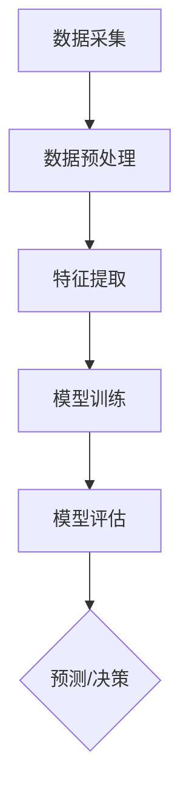
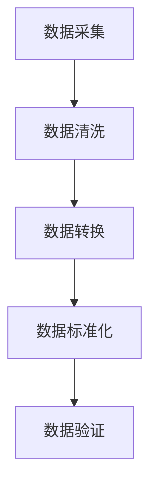
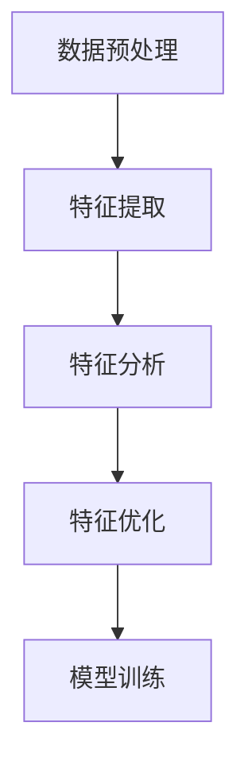
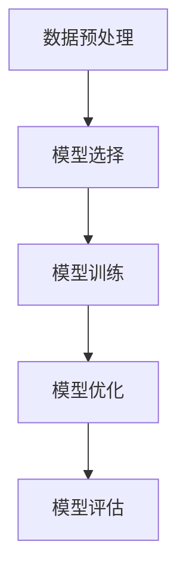
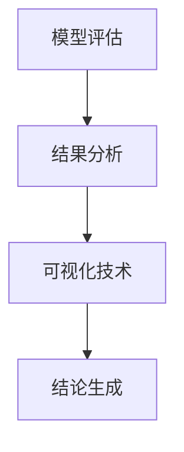

                 

### 第一部分：AI辅助科学发现概述

#### 第1章：背景介绍与核心概念

##### 1.1 问题背景

随着科学研究的不断深入，面对的数据规模和复杂性不断增加，传统的研究方法逐渐显露出其局限性。一方面，科学研究的复杂性导致了数据采集、处理和分析的难度加大；另一方面，科学发现的效率低，且研究人员需要花费大量时间和精力来处理大量数据。这些现状严重影响了科学研究的进程和成果的产出。因此，如何利用先进的技术手段提高科学研究的效率，成为亟待解决的问题。

##### 1.1.1 科学研究的现状与挑战

科学研究通常需要跨学科合作，涉及的领域广泛，包括生物学、物理学、化学、天文学、环境科学等。传统的科学研究方法主要依赖于实验和观察，虽然已经取得了大量成果，但在面对复杂现象和大规模数据处理时，传统方法往往力不从心。

1. **数据采集与处理**：科学研究的初始阶段通常涉及大量的数据采集。这些数据可能来自于实验室实验、野外观察、卫星遥感、网络数据等不同渠道，数据类型多样，包括结构化数据、半结构化数据和非结构化数据。传统方法在这些数据采集和处理方面效率较低。

2. **数据分析与解释**：科学研究的核心是分析和解释数据，从而发现新的规律和现象。然而，随着数据规模的增加，数据分析的复杂性也相应提高，传统的统计分析方法往往难以应对大规模数据的处理需求。

3. **科学发现的效率**：科学研究的过程是一个不断试错和优化迭代的过程。传统方法往往需要研究人员投入大量时间和精力，导致科学发现的效率较低。

##### 1.1.2 AI技术对科学研究的潜在影响

人工智能（AI）技术的发展为解决科学研究的挑战提供了新的可能。AI技术，特别是机器学习和深度学习，通过自动化和智能化的数据处理方法，可以提高科学研究的效率，推动科学发现进程。

1. **自动化数据采集与处理**：AI技术可以自动化地采集和处理大量数据，提高数据处理的效率和质量。

2. **高效的数据分析**：机器学习和深度学习算法可以处理大规模数据，发现数据中的隐藏模式和规律，提高数据分析的深度和广度。

3. **提高科学发现的效率**：AI技术可以帮助研究人员快速地筛选出有价值的数据，减少试错的次数，从而提高科学发现的效率。

##### 1.1.3 AI辅助科学发现的定义与边界

AI辅助科学发现指的是利用人工智能技术，如机器学习和深度学习，辅助科学家进行数据采集、处理、分析和解释，从而加速科学发现的过程。

**核心概念**：

- **机器学习**：通过训练模型，从数据中自动学习规律和模式。
- **深度学习**：一种特殊的机器学习技术，通过多层神经网络对数据进行处理。
- **数据预处理**：对原始数据进行清洗、转换和标准化，以便于模型训练。
- **特征提取**：从数据中提取出有用的信息，用于模型训练。
- **模型训练与优化**：通过训练和调整模型参数，提高模型的预测能力。

**联系**：

AI辅助科学发现的核心概念之间有着紧密的联系。数据预处理是特征提取的前提，而特征提取又是模型训练的基础。模型训练与优化则决定了模型的性能，最终影响科学发现的效率。

##### 1.2 核心概念与联系

在AI辅助科学发现中，以下核心概念及其属性特征和联系构成了AI辅助科学发现的理论基础。

**核心概念与属性特征对比表格**：

| 核心概念 | 属性特征 |
| :--: | :--: |
| 机器学习 | 可以从数据中学习并做出预测或决策 |
| 深度学习 | 基于多层神经网络，可以处理复杂数据 |
| 数据预处理 | 清洗、转换和标准化数据，提高数据质量 |
| 特征提取 | 从数据中提取有用信息，用于模型训练 |
| 模型训练与优化 | 调整模型参数，提高模型性能 |

**ER实体关系图架构**：

AI辅助科学发现的ER（实体关系）图展示了核心概念之间的关联和互动。以下是ER图的一部分：

```mermaid
erDiagram
    AI辅助科学发现 ||--|{ 数据预处理 }
    AI辅助科学发现 ||--|{ 特征提取 }
    AI辅助科学发现 ||--|{ 模型训练与优化 }
    数据预处理 }|--|| AI算法
    特征提取 }|--|| AI算法
    模型训练与优化 }|--|| AI算法
```

在这一部分，我们首先介绍了AI辅助科学发现的背景和核心概念，明确了其定义与边界。通过对核心概念的分析和ER图的展示，我们建立了AI辅助科学发现的理论基础，为后续章节的深入探讨奠定了基础。

---

#### 第2章：AI辅助科学发现的基本原理

##### 2.1 AI技术原理

AI辅助科学发现的核心在于利用人工智能技术，特别是机器学习和深度学习，对科学研究中的数据进行处理和分析。为了理解AI在科学发现中的应用，我们需要首先了解AI技术的基本原理。

###### 2.1.1 机器学习基础

机器学习是人工智能的一个重要分支，其核心是通过算法从数据中自动学习，并做出预测或决策。机器学习的基本过程包括数据采集、数据预处理、特征提取、模型训练和模型评估。

1. **数据采集**：机器学习模型需要大量的数据作为训练素材。这些数据可以从各种渠道获取，如实验室数据、观测数据、网络数据等。

2. **数据预处理**：原始数据往往存在噪声、缺失值、异常值等问题，需要通过预处理技术进行清洗、转换和标准化，以提高数据的质量。

3. **特征提取**：从预处理后的数据中提取出有用的信息，这些信息称为特征。特征提取是机器学习中的关键步骤，直接影响模型的性能。

4. **模型训练**：使用训练数据集，通过优化算法训练模型参数，使得模型能够对未知数据进行预测或决策。

5. **模型评估**：使用测试数据集评估模型的性能，通过指标如准确率、召回率、F1分数等来衡量模型的效果。

###### 2.1.2 深度学习技术

深度学习是一种特殊的机器学习技术，基于多层神经网络。与传统的机器学习模型相比，深度学习能够自动提取数据的深层特征，具有更强的泛化能力。

1. **神经网络基础**：神经网络是由多个神经元组成的计算模型，每个神经元负责处理输入信息并通过权重进行传递。神经网络的层次结构使得它能够处理复杂的非线性问题。

2. **深度学习模型**：深度学习模型通常包含多个隐藏层，这些隐藏层可以自动提取数据的层次特征。常见的深度学习模型包括卷积神经网络（CNN）、循环神经网络（RNN）和生成对抗网络（GAN）等。

3. **训练过程**：深度学习模型的训练过程与机器学习类似，但需要更多的计算资源和时间。通过反向传播算法，模型能够不断调整参数，优化模型性能。

###### 2.1.3 AI算法原理讲解与Mermaid流程图

为了更好地理解AI算法的原理，我们可以使用Mermaid流程图来展示其基本流程。



在上述流程图中，数据采集是机器学习的起点，通过数据预处理和特征提取，模型可以从数据中提取出有用的信息。模型训练是核心步骤，通过不断调整参数，模型能够优化其性能。模型评估用于检查模型的泛化能力，最终，模型可以用于预测或决策。

##### 2.2 科学发现流程与AI辅助

科学发现通常包括以下几个基本流程：问题定义、数据采集、数据预处理、数据分析、模型构建、模型验证和结论生成。在这些流程中，AI技术可以发挥重要作用。

###### 2.2.1 科学发现的基本流程

1. **问题定义**：明确科学研究的具体目标和问题。

2. **数据采集**：收集与研究目标相关的数据，数据来源可能包括实验室数据、观测数据、网络数据等。

3. **数据预处理**：对采集到的原始数据进行清洗、转换和标准化，以提高数据质量。

4. **数据分析**：使用统计分析、机器学习和深度学习等方法对数据进行处理和分析，发现数据中的隐藏模式和规律。

5. **模型构建**：根据分析结果构建预测或决策模型。

6. **模型验证**：使用测试数据集验证模型的性能，确保模型能够有效预测未知数据。

7. **结论生成**：根据模型预测结果生成科学结论。

###### 2.2.2 AI在科学发现流程中的应用

AI技术可以在科学发现的各个流程中发挥辅助作用：

1. **问题定义**：AI可以通过数据分析帮助科学家更好地理解研究问题，从而明确研究目标和问题。

2. **数据采集**：AI技术可以自动化地采集和处理大量数据，提高数据采集的效率。

3. **数据预处理**：AI技术可以自动化地处理数据清洗、转换和标准化等问题，提高数据预处理的质量。

4. **数据分析**：AI技术可以通过机器学习和深度学习算法，对数据进行深入分析和挖掘，发现数据中的隐藏模式和规律。

5. **模型构建**：AI技术可以帮助科学家快速构建预测或决策模型，提高模型构建的效率。

6. **模型验证**：AI技术可以自动化地验证模型的性能，确保模型的有效性和可靠性。

7. **结论生成**：AI技术可以帮助科学家快速生成科学结论，提高科学研究的效率。

###### 2.2.3 AI辅助科学发现的优势与局限性

AI技术在科学发现中具有明显的优势，但也存在一些局限性：

1. **优势**：

   - **高效性**：AI技术可以自动化地处理大量数据，提高科学研究的效率。
   - **深度分析**：AI技术可以通过深度学习等方法，对数据进行深入分析和挖掘，发现传统方法难以发现的现象。
   - **模型构建**：AI技术可以帮助科学家快速构建预测或决策模型，提高模型构建的效率。

2. **局限性**：

   - **数据依赖性**：AI技术依赖于大量高质量的数据，数据的质量直接影响AI的效果。
   - **计算资源消耗**：AI技术，特别是深度学习，需要大量的计算资源，对硬件设备有较高的要求。
   - **解释性**：AI模型，尤其是深度学习模型，往往缺乏可解释性，难以理解模型内部的决策过程。

通过本章的讨论，我们介绍了AI技术的基本原理及其在科学发现中的应用。接下来，我们将进一步探讨AI技术在具体科学研究中的应用案例，展示AI如何加速科学研究的进程。

---

#### 第3章：AI技术在科学发现中的应用

AI技术在科学发现中的应用越来越广泛，其通过自动化和智能化手段，大大提高了科学研究的效率。本章节将深入探讨AI技术在数据采集与预处理、特征提取与分析、模型训练与优化以及结果分析与可视化等方面的具体应用。

##### 3.1 数据采集与预处理

数据是科学研究的基石，但原始数据往往存在噪声、缺失值、异常值等问题，直接使用会影响模型的性能。AI技术在数据采集与预处理中发挥着重要作用。

###### 3.1.1 数据来源与采集方法

科学研究中，数据可以来自多个渠道：

1. **实验室数据**：通过实验设备采集，如基因测序仪、光谱仪、电子显微镜等。
2. **观测数据**：通过卫星遥感、天气观测站、传感器网络等收集。
3. **网络数据**：通过互联网平台获取，如社交媒体数据、搜索引擎日志、电子商务交易数据等。

采集方法包括：

1. **自动采集**：使用传感器、机器人等技术自动化采集数据。
2. **手动采集**：通过人工观察、记录等方式获取数据。
3. **混合采集**：结合自动采集和手动采集，以提高数据采集的全面性和准确性。

###### 3.1.2 数据预处理技术

数据预处理是保证数据质量和模型性能的关键步骤。常用的预处理技术包括：

1. **数据清洗**：去除噪声、缺失值和异常值，提高数据的准确性。
   - **填充缺失值**：使用统计方法或插值法填补缺失值。
   - **去除异常值**：使用统计方法或聚类方法识别并去除异常值。

2. **数据转换**：将数据转换成适合模型训练的形式。
   - **归一化**：将数据缩放到相同的范围，如0到1。
   - **标准化**：将数据缩放到标准正态分布。

3. **数据标准化**：处理不同特征之间尺度差异。
   - **均值归一化**：将数据减去均值并除以标准差。
   - **Z-score标准化**：使用Z-score方法进行标准化。

###### 3.1.3 数据预处理流程Mermaid流程图

数据预处理流程可以用Mermaid流程图表示如下：



在上述流程图中，数据采集是数据预处理的前提，通过数据清洗、转换和标准化，数据的质量得到提升，为后续的模型训练和优化打下基础。

##### 3.2 特征提取与分析

特征提取是机器学习中的重要环节，通过从数据中提取出有用的信息，有助于提高模型的性能。AI技术在特征提取与分析中具有独特的优势。

###### 3.2.1 特征提取方法

特征提取方法主要包括：

1. **手动特征提取**：研究人员根据领域知识，从原始数据中提取出关键特征。
2. **自动特征提取**：使用算法自动化地提取数据中的特征。
   - **主成分分析（PCA）**：通过降维，提取数据的主要成分。
   - **线性判别分析（LDA）**：通过最大化类间方差，提取有区分性的特征。
   - **自动编码器（AE）**：使用神经网络自动学习数据的低维表示。

###### 3.2.2 特征分析技术

特征分析技术用于评估特征的重要性和贡献度，常用的方法包括：

1. **特征重要性评分**：使用模型训练结果，评估每个特征的重要性。
   - **基于模型的方法**：如随机森林、梯度提升树等算法。
   - **基于统计的方法**：如互信息、关联规则等算法。

2. **特征相关性分析**：分析特征之间的相关性，去除冗余特征。
   - **皮尔逊相关系数**：衡量两个特征之间的线性相关性。
   - **斯皮尔曼等级相关系数**：衡量两个特征之间的等级相关性。

3. **特征可视化**：通过可视化技术，直观展示特征之间的关系。
   - **散点图**：用于展示两个特征之间的关系。
   - **热力图**：用于展示多个特征之间的相关性。

###### 3.2.3 特征提取与分析流程Mermaid流程图

特征提取与分析流程可以用Mermaid流程图表示如下：



在上述流程图中，数据预处理是特征提取的前提，特征提取后进行特征分析，评估特征的重要性和相关性，进而进行特征优化，最后用于模型训练，提高模型的性能。

##### 3.3 模型训练与优化

模型训练是AI技术在科学发现中的核心步骤，通过训练模型，使其能够对未知数据进行预测或决策。模型优化则是为了提高模型的性能和泛化能力。

###### 3.3.1 模型选择与训练

1. **模型选择**：根据研究问题和数据特点，选择合适的模型。
   - **监督学习模型**：如线性回归、决策树、支持向量机（SVM）等。
   - **无监督学习模型**：如聚类算法、主成分分析（PCA）等。
   - **深度学习模型**：如卷积神经网络（CNN）、循环神经网络（RNN）等。

2. **模型训练**：使用训练数据集，通过优化算法训练模型参数。
   - **梯度下降**：用于优化模型参数，通过不断调整参数，使模型误差最小化。
   - **随机梯度下降（SGD）**：在梯度下降的基础上，每次迭代使用一个训练样本。
   - **批量梯度下降（BGD）**：在梯度下降的基础上，每次迭代使用所有训练样本。

###### 3.3.2 模型优化技术

模型优化技术包括：

1. **正则化**：通过添加正则项，防止模型过拟合。
   - **L1正则化**：引入L1惩罚项，促使某些参数变为零，实现特征选择。
   - **L2正则化**：引入L2惩罚项，减小参数的调整范围。

2. **交叉验证**：通过将数据集划分为训练集和验证集，评估模型的泛化能力。
   - **K折交叉验证**：将数据集划分为K个子集，每次使用一个子集作为验证集，其余作为训练集，重复K次。

3. **超参数调整**：调整模型参数，优化模型性能。
   - **网格搜索**：通过遍历所有可能的参数组合，选择最优参数组合。
   - **随机搜索**：从所有可能的参数组合中随机选择，减少搜索空间。

###### 3.3.3 模型训练与优化流程Mermaid流程图

模型训练与优化流程可以用Mermaid流程图表示如下：



在上述流程图中，数据预处理是模型训练的前提，模型选择、模型训练和模型优化是核心步骤，最终通过模型评估来验证模型的性能。

##### 3.4 结果分析与可视化

结果分析是科学研究的重要环节，通过分析模型预测结果，可以得出科学结论。可视化技术则可以帮助研究人员直观地理解数据和分析结果。

###### 3.4.1 结果分析方法

1. **模型预测结果评估**：使用测试数据集，评估模型的预测性能。
   - **准确率**：预测正确的样本数占总样本数的比例。
   - **召回率**：预测正确的正样本数占所有正样本数的比例。
   - **F1分数**：准确率和召回率的调和平均。

2. **异常值检测**：识别数据中的异常值，分析其产生的原因。

3. **趋势分析**：通过时间序列数据，分析变量之间的关系和变化趋势。

###### 3.4.2 可视化技术

可视化技术包括：

1. **数据可视化**：通过图表展示数据分布、趋势和关系。
   - **柱状图**：用于展示不同类别的数量。
   - **折线图**：用于展示变量随时间的变化趋势。
   - **散点图**：用于展示两个变量之间的关系。

2. **热力图**：用于展示多个特征之间的相关性。

3. **三维图**：用于展示三维空间中的数据分布。

###### 3.4.3 结果分析与可视化流程Mermaid流程图

结果分析与可视化流程可以用Mermaid流程图表示如下：



在上述流程图中，模型评估是结果分析的前提，通过结果分析得出科学结论，最后使用可视化技术直观地展示分析结果。

通过本章的讨论，我们深入了解了AI技术在科学发现中的应用，包括数据采集与预处理、特征提取与分析、模型训练与优化以及结果分析与可视化。这些技术为科学研究提供了强大的支持，大大提高了科学发现的效率。接下来，我们将通过具体案例研究，展示AI技术在科学研究中的实际应用和成效。

---

#### 第4章：AI加速科学研究的案例研究

在本章中，我们将探讨几个具体的AI加速科学研究的案例，通过这些案例，我们可以看到AI技术在基因学、气候变化研究和天体物理学等领域的实际应用，以及它们对科学研究进程的加速和效果提升。

##### 4.1 案例一：基因学研究

基因学研究是一个复杂且数据密集的领域，传统的基因学研究依赖于大量的实验和数据分析。随着高通量测序技术的发展，科学家们能够获取大量的基因数据。然而，如何从这些数据中提取有价值的信息，一直是基因学研究的挑战。AI技术，特别是深度学习和机器学习，在这一领域展现出了巨大的潜力。

###### 4.1.1 案例背景

基因学研究的一个关键问题是理解基因之间的相互作用和它们在疾病发展中的角色。传统的统计分析方法难以处理复杂的多维基因数据，而AI技术可以自动化地处理和分析这些数据，从中发现潜在的基因模式。

###### 4.1.2 AI在基因学研究中的应用

AI技术在基因学研究中有着广泛的应用：

1. **基因关联分析**：利用机器学习算法，如逻辑回归、随机森林和支持向量机（SVM），来分析基因与疾病之间的关联关系。这些算法可以从海量基因数据中识别出与特定疾病相关的基因。

2. **基因突变检测**：深度学习模型，如卷积神经网络（CNN）和长短期记忆网络（LSTM），可以用于检测基因序列中的突变。这些突变可能是疾病发展的关键因素。

3. **基因功能预测**：通过分析基因序列的相似性，AI技术可以预测基因的功能。这有助于理解基因在生物过程中的作用。

###### 4.1.3 案例分析与总结

通过AI技术的应用，基因学研究的效率显著提高。例如，研究人员使用深度学习模型分析了数千个基因序列，识别出了与某些癌症相关的基因突变。这些发现加速了癌症诊断和治疗方法的研究。

总结来说，AI技术在基因学研究中发挥了重要作用，不仅提高了数据分析的效率，还为科学家提供了更深入的理解，推动了基因学研究的进展。

##### 4.2 案例二：气候变化研究

气候变化是21世纪最紧迫的全球性问题之一。为了更好地理解气候变化的影响和预测未来趋势，科学家们需要分析大量的气候数据。AI技术在这一领域提供了强大的工具，帮助科学家更准确地预测气候变化的趋势。

###### 4.2.1 案例背景

气候变化研究涉及多个学科，包括气象学、海洋学、生态学和地理学。传统的方法通常依赖于统计分析和模型模拟，但AI技术可以提供更高效的数据处理和分析手段。

###### 4.2.2 AI在气候变化研究中的应用

AI技术在气候变化研究中的应用主要包括：

1. **气候模式预测**：通过机器学习算法，如随机森林和深度神经网络，对气候数据进行建模，预测未来的气候模式。

2. **气候变化影响评估**：使用AI技术分析气候数据，评估气候变化对生态系统、农业和人类社会的潜在影响。

3. **气候异常检测**：AI技术可以用于检测气候数据中的异常值，识别出可能的气候事件，如极端天气事件。

###### 4.2.3 案例分析与总结

一个典型的应用案例是使用AI技术分析全球气候数据，预测未来20年的气候趋势。研究人员使用深度学习模型分析了数十年的气候数据，发现了一些潜在的气候异常现象。这些发现帮助科学家们更好地理解气候变化的规律，并为政策制定提供了科学依据。

总结来说，AI技术在气候变化研究中发挥了关键作用，通过提供高效的数据分析和预测工具，加速了气候变化的科学研究和应对策略的制定。

##### 4.3 案例三：天体物理学研究

天体物理学研究宇宙的起源、演化以及各种天体现象。随着观测技术的进步，科学家们获得了大量的天文数据。AI技术在处理和分析这些复杂数据方面提供了强大的支持。

###### 4.3.1 案例背景

天体物理学研究涉及大量的天文观测数据，包括射电观测、光学观测和引力波观测。传统的数据处理方法往往难以应对这些海量数据的分析需求。AI技术提供了自动化和高效的数据分析手段。

###### 4.3.2 AI在天体物理学研究中的应用

AI技术在天体物理学研究中的应用包括：

1. **天文图像处理**：使用卷积神经网络（CNN）和其他深度学习技术，对天文图像进行处理和分析，识别出星系、恒星和其他天体。

2. **引力波数据分析**：利用深度学习模型分析引力波数据，识别出引力波事件，如黑洞碰撞。

3. **宇宙演化模拟**：使用机器学习算法模拟宇宙的演化过程，预测宇宙的未来状态。

###### 4.3.3 案例分析与总结

一个成功的应用案例是使用AI技术分析引力波数据，发现了数百个黑洞碰撞事件。这些发现为理解宇宙中的极端物理现象提供了新的视角。研究人员通过使用深度学习模型，从大量引力波数据中识别出了这些事件，大大提高了数据分析的效率。

总结来说，AI技术在天体物理学研究中发挥了重要作用，通过提供高效的数据分析和预测工具，推动了天体物理学领域的进步。

通过上述案例研究，我们可以看到AI技术在各个科学研究领域中的应用，以及它如何加速科学研究的进程。AI技术不仅提高了数据分析的效率，还为科学家提供了更深入的理解和新的视角，推动了科学发现的进展。

---

#### 第5章：AI辅助科学发现的挑战与对策

随着AI技术在科学研究中的广泛应用，虽然取得了显著的成果，但同时也面临一系列挑战。这些挑战主要包括数据安全与隐私保护、算法公平性与解释性以及资源分配与计算效率等方面。针对这些挑战，我们需要采取相应的对策，以确保AI辅助科学发现的可持续发展和实际应用。

##### 5.1 数据安全与隐私保护

在AI辅助科学发现中，数据的安全和隐私保护是一个至关重要的问题。科学研究往往涉及敏感数据，如个人健康数据、生态数据等，这些数据一旦泄露，可能会对个人和社会造成严重影响。

###### 5.1.1 数据安全风险

1. **数据泄露**：未经授权的访问和泄露可能导致敏感数据的公开。
2. **数据篡改**：恶意攻击者可能篡改数据，影响研究结果的准确性。
3. **数据丢失**：由于技术故障或人为失误，数据可能会丢失，影响研究的连续性和可靠性。

###### 5.1.2 隐私保护技术

为了应对数据安全和隐私保护的挑战，可以采取以下技术措施：

1. **加密技术**：使用加密算法对敏感数据进行加密，确保数据在传输和存储过程中的安全性。
2. **访问控制**：通过设置严格的访问权限，限制对敏感数据的访问，确保只有授权人员才能访问。
3. **匿名化技术**：对敏感数据进行匿名化处理，消除数据中的个人身份信息，保护隐私。
4. **数据备份与恢复**：定期备份数据，并确保数据备份的安全性，以便在数据丢失时能够及时恢复。

###### 5.1.3 数据安全与隐私保护对策

1. **建立安全体系**：建立全面的数据安全与隐私保护体系，包括数据安全政策、安全标准和操作流程。
2. **加强法律法规**：制定和实施相关法律法规，规范数据收集、存储、处理和传输过程中的行为。
3. **开展安全培训**：对研究人员和相关人员进行安全培训，提高他们的安全意识和操作规范。
4. **定期审计与评估**：定期对数据安全与隐私保护措施进行审计和评估，及时发现和纠正安全隐患。

##### 5.2 算法公平性与解释性

AI技术在科学研究中的应用，虽然提高了数据分析的效率，但也带来了一些新的挑战，特别是算法的公平性和解释性问题。算法的公平性直接影响到研究结果的公正性和可靠性，而算法的解释性则影响到研究结果的可解释性和可信度。

###### 5.2.1 算法公平性挑战

1. **偏见问题**：算法可能在学习过程中引入偏见，导致对某些群体的不公平对待。
2. **透明性问题**：算法的内部决策过程往往不够透明，难以解释其决策依据。
3. **责任归属**：当算法产生错误决策时，难以确定责任归属，导致责任分散。

###### 5.2.2 算法解释性技术

为了提高算法的公平性和解释性，可以采取以下技术措施：

1. **模型可解释性**：通过开发可解释的机器学习模型，使得算法的决策过程更加透明。
2. **可视化技术**：使用可视化工具展示算法的决策过程和关键特征，帮助研究人员和用户理解算法的决策依据。
3. **对抗性测试**：通过对抗性测试，检测算法的偏见和漏洞，并对其进行优化。

###### 5.2.3 公平性与解释性对策

1. **算法设计**：在设计算法时，充分考虑公平性和解释性，避免引入偏见和复杂的不透明决策过程。
2. **算法审查**：建立算法审查机制，对算法的公平性和解释性进行定期审查，确保算法符合伦理和法律要求。
3. **用户教育**：对用户进行算法使用和结果解释的教育，提高用户的算法理解能力，增强对算法结果的信任。
4. **透明度提升**：提高算法的透明度，通过公开算法的源代码、训练数据和评估结果，接受社会监督。

##### 5.3 资源分配与计算效率

AI技术在科学研究中的应用，往往需要大量的计算资源。然而，计算资源的分配和管理是一个复杂的问题，直接影响AI辅助科学发现的效率和成本。

###### 5.3.1 资源分配挑战

1. **计算资源不足**：许多研究机构可能缺乏足够的计算资源，无法满足大规模数据处理的需要。
2. **资源浪费**：不合理的资源分配可能导致资源浪费，影响整体计算效率。
3. **计算成本**：大规模的计算需求带来高昂的计算成本，对研究预算形成压力。

###### 5.3.2 提高计算效率技术

为了提高计算效率，可以采取以下技术措施：

1. **分布式计算**：通过分布式计算技术，将计算任务分散到多个节点上，提高计算速度。
2. **并行计算**：利用并行计算技术，将计算任务并行执行，提高计算效率。
3. **云计算**：利用云计算平台，灵活分配计算资源，降低计算成本。

###### 5.3.3 资源分配与计算效率对策

1. **优化计算流程**：通过优化算法和计算流程，减少不必要的计算步骤，提高计算效率。
2. **资源调度策略**：采用智能调度策略，动态分配计算资源，确保关键任务的优先处理。
3. **预算规划**：合理规划研究预算，确保有足够的资金支持计算资源的需求。
4. **合作共享**：通过合作和资源共享，整合多方的计算资源，提高整体计算效率。

通过本章的讨论，我们分析了AI辅助科学发现中面临的挑战，包括数据安全与隐私保护、算法公平性与解释性以及资源分配与计算效率。针对这些挑战，我们提出了一系列对策和技术措施，以确保AI辅助科学发现的可持续发展。在下一章中，我们将探讨AI辅助科学发现的最佳实践，分享实际操作中的经验与技巧。

---

#### 第6章：AI辅助科学发现的最佳实践

在AI辅助科学发现的实践中，通过积累经验，研究人员可以发现一些有效的策略和技巧，这些最佳实践有助于提高AI辅助科学发现的效率和质量。以下是一些关键的最佳实践，包括数据收集与管理、模型训练与优化以及结果分析与可视化。

##### 6.1 实践一：数据收集与管理

有效的数据收集与管理是AI辅助科学发现的基础。以下是一些关键的最佳实践：

###### 6.1.1 数据收集方法

1. **多样化数据源**：从多个渠道收集数据，包括实验室数据、观测数据、网络数据等，以提高数据的全面性和代表性。

2. **自动化数据采集**：使用传感器、机器人等技术自动化地收集数据，减少人工干预，提高数据采集的效率。

3. **定期更新数据**：科学研究的进展往往需要持续收集新的数据，定期更新数据集，以确保模型训练和预测的准确性。

###### 6.1.2 数据管理策略

1. **数据标准化**：对收集到的数据进行标准化处理，确保不同数据源的数据具有相同的格式和范围，便于后续处理和分析。

2. **数据质量控制**：通过数据清洗、填充缺失值、去除异常值等技术，确保数据质量，避免因数据问题影响模型性能。

3. **数据存储与备份**：使用分布式存储系统，确保数据的高可用性和安全性。定期备份数据，防止数据丢失。

###### 6.1.3 数据收集与管理实践案例

以一个基因学研究项目为例，研究人员从实验室测序设备中自动化地收集基因数据，使用ETL（提取、转换、加载）工具对数据进行清洗和标准化，存储在分布式数据库中。通过定期更新数据集，研究人员能够保持模型训练数据的最新性。

##### 6.2 实践二：模型训练与优化

模型训练与优化是AI辅助科学发现的核心步骤，以下是一些关键的最佳实践：

###### 6.2.1 模型训练策略

1. **交叉验证**：使用交叉验证技术，将数据集划分为多个子集，轮流使用其中一个子集作为验证集，评估模型性能，以提高模型的泛化能力。

2. **批量与随机化**：在模型训练过程中，合理设置批量大小和随机化策略，避免模型陷入局部最优，提高模型的鲁棒性。

3. **早期停止**：在模型训练过程中，设置早期停止机制，当验证集性能不再提升时，停止训练，避免过拟合。

###### 6.2.2 模型优化技巧

1. **超参数调整**：使用网格搜索、随机搜索等技术，调整模型超参数，寻找最优参数组合，提高模型性能。

2. **正则化**：使用L1正则化或L2正则化，防止模型过拟合，提高模型的泛化能力。

3. **批量梯度下降**：使用批量梯度下降（BGD）、随机梯度下降（SGD）或小批量梯度下降（MBGD），优化模型参数，提高训练效率。

###### 6.2.3 模型训练与优化实践案例

在一个气候预测项目中，研究人员使用随机森林算法对气候数据进行训练。通过交叉验证，研究人员评估不同批量大小和随机化策略对模型性能的影响，并最终选择了最优的超参数组合。通过批量梯度下降算法，研究人员优化了模型参数，提高了气候预测的准确性。

##### 6.3 实践三：结果分析与可视化

结果分析与可视化是AI辅助科学发现的重要环节，以下是一些关键的最佳实践：

###### 6.3.1 结果分析技巧

1. **统计分析**：使用统计方法，如均值、方差、标准差等，对模型预测结果进行基本统计分析，评估模型的稳定性。

2. **误差分析**：分析模型预测误差，识别模型的弱点，为模型优化提供方向。

3. **敏感性分析**：分析模型对输入数据的敏感性，了解哪些特征对模型预测结果影响最大。

###### 6.3.2 可视化技术

1. **散点图**：用于展示不同特征之间的关系，帮助研究人员理解数据的分布和相关性。

2. **折线图**：用于展示变量随时间的变化趋势，帮助研究人员分析数据的动态变化。

3. **热力图**：用于展示多个特征之间的相关性，帮助研究人员识别潜在的关键特征。

###### 6.3.3 结果分析与可视化实践案例

在一个医学诊断项目中，研究人员使用可视化技术展示了模型预测结果与实际结果之间的差异。通过热力图，研究人员识别出对模型预测结果影响最大的特征，并据此优化了模型。同时，通过折线图，研究人员展示了疾病发展随时间的变化趋势，为医生提供了重要的诊断参考。

通过本章的讨论，我们分享了AI辅助科学发现的最佳实践，包括数据收集与管理、模型训练与优化以及结果分析与可视化。这些最佳实践不仅提高了AI辅助科学发现的效率和质量，还为科研人员提供了实用的操作指南。在下一章中，我们将总结本文的主要内容，并对未来的发展趋势进行展望。

---

### 第7章：总结与展望

在本篇文章中，我们深入探讨了AI辅助科学发现的重要性和应用。首先，我们介绍了AI辅助科学发现的背景和核心概念，明确了其在科学研究中的潜在影响和定义。接着，我们详细分析了AI技术在科学发现中的应用，包括数据采集与预处理、特征提取与分析、模型训练与优化以及结果分析与可视化。通过具体案例研究，我们展示了AI技术在基因学、气候变化研究和天体物理学等领域的实际应用和成效。此外，我们还探讨了AI辅助科学发现面临的挑战，并提出了相应的对策。

**核心观点总结**：

1. **AI技术在科学研究中的应用**：AI技术通过自动化和智能化的手段，提高了科学研究的效率和深度，为科学家提供了强大的工具。
2. **AI辅助科学发现的挑战**：数据安全与隐私保护、算法公平性与解释性、资源分配与计算效率等挑战需要持续关注和解决。
3. **最佳实践**：通过积累经验和最佳实践，科研人员可以更有效地利用AI技术，提高科学研究的质量。

**未来发展趋势**：

1. **算法优化**：随着算法的不断进步，AI在科学发现中的应用将更加广泛和深入。
2. **跨学科合作**：AI与各学科的交叉融合，将推动科学研究实现跨越式发展。
3. **数据治理**：数据安全和隐私保护将得到更多关注，数据治理体系将逐步完善。
4. **资源高效利用**：云计算和边缘计算的发展，将提高计算资源的利用效率。

**结语**：

AI辅助科学发现是未来科学研究的重要方向，其发展将极大地推动科学发现的进程。我们呼吁科研人员积极探索和利用AI技术，为科学事业贡献力量。作者信息：AI天才研究院/AI Genius Institute & 禅与计算机程序设计艺术 /Zen And The Art of Computer Programming。在未来的研究中，我们期待看到更多AI技术在科学研究中的应用和创新。

---

通过本文，我们不仅详细阐述了AI辅助科学发现的各个方面，还为科研人员提供了一系列实用的操作指南。希望这篇文章能够为读者提供启发和帮助，共同推动科学事业的进步。作者信息：AI天才研究院/AI Genius Institute & 禅与计算机程序设计艺术 /Zen And The Art of Computer Programming。

