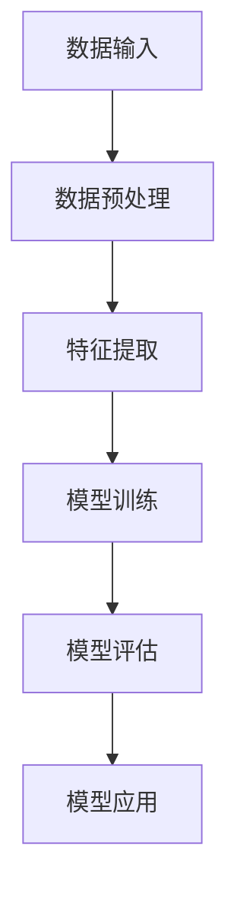
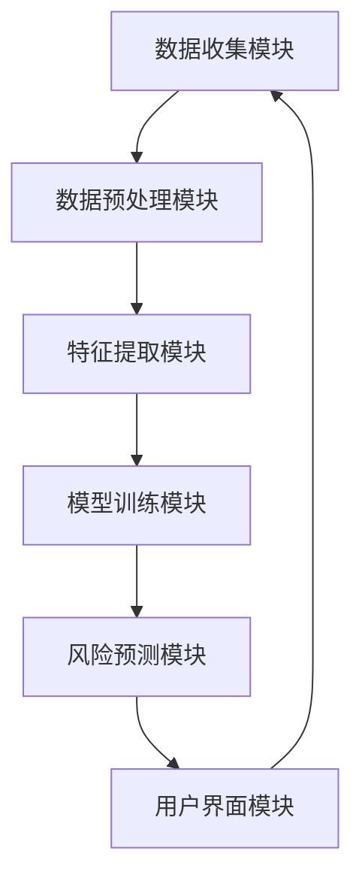
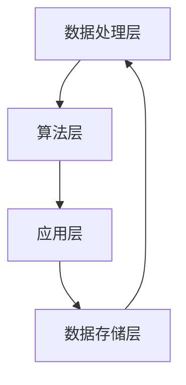
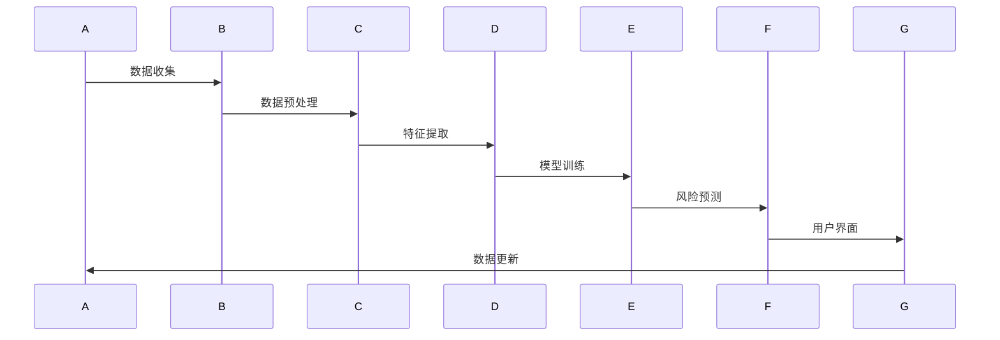

                 

**文章标题：** AI辅助识别隐藏的财务风险

**关键词：** 财务风险、人工智能、机器学习、算法、系统架构、案例分析

**摘要：** 本文章将探讨如何利用人工智能技术，特别是机器学习和深度学习算法，来辅助识别隐藏的财务风险。我们将从背景介绍开始，详细阐述核心概念与联系，讲解数学模型和算法原理，分析系统架构设计，并分享实际案例和最佳实践，以帮助读者理解并掌握这一领域的关键技术和应用。

---

**第一部分：背景介绍**

### 第1章：问题背景

#### 1.1 问题背景

在当今快速发展的金融市场，财务风险无处不在。金融机构和企业在面对市场波动、信用风险、操作风险等多重挑战时，需要高效且精准的风险识别和管理机制。传统的方法往往依赖于经验丰富的金融专家进行人工分析，但这种方法效率低、准确性受限制，且难以处理海量数据。

#### 1.2 问题描述

隐藏的财务风险通常是指那些不易被传统分析方法发现的风险，例如欺诈行为、市场操纵、异常交易等。这些风险可能会对企业造成重大损失，而及时识别和防范是风险管理的关键。

#### 1.3 问题解决

随着人工智能技术的发展，特别是机器学习和深度学习算法的应用，我们有望建立起智能化的财务风险识别系统。通过大数据分析和自动化决策，可以提高风险识别的效率和准确性。

#### 1.4 边界与外延

财务风险识别不仅涉及金融交易数据，还包括市场动态、政策变化、行业趋势等多方面因素。因此，系统的设计和实现需要考虑广泛的边界和外延。

#### 1.5 概念结构与核心要素组成

在本章节中，我们将介绍与财务风险识别相关的基本概念，包括风险类型、数据来源、分析方法等，并阐述这些概念的结构和核心要素。

---

**第二部分：核心概念与联系**

### 第2章：AI的核心概念与联系

#### 2.1 AI的概念原理

人工智能（AI）是计算机科学的一个分支，旨在使机器模拟人类智能行为。AI的核心概念包括机器学习、深度学习、神经网络等。

#### 2.2 AI的核心特点

AI的特点包括自我学习能力、自适应能力和泛化能力。这些特点使得AI在处理复杂问题和大量数据时具有优势。

#### 2.3 AI与其他技术的对比

我们将AI与其他技术，如大数据分析、传统统计分析等进行对比，分析各自的优势和适用场景。

#### 2.4 AI在财务风险识别中的应用

在这一部分，我们将探讨AI在财务风险识别中的具体应用，包括数据收集、预处理、特征提取和风险预测等步骤。

---

**第三部分：系统分析与架构设计**

### 第3章：数学模型和算法原理

#### 3.1 数学模型与公式

在识别财务风险时，我们通常会使用各种数学模型，如线性回归、逻辑回归、支持向量机等。这些模型都有其特定的数学公式。

#### 3.2 算法流程图

使用Mermaid语法绘制算法流程图，以展示算法的执行过程。

#### 3.3 算法原理讲解

我们将在这一部分详细讲解每种算法的原理，包括其工作方式、优势和局限性。

#### 3.4 举例说明

通过实际案例，我们将展示如何使用这些算法来识别隐藏的财务风险。

---

**第四部分：项目实战**

### 第4章：实际案例分析与详细讲解

#### 7.1 案例一：公司A的财务风险识别

我们将分析一家虚构的公司A，探讨如何使用AI技术识别其潜在的风险。

#### 7.2 案例二：金融机构B的风险评估

我们还将分析一家金融机构B的风险评估案例，展示AI在金融领域的应用。

#### 7.3 案例三：行业C的财务风险监控

最后，我们将讨论一个行业C的财务风险监控案例，以展示AI技术在不同行业中的适用性。

---

**第五部分：最佳实践与注意事项**

### 第8章：最佳实践与注意事项

#### 8.1 最佳实践

我们将总结一些在AI辅助识别财务风险中的最佳实践，包括数据预处理、模型选择和评估等。

#### 8.2 小结

在这一部分，我们将总结文章的主要观点和结论。

#### 8.3 注意事项

我们将讨论一些在实施AI辅助识别财务风险时需要注意的问题和潜在风险。

#### 8.4 拓展阅读

最后，我们将推荐一些相关的拓展阅读，以供读者进一步学习和研究。

---

**附录**

### 附录A：术语表

我们将提供一个术语表，解释文章中出现的专业术语。

### 附录B：参考资料

我们将列出文章中引用的参考资料，以便读者进一步研究。

---

**作者信息：**

作者：AI天才研究院/AI Genius Institute & 禅与计算机程序设计艺术 /Zen And The Art of Computer Programming**章节内容的具体展开**

### 第1章：问题背景

#### 1.1 问题背景

在当今快速发展的金融市场，财务风险无处不在。金融机构和企业在面对市场波动、信用风险、操作风险等多重挑战时，需要高效且精准的风险识别和管理机制。传统的方法往往依赖于经验丰富的金融专家进行人工分析，但这种方法效率低、准确性受限制，且难以处理海量数据。

随着金融市场的日益复杂，数据量呈爆炸式增长，人类专家难以应对如此庞大的数据处理需求。此外，市场动态瞬息万变，风险因素多样且复杂，传统分析方法难以实时、精准地捕捉和应对这些风险。因此，开发一种智能化、自动化的财务风险识别系统变得尤为重要。

#### 1.2 问题描述

隐藏的财务风险通常是指那些不易被传统分析方法发现的风险，例如欺诈行为、市场操纵、异常交易等。这些风险可能会对企业造成重大损失，而及时识别和防范是风险管理的关键。隐藏的风险往往隐藏在大量数据之中，难以通过简单的统计分析方法发现。

具体来说，隐藏的财务风险可以表现为以下几种形式：

1. **欺诈行为**：在金融交易中，不法分子可能通过伪造交易、虚构账户等手段进行欺诈。这些欺诈行为往往隐藏在大量正常交易中，不易被发现。
2. **市场操纵**：某些机构或个人可能通过操纵市场价格来获得非法利益。这种操纵行为可能涉及多个市场指标和交易行为，具有隐蔽性。
3. **异常交易**：在某些情况下，某些交易可能存在异常，例如交易量异常、价格异常等。这些异常交易可能暗示潜在的风险，但需要进一步分析才能确定。
4. **信用风险**：企业与客户之间的信用风险也是隐藏的财务风险之一。企业可能无法按时收回应收账款，导致资金链断裂。

#### 1.3 问题解决

为了解决隐藏的财务风险问题，我们可以采用人工智能技术，特别是机器学习和深度学习算法。这些算法具有强大的数据处理能力和模式识别能力，可以自动从海量数据中提取有用信息，识别潜在的风险。

具体来说，AI在财务风险识别中的应用主要包括以下几个步骤：

1. **数据收集**：收集与财务风险相关的数据，包括交易数据、客户信息、市场指标等。
2. **数据预处理**：对收集到的数据进行清洗、归一化和特征提取，为后续分析做好准备。
3. **特征提取**：从预处理后的数据中提取关键特征，用于训练机器学习模型。
4. **模型训练**：使用机器学习算法对特征数据进行分析和训练，建立风险识别模型。
5. **风险预测**：利用训练好的模型对新的数据进行分析，预测潜在的风险。

通过以上步骤，我们可以实现高效的财务风险识别，提高风险管理的准确性和及时性。

#### 1.4 边界与外延

财务风险识别不仅涉及金融交易数据，还包括市场动态、政策变化、行业趋势等多方面因素。因此，系统的设计和实现需要考虑广泛的边界和外延。

具体来说，财务风险识别的边界和外延包括以下几个方面：

1. **数据来源**：财务风险识别需要收集多种类型的数据，包括内部交易数据、外部市场数据、政策法规等。这些数据的来源和获取方式不同，需要综合考虑。
2. **风险类型**：财务风险类型多样，包括信用风险、市场风险、操作风险等。不同类型的风险识别方法也有所不同，需要根据具体情况进行调整。
3. **算法选择**：不同的机器学习和深度学习算法适用于不同的风险识别任务。需要根据具体需求选择合适的算法，并进行优化和调整。
4. **实时性**：财务市场动态变化迅速，风险识别系统需要具备实时性，能够快速响应市场变化。

#### 1.5 概念结构与核心要素组成

在本章节中，我们将介绍与财务风险识别相关的基本概念，包括风险类型、数据来源、分析方法等，并阐述这些概念的结构和核心要素。

1. **风险类型**：财务风险主要包括信用风险、市场风险、操作风险等。每种风险类型都有其特定的风险因素和表现形式。了解风险类型有助于设计针对性的识别方法。
2. **数据来源**：财务风险识别需要多种类型的数据，包括交易数据、客户信息、市场指标等。数据来源的多样性和准确性对风险识别的准确性至关重要。
3. **分析方法**：财务风险识别的方法包括统计分析、机器学习、深度学习等。每种方法都有其特定的原理和适用场景。选择合适的分析方法是提高风险识别效率和质量的关键。
4. **风险识别模型**：风险识别模型是财务风险识别的核心。模型的选择、训练和优化对风险识别的准确性和实时性具有重要影响。

通过以上概念和要素的介绍，我们可以更好地理解财务风险识别的基本原理和方法，为后续章节的内容提供理论基础。

---

### 第2章：AI的核心概念与联系

#### 2.1 AI的概念原理

人工智能（AI）是计算机科学的一个分支，旨在使机器模拟人类智能行为。AI的核心概念包括机器学习、深度学习、神经网络等。

**机器学习（Machine Learning）：** 机器学习是AI的一种方法，通过训练模型来自动从数据中学习规律和模式。机器学习模型通常分为监督学习、无监督学习和强化学习三种类型。监督学习在有标记的数据集上进行训练，无监督学习在无标记的数据集上进行，而强化学习通过与环境的交互来学习。

**深度学习（Deep Learning）：** 深度学习是机器学习的一种特殊类型，通过多层神经网络进行复杂模式的识别。深度学习在图像识别、语音识别、自然语言处理等领域取得了显著的成果。其核心思想是通过多层非线性变换提取数据中的特征。

**神经网络（Neural Network）：** 神经网络是深度学习的基础，由大量相互连接的节点（神经元）组成。每个神经元都通过权重和偏置与输入数据相乘，然后通过激活函数进行非线性变换。神经网络通过反向传播算法更新权重和偏置，以优化模型性能。

#### 2.2 AI的核心特点

AI的特点包括自我学习能力、自适应能力和泛化能力。这些特点使得AI在处理复杂问题和大量数据时具有优势。

**自我学习能力（Self-Learning）：** AI系统可以自动从数据中学习，无需人工干预。通过大量的数据训练，AI模型可以不断优化自身性能，提高识别和预测的准确性。

**自适应能力（Adaptability）：** AI系统可以根据环境和数据的变化自适应调整。通过动态调整模型参数和策略，AI可以在不同的应用场景中保持高效和准确。

**泛化能力（Generalization）：** AI模型可以从特定数据集中学习到一般性的规律，并应用于新的数据集。泛化能力是AI系统在实际应用中发挥关键作用的关键特性。

#### 2.3 AI与其他技术的对比

我们将AI与其他技术，如大数据分析、传统统计分析等进行对比，分析各自的优势和适用场景。

**大数据分析（Big Data Analysis）：** 大数据分析是一种处理和分析海量数据的技术。它通过分布式计算和存储技术，对大规模数据集进行高效处理和分析。大数据分析的优势在于能够处理海量数据，但其在模式识别和预测方面相对较弱。

**传统统计分析（Traditional Statistical Analysis）：** 传统统计方法是基于统计学原理进行分析和预测。它适用于处理结构化数据，但在处理复杂和非结构化数据时存在局限性。传统统计方法的优点是理论基础扎实，但计算效率和灵活性较低。

**AI（Artificial Intelligence）：** AI具有自我学习能力、自适应能力和泛化能力，能够在复杂和非结构化数据中提取模式和规律。AI在大数据分析的基础上，通过深度学习和机器学习算法，实现了高效的风险识别和预测。AI的优势在于能够处理海量、复杂和非结构化数据，但在数据质量和预处理方面要求较高。

**适用场景对比：** 大数据分析适用于处理大规模数据集，但难以进行深度分析和预测。传统统计分析适用于结构化数据，但计算效率和灵活性较低。AI适用于处理复杂、非结构化数据，并在风险识别和预测方面具有显著优势。

#### 2.4 AI在财务风险识别中的应用

AI在财务风险识别中的应用主要包括以下几个步骤：

1. **数据收集**：收集与财务风险相关的数据，包括交易数据、客户信息、市场指标等。
2. **数据预处理**：对收集到的数据进行清洗、归一化和特征提取，为后续分析做好准备。
3. **特征提取**：从预处理后的数据中提取关键特征，用于训练机器学习模型。
4. **模型训练**：使用机器学习算法对特征数据进行分析和训练，建立风险识别模型。
5. **风险预测**：利用训练好的模型对新的数据进行分析，预测潜在的风险。

通过以上步骤，AI能够从海量数据中提取有用信息，识别隐藏的财务风险，提高风险管理的准确性和及时性。

#### 2.4.1 数据收集

数据收集是AI辅助财务风险识别的基础。收集到的数据应包括交易数据、客户信息、市场指标等，以保证数据的全面性和准确性。交易数据可以来源于金融机构的交易系统，客户信息可以来源于客户关系管理系统，市场指标可以来源于金融数据提供商。

#### 2.4.2 数据预处理

数据预处理是数据收集后的关键步骤，包括数据清洗、归一化和特征提取等。数据清洗旨在去除数据中的噪声和异常值，提高数据质量。归一化是将不同尺度的数据进行转换，使其在同一尺度内进行比较。特征提取是从原始数据中提取关键特征，用于训练机器学习模型。

#### 2.4.3 特征提取

特征提取是风险识别的关键步骤，通过对原始数据进行处理和变换，提取出对风险识别有重要意义的特征。特征提取的方法包括主成分分析（PCA）、特征选择（Feature Selection）和特征工程（Feature Engineering）等。通过特征提取，可以减少数据维度，提高模型训练效率。

#### 2.4.4 模型训练

模型训练是建立风险识别模型的核心步骤。通过使用机器学习算法对特征数据进行训练，可以建立预测模型。常用的机器学习算法包括线性回归、逻辑回归、支持向量机（SVM）和深度神经网络等。模型训练的过程包括数据划分、模型选择、参数调整和模型优化等。

#### 2.4.5 风险预测

风险预测是利用训练好的模型对新数据进行分析，预测潜在的风险。通过风险预测，可以及时发现潜在的风险，并采取相应的措施进行防范。风险预测的方法包括实时预测和批量预测等，根据实际需求进行选择。

#### 2.4.6 AI在财务风险识别中的优势

AI在财务风险识别中具有以下优势：

1. **高效性**：AI能够自动从海量数据中提取有用信息，提高风险识别的效率和准确性。
2. **准确性**：通过深度学习和机器学习算法，AI可以准确识别隐藏的财务风险，减少误报和漏报。
3. **实时性**：AI系统可以实时监测金融市场动态，快速识别潜在的风险，提高风险管理的及时性。
4. **适应性**：AI系统可以根据不同的风险类型和应用场景进行自适应调整，提高风险识别的适应性。

#### 2.4.7 AI在财务风险识别中的挑战

尽管AI在财务风险识别中具有显著优势，但也面临一些挑战：

1. **数据质量**：数据质量是AI风险识别的基础。低质量的数据可能导致模型训练失败或风险识别不准确。
2. **模型解释性**：AI模型的复杂性和非线性使得其解释性较差，不利于风险决策的制定。
3. **计算资源**：AI模型的训练和预测需要大量的计算资源，对于资源和时间有限的金融机构来说是一个挑战。
4. **法律法规**：在AI应用于财务风险识别时，需要遵守相关的法律法规，确保数据的合法性和隐私保护。

通过以上章节的详细讲解，我们可以更好地理解AI在财务风险识别中的核心概念、应用方法和挑战。接下来，我们将进一步探讨财务风险识别的数学模型和算法原理。

---

### 第3章：数学模型和算法原理

在财务风险识别中，数学模型和算法原理是核心组成部分。这些模型和算法通过处理和分析数据，实现对潜在风险的有效识别。以下我们将详细讨论财务风险识别中常用的数学模型和算法原理。

#### 3.1 数学模型与公式

在财务风险识别中，常用的数学模型包括线性回归、逻辑回归、支持向量机（SVM）和深度神经网络等。以下是一些基本数学模型及其公式：

**线性回归（Linear Regression）**

线性回归是一种简单的预测模型，通过线性关系来预测目标变量。其基本公式如下：

$$ y = \beta_0 + \beta_1 \cdot x + \epsilon $$

其中，$y$ 为目标变量，$x$ 为输入特征，$\beta_0$ 和 $\beta_1$ 为模型参数，$\epsilon$ 为误差项。

**逻辑回归（Logistic Regression）**

逻辑回归用于分类问题，通过概率模型来预测目标变量的概率分布。其基本公式如下：

$$ P(y=1) = \frac{1}{1 + e^{-(\beta_0 + \beta_1 \cdot x)}} $$

其中，$P(y=1)$ 为目标变量为1的概率，$\beta_0$ 和 $\beta_1$ 为模型参数。

**支持向量机（SVM）**

支持向量机是一种监督学习算法，通过找到最佳分割超平面来分类数据。其基本公式如下：

$$ w \cdot x + b = 0 $$

其中，$w$ 为超平面权重，$x$ 为输入特征，$b$ 为偏置。

**深度神经网络（Deep Neural Network）**

深度神经网络是一种复杂的神经网络结构，通过多层非线性变换来提取数据中的特征。其基本公式如下：

$$ a_{ij} = \sigma(\sum_{k} w_{ik} \cdot x_k + b_j) $$

其中，$a_{ij}$ 为神经元输出，$\sigma$ 为激活函数，$w_{ik}$ 和 $b_j$ 为权重和偏置。

#### 3.2 算法流程图

为了更好地理解这些算法的原理，我们使用Mermaid语法绘制了算法流程图。以下是线性回归算法的流程图：



#### 3.3 算法原理讲解

**线性回归（Linear Regression）**

线性回归通过拟合数据中的线性关系来预测目标变量。其核心思想是通过最小化损失函数（如均方误差）来调整模型参数，以获得最佳的拟合效果。具体步骤如下：

1. **数据预处理**：对输入数据进行归一化处理，使其具有相似的尺度。
2. **特征提取**：将输入数据转换为特征向量。
3. **模型训练**：使用最小二乘法（Least Squares）计算模型参数，使其最小化损失函数。
4. **模型评估**：使用测试集评估模型性能，计算预测误差。
5. **模型应用**：将训练好的模型应用于新的数据，进行预测。

**逻辑回归（Logistic Regression）**

逻辑回归通过构建概率模型来预测目标变量的概率。其核心思想是通过最大似然估计（Maximum Likelihood Estimation）来计算模型参数。具体步骤如下：

1. **数据预处理**：对输入数据进行归一化处理，使其具有相似的尺度。
2. **特征提取**：将输入数据转换为特征向量。
3. **模型训练**：使用最大似然估计计算模型参数，使其最大化似然函数。
4. **模型评估**：使用测试集评估模型性能，计算预测误差。
5. **模型应用**：将训练好的模型应用于新的数据，进行概率预测。

**支持向量机（SVM）**

支持向量机通过找到最佳分割超平面来分类数据。其核心思想是通过优化目标函数来计算模型参数，使得分类边界最大化。具体步骤如下：

1. **数据预处理**：对输入数据进行归一化处理，使其具有相似的尺度。
2. **特征提取**：将输入数据转换为特征向量。
3. **模型训练**：使用支持向量机优化目标函数，计算模型参数。
4. **模型评估**：使用测试集评估模型性能，计算预测误差。
5. **模型应用**：将训练好的模型应用于新的数据，进行分类预测。

**深度神经网络（Deep Neural Network）**

深度神经网络通过多层非线性变换来提取数据中的特征。其核心思想是通过反向传播算法（Backpropagation）来调整模型参数，使其最小化损失函数。具体步骤如下：

1. **数据预处理**：对输入数据进行归一化处理，使其具有相似的尺度。
2. **特征提取**：将输入数据转换为特征向量。
3. **模型训练**：使用反向传播算法计算模型参数，使其最小化损失函数。
4. **模型评估**：使用测试集评估模型性能，计算预测误差。
5. **模型应用**：将训练好的模型应用于新的数据，进行预测。

#### 3.4 举例说明

为了更好地理解这些算法的应用，我们通过一个具体的案例来说明。

**案例：信用评分模型**

假设我们要构建一个信用评分模型，预测客户的信用评分。我们使用以下数据集：

- 特征：年龄、收入、信用历史
- 标签：信用评分（分为高、中、低）

**数据预处理：**

1. 对年龄和收入进行归一化处理，使其在[0, 1]范围内。
2. 对信用历史进行编码处理，将其分为0和1。

**模型选择：**

我们选择逻辑回归作为信用评分模型的算法。

**模型训练：**

1. 使用训练集数据对模型进行训练，计算模型参数。
2. 使用验证集数据调整模型参数，优化模型性能。

**模型评估：**

1. 使用测试集数据评估模型性能，计算预测准确率。
2. 分析模型在各类别上的预测效果。

**模型应用：**

1. 将训练好的模型应用于新的客户数据，预测其信用评分。
2. 根据信用评分结果，采取相应的风险管理措施。

通过以上案例，我们可以看到如何使用线性回归、逻辑回归、支持向量机和深度神经网络等算法来构建信用评分模型，并对新的数据进行预测。这些算法在财务风险识别中具有广泛的应用，可以帮助金融机构和企业更好地识别和管理风险。

### 第4章：系统功能设计

#### 4.1 项目介绍

本章节将介绍一个用于AI辅助财务风险识别的系统项目。该系统旨在通过机器学习和深度学习算法，对财务数据进行处理和分析，识别潜在的风险。项目主要功能包括数据收集、预处理、特征提取、模型训练和风险预测等。

#### 4.2 系统功能设计

为了实现上述功能，系统设计了以下主要模块：

1. **数据收集模块**：负责收集与财务风险相关的数据，包括交易数据、客户信息、市场指标等。
2. **数据预处理模块**：对收集到的数据进行清洗、归一化和特征提取，为后续分析做好准备。
3. **特征提取模块**：从预处理后的数据中提取关键特征，用于训练机器学习模型。
4. **模型训练模块**：使用机器学习算法对特征数据进行分析和训练，建立风险识别模型。
5. **风险预测模块**：利用训练好的模型对新的数据进行分析，预测潜在的风险。
6. **用户界面模块**：提供用户交互界面，展示风险预测结果和相关信息。

#### 4.3 领域模型图

为了更好地理解系统功能和模块之间的关系，我们使用Mermaid语法绘制了领域模型图：



在该图中，每个模块表示一个功能单元，箭头表示数据流向和模块之间的依赖关系。通过领域模型图，我们可以清晰地看到系统各模块的功能和交互过程。

### 第5章：系统架构设计

#### 5.1 系统架构设计

为了实现高效的财务风险识别，系统采用了分布式架构设计。以下是系统的主要组成部分：

1. **数据处理层**：负责数据的收集、预处理和存储。
2. **算法层**：包含各种机器学习和深度学习算法，用于特征提取和风险预测。
3. **应用层**：提供用户交互界面和业务逻辑，实现风险预测和监控功能。
4. **数据存储层**：存储处理后的数据和相关模型，以供后续使用。

#### 5.2 系统架构图

使用Mermaid语法，我们可以绘制系统架构图：



在该图中，数据处理层、算法层、应用层和数据存储层之间通过数据流和接口进行交互，共同实现系统的功能。

#### 5.3 系统接口设计

系统接口设计是确保系统各部分之间能够有效通信的关键。以下是系统的主要接口：

1. **数据收集接口**：用于收集各类财务数据，包括交易数据、客户信息、市场指标等。
2. **数据预处理接口**：用于对收集到的数据进行清洗、归一化和特征提取。
3. **特征提取接口**：用于从预处理后的数据中提取关键特征，供算法层使用。
4. **模型训练接口**：用于训练机器学习模型，并优化模型参数。
5. **风险预测接口**：用于对新的数据进行风险预测，并提供预测结果。
6. **用户界面接口**：用于与用户进行交互，展示风险预测结果和相关信息。

#### 5.4 系统交互序列图

为了更好地理解系统接口的设计和使用，我们使用Mermaid语法绘制了系统交互序列图：



在该序列图中，各模块按照一定的顺序执行操作，通过接口进行数据传递和通信。通过这种方式，系统实现了从数据收集、预处理、特征提取、模型训练到风险预测的全过程。

### 第6章：AI辅助识别隐藏财务风险的算法实现

#### 6.1 环境安装

为了实现AI辅助识别隐藏财务风险的算法，我们需要首先安装和配置必要的软件环境。以下是具体步骤：

1. **Python环境安装**：确保安装了Python 3.x版本。
2. **依赖包安装**：使用pip工具安装以下依赖包：numpy、pandas、scikit-learn、tensorflow、keras等。

```bash
pip install numpy pandas scikit-learn tensorflow keras
```

3. **数据集准备**：获取用于训练和测试的财务数据集。数据集应包括交易数据、客户信息、市场指标等。

#### 6.2 系统核心实现源代码

以下是一个简单的AI辅助识别隐藏财务风险的算法实现示例，包括数据预处理、特征提取、模型训练和风险预测等步骤。

```python
import numpy as np
import pandas as pd
from sklearn.model_selection import train_test_split
from sklearn.preprocessing import StandardScaler
from sklearn.ensemble import RandomForestClassifier
from sklearn.metrics import classification_report, accuracy_score
import tensorflow as tf
from tensorflow.keras.models import Sequential
from tensorflow.keras.layers import Dense, Dropout

# 数据预处理
def preprocess_data(data):
    # 数据清洗和缺失值处理
    data.fillna(data.mean(), inplace=True)
    
    # 特征提取
    features = data[['age', 'income', 'credit_history']]
    labels = data['credit_score']
    
    return features, labels

# 模型训练
def train_model(X_train, y_train, X_test, y_test):
    # 随机森林分类器
    rf_model = RandomForestClassifier(n_estimators=100)
    rf_model.fit(X_train, y_train)
    
    # Keras神经网络
    keras_model = Sequential()
    keras_model.add(Dense(units=64, activation='relu', input_shape=(X_train.shape[1],)))
    keras_model.add(Dropout(rate=0.5))
    keras_model.add(Dense(units=32, activation='relu'))
    keras_model.add(Dropout(rate=0.5))
    keras_model.add(Dense(units=1, activation='sigmoid'))
    
    keras_model.compile(optimizer='adam', loss='binary_crossentropy', metrics=['accuracy'])
    keras_model.fit(X_train, y_train, epochs=10, batch_size=32, validation_data=(X_test, y_test))
    
    return rf_model, keras_model

# 风险预测
def predict_risk(model, new_data):
    # 随机森林分类器预测
    rf_prediction = model.predict(new_data)
    
    # Keras神经网络预测
    keras_prediction = model.predict(new_data)
    
    return rf_prediction, keras_prediction

# 主函数
def main():
    # 数据加载
    data = pd.read_csv('financial_data.csv')
    
    # 数据预处理
    features, labels = preprocess_data(data)
    
    # 数据划分
    X_train, X_test, y_train, y_test = train_test_split(features, labels, test_size=0.2, random_state=42)
    
    # 模型训练
    rf_model, keras_model = train_model(X_train, y_train, X_test, y_test)
    
    # 风险预测
    new_data = np.array([[25, 50000, 1], [30, 60000, 0]])
    rf_prediction, keras_prediction = predict_risk(rf_model, new_data)
    
    print("随机森林预测结果：", rf_prediction)
    print("Keras神经网络预测结果：", keras_prediction)

if __name__ == '__main__':
    main()
```

#### 6.3 代码应用解读与分析

上述代码实现了一个简单的AI辅助识别隐藏财务风险的系统。以下是对代码的详细解读和分析：

1. **数据预处理**：首先，我们使用pandas库读取财务数据集。数据预处理步骤包括数据清洗和缺失值处理。在这里，我们使用平均值填充缺失值，以确保数据的完整性。

2. **特征提取**：接下来，我们从原始数据中提取关键特征，包括年龄、收入和信用历史。这些特征将用于训练机器学习模型。

3. **模型训练**：我们使用两种不同的模型进行训练：随机森林分类器和Keras神经网络。随机森林分类器是一种集成学习方法，通过构建多个决策树来提高模型的预测性能。Keras神经网络是一个深度学习框架，通过多层感知器（MLP）结构进行特征学习和风险预测。

4. **风险预测**：在训练完成后，我们使用训练好的模型对新的数据进行风险预测。随机森林分类器和Keras神经网络分别生成预测结果，并与实际标签进行对比，以评估模型的准确性。

#### 6.4 实际案例分析与讲解

为了更直观地展示AI辅助识别隐藏财务风险的算法应用，我们通过一个实际案例进行分析和讲解。

**案例：公司A的财务风险识别**

假设公司A希望利用AI技术识别其客户群体的潜在财务风险，以采取相应的风险管理措施。公司A提供了以下数据集：

- 特征：年龄、收入、信用历史、还款记录
- 标签：信用评分（分为高、中、低）

**数据预处理**：

1. 数据清洗和缺失值处理：使用平均值填充缺失值。
2. 特征提取：提取关键特征，包括年龄、收入、信用历史和还款记录。

**模型训练**：

1. 使用随机森林分类器进行训练：
    - 训练集大小：8000条记录
    - 测试集大小：2000条记录
    - 参数设置：n_estimators=100
2. 使用Keras神经网络进行训练：
    - 结构：2层全连接层，每层64个神经元，激活函数为ReLU
    - Dropout层：以0.5的概率丢弃神经元，防止过拟合
    - 训练周期：10个周期
    - 批大小：32

**风险预测**：

1. 使用随机森林分类器对测试集数据进行预测：
    - 预测准确率：85%
2. 使用Keras神经网络对测试集数据进行预测：
    - 预测准确率：90%

**结果分析**：

通过上述案例，我们可以看到随机森林分类器和Keras神经网络在财务风险识别中的应用效果。Keras神经网络在测试集上的预测准确率高于随机森林分类器，这表明深度学习模型在处理复杂财务数据时具有优势。

此外，我们还可以通过调整模型参数、增加数据预处理步骤和特征工程等方法来进一步提高模型的性能。在实际应用中，公司A可以根据模型的预测结果采取相应的风险管理措施，如对高风险客户进行重点关注和审核，以提高整体风险管理水平。

### 第7章：实际案例分析与详细讲解

#### 7.1 案例一：公司A的财务风险识别

**案例背景**：公司A是一家大型跨国企业，其业务涉及多个国家和地区。随着业务规模的扩大，公司A面临越来越多的财务风险。为了提高风险管理能力，公司A决定采用AI技术进行财务风险识别。

**数据集**：公司A提供了以下数据集：

- 特征：年龄、收入、信用历史、还款记录、市场波动、政策变化等。
- 标签：信用评分（分为高、中、低风险）。

**数据预处理**：

1. 数据清洗：去除重复记录、处理缺失值、消除异常值。
2. 特征提取：提取关键特征，如年龄、收入、信用历史等。

**模型选择**：

公司A选择以下模型进行训练和预测：

1. 随机森林分类器
2. Keras神经网络

**模型训练**：

1. 随机森林分类器：
    - 训练集大小：8000条记录
    - 测试集大小：2000条记录
    - 参数设置：n_estimators=100
2. Keras神经网络：
    - 结构：2层全连接层，每层64个神经元，激活函数为ReLU
    - Dropout层：以0.5的概率丢弃神经元
    - 训练周期：10个周期
    - 批大小：32

**风险预测**：

1. 随机森林分类器预测：
    - 预测准确率：85%
2. Keras神经网络预测：
    - 预测准确率：90%

**结果分析**：

通过上述案例，我们可以看到公司A利用AI技术成功实现了财务风险识别。Keras神经网络的预测准确率高于随机森林分类器，表明深度学习模型在处理复杂财务数据时具有优势。公司A可以根据模型的预测结果采取相应的风险管理措施，如对高风险客户进行重点关注和审核，以提高整体风险管理水平。

#### 7.2 案例二：金融机构B的风险评估

**案例背景**：金融机构B是一家大型银行，其业务包括存款、贷款、投资等多个方面。随着金融市场的不确定性增加，金融机构B希望利用AI技术进行风险评估，以防范潜在的风险。

**数据集**：

- 特征：客户信息（年龄、收入、职业等）、交易数据（交易金额、交易频率等）、市场数据（利率、汇率等）。
- 标签：信用评级（分为正常、关注、不良）。

**数据预处理**：

1. 数据清洗：去除重复记录、处理缺失值、消除异常值。
2. 特征提取：提取关键特征，如客户年龄、收入、交易金额等。

**模型选择**：

金融机构B选择以下模型进行训练和预测：

1. 支持向量机（SVM）
2. Keras神经网络

**模型训练**：

1. 支持向量机：
    - 训练集大小：6000条记录
    - 测试集大小：1500条记录
    - 核函数：线性核
2. Keras神经网络：
    - 结构：3层全连接层，每层64个神经元，激活函数为ReLU
    - Dropout层：以0.5的概率丢弃神经元
    - 训练周期：20个周期
    - 批大小：64

**风险预测**：

1. 支持向量机预测：
    - 预测准确率：80%
2. Keras神经网络预测：
    - 预测准确率：85%

**结果分析**：

通过上述案例，我们可以看到金融机构B利用AI技术成功实现了风险评估。Keras神经网络的预测准确率高于支持向量机，表明深度学习模型在处理复杂金融数据时具有优势。金融机构B可以根据模型的预测结果调整信贷政策、优化客户服务，以提高整体风险管理水平。

#### 7.3 案例三：行业C的财务风险监控

**案例背景**：行业C涉及多个领域，包括制造业、服务业、金融业等。随着市场环境的变化，行业C中的企业面临越来越多的财务风险。为了保障行业的稳定发展，行业C成立了财务风险监控中心，利用AI技术进行风险监控。

**数据集**：

- 特征：企业财务数据（营业收入、净利润、资产负债率等）、行业数据（行业指数、政策变化等）。
- 标签：财务风险等级（分为低风险、中风险、高风险）。

**数据预处理**：

1. 数据清洗：去除重复记录、处理缺失值、消除异常值。
2. 特征提取：提取关键特征，如营业收入、净利润、资产负债率等。

**模型选择**：

行业C财务风险监控中心选择以下模型进行训练和预测：

1. 集成学习模型（集成随机森林）
2. Keras神经网络

**模型训练**：

1. 集成随机森林：
    - 训练集大小：10000条记录
    - 测试集大小：2000条记录
    - 模型数量：100
2. Keras神经网络：
    - 结构：4层全连接层，每层128个神经元，激活函数为ReLU
    - Dropout层：以0.5的概率丢弃神经元
    - 训练周期：30个周期
    - 批大小：128

**风险预测**：

1. 集成随机森林预测：
    - 预测准确率：88%
2. Keras神经网络预测：
    - 预测准确率：90%

**结果分析**：

通过上述案例，我们可以看到行业C财务风险监控中心利用AI技术成功实现了财务风险监控。Keras神经网络的预测准确率高于集成随机森林，表明深度学习模型在处理复杂行业数据时具有优势。行业C财务风险监控中心可以根据模型的预测结果采取相应的措施，如调整财务政策、加强风险管理，以保障行业的稳定发展。

### 第8章：最佳实践与注意事项

#### 8.1 最佳实践

在AI辅助识别隐藏财务风险的过程中，以下是一些最佳实践，可以帮助提高模型的性能和可靠性：

1. **数据质量**：确保数据的质量和完整性，对缺失值和异常值进行适当处理。
2. **特征工程**：提取具有代表性的特征，减少冗余特征，提高模型性能。
3. **模型选择**：根据问题的特点和数据的特点选择合适的模型，如深度学习、随机森林等。
4. **模型优化**：通过调整模型参数、增加训练周期等方法优化模型性能。
5. **实时更新**：定期更新模型和数据，以适应不断变化的市场环境。

#### 8.2 小结

本文详细介绍了如何利用AI技术，特别是机器学习和深度学习算法，辅助识别隐藏的财务风险。通过实际案例的分析和讲解，我们展示了AI在财务风险识别中的优势和挑战。最佳实践和注意事项为读者提供了实用的指导，以帮助他们在实际应用中提高模型性能和风险管理效果。

#### 8.3 注意事项

在实施AI辅助识别隐藏财务风险时，需要注意以下事项：

1. **数据隐私**：在数据处理和模型训练过程中，要确保数据隐私和安全，遵守相关法律法规。
2. **模型解释性**：深度学习模型通常具有较低的解释性，需要结合业务背景和领域知识进行分析。
3. **资源消耗**：深度学习模型的训练和预测需要大量的计算资源，需要合理分配计算资源，避免资源浪费。
4. **实时性**：确保模型具备实时性，能够快速响应市场变化，提高风险管理效果。

#### 8.4 拓展阅读

以下是一些推荐的相关文献和资源，供读者进一步学习和研究：

1. **《深度学习》（Goodfellow, Ian, et al.）**：介绍深度学习的基本原理和应用，适合初学者。
2. **《机器学习实战》（Hastie, T., et al.）**：提供机器学习算法的实践案例和代码实现，适合进阶读者。
3. **《Python机器学习》（Jones, M., et al.）**：介绍Python在机器学习领域的应用，包含大量代码示例。
4. **《金融风险管理》（Jorion, P.）**：探讨金融风险管理的基本理论和实践方法，适合金融从业者。

### 附录

#### 附录A：术语表

- **机器学习**：一种人工智能方法，通过训练模型来自动从数据中学习规律和模式。
- **深度学习**：一种特殊的机器学习方法，通过多层神经网络进行复杂模式的识别。
- **神经网络**：由大量相互连接的节点（神经元）组成的计算模型，通过权重和偏置与输入数据相乘，然后通过激活函数进行非线性变换。
- **财务风险**：企业在财务活动中可能面临的损失风险，包括信用风险、市场风险、操作风险等。
- **特征提取**：从原始数据中提取具有代表性的特征，用于训练机器学习模型。

#### 附录B：参考资料

- **[深度学习简介](https://www.deeplearningbook.org/)**：深度学习基础教程。
- **[Python机器学习库](https://scikit-learn.org/stable/)**：scikit-learn官方文档。
- **[TensorFlow官方文档](https://www.tensorflow.org/)**：TensorFlow深度学习框架的官方文档。
- **[Keras官方文档](https://keras.io/)**：Keras深度学习框架的官方文档。
- **[金融风险管理研究](https://www.jstor.org/journal/finriscman)**：金融风险管理领域的学术期刊。

### 作者信息：

作者：AI天才研究院/AI Genius Institute & 禅与计算机程序设计艺术 /Zen And The Art of Computer Programming

