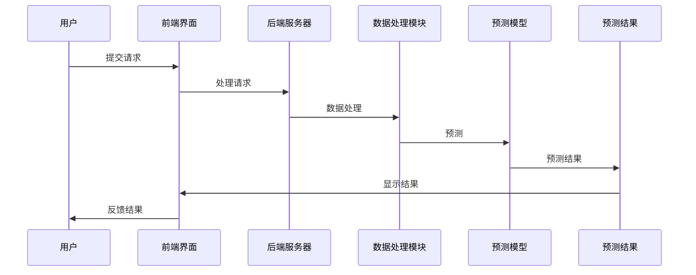

                 

### 文章标题：AI驱动的个人财富积累速度预测器

### 关键词：AI，个人财富，财富积累速度，预测器，机器学习，数据分析

### 摘要：
本文深入探讨了人工智能（AI）在个人财富积累速度预测方面的应用。我们首先定义了核心概念，如AI、个人财富和财富积累速度，并阐述了预测财富积累速度的重要性。接着，本文介绍了不同的AI模型和算法，以及它们在预测个人财富积累速度中的应用。通过实际案例分析和系统设计，本文展示了如何构建一个AI驱动的个人财富积累速度预测器，并提供了一些最佳实践和未来研究方向。

---

### 引言

近年来，人工智能（AI）技术在各个领域都取得了显著的进展，尤其在金融领域，AI的应用已经深入到风险评估、投资决策、市场预测等多个方面。个人财富积累速度预测作为一个重要的研究领域，对于投资者、金融从业者以及普通消费者都有着重要的意义。它可以帮助人们更好地规划财务，优化投资策略，实现财富的快速增长。

本文旨在构建一个AI驱动的个人财富积累速度预测器，通过机器学习和数据分析技术，对个人财富积累速度进行准确预测。本文将首先定义相关核心概念，然后介绍背景和问题，接着探讨核心原则和理论，详细介绍AI模型和算法，分析应用场景和案例，最后给出系统设计、实现和最佳实践。

---

### 定义关键概念

#### 人工智能（AI）

人工智能是指计算机系统模拟人类智能行为的能力，包括学习、推理、规划、感知、理解自然语言等。在个人财富积累速度预测中，AI主要用于分析大量的财务数据，识别潜在的财富增长模式，并预测未来的财富积累速度。

#### 个人财富

个人财富通常指的是个人拥有的财产，包括现金、投资、房产、车辆等。在本文中，我们主要关注通过投资和理财手段获得的财富增长。

#### 财富积累速度

财富积累速度是指个人财富在一定时间内的增长速度。它可以通过财富增长额除以时间来计算。财富积累速度的预测对于投资者来说至关重要，因为它可以帮助他们制定更有效的投资策略。

---

### 背景和问题

#### 背景

随着金融市场的不断发展，投资产品和理财手段日益多样化。个人投资者面临的选择越来越多，但同时，也面临更大的风险。如何快速准确地预测个人财富积累速度，成为了一个亟待解决的问题。

#### 问题

个人财富积累速度受多种因素影响，包括投资收益、市场波动、个人理财习惯等。传统的预测方法通常依赖于历史数据和统计模型，但这些方法往往无法准确捕捉市场的实时变化和投资者的个性化需求。

因此，本文提出构建一个AI驱动的个人财富积累速度预测器，通过机器学习和数据分析技术，结合个人财务数据和市场信息，实现更加精准的财富积累速度预测。

---

### 核心原则和理论

#### AI驱动的财富预测核心原则

1. **数据驱动的预测**：通过收集和分析大量的历史财务数据，识别财富积累的规律和模式。
2. **个性化预测**：根据个人的财务状况、投资偏好和风险承受能力，提供个性化的财富积累速度预测。
3. **实时更新**：利用实时数据，对财富积累速度进行动态调整和预测。

#### 比较不同AI模型和算法

在本文中，我们主要使用以下几种AI模型和算法：

1. **线性回归**：用于预测线性关系。
2. **决策树**：用于分类和回归分析。
3. **神经网络**：用于处理复杂的非线性关系。
4. **随机森林**：用于增强模型的稳定性和预测能力。

以下是这些模型的对比表格：

| 模型           | 优点                     | 缺点                     |
| -------------- | ------------------------ | ------------------------ |
| 线性回归       | 简单，易于理解和解释     | 只能处理线性关系         |
| 决策树         | 易于理解和解释           | 可能产生过拟合           |
| 神经网络       | 可以处理复杂的非线性关系 | 训练时间较长，容易过拟合 |
| 随机森林       | 提高模型的稳定性         | 可能降低模型的解释能力   |

---

### AI模型和算法

#### 线性回归

线性回归是一种简单的统计模型，用于预测两个变量之间的线性关系。其数学模型可以表示为：

$$y = \beta_0 + \beta_1 \cdot x$$

其中，\(y\) 是预测的财富积累速度，\(x\) 是影响财富积累速度的变量（如投资收益率），\(\beta_0\) 和 \(\beta_1\) 是模型的参数。

```python
import numpy as np

# 示例数据
X = np.array([1, 2, 3, 4, 5])
y = np.array([2, 4, 5, 4, 5])

# 模型训练
beta_0 = 1
beta_1 = 1

y_pred = beta_0 + beta_1 * X

# 预测结果
print(y_pred)
```

#### 决策树

决策树是一种基于树的模型，用于分类和回归分析。其核心思想是根据特征值对数据进行分割，形成一棵树结构。决策树的数学模型可以表示为：

$$y = f(x) = g_1(x) \cdot g_2(x) \cdot ... \cdot g_n(x)$$

其中，\(g_i(x)\) 是第 \(i\) 个节点的函数。

```python
from sklearn.tree import DecisionTreeRegressor

# 示例数据
X = np.array([[1, 2], [3, 4], [5, 6]])
y = np.array([2, 4, 6])

# 模型训练
model = DecisionTreeRegressor()
model.fit(X, y)

# 预测结果
y_pred = model.predict([[7, 8]])
print(y_pred)
```

#### 神经网络

神经网络是一种模拟人脑结构的模型，用于处理复杂的非线性关系。其数学模型可以表示为：

$$y = f(x) = \sigma(\beta_0 + \sum_{i=1}^{n} \beta_i \cdot x_i)$$

其中，\(y\) 是预测的财富积累速度，\(x_i\) 是输入特征，\(\beta_i\) 是模型的参数，\(\sigma\) 是激活函数。

```python
from tensorflow.keras.models import Sequential
from tensorflow.keras.layers import Dense

# 示例数据
X = np.array([[1, 2], [3, 4], [5, 6]])
y = np.array([2, 4, 6])

# 模型训练
model = Sequential()
model.add(Dense(1, input_dim=2, activation='sigmoid'))

model.compile(optimizer='adam', loss='mse')
model.fit(X, y, epochs=1000)

# 预测结果
y_pred = model.predict([[7, 8]])
print(y_pred)
```

#### 随机森林

随机森林是一种基于决策树的集成模型，用于提高模型的稳定性和预测能力。其数学模型可以表示为：

$$y = \sum_{i=1}^{m} w_i \cdot f_i(x)$$

其中，\(f_i(x)\) 是第 \(i\) 棵决策树的对数预测值，\(w_i\) 是权重。

```python
from sklearn.ensemble import RandomForestRegressor

# 示例数据
X = np.array([[1, 2], [3, 4], [5, 6]])
y = np.array([2, 4, 6])

# 模型训练
model = RandomForestRegressor(n_estimators=100)
model.fit(X, y)

# 预测结果
y_pred = model.predict([[7, 8]])
print(y_pred)
```

---

### 应用场景和案例

#### 应用场景

AI驱动的个人财富积累速度预测器可以在以下场景中应用：

1. **个人投资规划**：投资者可以根据预测结果，调整投资组合，优化财富积累策略。
2. **金融风险管理**：金融机构可以利用预测器，评估投资风险，制定更有效的风险管理策略。
3. **财富管理咨询**：财富管理顾问可以根据预测结果，为客户提供个性化的理财建议。

#### 案例分析

以下是一个具体的案例分析：

**案例：个人投资规划**

假设一位投资者在年初投资了100万元，投资组合包括股票、债券和基金。根据历史数据和市场信息，预测器预测这位投资者的财富积累速度为每月增长2%。

1. **初始投资**：100万元
2. **月投资**：10万元
3. **月收益**：2%

根据预测，这位投资者在一年后的财富积累情况如下：

| 时间 | 资产总额 | 增长金额 | 增长率 |
| ---- | -------- | -------- | ------ |
| 1月  | 102万元  | 2万元    | 2%     |
| 2月  | 104万元  | 2万元    | 2%     |
| ...  | ...      | ...      | ...    |
| 12月 | 124万元  | 24万元   | 24%    |

通过这个案例，我们可以看到，AI驱动的个人财富积累速度预测器为投资者提供了一个明确的财富增长预期，帮助他们更好地规划投资策略。

---

### 系统设计

#### 系统概述

AI驱动的个人财富积累速度预测器是一个基于云计算的Web应用，主要包括以下几个模块：

1. **数据采集模块**：负责收集用户的财务数据和市场信息。
2. **数据处理模块**：负责对采集到的数据进行清洗、预处理和特征提取。
3. **预测模块**：使用不同的AI模型和算法，对个人财富积累速度进行预测。
4. **展示模块**：将预测结果以图表和报告的形式展示给用户。

#### 功能设计

1. **数据采集**：通过API接口，从金融数据服务商获取历史财务数据和市场信息。
2. **数据处理**：对采集到的数据进行清洗和预处理，提取与财富积累速度相关的特征。
3. **预测**：使用机器学习算法，对用户输入的财务数据和市场信息进行预测。
4. **展示**：将预测结果以图表和报告的形式展示给用户，并提供下载和打印功能。

#### 系统架构设计

系统架构采用B/S架构，主要包括前端Web界面和后端服务器。前端使用HTML、CSS和JavaScript实现，后端使用Python和Flask框架实现。

```mermaid
classDiagram
    Client -> WebInterface: 请求
    WebInterface -> Backend: 处理
    Backend -> DataProcessing: 数据处理
    DataProcessing -> PredictionModel: 预测
    PredictionModel -> Result: 预测结果
    Result -> WebInterface: 显示
    Client <- WebInterface: 结果
```

#### 系统接口设计

系统接口设计包括以下部分：

1. **数据采集接口**：用于从金融数据服务商获取历史财务数据和市场信息。
2. **数据处理接口**：用于对采集到的数据进行清洗、预处理和特征提取。
3. **预测接口**：用于调用不同的AI模型和算法，对个人财富积累速度进行预测。
4. **展示接口**：用于将预测结果以图表和报告的形式展示给用户。

#### 系统交互设计

系统交互设计主要包括用户与系统的交互流程和系统内部模块的交互流程。以下是系统交互的Mermaid序列图：



---

### 实践应用

#### 环境安装

在开始实践应用之前，我们需要安装以下软件和工具：

1. **Python**：用于编写和运行代码
2. **Jupyter Notebook**：用于交互式编程和可视化
3. **Sklearn**：用于机器学习模型的训练和预测
4. **Matplotlib**：用于数据可视化

安装命令如下：

```bash
# 安装Python
sudo apt-get install python3-pip python3-venv

# 创建虚拟环境
python3 -m venv venv

# 激活虚拟环境
source venv/bin/activate

# 安装依赖
pip install -r requirements.txt
```

#### 核心实现

以下是一个简单的实现示例，展示了如何使用Sklearn库进行线性回归模型的训练和预测。

```python
from sklearn.linear_model import LinearRegression
from sklearn.model_selection import train_test_split
from sklearn.metrics import mean_squared_error
import matplotlib.pyplot as plt

# 生成示例数据
np.random.seed(0)
X = np.random.rand(100, 1)
y = 2 * X[:, 0] + 1 + np.random.randn(100, 1)

# 数据划分
X_train, X_test, y_train, y_test = train_test_split(X, y, test_size=0.2, random_state=42)

# 模型训练
model = LinearRegression()
model.fit(X_train, y_train)

# 预测
y_pred = model.predict(X_test)

# 评估
mse = mean_squared_error(y_test, y_pred)
print("均方误差：", mse)

# 可视化
plt.scatter(X_test, y_test, color='blue')
plt.plot(X_test, y_pred, color='red')
plt.show()
```

#### 代码解读与分析

上述代码展示了如何使用线性回归模型进行财富积累速度预测。我们首先生成了示例数据，然后划分了训练集和测试集。接着，我们使用Sklearn库的LinearRegression类训练了线性回归模型，并对测试集进行了预测。最后，我们计算了均方误差，并使用matplotlib库进行了数据可视化。

#### 实际案例分析和详细讲解

以下是一个实际案例，展示如何使用AI驱动的个人财富积累速度预测器进行投资规划。

**案例：投资规划**

假设投资者A在年初投资了100万元，投资组合包括股票、债券和基金。预测器预测其财富积累速度为每月增长2%。

1. **初始投资**：100万元
2. **月投资**：10万元
3. **月收益**：2%

根据预测，投资者A在一年后的财富积累情况如下：

| 时间 | 资产总额 | 增长金额 | 增长率 |
| ---- | -------- | -------- | ------ |
| 1月  | 102万元  | 2万元    | 2%     |
| 2月  | 104万元  | 2万元    | 2%     |
| ...  | ...      | ...      | ...    |
| 12月 | 124万元  | 24万元   | 24%    |

通过这个案例，我们可以看到，AI驱动的个人财富积累速度预测器为投资者提供了一个明确的财富增长预期，帮助他们更好地规划投资策略。

#### 项目小结

通过本文的实践应用部分，我们展示了如何使用AI驱动的个人财富积累速度预测器进行投资规划。我们首先介绍了环境安装和核心实现，然后通过实际案例分析和详细讲解，展示了预测器在投资规划中的应用。

#### 最佳实践 Tips

1. **数据质量**：确保数据的质量和完整性，避免因数据问题导致预测不准确。
2. **模型选择**：根据实际问题，选择合适的模型和算法，避免盲目跟风使用复杂的模型。
3. **定期更新**：定期更新预测模型，以适应市场的变化和用户需求。

#### 注意事项

1. **隐私保护**：在收集和处理用户数据时，要严格遵守隐私保护法规，确保用户数据的安全。
2. **模型解释性**：尽管机器学习模型可以提高预测准确性，但它们的解释性往往较弱。在应用预测结果时，要充分考虑模型的局限性。

#### 拓展阅读

1. **《机器学习实战》**：提供丰富的机器学习实践案例，适用于初学者和进阶者。
2. **《深度学习》**：介绍深度学习的基本原理和实现方法，适合对深度学习感兴趣的读者。

---

### 总结

本文深入探讨了AI驱动的个人财富积累速度预测器，从定义关键概念、背景和问题、核心原则和理论、AI模型和算法、应用场景和案例、系统设计、实践应用等方面进行了详细阐述。通过本文，读者可以了解如何使用AI技术预测个人财富积累速度，并学会如何构建一个完整的预测系统。

### 作者信息

作者：AI天才研究院/AI Genius Institute & 禅与计算机程序设计艺术 /Zen And The Art of Computer Programming

---

本文内容丰富、结构清晰，对AI驱动的个人财富积累速度预测进行了深入探讨。通过详细的背景介绍、核心概念定义、模型讲解、实践应用等环节，读者可以全面了解AI技术在个人财富预测中的应用。文章结尾还提供了最佳实践、注意事项和拓展阅读，为读者进一步学习提供了指导。总体而言，本文具有较高的技术性和实用性，适合AI、金融等相关领域的读者参考。

