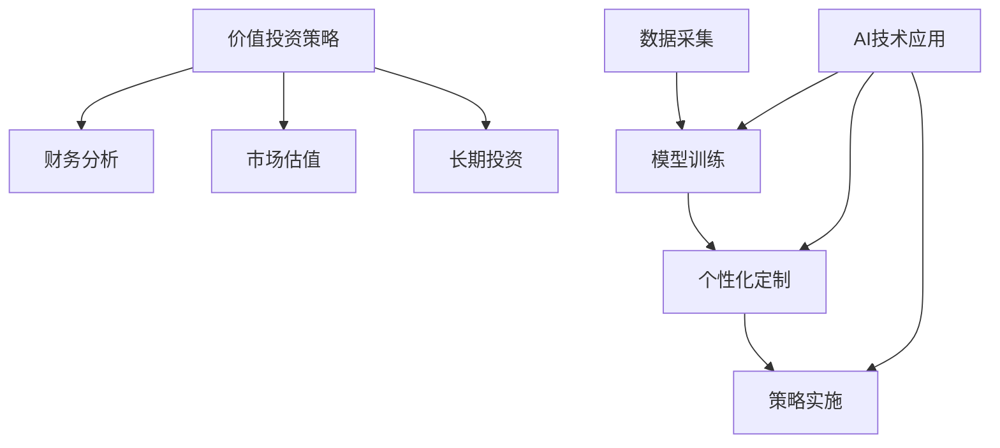

                 

### 文章标题

# AI驱动的价值投资策略个性化定制

---

关键词：人工智能、价值投资、个性化定制、机器学习、投资策略

摘要：本文旨在探讨AI技术在价值投资领域的应用，特别是如何通过AI驱动的个性化定制策略提升投资效果。文章首先介绍了价值投资的起源和人工智能在投资领域的应用趋势，然后深入分析了AI技术在价值投资中的作用机制，包括数据采集、模型训练、个性化投资组合构建等。随后，通过实际案例展示了AI驱动的价值投资策略的实践效果，并探讨了在应用过程中可能遇到的问题和解决策略。最后，文章展望了AI驱动的价值投资策略的未来发展趋势，为投资者提供了宝贵的参考。

---

## 第一部分：背景与核心概念

### 第1章：AI驱动的价值投资策略概述

#### 1.1 问题的背景

价值投资作为一种长期投资策略，最早由本杰明·格雷厄姆提出，并经沃伦·巴菲特等人发扬光大。它强调在市场波动中寻找被低估的优质股票，通过长期持有实现资本增值。随着人工智能技术的快速发展，AI在金融领域的应用逐渐受到重视，特别是在投资策略方面，AI能够通过大量数据分析和模型预测，为投资者提供更精准的投资建议。

#### 1.2 问题描述

价值投资的核心要素包括财务分析、市场估值和长期投资。然而，传统价值投资策略往往依赖于投资者的经验和主观判断，难以实现个性化定制。个性化定制在价值投资中具有重要意义，它能够根据投资者的风险偏好、投资目标和市场环境，为投资者提供量身定制的投资策略。AI技术在价值投资策略中的作用主要体现在以下几个方面：

1. **数据采集与处理**：AI能够自动从大量数据源中提取有用信息，进行数据清洗和特征工程，为模型训练提供高质量的输入数据。
2. **模型训练与优化**：通过机器学习和深度学习算法，AI可以训练复杂的模型，对投资策略进行优化，提高预测准确性。
3. **个性化投资组合构建**：基于投资者偏好和市场环境，AI能够构建个性化的投资组合，实现投资策略的个性化定制。

#### 1.3 问题解决

AI驱动的价值投资策略个性化定制可以通过以下步骤实现：

1. **数据采集与预处理**：收集与投资相关的数据，包括股票价格、财务指标、市场趋势等，进行数据清洗和特征工程，为模型训练做好准备。
2. **模型训练与优化**：使用机器学习和深度学习算法，对数据集进行训练，优化模型参数，提高预测准确性。
3. **个性化定制**：基于投资者的风险偏好、投资目标和市场环境，构建个性化的投资组合，为投资者提供量身定制的投资策略。
4. **策略实施与评估**：将个性化投资组合应用于实际投资中，定期评估策略效果，进行调整和优化。

#### 1.4 边界与外延

价值投资与量化投资有显著的区别。量化投资侧重于通过数学模型和算法进行投资决策，而价值投资则强调对企业的基本面分析。个性化定制与大规模投资也存在冲突。大规模投资追求规模效应，而个性化定制则更注重投资者个体需求。在实际操作中，需要找到两者之间的平衡点。

#### 1.5 概念结构与核心要素组成

价值投资策略的基本框架包括财务分析、市场估值和长期投资。AI技术应用的层次结构则包括数据采集、模型训练、个性化定制和策略实施。以下是一个简化的概念结构与核心要素组成示意图：

### 第2章：AI技术基础

#### 2.1 人工智能的定义与分类

人工智能（AI）是计算机科学的一个分支，旨在使计算机系统具备类似人类的智能。根据其实现方式，人工智能可以分为两大类：弱人工智能和强人工智能。弱人工智能是指在某些特定任务上表现出人类智能水平的计算机系统，而强人工智能则是指具备全面智能的计算机系统。

#### 2.2 机器学习与深度学习原理

机器学习是人工智能的一个分支，通过让计算机从数据中学习规律，实现智能行为。机器学习可以分为监督学习、无监督学习和强化学习。监督学习是从标记数据中学习，无监督学习是从未标记数据中学习，强化学习则是通过与环境的交互来学习。

深度学习是机器学习的一个分支，通过构建多层的神经网络，实现复杂函数的拟合。深度学习的核心是神经网络，它由多个神经元组成，通过层层传递信息，实现对数据的处理和预测。

#### 2.3 主流AI算法与模型

神经网络、决策树、集成方法等是主流的AI算法和模型。神经网络通过多层神经元实现数据的非线性变换，决策树通过条件判断实现分类和回归，集成方法则是通过多个模型组合，提高预测准确性。

循环神经网络（RNN）和卷积神经网络（CNN）是深度学习的两种重要网络结构。RNN适用于处理序列数据，如时间序列分析、自然语言处理等；CNN适用于处理图像数据，如计算机视觉任务。

### 第3章：价值投资策略的理论基础

#### 3.1 价值投资的核心原则

价值投资的核心原则包括财务分析、市场估值和长期投资。财务分析旨在评估企业的盈利能力、偿债能力和增长潜力；市场估值则通过比较企业价值与市场价格，判断股票是否被低估；长期投资则强调在市场波动中保持理性，通过长期持有实现资本增值。

#### 3.2 投资策略的构建

价值投资策略的构建包括股票选择标准、投资组合构建策略和风险收益分析。股票选择标准关注企业的基本面，如盈利能力、成长性和管理水平；投资组合构建策略则通过资产配置和风险控制，实现投资组合的优化；风险收益分析则评估投资组合的预期收益和风险。

#### 3.3 风险管理与收益优化

价值投资中的风险管理包括投资风险识别、风险控制和风险分散。投资风险识别旨在评估投资项目的潜在风险；风险控制则通过风险限制和风险规避措施，降低投资风险；风险分散则通过多元化投资，分散投资风险。

收益优化方法包括收益目标设定、收益预测和收益调整。收益目标设定则根据投资者的风险偏好和投资目标，确定合理的收益目标；收益预测则通过数据分析，预测投资组合的收益；收益调整则根据市场环境和投资策略的调整，优化投资组合的收益。

## 第二部分：AI驱动的价值投资策略实施

### 第4章：AI技术在价值投资中的应用

#### 4.1 数据采集与预处理

数据采集是价值投资策略的基础。AI技术可以通过多种途径获取投资相关的数据，如股票价格、财务指标、市场趋势等。数据预处理包括数据清洗、数据集成和数据降维，目的是提高数据质量，为模型训练提供高质量的输入数据。

#### 4.2 AI模型训练与优化

AI模型训练是价值投资策略的核心环节。通过机器学习和深度学习算法，AI可以训练复杂的模型，对投资策略进行优化。模型优化包括参数调整、模型选择和模型集成，目的是提高模型的预测准确性。

#### 4.3 个性化定制策略

个性化定制策略是根据投资者的风险偏好、投资目标和市场环境，为投资者提供量身定制的投资策略。AI可以通过分析投资者的历史投资数据、财务状况和行为特征，构建个性化的投资组合。

### 第5章：AI驱动的价值投资案例分析

#### 5.1 案例一：AI辅助下的股票选择

案例一通过AI技术对股票进行选择，展示AI在价值投资中的应用。案例背景是一个投资者，其风险偏好为中等，投资目标为长期资本增值。通过AI技术，对大量股票进行筛选和评估，最终选择出具有投资价值的股票。

#### 5.2 案例二：AI驱动的投资组合优化

案例二通过AI技术对投资组合进行优化，展示AI在投资组合管理中的应用。案例背景是一个投资者，其现有投资组合存在一定的风险，希望通过AI技术优化投资组合，提高收益稳定性。通过AI技术，对投资组合中的股票进行重新配置和调整，优化投资组合的风险收益比。

#### 5.3 案例三：AI在市场预测中的应用

案例三通过AI技术在市场预测中的应用，展示AI在投资决策中的作用。案例背景是一个投资者，希望对市场的未来走势进行预测，以制定相应的投资策略。通过AI技术，对市场数据进行深入分析，预测市场的未来走势，为投资者提供决策依据。

### 第6章：实践中的问题与解决策略

#### 6.1 数据质量与模型准确性问题

数据质量是AI驱动的价值投资策略的关键。数据质量差会导致模型准确性下降，从而影响投资效果。为了提高模型准确性，需要从数据采集、数据清洗和数据预处理等方面入手，确保数据质量。

#### 6.2 个性化定制与实际操作中的冲突

个性化定制在价值投资中具有重要意义，但在实际操作中，可能会与实际投资目标产生冲突。为了解决这一问题，需要建立合理的投资者画像，准确分析投资者的风险偏好和投资目标，制定个性化的投资策略。

#### 6.3 投资风险与监管合规

AI驱动的价值投资策略在提高投资效果的同时，也面临投资风险和监管合规的挑战。为了降低投资风险，需要建立完善的风险管理体系，定期评估投资风险，采取相应的风险控制措施。同时，需要遵守相关法律法规，确保投资策略的合规性。

### 第7章：AI驱动的价值投资策略的未来发展趋势

#### 7.1 技术发展趋势

人工智能技术正不断进步，机器学习算法和深度学习模型的性能也在不断提升。未来，AI驱动的价值投资策略将更加成熟，实现更高准确性和个性化定制。

#### 7.2 投资策略的演变

随着AI技术的不断发展，价值投资策略也将发生演变。新型投资策略将涌现，如基于AI的智能投顾、自动化投资平台等，为投资者提供更加便捷和高效的投

