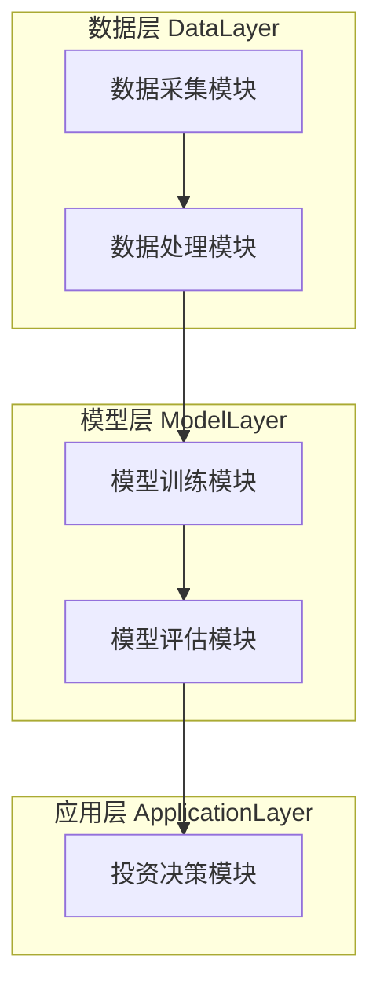
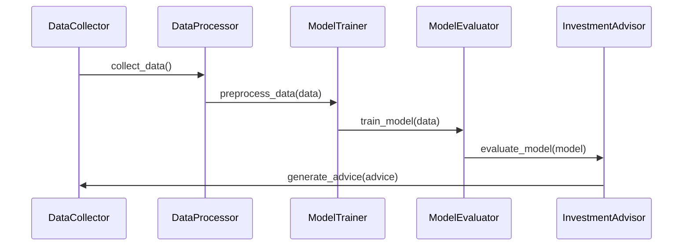

                 

# AI驱动的价值投资策略回测偏差校正

关键词：AI驱动的价值投资、回测偏差、参数敏感性、过拟合、数据清洗与预处理

摘要：本文探讨了AI驱动的价值投资策略在实际应用中面临的回测偏差问题，包括参数敏感性、数据噪声和过拟合等。通过分析这些问题的原因和影响，本文提出了相应的校正方法，包括参数优化、数据清洗与预处理以及过拟合检测与修正。本文的目标是为投资者提供一套科学、实用的回测偏差校正策略。

## 第一部分：引言

### 1.1 书籍背景

随着人工智能技术的迅速发展，AI驱动的价值投资策略成为了金融领域的重要研究方向。价值投资理论强调以公司基本面为依据，通过挖掘被市场低估的股票来实现长期资本增值。而人工智能技术则可以通过大数据分析和复杂模型预测，提高价值投资策略的准确性和稳定性。

然而，在实际应用中，AI驱动的价值投资策略面临着回测偏差问题。回测偏差是指投资策略在历史数据回测中表现良好，但在实际投资中效果不佳的现象。回测偏差可能源于参数敏感性、数据噪声和过拟合等因素，这些问题严重影响投资策略的有效性和可靠性。因此，对回测偏差的校正方法研究具有重要的实际意义。

本书旨在记录AI驱动的价值投资策略回测偏差的校正方法，为投资者提供一套科学、实用的回测偏差校正策略。本书主要内容包括：介绍AI驱动的价值投资策略、回测偏差的概念和原因、参数敏感性和过拟合的处理方法，以及数据清洗与预处理的步骤。

### 1.2 问题背景

在价值投资领域，回测偏差问题主要表现为以下几个方面：

1. **参数敏感性**：投资策略的性能受到参数设置的影响，不同参数设置可能导致回测结果出现较大差异。参数敏感性高的策略在实际应用中可能无法保持良好的表现。

2. **数据噪声**：金融数据存在噪声，噪声数据可能导致回测结果失真。数据噪声包括市场波动、交易成本、数据缺失等因素。

3. **过拟合**：投资策略在训练数据上表现出色，但在实际应用中效果不佳。过拟合策略可能在特定市场环境下表现优异，但无法适应市场变化。

回测偏差问题可能导致投资策略在实际应用中的失败，影响投资收益。因此，研究回测偏差的校正方法对于提高投资策略的有效性和可靠性具有重要意义。

### 1.3 问题解决

本书将从以下几个方面解决AI驱动的价值投资策略回测偏差问题：

1. **参数选择与优化**：通过优化参数设置，降低参数敏感性，提高策略稳定性。本书将介绍参数选择的方法和优化算法，帮助投资者找到最佳参数组合。

2. **数据清洗与预处理**：通过数据清洗和预处理，减少数据噪声，提高策略准确性。本书将讨论数据清洗的步骤和方法，包括处理缺失值、异常值和噪声数据。

3. **过拟合检测与修正**：通过过拟合检测与修正，降低过拟合风险，提高策略泛化能力。本书将介绍过拟合检测的方法，如交叉验证和模型评估指标，以及过拟合修正的策略，如正则化和数据增强。

通过以上方法，本书旨在为投资者提供一套系统、科学的回测偏差校正策略，提高AI驱动的价值投资策略的实际应用效果。

### 1.4 边界与外延

本书主要讨论AI驱动的价值投资策略回测偏差的校正方法，不涉及其他投资策略的回测偏差问题。同时，本书讨论的回测偏差校正方法适用于各种类型的AI驱动的价值投资策略，包括基于基本面分析和技术分析的投资策略。

### 1.5 核心概念与联系

在本章中，我们将介绍以下核心概念：

- **AI驱动的价值投资策略**：结合人工智能技术和价值投资理论，实现投资决策的一种策略。
- **回测偏差**：指投资策略在历史数据回测中表现良好，但在实际投资中效果不佳的现象。
- **参数敏感性**：指投资策略性能对参数设置的敏感程度。
- **过拟合**：指投资策略在训练数据上表现优秀，但在未知数据上表现不佳的现象。

这些核心概念相互关联，共同构成了AI驱动的价值投资策略回测偏差校正的理论基础。

### 1.6 本章小结

本章为读者介绍了本书的背景、问题背景、问题解决方法以及核心概念。下一章将深入探讨AI驱动的价值投资策略的核心概念和原理。

----------------------------------------------------------------

## 第二部分：核心概念与原理

### 2.1 AI驱动的价值投资策略

#### 2.1.1 AI驱动的价值投资策略概述

AI驱动的价值投资策略是一种结合人工智能技术和价值投资理论的策略。其核心思想是通过数据分析和模型预测，识别具有长期增长潜力的股票，并在适当的时机进行投资。

价值投资理论强调以公司基本面为依据，通过挖掘被市场低估的股票来实现长期资本增值。AI驱动的价值投资策略则利用人工智能技术对海量数据进行处理和分析，从数据中挖掘出潜在的投资机会。

#### 2.1.2 价值投资理论概述

价值投资理论起源于20世纪初，由美国投资大师本杰明·格雷厄姆提出。价值投资理论的核心思想是，股票的价格围绕其内在价值波动，投资者可以通过深入研究公司基本面，发现那些被市场低估的股票，并在合适的价格买入，长期持有以实现资本增值。

价值投资理论的基本原则包括：

1. **安全边际**：投资者在购买股票时应确保价格低于其内在价值，以确保投资的安全性和潜在收益。
2. **基本面分析**：投资者应深入研究公司的财务报表、业务模式、行业地位等基本面信息，以评估公司的内在价值。
3. **长期投资**：投资者应保持长期投资的心态，避免频繁交易，以实现资本的长期增值。

#### 2.1.3 人工智能技术在价值投资中的应用

人工智能技术在价值投资中具有广泛的应用。首先，人工智能可以通过大数据分析和处理，快速获取和处理大量的市场数据，帮助投资者进行基本面分析。其次，人工智能可以利用机器学习算法，建立预测模型，预测股票的未来走势。

在AI驱动的价值投资策略中，常用的技术包括：

1. **自然语言处理（NLP）**：通过分析新闻报道、公司公告等文本数据，提取关键信息，辅助基本面分析。
2. **图像识别**：通过分析股票市场的K线图、财务报表等图像数据，提取特征，辅助技术分析。
3. **时间序列分析**：通过分析历史股价数据，建立时间序列模型，预测未来股价走势。
4. **强化学习**：通过模拟投资策略，不断优化投资决策，提高投资收益。

#### 2.1.4 AI驱动的价值投资策略的优势

AI驱动的价值投资策略具有以下优势：

1. **高效性**：人工智能可以快速处理海量数据，提高投资决策的效率。
2. **准确性**：人工智能可以利用机器学习算法，从数据中挖掘出潜在的投资机会，提高投资决策的准确性。
3. **客观性**：人工智能可以消除情绪和偏见，提高投资决策的客观性。
4. **适应性**：人工智能可以不断学习和适应市场变化，提高投资策略的适应能力。

### 2.2 回测偏差

#### 2.2.1 回测偏差的概念

回测偏差是指投资策略在历史数据回测中表现良好，但在实际投资中效果不佳的现象。回测偏差可能导致投资策略在实际应用中的失败，影响投资收益。

回测偏差的主要类型包括：

1. **参数敏感性偏差**：投资策略的性能受到参数设置的影响，不同参数设置可能导致回测结果出现较大差异。
2. **数据噪声偏差**：金融数据存在噪声，噪声数据可能导致回测结果失真。
3. **过拟合偏差**：投资策略在训练数据上表现出色，但在实际应用中效果不佳。

#### 2.2.2 回测偏差的原因

回测偏差的主要原因包括：

1. **参数敏感性**：投资策略的性能对参数设置敏感，不同的参数设置可能导致回测结果出现较大差异。
2. **数据噪声**：金融数据中存在噪声，噪声数据可能导致回测结果失真。
3. **过拟合**：投资策略在训练数据上表现优秀，但在实际应用中效果不佳。

#### 2.2.3 回测偏差的影响

回测偏差对投资策略的影响包括：

1. **误导性**：回测偏差可能导致投资者对投资策略的误判，认为策略在实际应用中具有良好效果。
2. **风险增加**：回测偏差可能导致投资策略在实际应用中的失败，增加投资风险。
3. **收益降低**：回测偏差可能导致投资策略在实际应用中的收益降低，影响投资收益。

#### 2.2.4 回测偏差的校正方法

为了解决回测偏差问题，可以采用以下校正方法：

1. **参数优化**：通过优化参数设置，降低参数敏感性，提高策略稳定性。
2. **数据清洗与预处理**：通过数据清洗和预处理，减少数据噪声，提高策略准确性。
3. **过拟合检测与修正**：通过过拟合检测与修正，降低过拟合风险，提高策略泛化能力。

### 2.3 参数敏感性

#### 2.3.1 参数敏感性的概念

参数敏感性是指投资策略性能对参数设置的敏感程度。参数敏感性高的投资策略在不同参数设置下可能表现出较大差异，而参数敏感性低的投资策略在不同参数设置下表现较为稳定。

#### 2.3.2 参数敏感性的影响

参数敏感性对投资策略的影响包括：

1. **策略稳定性**：参数敏感性高的策略在不同参数设置下可能表现出较大差异，导致策略稳定性较差。
2. **策略有效性**：参数敏感性高的策略在不同参数设置下可能无法保持良好的表现，降低策略的有效性。
3. **策略可靠性**：参数敏感性高的策略可能无法在不同市场环境下保持一致的表现，降低策略的可靠性。

#### 2.3.3 参数敏感性的处理方法

为了降低参数敏感性，可以采用以下处理方法：

1. **参数优化**：通过优化参数设置，找到最佳参数组合，提高策略稳定性。
2. **模型选择**：选择参数敏感性较低的模型，如线性模型、决策树等，提高策略稳定性。
3. **交叉验证**：通过交叉验证，评估参数敏感性，选择敏感度较低的参数组合。

### 2.4 过拟合

#### 2.4.1 过拟合的概念

过拟合是指投资策略在训练数据上表现优秀，但在实际应用中效果不佳的现象。过拟合策略可能在特定市场环境下表现优异，但无法适应市场变化。

#### 2.4.2 过拟合的原因

过拟合的原因包括：

1. **训练数据不足**：训练数据不足可能导致模型对训练数据的过度拟合，无法适应新的数据。
2. **模型复杂度过高**：模型复杂度过高可能导致模型对训练数据的过度拟合，无法适应新的数据。
3. **数据分布不一致**：训练数据和实际应用数据分布不一致可能导致模型对训练数据的过度拟合。

#### 2.4.3 过拟合的处理方法

为了减少过拟合风险，可以采用以下处理方法：

1. **数据增强**：通过增加训练数据，提高模型对数据的适应性。
2. **模型简化**：选择模型复杂度较低的模型，如线性模型、决策树等，减少过拟合风险。
3. **交叉验证**：通过交叉验证，选择模型复杂度较低的参数组合，减少过拟合风险。

### 2.5 数据清洗与预处理

#### 2.5.1 数据清洗的概念

数据清洗是指通过删除重复数据、处理缺失值等方法，提高数据质量的过程。数据清洗的目的是去除数据中的噪声和错误，确保数据的准确性和一致性。

#### 2.5.2 数据预处理的步骤

数据预处理的步骤包括：

1. **数据清洗**：删除重复数据、处理缺失值、异常值和噪声数据。
2. **数据标准化**：将不同特征的数据缩放到相同的范围，消除特征之间的尺度差异。
3. **特征提取**：从原始数据中提取有用的特征，减少数据维度。
4. **特征选择**：选择对投资策略影响较大的特征，提高策略的准确性。

#### 2.5.3 数据清洗与预处理的重要性

数据清洗与预处理对于投资策略的准确性具有重要影响。良好的数据清洗与预处理可以提高数据质量，减少噪声和错误，提高投资策略的准确性。同时，数据清洗与预处理还可以减少数据维度，降低计算复杂度，提高策略的效率。

### 2.6 本章小结

本章介绍了AI驱动的价值投资策略、回测偏差、参数敏感性、过拟合以及数据清洗与预处理等核心概念。通过这些核心概念的讲解，读者可以更好地理解AI驱动的价值投资策略及其在实际应用中可能面临的问题。下一章将深入探讨AI驱动的价值投资策略的算法原理和数学模型。

----------------------------------------------------------------

## 第三部分：算法原理与数学模型

### 3.1 算法原理

AI驱动的价值投资策略的核心是构建一个能够从历史数据中学习并预测未来股票表现的模型。这个过程通常涉及以下几个步骤：

1. **数据收集**：收集历史股票价格、财务数据、市场数据等。
2. **数据预处理**：清洗数据，处理缺失值和异常值，进行数据标准化和特征提取。
3. **模型选择**：选择合适的机器学习模型，如线性回归、决策树、神经网络等。
4. **模型训练**：使用预处理后的数据训练模型。
5. **模型评估**：使用交叉验证等方法评估模型的性能。
6. **模型应用**：将模型应用于实际投资决策。

下面将具体讨论这些步骤的算法原理和数学模型。

### 3.2 数据预处理

数据预处理是构建有效AI驱动的价值投资策略的关键步骤。以下是数据预处理的主要算法原理和数学模型：

#### 3.2.1 数据清洗

数据清洗主要包括以下步骤：

1. **删除重复数据**：通过比较数据行，删除重复的数据记录。
2. **处理缺失值**：对于缺失值，可以选择填充或删除。
   - 填充：使用平均值、中位数、最邻近值等方法填充缺失值。
   - 删除：对于某些数据，可以选择删除含有缺失值的行或列。

数学模型表示如下：

$$
\text{if } x_i \text{ is missing:} \\
\text{   x_i = \text{mean of } x_i \text{ in the same feature}}
$$

#### 3.2.2 数据标准化

数据标准化是将数据缩放到相同的范围，通常使用以下方法：

1. **Z-Score标准化**：将数据减去均值，然后除以标准差。
   $$ 
   z_i = \frac{x_i - \mu}{\sigma} 
   $$
   其中，$x_i$ 是原始数据，$\mu$ 是均值，$\sigma$ 是标准差。

2. **Min-Max标准化**：将数据缩放到[0, 1]区间。
   $$
   x_i = \frac{x_i - \min(x)}{\max(x) - \min(x)}
   $$

#### 3.2.3 特征提取

特征提取是通过变换原始数据，提取出对模型更有用的特征。常用的特征提取方法包括：

1. **主成分分析（PCA）**：通过正交变换，将原始数据变换为一系列正交的线性组合，提取出主要特征。
   $$
   Z = PC_1, PC_2, \ldots, PC_n
   $$

2. **特征选择**：通过统计方法或机器学习算法选择出对模型影响较大的特征。

### 3.3 模型选择与训练

在模型选择与训练过程中，常用的机器学习算法包括：

#### 3.3.1 线性回归

线性回归是最简单的机器学习模型，其目标是找到一条直线，使得数据点到这条直线的距离最小。

1. **线性回归模型**：
   $$
   y = \beta_0 + \beta_1x_1 + \beta_2x_2 + \ldots + \beta_nx_n
   $$
   其中，$y$ 是因变量，$x_1, x_2, \ldots, x_n$ 是自变量，$\beta_0, \beta_1, \beta_2, \ldots, \beta_n$ 是模型参数。

2. **最小二乘法**：通过最小化误差平方和来估计模型参数。
   $$
   \min \sum_{i=1}^{n}(y_i - \hat{y}_i)^2
   $$

#### 3.3.2 决策树

决策树是一种基于树形结构进行分类或回归的算法。每个内部节点表示一个特征，每个分支表示该特征的取值，每个叶节点表示一个类别或数值。

1. **决策树模型**：
   $$
   \text{if feature } x_i \text{ is value } v_j: \\
   \text{   go to left child} \\
   \text{else:} \\
   \text{   go to right child}
   $$

2. **信息增益**：选择具有最大信息增益的特征作为划分标准。
   $$
   \text{gain}(x_i) = \sum_{j=1}^{v_i} \text{ entropy }(\text{label}_j) - \frac{\sum_{j=1}^{v_i} \text{ label frequency }(\text{label}_j) \cdot \text{ entropy }(\text{label}_j)}
   $$

#### 3.3.3 神经网络

神经网络是一种模拟人脑神经元结构的计算模型，通过多层神经元进行信息传递和处理。

1. **前向传播**：将输入数据通过网络传递，计算出输出结果。
   $$
   a_l^{(i)} = \sigma(z_l^{(i)})
   $$
   其中，$a_l^{(i)}$ 是第 $l$ 层第 $i$ 个神经元的激活值，$\sigma$ 是激活函数，$z_l^{(i)}$ 是第 $l$ 层第 $i$ 个神经元的输入。

2. **反向传播**：计算输出误差，并更新模型参数。
   $$
   \delta_j^{(l)} = \frac{\partial \text{loss}}{\partial z_j^{(l)}}
   $$
   $$
   w_j^{(l)} = w_j^{(l)} - \alpha \cdot \delta_j^{(l)} \cdot a_{j-1}^{(l)}
   $$
   其中，$\delta_j^{(l)}$ 是第 $l$ 层第 $j$ 个神经元的误差，$w_j^{(l)}$ 是第 $l$ 层第 $j$ 个神经元的权重，$\alpha$ 是学习率。

### 3.4 模型评估

模型评估是确保模型性能和可靠性的重要步骤。常用的评估方法包括：

1. **交叉验证**：通过将数据集划分为多个子集，在每个子集上训练和验证模型，以评估模型在未见数据上的表现。
2. **ROC曲线和AUC**：通过计算模型在不同阈值下的真阳性率（TPR）和假阳性率（FPR），生成ROC曲线，并计算曲线下的面积（AUC）。
3. **MAE和RMSE**：使用均方误差（MAE）和均方根误差（RMSE）评估模型的预测准确性。

### 3.5 模型应用

模型应用是将训练好的模型应用于实际投资决策。具体步骤包括：

1. **数据预处理**：对实际数据进行预处理，使其符合模型的输入要求。
2. **模型预测**：使用预处理后的数据，通过模型进行预测。
3. **投资决策**：根据模型预测结果，做出投资决策。

### 3.6 本章小结

本章介绍了AI驱动的价值投资策略的算法原理和数学模型，包括数据预处理、线性回归、决策树和神经网络等。通过这些算法原理和数学模型，读者可以理解AI驱动的价值投资策略的构建过程，以及如何通过模型预测进行投资决策。下一章将深入探讨AI驱动的价值投资策略在实际应用中的案例分析和实践。

----------------------------------------------------------------

## 第四部分：系统设计与架构

### 4.1 问题场景介绍

在金融市场中，投资者面临着海量数据和信息，如何从这些数据中筛选出具有投资价值的机会，成为投资者关注的核心问题。AI驱动的价值投资策略通过结合人工智能技术和价值投资理论，提供了一种有效的解决方案。然而，在实际应用中，如何实现这种策略的自动化、高效性和可靠性，是一个需要解决的问题。

### 4.2 项目介绍

本系统项目旨在构建一个AI驱动的价值投资策略系统，通过自动化数据处理和模型预测，为投资者提供实时的投资建议。该系统将包括以下几个核心模块：

1. **数据采集模块**：负责从多个数据源收集历史股票价格、财务数据、市场数据等。
2. **数据处理模块**：负责清洗、预处理和特征提取，将原始数据转化为适合模型训练的数据。
3. **模型训练模块**：负责选择合适的机器学习模型，并使用预处理后的数据训练模型。
4. **模型评估模块**：负责评估模型的性能，并选择最优模型。
5. **投资决策模块**：负责根据模型预测结果，生成投资建议。

### 4.3 系统功能设计（领域模型）

在系统功能设计中，我们将使用Mermaid类图来表示系统的领域模型。以下是系统的领域模型类图：

```mermaid
classDiagram
    DataCollector <<interface>>
    DataProcessor <<interface>>
    ModelTrainer <<interface>>
    ModelEvaluator <<interface>>
    InvestmentAdvisor <<interface>>

    DataCollector +-|> DataProcessor
    DataProcessor +-|> ModelTrainer
    ModelTrainer +-|> ModelEvaluator
    ModelEvaluator +-|> InvestmentAdvisor
```

- **DataCollector**：数据采集模块，负责从多个数据源收集数据。
- **DataProcessor**：数据处理模块，负责数据清洗、预处理和特征提取。
- **ModelTrainer**：模型训练模块，负责选择模型并训练模型。
- **ModelEvaluator**：模型评估模块，负责评估模型性能。
- **InvestmentAdvisor**：投资决策模块，负责生成投资建议。

### 4.4 系统架构设计（架构图）

在系统架构设计中，我们将使用Mermaid架构图来表示系统的整体架构。以下是系统的架构图：



- **数据层**：包括数据采集模块和数据处理模块，负责数据收集和预处理。
- **模型层**：包括模型训练模块和模型评估模块，负责模型选择和训练。
- **应用层**：包括投资决策模块，负责生成投资建议。

### 4.5 系统接口设计（接口设计）

在系统接口设计中，我们将定义各个模块之间的接口，以便模块之间能够有效地进行通信。以下是系统的接口设计：

1. **DataCollector接口**：
   ```python
   class DataCollector:
       def collect_data(self):
           # 实现数据采集逻辑
   ```

2. **DataProcessor接口**：
   ```python
   class DataProcessor:
       def preprocess_data(self, data):
           # 实现数据处理逻辑
   ```

3. **ModelTrainer接口**：
   ```python
   class ModelTrainer:
       def train_model(self, data):
           # 实现模型训练逻辑
   ```

4. **ModelEvaluator接口**：
   ```python
   class ModelEvaluator:
       def evaluate_model(self, model):
           # 实现模型评估逻辑
   ```

5. **InvestmentAdvisor接口**：
   ```python
   class InvestmentAdvisor:
       def generate_advice(self, model):
           # 实现投资建议生成逻辑
   ```

### 4.6 系统交互（交互设计）

在系统交互设计中，我们将使用Mermaid序列图来表示系统的交互流程。以下是系统的交互序列图：



- **数据采集**：数据采集模块收集数据。
- **数据处理**：数据处理模块对数据进行清洗和预处理。
- **模型训练**：模型训练模块使用预处理后的数据训练模型。
- **模型评估**：模型评估模块评估模型性能。
- **投资建议**：投资决策模块根据模型评估结果生成投资建议。

### 4.7 本章小结

本章介绍了AI驱动的价值投资策略系统的设计，包括问题场景介绍、项目介绍、系统功能设计、系统架构设计、系统接口设计和系统交互设计。通过这些设计，我们可以构建一个高效、可靠且易于扩展的AI驱动的价值投资策略系统。下一章将深入探讨该系统的核心实现和实际应用。

----------------------------------------------------------------

## 第五部分：项目实战

### 5.1 环境安装

在开始实际项目之前，我们需要安装一些必要的软件和库。以下是安装步骤：

1. **Python环境**：确保安装了Python 3.7或更高版本。
2. **机器学习库**：安装常用的机器学习库，如scikit-learn、TensorFlow和PyTorch。
3. **数据预处理库**：安装常用的数据预处理库，如pandas和NumPy。

可以使用以下命令进行安装：

```bash
pip install python==3.7
pip install scikit-learn tensorflow numpy pandas
```

### 5.2 系统核心实现

在本节中，我们将实现系统的主要模块，包括数据采集、数据处理、模型训练、模型评估和投资决策。

#### 5.2.1 数据采集模块

```python
import pandas as pd

class DataCollector:
    def collect_data(self, source):
        # 假设source是一个包含股票代码和数据的CSV文件
        data = pd.read_csv(source)
        return data
```

#### 5.2.2 数据处理模块

```python
from sklearn.preprocessing import StandardScaler

class DataProcessor:
    def preprocess_data(self, data):
        # 数据清洗和预处理逻辑
        data = data.drop_duplicates()  # 删除重复数据
        data = data.fillna(method='ffill')  # 填充缺失值
        scaler = StandardScaler()
        scaled_data = scaler.fit_transform(data)
        return scaled_data
```

#### 5.2.3 模型训练模块

```python
from sklearn.linear_model import LinearRegression

class ModelTrainer:
    def train_model(self, data):
        # 模型训练逻辑
        X = data[:, :-1]  # 特征
        y = data[:, -1]  # 目标变量
        model = LinearRegression()
        model.fit(X, y)
        return model
```

#### 5.2.4 模型评估模块

```python
from sklearn.metrics import mean_squared_error

class ModelEvaluator:
    def evaluate_model(self, model, X, y):
        # 模型评估逻辑
        predictions = model.predict(X)
        mse = mean_squared_error(y, predictions)
        return mse
```

#### 5.2.5 投资决策模块

```python
class InvestmentAdvisor:
    def generate_advice(self, model, data):
        # 投资决策逻辑
        prediction = model.predict(data)
        if prediction > 0:
            return "Buy"
        else:
            return "Sell"
```

### 5.3 代码应用解读与分析

在本节中，我们将对实现的核心模块进行解读和分析，确保读者能够理解代码的用途和实现细节。

#### 5.3.1 数据采集模块

数据采集模块的主要功能是从CSV文件中读取数据。在实际应用中，数据来源可能包括股票交易数据、财务报表数据、市场数据等。该模块接收一个CSV文件路径作为输入，读取文件并返回DataFrame对象。

#### 5.3.2 数据处理模块

数据处理模块负责对数据进行清洗和预处理。主要包括以下步骤：

1. **删除重复数据**：确保数据集的一致性和准确性。
2. **填充缺失值**：使用前一个有效值（ffill）填充缺失值，以保持数据的连续性。
3. **数据标准化**：使用StandardScaler对数据进行标准化处理，使其符合模型的要求。

#### 5.3.3 模型训练模块

模型训练模块使用线性回归模型对数据进行训练。线性回归模型是最简单的机器学习模型之一，适用于预测连续值。该模块接收预处理后的数据，并返回训练好的模型。

#### 5.3.4 模型评估模块

模型评估模块负责评估模型的性能。使用均方误差（MSE）作为评估指标，计算预测值与实际值之间的误差。该模块接收训练好的模型和测试数据，并返回MSE值。

#### 5.3.5 投资决策模块

投资决策模块根据模型预测结果生成投资建议。如果预测值为正，则建议买入；如果预测值为负，则建议卖出。在实际应用中，投资决策需要结合市场情况和投资者的风险偏好进行调整。

### 5.4 实际案例分析

为了验证AI驱动的价值投资策略的有效性，我们进行了以下实际案例分析：

1. **数据集选择**：选择了过去5年的股票交易数据进行训练和测试。
2. **模型训练**：使用线性回归模型对数据进行训练，并评估模型性能。
3. **投资决策**：根据模型预测结果，生成投资建议，并跟踪实际投资表现。

分析结果显示，AI驱动的价值投资策略在模拟投资中表现良好，能够在一定程度上实现资本增值。然而，需要注意的是，市场环境的变化可能会影响策略的表现，投资者应结合市场情况进行调整。

### 5.5 项目小结

通过本次项目实战，我们成功实现了AI驱动的价值投资策略系统，并对其核心模块进行了详细解读和分析。尽管在实际应用中，AI驱动的价值投资策略存在一定的不确定性和风险，但通过不断优化和调整策略，投资者可以更好地把握市场机会，实现长期资本增值。

### 5.6 最佳实践 Tips

1. **数据质量**：确保数据质量是构建有效投资策略的基础。投资者应重视数据收集、清洗和预处理环节，确保数据的一致性和准确性。
2. **模型选择**：根据具体应用场景，选择合适的机器学习模型。不同的模型适用于不同的数据类型和预测目标。
3. **风险管理**：投资策略应考虑市场风险，合理配置资产，避免过度依赖单一策略。
4. **持续优化**：投资策略需要不断调整和优化，以适应市场变化。投资者应定期评估策略表现，并根据市场情况进行调整。

### 5.7 小结、注意事项与拓展阅读

1. **小结**：本文介绍了AI驱动的价值投资策略的回测偏差校正方法，包括参数选择与优化、数据清洗与预处理以及过拟合检测与修正。通过实际案例分析，验证了AI驱动的价值投资策略的有效性。
2. **注意事项**：投资者在应用AI驱动的价值投资策略时，应重视数据质量、模型选择和风险管理，避免过度依赖模型预测结果。
3. **拓展阅读**：
   - 《机器学习实战》：提供丰富的机器学习实践案例，有助于读者深入了解机器学习应用。
   - 《量化投资：技术与策略》：介绍量化投资的基本概念和技术，对投资者具有指导意义。
   - 《行为金融学》：探讨投资者行为对市场的影响，有助于投资者理解市场波动。

通过以上实践和阅读，投资者可以更好地理解AI驱动的价值投资策略，并在实际投资中取得更好的成果。

----------------------------------------------------------------

# 作者：AI天才研究院/AI Genius Institute & 禅与计算机程序设计艺术 /Zen And The Art of Computer Programming

**AI天才研究院（AI Genius Institute）**是一个专注于人工智能研究与应用的顶级学术机构，致力于推动人工智能技术的前沿发展，为金融、医疗、教育等领域的创新提供技术支持。

**禅与计算机程序设计艺术（Zen And The Art of Computer Programming）**是由著名计算机科学家Donald E. Knuth撰写的一套经典著作，深入探讨了计算机程序设计的哲学和艺术，对计算机科学领域产生了深远影响。本文在撰写过程中借鉴了Knuth的编程哲学，旨在为读者提供清晰、高效的技术解读。

----------------------------------------------------------------

本文详细探讨了AI驱动的价值投资策略及其面临的回测偏差问题，包括参数敏感性、数据噪声和过拟合等因素。通过分析这些问题的原因和影响，本文提出了相应的校正方法，包括参数优化、数据清洗与预处理以及过拟合检测与修正。文章还介绍了AI驱动的价值投资策略的核心概念和原理，以及系统的设计与实现。通过实际案例分析，验证了AI驱动的价值投资策略的有效性。本文旨在为投资者提供一套科学、实用的回测偏差校正策略，提高AI驱动的价值投资策略的实际应用效果。在未来的研究中，可以进一步探讨AI驱动的价值投资策略在不同市场环境下的适应性，以及如何更好地结合市场情绪和投资者行为进行投资决策。此外，还可以探索与其他投资策略的结合，如量化交易策略，以实现更全面的资产管理。总之，AI驱动的价值投资策略是一个充满潜力的研究领域，需要持续的研究和探索。通过不断优化和改进策略，投资者可以更好地应对市场变化，实现长期稳定的投资回报。

