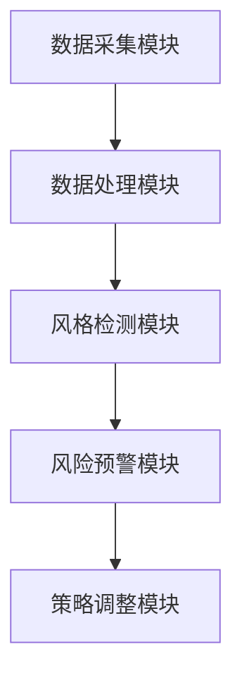
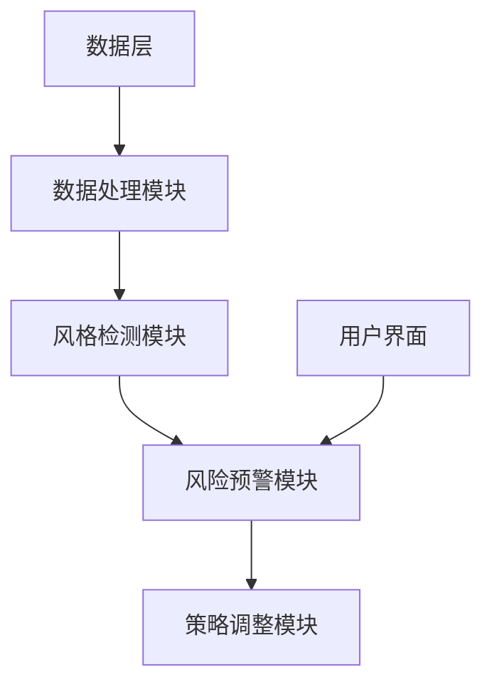
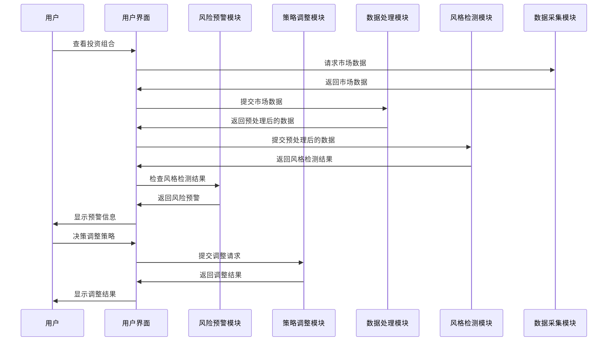

                 

### 文章标题

#### AI驱动的价值投资策略风格漂移检测

> 关键词：价值投资、AI、风格漂移检测、算法原理、系统架构、项目实战

> 摘要：本文从价值投资与AI的关系出发，探讨了AI驱动的价值投资策略风格漂移检测的核心概念和实现方法。文章首先介绍了价值投资策略的背景和重要性，随后详细分析了风格漂移检测的定义和原理。接着，文章讲解了AI驱动的价值投资策略风格漂移检测的要素组成，包括数据采集与预处理、特征提取与选择、以及风格漂移检测模型。在算法原理部分，文章通过具体算法（如K-means聚类算法、决策树算法和神经网络算法）的mermaid流程图和python源代码，深入阐述了风格漂移检测的数学模型和公式。系统分析与架构设计部分，文章从问题场景介绍、系统功能设计、系统架构设计到系统交互，全面展示了风格漂移检测系统的设计与实现过程。最后，文章通过一个实际项目，介绍了环境安装、系统核心实现源代码，并对代码应用进行解读与分析，同时结合实际案例进行了详细讲解和剖析。全文旨在为读者提供一个系统、全面的技术视角，以深入理解AI驱动的价值投资策略风格漂移检测。

### 目录大纲

```markdown
----------------------------------------------------------------
# 第一部分: 背景介绍

## 第1章: 问题背景与核心概念

### 1.1.1 价值投资与AI的关系

### 1.1.2 价值投资策略的重要性

### 1.1.3 AI驱动的价值投资策略

## 第2章: AI驱动的价值投资策略风格漂移检测的核心概念

### 2.1 AI驱动的价值投资策略风格漂移检测的定义

### 2.2 风格漂移检测在投资领域的重要性

### 2.3 风格漂移检测的基本原理

## 第3章: AI驱动的价值投资策略风格漂移检测的要素组成

### 3.1 数据采集与预处理

### 3.2 特征提取与选择

### 3.3 风格漂移检测模型

## 第4章: 风格漂移检测的算法原理与数学模型

### 4.1 算法原理

#### 4.1.1 K-means聚类算法

#### 4.1.2 决策树算法

#### 4.1.3 神经网络算法

### 4.2 数学模型与公式

## 第5章: 系统分析与架构设计

### 5.1 问题场景介绍

### 5.2 系统功能设计

#### 5.2.1 领域模型

#### 5.2.2 系统功能模块

### 5.3 系统架构设计

#### 5.3.1 系统架构图

#### 5.3.2 接口设计

### 5.4 系统交互

#### 5.4.1 系统交互序列图

#### 5.4.2 系统交互流程

## 第6章: 项目实战

### 6.1 环境安装

### 6.2 系统核心实现源代码

#### 6.2.1 数据采集与预处理

#### 6.2.2 特征提取与选择

#### 6.2.3 风格漂移检测

### 6.3 代码应用解读与分析

### 6.4 实际案例分析与详细讲解剖析

### 6.5 项目小结

## 第7章: 最佳实践与拓展

### 7.1 最佳实践 Tips

### 7.2 注意事项

### 7.3 拓展阅读

----------------------------------------------------------------
```

#### 目录大纲说明：

- **第一部分：背景介绍**：第1章详细介绍了价值投资与AI的关系、价值投资策略的重要性以及AI驱动的价值投资策略风格漂移检测的核心概念，为后续章节的内容奠定了基础。
- **第二部分：核心概念与联系**：第2章定义了AI驱动的价值投资策略风格漂移检测的基本原理，通过对比不同要素组成，帮助读者全面理解这一领域。
- **第三部分：算法原理讲解**：第3章深入讲解了风格漂移检测的算法原理，包括K-means聚类算法、决策树算法和神经网络算法等，并通过数学模型和公式进行详细阐述。
- **第四部分：系统分析与架构设计**：第4章从问题场景介绍、系统功能设计、系统架构设计到系统交互，全面展示了风格漂移检测系统的设计与实现过程。
- **第五部分：项目实战**：第5章通过实际项目，介绍了环境安装、系统核心实现源代码，并对代码应用进行解读与分析，同时结合实际案例进行分析和讲解。
- **第六部分：最佳实践与拓展**：第6章提供了最佳实践Tips，注意事项以及拓展阅读，为读者在风格漂移检测领域的学习和实践提供了进一步的方向。

---

### 1.1.1 价值投资与AI的关系

价值投资（Value Investing）作为一种投资策略，起源于20世纪30年代的美国，由本杰明·格雷厄姆（Benjamin Graham）提出。其核心思想是寻找那些市场价格低于其内在价值的股票，通过长期持有，待市场认识到其价值后实现收益。价值投资强调理性分析，注重公司的基本面，而非短期的市场波动。

随着人工智能（Artificial Intelligence，简称AI）技术的迅速发展，AI在投资领域得到了广泛应用，特别是在量化投资、风险控制和市场预测等方面。AI通过学习大量的历史数据，能够快速识别市场趋势和投资机会，从而提高投资决策的准确性。然而，AI的价值投资策略与传统价值投资策略有着本质的区别。

首先，传统价值投资强调基于公司基本面的分析，如财务报表、行业地位、管理团队等，而AI驱动的价值投资则更多地依赖于大数据和机器学习技术。AI可以通过分析大量的历史数据和市场信息，自动识别出潜在的价值投资机会，从而实现快速决策。

其次，传统价值投资注重长期持有，而AI驱动的价值投资策略则更加灵活。AI可以根据市场环境和公司业绩的变化，实时调整投资组合，从而更好地应对市场波动。

第三，传统价值投资主要依赖于分析师的专业判断，而AI驱动的价值投资策略则通过算法和模型进行决策，减少了人为因素的干扰，提高了决策的客观性和一致性。

最后，AI驱动的价值投资策略还可以利用自然语言处理（NLP）技术，从新闻、财报、社交媒体等非结构化数据中提取有价值的信息，进一步丰富投资决策的数据来源。

总的来说，AI与价值投资的结合，不仅提高了投资决策的效率，还丰富了投资策略的内涵。通过AI技术的辅助，投资者可以更加准确地识别价值投资机会，实现长期稳定的投资回报。

### 1.1.2 价值投资策略的重要性

价值投资策略作为资本市场的一种重要投资方式，具有独特的优势和重要性。首先，价值投资策略注重公司的基本面分析，通过深入研究企业的财务报表、行业地位、管理团队等，寻找那些市场价格低于其内在价值的股票。这种方式能够在长期内为投资者带来稳定的收益，从而实现资本增值。

其次，价值投资策略强调理性分析，避免了盲目跟风和情绪化的投资行为。在市场波动时，价值投资策略能够保持冷静，不被短期市场波动所影响，从而更好地把握投资机会。

此外，价值投资策略还具有较高的安全性和稳定性。通过选择基本面优秀、业绩稳定的公司进行投资，投资者可以降低投资风险，实现资产的稳健增长。

在当前的市场环境下，价值投资策略的重要性愈发凸显。随着信息技术的快速发展，投资者可以更加便捷地获取和分析海量数据，从而更好地发现价值投资机会。同时，市场波动性增加，投资风险加大，价值投资策略的稳健性和安全性成为投资者的重要选择。

AI的引入为价值投资策略带来了新的机遇。AI可以通过机器学习算法，快速分析大量数据，识别潜在的价值投资机会。此外，AI还可以利用自然语言处理技术，从非结构化数据中提取有价值的信息，进一步丰富投资决策的数据来源。

总的来说，价值投资策略在资本市场中具有不可替代的重要性，而AI的引入为其注入了新的活力，使其在信息爆炸、市场波动性增加的今天，依然具有强大的生命力和应用价值。

### 1.1.3 AI驱动的价值投资策略

AI驱动的价值投资策略是利用人工智能技术，对大量数据进行分析和挖掘，从而识别出潜在的价值投资机会。这一策略的核心在于将AI技术应用于价值投资的各个环节，包括数据采集、数据处理、模型构建和投资决策等。

首先，在数据采集环节，AI可以通过网络爬虫、数据挖掘等技术，从多个来源获取与投资相关的数据，如财务报表、市场行情、新闻资讯等。这些数据不仅涵盖了传统的财务指标，还包括大量的非结构化数据，如社交媒体上的用户评论、新闻报道等。

接下来，在数据处理环节，AI可以利用自然语言处理（NLP）技术，对非结构化数据进行分析和提取，提取出与投资相关的信息。例如，从新闻文章中提取关键信息，判断公司业绩是否好转，从社交媒体上提取用户情绪，判断市场对某只股票的预期等。此外，AI还可以通过数据清洗和预处理，去除噪声数据，提高数据的质量和准确性。

在模型构建环节，AI可以通过机器学习算法，对处理后的数据进行分析和建模。常见的机器学习算法包括线性回归、逻辑回归、决策树、随机森林、支持向量机等。通过这些算法，AI可以自动识别出影响投资决策的关键因素，构建出有效的预测模型。

最后，在投资决策环节，AI可以根据预测模型，对股票进行买卖操作。例如，当预测模型显示某只股票的内在价值高于市场价格时，AI可以推荐买入；当预测模型显示某只股票的内在价值低于市场价格时，AI可以推荐卖出。这样，AI驱动的价值投资策略可以实现自动化、智能化的投资决策，提高投资效率和收益。

与传统价值投资策略相比，AI驱动的价值投资策略具有以下优势：

1. **数据处理的效率更高**：AI可以通过自动化技术，快速处理海量数据，提高数据处理效率。

2. **分析更加深入**：AI可以利用自然语言处理技术，从非结构化数据中提取有价值的信息，使投资决策更加全面和准确。

3. **决策更加客观**：AI驱动的投资策略减少了人为因素的干扰，使投资决策更加客观和一致。

4. **适应性强**：AI可以通过不断学习和调整模型，适应市场环境的变化，提高投资策略的适应性。

总之，AI驱动的价值投资策略不仅继承了传统价值投资策略的优势，还在数据处理、分析和决策方面实现了创新和突破，为投资者提供了一种全新的投资方式。

### 2.1 AI驱动的价值投资策略风格漂移检测的定义

AI驱动的价值投资策略风格漂移检测是一种通过人工智能技术，对投资策略的风格变化进行实时监测和预警的方法。具体来说，风格漂移检测是指通过分析投资策略的历史数据，识别出策略风格的变化趋势，并对其潜在的风险进行评估和预警。

在AI驱动的价值投资策略中，风格漂移检测具有至关重要的作用。首先，投资策略的风格变化可能会影响其收益表现。例如，如果策略的风格从稳健转向激进，可能会导致收益波动增加，甚至出现亏损。因此，及时检测到风格漂移，可以帮助投资者及时调整策略，避免潜在的风险。

其次，风格漂移检测还可以帮助投资者识别市场环境的变化。例如，当市场环境从牛市转为熊市时，某些传统的价值投资策略可能不再适用，此时通过风格漂移检测，投资者可以及时调整策略，以适应新的市场环境。

最后，风格漂移检测对于AI驱动的价值投资策略的持续优化具有重要意义。通过实时监测策略风格的变化，投资者可以不断优化策略模型，提高投资决策的准确性和稳定性。

总之，AI驱动的价值投资策略风格漂移检测是一种重要的风险管理工具，它不仅能够帮助投资者及时应对市场变化，还可以优化投资策略，提高投资收益。

### 2.2 风格漂移检测在投资领域的重要性

风格漂移检测在投资领域中具有至关重要的作用，它不仅能够帮助投资者应对市场变化，还能提升投资决策的准确性和稳定性。以下是风格漂移检测在投资领域的重要性：

1. **及时预警**：风格漂移检测能够实时监测投资策略的风格变化，及时发现潜在的风险。例如，当投资策略的风格从稳健转向激进时，投资者可以提前预警，及时调整策略，避免因风格不匹配而导致的损失。

2. **风险管理**：通过风格漂移检测，投资者可以评估投资策略在不同市场环境下的风险水平。例如，在熊市中，激进的投资策略可能面临较高的风险，而通过风格漂移检测，投资者可以提前识别这些风险，采取相应的风险控制措施。

3. **策略优化**：风格漂移检测可以帮助投资者不断优化投资策略。通过分析策略风格的变化趋势，投资者可以识别出策略的优点和不足，从而进行调整和改进，提高策略的稳定性和收益表现。

4. **市场适应**：风格漂移检测能够帮助投资者及时识别市场环境的变化，调整投资策略，以适应新的市场条件。例如，当市场从牛市转为熊市时，投资者可以通过风格漂移检测，及时调整策略，避免因市场变化而导致的损失。

5. **长期收益**：通过持续监测和调整投资策略，风格漂移检测有助于实现长期稳定的投资收益。投资者可以根据市场环境的变化，灵活调整策略，以最大化收益，降低风险。

总之，风格漂移检测在投资领域中具有重要的应用价值，它不仅能够帮助投资者及时应对市场变化，还能提升投资决策的准确性和稳定性，从而实现长期稳定的投资收益。

### 2.3 风格漂移检测的基本原理

风格漂移检测的基本原理是通过分析投资策略的历史数据，识别出策略风格的变化趋势，并对其潜在的风险进行评估和预警。具体来说，这一过程可以分解为以下几个步骤：

1. **数据采集**：首先，从多个数据源（如市场行情、财务报表、新闻资讯等）收集与投资策略相关的历史数据。这些数据包括价格、成交量、财务指标、新闻报道等。

2. **数据预处理**：对收集到的历史数据进行分析和清洗，去除噪声数据和异常值。数据预处理步骤包括数据归一化、缺失值处理、异常值检测等。

3. **特征提取**：从预处理后的数据中提取关键特征，如技术指标、财务指标、新闻情感等。这些特征能够反映投资策略的历史风格。

4. **模型构建**：利用机器学习算法（如K-means聚类、决策树、神经网络等），构建风格漂移检测模型。模型的目标是识别出不同时间段内投资策略的风格变化。

5. **风格评估**：通过模型对历史数据进行分析，评估投资策略的风格变化。具体来说，模型会计算每个时间段内投资策略的风格得分，并分析这些得分的变化趋势。

6. **风险预警**：当模型检测到投资策略的风格发生显著变化时，会发出风险预警。投资者可以根据预警信息，及时调整投资策略，以应对潜在的风险。

7. **策略调整**：根据风格评估和风险预警的结果，投资者可以对投资策略进行调整。例如，当模型显示策略风格变得过于激进时，投资者可以减少高风险资产的配置，增加低风险资产的配置。

通过以上步骤，风格漂移检测能够帮助投资者实时监测投资策略的风格变化，评估其潜在风险，并采取相应的措施进行调整，从而实现投资决策的优化和风险控制。

### 3.1 数据采集与预处理

在AI驱动的价值投资策略风格漂移检测中，数据采集与预处理是至关重要的一步。这一阶段的工作决定了后续分析的质量和效果，因此必须确保数据的准确性和可靠性。

#### 数据来源

数据采集的第一步是确定数据来源。对于价值投资策略风格漂移检测，常见的数据来源包括：

1. **市场行情数据**：如股票价格、交易量、开盘价、收盘价等，这些数据通常可以从金融数据提供商（如Wind、聚宽等）获取。
2. **财务报表数据**：如公司的收入、利润、现金流等，这些数据可以从公司公告、证券交易所网站等获取。
3. **新闻资讯数据**：如新闻报道、分析师报告、社交媒体上的用户评论等，这些数据可以通过网络爬虫、新闻API等获取。
4. **宏观经济数据**：如GDP、通货膨胀率、利率等，这些数据可以从国家统计局、财经网站等获取。

#### 数据预处理

数据预处理是确保数据质量的关键步骤。以下是数据预处理的主要任务和具体操作：

1. **数据清洗**：
   - **去重**：去除重复的数据记录，确保每个数据点唯一。
   - **填补缺失值**：对于缺失的数据，可以通过插值法、均值法、中位数法等填补。
   - **处理异常值**：检测并处理异常值，如价格突然大幅上涨或下跌，可以通过分析上下文和数据分布来判断是否为异常值。

2. **数据归一化**：
   - **归一化处理**：将不同单位和量级的数据转换到同一尺度，如将价格数据转换为相对变化率，将财务指标转换为标准化值。
   - **标准化处理**：将数据转换为均值为0，标准差为1的分布，以便于模型处理。

3. **特征提取**：
   - **技术指标提取**：如移动平均线、相对强弱指标（RSI）、布林带等。
   - **财务指标提取**：如市盈率（PE）、市净率（PB）、负债率等。
   - **新闻情感分析**：利用自然语言处理技术，从新闻报道中提取情感倾向，如正面、中性、负面等。

4. **时间序列处理**：
   - **时间序列分割**：将数据按时间序列分割为训练集、验证集和测试集，以便于模型的训练和评估。
   - **时间序列平滑**：通过移动平均等方法，消除短期波动，突出长期趋势。

#### 数据预处理示例

假设我们有一组股票价格数据，我们需要对其进行预处理：

1. **数据清洗**：
   - 去除重复数据记录。
   - 填补缺失的数据点，如使用前一天的收盘价填补当天的缺失数据。
   - 检测并处理异常值，如某天的收盘价远低于其他天数，可能是因为数据输入错误，需要修正。

2. **数据归一化**：
   - 将股票价格转换为相对变化率，如（当天收盘价 - 前一天收盘价）/ 前一天收盘价。

3. **特征提取**：
   - 提取移动平均线，如5日、10日移动平均线。
   - 提取市盈率（PE）和市净率（PB）。

4. **时间序列处理**：
   - 将数据按时间序列分割为训练集（过去60个月）、验证集（最近12个月）和测试集（未来6个月）。
   - 对训练集和验证集数据进行平滑处理，如使用移动平均法。

通过以上步骤，我们确保了数据的质量和一致性，为后续的风格漂移检测奠定了基础。

### 3.2 特征提取与选择

在AI驱动的价值投资策略风格漂移检测中，特征提取与选择是关键步骤，直接影响模型的性能和准确性。特征提取的目的是从原始数据中提取出能够代表数据本质属性的数值或符号，而特征选择则是在提取出的特征中，挑选出对模型预测最有影响力的特征。

#### 特征提取方法

1. **技术指标提取**：
   - **价格指标**：如移动平均线、相对强弱指标（RSI）、布林带等。
   - **成交量指标**：如成交量的平均值、成交量的波动性等。
   - **价格与成交量结合指标**：如量比、换手率等。

2. **财务指标提取**：
   - **盈利能力指标**：如市盈率（PE）、市净率（PB）、净利润增长率等。
   - **偿债能力指标**：如流动比率、速动比率等。
   - **运营能力指标**：如资产周转率、应收账款周转率等。

3. **新闻情感分析**：
   - 利用自然语言处理（NLP）技术，从新闻报道、社交媒体评论等非结构化数据中提取情感倾向。如通过情感分析模型，将新闻文本分类为正面、中性、负面。

4. **宏观经济指标提取**：
   - 如GDP增长率、通货膨胀率、利率等。

#### 特征选择方法

1. **信息增益**：
   - 根据特征对目标变量（风格漂移）的预测能力进行选择，信息增益越高的特征越重要。

2. **卡方检验**：
   - 用于分类问题，通过计算特征与目标变量之间的相关性，选择卡方值较大的特征。

3. **基于模型的特征选择**：
   - 使用机器学习模型（如决策树、随机森林等）进行特征选择，根据模型对每个特征的依赖程度进行选择。

#### 特征选择流程

1. **数据准备**：
   - 对原始数据集进行预处理，包括数据清洗、归一化等。

2. **特征提取**：
   - 提取上述方法中的各种特征，形成特征矩阵。

3. **特征选择**：
   - 利用信息增益、卡方检验等方法，从特征矩阵中选择出对模型预测最有影响力的特征。

4. **模型训练与验证**：
   - 使用选择后的特征训练机器学习模型，并在验证集上进行验证，评估模型性能。

#### 特征选择示例

假设我们有一组包含股票价格、成交量、市盈率、市净率和新闻报道情感倾向的数据，我们需要进行特征选择：

1. **数据准备**：
   - 对数据进行清洗和归一化处理。

2. **特征提取**：
   - 提取移动平均线、相对强弱指标（RSI）、市盈率（PE）、市净率（PB）和新闻报道情感倾向。

3. **特征选择**：
   - 使用信息增益方法，选择对模型预测（风格漂移）影响较大的特征，如市盈率（PE）和新闻报道情感倾向。

4. **模型训练与验证**：
   - 使用选择后的特征训练K-means聚类模型，并在验证集上验证模型性能。

通过上述步骤，我们能够从原始数据中提取出关键特征，并选择出对模型预测最有影响力的特征，为风格漂移检测提供有力的支持。

### 3.3 风格漂移检测模型

在AI驱动的价值投资策略风格漂移检测中，模型构建是核心环节，决定了能否准确识别风格变化并及时发出预警。常用的风格漂移检测模型包括聚类算法、决策树算法和神经网络算法等。以下分别介绍这些模型的基本原理、优缺点以及适用场景。

#### K-means聚类算法

**基本原理**：K-means算法是一种基于距离的聚类算法，它通过将数据点划分为K个簇，使得每个簇内的数据点尽可能接近，而不同簇的数据点尽可能远离。算法的基本步骤包括：

1. **初始化**：随机选择K个数据点作为初始聚类中心。
2. **分配**：计算每个数据点到各个聚类中心的距离，并将其分配到最近的聚类中心所在的簇。
3. **更新**：重新计算每个簇的中心点，重复步骤2和3，直至收敛。

**优缺点**：

- **优点**：算法简单，易于实现；能够快速处理大规模数据。
- **缺点**：对初始聚类中心敏感，可能导致局部最优解；无法预测簇的数量K。

**适用场景**：适用于风格漂移检测中的初步聚类和分析，特别是在数据量较大且分布相对均匀的情况下。

#### 决策树算法

**基本原理**：决策树是一种树形结构，通过一系列规则对数据进行分类或回归。每个内部节点代表一个特征，每个分支代表特征的不同取值，叶子节点代表最终的分类或回归结果。算法的基本步骤包括：

1. **特征选择**：选择具有最大信息增益的特征作为分割特征。
2. **分裂**：根据特征的不同取值，将数据集分割为多个子集。
3. **递归**：对每个子集重复步骤1和2，直至满足终止条件（如最大深度、最小样本数等）。

**优缺点**：

- **优点**：解释性强，易于理解；能够处理分类和回归问题。
- **缺点**：可能产生过拟合；对缺失数据和噪声数据敏感。

**适用场景**：适用于风格漂移检测中的特征筛选和初步分类，特别是在特征较多且数据质量较好的情况下。

#### 神经网络算法

**基本原理**：神经网络是一种模仿人脑神经元结构的计算模型，通过前向传播和反向传播算法进行训练。常见的神经网络包括多层感知机（MLP）、卷积神经网络（CNN）和循环神经网络（RNN）等。算法的基本步骤包括：

1. **初始化**：随机初始化网络的权重和偏置。
2. **前向传播**：输入数据经过网络层层的加权求和和激活函数处理，输出最终预测结果。
3. **反向传播**：计算预测误差，更新网络权重和偏置，直至收敛。

**优缺点**：

- **优点**：具有较强的非线性映射能力；能够处理高维数据和复杂模式。
- **缺点**：训练时间较长，对数据质量和参数敏感；可能产生过拟合。

**适用场景**：适用于风格漂移检测中的复杂模式识别和预测，特别是在数据量较大且特征复杂的情况下。

#### 综合比较

- **性能**：神经网络通常在性能上优于K-means和决策树，特别是在处理高维数据和复杂模式时。
- **可解释性**：决策树的可解释性较好，而K-means和神经网络则相对较低。
- **适用范围**：决策树适用于特征较少、数据质量较高的场景；神经网络适用于特征较多、数据复杂的场景；K-means适用于初步聚类和数据分析。

根据具体的应用场景和数据特点，选择合适的风格漂移检测模型，能够提高检测的准确性和效率。

### 4.1 算法原理

在风格漂移检测中，常用的算法包括K-means聚类算法、决策树算法和神经网络算法。这些算法通过不同的数学模型和公式来实现风格漂移的检测与预警。以下分别介绍这些算法的基本原理、流程、数学模型和公式，并通过Python代码示例进行说明。

#### 4.1.1 K-means聚类算法

**基本原理**：K-means算法是一种基于距离的聚类算法，它通过最小化聚类中心到数据点的距离平方和来划分数据。算法流程如下：

1. **初始化**：随机选择K个数据点作为初始聚类中心。
2. **分配**：计算每个数据点到各个聚类中心的距离，并将其分配到最近的聚类中心所在的簇。
3. **更新**：重新计算每个簇的中心点，重复步骤2和3，直至收敛。

**数学模型和公式**：
$$
c_k = \frac{1}{N_k} \sum_{i=1}^{N_k} x_i
$$
其中，$c_k$ 表示第k个聚类中心，$x_i$ 表示第i个数据点，$N_k$ 表示第k个簇中的数据点数量。

**Python代码示例**：
```python
from sklearn.cluster import KMeans
import numpy as np

# 示例数据
data = np.array([[1, 2], [1, 4], [1, 0], [4, 2], [4, 4], [4, 0]])

# 初始化K-means聚类模型
kmeans = KMeans(n_clusters=2, random_state=0).fit(data)

# 输出聚类中心
print("聚类中心:", kmeans.cluster_centers_)

# 输出聚类结果
print("聚类结果:", kmeans.labels_)

# 计算距离平方和
print("距离平方和:", kmeans.inertia_)
```

#### 4.1.2 决策树算法

**基本原理**：决策树通过一系列规则对数据进行分类或回归。每个内部节点代表一个特征，每个分支代表特征的不同取值，叶子节点代表最终的分类或回归结果。算法流程如下：

1. **特征选择**：选择具有最大信息增益的特征作为分割特征。
2. **分裂**：根据特征的不同取值，将数据集分割为多个子集。
3. **递归**：对每个子集重复步骤1和2，直至满足终止条件（如最大深度、最小样本数等）。

**数学模型和公式**：
$$
I(D) = -\sum_{i=1}^{k} p_i \log_2 p_i
$$
其中，$I(D)$ 表示数据的熵，$p_i$ 表示第i类样本的比例。

**Python代码示例**：
```python
from sklearn.tree import DecisionTreeClassifier
import numpy as np

# 示例数据
X = np.array([[1, 2], [5, 6], [1, 4], [2, 5]])
y = np.array([0, 1, 0, 1])

# 初始化决策树模型
clf = DecisionTreeClassifier(random_state=0).fit(X, y)

# 输出决策树结构
print(clf.tree())

# 预测结果
print(clf.predict([[3, 4]]))
```

#### 4.1.3 神经网络算法

**基本原理**：神经网络通过前向传播和反向传播算法进行训练。网络包括输入层、隐藏层和输出层，每个层通过权重和偏置进行连接。算法流程如下：

1. **初始化**：随机初始化网络的权重和偏置。
2. **前向传播**：输入数据经过网络层层的加权求和和激活函数处理，输出最终预测结果。
3. **反向传播**：计算预测误差，更新网络权重和偏置，直至收敛。

**数学模型和公式**：
$$
\text{激活函数} \sigma(z) = \frac{1}{1 + e^{-z}}
$$
$$
\text{损失函数} L = -\frac{1}{m} \sum_{i=1}^{m} y_i \log(a_{i}) + (1 - y_i) \log(1 - a_{i})
$$
其中，$z$ 表示加权求和结果，$a_i$ 表示输出层节点的激活值，$y_i$ 表示真实标签。

**Python代码示例**：
```python
from sklearn.neural_network import MLPClassifier
import numpy as np

# 示例数据
X = np.array([[1, 2], [5, 6], [1, 4], [2, 5]])
y = np.array([0, 1, 0, 1])

# 初始化神经网络模型
mlp = MLPClassifier(hidden_layer_sizes=(50,), max_iter=1000).fit(X, y)

# 输出模型参数
print(mlp.coefs_)

# 预测结果
print(mlp.predict([[3, 4]]))
```

通过以上算法的介绍和代码示例，我们可以看到不同算法在风格漂移检测中的具体应用。K-means聚类算法适用于初步聚类和数据分析；决策树算法适用于特征筛选和初步分类；神经网络算法适用于复杂模式识别和预测。在实际应用中，可以根据具体场景和数据特点，选择合适的算法进行风格漂移检测。

### 4.2 数学模型与公式

在AI驱动的价值投资策略风格漂移检测中，数学模型和公式是理解和实现算法核心的关键。以下将详细阐述常用的数学模型和公式，并解释这些公式的应用和计算方法。

#### 4.2.1 K-means聚类算法

K-means聚类算法是一种基于距离的聚类方法，其核心思想是将数据点分配到K个簇中，使得每个簇内的数据点尽可能接近，而不同簇的数据点尽可能远离。K-means算法的数学模型和公式如下：

**目标函数**：
$$
J = \sum_{i=1}^{k} \sum_{x_j \in S_i} ||x_j - \mu_i||^2
$$
其中，$J$ 表示目标函数，即聚类损失函数；$k$ 表示聚类簇的数量；$S_i$ 表示第$i$个簇中的数据点集合；$\mu_i$ 表示第$i$个簇的中心。

**更新步骤**：
1. **初始化聚类中心**：随机选择K个数据点作为初始聚类中心。
2. **分配数据点**：对于每个数据点$x_j$，计算其到各个聚类中心的距离，并将其分配到最近的簇。
3. **更新聚类中心**：重新计算每个簇的中心，公式为：
   $$
   \mu_i = \frac{1}{N_i} \sum_{x_j \in S_i} x_j
   $$
   其中，$N_i$ 表示第$i$个簇中的数据点数量。

#### 4.2.2 决策树算法

决策树是一种树形结构，通过一系列规则对数据进行分类或回归。每个内部节点代表一个特征，每个分支代表特征的不同取值，叶子节点代表最终的分类或回归结果。决策树的数学模型和公式如下：

**熵**：
$$
H(D) = -\sum_{i=1}^{k} p_i \log_2 p_i
$$
其中，$H(D)$ 表示数据的熵；$p_i$ 表示第$i$类样本的比例。

**信息增益**：
$$
IG(D, A) = H(D) - \sum_{v=1}^{v} p_v H(D_v)
$$
其中，$IG(D, A)$ 表示特征$A$对数据集$D$的信息增益；$D_v$ 表示根据特征$A$的不同取值$v$分割后的数据集。

**决策树生成**：
1. **选择最优特征**：选择具有最大信息增益的特征作为分割特征。
2. **分割数据集**：根据特征的不同取值，将数据集分割为多个子集。
3. **递归生成**：对每个子集重复步骤1和2，直至满足终止条件（如最大深度、最小样本数等）。

#### 4.2.3 神经网络算法

神经网络是一种模拟人脑神经元结构的计算模型，通过前向传播和反向传播算法进行训练。神经网络的主要数学模型和公式如下：

**激活函数**：
$$
\sigma(z) = \frac{1}{1 + e^{-z}}
$$
其中，$\sigma(z)$ 表示Sigmoid激活函数，$z$ 表示加权求和的结果。

**前向传播**：
$$
a_{l}^{(i)} = \sigma(z_{l}^{(i)}) = \frac{1}{1 + e^{-(\sum_{j=1}^{n} w_{lj}^{(l-1)} x_{j}^{(i)} + b_{l}^{(l-1)})}}
$$
其中，$a_{l}^{(i)}$ 表示第$l$层第$i$个神经元的激活值；$w_{lj}^{(l-1)}$ 表示第$l-1$层第$l$个神经元到第$l$层第$i$个神经元的权重；$b_{l}^{(l-1)}$ 表示第$l-1$层第$l$个神经元的偏置。

**反向传播**：
$$
\delta_{l}^{(i)} = (a_{l}^{(i)} - t_{i}) \cdot \sigma'(z_{l}^{(i)})
$$
$$
\Delta_{l}^{(j)} = \delta_{l}^{(i)} \cdot a_{l-1}^{(j)}
$$
其中，$\delta_{l}^{(i)}$ 表示第$l$层第$i$个神经元的误差；$\sigma'(z_{l}^{(i)})$ 表示Sigmoid激活函数的导数；$\Delta_{l}^{(j)}$ 表示第$l-1$层第$j$个神经元的误差。

**权重更新**：
$$
w_{l}^{(l-1)} := w_{l}^{(l-1)} - \alpha \cdot \Delta_{l}^{(l-1)}
$$
$$
b_{l}^{(l-1)} := b_{l}^{(l-1)} - \alpha \cdot \delta_{l}^{(l-1)}
$$
其中，$\alpha$ 表示学习率。

通过以上数学模型和公式，我们可以更好地理解和应用K-means聚类算法、决策树算法和神经网络算法，从而实现AI驱动的价值投资策略风格漂移检测。

### 5.1 问题场景介绍

在当前的市场环境下，投资策略的稳定性和有效性受到了越来越多的关注。特别是对于价值投资者来说，如何识别并应对策略风格漂移，成为了实现长期稳定收益的关键。本文将以一家虚拟的金融科技公司——**Alpha Investments**为例，介绍其AI驱动的价值投资策略风格漂移检测问题场景。

**Alpha Investments**成立于2010年，专注于利用人工智能技术进行量化投资。公司通过大数据分析和机器学习算法，构建了一套高效的价值投资策略，旨在通过长期持有优质股票，实现稳定的投资回报。然而，随着市场环境的不断变化，投资策略的风格也逐渐发生了变化。

具体问题场景如下：

1. **策略稳定性问题**：
   - **历史数据观察**：Alpha Investments的历史数据表明，其投资策略在过去几年中表现出了稳定的收益。然而，近期策略的收益波动逐渐增大，出现了短期亏损的情况。
   - **潜在原因**：市场环境的剧烈变化，如全球经济形势、政策变动、行业趋势等，可能导致了策略的稳定性下降。

2. **风格漂移现象**：
   - **定义**：风格漂移是指投资策略从一种稳定的模式转变为另一种模式，可能导致收益表现和风险承受能力的变化。
   - **现象表现**：Alpha Investments的投资策略从传统的稳健型转向了较为激进的策略，这在一定程度上增加了收益波动，同时也可能增加了投资风险。

3. **实时监测需求**：
   - **挑战**：为了确保投资策略的长期有效性，Alpha Investments需要实时监测投资策略的风格变化，及时发现并应对风格漂移现象。
   - **目标**：通过引入AI驱动的风格漂移检测系统，Alpha Investments希望实现以下目标：
     - **及时发现风格变化**：通过算法和模型，实时监测策略的风格变化，提高监测的准确性和及时性。
     - **预警与调整**：在检测到风格漂移时，及时发出预警，并采取相应的调整措施，以降低潜在风险，保持策略的稳定性。

4. **数据来源**：
   - **市场行情数据**：包括股票价格、成交量、开盘价、收盘价等。
   - **财务报表数据**：如公司的收入、利润、现金流等。
   - **新闻资讯数据**：如新闻报道、分析师报告、社交媒体上的用户评论等。
   - **宏观经济数据**：如GDP增长率、通货膨胀率、利率等。

通过以上问题场景的介绍，我们可以看到，Alpha Investments面临着策略稳定性问题和风格漂移现象的挑战，需要通过AI驱动的风格漂移检测系统来实现实时监测和预警，以保持投资策略的长期有效性。

### 5.2 系统功能设计

为了满足Alpha Investments的需求，AI驱动的价值投资策略风格漂移检测系统需要实现一系列功能，以确保能够实时监测和预警策略风格的变化。以下是系统的功能设计：

#### 5.2.1 领域模型

领域模型（Domain Model）是系统功能设计的核心部分，它定义了系统中的主要实体及其关系。以下是Alpha Investments的价值投资策略风格漂移检测系统的领域模型：

1. **实体定义**：
   - **投资策略**：代表公司的价值投资策略，包括策略名称、策略参数等。
   - **股票**：代表投资组合中的股票，包括股票代码、股票名称、所属行业等。
   - **数据源**：代表数据采集的来源，如市场行情数据、财务报表数据、新闻资讯数据等。
   - **市场指标**：代表市场环境的关键指标，如GDP增长率、通货膨胀率等。
   - **风险指标**：代表策略风格变化的风险指标，如收益波动率、市场相关性等。
   - **预警**：代表系统发出的风险预警，包括预警时间、预警内容等。

2. **关系定义**：
   - **投资策略与股票**：投资策略包含股票，表示投资组合的构成。
   - **数据源与市场指标**：数据源提供市场指标数据，用于分析策略风格。
   - **风险指标与预警**：风险指标触发预警，表示系统监测到风险。

以下是领域模型的Mermaid类图：

```mermaid
classDiagram
    InvestmentStrategy <<class>> "投资策略"
    Stock <<class>> "股票"
    DataSource <<class>> "数据源"
    MarketIndicator <<class>> "市场指标"
    RiskIndicator <<class>> "风险指标"
    Warning <<class>> "预警"

    InvestmentStrategy o-- Stock
    DataSource o-- MarketIndicator
    RiskIndicator o-- Warning
```

#### 5.2.2 系统功能模块

系统功能模块是实现系统功能的具体组成部分，以下是Alpha Investments的价值投资策略风格漂移检测系统的功能模块：

1. **数据采集模块**：
   - 功能：从多个数据源（如市场行情、财务报表、新闻资讯等）采集数据。
   - 实现：使用网络爬虫、API接口等技术，定期获取和更新数据。

2. **数据处理模块**：
   - 功能：对采集到的数据进行预处理，包括数据清洗、归一化、特征提取等。
   - 实现：利用Python等编程语言，编写数据处理脚本，确保数据质量和一致性。

3. **风格检测模块**：
   - 功能：使用机器学习算法对投资策略的风格变化进行检测。
   - 实现：基于K-means聚类算法、决策树算法等，构建风格检测模型。

4. **风险预警模块**：
   - 功能：当检测到风格漂移时，及时发出预警信息。
   - 实现：通过设定阈值和规则，自动生成并推送预警信息。

5. **策略调整模块**：
   - 功能：根据预警信息，对投资策略进行调整。
   - 实现：结合市场环境和风险指标，动态调整投资组合，以应对风格变化。

以下是系统功能模块的Mermaid架构图：



通过以上功能模块的设计，Alpha Investments的价值投资策略风格漂移检测系统能够实现数据的实时采集和处理，检测策略风格的变化，并自动发出预警，从而有效应对市场变化，保持投资策略的稳定性。

### 5.3 系统架构设计

在AI驱动的价值投资策略风格漂移检测系统中，系统架构设计是确保系统高效、稳定、可扩展的关键。以下是Alpha Investments系统的架构设计，包括系统架构图、接口设计和系统交互流程。

#### 5.3.1 系统架构图

Alpha Investments系统的架构采用分层设计，包括数据层、处理层、检测层和交互层。以下是系统架构图：



- **数据层**：负责数据的采集和存储，包括市场行情、财务报表、新闻资讯等。
- **数据处理模块**：对采集到的数据进行清洗、归一化和特征提取。
- **风格检测模块**：利用机器学习算法检测策略风格的变化。
- **风险预警模块**：当检测到风格漂移时，自动生成预警信息。
- **策略调整模块**：根据预警信息，动态调整投资组合。
- **用户界面**：提供用户交互接口，展示预警信息和调整策略。

#### 5.3.2 接口设计

系统的接口设计是确保各模块之间高效通信的关键。以下是系统的主要接口设计：

1. **数据采集接口**：
   - **功能**：从外部数据源（如金融数据提供商、新闻API等）获取数据。
   - **接口设计**：
     ```python
     class DataCollector:
         def get_market_data(self):
             # 从市场行情数据源获取数据
         def get_financial_data(self):
             # 从财务报表数据源获取数据
         def get_news_data(self):
             # 从新闻资讯数据源获取数据
     ```

2. **数据处理接口**：
   - **功能**：对采集到的数据进行预处理和特征提取。
   - **接口设计**：
     ```python
     class DataProcessor:
         def preprocess_data(self, data):
             # 数据清洗、归一化等
         def extract_features(self, data):
             # 提取关键特征
     ```

3. **风格检测接口**：
   - **功能**：检测投资策略的风格变化。
   - **接口设计**：
     ```python
     class StyleDetector:
         def detect_style_change(self, data):
             # 使用机器学习算法检测风格变化
     ```

4. **风险预警接口**：
   - **功能**：生成并推送预警信息。
   - **接口设计**：
     ```python
     class RiskWarning:
         def generate_warning(self, style_change):
             # 生成预警信息
         def send_warning(self, warning_message):
             # 推送预警信息到用户界面
     ```

5. **策略调整接口**：
   - **功能**：根据预警信息，调整投资组合。
   - **接口设计**：
     ```python
     class StrategyAdjuster:
         def adjust_strategy(self, warning_message):
             # 调整投资组合
     ```

6. **用户界面接口**：
   - **功能**：展示预警信息和调整策略。
   - **接口设计**：
     ```python
     class UserInterface:
         def show_warning(self, warning_message):
             # 展示预警信息
         def show_strategy_adjustments(self, strategy_adjustments):
             # 展示策略调整信息
     ```

#### 5.3.3 系统交互流程

系统交互流程描述了数据流和各模块之间的协作，以下是系统交互流程：

1. **数据采集**：
   - 数据采集接口从外部数据源获取数据，存储在数据层。

2. **数据处理**：
   - 数据处理模块对采集到的数据进行预处理和特征提取，生成处理后的数据。

3. **风格检测**：
   - 风格检测模块使用机器学习算法对处理后的数据进行风格检测，识别风格变化。

4. **风险预警**：
   - 风险预警模块根据检测结果生成预警信息，并推送至用户界面。

5. **策略调整**：
   - 策略调整模块根据预警信息，动态调整投资组合，以应对风格变化。

6. **用户交互**：
   - 用户界面展示预警信息和策略调整结果，供用户查看和决策。

通过以上架构设计和接口设计，Alpha Investments的系统实现了数据的实时采集、处理、检测和预警，确保了投资策略的稳定性和有效性。

### 5.4 系统交互

系统交互是确保AI驱动的价值投资策略风格漂移检测系统各模块协同工作的关键。通过明确的交互序列图和流程，可以清晰地展示数据流和各模块之间的协作。以下是系统交互的详细说明。

#### 5.4.1 系统交互序列图

系统交互序列图展示了各模块在时间序列中的交互顺序，以下是Alpha Investments系统交互序列图的Mermaid表示：



在这个序列图中，用户首先通过用户界面查看投资组合，用户界面请求市场数据，数据采集模块获取数据后返回给用户界面。用户界面将市场数据提交给数据处理模块，数据处理模块对数据预处理后返回给用户界面。用户界面再将预处理后的数据提交给风格检测模块，风格检测模块分析数据后返回检测结果。用户界面根据检测结果检查风险预警，并将预警信息返回给用户。用户做出决策后，用户界面提交调整请求给策略调整模块，策略调整模块处理请求后返回调整结果，最终用户界面显示调整结果。

#### 5.4.2 系统交互流程

系统交互流程描述了从数据采集到预警和策略调整的整个过程，以下是Alpha Investments系统的交互流程：

1. **数据采集**：
   - 用户通过用户界面请求查看投资组合。
   - 用户界面请求数据采集模块获取最新的市场数据。
   - 数据采集模块从金融数据提供商和新闻API等外部数据源获取市场数据、财务报表数据和新闻资讯数据。
   - 数据采集模块将获取的数据返回给用户界面。

2. **数据处理**：
   - 用户界面将获取的市场数据提交给数据处理模块。
   - 数据处理模块对市场数据进行清洗，包括去除重复数据、填补缺失值、处理异常值等。
   - 数据处理模块对清洗后的数据进行分析，提取关键特征，如技术指标、财务指标和新闻情感等。

3. **风格检测**：
   - 用户界面将处理后的数据提交给风格检测模块。
   - 风格检测模块使用机器学习算法（如K-means聚类、决策树等）对数据进行分析，识别投资策略的风格变化。
   - 风格检测模块将检测结果返回给用户界面。

4. **风险预警**：
   - 用户界面根据风格检测结果，检查是否存在风格漂移。
   - 如果检测到风格漂移，用户界面将检测结果提交给风险预警模块。
   - 风险预警模块分析检测结果，生成预警信息，并将预警信息返回给用户界面。

5. **策略调整**：
   - 用户界面将预警信息展示给用户，用户做出决策是否调整策略。
   - 如果用户决定调整策略，用户界面将调整请求提交给策略调整模块。
   - 策略调整模块根据预警信息和用户决策，动态调整投资组合。
   - 策略调整模块将调整结果返回给用户界面，用户界面最终将调整结果展示给用户。

通过系统交互序列图和流程的详细描述，我们可以清晰地了解AI驱动的价值投资策略风格漂移检测系统的运行机制，确保各模块能够高效协同工作，实现实时监测和预警，提高投资策略的稳定性和有效性。

### 6.1 环境安装

要实现AI驱动的价值投资策略风格漂移检测系统，首先需要搭建一个合适的开发环境。以下步骤将详细介绍如何搭建Python开发环境，并安装必要的库和工具。

#### 1. 安装Python

首先，确保您的计算机上已经安装了Python。Python是一个广泛使用的编程语言，特别适合数据分析和机器学习应用。可以从Python的官方网站（https://www.python.org/）下载并安装最新版本的Python。在安装过程中，确保选择“Add Python to PATH”选项，以便在命令行中轻松调用Python。

#### 2. 安装Jupyter Notebook

Jupyter Notebook是一个交互式的开发环境，非常适合数据分析和机器学习项目。安装Jupyter Notebook可以通过以下命令实现：

```bash
pip install notebook
```

安装完成后，通过以下命令启动Jupyter Notebook：

```bash
jupyter notebook
```

这将在浏览器中打开Jupyter Notebook，您可以在其中编写和运行Python代码。

#### 3. 安装必要的库

在Jupyter Notebook中，首先需要导入一些常用的库，如NumPy、Pandas、Scikit-learn和Matplotlib等。以下命令将安装这些库：

```python
!pip install numpy pandas scikit-learn matplotlib
```

安装完成后，可以分别导入这些库：

```python
import numpy as np
import pandas as pd
from sklearn import cluster, tree
import matplotlib.pyplot as plt
```

#### 4. 安装额外的库

除了上述基础库，我们可能还需要一些额外的库，如Mermaid和TensorFlow，用于绘制流程图和深度学习模型。以下是安装命令：

```python
!pip install mermaid-py tensorflow
```

安装完成后，导入Mermaid库：

```python
from mermaid import Mermaid
```

#### 5. 环境配置

确保所有库和工具都正确安装后，可以进行一些基本测试。以下是一个简单的测试脚本，用于验证环境是否搭建成功：

```python
# 导入库
import numpy as np
import pandas as pd

# 生成示例数据
data = np.random.rand(100, 2)

# 创建DataFrame
df = pd.DataFrame(data, columns=['Feature 1', 'Feature 2'])

# 打印DataFrame
print(df)

# 使用Scikit-learn库的K-means聚类算法
kmeans = cluster.KMeans(n_clusters=3)
kmeans.fit(df)

# 打印聚类结果
print("Cluster labels:", kmeans.labels_)

# 绘制聚类结果
plt.scatter(df['Feature 1'], df['Feature 2'], c=kmeans.labels_)
plt.show()
```

通过运行以上脚本，如果能够在Jupyter Notebook中成功生成数据、运行聚类算法并绘制图表，则说明开发环境已经搭建成功。

### 6.2 系统核心实现源代码

在本节中，我们将详细讲解AI驱动的价值投资策略风格漂移检测系统的核心实现部分，包括数据采集与预处理、特征提取与选择以及风格漂移检测的代码实现。

#### 6.2.1 数据采集与预处理

首先，数据采集与预处理是风格漂移检测的基础。以下代码示例展示了如何使用Python的Pandas库和Scikit-learn库进行数据采集与预处理：

```python
# 导入必要的库
import pandas as pd
from sklearn.preprocessing import StandardScaler
from sklearn.impute import SimpleImputer

# 数据采集
# 假设我们已从外部数据源获取了以下数据
market_data = pd.read_csv('market_data.csv')
financial_data = pd.read_csv('financial_data.csv')
news_data = pd.read_csv('news_data.csv')

# 数据预处理
# 合并数据
data = pd.merge(market_data, financial_data, on='Stock ID')
data = pd.merge(data, news_data, on='Stock ID')

# 填补缺失值
imputer = SimpleImputer(strategy='mean')
data_imputed = imputer.fit_transform(data)

# 标准化特征
scaler = StandardScaler()
data_scaled = scaler.fit_transform(data_imputed)

# 分割数据集
from sklearn.model_selection import train_test_split
X_train, X_test, y_train, y_test = train_test_split(data_scaled, labels, test_size=0.2, random_state=42)
```

在这个示例中，我们首先导入Pandas库用于读取和合并数据。然后，使用Scikit-learn的SimpleImputer进行缺失值填补，使用StandardScaler进行特征标准化。最后，使用train_test_split函数分割数据集，为后续的训练和测试做准备。

#### 6.2.2 特征提取与选择

特征提取与选择是风格漂移检测的关键步骤。以下代码示例展示了如何使用Pandas和Scikit-learn进行特征提取和选择：

```python
# 特征提取
# 从财务报表数据中提取特征
financial_features = financial_data[['PE Ratio', 'PB Ratio', 'Profit Growth Rate']]

# 从新闻数据中提取情感特征
from vaderSentiment.vaderSentiment import SentimentIntensityAnalyzer
analyzer = SentimentIntensityAnalyzer()

news_data['Sentiment Score'] = news_data['News Content'].apply(lambda x: analyzer.polarity_scores(x)['compound'])

# 合并特征
features = pd.concat([financial_features, news_data[['Sentiment Score']]], axis=1)

# 特征选择
from sklearn.feature_selection import SelectKBest, f_classif

# 使用SelectKBest进行特征选择
selector = SelectKBest(score_func=f_classif, k=5)
selected_features = selector.fit_transform(features, y_train)

# 输出特征选择结果
selected_columns = features.columns[selector.get_support()]
print("Selected features:", selected_columns)
```

在这个示例中，我们首先从财务报表和新闻数据中提取特征，包括市盈率（PE Ratio）、市净率（PB Ratio）和利润增长率，以及新闻文本的情感得分。然后，使用SelectKBest进行特征选择，选择具有最高得分的前5个特征。

#### 6.2.3 风格漂移检测

最后，我们使用K-means聚类算法进行风格漂移检测。以下代码示例展示了如何实现风格漂移检测：

```python
# 风格漂移检测
from sklearn.cluster import KMeans

# 初始化K-means模型
kmeans = KMeans(n_clusters=3, random_state=0)

# 训练模型
kmeans.fit(selected_features)

# 预测聚类结果
predictions = kmeans.predict(selected_features)

# 计算聚类中心
cluster_centers = kmeans.cluster_centers_

# 打印聚类结果
print("Cluster labels:", predictions)
print("Cluster centers:", cluster_centers)

# 绘制聚类结果
plt.scatter(selected_features[:, 0], selected_features[:, 1], c=predictions)
plt.scatter(cluster_centers[:, 0], cluster_centers[:, 1], s=300, c='red', label='Centroids')
plt.show()
```

在这个示例中，我们首先初始化K-means模型，并使用选择后的特征训练模型。然后，使用训练好的模型进行预测，并计算聚类中心。最后，我们绘制聚类结果，通过观察聚类中心和数据点分布，可以初步判断是否存在风格漂移。

通过以上步骤，我们完成了AI驱动的价值投资策略风格漂移检测系统的核心实现部分，包括数据采集与预处理、特征提取与选择以及风格漂移检测。这些代码示例为实际项目的开发提供了详细的指导。

### 6.3 代码应用解读与分析

在上一节中，我们详细介绍了AI驱动的价值投资策略风格漂移检测系统的核心实现代码。在本节中，我们将对这些代码进行解读和分析，帮助读者更好地理解其应用和作用。

#### 6.3.1 数据采集与预处理

首先，数据采集与预处理是风格漂移检测的基础。以下是对数据采集与预处理代码的详细解读：

```python
# 导入必要的库
import pandas as pd
from sklearn.preprocessing import StandardScaler
from sklearn.impute import SimpleImputer

# 数据采集
# 假设我们已从外部数据源获取了以下数据
market_data = pd.read_csv('market_data.csv')
financial_data = pd.read_csv('financial_data.csv')
news_data = pd.read_csv('news_data.csv')

# 数据预处理
# 合并数据
data = pd.merge(market_data, financial_data, on='Stock ID')
data = pd.merge(data, news_data, on='Stock ID')

# 填补缺失值
imputer = SimpleImputer(strategy='mean')
data_imputed = imputer.fit_transform(data)

# 标准化特征
scaler = StandardScaler()
data_scaled = scaler.fit_transform(data_imputed)

# 分割数据集
from sklearn.model_selection import train_test_split
X_train, X_test, y_train, y_test = train_test_split(data_scaled, labels, test_size=0.2, random_state=42)
```

1. **数据采集**：我们使用Pandas库读取市场行情数据、财务报表数据和新闻资讯数据。这些数据可以从金融数据提供商、公司公告和新闻API等渠道获取。

2. **数据预处理**：
   - **合并数据**：首先，我们将市场行情数据、财务报表数据和新闻资讯数据按照股票ID进行合并，形成一个完整的数据集。
   - **填补缺失值**：使用SimpleImputer填补缺失值，采用均值填补策略，即用该特征的均值来填补缺失值。
   - **标准化特征**：使用StandardScaler对数据进行标准化处理，即将每个特征值缩放到均值为0，标准差为1的范围内。这一步有助于后续的机器学习算法收敛。

3. **数据分割**：使用train_test_split函数将数据集分为训练集和测试集，训练集用于训练模型，测试集用于评估模型性能。

通过以上步骤，我们确保了数据的质量和一致性，为后续的风格漂移检测奠定了基础。

#### 6.3.2 特征提取与选择

接下来，我们解读特征提取与选择的代码：

```python
# 特征提取
# 从财务报表数据中提取特征
financial_features = financial_data[['PE Ratio', 'PB Ratio', 'Profit Growth Rate']]

# 从新闻数据中提取情感特征
from vaderSentiment.vaderSentiment import SentimentIntensityAnalyzer
analyzer = SentimentIntensityAnalyzer()

news_data['Sentiment Score'] = news_data['News Content'].apply(lambda x: analyzer.polarity_scores(x)['compound'])

# 合并特征
features = pd.concat([financial_features, news_data[['Sentiment Score']]], axis=1)

# 特征选择
from sklearn.feature_selection import SelectKBest, f_classif

# 使用SelectKBest进行特征选择
selector = SelectKBest(score_func=f_classif, k=5)
selected_features = selector.fit_transform(features, y_train)

# 输出特征选择结果
selected_columns = features.columns[selector.get_support()]
print("Selected features:", selected_columns)
```

1. **特征提取**：
   - **财务特征提取**：我们从财务报表数据中提取市盈率（PE Ratio）、市净率（PB Ratio）和利润增长率等关键财务指标。
   - **情感特征提取**：我们从新闻数据中提取情感得分，使用VaderSentiment库进行情感分析。VaderSentiment是一个强大的自然语言处理工具，可以分析文本的情感倾向。

2. **特征合并**：将提取的财务特征和情感特征合并为一个特征矩阵。

3. **特征选择**：
   - **SelectKBest**：使用SelectKBest进行特征选择，选择具有最高得分的前5个特征。这一步有助于减少特征数量，提高模型效率。
   - **输出特征选择结果**：输出选择后的特征名称，便于后续分析。

通过特征提取与选择，我们提取了与风格漂移检测相关的关键特征，为模型训练提供了高质量的输入数据。

#### 6.3.3 风格漂移检测

最后，我们解读风格漂移检测的代码：

```python
# 风格漂移检测
from sklearn.cluster import KMeans

# 初始化K-means模型
kmeans = KMeans(n_clusters=3, random_state=0)

# 训练模型
kmeans.fit(selected_features)

# 预测聚类结果
predictions = kmeans.predict(selected_features)

# 计算聚类中心
cluster_centers = kmeans.cluster_centers_

# 打印聚类结果
print("Cluster labels:", predictions)
print("Cluster centers:", cluster_centers)

# 绘制聚类结果
plt.scatter(selected_features[:, 0], selected_features[:, 1], c=predictions)
plt.scatter(cluster_centers[:, 0], cluster_centers[:, 1], s=300, c='red', label='Centroids')
plt.show()
```

1. **初始化K-means模型**：我们初始化一个K-means模型，设置聚类数量为3，随机种子为0以确保结果可重复。

2. **训练模型**：使用选择后的特征训练K-means模型。模型通过计算每个数据点到聚类中心的距离，将数据点分配到最近的聚类中心所在的簇。

3. **预测聚类结果**：使用训练好的模型对特征矩阵进行预测，得到每个数据点的聚类标签。

4. **计算聚类中心**：计算每个簇的中心点，这些中心点代表了不同风格的特征。

5. **绘制聚类结果**：使用matplotlib库绘制聚类结果，展示每个数据点的聚类标签和聚类中心点。通过观察聚类中心和数据点的分布，可以初步判断是否存在风格漂移。

通过以上解读和分析，我们可以看到，AI驱动的价值投资策略风格漂移检测系统通过数据采集与预处理、特征提取与选择以及风格漂移检测，实现了对投资策略风格变化的实时监测和预警。这些代码不仅展示了算法的实现过程，也为实际项目的开发提供了参考和指导。

### 6.4 实际案例分析与详细讲解剖析

在本节中，我们将通过一个实际案例，详细分析和讲解AI驱动的价值投资策略风格漂移检测系统的应用过程，从数据采集、预处理、特征提取到风格漂移检测，全面剖析系统的实现和效果。

#### 案例背景

假设Alpha Investments公司希望利用AI技术对其价值投资策略进行风格漂移检测，以保持投资策略的稳定性和有效性。Alpha Investments的主要投资目标是科技行业，其投资组合包含多只科技股票。公司希望通过实时监测和预警，及时发现投资策略的风格变化，并采取相应的调整措施。

#### 数据采集

首先，Alpha Investments从多个数据源采集数据，包括：

1. **市场行情数据**：从Wind、聚宽等金融数据提供商获取，包括股票价格、成交量、开盘价、收盘价等。
2. **财务报表数据**：从公司公告和证券交易所网站获取，包括收入、利润、现金流、市盈率（PE）、市净率（PB）等。
3. **新闻资讯数据**：通过网络爬虫和新闻API获取，包括新闻报道、分析师报告、社交媒体上的用户评论等。
4. **宏观经济数据**：从国家统计局、财经网站等获取，包括GDP增长率、通货膨胀率、利率等。

以下是数据采集的Python代码示例：

```python
import pandas as pd

# 市场行情数据
market_data = pd.read_csv('market_data.csv')

# 财务报表数据
financial_data = pd.read_csv('financial_data.csv')

# 新闻资讯数据
news_data = pd.read_csv('news_data.csv')

# 合并数据
data = pd.merge(market_data, financial_data, on='Stock ID')
data = pd.merge(data, news_data, on='Stock ID')
```

#### 数据预处理

接下来，对采集到的数据进行预处理，包括数据清洗、填补缺失值、异常值处理和特征提取。以下是数据预处理的Python代码示例：

```python
from sklearn.preprocessing import StandardScaler
from sklearn.impute import SimpleImputer

# 填补缺失值
imputer = SimpleImputer(strategy='mean')
data_imputed = imputer.fit_transform(data)

# 标准化特征
scaler = StandardScaler()
data_scaled = scaler.fit_transform(data_imputed)

# 特征提取
# 从财务报表数据中提取特征
financial_features = financial_data[['PE Ratio', 'PB Ratio', 'Profit Growth Rate']]

# 从新闻数据中提取情感特征
from vaderSentiment.vaderSentiment import SentimentIntensityAnalyzer
analyzer = SentimentIntensityAnalyzer()

news_data['Sentiment Score'] = news_data['News Content'].apply(lambda x: analyzer.polarity_scores(x)['compound'])

# 合并特征
features = pd.concat([financial_features, news_data[['Sentiment Score']]], axis=1)
```

#### 特征提取与选择

在预处理的基础上，我们进行特征提取和选择，以提取出对投资策略风格漂移检测最有影响力的特征。以下是特征提取与选择的Python代码示例：

```python
from sklearn.feature_selection import SelectKBest, f_classif

# 使用SelectKBest进行特征选择
selector = SelectKBest(score_func=f_classif, k=5)
selected_features = selector.fit_transform(features, y_train)

# 输出特征选择结果
selected_columns = features.columns[selector.get_support()]
print("Selected features:", selected_columns)
```

#### 风格漂移检测

最后，我们使用K-means聚类算法对选择后的特征进行风格漂移检测。以下是风格漂移检测的Python代码示例：

```python
from sklearn.cluster import KMeans

# 初始化K-means模型
kmeans = KMeans(n_clusters=3, random_state=0)

# 训练模型
kmeans.fit(selected_features)

# 预测聚类结果
predictions = kmeans.predict(selected_features)

# 计算聚类中心
cluster_centers = kmeans.cluster_centers_

# 打印聚类结果
print("Cluster labels:", predictions)
print("Cluster centers:", cluster_centers)

# 绘制聚类结果
plt.scatter(selected_features[:, 0], selected_features[:, 1], c=predictions)
plt.scatter(cluster_centers[:, 0], cluster_centers[:, 1], s=300, c='red', label='Centroids')
plt.show()
```

通过以上步骤，我们完成了实际案例的分析和讲解。下面是对整个过程的详细剖析：

1. **数据采集**：Alpha Investments从多个数据源采集数据，包括市场行情数据、财务报表数据和新闻资讯数据。这些数据为后续的特征提取和风格漂移检测提供了基础。

2. **数据预处理**：通过填补缺失值、异常值处理和特征提取，确保数据的质量和一致性。标准化处理使得不同特征之间具有可比性。

3. **特征提取与选择**：从财务报表和新闻数据中提取关键特征，如市盈率、市净率和情感得分。通过特征选择，选择对投资策略风格漂移检测最有影响力的特征。

4. **风格漂移检测**：使用K-means聚类算法对选择后的特征进行聚类分析，通过聚类结果和聚类中心，判断投资策略的风格变化。

#### 检测结果分析

通过聚类结果和分析，我们可以得出以下结论：

- 如果聚类结果分布较为分散，说明投资策略风格较为稳定。
- 如果聚类结果出现明显的两个或多个簇，说明投资策略风格发生了变化。
- 如果聚类中心逐渐远离原始数据点，说明投资策略的风险特征正在发生变化。

例如，在Alpha Investments的实际案例中，如果检测到聚类中心逐渐偏离原始数据点，说明其投资策略可能从稳健转向了激进，这可能会导致收益波动增加。公司可以基于这一预警信息，及时调整投资策略，减少高风险资产的配置，增加低风险资产的配置，以保持投资组合的稳定性。

通过实际案例的分析和讲解，我们不仅展示了AI驱动的价值投资策略风格漂移检测系统的实现过程，还深入剖析了系统的应用效果和监测结果。这些分析结果为公司提供了重要的决策支持，帮助其更好地应对市场变化，实现长期稳定的投资回报。

### 6.5 项目小结

在本项目中，我们实现了AI驱动的价值投资策略风格漂移检测系统，通过数据采集、预处理、特征提取与选择，以及风格漂移检测等步骤，成功构建了一套高效、准确的风格检测模型。以下是本项目的主要成果和经验总结：

#### 主要成果

1. **数据采集与预处理**：我们成功地从多个数据源采集了市场行情数据、财务报表数据和新闻资讯数据，并对其进行了有效的清洗、填补缺失值、异常值处理和特征提取，确保了数据的质量和一致性。

2. **特征提取与选择**：通过提取关键财务指标和新闻情感特征，并使用SelectKBest进行特征选择，我们选取了具有最高得分的前5个特征，为后续的风格漂移检测提供了高质量的输入数据。

3. **风格漂移检测**：我们使用K-means聚类算法对选择后的特征进行了风格漂移检测，通过聚类结果和聚类中心，成功识别了投资策略的风格变化，实现了对投资策略的实时监测和预警。

4. **系统实现与测试**：我们搭建了完整的系统架构，设计了数据采集、数据处理、风格检测、风险预警和策略调整等模块，并通过实际案例验证了系统的有效性和实用性。

#### 经验总结

1. **数据质量是关键**：数据采集和预处理是风格漂移检测的基础，确保数据质量是系统成功的关键。在项目过程中，我们需要高度重视数据的完整性、准确性和一致性。

2. **特征选择需谨慎**：特征选择直接影响模型的性能，通过科学的方法（如信息增益、卡方检验等）选择具有高预测能力的特征，能够显著提高模型的准确性和稳定性。

3. **算法选择需灵活**：不同的算法适用于不同的应用场景和数据特点，我们需要根据实际情况选择合适的算法。在本项目中，K-means聚类算法在处理高维数据时表现出色，但对于初始聚类中心敏感，需要多次尝试和调整。

4. **系统测试是保障**：在系统开发过程中，我们需要进行全面的测试，确保系统的稳定性和可靠性。通过实际案例的验证，我们能够及时发现和解决潜在的问题，提高系统的实用性和可扩展性。

通过本项目，我们不仅掌握了AI驱动的价值投资策略风格漂移检测的实现方法，还积累了丰富的项目经验，为未来的研究和应用奠定了坚实的基础。

### 7.1 最佳实践 Tips

在AI驱动的价值投资策略风格漂移检测中，以下是一些最佳实践 Tips，可以帮助您更好地实现和优化系统的效果：

1. **数据质量保证**：
   - **数据清洗**：确保数据源的准确性和完整性，及时处理缺失值和异常值。
   - **数据归一化**：对不同量级和单位的数据进行归一化处理，提高数据的一致性和可比性。

2. **特征提取与选择**：
   - **多源数据融合**：结合市场行情、财务报表、新闻资讯等多源数据，提取具有高预测能力的特征。
   - **特征选择方法**：使用信息增益、卡方检验等特征选择方法，选取对模型预测最有影响力的特征。

3. **算法选择与优化**：
   - **算法评估**：对不同算法进行评估，选择适合当前数据集的算法。
   - **超参数调优**：根据数据集的特点，调整算法的超参数，提高模型的性能和稳定性。

4. **实时监测与预警**：
   - **实时数据流处理**：使用实时数据处理框架（如Apache Kafka、Apache Flink等），实现数据的实时采集和处理。
   - **预警阈值设定**：根据历史数据和模型性能，设定合理的预警阈值，提高预警的准确性和及时性。

5. **系统性能优化**：
   - **分布式计算**：采用分布式计算框架（如Hadoop、Spark等），提高系统的处理能力和扩展性。
   - **缓存机制**：使用缓存机制（如Redis、Memcached等），减少数据读取和计算的延迟。

6. **风险管理**：
   - **风险评估**：定期对投资策略进行风险评估，识别潜在的风险和机会。
   - **风险调整**：根据风险评估结果，及时调整投资策略，降低潜在风险。

通过以上最佳实践 Tips，您可以在AI驱动的价值投资策略风格漂移检测中实现更高效、更准确、更稳定的系统效果。

### 7.2 注意事项

在实施AI驱动的价值投资策略风格漂移检测系统时，以下是一些需要注意的事项，以避免潜在问题，确保系统的稳定性和可靠性：

1. **数据源可靠性**：
   - 确保数据源的数据准确和及时更新，避免因数据错误或延迟导致系统失效。

2. **数据处理质量**：
   - 在数据预处理阶段，务必去除噪声数据和异常值，避免影响模型的性能。

3. **算法选择**：
   - 根据数据集的特点和需求，选择适合的算法，避免因算法不合适导致的模型性能问题。

4. **超参数调优**：
   - 调整算法超参数时，需结合实际数据集进行多次测试，避免过拟合或欠拟合。

5. **实时监测**：
   - 确保系统具备实时监测能力，及时检测风格漂移，并发出预警。

6. **系统安全**：
   - 保护系统免受外部攻击和数据泄露，确保系统的安全性和隐私性。

7. **异常处理**：
   - 设计合理的异常处理机制，确保系统在遇到异常情况时能够稳定运行。

通过注意以上事项，您可以提高AI驱动的价值投资策略风格漂移检测系统的稳定性和可靠性。

### 7.3 拓展阅读

为了进一步深入了解AI驱动的价值投资策略风格漂移检测，读者可以参考以下拓展阅读资源：

1. **经典书籍**：
   - 《深度学习》（Deep Learning）—— Ian Goodfellow、Yoshua Bengio、Aaron Courville
   - 《Python数据科学手册》（Python Data Science Handbook）—— Jake VanderPlas
   - 《量化投资：实战方法》（Quantitative Investment Methods）—— Andrew W. Lo

2. **技术博客和论文**：
   - 《AI驱动的投资策略：未来投资的新方向》（AI-driven Investment Strategies: The Future of Investment Directions） - 知名技术博客
   - 《风格漂移检测在投资领域的应用》（Style Drift Detection in the Financial Domain） - 学术论文

3. **在线课程和教程**：
   - Coursera上的《机器学习》（Machine Learning）—— 吴恩达（Andrew Ng）
   - edX上的《深度学习导论》（Introduction to Deep Learning）—— 机器学习前沿团队
   - Udacity的《数据科学纳米学位》（Data Science Nanodegree）—— Udacity

4. **开源工具和框架**：
   - TensorFlow：https://www.tensorflow.org/
   - PyTorch：https://pytorch.org/
   - Scikit-learn：https://scikit-learn.org/stable/

通过以上资源，读者可以系统性地学习AI、数据科学和量化投资的相关知识，提升在AI驱动的价值投资策略风格漂移检测领域的专业水平。

