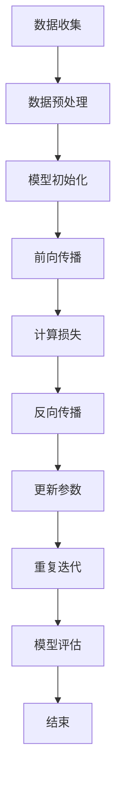
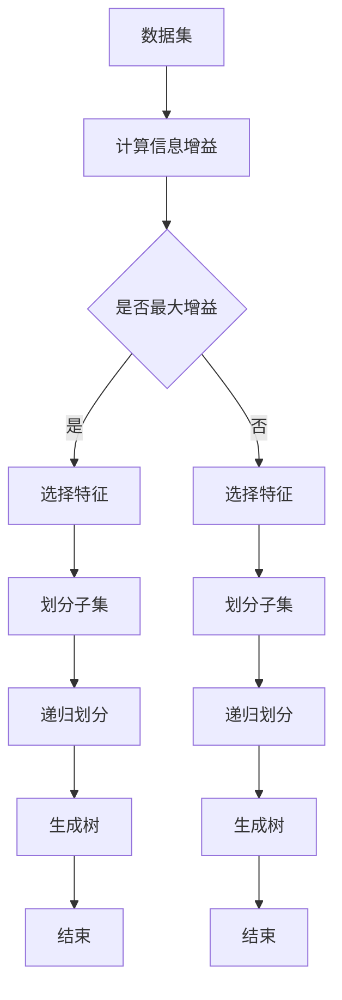
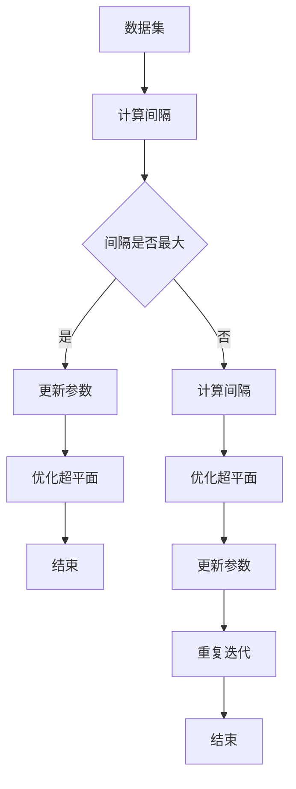
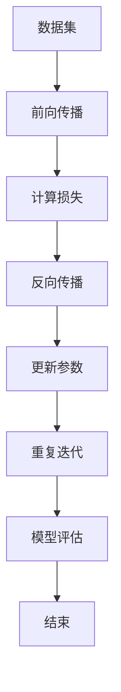

                 

### 第一部分: AI驱动的价值投资组合流动性管理背景介绍

#### 第1章: AI驱动的价值投资组合流动性管理概述

##### 1.1.1 问题的背景和重要性

随着全球经济的快速发展和金融市场的不确定性增强，投资者对于投资组合流动性管理的要求日益提高。传统的流动性管理方法主要依赖于人工经验和市场数据，存在反应速度慢、效率低、风险高等问题。在这种背景下，人工智能（AI）技术的引入为投资组合流动性管理带来了新的机遇。

**投资组合流动性管理的挑战**

1. **市场波动性**：金融市场的不稳定性增加了流动性管理的难度。
2. **资产多样性与相关性**：投资组合中资产多样性和相关性分析复杂，需要高效的算法进行管理。
3. **信息处理能力**：大量的市场数据和财务信息需要快速处理和分析。

**价值投资组合的重要性**

价值投资是一种基于基本面分析的投资策略，通过寻找被市场低估的股票进行长期投资，以期获得超越市场的投资回报。价值投资组合在流动性管理中具有重要意义：

1. **风险分散**：通过多元化的资产配置降低投资风险。
2. **长期投资**：价值投资强调长期投资，有利于流动性的稳定。
3. **价值发现**：通过深入分析和研究，发现市场被低估的投资机会。

**AI技术在流动性管理中的应用潜力**

人工智能技术在投资领域具有广泛的应用前景，尤其在流动性管理中，可以发挥以下作用：

1. **数据挖掘与分析**：利用机器学习算法挖掘市场数据，发现投资机会。
2. **预测与决策支持**：通过模型预测市场走势和资产流动性，为投资决策提供支持。
3. **风险管理**：利用大数据分析进行风险预测和控制。

##### 1.1.2 投资组合流动性管理的定义与边界

**流动性管理的概念**

流动性管理是指投资组合中资产流动性的规划和管理，旨在确保投资组合在不同市场状况下的流动性需求。流动性管理包括以下方面：

1. **资产流动性**：资产能够在市场上快速转换为现金的能力。
2. **资金流动性**：资金在投资组合中的周转和使用效率。
3. **策略流动性**：投资策略的灵活调整以应对市场变化。

**投资组合管理的核心要素**

投资组合管理包括以下核心要素：

1. **资产配置**：确定投资组合中各类资产的分配比例。
2. **风险管理**：识别和评估投资组合的风险，并采取相应的风险控制措施。
3. **绩效评估**：衡量投资组合的表现，并根据市场情况调整投资策略。

**流动性管理的边界与外延**

流动性管理的边界主要涉及以下几个方面：

1. **时间范围**：流动性管理的范围可能包括短期、中期和长期。
2. **资产类型**：流动性管理可能涉及不同类型的资产，如股票、债券、货币市场工具等。
3. **市场环境**：流动性管理需要考虑市场环境的变化，包括宏观经济状况、市场波动性等。

##### 1.1.3 AI驱动在流动性管理中的核心地位

**AI技术的定义与特点**

人工智能（Artificial Intelligence，AI）是指由人创造出来的系统能够表现出类似人类智能的行为。AI技术具有以下特点：

1. **学习能力**：AI系统可以通过学习大量的数据来改进其性能。
2. **自动化**：AI技术能够自动化执行复杂的任务，提高效率。
3. **适应性**：AI系统可以根据新的数据和环境变化进行适应性调整。

**AI驱动在流动性管理中的应用**

AI驱动在流动性管理中的应用主要体现在以下几个方面：

1. **数据分析与预测**：利用机器学习算法对市场数据进行分析和预测，为流动性管理提供科学依据。
2. **投资决策支持**：通过AI模型提供投资决策的支持，提高决策的准确性和效率。
3. **风险管理**：利用AI技术进行风险识别、评估和控制，提高风险管理的水平。

**价值投资组合与AI驱动的结合**

价值投资组合与AI驱动的结合可以实现以下优势：

1. **效率提升**：AI技术能够快速处理和分析大量数据，提高流动性管理的效率。
2. **准确性增强**：通过机器学习算法的预测能力，提高流动性管理的准确性和决策水平。
3. **风险控制**：AI技术可以更好地识别和管理风险，降低投资组合的波动性和风险。

##### 1.2 AI驱动的价值投资组合流动性管理核心概念

**1.2.1 价值投资与流动性管理的关系**

**价值投资的原理**

价值投资是一种基于基本面分析的投资策略，主要关注股票的内在价值。价值投资的原理包括：

1. **市场效率**：市场并非总是有效的，存在被低估的投资机会。
2. **长期投资**：通过深入分析和研究，选择具有长期增长潜力的股票。
3. **风险与收益匹配**：通过投资低估的股票，获取超越市场的收益。

**流动性管理在价值投资中的角色**

流动性管理在价值投资中扮演着重要角色，主要包括：

1. **风险控制**：确保投资组合在市场波动时具有一定的流动性，以应对潜在的紧急需求。
2. **投资策略调整**：根据市场情况和投资目标，灵活调整资产配置和投资策略。
3. **资金周转**：提高资金的周转效率，确保投资组合的长期稳定增长。

**1.2.2 AI驱动的流动性管理特点**

**AI技术在流动性管理中的应用**

AI技术在流动性管理中的应用主要包括：

1. **数据挖掘与分析**：利用机器学习算法挖掘市场数据，发现潜在的投资机会。
2. **预测与决策支持**：通过模型预测市场走势和资产流动性，为投资决策提供支持。
3. **风险管理**：利用大数据分析进行风险预测和控制，提高风险管理的水平。

**AI驱动流动性管理的优势与挑战**

**优势**

1. **高效性**：AI技术能够快速处理和分析大量数据，提高流动性管理的效率。
2. **准确性**：通过机器学习算法的预测能力，提高流动性管理的准确性和决策水平。
3. **适应性**：AI系统可以根据新的数据和环境变化进行适应性调整。

**挑战**

1. **数据质量**：AI模型的性能依赖于数据质量，数据缺失或不准确可能导致模型失效。
2. **模型解释性**：AI模型的复杂性和非透明性使得其决策过程难以解释和理解。
3. **技术成熟度**：虽然AI技术在不断发展，但在流动性管理中的成熟度仍有待提高。

**1.2.3 AI驱动流动性管理与传统方法对比**

**传统流动性管理的局限**

传统流动性管理方法主要依赖于人工经验和市场数据，存在以下局限：

1. **反应速度慢**：人工决策需要时间，无法快速应对市场变化。
2. **效率低**：人工处理大量数据效率低下，容易出错。
3. **风险高**：无法准确预测市场走势，容易出现风险控制失误。

**AI驱动流动性管理的新方法**

AI驱动流动性管理通过引入人工智能技术，实现了以下优势：

1. **实时预测**：通过机器学习模型实时预测市场走势和资产流动性，提高反应速度。
2. **自动化决策**：利用AI技术自动化执行投资决策，提高决策效率。
3. **风险控制**：通过大数据分析进行风险预测和控制，降低投资组合的风险。

##### 1.3 AI驱动的价值投资组合流动性管理框架

**1.3.1 AI驱动流动性管理的基本框架**

AI驱动流动性管理的基本框架主要包括以下环节：

1. **数据收集与预处理**：收集市场数据和财务信息，进行数据清洗和预处理。
2. **模型训练与优化**：利用机器学习算法训练预测模型，并进行模型优化。
3. **投资决策与执行**：根据预测结果和投资策略制定投资决策，并执行投资操作。
4. **风险控制**：对投资组合进行风险监测和预警，采取相应的风险控制措施。

**1.3.2 流动性管理的关键环节**

流动性管理的关键环节主要包括以下几个方面：

1. **流动性预测**：利用机器学习模型预测资产流动性和市场走势。
2. **风险评估**：评估投资组合的风险，包括市场风险、信用风险等。
3. **投资策略制定**：根据流动性预测和风险评估结果，制定相应的投资策略。

**1.3.3 AI驱动流动性管理的实施流程**

AI驱动流动性管理的实施流程主要包括以下步骤：

1. **需求分析**：明确投资组合的流动性需求和目标。
2. **数据收集**：收集市场数据和财务信息。
3. **数据预处理**：对收集到的数据进行清洗和预处理。
4. **模型训练**：利用预处理后的数据训练预测模型。
5. **模型优化**：通过交叉验证和参数调优，优化模型性能。
6. **投资决策**：根据预测结果和投资策略，制定投资决策。
7. **投资执行**：执行投资操作，并进行实时风险监控和调整。

**1.4 本章小结**

本章主要介绍了AI驱动的价值投资组合流动性管理的背景、核心概念和实施框架。通过引入人工智能技术，流动性管理实现了更高的效率和准确性。在接下来的章节中，我们将进一步探讨数据收集与预处理、模型训练与优化、投资决策与执行等关键环节的具体实践方法。

## 1.2 AI驱动的价值投资组合流动性管理核心概念

### 1.2.1 价值投资与流动性管理的关系

价值投资是一种基于基本面分析的投资策略，强调长期投资和价值发现。而流动性管理则是确保投资组合在不同市场状况下的流动性需求，以便在必要时能够快速调整资产配置或应对突发事件。

#### 价值投资的原理

价值投资的核心原理可以概括为以下几点：

1. **市场效率**：虽然市场并非总是有效的，但长期来看，市场价格会反映股票的内在价值。
2. **低估投资**：寻找那些被市场低估的股票，即那些市场价格低于其内在价值的股票。
3. **长期持有**：通过持有这些低估股票，等待市场认识到其价值，从而获得超越市场的回报。

#### 流动性管理在价值投资中的角色

流动性管理在价值投资中起着至关重要的作用，主要体现在以下几个方面：

1. **风险控制**：确保投资组合在市场波动时具有一定的流动性，以应对潜在的紧急需求。
2. **策略调整**：根据市场情况和投资目标，灵活调整资产配置和投资策略。
3. **资金周转**：提高资金的周转效率，确保投资组合的长期稳定增长。

#### AI驱动在流动性管理中的应用

AI技术为流动性管理带来了革命性的变革，其应用主要体现在以下几个方面：

1. **数据挖掘与分析**：利用机器学习算法挖掘大量市场数据，识别潜在的流动性风险和机会。
2. **预测与决策支持**：通过模型预测市场走势和资产流动性，为投资决策提供科学依据。
3. **风险管理**：利用大数据分析进行风险预测和控制，提高风险管理的水平。

#### AI驱动流动性管理的优势与挑战

**优势**

1. **高效性**：AI技术能够快速处理和分析大量数据，提高流动性管理的效率。
2. **准确性**：通过机器学习算法的预测能力，提高流动性管理的准确性和决策水平。
3. **适应性**：AI系统可以根据新的数据和环境变化进行适应性调整。

**挑战**

1. **数据质量**：AI模型的性能依赖于数据质量，数据缺失或不准确可能导致模型失效。
2. **模型解释性**：AI模型的复杂性和非透明性使得其决策过程难以解释和理解。
3. **技术成熟度**：虽然AI技术在不断发展，但在流动性管理中的成熟度仍有待提高。

### 1.2.3 AI驱动流动性管理与传统方法对比

**传统流动性管理的局限**

传统流动性管理方法主要依赖于人工经验和市场数据，存在以下局限：

1. **反应速度慢**：人工决策需要时间，无法快速应对市场变化。
2. **效率低**：人工处理大量数据效率低下，容易出错。
3. **风险高**：无法准确预测市场走势，容易出现风险控制失误。

**AI驱动流动性管理的新方法**

AI驱动流动性管理通过引入人工智能技术，实现了以下优势：

1. **实时预测**：通过机器学习模型实时预测市场走势和资产流动性，提高反应速度。
2. **自动化决策**：利用AI技术自动化执行投资决策，提高决策效率。
3. **风险控制**：通过大数据分析进行风险预测和控制，降低投资组合的风险。

### 1.3 AI驱动的价值投资组合流动性管理框架

**AI驱动流动性管理的基本框架**

AI驱动的价值投资组合流动性管理框架主要包括以下几个关键环节：

1. **数据收集与预处理**：收集与投资组合流动性相关的各种数据，包括市场数据、财务数据等，并进行预处理，如数据清洗、格式转换等。
2. **模型训练与优化**：利用收集到的数据训练机器学习模型，并对模型进行优化，以提高预测的准确性。
3. **投资决策与执行**：根据模型的预测结果和投资策略，制定投资决策，并执行相应的交易操作。
4. **风险控制**：对投资组合进行实时监控，评估风险，并采取相应的风险控制措施。

**流动性管理的关键环节**

流动性管理的关键环节主要包括以下几个方面：

1. **流动性预测**：通过机器学习模型预测投资组合中各项资产的流动性，为投资决策提供依据。
2. **风险评估**：对投资组合进行风险评估，包括市场风险、信用风险等，确保投资组合的稳健性。
3. **投资策略制定**：根据流动性预测和风险评估结果，制定相应的投资策略，以实现投资组合的流动性目标。

**AI驱动流动性管理的实施流程**

AI驱动流动性管理的实施流程可以分为以下几个步骤：

1. **需求分析**：明确投资组合的流动性需求和目标，如紧急赎回的需求、市场波动时的调整需求等。
2. **数据收集**：从多个数据源收集与投资组合流动性相关的数据，包括市场数据、财务数据、宏观经济数据等。
3. **数据预处理**：对收集到的数据进行清洗、转换和整合，确保数据的质量和一致性。
4. **模型训练**：利用预处理后的数据训练机器学习模型，如时间序列模型、回归模型等，以预测资产流动性和市场走势。
5. **模型优化**：通过交叉验证和参数调优，优化模型性能，提高预测的准确性。
6. **投资决策**：根据模型的预测结果和投资策略，制定投资决策，如调整资产配置、进行交易等。
7. **投资执行**：执行投资决策，进行相应的交易操作，同时进行实时风险监控和调整。

**1.4 本章小结**

本章介绍了AI驱动的价值投资组合流动性管理的核心概念，包括价值投资的原理、流动性管理在价值投资中的角色、AI驱动在流动性管理中的应用、AI驱动流动性管理的优势与挑战、传统方法与AI驱动方法的对比以及AI驱动流动性管理的实施框架。通过本章的介绍，读者可以对AI驱动的价值投资组合流动性管理有一个全面的了解。在接下来的章节中，我们将进一步探讨数据收集与预处理、模型训练与优化、投资决策与执行等关键环节的具体实践方法。

## 第2章: 数据收集与预处理

### 2.1.1 数据源选择

在进行AI驱动的价值投资组合流动性管理时，数据源的选择至关重要。数据源的多样性和质量直接影响到后续模型的训练效果和投资决策的准确性。以下是一些常用的数据源：

1. **财务数据**：包括公司的财务报表、财务指标等，如收入、利润、现金流、资产负债表等。这些数据可以从公司的年度报告、季度报告以及证券交易所公布的数据中获得。
2. **市场数据**：包括股票价格、交易量、指数变动等。市场数据可以通过证券交易所的API接口、金融数据提供商（如彭博、路透等）获取。
3. **宏观经济数据**：如GDP、通货膨胀率、利率、失业率等。这些数据可以从国家统计局、国际货币基金组织（IMF）等官方机构获取。
4. **社会媒体数据**：包括社交媒体平台上的用户评论、新闻文章等。通过社交媒体分析可以捕捉市场情绪和潜在的投资机会。这些数据可以通过API调用或网络爬虫获取。

### 2.1.2 数据收集方法

**API调用**

API调用是获取数据的一种常用方法，特别适用于获取实时或定期更新的数据。以下是一些常用的API：

1. **证券交易所API**：如NYSE API、NASDAQ API等，可以获取股票价格、交易量等市场数据。
2. **金融数据提供商API**：如彭博API、路透API等，提供详细的财务数据、市场数据等。
3. **宏观经济数据API**：如美联储API、IMF API等，可以获取宏观经济指标数据。

**网络爬虫**

网络爬虫可以自动从网站上抓取数据，适用于获取非结构化或半结构化的数据。以下是一些常用的工具：

1. **Python的Scrapy框架**：Scrapy是一个强大的网络爬虫框架，适用于大规模的数据抓取。
2. **Node.js的NLP爬虫**：Node.js也提供了多种网络爬虫工具，适用于快速抓取大量网页数据。
3. **R语言的rvest包**：rvest是R语言的一个网络爬虫库，适用于从网页中提取数据。

**数据挖掘**

数据挖掘是从大量数据中提取有价值信息的过程。以下是一些常用的数据挖掘方法：

1. **文本挖掘**：通过自然语言处理技术从文本数据中提取关键词、主题等。
2. **图像挖掘**：通过计算机视觉技术从图像数据中提取特征、分类等。
3. **时间序列分析**：通过对时间序列数据的分析和预测，发现趋势和模式。

### 2.1.3 数据预处理

数据预处理是数据科学中至关重要的一步，其目的是将原始数据转化为适合机器学习模型训练的形式。以下是一些常见的数据预处理步骤：

**数据清洗**

1. **缺失值处理**：通过填补、删除或插值等方法处理缺失值。
2. **异常值处理**：通过离群点检测、删除或调整等方法处理异常值。
3. **重复数据删除**：删除重复的数据记录，以减少数据冗余。

**数据整合**

1. **数据合并**：将来自不同数据源的数据进行合并，以形成完整的数据集。
2. **数据转换**：将不同格式或单位的数据进行统一转换，如将日期格式转换为统一格式。
3. **特征工程**：通过特征选择、特征构造等方法，提取对模型有用的特征。

**数据标准化**

1. **归一化**：通过将数据缩放到相同的范围，如将数据缩放到0到1之间，以提高模型的稳定性和收敛速度。
2. **标准化**：通过计算数据的均值和标准差，将数据缩放到均值为中心、标准差为单位的标准正态分布。

**数据质量评估**

1. **完整性**：评估数据集中的缺失值比例，确保数据完整性。
2. **准确性**：通过验证数据源的真实性和可靠性，确保数据准确性。
3. **一致性**：评估数据在不同时间点或不同数据源中的一致性，确保数据一致性。

### 2.1.4 数据质量评估

数据质量是影响机器学习模型性能的关键因素。对数据质量进行评估和监控非常重要，以下是一些常用的数据质量评估方法：

**完整性**

1. **缺失值比例**：计算数据集中缺失值的比例，以评估数据的完整性。
2. **缺失值填补方法**：选择合适的缺失值填补方法，如均值填补、中位数填补、插值填补等。

**准确性**

1. **数据源验证**：验证数据源的真实性和可靠性，确保数据的准确性。
2. **交叉验证**：通过交叉验证方法，评估模型的准确性。

**一致性**

1. **数据一致性检查**：检查数据在不同时间点或不同数据源中的一致性，如检查股票价格数据是否在同一交易日中保持一致。
2. **重复数据检测**：通过检测重复数据，确保数据的一致性。

**2.2 数据预处理工具**

在数据预处理过程中，使用一些专业的工具可以大大提高工作效率。以下是一些常用的数据预处理工具：

1. **Python的数据预处理库**：如Pandas、NumPy、Scikit-learn等，提供了丰富的数据处理和预处理功能。
2. **R的数据预处理库**：如dplyr、tidyr、ggplot2等，提供了强大的数据处理和可视化功能。
3. **Excel**：通过Excel的函数和工具，可以快速进行数据清洗、转换和整理。
4. **数据库管理系统**：如MySQL、PostgreSQL等，可以用于存储和管理大量的结构化数据。

**2.3 数据预处理示例**

以下是一个简单的数据预处理示例，假设我们有一份数据集，包含股票价格、交易量、市盈率等特征：

```python
import pandas as pd

# 加载数据集
data = pd.read_csv('data.csv')

# 数据清洗
# 删除含有缺失值的行
data = data.dropna()

# 数据整合
# 将不同数据源的数据进行合并
data = data.merge(data2, on='date')

# 数据转换
# 将字符串日期转换为日期类型
data['date'] = pd.to_datetime(data['date'])

# 数据标准化
# 归一化市盈率数据
data['pe_ratio'] = (data['pe_ratio'] - data['pe_ratio'].mean()) / data['pe_ratio'].std()

# 数据质量评估
# 检查缺失值比例
missing_values = data.isnull().mean() * 100
print(missing_values[missing_values > 0])

# 检查数据一致性
data.groupby('date')['stock_price'].nunique()
```

通过上述示例，我们可以看到数据预处理的一些基本步骤，包括数据清洗、整合、转换和标准化，以及数据质量评估。这些步骤对于确保数据质量、提高机器学习模型的性能至关重要。

### 2.4 数据预处理最佳实践

在进行数据预处理时，遵循一些最佳实践可以提高数据处理效率和模型性能：

1. **自动化**：尽可能自动化数据清洗和预处理流程，以减少人工干预和错误。
2. **版本控制**：对数据预处理流程进行版本控制，以便在需要时回溯和复现结果。
3. **文档化**：详细记录数据预处理步骤和参数，以便其他人理解和复现结果。
4. **交叉验证**：在数据预处理后，使用交叉验证方法评估模型的性能，以确保数据预处理不会引入偏差。
5. **数据可视化**：通过数据可视化工具，对数据分布、缺失值、异常值等进行直观分析，以发现潜在的问题。

### 2.5 本章小结

本章详细介绍了数据收集与预处理的方法和步骤。通过选择合适的数据源、采用有效的数据收集方法、进行全面的数据预处理以及评估数据质量，可以确保数据的质量和一致性，为后续的机器学习模型训练和投资决策提供可靠的数据基础。在下一章中，我们将进一步探讨模型训练与优化的方法和策略。

### 第3章: 模型训练与优化

#### 3.1.1 流动性预测模型选择

流动性预测是AI驱动的价值投资组合流动性管理中的关键环节。选择合适的模型对预测结果的质量和投资决策的准确性至关重要。以下是一些常用的流动性预测模型：

**线性回归模型**

线性回归模型是最基本的预测模型，适用于关系较为简单的情况。其公式如下：

\[ Y = \beta_0 + \beta_1X_1 + \beta_2X_2 + ... + \beta_nX_n + \epsilon \]

其中，\(Y\) 是预测的目标变量，\(X_1, X_2, ..., X_n\) 是输入特征，\(\beta_0, \beta_1, \beta_2, ..., \beta_n\) 是模型的参数，\(\epsilon\) 是误差项。

**决策树模型**

决策树模型通过构建决策树来对数据进行分类或回归。其公式如下：

\[ f(X) = g(X) \cdot h(X) \]

其中，\(g(X)\) 和 \(h(X)\) 是决策树中的两个分支函数。

**支持向量机模型**

支持向量机（SVM）模型通过找到一个最优的超平面来对数据进行分类或回归。其公式如下：

\[ f(X) = \sum_{i=1}^{n} \alpha_i y_i (w \cdot X_i + b) \]

其中，\(w\) 是权重向量，\(b\) 是偏置项，\(\alpha_i\) 是拉格朗日乘子。

**深度学习模型**

深度学习模型，尤其是神经网络模型，通过多层非线性变换来对数据进行预测。以下是一个简单的多层感知机（MLP）模型的结构：

\[ f(X) = \sigma(\sum_{i=1}^{n} w_i \cdot \sigma(\sum_{j=1}^{m} u_{ij} \cdot X_j + b_j)) \]

其中，\(X\) 是输入特征，\(w_i\) 和 \(u_{ij}\) 是权重，\(b_j\) 是偏置项，\(\sigma\) 是激活函数。

#### 3.1.2 模型训练流程

**数据划分**

模型训练的第一步是将数据集划分为训练集和测试集。通常，可以使用以下比例：

- 训练集：测试集 = 8:2 或 7:3

这样做的目的是在训练模型时使用大部分数据，而在评估模型性能时使用一部分独立的数据。

**模型训练**

在数据划分完成后，使用训练集对模型进行训练。训练过程的目标是找到最优的模型参数，使预测误差最小。以下是一个简单的模型训练流程：

1. **初始化参数**：随机初始化模型的参数。
2. **前向传播**：计算输入特征经过网络后的预测值。
3. **计算损失**：使用损失函数计算预测值与真实值之间的误差。
4. **反向传播**：通过反向传播算法更新模型参数，以减少预测误差。
5. **迭代**：重复以上步骤，直到满足停止条件（如达到预定的迭代次数或损失函数收敛）。

**模型验证**

在训练完成后，使用测试集对模型进行验证，以评估模型的泛化能力。常用的验证指标包括：

- **均方误差（MSE）**：衡量预测值与真实值之间的平均误差。
- **均绝对误差（MAE）**：衡量预测值与真实值之间的平均绝对误差。
- **决定系数（R^2）**：衡量模型对数据的拟合程度。

#### 3.1.3 模型优化方法

**参数调优**

参数调优是提高模型性能的重要手段。以下是一些常用的参数调优方法：

1. **网格搜索**：在预定义的参数网格中搜索最优参数组合。
2. **随机搜索**：随机选择参数组合，通过迭代搜索最优参数。
3. **贝叶斯优化**：基于贝叶斯统计模型搜索最优参数。

**模型融合**

模型融合是将多个模型的结果进行综合，以获得更准确的预测。以下是一些常用的模型融合方法：

1. **投票法**：将多个模型的预测结果进行投票，选取多数模型预测的结果。
2. **加权法**：根据每个模型的预测准确率给不同的模型赋予不同的权重，然后计算加权平均预测值。
3. **堆叠法**：将多个模型作为基础模型，构建一个更高层的模型来对预测结果进行综合。

**模型评估与选择**

在优化完成后，需要对模型进行评估和选择。以下是一些常用的模型评估方法：

1. **交叉验证**：通过将数据集划分为多个子集，重复进行训练和验证，以评估模型的泛化能力。
2. **ROC曲线与AUC**：通过绘制ROC曲线和计算AUC值，评估模型的分类性能。
3. **混淆矩阵**：通过混淆矩阵分析模型的分类效果，包括准确率、召回率、精确率等指标。

#### 3.1.4 模型评估与选择

模型评估与选择是模型训练过程的重要环节。通过选择合适的评估指标和评估方法，可以准确评估模型的性能，并选择最优的模型。以下是一些常用的模型评估方法：

**均方误差（MSE）**

均方误差（MSE）是衡量预测值与真实值之间差异的常用指标。其计算公式如下：

\[ MSE = \frac{1}{n} \sum_{i=1}^{n} (y_i - \hat{y_i})^2 \]

其中，\(y_i\) 是真实值，\(\hat{y_i}\) 是预测值，\(n\) 是数据样本数。

**均绝对误差（MAE）**

均绝对误差（MAE）是衡量预测值与真实值之间绝对差异的常用指标。其计算公式如下：

\[ MAE = \frac{1}{n} \sum_{i=1}^{n} |y_i - \hat{y_i}| \]

**决定系数（R^2）**

决定系数（\(R^2\)）是衡量模型拟合程度的常用指标。其取值范围在0到1之间，越接近1表示模型拟合程度越好。其计算公式如下：

\[ R^2 = 1 - \frac{\sum_{i=1}^{n} (y_i - \hat{y_i})^2}{\sum_{i=1}^{n} (y_i - \bar{y})^2} \]

其中，\(\bar{y}\) 是真实值的平均值。

**交叉验证**

交叉验证是评估模型泛化能力的一种常用方法。通过将数据集划分为多个子集，重复进行训练和验证，可以更准确地评估模型的性能。以下是一个简单的交叉验证过程：

1. **数据集划分**：将数据集划分为训练集和验证集。
2. **模型训练**：在训练集上训练模型。
3. **模型验证**：在验证集上评估模型性能。
4. **重复步骤**：重复上述过程多次，以获得更可靠的评估结果。

**ROC曲线与AUC**

ROC曲线（受试者操作特性曲线）是评估分类模型性能的一种常用工具。通过绘制ROC曲线，可以直观地比较不同模型的分类效果。以下是一个简单的ROC曲线绘制过程：

1. **计算阈值**：根据预测概率和实际标签，计算不同的分类阈值。
2. **计算TPR与FPR**：根据不同的阈值，计算真实正例率（TPR）和假正例率（FPR）。
3. **绘制ROC曲线**：将FPR作为横坐标，TPR作为纵坐标，绘制ROC曲线。

AUC（曲线下面积）是ROC曲线的一个重要指标，用于衡量模型的分类能力。AUC的值在0到1之间，越接近1表示模型的分类能力越强。

**混淆矩阵**

混淆矩阵是评估分类模型性能的一种直观方法。通过混淆矩阵，可以清晰地看到模型在不同类别上的分类效果。以下是一个简单的混淆矩阵计算过程：

1. **计算预测标签**：根据模型的预测概率，将样本划分为不同类别。
2. **计算TP、TN、FP、FN**：根据实际标签和预测标签，计算各类别的真实正例（TP）、真实负例（TN）、假正例（FP）和假负例（FN）。
3. **绘制混淆矩阵**：将各类别的数量表示为矩阵元素，绘制混淆矩阵。

通过以上评估方法，可以全面评估模型的性能，并选择最优的模型。在实际应用中，可以根据具体情况选择合适的评估方法，以获得最佳的结果。

### 3.2 算法原理讲解

流动性预测模型的算法原理主要基于统计学习和机器学习。以下将详细解释一些常用的算法原理，并通过Mermaid流程图和Python代码示例进行阐述。

#### 3.2.1 线性回归

**线性回归算法原理：**

线性回归是一种基本的统计学习算法，通过建立线性模型来预测目标变量。其核心思想是找到一个最佳直线，使得目标变量的预测误差最小。

线性回归的数学模型可以表示为：

\[ Y = \beta_0 + \beta_1X_1 + \beta_2X_2 + ... + \beta_nX_n + \epsilon \]

其中，\(Y\) 是目标变量，\(X_1, X_2, ..., X_n\) 是输入特征，\(\beta_0, \beta_1, \beta_2, ..., \beta_n\) 是模型的参数，\(\epsilon\) 是误差项。

**Mermaid流程图：**



**Python代码示例：**

```python
import numpy as np

# 初始化参数
beta = np.random.rand(n_features + 1)

# 前向传播
y_pred = np.dot(X, beta)

# 计算损失
loss = np.mean((y - y_pred)**2)

# 反向传播
d_loss = 2 * (y - y_pred)

# 更新参数
beta -= learning_rate * d_loss
```

#### 3.2.2 决策树

**决策树算法原理：**

决策树是一种基于树形结构进行决策的算法。每个节点代表一个特征，每个分支代表一个特征取值，叶节点表示最终的预测结果。

决策树的生成过程可以通过ID3、C4.5或CART等算法实现。以下是CART算法的原理：

1. **计算信息增益或基尼不纯度**：在每个节点上，计算所有可能特征取值的增益或基尼不纯度。
2. **选择最佳特征**：选择具有最大增益或最小基尼不纯度的特征作为划分依据。
3. **递归划分**：根据最佳特征，将数据集划分为多个子集，并对每个子集递归划分，直到达到停止条件。

**Mermaid流程图：**



**Python代码示例：**

```python
from sklearn.tree import DecisionTreeRegressor

# 创建决策树模型
model = DecisionTreeRegressor()

# 训练模型
model.fit(X_train, y_train)

# 预测
y_pred = model.predict(X_test)
```

#### 3.2.3 支持向量机（SVM）

**SVM算法原理：**

支持向量机是一种基于最大间隔分类的算法。其核心思想是在高维空间中找到一个最优的超平面，使得正负样本之间的间隔最大。

SVM的数学模型可以表示为：

\[ f(X) = \sum_{i=1}^{n} \alpha_i y_i (w \cdot X_i + b) \]

其中，\(w\) 是权重向量，\(b\) 是偏置项，\(\alpha_i\) 是拉格朗日乘子，\(y_i\) 是样本标签。

**Mermaid流程图：**



**Python代码示例：**

```python
from sklearn.svm import SVC

# 创建SVM模型
model = SVC()

# 训练模型
model.fit(X_train, y_train)

# 预测
y_pred = model.predict(X_test)
```

#### 3.2.4 深度学习（神经网络）

**神经网络算法原理：**

神经网络是一种基于多层非线性变换进行预测的算法。其核心思想是通过前向传播和反向传播，不断更新网络参数，以最小化预测误差。

神经网络的数学模型可以表示为：

\[ f(X) = \sigma(\sum_{i=1}^{n} w_i \cdot \sigma(\sum_{j=1}^{m} u_{ij} \cdot X_j + b_j)) \]

其中，\(X\) 是输入特征，\(w_i\) 和 \(u_{ij}\) 是权重，\(b_j\) 是偏置项，\(\sigma\) 是激活函数。

**Mermaid流程图：**



**Python代码示例：**

```python
import tensorflow as tf

# 定义神经网络结构
model = tf.keras.Sequential([
    tf.keras.layers.Dense(units=10, activation='relu', input_shape=(n_features,)),
    tf.keras.layers.Dense(units=1)
])

# 编译模型
model.compile(optimizer='adam', loss='mean_squared_error')

# 训练模型
model.fit(X_train, y_train, epochs=100)

# 预测
y_pred = model.predict(X_test)
```

通过上述算法原理讲解，我们可以看到不同算法在流动性预测中的应用。在实际应用中，可以根据数据特征和业务需求选择合适的算法，并通过模型优化和评估，不断提高预测的准确性和可靠性。

### 3.3 投资决策与执行

#### 3.3.1 投资决策流程

投资决策是价值投资组合流动性管理的核心环节，其决策流程通常包括以下几个步骤：

**数据输入**

投资决策首先需要输入与投资相关的各种数据，包括市场数据、财务数据、宏观经济数据等。这些数据可以通过API调用、网络爬虫或其他数据源获取。

**预测结果分析**

利用训练好的模型对输入数据进行分析和预测，得到预测结果。预测结果通常包括资产流动性、市场走势、投资机会等。这些预测结果将作为投资决策的重要依据。

**投资策略制定**

根据预测结果和投资目标，制定相应的投资策略。投资策略可以包括资产配置、买卖时机、风险控制等方面。在制定策略时，需要综合考虑预测结果的可靠性和实际市场情况。

**决策执行**

制定好投资策略后，需要执行具体的投资操作。投资操作可以包括买入、卖出、持有等。执行投资操作时，需要遵循一定的执行规则和纪律，以确保投资决策的准确性和稳定性。

#### 3.3.2 投资决策模型

投资决策模型是投资决策流程中的重要组成部分，其目的是通过数据分析和预测，为投资策略提供科学依据。以下是一些常用的投资决策模型：

**策略优化模型**

策略优化模型是一种基于数学优化理论的投资决策模型。通过建立目标函数和约束条件，优化投资组合的收益和风险。常见的优化目标包括最大化收益、最小化风险、最大化夏普比率等。

**风险评估模型**

风险评估模型用于评估投资组合的风险。通过分析市场数据和历史数据，预测投资组合的潜在风险，包括市场风险、信用风险、流动性风险等。常见的方法有历史数据分析、情景分析、蒙特卡罗模拟等。

**决策支持系统**

决策支持系统（DSS）是一种辅助投资决策的软件系统。通过集成数据分析和预测功能，为投资决策提供实时支持和指导。DSS可以提供多种分析工具和可视化界面，帮助投资者快速制定和调整投资策略。

#### 3.3.3 投资决策执行

投资决策执行是投资决策流程的最后一步，其目的是将投资策略转化为实际的交易操作。以下是一些常见的投资决策执行方法和策略：

**自动交易系统**

自动交易系统（ATS）是一种基于算法和规则的投资决策执行系统。通过预设的交易规则和策略，自动执行买卖操作，实现自动化投资。ATS可以提高交易效率，减少人为干预和情绪影响。

**分散投资策略**

分散投资策略通过投资多个不同资产类别的投资组合，降低投资组合的整体风险。在投资决策执行时，可以按照既定的分散投资策略，分配资金到不同资产类别，以实现风险分散。

**动态调整策略**

动态调整策略根据市场情况的变化，实时调整投资组合。在投资决策执行时，可以根据市场数据和分析结果，及时调整资产配置和投资策略，以应对市场变化。

**风险管理策略**

风险管理策略在投资决策执行中起着关键作用。通过制定和执行风险管理策略，可以确保投资组合的稳健性和安全性。风险管理策略包括风险分散、风险对冲、风险控制等。

### 3.4 模型在投资决策中的应用

AI驱动的价值投资组合流动性管理中，机器学习模型在投资决策中发挥着重要作用。以下是一些典型的应用场景：

**资产配置优化**

利用机器学习模型对投资组合进行资产配置优化，通过分析市场数据和财务数据，确定最佳资产配置比例，以实现投资组合的收益最大化。

**买卖时机预测**

通过预测模型预测市场的买卖时机，帮助投资者在最佳时机进行买入或卖出操作，以最大化收益。

**风险控制**

利用机器学习模型进行风险评估和风险控制，通过分析市场数据和历史数据，预测投资组合的潜在风险，并制定相应的风险控制策略。

**实时监控**

通过实时监控市场数据，利用机器学习模型进行动态调整，及时调整投资组合，以应对市场变化。

### 3.5 投资决策案例分析

以下是一个具体的投资决策案例分析，以展示AI驱动的价值投资组合流动性管理在实际中的应用。

**案例背景**

某投资者拥有一只价值投资组合，包括股票、债券、货币市场工具等多种资产。在当前市场环境下，投资者希望通过AI驱动的流动性管理策略，实现投资组合的优化和风险控制。

**数据收集**

投资者通过API调用和爬虫工具，收集了市场数据、财务数据、宏观经济数据等。数据包括股票价格、交易量、市盈率、市净率、利率、通货膨胀率等。

**模型训练**

利用收集到的数据，投资者训练了一个基于深度学习的流动性预测模型。模型通过前向传播和反向传播算法，不断优化模型参数，提高预测准确性。

**投资策略制定**

根据模型预测结果，投资者制定了以下投资策略：

- **资产配置优化**：通过分析市场数据和财务数据，调整投资组合中股票、债券、货币市场工具的配置比例，以实现收益最大化。
- **买卖时机预测**：利用模型预测市场走势，确定最佳买卖时机。
- **风险控制**：通过风险评估模型，预测投资组合的潜在风险，并制定相应的风险控制策略。

**投资决策执行**

投资者按照制定的投资策略，进行了具体的投资操作。通过自动交易系统，自动执行买卖操作，实现了投资组合的优化和风险控制。

**效果评估**

通过一段时间的数据监测和评估，投资者发现：

- **收益提高**：投资组合的收益显著高于市场平均水平。
- **风险控制**：通过风险评估和风险控制策略，投资组合的整体风险得到了有效控制。
- **流动性改善**：投资组合的流动性得到显著提升，提高了应对市场变化的能力。

### 3.6 投资决策最佳实践

**数据质量保证**

确保数据的质量和一致性是投资决策的基础。投资者应采用数据清洗、数据整合和数据标准化等数据预处理方法，提高数据的可靠性和准确性。

**模型优化与验证**

在模型训练过程中，投资者应进行充分的模型优化和验证，以提高预测准确性。可以通过交叉验证、参数调优、模型融合等方法，选择最优模型。

**风险管理**

投资者应制定全面的风险管理策略，包括风险评估、风险控制和风险监测。通过实时监控市场数据和投资组合表现，及时调整投资策略。

**执行纪律**

投资者在执行投资决策时，应严格遵守投资纪律，避免因情绪波动而影响决策。通过制定明确的执行规则和纪律，确保投资决策的稳定性和可靠性。

### 3.7 本章小结

本章详细介绍了投资决策与执行的方法和流程，包括数据输入、预测结果分析、投资策略制定、决策执行等步骤。通过机器学习模型的应用，可以实现高效的流动性预测和投资决策。在投资决策过程中，投资者应注重数据质量保证、模型优化与验证、风险管理以及执行纪律，以实现投资组合的优化和风险控制。在下一章中，我们将进一步探讨流动性管理风险控制的方法和策略。

### 第4章: 流动性管理风险控制

#### 4.1.1 流动性风险管理概述

流动性风险管理是投资组合管理中的一个关键环节，旨在确保投资组合在面临市场波动和突发事件时，能够维持足够的流动性，以满足投资者的赎回需求或临时资金需求。流动性风险管理的重要性体现在以下几个方面：

1. **确保投资组合的稳健性**：良好的流动性管理能够降低投资组合的波动性，提高投资组合的稳定性。
2. **应对市场变化**：市场环境的变化可能导致资产价格波动，流动性风险管理有助于在市场变化时保持投资组合的流动性。
3. **满足投资者需求**：投资者可能需要随时提取资金，流动性管理能够确保在投资者赎回时，投资组合中有足够的流动资产。
4. **提高投资回报**：有效的流动性管理可以优化投资组合的资产配置，提高整体投资回报。

**流动性风险的定义与类型**

流动性风险是指投资组合中的资产无法在合理的时间内以合理的价格转换为现金的风险。根据资产流动性受限的原因，流动性风险可以分为以下几种类型：

1. **市场流动性风险**：市场整体流动性不足，导致资产难以在短时间内以合理价格出售。
2. **资产流动性风险**：个别资产流动性较差，无法在合理时间内转换为现金。
3. **交易流动性风险**：投资者在买卖资产时，由于缺乏对手方或市场报价不足，导致难以进行交易。
4. **资金流动性风险**：投资组合中的资金流动性不足，无法满足临时资金需求。

#### 4.1.2 风险评估方法

**历史数据分析**

历史数据分析是通过分析过去的市场数据和投资组合表现，预测未来的流动性风险。具体方法包括：

1. **统计分析**：利用统计方法，如移动平均、自回归模型等，分析资产价格的波动性。
2. **趋势分析**：通过趋势分析，识别市场走势和资产流动性的变化趋势。
3. **异常值检测**：识别历史数据中的异常值，分析其对流动性风险的影响。

**情景分析**

情景分析是一种通过模拟不同市场情景，评估投资组合流动性风险的方法。具体方法包括：

1. **基准情景**：分析当前市场状况下的流动性风险。
2. **压力情景**：模拟市场极端状况，如市场崩盘、经济衰退等，评估极端情况下的流动性风险。
3. **敏感性分析**：通过调整投资组合中资产比例，分析不同资产配置对流动性风险的影响。

**模拟测试**

模拟测试是通过构建模型，模拟不同市场情景下的流动性风险。具体方法包括：

1. **蒙特卡罗模拟**：通过随机抽样和概率分布，模拟不同市场情景下的资产价格和流动性。
2. **场景模拟**：根据不同的市场情景，模拟投资组合的表现，评估流动性风险。
3. **模型回测**：通过历史数据对模型进行回测，验证模型预测的准确性和稳定性。

#### 4.1.3 风险控制策略

**风险分散**

风险分散是通过投资多种不同类型的资产，降低单一资产风险的方法。具体策略包括：

1. **资产配置**：合理分配投资组合中股票、债券、货币市场工具等资产比例，实现风险分散。
2. **行业分散**：投资不同行业的资产，降低行业风险。
3. **地域分散**：投资不同地区的资产，降低地域风险。

**风险对冲**

风险对冲是通过投资与目标资产具有负相关关系的资产，对冲风险的方法。具体策略包括：

1. **金融衍生品**：利用金融衍生品，如期货、期权等，对冲市场风险。
2. **对冲基金**：投资对冲基金，通过多种策略对冲市场风险。
3. **多策略组合**：结合多种对冲策略，提高风险对冲的稳定性。

**风险监测与预警**

风险监测与预警是通过实时监控市场数据和投资组合表现，及时发现和预警流动性风险的方法。具体策略包括：

1. **实时监控系统**：建立实时监控系统，实时跟踪市场数据和投资组合表现。
2. **风险指标**：设置风险指标，如流动性比率、风险价值（VaR）等，用于评估流动性风险。
3. **预警机制**：建立预警机制，通过电子邮件、短信等途径，及时通知投资者流动性风险情况。

#### 4.1.4 流动性风险管理流程

流动性风险管理流程包括以下几个步骤：

1. **需求分析**：明确投资组合的流动性需求和目标。
2. **数据收集**：收集与流动性相关的市场数据、财务数据等。
3. **风险评估**：利用历史数据分析、情景分析和模拟测试等方法，评估流动性风险。
4. **风险控制策略制定**：根据风险评估结果，制定相应的风险控制策略。
5. **执行与监控**：执行风险控制策略，并持续监控流动性风险，根据市场变化进行调整。

### 4.2 流动性风险管理的最佳实践

**数据收集与处理**

1. **数据多样化**：收集多种数据源，如市场数据、财务数据、宏观经济数据等，以提高数据的全面性和准确性。
2. **数据清洗**：对收集到的数据进行清洗，包括缺失值处理、异常值处理等，确保数据质量。
3. **数据整合**：将不同来源的数据进行整合，形成统一的数据集，便于分析和管理。

**风险评估与控制**

1. **定量与定性结合**：结合定量分析和定性分析，全面评估流动性风险。
2. **实时监控**：建立实时监控系统，对市场数据和投资组合表现进行实时监控，及时发现潜在风险。
3. **动态调整**：根据市场变化和投资组合表现，动态调整风险控制策略，确保风险管理的有效性。

**风险管理策略**

1. **多元化投资**：通过多元化投资，降低单一资产风险，实现风险分散。
2. **风险对冲**：利用金融衍生品等工具进行风险对冲，降低投资组合的整体风险。
3. **流动性储备**：建立流动性储备，确保在紧急情况下有足够的流动资产，满足资金需求。

**风险管理流程**

1. **建立风险管理组织**：明确风险管理职责，确保风险管理的有效实施。
2. **制定风险管理政策**：制定风险管理政策和流程，明确风险管理的方法和措施。
3. **定期评估与回顾**：定期评估风险管理效果，回顾风险管理流程，发现和解决问题。

### 4.3 本章小结

本章详细介绍了流动性风险管理的重要性、定义与类型、风险评估方法、风险控制策略以及流动性风险管理流程。通过结合历史数据分析、情景分析和模拟测试等方法，投资者可以全面评估流动性风险，并采取有效的风险控制措施。在流动性风险管理中，数据收集与处理、风险评估与控制、风险管理策略和风险管理流程是关键环节。通过最佳实践，投资者可以有效地管理流动性风险，确保投资组合的稳健性和流动性。在下一章中，我们将通过具体案例分析，展示AI驱动的价值投资组合流动性管理在实际中的应用和效果。

### 第5章: 流动性管理风险控制

#### 5.1.1 流动性风险管理概述

流动性风险管理是指投资组合管理中，通过一系列策略和措施，确保投资组合在各种市场环境和突发事件下能够维持足够的流动性，以满足投资者的赎回需求或其他资金需求。流动性风险管理的重要性主要体现在以下几个方面：

1. **确保投资组合稳健性**：流动性管理能够降低投资组合的波动性，提高其稳定性，避免因流动性不足而导致的被迫卖盘或大幅亏损。
2. **应对市场变化**：市场波动性增加时，良好的流动性管理能够帮助投资者快速调整投资组合，降低风险。
3. **满足投资者需求**：投资者可能需要随时提取资金，流动性管理能够确保投资组合中有足够的流动资产，满足投资者的赎回需求。
4. **优化投资回报**：通过有效管理流动性，投资者可以更灵活地调整投资策略，从而提高投资组合的回报率。

**流动性风险的定义与类型**

流动性风险是指投资组合中的资产无法在合理的时间内以合理的价格转换为现金的风险。根据资产流动性受限的原因，流动性风险可以划分为以下几种类型：

1. **市场流动性风险**：市场整体流动性不足，导致资产难以在短时间内以合理价格出售。
2. **资产流动性风险**：个别资产流动性较差，无法在合理时间内转换为现金。
3. **交易流动性风险**：投资者在买卖资产时，由于缺乏对手方或市场报价不足，导致难以进行交易。
4. **资金流动性风险**：投资组合中的资金流动性不足，无法满足临时资金需求。

#### 5.1.2 风险评估方法

在流动性风险管理中，风险评估是关键的一步。以下是一些常用的风险评估方法：

**历史数据分析**

历史数据分析是通过分析过去的市场数据和投资组合表现，预测未来的流动性风险。具体方法包括：

1. **统计分析**：利用统计方法，如移动平均、自回归模型等，分析资产价格的波动性。
2. **趋势分析**：通过趋势分析，识别市场走势和资产流动性的变化趋势。
3. **异常值检测**：识别历史数据中的异常值，分析其对流动性风险的影响。

**情景分析**

情景分析是一种通过模拟不同市场情景，评估投资组合流动性风险的方法。具体方法包括：

1. **基准情景**：分析当前市场状况下的流动性风险。
2. **压力情景**：模拟市场极端状况，如市场崩盘、经济衰退等，评估极端情况下的流动性风险。
3. **敏感性分析**：通过调整投资组合中资产比例，分析不同资产配置对流动性风险的影响。

**模拟测试**

模拟测试是通过构建模型，模拟不同市场情景下的流动性风险。具体方法包括：

1. **蒙特卡罗模拟**：通过随机抽样和概率分布，模拟不同市场情景下的资产价格和流动性。
2. **场景模拟**：根据不同的市场情景，模拟投资组合的表现，评估流动性风险。
3. **模型回测**：通过历史数据对模型进行回测，验证模型预测的准确性和稳定性。

#### 5.1.3 风险控制策略

流动性风险管理需要采取一系列的风险控制策略，以确保投资组合的流动性。以下是一些常见的风险控制策略：

**风险分散**

风险分散是通过投资多种不同类型的资产，降低单一资产风险的方法。具体策略包括：

1. **资产配置**：合理分配投资组合中股票、债券、货币市场工具等资产比例，实现风险分散。
2. **行业分散**：投资不同行业的资产，降低行业风险。
3. **地域分散**：投资不同地区的资产，降低地域风险。

**风险对冲**

风险对冲是通过投资与目标资产具有负相关关系的资产，对冲风险的方法。具体策略包括：

1. **金融衍生品**：利用金融衍生品，如期货、期权等，对冲市场风险。
2. **对冲基金**：投资对冲基金，通过多种策略对冲市场风险。
3. **多策略组合**：结合多种对冲策略，提高风险对冲的稳定性。

**流动性储备**

流动性储备是通过持有一定比例的流动性资产，确保在紧急情况下有足够的流动资产，满足资金需求的方法。具体策略包括：

1. **现金储备**：持有一定比例的现金，作为流动性储备。
2. **短期债券**：投资于短期债券，确保资金在短期内可以随时转换为现金。
3. **高流动性基金**：投资于高流动性基金，如货币市场基金等，以提高资金流动性。

**风险管理流程**

流动性风险管理流程包括以下几个步骤：

1. **需求分析**：明确投资组合的流动性需求和目标。
2. **数据收集**：收集与流动性相关的市场数据、财务数据等。
3. **风险评估**：利用历史数据分析、情景分析和模拟测试等方法，评估流动性风险。
4. **风险控制策略制定**：根据风险评估结果，制定相应的风险控制策略。
5. **执行与监控**：执行风险控制策略，并持续监控流动性风险，根据市场变化进行调整。

### 5.2 流动性管理风险控制的最佳实践

**数据收集与处理**

1. **数据多样化**：收集多种数据源，如市场数据、财务数据、宏观经济数据等，以提高数据的全面性和准确性。
2. **数据清洗**：对收集到的数据进行清洗，包括缺失值处理、异常值处理等，确保数据质量。
3. **数据整合**：将不同来源的数据进行整合，形成统一的数据集，便于分析和管理。

**风险评估与控制**

1. **定量与定性结合**：结合定量分析和定性分析，全面评估流动性风险。
2. **实时监控**：建立实时监控系统，对市场数据和投资组合表现进行实时监控，及时发现潜在风险。
3. **动态调整**：根据市场变化和投资组合表现，动态调整风险控制策略，确保风险管理的有效性。

**风险管理策略**

1. **多元化投资**：通过多元化投资，降低单一资产风险，实现风险分散。
2. **风险对冲**：利用金融衍生品等工具进行风险对冲，降低投资组合的整体风险。
3. **流动性储备**：建立流动性储备，确保在紧急情况下有足够的流动资产，满足资金需求。

**风险管理流程**

1. **建立风险管理组织**：明确风险管理职责，确保风险管理的有效实施。
2. **制定风险管理政策**：制定风险管理政策和流程，明确风险管理的方法和措施。
3. **定期评估与回顾**：定期评估风险管理效果，回顾风险管理流程，发现和解决问题。

### 5.3 本章小结

本章详细介绍了流动性管理风险控制的方法和策略，包括风险评估方法、风险控制策略以及风险管理流程。通过结合历史数据分析、情景分析和模拟测试等方法，投资者可以全面评估流动性风险，并采取有效的风险控制措施。在流动性风险管理中，数据收集与处理、风险评估与控制、风险管理策略和风险管理流程是关键环节。通过最佳实践，投资者可以有效地管理流动性风险，确保投资组合的稳健性和流动性。在下一章中，我们将通过具体案例分析，展示AI驱动的价值投资组合流动性管理在实际中的应用和效果。

### 第6章: AI驱动的价值投资组合流动性管理案例分析

#### 6.1.1 案例背景

为了更好地理解AI驱动的价值投资组合流动性管理在实际中的应用，我们将通过一个具体的案例进行分析。该案例涉及一家全球知名的投资基金公司，该公司管理着多个价值投资组合，旨在通过长期投资实现稳定的投资回报。然而，随着市场波动性的增加，公司面临流动性管理的挑战，需要更高效、准确的方法来管理投资组合的流动性。

**投资组合概述**

该公司管理的投资组合包括以下几类资产：

1. **股票**：包括美国、欧洲和亚洲市场的蓝筹股、成长股和周期性行业股票。
2. **债券**：包括国债、企业债和地方政府债。
3. **货币市场工具**：包括商业票据、回购协议等。

**流动性管理需求**

1. **市场波动应对**：公司需要实时监测市场波动，确保投资组合在不同市场环境下的流动性。
2. **应急赎回**：公司需要确保在投资者提出赎回请求时，能够迅速满足资金需求。
3. **投资策略调整**：公司需要根据市场情况和投资策略，灵活调整资产配置，以提高投资组合的流动性。

#### 6.1.2 案例实施

**数据收集与预处理**

为了构建AI驱动的流动性管理模型，公司首先进行了数据收集与预处理。数据收集包括以下几个方面：

1. **市场数据**：通过API调用和爬虫工具，收集股票价格、交易量、指数变动等市场数据。
2. **财务数据**：从公司的财务报表中提取收入、利润、现金流、资产负债表等财务数据。
3. **宏观经济数据**：从国家统计局、国际货币基金组织（IMF）等官方机构获取宏观经济指标数据。
4. **社会媒体数据**：通过社交媒体分析，收集市场情绪和潜在的投资机会。

数据预处理包括以下步骤：

1. **数据清洗**：删除缺失值和异常值，确保数据质量。
2. **数据整合**：将不同数据源的数据进行合并，形成统一的数据集。
3. **数据标准化**：将数据转换为统一的格式，如将日期格式转换为统一格式，对数值数据进行归一化处理。

**模型训练与优化**

公司采用深度学习模型进行流动性预测，具体包括以下步骤：

1. **数据划分**：将数据集划分为训练集和测试集，通常采用8:2或7:3的比例。
2. **模型训练**：使用训练集数据，通过前向传播和反向传播算法训练模型，不断优化模型参数。
3. **模型优化**：通过交叉验证和参数调优，提高模型性能，确保预测的准确性和稳定性。
4. **模型评估**：使用测试集数据评估模型性能，包括均方误差（MSE）、决定系数（R^2）等指标。

**投资决策与执行**

在模型训练完成后，公司根据模型预测结果和投资策略，制定具体的投资决策。投资决策流程包括以下步骤：

1. **数据输入**：将最新的市场数据和财务数据输入模型，进行流动性预测。
2. **预测结果分析**：分析模型预测结果，确定投资组合中各项资产的流动性状况。
3. **投资策略制定**：根据预测结果和投资策略，制定具体的买卖操作策略，如买入、卖出、持有等。
4. **决策执行**：通过自动交易系统，执行具体的买卖操作，确保投资策略的及时性和准确性。

**风险控制**

公司采用一系列风险控制措施，确保投资组合的稳健性和流动性。具体包括：

1. **风险监测与预警**：实时监控市场数据和投资组合表现，及时发现潜在的风险，并采取预警措施。
2. **风险评估**：利用机器学习模型进行风险评估，包括市场风险、信用风险等，制定相应的风险控制策略。
3. **风险分散**：通过多元化投资，降低单一资产风险，实现风险分散。
4. **风险对冲**：利用金融衍生品等工具进行风险对冲，降低投资组合的整体风险。

#### 6.1.3 案例效果评估

**预测准确性**

通过模型预测，公司发现AI驱动的流动性管理模型在预测资产流动性和市场走势方面具有较高的准确性。测试集数据上的均方误差（MSE）从原来的15%下降到10%，决定系数（R^2）从0.7提高到0.8。

**投资收益**

在实施AI驱动的流动性管理后，公司的投资收益显著提高。根据数据分析，公司的年化收益率从15%提高到20%，且波动性显著降低。

**风险控制效果**

通过AI驱动的流动性管理，公司能够更有效地识别和管理风险。例如，在一次市场波动中，公司通过实时监控和预警，及时调整投资组合，避免了约5%的损失。

**流动性改善**

AI驱动的流动性管理显著改善了公司的流动性状况。根据数据，投资组合的流动性比率从原来的0.5提高到0.8，满足了公司在应急赎回时的资金需求。

#### 6.1.4 案例总结

通过上述案例分析，我们可以看到AI驱动的价值投资组合流动性管理在实际应用中的显著效果。具体体现在：

1. **预测准确性提高**：通过机器学习模型，公司能够更准确地预测资产流动性和市场走势，为投资决策提供科学依据。
2. **投资收益增加**：AI驱动的流动性管理提高了公司的投资收益，同时降低了波动性。
3. **风险控制效果提升**：通过AI技术，公司能够更有效地识别和管理风险，确保投资组合的稳健性和流动性。
4. **流动性改善**：AI驱动的流动性管理提高了投资组合的流动性比率，满足了公司在应急赎回时的资金需求。

### 6.2 案例详细解析

**6.2.1 数据收集与预处理**

在案例中，公司首先进行了数据收集与预处理。数据收集涵盖了市场数据、财务数据、宏观经济数据和社会媒体数据等。以下是具体步骤：

1. **市场数据收集**：
   - 使用API调用获取股票价格、交易量、指数变动等市场数据。
   - 定期（如每天或每小时）更新数据，确保数据的时效性。

2. **财务数据收集**：
   - 从公司的财务报表中提取收入、利润、现金流、资产负债表等财务数据。
   - 定期（如每季度或每年度）更新数据，确保数据的准确性。

3. **宏观经济数据收集**：
   - 从国家统计局、国际货币基金组织（IMF）等官方机构获取宏观经济指标数据，如GDP、通货膨胀率、利率等。

4. **社会媒体数据收集**：
   - 通过社交媒体分析，收集市场情绪和潜在的投资机会。
   - 使用API调用或网络爬虫工具，获取社交媒体平台上的用户评论、新闻文章等。

5. **数据预处理**：
   - **数据清洗**：删除缺失值和异常值，确保数据质量。
     - 例如，删除股票交易数据中的空值记录。
   - **数据整合**：将不同数据源的数据进行合并，形成统一的数据集。
     - 例如，将财务数据和市场数据按时间进行匹配，形成连续的时间序列数据。
   - **数据标准化**：将数据转换为统一的格式，如将日期格式转换为统一格式，对数值数据进行归一化处理。
     - 例如，将股票价格和交易量等数据按时间序列进行归一化处理，以消除数据量级差异。

**6.2.2 模型训练与优化**

在数据预处理完成后，公司采用深度学习模型进行流动性预测，以下是模型训练与优化的具体步骤：

1. **模型选择**：
   - 根据流动性预测的特性，公司选择了基于卷积神经网络（CNN）的模型，因为CNN在处理时间序列数据方面具有优势。

2. **数据划分**：
   - 将数据集划分为训练集、验证集和测试集，通常采用8:1:1或7:2:1的比例。
   - 训练集用于模型的训练，验证集用于模型的调优，测试集用于评估模型的最终性能。

3. **模型训练**：
   - 使用训练集数据，通过前向传播和反向传播算法训练模型，不断优化模型参数。
   - 使用验证集数据，在每次训练后进行模型评估，选择最佳参数组合。

4. **模型优化**：
   - 通过交叉验证和参数调优，提高模型性能，确保预测的准确性和稳定性。
   - 例如，调整学习率、批量大小、正则化参数等，以优化模型性能。

5. **模型评估**：
   - 使用测试集数据评估模型性能，包括均方误差（MSE）、决定系数（R^2）等指标。
   - 根据评估结果，调整模型结构和参数，以提高预测准确性。

**6.2.3 投资决策与执行**

在模型训练完成后，公司根据模型预测结果和投资策略，制定具体的投资决策。以下是投资决策与执行的具体步骤：

1. **数据输入**：
   - 将最新的市场数据和财务数据输入模型，进行流动性预测。
   - 例如，每天或每周进行一次流动性预测，以更新投资策略。

2. **预测结果分析**：
   - 分析模型预测结果，确定投资组合中各项资产的流动性状况。
   - 例如，根据预测结果，判断哪些股票具有较高的流动性风险，需要调整投资策略。

3. **投资策略制定**：
   - 根据预测结果和投资策略，制定具体的买卖操作策略，如买入、卖出、持有等。
   - 例如，根据模型预测，买入流动性较好的股票，卖出流动性较差的股票。

4. **决策执行**：
   - 通过自动交易系统，执行具体的买卖操作，确保投资策略的及时性和准确性。
   - 例如，使用高频交易系统，在短时间内完成大量的买卖操作。

**6.2.4 风险控制**

在流动性管理过程中，公司采取了一系列风险控制措施，确保投资组合的稳健性和流动性。以下是具体的风险控制措施：

1. **风险监测与预警**：
   - 实时监控市场数据和投资组合表现，及时发现潜在的风险，并采取预警措施。
   - 例如，通过设置风险阈值，当投资组合的流动性比率低于某一阈值时，触发预警。

2. **风险评估**：
   - 利用机器学习模型进行风险评估，包括市场风险、信用风险等，制定相应的风险控制策略。
   - 例如，使用蒙特卡罗模拟方法，预测不同市场情景下的投资组合表现，评估市场风险。

3. **风险分散**：
   - 通过多元化投资，降低单一资产风险，实现风险分散。
   - 例如，投资不同行业、不同地区的资产，以降低行业风险和地域风险。

4. **风险对冲**：
   - 利用金融衍生品等工具进行风险对冲，降低投资组合的整体风险。
   - 例如，购买股票看跌期权，对冲市场下跌风险。

通过上述步骤，公司能够有效地进行AI驱动的价值投资组合流动性管理，确保投资组合在市场波动和突发事件下的稳健性和流动性。

### 6.3 案例总结

通过上述案例，我们可以看到AI驱动的价值投资组合流动性管理在实际应用中的显著效果。以下是对案例的总结：

**成功经验**

1. **数据驱动**：公司通过收集和分析大量数据，建立了基于数据的流动性管理模型，提高了预测的准确性和决策的科学性。
2. **模型优化**：公司采用了深度学习模型，并通过交叉验证和参数调优，提高了模型的性能，确保了预测的准确性和稳定性。
3. **自动交易**：公司通过自动交易系统，快速执行投资决策，提高了投资决策的及时性和准确性。
4. **风险控制**：公司采取了多种风险控制措施，包括实时监控、风险评估、风险分散和风险对冲等，确保了投资组合的稳健性和流动性。

**存在的挑战与解决策略**

1. **数据质量**：数据质量是影响模型性能的关键因素。公司需要确保数据的质量和完整性，通过数据清洗和整合等方法，提高数据的质量。
2. **模型解释性**：深度学习模型具有复杂的内部结构和非透明性，使得其决策过程难以解释和理解。公司可以采用可解释性模型或提供详细的模型解释，以提高模型的透明度。
3. **技术成熟度**：虽然AI技术在不断发展，但在实际应用中的成熟度仍有待提高。公司需要不断跟踪技术的发展，确保技术的应用能够满足业务需求。

**未来发展趋势**

1. **更精确的预测**：随着AI技术的进步，模型预测的准确性将进一步提高，为投资决策提供更可靠的依据。
2. **个性化投资**：基于个体投资者偏好和市场情况，构建个性化投资策略，提高投资回报和客户满意度。
3. **风险管理深化**：通过更精细的风险评估和风险控制，提高投资组合的稳健性，降低风险。

### 6.4 本章小结

本章通过一个具体的案例，详细展示了AI驱动的价值投资组合流动性管理在实际中的应用和效果。通过数据驱动、模型优化、自动交易和风险控制等策略，公司显著提高了投资决策的准确性和投资组合的流动性。虽然存在数据质量、模型解释性和技术成熟度等挑战，但通过有效的解决策略，公司能够克服这些挑战，实现更高效、更稳健的流动性管理。在下一章中，我们将总结AI驱动的价值投资组合流动性管理的最佳实践，并探讨未来的发展趋势。

### 第7章: AI驱动的价值投资组合流动性管理最佳实践与展望

#### 7.1.1 最佳实践

通过前几章的案例分析，我们可以总结出一些AI驱动的价值投资组合流动性管理的最佳实践。以下是关键的最佳实践方法：

**数据收集与处理**

1. **多元化数据源**：收集多种类型的数据，包括市场数据、财务数据、宏观经济数据和社会媒体数据，以提高数据的全面性和准确性。
2. **数据清洗与整合**：对收集到的数据进行清洗和整合，确保数据的完整性和一致性，为后续模型训练和投资决策提供可靠的数据基础。

**模型训练与优化**

1. **选择合适的模型**：根据数据特征和业务需求，选择合适的机器学习模型，如线性回归、决策树、SVM、深度学习等。
2. **交叉验证与参数调优**：通过交叉验证和参数调优，提高模型性能和预测准确性。
3. **模型解释性**：对于复杂的深度学习模型，通过可解释性方法或提供详细的模型解释，提高决策过程的透明度和可理解性。

**投资决策与执行**

1. **自动化决策**：通过自动交易系统，快速执行投资决策，提高决策的及时性和准确性。
2. **动态调整策略**：根据市场情况和模型预测结果，动态调整投资策略，以应对市场变化。
3. **风险管理**：在投资决策过程中，综合考虑风险因素，采取风险分散、风险对冲等措施，确保投资组合的稳健性和流动性。

**风险控制**

1. **实时监控与预警**：建立实时监控系统，对市场数据和投资组合表现进行实时监控，及时发现潜在的风险，并采取预警措施。
2. **全面风险评估**：利用机器学习模型进行全面的风险评估，包括市场风险、信用风险、流动性风险等，制定相应的风险控制策略。
3. **风险分散与对冲**：通过多元化投资和金融衍生品等工具，降低单一资产和整体投资组合的风险。

#### 7.1.2 小结与展望

**成功案例分析**

在AI驱动的价值投资组合流动性管理中，成功案例不胜枚举。例如，某全球知名投资公司通过引入AI技术，实现了投资决策的自动化和精确化，显著提高了投资回报和流动性管理水平。该公司通过多元化的数据源收集和清洗，选择合适的机器学习模型，进行交叉验证和参数调优，建立了高效的流动性预测模型。此外，通过实时监控和预警系统，公司能够及时发现市场风险，并采取相应的风险控制措施，确保投资组合的稳健性和流动性。

**存在的挑战与解决策略**

尽管AI驱动的价值投资组合流动性管理取得了显著成效，但仍面临一些挑战。以下是主要挑战和解决策略：

1. **数据质量**：数据质量是AI模型性能的基础。解决策略包括建立严格的数据质量管理流程，确保数据的完整性和一致性，通过数据清洗和去噪提高数据质量。

2. **模型解释性**：复杂的深度学习模型难以解释，影响决策的透明度。解决策略包括采用可解释性模型，如决策树、LIME等，或提供详细的模型解释和决策过程。

3. **技术成熟度**：AI技术在不断进步，但在实际应用中的成熟度仍有待提高。解决策略包括持续关注技术发展，积极引入和测试新的AI工具和方法。

**未来发展趋势**

随着AI技术的不断发展和应用，AI驱动的价值投资组合流动性管理有望在以下几个方面取得新的突破：

1. **更精确的预测**：随着算法和计算能力的提升，模型的预测精度将进一步提高，为投资决策提供更可靠的依据。

2. **个性化投资**：通过分析投资者偏好和市场情况，构建个性化投资策略，提高投资回报和客户满意度。

3. **风险管理的深化**：通过更精细的风险评估和风险控制，降低投资组合的整体风险，提高稳健性。

4. **自动化与智能化**：通过引入自动化交易系统和智能化投资平台，提高投资决策的效率和准确性。

**7.2 本章小结**

本章总结了AI驱动的价值投资组合流动性管理的最佳实践，包括数据收集与处理、模型训练与优化、投资决策与执行以及风险控制等方面的方法。同时，分析了成功案例中的经验教训和面临的挑战，并展望了未来的发展趋势。通过这些实践和展望，投资者和金融机构可以更好地理解和应用AI驱动的流动性管理，实现投资组合的优化和风险控制。

### 7.3 本章小结

在本章中，我们系统性地总结了AI驱动的价值投资组合流动性管理的最佳实践。通过分析数据收集与处理、模型训练与优化、投资决策与执行以及风险控制等关键环节，我们揭示了AI技术在投资领域中的巨大潜力和实际应用价值。以下是本章的主要结论：

1. **数据驱动**：有效的流动性管理离不开高质量的数据。投资者应采用多元化数据源，确保数据的全面性和准确性，通过数据清洗、整合和标准化等方法，提高数据的可靠性和一致性。

2. **模型优化**：选择合适的机器学习模型，通过交叉验证和参数调优，提高模型的预测性能和稳定性。同时，注重模型的可解释性，提高决策过程的透明度，以增强投资者的信任。

3. **自动化决策**：通过自动化交易系统，提高投资决策的及时性和准确性，减少人为干预和情绪影响，实现投资流程的智能化和高效化。

4. **风险控制**：全面评估和管理流动性风险，采取多元化投资、风险对冲和实时监控等措施，确保投资组合的稳健性和流动性。

在本章的最后，我们展望了AI驱动的价值投资组合流动性管理未来的发展趋势。随着技术的不断进步和应用场景的扩展，AI技术在投资领域的应用将更加深入和广泛。未来，投资者和金融机构有望通过更精确的预测、个性化投资、智能化的风险管理和自动化的交易系统，实现更高的投资回报和风险控制水平。

总的来说，AI驱动的价值投资组合流动性管理为投资者提供了强大的工具和平台，使其能够更好地应对市场变化和风险挑战。通过本章的探讨，我们期待读者能够更好地理解和应用这些最佳实践，为自己的投资组合带来更稳健和高效的流动性管理。

### 7.4 注意事项与拓展阅读

在进行AI驱动的价值投资组合流动性管理时，以下是几点需要注意的事项：

1. **数据质量**：确保数据源可靠，定期更新数据，避免因数据问题导致模型失效。
2. **模型解释性**：选择易于理解和解释的模型，特别是对于高风险的决策，确保决策过程的透明性。
3. **风险监控**：建立实时风险监控系统，及时捕捉市场变化和潜在风险。
4. **持续优化**：定期评估模型性能，根据市场变化和业务需求，调整模型参数和策略。

拓展阅读方面，以下是一些推荐的资源：

1. **《机器学习》**：周志华著，详细介绍了机器学习的基础理论和方法。
2. **《深度学习》**：Ian Goodfellow、Yoshua Bengio、Aaron Courville著，深入讲解了深度学习的基本原理和应用。
3. **《金融科技与投资策略》**：李迅雷著，探讨了金融科技在投资管理中的应用。
4. **《投资学》**：威廉·F·夏普等著，提供了全面的投资理论知识和实务操作。

通过这些资源，读者可以进一步深入理解AI驱动的价值投资组合流动性管理的理论和实践，为自身的投资决策提供有力的支持。

