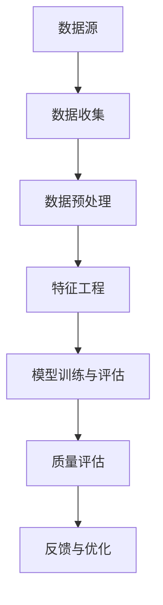
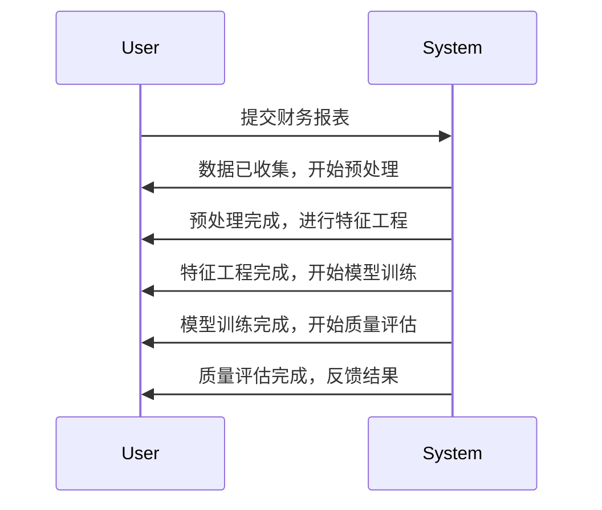

                 

### 文章标题

# AI驱动的企业财务报表质量评估系统

### 关键词

- AI
- 企业财务报表
- 质量评估
- 数据分析
- 机器学习

### 摘要

本文将深入探讨如何利用人工智能技术构建一个高效的企业财务报表质量评估系统。文章首先介绍了企业财务报表的质量评估背景和重要性，然后详细阐述了系统设计的基本原理、核心算法以及系统架构。通过实例分析和最佳实践，本文将帮助读者理解如何将AI技术应用于财务报表质量评估，提升企业财务管理效率。

## 目录

### 引言

1. 财务报表质量评估的重要性
2. 传统财务报表质量评估的局限性
3. AI在财务报表质量评估中的应用潜力

### 第1章：企业财务报表质量评估的背景和需求

1.1 核心概念术语说明

| 核心概念 | 说明 |
| --- | --- |
| 财务报表 | 企业在一定时期内的经济活动结果和财务状况的反映 |
| 质量评估 | 对财务报表的准确性、完整性、及时性等质量指标的衡量 |
| AI | 人工智能，指使计算机系统能够模拟、延伸和扩展人类的智能活动 |

1.2 问题背景与描述

- 财务报表质量评估存在的问题
- 财务报表质量评估的重要性

1.3 问题解决与边界外延

- 利用AI进行财务报表质量评估的可行性
- 质量评估系统应具备的功能与性能

1.4 概念结构与核心要素组成

### 第2章：AI驱动的财务报表质量评估系统核心概念与联系

2.1 AI驱动的财务报表质量评估系统的核心概念

- 数据收集与预处理
- 特征工程
- 模型训练与评估
- 质量评估与反馈

2.2 概念属性特征对比表格

| 概念       | 特征 |
| --- | --- |
| 数据收集   | 自动化、高效率 |
| 特征工程   | 可解释性、针对性 |
| 模型训练   | 自适应、高效 |
| 质量评估   | 准确性、可靠性 |

2.3 ER实体关系图架构

```mermaid
erDiagram
    Customer ||--|{ Order }|-- User
    Product ||--|{ Sale }|-- Store
```

### 第3章：财务报表质量评估算法原理讲解

3.1 算法原理与Mermaid流程图


3.2 Python源代码实现

```python
# 数据预处理示例
def preprocess_data(data):
    # 数据清洗、缺失值处理、异常值检测等操作
    pass

# 特征工程示例
def feature_engineering(data):
    # 特征提取、特征选择等操作
    pass

# 模型训练示例
def train_model(data):
    # 模型训练操作，例如使用scikit-learn库
    pass

# 质量评估示例
def assess_quality(model, data):
    # 质量评估操作
    pass

# 反馈与优化示例
def feedback_and_optimization(model, data):
    # 根据评估结果进行模型优化
    pass
```

3.3 算法原理的数学模型与公式

$$
\text{准确率} = \frac{\text{正确识别的样本数}}{\text{总样本数}} \times 100\%
$$

### 第4章：系统分析与架构设计方案

4.1 问题场景介绍

- 企业财务管理中的财务报表质量评估需求
- 系统目标与功能

4.2 项目介绍

- 项目名称与背景
- 项目目标与预期成果

4.3 系统功能设计

- 数据收集模块
- 数据预处理模块
- 特征工程模块
- 模型训练与评估模块
- 质量评估与反馈模块

4.4 系统架构设计



4.5 系统接口设计与交互



### 第5章：项目实战

5.1 环境安装与配置

- Python环境搭建
- 依赖库安装

5.2 系统核心实现源代码

```python
# 数据收集模块代码
# 数据预处理模块代码
# 特征工程模块代码
# 模型训练模块代码
# 质量评估模块代码
```

5.3 代码应用解读与分析

- 数据收集模块详解
- 数据预处理模块详解
- 特征工程模块详解
- 模型训练模块详解
- 质量评估模块详解

5.4 实际案例分析与详细讲解

- 案例背景
- 案例分析与代码实现
- 案例结果解读

5.5 项目小结

- 项目成果总结
- 项目不足与改进方向

### 第6章：最佳实践与注意事项

6.1 最佳实践

- 数据收集与预处理技巧
- 特征工程最佳实践
- 模型训练与评估技巧

6.2 注意事项

- 系统性能优化
- 数据安全与隐私保护

### 第7章：小结与未来展望

7.1 小结

- 系统设计的核心要素
- 项目实施的主要成果

7.2 未来展望

- AI在财务报表质量评估中的发展趋势
- 未来研究方向与挑战

### 作者信息

- 作者：AI天才研究院/AI Genius Institute & 禅与计算机程序设计艺术 /Zen And The Art of Computer Programming

以上是根据文章目录大纲结构，设计的《AI驱动的企业财务报表质量评估系统》的文章框架和部分内容。接下来，我们将逐一填充和详细讲解每个章节的内容，以满足文章字数和完整性要求。请注意，为了保持文章的连贯性和专业性，每个章节的具体内容需要进一步深化和扩展。在编写过程中，可以适当参考现有文献和技术资料，确保内容的准确性和权威性。最后，文章将以完整的结构、详实的分析和深入的见解结束，为读者提供全面的技术指导。

