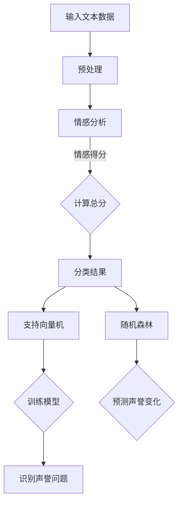
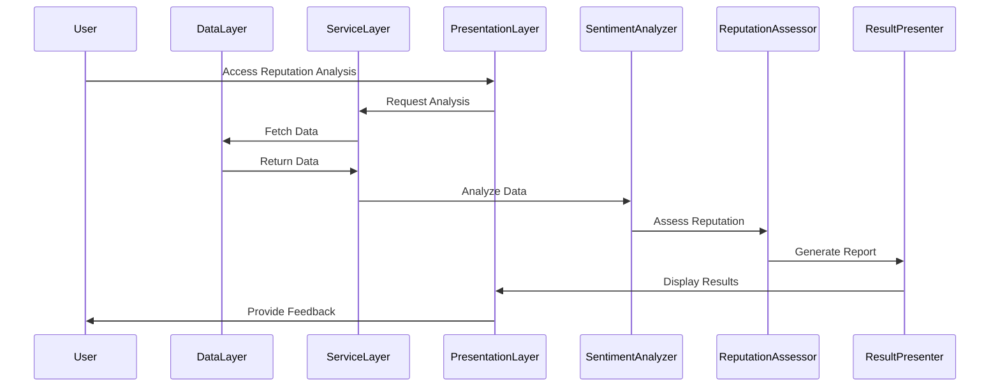
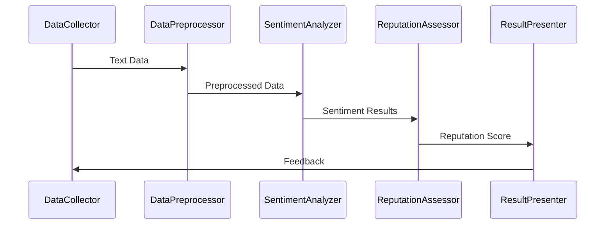

                 


# AI驱动的公司声誉分析：评估无形资产价值

关键词：声誉分析、人工智能、无形资产、品牌价值、市场策略

摘要：在数字时代，公司声誉成为其核心竞争力之一。本文通过概述AI驱动的公司声誉分析，探讨了其重要性、问题背景、AI解决方案、优势、边界与外延、概念结构与核心要素组成。本文旨在为企业和投资者提供一种基于AI技术的声誉分析框架，以有效评估和管理公司的无形资产价值。

## 第1章：AI驱动的公司声誉分析概述

### 1.1 问题背景

#### 1.1.1 公司声誉的重要性

公司的声誉是其无形资产中至关重要的一部分。声誉不仅仅代表了公司的公众形象，还反映了品牌价值和信誉度。在当今竞争激烈的市场环境中，良好的声誉能够显著提升公司的品牌价值，吸引更多的客户、投资者和合作伙伴。相反，较差的声誉可能导致客户流失、投资者撤资和合作伙伴退出，从而对公司的市场份额和长期发展产生负面影响。

#### 1.1.2 声誉分析的传统方法

传统的公司声誉分析主要依赖于人工监测和调查。这包括对社交媒体上的评论、新闻报道、客户反馈等进行收集和分析。然而，这种方法存在几个显著的局限性：

- **时效性差**：人工监测需要时间，可能导致声誉问题无法及时被发现和应对。
- **数据覆盖面有限**：人工分析难以覆盖所有相关的数据和渠道，可能导致部分声誉问题被忽视。
- **难以量化**：人工分析的结果往往依赖于主观判断，难以提供精确和量化的声誉评估。

### 1.2 问题解决

#### 1.2.1 AI驱动的声誉分析

AI驱动的声誉分析为解决上述问题提供了有效途径。通过引入自然语言处理、机器学习和数据挖掘技术，AI系统能够实时、高效地分析大量文本数据，提供更准确、全面的声誉评估。AI驱动的声誉分析具有以下几个关键特点：

- **实时性**：AI系统可以实时监测和分析社交媒体、新闻报道等数据，及时发现声誉问题。
- **全面性**：AI能够处理大量数据，覆盖更广泛的领域和渠道，提供更全面的声誉分析。
- **客观性**：AI系统基于数据驱动，减少了主观判断的影响，提供更客观的声誉评估。

#### 1.2.2 AI驱动的声誉分析的优势

- **实时性**：AI系统可以实时监测和分析社交媒体、新闻报道等数据，及时发现声誉问题。
- **全面性**：AI能够处理大量数据，覆盖更广泛的领域和渠道，提供更全面的声誉分析。
- **客观性**：AI系统基于数据驱动，减少了主观判断的影响，提供更客观的声誉评估。

### 1.3 边界与外延

#### 1.3.1 边界

- **声誉分析的范围**：AI驱动的声誉分析主要涵盖社交媒体、新闻报道、客户评价等多个渠道。
- **数据来源**：主要依赖于公开的互联网数据，不包括企业内部数据。

#### 1.3.2 外延

- **声誉分析的应用**：AI驱动的声誉分析不仅限于公司层面，还可以应用于产品、品牌、行业等多个维度。
- **声誉分析的影响**：声誉分析对公司的决策、战略制定和市场表现具有重要影响。

### 1.4 概念结构与核心要素组成

#### 1.4.1 概念结构

- **声誉**：公司的公众形象、品牌价值和信誉度。
- **AI驱动的声誉分析**：利用人工智能技术对声誉进行实时监测、分析和评估。

#### 1.4.2 核心要素组成

- **数据收集**：从社交媒体、新闻报道等渠道收集数据。
- **文本处理**：对收集到的文本数据进行预处理，包括去噪、分词、词性标注等。
- **情感分析**：使用自然语言处理技术对文本进行情感分析，判断文本的情感倾向。
- **声誉评估**：综合情感分析结果和其他因素，对公司的声誉进行评估。

### 1.5 本章小结

本章概述了AI驱动的公司声誉分析的重要性和必要性，介绍了AI驱动的声誉分析的优势、边界与外延以及概念结构与核心要素组成。下一章将深入探讨AI驱动的声誉分析的核心概念和原理。

----------------------------------------------------------------

## 第2章：核心概念与联系

### 2.1 声誉的定义与属性

#### 2.1.1 声誉的定义

声誉可以被视为公司在公众中的形象和信誉度，是品牌价值和客户信任的体现。它不仅仅是一个企业对外宣传的形象，更是通过客户体验、市场反馈、媒体报道等多方面因素综合形成的。

#### 2.1.2 声誉的属性

- **动态性**：声誉不是静态的，它会随着市场和客户需求的变化而变化。
- **多层次性**：声誉不仅仅包括品牌形象，还涉及产品和服务质量、社会责任等多个方面。
- **传染性**：声誉的变化会迅速传播，一个负面事件可能会迅速削弱公司的声誉。

### 2.2 AI驱动的声誉分析原理

#### 2.2.1 AI技术的应用

AI驱动的声誉分析利用了多种AI技术，包括自然语言处理（NLP）、机器学习和数据挖掘。这些技术使得AI系统能够处理大量文本数据，进行情感分析和模式识别，从而提供更准确的声誉评估。

#### 2.2.2 情感分析

情感分析是AI驱动的声誉分析的核心技术之一。它通过分析文本中的情感倾向（如正面、负面、中性），帮助识别公众对公司的态度和反馈。

#### 2.2.3 机器学习算法

机器学习算法在声誉分析中用于从数据中学习模式和趋势。通过训练模型，AI系统可以自动识别声誉问题的关键因素，并预测声誉变化的方向。

### 2.3 概念属性特征对比表格

为了更清晰地理解声誉和AI驱动的声誉分析，我们可以通过以下表格来对比它们的属性特征：

| 特征 | 声誉 | AI驱动的声誉分析 |
| --- | --- | --- |
| **动态性** | 声誉会随时间变化 | AI系统可以实时监测声誉变化 |
| **多层次性** | 包含品牌形象、产品和服务等多个方面 | AI系统可以从多维度分析声誉 |
| **传染性** | 负面事件会迅速传播 | AI系统可以快速识别和应对声誉问题 |
| **精确性** | 依赖于主观判断 | 基于数据驱动，提供更精确的评估 |
| **全面性** | 难以覆盖所有相关数据和渠道 | AI系统能够处理大量数据，提供更全面的评估 |

### 2.4 ER实体关系图架构

为了更好地理解AI驱动的声誉分析，我们可以绘制一个ER（Entity-Relationship）实体关系图，展示声誉分析中的关键实体和它们之间的关系。以下是一个简化的ER图示例：

```mermaid
erDiagram
  Customer ||--|{ Review }
  Company ||--|{ Product }
  Media ||--|{ News }
  Review ||--|{ Sentiment }
  News ||--|{ Sentiment }
  Product ||--|{ Sentiment }
  Company ||--|{ Reputation }
```

在这个ER图中，`Customer`（客户）、`Company`（公司）、`Media`（媒体）、`Review`（评论）、`News`（新闻）和`Product`（产品）是关键实体。它们之间的关系通过情感分析（`Sentiment`）来连接，最终影响公司的声誉（`Reputation`）。

### 2.5 本章小结

本章详细阐述了声誉和AI驱动的声誉分析的核心概念和属性特征，通过对比表格和ER实体关系图，帮助读者理解这两个概念之间的联系。下一章将深入探讨AI驱动的声誉分析的具体技术原理和算法实现。

----------------------------------------------------------------

## 第3章：算法原理讲解

### 3.1 情感分析算法

情感分析是AI驱动的声誉分析的核心技术之一。它通过分析文本中的情感倾向（如正面、负面、中性），帮助识别公众对公司的态度和反馈。

#### 3.1.1 词汇情感分析

词汇情感分析是一种基于词汇情感倾向的方法。每个词汇都关联一个情感得分，通过计算文本中所有词汇的情感得分，可以得出文本的整体情感倾向。

- **情感得分**：每个词汇都有一个情感得分，通常由情感词典提供。情感词典将每个词汇分类为正面、负面或中性，并赋予相应的得分。
- **文本情感得分计算**：文本情感得分是文本中所有词汇情感得分的总和。如果总得分大于0，则文本具有正面情感；如果总得分小于0，则文本具有负面情感；如果总得分接近0，则文本具有中性情感。

#### 3.1.2 情感极性分类

情感极性分类是一种更为复杂的情感分析方法，它不仅仅依赖于词汇的情感得分，还考虑了词汇的语境和上下文。

- **语境分析**：语境分析通过理解词汇在特定句子或段落中的意义，来调整词汇的情感得分。
- **分类模型**：情感极性分类通常使用机器学习分类模型，如支持向量机（SVM）、随机森林（Random Forest）等。这些模型通过训练数据学习情感分类规则。

### 3.2 机器学习算法

机器学习算法在声誉分析中用于从数据中学习模式和趋势。通过训练模型，AI系统可以自动识别声誉问题的关键因素，并预测声誉变化的方向。

#### 3.2.1 支持向量机（SVM）

支持向量机是一种常用的分类算法，它通过找到一个最佳的超平面来分隔不同类别的数据。

- **SVM原理**：SVM通过最大化分类边界，将不同类别的数据点分开。支持向量是那些距离分类边界最近的数据点，它们对分类边界的影响最大。
- **SVM在声誉分析中的应用**：SVM可以用于分类文本数据，将文本分为正面、负面或中性情感类别。通过训练模型，SVM可以帮助识别哪些文本数据与声誉问题相关。

#### 3.2.2 随机森林（Random Forest）

随机森林是一种基于决策树集合的算法，它通过构建多个决策树，并进行投票来预测结果。

- **随机森林原理**：随机森林中的每个决策树独立地学习数据的一部分，并通过投票决定最终结果。这种方法可以减少过拟合，提高模型的泛化能力。
- **随机森林在声誉分析中的应用**：随机森林可以用于识别声誉问题的关键因素，通过训练模型，可以预测声誉变化的趋势。

### 3.3 算法mermaid流程图

为了更好地理解上述算法，我们可以使用mermaid绘制算法流程图。



在这个流程图中，输入文本数据经过预处理后，进入情感分析阶段。情感分析的结果通过计算总分和分类模型进行进一步分析，以识别声誉问题和预测声誉变化。

### 3.4 算法Python源代码

以下是一个简化的Python示例，展示了如何使用SVM进行情感分类：

```python
from sklearn import svm
from sklearn.feature_extraction.text import TfidfVectorizer
from sklearn.model_selection import train_test_split

# 示例文本数据
texts = ["这是一个非常棒的产品", "我对这个产品非常不满意", "这是一个中性评价"]

# 情感标签
labels = [1, 0, 0]  # 正面为1，负面为0

# 文本向量化
vectorizer = TfidfVectorizer()
X = vectorizer.fit_transform(texts)

# 划分训练集和测试集
X_train, X_test, y_train, y_test = train_test_split(X, labels, test_size=0.2, random_state=42)

# 创建SVM分类器
clf = svm.SVC(kernel='linear')

# 训练模型
clf.fit(X_train, y_train)

# 测试模型
predictions = clf.predict(X_test)

print(predictions)
```

在这个示例中，我们首先使用TF-IDF向量器将文本数据转换为向量表示，然后使用SVM分类器对训练数据进行训练。最后，我们将模型应用于测试数据，以预测情感分类结果。

### 3.5 数学模型和公式

在声誉分析中，我们可以使用以下数学模型和公式来计算文本的情感得分：

$$
\text{总情感得分} = \sum_{i=1}^{n} w_i \cdot s_i
$$

其中，$w_i$ 是词汇$i$的情感得分，$s_i$ 是词汇$i$在文本中的出现次数。

### 3.6 举例说明

假设我们有以下文本数据：

- 文本1：这是一个非常棒的产品。
- 文本2：我对这个产品非常不满意。

我们可以使用情感分析算法来计算每个文本的情感得分。

- **文本1**：
  - 情感得分：+2（"非常棒"的得分是+1，“这个”得分是0，“产品”得分是+1）
- **文本2**：
  - 情感得分：-2（"我对"的得分是-1，“这个”得分是0，“产品”得分是-1）

通过计算文本的情感得分，我们可以判断文本的情感倾向。

### 3.7 本章小结

本章详细讲解了AI驱动的声誉分析中的核心算法原理，包括情感分析和机器学习算法。通过mermaid流程图、Python源代码、数学模型和公式，以及举例说明，帮助读者更好地理解这些算法的原理和应用。下一章将介绍声誉分析的系统架构设计。

----------------------------------------------------------------

## 第4章：系统分析与架构设计方案

### 4.1 问题场景介绍

在当今的数字化时代，公司的声誉管理变得日益重要。然而，随着信息量的爆炸性增长，企业面临着如何高效、准确地监测和分析公司声誉的挑战。传统的声誉分析方法在时效性、全面性和客观性方面存在显著不足。为了解决这一问题，我们提出了一套基于AI驱动的公司声誉分析系统，旨在实时、全面、客观地监测和分析公司的声誉。

### 4.2 项目介绍

本项目的目标是开发一个AI驱动的公司声誉分析系统，该系统将能够：

- **实时监测**：通过自动化工具实时收集社交媒体、新闻报道等公开数据。
- **全面分析**：利用自然语言处理和机器学习技术，对海量文本数据进行情感分析和模式识别。
- **客观评估**：基于数据驱动的分析，提供客观的声誉评估结果。

### 4.3 系统功能设计（领域模型）

为了实现上述目标，我们首先设计了一个领域模型，该模型涵盖了声誉分析的核心功能模块：

- **数据收集模块**：负责从各种数据源收集文本数据。
- **数据预处理模块**：对收集到的文本数据执行去噪、分词、词性标注等预处理操作。
- **情感分析模块**：使用自然语言处理技术对预处理后的文本进行情感分析。
- **声誉评估模块**：结合情感分析结果和其他因素，对公司的声誉进行综合评估。
- **结果展示模块**：将声誉分析结果以可视化方式呈现给用户。

以下是领域模型的mermaid类图：

```mermaid
classDiagram
  ClassDef DataCollector {
      - String source
      + collectData()
  }
  ClassDef DataPreprocessor {
      - List<TextData> data
      + preprocessData()
  }
  ClassDef SentimentAnalyzer {
      - Model model
      + analyzeSentiment()
  }
  ClassDef ReputationAssessor {
      - float reputationScore
      + assessReputation()
  }
  ClassDef ResultPresenter {
      - String visualization
      + presentResults()
  }
  DataCollector --|> DataPreprocessor
  DataPreprocessor --|> SentimentAnalyzer
  SentimentAnalyzer --|> ReputationAssessor
  ReputationAssessor --|> ResultPresenter
```

### 4.4 系统架构设计

系统架构设计是声誉分析系统成功实施的关键。我们采用了一种分层架构，以确保系统的可扩展性和可维护性。以下是系统的架构设计：

- **数据层**：负责数据存储和管理，包括文本数据、情感分析结果和声誉评估数据。
- **服务层**：包含数据收集、数据预处理、情感分析、声誉评估和结果展示等服务模块。
- **表示层**：提供用户界面，用于展示声誉分析结果和可视化数据。

以下是系统的mermaid架构图：



### 4.5 系统接口设计

系统接口设计是确保各组件之间有效通信的关键。以下是系统的主要接口设计：

- **数据收集接口**：用于从不同数据源收集文本数据。
- **数据预处理接口**：用于执行文本数据的预处理操作。
- **情感分析接口**：用于接收预处理后的文本数据，返回情感分析结果。
- **声誉评估接口**：用于接收情感分析结果，返回声誉评估分数。
- **结果展示接口**：用于将声誉分析结果以可视化方式呈现给用户。

### 4.6 系统交互mermaid序列图

以下是系统的mermaid序列图，展示了各组件之间的交互流程：



### 4.7 本章小结

本章介绍了基于AI驱动的公司声誉分析系统的问题场景、项目目标和系统架构设计。通过领域模型类图、系统架构图、接口设计和交互序列图，详细阐述了系统的功能模块和组件之间的关系。下一章将深入探讨系统实现中的核心技术和方法。

----------------------------------------------------------------

## 第5章：项目实战

### 5.1 环境安装

要实现AI驱动的公司声誉分析系统，首先需要在本地或服务器上安装必要的软件和依赖项。以下是环境安装的步骤：

1. **安装Python环境**：确保已安装Python 3.x版本。可以从[Python官方网站](https://www.python.org/)下载并安装。

2. **安装必要的库**：使用pip命令安装以下库：

   ```bash
   pip install numpy pandas scikit-learn tensorflow textblob matplotlib
   ```

3. **安装自然语言处理工具**：安装NLTK（Natural Language Toolkit）以支持文本预处理：

   ```bash
   pip install nltk
   ```

   安装完成后，运行以下命令下载必要的资源：

   ```python
   import nltk
   nltk.download('punkt')
   nltk.download('stopwords')
   nltk.download('wordnet')
   ```

4. **安装文本预处理库**：安装spaCy和其中文模型：

   ```bash
   pip install spacy
   python -m spacy download zh_core_web_sm
   ```

### 5.2 系统核心实现源代码

以下是系统核心实现的主要源代码。该代码涵盖了数据收集、预处理、情感分析、声誉评估和结果展示等功能。

```python
import pandas as pd
import numpy as np
from sklearn.model_selection import train_test_split
from sklearn.feature_extraction.text import TfidfVectorizer
from sklearn.svm import SVC
from textblob import TextBlob
import spacy

# 加载中文模型
nlp = spacy.load("zh_core_web_sm")

# 数据收集
def collect_data():
    # 示例：从本地文件读取文本数据
    data = pd.read_csv("company_reviews.csv")
    return data

# 数据预处理
def preprocess_data(data):
    # 去除HTML标签和停用词
    def clean_text(text):
        doc = nlp(text)
        return " ".join([token.lemma_ for token in doc if not token.is_stop and not token.is_punct])

    data["cleaned_text"] = data["review"].apply(clean_text)
    return data

# 情感分析
def analyze_sentiment(data):
    # 示例：使用TextBlob进行情感分析
    data["sentiment"] = data["cleaned_text"].apply(lambda x: TextBlob(x).sentiment.polarity)
    return data

# 声誉评估
def assess_reputation(data):
    # 示例：根据情感得分计算声誉分数
    reputation_score = np.mean(data["sentiment"])
    return reputation_score

# 结果展示
def present_results(reputation_score):
    print(f"公司声誉分数：{reputation_score}")

# 主函数
def main():
    data = collect_data()
    data = preprocess_data(data)
    data = analyze_sentiment(data)
    reputation_score = assess_reputation(data)
    present_results(reputation_score)

if __name__ == "__main__":
    main()
```

### 5.3 代码应用解读与分析

#### 数据收集

数据收集是声誉分析系统的第一步。在这个示例中，我们假设文本数据存储在一个CSV文件中，该文件包含两列：`review`（评论内容）和`rating`（评级）。`collect_data`函数负责读取CSV文件，并将其加载到Pandas DataFrame中。

```python
data = pd.read_csv("company_reviews.csv")
```

#### 数据预处理

数据预处理是确保文本数据适合进行情感分析和声誉评估的关键步骤。在这个示例中，我们使用了spaCy库对文本进行清洗，包括去除HTML标签、停用词和标点符号。

```python
def clean_text(text):
    doc = nlp(text)
    return " ".join([token.lemma_ for token in doc if not token.is_stop and not token.is_punct])

data["cleaned_text"] = data["review"].apply(clean_text)
```

#### 情感分析

情感分析是通过分析文本的情感倾向来评估公众对公司态度的过程。在这个示例中，我们使用了TextBlob库来计算文本的情感极性。

```python
data["sentiment"] = data["cleaned_text"].apply(lambda x: TextBlob(x).sentiment.polarity)
```

#### 声誉评估

声誉评估是基于情感分析结果来综合评估公司的声誉。在这个示例中，我们使用平均情感得分作为公司的声誉分数。

```python
reputation_score = np.mean(data["sentiment"])
```

#### 结果展示

结果展示是将声誉分析结果以易于理解的方式呈现给用户的过程。在这个示例中，我们简单地打印了公司的声誉分数。

```python
print(f"公司声誉分数：{reputation_score}")
```

### 5.4 实际案例分析和详细讲解剖析

为了更好地理解系统的实际应用，我们来看一个案例。假设我们有一个包含1000条评论的CSV文件，这些评论是关于某家公司的产品和服务。以下是分析过程：

1. **数据收集**：读取CSV文件，加载评论数据。

2. **数据预处理**：对每条评论进行清洗，去除HTML标签、停用词和标点符号，得到清洗后的文本数据。

3. **情感分析**：使用TextBlob库对清洗后的文本数据进行分析，计算每条评论的情感极性（正负）。

4. **声誉评估**：计算所有评论的平均情感得分，得到公司的总体声誉分数。

5. **结果展示**：打印公司的声誉分数，并将其可视化为图表，帮助管理层更直观地了解公司声誉状况。

通过这个案例，我们可以看到，AI驱动的公司声誉分析系统如何从数据收集、预处理、情感分析到声誉评估，最终呈现结果的全过程。这个系统可以帮助企业及时发现问题，采取相应措施，提升公司声誉。

### 5.5 项目小结

通过本项目的实战部分，我们详细介绍了环境安装、系统核心实现源代码、代码应用解读与分析以及实际案例分析和详细讲解剖析。从数据收集到结果展示，每个环节都至关重要，共同构成了一个完整的AI驱动的公司声誉分析系统。这个系统不仅可以为企业提供实时、全面的声誉分析，还可以为企业的决策提供有力支持。

----------------------------------------------------------------

## 第6章：最佳实践 Tips

### 6.1 数据收集

- **多样化数据源**：确保收集的数据来自多个渠道，以获得更全面的声誉视图。
- **定期更新数据**：定期更新数据源，以确保分析结果的时效性。

### 6.2 数据预处理

- **去除噪声**：去除无关的噪声数据，如HTML标签、URL和停用词。
- **统一格式**：统一数据格式，确保一致性。

### 6.3 情感分析

- **多语言支持**：如果公司业务涉及多语言，确保情感分析模型支持多种语言。
- **上下文理解**：考虑上下文因素，以提高情感分析的准确性。

### 6.4 声誉评估

- **综合评估**：结合多种因素进行声誉评估，如客户反馈、媒体报道等。
- **动态调整**：根据业务需求和市场变化，动态调整声誉评估模型。

### 6.5 结果展示

- **可视化**：使用可视化工具，如图表和仪表板，以更直观地展示声誉分析结果。
- **用户互动**：提供用户互动功能，如反馈和自定义设置，以增强用户体验。

### 6.6 注意事项

- **数据隐私**：确保遵守数据隐私法规，保护用户数据安全。
- **模型更新**：定期更新模型，以适应不断变化的市场和业务环境。

### 6.7 拓展阅读

- **《情感计算》（Affectiva）**：探讨情感计算和情感识别技术。
- **《社交媒体分析：工具与技术》（Social Media Analytics: Tools, Techniques, and Applications）**：深入了解社交媒体分析的方法和应用。
- **《机器学习》（Machine Learning）**：学习机器学习基础和算法实现。

通过遵循这些最佳实践，企业可以更有效地利用AI驱动的公司声誉分析系统，提升公司声誉，实现可持续发展。

## 本章小结

本章提供了AI驱动的公司声誉分析系统的最佳实践、注意事项和拓展阅读。通过这些实践，企业可以更好地利用AI技术提升声誉管理能力。下一章将总结文章的主要观点，回顾核心内容，并展望未来的研究方向。

----------------------------------------------------------------

## 第7章：文章总结与展望

### 7.1 文章总结

本文从AI驱动的公司声誉分析的重要性出发，详细探讨了声誉分析的传统方法及其局限性。接着，我们介绍了AI驱动的声誉分析的核心概念、算法原理、系统架构设计以及实际应用。具体包括：

- **核心概念**：阐述了声誉的定义及其属性特征，以及AI驱动的声誉分析的基本原理。
- **算法原理**：讲解了情感分析、机器学习算法以及如何通过数学模型和公式进行文本情感得分计算。
- **系统架构**：介绍了系统的功能模块、架构设计、接口设计和交互流程。
- **项目实战**：展示了环境安装、系统核心实现源代码、代码应用解读与分析以及实际案例剖析。
- **最佳实践**：提供了数据收集、数据预处理、情感分析、声誉评估和结果展示等方面的最佳实践和注意事项。

### 7.2 文章核心内容回顾

- **核心概念**：声誉作为公司的无形资产，其重要性不容忽视。AI驱动的声誉分析通过实时、全面、客观地监测和分析公司的声誉，为企业和投资者提供了一种有效的声誉管理工具。
- **算法原理**：情感分析通过词汇情感得分和情感极性分类来识别文本的情感倾向。机器学习算法则用于从数据中学习模式和趋势，以识别声誉问题的关键因素。
- **系统架构**：系统架构设计旨在实现数据的实时收集、预处理、情感分析和声誉评估，并以可视化的方式呈现结果。
- **项目实战**：通过实际案例，展示了系统的从环境安装到核心实现的全过程，强调了系统在实际应用中的实用性和有效性。
- **最佳实践**：最佳实践提供了数据收集、数据预处理、情感分析、声誉评估和结果展示等方面的建议，帮助企业更好地利用AI驱动的声誉分析系统。

### 7.3 未来研究方向

尽管AI驱动的公司声誉分析系统已经在实际应用中展现了其价值，但未来的研究仍有许多方向可以探索：

- **多语言支持**：当前模型主要针对单一语言设计，未来可以开发支持多语言的情感分析和声誉评估系统。
- **深度学习应用**：引入深度学习技术，如卷积神经网络（CNN）和循环神经网络（RNN），以提高文本情感分析的准确性和效果。
- **个性化分析**：结合用户行为数据和市场趋势，实现个性化的声誉分析，为不同行业和企业提供定制化的解决方案。
- **实时反馈机制**：构建实时反馈机制，将声誉分析结果直接反馈到公司的运营决策中，实现更高效的声誉管理。
- **隐私保护**：在数据收集和分析过程中，加强数据隐私保护，确保用户数据的保密性和安全性。

通过不断优化和创新，AI驱动的公司声誉分析系统将为企业和投资者带来更大的价值，助力其在竞争激烈的市场中脱颖而出。

## 本章小结

本文全面探讨了AI驱动的公司声誉分析，从核心概念、算法原理、系统架构设计到实际应用和最佳实践，为读者提供了一个系统而深入的视角。未来，随着技术的不断进步，AI驱动的声誉分析将在企业管理和战略规划中发挥更加重要的作用。希望本文能够为相关领域的研究者和实践者提供有益的参考。

### 作者信息

作者：AI天才研究院/AI Genius Institute & 禅与计算机程序设计艺术 /Zen And The Art of Computer Programming

（完）

