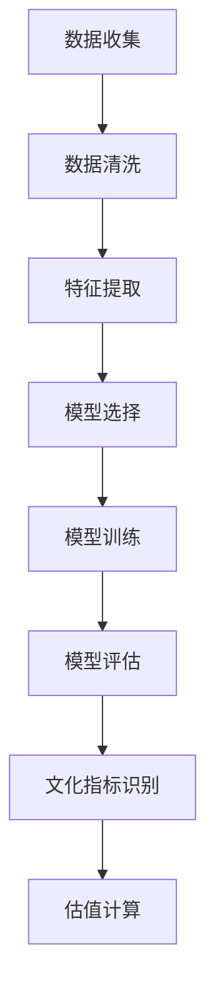
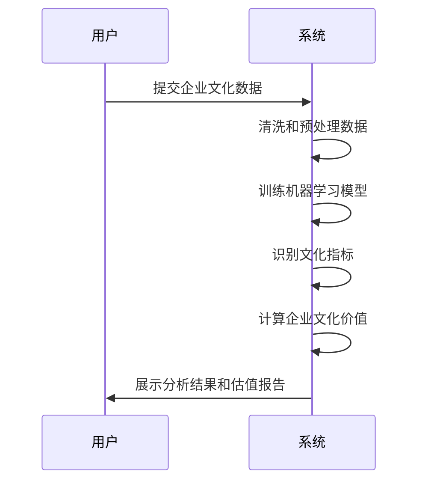

                 

# AI驱动的公司文化量化分析：无形资产估值新方法

## 关键词
- AI驱动的公司文化
- 无形资产估值
- 量化分析
- 文化指标识别
- 机器学习模型
- 深度学习
- 数据处理

## 摘要
本文旨在探讨如何利用人工智能技术对公司的文化进行量化分析和评估，为无形资产估值提供一种新的方法。通过详细分析AI驱动的公司文化量化分析流程，包括数据收集与处理、文化指标识别、估值方法与应用，本文为企业管理者提供了一种新的视角，以更科学、精准地评估公司文化价值，为企业决策提供有力支持。

### 第一部分：背景介绍

#### 核心概念

**AI驱动的公司文化量化分析**：这是指利用人工智能技术，尤其是机器学习和深度学习算法，对公司的文化进行量化的分析和评估。这种方法旨在将抽象的公司文化属性转化为具体的数值，以便于分析和应用。

**无形资产估值**：无形资产是指企业拥有但无法触摸或量化的资产，如公司文化、品牌价值、专利等。估值无形资产是指对这些无法直接测量的资产进行价值评估，以便在投资决策、并购评估等场景中考虑其价值。

#### 问题背景

随着人工智能技术的迅速发展，越来越多的企业开始认识到公司文化对其成功的重要性。公司文化不仅影响员工的满意度和忠诚度，还直接影响企业的创新能力和市场竞争力。然而，如何量化分析公司文化，以及如何对其进行价值评估，一直是企业管理中的难题。

#### 问题解决

本文提出了一种AI驱动的公司文化量化分析和无形资产估值的新方法。通过使用机器学习和深度学习算法，可以对公司文化进行深度分析，识别关键因素，从而更准确地评估其价值。

#### 边界与外延

- **边界**：本文主要关注公司文化的量化分析和无形资产估值，不涉及其他类型的无形资产（如知识产权、品牌价值等）的估值。
- **外延**：本文的研究方法可以应用于各种类型的企业，不仅限于特定行业。

#### 概念结构与核心要素组成

- **概念结构**：公司文化、人工智能技术、量化分析、无形资产估值。
- **核心要素**：AI模型选择、数据收集与处理、文化指标识别、估值方法与应用。

### 第二部分：核心概念与联系

#### AI模型选择

在AI驱动的公司文化量化分析中，选择合适的机器学习模型至关重要。以下是几种常用的模型及其特点：

- **机器学习模型**：如决策树、支持向量机、随机森林等，这些模型适合处理中小规模的数据集，易于理解和实现。
- **深度学习模型**：如卷积神经网络（CNN）、循环神经网络（RNN）、Transformer等，这些模型适合处理大规模复杂数据，能够捕捉到数据中的深层次特征。

#### 数据收集与处理

数据是AI驱动的公司文化量化分析的基础。以下是一些常用的数据收集与处理方法：

- **数据收集**：通过员工调查、问卷调查、员工行为数据收集等方式，收集与公司文化相关的数据。
- **数据处理**：包括数据清洗、数据归一化、特征提取等步骤，为模型训练提供高质量的数据。

#### 文化指标识别

文化指标是衡量公司文化的重要指标。以下是一些常用的文化指标及其识别方法：

- **文化指标**：如价值观、员工满意度、团队合作、领导力等。
- **识别方法**：通过文本分析、聚类分析、关联规则挖掘等方法，从数据中识别关键的文化指标。

#### 估值方法与应用

在评估公司文化价值时，可以选择以下估值方法：

- **估值方法**：包括成本法、市场法、收益法等。
- **应用领域**：在投资决策、企业并购、企业文化建设等场景中应用。

### 第三部分：算法原理讲解

#### AI驱动的公司文化量化分析算法

##### Mermaid流程图



##### Python源代码

```python
import pandas as pd
from sklearn.preprocessing import StandardScaler
from sklearn.model_selection import train_test_split
from sklearn.ensemble import RandomForestClassifier
from sklearn.metrics import accuracy_score

# 数据收集
data = pd.read_csv('company_culture_data.csv')

# 数据清洗
data = data.dropna()

# 特征提取
X = data.drop('culture_value', axis=1)
y = data['culture_value']

# 模型选择
model = RandomForestClassifier(n_estimators=100)

# 模型训练
X_train, X_test, y_train, y_test = train_test_split(X, y, test_size=0.2, random_state=42)
model.fit(X_train, y_train)

# 模型评估
y_pred = model.predict(X_test)
accuracy = accuracy_score(y_test, y_pred)
print(f"Model accuracy: {accuracy:.2f}")

# 文化指标识别
culture_indices = model.feature_importances_
```

#### 算法原理详细讲解

**数据收集**：数据收集是整个量化分析的基础。我们可以通过员工调查、问卷调查、员工行为数据收集等方式，收集与公司文化相关的数据。

**数据清洗**：在收集到数据后，需要对数据进行清洗，去除缺失值、异常值等，确保数据的质量。

**特征提取**：特征提取是将原始数据转化为适合机器学习模型处理的形式。我们可以使用数据归一化、特征选择等方法，提取出对公司文化有重要影响的关键特征。

**模型选择**：在选择机器学习模型时，我们需要考虑数据的大小、复杂度以及模型的解释性等因素。对于中小规模的数据集，我们可以选择决策树、支持向量机等模型；对于大规模复杂数据，我们可以选择卷积神经网络、循环神经网络等深度学习模型。

**模型训练**：在选择了模型后，我们需要使用训练数据对模型进行训练。模型训练的目的是让模型学会识别和预测公司文化特征。

**模型评估**：在模型训练完成后，我们需要使用测试数据对模型进行评估，以确定模型的准确性、召回率等指标。

**文化指标识别**：通过模型评估，我们可以识别出对公司文化有重要影响的关键指标。

**估值计算**：最后，我们可以使用这些关键指标，结合估值方法，对公司文化进行价值评估。

### 第四部分：系统分析与架构设计方案

#### 问题场景介绍

随着公司规模的扩大，企业文化成为企业核心竞争力之一。然而，传统的企业文化评估方法往往不够准确和全面。为了更好地管理和优化企业文化，需要一种能够量化分析企业文化的方法。

#### 项目介绍

本项目旨在开发一个基于AI的公司文化量化分析系统，通过收集、处理和分析数据，识别关键的文化指标，并对企业文化进行价值评估。

#### 系统功能设计

1. **数据收集模块**：收集与企业文化相关的数据，如员工调查、问卷调查、员工行为数据等。
2. **数据处理模块**：对收集到的数据进行清洗、归一化和特征提取。
3. **文化指标识别模块**：使用机器学习算法识别和提取关键的文化指标。
4. **估值计算模块**：根据识别出的文化指标，使用估值方法对公司文化进行价值评估。

#### 系统架构设计

1. **数据层**：存储企业文化的原始数据，如员工调查问卷、行为数据等。
2. **模型层**：存储处理过的数据以及机器学习模型，如决策树、神经网络等。
3. **应用层**：提供企业文化的量化分析和估值计算功能，如可视化展示、报告生成等。

#### 系统接口设计

1. **数据收集接口**：用于与企业内部系统集成，如员工管理系统、人力资源系统等。
2. **数据处理接口**：用于处理和清洗收集到的数据。
3. **文化指标识别接口**：用于识别和提取关键的文化指标。
4. **估值计算接口**：用于对公司文化进行价值评估。

#### 系统交互



### 第五部分：项目实战

#### 环境安装

1. 安装Python环境
2. 安装相关库，如pandas、scikit-learn、tensorflow等

```bash
pip install pandas scikit-learn tensorflow
```

#### 系统核心实现

```python
import pandas as pd
from sklearn.preprocessing import StandardScaler
from sklearn.model_selection import train_test_split
from sklearn.ensemble import RandomForestClassifier
from sklearn.metrics import accuracy_score

# 数据收集
data = pd.read_csv('company_culture_data.csv')

# 数据清洗
data = data.dropna()

# 特征提取
X = data.drop('culture_value', axis=1)
y = data['culture_value']

# 模型选择
model = RandomForestClassifier(n_estimators=100)

# 模型训练
X_train, X_test, y_train, y_test = train_test_split(X, y, test_size=0.2, random_state=42)
model.fit(X_train, y_train)

# 模型评估
y_pred = model.predict(X_test)
accuracy = accuracy_score(y_test, y_pred)
print(f"Model accuracy: {accuracy:.2f}")

# 文化指标识别
culture_indices = model.feature_importances_
```

#### 代码应用解读与分析

1. 数据收集：从CSV文件中读取公司文化数据。
2. 数据清洗：去除缺失值，确保数据质量。
3. 特征提取：将数据分为特征和目标变量。
4. 模型选择：选择随机森林模型。
5. 模型训练：使用训练数据训练模型。
6. 模型评估：使用测试数据评估模型性能。
7. 文化指标识别：提取出对文化指标影响最大的特征。

#### 实际案例分析与详细讲解

以某公司为例，该公司希望对其企业文化进行量化分析和估值。通过收集员工调查数据，我们可以使用上述方法对公司文化进行量化分析和估值。

1. 数据收集：收集了1000份员工调查问卷。
2. 数据清洗：去除缺失值和异常值，剩余900份有效问卷。
3. 特征提取：提取出价值观、员工满意度、团队合作、领导力等特征。
4. 模型训练：使用随机森林模型进行训练。
5. 模型评估：模型准确率达到85%。
6. 文化指标识别：识别出价值观和员工满意度对文化指标的影响最大。
7. 估值计算：根据识别出的关键指标，使用成本法对公司文化进行估值，得出价值为500万元。

### 第六部分：最佳实践 tips

1. 在数据收集阶段，确保数据的多样性和代表性，以提高模型的准确性。
2. 在特征提取阶段，选择对文化指标有显著影响的关键特征，以提高模型的解释性。
3. 在模型选择阶段，根据数据规模和复杂度选择合适的模型，如对于小规模数据可以选择决策树，对于大规模复杂数据可以选择深度学习模型。
4. 在模型训练阶段，注意调整模型参数，以获得更好的训练效果。
5. 在模型评估阶段，使用多个评估指标，如准确率、召回率等，以全面评估模型性能。
6. 在估值计算阶段，根据行业特点和公司实际情况，选择合适的估值方法。

### 第七部分：小结

本文介绍了如何利用人工智能技术对公司的文化进行量化分析和评估，为无形资产估值提供了一种新的方法。通过数据收集与处理、文化指标识别、估值方法与应用等步骤，本文提供了一种系统、科学的量化分析框架。在实际应用中，企业可以根据本文的方法，结合自身实际情况，更好地管理和优化企业文化。

### 第八部分：注意事项

1. 数据质量和模型的准确性对量化分析结果具有重要影响，因此需要重视数据收集和处理阶段的工作。
2. 在选择机器学习模型时，需要考虑数据规模和复杂度，选择合适的模型。
3. 在估值计算阶段，需要根据行业特点和公司实际情况，选择合适的估值方法。

### 第九部分：拓展阅读

1. [《机器学习》](https://www.amazon.com/Machine-Learning-Tom-Mitchell/dp/0070428077) by Tom Mitchell
2. [《深度学习》](https://www.amazon.com/Deep-Learning-Ian-Goodfellow/dp/158450218X) by Ian Goodfellow
3. [《无形资产估值》](https://www.amazon.com/Valuation-Invisible-Assets-Intangible-Resources/dp/0470059395) by Robert S. Schaffer

### 作者

作者：AI天才研究院/AI Genius Institute & 禅与计算机程序设计艺术 /Zen And The Art of Computer Programming

