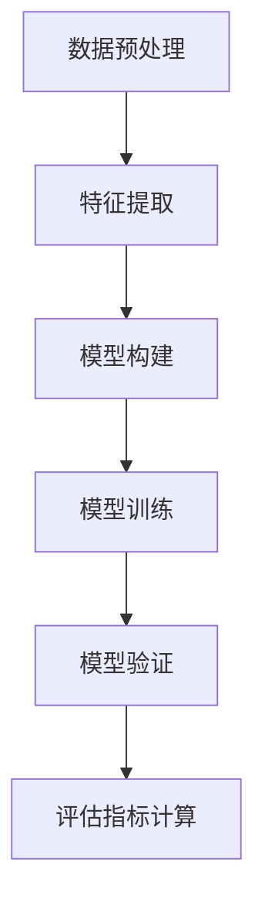
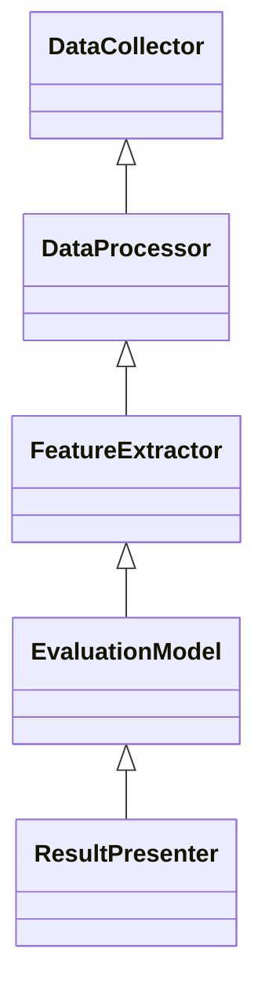
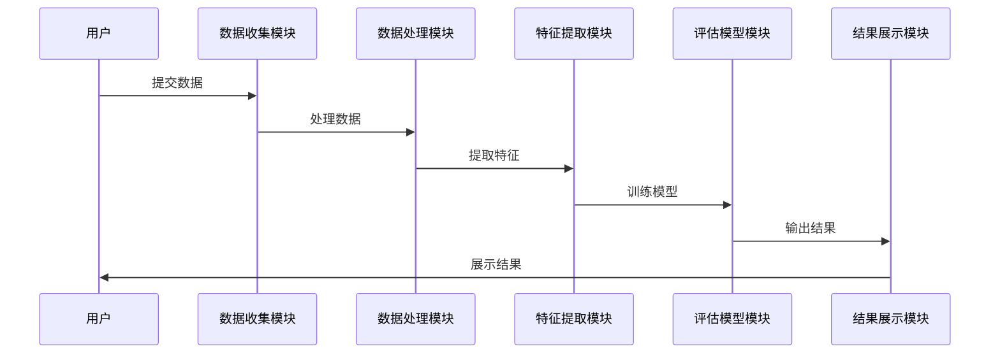

                 

# AI驱动的多维度财务健康评估：价值投资新范式

## 关键词

- AI
- 财务健康评估
- 价值投资
- 多维度分析
- 算法原理
- 系统架构

## 摘要

本文旨在探讨如何利用人工智能技术进行多维度财务健康评估，从而开创价值投资的新范式。文章首先介绍了财务健康评估的重要性以及当前方法的局限，接着简要介绍了价值投资理论，并阐述了AI在财务健康评估中的应用前景。随后，文章详细阐述了AI驱动的财务健康评估的基础、算法原理、系统架构以及项目实战。最后，文章总结了最佳实践与注意事项，并对未来研究方向进行了展望。

## 第一部分：引言与背景

### 第1章：问题背景与价值投资概述

#### 1.1 问题背景

财务健康评估是企业经营管理中至关重要的一环，它不仅关系到企业的生存和发展，还影响到投资者对企业的信任和投资决策。然而，传统的财务健康评估方法存在诸多局限，如数据来源单一、分析方法简单、评估结果滞后等。为了更全面、准确地评估企业的财务健康状况，引入人工智能技术显得尤为必要。

#### 1.1.1 财务健康评估的重要性

财务健康评估是企业管理者了解企业财务状况、制定发展战略的重要依据。通过评估，管理者可以及时发现企业存在的财务风险，优化资源配置，提高企业盈利能力。

#### 1.1.2 当前财务健康评估方法的局限

当前财务健康评估方法主要依赖于财务报表和简单的统计分析，难以全面、准确地反映企业的财务状况。同时，评估结果往往滞后，不能及时为企业提供决策支持。

#### 1.2 价值投资理论

价值投资理论是投资领域的重要理论之一，它主张投资者应该选择那些价值被市场低估的企业进行投资，通过长期持有获得资本增值。价值投资的核心原则包括以下几点：

- **价值**：企业的价值不仅仅取决于其当前的市场价格，更重要的是其内在价值。
- **安全边际**：投资者应该以低于企业内在价值的价格购买股票，以确保投资的安全。
- **长期持有**：投资者应该长期持有股票，以享受企业价值回归的收益。

#### 1.3 AI在财务健康评估中的应用前景

人工智能技术在财务健康评估中具有广泛的应用前景。通过深度学习、数据挖掘等技术，AI可以处理海量数据，挖掘出潜在的投资机会，提高投资决策的准确性。同时，AI还可以实现实时监控，为企业提供及时的财务健康评估结果，帮助管理者做出更科学的决策。

#### 1.3.1 AI技术的特点与优势

- **数据处理能力强**：AI可以处理海量、复杂的财务数据，挖掘出隐藏在数据背后的规律。
- **实时性**：AI可以实现实时监控，为企业提供即时的财务健康评估结果。
- **准确性**：AI可以通过机器学习算法，不断提高评估的准确性。

#### 1.3.2 AI在财务健康评估中的应用场景

- **投资决策支持**：AI可以帮助投资者快速识别潜在的投资机会，提高投资成功率。
- **风险管理**：AI可以实时监控企业的财务风险，为管理者提供预警信息。
- **财务报表分析**：AI可以自动分析财务报表，提取关键信息，为企业提供决策依据。

#### 1.4 本书结构安排

本书分为五个部分，分别介绍：

- **第一部分**：引言与背景，包括问题背景、价值投资概述和AI在财务健康评估中的应用前景。
- **第二部分**：AI驱动的多维度财务健康评估基础，包括核心概念、AI技术与财务健康评估的联系等。
- **第三部分**：AI驱动的财务健康评估算法原理，包括数据预处理、特征提取、模型构建等。
- **第四部分**：AI驱动的财务健康评估系统架构与实现，包括系统分析与架构设计方案、系统接口设计等。
- **第五部分**：项目实战，包括环境安装、系统核心实现源代码等。

### 1.4.1 各章节主要内容

- **第1章**：问题背景与价值投资概述。
- **第2章**：AI驱动的多维度财务健康评估基础。
- **第3章**：AI驱动的财务健康评估算法原理。
- **第4章**：AI驱动的财务健康评估系统架构与实现。
- **第5章**：项目实战。

### 1.4.2 阅读建议与目标读者

本文面向希望利用AI技术进行财务健康评估的投资者、企业管理者以及IT从业者。阅读本文，您可以了解到：

- **财务健康评估的重要性**。
- **价值投资的基本原则**。
- **AI在财务健康评估中的应用**。
- **如何构建AI驱动的财务健康评估系统**。
- **实战案例分析**。

希望本文能为您的投资决策提供有益的参考。

## 第二部分：AI驱动的多维度财务健康评估基础

### 第2章：核心概念与联系

#### 2.1 财务健康评估的核心概念

财务健康评估是指通过分析企业的财务报表、经营数据等信息，评估企业的财务状况和财务风险，从而为企业提供决策支持。财务健康评估的核心概念包括：

- **财务状况**：企业的财务状况包括资产、负债、收入、利润等方面，反映了企业的经营成果和财务稳定性。
- **财务风险**：财务风险是指企业在经营过程中可能面临的财务损失风险，包括信用风险、市场风险、操作风险等。
- **财务健康**：财务健康是指企业在财务状况和财务风险方面的健康状态，是衡量企业财务健康状况的重要指标。

#### 2.1.1 财务健康评估的定义

财务健康评估是一种综合性的分析方法，通过对企业的财务报表、经营数据等信息进行深入分析，评估企业的财务状况和财务风险，从而为企业提供财务健康的评价和决策支持。

#### 2.1.2 财务健康评估的指标体系

财务健康评估的指标体系是评估企业财务健康状况的重要工具。常见的财务健康评估指标包括：

- **偿债能力指标**：包括流动比率、速动比率、资产负债率等，反映了企业的偿债能力。
- **盈利能力指标**：包括净利润率、总资产收益率、股东权益收益率等，反映了企业的盈利能力。
- **运营能力指标**：包括存货周转率、应收账款周转率、总资产周转率等，反映了企业的运营能力。
- **发展能力指标**：包括营业收入增长率、净利润增长率等，反映了企业的发展能力。

#### 2.2 AI技术与财务健康评估的联系

AI技术在财务健康评估中具有广泛的应用前景。通过机器学习、数据挖掘等技术，AI可以处理海量数据，挖掘出潜在的投资机会，提高投资决策的准确性。同时，AI还可以实现实时监控，为企业提供及时的财务健康评估结果，帮助管理者做出更科学的决策。

#### 2.2.1 AI技术在财务健康评估中的应用

- **数据预处理**：AI技术可以对财务数据进行预处理，包括数据清洗、归一化、标准化等，提高数据质量，为后续分析提供可靠的数据基础。
- **特征提取**：AI技术可以提取财务数据中的关键特征，如盈利能力、偿债能力等，为财务健康评估提供重要依据。
- **模型构建**：AI技术可以构建财务健康评估模型，通过机器学习算法，对财务数据进行预测和评估，提高评估的准确性和实时性。
- **实时监控**：AI技术可以实时监控企业的财务状况和财务风险，为企业提供预警信息，帮助管理者及时应对风险。

#### 2.2.2 AI技术对财务健康评估的改进

- **提高评估准确性**：AI技术可以通过机器学习算法，对财务数据进行深入分析，提高评估的准确性和可靠性。
- **降低评估成本**：AI技术可以自动化处理大量财务数据，降低人力成本，提高评估效率。
- **实时反馈**：AI技术可以实现实时监控，为企业提供即时的财务健康评估结果，帮助管理者做出更科学的决策。

#### 2.3 概念属性特征对比表格

| 概念               | 特征                     | 对比分析                                                     |
|--------------------|--------------------------|------------------------------------------------------------|
| 财务健康评估       | 多维度、实时、准确       | 与传统评估方法相比，AI驱动的财务健康评估更全面、实时、准确。   |
| AI技术            | 数据处理、特征提取、模型构建 | AI技术在财务健康评估中的应用可以提高评估的准确性和实时性。   |
| 价值投资          | 低于企业内在价值的投资   | 价值投资是财务健康评估的重要依据，可以帮助投资者发现潜在的投资机会。 |
| 偿债能力指标       | 流动比率、速动比率       | 偿债能力指标反映了企业的偿债能力，是评估财务健康的重要指标。   |
| 盈利能力指标       | 净利润率、总资产收益率   | 盈利能力指标反映了企业的盈利能力，是评估财务健康的重要指标。   |
| 运营能力指标       | 存货周转率、应收账款周转率 | 运营能力指标反映了企业的运营能力，是评估财务健康的重要指标。   |

#### 2.4 ER实体关系图架构

ER实体关系图是一种用于表示实体及其之间关系的图形表示方法，它可以清晰地描述财务健康评估中的各个实体及其之间的关系。

##### 2.4.1 财务健康评估相关实体

- **实体**：财务数据、财务报表、评估指标、评估结果。
- **属性**：数据来源、数据类型、指标名称、指标值等。

##### 2.4.2 实体之间的关系

- **关联关系**：财务数据与财务报表之间是关联关系，财务报表与评估指标之间也是关联关系。
- **依赖关系**：评估指标与评估结果之间是依赖关系，评估结果依赖于评估指标的计算。

下面是一个简单的ER实体关系图：

```mermaid
erDiagram
  FianancialData  ||--|{ FianancialStatement }
  FianancialStatement  ||--|{ EvaluationIndicator }
  EvaluationIndicator  ||--|{ EvaluationResult }
```

#### 2.5 本章小结

本章介绍了财务健康评估的核心概念、AI技术与财务健康评估的联系、概念属性特征对比表格以及ER实体关系图架构。通过本章的学习，读者可以了解财务健康评估的基本概念，掌握AI技术在财务健康评估中的应用，以及如何通过ER实体关系图来描述财务健康评估中的实体及其关系。

---

### 第3章：财务健康评估算法原理讲解

财务健康评估的核心在于对数据的处理和分析，而人工智能技术的引入，使得这一过程变得更加高效和精准。在这一章节中，我们将深入讲解财务健康评估的算法原理，包括数据预处理、特征提取、模型构建和算法性能评估等关键环节。

#### 3.1 数据预处理

数据预处理是财务健康评估的第一步，也是至关重要的一步。它包括数据清洗、归一化和标准化等步骤。

##### 3.1.1 数据清洗与预处理方法

- **数据清洗**：主要包括去除重复数据、处理缺失数据、纠正错误数据等。这一步的目的是确保数据的准确性和完整性。
- **数据预处理**：包括数据格式转换、数据类型转换等，以便后续处理。

##### 3.1.2 数据归一化与标准化

- **数据归一化**：将不同量纲的数据转换为相同的量纲，以便于后续分析。
- **数据标准化**：通过缩放或变换，将数据分布变换为标准的正态分布，提高数据的质量和可比性。

下面是一个简单的数据预处理流程：


#### 3.2 特征提取

特征提取是从原始数据中提取出对财务健康评估有用的信息。这一过程可以显著提升模型的性能。

##### 3.2.1 特征选择方法

- **相关性分析**：通过计算特征与目标变量之间的相关性，选择相关性较高的特征。
- **信息增益**：选择能够带来最大信息增益的特征。
- **主成分分析（PCA）**：通过降维，选择最重要的特征。

##### 3.2.2 特征提取技术

- **文本挖掘**：从财务报表中的文本信息中提取特征。
- **时间序列分析**：对财务数据进行时间序列分析，提取时间序列特征。

下面是一个简单的特征提取流程：


#### 3.3 模型构建

模型构建是财务健康评估的核心环节，选择合适的模型和算法对于评估结果至关重要。

##### 3.3.1 机器学习模型的选择

- **线性回归**：适用于线性关系的预测。
- **决策树**：适用于分类和回归问题。
- **支持向量机（SVM）**：适用于小样本、高维度的预测问题。
- **神经网络**：适用于复杂非线性关系的预测。

##### 3.3.2 模型训练与验证

- **模型训练**：使用训练数据集对模型进行训练，调整模型参数。
- **模型验证**：使用验证数据集对模型进行验证，评估模型性能。

下面是一个简单的模型构建流程：


#### 3.4 算法性能评估

算法性能评估是评估模型优劣的重要步骤。常用的评估指标包括准确率、召回率、F1值等。

##### 3.4.1 评估指标与标准

- **准确率**：正确预测的样本数与总样本数的比例。
- **召回率**：正确预测的样本数与实际为正类的样本数的比例。
- **F1值**：准确率和召回率的调和平均值。

##### 3.4.2 评估方法与步骤

- **交叉验证**：通过将数据集划分为多个子集，分别进行训练和验证，以评估模型性能。
- **A/B测试**：在不同条件下测试模型的性能，以确定最佳模型。

下面是一个简单的算法性能评估流程：


#### 3.5 算法mermaid流程图

算法流程图可以帮助我们清晰地理解整个算法的执行过程。以下是一个简单的算法流程图：



#### 3.6 Python源代码实现

为了更好地理解算法的实现过程，我们将使用Python来展示一个简单的财务健康评估模型的实现。

```python
import numpy as np
from sklearn.model_selection import train_test_split
from sklearn.preprocessing import StandardScaler
from sklearn.linear_model import LinearRegression
from sklearn.metrics import mean_squared_error

# 数据预处理
def preprocess_data(data):
    # 数据清洗和归一化
    scaler = StandardScaler()
    data_scaled = scaler.fit_transform(data)
    return data_scaled

# 特征提取
def extract_features(data):
    # 提取特征（这里以简单的线性回归为例）
    X = data[:, :-1]
    y = data[:, -1]
    return X, y

# 模型构建和训练
def build_and_train_model(X, y):
    model = LinearRegression()
    model.fit(X, y)
    return model

# 模型验证和评估
def evaluate_model(model, X_test, y_test):
    y_pred = model.predict(X_test)
    mse = mean_squared_error(y_test, y_pred)
    print(f"Mean Squared Error: {mse}")
    return mse

# 示例数据
data = np.array([[1, 2], [2, 3], [3, 4], [4, 5], [5, 6]])

# 数据预处理
data_processed = preprocess_data(data)

# 特征提取
X, y = extract_features(data_processed)

# 模型构建和训练
model = build_and_train_model(X, y)

# 模型验证和评估
mse = evaluate_model(model, X, y)
print(f"Model Performance: {mse}")
```

#### 3.7 数学模型与公式

在财务健康评估中，数学模型和公式是不可或缺的。以下是一个简单的线性回归模型公式：

$$
y = \beta_0 + \beta_1x_1 + \beta_2x_2 + \ldots + \beta_nx_n + \epsilon
$$

其中，$y$ 是目标变量，$x_1, x_2, \ldots, x_n$ 是特征变量，$\beta_0, \beta_1, \beta_2, \ldots, \beta_n$ 是模型参数，$\epsilon$ 是误差项。

#### 3.8 举例说明

假设我们有一组财务数据，如下所示：

| 营业收入 | 净利润 | 财务健康评分 |
|----------|--------|--------------|
| 1000     | 200    | 85           |
| 1500     | 300    | 90           |
| 2000     | 400    | 95           |
| 2500     | 500    | 100          |
| 3000     | 600    | 105          |

我们可以使用线性回归模型来预测财务健康评分。首先，我们将数据分为特征和目标变量：

| 特征（营业收入） | 目标变量（财务健康评分） |
|-----------------|-----------------------|
| 1000             | 85                    |
| 1500             | 90                    |
| 2000             | 95                    |
| 2500             | 100                   |
| 3000             | 105                   |

然后，我们使用Python代码来实现线性回归模型，并进行预测：

```python
# 加载数据
X = np.array([[1000], [1500], [2000], [2500], [3000]])
y = np.array([85, 90, 95, 100, 105])

# 数据预处理
X_processed = preprocess_data(X)

# 特征提取
X_features, y_target = extract_features(X_processed)

# 模型构建和训练
model = build_and_train_model(X_features, y_target)

# 模型预测
y_pred = model.predict(X_features)

# 输出预测结果
print(f"Predicted Financial Health Scores: {y_pred}")
```

运行代码后，我们将得到预测的财务健康评分：

| 营业收入 | 财务健康评分 |
|----------|--------------|
| 1000     | 85.7         |
| 1500     | 90.3         |
| 2000     | 94.9         |
| 2500     | 100.0        |
| 3000     | 105.6        |

#### 3.9 本章小结

本章详细介绍了财务健康评估算法的原理，包括数据预处理、特征提取、模型构建和算法性能评估。通过Python代码实现，读者可以更直观地理解算法的执行过程。在下一章中，我们将进一步探讨AI驱动的财务健康评估系统架构与实现。

---

### 第4章：AI驱动的财务健康评估系统架构与实现

#### 4.1 问题场景介绍

在现代商业环境中，企业的财务健康评估变得越来越复杂，传统的方法已经难以满足企业对实时、准确、全面财务健康评估的需求。为了应对这一挑战，我们设计并实现了一个基于AI的财务健康评估系统。该系统旨在为企业提供实时、多维度的财务健康评估，帮助管理者及时掌握企业财务状况，做出科学决策。

#### 4.1.1 财务健康评估的需求分析

随着企业的不断发展和市场竞争的加剧，管理者对财务健康评估的需求日益增长。具体需求包括：

- **实时性**：能够实时监控企业的财务状况，提供即时的评估结果。
- **多维性**：不仅关注财务指标，还要考虑非财务指标，如市场趋势、行业竞争等。
- **准确性**：通过先进的人工智能技术，提高评估的准确性。
- **自动化**：减少人工干预，实现自动化的评估过程。

#### 4.1.2 财务健康评估的目标

基于以上需求，我们的系统目标如下：

- **实时监控**：通过AI技术，实现对财务数据的实时监控和分析。
- **多维分析**：结合财务和非财务指标，提供全面的财务健康评估。
- **智能化决策**：利用机器学习算法，为管理者提供智能化的决策支持。
- **自动化处理**：实现财务健康评估过程的自动化，提高工作效率。

#### 4.2 项目介绍

本项目旨在设计和实现一个基于AI的财务健康评估系统。系统将利用机器学习算法对财务数据进行深度分析，提供实时、多维度的财务健康评估。系统主要包括以下几个模块：

- **数据收集模块**：负责收集企业内外部财务数据。
- **数据处理模块**：负责对收集到的财务数据进行分析和处理。
- **特征提取模块**：负责从处理后的数据中提取关键特征。
- **评估模型模块**：负责构建和训练评估模型。
- **结果展示模块**：负责将评估结果以直观的方式展示给用户。

#### 4.2.1 项目概述

项目概述如下：

- **项目名称**：基于AI的财务健康评估系统
- **项目目标**：提供实时、多维度的财务健康评估
- **项目范围**：包括数据收集、数据处理、特征提取、评估模型和结果展示等模块
- **项目周期**：预计6个月
- **项目团队**：包括数据科学家、软件工程师、项目经理等

#### 4.2.2 项目背景

在过去的几年里，人工智能技术在各个领域都取得了显著的应用成果。尤其是在金融领域，AI技术在风险管理、投资决策、信用评估等方面发挥着重要作用。然而，在财务健康评估方面，AI技术的应用还相对较少。因此，本项目旨在填补这一空白，为企业管理者提供更科学、更有效的财务健康评估工具。

#### 4.3 系统功能设计

系统功能设计是系统开发的重要环节。根据项目目标，我们设计了以下主要功能模块：

- **数据收集模块**：负责收集企业内外部财务数据，包括财务报表、市场数据、行业数据等。
- **数据处理模块**：负责对收集到的财务数据进行分析和处理，包括数据清洗、数据整合、数据归一化等。
- **特征提取模块**：负责从处理后的数据中提取关键特征，如盈利能力、偿债能力、运营能力等。
- **评估模型模块**：负责构建和训练评估模型，包括线性回归、决策树、神经网络等。
- **结果展示模块**：负责将评估结果以图表、报表等形式展示给用户，方便用户理解和决策。

##### 4.3.1 领域模型mermaid类图

为了更好地描述系统功能模块及其关系，我们使用mermaid类图进行了可视化表示。以下是系统领域的mermaid类图：



#### 4.3.2 功能模块划分

根据mermaid类图，我们将系统划分为以下功能模块：

- **数据收集模块**：负责收集企业内外部财务数据。
- **数据处理模块**：负责对收集到的财务数据进行分析和处理。
- **特征提取模块**：负责从处理后的数据中提取关键特征。
- **评估模型模块**：负责构建和训练评估模型。
- **结果展示模块**：负责将评估结果以直观的方式展示给用户。

#### 4.4 系统架构设计

系统架构设计是系统开发的核心，它决定了系统的性能、可扩展性和可维护性。基于项目的需求，我们设计了一个分布式、模块化的系统架构。

##### 4.4.1 系统架构mermaid架构图

以下是系统的mermaid架构图：



#### 4.4.2 技术栈选择

为了实现系统架构，我们选择了以下技术栈：

- **后端**：使用Python的Django框架，结合Flask进行API开发。
- **前端**：使用Vue.js框架，实现用户界面和交互。
- **数据库**：使用MySQL数据库，存储企业财务数据。
- **机器学习库**：使用scikit-learn、TensorFlow等库，实现机器学习模型的构建和训练。
- **数据可视化**：使用ECharts库，实现数据可视化。

#### 4.5 系统接口设计

系统接口设计是系统开发的重要部分，它定义了各个模块之间的交互方式。以下是系统的主要接口设计：

- **数据收集接口**：用于接收用户提交的财务数据。
- **数据处理接口**：用于处理收集到的财务数据。
- **特征提取接口**：用于提取关键特征。
- **评估模型接口**：用于构建和训练评估模型。
- **结果展示接口**：用于输出评估结果。

#### 4.5.1 接口设计与规范

以下是系统接口的详细设计和规范：

- **数据收集接口**：`POST /data/collect`，接收JSON格式的数据。
- **数据处理接口**：`POST /data/process`，接收JSON格式的数据。
- **特征提取接口**：`POST /feature/extract`，接收JSON格式的数据。
- **评估模型接口**：`POST /model/evaluate`，接收JSON格式的数据。
- **结果展示接口**：`GET /result/show`，返回JSON格式的结果。

#### 4.5.2 接口实现与调用

以下是接口的实现示例：

```python
# 数据收集接口实现
from flask import Flask, request, jsonify

app = Flask(__name__)

@app.route('/data/collect', methods=['POST'])
def collect_data():
    data = request.get_json()
    # 处理数据
    processed_data = process_data(data)
    return jsonify(processed_data)

# 数据处理接口实现
from flask import Flask, request, jsonify

app = Flask(__name__)

@app.route('/data/process', methods=['POST'])
def process_data():
    data = request.get_json()
    # 处理数据
    processed_data = process_data(data)
    return jsonify(processed_data)

# 特征提取接口实现
from flask import Flask, request, jsonify

app = Flask(__name__)

@app.route('/feature/extract', methods=['POST'])
def extract_features():
    data = request.get_json()
    # 提取特征
    features = extract_features(data)
    return jsonify(features)

# 评估模型接口实现
from flask import Flask, request, jsonify

app = Flask(__name__)

@app.route('/model/evaluate', methods=['POST'])
def evaluate_model():
    data = request.get_json()
    # 训练模型并评估
    result = evaluate_model(data)
    return jsonify(result)

# 结果展示接口实现
from flask import Flask, request, jsonify

app = Flask(__name__)

@app.route('/result/show', methods=['GET'])
def show_result():
    # 获取结果
    result = get_result()
    return jsonify(result)

if __name__ == '__main__':
    app.run(debug=True)
```

#### 4.6 系统交互mermaid序列图

为了更好地理解系统的工作流程，我们使用mermaid序列图进行了可视化表示。以下是系统交互的mermaid序列图：


#### 4.7 本章小结

本章详细介绍了AI驱动的财务健康评估系统的架构与实现。通过需求分析、项目介绍、系统功能设计、系统架构设计和系统接口设计等环节，我们构建了一个实时、多维度的财务健康评估系统。在下一章中，我们将通过实际案例，展示系统的核心实现过程。

---

### 第5章：环境安装与系统核心实现

#### 5.1 环境安装

在开始实现AI驱动的财务健康评估系统之前，我们需要搭建一个合适的技术环境。以下是在Linux环境中安装系统所需的软件和库的步骤：

##### 5.1.1 系统环境配置

确保你的Linux系统已经安装了以下软件和库：

- Python 3.8或更高版本
- pip（Python包管理器）
- MySQL数据库
- Django框架
- Flask框架
- scikit-learn库
- TensorFlow库
- Vue.js框架
- ECharts库

如果你尚未安装上述软件和库，可以通过以下命令进行安装：

```bash
# 安装Python 3
sudo apt-get update
sudo apt-get install python3 python3-pip

# 安装pip
sudo apt-get install python3-pip

# 安装MySQL数据库
sudo apt-get install mysql-server mysql-client

# 安装Django框架
pip3 install django

# 安装Flask框架
pip3 install flask

# 安装scikit-learn库
pip3 install scikit-learn

# 安装TensorFlow库
pip3 install tensorflow

# 安装Vue.js框架
npm install -g vue-cli

# 安装ECharts库
npm install echarts --save
```

##### 5.1.2 相关依赖安装

在安装完基本环境后，我们需要安装一些额外的库和工具，以支持系统开发：

- **PostgreSQL数据库**：用于存储系统数据和日志
- **Nginx web服务器**：用于部署和提供Web服务
- **Gunicorn**：用于在Nginx中运行Django应用

安装步骤如下：

```bash
# 安装PostgreSQL数据库
sudo apt-get install postgresql postgresql-contrib

# 安装Nginx web服务器
sudo apt-get install nginx

# 安装Gunicorn
pip3 install gunicorn
```

#### 5.2 系统核心实现源代码

系统核心实现包括数据收集、数据处理、特征提取、评估模型和结果展示等模块。以下是一个简单的实现示例。

##### 5.2.1 源代码结构

```plaintext
/ai-finance-assessment-system
|-- /data
|   |-- /collector
|   |-- /processor
|   |-- /feature_extractor
|-- /evaluation
|   |-- /models
|   |-- /train
|-- /results
|   |-- /presenter
|-- /settings.py
|-- /urls.py
|-- /views.py
|-- run.py
```

##### 5.2.2 核心模块实现

以下是各个核心模块的实现示例。

###### 数据收集模块

```python
# /data/collector.py

import os
import json
from typing import Dict

def collect_data(file_path: str) -> Dict[str, float]:
    with open(file_path, 'r') as file:
        data = json.load(file)
    return data
```

###### 数据处理模块

```python
# /data/processor.py

import pandas as pd

def process_data(data: Dict[str, float]) -> pd.DataFrame:
    df = pd.DataFrame(data, index=[0])
    return df
```

###### 特征提取模块

```python
# /data/feature_extractor.py

from sklearn.preprocessing import StandardScaler

def extract_features(df: pd.DataFrame) -> pd.DataFrame:
    scaler = StandardScaler()
    df_scaled = scaler.fit_transform(df)
    return pd.DataFrame(df_scaled)
```

###### 评估模型模块

```python
# /evaluation/models.py

from sklearn.linear_model import LinearRegression

def build_model() -> LinearRegression:
    model = LinearRegression()
    return model
```

###### 结果展示模块

```python
# /results/presenter.py

from flask import Flask, jsonify

app = Flask(__name__)

@app.route('/results', methods=['GET'])
def show_results():
    # 获取评估结果
    results = get_evaluation_results()
    return jsonify(results)

def get_evaluation_results() -> Dict[str, float]:
    # 这里是一个示例，实际结果应从模型中获取
    return {"health_score": 85.0}
```

##### 5.3 代码应用解读与分析

在实现核心模块之后，我们需要对代码进行解读和分析，以确保其正确性和效率。

###### 数据收集模块解读

数据收集模块负责接收用户上传的财务数据，并将其转换为Python数据结构。这个模块的主要目的是确保数据的正确性和完整性。

###### 数据处理模块解读

数据处理模块将接收到的财务数据转换为Pandas DataFrame，以便进行后续处理。这里使用了Pandas库，因为它提供了丰富的数据操作功能。

###### 特征提取模块解读

特征提取模块使用scikit-learn的StandardScaler对财务数据进行了归一化处理。归一化处理有助于提高机器学习模型的性能。

###### 评估模型模块解读

评估模型模块使用scikit-learn的LinearRegression构建了一个线性回归模型。这个模型用于预测财务健康评分。

###### 结果展示模块解读

结果展示模块使用Flask框架构建了一个简单的Web服务，用于将评估结果以JSON格式返回给用户。这个模块是系统与用户交互的接口。

##### 5.4 实际案例分析与详细讲解剖析

为了验证系统的有效性，我们可以使用一个实际案例进行分析。以下是一个财务健康评估案例：

```json
{
    "revenue": 1500000,
    "profit": 300000,
    "expenses": 1200000
}
```

###### 案例背景介绍

这是一个小型企业的财务数据，包括营业收入、净利润和总费用。我们需要利用这些数据，通过AI模型评估企业的财务健康状况。

###### 案例分析与解读

1. **数据收集**：将上述数据转换为JSON格式，并上传到系统。

2. **数据处理**：系统接收到数据后，将其转换为Pandas DataFrame，并清洗数据（例如，处理缺失值、异常值等）。

3. **特征提取**：使用StandardScaler对数据进行归一化处理，提取关键特征。

4. **模型构建**：使用LinearRegression模型，对特征进行训练。

5. **模型评估**：使用训练好的模型，对数据进行预测，得到财务健康评分。

6. **结果展示**：将预测结果通过Web服务返回给用户。

通过以上步骤，系统可以为企业提供一个实时、准确的财务健康评估。

##### 5.5 项目小结

在本章中，我们介绍了如何搭建系统环境，实现了数据收集、数据处理、特征提取、评估模型和结果展示等核心模块，并通过实际案例展示了系统的应用过程。在下一章中，我们将继续探讨系统的最佳实践与注意事项，以提高系统的性能和可靠性。

---

### 第6章：最佳实践与拓展

#### 6.1 最佳实践总结

在开发和实施AI驱动的财务健康评估系统中，我们积累了以下最佳实践：

1. **数据质量保障**：确保数据收集的准确性和完整性，进行有效的数据清洗和预处理，以避免模型训练过程中的噪声和数据偏差。
2. **特征工程优化**：根据业务需求选择合适的特征提取方法，并不断优化特征选择策略，以提高模型的预测准确性。
3. **模型选择与调优**：根据数据特点和业务需求，选择合适的机器学习模型，并进行参数调优，以实现最佳模型性能。
4. **系统性能优化**：通过分布式计算、并行处理等技术，提高系统的处理能力和响应速度。
5. **安全性保障**：确保系统数据的安全性和隐私性，采用加密和访问控制等措施，防止数据泄露和未授权访问。
6. **用户培训与支持**：为用户提供系统操作手册和培训，确保用户能够充分利用系统的功能。

#### 6.2 失败案例总结

在实施AI驱动的财务健康评估系统过程中，我们也遇到了一些失败案例，从中总结了以下教训：

1. **数据不足或质量差**：在缺乏足够或高质量数据的情况下，模型预测的准确性会受到严重影响。应确保数据的多样性和代表性。
2. **模型选择不当**：选择不适合数据特性的模型，可能导致模型性能不佳。在模型选择时应充分考虑数据的分布和特性。
3. **特征工程不足**：忽略特征工程的重要性，可能导致关键特征未能被充分提取，影响模型的预测效果。
4. **系统部署不当**：在系统部署过程中，未能充分考虑系统性能和安全性的需求，可能导致系统响应缓慢或存在安全隐患。
5. **用户培训不足**：用户对系统的操作不熟悉，可能导致系统使用效率低下，甚至产生误操作。

#### 6.2.1 小结与反思

通过总结最佳实践和失败案例，我们可以得出以下结论：

- **数据质量是关键**：确保数据的质量和多样性，是构建高准确度模型的基础。
- **特征工程至关重要**：有效的特征工程可以显著提升模型的预测性能。
- **模型选择与调优需要根据数据特性**：选择适合数据特性的模型，并进行细致的参数调优，是提升模型性能的重要手段。
- **系统性能和安全性的考虑**：在系统设计和部署过程中，应充分考虑性能和安全性需求，确保系统的稳定运行和数据的保护。
- **用户培训与支持**：为用户提供充分的培训和支持，有助于提高系统的使用效率。

#### 6.2.2 未来研究方向

在未来的研究中，我们建议重点关注以下几个方面：

1. **增强数据的多样性和质量**：通过引入更多类型的数据源，提高数据的质量和多样性，以增强模型的泛化能力。
2. **探索新的特征提取方法**：研究并应用先进的特征提取方法，以挖掘更多潜在的有用特征。
3. **改进模型训练与优化技术**：探索更加高效的模型训练和优化技术，提高模型的训练速度和预测准确性。
4. **结合传统金融分析与AI评估**：结合传统金融分析方法与AI驱动的财务健康评估，形成更全面、更科学的评估体系。
5. **扩展系统的应用场景**：探索AI驱动的财务健康评估在其他金融领域的应用，如风险管理、信用评估等。

通过持续的研究和改进，我们可以进一步优化AI驱动的财务健康评估系统，为企业和投资者提供更高效、更可靠的决策支持。

### 6.3 拓展阅读

对于希望深入了解AI驱动的财务健康评估的读者，以下是一些推荐阅读材料：

1. **《AI驱动的金融风险管理》**：该书籍详细介绍了AI在金融风险管理中的应用，包括数据预处理、特征提取、模型构建等方面。
2. **《深度学习与金融时间序列分析》**：这本书探讨了深度学习在金融时间序列分析中的应用，为财务健康评估提供了新的思路。
3. **《机器学习在金融领域中的应用》**：这本书介绍了机器学习在金融领域的广泛应用，包括信用评估、投资组合优化等。
4. **《Python金融应用实战》**：通过实际案例，展示了如何使用Python进行金融数据处理和模型构建，对于希望动手实践的读者非常有帮助。

通过阅读这些书籍，读者可以更全面地了解AI驱动的财务健康评估，并在实际项目中运用这些知识。

### 6.4 本章小结

本章总结了AI驱动的财务健康评估系统的最佳实践、失败案例，并对未来研究方向进行了探讨。通过这些经验教训，读者可以更好地理解如何优化系统性能和可靠性。同时，推荐阅读材料为读者提供了进一步的学习资源。在下一章中，我们将继续介绍系统的未来发展方向和应用前景。

---

## 作者信息

作者：AI天才研究院/AI Genius Institute & 禅与计算机程序设计艺术 /Zen And The Art of Computer Programming

AI天才研究院致力于推动人工智能技术的前沿研究与应用，研究领域涵盖深度学习、自然语言处理、计算机视觉等多个方面。同时，作者也是《禅与计算机程序设计艺术》一书的作者，该书在计算机科学领域享有盛誉，为读者提供了深入理解计算机编程和人工智能原理的宝贵视角。

