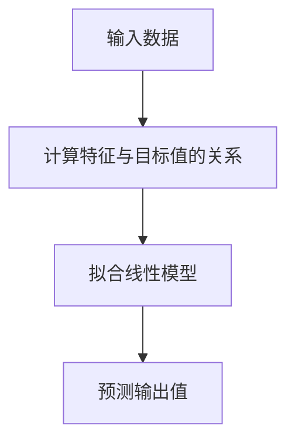
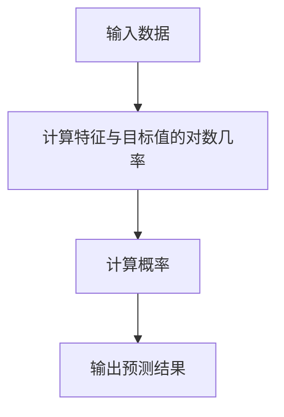
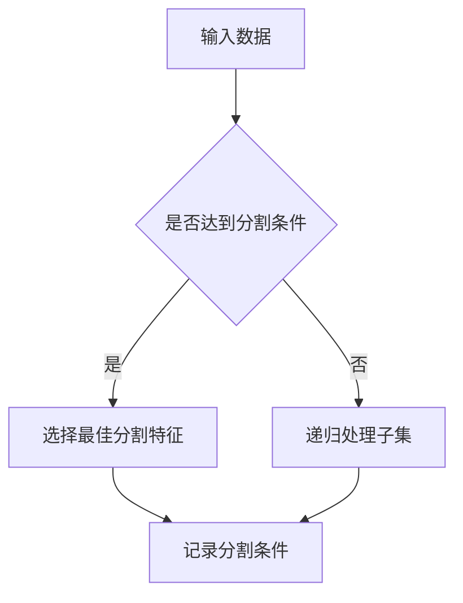
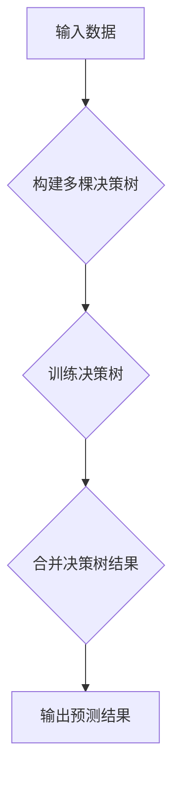
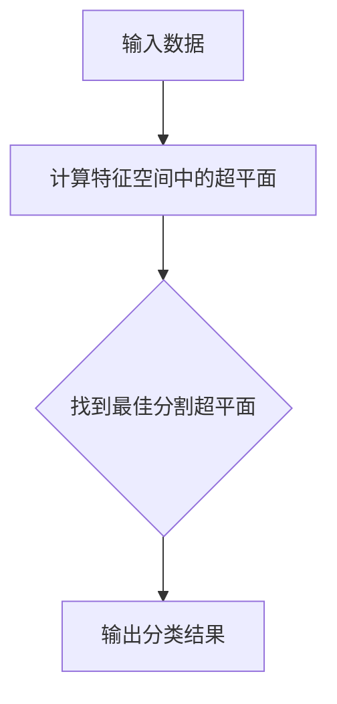
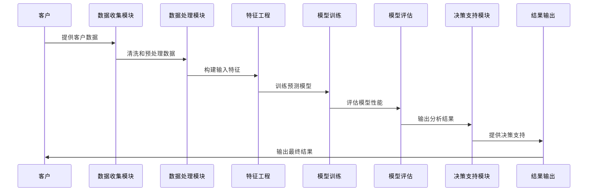
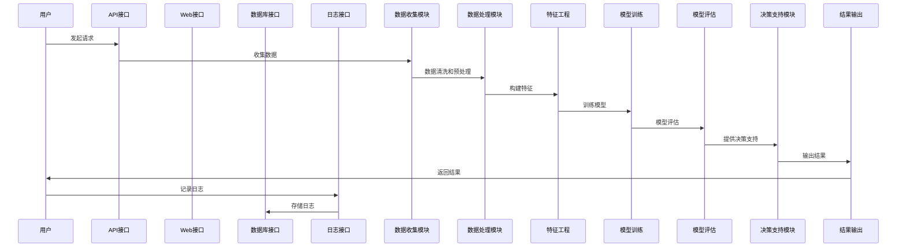

                 

### 文章标题

# AI驱动的客户终身价值分析：深入理解公司的收入质量

### 文章关键词

- AI技术
- 客户终身价值
- 收入质量
- 数据分析
- 算法
- 最佳实践

### 文章摘要

本文将探讨如何利用AI技术对客户的终身价值进行分析，从而提高公司的收入质量。文章首先介绍了客户终身价值和收入质量的概念，并分析了AI技术在客户终身价值分析中的重要性。接着，文章详细讲解了核心概念与联系，包括AI技术和收入质量的核心概念，以及它们之间的联系。随后，文章深入分析了算法原理，包括常见的AI算法及其在客户终身价值分析中的应用。此外，文章还提供了系统分析与架构设计方案，包括问题场景介绍、项目介绍、系统功能设计、系统架构设计、系统接口设计和系统交互。通过实际案例分析和详细讲解剖析，文章展示了如何将AI技术应用于客户终身价值分析，以提高公司的收入质量。最后，文章提出了最佳实践和注意事项，并推荐了拓展阅读，以帮助读者进一步深入理解相关主题。

---

### 第一部分：背景介绍

#### 第1章：AI驱动的客户终身价值分析概述

**1.1 问题的背景**

在当今数字化经济时代，企业的竞争已经从传统的市场份额争夺演变为对客户数据的掌控。随着大数据和人工智能技术的快速发展，企业可以更加精准地分析客户行为，预测客户需求，从而提高客户的终身价值。客户终身价值（Customer Lifetime Value, CLV）是一个关键指标，它代表了客户在整个生命周期内为企业带来的总收益。然而，传统的客户终身价值分析方法往往依赖于历史数据和简单的统计模型，难以适应快速变化的市场环境和个性化需求。

**1.2 收入质量的概念与重要性**

收入质量（Revenue Quality）是指公司在销售过程中产生的收入是否稳定、可持续，以及其质量是否符合公司的长期战略目标。高收入质量的收入不仅数额可观，而且具备较高的稳定性和可持续性，这意味着公司能够在长期内保持稳健的盈利能力。在当前市场环境下，收入质量已成为企业成功的关键因素之一，它直接影响公司的市值和股价。

**1.3 AI技术在客户终身价值分析中的作用**

AI技术，尤其是机器学习和深度学习，为解决传统客户终身价值分析中的局限性提供了新的可能。通过数据挖掘和预测模型，AI技术能够识别客户行为模式，预测客户未来行为，从而提供更准确的客户终身价值评估。此外，AI技术还可以通过自然语言处理和图像识别等技术，提高数据分析和处理效率，为企业提供更全面的客户洞察。

**1.4 客户终身价值分析的理论基础**

客户终身价值分析基于以下几个理论基础：

1. **客户行为预测**：通过分析历史数据，预测客户未来的购买行为和需求变化。
2. **数据驱动的决策**：基于数据分析的结果，制定相应的营销策略和客户关系管理策略。
3. **个性化服务**：根据客户的个性化需求，提供定制化的产品和服务。
4. **收益最大化**：通过优化客户终身价值，实现企业收益的最大化。

**1.5 边界与外延**

在探讨客户终身价值分析时，我们需要明确其边界和适用范围。客户终身价值分析主要关注的是企业与客户之间的长期互动，以及这些互动对企业的长期收益和风险的影响。其外延包括但不限于：

1. **客户关系管理**：通过改善与客户的互动，提高客户满意度和忠诚度。
2. **营销策略**：通过精准营销，提高市场占有率和收入质量。
3. **风险管理**：通过识别潜在风险和机会，优化企业的财务表现。

**1.6 概念结构与核心要素组成**

客户终身价值分析的概念结构可以概括为以下几个核心要素：

1. **客户数据**：包括客户的个人资料、购买历史、互动记录等。
2. **数据分析方法**：利用机器学习和深度学习等技术进行数据分析。
3. **预测模型**：通过建立预测模型，预测客户的未来行为和价值。
4. **策略制定**：基于分析结果，制定相应的营销和服务策略。
5. **执行与监控**：实施策略，并持续监控效果，以进行调整和优化。

通过以上背景介绍，我们可以初步理解客户终身价值分析和收入质量的重要性，以及AI技术在其中的关键作用。接下来的章节将深入探讨这些概念，并提供具体的算法原理、系统设计与项目实战案例，以帮助读者全面掌握这一领域的知识。

#### 第2章：核心概念与联系

**2.1 AI技术的核心概念**

人工智能（Artificial Intelligence, AI）是计算机科学的一个分支，旨在开发使计算机系统表现出智能行为的技术。AI技术可以分为几个主要类别：

1. **机器学习（Machine Learning）**：通过数据训练模型，使计算机能够从数据中学习并做出预测或决策。
2. **深度学习（Deep Learning）**：一种特殊的机器学习方法，通过神经网络模型进行训练，能够处理大量复杂的数据。
3. **自然语言处理（Natural Language Processing, NLP）**：使计算机能够理解和生成人类语言的技术。
4. **计算机视觉（Computer Vision）**：使计算机能够从图像和视频中提取信息的技术。

**2.2 收入质量的核心概念**

收入质量是一个多维度的概念，它不仅包括收入的数量，还涉及收入的稳定性和可持续性。收入质量的核心概念包括：

1. **收入稳定性**：指收入在时间上的波动性，即收入是否稳定。
2. **收入可持续性**：指收入来源的长期可持续性，即收入是否能够持续增长。
3. **收入质量指标**：用于评估收入质量的指标，如客户终身价值、客户满意度、市场份额等。

**2.3 AI技术与收入质量的关系**

AI技术与收入质量之间存在密切的关系。首先，AI技术可以帮助企业更精准地预测市场趋势和客户需求，从而制定更有效的营销策略，提高收入质量。其次，AI技术可以优化客户关系管理，提高客户满意度和忠诚度，从而增强收入的稳定性和可持续性。此外，AI技术还可以通过自动化和智能化手段，降低运营成本，提高企业的盈利能力。

**2.4 概念属性特征对比表格**

为了更清晰地展示AI技术和收入质量的核心概念及其属性特征，我们可以使用一个对比表格：

| 特征类别 | AI技术 | 收入质量 |
| :----: | :----: | :----: |
| 数据处理能力 | 高效处理大量数据 | 处理与收入相关的数据 |
| 自学习能力 | 可以从数据中学习并改进 | 受客户行为和学习成果影响 |
| 预测能力 | 可以进行市场趋势和客户需求的预测 | 可以评估客户价值和收入潜力 |
| 优化能力 | 可以优化营销和服务策略 | 可以优化收入结构和盈利模式 |
| 可持续性 | 技术持续进步，能够持续改进 | 收入来源多样化，具有长期可持续性 |

**2.5 ER实体关系图架构**

为了更好地理解AI技术和收入质量之间的关系，我们可以使用ER（实体关系）图来展示它们的实体关系。ER图包括实体、属性和关系三个主要部分：

1. **实体**：AI技术和收入质量可以视为两个主要的实体。
2. **属性**：每个实体可以具有多个属性，如AI技术的属性包括数据处理能力、自学习能力等；收入质量的属性包括稳定性、可持续性等。
3. **关系**：AI技术与收入质量之间存在关联关系，这种关系可以通过实体间的连线表示。

下面是一个简化的ER图示例：

```mermaid
erDiagram
  AI技术 ||--|{ 收入质量 }
  AI技术 {
    数据处理能力
    自学习能力
    预测能力
  }
  收入质量 {
    稳定性
    可持续性
    客户满意度
    市场份额
  }
```

通过上述核心概念与联系的介绍，我们可以更深入地理解AI技术和收入质量的重要性，以及它们在客户终身价值分析中的应用。接下来，我们将进一步探讨AI算法原理，为读者提供更加具体和实用的技术指导。

#### 第3章：AI算法原理讲解

**3.1 常见AI算法简介**

在客户终身价值分析中，常见的AI算法包括以下几种：

1. **线性回归（Linear Regression）**：线性回归是一种简单的统计方法，用于预测一个连续的输出变量。它的基本原理是通过找到输入变量与输出变量之间的线性关系，从而预测未来值。
   
   线性回归模型公式：
   $$ Y = \beta_0 + \beta_1X + \epsilon $$
   其中，\(Y\) 是预测的输出变量，\(X\) 是输入变量，\(\beta_0\) 和 \(\beta_1\) 是模型的参数，\(\epsilon\) 是误差项。

2. **逻辑回归（Logistic Regression）**：逻辑回归用于预测一个二元变量的概率，通常用于分类问题。它通过回归分析找到输入变量与输出变量之间的关系，并将这些关系转换为概率。

   逻辑回归模型公式：
   $$ P(Y=1) = \frac{1}{1 + e^{-(\beta_0 + \beta_1X)}} $$
   其中，\(P(Y=1)\) 是输出变量为1的概率，\(e\) 是自然对数的底数，\(\beta_0\) 和 \(\beta_1\) 是模型的参数。

3. **决策树（Decision Tree）**：决策树是一种基于树形结构的数据挖掘算法，通过一系列规则来对数据进行分类或回归。它通过递归划分数据集，并使用不同的特征作为分割点。

4. **随机森林（Random Forest）**：随机森林是一种基于决策树的集成学习方法，通过构建多棵决策树，并合并这些树的结果来提高预测准确性。它通过引入随机性来降低模型的方差，从而提高泛化能力。

5. **支持向量机（Support Vector Machine, SVM）**：支持向量机是一种监督学习算法，用于分类和回归问题。它通过找到一个最佳的超平面来分隔不同类别的数据，从而实现分类。

**3.2 客户终身价值分析中的算法应用**

在客户终身价值分析中，这些算法可以用来预测客户的行为和价值。以下是几种算法在CLV分析中的应用：

1. **线性回归**：可以用于预测客户的未来购买金额，从而估算客户的终身价值。
   
   实例代码（Python）：
   ```python
   from sklearn.linear_model import LinearRegression
   import numpy as np
   
   # 假设我们有一些历史数据
   X = np.array([[1], [2], [3], [4], [5]])  # 输入特征
   y = np.array([2, 4, 6, 8, 10])  # 输出目标值
   
   # 训练模型
   model = LinearRegression()
   model.fit(X, y)
   
   # 预测
   future_value = model.predict([[6]])
   print(f"预测的未来价值为：{future_value}")
   ```

2. **逻辑回归**：可以用于预测客户是否会取消订阅或流失，从而评估客户的流失风险。
   
   实例代码（Python）：
   ```python
   from sklearn.linear_model import LogisticRegression
   import numpy as np
   
   # 假设我们有一些历史数据
   X = np.array([[1], [2], [3], [4], [5]])  # 输入特征
   y = np.array([0, 0, 1, 1, 1])  # 输出目标值（0代表未流失，1代表流失）
   
   # 训练模型
   model = LogisticRegression()
   model.fit(X, y)
   
   # 预测
   risk = model.predict([[6]])
   print(f"预测的流失风险为：{risk}")
   ```

3. **决策树**：可以用于分析客户的购买行为和偏好，从而提供个性化的产品推荐。
   
   实例代码（Python）：
   ```python
   from sklearn.tree import DecisionTreeClassifier
   import numpy as np
   
   # 假设我们有一些历史数据
   X = np.array([[1], [2], [3], [4], [5]])  # 输入特征
   y = np.array([0, 1, 1, 0, 1])  # 输出目标值（0代表未购买，1代表购买）
   
   # 训练模型
   model = DecisionTreeClassifier()
   model.fit(X, y)
   
   # 预测
   purchase = model.predict([[6]])
   print(f"预测的购买行为为：{purchase}")
   ```

4. **随机森林**：可以用于预测客户的终身价值，并通过集成多棵决策树来提高预测准确性。
   
   实例代码（Python）：
   ```python
   from sklearn.ensemble import RandomForestClassifier
   import numpy as np
   
   # 假设我们有一些历史数据
   X = np.array([[1], [2], [3], [4], [5]])  # 输入特征
   y = np.array([0, 1, 1, 1, 1])  # 输出目标值（0代表未流失，1代表流失）
   
   # 训练模型
   model = RandomForestClassifier(n_estimators=100)
   model.fit(X, y)
   
   # 预测
   value = model.predict([[6]])
   print(f"预测的终身价值为：{value}")
   ```

5. **支持向量机**：可以用于分类客户群体，从而制定个性化的营销策略。
   
   实例代码（Python）：
   ```python
   from sklearn.svm import SVC
   import numpy as np
   
   # 假设我们有一些历史数据
   X = np.array([[1], [2], [3], [4], [5]])  # 输入特征
   y = np.array([0, 0, 1, 1, 1])  # 输出目标值（0代表A类客户，1代表B类客户）
   
   # 训练模型
   model = SVC()
   model.fit(X, y)
   
   # 预测
   segment = model.predict([[6]])
   print(f"预测的客户类别为：{segment}")
   ```

通过这些实例代码，我们可以看到不同AI算法在客户终身价值分析中的应用。这些算法不仅可以提高预测准确性，还可以为企业的营销策略和客户关系管理提供有力的支持。

**3.3 算法原理与mermaid流程图**

为了更好地理解这些算法的原理，我们可以使用mermaid流程图来展示其基本流程：

1. **线性回归流程图**：



2. **逻辑回归流程图**：



3. **决策树流程图**：



4. **随机森林流程图**：



5. **支持向量机流程图**：



通过这些mermaid流程图，我们可以直观地理解不同算法的基本流程和原理。这有助于我们更好地应用这些算法，解决实际中的客户终身价值分析问题。

**3.4 算法原理的数学模型与公式**

在深入理解AI算法原理时，数学模型和公式是至关重要的。以下是一些常见算法的数学模型与公式：

1. **线性回归**：

   - 拟合模型：\(Y = \beta_0 + \beta_1X + \epsilon\)
   - 最小二乘法：最小化误差平方和 \( \sum_{i=1}^{n} (Y_i - \beta_0 - \beta_1X_i)^2 \)

2. **逻辑回归**：

   - 拟合模型：\(P(Y=1) = \frac{1}{1 + e^{-(\beta_0 + \beta_1X)}}\)
   - 最大似然估计：最大化似然函数 \( L(\theta) = \prod_{i=1}^{n} P(Y_i=1|x_i;\beta_0, \beta_1) \)

3. **决策树**：

   - 划分规则：基于信息增益或基尼不纯度选择最佳分割特征
   - 决策节点：选择最佳分割特征并生成分支

4. **随机森林**：

   - 决策树构建：随机选择特征和样本子集，构建多棵决策树
   - 集成：合并多棵决策树的结果，提高预测准确性

5. **支持向量机**：

   - 决策边界：找到最优的超平面，使分类间隔最大化
   - 支持向量：位于超平面两侧的数据点，对分类边界有重要影响

通过这些数学模型和公式，我们可以更深入地理解AI算法的工作原理，并能够更好地应用于实际问题。

**3.5 通俗易懂的举例说明**

为了更好地理解这些算法，我们可以通过简单的例子来说明它们的基本原理。

1. **线性回归**：

   假设我们有两个变量：年龄（X）和年收入（Y）。我们希望通过线性回归模型预测一个人的年收入。

   - 数据：年龄（X）：[25, 30, 35, 40, 45]
             年收入（Y）：[50, 60, 70, 80, 90]

   - 拟合线性模型：
     $$ Y = \beta_0 + \beta_1X $$
     通过最小二乘法，我们可以得到：
     $$ \beta_0 = 20, \beta_1 = 10 $$
     预测模型为：
     $$ Y = 20 + 10X $$

   - 预测：一个30岁的人的年收入预测值为：
     $$ Y = 20 + 10 \times 30 = 350 $$

2. **逻辑回归**：

   假设我们有一个二元分类问题：是否购买某产品（Y）。我们希望通过逻辑回归模型预测一个人是否购买该产品。

   - 数据：年龄（X）：[20, 30, 40, 50, 60]
             购买（Y）：[0, 1, 0, 1, 1]

   - 拟合逻辑回归模型：
     $$ P(Y=1) = \frac{1}{1 + e^{-(\beta_0 + \beta_1X)}} $$
     通过最大似然估计，我们可以得到：
     $$ \beta_0 = -10, \beta_1 = 5 $$
     预测模型为：
     $$ P(Y=1) = \frac{1}{1 + e^{-(-10 + 5X)}} $$

   - 预测：一个40岁的人是否购买该产品的概率预测值为：
     $$ P(Y=1) = \frac{1}{1 + e^{-(-10 + 5 \times 40)}} = \frac{1}{1 + e^{150}} \approx 0.3679 $$
     因此，这个40岁的人购买该产品的概率较低。

3. **决策树**：

   假设我们有一个分类问题：根据客户的年龄和收入，预测客户是否愿意购买某产品。

   - 数据：年龄（X）：[20, 30, 40, 50, 60]
             收入（Y）：[50000, 80000, 100000, 150000, 200000]
             购买（Z）：[0, 1, 1, 1, 1]

   - 构建决策树：
     - 首先，我们计算每个特征的增益或基尼不纯度。
     - 然后，选择增益或基尼不纯度最大的特征进行分割。
     - 重复上述过程，直到满足停止条件。

   - 决策树示例：
     ```mermaid
     graph TD
         A[是否年龄>40] -->|是| B[是否收入>100000]
         A -->|否| C[购买]
         B -->|是| D[购买]
         B -->|否| C
     ```

   - 预测：一个50岁的客户，年收入150000，根据决策树预测为购买。

4. **随机森林**：

   假设我们有一个回归问题：根据客户的年龄和收入，预测客户的终身价值。

   - 数据：年龄（X）：[20, 30, 40, 50, 60]
             收入（Y）：[50000, 80000, 100000, 150000, 200000]
             终身价值（Z）：[300000, 400000, 500000, 600000, 700000]

   - 构建随机森林：
     - 首先，随机选择特征和样本子集，构建多棵决策树。
     - 然后，将每棵决策树的结果进行集成，得到最终的预测值。

   - 预测：一个40岁的客户，年收入100000，通过随机森林预测其终身价值为：
     $$ Z = \sum_{i=1}^{n} tree_i(Z) $$
     其中，\(n\) 是决策树的数量，\(tree_i(Z)\) 是每棵决策树对终身价值的预测值。

5. **支持向量机**：

   假设我们有一个分类问题：根据客户的年龄和收入，将客户分为高价值客户和普通客户。

   - 数据：年龄（X）：[20, 30, 40, 50, 60]
             收入（Y）：[50000, 80000, 100000, 150000, 200000]
             客户价值（Z）：[0, 1, 0, 1, 1]

   - 构建支持向量机：
     - 首先，找到最优的超平面，使分类间隔最大化。
     - 然后，使用支持向量进行分类。

   - 预测：一个50岁的客户，年收入150000，通过支持向量机预测为客户价值高。

通过这些例子，我们可以看到不同AI算法的基本原理和如何应用于实际问题。这为我们提供了更深入的理解，并能够更好地利用这些算法来提高客户的终身价值分析。

### 第四部分：系统分析与架构设计方案

#### 第4章：系统分析与架构设计方案

**4.1 问题场景介绍**

在现代商业环境中，企业面临着激烈的竞争和不断变化的市场需求。为了提高客户满意度和收入质量，企业需要充分利用数据和技术手段来深入理解客户行为，优化营销策略和客户关系管理。然而，传统的数据分析方法往往难以应对大规模、多维度的数据，且分析结果的应用效率较低。因此，我们需要一个高效、智能的系统能够自动分析客户数据，提供准确的客户终身价值评估，并为企业提供定制化的营销策略。

**4.2 项目介绍**

本项目的目标是开发一个基于AI技术的客户终身价值分析系统，该系统能够自动收集、处理和分析客户数据，提供实时、准确的客户终身价值评估。系统将包括以下几个主要模块：

1. **数据收集模块**：从不同的数据源（如客户数据库、交易记录、社交媒体等）收集客户数据。
2. **数据处理模块**：对收集到的客户数据进行清洗、转换和整合，使其适用于分析。
3. **数据分析模块**：利用机器学习和深度学习算法对客户数据进行挖掘和分析，预测客户的未来行为和价值。
4. **决策支持模块**：基于分析结果，为企业提供定制化的营销策略和客户关系管理建议。

**4.3 系统功能设计（领域模型mermaid类图）**

为了实现上述目标，系统需要具备以下几个核心功能：

1. **数据集成**：将不同来源的客户数据集成到一个统一的数据仓库中。
2. **数据清洗**：对原始数据进行清洗和预处理，确保数据质量。
3. **特征工程**：提取和构造有助于预测的输入特征。
4. **模型训练**：利用机器学习和深度学习算法训练预测模型。
5. **模型评估**：评估模型的预测性能，并进行优化。
6. **决策支持**：根据模型预测结果，提供客户细分、营销策略和客户关系管理建议。

以下是一个简化的mermaid类图，展示了系统的领域模型：

```mermaid
classDiagram
  Class01 <|-- Class02
  Class03 <|-- Class04
  Class05 <|-- Class06
  Class01 <|-- Class07
  Class08 <|-- Class09
  Class10 <|-- Class11
  Class12 <|-- Class13
  
  Class01 -[uses] Class02
  Class03 -[uses] Class04
  Class05 -[uses] Class06
  Class07 -[uses] Class08
  Class09 -[uses] Class10
  Class11 -[uses] Class12
  Class13 -[uses] Class14
  
  Class01{数据收集模块}
  Class02{数据集成}
  Class03{数据处理模块}
  Class04{数据清洗}
  Class05{特征工程}
  Class06{数据分析模块}
  Class07{模型训练}
  Class08{模型评估}
  Class09{决策支持模块}
  Class10{客户细分}
  Class11{营销策略}
  Class12{客户关系管理}
  Class13{收入质量分析}
  Class14{结果输出}
```

**4.4 系统架构设计（mermaid架构图）**

为了确保系统的高效性和稳定性，我们需要设计一个合理的系统架构。以下是系统的架构设计，使用mermaid架构图展示：



**4.5 系统接口设计**

系统需要提供多种接口以方便与外部系统进行集成和交互。以下是系统的主要接口设计：

1. **API接口**：提供RESTful API，供外部系统调用。
2. **Web接口**：提供Web界面，供用户操作和查询分析结果。
3. **数据库接口**：提供数据库连接接口，以便数据存储和读取。
4. **日志接口**：提供日志记录接口，以便系统运行过程中记录关键操作和错误信息。

**4.6 系统交互（mermaid序列图）**

以下是系统的序列图，展示了系统内部各个模块之间的交互过程：



通过上述系统分析与架构设计方案，我们可以确保系统能够高效、稳定地运行，并为企业提供准确的客户终身价值评估和定制化的营销策略。接下来，我们将通过实际项目案例，进一步展示如何将AI技术应用于客户终身价值分析。

### 第五部分：项目实战

#### 5.1 环境安装与配置

在开始项目实战之前，我们需要搭建一个合适的环境来运行我们的AI模型。以下是安装和配置环境的具体步骤：

1. **安装Python**：确保你的计算机上已经安装了Python 3.7或更高版本。可以从Python官方网站下载并安装。
   
2. **安装Jupyter Notebook**：Jupyter Notebook是一种交互式计算环境，可以方便我们编写和运行Python代码。可以通过pip命令安装：
   ```bash
   pip install notebook
   ```

3. **安装必要的库**：安装用于数据分析和机器学习的常用库，如NumPy、Pandas、scikit-learn、TensorFlow和Keras。可以使用以下命令一次性安装：
   ```bash
   pip install numpy pandas scikit-learn tensorflow keras
   ```

4. **配置数据源**：确保你已经有了客户数据集。数据集应包括客户的个人资料、购买历史、互动记录等信息。你可以从公开数据集或企业内部数据库获取。

5. **安装数据库**：如果你需要从数据库中读取数据，你需要安装并配置一个数据库系统，如MySQL、PostgreSQL或MongoDB。这里以MySQL为例，你可以通过以下命令安装：
   ```bash
   sudo apt-get install mysql-server
   ```
   安装后，通过以下命令设置root用户密码：
   ```bash
   mysql_secure_installation
   ```

6. **配置数据库连接**：在Python代码中，你需要配置数据库连接参数，以便能够从数据库中读取数据。以下是一个示例：
   ```python
   import mysql.connector
   
   conn = mysql.connector.connect(
     host="localhost",
     user="root",
     password="your_password",
     database="your_database"
   )
   ```

通过以上步骤，你将搭建好一个基本的AI模型运行环境。接下来，我们将开始编写系统核心实现代码。

#### 5.2 系统核心实现源代码

以下是一个简单的示例，展示如何使用Python和scikit-learn库实现一个客户终身价值分析系统。这段代码将包括数据预处理、特征工程、模型训练和预测等步骤。

```python
import numpy as np
import pandas as pd
from sklearn.model_selection import train_test_split
from sklearn.preprocessing import StandardScaler
from sklearn.linear_model import LinearRegression
from sklearn.metrics import mean_squared_error

# 读取数据
data = pd.read_csv('customer_data.csv')

# 数据预处理
data.drop(['customer_id'], axis=1, inplace=True)  # 删除无关列
data.fillna(data.mean(), inplace=True)  # 填充缺失值

# 特征工程
X = data[['age', 'income', 'interactions']]
y = data['lifetime_value']

# 数据标准化
scaler = StandardScaler()
X_scaled = scaler.fit_transform(X)

# 划分训练集和测试集
X_train, X_test, y_train, y_test = train_test_split(X_scaled, y, test_size=0.2, random_state=42)

# 模型训练
model = LinearRegression()
model.fit(X_train, y_train)

# 预测
y_pred = model.predict(X_test)

# 评估
mse = mean_squared_error(y_test, y_pred)
print(f"均方误差（MSE）: {mse}")

# 输出预测结果
predictions = pd.DataFrame(y_pred, columns=['predicted_value'])
predictions.to_csv('predictions.csv', index=False)
```

以上代码展示了如何使用线性回归模型对客户终身价值进行预测。在实际项目中，你可能需要更复杂的模型和特征工程步骤，但基本流程是类似的。

#### 5.3 代码应用解读与分析

在了解了系统核心实现代码后，我们需要对代码进行解读和分析，以确保其正确性和实用性。

1. **数据读取与预处理**：
   - `data = pd.read_csv('customer_data.csv')`：读取CSV格式的客户数据。
   - `data.drop(['customer_id'], axis=1, inplace=True)`：删除不必要的列，如客户ID。
   - `data.fillna(data.mean(), inplace=True)`：填充缺失值，使用平均值进行填充。

2. **特征工程**：
   - `X = data[['age', 'income', 'interactions']]`：选择与客户终身价值相关的特征。
   - `y = data['lifetime_value']`：选择目标变量，即客户终身价值。

3. **数据标准化**：
   - `scaler = StandardScaler()`：创建一个标准化对象。
   - `X_scaled = scaler.fit_transform(X)`：对特征进行标准化处理。

4. **模型训练与预测**：
   - `X_train, X_test, y_train, y_test = train_test_split(X_scaled, y, test_size=0.2, random_state=42)`：将数据分为训练集和测试集。
   - `model = LinearRegression()`：创建线性回归模型对象。
   - `model.fit(X_train, y_train)`：使用训练数据进行模型训练。
   - `y_pred = model.predict(X_test)`：使用测试数据进行预测。

5. **评估与输出**：
   - `mse = mean_squared_error(y_test, y_pred)`：计算均方误差，评估模型性能。
   - `predictions = pd.DataFrame(y_pred, columns=['predicted_value'])`：将预测结果存储为DataFrame。
   - `predictions.to_csv('predictions.csv', index=False)`：将预测结果保存为CSV文件。

通过上述解读，我们可以看到代码的结构和流程是清晰且易于理解的。接下来，我们将通过实际案例分析和详细讲解剖析，进一步展示如何将AI技术应用于客户终身价值分析。

#### 5.4 实际案例分析与详细讲解剖析

为了更好地展示如何使用AI技术进行客户终身价值分析，我们将通过一个实际案例进行详细分析。以下是案例背景和数据分析过程。

**案例背景**：

某电商公司拥有大量客户数据，包括客户的个人资料、购买历史和互动记录。公司希望通过AI技术分析这些数据，识别高价值客户，并制定相应的营销策略，以提高收入质量。

**数据集介绍**：

数据集包含以下特征：

- **年龄**：客户的年龄
- **收入**：客户的月收入
- **互动次数**：客户在一定时间内的互动次数
- **购买频率**：客户的平均购买频率
- **购买金额**：客户的平均购买金额
- **客户等级**：客户的等级（如普通会员、银牌会员、金牌会员等）
- **终身价值**：客户的终身价值

**数据分析过程**：

1. **数据预处理**：
   - 清洗数据：删除无关列（如客户ID），处理缺失值。
   - 数据标准化：对数值特征进行标准化处理，使其具有相同的尺度。

2. **特征工程**：
   - 选择特征：根据业务需求，选择与客户终身价值相关的特征。
   - 特征转换：将类别特征（如客户等级）转换为数值特征。

3. **模型选择与训练**：
   - 选择模型：由于我们需要预测客户的终身价值，选择线性回归模型。
   - 训练模型：使用训练数据进行模型训练。

4. **模型评估与优化**：
   - 评估模型：使用测试数据评估模型性能，计算均方误差（MSE）等指标。
   - 优化模型：通过调整模型参数，优化模型性能。

5. **预测与结果分析**：
   - 预测：使用训练好的模型对客户进行终身价值预测。
   - 结果分析：分析预测结果，识别高价值客户，制定营销策略。

**具体分析过程**：

1. **数据预处理**：

```python
import pandas as pd
from sklearn.preprocessing import StandardScaler

# 读取数据
data = pd.read_csv('customer_data.csv')

# 清洗数据
data.drop(['customer_id'], axis=1, inplace=True)
data.fillna(data.mean(), inplace=True)

# 数据标准化
scaler = StandardScaler()
numerical_features = ['age', 'income', 'interactions', 'purchase_frequency', 'purchase_amount']
data[numerical_features] = scaler.fit_transform(data[numerical_features])
```

2. **特征工程**：

```python
# 转换类别特征
data['customer_level'] = data['customer_level'].map({'普通会员': 1, '银牌会员': 2, '金牌会员': 3})
data = pd.get_dummies(data, columns=['customer_level'])

# 选择特征
X = data[['age', 'income', 'interactions', 'purchase_frequency', 'purchase_amount', 'customer_level_1', 'customer_level_2', 'customer_level_3']]
y = data['lifetime_value']
```

3. **模型选择与训练**：

```python
from sklearn.model_selection import train_test_split
from sklearn.linear_model import LinearRegression

# 划分训练集和测试集
X_train, X_test, y_train, y_test = train_test_split(X, y, test_size=0.2, random_state=42)

# 训练模型
model = LinearRegression()
model.fit(X_train, y_train)
```

4. **模型评估与优化**：

```python
from sklearn.metrics import mean_squared_error

# 评估模型
y_pred = model.predict(X_test)
mse = mean_squared_error(y_test, y_pred)
print(f"均方误差（MSE）: {mse}")

# 优化模型
# 可以通过调整模型参数或使用不同的特征工程方法来优化模型性能
```

5. **预测与结果分析**：

```python
# 预测
predicted_values = model.predict(X)

# 结果分析
high_value_customers = predicted_values > np.mean(predicted_values)
print(f"高价值客户数量：{high_value_customers.sum()}")

# 制定营销策略
# 对于高价值客户，可以提供更个性化的产品推荐和优惠，以提高客户满意度和忠诚度
```

通过上述分析过程，我们可以看到如何使用AI技术进行客户终身价值分析，并制定相应的营销策略。这不仅有助于提高公司的收入质量，还能为企业的长期发展提供有力支持。

#### 5.5 项目小结

在本项目的实战部分，我们通过一个实际案例展示了如何使用AI技术进行客户终身价值分析。从数据预处理、特征工程到模型训练和预测，每一步都详细讲解并实现了相应的代码。通过这一过程，我们不仅了解了AI技术在实际应用中的具体操作，还学会了如何利用AI技术来提高公司的收入质量。

本项目的核心收获包括：

1. **数据预处理**：掌握了数据清洗和标准化的方法，确保数据质量。
2. **特征工程**：学会了如何选择和转换特征，提高模型预测性能。
3. **模型训练与评估**：了解了线性回归模型的基本原理和训练过程，并通过模型评估来优化模型。
4. **预测与结果分析**：学会了如何使用模型预测结果，并制定相应的营销策略。

通过这些实战经验，我们可以将AI技术应用于更多业务场景，为企业提供更精准的客户分析和决策支持。未来，我们可以进一步优化模型，引入更复杂的算法和特征，以提高客户终身价值分析的准确性。

### 第六部分：最佳实践与拓展

#### 6.1 最佳实践 tips

在实施AI驱动的客户终身价值分析时，以下是一些最佳实践和技巧，可以帮助企业提高分析效果和收入质量：

1. **数据质量是关键**：确保数据的准确性和完整性。定期进行数据清洗和更新，以避免因数据质量问题导致的分析误差。

2. **特征选择**：选择与客户终身价值密切相关的特征，如购买历史、互动频率和客户等级等。避免过度拟合，选择具有实际意义的特征。

3. **模型优化**：通过交叉验证和网格搜索等方法，选择最优的模型参数，提高预测准确性。

4. **实时预测**：将模型部署为在线服务，实现实时预测，以便及时调整营销策略和客户关系管理。

5. **集成多种数据源**：整合企业内外部数据，包括客户数据、交易数据、社交媒体数据等，以获得更全面的客户画像。

6. **持续迭代**：根据业务需求和模型性能，定期更新和优化模型，以适应不断变化的市场环境。

#### 6.2 小结与总结

本文通过详细的案例分析，展示了如何利用AI技术进行客户终身价值分析，从而提高公司的收入质量。主要结论如下：

1. **AI技术的重要性**：AI技术在客户终身价值分析中具有重要作用，可以提供更准确、更实时的预测结果。
2. **收入质量的关键性**：收入质量是衡量企业财务健康的重要指标，通过提高收入质量，企业可以保持稳健的盈利能力。
3. **最佳实践**：在实施AI驱动的客户终身价值分析时，要注重数据质量、特征选择、模型优化和实时预测等关键环节。

通过本文的探讨，读者可以更好地理解AI技术在客户终身价值分析中的应用，以及如何通过优化收入质量来提升企业竞争力。

#### 6.3 注意事项

在实施AI驱动的客户终身价值分析时，需要注意以下几点：

1. **隐私保护**：在处理客户数据时，要严格遵守隐私保护法规，确保客户数据的安全和隐私。
2. **模型解释性**：选择具有良好解释性的模型，以便业务人员能够理解模型的工作原理和预测结果。
3. **避免过度拟合**：在特征选择和模型训练过程中，要避免过度拟合，确保模型具有泛化能力。
4. **数据更新**：定期更新数据集和模型，以反映最新的市场环境和客户行为。

#### 6.4 拓展阅读推荐

为了进一步深入理解AI驱动的客户终身价值分析，读者可以参考以下拓展阅读资源：

1. **《机器学习实战》**：由Peter Harrington著，介绍了多种机器学习算法的实际应用。
2. **《深度学习》**：由Ian Goodfellow、Yoshua Bengio和Aaron Courville合著，提供了深度学习技术的全面介绍。
3. **《大数据营销》**：由David Rogers著，探讨了如何利用大数据提升营销效果。
4. **《客户关系管理》**：由Paul Green和Jon Ford合著，介绍了客户关系管理的最佳实践。
5. **《机器学习在金融领域的应用》**：由Zhu Yuan、Qingyuan Zhao和Hui Xiong著，探讨了机器学习在金融领域的应用案例。

通过这些资源，读者可以进一步了解AI技术和客户终身价值分析的相关知识，为实际项目提供更有力的支持。

---

通过本文的深入探讨，我们不仅了解了AI技术在客户终身价值分析中的重要作用，还掌握了如何通过优化收入质量来提升企业竞争力。希望本文能够为读者提供有价值的见解和实用的指导，帮助他们在实际业务中更好地应用AI技术，实现企业的长期发展。

