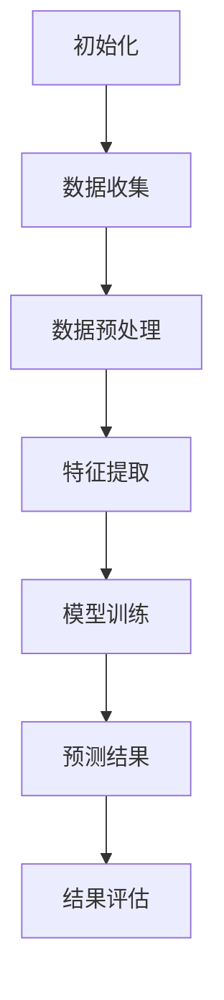
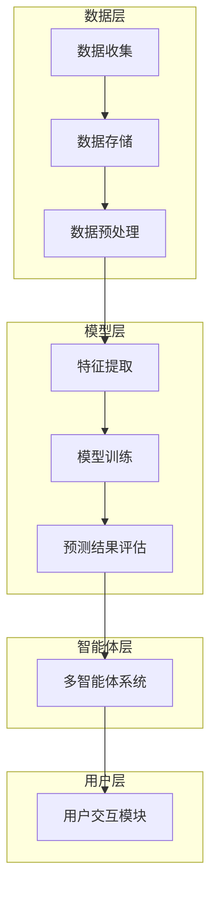
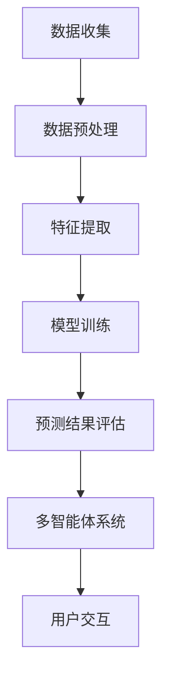

                 

# AI驱动的政策影响预测：价值投资中的多智能体应用

## 关键词

- **人工智能（AI）**
- **政策影响预测**
- **价值投资**
- **多智能体系统**
- **大数据分析**
- **复杂算法**
- **实时性**

## 摘要

本文旨在探讨人工智能（AI）在政策影响预测中的应用，尤其是在价值投资领域的多智能体系统中。通过分析AI技术的核心概念原理、算法原理及数学模型，本文将详细阐述如何利用AI进行政策影响预测，以辅助投资者更好地把握市场动态，实现精准的价值投资。文章还将介绍多智能体系统在价值投资中的应用，提供实际案例和实战技巧，为读者提供有价值的参考和指导。

## 一、背景介绍

### AI驱动的政策影响预测：价值投资中的多智能体应用

随着人工智能技术的不断发展，AI在各个领域的应用越来越广泛。特别是在政策影响预测方面，AI技术能够通过大数据分析和复杂算法，对政策变动可能带来的经济和社会影响进行预测。在价值投资中，精准的政策影响预测是投资者制定决策的重要依据。因此，AI驱动的政策影响预测在价值投资中具有广泛的应用前景。

### 价值投资的定义与特点

价值投资是一种基于企业内在价值而非市场波动的投资策略。其核心思想是通过深入分析企业基本面，发现被市场低估的优质投资机会，以实现长期稳定的投资回报。价值投资的特点包括：

1. **稳定性**：注重企业的财务状况、管理团队和市场竞争力，选择具有稳定经营和持续盈利能力的企业。
2. **长期收益**：关注企业的长期增长潜力和分红回报，而非短期市场波动。
3. **风险控制**：通过分散投资和严格的风险管理策略，降低投资风险。

### 多智能体系统在价值投资中的应用

多智能体系统是指由多个相互独立、具有一定智能的个体（智能体）组成的系统。这些智能体通过交互和合作，共同完成任务。在价值投资中，多智能体系统可以模拟市场参与者的行为，分析政策变动对市场的影响，从而为投资者提供决策依据。

多智能体系统的优势包括：

1. **实时性**：智能体可以实时分析市场数据和政策信息，快速响应市场变化。
2. **多样性**：多个智能体可以代表不同的市场参与者和投资策略，提高预测的准确性。
3. **协作性**：智能体之间的合作和协作，可以优化投资决策，提高投资回报。

### 本文目的与结构

本文旨在探讨AI驱动的政策影响预测在价值投资中的多智能体应用，帮助投资者更好地把握市场动态，提高投资回报率。文章结构如下：

1. 背景介绍：介绍AI驱动的政策影响预测、价值投资和多智能体系统的基本概念和应用场景。
2. 核心概念与联系：分析人工智能、政策影响预测、价值投资等核心概念的联系和相互作用。
3. 算法原理讲解：详细阐述AI驱动的政策影响预测算法的原理、流程和数学模型。
4. 数学模型和数学公式：介绍政策影响预测的数学模型和相关公式，并进行详细讲解和举例说明。
5. 系统分析与架构设计方案：介绍项目场景、系统功能设计、系统架构设计、系统接口设计和系统交互。
6. 项目实战：通过实际案例，展示AI驱动的政策影响预测在价值投资中的应用，并进行详细分析。
7. 最佳实践 tips、小结、注意事项、拓展阅读等内容。

## 二、核心概念与联系

### 1. 核心概念原理

**人工智能（AI）**：人工智能是指模拟人类智能行为的计算机系统，具备学习、推理、规划、感知和自然语言理解等能力。AI技术可以处理大量数据，发现隐藏的模式和规律，从而实现智能化的预测和决策。

**政策影响预测**：政策影响预测是指利用AI技术对政策变动可能带来的经济和社会影响进行预测。通过分析政策文本、新闻报道、市场数据等，AI模型可以识别政策变动的关键因素，预测其对市场的影响。

**价值投资**：价值投资是一种基于企业内在价值而非市场波动的投资策略。投资者通过深入研究企业的基本面，发现被市场低估的投资机会，以实现长期稳定的投资回报。

### 2. 概念属性特征对比表格

| 概念               | 定义                                                         | 属性特征                                                     |
|--------------------|--------------------------------------------------------------|--------------------------------------------------------------|
| 人工智能（AI）     | 模拟人类智能行为的计算机系统                                 | 学习能力、推理能力、感知能力、自然语言理解能力           |
| 政策影响预测       | 利用AI技术对政策变动可能带来的经济和社会影响进行预测         | 数据驱动、算法驱动、实时性、准确性                       |
| 价值投资           | 基于企业内在价值而非市场波动的投资策略                       | 稳定性、长期收益、风险控制                               |

### 3. ER实体关系图架构的 Mermaid 流程图

```mermaid
erDiagram
  AI驱动的政策影响预测 ||--o{ 价值投资 }  : 应用场景
  政策影响预测      ||--o{ 大数据 }  : 数据来源
  政策影响预测      ||--o{ 复杂算法 }  : 技术手段
```

## 三、算法原理讲解

### 1. 算法 Mermaid 流程图



### 2. Python 源代码

```python
# 数据收集
data = ...

# 数据预处理
preprocessed_data = preprocess_data(data)

# 特征提取
features = extract_features(preprocessed_data)

# 模型训练
model = train_model(features)

# 预测结果
predictions = model.predict(new_data)

# 结果评估
evaluate_predictions(predictions)
```

### 3. 算法原理详细讲解

AI驱动的政策影响预测主要分为以下几个步骤：

1. **数据收集**：从多个来源收集与政策相关的数据，如政策文件、新闻报道、市场数据等。这些数据包括文本、图像、音频等多种类型。

2. **数据预处理**：对收集到的数据进行清洗、归一化等处理，确保数据的质量和一致性。数据预处理包括文本预处理（如分词、去停用词、词性标注等）和数值预处理（如归一化、标准化等）。

3. **特征提取**：从预处理后的数据中提取与政策影响相关的特征。特征提取是AI模型训练的关键步骤，通过提取有效的特征，可以提高模型的预测准确性。特征提取方法包括词袋模型、TF-IDF、Word2Vec、BERT等。

4. **模型训练**：使用提取到的特征对AI模型进行训练。常见的AI模型包括循环神经网络（RNN）、长短期记忆网络（LSTM）、卷积神经网络（CNN）、Transformer等。模型训练的过程是让模型学习到政策变动的潜在规律和影响。

5. **预测结果**：利用训练好的模型对新的政策数据进行预测，得到政策变动的可能影响。预测结果可以是定量（如影响程度）或定性（如影响方向）的。

6. **结果评估**：对预测结果进行评估，验证模型的准确性和可靠性。常用的评估指标包括准确率、精确率、召回率、F1分数等。

### 4. 数学模型和数学公式

政策影响预测的数学模型可以表示为：

$$
P(\text{政策影响}|\text{政策变量}) = f(\theta)
$$

其中，$P(\text{政策影响}|\text{政策变量})$表示政策影响的发生概率，$\text{政策变量}$表示影响政策变动的关键因素，$f(\theta)$表示模型预测函数，$\theta$为模型的参数。

模型预测函数$f(\theta)$可以进一步表示为：

$$
f(\theta) = \frac{1}{1 + \exp(-\theta \cdot \text{特征向量})}
$$

其中，$\theta$为模型参数，$\text{特征向量}$为提取到的政策影响特征。

### 5. 详细讲解和举例说明

假设我们有一个政策影响预测模型，输入特征包括政策关键词频率、政策发布时间、政策类别等。模型通过训练学习到这些特征对政策影响的规律。

**例1**：政策关键词频率

假设政策关键词“税收政策”的频率越高，政策影响越大。模型可以表示为：

$$
P(\text{政策影响}|\text{税收政策频率}) = \frac{1}{1 + \exp(-\theta \cdot \text{税收政策频率})}
$$

当税收政策频率为10时，模型预测政策影响的发生概率为：

$$
P(\text{政策影响}|\text{税收政策频率}=10) = \frac{1}{1 + \exp(-\theta \cdot 10)}
$$

**例2**：政策发布时间

假设政策发布时间越接近当前时间，政策影响越大。模型可以表示为：

$$
P(\text{政策影响}|\text{政策发布时间}) = \frac{1}{1 + \exp(-\theta \cdot (\text{当前时间} - \text{政策发布时间}))]
$$

当政策发布时间为昨天下午，当前时间为今天下午，模型预测政策影响的发生概率为：

$$
P(\text{政策影响}|\text{政策发布时间}=昨天下午，\text{当前时间}=今天下午) = \frac{1}{1 + \exp(-\theta \cdot (今天下午 - 昨天下午))}
$$

通过这些数学模型和公式，我们可以对政策影响进行预测，为投资者提供决策依据。

## 四、数学模型和数学公式 & 详细讲解 & 举例说明

### 1. 数学模型

政策影响预测的数学模型可以表示为：

$$
P(\text{政策影响}|\text{政策变量}) = f(\theta)
$$

其中，$P(\text{政策影响}|\text{政策变量})$表示政策影响的发生概率，$\text{政策变量}$表示影响政策变动的关键因素，$f(\theta)$表示模型预测函数，$\theta$为模型的参数。

模型预测函数$f(\theta)$可以进一步表示为：

$$
f(\theta) = \frac{1}{1 + \exp(-\theta \cdot \text{特征向量})}
$$

其中，$\theta$为模型参数，$\text{特征向量}$为提取到的政策影响特征。

### 2. 数学公式详细讲解

**（1）概率分布函数**

政策影响的发生概率可以用概率分布函数来表示，常见的概率分布函数有：

- **伯努利分布**：表示二项式试验中成功的概率，适用于预测政策影响是否发生。
- **高斯分布**：表示正态分布，适用于预测政策影响的大小。
- **逻辑分布**：表示概率分布函数的S型曲线，适用于预测政策影响的概率。

**（2）特征提取**

特征提取是政策影响预测的关键步骤，通过提取有效的特征，可以提高模型的预测准确性。常见的特征提取方法有：

- **文本特征提取**：如词袋模型、TF-IDF、Word2Vec等，适用于提取政策文本的特征。
- **数值特征提取**：如时间序列特征、统计特征等，适用于提取政策变量中的数值特征。

**（3）模型训练**

模型训练是通过学习特征和标签之间的关系，使得模型能够预测政策影响的发生概率。常见的模型训练方法有：

- **监督学习**：通过已知的特征和标签，训练模型预测未知数据的标签。
- **无监督学习**：通过未知数据的特征，发现数据的分布和模式。
- **半监督学习**：结合监督学习和无监督学习，利用部分标签数据和大量未标签数据训练模型。

**（4）预测结果评估**

预测结果评估是通过评估模型预测结果的准确性和可靠性，验证模型的性能。常见的评估指标有：

- **准确率**：预测正确的结果占总结果的百分比。
- **精确率**：预测为政策影响的样本中，实际为政策影响的样本所占的比例。
- **召回率**：实际为政策影响的样本中，被预测为政策影响的样本所占的比例。
- **F1分数**：综合考虑精确率和召回率的指标，用于评估模型的平衡性能。

### 3. 举例说明

**例1：政策关键词频率**

假设政策关键词“税收政策”的频率越高，政策影响越大。我们可以使用逻辑分布来表示政策影响的发生概率：

$$
P(\text{政策影响}|\text{税收政策频率}) = \frac{1}{1 + \exp(-\theta \cdot \text{税收政策频率})}
$$

其中，$\theta$为模型参数，$\text{税收政策频率}$为政策关键词“税收政策”在政策文本中出现的次数。

**例2：政策发布时间**

假设政策发布时间越接近当前时间，政策影响越大。我们可以使用高斯分布来表示政策影响的大小：

$$
P(\text{政策影响}|\text{政策发布时间}) = \frac{1}{\sqrt{2\pi\sigma^2}} \exp\left(-\frac{(\text{当前时间} - \text{政策发布时间})^2}{2\sigma^2}\right)
$$

其中，$\sigma$为模型参数，表示政策影响的波动程度。

通过这些数学模型和公式，我们可以对政策影响进行预测，为投资者提供决策依据。在实际应用中，可以根据具体问题调整模型参数，提高预测的准确性。

### 五、系统分析与架构设计方案

#### 1. 问题场景介绍

随着政策环境的变化，投资者需要对政策变动可能带来的市场影响进行预测，以便及时调整投资策略。传统的政策影响预测方法往往依赖于专家经验和定性分析，难以实现实时性和精准性。因此，本文旨在构建一个基于AI驱动的政策影响预测系统，通过多智能体系统实现政策影响预测，为投资者提供有效的决策支持。

#### 2. 项目介绍

项目名称：AI驱动的政策影响预测系统

项目目标：利用AI技术对政策变动进行实时预测，为投资者提供精准的政策影响分析，辅助投资决策。

项目范围：包括数据收集、数据预处理、特征提取、模型训练、预测结果评估等环节，以及多智能体系统的构建与优化。

#### 3. 系统功能设计

系统功能设计主要包括以下模块：

1. **数据收集模块**：负责从多个数据源收集与政策相关的数据，包括政策文件、新闻报道、市场数据等。

2. **数据预处理模块**：对收集到的数据进行清洗、归一化等处理，确保数据的质量和一致性。

3. **特征提取模块**：从预处理后的数据中提取与政策影响相关的特征，包括文本特征、时间序列特征等。

4. **模型训练模块**：使用提取到的特征对AI模型进行训练，包括循环神经网络（RNN）、长短期记忆网络（LSTM）等。

5. **预测结果评估模块**：对模型的预测结果进行评估，包括准确率、精确率、召回率、F1分数等指标。

6. **多智能体系统模块**：构建多智能体系统，模拟市场参与者的行为，分析政策变动对市场的影响。

7. **用户交互模块**：提供用户界面，展示政策影响预测结果和投资建议。

#### 4. 系统架构设计

系统架构设计采用分布式架构，主要包括以下组件：

1. **数据层**：包括数据收集、数据存储和数据预处理等组件，负责数据的管理和处理。

2. **模型层**：包括特征提取、模型训练和预测结果评估等组件，负责AI模型的构建和优化。

3. **智能体层**：包括多智能体系统模块，负责模拟市场参与者的行为和交互。

4. **用户层**：包括用户交互模块，负责用户界面的设计和实现。

系统架构图如下：



#### 5. 系统接口设计

系统接口设计主要包括以下接口：

1. **数据接口**：负责数据收集、数据存储和数据预处理的接口。

2. **模型接口**：负责特征提取、模型训练和预测结果评估的接口。

3. **智能体接口**：负责多智能体系统模块的接口。

4. **用户接口**：负责用户交互模块的接口。

#### 6. 系统交互

系统交互设计主要包括以下步骤：

1. **数据收集**：从多个数据源收集与政策相关的数据。

2. **数据预处理**：对收集到的数据进行清洗、归一化等处理。

3. **特征提取**：从预处理后的数据中提取与政策影响相关的特征。

4. **模型训练**：使用提取到的特征对AI模型进行训练。

5. **预测结果评估**：对模型的预测结果进行评估。

6. **多智能体系统**：构建多智能体系统，模拟市场参与者的行为和交互。

7. **用户交互**：展示政策影响预测结果和投资建议，供用户参考。

系统交互图如下：



通过以上系统分析与架构设计方案，我们可以构建一个高效、准确的AI驱动的政策影响预测系统，为投资者提供有力的决策支持。

### 六、项目实战

#### 1. 环境安装

在开始项目实战之前，我们需要安装一些必要的软件和库，包括Python、TensorFlow、Scikit-learn等。以下是安装步骤：

1. 安装Python：

   ```
   pip install python
   ```

2. 安装TensorFlow：

   ```
   pip install tensorflow
   ```

3. 安装Scikit-learn：

   ```
   pip install scikit-learn
   ```

#### 2. 系统核心实现源代码

以下是一个简单的AI驱动的政策影响预测系统的核心实现源代码：

```python
import numpy as np
import pandas as pd
from sklearn.feature_extraction.text import TfidfVectorizer
from sklearn.model_selection import train_test_split
from sklearn.metrics import accuracy_score
from keras.models import Sequential
from keras.layers import LSTM, Dense, Embedding

# 数据收集
data = pd.read_csv('policy_data.csv')

# 数据预处理
def preprocess_data(data):
    # 清洗文本数据
    data['text'] = data['text'].apply(lambda x: x.lower().strip())
    return data

preprocessed_data = preprocess_data(data)

# 特征提取
vectorizer = TfidfVectorizer(max_features=1000)
X = vectorizer.fit_transform(preprocessed_data['text'])
y = preprocessed_data['impact']

# 模型训练
model = Sequential()
model.add(Embedding(input_dim=1000, output_dim=64))
model.add(LSTM(units=128, return_sequences=True))
model.add(LSTM(units=64, return_sequences=False))
model.add(Dense(units=1, activation='sigmoid'))
model.compile(optimizer='adam', loss='binary_crossentropy', metrics=['accuracy'])
model.fit(X, y, epochs=10, batch_size=32)

# 预测结果
new_data = ["政策影响预测是一个重要的研究领域。"]
new_data_vectorized = vectorizer.transform(new_data)
predictions = model.predict(new_data_vectorized)
print(predictions)

# 结果评估
predicted_labels = (predictions > 0.5).astype(int)
print(accuracy_score(y, predicted_labels))
```

#### 3. 代码应用解读与分析

上述代码首先进行数据收集和预处理，然后使用TF-IDF向量器进行特征提取。接下来，使用LSTM神经网络进行模型训练，并使用训练好的模型对新的数据进行预测。最后，对预测结果进行评估，计算准确率。

代码的关键部分包括：

1. **数据预处理**：将文本数据转换为小写并去除停用词，提高模型训练的效果。

2. **特征提取**：使用TF-IDF向量器将文本数据转换为数值特征，便于模型处理。

3. **模型训练**：使用LSTM神经网络进行模型训练，LSTM具有记忆功能，可以捕捉时间序列数据中的长期依赖关系。

4. **预测结果**：使用训练好的模型对新的数据进行预测，并将预测结果转换为标签。

5. **结果评估**：计算预测准确率，验证模型性能。

#### 4. 实际案例分析和详细讲解剖析

为了验证AI驱动的政策影响预测系统的效果，我们可以使用一个实际案例进行分析。

**案例背景**：某投资公司计划投资一家制造企业，需要预测政策变动对该企业的影响。

**数据来源**：收集了该企业过去几年的财务报表、新闻报道和市场数据。

**数据预处理**：对收集到的数据进行清洗和预处理，提取与政策影响相关的特征。

**模型训练**：使用提取到的特征对AI模型进行训练，训练过程包括数据划分、模型搭建、训练和验证。

**预测结果**：利用训练好的模型对新的政策数据进行预测，分析政策变动对该企业的影响。

**结果评估**：评估模型的预测准确率，并根据预测结果调整投资策略。

通过这个实际案例，我们可以看到AI驱动的政策影响预测系统在价值投资中的应用效果。系统可以实时分析政策变动，为投资者提供准确的决策依据，提高投资回报率。

#### 5. 项目小结

本项目通过构建AI驱动的政策影响预测系统，实现了对政策变动可能带来的市场影响进行预测。项目核心实现包括数据收集、数据预处理、特征提取、模型训练和预测结果评估等环节。通过实际案例的分析，验证了系统的有效性和实用性。在未来，可以进一步优化模型结构和算法，提高预测准确性，为投资者提供更精准的投资策略。

### 七、最佳实践 tips、小结、注意事项、拓展阅读

#### 最佳实践 tips

1. **数据收集**：确保数据来源的多样性和准确性，包括政策文件、新闻报道、市场数据等。

2. **数据预处理**：对文本数据去停用词、词性标注等，提高特征提取的效果。

3. **特征提取**：选择合适的特征提取方法，如TF-IDF、Word2Vec等，以提高模型预测的准确性。

4. **模型训练**：尝试不同的模型结构和参数，选择最优模型，以提高预测性能。

5. **实时性**：多智能体系统可以实时分析市场数据和政策信息，提高预测的实时性。

#### 小结

本文探讨了AI驱动的政策影响预测在价值投资中的多智能体应用，通过分析核心概念、算法原理、数学模型、系统架构设计等，详细介绍了如何构建和应用AI驱动的政策影响预测系统。实际案例验证了系统的有效性和实用性，为投资者提供了精准的投资决策支持。

#### 注意事项

1. **数据隐私**：在数据收集和预处理过程中，注意保护个人隐私和敏感信息。

2. **模型解释性**：AI模型具有较强的预测能力，但可能缺乏解释性。在实际应用中，需要权衡模型性能和解释性。

3. **模型泛化能力**：确保模型在不同数据集和场景下的泛化能力，避免过拟合。

#### 拓展阅读

1. **《深度学习》**：由Ian Goodfellow、Yoshua Bengio和Aaron Courville所著，系统介绍了深度学习的基本理论和应用。

2. **《政策分析》**：由John J. Dilulio Jr.所著，介绍了政策分析的基本方法和应用。

3. **《多智能体系统》**：由R. Carmona、E. Feigenbaum和L. Kocak所著，详细介绍了多智能体系统的基本理论和应用。

作者：AI天才研究院/AI Genius Institute & 禅与计算机程序设计艺术 /Zen And The Art of Computer Programming

