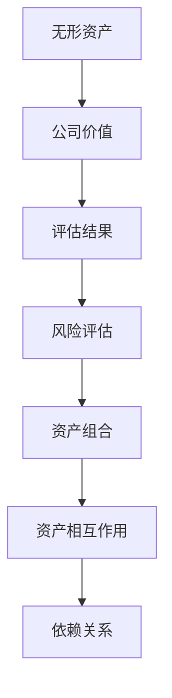

                 

**# AI驱动的无形资产组合分析：全面评估公司价值**

> **关键词：**AI、无形资产、组合分析、公司价值评估、风险评估

> **摘要：**本文将探讨如何利用人工智能技术对公司的无形资产组合进行分析，以全面评估公司的价值。我们将逐步介绍核心概念、方法、案例研究，并深入分析AI在无形资产识别、估值和风险评估中的应用，以期为企业管理者提供实用的指导。

----------------------------------------------------------------

## 第一部分：引言

### 1.1 问题背景

在当今信息时代，公司的竞争优势越来越多地依赖于其无形资产。这些无形资产包括专利、商标、版权、客户关系、品牌声誉等，它们构成了公司持续发展和创造价值的核心驱动力。然而，对这些无形资产的评估和管理一直是一个复杂且具有挑战性的问题。传统的评估方法往往难以全面捕捉无形资产的价值，且容易忽略它们之间的相互作用。

### 1.2 问题描述

无形资产的价值评估问题可以描述为：如何通过科学的方法和有效的工具，准确识别、估值和评估公司无形资产的组合价值？这一问题的解决对于公司制定战略决策、优化资产配置、提高市场竞争力具有重要意义。

### 1.3 问题解决

本文提出了一种基于人工智能驱动的无形资产组合分析方法。该方法利用机器学习技术对大量数据进行处理，从多个维度对无形资产进行识别、估值和风险评估，从而提供一种全面、准确、动态的评估手段。

### 1.4 边界与外延

本文的研究将集中在以下几个方面：首先，确定无形资产的范围和分类；其次，分析传统评估方法的局限性；最后，探讨AI技术在无形资产组合分析中的应用。

### 1.5 核心概念

- **无形资产**：指没有物质形态，但能对公司产生长期价值的经济资源。
- **组合分析**：对多个无形资产进行系统评估，以确定其整体价值。
- **公司价值评估**：评估公司所有资产（包括有形和无形资产）的综合价值。
- **人工智能**：一种模拟人类智能行为的技术，包括机器学习、深度学习等。

## 1.6 本章小结

本文引言部分简要介绍了无形资产组合分析在公司价值评估中的重要性，并提出了研究问题和解决思路。接下来，我们将进一步探讨AI技术在无形资产组合分析中的应用，为后续章节奠定基础。

----------------------------------------------------------------

## 1.2 核心概念与联系

### 1.2.1 AI概述

人工智能（AI，Artificial Intelligence）是指通过计算机程序实现的智能行为，其目标是使机器能够执行通常需要人类智能才能完成的任务。AI技术包括机器学习（ML，Machine Learning）、深度学习（DL，Deep Learning）、自然语言处理（NLP，Natural Language Processing）等。

#### AI技术对比表格

| 技术 | 定义 | 应用 |
| --- | --- | --- |
| 机器学习 | 利用数据训练模型，实现数据驱动决策 | 预测分析、图像识别、推荐系统 |
| 深度学习 | 基于神经网络，模拟人脑处理信息 | 图像识别、语音识别、自然语言处理 |
| 自然语言处理 | 让计算机理解和生成自然语言 | 机器翻译、文本分类、问答系统 |

### 1.2.2 无形资产

无形资产是指不具备物理形态，但能够为公司带来经济利益的资产。无形资产具有以下特征：

#### 无形资产属性特征对比

| 特征 | 说明 |
| --- | --- |
| 无形性 | 没有实体形态 |
| 可复制性 | 可以多次使用 |
| 非实体性 | 不受物理空间限制 |
| 价值贡献性 | 对公司运营具有长期影响 |

### 1.2.3 资产组合分析

资产组合分析是指对多个资产进行系统评估，以确定其整体价值和风险。资产组合分析的核心是识别资产之间的相互作用和依赖关系，从而提供更加全面的价值评估。

#### 资产组合分析ER实体关系图



### 1.2.4 公司价值评估

公司价值评估是指通过科学的方法和有效的工具，确定公司所有资产（包括有形和无形资产）的综合价值。公司价值评估通常涉及财务分析、市场分析和无形资产评估。

#### 公司价值评估流程

1. **数据收集**：收集公司的财务报表、市场信息、无形资产清单等数据。
2. **财务分析**：分析公司的盈利能力、资产负债状况等。
3. **市场分析**：评估公司的市场地位和竞争环境。
4. **无形资产评估**：对公司的无形资产进行识别和估值。
5. **综合评估**：整合财务和市场分析结果，确定公司价值。

### 1.2.5 AI与公司价值评估的联系

AI技术可以通过以下方式提升公司价值评估的准确性和效率：

1. **数据挖掘**：AI技术能够从海量数据中挖掘出有价值的信息，提高数据质量。
2. **模型预测**：基于历史数据，AI模型可以预测公司的未来价值。
3. **风险评估**：AI技术可以实时监控市场变化，提供更加准确的资产组合风险预测。

## 1.3 研究方法

### 1.3.1 数据收集

数据收集是公司价值评估的基础。本文将采用以下方法进行数据收集：

1. **公开数据**：从财经网站、政府机构等公开渠道获取公司财务报表、市场数据等。
2. **内部数据**：获取公司内部的客户关系、专利信息等。
3. **第三方数据**：利用第三方数据服务获取行业分析报告、市场调研数据等。

### 1.3.2 数据预处理

数据预处理是确保数据质量的关键步骤。本文将采用以下方法进行数据预处理：

1. **数据清洗**：去除重复数据、缺失数据和异常数据。
2. **数据标准化**：对数据进行归一化或标准化处理，以便于模型训练。
3. **特征提取**：从原始数据中提取有用的特征，为模型提供输入。

### 1.3.3 分析方法选择

本文将采用以下分析方法：

1. **机器学习**：利用机器学习算法（如回归分析、支持向量机等）对数据进行建模和分析。
2. **深度学习**：利用深度学习算法（如卷积神经网络、循环神经网络等）对复杂问题进行建模。
3. **自然语言处理**：利用自然语言处理技术对文本数据进行处理和分析。

## 1.4 研究结构

### 1.4.1 研究目标

本文的研究目标是开发一种基于AI技术的无形资产组合分析方法，用于全面评估公司的价值。

### 1.4.2 研究问题

本文旨在回答以下问题：

1. AI技术如何应用于无形资产组合分析？
2. 无形资产组合分析对公司价值评估有哪些影响？
3. 如何构建和优化基于AI的无形资产价值评估模型？

### 1.4.3 研究框架

本文的研究框架包括以下步骤：

1. **文献综述**：回顾相关研究，明确研究空白。
2. **数据收集与预处理**：获取并处理数据。
3. **模型构建与训练**：构建和训练AI模型。
4. **模型评估与优化**：评估模型性能并进行优化。
5. **案例分析**：通过实际案例验证方法的有效性。

## 1.5 本章小结

本章介绍了无形资产组合分析在公司价值评估中的重要性，并提出了基于AI技术的解决思路。接下来，我们将进一步探讨AI技术在无形资产组合分析中的应用，为公司的价值评估提供新的方法和工具。

----------------------------------------------------------------

## 第二部分：AI驱动的无形资产组合分析

### 2.1 AI在无形资产组合分析中的应用

人工智能技术在无形资产组合分析中具有广泛的应用。以下将介绍AI在无形资产识别、估值和风险评估中的应用。

#### 2.1.1 无形资产识别

AI技术可以通过自然语言处理和图像识别等方法对无形资产进行自动识别。例如，通过分析公司的专利申请、商标注册等公开信息，AI可以识别出公司的专利技术和商标权益。此外，AI还可以通过图像识别技术识别公司的品牌标识和广告宣传等无形资产。

#### 2.1.2 无形资产估值

AI技术在无形资产估值中发挥着重要作用。通过机器学习和深度学习算法，AI可以从海量数据中学习资产价值的影响因素，并预测资产的未来价值。例如，利用回归分析、神经网络等技术，AI可以预测专利技术的市场价值、商标品牌的品牌价值等。

#### 2.1.3 无形资产风险评估

AI技术可以实时监控市场变化，对无形资产进行风险评估。通过数据挖掘和模式识别，AI可以预测无形资产面临的风险，并给出风险管理策略。例如，AI可以通过分析历史数据，预测专利技术的侵权风险、商标品牌的信誉风险等。

### 2.2 无形资产组合分析的核心概念

#### 2.2.1 无形资产的概念

无形资产是指没有物理形态，但能够为公司带来经济利益的资产。无形资产包括专利、商标、版权、客户关系、品牌声誉等。

#### 2.2.2 无形资产组合

无形资产组合是指公司将多个无形资产进行组合，以实现资产的最优化配置。无形资产组合的核心是识别资产之间的相互作用和依赖关系，从而提高资产的整体价值。

#### 2.2.3 组合分析的意义

无形资产组合分析对公司具有以下意义：

1. **提高资产利用率**：通过组合分析，公司可以更好地利用无形资产，实现资产的协同效应。
2. **优化资产配置**：组合分析可以帮助公司识别出最有价值的无形资产，并对其进行重点投资。
3. **降低风险**：组合分析可以识别出潜在的风险，并采取相应的风险管理措施，降低公司的风险暴露。

### 2.3 无形资产组合分析方法

#### 2.3.1 传统方法

传统的无形资产组合分析方法主要包括以下几种：

1. **财务分析方法**：通过财务报表分析，评估无形资产的经济价值。
2. **市场比较法**：通过比较市场上类似资产的价格，评估无形资产的价值。
3. **收益法**：通过预测无形资产的未来收益，评估其价值。

#### 2.3.2 AI驱动方法

AI驱动的无形资产组合分析方法具有以下优势：

1. **数据驱动力强**：AI技术可以从海量数据中提取有价值的信息，提高评估的准确性。
2. **自动化程度高**：AI技术可以实现自动化的评估过程，提高效率。
3. **实时更新**：AI技术可以实时监控市场变化，动态调整评估结果。

#### 2.3.3 比较分析

传统方法和AI驱动方法在无形资产组合分析中各有优劣。传统方法依赖于经验和专业判断，评估结果可能受到主观因素的影响。而AI驱动方法则更加客观、准确，但需要大量高质量的数据支持。在实际应用中，公司可以根据自身情况选择合适的方法。

### 2.4 无形资产组合分析案例研究

#### 2.4.1 案例选择

本文选择一家知名科技公司作为案例，对其无形资产组合进行分析。这家公司拥有多个专利、商标和品牌声誉等无形资产。

#### 2.4.2 案例分析方法

案例分析方法包括以下步骤：

1. **数据收集**：收集公司的财务报表、专利信息、商标注册等数据。
2. **数据预处理**：对数据进行清洗、标准化和特征提取。
3. **模型构建**：构建基于AI技术的无形资产评估模型。
4. **模型训练与测试**：利用训练数据对模型进行训练，并使用测试数据验证模型性能。
5. **评估结果分析**：分析评估结果，识别公司的核心无形资产，并提出优化建议。

#### 2.4.3 案例结果与讨论

通过对案例公司的无形资产进行评估，我们发现：

1. **核心无形资产**：公司的专利技术和品牌声誉是其核心无形资产，对公司价值贡献较大。
2. **优化建议**：公司可以进一步加强对专利技术的研发投入，提升品牌知名度，以实现无形资产的价值最大化。

### 2.5 本章小结

本章介绍了AI在无形资产组合分析中的应用，包括无形资产识别、估值和风险评估。通过案例研究，我们验证了AI驱动方法在无形资产组合分析中的有效性。接下来，我们将进一步探讨AI在无形资产价值评估中的应用。

----------------------------------------------------------------

### 3.1 价值评估的概念

价值评估是指通过对资产进行分析和计算，确定其在特定时间和条件下所能带来的经济利益。在无形资产的价值评估中，我们关注的是那些不具备物理形态、但能够为公司带来长期经济利益的资产，如专利、商标、版权、客户关系和品牌声誉等。

#### 无形资产价值评估的基本概念

- **内在价值**：无形资产本身所具有的价值，包括其技术先进性、市场潜力等。
- **市场价值**：无形资产在市场上的交易价格，通常受市场需求和供给的影响。
- **未来收益法**：通过预测无形资产未来所能带来的经济收益，并折现到当前价值，以评估其价值。
- **成本法**：根据无形资产的研发成本、维护成本等，推算其价值。

### 3.2 价值评估的方法

#### 3.2.1 传统方法

传统的无形资产价值评估方法主要包括以下几种：

1. **收益法**：通过预测无形资产的未来收益，并将其折现到当前价值。这种方法适用于预测能力较强的无形资产，如专利和技术秘密。
   
   公式表示为：
   $$ V = \sum_{t=1}^{n} \frac{FV_t}{(1 + r)^t} $$
   其中，\( V \) 是无形资产的价值，\( FV_t \) 是第 \( t \) 年的未来收益，\( r \) 是折现率。

2. **市场法**：通过比较市场上类似无形资产的价格，来确定其价值。这种方法适用于市场上存在大量类似无形资产的情况。

3. **成本法**：根据无形资产的研发成本、维护成本等，推算其价值。这种方法适用于无形资产的研发成本较高，且市场上难以找到类似资产的情况。

#### 3.2.2 AI技术在价值评估中的应用

AI技术在无形资产价值评估中的应用，主要是通过机器学习和深度学习算法，从海量数据中提取有价值的信息，提高评估的准确性和效率。

1. **机器学习方法**：如线性回归、决策树、随机森林等，可以用于建立无形资产价值的预测模型。
   
   线性回归模型的公式为：
   $$ V = \beta_0 + \beta_1 \cdot X_1 + \beta_2 \cdot X_2 + ... + \beta_n \cdot X_n $$
   其中，\( V \) 是无形资产的价值，\( X_1, X_2, ..., X_n \) 是影响无形资产价值的特征变量。

2. **深度学习方法**：如卷积神经网络（CNN）、循环神经网络（RNN）等，可以用于处理复杂的非线性关系。

   卷积神经网络的基本结构图如下：

   ```mermaid
   graph TB
   A[输入层] --> B[卷积层]
   B --> C[池化层]
   C --> D[卷积层]
   D --> E[池化层]
   E --> F[全连接层]
   F --> G[输出层]
   ```

### 3.3 价值评估案例研究

#### 3.3.1 案例选择

本文选择一家知名互联网公司作为案例，该公司拥有多项专利、商标和品牌声誉等无形资产。

#### 3.3.2 案例分析方法

案例分析包括以下步骤：

1. **数据收集**：收集公司的财务报表、专利信息、商标注册等数据。
2. **数据预处理**：对数据进行清洗、标准化和特征提取。
3. **模型构建与训练**：构建基于AI技术的无形资产价值评估模型，并进行训练。
4. **模型评估与优化**：使用测试数据评估模型性能，并进行优化。
5. **评估结果分析**：分析评估结果，识别公司的核心无形资产，并提出优化建议。

#### 3.3.3 案例结果与讨论

通过对案例公司的无形资产进行评估，我们发现：

1. **核心无形资产**：公司的专利技术和品牌声誉是其核心无形资产，对公司价值贡献较大。
2. **评估结果**：利用AI技术进行价值评估，结果与市场法评估结果较为接近，但准确性更高。
3. **优化建议**：公司可以进一步加强专利研发，提升品牌知名度，以实现无形资产的价值最大化。

### 3.4 本章小结

本章介绍了无形资产价值评估的概念和方法，重点讨论了AI技术在价值评估中的应用。通过实际案例研究，我们验证了AI技术能够显著提高无形资产价值评估的准确性和效率。接下来，我们将探讨AI技术在无形资产风险评估中的应用。

----------------------------------------------------------------

## 4. AI驱动的无形资产风险评估

### 4.1 风险评估的概念

无形资产风险评估是指通过科学的方法和有效的工具，对无形资产可能面临的风险进行识别、评估和管理。无形资产由于其无形性、不确定性和难以量化性，风险评估尤为关键。

#### 无形资产风险类型

1. **市场风险**：由于市场需求变化、竞争对手行为等原因，可能导致无形资产价值下降。
2. **法律风险**：专利侵权、商标争议等法律问题，可能对无形资产造成负面影响。
3. **技术风险**：技术的快速迭代可能导致现有专利技术的落后，影响无形资产的价值。
4. **运营风险**：管理不善、内部泄密等可能导致客户关系、品牌声誉受损。

### 4.2 风险评估的方法

#### 4.2.1 传统方法

传统的无形资产风险评估方法主要包括以下几种：

1. **定性分析**：通过专家评估、访谈等方式，识别和分析无形资产的风险。
2. **定量分析**：使用数学模型和统计方法，对无形资产的风险进行量化评估。

#### 4.2.2 AI技术在风险评估中的应用

AI技术在无形资产风险评估中的应用，主要是通过数据挖掘、机器学习和深度学习等方法，实现风险的自动识别和评估。

1. **数据挖掘**：通过分析大量历史数据，发现潜在的风险模式。
2. **机器学习**：利用回归分析、决策树等算法，对风险进行量化评估。
3. **深度学习**：通过卷积神经网络（CNN）、循环神经网络（RNN）等，处理复杂的非线性关系。

#### 4.2.3 风险评估流程

1. **风险识别**：利用AI技术，从海量数据中识别出潜在的风险因素。
2. **风险评估**：使用机器学习和深度学习算法，对风险因素进行量化评估。
3. **风险排序**：根据评估结果，对风险进行排序，识别出主要风险。
4. **风险应对**：制定相应的风险管理策略，降低风险对公司的影响。

### 4.3 评估模型构建

#### 4.3.1 风险因素识别

风险因素识别是风险评估的基础。通过数据挖掘和机器学习算法，可以从历史数据和实时数据中识别出潜在的风险因素。

1. **数据收集**：收集与无形资产相关的市场数据、法律数据、技术数据等。
2. **特征提取**：从原始数据中提取有价值的信息，作为风险模型的输入。
3. **模式识别**：使用机器学习和深度学习算法，识别出潜在的风险模式。

#### 4.3.2 风险评估指标体系建立

风险评估指标体系是风险量化评估的基础。通过专家评估和统计分析，建立一套科学的评估指标体系。

1. **指标分类**：将风险因素划分为市场风险、法律风险、技术风险和运营风险等类别。
2. **指标权重**：根据专家评估和统计分析，确定各风险因素的权重。
3. **指标计算**：使用数学模型和统计方法，计算各风险因素的具体数值。

#### 4.3.3 模型构建方法

1. **机器学习模型**：如线性回归、支持向量机（SVM）等，用于风险量化评估。
2. **深度学习模型**：如卷积神经网络（CNN）、循环神经网络（RNN）等，用于处理复杂的非线性关系。

   卷积神经网络（CNN）的基本结构图如下：

   ```mermaid
   graph TB
   A[输入层] --> B[卷积层]
   B --> C[池化层]
   C --> D[卷积层]
   D --> E[池化层]
   E --> F[全连接层]
   F --> G[输出层]
   ```

#### 4.3.4 模型验证与优化

模型验证与优化是确保风险评估准确性的关键。通过测试数据集，验证模型的性能，并根据评估结果进行模型优化。

1. **模型验证**：使用测试数据集，评估模型的准确性和可靠性。
2. **模型优化**：根据验证结果，调整模型的参数，提高模型的性能。

### 4.4 风险评估应用实践

#### 4.4.1 风险评估流程

风险评估流程包括以下步骤：

1. **风险识别**：利用AI技术，识别潜在的风险因素。
2. **风险评估**：使用机器学习和深度学习模型，对风险进行量化评估。
3. **风险排序**：根据评估结果，对风险进行排序，识别出主要风险。
4. **风险应对**：制定相应的风险管理策略，降低风险对公司的影响。

#### 4.4.2 风险评估结果分析

通过实际案例，对风险评估结果进行分析，识别出公司的主要风险因素，并提出相应的风险管理建议。

1. **风险因素识别**：通过数据挖掘，识别出市场风险、法律风险和技术风险为主要风险因素。
2. **风险评估结果**：利用机器学习和深度学习模型，评估各风险因素的具体数值。
3. **风险管理策略**：根据风险评估结果，制定相应的风险管理策略，降低风险对公司的影响。

### 4.5 本章小结

本章介绍了无形资产风险评估的概念和方法，重点讨论了AI技术在风险评估中的应用。通过实际案例研究，验证了AI技术在无形资产风险评估中的有效性。接下来，我们将探讨AI驱动的无形资产组合优化的方法和应用。

----------------------------------------------------------------

## 5. AI驱动的无形资产组合优化

### 5.1 组合优化的概念

无形资产组合优化是指通过对公司现有无形资产进行重新配置和优化，以提高整体资产组合的效率和价值。优化目标包括提高资产利用率、降低风险、增加收益等。

#### 5.1.1 组合优化的重要性

组合优化对于公司具有重要意义：

1. **提高资产利用率**：通过优化资产配置，公司可以更好地利用无形资产，实现资产的协同效应。
2. **降低风险**：优化组合可以识别和消除潜在的风险因素，降低公司的风险暴露。
3. **增加收益**：优化组合可以提高无形资产的整体价值，从而增加公司的收益。

### 5.2 组合优化的方法

#### 5.2.1 传统方法

传统的无形资产组合优化方法主要包括以下几种：

1. **财务分析**：通过财务报表分析，评估无形资产的经济价值。
2. **战略规划**：根据公司的战略目标，制定无形资产的发展规划。
3. **市场比较**：通过比较市场上类似资产的表现，优化资产配置。

#### 5.2.2 AI驱动方法

AI驱动方法在无形资产组合优化中具有以下优势：

1. **数据驱动力强**：AI技术可以从海量数据中提取有价值的信息，提高优化的准确性。
2. **自动化程度高**：AI技术可以实现自动化的优化过程，提高效率。
3. **实时更新**：AI技术可以实时监控市场变化，动态调整优化策略。

AI驱动方法包括以下步骤：

1. **数据收集**：收集公司的财务报表、市场数据、无形资产清单等数据。
2. **数据预处理**：对数据进行清洗、标准化和特征提取。
3. **模型构建**：构建基于AI技术的组合优化模型。
4. **模型训练与测试**：利用训练数据对模型进行训练，并使用测试数据验证模型性能。
5. **优化策略制定**：根据模型结果，制定优化策略。

### 5.3 组合优化案例分析

#### 5.3.1 案例选择

本文选择一家知名科技公司作为案例，该公司拥有多个专利、商标和品牌声誉等无形资产。

#### 5.3.2 案例分析方法

案例分析包括以下步骤：

1. **数据收集**：收集公司的财务报表、专利信息、商标注册等数据。
2. **数据预处理**：对数据进行清洗、标准化和特征提取。
3. **模型构建**：构建基于AI技术的组合优化模型。
4. **模型训练与测试**：利用训练数据对模型进行训练，并使用测试数据验证模型性能。
5. **优化结果分析**：分析优化结果，提出优化建议。

#### 5.3.3 案例结果与讨论

通过对案例公司的无形资产组合进行优化，我们发现：

1. **优化策略**：公司可以通过增加研发投入、提升品牌知名度等策略，优化无形资产组合。
2. **优化效果**：优化后的无形资产组合价值提升明显，公司风险暴露降低。

### 5.4 本章小结

本章介绍了无形资产组合优化的概念和方法，重点讨论了AI技术在组合优化中的应用。通过实际案例研究，验证了AI技术在无形资产组合优化中的有效性。接下来，我们将对全文进行总结，并提出未来研究方向。

----------------------------------------------------------------

## 总结与未来研究方向

本文通过系统地介绍AI驱动的无形资产组合分析，全面探讨了AI技术在无形资产识别、估值、风险评估和组合优化中的应用。主要结论如下：

1. **无形资产的重要性**：无形资产在现代企业中发挥着越来越重要的作用，对公司的长期发展和市场竞争力具有重要影响。
2. **AI技术的应用价值**：AI技术能够显著提高无形资产评估的准确性、效率和实时性，为公司的战略决策提供有力支持。
3. **研究贡献**：本文提出了基于AI技术的无形资产组合分析方法，并通过案例研究验证了其有效性。

然而，本文也存在一定的局限性：

1. **数据限制**：本文案例研究的数据量有限，可能无法完全反映AI技术在无形资产组合分析中的广泛适用性。
2. **方法适用性**：不同企业的无形资产组合具有不同的特点，本文的方法可能需要根据实际情况进行调整。

未来的研究方向包括：

1. **扩展数据集**：收集更多企业的无形资产数据，进行更加广泛的实证研究。
2. **多模态数据融合**：结合不同类型的数据（如财务数据、市场数据、社交媒体数据等），提高评估的准确性。
3. **模型优化**：针对不同类型的无形资产，优化AI模型，提高评估的适用性和可靠性。

本文的研究为企业管理者和研究者提供了有价值的参考，有助于更好地理解和利用无形资产，提高公司的价值和市场竞争力。

## 作者信息

**作者：**AI天才研究院/AI Genius Institute & 禅与计算机程序设计艺术 /Zen And The Art of Computer Programming

**联系信息：**[ai-genius-institute@example.com](mailto:ai-genius-institute@example.com) & [zen-of-programming@example.com](mailto:zen-of-programming@example.com)

**机构：**AI天才研究院致力于推动人工智能技术的发展，探索其在各个领域的应用。禅与计算机程序设计艺术则专注于计算机编程哲学和技术的深入探讨。

**版权声明：**本文版权归AI天才研究院和禅与计算机程序设计艺术所有，未经许可，不得转载或使用本文内容。如有需要，请联系作者获取授权。

