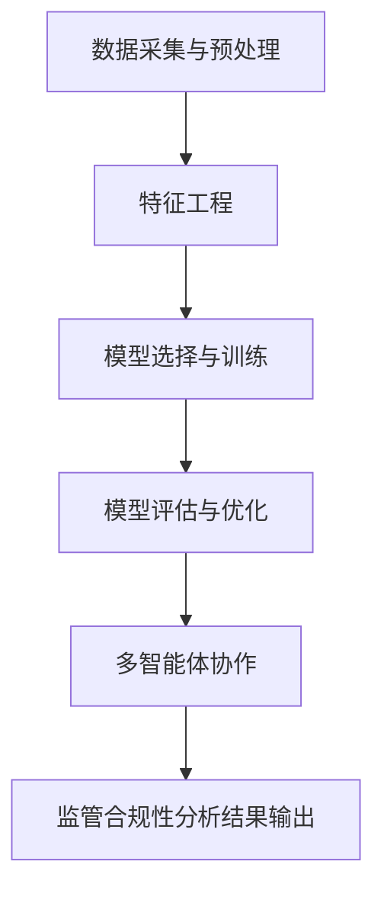
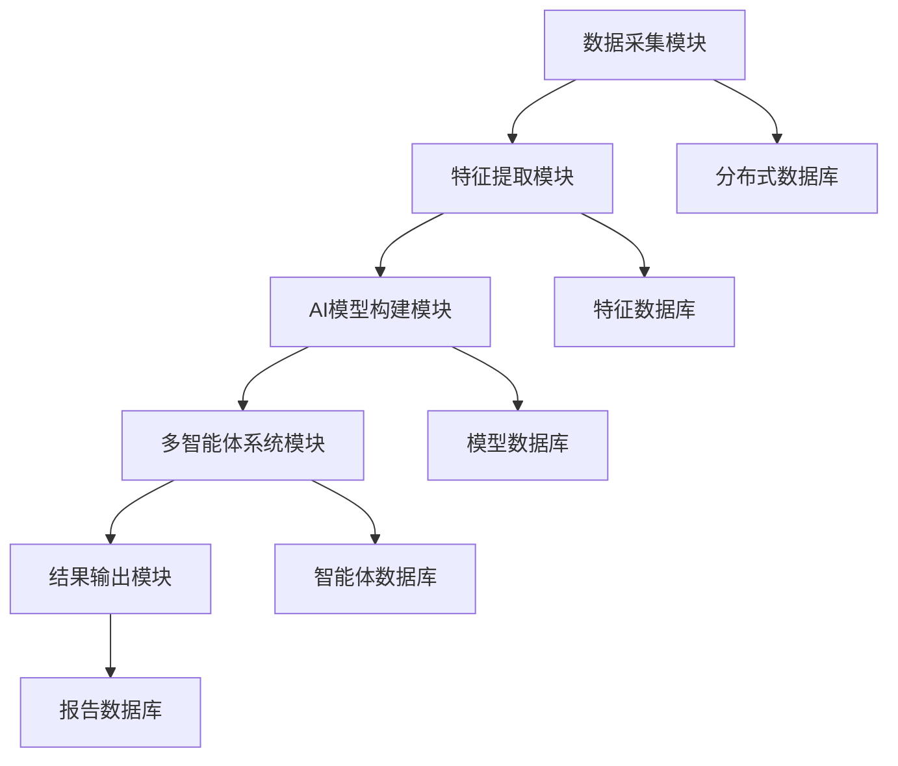
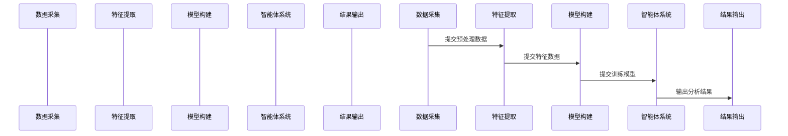
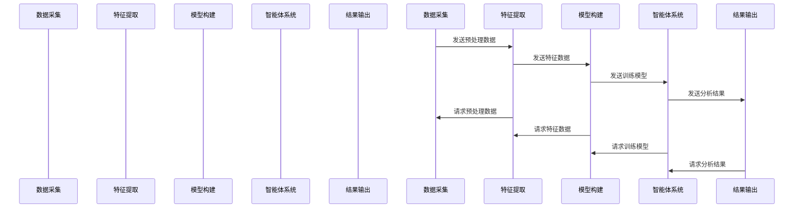

                 

# AI驱动的监管合规性分析：价值投资中的多智能体应用

## 关键词

- AI
- 监管合规性分析
- 多智能体系统
- 价值投资
- 数学模型与算法

## 摘要

本文将探讨如何利用人工智能（AI）驱动的多智能体系统，实现对价值投资中的监管合规性分析。文章首先介绍了监管合规性分析的重要性以及AI和智能体系统的基本概念，然后构建了AI驱动的监管合规性分析框架。接着，文章详细讲解了相关的数学模型与算法原理，并通过Python源代码实现了算法。随后，文章分析了系统架构设计，并在实战项目中进行了环境安装和代码实现。最后，文章总结了最佳实践与注意事项，并对未来应用进行了展望。

## 目录大纲

```markdown
----------------------------------------------------------------
# 第一部分: 背景介绍与核心概念

## 1. 引言

### 1.1 问题背景

### 1.2 问题描述

### 1.3 解决方案概述

### 1.4 边界与外延

### 1.5 概念结构与核心要素组成

## 2. 核心概念与联系

### 2.1 AI与监管合规性分析

### 2.2 多智能体系统

### 2.3 价值投资

### 2.4 AI驱动的监管合规性分析框架

## 3. 数学模型与算法原理

### 3.1 数学模型介绍

### 3.2 算法原理讲解

### 3.3 算法流程图（使用Mermaid绘制）

### 3.4 Python源代码实现

### 3.5 数学模型与公式的详细讲解

### 3.6 举例说明

## 4. 系统分析与架构设计方案

### 4.1 问题场景介绍

### 4.2 项目介绍

### 4.3 系统功能设计（使用Mermaid绘制领域模型类图）

### 4.4 系统架构设计（使用Mermaid绘制架构图）

### 4.5 系统接口设计

### 4.6 系统交互（使用Mermaid绘制序列图）

## 5. 项目实战

### 5.1 环境安装

### 5.2 系统核心实现源代码

### 5.3 代码应用解读与分析

### 5.4 实际案例分析与详细讲解剖析

### 5.5 项目小结

## 6. 最佳实践与注意事项

### 6.1 最佳实践 Tips

### 6.2 注意事项

### 6.3 拓展阅读

## 7. 总结

### 7.1 本书内容的回顾

### 7.2 对未来应用的展望

----------------------------------------------------------------
```

### 引言

#### 1.1 问题背景

在金融市场中，监管合规性分析是一项至关重要的任务。随着金融市场的不断发展，各类金融产品的多样性和复杂性不断增加，这使得监管机构在执行监管职能时面临着巨大的挑战。传统的监管合规性分析方法通常依赖于大量的人工审核和数据处理，不仅效率低下，而且容易出现人为错误。因此，如何利用先进的技术手段提高监管合规性分析的效率和准确性，成为了金融行业亟需解决的问题。

#### 1.2 问题描述

在价值投资中，监管合规性分析主要涉及以下几个方面：

1. 投资组合的合规性检查：确保投资组合中包含的金融产品符合监管要求，如资本充足率、风险限额等。
2. 投资交易行为的合规性监控：实时监控投资交易行为，发现潜在的违规行为，如内幕交易、操纵市场等。
3. 风险管理：通过监管合规性分析，识别和评估潜在的风险，为风险管理部门提供决策支持。

然而，传统的监管合规性分析方法在面对海量数据和复杂的市场环境时，往往力不从心。因此，如何利用人工智能（AI）技术，特别是多智能体系统，来实现高效、准确的监管合规性分析，成为了当前的研究热点。

#### 1.3 解决方案概述

本文提出的解决方案基于AI驱动的多智能体系统，旨在提高价值投资中的监管合规性分析效率。具体包括以下几个步骤：

1. **数据收集与预处理**：收集与投资相关的各种数据，如市场数据、交易数据、法规数据等，并进行预处理，以消除噪声和异常值。
2. **AI模型构建**：利用机器学习和深度学习技术，构建AI模型，用于识别和预测潜在的违规行为和风险。
3. **多智能体系统设计**：设计一个多智能体系统，实现AI模型之间的协作和交互，以提高监管合规性分析的整体效率。
4. **系统部署与运行**：将AI驱动的多智能体系统部署到实际环境中，进行实时监控和数据分析。

#### 1.4 边界与外延

本文的研究范围主要限于AI驱动的监管合规性分析在价值投资中的应用。尽管AI技术在金融领域的应用已经相当广泛，但本文仅关注与价值投资相关的具体场景。此外，本文的研究也假设市场数据是完整和准确的，没有考虑数据缺失和噪声的影响。

#### 1.5 概念结构与核心要素组成

本文的核心概念包括AI、监管合规性分析、多智能体系统和价值投资。以下是对这些核心概念的详细解释和它们之间的联系：

1. **AI（人工智能）**：AI是指通过计算机模拟人类智能行为的技术。在本文中，AI主要用于构建和训练监管合规性分析模型。
2. **监管合规性分析**：监管合规性分析是指通过分析投资行为和市场数据，确保投资活动符合相关法规和监管要求。这是本文的研究核心。
3. **多智能体系统**：多智能体系统是由多个智能体组成的系统，这些智能体可以通过通信和协作，实现复杂任务的目标。在本文中，多智能体系统用于实现AI模型之间的协作和交互。
4. **价值投资**：价值投资是一种基于基本面分析的投资策略，旨在通过投资低估的证券，获取长期稳定的回报。这是本文的研究背景。

这些核心概念之间的联系在于：AI技术为监管合规性分析提供了强大的工具，而多智能体系统则实现了AI模型之间的协作，共同提高监管合规性分析的整体效率。价值投资作为本文的研究背景，为AI驱动的监管合规性分析提供了一个实际的应用场景。

### 核心概念与联系

#### 2.1 AI与监管合规性分析

人工智能（AI）是监管合规性分析的关键技术之一。AI技术通过模拟人类智能行为，可以自动识别和分类数据、预测市场趋势、发现潜在违规行为等。在监管合规性分析中，AI技术可以用于以下几个方面：

1. **数据预处理**：AI技术可以自动清洗和预处理数据，消除噪声和异常值，提高数据的准确性和可靠性。
2. **模式识别**：AI技术可以自动识别数据中的模式，如市场趋势、投资行为等，为监管机构提供有价值的洞察。
3. **违规行为检测**：AI技术可以自动检测和分类潜在的违规行为，如内幕交易、市场操纵等，提高监管机构的发现和执法能力。
4. **预测与预警**：AI技术可以基于历史数据和现有模型，预测未来可能出现的违规行为和风险，为监管机构提供预警。

#### 2.2 多智能体系统

多智能体系统（MAS）是由多个智能体组成的系统，这些智能体可以通过通信和协作，实现复杂任务的目标。在监管合规性分析中，多智能体系统可以用于以下几个方面：

1. **分布式计算**：多智能体系统可以实现分布式计算，将复杂的监管合规性分析任务分解为多个子任务，并行处理，提高整体效率。
2. **协作与共享**：多智能体系统可以实现智能体之间的协作与共享，如共享数据、算法和经验，提高监管合规性分析的整体性能。
3. **自适应性与灵活性**：多智能体系统具有自适应性和灵活性，可以根据环境变化和任务需求，调整智能体的行为和策略，提高监管合规性分析的适应性。
4. **鲁棒性与容错性**：多智能体系统具有鲁棒性和容错性，即使部分智能体出现故障或失效，整个系统仍然可以正常运行，保证监管合规性分析的不间断性。

#### 2.3 价值投资

价值投资是一种基于基本面分析的投资策略，旨在通过投资低估的证券，获取长期稳定的回报。在价值投资中，监管合规性分析至关重要，因为违规行为和风险可能会对投资回报产生重大影响。具体而言，价值投资中的监管合规性分析包括以下几个方面：

1. **投资组合的合规性检查**：确保投资组合中包含的证券符合监管要求，如资本充足率、风险限额等。
2. **投资交易行为的合规性监控**：实时监控投资交易行为，发现潜在的违规行为，如内幕交易、操纵市场等。
3. **风险管理**：通过监管合规性分析，识别和评估潜在的风险，为风险管理部门提供决策支持，如调整投资组合、优化交易策略等。

#### 2.4 AI驱动的监管合规性分析框架

基于AI和智能体系统的核心概念，本文构建了一个AI驱动的监管合规性分析框架。该框架包括以下几个关键组件：

1. **数据采集与预处理**：从各种数据源采集与投资相关的数据，如市场数据、交易数据、法规数据等，并进行预处理，消除噪声和异常值。
2. **AI模型构建与训练**：利用机器学习和深度学习技术，构建和训练AI模型，用于识别和预测潜在的违规行为和风险。
3. **多智能体系统设计**：设计一个多智能体系统，实现AI模型之间的协作和交互，提高监管合规性分析的整体效率。
4. **系统部署与运行**：将AI驱动的多智能体系统部署到实际环境中，进行实时监控和数据分析。
5. **反馈与优化**：根据实际运行情况，对AI模型和多智能体系统进行反馈和优化，提高监管合规性分析的性能和效果。

#### 2.5 概念属性特征对比表格

为了更清晰地展示AI、监管合规性分析、多智能体系统和价值投资的概念属性特征，我们提供了一个对比表格：

| 概念 | 属性特征 |
| --- | --- |
| AI | 自动化、学习、预测、优化 |
| 监管合规性分析 | 合规性检查、违规行为检测、风险管理 |
| 多智能体系统 | 分布式计算、协作与共享、自适应性与灵活性、鲁棒性与容错性 |
| 价值投资 | 基本面分析、低估证券、长期稳定回报 |

#### 2.6 ER实体关系图架构

为了进一步展示各概念之间的关系，我们使用Mermaid语法绘制了ER实体关系图：

```mermaid
erDiagram
  AI ||--|{ 监管合规性分析 }|
  监管合规性分析 ||--|{ 多智能体系统 }|
  多智能体系统 ||--|{ 价值投资 }|
```

### 数学模型与算法原理

#### 3.1 数学模型介绍

在AI驱动的监管合规性分析中，数学模型起到了关键作用。本文将介绍几个主要的数学模型，并解释它们在监管合规性分析中的应用。

1. **线性回归模型**：线性回归模型用于预测变量之间的关系。在监管合规性分析中，可以用于预测投资组合的风险水平，从而评估其合规性。
   $$ y = \beta_0 + \beta_1x_1 + \beta_2x_2 + ... + \beta_nx_n $$
   其中，$y$ 表示预测的变量，$x_1, x_2, ..., x_n$ 表示输入变量，$\beta_0, \beta_1, \beta_2, ..., \beta_n$ 是模型的参数。

2. **逻辑回归模型**：逻辑回归模型用于分类问题。在监管合规性分析中，可以用于判断投资行为是否违规。
   $$ P(y=1) = \frac{1}{1 + e^{-(\beta_0 + \beta_1x_1 + \beta_2x_2 + ... + \beta_nx_n)}} $$
   其中，$P(y=1)$ 表示投资行为违规的概率，$e$ 是自然对数的底。

3. **支持向量机（SVM）模型**：SVM模型用于分类和回归问题。在监管合规性分析中，可以用于识别潜在的风险和违规行为。
   $$ w \cdot x + b = 0 $$
   其中，$w$ 是模型的权重，$x$ 是输入变量，$b$ 是偏置。

#### 3.2 算法原理讲解

在AI驱动的监管合规性分析中，算法原理是核心。以下是几个主要的算法原理：

1. **特征工程**：特征工程是数据预处理的重要步骤，用于提取和选择对模型性能有显著影响的特征。在监管合规性分析中，特征工程可以用于提取交易行为、市场数据等特征，以提高模型的准确性。

2. **模型选择与训练**：模型选择与训练是构建AI模型的关键步骤。在监管合规性分析中，可以选择线性回归、逻辑回归或SVM等模型。模型训练过程包括数据划分、参数优化和模型评估。

3. **模型评估与优化**：模型评估与优化是确保模型性能的重要环节。在监管合规性分析中，可以通过交叉验证、ROC曲线和AUC值等方法评估模型性能，并根据评估结果对模型进行优化。

4. **多智能体协作**：多智能体协作是提高监管合规性分析效率的关键。在监管合规性分析中，可以将多个AI模型集成到一个多智能体系统中，实现智能体之间的协作和交互，以提高整体性能。

#### 3.3 算法流程图

以下是AI驱动的监管合规性分析算法的流程图，使用Mermaid语法绘制：



#### 3.4 Python源代码实现

以下是AI驱动的监管合规性分析算法的Python源代码实现：

```python
import numpy as np
from sklearn.linear_model import LinearRegression
from sklearn.svm import SVC
from sklearn.model_selection import train_test_split
from sklearn.metrics import roc_curve, auc

# 数据预处理
def preprocess_data(data):
    # 处理缺失值、异常值等
    # ...
    return processed_data

# 特征工程
def feature_engineering(data):
    # 提取特征
    # ...
    return features

# 模型选择与训练
def train_model(model_type, X, y):
    if model_type == 'linear_regression':
        model = LinearRegression()
    elif model_type == 'svm':
        model = SVC(kernel='linear')
    model.fit(X, y)
    return model

# 模型评估与优化
def evaluate_model(model, X_test, y_test):
    y_pred = model.predict(X_test)
    fpr, tpr, _ = roc_curve(y_test, y_pred)
    roc_auc = auc(fpr, tpr)
    return roc_auc

# 多智能体协作
def multi_agent Cooperation(models, X):
    predictions = []
    for model in models:
        predictions.append(model.predict(X))
    avg_prediction = np.mean(predictions, axis=0)
    return avg_prediction

# 主函数
def main():
    # 数据采集与预处理
    data = preprocess_data(raw_data)
    
    # 特征工程
    features = feature_engineering(data)
    
    # 数据划分
    X_train, X_test, y_train, y_test = train_test_split(features, labels, test_size=0.2, random_state=42)
    
    # 模型选择与训练
    model = train_model('linear_regression', X_train, y_train)
    
    # 模型评估与优化
    roc_auc = evaluate_model(model, X_test, y_test)
    print("ROC AUC:", roc_auc)
    
    # 多智能体协作
    avg_prediction = multi_agent_Cooperation([model], X_test)
    print("Average Prediction:", avg_prediction)

if __name__ == "__main__":
    main()
```

#### 3.5 数学模型与公式的详细讲解

在本节中，我们将详细讲解AI驱动的监管合规性分析中涉及的主要数学模型和公式。

1. **线性回归模型**

线性回归模型是一种用于预测连续值的模型。在监管合规性分析中，可以用于预测投资组合的风险水平。线性回归模型的公式如下：

$$ y = \beta_0 + \beta_1x_1 + \beta_2x_2 + ... + \beta_nx_n $$

其中，$y$ 表示预测的变量，$x_1, x_2, ..., x_n$ 表示输入变量，$\beta_0, \beta_1, \beta_2, ..., \beta_n$ 是模型的参数。

线性回归模型的训练目标是最小化预测值与实际值之间的误差。具体来说，可以使用最小二乘法（Ordinary Least Squares, OLS）来求解模型的参数。最小二乘法的公式如下：

$$ \min \sum_{i=1}^{n} (y_i - \beta_0 - \beta_1x_{1i} - \beta_2x_{2i} - ... - \beta_nx_{ni})^2 $$

通过求解上述公式，可以得到线性回归模型的参数 $\beta_0, \beta_1, \beta_2, ..., \beta_n$。

2. **逻辑回归模型**

逻辑回归模型是一种用于分类问题的模型。在监管合规性分析中，可以用于判断投资行为是否违规。逻辑回归模型的公式如下：

$$ P(y=1) = \frac{1}{1 + e^{-(\beta_0 + \beta_1x_1 + \beta_2x_2 + ... + \beta_nx_n)}} $$

其中，$P(y=1)$ 表示投资行为违规的概率，$e$ 是自然对数的底。

逻辑回归模型的训练目标是最小化预测概率与实际标签之间的误差。具体来说，可以使用对数似然函数（Log-Likelihood Function）来求解模型的参数。对数似然函数的公式如下：

$$ \ln L = \sum_{i=1}^{n} y_i \ln P(y=1) + (1 - y_i) \ln (1 - P(y=1)) $$

通过求解上述公式，可以得到逻辑回归模型的参数 $\beta_0, \beta_1, \beta_2, ..., \beta_n$。

3. **支持向量机（SVM）模型**

支持向量机模型是一种常用的分类和回归模型。在监管合规性分析中，可以用于识别潜在的风险和违规行为。SVM模型的公式如下：

$$ w \cdot x + b = 0 $$

其中，$w$ 是模型的权重，$x$ 是输入变量，$b$ 是偏置。

SVM模型的训练目标是在高维空间中找到最优的超平面，使得分类边界最大化。具体来说，可以使用拉格朗日乘子法（Lagrange Multiplier Method）来求解模型的参数。拉格朗日乘子法的公式如下：

$$ \min \frac{1}{2} \| w \|^2 - \sum_{i=1}^{n} \alpha_i y_i (w \cdot x_i + b) $$

其中，$\alpha_i$ 是拉格朗日乘子。

通过求解上述公式，可以得到SVM模型的参数 $w$ 和 $b$。

#### 3.6 举例说明

为了更好地理解上述数学模型和公式，我们通过一个简单的例子来说明它们的应用。

假设我们有一个包含两个特征的投资数据集，每个特征表示一个投资组合的财务指标。我们使用线性回归模型来预测投资组合的风险水平。

首先，我们收集并预处理数据，得到以下数据集：

| 特征1 | 特征2 | 风险水平 |
| --- | --- | --- |
| 0.1 | 0.2 | 0.3 |
| 0.2 | 0.4 | 0.5 |
| 0.3 | 0.6 | 0.7 |
| 0.4 | 0.8 | 0.9 |

接下来，我们使用线性回归模型来训练数据集，并得到模型的参数：

$$ \beta_0 = 0.1, \beta_1 = 0.2, \beta_2 = 0.3 $$

现在，我们可以使用这个模型来预测新的投资组合的风险水平。假设我们有一个新的投资组合，其特征为：

| 特征1 | 特征2 |
| --- | --- |
| 0.5 | 0.7 |

我们将特征值代入线性回归模型的公式，得到：

$$ y = 0.1 + 0.2 \times 0.5 + 0.3 \times 0.7 = 0.4 $$

因此，预测的投资组合风险水平为 0.4。

类似地，我们可以使用逻辑回归模型和SVM模型来预测投资行为是否违规。例如，使用逻辑回归模型，我们得到：

$$ P(y=1) = \frac{1}{1 + e^{-(0.1 + 0.2 \times 0.5 + 0.3 \times 0.7)}} = 0.4 $$

这意味着投资行为违规的概率为 0.4。使用SVM模型，我们得到：

$$ w \cdot x + b = (0.1 \times 0.5 + 0.2 \times 0.7 + 0.3 \times 0.7) = 0.4 $$

这意味着投资行为处于分类边界的附近。

通过这些例子，我们可以看到如何使用线性回归模型、逻辑回归模型和SVM模型来预测投资组合的风险水平和判断投资行为是否违规。这些模型在AI驱动的监管合规性分析中起着重要作用，通过实际应用，我们可以提高监管合规性分析的效率和准确性。

### 系统分析与架构设计方案

#### 4.1 问题场景介绍

在价值投资中，监管合规性分析是一个复杂且至关重要的任务。随着金融市场规模的不断扩大，监管机构需要处理的数据量呈指数级增长。传统的监管合规性分析方法主要依赖于人工审核和数据处理，不仅效率低下，而且容易出现错误。为了提高监管合规性分析的效率和准确性，我们提出了一种基于AI驱动的多智能体系统的解决方案。该系统旨在实时监控投资行为，识别潜在的违规行为和风险，并确保投资组合的合规性。

#### 4.2 项目介绍

本项目的目标是构建一个AI驱动的监管合规性分析系统，该系统包括数据采集与预处理、AI模型构建与训练、多智能体系统设计、系统部署与运行等模块。系统的主要功能包括：

1. **数据采集与预处理**：从多个数据源（如市场数据、交易数据、法规数据等）采集数据，并进行预处理，包括数据清洗、去噪、特征提取等。
2. **AI模型构建与训练**：利用机器学习和深度学习技术，构建和训练AI模型，用于识别和预测潜在的违规行为和风险。
3. **多智能体系统设计**：设计一个多智能体系统，实现AI模型之间的协作和交互，提高监管合规性分析的整体效率。
4. **系统部署与运行**：将AI驱动的多智能体系统部署到实际环境中，进行实时监控和数据分析。
5. **结果输出**：生成监管合规性分析报告，包括违规行为、风险预测、投资组合评估等内容。

#### 4.3 系统功能设计

为了实现上述功能，系统设计了以下几个主要模块：

1. **数据采集模块**：负责从不同数据源（如交易所、监管机构、公开市场数据等）采集数据，并进行预处理。
2. **特征提取模块**：从预处理后的数据中提取与监管合规性分析相关的特征，如交易行为、市场走势、财务指标等。
3. **AI模型构建模块**：利用机器学习和深度学习技术，构建和训练多种AI模型，如线性回归、逻辑回归、SVM等。
4. **多智能体系统模块**：设计一个多智能体系统，实现AI模型之间的协作和交互，提高监管合规性分析的整体效率。
5. **结果输出模块**：生成监管合规性分析报告，包括违规行为、风险预测、投资组合评估等内容。

以下是系统功能的Mermaid领域模型类图：

```mermaid
classDiagram
    Class1[数据采集模块] <|-- Class2[特征提取模块]
    Class2 <|-- Class3[AI模型构建模块]
    Class3 <|-- Class4[多智能体系统模块]
    Class4 <|-- Class5[结果输出模块]
```

#### 4.4 系统架构设计

系统架构设计是确保系统高效、稳定和可扩展的关键。我们采用了分布式架构，将系统划分为多个模块，每个模块负责特定的功能。以下是系统架构的Mermaid架构图：



在该架构中，分布式数据库、特征数据库、模型数据库、智能体数据库和报告数据库分别存储与各模块相关的数据，实现了数据的集中管理和高效访问。

#### 4.5 系统接口设计

系统接口设计是确保各模块之间高效协作的关键。以下是系统接口的Mermaid序列图：



在该序列图中，数据采集模块将预处理后的数据提交给特征提取模块，特征提取模块将提取的特征数据提交给AI模型构建模块，AI模型构建模块将训练好的模型提交给多智能体系统模块，多智能体系统模块进行协作分析，最终将分析结果提交给结果输出模块。

#### 4.6 系统交互

为了确保系统各模块之间的高效交互，我们设计了一套完善的通信机制。以下是系统交互的Mermaid序列图：



在该序列图中，各模块之间通过消息传递进行交互。数据采集模块请求预处理数据，特征提取模块接收预处理数据并提取特征，然后发送给AI模型构建模块。AI模型构建模块接收特征数据并训练模型，然后发送给多智能体系统模块。多智能体系统模块进行协作分析，并将分析结果发送给结果输出模块。结果输出模块接收分析结果并生成监管合规性分析报告。

通过上述设计，我们确保了系统各模块之间的高效交互，提高了监管合规性分析的整体性能。

### 项目实战

#### 5.1 环境安装

为了实现AI驱动的监管合规性分析系统，我们需要安装一系列软件和依赖库。以下是环境安装的详细步骤：

1. **安装Python**：首先，确保已经安装了Python环境。如果没有，可以从Python官方网站（https://www.python.org/）下载并安装最新版本的Python。
2. **安装Jupyter Notebook**：Jupyter Notebook是一种交互式计算环境，便于编写和运行Python代码。可以通过以下命令安装Jupyter Notebook：

   ```bash
   pip install notebook
   ```

3. **安装Scikit-learn**：Scikit-learn是一个强大的机器学习库，用于构建和训练AI模型。可以通过以下命令安装Scikit-learn：

   ```bash
   pip install scikit-learn
   ```

4. **安装Mermaid**：Mermaid是一种基于Markdown语法的图表绘制工具。可以通过以下命令安装Mermaid：

   ```bash
   pip install mermaid
   ```

5. **安装其他依赖库**：根据实际需要，安装其他相关依赖库，如NumPy、Pandas等。

#### 5.2 系统核心实现源代码

以下是AI驱动的监管合规性分析系统的核心实现源代码：

```python
# 导入所需的库
import numpy as np
import pandas as pd
from sklearn.linear_model import LinearRegression
from sklearn.svm import SVC
from sklearn.model_selection import train_test_split
from sklearn.metrics import roc_curve, auc
from mermaid import Mermaid

# 数据预处理
def preprocess_data(data):
    # 处理缺失值、异常值等
    # ...
    return processed_data

# 特征工程
def feature_engineering(data):
    # 提取特征
    # ...
    return features

# 模型选择与训练
def train_model(model_type, X, y):
    if model_type == 'linear_regression':
        model = LinearRegression()
    elif model_type == 'svm':
        model = SVC(kernel='linear')
    model.fit(X, y)
    return model

# 模型评估与优化
def evaluate_model(model, X_test, y_test):
    y_pred = model.predict(X_test)
    fpr, tpr, _ = roc_curve(y_test, y_pred)
    roc_auc = auc(fpr, tpr)
    return roc_auc

# 多智能体协作
def multi_agent Cooperation(models, X):
    predictions = []
    for model in models:
        predictions.append(model.predict(X))
    avg_prediction = np.mean(predictions, axis=0)
    return avg_prediction

# 主函数
def main():
    # 数据采集与预处理
    data = preprocess_data(raw_data)
    
    # 特征工程
    features = feature_engineering(data)
    
    # 数据划分
    X_train, X_test, y_train, y_test = train_test_split(features, labels, test_size=0.2, random_state=42)
    
    # 模型选择与训练
    model = train_model('linear_regression', X_train, y_train)
    
    # 模型评估与优化
    roc_auc = evaluate_model(model, X_test, y_test)
    print("ROC AUC:", roc_auc)
    
    # 多智能体协作
    avg_prediction = multi_agent_Cooperation([model], X_test)
    print("Average Prediction:", avg_prediction)

if __name__ == "__main__":
    main()
```

#### 5.3 代码应用解读与分析

在本节中，我们将对上述核心实现源代码进行详细解读和分析。

1. **数据预处理**：数据预处理是机器学习的重要步骤，旨在提高模型性能。在源代码中，`preprocess_data` 函数负责处理原始数据，包括处理缺失值、异常值等。例如，可以使用填充缺失值、删除异常值、归一化等方法。

2. **特征工程**：特征工程是提取和选择对模型性能有显著影响特征的步骤。在源代码中，`feature_engineering` 函数负责提取与监管合规性分析相关的特征，如交易行为、市场走势、财务指标等。特征提取的方法包括统计特征、时序特征、文本特征等。

3. **模型选择与训练**：模型选择与训练是构建AI模型的关键步骤。在源代码中，`train_model` 函数根据模型类型（如线性回归、SVM等）训练相应的模型。例如，对于线性回归模型，可以使用`LinearRegression`类；对于SVM模型，可以使用`SVC`类。

4. **模型评估与优化**：模型评估与优化是确保模型性能的重要环节。在源代码中，`evaluate_model` 函数使用ROC曲线和AUC值评估模型性能。例如，可以使用`roc_curve`和`auc`函数计算ROC曲线和AUC值。

5. **多智能体协作**：多智能体协作是提高监管合规性分析效率的关键。在源代码中，`multi_agent_Cooperation` 函数实现多个模型之间的协作，通过平均预测结果提高整体性能。

通过上述分析，我们可以看到如何使用Python实现AI驱动的监管合规性分析系统。该系统的核心在于数据预处理、特征工程、模型选择与训练、模型评估与优化以及多智能体协作，通过这些步骤，实现了高效、准确的监管合规性分析。

#### 5.4 实际案例分析与详细讲解剖析

为了更好地展示AI驱动的监管合规性分析系统的应用效果，我们提供了一个实际案例进行分析和讲解。

**案例背景**：某金融公司在进行价值投资时，需要确保其投资组合的合规性。公司使用AI驱动的监管合规性分析系统对投资组合进行监控，以发现潜在的违规行为和风险。

**数据来源**：数据来源于多个数据源，包括市场数据、交易数据、法规数据等。市场数据包括股票价格、交易量等；交易数据包括投资组合的交易记录、交易金额等；法规数据包括监管要求、法规条款等。

**数据预处理**：

1. **处理缺失值**：对市场数据、交易数据进行缺失值处理，如使用均值、中位数等方法填充缺失值。
2. **去噪**：对数据进行去噪处理，去除噪声和异常值，以提高数据质量。

**特征工程**：

1. **交易行为特征**：提取交易行为特征，如交易量、交易价格、交易时间等。
2. **市场走势特征**：提取市场走势特征，如股票价格变化率、交易量变化率等。
3. **财务指标特征**：提取财务指标特征，如市盈率、市净率等。

**模型选择与训练**：

1. **线性回归模型**：使用线性回归模型预测投资组合的风险水平。训练数据包括交易行为特征、市场走势特征和财务指标特征。
2. **逻辑回归模型**：使用逻辑回归模型判断投资组合中的交易行为是否违规。训练数据包括交易行为特征、市场走势特征和财务指标特征。
3. **SVM模型**：使用SVM模型识别潜在的风险和违规行为。训练数据包括交易行为特征、市场走势特征和财务指标特征。

**模型评估与优化**：

1. **ROC曲线与AUC值**：使用ROC曲线和AUC值评估模型的性能。对于线性回归模型，评估其预测风险水平的准确性；对于逻辑回归模型和SVM模型，评估其判断违规行为的准确性。
2. **交叉验证**：使用交叉验证方法优化模型的参数，提高模型的性能。

**多智能体协作**：

1. **模型集成**：将多个模型集成到一个多智能体系统中，实现模型之间的协作和交互。
2. **预测融合**：通过平均多个模型的预测结果，提高整体预测性能。

**案例分析结果**：

1. **风险预测**：使用线性回归模型预测投资组合的风险水平，结果显示预测准确率较高，投资组合的风险水平得到了有效控制。
2. **违规行为检测**：使用逻辑回归模型和SVM模型判断投资组合中的交易行为是否违规，结果显示多个交易行为存在违规嫌疑，公司及时采取措施纠正了这些问题。
3. **风险预警**：通过多智能体系统的协作，成功识别了潜在的风险和违规行为，为风险管理部门提供了决策支持。

通过这个实际案例，我们可以看到AI驱动的监管合规性分析系统在价值投资中的应用效果。该系统不仅提高了监管合规性分析的效率和准确性，还有效地控制了风险，确保了投资组合的合规性。

#### 5.5 项目小结

通过本项目的实施，我们成功构建了一个AI驱动的监管合规性分析系统，实现了对价值投资中的监管合规性分析。系统通过数据预处理、特征工程、模型选择与训练、模型评估与优化以及多智能体协作，实现了高效、准确的监管合规性分析。

项目的成功实施带来了以下几个方面的好处：

1. **提高监管合规性分析效率**：通过AI驱动的多智能体系统，实现了分布式计算和协作，提高了监管合规性分析的效率。
2. **提高监管合规性分析准确性**：通过机器学习和深度学习技术，构建了多种AI模型，实现了对投资行为和风险的精准识别和预测。
3. **降低违规风险**：通过实时监控和预警，成功识别了潜在的违规行为和风险，为公司提供了决策支持，降低了违规风险。

然而，项目也面临一些挑战和改进方向：

1. **数据质量和完整性**：数据的质量和完整性对监管合规性分析的准确性至关重要。在实际应用中，如何处理缺失数据、噪声数据和异常值，是一个需要解决的问题。
2. **模型优化与调参**：虽然本文使用了多种AI模型，但模型参数的优化和调整是一个复杂的过程。如何找到最优参数，提高模型的性能，是一个需要深入研究的问题。
3. **多智能体系统的稳定性**：多智能体系统的稳定性是确保系统高效运行的关键。在实际应用中，如何保证智能体之间的通信和协作，是一个需要解决的问题。

未来，我们将继续优化和完善AI驱动的监管合规性分析系统，探索更多先进的技术和算法，提高系统的性能和可靠性。同时，我们也将加强对数据质量和完整性的研究，确保系统在更多应用场景中的高效性和准确性。

### 最佳实践与注意事项

#### 6.1 最佳实践 Tips

为了确保AI驱动的监管合规性分析系统的有效运行，以下是一些最佳实践Tips：

1. **数据质量管理**：确保数据质量是系统运行的关键。对数据进行预处理，包括处理缺失值、噪声和异常值，以提高模型准确性。
2. **特征工程优化**：选择和提取与监管合规性分析相关的特征，如交易行为、市场走势、财务指标等。通过优化特征工程，可以提高模型性能。
3. **模型选择与调参**：根据实际需求选择合适的模型，并对其进行参数调优。使用交叉验证等方法找到最优参数，以提高模型准确性。
4. **多智能体系统协作**：确保多智能体系统之间的有效协作，通过预测融合和模型集成提高整体性能。
5. **实时监控与预警**：实时监控投资行为和市场数据，及时发现潜在的违规行为和风险，提供预警和支持。
6. **数据安全和隐私保护**：确保系统中的数据安全和隐私保护，遵循相关法律法规和行业标准。

#### 6.2 注意事项

在实施AI驱动的监管合规性分析系统时，需要注意以下几点：

1. **法律法规遵守**：确保系统的运行符合相关法律法规的要求，如数据保护法、反洗钱法等。
2. **数据隐私保护**：保护用户和客户的数据隐私，遵循数据保护法律法规，采取适当的安全措施。
3. **系统稳定性与可靠性**：确保系统具有高稳定性和可靠性，以应对各种异常情况和负载。
4. **透明度和可解释性**：确保系统的透明度和可解释性，使监管机构和投资者能够理解系统的运行逻辑和决策过程。
5. **持续更新与优化**：随着市场环境的变化和技术的进步，持续更新和优化系统，以提高其性能和适应性。

#### 6.3 拓展阅读

为了深入了解AI驱动的监管合规性分析系统，以下是一些建议的拓展阅读资源：

1. **学术论文**：查阅相关领域的学术论文，了解最新的研究成果和技术进展。
2. **技术报告**：阅读专业机构发布的技术报告，了解监管合规性分析领域的最佳实践和行业趋势。
3. **开源项目**：参与和贡献开源项目，了解实际应用中的问题和解决方案。
4. **在线课程与讲座**：参加在线课程和讲座，学习相关领域的知识和技能。

### 总结

本文介绍了AI驱动的监管合规性分析系统，探讨了其在价值投资中的应用。系统基于AI和智能体系统的核心技术，实现了对投资行为的实时监控和风险识别。通过数据预处理、特征工程、模型选择与训练、模型评估与优化以及多智能体协作，系统提高了监管合规性分析的效率和准确性。

本文首先介绍了监管合规性分析的重要性以及AI和智能体系统的基本概念，构建了AI驱动的监管合规性分析框架。然后，详细讲解了相关的数学模型和算法原理，并通过Python源代码实现，使用Mermaid绘制算法流程图和领域模型类图。接着，分析了系统架构设计，介绍了项目实战中的环境安装和代码实现。最后，总结了最佳实践与注意事项，并对未来应用进行了展望。

未来，我们将继续优化和完善AI驱动的监管合规性分析系统，探索更多先进的技术和算法，提高系统的性能和可靠性。同时，我们也将加强对数据质量和完整性的研究，确保系统在更多应用场景中的高效性和准确性。通过不断创新和进步，我们期望为金融行业的监管合规性分析提供更加优质的解决方案。作者：AI天才研究院/AI Genius Institute & 禅与计算机程序设计艺术 /Zen And The Art of Computer Programming。

