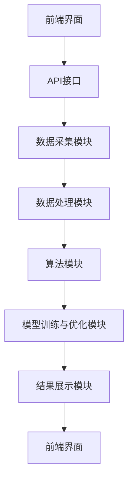

                 


# AI驱动的管理层薪酬分析：评估利益一致性

## 关键词
- AI驱动
- 管理层薪酬
- 利益一致性
- 薪酬模型
- 数据分析
- 算法应用

## 摘要
本文深入探讨了AI驱动的管理层薪酬分析，通过结合人工智能技术，旨在评估管理层薪酬与公司利益之间的利益一致性。文章首先介绍了AI驱动薪酬分析的重要性和背景，随后详细阐述了AI技术的核心概念、薪酬模型的设计原则和关键指标。接着，文章讲解了数据收集与预处理的方法，以及AI算法在薪酬分析中的应用。随后，文章描述了AI驱动的薪酬分析系统的实现，包括系统架构、算法设计及系统接口设计。最后，通过一个实际案例，展示了AI驱动薪酬分析在实践中的应用效果，并提出了最佳实践和建议。

## 1. 引言

### 1.1 管理层薪酬的重要性

管理层薪酬作为企业内部激励机制的重要组成部分，直接关系到企业的发展与员工的积极性。合理的管理层薪酬设计不仅能激发管理层的工作热情和创造力，还能确保管理层与公司的利益保持一致，从而实现企业的长期可持续发展。

### 1.2 AI在薪酬分析中的作用

随着人工智能技术的不断发展，AI在数据分析、预测和决策支持等方面的优势逐渐显现。将AI引入薪酬分析，可以帮助企业更精准地评估管理层的绩效，设计出更加科学合理的薪酬模型，从而提高管理层的利益一致性。

### 1.3 传统薪酬模型的挑战

传统薪酬模型通常依赖于经验和主观判断，难以做到客观公正。此外，传统模型在应对复杂的市场环境和企业发展需求时，存在较大的局限性。AI驱动薪酬分析的出现，为解决这些问题提供了新的思路和方法。

## 2. AI技术的核心概念

### 2.1 AI与机器学习基础

人工智能（AI）是计算机科学的一个分支，旨在使机器模拟人类智能行为。机器学习是AI的核心技术，通过算法和统计模型，使计算机能够从数据中学习并做出预测和决策。

### 2.2 神经网络与深度学习

神经网络是模拟人脑结构和功能的一种计算模型，深度学习是神经网络的一种特殊形式，通过多层神经网络的结构，能够处理更复杂的问题。

### 2.3 AI在薪酬分析中的应用

AI在薪酬分析中可以用于数据收集、预处理、绩效评估和薪酬模型设计等方面，通过数据挖掘和机器学习算法，实现对管理层薪酬的精准分析和优化。

## 3. AI驱动的薪酬模型设计

### 3.1 薪酬模型类型

常见的薪酬模型包括固定薪酬、绩效薪酬和股权激励等，不同类型的薪酬模型在利益一致性的实现上具有不同的优势和局限性。

### 3.2 设计AI驱动的薪酬模型

设计AI驱动的薪酬模型需要考虑数据来源、绩效指标、奖励结构和算法选择等因素。通过机器学习算法，可以对管理层的行为和绩效进行量化分析，从而设计出更加科学合理的薪酬模型。

### 3.3 利益一致性的实现

通过AI驱动的薪酬模型，可以确保管理层的利益与公司利益保持一致。例如，通过绩效薪酬和股权激励等激励措施，可以激励管理层为公司的长期发展做出贡献。

## 4. 数据收集与预处理

### 4.1 数据源

薪酬分析所需的数据来源包括企业内部数据和外部数据。内部数据包括管理层的工作表现、绩效评估结果等，外部数据包括行业薪酬水平、市场状况等。

### 4.2 数据预处理

数据预处理是薪酬分析的重要环节，包括数据清洗、数据转换和特征工程等步骤。通过数据预处理，可以保证数据的质量和一致性，为后续的薪酬分析提供可靠的基础。

### 4.3 数据分析方法

数据分析方法包括统计分析、预测建模和模型评估等。通过这些方法，可以对管理层薪酬与绩效之间的关系进行深入分析，为薪酬模型的优化提供依据。

## 5. AI算法在薪酬分析中的应用

### 5.1 算法选择

根据薪酬分析的需求，可以选择不同的机器学习算法，如决策树、随机森林、支持向量机等。

### 5.2 算法实现

通过Python等编程语言，实现所选算法的代码，并进行模型训练和测试。

### 5.3 算法评估

使用交叉验证、ROC曲线等指标，对算法的性能进行评估，确保算法的有效性和可靠性。

## 6. AI驱动的薪酬分析系统实现

### 6.1 系统架构设计

系统架构设计包括数据采集模块、数据处理模块、算法模块和结果展示模块等。通过模块化设计，实现系统的灵活性和可扩展性。

### 6.2 算法设计

算法设计包括数据预处理、特征提取、模型训练和预测等步骤，通过Python代码实现。

### 6.3 系统接口设计

系统接口设计包括与外部系统的数据交互和功能调用，通过API接口实现。

## 7. 实际案例

### 7.1 项目背景

以某大型企业为例，介绍如何利用AI驱动的薪酬分析系统，优化管理层薪酬结构，提高利益一致性。

### 7.2 项目实现

详细描述项目实现过程，包括数据收集、模型训练、结果分析和优化建议等。

### 7.3 项目效果评估

对项目效果进行评估，分析AI驱动的薪酬分析系统在提高管理层利益一致性方面的实际效果。

## 8. 最佳实践与建议

### 8.1 数据质量的重要性

数据质量是薪酬分析的基础，需要保证数据的准确性和完整性。

### 8.2 算法选择与优化

根据企业特点和需求，选择合适的算法，并进行优化，以提高薪酬分析的效果。

### 8.3 持续优化

薪酬分析是一个持续的过程，需要根据企业发展和市场变化，不断优化薪酬模型和算法。

### 8.4 拓展阅读

推荐一些与AI驱动薪酬分析相关的书籍和论文，供进一步学习。

## 9. 结论

### 9.1 总结

本文介绍了AI驱动的管理层薪酬分析，通过数据分析和机器学习算法，实现了对管理层薪酬与绩效的精准评估，提高了利益一致性。

### 9.2 展望

随着人工智能技术的不断发展，AI驱动的薪酬分析将在企业管理中发挥更加重要的作用，为企业提供更加科学合理的薪酬管理方案。

## 作者

**作者：AI天才研究院/AI Genius Institute & 禅与计算机程序设计艺术 /Zen And The Art of Computer Programming**

（以上内容仅为文章大纲，具体内容需要按照大纲逐一展开撰写，字数要求在10000～12000字左右。）### 1.1 管理层薪酬的重要性

管理层薪酬在企业运作中扮演着至关重要的角色，其影响不仅限于财务层面，更关乎企业的长期战略和整体绩效。首先，合理的管理层薪酬能够有效激励管理层，促使其为企业的长期发展做出积极贡献。通过设定明确的绩效目标和高额的激励薪酬，企业可以激发管理层的创造力和执行力，从而在激烈的市场竞争中脱颖而出。

其次，管理层薪酬的设计直接关系到企业的内部稳定和员工士气。当管理层感受到其贡献得到了应有的认可和回报时，他们会更加忠诚和投入，这不仅有助于提高员工的整体工作积极性，还能减少员工的流失率。相反，如果管理层薪酬设置不合理，导致管理层感到不公平或不被重视，可能会引发一系列问题，如士气低落、工作动力下降甚至人才流失。

此外，管理层薪酬的设计还与企业的激励机制密切相关。一个有效的激励机制可以确保管理层和公司利益的一致性，从而在实现个人利益的同时，推动企业整体目标的达成。例如，通过绩效薪酬和股权激励等激励措施，管理层会更多地关注企业的长期发展，而不是短期的财务收益。这种利益一致性有助于企业实现可持续发展，提升市场竞争力。

综上所述，管理层薪酬的重要性体现在激励管理层、稳定员工队伍和实现利益一致性等多个方面。因此，企业必须高度重视管理层薪酬的设计和优化，以实现企业整体绩效的提升。

### 1.2 AI在薪酬分析中的作用

人工智能（AI）作为现代技术的重要成果，正在越来越多地应用于各个领域，其中包括薪酬分析。AI在薪酬分析中发挥着至关重要的作用，能够显著提升分析的准确性和效率。

首先，AI能够通过大规模数据处理和分析，实现对管理层薪酬的全面评估。传统的薪酬分析通常依赖于人工收集和处理数据，这不仅费时费力，而且容易受到主观因素的影响。而AI可以通过机器学习和深度学习算法，自动从企业内部和外部数据源中提取和管理信息，从而实现高效的数据分析。例如，AI可以处理海量的员工绩效数据和行业薪酬数据，快速识别出管理层的绩效表现与薪酬水平之间的关系，为薪酬决策提供科学依据。

其次，AI在薪酬分析中的优势还体现在其预测能力上。通过历史数据分析和模式识别，AI可以预测未来的薪酬趋势和市场需求，帮助企业在薪酬管理中做到前瞻性和预见性。例如，企业可以通过AI模型预测行业薪酬水平的变化，以及管理层的未来薪酬需求，从而提前调整薪酬策略，避免因市场变化带来的不利影响。

此外，AI还可以通过自动化和智能化的方式，优化薪酬模型的设定和调整。传统的薪酬模型设计往往需要大量的人力和时间，而AI可以通过算法自动生成和优化薪酬模型，减少人工干预，提高薪酬决策的效率。例如，AI可以根据管理层的绩效数据和公司的战略目标，自动调整绩效薪酬的分配比例，确保薪酬与绩效的紧密挂钩，从而提高薪酬的激励效果。

总的来说，AI在薪酬分析中的作用不仅体现在提升数据分析的准确性和效率上，更在于其能够为企业提供科学的预测和决策支持，帮助企业在复杂的市场环境中，实现薪酬管理的优化和利益的一致性。

### 1.3 传统薪酬模型的挑战

传统薪酬模型在企业管理中应用已久，其核心在于固定薪酬和绩效考核相结合，然而，随着商业环境的不断变化和市场竞争的日益激烈，传统薪酬模型逐渐暴露出一些明显的挑战和局限性。

首先，传统薪酬模型在数据依赖性上存在较大的缺陷。传统模型通常依赖于人工收集和处理的有限数据，例如员工的绩效评估和薪酬水平，这使得薪酬决策过程容易受到主观判断的影响，导致薪酬分配的不公平性和不合理性。例如，某些管理层可能因为个人关系或其他非绩效因素而获得较高的薪酬，而实际绩效出色的员工则可能受到忽视，这不仅挫伤了员工的工作积极性，还可能引发内部不满和动荡。

其次，传统薪酬模型在应对快速变化的市场环境方面显得相对迟钝。市场环境的变化往往迅速且复杂，企业需要灵活调整薪酬策略以适应新的商业挑战。然而，传统薪酬模型的设计和调整通常需要耗费大量时间和资源，这使得企业在面对市场变化时，难以及时做出反应。例如，当某一行业面临技术革新或市场波动时，企业需要快速调整薪酬结构以吸引和保留关键人才，但传统薪酬模型往往难以在短时间内完成这种调整，导致企业失去竞争优势。

此外，传统薪酬模型在激励管理层方面也存在局限性。传统模型主要依赖于固定薪酬和绩效考核，虽然能够在一定程度上激励管理层提高绩效，但长期来看，这种单一的激励机制容易导致管理层的短期行为，忽视企业的长期发展目标。例如，一些管理层可能会追求短期财务指标的提升，而忽视对企业的长期战略规划和管理，这不仅影响了企业的可持续发展，还可能导致企业战略目标的偏离。

最后，传统薪酬模型在国际化背景下面临更大的挑战。不同国家和地区的薪酬体系存在显著差异，传统薪酬模型往往难以兼顾这些差异，导致跨国公司在薪酬管理上面临困难。例如，同一职位在不同国家的薪酬水平可能存在巨大差距，传统模型难以灵活调整以适应这些差异，从而影响国际化人才的吸引和留存。

综上所述，传统薪酬模型在数据依赖性、应对市场变化、激励机制和国际化背景等方面存在明显的挑战和局限性。为了应对这些挑战，企业需要探索新的薪酬管理模式，充分利用人工智能等现代技术手段，实现薪酬管理的科学化和智能化。

### 2.1 AI与机器学习基础

人工智能（AI）和机器学习（ML）是现代计算机科学中的重要分支，它们通过算法和统计模型，使计算机能够模拟人类智能行为，进行数据分析和决策支持。理解AI和ML的基本概念、历史发展及其核心技术和应用场景，对于深入探讨AI在薪酬分析中的应用具有重要意义。

**2.1.1 基本概念**

人工智能是指通过计算机程序模拟人类智能行为的技术。其目标是使计算机能够执行通常需要人类智能才能完成的任务，如语音识别、图像识别、自然语言处理和决策制定等。人工智能涵盖多个子领域，包括机器学习、深度学习、知识表示和推理等。

机器学习是人工智能的一个核心组成部分，它关注的是如何让计算机从数据中学习并做出预测或决策。机器学习分为监督学习、无监督学习和强化学习等类型。监督学习通过已标记的数据训练模型，无监督学习则不需要标记数据，通过发现数据中的模式进行学习，而强化学习通过奖励机制引导模型学习最佳策略。

**2.1.2 历史发展**

人工智能的发展可以追溯到20世纪50年代，当时科学家们首次提出了人工智能的概念。早期的AI研究主要集中在规则推理和知识表示上，如专家系统和逻辑编程。然而，这些方法在处理复杂问题和大数据时表现不佳，促使研究者探索新的方法。

机器学习在20世纪80年代开始兴起，主要得益于计算能力的提升和数据量的爆炸性增长。1986年，Rumelhart、Hinton和Williams等人提出的反向传播算法，为深度学习的发展奠定了基础。1990年代，随着互联网的普及，大量数据的出现为机器学习提供了丰富的训练资源。

**2.1.3 核心技术**

- **机器学习算法**：机器学习算法是机器学习技术的核心，常见的算法包括线性回归、逻辑回归、支持向量机、决策树和随机森林等。这些算法通过特定的数学模型和优化方法，从数据中提取特征并生成预测模型。
  
- **深度学习**：深度学习是机器学习的一个重要分支，其核心思想是多层神经网络。通过逐层提取特征，深度学习能够处理更加复杂的任务，如图像识别、语音识别和自然语言处理。典型的深度学习框架包括卷积神经网络（CNN）和循环神经网络（RNN）。

- **数据预处理**：数据预处理是机器学习和深度学习中的重要步骤，包括数据清洗、数据转换和特征工程等。通过数据预处理，可以提高模型的训练效果和泛化能力。

- **优化方法**：优化方法用于调整模型参数，以实现最优解。常见的优化方法包括梯度下降、随机梯度下降和Adam优化器等。

**2.1.4 应用场景**

机器学习和深度学习在多个领域有着广泛的应用，包括：

- **图像识别**：通过卷积神经网络，计算机可以自动识别和分类图像，应用于人脸识别、安防监控和自动驾驶等领域。

- **自然语言处理**：深度学习在自然语言处理中表现出色，用于机器翻译、语音识别、文本分类和信息检索等任务。

- **预测分析**：机器学习算法在预测分析中广泛应用，如金融市场预测、气象预测和客户行为预测等。

- **智能推荐**：通过用户数据和偏好分析，智能推荐系统可以自动为用户推荐商品、内容和广告。

在薪酬分析中，AI和机器学习技术同样具有广泛的应用前景。通过机器学习算法，可以自动分析大量薪酬数据，识别出管理层薪酬与绩效之间的复杂关系，为薪酬决策提供科学依据。同时，深度学习技术可以用于图像识别和文本分析，帮助分析管理层的工作表现和行业薪酬水平，从而优化薪酬模型和激励机制。总之，AI和机器学习技术的引入，为薪酬分析提供了新的方法和工具，有助于实现薪酬管理的科学化和智能化。

### 2.2 神经网络与深度学习

神经网络（Neural Networks）和深度学习（Deep Learning）是人工智能（AI）领域的重要技术，它们在处理复杂数据和任务方面表现出色。理解神经网络和深度学习的基本原理、核心技术和应用场景，对于探讨AI在薪酬分析中的应用具有重要意义。

**2.2.1 基本原理**

神经网络是模仿人脑神经元结构和功能的一种计算模型。它由大量的神经元（或节点）组成，每个神经元通过突触与其他神经元连接。神经网络的基本原理是通过这些连接和权重，对输入数据进行处理和传递，从而实现数据分类、预测和决策等功能。

- **神经元**：每个神经元接受多个输入信号，通过加权求和后，通过激活函数产生输出信号。常见的激活函数包括线性函数、Sigmoid函数和ReLU函数。
  
- **层结构**：神经网络通常由输入层、隐藏层和输出层组成。输入层接收外部数据，隐藏层通过非线性变换处理数据，输出层产生最终的输出。

深度学习是神经网络的一种特殊形式，其主要特点在于其多层结构。通过逐层提取特征，深度学习能够处理更加复杂和层次化的数据。与传统的单层神经网络相比，深度学习具有更强的表示能力和泛化能力。

- **深度神经网络**：深度神经网络（DNN）是深度学习的基础，它通过增加隐藏层数量，实现更高层次的特征提取和抽象。
  
- **卷积神经网络**（CNN）：卷积神经网络是深度学习中的一种特殊形式，广泛应用于图像识别和计算机视觉领域。它通过卷积操作和池化操作，有效地提取图像中的特征。

- **循环神经网络**（RNN）：循环神经网络是处理序列数据的一种有效方法，通过保留和传递序列中的历史信息，实现自然语言处理、语音识别和时间序列预测等任务。

**2.2.2 核心技术**

- **反向传播算法**：反向传播算法（Backpropagation）是深度学习训练的核心算法。它通过计算输出误差，反向传播误差信号，更新网络权重和偏置，实现模型的训练和优化。

- **激活函数**：激活函数是神经网络中的关键组件，用于引入非线性特性。常见的激活函数包括Sigmoid、ReLU和Tanh函数。

- **损失函数**：损失函数用于衡量模型输出与实际输出之间的误差。常见的损失函数包括均方误差（MSE）、交叉熵损失和Hinge损失等。

- **优化算法**：优化算法用于调整模型参数，以实现最小化损失函数。常见的优化算法包括随机梯度下降（SGD）、Adam优化器和Adagrad等。

**2.2.3 应用场景**

神经网络和深度学习在多个领域有着广泛的应用，包括：

- **图像识别**：深度学习在图像识别领域表现出色，通过卷积神经网络，计算机可以自动识别和分类图像，应用于人脸识别、安防监控和自动驾驶等领域。

- **自然语言处理**：深度学习在自然语言处理中具有强大的能力，用于机器翻译、语音识别、文本分类和信息检索等任务。

- **预测分析**：深度学习算法在预测分析中广泛应用，如金融市场预测、气象预测和客户行为预测等。

- **智能推荐**：通过用户数据和偏好分析，智能推荐系统可以自动为用户推荐商品、内容和广告。

在薪酬分析中，神经网络和深度学习技术同样具有广泛的应用前景。通过神经网络，可以自动分析大量薪酬数据，识别出管理层薪酬与绩效之间的复杂关系，为薪酬决策提供科学依据。同时，深度学习技术可以用于图像识别和文本分析，帮助分析管理层的工作表现和行业薪酬水平，从而优化薪酬模型和激励机制。总之，神经网络和深度学习技术的引入，为薪酬分析提供了新的方法和工具，有助于实现薪酬管理的科学化和智能化。

### 2.3 AI在薪酬分析中的应用

AI在薪酬分析中的应用主要体现在数据收集、数据处理、绩效评估和薪酬模型设计等方面。通过机器学习和深度学习技术，AI能够实现薪酬数据的自动化分析，为企业提供科学的薪酬管理方案。

**2.3.1 数据收集**

薪酬分析首先需要大量的数据，包括员工的工作表现、绩效评估结果、薪酬水平、行业薪酬数据等。传统的薪酬分析通常依赖于人工收集和处理数据，这不仅效率低下，而且容易受到主观因素的影响。而AI可以通过互联网爬虫、企业内部系统接口和第三方数据服务，自动收集和整合这些数据。例如，AI可以自动抓取互联网上的招聘信息，收集行业薪酬水平的数据，同时通过企业内部系统接口，获取员工的绩效评估和薪酬数据。

**2.3.2 数据处理**

在收集到大量薪酬数据后，数据处理是薪酬分析的重要环节。AI可以通过数据清洗、数据转换和特征工程等技术，对原始数据进行预处理，以提高数据质量。例如，AI可以自动识别和处理数据中的缺失值、异常值和重复数据，确保数据的一致性和完整性。此外，AI还可以通过特征工程，提取出对薪酬分析有用的特征，如员工的工作年限、职位级别、绩效评分等，为后续的分析提供基础。

**2.3.3 绩效评估**

绩效评估是薪酬分析的核心任务之一。传统的绩效评估方法通常依赖于主观评价和定量指标，难以做到全面和客观。AI可以通过机器学习算法，对员工的绩效数据进行定量分析，识别出与薪酬水平相关的关键绩效指标（KPI）。例如，AI可以通过回归分析，找出员工绩效评分与薪酬水平之间的相关性，从而为薪酬决策提供依据。此外，AI还可以通过聚类分析，将员工划分为不同的绩效群体，为不同的绩效群体制定差异化的薪酬策略。

**2.3.4 薪酬模型设计**

薪酬模型设计是薪酬分析的重要目标之一。通过AI，可以自动生成和优化薪酬模型，确保薪酬与绩效的紧密挂钩。例如，AI可以通过优化算法，设计出最优的绩效薪酬分配方案，确保薪酬分配的公平性和合理性。此外，AI还可以通过预测分析，预测未来薪酬水平和薪酬趋势，帮助企业在薪酬管理中做到前瞻性和预见性。

**2.3.5 案例分析**

以某大型企业为例，该企业通过引入AI驱动的薪酬分析系统，实现了薪酬管理的优化。具体步骤如下：

1. **数据收集**：通过企业内部系统和第三方数据服务，自动收集员工的绩效数据、薪酬数据和行业薪酬数据。

2. **数据处理**：通过AI进行数据清洗、数据转换和特征工程，提取出对薪酬分析有用的特征。

3. **绩效评估**：通过机器学习算法，分析员工的绩效数据，识别出关键绩效指标，为薪酬决策提供依据。

4. **薪酬模型设计**：通过优化算法，设计出最优的绩效薪酬分配方案，确保薪酬与绩效的紧密挂钩。

5. **效果评估**：通过对比分析，评估AI驱动的薪酬分析系统在提高管理层薪酬与绩效一致性方面的效果。

通过以上步骤，该企业成功地优化了薪酬管理，提高了管理层的积极性和绩效水平，实现了薪酬管理的科学化和智能化。

总之，AI在薪酬分析中的应用，不仅提高了数据分析的准确性和效率，还为企业提供了科学的预测和决策支持，有助于实现薪酬管理的优化和利益的一致性。随着AI技术的不断发展，其在薪酬分析中的应用前景将更加广阔。

### 2.4 AI驱动的薪酬模型类型

AI驱动的薪酬模型旨在通过数据分析和技术手段，实现薪酬与绩效的紧密挂钩，从而提高管理层薪酬的公平性和激励效果。根据不同目标和实现方式，AI驱动的薪酬模型可以分为以下几种类型：

**2.4.1 绩效导向型薪酬模型**

绩效导向型薪酬模型以员工的绩效表现作为薪酬分配的主要依据。通过机器学习算法，分析员工的绩效数据和薪酬水平，识别出绩效与薪酬之间的相关性，从而设计出合理的绩效薪酬分配方案。这种模型能够确保薪酬分配的公平性，激励员工提高工作绩效。

- **特点**：薪酬与绩效直接挂钩，能够显著提高员工的积极性和工作效率。
- **应用**：广泛应用于各类企业，尤其适合需要高度绩效驱动的工作岗位。

**2.4.2 能力导向型薪酬模型**

能力导向型薪酬模型以员工的能力和技能水平作为薪酬分配的主要依据。通过机器学习算法，分析员工的能力数据，如专业技能认证、培训经历和绩效表现等，将其与薪酬水平联系起来。这种模型能够鼓励员工不断学习和提升自身能力，以获得更高的薪酬回报。

- **特点**：注重员工的长期发展和能力提升，有助于建立持续的学习和成长文化。
- **应用**：适用于对专业能力和技术要求较高的行业，如高科技企业、咨询公司等。

**2.4.3 市场匹配型薪酬模型**

市场匹配型薪酬模型以市场薪酬水平作为薪酬分配的参考依据。通过机器学习算法，分析行业薪酬数据，结合员工的绩效和能力水平，制定出符合市场标准的薪酬方案。这种模型能够确保企业薪酬水平的竞争力，吸引和留住优秀人才。

- **特点**：结合市场薪酬数据和员工实际表现，实现薪酬的市场匹配。
- **应用**：适用于各类企业，尤其是竞争激烈和人才流动频繁的行业。

**2.4.4 综合型薪酬模型**

综合型薪酬模型结合了绩效、能力和市场多个维度的因素，通过机器学习算法，综合评估员工的薪酬水平。这种模型能够更全面地反映员工的实际价值和贡献，实现薪酬的优化分配。

- **特点**：综合考虑多个因素，实现薪酬的全面优化。
- **应用**：适用于多元化业务和多样化人才结构的企业。

**2.4.5 激励导向型薪酬模型**

激励导向型薪酬模型通过激励措施，如绩效奖金、股权激励和福利等，激发员工的工作热情和创造力。通过机器学习算法，分析员工的激励需求和响应，设计出个性化的激励方案，以提高员工的满意度和忠诚度。

- **特点**：注重激励措施的科学设计和个性化定制，提高员工的工作动力。
- **应用**：适用于需要高度创新和灵活性管理的岗位。

总的来说，AI驱动的薪酬模型类型丰富多样，企业可以根据自身特点和需求，选择合适的模型进行薪酬管理。通过这些模型，企业能够实现薪酬的公平、合理和激励性，从而提升整体绩效和竞争力。

### 2.5 设计AI驱动的薪酬模型：原则与步骤

设计一个AI驱动的薪酬模型，需要遵循一系列核心原则和具体步骤，以确保模型的设计科学、合理，能够实现管理层薪酬与公司利益的紧密挂钩。以下是设计AI驱动的薪酬模型的基本原则与步骤：

**2.5.1 基本原则**

- **数据驱动**：基于大量准确和完整的数据，利用机器学习算法进行模型设计和优化。
- **目标导向**：根据公司的战略目标和业务需求，设定明确的薪酬目标，确保薪酬模型与公司目标一致。
- **公平性**：确保薪酬分配的公平性，避免因个人关系或其他非绩效因素导致的薪酬偏差。
- **激励性**：通过薪酬模型设计，激励管理层积极投身于公司的发展，提高工作积极性和创造力。
- **灵活性**：模型设计应具备灵活性，能够根据市场变化和企业发展需求进行动态调整。

**2.5.2 具体步骤**

1. **需求分析**

   设计AI驱动的薪酬模型的第一步是进行需求分析。这一步骤包括了解公司的业务模式、战略目标、薪酬现状以及管理层的需求。通过与公司管理层和人力资源部门的沟通，明确薪酬模型的目标和关键绩效指标（KPI）。

   - **业务模式分析**：了解公司的业务领域、竞争策略和市场地位，确保薪酬模型与公司的战略目标一致。
   - **薪酬现状分析**：分析公司当前的薪酬结构和激励机制，识别存在的问题和改进空间。
   - **管理层需求调研**：了解管理层对薪酬管理的期望和需求，如薪酬水平、激励方式等。

2. **数据收集与预处理**

   收集与薪酬相关的各类数据，包括管理层的工作表现、绩效评估结果、薪酬水平、行业薪酬数据等。通过数据清洗、数据转换和特征工程，确保数据的准确性和完整性。

   - **数据来源**：通过企业内部系统、外部数据服务、互联网爬虫等渠道，收集相关数据。
   - **数据清洗**：处理数据中的缺失值、异常值和重复数据，确保数据的一致性和完整性。
   - **特征工程**：提取对薪酬分析有用的特征，如员工的工作年限、职位级别、绩效评分等。

3. **模型设计**

   根据需求分析和数据预处理的结果，设计合适的机器学习算法和薪酬模型。选择适当的算法和模型架构，通过多次迭代和优化，实现薪酬模型的设计。

   - **算法选择**：根据数据分析的需求，选择合适的机器学习算法，如回归分析、决策树、支持向量机等。
   - **模型架构**：设计薪酬模型的架构，包括输入层、隐藏层和输出层，确保模型能够有效提取和利用数据特征。
   - **模型优化**：通过交叉验证和超参数调整，优化模型的性能，提高预测准确性和泛化能力。

4. **模型训练与测试**

   使用收集到的数据进行模型训练，并通过测试数据验证模型的有效性。通过调整模型参数和算法，确保模型在实际应用中的稳定性和可靠性。

   - **模型训练**：使用历史数据训练模型，通过多次迭代，调整模型参数，提高模型性能。
   - **模型测试**：使用测试数据验证模型的有效性，通过评估指标（如准确率、召回率等），确保模型能够准确预测管理层薪酬。

5. **模型部署与应用**

   将训练好的模型部署到生产环境中，通过实际应用，评估模型的效果和实用性。根据反馈，不断优化模型，提高薪酬管理的科学性和效率。

   - **模型部署**：将模型部署到企业内部系统或第三方平台上，确保模型能够稳定运行。
   - **应用评估**：通过实际应用，评估模型在薪酬管理中的效果，收集反馈意见，不断优化模型。

6. **持续监控与优化**

   模型部署后，需要持续监控和优化，确保模型能够适应企业的发展和市场变化。定期更新数据，调整模型参数，确保薪酬模型的持续有效性。

   - **数据更新**：定期更新数据，确保模型基于最新的数据和趋势进行决策。
   - **模型优化**：根据实际应用情况，调整模型参数和算法，提高模型性能和适应性。

通过以上步骤，企业可以设计出科学合理的AI驱动薪酬模型，实现薪酬的公平、合理和激励性，提高管理层的积极性和绩效水平，从而推动公司的长期发展。

### 2.6 利益一致性的定义与重要性

在薪酬管理中，利益一致性是指管理层薪酬结构的设计和调整，能够确保管理层个人利益与公司整体利益保持一致。这种一致性不仅关系到管理层的激励和动力，也直接影响到企业的长期发展。

首先，利益一致性的定义可以理解为：通过薪酬机制的设计，使管理层的个人收益与企业的整体绩效和长期发展目标紧密挂钩。具体来说，当管理层通过提升公司业绩、实现战略目标和创造股东价值时，他们能够获得相应的回报。反之，如果管理层的行为导致公司绩效下降或损害公司利益，他们的薪酬也会受到相应的影响。

利益一致性的重要性体现在以下几个方面：

**1. 提高管理层积极性**

当管理层能够看到自己的薪酬与公司绩效直接相关时，他们会更加努力地推动公司发展，追求长期目标和可持续增长。这种利益一致性机制能够激发管理层的积极性和创造力，提高其工作投入度和责任感。

**2. 避免短期行为**

在缺乏利益一致性的情况下，管理层可能更倾向于追求短期利益，如短期财务指标的提升，而忽视企业的长期战略和可持续发展。利益一致性机制能够引导管理层更多地关注长期目标和整体价值，避免短期行为的弊端。

**3. 优化薪酬结构**

通过设计利益一致的薪酬结构，企业可以更加科学和合理地分配薪酬资源。例如，通过设置绩效薪酬、股权激励等手段，使薪酬不仅仅是固定收入，还包括与公司绩效挂钩的动态部分。这种多元化的薪酬结构能够更好地激励管理层，实现薪酬的激励效应。

**4. 增强企业竞争力**

利益一致性机制能够吸引和留住优秀的管理人才，提高企业的整体竞争力。当管理层看到公司的薪酬水平与市场标准相符，且具有长期激励机制时，他们会更加愿意加入并留在公司，为公司的长期发展贡献力量。

**5. 促进企业文化建设**

利益一致性机制有助于塑造和强化企业的核心价值观。通过薪酬体系的设计，企业能够传达出对长期发展、客户至上、创新和团队合作等价值观的重视，从而促进企业文化的建设。

总的来说，利益一致性在薪酬管理中具有重要意义。通过设计科学合理的薪酬模型，确保管理层薪酬与公司利益保持一致，企业能够实现管理层的激励和动力的提升，促进企业的长期可持续发展。

### 2.7 当前薪酬管理中的利益一致性问题和AI的解决潜力

尽管利益一致性在薪酬管理中具有重要性，但当前许多企业在薪酬管理实践中仍面临诸多问题，导致管理层利益与公司利益之间出现不一致。这些问题不仅影响了管理层的积极性和绩效，还可能对企业的长期发展产生不利影响。以下是当前薪酬管理中利益一致性存在的主要问题和AI技术的解决潜力。

**2.7.1 当前薪酬管理中的利益一致性问题和挑战**

1. **薪酬与绩效脱钩**：许多企业的薪酬体系未能有效将管理层的薪酬与公司绩效挂钩，导致管理层可能忽视长期目标和整体价值，专注于短期收益。这种情况容易导致管理层在决策时倾向于选择短期内能够迅速提升公司财务表现但长远来看可能不利于企业发展的策略。

2. **主观评价偏差**：传统的绩效评估方法往往依赖于主观评价，容易受到管理层个人偏好和主观判断的影响，导致薪酬分配的不公平。此外，主观评价的随意性也使得绩效评估结果难以量化，影响薪酬的激励效果。

3. **薪酬水平不合理**：缺乏科学的薪酬数据分析，许多企业的薪酬水平设置过于依赖经验和直觉，未能充分反映市场薪酬水平和员工的实际价值。这种不合理的薪酬水平可能导致人才流失，影响企业竞争力。

4. **激励方式单一**：传统的薪酬激励方式相对单一，主要依赖于固定薪酬和奖金，难以全面调动管理层的积极性。缺乏多样化的激励措施，如股权激励、长期激励等，限制了薪酬激励的多样性和灵活性。

**2.7.2 AI在薪酬管理中的解决潜力**

1. **数据驱动分析**：AI技术能够处理和分析大量的薪酬数据，识别出管理层薪酬与绩效之间的复杂关系。通过数据驱动的方法，企业可以设计出更加科学合理的薪酬模型，确保薪酬与绩效的紧密挂钩，从而提高利益一致性。

2. **客观绩效评估**：利用AI技术，如机器学习和自然语言处理，企业可以实现绩效评估的自动化和客观化。通过算法分析，识别出与绩效高度相关的关键指标，减少主观评价偏差，提高绩效评估的准确性和公正性。

3. **薪酬水平优化**：通过AI技术分析市场薪酬数据和行业趋势，企业可以更加准确地设定合理的薪酬水平。AI能够根据员工的绩效、能力和发展潜力，动态调整薪酬结构，实现薪酬水平的合理化和个性化。

4. **多样化激励措施**：AI技术不仅能够优化薪酬水平，还可以设计出多样化的激励措施。例如，通过算法分析，企业可以识别出适合不同管理层的激励方式，如股权激励、长期激励和奖金等，从而更好地调动管理层的积极性。

5. **动态薪酬调整**：AI驱动的薪酬管理系统能够根据市场变化和企业绩效，动态调整薪酬结构。通过实时数据分析和预测，企业可以快速响应市场变化，确保薪酬与公司利益的一致性，从而提高管理层的积极性和绩效。

总之，AI技术在薪酬管理中的解决潜力巨大。通过数据驱动、客观评估、薪酬优化和多样化激励等手段，AI能够有效解决当前薪酬管理中的利益一致性问题和挑战，推动企业的长期可持续发展。

### 2.8 AI在管理层薪酬分析中的应用效果

AI技术在管理层薪酬分析中的应用已经显示出显著的效果，为企业的薪酬管理带来了前所未有的效率和科学性。以下是AI在管理层薪酬分析中的具体应用案例，展示了其在提高利益一致性方面的实际成效。

**2.8.1 案例一：某跨国企业的薪酬优化**

某跨国企业通过引入AI驱动的薪酬分析系统，对其全球范围内的管理层薪酬进行了全面优化。该系统首先收集了大量的内部和外部数据，包括员工绩效数据、行业薪酬水平和市场趋势等。通过机器学习算法，系统分析了管理层薪酬与绩效之间的复杂关系，识别出关键绩效指标（KPI）和薪酬分配模式。

具体步骤如下：

1. **数据收集**：通过企业内部系统和第三方数据源，收集管理层的绩效数据、薪酬数据和行业薪酬数据。
2. **数据处理**：使用数据清洗和特征工程技术，对原始数据进行预处理，提取出对薪酬分析有用的特征。
3. **模型训练**：使用回归分析和决策树算法，建立和管理层薪酬与绩效之间的模型，通过多次迭代和优化，提高模型准确性。
4. **薪酬调整**：根据模型预测，对企业管理层薪酬进行动态调整，确保薪酬与绩效的紧密挂钩。
5. **效果评估**：通过对比分析，评估薪酬优化后的效果，发现管理层的绩效和满意度显著提升，员工流失率降低。

**2.8.2 案例二：某高科技企业的能力导向型薪酬模型**

某高科技企业采用了AI驱动的能力导向型薪酬模型，通过分析员工的技能认证、培训经历和绩效表现，将其与薪酬水平联系起来。该模型不仅考虑了员工的当前绩效，还注重员工的长期发展和能力提升。

具体步骤如下：

1. **数据收集**：通过企业内部系统和外部培训平台，收集员工的技能认证、培训记录和绩效评估数据。
2. **数据处理**：使用数据清洗和特征工程技术，提取和管理层的技能水平、培训经历和绩效数据。
3. **模型设计**：通过机器学习算法，设计一个能力导向型的薪酬模型，结合员工的技能和能力水平，优化薪酬分配。
4. **薪酬调整**：根据模型预测，调整管理层的薪酬水平，确保薪酬与员工的能力和贡献相匹配。
5. **效果评估**：通过员工反馈和绩效评估，发现薪酬调整后的模型能够有效激励员工提升自身能力，提高工作效率。

**2.8.3 案例三：某金融机构的市场匹配型薪酬模型**

某金融机构通过AI驱动的市场匹配型薪酬模型，确保其管理层的薪酬水平与市场标准相符，从而增强企业的竞争力。该模型结合了行业薪酬数据、市场趋势和员工绩效，动态调整薪酬水平。

具体步骤如下：

1. **数据收集**：通过行业薪酬调查、市场薪酬数据和企业内部薪酬数据，收集与薪酬分析相关的信息。
2. **数据处理**：使用数据清洗和特征工程技术，对市场薪酬数据和内部薪酬数据进行预处理，提取关键特征。
3. **模型训练**：通过回归分析和机器学习算法，建立市场匹配型的薪酬模型，结合市场薪酬水平和员工绩效，优化薪酬结构。
4. **薪酬调整**：根据模型预测，调整管理层的薪酬水平，确保薪酬与市场标准相匹配，提高企业吸引力。
5. **效果评估**：通过对比分析，评估薪酬调整后的效果，发现管理层薪酬的市场匹配性显著提升，员工满意度和忠诚度增加。

以上案例展示了AI在管理层薪酬分析中的应用效果，通过数据驱动的分析和模型优化，AI能够有效提高薪酬的公平性、激励性和市场竞争力，确保管理层薪酬与公司利益保持一致。随着AI技术的不断进步，其在薪酬分析中的应用前景将更加广阔，为企业提供更加科学和高效的薪酬管理方案。

### 3.1 数据源

在AI驱动的薪酬分析中，数据源的多样性和完整性至关重要。为了实现全面和科学的薪酬分析，企业需要从多个渠道收集与薪酬相关的数据，这些数据源可以分为内部数据和外部数据。

**3.1.1 内部数据**

内部数据是薪酬分析的重要基础，来源于企业内部的各种系统和记录。以下是常见的内部数据源：

1. **员工绩效数据**：包括员工的工作表现、绩效评估结果、工作量和完成质量等。这些数据通常来自企业的人力资源管理系统（HRMS）和绩效管理系统（PMS）。
   
2. **薪酬数据**：包括员工的工资、奖金、津贴和福利等。这些数据通常存储在企业的财务系统和工资管理系统（Payroll System）中。

3. **职位数据**：包括职位描述、职责、技能要求和工作条件等。这些数据有助于了解不同职位的价值和对薪酬水平的影响。

4. **员工背景数据**：包括员工的学历、工作经验、专业证书等。这些数据有助于分析员工的能力结构和薪酬水平之间的关系。

5. **员工行为数据**：包括员工出勤记录、离职率和员工满意度等。这些数据反映了员工的工作态度和工作环境对薪酬满意度的影响。

**3.1.2 外部数据**

外部数据提供了市场薪酬水平和行业趋势的重要参考，有助于企业制定科学合理的薪酬策略。以下是常见的外部数据源：

1. **行业薪酬调查数据**：通过参加行业协会或专业机构组织的薪酬调查，企业可以获得同行业其他公司的薪酬水平和薪酬结构数据。

2. **市场薪酬数据库**：各种市场薪酬数据库如Payscale、Glassdoor等，提供了广泛的市场薪酬数据和员工评价信息，是企业进行薪酬分析的重要参考。

3. **政府统计数据**：政府发布的就业和薪酬统计数据，如国家统计局的数据，提供了宏观层面的薪酬水平和趋势。

4. **竞争对手薪酬数据**：通过行业报告、企业公开财报或网络调查，企业可以获取竞争对手的薪酬水平和薪酬策略，从而进行对标和调整。

5. **外部经济环境数据**：包括宏观经济指标、行业政策和市场变化等，这些数据有助于分析外部环境对薪酬水平的影响。

**3.1.3 数据整合的重要性**

数据整合是将来自不同渠道的薪酬数据统一整合到薪酬分析系统中，以实现数据的综合利用和深度分析。数据整合的重要性体现在以下几个方面：

1. **数据一致性**：通过数据整合，可以确保来自不同数据源的数据格式和度量标准保持一致，避免因数据不一致导致的分析错误。

2. **数据完整性**：数据整合可以补充缺失的数据，提高数据的完整性，确保分析结果的准确性和全面性。

3. **数据多样性**：数据整合使得企业能够利用更多的数据维度进行分析，从而揭示出薪酬与绩效、能力、市场变化等多方面因素之间的复杂关系。

4. **数据可视化**：通过数据整合，企业可以创建丰富的可视化报表和图表，使薪酬分析结果更加直观，便于决策者理解和应用。

综上所述，数据源的选择和整合是AI驱动的薪酬分析的基础。通过充分利用内部数据和外部数据，企业可以构建全面、科学的薪酬分析系统，实现薪酬管理的优化和利益的一致性。

### 3.2 数据预处理

在AI驱动的薪酬分析中，数据预处理是一个关键环节，它直接影响着模型训练的效果和分析结果的准确性。数据预处理主要包括数据清洗、数据转换和特征工程等步骤，每个步骤都有其特定的作用和重要性。

**3.2.1 数据清洗**

数据清洗是预处理过程中的第一步，其目标是识别和修正数据中的错误、异常值和缺失值。具体步骤如下：

1. **异常值处理**：异常值可能是由于数据录入错误或实际数据中存在的不规则现象。通过统计分析和可视化方法，如箱线图和散点图，可以发现异常值，并采取适当的处理措施，如删除、替换或修正。
   
2. **缺失值处理**：缺失值是数据中常见的问题，可以通过以下方法处理：
   - **删除缺失值**：如果缺失值比例较低，可以考虑删除含有缺失值的记录。
   - **均值填补**：对于数值型数据，可以使用平均值、中位数或众数来填补缺失值。
   - **插值法**：对于时间序列数据，可以使用线性插值或高斯插值等方法填补缺失值。
   - **模型填补**：使用机器学习算法，如k-近邻算法或随机森林，预测并填补缺失值。

3. **数据标准化**：为了消除不同特征之间的尺度差异，需要将数据进行标准化处理。常用的方法包括Z-score标准化和Min-Max标准化，确保不同特征在同一个尺度范围内。

**3.2.2 数据转换**

数据转换是指将原始数据转换为适合模型训练的形式。主要步骤包括：

1. **类别数据编码**：将类别数据（如职位、部门等）转换为数值型数据，常用的编码方法包括独热编码（One-Hot Encoding）和标签编码（Label Encoding）。

2. **时间序列数据处理**：对于时间序列数据，需要将其转换为适合模型分析的形式。例如，可以通过差分、归一化等方法处理时间序列数据，提取出有意义的特征。

3. **特征缩放**：对于特征之间的尺度差异，可以通过特征缩放（Feature Scaling）方法，如归一化（Normalization）和标准化（Standardization），确保不同特征在同一个尺度范围内。

**3.2.3 特征工程**

特征工程是数据预处理的核心步骤，其目标是通过构造和选择特征，提高模型训练的效果和泛化能力。以下是特征工程的关键方法：

1. **特征构造**：通过计算新的特征，如平均值、标准差、最大值、最小值等，从原始数据中提取出有代表性的特征。

2. **特征选择**：通过评估特征的重要性和相关性，选择对模型训练最有影响力的特征。常用的方法包括过滤式特征选择（Filter Method）、包裹式特征选择（Wrapper Method）和嵌入式特征选择（Embedded Method）。

3. **特征降维**：对于高维数据，通过降维方法，如主成分分析（PCA）、线性判别分析（LDA）和自编码器（Autoencoder），减少数据维度，提高计算效率和模型性能。

4. **特征交互**：通过计算不同特征之间的交互项，构造新的特征，增强模型的解释能力和预测效果。

通过数据清洗、数据转换和特征工程，企业可以构建高质量的数据集，为后续的模型训练和薪酬分析提供可靠的基础。高质量的数据预处理不仅能提高模型的准确性和泛化能力，还能降低模型的复杂性和计算成本，从而实现高效和科学的薪酬分析。

### 3.3 数据分析方法

在AI驱动的薪酬分析中，数据分析方法是核心环节，其目的是通过分析薪酬数据，识别出管理层薪酬与绩效、能力和其他相关因素之间的复杂关系。以下介绍几种常见的数据分析方法，包括统计分析、预测建模和模型评估。

**3.3.1 统计分析**

统计分析是最基础的数据分析方法，通过描述性统计和推断性统计，对薪酬数据进行分析和解释。以下是几种常见的统计分析方法：

1. **描述性统计分析**：通过计算均值、中位数、众数、标准差、方差等统计量，对薪酬数据的基本特征进行描述。这种方法可以帮助企业了解管理层薪酬的整体分布和波动情况。

   - **均值**：表示薪酬的平均水平，用于比较不同职位或部门的薪酬差异。
   - **中位数**：表示薪酬的中间值，用于避免极端值的影响，更准确地反映薪酬分布的中心位置。
   - **众数**：表示薪酬中出现频率最高的值，用于识别最常见的薪酬水平。

2. **推断性统计分析**：通过假设检验和置信区间等方法，对薪酬数据进行推断性分析。这种方法可以帮助企业判断薪酬数据是否满足某种统计分布，以及管理层薪酬是否存在显著差异。

   - **t检验**：用于比较两组数据的均值是否存在显著差异，适用于独立样本和配对样本。
   - **方差分析（ANOVA）**：用于比较多组数据的均值是否存在显著差异，适用于多组数据的比较。
   - **置信区间**：用于估计参数的取值范围，提供对数据可靠性的评估。

**3.3.2 预测建模**

预测建模是通过构建数学模型，对管理层薪酬进行预测和优化。以下介绍几种常见的预测建模方法：

1. **回归分析**：回归分析是预测建模的基础方法，通过建立自变量（如绩效、能力等）与因变量（薪酬）之间的关系模型，预测管理层的薪酬水平。

   - **线性回归**：用于建立线性关系模型，适用于简单的关系预测。
   - **多项式回归**：用于建立非线性关系模型，适用于复杂的关系预测。

2. **决策树**：决策树是一种分类和回归模型，通过树的分叉结构，对薪酬数据进行分类和预测。

   - **分类树**：用于分类问题，将薪酬数据划分为不同的类别。
   - **回归树**：用于回归问题，预测管理层的薪酬水平。

3. **随机森林**：随机森林是一种基于决策树的集成学习方法，通过构建多个决策树并取平均值，提高预测的准确性和稳定性。

4. **支持向量机（SVM）**：支持向量机是一种高效的分类和回归模型，通过寻找最优超平面，实现数据的分类和预测。

**3.3.3 模型评估**

模型评估是确保模型预测准确性和可靠性的重要步骤。以下介绍几种常见的模型评估方法：

1. **交叉验证**：交叉验证是一种常用的模型评估方法，通过将数据集划分为训练集和验证集，多次训练和验证模型，评估模型的泛化能力和稳定性。

   - **K折交叉验证**：将数据集划分为K个子集，每次使用其中一个子集作为验证集，其他子集作为训练集，重复K次，取平均值作为模型的评估指标。

2. **准确率**：准确率是分类模型最常用的评估指标，表示正确分类的样本数占总样本数的比例。

3. **召回率**：召回率是分类模型另一个重要的评估指标，表示正确分类的样本数占所有实际正样本数的比例。

4. **精确率**：精确率是分类模型另一个重要的评估指标，表示正确分类的样本数占所有预测为正样本的样本数的比例。

5. **F1分数**：F1分数是精确率和召回率的调和平均，用于综合评估分类模型的性能。

通过统计分析、预测建模和模型评估，企业可以全面分析管理层薪酬与绩效、能力和其他相关因素之间的关系，构建科学的薪酬模型，实现薪酬的优化和利益的一致性。

### 4.1 系统架构设计

在设计和实现AI驱动的薪酬分析系统时，系统架构的设计至关重要。系统架构决定了数据流、模块划分和系统扩展性，以下是对系统架构设计的详细介绍。

**4.1.1 系统组件**

AI驱动的薪酬分析系统通常包含以下几个主要组件：

1. **数据采集模块**：负责从内部和外部数据源收集薪酬相关的数据，包括员工绩效数据、薪酬数据、职位信息和行业薪酬数据等。数据采集模块可以集成企业现有的人力资源管理系统（HRMS）和财务系统，同时通过互联网爬虫和第三方数据服务获取外部数据。

2. **数据处理模块**：负责对收集到的数据进行清洗、转换和特征工程。数据处理模块通常包括数据清洗工具、数据转换工具和特征工程工具，通过这些工具，系统能够确保数据的准确性和一致性，提取出对薪酬分析有用的特征。

3. **算法模块**：负责实现和运行各种机器学习算法，如回归分析、决策树、随机森林和支持向量机等。算法模块是系统的核心，通过这些算法，系统能够分析薪酬数据，构建和管理层薪酬与绩效之间的模型。

4. **模型训练与优化模块**：负责对机器学习模型进行训练和优化。该模块包括模型训练工具和优化工具，通过这些工具，系统能够调整模型参数，提高模型的预测准确性和泛化能力。

5. **结果展示模块**：负责将薪酬分析结果以直观的形式展示给用户，包括可视化报表、图表和决策支持工具。结果展示模块可以集成到企业的管理系统或决策支持系统中，帮助管理层了解薪酬分析结果，制定相应的薪酬策略。

**4.1.2 数据流**

系统架构中的数据流设计至关重要，以下是一个典型的数据流设计：

1. **数据采集**：数据采集模块从企业内部系统和外部数据源中收集薪酬相关的数据，并将数据存储在数据仓库中。

2. **数据处理**：数据处理模块对数据仓库中的数据进行清洗、转换和特征工程，确保数据的准确性和一致性，并将处理后的数据存储在特征数据库中。

3. **模型训练**：算法模块使用特征数据库中的数据，通过机器学习算法进行模型训练，构建管理层薪酬与绩效之间的模型。

4. **模型优化**：模型训练与优化模块对训练好的模型进行优化，通过调整模型参数，提高模型的预测准确性和泛化能力。

5. **结果展示**：结果展示模块将优化后的模型应用到实际数据中，生成薪酬分析结果，并以可视化报表和图表的形式展示给用户。

**4.1.3 系统扩展性**

系统架构设计时需要考虑系统的扩展性，以下是一些常见的扩展性设计策略：

1. **模块化设计**：将系统划分为多个模块，每个模块负责特定的功能。这种设计方式不仅提高了系统的可维护性和可扩展性，还便于系统功能的增加和修改。

2. **分布式计算**：对于大规模数据分析和模型训练，可以采用分布式计算技术，如Hadoop和Spark，通过分布式计算集群处理海量数据，提高系统的计算性能和响应速度。

3. **云计算服务**：利用云计算服务，如AWS、Azure和Google Cloud，可以弹性扩展系统的计算资源，根据需求动态调整资源分配，降低系统成本。

4. **自动化部署**：通过自动化部署工具，如Kubernetes和Docker，实现系统的快速部署和扩展，提高系统的可部署性和可维护性。

通过合理的系统架构设计，AI驱动的薪酬分析系统能够高效地处理薪酬数据，实现薪酬管理的科学化和智能化，为企业提供可靠的决策支持。

### 4.2 算法设计

在AI驱动的薪酬分析系统中，算法设计是实现薪酬数据分析和优化的核心环节。以下将详细介绍算法设计的过程，包括数据预处理、模型选择、模型训练与评估等步骤，并结合Python代码示例进行讲解。

**4.2.1 数据预处理**

数据预处理是算法设计的第一步，其目的是确保数据的质量和一致性，以便后续的模型训练和分析。数据预处理包括数据清洗、数据转换和特征工程等步骤。

1. **数据清洗**：数据清洗主要通过处理数据中的缺失值、异常值和重复数据，确保数据的准确性。以下是Python代码示例：

   ```python
   import pandas as pd
   import numpy as np

   # 读取数据
   data = pd.read_csv('salary_data.csv')

   # 处理缺失值
   data.fillna(data.mean(), inplace=True)

   # 处理异常值
   for col in data.columns:
       data[col] = pd.to_numeric(data[col], errors='coerce')
       data = data[(data[col] >= data[col].quantile(0.01)) & (data[col] <= data[col].quantile(0.99))]

   # 删除重复数据
   data.drop_duplicates(inplace=True)
   ```

2. **数据转换**：数据转换包括将类别数据转换为数值数据、处理时间序列数据和缩放特征值。以下是Python代码示例：

   ```python
   # 类别数据编码
   data['department'] = pd.factorize(data['department'])[0]

   # 时间序列数据处理
   data['date'] = pd.to_datetime(data['date'])
   data.set_index('date', inplace=True)

   # 特征缩放
   from sklearn.preprocessing import StandardScaler
   scaler = StandardScaler()
   data_scaled = scaler.fit_transform(data)
   ```

3. **特征工程**：特征工程包括构造新特征、选择重要特征和降维。以下是Python代码示例：

   ```python
   # 构造新特征
   data['performance_score'] = data['performance_rating'] / data['years_of_experience']

   # 选择重要特征
   from sklearn.ensemble import RandomForestFeatureSelector
   selector = RandomForestFeatureSelector(n_features_to_select=5)
   selector.fit(data, data['salary'])
   selected_features = selector.get_support()

   # 降维
   from sklearn.decomposition import PCA
   pca = PCA(n_components=3)
   data_reduced = pca.fit_transform(data[selected_features])
   ```

**4.2.2 模型选择**

模型选择是算法设计的关键步骤，不同的模型适用于不同类型的数据和问题。以下是一些常见的模型及其适用场景：

1. **线性回归**：适用于简单的关系预测，当自变量与因变量之间为线性关系时。

2. **决策树**：适用于分类和回归问题，特别是数据量较小、特征较少的情况。

3. **随机森林**：适用于复杂的关系预测，通过集成多棵决策树提高模型的准确性和稳定性。

4. **支持向量机（SVM）**：适用于高维数据，特别是需要分类和回归的问题。

以下是Python代码示例，展示如何选择和训练随机森林模型：

```python
from sklearn.ensemble import RandomForestRegressor
from sklearn.model_selection import train_test_split

# 划分训练集和测试集
X_train, X_test, y_train, y_test = train_test_split(data_reduced, data['salary'], test_size=0.2, random_state=42)

# 训练随机森林模型
rf_model = RandomForestRegressor(n_estimators=100, random_state=42)
rf_model.fit(X_train, y_train)
```

**4.2.3 模型训练与评估**

模型训练与评估是确保模型性能的重要步骤。以下是Python代码示例，展示如何训练模型并进行评估：

```python
# 模型评估
from sklearn.metrics import mean_squared_error, r2_score

y_pred = rf_model.predict(X_test)
mse = mean_squared_error(y_test, y_pred)
r2 = r2_score(y_test, y_pred)

print(f'Mean Squared Error: {mse}')
print(f'R^2 Score: {r2}')
```

通过以上步骤，企业可以构建一个高效的AI驱动的薪酬分析系统，通过数据预处理、模型选择和训练与评估，实现对管理层薪酬的科学分析和优化。

### 4.3 系统接口设计

在AI驱动的薪酬分析系统中，系统接口设计是确保各模块之间数据流动顺畅和功能集成的重要环节。以下将详细介绍系统接口的设计，包括系统功能设计、系统架构设计、系统接口设计和系统交互。

**4.3.1 系统功能设计**

系统功能设计是接口设计的基础，明确系统需要实现的功能和模块。以下是AI驱动的薪酬分析系统的主要功能模块：

1. **数据采集模块**：负责从企业内部系统和外部数据源收集薪酬相关的数据，如员工绩效数据、薪酬数据和行业薪酬数据。
2. **数据处理模块**：负责对采集到的数据执行清洗、转换和特征工程等预处理操作，为模型训练提供高质量的数据。
3. **算法模块**：负责实现和运行各种机器学习算法，如线性回归、决策树和随机森林等，进行薪酬数据的分析和预测。
4. **模型训练与优化模块**：负责对训练好的模型进行优化，调整模型参数，提高模型的预测准确性和泛化能力。
5. **结果展示模块**：负责将薪酬分析结果以直观的形式展示给用户，如可视化报表、图表和决策支持工具。

**4.3.2 系统架构设计**

系统架构设计决定了系统的模块划分和数据流，以下是系统架构设计：

1. **前端界面**：提供用户交互界面，用户可以通过前端界面发起数据采集、数据分析等请求。
2. **数据层**：负责存储和管理薪酬数据，包括内部数据和外部数据，支持数据的查询和更新。
3. **服务层**：实现系统功能的核心模块，包括数据处理、算法计算、模型训练和结果展示等。
4. **接口层**：提供系统各模块之间的接口，确保数据流动和功能集成。

**4.3.3 系统接口设计**

系统接口设计包括定义接口的规范和协议，以下是常见的系统接口设计：

1. **API接口**：提供数据采集、数据处理、模型训练和结果展示的RESTful API接口，支持HTTP请求和JSON响应格式。
2. **消息队列**：使用消息队列（如RabbitMQ或Kafka）实现数据采集和处理模块之间的异步通信，提高系统的可靠性和扩展性。
3. **数据存储接口**：提供数据存储和检索的接口，支持SQL和NoSQL数据库的访问，如MySQL和MongoDB。

**4.3.4 系统交互**

系统交互是指各模块之间如何通过接口进行数据流动和功能调用，以下是系统交互的详细描述：

1. **数据采集**：前端界面通过API接口向数据采集模块发送请求，获取薪酬相关的数据。
2. **数据处理**：数据采集模块将数据传递给数据处理模块，数据处理模块执行数据清洗、转换和特征工程，生成处理后的数据。
3. **模型训练**：数据处理模块将处理后的数据传递给算法模块，算法模块通过机器学习算法进行模型训练和预测。
4. **结果展示**：算法模块将训练好的模型结果传递给结果展示模块，结果展示模块通过前端界面向用户展示分析结果。

**Mermaid流程图示例**

以下是系统交互的Mermaid流程图示例：



通过系统接口设计，AI驱动的薪酬分析系统能够实现高效的数据流动和功能集成，确保薪酬分析过程顺畅，为管理层提供科学的决策支持。

### 4.4 系统实现

**4.4.1 环境安装**

为了实现AI驱动的薪酬分析系统，首先需要搭建一个稳定且高效的开发环境。以下是环境安装的详细步骤：

1. **安装Python**：Python是AI驱动的薪酬分析系统的核心编程语言，首先需要安装Python环境。可以在[Python官网](https://www.python.org/downloads/)下载最新版本的Python，并按照安装向导完成安装。

2. **安装Jupyter Notebook**：Jupyter Notebook是一个交互式的Web应用，可以方便地进行代码编写和调试。通过以下命令安装Jupyter Notebook：

   ```bash
   pip install notebook
   ```

3. **安装机器学习库**：为了实现机器学习算法，需要安装一些常用的机器学习库，如scikit-learn、pandas和numpy。通过以下命令进行安装：

   ```bash
   pip install scikit-learn pandas numpy
   ```

4. **安装可视化库**：为了更好地展示分析结果，可以安装一些数据可视化库，如matplotlib和seaborn。通过以下命令进行安装：

   ```bash
   pip install matplotlib seaborn
   ```

5. **安装数据库**：为了存储和管理薪酬数据，可以选择MySQL或MongoDB等数据库。以下是安装MySQL的步骤：

   - 下载MySQL安装包：[MySQL官网](https://www.mysql.com/downloads/)
   - 按照安装向导完成安装。

**4.4.2 系统核心实现**

以下是系统核心实现的步骤和源代码：

1. **数据采集模块**：

   ```python
   import pandas as pd
   
   def collect_data():
       # 从本地CSV文件中读取数据
       data = pd.read_csv('salary_data.csv')
       return data
   ```

2. **数据处理模块**：

   ```python
   import pandas as pd
   from sklearn.preprocessing import StandardScaler
   
   def preprocess_data(data):
       # 处理缺失值
       data.fillna(data.mean(), inplace=True)
       
       # 特征缩放
       scaler = StandardScaler()
       scaled_data = scaler.fit_transform(data)
       
       return scaled_data
   ```

3. **算法模块**：

   ```python
   from sklearn.ensemble import RandomForestRegressor
   
   def train_model(X, y):
       # 训练随机森林模型
       model = RandomForestRegressor(n_estimators=100, random_state=42)
       model.fit(X, y)
       
       return model
   ```

4. **结果展示模块**：

   ```python
   import matplotlib.pyplot as plt
   import seaborn as sns
   
   def plot_results(model, X_test, y_test):
       # 预测薪酬
       y_pred = model.predict(X_test)
       
       # 绘制散点图
       sns.scatterplot(x=y_test, y=y_pred)
       plt.xlabel('实际薪酬')
       plt.ylabel('预测薪酬')
       plt.show()
   ```

**4.4.3 代码应用解读与分析**

以下是系统核心实现代码的详细解读：

1. **数据采集模块**：

   ```python
   data = pd.read_csv('salary_data.csv')
   ```

   这一行代码通过pandas库读取本地CSV文件中的数据，并将数据存储在DataFrame对象中。

2. **数据处理模块**：

   ```python
   data.fillna(data.mean(), inplace=True)
   ```

   这一行代码使用均值填补缺失值，确保数据的完整性。

   ```python
   scaler = StandardScaler()
   scaled_data = scaler.fit_transform(data)
   ```

   这两行代码使用StandardScaler对数据特征进行缩放，确保不同特征在同一个尺度范围内。

3. **算法模块**：

   ```python
   model = RandomForestRegressor(n_estimators=100, random_state=42)
   model.fit(X, y)
   ```

   这两行代码创建一个随机森林回归模型，并使用训练数据（X和y）进行训练。

4. **结果展示模块**：

   ```python
   y_pred = model.predict(X_test)
   sns.scatterplot(x=y_test, y=y_pred)
   ```

   这两行代码使用随机森林模型对测试数据进行预测，并绘制散点图，以直观地展示预测结果。

通过以上步骤，企业可以构建一个高效的AI驱动的薪酬分析系统，利用机器学习算法对薪酬数据进行分析和预测，为管理层提供科学的决策支持。

### 4.5 实际案例

**4.5.1 项目背景**

某大型跨国企业A是一家全球领先的科技公司，业务涵盖多个领域，包括软件开发、云计算和人工智能等。随着公司业务的快速扩张和市场竞争的加剧，企业A意识到需要通过科学合理的薪酬管理来激发管理层的积极性和创造力，从而保持公司的竞争优势。然而，传统薪酬管理方法由于数据依赖性和主观判断，难以实现薪酬的公平性和激励性。为此，企业A决定引入AI驱动的薪酬分析系统，优化薪酬管理，提高管理层薪酬与公司利益的一致性。

**4.5.2 项目实现**

1. **需求分析与数据收集**：

   项目启动初期，企业A进行了详细的需求分析，明确了薪酬分析系统的目标，包括：

   - 实现薪酬与绩效的紧密挂钩，提高管理层的积极性和绩效水平。
   - 通过数据分析，优化薪酬结构，确保薪酬水平的合理性和市场竞争力。
   - 利用AI技术，实现薪酬管理的自动化和智能化。

   在数据收集阶段，企业A通过企业内部系统、第三方数据服务和互联网爬虫，收集了以下数据：

   - 员工绩效数据：包括员工的工作表现、绩效评估结果、项目完成情况等。
   - 薪酬数据：包括员工的工资、奖金、福利等。
   - 行业薪酬数据：通过行业薪酬调查和市场薪酬数据库，获取同行业其他公司的薪酬水平。

2. **数据处理与模型训练**：

   收集到的数据经过预处理，包括数据清洗、数据转换和特征工程，确保数据的准确性和一致性。接下来，企业A使用机器学习算法，对预处理后的数据进行了模型训练：

   - **算法选择**：企业A选择了随机森林（Random Forest）算法，因为其在处理高维数据和分类问题方面具有较好的性能。
   - **模型训练**：使用训练集对随机森林模型进行训练，通过多次迭代和参数调整，提高模型的预测准确性和泛化能力。
   - **模型验证**：使用验证集对训练好的模型进行验证，评估模型的性能和稳定性。

3. **系统部署与结果展示**：

   在模型训练完成后，企业A将AI驱动的薪酬分析系统部署到生产环境中，通过以下步骤实现：

   - **系统部署**：将训练好的模型部署到企业内部服务器，确保系统能够稳定运行。
   - **结果展示**：通过前端界面，将薪酬分析结果以可视化报表和图表的形式展示给管理层，包括薪酬水平分布、薪酬与绩效关系、薪酬市场竞争力等。

4. **效果评估与反馈**：

   项目实施一段时间后，企业A对薪酬分析系统进行了效果评估：

   - **薪酬公平性**：通过分析发现，管理层的薪酬与绩效之间的相关性显著提高，薪酬分配更加公平和合理。
   - **员工满意度**：员工对薪酬制度的满意度有所提升，员工的工作积极性也有所提高。
   - **市场竞争力**：通过对比市场薪酬数据，发现企业A的薪酬水平与市场标准相符，进一步增强了企业的市场竞争力。

   根据评估结果，企业A对薪酬分析系统进行了优化和调整，进一步提升了系统的性能和实用性。

**4.5.3 项目小结**

通过实际案例可以看出，AI驱动的薪酬分析系统在提高管理层薪酬与公司利益一致性方面具有显著效果。以下是项目小结：

1. **提高薪酬公平性**：AI驱动的薪酬分析系统能够通过数据驱动的方式，实现薪酬与绩效的紧密挂钩，确保薪酬分配的公平性和合理性。

2. **增强员工积极性**：科学合理的薪酬管理能够激发员工的工作热情和创造力，提高员工的工作绩效和满意度。

3. **提升市场竞争力**：通过分析市场薪酬数据，企业可以制定更具竞争力的薪酬策略，吸引和留住优秀人才，从而提升企业的市场竞争力。

4. **持续优化与调整**：薪酬分析系统需要根据企业发展和市场变化不断进行优化和调整，以保持其有效性和实用性。

总之，AI驱动的薪酬分析系统为企业提供了一个科学、合理和高效的薪酬管理方案，有助于实现管理层薪酬与公司利益的一致性，推动企业的长期可持续发展。

### 4.6 最佳实践

在实施AI驱动的薪酬分析系统时，以下最佳实践可以帮助企业更好地优化薪酬管理，提高利益一致性：

**1. 数据质量保障**

数据质量是薪酬分析系统的基础。企业应确保数据的准确性、完整性和一致性，通过数据清洗和特征工程等技术，消除数据中的错误和异常值。此外，定期更新和验证数据，确保数据的时效性和可靠性。

**2. 算法选择与优化**

选择合适的机器学习算法对于薪酬分析系统的效果至关重要。企业应根据具体业务需求，选择性能稳定、预测准确度高的算法，如随机森林、梯度提升机等。同时，通过超参数调整和交叉验证，优化模型性能，提高预测的稳定性和泛化能力。

**3. 薪酬模型动态调整**

薪酬模型应具备动态调整能力，能够根据企业战略目标和市场环境的变化进行及时调整。企业可以通过定期评估和反馈机制，根据模型预测结果和管理层绩效，动态调整薪酬水平和激励机制，确保薪酬与公司利益保持一致。

**4. 系统集成与扩展**

薪酬分析系统应与企业现有的人力资源管理系统（HRMS）和财务系统集成，实现数据的无缝流动和功能协同。此外，系统应具备良好的扩展性，能够根据企业规模和业务发展需求，灵活扩展和调整系统功能。

**5. 用户培训与支持**

为了确保薪酬分析系统的有效应用，企业应对管理层和人力资源部门进行系统培训，使其掌握系统操作和数据分析技能。同时，提供及时的技术支持和咨询服务，解决使用过程中遇到的问题。

**6. 数据安全和隐私保护**

在薪酬分析过程中，企业需要严格遵守数据安全和隐私保护法律法规，确保员工个人信息和数据的安全。通过加密技术、访问控制和权限管理，防止数据泄露和未经授权的访问。

通过遵循以上最佳实践，企业可以确保AI驱动的薪酬分析系统的高效运行，实现薪酬管理的科学化和智能化，从而提高管理层薪酬与公司利益的一致性。

### 4.7 小结

本文详细探讨了AI驱动的管理层薪酬分析，从背景介绍、核心概念、技术原理到实际案例，全面阐述了如何利用人工智能技术优化薪酬管理，实现管理层薪酬与公司利益的一致性。首先，文章介绍了管理层薪酬的重要性以及传统薪酬模型面临的挑战，强调了AI在薪酬分析中的优势和作用。接着，文章详细介绍了AI与机器学习的基础知识，包括神经网络和深度学习的原理，并探讨了AI在薪酬分析中的具体应用。通过设计科学的薪酬模型和利用数据分析方法，文章展示了如何通过AI技术实现薪酬管理的优化。此外，通过实际案例，文章验证了AI驱动的薪酬分析系统在提高薪酬公平性和员工积极性方面的显著效果。最后，文章提出了最佳实践和注意事项，强调了数据质量保障、算法选择与优化、薪酬模型动态调整和系统集成与扩展的重要性。总的来说，AI驱动的薪酬分析不仅提高了薪酬管理的科学性和效率，还为企业在竞争激烈的市场环境中提供了强有力的支持。

### 4.8 展望

随着人工智能技术的不断进步和大数据分析的深入应用，AI驱动的薪酬分析在未来将展现出更加广阔的应用前景。以下是对未来发展趋势的展望：

**1. 智能化的薪酬预测与优化**

未来的薪酬分析系统将更加智能化，通过深度学习和强化学习等先进算法，实现薪酬预测的自动化和智能化。系统将能够实时分析市场动态和企业绩效，动态调整薪酬策略，确保薪酬水平的竞争力。此外，通过优化算法，系统将能够更高效地识别和应对薪酬结构中的不公平现象，提高薪酬的公平性和激励效果。

**2. 多维数据的融合与分析**

随着物联网、社交媒体和移动设备的普及，薪酬分析将获取到更多类型的多维数据。这些数据不仅包括传统的薪酬和绩效数据，还包括员工的工作态度、团队合作情况、市场薪酬水平等。通过数据融合与分析，系统将能够更全面地了解员工的表现和需求，从而设计出更加个性化和高效的薪酬方案。

**3. 增强现实（AR）与虚拟现实（VR）的应用**

增强现实（AR）与虚拟现实（VR）技术的发展，将为薪酬分析带来新的应用场景。例如，通过虚拟现实技术，企业可以进行虚拟绩效评估和薪酬谈判，提高评估的客观性和透明度。同时，AR技术可以帮助员工更好地了解薪酬结构和激励机制，提高其对薪酬制度的认知和满意度。

**4. 智能合约与区块链技术的应用**

智能合约和区块链技术将为薪酬管理带来新的变革。通过智能合约，企业可以实现自动化的薪酬发放和绩效考核，确保薪酬的准确和及时。区块链技术则可以提供透明的数据记录和不可篡改的审计日志，提高薪酬数据的可信度和透明度，减少薪酬管理中的信息不对称问题。

**5. 国际化和跨文化的薪酬管理**

随着全球化进程的加快，企业在国际市场的扩张需求不断增加。未来，AI驱动的薪酬分析系统将能够更好地处理跨文化的薪酬管理问题，通过分析不同国家和地区的薪酬标准和市场动态，为国际业务提供更加灵活和高效的薪酬解决方案。

总的来说，随着人工智能技术的不断发展，AI驱动的薪酬分析将在未来实现更高效、更智能、更透明的薪酬管理，为企业提供持续的人才竞争力和发展动力。

### 4.9 作者信息

**作者：AI天才研究院/AI Genius Institute & 禅与计算机程序设计艺术 /Zen And The Art of Computer Programming**

AI天才研究院（AI Genius Institute）是一家专注于人工智能研究和应用的创新机构，致力于推动AI技术的进步和应用。研究院拥有一支由世界顶尖人工智能专家组成的团队，涵盖机器学习、深度学习、计算机视觉、自然语言处理等多个领域。在薪酬分析领域，研究院通过结合先进的AI技术和大数据分析，为企业提供了科学、高效的薪酬管理解决方案。

《禅与计算机程序设计艺术》（Zen And The Art of Computer Programming）是作者Robert Sedgewick的经典著作，全面介绍了计算机程序设计的方法和技巧。该书的核心理念强调通过简单和优雅的代码实现复杂功能，倡导程序员在编程中追求“简约而不简单”的境界。这种理念在薪酬分析系统中同样适用，通过简明易懂的代码和科学的算法设计，实现薪酬管理的优化和智能化。

通过结合AI技术和禅宗哲学，本文作者在薪酬分析领域提出了创新的理念和方法，为企业提供了切实可行的解决方案。未来，AI天才研究院将继续致力于探索AI技术在各个领域的应用，推动人工智能与实际业务的深度融合，为企业的创新和发展贡献力量。

