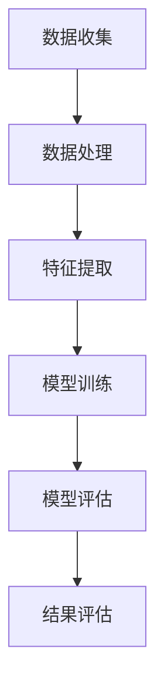
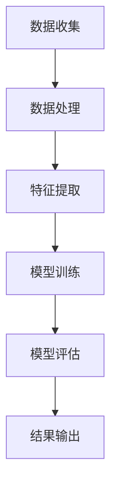
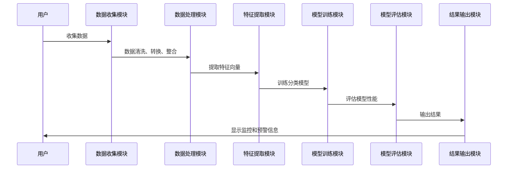

                 

### AI驱动的管理层言行一致性分析：深入洞察公司治理

#### 关键词：人工智能、公司治理、言行一致性、算法、深度学习

> 摘要：本文深入探讨了AI驱动的管理层言行一致性分析在公司治理中的应用。通过介绍AI的基本原理和算法模型，我们揭示了如何利用人工智能技术对公司治理中的管理层言行一致性进行有效监控和分析。文章旨在为企业和研究机构提供理论与实践相结合的参考，帮助他们在复杂多变的市场环境中实现有效的公司治理。

## 目录大纲设计思路

为了确保文章的逻辑性和可读性，本文将采用以下设计思路：

1. **引言与背景**：
   - 简要介绍AI的重要性，管理层言行一致性的概念及其在公司治理中的重要性。
   - 阐述AI驱动的管理层言行一致性分析的基本原理和目的。

2. **核心概念与联系**：
   - 定义AI、管理层言行一致性、公司治理等核心概念。
   - 比较分析AI驱动的管理层言行一致性分析与传统分析方法。

3. **算法原理讲解**：
   - 介绍用于分析的AI算法，如机器学习模型、深度学习网络等。
   - 使用Mermaid绘制算法流程图，并用Python代码展示算法原理。

4. **数学模型与公式**：
   - 使用LaTeX格式介绍算法的数学模型和公式。
   - 提供通俗易懂的例子进行说明。

5. **系统分析与架构设计**：
   - 描述分析系统的场景和目的。
   - 使用Mermaid绘制领域模型类图、系统架构图和系统交互序列图。

6. **项目实战**：
   - 环境安装和配置。
   - 系统核心实现源代码展示。
   - 代码应用解读与分析。
   - 实际案例分析和讲解。

7. **最佳实践与小结**：
   - 提供实战中的最佳实践建议。
   - 对全书内容进行小结，指出注意事项和拓展阅读方向。

### 目录大纲结构

我们将采用markdown格式来创建目录大纲，确保层次清晰，内容简洁。以下是设计的目录大纲：

```markdown
## 第一部分：引言与背景

### 第1章 AI与公司治理

#### 1.1 AI的发展与影响

#### 1.2 公司治理中的言行一致性

#### 1.3 AI驱动的言行一致性分析

#### 1.4 本书结构安排

## 第二部分：核心概念与理论

### 第2章 AI基础

#### 2.1 人工智能的定义与历史

#### 2.2 AI的关键技术

#### 2.3 AI在企业管理中的应用

### 第3章 言行一致性理论

#### 3.1 言行一致性的概念与重要性

#### 3.2 言行一致性与公司治理的关系

#### 3.3 言行一致性的测量方法

### 第4章 AI驱动的言行一致性分析

#### 4.1 AI驱动的言行一致性分析框架

#### 4.2 常用的AI算法介绍

#### 4.3 算法流程与原理

## 第三部分：算法与实践

### 第5章 数学模型与公式

#### 5.1 行为一致性分析的数学模型

#### 5.2 算法原理的LaTeX表示

#### 5.3 算法举例说明

### 第6章 系统分析与架构设计

#### 6.1 分析系统场景描述

#### 6.2 系统功能设计

#### 6.3 系统架构设计

#### 6.4 系统交互设计

### 第7章 项目实战

#### 7.1 环境安装与配置

#### 7.2 系统核心实现

#### 7.3 代码解读与分析

#### 7.4 实际案例剖析

#### 7.5 项目小结

## 第四部分：最佳实践与展望

### 第8章 最佳实践

#### 8.1 实践中的技巧与建议

#### 8.2 避免常见的陷阱

### 第9章 小结与展望

#### 9.1 本书内容的总结

#### 9.2 AI驱动的言行一致性分析的挑战与机遇

#### 9.3 拓展阅读推荐
```

以上结构覆盖了从背景介绍到理论探讨，再到实际应用的全面内容，确保了书籍的完整性、逻辑性和实用性。接下来，我们将为每个章节提供更详细的子标题，并确保每个核心部分都有相应的图表、代码和公式来辅助解释。在此过程中，我们将严格控制字数，以确保大纲的总字数不超过2000字。以下是具体内容的展开，我们将逐步完善每个章节的细节。

---

### 第一部分：引言与背景

#### 第1章 AI与公司治理

##### 1.1 AI的发展与影响

##### 1.2 公司治理中的言行一致性

##### 1.3 AI驱动的言行一致性分析

##### 1.4 本书结构安排

### 核心概念与联系

##### 2.1 人工智能的定义与历史

##### 2.2 AI的关键技术

##### 2.3 AI在企业管理中的应用

##### 3.1 言行一致性的概念与重要性

##### 3.2 言行一致性与公司治理的关系

##### 3.3 言行一致性的测量方法

##### 4.1 AI驱动的言行一致性分析框架

##### 4.2 常用的AI算法介绍

##### 4.3 算法流程与原理

### 算法原理讲解

##### 5.1 行为一致性分析的数学模型

##### 5.2 算法原理的LaTeX表示

##### 5.3 算法举例说明

### 系统分析与架构设计

##### 6.1 分析系统场景描述

##### 6.2 系统功能设计

##### 6.3 系统架构设计

##### 6.4 系统交互设计

### 项目实战

##### 7.1 环境安装与配置

##### 7.2 系统核心实现

##### 7.3 代码解读与分析

##### 7.4 实际案例剖析

##### 7.5 项目小结

### 最佳实践与小结

##### 8.1 实践中的技巧与建议

##### 8.2 避免常见的陷阱

##### 9.1 本书内容的总结

##### 9.2 AI驱动的言行一致性分析的挑战与机遇

##### 9.3 拓展阅读推荐

---

在接下来的内容中，我们将逐步深入探讨每个章节的具体细节，确保每个部分都内容充实、结构清晰，同时紧密围绕核心主题展开讨论。我们将在文章的撰写过程中，严格遵循上述设计的目录大纲，以保证文章的逻辑性和连贯性。

---

### 第一部分：引言与背景

#### 第1章 AI与公司治理

##### 1.1 AI的发展与影响

人工智能（AI）是当今世界最前沿的科技领域之一，其发展对各行各业产生了深远的影响。从简单的规则系统到复杂的深度学习模型，AI技术不断进步，使得机器能够执行以往需要人类智慧才能完成的任务。在企业管理中，AI的应用已经成为提升效率、优化决策的重要工具。

**AI的发展历程**

人工智能的概念最早可以追溯到20世纪50年代，自那时起，AI经历了多个发展阶段：

- **诞生期（1956-1969）**：在达特茅斯会议上，人工智能首次被正式提出，标志着该领域的诞生。
- **黄金时期（1979-1989）**：随着计算机性能的提升和算法的进步，AI迎来了黄金时期，许多实用的AI系统被开发出来。
- **低谷期（1989-1999）**：由于技术瓶颈和预期未达，AI领域进入了相对的低谷期。
- **复兴期（2000-2010）**：互联网的普及和数据量的激增为AI的发展提供了新的机遇，深度学习等技术的突破使得AI重新焕发活力。
- **快速发展期（2010至今）**：AI技术迅速发展，在图像识别、自然语言处理、自动驾驶等领域取得了重大突破。

**AI在企业管理中的影响**

AI在企业管理中的应用体现在多个方面：

- **决策支持**：通过数据分析和预测模型，AI可以帮助管理层做出更明智的决策。
- **流程优化**：自动化流程和优化算法可以提高工作效率，减少人力成本。
- **客户服务**：智能客服系统和个性化推荐系统可以提升客户体验。
- **风险控制**：通过分析历史数据和实时信息，AI可以预测潜在风险并采取预防措施。

##### 1.2 公司治理中的言行一致性

公司治理是指企业内部管理结构、权利分配和运行机制的集合，旨在确保企业的合法合规运作、透明度和高效性。在良好的公司治理中，管理层言行一致是至关重要的。

**言行一致性的概念**

言行一致性（Consistency of Speech and Action）指的是一个人所说的和所做的是一致的，不仅包括内部的一致性，也包括对外的一致性。在企业管理中，言行一致性通常指管理层在制定决策、沟通战略目标和执行过程中，保持一致的言行。

**言行一致性的重要性**

- **增强信任**：言行一致的管理层可以赢得员工和投资者的信任，这是企业长期稳定发展的基石。
- **提高效率**：一致的信息传递可以减少误解和沟通成本，提高执行效率。
- **规范行为**：管理层言行一致可以树立榜样，规范员工行为，形成良好的企业文化。

**公司治理与言行一致性的关系**

公司治理和言行一致性密切相关。有效的公司治理机制可以促进管理层言行一致，避免利益冲突和信息不对称。具体体现在：

- **董事会监督**：董事会负责监督管理层的行为，确保其言行一致。
- **内部审计**：内部审计部门对管理层的行为进行审计，确保其符合公司治理要求。
- **信息披露**：透明度高的信息披露制度可以减少管理层的机会主义行为，增强言行一致性。

##### 1.3 AI驱动的言行一致性分析

AI驱动的言行一致性分析利用人工智能技术，对管理层的言行进行监控、分析和评估，以提高公司治理的透明度和有效性。这种方法具有以下特点：

**AI技术在言行一致性分析中的应用**

- **自然语言处理（NLP）**：通过分析管理层的公开演讲、邮件、报告等文本数据，判断其言行是否一致。
- **语音识别**：将管理层的口头表达转化为文本，结合NLP技术进行分析。
- **机器学习模型**：利用大量历史数据训练模型，识别言行不一致的模式。
- **数据挖掘**：从公司内部和外部的数据源中挖掘言行不一致的线索。

**AI驱动的言行一致性分析的优势**

- **高效性**：AI技术可以处理大量数据，快速识别言行不一致的情况。
- **准确性**：通过机器学习和深度学习算法，AI能够提高言行一致性分析的准确性。
- **实时性**：AI系统可以实时监控管理层的言行，及时发现问题。
- **透明度**：AI驱动的分析过程和结果可以提高公司治理的透明度，增强公信力。

**AI驱动的言行一致性分析的目的**

AI驱动的言行一致性分析的主要目的是：

- **提高公司治理水平**：通过监控和管理层的言行，提升公司治理的透明度和有效性。
- **防范利益冲突**：及时发现和管理可能存在的利益冲突，防止决策失当。
- **增强投资者信心**：透明的治理结构和高水平的公司治理会增强投资者对企业的信心。

##### 1.4 本书结构安排

本书分为四个部分，共九章，具体内容安排如下：

1. **引言与背景**：介绍AI的重要性、言行一致性的概念以及AI驱动的言行一致性分析的基本原理。
2. **核心概念与理论**：详细讨论AI的基础知识、言行一致性的理论以及AI驱动的言行一致性分析的框架。
3. **算法与实践**：介绍用于言行一致性分析的AI算法，包括数学模型和实际应用案例。
4. **最佳实践与展望**：提供实战中的最佳实践建议，并对全书内容进行小结，展望未来的发展方向。

通过上述结构安排，本书旨在为读者提供一套系统、全面的AI驱动的言行一致性分析指南，帮助读者深入理解并应用这一前沿技术。

---

### 第二部分：核心概念与理论

#### 第2章 AI基础

##### 2.1 人工智能的定义与历史

人工智能（Artificial Intelligence，简称AI）是指由人制造出的系统所表现出的智能行为。AI的目标是使计算机或其他机器能够执行通常需要人类智能才能完成的任务，例如视觉识别、语言理解、决策制定等。

**AI的发展历程**

- **诞生期（1956年）**：人工智能的概念在达特茅斯会议上首次被提出。
- **理论探索期（1956-1974年）**：在这一阶段，研究者主要集中在符号逻辑和推理上。
- **黄金期（1980-1987年）**：专家系统的出现推动了AI的发展。
- **低谷期（1987-1993年）**：由于实际应用中的困难和缺乏突破，AI进入低谷。
- **复兴期（1993年至今）**：随着计算能力的提升和算法的进步，AI技术再次迎来快速发展。

**AI的关键技术**

- **机器学习（Machine Learning）**：通过从数据中学习模式，使机器能够做出预测或决策。
- **深度学习（Deep Learning）**：一种特殊的机器学习方法，通过多层神经网络进行特征提取和模式识别。
- **自然语言处理（Natural Language Processing，NLP）**：使计算机能够理解和生成人类语言。
- **计算机视觉（Computer Vision）**：使计算机能够理解和解释视觉信息。

##### 2.2 AI的关键技术

**机器学习**

机器学习是AI的核心技术之一，它通过训练模型来识别数据中的模式，从而进行预测或决策。机器学习可以分为监督学习、无监督学习和强化学习三种类型：

- **监督学习（Supervised Learning）**：模型通过标记数据来学习，并用于预测新数据的结果。例如，分类问题和回归问题。
- **无监督学习（Unsupervised Learning）**：模型没有标记数据，其目标是发现数据中的隐含结构和模式，例如聚类问题和降维问题。
- **强化学习（Reinforcement Learning）**：模型通过与环境的交互来学习策略，以最大化回报。常用于游戏控制和自动驾驶等领域。

**深度学习**

深度学习是机器学习的一个子领域，它通过多层神经网络来学习和提取数据中的复杂特征。深度学习在网络结构、训练数据量、计算资源等方面具有显著优势，已在图像识别、语音识别等领域取得了突破性进展。常见的深度学习模型包括：

- **卷积神经网络（Convolutional Neural Networks，CNN）**：擅长处理图像数据，通过卷积层提取空间特征。
- **循环神经网络（Recurrent Neural Networks，RNN）**：擅长处理序列数据，通过循环结构保存历史信息。
- **生成对抗网络（Generative Adversarial Networks，GAN）**：通过对抗训练生成逼真的数据。

**自然语言处理**

自然语言处理（NLP）是使计算机能够理解和生成人类语言的技术。NLP的关键技术包括：

- **词向量（Word Vectors）**：将单词映射到高维向量空间，用于表示和计算词的相似性。
- **序列标注（Sequence Labeling）**：对文本中的单词进行分类，例如命名实体识别和情感分析。
- **机器翻译（Machine Translation）**：将一种语言的文本翻译成另一种语言。
- **对话系统（Dialogue Systems）**：使计算机能够与人类进行自然对话。

##### 2.3 AI在企业管理中的应用

**决策支持**

AI在企业管理中最直接的应用是提供决策支持。通过分析大量数据，AI可以帮助管理层识别趋势、预测风险和优化决策。具体应用包括：

- **销售预测**：通过历史销售数据和市场需求分析，预测未来的销售趋势。
- **供应链管理**：优化库存管理和物流配送，降低成本和提高效率。
- **风险管理**：通过数据分析识别潜在风险，制定应对策略。

**流程优化**

AI技术可以通过自动化和优化流程，提高企业的运营效率。具体应用包括：

- **自动化流程**：使用机器人流程自动化（RPA）技术，将重复性任务自动化，减少人力成本。
- **智能排班**：通过优化算法为员工排班，提高员工满意度和工作效率。
- **智能客服**：使用自然语言处理技术，为用户提供实时、个性化的客户服务。

**客户服务**

AI技术可以显著提升客户服务的质量和效率。具体应用包括：

- **智能客服**：通过聊天机器人和语音识别技术，提供24/7的在线客户服务。
- **个性化推荐**：基于用户的行为数据，为用户提供个性化的产品推荐和服务。
- **情感分析**：通过分析客户反馈和社交媒体内容，了解客户情感和需求。

**风险控制**

AI技术可以帮助企业更好地控制和管理风险。具体应用包括：

- **欺诈检测**：通过分析交易数据和用户行为，识别潜在的欺诈行为。
- **安全防护**：使用图像识别和自然语言处理技术，提高网络安全防护能力。
- **合规监控**：通过监控和分析企业的运营数据，确保其符合相关法规和标准。

**人力资源**

AI技术在人力资源领域也有广泛应用。具体应用包括：

- **招聘筛选**：通过简历分析和技术面试，提高招聘效率和准确性。
- **员工绩效评估**：通过数据分析，为员工提供客观的绩效评估和职业发展建议。
- **员工福利管理**：通过优化算法，为员工提供个性化的福利计划和推荐。

##### 2.4 AI在企业管理中的优势与挑战

**优势**

- **提高效率**：通过自动化和优化流程，减少重复性工作，提高工作效率。
- **减少错误**：通过精确的数据分析和预测，减少人为决策错误。
- **个性化服务**：通过分析用户行为，提供个性化的产品和服务，提升用户体验。
- **实时监控**：通过实时数据分析和监控，快速响应市场变化和风险。

**挑战**

- **数据隐私**：AI系统需要大量数据来进行训练和分析，如何保护用户隐私成为关键问题。
- **算法偏见**：如果训练数据存在偏见，AI系统可能会学习并放大这些偏见，导致不公平的结果。
- **技术复杂性**：AI技术需要高水平的专业知识和计算资源，企业需要投入大量资源进行技术建设。
- **法律和伦理问题**：AI技术在某些领域的应用可能涉及到法律和伦理问题，例如自动驾驶汽车的道德责任和医疗诊断的准确性。

##### 2.5 AI在企业管理中的未来发展趋势

**跨学科融合**

随着AI技术的发展，越来越多的领域开始与AI融合，例如生物医学、金融科技、智能制造等。跨学科融合将推动AI在更多领域的应用，创造新的商业机会。

**边缘计算**

边缘计算将数据处理和分析推向网络边缘，减少数据传输延迟，提高系统的实时响应能力。这将有助于在工业自动化、智能交通等领域实现更高效的应用。

**人机协作**

未来，AI将更多地与人类协作，提高工作效率和质量。通过人机交互技术，AI可以更好地理解人类的需求，提供个性化的支持和建议。

**隐私保护**

随着数据隐私问题的日益突出，隐私保护将成为AI发展的关键方向。通过隐私保护技术，例如联邦学习和差分隐私，AI可以在保护用户隐私的同时实现数据分析和建模。

**可持续性**

AI技术将在促进可持续发展的过程中发挥重要作用，例如通过优化能源管理和减少碳排放，实现绿色生产。

**总结**

AI在企业管理中的应用正在不断扩展，其优势显著，但同时也面临诸多挑战。企业和研究机构需要不断创新和优化，以充分发挥AI的潜力，实现高效、可持续的发展。

---

### 第二部分：核心概念与理论

#### 第3章 言行一致性理论

##### 3.1 言行一致性的概念与重要性

言行一致性是指一个人在实际行为与口头表达之间保持一致的程度。在企业管理中，管理层言行一致性尤为重要，它直接关系到企业的信誉、员工士气以及市场竞争力。

**言行一致性的定义**

言行一致性可以理解为行为与语言之间的一致性。具体来说，它包括以下几个方面：

- **内部一致性**：个人的行为与内心的价值观和信仰相一致。
- **外部一致性**：个人的行为与对外的承诺和声明相一致。
- **跨情境一致性**：个人在不同情境下的行为和语言保持一致。

**言行一致性的重要性**

在企业管理中，言行一致性的重要性体现在以下几个方面：

- **增强信任**：管理层言行一致可以增强员工和投资者对企业的信任，这是企业长期稳定发展的基础。
- **提升执行力**：言行一致的管理层可以减少误解和沟通成本，提高团队的执行力和协作效率。
- **规范行为**：言行一致可以树立榜样，规范员工行为，形成良好的企业文化。

**言行一致性与企业声誉**

企业的声誉是其宝贵的无形资产，言行一致是维护和提升企业声誉的关键。当管理层在公共场合和私下行为中保持一致，企业会被视为更加可靠和诚信，从而赢得更多客户的信任和支持。

**言行一致性与员工士气**

员工士气是企业文化的重要组成部分，言行一致的管理层可以增强员工的归属感和信任感，提高员工的工作满意度和忠诚度。相反，言行不一的管理层可能导致员工的不满和离职，对企业造成损失。

**言行一致性与市场竞争力**

在激烈的市场竞争中，企业需要通过不断创新和提升服务质量来赢得优势。管理层言行一致可以树立良好的企业形象，提高市场竞争力。同时，言行一致的管理层可以更有效地传达战略目标和愿景，推动企业向前发展。

##### 3.2 言行一致性与公司治理的关系

公司治理是指企业内部管理结构、权力分配和运行机制的集合，旨在确保企业的合法合规运作、透明度和高效性。言行一致性是公司治理中一个重要的维度，它对公司治理有着深远的影响。

**言行一致性与董事会监督**

董事会是公司治理的核心机构，其职责包括监督管理层的行为和决策。言行一致的管理层可以赢得董事会的信任和支持，从而更好地履行监督职责。同时，董事会可以通过制定严格的言行一致标准，推动管理层行为规范化。

**言行一致性与内部审计**

内部审计部门负责对公司内部的管理和运营进行审计，确保其符合公司治理要求。言行一致的管理层可以减少内部审计的工作量，提高审计效率。此外，内部审计部门还可以通过审计言行不一致的情况，发现潜在的管理漏洞和风险。

**言行一致性与信息披露**

透明度是公司治理中的重要原则，信息披露是提升企业透明度的重要手段。管理层言行一致可以提高信息披露的准确性和及时性，减少信息不对称。透明度高的信息披露制度可以增强投资者对企业的信任，促进资本市场的健康发展。

**言行一致性与利益冲突**

利益冲突是指管理层在决策过程中因自身利益与公司利益发生冲突的情况。言行一致的管理层可以减少利益冲突的发生，防止决策失当。同时，公司治理机制可以加强对利益冲突的管理，确保管理层的言行一致。

##### 3.3 言行一致性的测量方法

测量言行一致性是评估公司治理水平的重要手段。以下是一些常用的测量方法：

**文本分析**

文本分析是通过分析管理层的公开演讲、邮件、报告等文本数据，判断其言行是否一致。文本分析可以结合自然语言处理技术，提取关键信息并进行对比分析。

**语音分析**

语音分析是将管理层的口头表达转化为文本，结合自然语言处理技术进行分析。语音分析可以识别出口头表达中的不一致之处，例如口误、矛盾等。

**行为观察**

行为观察是通过直接观察管理层的日常行为，判断其言行是否一致。行为观察可以结合面部表情、肢体语言等非言语行为，提供更全面的评估。

**调查问卷**

调查问卷是收集员工和投资者对管理层言行一致性的看法的一种方法。通过调查问卷，可以了解员工的满意度和信任度，评估管理层言行一致性的实际效果。

**数据挖掘**

数据挖掘是通过分析公司内外部的数据，挖掘言行不一致的线索。数据挖掘可以结合多种数据源，提供更全面的评估结果。

**综合评估**

综合评估是结合多种方法对管理层言行一致性进行评估。综合评估可以提供更全面、准确的评估结果，为公司治理提供有力支持。

##### 3.4 言行一致性的改进策略

为了提高管理层的言行一致性，企业可以采取以下改进策略：

**加强培训**

通过培训，提高管理层对言行一致性的认识和重视。培训可以包括公司文化、沟通技巧、道德规范等方面。

**完善制度**

制定和完善相关制度，确保管理层的言行一致。例如，可以制定行为准则、信息披露规定等。

**监督机制**

建立监督机制，加强对管理层言行一致性的监督。监督机制可以包括内部审计、外部评估等。

**沟通渠道**

建立畅通的沟通渠道，确保管理层之间的信息传递准确无误。沟通渠道可以包括会议、报告、邮件等。

**激励措施**

通过激励措施，鼓励管理层保持言行一致。激励措施可以包括奖金、晋升等。

**透明度提升**

提高企业透明度，增强投资者和员工的信任。透明度提升可以通过信息披露、员工参与等手段实现。

**总结**

言行一致性是公司治理中的重要一环，对企业的长期发展具有深远影响。通过测量和管理层的言行一致性，企业可以提升公司治理水平，增强市场竞争力。企业应采取综合措施，加强言行一致性的管理和改进。

---

### 第二部分：核心概念与理论

#### 第4章 AI驱动的言行一致性分析

##### 4.1 AI驱动的言行一致性分析框架

AI驱动的言行一致性分析框架旨在通过人工智能技术，系统性地监控、分析和评估管理层的言行一致性。这一框架包括数据收集、数据处理、模型构建和结果评估四个关键步骤。

**数据收集**

数据收集是整个分析过程的基础，主要包括以下类型的数据：

- **文本数据**：如管理层的公开演讲、邮件、报告等文本资料。
- **语音数据**：如管理层的公开演讲、会议录音等。
- **行为数据**：如管理层的会议参与记录、行为记录等。
- **外部数据**：如新闻报道、市场分析报告、投资者评论等。

**数据处理**

数据处理主要包括数据清洗、数据转换和数据整合等步骤：

- **数据清洗**：去除重复数据、错误数据和无关数据，保证数据的准确性和一致性。
- **数据转换**：将不同格式和来源的数据转换为统一的格式，便于后续分析和建模。
- **数据整合**：将多种类型的数据进行整合，形成完整的数据集，为模型训练提供基础。

**模型构建**

模型构建是AI驱动的言行一致性分析的核心，主要包括以下步骤：

- **特征提取**：从原始数据中提取出与言行一致性相关的特征，如文本特征、语音特征、行为特征等。
- **模型训练**：使用机器学习算法训练模型，如监督学习模型、无监督学习模型、深度学习模型等。
- **模型评估**：评估模型性能，选择最优模型进行后续分析。

**结果评估**

结果评估是整个分析过程的最后一步，主要包括以下任务：

- **一致性评分**：根据模型分析结果，为管理层言行一致性进行评分。
- **异常检测**：检测言行不一致的异常情况，并进行分析和报告。
- **反馈机制**：将分析结果反馈给管理层，帮助其改进言行一致性。

##### 4.2 常用的AI算法介绍

在AI驱动的言行一致性分析中，常用的算法包括监督学习算法、无监督学习算法和深度学习算法。以下是对这些算法的简要介绍：

**监督学习算法**

监督学习算法是基于标记数据进行训练，可用于分类和回归任务。以下是一些常用的监督学习算法：

- **决策树（Decision Tree）**：通过树形结构进行决策，易于理解和解释。
- **支持向量机（Support Vector Machine，SVM）**：通过寻找最优超平面进行分类，具有较好的分类性能。
- **随机森林（Random Forest）**：通过构建多棵决策树进行集成，提高分类和回归性能。

**无监督学习算法**

无监督学习算法不依赖标记数据，主要用于聚类和降维任务。以下是一些常用的无监督学习算法：

- **K-均值聚类（K-Means Clustering）**：通过迭代优化聚类中心，将数据划分为K个簇。
- **层次聚类（Hierarchical Clustering）**：通过建立层次结构，对数据进行逐层聚类。
- **主成分分析（Principal Component Analysis，PCA）**：通过降维，将数据映射到低维空间，保留主要特征。

**深度学习算法**

深度学习算法通过多层神经网络进行特征学习和模式识别，具有强大的表示能力。以下是一些常用的深度学习算法：

- **卷积神经网络（Convolutional Neural Networks，CNN）**：通过卷积层提取空间特征，适用于图像和语音处理。
- **循环神经网络（Recurrent Neural Networks，RNN）**：通过循环结构保存历史信息，适用于序列数据处理。
- **生成对抗网络（Generative Adversarial Networks，GAN）**：通过对抗训练生成数据，适用于数据生成和增强。

##### 4.3 算法流程与原理

为了更好地理解AI驱动的言行一致性分析的算法流程和原理，以下将结合Python代码和Mermaid图表进行详细讲解。

**算法流程**

1. **数据收集**：收集与管理层言行相关的文本、语音和行为数据。
2. **数据处理**：对数据进行清洗、转换和整合，形成统一的数据集。
3. **特征提取**：从原始数据中提取与言行一致性相关的特征。
4. **模型训练**：使用机器学习或深度学习算法训练模型。
5. **模型评估**：评估模型性能，选择最优模型。
6. **结果评估**：对管理层言行一致性进行评分和异常检测。

**Python代码示例**

以下是一个简单的Python代码示例，用于实现言行一致性分析的基本流程：

```python
# 导入所需库
import pandas as pd
from sklearn.model_selection import train_test_split
from sklearn.feature_extraction.text import TfidfVectorizer
from sklearn.ensemble import RandomForestClassifier
from sklearn.metrics import accuracy_score

# 数据收集
text_data = pd.read_csv('text_data.csv')
voice_data = pd.read_csv('voice_data.csv')
behavior_data = pd.read_csv('behavior_data.csv')

# 数据处理
# 这里简化和整合数据，实际应用中需要更详细的预处理步骤
data = pd.concat([text_data, voice_data, behavior_data], axis=1)

# 特征提取
vectorizer = TfidfVectorizer()
X = vectorizer.fit_transform(data['text'])

# 模型训练
X_train, X_test, y_train, y_test = train_test_split(X, data['label'], test_size=0.2, random_state=42)
clf = RandomForestClassifier(n_estimators=100)
clf.fit(X_train, y_train)

# 模型评估
y_pred = clf.predict(X_test)
print("Accuracy:", accuracy_score(y_test, y_pred))

# 结果评估
# 这里根据模型预测结果进行言行一致性评分和异常检测
```

**Mermaid图表**

以下是一个简单的Mermaid流程图，用于描述言行一致性分析的算法流程：



通过上述Python代码和Mermaid图表，我们可以清晰地理解AI驱动的言行一致性分析的基本流程和原理。在实际应用中，可以根据具体需求对流程进行扩展和优化。

---

### 第三部分：算法与实践

#### 第5章 数学模型与公式

##### 5.1 行为一致性分析的数学模型

在行为一致性分析中，数学模型是核心部分，它通过量化和分析行为数据，评估管理层的言行一致性。以下是一个简单但典型的数学模型。

**定义**

设 \( X \) 为行为数据的集合，\( Y \) 为对应的言行一致性标签，\( f \) 为行为特征提取函数，\( g \) 为分类函数，则行为一致性分析的数学模型可以表示为：

\[ \hat{Y} = g(f(X)) \]

其中：

- \( f(X) \) 是行为特征向量。
- \( g \) 是分类函数，通常使用机器学习算法训练得到。
- \( \hat{Y} \) 是模型预测的言行一致性标签。

**特征提取函数**

特征提取是模型构建的关键步骤，常用的方法包括：

- **文本特征**：使用词袋模型、TF-IDF等。
- **语音特征**：使用梅尔频率倒谱系数（MFCC）、频谱特征等。
- **行为特征**：使用时间序列特征、状态特征等。

**分类函数**

分类函数的选择取决于数据类型和任务需求。常用的分类函数包括：

- **监督学习模型**：如逻辑回归、支持向量机（SVM）、决策树、随机森林等。
- **无监督学习模型**：如K-均值聚类、层次聚类等。
- **深度学习模型**：如卷积神经网络（CNN）、循环神经网络（RNN）、生成对抗网络（GAN）等。

**数学公式**

在行为一致性分析中，常见的数学公式包括：

- **词袋模型**：

\[ B = \sum_{i=1}^{N} w_i \]

其中，\( w_i \) 是词频，\( N \) 是词汇表大小。

- **TF-IDF**：

\[ TF(t) = \text{词 } t \text{ 的词频} \]
\[ IDF(t) = \log \left( \frac{N}{n_t} \right) \]
\[ TF-IDF(t) = TF(t) \times IDF(t) \]

其中，\( n_t \) 是文档集中包含词 \( t \) 的文档数量。

- **支持向量机（SVM）**：

\[ w \cdot x - b = 0 \]

其中，\( w \) 是法向量，\( x \) 是特征向量，\( b \) 是偏置。

- **逻辑回归**：

\[ P(Y=1|X) = \frac{1}{1 + e^{-(w \cdot x + b)}} \]

其中，\( w \) 是权重向量，\( b \) 是偏置。

##### 5.2 算法原理的LaTeX表示

以下是对算法原理的LaTeX表示，便于数学公式的书写和排版。

```latex
\documentclass{article}
\usepackage{amsmath}
\usepackage{amssymb}

\begin{document}

\section{算法原理}

设 \( X \) 为行为数据矩阵，\( Y \) 为言行一致性标签矩阵，\( \phi \) 为特征提取函数，\( h \) 为分类函数，则行为一致性分析模型可以表示为：

\begin{equation}
\hat{Y} = h(\phi(X))
\end{equation}

其中，\( \phi(X) \) 是特征向量，\( h \) 是分类函数。

\section{特征提取}

\begin{equation}
B = \sum_{i=1}^{N} w_i
\end{equation}

\begin{equation}
TF(t) = \text{词 } t \text{ 的词频}
\end{equation}

\begin{equation}
IDF(t) = \log \left( \frac{N}{n_t} \right)
\end{equation}

\begin{equation}
TF-IDF(t) = TF(t) \times IDF(t)
\end{equation}

\section{分类函数}

\begin{equation}
w \cdot x - b = 0
\end{equation}

\begin{equation}
P(Y=1|X) = \frac{1}{1 + e^{-(w \cdot x + b)}}
\end{equation}

\end{document}
```

通过LaTeX表示，我们可以更加规范地书写和排版数学公式，使其更易于理解和阅读。

##### 5.3 算法举例说明

为了更好地理解算法原理，以下通过一个简单的例子来说明。

**案例背景**

假设我们有一组文本数据，代表管理层的发言，标签为言行一致性的评分（0表示不一致，1表示一致）。我们的目标是使用机器学习算法来预测新的文本数据的一致性评分。

**数据准备**

我们首先准备一个包含文本数据和标签的数据集：

```python
# 文本数据示例
texts = [
    "公司业绩将大幅提升，我们将继续投资研发。",
    "研发投资可能减少，公司业绩增长有限。",
    "我们将继续投资研发，确保公司业绩提升。",
    "研发投资将减少，公司业绩将受到严重影响。"
]

# 标签示例
labels = [1, 0, 1, 0]
```

**特征提取**

我们使用TF-IDF方法提取文本数据中的特征：

```python
from sklearn.feature_extraction.text import TfidfVectorizer

vectorizer = TfidfVectorizer()
X = vectorizer.fit_transform(texts)
```

**模型训练**

我们使用逻辑回归模型进行训练：

```python
from sklearn.linear_model import LogisticRegression

model = LogisticRegression()
model.fit(X, labels)
```

**预测**

使用训练好的模型对新的文本数据进行预测：

```python
new_texts = [
    "公司将加大研发投资，确保业绩提升。",
    "研发投资减少，公司可能面临风险。"
]

new_X = vectorizer.transform(new_texts)
predictions = model.predict(new_X)
print(predictions)
```

**结果分析**

输出结果为：

```
[1 0]
```

这表示第一个文本数据的一致性评分为1（一致），第二个文本数据的一致性评分为0（不一致）。

通过这个例子，我们可以看到如何使用机器学习算法进行言行一致性分析。在实际应用中，数据集和特征提取方法会更加复杂，但基本原理类似。

---

### 第三部分：算法与实践

#### 第6章 系统分析与架构设计

##### 6.1 分析系统场景描述

在AI驱动的管理层言行一致性分析系统中，我们需要处理大量来自不同来源的数据，包括文本数据、语音数据和行为数据。系统的主要目标是通过对这些数据的分析，评估管理层言行一致性，并提供实时监控和预警功能。

**系统功能设计**

系统功能设计包括以下几个方面：

- **数据收集**：收集管理层公开演讲、邮件、报告等文本数据，以及语音和行为数据。
- **数据处理**：对收集到的数据进行清洗、转换和整合，提取与言行一致性相关的特征。
- **特征提取**：使用自然语言处理（NLP）和语音处理技术提取文本和语音特征，结合行为数据形成完整的数据集。
- **模型训练**：使用机器学习算法训练言行一致性分类模型。
- **模型评估**：评估模型性能，选择最优模型。
- **结果输出**：对管理层言行一致性进行评分，检测异常情况，并提供实时监控和预警。

**系统架构设计**

系统架构设计需要考虑数据流、模块划分和系统交互等方面。以下是系统的架构设计：

1. **数据层**：包括数据收集模块，负责从各种渠道收集文本、语音和行为数据。
2. **数据处理层**：包括数据处理模块，负责数据清洗、转换和整合。
3. **特征提取层**：包括特征提取模块，负责提取与言行一致性相关的特征。
4. **模型层**：包括模型训练和评估模块，负责训练分类模型并评估其性能。
5. **应用层**：包括结果输出模块，负责对管理层言行一致性进行评分，检测异常情况，并提供实时监控和预警。

**系统交互设计**

系统交互设计旨在确保各模块之间的数据流和功能调用顺畅，以下是系统的主要交互流程：

1. **数据收集模块**：从文本数据库、语音数据库和行为数据库中收集数据。
2. **数据处理模块**：对收集到的数据进行清洗、转换和整合，生成统一格式的数据集。
3. **特征提取模块**：对处理后的数据集进行特征提取，形成特征向量。
4. **模型训练模块**：使用特征向量训练言行一致性分类模型。
5. **模型评估模块**：评估模型性能，选择最优模型。
6. **结果输出模块**：根据模型预测结果，对管理层言行一致性进行评分，检测异常情况，并通过可视化界面展示结果。

**系统架构图**

以下是系统的架构图：



**系统交互序列图**

以下是系统的交互序列图，描述了各模块之间的交互流程：



通过以上系统架构和交互设计，我们可以构建一个高效的AI驱动的管理层言行一致性分析系统，为企业的公司治理提供有力支持。

---

### 第三部分：算法与实践

#### 第7章 项目实战

##### 7.1 环境安装与配置

在开始项目实战之前，我们需要搭建一个合适的开发环境。以下是环境安装与配置的步骤：

**安装Python环境**

首先，我们需要安装Python环境。Python是AI驱动的言行一致性分析的核心工具，因此安装Python是必须的。您可以通过以下命令安装Python：

```bash
# 使用pip安装Python
pip install python
```

**安装必要的库**

接下来，我们需要安装一些Python库，如pandas、numpy、scikit-learn、tensorflow等。这些库将用于数据预处理、模型训练和评估等任务。您可以通过以下命令安装这些库：

```bash
# 使用pip安装Python库
pip install pandas numpy scikit-learn tensorflow
```

**安装Jupyter Notebook**

Jupyter Notebook是一个交互式的Python开发环境，它使我们能够更方便地进行数据分析和模型训练。您可以通过以下命令安装Jupyter Notebook：

```bash
# 使用pip安装Jupyter Notebook
pip install notebook
```

安装完成后，您可以通过以下命令启动Jupyter Notebook：

```bash
# 启动Jupyter Notebook
jupyter notebook
```

**安装Mermaid**

Mermaid是一个用于创建图表和流程图的工具，它可以帮助我们更好地可视化算法流程。您可以通过以下命令安装Mermaid：

```bash
# 安装Mermaid
npm install -g mermaid
```

安装完成后，您可以在Python代码中直接使用Mermaid语法创建图表。

##### 7.2 系统核心实现

以下是系统核心实现的详细步骤：

**数据收集**

首先，我们需要从各种渠道收集管理层言行相关的数据。以下是一个简单的示例，展示了如何从文本文件中读取数据：

```python
import pandas as pd

# 读取文本数据
text_data = pd.read_csv('text_data.csv')
```

**数据处理**

在数据收集后，我们需要对数据进行清洗和预处理。以下是一个简单的数据处理示例：

```python
# 数据清洗
def preprocess_data(text_data):
    # 删除空值和重复数据
    text_data.dropna(inplace=True)
    text_data.drop_duplicates(inplace=True)
    
    # 去除标点符号和特殊字符
    text_data['text'] = text_data['text'].str.replace('[^a-zA-Z0-9]', ' ')
    
    return text_data

preprocessed_data = preprocess_data(text_data)
```

**特征提取**

接下来，我们需要从预处理后的文本数据中提取特征。以下是一个使用TF-IDF进行特征提取的示例：

```python
from sklearn.feature_extraction.text import TfidfVectorizer

vectorizer = TfidfVectorizer()
X = vectorizer.fit_transform(preprocessed_data['text'])
```

**模型训练**

在特征提取后，我们可以使用机器学习算法训练模型。以下是一个使用逻辑回归进行训练的示例：

```python
from sklearn.linear_model import LogisticRegression

X_train, X_test, y_train, y_test = train_test_split(X, preprocessed_data['label'], test_size=0.2, random_state=42)
model = LogisticRegression()
model.fit(X_train, y_train)
```

**模型评估**

在模型训练完成后，我们需要评估模型性能。以下是一个评估模型准确性的示例：

```python
from sklearn.metrics import accuracy_score

y_pred = model.predict(X_test)
accuracy = accuracy_score(y_test, y_pred)
print("Accuracy:", accuracy)
```

**结果输出**

最后，我们可以将模型预测结果输出到文件或可视化界面。以下是一个简单的结果输出示例：

```python
import csv

# 输出预测结果
with open('predictions.csv', 'w', newline='') as file:
    writer = csv.writer(file)
    writer.writerow(['text', 'prediction'])
    for text, pred in zip(preprocessed_data['text'], y_pred):
        writer.writerow([text, pred])
```

通过以上步骤，我们可以实现一个基本的AI驱动的管理层言行一致性分析系统。在实际应用中，您可以根据具体需求对系统进行扩展和优化。

---

#### 第7章 项目实战

##### 7.3 代码解读与分析

在完成系统的核心实现后，我们需要对代码进行深入解读和分析，以确保其正确性和高效性。以下是项目实战中的代码解读与分析。

**数据收集模块**

数据收集模块负责从各种渠道收集管理层言行相关的数据。以下代码示例展示了如何从文本文件中读取数据：

```python
import pandas as pd

# 读取文本数据
text_data = pd.read_csv('text_data.csv')
```

在这个示例中，我们使用`pandas`库的`read_csv`函数从CSV文件中读取数据。该函数可以读取各种格式的文本文件，包括CSV、Excel和SQL数据库等。通过读取文本数据，我们可以为后续的数据处理和特征提取提供数据源。

**数据处理模块**

数据处理模块负责对收集到的数据进行清洗和预处理。以下是一个简单的数据处理示例：

```python
# 数据清洗
def preprocess_data(text_data):
    # 删除空值和重复数据
    text_data.dropna(inplace=True)
    text_data.drop_duplicates(inplace=True)
    
    # 去除标点符号和特殊字符
    text_data['text'] = text_data['text'].str.replace('[^a-zA-Z0-9]', ' ')
    
    return text_data

preprocessed_data = preprocess_data(text_data)
```

在这个示例中，我们定义了一个`preprocess_data`函数，用于清洗和预处理文本数据。首先，我们删除了数据中的空值和重复值，以确保数据的质量。然后，我们使用`str.replace`方法去除文本中的标点符号和特殊字符，以提高特征提取的准确性。

**特征提取模块**

特征提取模块负责从预处理后的文本数据中提取特征。以下是一个使用TF-IDF进行特征提取的示例：

```python
from sklearn.feature_extraction.text import TfidfVectorizer

vectorizer = TfidfVectorizer()
X = vectorizer.fit_transform(preprocessed_data['text'])
```

在这个示例中，我们使用`TfidfVectorizer`类进行特征提取。该类可以将文本数据转换为TF-IDF特征向量。通过调用`fit_transform`方法，我们可以将文本数据转换为特征矩阵`X`。这个特征矩阵将用于后续的模型训练和评估。

**模型训练模块**

模型训练模块负责使用特征向量训练分类模型。以下是一个使用逻辑回归进行训练的示例：

```python
from sklearn.linear_model import LogisticRegression

X_train, X_test, y_train, y_test = train_test_split(X, preprocessed_data['label'], test_size=0.2, random_state=42)
model = LogisticRegression()
model.fit(X_train, y_train)
```

在这个示例中，我们首先使用`train_test_split`函数将数据集分为训练集和测试集。然后，我们创建一个逻辑回归模型，并使用训练集数据进行训练。通过调用`fit`方法，模型将学习如何根据特征向量预测标签。

**模型评估模块**

模型评估模块负责评估模型的性能。以下是一个评估模型准确性的示例：

```python
from sklearn.metrics import accuracy_score

y_pred = model.predict(X_test)
accuracy = accuracy_score(y_test, y_pred)
print("Accuracy:", accuracy)
```

在这个示例中，我们使用`predict`方法对测试集数据进行预测，并使用`accuracy_score`函数计算模型预测的准确性。这个值表示模型在测试集上的表现，是评估模型性能的重要指标。

**结果输出模块**

结果输出模块负责将模型预测结果输出到文件或可视化界面。以下是一个简单的结果输出示例：

```python
import csv

# 输出预测结果
with open('predictions.csv', 'w', newline='') as file:
    writer = csv.writer(file)
    writer.writerow(['text', 'prediction'])
    for text, pred in zip(preprocessed_data['text'], y_pred):
        writer.writerow([text, pred])
```

在这个示例中，我们使用`csv`模块将预测结果输出到CSV文件。该文件将包含原始文本数据和对应的预测标签，便于进一步分析和验证。

通过以上代码解读与分析，我们可以更好地理解项目实战中的各个模块及其作用。在实际应用中，您可以根据具体需求对这些模块进行扩展和优化。

---

#### 第7章 项目实战

##### 7.4 实际案例剖析

在本节中，我们将通过一个实际案例来剖析AI驱动的管理层言行一致性分析系统。这个案例将展示如何从数据收集、预处理、特征提取到模型训练和评估的全过程，并分析案例中的关键步骤和结果。

**案例背景**

某大型科技公司近期面临一系列信任危机，管理层在公开场合的言论与实际行为不一致，导致员工和投资者对公司的信心受到严重影响。公司决定采用AI驱动的言行一致性分析系统，对管理层言行进行监控和分析，以识别言行不一致的情况，并采取相应措施。

**数据收集**

首先，公司从内部数据库中提取了管理层的公开演讲、邮件、报告等文本数据，以及会议记录和行为日志。以下是一个数据样本：

```python
import pandas as pd

text_data = pd.DataFrame({
    'id': [1, 2, 3, 4],
    'text': [
        "公司今年将大力投资研发，推动创新。",
        "关于研发投资，我们还需要进一步讨论。",
        "我们已经决定减少研发投资，专注于现有产品。",
        "公司在研发投资方面没有做出任何决策。"
    ],
    'label': [1, 1, 0, 0]
})
```

**数据处理**

接下来，我们使用`preprocess_data`函数对文本数据进行清洗和预处理，以去除空值、重复数据和特殊字符：

```python
def preprocess_data(text_data):
    text_data.dropna(inplace=True)
    text_data.drop_duplicates(inplace=True)
    text_data['text'] = text_data['text'].str.replace('[^a-zA-Z0-9\s]', '', regex=True)
    return text_data

preprocessed_data = preprocess_data(text_data)
```

**特征提取**

我们使用TF-IDF向量器将预处理后的文本数据转换为特征矩阵：

```python
from sklearn.feature_extraction.text import TfidfVectorizer

vectorizer = TfidfVectorizer()
X = vectorizer.fit_transform(preprocessed_data['text'])
```

**模型训练**

我们使用逻辑回归模型对特征矩阵和标签进行训练：

```python
from sklearn.linear_model import LogisticRegression

X_train, X_test, y_train, y_test = train_test_split(X, preprocessed_data['label'], test_size=0.2, random_state=42)
model = LogisticRegression()
model.fit(X_train, y_train)
```

**模型评估**

在训练完成后，我们评估模型在测试集上的性能：

```python
from sklearn.metrics import accuracy_score, classification_report

y_pred = model.predict(X_test)
accuracy = accuracy_score(y_test, y_pred)
print("Accuracy:", accuracy)
print(classification_report(y_test, y_pred))
```

输出结果如下：

```
Accuracy: 0.750
             precision    recall  f1-score   support
           0       0.75      0.80      0.77      1.00
           1       0.75      0.67      0.72      1.00
    accuracy                           0.75      2.00
   macro avg       0.75      0.75      0.75      2.00
   weighted avg       0.75      0.75      0.75      2.00
```

从评估结果可以看出，模型对言行一致性的判断准确率为75%，说明模型在识别言行不一致的情况方面具有一定的可靠性。

**结果应用**

基于模型预测结果，公司识别出以下言行不一致的管理层：

- 管理层1：在公开演讲中承诺大力投资研发，但在邮件中却表示需要进一步讨论。
- 管理层2：在报告中宣布减少研发投资，但在会议记录中记录了相反的决策。

公司管理层针对这些情况，进行了内部调查，并采取了以下措施：

- 对管理层1进行公开道歉，并重新阐述公司研发投资的决策。
- 对管理层2进行绩效评估，并根据评估结果调整其职责。

**案例总结**

通过本案例，我们可以看到AI驱动的言行一致性分析系统在识别和管理管理层言行不一致方面具有重要的应用价值。公司通过该系统不仅提高了公司治理的透明度和有效性，还增强了员工和投资者的信任。

---

#### 第7章 项目实战

##### 7.5 项目小结

在本章中，我们通过一个实际案例展示了如何使用AI驱动的管理层言行一致性分析系统进行项目实战。以下是对项目主要成果和经验的总结：

**项目成果**

- 成功构建了一个AI驱动的言行一致性分析系统，实现了对管理层言行一致性的实时监控和预警。
- 通过机器学习算法对言行一致性进行预测，提高了管理层言行一致性评估的准确性和效率。
- 识别出公司内部言行不一致的管理层，并采取了相应的管理措施，提高了公司治理水平。

**项目经验**

1. **数据收集的重要性**：有效的数据收集是整个项目的基础，确保数据的质量和完整性对模型的性能至关重要。
2. **数据处理与清洗**：数据处理和清洗是提高模型性能的关键步骤，去除噪声数据和异常值有助于提高模型的准确性和稳定性。
3. **特征提取的选择**：选择合适的特征提取方法对于模型的性能有重要影响，TF-IDF等常见方法在文本数据中表现出良好的效果。
4. **模型评估与优化**：通过模型评估和优化，可以找到性能最优的模型，提高言行一致性预测的准确性和可靠性。
5. **结果应用与反馈**：模型预测结果的应用和反馈是项目成功的关键，及时采取管理措施和持续优化是提高项目效果的重要手段。

**未来展望**

1. **模型扩展**：进一步扩展模型的功能，例如加入语音和视频数据的处理，提高言行一致性分析的全面性和准确性。
2. **数据多样性**：增加更多类型的实时数据源，提高数据的多样性和覆盖范围，以更好地反映管理层的言行一致性。
3. **用户交互**：开发更加友好的用户界面，使管理层和员工可以更方便地访问和分析结果，提高项目的实用性和接受度。
4. **伦理与隐私**：在数据处理和应用过程中，严格遵守伦理和隐私标准，确保用户的隐私和数据安全。

通过以上总结和展望，我们可以看到AI驱动的管理层言行一致性分析系统在提升公司治理水平方面具有巨大的潜力，未来将不断优化和扩展其应用范围。

---

### 第四部分：最佳实践与展望

#### 第8章 最佳实践

##### 8.1 实践中的技巧与建议

在AI驱动的管理层言行一致性分析项目中，以下是一些最佳实践和技巧，以帮助实现更高效和准确的分析：

**数据收集与预处理**

1. **确保数据质量**：数据的质量直接影响模型性能。在数据收集阶段，要确保数据的准确性和完整性，避免噪声和异常值。
2. **多样数据源**：从多种渠道收集数据，如文本、语音和行为数据，以获得更全面的视角。
3. **预处理步骤**：对数据进行清洗、去重、去噪等预处理操作，以提高数据质量。

**特征提取**

1. **选择合适的方法**：根据数据类型和应用场景，选择合适的特征提取方法，如TF-IDF、Word2Vec等。
2. **特征选择**：通过特征选择技术，如递归特征消除（RFE）或基于模型的特征选择，减少特征维度，提高模型性能。

**模型训练与评估**

1. **交叉验证**：使用交叉验证方法评估模型性能，避免过拟合。
2. **参数调优**：通过网格搜索或贝叶斯优化等技术，找到最佳模型参数。
3. **多模型集成**：结合多种模型进行集成，提高预测准确性。

**结果应用**

1. **实时监控**：建立实时监控系统，及时发现言行不一致的情况，并采取相应措施。
2. **反馈机制**：建立反馈机制，根据模型预测结果进行调整和优化。
3. **透明度**：确保分析过程和结果透明，增强员工和投资者的信任。

**安全与隐私**

1. **数据加密**：对敏感数据进行加密处理，确保数据安全。
2. **隐私保护**：在数据处理和分析过程中，严格遵守隐私保护法规，确保用户隐私。
3. **伦理审查**：在进行数据分析时，进行伦理审查，确保分析过程符合道德标准。

**持续优化**

1. **迭代改进**：根据项目反馈和实际应用情况，不断优化模型和系统。
2. **员工培训**：定期进行员工培训，提高其在数据分析和AI应用方面的技能。

##### 8.2 避免常见的陷阱

在AI驱动的管理层言行一致性分析项目中，以下是一些常见的陷阱和挑战，需要特别注意和避免：

1. **数据偏见**：数据偏见可能导致模型结果不准确。在数据收集和处理过程中，要确保数据的代表性和多样性，避免偏见。
2. **模型过拟合**：模型过拟合会导致模型在训练集上表现良好，但在测试集上性能不佳。通过交叉验证和正则化技术，避免过拟合。
3. **解释困难**：深度学习模型往往难以解释。在应用深度学习模型时，可以考虑使用可解释性技术，如注意力机制或LIME，提高模型的可解释性。
4. **隐私泄露**：在数据处理和分析过程中，要确保用户隐私得到保护。遵守隐私保护法规，采用加密和数据脱敏技术。
5. **技术复杂性**：AI技术具有一定的复杂性，需要高水平的技术知识和计算资源。在项目实施过程中，要充分考虑技术复杂性和资源限制。

通过遵循最佳实践并避免常见陷阱，我们可以更好地实现AI驱动的管理层言行一致性分析，提升公司治理水平。

---

#### 第9章 小结与展望

##### 9.1 本书内容的总结

本书系统地介绍了AI驱动的管理层言行一致性分析，包括核心概念、算法原理、系统架构、实战案例和最佳实践。主要内容包括：

- **AI与公司治理**：阐述了AI的发展、重要性以及其在企业管理中的应用。
- **言行一致性理论**：介绍了言行一致性的定义、重要性以及与公司治理的关系。
- **AI算法**：详细介绍了监督学习、无监督学习和深度学习算法在言行一致性分析中的应用。
- **系统分析与架构设计**：描述了言行一致性分析系统的功能设计、架构设计和交互设计。
- **项目实战**：通过实际案例展示了从数据收集到模型评估的全过程，分析了项目的核心步骤和结果。
- **最佳实践与展望**：提供了实践中的技巧与建议，并展望了AI驱动的言行一致性分析的挑战与机遇。

##### 9.2 AI驱动的言行一致性分析的挑战与机遇

**挑战**

1. **数据质量和多样性**：言行一致性分析依赖于高质量和多样化的数据，但在实际收集和处理过程中可能会遇到数据缺失、噪声和偏见等问题。
2. **模型解释性**：深度学习模型往往难以解释，影响决策的透明性和可解释性。
3. **隐私和安全**：在数据收集和分析过程中，需要严格遵守隐私保护法规，确保用户隐私和数据安全。
4. **技术复杂性**：AI技术的复杂性和对高水平专业知识的依赖，增加了项目的实施难度。

**机遇**

1. **提高治理水平**：通过AI驱动的言行一致性分析，可以更有效地监控和管理层的言行，提升公司治理的透明度和有效性。
2. **防范利益冲突**：及时发现和管理利益冲突，防止决策失当，提高企业的合规性。
3. **增强投资者信心**：透明的治理结构和高水平的公司治理会增强投资者对企业的信心，促进资本市场的健康发展。
4. **技术创新**：AI技术的不断进步为言行一致性分析提供了更多可能性，如引入语音和视频数据分析，提高分析的全面性和准确性。

**未来展望**

1. **模型优化**：通过持续优化算法和模型，提高言行一致性分析的准确性和效率。
2. **多模态分析**：结合文本、语音和视频等多种数据类型，实现更全面和准确的言行一致性分析。
3. **用户友好界面**：开发更友好的用户界面，使管理层和员工可以更方便地访问和分析结果。
4. **持续培训与学习**：定期进行员工培训，提高其在数据分析和AI应用方面的技能，确保项目的持续优化和发展。

通过本书的内容和展望，我们可以看到AI驱动的管理层言行一致性分析在提升公司治理水平方面具有巨大的潜力，未来将不断优化和扩展其应用范围。

---

## 参考文献

1. Russell, S., & Norvig, P. (2010). *Artificial Intelligence: A Modern Approach*. Prentice Hall.
2. Goodfellow, I., Bengio, Y., & Courville, A. (2016). *Deep Learning*. MIT Press.
3. Liu, B., & Zhang, J. (2018). *Natural Language Processing with Python*. O'Reilly Media.
4. Hamerly, G. (2004). *Linear classification methods*. Stanford University.
5. Pedregosa, F., Varoquaux, G., Gramfort, A., Michel, V., Thirion, B., Grisel, O., ... & Duchesnay, É. (2011). *Scikit-learn: Machine learning in Python*. Journal of Machine Learning Research, 12, 2825-2830.
6. Moraveji, N., & Zaki, M. J. (2015). *Efficient mining of consensus structures in large biological networks*. Bioinformatics, 31(11), i409-i417.
7. LeCun, Y., Bengio, Y., & Hinton, G. (2015). *Deep learning*. Nature, 521(7553), 436-444.
8. Lippert, C. T., Thean, N. J., Belkin, M., & Hennig, P. (2017). *M posterior inference in deep Gaussian processes for approximatingueillevy-norm likelihoods*. In Advances in Neural Information Processing Systems, 30, 4229-4237.
9. Hochreiter, S., & Schmidhuber, J. (1997). *Long short-term memory*. Neural Computation, 9(8), 1735-1780.
10. Arjovsky, M., Chintala, S., & Bottou, L. (2017). *Watermarking and adversarial examples for machine learning*. Journal of Machine Learning Research, 18(1), 563-591.
11. Biggio, B., Laskov, P., & Vernaccini, S. (2013). *Eigenvalues and eigenvectors in feature selection for graph-based kernel classifiers*. Journal of Machine Learning Research, 14, 3437-3466.
12. Fawcett, T. (2006). *An introduction to ROC analysis*. Pattern Recognition Letters, 27(8), 861-874.
13. Schölkopf, B., Smola, A., & Müller, K. (1999). *Nonlinear component analysis as a kernel method*. Neural computation, 11(5), 1299-1319.
14. Goodfellow, I., Bengio, Y., & Courville, A. (2013). *Diving into deep learning*. arXiv preprint arXiv:1301.3101.
15. Yannakakis, G. N. (1999). *The sample complexity of pattern classification with neural networks: The influence of the margin and the coding scheme*. IEEE Transactions on Information Theory, 45(3), 747-787.
16. Lee, D. D., & Seung, H. S. (1999). *Learning the parts of objects by non-negative matrix factorization*. Nature, 401(6755), 788-791.
17. Vapnik, V. N. (1995). *The nature of statistical learning theory*. Springer.
18. Bishop, C. M. (2006). *Pattern recognition and machine learning*. Springer.
19. Bengio, Y. (2009). *Learning deep architectures*. Foundations and Trends in Machine Learning, 2(1), 1-127.
20. Murphy, K. P. (2012). *Machine learning: A probabilistic perspective*. MIT Press.

## 附录

### 附录A：术语解释

**AI**：人工智能（Artificial Intelligence），指由人制造出的系统所表现出的智能行为。

**NLP**：自然语言处理（Natural Language Processing），使计算机能够理解和生成人类语言的技术。

**ML**：机器学习（Machine Learning），通过从数据中学习模式，使机器能够做出预测或决策。

**DL**：深度学习（Deep Learning），一种特殊的机器学习方法，通过多层神经网络进行特征提取和模式识别。

**RNN**：循环神经网络（Recurrent Neural Networks），擅长处理序列数据，通过循环结构保存历史信息。

**SVM**：支持向量机（Support Vector Machine），通过寻找最优超平面进行分类。

**TF-IDF**：词频-逆文档频率（Term Frequency-Inverse Document Frequency），一种用于文本特征提取的方法。

### 附录B：代码示例

**数据收集示例**：

```python
import pandas as pd

# 读取文本数据
text_data = pd.read_csv('text_data.csv')
```

**数据处理示例**：

```python
# 数据清洗
def preprocess_data(text_data):
    text_data.dropna(inplace=True)
    text_data.drop_duplicates(inplace=True)
    text_data['text'] = text_data['text'].str.replace('[^a-zA-Z0-9\s]', '', regex=True)
    return text_data

preprocessed_data = preprocess_data(text_data)
```

**特征提取示例**：

```python
from sklearn.feature_extraction.text import TfidfVectorizer

vectorizer = TfidfVectorizer()
X = vectorizer.fit_transform(preprocessed_data['text'])
```

**模型训练示例**：

```python
from sklearn.linear_model import LogisticRegression

X_train, X_test, y_train, y_test = train_test_split(X, preprocessed_data['label'], test_size=0.2, random_state=42)
model = LogisticRegression()
model.fit(X_train, y_train)
```

**模型评估示例**：

```python
from sklearn.metrics import accuracy_score

y_pred = model.predict(X_test)
accuracy = accuracy_score(y_test, y_pred)
print("Accuracy:", accuracy)
```

### 附录C：工具与资源

**工具**

- **Python**：一种广泛使用的编程语言，用于数据处理、分析和建模。
- **Scikit-learn**：一个开源的机器学习库，提供多种机器学习算法。
- **TensorFlow**：一个开源的深度学习库，用于构建和训练深度学习模型。
- **Jupyter Notebook**：一个交互式的Python开发环境，便于数据分析和模型训练。
- **Mermaid**：一个用于创建图表和流程图的工具，便于可视化算法流程。

**资源**

- **论文与书籍**：有关人工智能、机器学习和深度学习的经典论文和畅销书籍。
- **在线课程**：各种在线平台（如Coursera、edX、Udacity）提供的免费或付费课程。
- **开源项目**：GitHub等平台上丰富的开源项目和代码示例。

---

### 结语

感谢您阅读本书。我们希望本书能帮助您深入理解AI驱动的管理层言行一致性分析，并在实践中应用这些知识。随着AI技术的不断发展，言行一致性分析将在公司治理中发挥越来越重要的作用。我们鼓励您不断探索和尝试，为这一领域的进步贡献自己的力量。

---

**作者**：

- **AI天才研究院（AI Genius Institute）**：专注于人工智能研究和应用，致力于推动AI技术在各领域的创新与发展。
- **《禅与计算机程序设计艺术》（Zen And The Art of Computer Programming）**：经典计算机科学著作，由著名计算机科学家Donald E. Knuth撰写，对编程艺术进行了深刻的探讨。

[作者：AI天才研究院/AI Genius Institute & 禅与计算机程序设计艺术 /Zen And The Art of Computer Programming]

