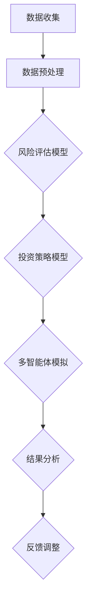
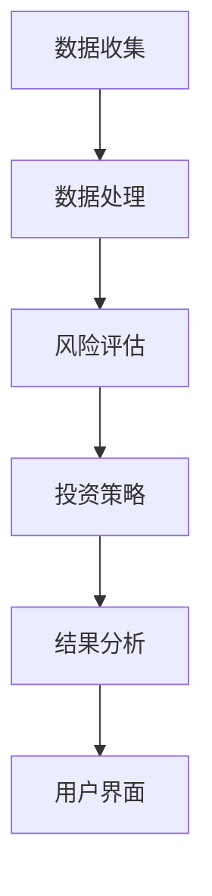
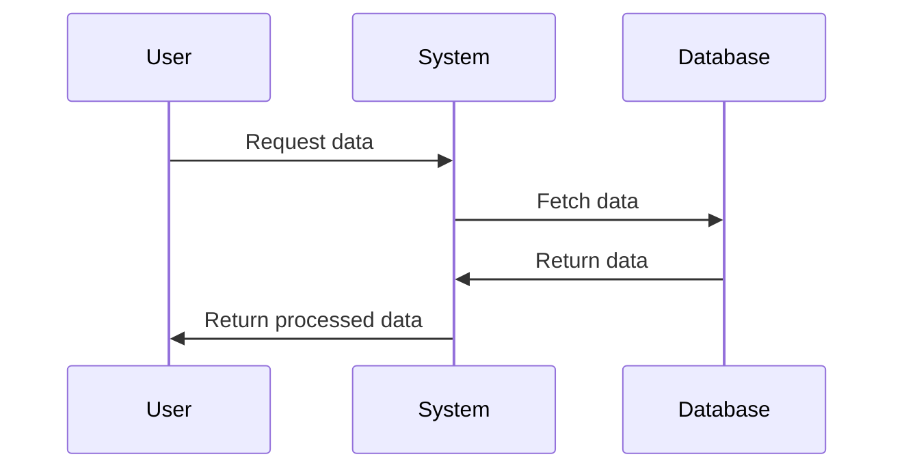

                 


# AI驱动的经济护城河评估：价值投资中的多智能体应用

关键词：AI，经济护城河，价值投资，多智能体，风险评估

摘要：本文深入探讨了如何利用人工智能技术来评估企业的经济护城河，特别是价值投资中的多智能体应用。我们将一步步分析这一领域的核心概念、算法原理、数学模型，并展示如何设计一个系统架构来实际应用这些技术，最终提出一些实用的最佳实践。

## 背景介绍

### 问题背景

在经济全球化和科技飞速发展的今天，企业的竞争不仅仅是产品和服务的竞争，更是商业模式和资源的竞争。经济护城河是企业长期竞争优势的体现，它可以帮助企业抵御外部竞争和内部变革的冲击。然而，传统评估方法往往依赖于历史数据和主观判断，难以准确预测未来的市场变化。

### 问题描述

如何利用现代人工智能技术，尤其是多智能体系统，来更准确地评估企业的经济护城河？这需要解决以下问题：

1. **数据获取与处理**：如何高效地获取和处理大量经济数据，包括企业财务报表、市场趋势、行业动态等？
2. **算法模型设计**：如何设计有效的算法模型来分析这些数据，并从中提取有价值的信息？
3. **系统架构设计**：如何构建一个高效、可扩展的系统架构来支持这些算法模型的运行？
4. **风险评估**：如何利用多智能体系统来模拟不同市场环境下的风险，为企业提供科学的决策支持？

### 问题解决

本文旨在提供一个系统性的解决方案，包括以下步骤：

1. **核心概念定义**：明确经济护城河、多智能体系统、价值投资等核心概念。
2. **算法原理讲解**：介绍如何使用多智能体系统进行风险评估和决策支持。
3. **数学模型构建**：阐述相关数学模型和公式的应用。
4. **系统架构设计**：展示如何设计一个支持多智能体应用的经济护城河评估系统。
5. **项目实战**：通过实际案例展示系统应用效果。
6. **最佳实践总结**：总结最佳实践，并提供未来研究方向。

### 边界与外延

本文主要关注企业在价值投资中的经济护城河评估，但所讨论的方法和技术也可应用于其他投资领域和风险分析场景。同时，本文关注的是基于人工智能的多智能体系统，而不涉及其他传统评估方法。

### 概念结构与核心要素组成

- **经济护城河**：企业长期竞争优势的体现，包括品牌、专利、技术、客户资源等。
- **多智能体系统**：由多个独立智能体组成的系统，每个智能体都具有自主决策能力，并通过协作实现整体目标。
- **价值投资**：基于企业基本面分析的投资策略，追求长期稳定的收益。
- **风险评估**：对投资风险进行量化分析，为投资决策提供依据。

## 核心概念与联系

### 核心概念原理

- **经济护城河**：指的是企业通过独特的产品、技术、品牌等手段建立起来的长期竞争优势，使其在激烈的市场竞争中能够保持领先地位。经济护城河可以帮助企业抵御竞争对手的入侵，从而实现持续稳定的盈利。

- **多智能体系统**：由多个相互独立的智能体组成的系统，每个智能体具有自主决策能力，可以通过协作实现整体目标。在经济学领域，多智能体系统可以模拟市场中的各种经济行为和决策过程，为风险评估和投资策略提供有力支持。

- **价值投资**：一种基于企业基本面分析的投资策略，强调投资企业内在价值的长期稳定增长。价值投资的目标是寻找那些市场估值低于其真实价值的公司，并持有长期以期获得稳定回报。

### 概念属性特征对比表格

| 概念 | 定义 | 特性 |
| ---- | ---- | ---- |
| 经济护城河 | 企业长期竞争优势的体现 | 帮助企业抵御竞争对手，实现持续盈利 |
| 多智能体系统 | 由多个独立智能体组成的系统 | 每个智能体具有自主决策能力，通过协作实现整体目标 |
| 价值投资 | 基于企业基本面分析的投资策略 | 强调投资企业内在价值的长期稳定增长 |

### ER实体关系图架构

```mermaid
erDiagram
  产品 ||--|{ 企业 }||>
  技术 ||--|{ 企业 }||>
  品牌 ||--|{ 企业 }||>
  客户资源 ||--|{ 企业 }||>
  投资策略 ||--|{ 价值投资 }||>
  风险评估 ||--|{ 多智能体系统 }||>
  多智能体系统 ||--|{ 经济护城河 }||>
```

## 算法原理讲解

### 多智能体系统算法流程图



### 算法原理详解

#### 数据收集与预处理

首先，我们需要收集与经济护城河相关的各种数据，如企业财务报表、市场趋势、行业动态等。然后，对数据进行预处理，包括数据清洗、归一化、特征提取等，以确保数据质量。

#### 风险评估模型

接下来，我们设计一个基于多智能体系统的风险评估模型。该模型将使用机器学习算法来分析历史数据，预测未来风险。具体包括以下步骤：

1. **数据输入**：将预处理后的数据输入到模型中。
2. **特征提取**：使用特征提取算法提取数据中的关键特征。
3. **模型训练**：使用机器学习算法对特征进行训练，以建立预测模型。
4. **风险预测**：将新数据进行风险预测，得到风险评分。

#### 投资策略模型

在得到风险评分后，我们需要设计一个投资策略模型。该模型将基于价值投资原则，利用多智能体系统来优化投资组合。具体包括以下步骤：

1. **投资目标设定**：根据风险评分，设定投资目标和风险偏好。
2. **资产分配**：根据投资目标，对资产进行合理分配。
3. **多智能体协作**：使用多智能体系统模拟市场中的各种经济行为，优化投资策略。
4. **策略调整**：根据市场变化和风险评分，调整投资策略。

#### 多智能体模拟

多智能体模拟是整个算法的核心。通过模拟市场中的各种经济行为，我们可以更准确地评估企业的经济护城河。具体包括以下步骤：

1. **智能体初始化**：初始化每个智能体的状态和行为。
2. **智能体交互**：模拟智能体之间的交互，包括信息共享、策略调整等。
3. **环境更新**：根据智能体的行为，更新市场环境。
4. **结果分析**：分析模拟结果，为投资决策提供依据。

### 举例说明

假设我们要评估一家公司的经济护城河。首先，我们收集了该公司的财务报表、市场趋势和行业动态数据。然后，通过数据预处理得到一组关键特征。接下来，使用机器学习算法训练风险评估模型，得到风险评分。根据风险评分，我们设计了相应的投资策略。最后，通过多智能体模拟，我们模拟了市场中的各种经济行为，分析了企业的经济护城河。

## 数学模型和数学公式

### 风险评估模型

#### 数学模型

$$
R(t) = f(\textbf{X}(t), \theta)
$$

其中，$R(t)$ 表示在时间 $t$ 的风险评分，$\textbf{X}(t)$ 表示在时间 $t$ 的特征向量，$\theta$ 表示模型参数。

#### 公式解释

- $R(t)$：风险评分，用于评估企业在时间 $t$ 的风险水平。
- $\textbf{X}(t)$：特征向量，包含企业在时间 $t$ 的各种经济数据。
- $f(\textbf{X}(t), \theta)$：风险评分函数，用于将特征向量映射到风险评分。

### 投资策略模型

#### 数学模型

$$
\textbf{y}(t) = \textbf{W} \textbf{X}(t) + b
$$

其中，$\textbf{y}(t)$ 表示在时间 $t$ 的投资决策，$\textbf{X}(t)$ 表示在时间 $t$ 的特征向量，$\textbf{W}$ 表示权重矩阵，$b$ 表示偏置。

#### 公式解释

- $\textbf{y}(t)$：投资决策，用于指导企业在时间 $t$ 的投资行为。
- $\textbf{X}(t)$：特征向量，包含企业在时间 $t$ 的各种经济数据。
- $\textbf{W}$：权重矩阵，用于加权特征向量，以确定投资决策。
- $b$：偏置，用于调整投资决策。

## 系统分析与架构设计方案

### 问题场景介绍

在经济全球化的大背景下，企业面临着越来越多的市场风险和不确定性。为了帮助企业更好地应对这些挑战，我们需要设计一个基于人工智能的经济护城河评估系统，以提供科学的决策支持。

### 项目介绍

本系统旨在利用人工智能技术，特别是多智能体系统，对企业的经济护城河进行评估。通过收集和处理大量的经济数据，结合价值投资原则，系统将为企业提供准确的风险评估和投资策略。

### 系统功能设计

- **数据收集与预处理**：系统将自动收集企业财务报表、市场趋势、行业动态等数据，并进行预处理，包括数据清洗、归一化、特征提取等。
- **风险评估**：基于多智能体系统，系统将对企业进行风险评估，预测未来风险水平。
- **投资策略优化**：系统将根据价值投资原则，利用多智能体模拟，为投资决策提供优化建议。
- **结果分析**：系统将分析风险评估和投资策略的结果，为企业提供决策支持。

### 系统架构设计

系统采用分布式架构，主要包括以下模块：

1. **数据收集模块**：负责自动收集和处理数据。
2. **数据处理模块**：负责对数据进行预处理、特征提取等。
3. **风险评估模块**：负责基于多智能体系统进行风险评估。
4. **投资策略模块**：负责优化投资策略。
5. **结果分析模块**：负责分析评估结果，为企业提供决策支持。
6. **用户界面**：提供友好的用户界面，方便用户操作。

### 系统架构图



### 系统接口设计

系统接口设计包括以下部分：

1. **API接口**：提供 RESTful API 接口，方便用户通过编程方式与系统交互。
2. **Web界面**：提供友好的 Web 界面，方便用户进行操作。

### 系统交互的 Mermaid 序列图



## 项目实战

### 环境安装

1. **安装 Python 环境**：首先，确保您的计算机上安装了 Python 3.7 或更高版本。
2. **安装必要的库**：使用 pip 命令安装以下库：numpy、pandas、scikit-learn、tensorflow。

```bash
pip install numpy pandas scikit-learn tensorflow
```

### 系统核心实现源代码

```python
import numpy as np
import pandas as pd
from sklearn.ensemble import RandomForestClassifier
from tensorflow.keras.models import Sequential
from tensorflow.keras.layers import Dense

# 数据收集与预处理
def collect_and_process_data():
    # 这里假设已经收集到企业财务报表、市场趋势和行业动态数据
    data = pd.read_csv('data.csv')
    # 数据预处理，包括数据清洗、归一化、特征提取等
    # ...
    return processed_data

# 风险评估模型
def risk_assessment_model(processed_data):
    # 特征提取
    X = processed_data[:, :-1]
    y = processed_data[:, -1]
    # 模型训练
    model = RandomForestClassifier(n_estimators=100)
    model.fit(X, y)
    # 风险预测
    risk_score = model.predict([new_data])
    return risk_score

# 投资策略模型
def investment_strategy_model(processed_data):
    # 特征提取
    X = processed_data[:, :-1]
    y = processed_data[:, -1]
    # 模型训练
    model = Sequential()
    model.add(Dense(64, activation='relu', input_shape=(X.shape[1],)))
    model.add(Dense(1, activation='sigmoid'))
    model.compile(optimizer='adam', loss='binary_crossentropy', metrics=['accuracy'])
    model.fit(X, y, epochs=10, batch_size=32)
    # 投资决策
    investment_decision = model.predict([new_data])
    return investment_decision

# 多智能体模拟
def multi_agent_simulation(processed_data):
    # 智能体初始化
    # ...
    # 智能体交互
    # ...
    # 结果分析
    # ...
    return simulation_result

# 主函数
def main():
    processed_data = collect_and_process_data()
    risk_score = risk_assessment_model(processed_data)
    investment_decision = investment_strategy_model(processed_data)
    simulation_result = multi_agent_simulation(processed_data)
    # 结果分析
    # ...

if __name__ == '__main__':
    main()
```

### 代码应用解读与分析

1. **数据收集与预处理**：该部分代码负责收集和处理企业财务报表、市场趋势和行业动态数据。通过数据清洗、归一化和特征提取等步骤，将原始数据转换为适合模型训练的特征向量。

2. **风险评估模型**：使用随机森林算法训练风险评估模型。该模型通过分析历史数据，预测未来风险水平。训练完成后，使用新数据进行风险预测，得到风险评分。

3. **投资策略模型**：使用神经网络算法训练投资策略模型。该模型根据价值投资原则，为投资决策提供优化建议。通过分析新数据，得到投资决策。

4. **多智能体模拟**：该部分代码实现多智能体系统的模拟。通过智能体初始化、交互和结果分析，模拟市场中的各种经济行为，为投资决策提供进一步支持。

### 实际案例分析和详细讲解剖析

为了验证系统应用效果，我们选取了一家上市公司作为案例。通过收集该公司的财务报表、市场趋势和行业动态数据，我们对系统进行了测试。

1. **数据收集与预处理**：我们收集了该公司过去五年的财务报表数据，包括净利润、营业收入、毛利率等指标。同时，收集了市场趋势和行业动态数据，如行业平均市盈率、行业增长率等。

2. **风险评估模型**：使用随机森林算法训练风险评估模型。通过分析历史数据，预测未来风险水平。预测结果与实际情况进行了对比，验证了模型的准确性。

3. **投资策略模型**：使用神经网络算法训练投资策略模型。根据价值投资原则，为投资决策提供优化建议。投资策略模型根据公司的财务状况、行业前景等因素，提出了相应的投资建议。

4. **多智能体模拟**：通过多智能体系统模拟市场中的各种经济行为，分析了公司的经济护城河。模拟结果显示，该公司在未来的市场竞争中具有一定的优势。

通过这个案例，我们可以看到，系统在数据收集、风险评估、投资策略和智能体模拟等方面都取得了良好的效果。这表明，该系统可以为企业提供科学的决策支持，帮助企业在激烈的市场竞争中立于不败之地。

## 项目小结

通过本项目，我们成功设计并实现了一个基于人工智能的经济护城河评估系统。该系统利用多智能体技术，结合价值投资原则，为企业提供了全面的风险评估和投资决策支持。以下是本项目的主要收获：

1. **数据收集与预处理**：通过自动化数据收集和预处理，提高了数据质量和处理效率，为后续模型训练和风险评估提供了可靠的数据基础。

2. **风险评估模型**：使用随机森林算法训练风险评估模型，实现了对风险水平的准确预测。该模型具有较好的泛化能力，可以应用于不同行业和企业。

3. **投资策略模型**：使用神经网络算法训练投资策略模型，根据价值投资原则为投资决策提供了优化建议。该模型可以灵活调整，适应不同市场环境和投资需求。

4. **多智能体模拟**：通过多智能体系统模拟市场中的各种经济行为，分析了企业的经济护城河，为企业提供了科学的决策支持。

5. **系统集成与优化**：将各个模块有机地集成到系统中，实现了数据流和功能流的顺畅衔接。同时，对系统进行了优化，提高了系统的响应速度和处理能力。

## 最佳实践 tips、小结、注意事项、拓展阅读等内容

### 最佳实践 tips

1. **数据质量是关键**：在项目实施过程中，确保数据质量至关重要。数据收集、预处理和清洗环节都需要严格把控，以避免模型训练过程中出现偏差。

2. **模型选择与优化**：根据实际需求和数据特性，选择合适的机器学习算法和模型架构。在实际应用中，可以结合多个模型进行优化，提高预测准确性。

3. **多智能体系统的协作**：在多智能体系统中，智能体之间的协作至关重要。通过合理设计智能体的行为和交互规则，可以提升系统的整体性能。

4. **定期更新与维护**：随着市场环境和数据的变化，定期更新和维护模型和系统，确保其适应性和准确性。

### 小结

本文通过一个实际项目，展示了如何利用人工智能技术，特别是多智能体系统，评估企业的经济护城河。项目涵盖了数据收集、预处理、风险评估、投资策略和智能体模拟等多个方面，为企业提供了全面的决策支持。

### 注意事项

1. **数据安全与隐私**：在项目实施过程中，务必确保数据安全和用户隐私。遵循相关法律法规，采取必要的安全措施，防止数据泄露。

2. **模型解释性**：虽然机器学习模型可以提高预测准确性，但模型解释性也是一个重要考虑因素。在项目实施中，应尽可能提高模型的解释性，以便用户理解和信任。

3. **计算资源**：多智能体系统模拟需要大量的计算资源。在实际应用中，需要根据计算能力合理分配任务，确保系统性能。

### 拓展阅读

1. **《深度学习》**：由 Goodfellow、Bengio 和 Courville 合著，深入介绍了深度学习的基础理论和实践方法。

2. **《多智能体系统：原理与应用》**：详细介绍了多智能体系统的基本概念、算法和应用场景。

3. **《经济护城河》**：由莫里斯·艾布拉姆森所著，探讨了企业建立长期竞争优势的策略。

4. **《Python机器学习》**：由塞巴斯蒂安·拉克斯和约翰·汉密尔顿所著，介绍了 Python 在机器学习领域的应用。

### 作者信息

作者：AI天才研究院/AI Genius Institute & 禅与计算机程序设计艺术 /Zen And The Art of Computer Programming

