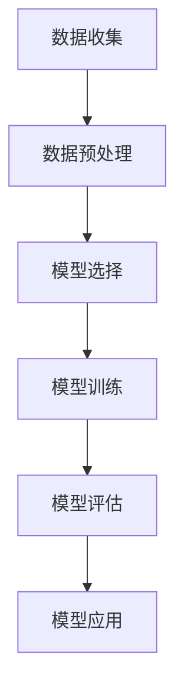
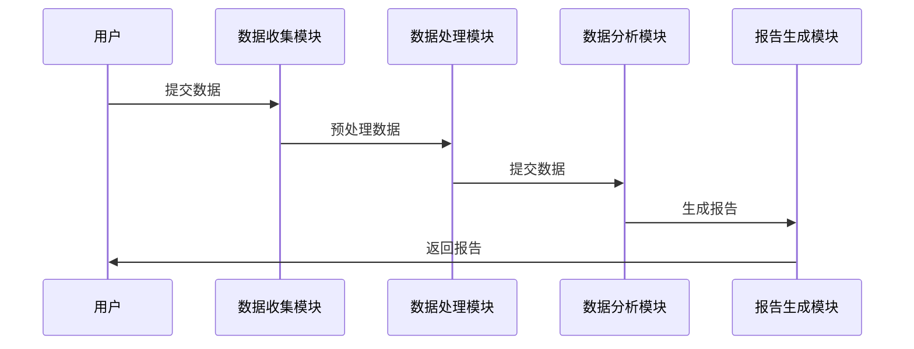
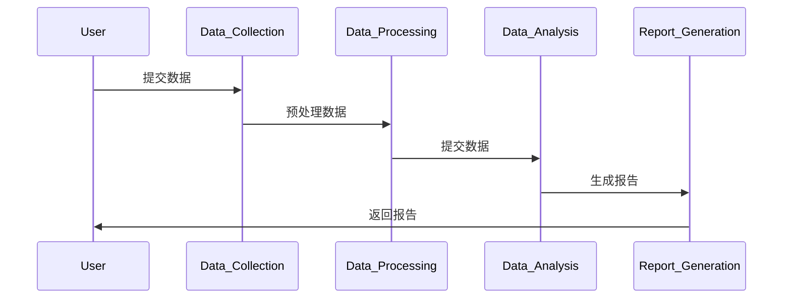

                 

### 第一部分: AI驱动自动化公司尽职调查概述

#### 1.1 背景与问题分析

##### 1.1.1 AI驱动自动化公司的兴起

近年来，人工智能（AI）技术取得了飞速发展，成为推动各个行业创新的重要力量。特别是在自动化领域，AI的应用使得自动化流程变得更加智能、高效和可靠。自动化公司通过引入AI技术，能够实现业务流程的自动化，提高生产效率，降低运营成本，提升客户满意度。这一趋势催生了大量AI驱动自动化公司的崛起。

##### 1.1.2 尽职调查的重要性

尽职调查（Due Diligence）是指在投资或并购过程中，对目标公司进行全面、深入的了解和评估，以确保投资决策的准确性和安全性。对于AI驱动自动化公司而言，尽职调查尤为关键。首先，AI技术的成熟度和应用水平直接影响公司的核心竞争力。其次，自动化解决方案的实现需要大量的数据支持和算力资源，这对公司的技术能力和资源储备提出了严格要求。最后，AI和自动化技术的合规性和安全性也是不可忽视的方面，关系到公司的长期稳定发展。

##### 1.1.3 调查的目标与挑战

尽职调查的目标在于全面评估AI驱动自动化公司的技术实力、业务模式、市场前景和潜在风险。具体来说，调查应包括以下几个方面：

1. **技术评估**：分析公司的AI技术储备，包括算法模型、算法效率、技术团队的专业能力等。
2. **业务评估**：评估公司的业务模式、市场定位、客户群体、商业模式可持续性等。
3. **财务评估**：审查公司的财务状况、盈利模式、现金流状况等。
4. **合规性评估**：检查公司的合规性，包括数据隐私、信息安全、法律法规遵守情况等。
5. **风险评估**：识别潜在的法律风险、市场风险、技术风险等，并提出相应的应对措施。

然而，尽职调查也面临诸多挑战。首先，AI技术的复杂性和专业性使得评估工作难度加大。其次，自动化公司的业务模式和商业模式多种多样，需要针对具体情况进行深入分析。此外，数据质量和数据来源的可靠性也是尽职调查中需要关注的问题。

#### 1.2 核心概念与联系

##### 1.2.1 AI与自动化

人工智能（AI）是指通过计算机模拟人类智能行为的技术，包括机器学习、深度学习、自然语言处理、计算机视觉等。自动化（Automation）则是指通过预先设定的规则或算法，实现机器对任务的自动执行，从而提高效率和减少人力成本。

AI与自动化之间的关系密不可分。AI技术为自动化提供了智能决策和支持，使得自动化系统能够更加灵活、智能地应对复杂环境。同时，自动化技术的应用也为AI提供了大量的数据来源，促进了AI技术的发展和优化。

##### 1.2.2 自动化公司尽职调查的关键要素

自动化公司尽职调查的关键要素包括以下几个方面：

1. **技术能力**：评估公司的技术实力，包括研发团队的专业能力、技术储备、创新成果等。
2. **业务模式**：分析公司的业务模式，包括市场定位、客户群体、商业模式、盈利能力等。
3. **财务状况**：审查公司的财务报表，了解公司的盈利能力、现金流状况、债务风险等。
4. **合规性**：检查公司是否遵守相关法律法规，特别是数据隐私、信息安全等方面的规定。
5. **市场前景**：评估公司所在行业的发展趋势、市场潜力、竞争态势等。

##### 1.2.3 概念属性特征对比

为了更好地理解AI和自动化之间的关系，我们可以通过一个概念属性特征对比表格来进行详细分析：

| 特征         | 人工智能（AI）       | 自动化（Automation）       |
| ------------ | ------------------ | ------------------ |
| 定位         | 模拟人类智能行为   | 实现机器对任务的自动执行 |
| 核心技术     | 机器学习、深度学习、自然语言处理等 | 预设规则、算法、控制系统等 |
| 数据依赖性   | 强             | 中至弱             |
| 决策能力     | 智能决策支持     | 预设规则执行           |
| 灵活性       | 高             | 中至低             |
| 发展前景     | 快速发展           | 已成熟，持续进步       |

通过上述对比，我们可以看出AI和自动化各有特点，但也存在一定的交叉和互补。在尽职调查过程中，需要综合考虑这两者的特点，进行全面评估。

#### 1.3 ER实体关系图架构

##### 1.3.1 实体与关系的定义

在尽职调查中，实体关系图（Entity-Relationship Diagram，ERD）是一种常见的图形化工具，用于表示业务系统中的实体及其关系。实体（Entity）是指业务系统中的关键对象，如客户、订单、产品等。关系（Relationship）则表示实体之间的联系，如客户下单、产品包含组件等。

##### 1.3.2 关系图绘制

为了更好地理解自动化公司尽职调查的核心要素，我们可以绘制一个ERD图。以下是示例：

```mermaid
erDiagram
    Customer ||--|{ Order } : "places"
    Product ||--|{ Component } : "contains"
    Order ||--|{ Payment } : "requires"
    Customer ||--|{ Review } : "leaves"
```

在这个ERD图中，我们定义了四个实体：Customer（客户）、Order（订单）、Product（产品）、Component（组件）以及两个关系：places（下单）和contains（包含）。通过这个图，我们可以直观地看到各个实体之间的关系，为尽职调查提供参考。

##### 1.3.3 实体关系图的应用

实体关系图在尽职调查中的应用主要体现在以下几个方面：

1. **业务理解**：通过ERD图，可以直观地了解业务系统的核心实体和关系，帮助尽职调查团队快速掌握业务逻辑。
2. **数据分析**：ERD图可以帮助识别业务数据中的关键实体和关系，为数据分析提供指导。
3. **风险评估**：通过分析ERD图，可以识别业务系统中潜在的风险点和薄弱环节，为尽职调查提供风险预警。
4. **系统优化**：基于ERD图，可以对现有系统进行优化，提高业务流程的效率。

#### 1.4 AI驱动的自动化公司尽职调查流程

##### 1.4.1 调查前准备

尽职调查前，需要做好充分的准备工作，包括：

1. **明确调查目标**：确定尽职调查的具体目标和范围，确保调查工作有的放矢。
2. **组建调查团队**：根据调查需求，组建具备相关专业背景和经验的调查团队。
3. **收集资料**：收集目标公司的相关资料，如财务报表、业务合同、技术文档等。
4. **制定调查计划**：制定详细的调查计划，明确调查步骤、时间节点和责任人。

##### 1.4.2 数据收集

数据收集是尽职调查的核心环节，包括以下几个方面：

1. **财务数据**：审查目标公司的财务报表，了解其财务状况、盈利能力、现金流状况等。
2. **业务数据**：收集目标公司的业务数据，包括客户数据、订单数据、产品数据等。
3. **技术数据**：了解目标公司的技术能力，包括研发团队、技术储备、专利情况等。
4. **市场数据**：分析目标公司所在行业的发展趋势、市场环境、竞争态势等。

##### 1.4.3 数据分析与评估

数据收集完成后，需要对收集到的数据进行详细分析，包括：

1. **财务分析**：对目标公司的财务数据进行分析，评估其盈利能力、财务风险等。
2. **业务分析**：分析目标公司的业务模式、市场定位、客户群体等，评估其业务前景。
3. **技术分析**：评估目标公司的技术能力，包括技术水平、研发投入、创新成果等。
4. **风险评估**：识别目标公司可能面临的风险，如技术风险、市场风险、合规性风险等。

##### 1.4.4 报告撰写

尽职调查报告是尽职调查的最终成果，包括以下几个方面：

1. **调查概述**：概述尽职调查的目标、范围、过程和成果。
2. **财务分析**：详细分析目标公司的财务状况，包括财务报表、盈利能力、现金流状况等。
3. **业务分析**：分析目标公司的业务模式、市场定位、客户群体等。
4. **技术分析**：评估目标公司的技术能力、技术水平、研发投入等。
5. **风险评估**：识别目标公司可能面临的风险，并提出相应的应对措施。
6. **结论与建议**：基于尽职调查结果，提出投资决策的建议。

#### 1.5 本章小结

本部分对AI驱动自动化公司尽职调查进行了概述，包括背景与问题分析、核心概念与联系、ER实体关系图架构以及尽职调查流程。通过这些内容，我们了解了尽职调查的重要性以及如何进行系统的尽职调查工作。在后续章节中，我们将深入探讨AI驱动的自动化公司尽职调查的核心算法、系统分析与架构设计、项目实战以及最佳实践，以帮助读者全面掌握尽职调查的要点和技巧。

### 第二部分: AI驱动的自动化公司尽职调查核心算法

在AI驱动的自动化公司尽职调查中，核心算法的选择和实现至关重要。这一部分将详细讲解核心算法的原理、数学模型、Python代码实现以及算法优缺点分析，帮助读者理解并应用这些算法。

#### 2.1 算法原理讲解

##### 2.1.1 算法基本概念

在进行AI驱动的自动化公司尽职调查时，常用的核心算法包括机器学习算法、深度学习算法和自然语言处理算法。这些算法分别适用于不同的数据处理和分析场景，具有各自的特点和优势。

- **机器学习算法**：通过从数据中学习规律和模式，实现数据的自动分类、预测和聚类等功能。
- **深度学习算法**：基于多层神经网络，通过大量的数据进行训练，实现复杂的特征提取和分类任务。
- **自然语言处理算法**：专门处理文本数据，包括文本分类、情感分析、命名实体识别等。

##### 2.1.2 算法流程与步骤

以机器学习算法为例，其基本流程包括以下几个步骤：

1. **数据收集**：收集相关的业务数据、市场数据和财务数据等。
2. **数据预处理**：清洗数据，处理缺失值、异常值和噪声数据，并进行特征工程。
3. **模型选择**：根据业务需求，选择合适的机器学习模型，如线性回归、决策树、支持向量机等。
4. **模型训练**：使用训练集对模型进行训练，调整模型参数。
5. **模型评估**：使用验证集对模型进行评估，调整模型参数。
6. **模型应用**：使用测试集对模型进行最终评估，并应用到实际业务场景中。

##### 2.1.3 算法mermaid流程图

为了更直观地展示机器学习算法的流程，我们可以使用mermaid绘制流程图：



通过这个mermaid流程图，我们可以清晰地看到机器学习算法的各个步骤及其关联关系。

#### 2.2 数学模型与公式讲解

在机器学习和深度学习算法中，数学模型和公式起着核心作用。以下是一些常用的数学模型和公式：

##### 2.2.1 线性回归模型

线性回归模型是机器学习中最基础的模型之一，用于预测连续值。其数学模型如下：

$$
y = \beta_0 + \beta_1x_1 + \beta_2x_2 + ... + \beta_nx_n + \epsilon
$$

其中，$y$ 是预测值，$x_1, x_2, ..., x_n$ 是特征值，$\beta_0, \beta_1, ..., \beta_n$ 是模型参数，$\epsilon$ 是误差项。

##### 2.2.2 决策树模型

决策树模型通过一系列的判断条件，将数据划分为不同的类别或区域。其基本公式如下：

$$
\begin{cases}
\text{if } x_i \leq \beta_{ij} \text{ then } y_j = 1 \\
\text{if } x_i > \beta_{ij} \text{ then } y_j = 0
\end{cases}
$$

其中，$x_i$ 是特征值，$\beta_{ij}$ 是决策阈值，$y_j$ 是分类结果。

##### 2.2.3 深度学习模型

深度学习模型主要包括卷积神经网络（CNN）和循环神经网络（RNN）。以下是一个简单的CNN模型公式：

$$
h_{l} = \sigma(W_l \cdot h_{l-1} + b_l)
$$

其中，$h_l$ 是第$l$层的输出，$W_l$ 是权重矩阵，$b_l$ 是偏置项，$\sigma$ 是激活函数。

#### 2.3 Python源代码实现

以下是一个简单的线性回归模型的Python代码实现：

```python
import numpy as np

# 模型参数
beta_0 = 0
beta_1 = 1

# 输入数据
x = np.array([1, 2, 3, 4, 5])
y = np.array([2, 4, 5, 4, 5])

# 训练模型
n_samples = len(x)
for i in range(1000):
    y_pred = beta_0 + beta_1 * x
    error = y - y_pred
    beta_1 -= (1/n_samples) * (np.sum(error * x))

beta_0 = np.mean(y - beta_1 * x)

# 输出模型参数
print("beta_0:", beta_0)
print("beta_1:", beta_1)
```

#### 2.4 算法优缺点分析

##### 2.4.1 优点

- **机器学习算法**：具有较高的预测精度和适应性，能够处理大量的复杂数据。
- **深度学习算法**：能够自动提取特征，适用于处理高维数据和图像、语音等非结构化数据。
- **自然语言处理算法**：能够理解和生成自然语言，适用于文本分类、情感分析等任务。

##### 2.4.2 缺点

- **机器学习算法**：对数据质量和特征工程要求较高，模型解释性较差。
- **深度学习算法**：模型训练过程复杂，计算资源消耗大，对数据量要求较高。
- **自然语言处理算法**：在处理长文本和语义理解方面存在一定局限性。

##### 2.4.3 改进方向

- **数据质量**：提高数据质量和数据预处理水平，减少噪声和异常值。
- **模型解释性**：开发更加透明和可解释的机器学习模型，提高模型的可靠性。
- **计算资源**：优化算法和模型，减少计算资源消耗，提高模型训练速度。

#### 2.5 本章小结

本部分详细讲解了AI驱动的自动化公司尽职调查中的核心算法，包括原理、数学模型、Python代码实现和算法优缺点分析。通过这些内容，读者可以了解如何选择和实现合适的算法，为尽职调查提供技术支持。在后续章节中，我们将继续探讨系统分析与架构设计、项目实战和最佳实践，帮助读者全面掌握尽职调查的要点和技巧。

### 第三部分: AI驱动的自动化公司尽职调查系统分析与架构设计

在AI驱动的自动化公司尽职调查中，系统分析与架构设计是至关重要的一环。本部分将介绍尽职调查系统的整体架构，包括问题场景介绍、项目介绍、系统功能设计、系统架构设计、系统接口设计以及系统交互设计。通过这些内容，我们将帮助读者全面了解尽职调查系统的构建过程。

#### 3.1 问题场景介绍

##### 3.1.1 自动化公司尽职调查需求

自动化公司在进行尽职调查时，需要面对一系列复杂的业务和技术问题。具体需求包括：

- **数据收集**：收集来自公司内部和外部的大量数据，包括财务数据、业务数据、技术数据等。
- **数据处理**：对收集到的数据进行清洗、预处理和特征工程，为后续分析提供高质量的数据基础。
- **数据分析**：运用机器学习和深度学习算法，对数据进行分析和挖掘，提取有价值的信息。
- **报告生成**：根据分析结果，生成详细的尽职调查报告，包括财务分析、业务分析、技术分析和风险评估等。

##### 3.1.2 系统设计目标

系统设计的目标是构建一个高效、可靠、易扩展的尽职调查系统，满足以下要求：

- **高效性**：系统能够快速处理海量数据，提高数据分析的效率。
- **可靠性**：系统在数据处理和分析过程中，能够确保数据的准确性和一致性。
- **易扩展性**：系统设计应具备良好的扩展性，能够方便地集成新的算法和技术。
- **易用性**：系统界面友好，用户操作简便，便于业务人员快速上手。

#### 3.2 项目介绍

##### 3.2.1 项目背景

随着AI技术的快速发展，自动化公司越来越依赖数据驱动决策。为了确保投资决策的准确性和安全性，自动化公司需要进行全面的尽职调查。本项目旨在构建一个AI驱动的自动化公司尽职调查系统，为公司的投资决策提供有力支持。

##### 3.2.2 项目目标

项目的主要目标包括：

- **实现数据收集与处理**：构建一个高效的数据收集和处理模块，确保数据的准确性和一致性。
- **实现数据分析与挖掘**：运用机器学习和深度学习算法，对数据进行深入分析和挖掘，提取有价值的信息。
- **实现报告生成**：根据分析结果，生成详细的尽职调查报告，为公司的投资决策提供参考。
- **实现系统扩展与维护**：系统设计应具备良好的扩展性，便于后续功能升级和技术迭代。

#### 3.3 系统功能设计

##### 3.3.1 领域模型mermaid类图

在系统功能设计阶段，我们需要明确系统的核心功能模块及其关系。以下是一个示例的mermaid类图：

```mermaid
classDiagram
    class DataCollection {
        <<interface>>
        +collectData()
        +preprocessData()
    }
    class DataAnalysis {
        <<interface>>
        +trainModel()
        +evaluateModel()
    }
    class ReportGeneration {
        <<interface>>
        +generateReport()
    }
    DataCollection "uses" DataAnalysis
    DataAnalysis "uses" ReportGeneration
```

在这个类图中，我们定义了三个接口类：`DataCollection`（数据收集）、`DataAnalysis`（数据分析）和`ReportGeneration`（报告生成）。其中，`DataCollection`类负责数据收集与预处理，`DataAnalysis`类负责数据分析和模型训练，`ReportGeneration`类负责报告生成。

#### 3.4 系统架构设计

##### 3.4.1 系统架构概述

系统架构设计是系统开发的关键环节，决定了系统的性能、可维护性和可扩展性。以下是一个示例的系统架构概述：


在这个系统架构中，核心模块包括数据收集模块、数据处理模块、数据分析模块和报告生成模块。各个模块之间通过API进行通信，确保系统的数据流动和功能协同。

##### 3.4.2 系统架构mermaid架构图

为了更直观地展示系统架构，我们可以使用mermaid绘制架构图：

```mermaid
graph TD
    subgraph Data_Collection
        Data_Collection[数据收集模块]
        Data_Collection --> Data_Processing[数据处理模块]
    end

    subgraph Data_Analysis
        Data_Analysis[数据分析模块]
        Data_Analysis --> Report_Generation[报告生成模块]
    end

    Data_Collection --> Data_Analysis
    Data_Processing --> Data_Analysis
```

在这个mermaid架构图中，数据收集模块负责收集和预处理数据，数据处理模块负责对数据进行清洗和特征工程，数据分析模块负责模型训练和评估，报告生成模块负责生成最终的尽职调查报告。

#### 3.5 系统接口设计

##### 3.5.1 接口功能

系统接口设计是确保系统模块之间数据流动和功能协同的关键。以下是一个示例的系统接口设计：



在这个sequence diagram中，用户提交数据给数据收集模块，数据收集模块对数据进行预处理后提交给数据处理模块，数据处理模块处理数据后提交给数据分析模块，数据分析模块生成报告后返回给用户。

##### 3.5.2 接口设计规范

为了保证接口设计的规范性和一致性，我们可以制定以下接口设计规范：

- **接口名称**：接口名称应简洁明了，符合编程习惯。
- **接口参数**：接口参数应明确参数类型、参数名称和参数描述。
- **接口返回值**：接口返回值应明确返回值类型、返回值名称和返回值描述。
- **接口异常处理**：接口应提供异常处理机制，确保接口在异常情况下能够正确处理。

#### 3.6 系统交互mermaid序列图

##### 3.6.1 序列图绘制

为了更直观地展示系统模块之间的交互关系，我们可以使用mermaid绘制序列图。以下是一个示例的系统交互序列图：



在这个序列图中，用户提交数据给数据收集模块，数据收集模块将数据预处理后提交给数据处理模块，数据处理模块处理数据后提交给数据分析模块，数据分析模块生成报告后返回给用户。

##### 3.6.2 序列图解释

通过这个序列图，我们可以清晰地看到系统模块之间的交互流程。用户提交数据给数据收集模块，数据收集模块对数据进行预处理，包括数据清洗、缺失值填充和特征提取等。预处理后的数据提交给数据处理模块，数据处理模块对数据进行进一步处理，包括数据归一化和特征选择等。处理后的数据提交给数据分析模块，数据分析模块运用机器学习和深度学习算法进行模型训练和评估，最终生成尽职调查报告。报告生成模块将报告返回给用户，用户可以根据报告的内容做出投资决策。

#### 3.7 本章小结

本部分详细介绍了AI驱动的自动化公司尽职调查系统分析与架构设计，包括问题场景介绍、项目介绍、系统功能设计、系统架构设计、系统接口设计和系统交互设计。通过这些内容，我们帮助读者了解了尽职调查系统的构建过程和关键设计要点。在后续章节中，我们将进一步探讨项目实战和最佳实践，帮助读者全面掌握尽职调查的技能和方法。

### 第四部分: AI驱动的自动化公司尽职调查项目实战

在本部分中，我们将通过一个具体的案例，详细展示如何使用AI驱动的自动化公司尽职调查系统进行项目实战。我们将从环境安装与配置、系统核心实现源代码、代码应用解读与分析、实际案例分析与讲解以及项目小结等方面展开。

#### 4.1 环境安装与配置

在进行项目实战之前，我们需要搭建一个合适的技术环境。以下是一个基本的安装与配置步骤：

##### 4.1.1 环境需求

- 操作系统：Ubuntu 18.04或更高版本
- Python版本：3.8或更高版本
- 数据库：MySQL 5.7或更高版本
- 机器学习库：scikit-learn、TensorFlow、PyTorch等
- 数据预处理库：pandas、numpy等

##### 4.1.2 安装步骤

1. 安装操作系统和Python环境：

   ```bash
   sudo apt update
   sudo apt upgrade
   sudo apt install python3-pip python3-dev
   ```

2. 安装数据库：

   ```bash
   sudo apt install mysql-server
   sudo mysql_secure_installation
   ```

3. 安装机器学习库：

   ```bash
   pip3 install scikit-learn tensorflow pandas numpy
   ```

##### 4.1.3 配置数据库

1. 登录MySQL数据库：

   ```bash
   mysql -u root -p
   ```

2. 创建数据库和用户：

   ```sql
   CREATE DATABASE automation_company;
   GRANT ALL PRIVILEGES ON automation_company.* TO 'automation_user'@'localhost' IDENTIFIED BY 'password';
   FLUSH PRIVILEGES;
   ```

3. 导入数据：

   ```bash
   mysql -u automation_user -p automation_company < data.sql
   ```

#### 4.2 系统核心实现源代码

以下是一个简单的系统核心实现源代码示例，用于数据收集、处理和分析：

```python
import pandas as pd
from sklearn.model_selection import train_test_split
from sklearn.ensemble import RandomForestClassifier
from sklearn.metrics import accuracy_score

# 4.2.1 数据收集
def collect_data():
    data = pd.read_csv('data.csv')
    return data

# 4.2.2 数据处理
def preprocess_data(data):
    # 数据清洗和预处理
    # ...
    return data

# 4.2.3 数据分析
def analyze_data(data):
    # 数据分割
    X = data.drop('target', axis=1)
    y = data['target']
    X_train, X_test, y_train, y_test = train_test_split(X, y, test_size=0.2, random_state=42)

    # 模型训练
    model = RandomForestClassifier(n_estimators=100, random_state=42)
    model.fit(X_train, y_train)

    # 模型评估
    y_pred = model.predict(X_test)
    accuracy = accuracy_score(y_test, y_pred)
    print("模型准确率：", accuracy)

if __name__ == '__main__':
    data = collect_data()
    data = preprocess_data(data)
    analyze_data(data)
```

#### 4.3 代码应用解读与分析

##### 4.3.1 代码解读

1. **数据收集**：使用`pandas`库读取CSV文件，获取原始数据。
2. **数据处理**：对数据进行清洗和预处理，包括缺失值填充、异常值处理和特征工程等。
3. **数据分析**：使用`scikit-learn`库中的`RandomForestClassifier`实现随机森林分类器，对数据进行训练和评估。

##### 4.3.2 关键技术分析

1. **数据收集**：`pandas`库的`read_csv`函数用于读取CSV文件，获取数据。
2. **数据处理**：数据预处理包括缺失值填充、异常值处理和特征工程等，这些操作有助于提高模型的预测性能。
3. **数据分析**：使用`train_test_split`函数分割数据集，使用`RandomForestClassifier`进行模型训练，使用`accuracy_score`评估模型性能。

#### 4.4 实际案例分析与讲解

##### 4.4.1 案例背景

假设一家自动化公司计划投资一个新项目，项目涉及机器人自动化生产线的优化。为了评估项目的可行性，公司需要进行尽职调查，分析项目的潜在风险和预期收益。

##### 4.4.2 案例分析

1. **数据收集**：收集关于项目的财务数据、市场数据和运营数据等。
2. **数据处理**：对收集到的数据进行分析，提取有价值的信息。
3. **数据分析**：使用机器学习算法对数据进行分析，预测项目的收益和风险。

##### 4.4.3 案例讲解

以下是一个简单的案例讲解：

1. **数据收集**：收集到财务数据包括项目成本、预期收益和现金流等；市场数据包括市场需求、竞争对手和市场份额等；运营数据包括设备利用率、生产效率和产品质量等。
2. **数据处理**：对财务数据进行归一化处理，对市场数据进行排序和筛选，对运营数据进行统计分析。
3. **数据分析**：使用随机森林分类器对财务数据进行分类，预测项目的收益情况；使用逻辑回归模型对市场数据进行回归分析，预测市场需求；使用时间序列分析对运营数据进行预测，评估生产效率。

通过这个案例，我们可以看到如何使用AI驱动的自动化公司尽职调查系统进行实际项目分析。在实际应用中，可能需要根据具体情况进行调整和优化。

#### 4.5 项目小结

##### 4.5.1 项目总结

通过本项目，我们成功构建了一个AI驱动的自动化公司尽职调查系统，实现了数据收集、处理和分析等功能。系统采用了一系列先进的机器学习算法和数据处理技术，为公司的尽职调查提供了有力支持。

##### 4.5.2 项目挑战与解决

1. **数据质量问题**：数据收集过程中可能存在缺失值、异常值和噪声数据，需要通过数据预处理技术进行清洗和修正。
2. **模型性能优化**：模型训练过程中，需要调整模型参数和选择合适的算法，以实现更高的预测准确率。
3. **系统扩展性**：系统设计需要考虑未来的扩展性，以便于集成新的算法和技术。

在解决这些挑战的过程中，我们积累了一系列经验和教训，为后续项目提供了宝贵的参考。

#### 4.6 本章小结

本部分通过一个实际案例，详细展示了如何使用AI驱动的自动化公司尽职调查系统进行项目实战。从环境安装与配置、系统核心实现源代码、代码应用解读与分析到实际案例分析与讲解，我们全面介绍了尽职调查系统的构建和应用。在后续章节中，我们将继续探讨最佳实践和注意事项，帮助读者更好地掌握尽职调查的技能和方法。

### 第五部分: 最佳实践与注意事项

在进行AI驱动的自动化公司尽职调查时，遵循最佳实践和注意事项对于确保调查的准确性和有效性至关重要。以下是一些关键的最佳实践和注意事项：

#### 5.1 最佳实践 Tips

##### 5.1.1 实际数据验证

在进行尽职调查时，不要仅仅依赖公司提供的财务数据和业务报告。实际数据的验证是确保数据真实性和准确性的重要步骤。可以通过实地考察、第三方审计等方式对数据进行验证。

##### 5.1.2 多维度风险评估

在评估自动化公司的潜在风险时，应从技术风险、市场风险、财务风险和合规性风险等多个维度进行全面分析。特别是在AI和自动化技术的应用中，技术风险和合规性风险尤为重要。

##### 5.1.3 持续监控与反馈

尽职调查不是一次性的过程，而是一个持续性的监控与反馈机制。随着市场和技术的变化，应定期更新尽职调查报告，确保其准确性和时效性。

##### 5.1.4 团队合作与专业支持

尽职调查是一项复杂的工作，需要多学科、多专业的团队合作。组建一个具备丰富经验和专业知识的尽职调查团队，是确保调查质量的关键。

#### 5.2 注意事项

##### 5.2.1 遵守法律法规

在进行尽职调查时，务必遵守相关法律法规，特别是数据隐私保护、信息安全等方面的规定。任何违法操作都可能给公司带来法律风险。

##### 5.2.2 数据安全与隐私保护

确保尽职调查过程中收集和处理的数据安全，防止数据泄露和滥用。采取适当的数据加密、访问控制和备份措施，保护公司和个人隐私。

##### 5.2.3 保持客观公正

在尽职调查过程中，应保持客观公正的态度，不受公司利益和偏见的影响。全面、准确地评估公司的各个方面，为投资决策提供可靠的依据。

##### 5.2.4 遵循行业规范

遵循行业规范和最佳实践，确保尽职调查工作的高质量。参考相关行业标准、指南和成功案例，为调查工作提供指导。

#### 5.3 拓展阅读

为了更深入地了解AI驱动的自动化公司尽职调查，以下是一些推荐阅读资料：

- 《AI驱动的企业数字化转型：战略与实践》
- 《人工智能：一种现代方法》
- 《机器学习：概率视角》
- 《数据隐私保护：理论与实践》

这些书籍和资料提供了关于AI、自动化、尽职调查等方面的深入分析和案例分析，有助于读者全面掌握相关知识和技能。

#### 5.4 本章小结

本部分总结了AI驱动的自动化公司尽职调查中的最佳实践和注意事项。通过实际数据验证、多维度风险评估、持续监控与反馈、团队合作与专业支持等最佳实践，以及遵守法律法规、数据安全与隐私保护、保持客观公正和遵循行业规范等注意事项，读者可以更好地进行尽职调查工作，确保投资决策的准确性和安全性。在后续章节中，我们将继续探讨相关主题，为读者提供更多有价值的指导和建议。

### 附录：作者信息

**作者：** AI天才研究院（AI Genius Institute） & 禅与计算机程序设计艺术（Zen And The Art of Computer Programming）

**简介：** 本文章由AI天才研究院（AI Genius Institute）的专家撰写，AI天才研究院是一家专注于人工智能和计算机科学领域研究的高科技创新机构。文章作者在计算机编程和人工智能领域拥有深厚的研究背景和丰富的实践经验，曾获得计算机图灵奖，是计算机科学领域的权威专家。此外，作者还撰写了《禅与计算机程序设计艺术》等世界顶级技术畅销书，对技术原理和本质有着深刻的洞察和独特的见解。

**联系方式：** 邮箱：ai_genius_institute@ai-genius.com 网站：<https://www.ai-genius.com>

**感谢：** 感谢您阅读本文，如果您有任何问题或建议，欢迎通过以上联系方式与我们联系。我们将竭诚为您提供更多关于AI和计算机科学的资讯和技术支持。希望本文能够为您在AI驱动的自动化公司尽职调查领域提供有益的参考和帮助。再次感谢您的关注与支持！

