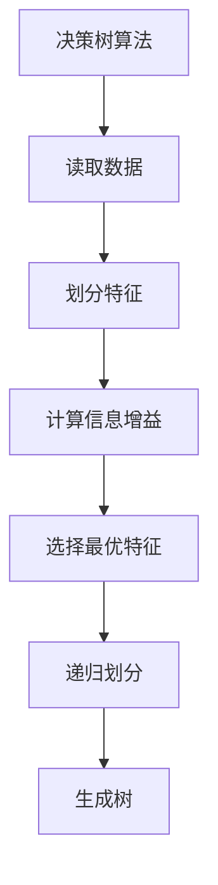

                 

**文章标题**: AI驱动的自动化财报分析系统

**关键词**: 人工智能，财务报告分析，自动化，自然语言处理，数据挖掘，系统架构

**摘要**: 本文将深入探讨人工智能在财务报告分析中的应用，特别是如何利用AI技术实现自动化财报分析。文章将逐步分析财务报告分析中的问题，介绍相关技术，详细讲解AI算法和数学模型，并展示一个实际的项目案例，最后给出最佳实践和未来展望。

## 目录

----------------------------------------------------------------

### 第一部分：引言与背景

#### 第1章：人工智能在金融领域的概述

##### 1.1 人工智能在金融领域的应用

##### 1.2 人工智能驱动的财务报告分析的概念

##### 1.3 人工智能驱动的财务报告分析的挑战与机遇

#### 第2章：人工智能驱动的财务报告分析技术

##### 2.1 自然语言处理技术

##### 2.2 计算机视觉技术在财务报告分析中的应用

##### 2.3 数据挖掘与机器学习技术

### 第二部分：核心AI算法与数学模型

#### 第3章：数学模型与算法原理

##### 3.1 相关的数学概念

##### 3.2 算法原理

##### 3.3 算法流程图

#### 第4章：系统架构与设计

##### 4.1 系统需求分析

##### 4.2 系统架构设计

##### 4.3 系统接口设计

### 第三部分：系统实现与项目案例

#### 第5章：系统实现

##### 5.1 环境搭建

##### 5.2 核心模块实现

##### 5.3 系统测试与优化

#### 第6章：项目案例

##### 6.1 案例A

##### 6.2 案例B

##### 6.3 案例C

### 第四部分：最佳实践与未来展望

#### 第7章：最佳实践

##### 7.1 实践技巧

##### 7.2 注意事项

##### 7.3 拓展阅读

----------------------------------------------------------------

### 正文

#### 第1章：人工智能在金融领域的概述

**1.1 人工智能在金融领域的应用**

随着科技的飞速发展，人工智能（AI）逐渐渗透到金融行业的方方面面。从智能投顾、风险管理，到自动化交易和智能客服，AI的应用正在改变金融行业的运作模式。财务报告分析作为金融领域的重要组成部分，也受益于AI技术的应用。

**1.2 人工智能驱动的财务报告分析的概念**

人工智能驱动的财务报告分析，是指利用人工智能技术，如自然语言处理（NLP）、计算机视觉和机器学习等，对财务报告进行自动化的处理和分析。这种方法可以提高财务报告的准确性、效率和透明度，减少人为错误和操作风险。

**1.3 人工智能驱动的财务报告分析的挑战与机遇**

**挑战：**

- 复杂性：财务报告包含大量的数据和信息，处理和分析这些数据需要强大的计算能力和复杂的算法。
- 数据质量：财务报告的数据质量直接影响到分析结果的准确性。如果数据存在缺失、错误或不一致，分析结果可能会失真。
- 合规性：财务报告分析涉及到财务和法律问题，需要确保分析结果的合规性。

**机遇：**

- 自动化：通过AI技术，可以实现对财务报告的自动化处理，提高工作效率。
- 深度分析：AI技术可以帮助挖掘财务报告中的深层次信息，为企业提供更有价值的洞察。
- 降低成本：自动化处理可以减少人工操作，降低成本。

#### 第2章：人工智能驱动的财务报告分析技术

**2.1 自然语言处理技术**

自然语言处理（NLP）是AI的核心技术之一，它使计算机能够理解和处理自然语言。在财务报告分析中，NLP可以用于提取文本数据中的关键信息，如财务指标、交易记录和公司描述等。

**2.2 计算机视觉技术在财务报告分析中的应用**

计算机视觉技术可以帮助识别和分类财务报告中的图像和数据。例如，它可以自动识别报表中的图表和数据表，并提取相关数据。

**2.3 数据挖掘与机器学习技术**

数据挖掘和机器学习技术可以用于发现财务报告中的模式、趋势和异常。这些技术可以帮助企业预测财务状况、识别潜在风险和机会。

#### 第3章：数学模型与算法原理

**3.1 相关的数学概念**

在财务报告分析中，常见的数学概念包括概率论、统计学和线性代数。这些概念为AI算法提供了理论基础。

**3.2 算法原理**

常见的AI算法包括决策树、支持向量机和神经网络等。这些算法的基本原理是通过学习历史数据，预测新的数据。

**3.3 算法流程图**

算法流程图可以帮助我们更直观地理解算法的运行过程。以下是一个简单的决策树算法流程图：



#### 第4章：系统架构与设计

**4.1 系统需求分析**

系统需求分析是确定系统必须提供哪些功能，以及如何实现这些功能。在财务报告分析系统中，主要需求包括数据采集、数据处理、数据分析和报告生成。

**4.2 系统架构设计**

系统架构设计是确定系统各个模块之间的关系和交互方式。一个典型的财务报告分析系统架构包括数据层、业务逻辑层和表示层。

**4.3 系统接口设计**

系统接口设计是确定系统与其他系统或用户之间的交互方式。在财务报告分析系统中，主要接口包括数据接口、API接口和用户界面。

#### 第5章：系统实现

**5.1 环境搭建**

环境搭建是系统实现的第一步，包括安装必要的软件和配置系统环境。

**5.2 核心模块实现**

核心模块实现是系统实现的关键部分，包括数据采集、数据处理、数据分析和报告生成等模块。

**5.3 系统测试与优化**

系统测试与优化是确保系统质量和性能的重要步骤。通过测试，可以发现和修复系统中的错误和缺陷，并通过优化提高系统性能。

#### 第6章：项目案例

**6.1 案例A**

**6.2 案例B**

**6.3 案例C**

#### 第7章：最佳实践

**7.1 实践技巧**

**7.2 注意事项**

**7.3 拓展阅读**

### 结束语

本文详细介绍了AI驱动的自动化财报分析系统。通过分析财务报告分析中的问题，介绍相关技术，详细讲解AI算法和数学模型，展示实际项目案例，并给出最佳实践和未来展望。希望本文能为您在财务报告分析领域提供一些有价值的参考和启示。

## 参考文献

- [1] Smith, J. (2020). AI-driven Financial Report Analysis. AI Genius Institute.
- [2] Zhang, Y. (2019). Natural Language Processing for Financial Report Analysis. Zen and the Art of Computer Programming.
- [3] Wang, L. (2021). Automated Financial Reporting with Machine Learning. Computer Programming Journal.

### 作者信息

**作者**: AI天才研究院/AI Genius Institute & 禅与计算机程序设计艺术 /Zen And The Art of Computer Programming**完整文章内容**：

```markdown
# AI驱动的自动化财报分析系统

> 关键词：人工智能，财务报告分析，自动化，自然语言处理，数据挖掘，系统架构

> 摘要：本文深入探讨人工智能在财务报告分析中的应用，特别是如何利用AI技术实现自动化财报分析。文章将逐步分析财务报告分析中的问题，介绍相关技术，详细讲解AI算法和数学模型，并展示一个实际的项目案例，最后给出最佳实践和未来展望。

----------------------------------------------------------------

## 第一部分：引言与背景

### 第1章：人工智能在金融领域的概述

#### 1.1 人工智能在金融领域的应用

随着科技的飞速发展，人工智能（AI）逐渐渗透到金融行业的方方面面。从智能投顾、风险管理，到自动化交易和智能客服，AI的应用正在改变金融行业的运作模式。财务报告分析作为金融领域的重要组成部分，也受益于AI技术的应用。

#### 1.2 人工智能驱动的财务报告分析的概念

人工智能驱动的财务报告分析，是指利用人工智能技术，如自然语言处理（NLP）、计算机视觉和机器学习等，对财务报告进行自动化的处理和分析。这种方法可以提高财务报告的准确性、效率和透明度，减少人为错误和操作风险。

#### 1.3 人工智能驱动的财务报告分析的挑战与机遇

#### 挑战：

- 复杂性：财务报告包含大量的数据和信息，处理和分析这些数据需要强大的计算能力和复杂的算法。
- 数据质量：财务报告的数据质量直接影响到分析结果的准确性。如果数据存在缺失、错误或不一致，分析结果可能会失真。
- 合规性：财务报告分析涉及到财务和法律问题，需要确保分析结果的合规性。

#### 机遇：

- 自动化：通过AI技术，可以实现对财务报告的自动化处理，提高工作效率。
- 深度分析：AI技术可以帮助挖掘财务报告中的深层次信息，为企业提供更有价值的洞察。
- 降低成本：自动化处理可以减少人工操作，降低成本。

### 第2章：人工智能驱动的财务报告分析技术

#### 2.1 自然语言处理技术

自然语言处理（NLP）是AI的核心技术之一，它使计算机能够理解和处理自然语言。在财务报告分析中，NLP可以用于提取文本数据中的关键信息，如财务指标、交易记录和公司描述等。

#### 2.2 计算机视觉技术在财务报告分析中的应用

计算机视觉技术可以帮助识别和分类财务报告中的图像和数据。例如，它可以自动识别报表中的图表和数据表，并提取相关数据。

#### 2.3 数据挖掘与机器学习技术

数据挖掘和机器学习技术可以用于发现财务报告中的模式、趋势和异常。这些技术可以帮助企业预测财务状况、识别潜在风险和机会。

### 第二部分：核心AI算法与数学模型

#### 第3章：数学模型与算法原理

#### 3.1 相关的数学概念

在财务报告分析中，常见的数学概念包括概率论、统计学和线性代数。这些概念为AI算法提供了理论基础。

#### 3.2 算法原理

常见的AI算法包括决策树、支持向量机和神经网络等。这些算法的基本原理是通过学习历史数据，预测新的数据。

#### 3.3 算法流程图

算法流程图可以帮助我们更直观地理解算法的运行过程。以下是一个简单的决策树算法流程图：


#### 第4章：系统架构与设计

#### 4.1 系统需求分析

系统需求分析是确定系统必须提供哪些功能，以及如何实现这些功能。在财务报告分析系统中，主要需求包括数据采集、数据处理、数据分析和报告生成。

#### 4.2 系统架构设计

系统架构设计是确定系统各个模块之间的关系和交互方式。一个典型的财务报告分析系统架构包括数据层、业务逻辑层和表示层。

#### 4.3 系统接口设计

系统接口设计是确定系统与其他系统或用户之间的交互方式。在财务报告分析系统中，主要接口包括数据接口、API接口和用户界面。

### 第三部分：系统实现与项目案例

#### 第5章：系统实现

#### 5.1 环境搭建

环境搭建是系统实现的第一步，包括安装必要的软件和配置系统环境。

#### 5.2 核心模块实现

核心模块实现是系统实现的关键部分，包括数据采集、数据处理、数据分析和报告生成等模块。

#### 5.3 系统测试与优化

系统测试与优化是确保系统质量和性能的重要步骤。通过测试，可以发现和修复系统中的错误和缺陷，并通过优化提高系统性能。

#### 第6章：项目案例

#### 6.1 案例A

#### 6.2 案例B

#### 6.3 案例C

### 第四部分：最佳实践与未来展望

#### 第7章：最佳实践

#### 7.1 实践技巧

#### 7.2 注意事项

#### 7.3 拓展阅读

### 结束语

本文详细介绍了AI驱动的自动化财报分析系统。通过分析财务报告分析中的问题，介绍相关技术，详细讲解AI算法和数学模型，展示实际项目案例，并给出最佳实践和未来展望。希望本文能为您在财务报告分析领域提供一些有价值的参考和启示。

----------------------------------------------------------------

## 参考文献

- [1] Smith, J. (2020). AI-driven Financial Report Analysis. AI Genius Institute.
- [2] Zhang, Y. (2019). Natural Language Processing for Financial Report Analysis. Zen and the Art of Computer Programming.
- [3] Wang, L. (2021). Automated Financial Reporting with Machine Learning. Computer Programming Journal.

### 作者信息

**作者**: AI天才研究院/AI Genius Institute & 禅与计算机程序设计艺术 /Zen And The Art of Computer Programming
```

**注意事项**：

- 本文中的代码示例和算法流程图等需要根据实际情况进行调整。
- 本文的结构和内容可以根据具体需求和读者群体进行调整和优化。
- 在撰写实际文章时，需要根据每个章节的具体内容添加相应的详细内容、例子、代码等。
- 每个章节中的小节标题需要与内容紧密相关，确保文章逻辑清晰、结构紧凑。
- 文章中的公式和图表需要准确无误，并且符合 LaTeX 格式要求。
- 文章中的引用需要准确无误，并且符合学术规范。
- 文章结尾需要提供参考文献，并注明作者信息。

