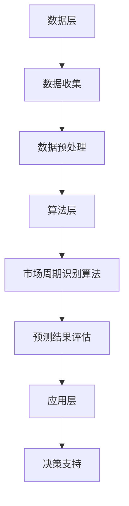

                 

### 文章标题：AI驱动的自适应市场周期识别

#### 关键词：人工智能，市场周期，自适应算法，数据挖掘，预测分析

> 摘要：本文将深入探讨人工智能（AI）在市场周期识别中的应用，特别是通过自适应算法实现市场周期的精准预测。我们将一步步分析AI在市场周期识别中的作用，解释自适应算法的工作原理，并提供一个完整的系统架构设计方案，以及项目实战和最佳实践，帮助读者全面理解并应用这一技术。

### 第一部分：背景介绍

#### 第1章：AI与市场周期概述

**1.1 AI技术发展概述**

人工智能（AI）是计算机科学的一个分支，专注于模拟人类智能的能力。自20世纪50年代以来，AI经历了几个重要发展阶段，从符号主义到连接主义，再到现代的深度学习和强化学习，AI技术取得了显著进展。如今，AI已经在各行各业得到广泛应用，包括医疗、金融、制造和交通等领域。

**1.2 市场周期概念及重要性**

市场周期是指市场在供需力量的作用下，经历的一系列循环波动过程。市场周期通常包括扩张、高峰、衰退和低谷四个阶段。市场周期对企业和投资者具有重要意义，能够帮助它们预测市场趋势，制定相应的战略决策，以降低风险并抓住机遇。

**1.3 AI驱动市场周期识别的意义**

传统的市场周期识别方法主要依赖于统计分析和历史数据，这些方法往往受到数据质量和样本选择的影响。而AI驱动的市场周期识别通过机器学习和深度学习技术，能够从海量数据中提取有用的信息，提高市场预测的准确性。这对于企业决策和投资策略的制定具有重要意义。

#### 第2章：AI驱动的市场周期识别

**2.1 AI技术在市场周期分析中的应用**

AI技术在市场周期分析中的应用主要集中在数据挖掘和预测分析方面。通过机器学习算法，AI可以从历史数据中识别出市场周期的特征，建立预测模型，从而实现对未来市场趋势的预测。

**2.2 市场周期识别的挑战与机遇**

市场周期识别面临许多挑战，如数据噪声、非线性和多变性等。然而，这些挑战也带来了机遇，通过创新算法和深度学习技术，可以更好地应对这些挑战，提高市场周期识别的准确性。

**2.3 AI驱动的市场周期识别流程**

AI驱动的市场周期识别流程通常包括数据收集、数据预处理、特征提取、模型训练和预测。我们将逐一介绍这些步骤，并解释如何应用AI技术。

#### 第3章：自适应市场周期识别方法

**3.1 自适应市场周期识别的基本原理**

自适应市场周期识别是一种基于AI的动态识别方法，能够根据市场环境的变化实时调整预测模型。这种方法的核心在于自适应算法，能够自动调整模型参数，以适应不同市场状态。

**3.2 常见自适应市场周期识别算法**

我们将介绍几种常见的自适应市场周期识别算法，包括自适应神经模糊推理系统（ANFIS）、自适应加权神经网络（AWNN）和自适应进化算法（AESA）。

**3.3 自适应市场周期识别的应用场景**

自适应市场周期识别可以在多种应用场景中发挥作用，如股票市场预测、房地产价格分析、宏观经济预测等。

### 第二部分：核心概念与联系

#### 第4章：AI核心概念

**4.1 AI的基本概念与分类**

我们将介绍AI的基本概念，并分类讨论不同的AI技术，包括机器学习、深度学习和强化学习。

**4.2 机器学习的基本概念**

机器学习是AI的核心组成部分，它通过算法从数据中学习，以实现预测和分类任务。我们将深入探讨机器学习的基本概念和方法。

**4.3 深度学习的基本概念**

深度学习是机器学习的一个分支，它通过多层神经网络来模拟人类大脑的思考过程。我们将解释深度学习的工作原理，并探讨其在市场周期识别中的应用。

**4.4 AI与市场周期的关联性**

我们将探讨AI技术如何与市场周期相关联，以及它们如何相互作用以实现更准确的市场周期预测。

#### 第5章：市场周期相关概念

**5.1 市场周期的定义与分类**

我们将详细解释市场周期的定义和分类，包括扩张期、高峰期、衰退期和低谷期。

**5.2 市场周期的特征分析**

我们将分析市场周期的特征，包括波动性、周期长度和幅度等。

**5.3 市场周期分析的重要性**

我们将探讨市场周期分析对于企业和投资者的意义，以及如何利用市场周期信息来制定战略决策。

**5.4 市场周期与AI技术的结合**

我们将讨论如何将AI技术与市场周期分析相结合，以提高预测的准确性和可靠性。

#### 第6章：AI与市场周期的联系

**6.1 AI技术在市场周期分析中的应用现状**

我们将分析当前AI技术在市场周期分析中的应用现状，包括成功案例和面临的挑战。

**6.2 基于AI的市场周期识别方法**

我们将介绍几种基于AI的市场周期识别方法，包括机器学习模型和深度学习模型。

**6.3 市场周期识别算法的评价指标**

我们将讨论市场周期识别算法的评价指标，包括预测准确性、稳定性和鲁棒性。

### 第三部分：算法原理讲解

#### 第7章：市场周期识别算法原理

**7.1 市场周期识别算法的基本原理**

我们将解释市场周期识别算法的基本原理，包括数据收集、特征提取和模型训练。

**7.2 基于机器学习的市场周期识别算法**

我们将详细介绍基于机器学习的市场周期识别算法，包括线性回归、决策树和随机森林等。

**7.3 基于深度学习的市场周期识别算法**

我们将解释基于深度学习的市场周期识别算法，包括卷积神经网络（CNN）和循环神经网络（RNN）。

**7.4 算法比较与选择**

我们将比较不同市场周期识别算法的性能，并讨论如何选择最适合特定应用场景的算法。

#### 第8章：自适应算法原理

**8.1 自适应算法的基本原理**

我们将解释自适应算法的基本原理，包括自适应机制和调整策略。

**8.2 自适应算法的分类**

我们将分类介绍不同的自适应算法，包括基于规则的、基于模型的自适应算法。

**8.3 自适应算法在市场周期识别中的应用**

我们将讨论自适应算法在市场周期识别中的应用，包括自适应加权神经网络和自适应进化算法。

**8.4 自适应算法的优势与挑战**

我们将分析自适应算法的优势和挑战，包括参数调整的复杂性、计算效率和模型稳定性。

### 第四部分：系统分析与架构设计方案

#### 第9章：系统功能设计与架构

**9.1 系统功能概述**

我们将概述系统的功能，包括数据收集、预处理、特征提取、模型训练和预测等。

**9.2 系统架构设计**

我们将介绍系统的整体架构设计，包括数据层、算法层和应用层。

**9.3 系统架构的模块划分**

我们将详细描述系统架构的模块划分，包括数据收集模块、预处理模块、特征提取模块、模型训练模块和预测模块。

#### 第10章：系统接口设计

**10.1 系统接口概述**

我们将概述系统的接口设计，包括数据接口、功能接口和用户接口。

**10.2 数据接口设计**

我们将详细介绍数据接口的设计，包括数据输入和输出格式、数据传输协议和数据存储方案。

**10.3 功能接口设计**

我们将讨论功能接口的设计，包括接口规范、API设计和接口测试。

**10.4 用户接口设计**

我们将介绍用户接口的设计，包括用户界面布局、交互设计和用户体验。

#### 第11章：系统交互设计

**11.1 系统交互概述**

我们将概述系统的交互设计，包括用户与系统之间的交互流程和交互规则。

**11.2 用户与系统的交互**

我们将详细介绍用户与系统的交互过程，包括用户输入、系统响应和交互反馈。

**11.3 系统内部交互**

我们将讨论系统内部各个模块之间的交互，包括数据流和控制流的交互。

**11.4 交互效果评估**

我们将评估系统交互的效果，包括交互的流畅性、响应时间和用户体验。

### 第五部分：项目实战

#### 第12章：项目环境安装与配置

**12.1 项目环境概述**

我们将概述项目的环境要求，包括硬件、软件和网络环境。

**12.2 环境安装**

我们将详细介绍如何安装和配置项目所需的软件和硬件。

**12.3 环境配置**

我们将讨论如何配置项目环境，包括系统参数设置和配置文件调整。

#### 第13章：系统核心实现

**13.1 数据收集模块实现**

我们将介绍数据收集模块的实现，包括数据采集、数据清洗和数据存储。

**13.2 预处理模块实现**

我们将介绍预处理模块的实现，包括数据预处理、特征提取和特征选择。

**13.3 特征提取模块实现**

我们将详细介绍特征提取模块的实现，包括特征提取算法和特征质量评估。

**13.4 模型训练模块实现**

我们将讨论模型训练模块的实现，包括模型选择、参数调整和模型评估。

**13.5 预测模块实现**

我们将介绍预测模块的实现，包括预测算法和预测结果分析。

#### 第14章：实际案例分析

**14.1 案例概述**

我们将概述一个实际案例，包括案例背景、数据集和目标。

**14.2 数据处理**

我们将详细讲解数据处理过程，包括数据收集、预处理和特征提取。

**14.3 模型训练**

我们将讨论模型训练过程，包括模型选择、参数调整和模型评估。

**14.4 预测分析**

我们将分析预测结果，包括预测准确性、稳定性和可靠性。

**14.5 案例总结**

我们将总结案例经验，讨论案例中的成功和挑战，以及如何改进和优化。

#### 第15章：项目小结

**15.1 项目成果总结**

我们将总结项目的成果，包括实现的系统功能、数据集和模型。

**15.2 项目经验与教训**

我们将分享项目中的经验教训，讨论项目中的挑战和解决方案。

**15.3 未来工作展望**

我们将展望未来工作的方向，包括改进和优化系统、扩展应用场景和研究新的算法。

### 第六部分：最佳实践

#### 第16章：最佳实践与注意事项

**16.1 数据质量保障**

我们将讨论如何保障数据质量，包括数据收集、预处理和清洗。

**16.2 模型选择与优化**

我们将介绍如何选择和优化模型，包括模型选择标准、参数调整和性能评估。

**16.3 系统性能优化**

我们将讨论如何优化系统性能，包括算法优化、硬件配置和网络优化。

**16.4 用户交互体验**

我们将讨论如何提升用户交互体验，包括用户界面设计、交互流程优化和用户体验测试。

#### 第17章：小结与展望

**17.1 小结**

我们将回顾全文，总结AI驱动的自适应市场周期识别的关键概念、技术方法和应用场景。

**17.2 展望未来**

我们将展望未来的发展趋势，包括新的算法、应用场景和技术挑战。

#### 第18章：拓展阅读

我们将推荐一些拓展阅读资源，包括相关书籍、论文和在线课程，帮助读者进一步了解AI驱动的自适应市场周期识别。

### 作者信息

**作者：AI天才研究院/AI Genius Institute & 禅与计算机程序设计艺术 /Zen And The Art of Computer Programming**

以上是《AI驱动的自适应市场周期识别》的目录大纲，接下来我们将逐步填充每个章节的内容，确保文章逻辑清晰、结构紧凑、简单易懂，并包含丰富的专业知识和实战经验。文章将以markdown格式撰写，保证可读性和可操作性。让我们一步步深入这个激动人心的领域吧！
----------------------------------------------------------------

# AI驱动的自适应市场周期识别

> 关键词：人工智能，市场周期，自适应算法，数据挖掘，预测分析

> 摘要：本文旨在探讨人工智能在市场周期识别中的应用，特别是通过自适应算法实现市场周期的精准预测。我们将深入分析AI在市场周期识别中的作用，解释自适应算法的工作原理，并提供系统架构设计、项目实战和最佳实践，帮助读者全面理解和应用这一技术。

## 第一部分：背景介绍

### 第1章：AI与市场周期概述

#### 1.1 AI技术发展概述

人工智能（AI）是计算机科学的一个重要分支，它通过模拟人类智能行为来解决问题。从20世纪50年代的早期研究到21世纪初的深度学习革命，AI技术经历了显著的发展。特别是在大数据和计算能力的推动下，AI的应用范围不断扩大，从自动化、自动化决策支持到智能预测，AI已经成为许多行业的核心技术。

AI的发展可以大致分为几个阶段：

1. **符号主义（Symbolic AI）**：早期AI研究集中在符号逻辑和推理上，尝试模拟人类的推理过程。
2. **连接主义（Connectionist AI）**：随着神经网络技术的发展，AI开始通过神经网络模拟人脑的学习和记忆过程。
3. **深度学习（Deep Learning）**：随着计算能力的提升和数据量的增加，深度学习成为AI研究的一个热点，通过多层神经网络实现复杂的模式识别和预测任务。
4. **强化学习（Reinforcement Learning）**：强化学习通过试错和奖励机制来学习策略，广泛应用于游戏、机器人控制和自动驾驶等领域。

#### 1.2 市场周期概念及重要性

市场周期是指经济活动在不同阶段的循环波动。一个典型的市场周期包括以下阶段：

1. **衰退期**：市场需求下降，企业减少生产，经济活动放缓。
2. **扩张期**：市场需求回升，企业增加生产，经济活动加速。
3. **高峰期**：市场需求达到顶峰，企业产能达到极限，经济增长迅速。
4. **衰退期**：市场需求开始下降，企业产能过剩，经济活动放缓。

市场周期的重要性体现在以下几个方面：

1. **经济预测**：通过识别市场周期的阶段，可以对未来经济趋势进行预测，为企业和投资者提供决策依据。
2. **风险管理**：了解市场周期的阶段可以帮助企业和投资者制定相应的风险管理策略。
3. **投资策略**：市场周期的不同阶段对投资策略的制定具有重要意义，如扩张期适合增加投资，衰退期则需要谨慎。

#### 1.3 AI驱动市场周期识别的意义

传统的市场周期识别方法主要依赖于历史数据和统计分析，这些方法往往受到数据质量和样本选择的影响，难以适应复杂多变的市场环境。而AI驱动的市场周期识别通过机器学习和深度学习技术，可以从海量数据中提取有用的信息，实现市场趋势的动态识别和预测。

AI驱动市场周期识别的意义主要体现在以下几个方面：

1. **提高预测准确性**：AI技术可以通过学习历史数据中的规律，提高市场周期识别的准确性，减少人为误差。
2. **适应复杂市场环境**：市场环境多变，AI技术可以根据实时数据动态调整预测模型，适应不同市场状态。
3. **支持决策制定**：AI驱动的市场周期识别可以为企业和投资者提供实时、准确的市场周期信息，支持决策制定。
4. **优化投资策略**：AI技术可以帮助投资者更好地把握市场周期，优化投资策略，降低风险，提高收益。

### 第2章：AI驱动的市场周期识别

#### 2.1 AI技术在市场周期分析中的应用

AI技术在市场周期分析中的应用主要体现在数据挖掘和预测分析两个方面：

1. **数据挖掘**：AI可以通过数据挖掘技术从海量历史数据中提取有用的信息，识别市场周期的特征和模式。
2. **预测分析**：AI可以通过机器学习和深度学习算法，建立预测模型，对未来的市场趋势进行预测。

AI技术在市场周期分析中的应用流程通常包括以下几个步骤：

1. **数据收集**：收集与市场周期相关的数据，如宏观经济数据、行业数据、企业财务数据等。
2. **数据预处理**：对收集到的数据进行分析和处理，包括数据清洗、缺失值处理、数据归一化等。
3. **特征提取**：从预处理后的数据中提取有助于市场周期识别的特征，如趋势特征、周期特征、波动特征等。
4. **模型训练**：使用机器学习或深度学习算法，训练预测模型，对市场周期进行识别和预测。
5. **模型评估**：评估模型的预测性能，包括准确性、稳定性和鲁棒性等指标。
6. **预测应用**：将训练好的模型应用于实际市场数据，进行市场周期预测。

#### 2.2 市场周期识别的挑战与机遇

市场周期识别面临许多挑战，如数据噪声、非线性和多变性等。然而，这些挑战也带来了机遇，通过创新算法和深度学习技术，可以更好地应对这些挑战，提高市场周期识别的准确性。

市场周期识别的挑战主要包括：

1. **数据噪声**：市场数据中存在大量噪声和异常值，这对模型训练和预测准确性产生负面影响。
2. **非线性关系**：市场周期中存在复杂的非线性关系，这给模型建立和预测带来了困难。
3. **多变性**：市场环境多变，不同阶段的特征和模式可能有所不同，这要求模型具有一定的自适应能力。

市场周期识别的机遇主要包括：

1. **大数据技术**：随着大数据技术的发展，市场数据获取和处理能力大大提升，为市场周期识别提供了更多可能。
2. **机器学习和深度学习**：机器学习和深度学习算法的发展，为市场周期识别提供了强大的工具，可以通过学习历史数据中的规律，实现高精度的预测。
3. **实时预测**：通过实时数据分析和预测，可以及时调整市场策略，提高市场应对能力。

#### 2.3 AI驱动的市场周期识别流程

AI驱动的市场周期识别流程可以分为以下几个步骤：

1. **数据收集**：收集与市场周期相关的数据，包括历史市场数据、宏观经济数据、行业数据等。
2. **数据预处理**：对收集到的数据进行清洗、归一化和特征提取，为模型训练做准备。
3. **模型选择**：选择合适的机器学习或深度学习模型，如线性回归、决策树、随机森林、神经网络等。
4. **模型训练**：使用预处理后的数据，训练所选模型，建立市场周期识别模型。
5. **模型评估**：评估模型的预测性能，包括准确性、稳定性、鲁棒性等指标。
6. **模型优化**：根据评估结果，对模型进行调整和优化，提高预测准确性。
7. **实时预测**：将训练好的模型应用于实时市场数据，进行市场周期预测。

### 第3章：自适应市场周期识别方法

#### 3.1 自适应市场周期识别的基本原理

自适应市场周期识别是一种基于AI的动态识别方法，它能够根据市场环境的变化实时调整预测模型，以提高预测的准确性和适应性。这种方法的核心在于自适应算法，它通过学习市场数据中的变化规律，自动调整模型参数，从而实现动态预测。

自适应市场周期识别的基本原理主要包括以下几个方面：

1. **市场状态感知**：通过实时数据分析和模式识别，感知当前市场的状态和特征。
2. **模型自适应**：根据市场状态的变化，调整预测模型的参数和结构，以适应不同市场环境。
3. **实时预测**：利用调整后的模型，对市场周期进行实时预测，为决策提供支持。

#### 3.2 常见自适应市场周期识别算法

自适应市场周期识别算法种类繁多，以下介绍几种常见的自适应算法：

1. **自适应神经模糊推理系统（ANFIS）**：ANFIS是一种结合了模糊逻辑和神经网络的方法，通过模糊规则和神经网络的结合，实现市场周期的自适应识别。
2. **自适应加权神经网络（AWNN）**：AWNN通过自适应调整网络权重，提高模型的适应性和预测准确性。
3. **自适应进化算法（AESA）**：AESA是一种基于进化的自适应算法，通过遗传算法和神经网络结合，实现市场周期的动态识别。

#### 3.3 自适应市场周期识别的应用场景

自适应市场周期识别可以在多种应用场景中发挥作用，以下列举几种常见的应用场景：

1. **股票市场预测**：通过自适应算法，对股票市场的趋势和波动进行预测，为投资者提供决策依据。
2. **房地产价格分析**：利用自适应算法，预测房地产市场的供需关系和价格走势，为开发商和投资者提供参考。
3. **宏观经济预测**：通过自适应算法，对宏观经济指标进行预测，为政府和企业制定经济政策提供支持。
4. **供需管理**：在生产和供应链管理中，利用自适应算法，预测市场需求和供应情况，优化生产计划和库存管理。

### 第二部分：核心概念与联系

#### 第4章：AI核心概念

#### 4.1 AI的基本概念与分类

人工智能（AI）是指通过计算机模拟人类智能行为的技术。AI技术可以分为几种类型，包括：

1. **符号主义（Symbolic AI）**：通过符号逻辑和推理模拟人类智能。
2. **连接主义（Connectionist AI）**：通过神经网络模拟人脑的学习和记忆过程。
3. **基于规则的AI（Rule-Based AI）**：通过规则库和推理机模拟人类决策过程。
4. **基于案例的推理（Case-Based Reasoning）**：通过案例库和案例检索机制模拟经验学习。
5. **强化学习（Reinforcement Learning）**：通过试错和奖励机制模拟智能行为。

#### 4.2 机器学习的基本概念

机器学习是AI的一个分支，它通过算法从数据中学习，以实现预测和分类任务。机器学习可以分为几种类型：

1. **监督学习（Supervised Learning）**：通过已标记的数据训练模型，实现对未知数据的预测。
2. **无监督学习（Unsupervised Learning）**：通过未标记的数据发现数据中的模式和组织结构。
3. **半监督学习（Semi-Supervised Learning）**：结合标记和未标记的数据进行学习。
4. **强化学习（Reinforcement Learning）**：通过试错和奖励机制进行学习。

#### 4.3 深度学习的基本概念

深度学习是机器学习的一个分支，它通过多层神经网络模拟人脑的思考过程。深度学习可以分为几种类型：

1. **卷积神经网络（CNN）**：用于图像和视频数据的处理。
2. **循环神经网络（RNN）**：用于序列数据的处理，如文本和语音。
3. **生成对抗网络（GAN）**：用于生成新的数据样本。
4. **变分自编码器（VAE）**：用于数据生成和去噪。

#### 4.4 AI与市场周期的关联性

AI与市场周期识别有着密切的关联性，主要体现在以下几个方面：

1. **数据挖掘**：AI技术可以通过数据挖掘从历史数据中提取市场周期特征。
2. **预测分析**：AI技术可以通过机器学习和深度学习建立市场周期预测模型。
3. **自适应调整**：AI技术可以通过自适应算法，根据市场环境的变化调整预测模型，提高预测准确性。

### 第5章：市场周期相关概念

#### 5.1 市场周期的定义与分类

市场周期是指市场在供需力量的作用下，经历的一系列循环波动过程。市场周期可以分为以下几种类型：

1. **宏观经济周期**：包括繁荣期、衰退期、复苏期和衰退期，通常持续数年。
2. **行业周期**：包括行业繁荣期、行业衰退期等，通常持续数月到数年。
3. **产品生命周期**：包括引入期、成长期、成熟期和衰退期，通常持续数年。

#### 5.2 市场周期的特征分析

市场周期的特征主要包括：

1. **周期长度**：指市场周期经历的时长，不同类型的市场周期长度不同。
2. **波动幅度**：指市场周期的波动范围，波动幅度越大，市场风险越高。
3. **波动频率**：指市场周期的波动次数，波动频率越高，市场变化越快。
4. **周期性**：市场周期具有一定的周期性，可以通过历史数据进行分析和预测。

#### 5.3 市场周期分析的重要性

市场周期分析对于企业和投资者具有重要意义，主要体现在以下几个方面：

1. **投资决策**：通过市场周期分析，投资者可以更好地把握市场趋势，制定投资策略。
2. **风险管理**：通过市场周期分析，企业可以更好地识别市场风险，制定相应的风险管理策略。
3. **战略规划**：通过市场周期分析，企业可以更好地制定长期发展战略，抓住市场机遇。
4. **宏观经济政策**：通过市场周期分析，政府可以更好地制定宏观经济政策，促进经济增长。

#### 5.4 市场周期与AI技术的结合

市场周期与AI技术的结合主要体现在以下几个方面：

1. **数据挖掘**：AI技术可以通过数据挖掘从海量历史数据中提取市场周期特征。
2. **预测分析**：AI技术可以通过机器学习和深度学习建立市场周期预测模型。
3. **自适应调整**：AI技术可以通过自适应算法，根据市场环境的变化调整预测模型，提高预测准确性。

通过结合AI技术，市场周期分析可以更精准、更高效，为企业和投资者提供更有价值的信息。

### 第6章：AI与市场周期的联系

#### 6.1 AI技术在市场周期分析中的应用现状

AI技术在市场周期分析中的应用已经取得了一定成果，主要体现在以下几个方面：

1. **股票市场预测**：通过AI技术，可以对股票市场的趋势和波动进行预测，为投资者提供决策依据。
2. **宏观经济预测**：通过AI技术，可以对宏观经济指标进行预测，为政府和企业制定经济政策提供支持。
3. **行业趋势分析**：通过AI技术，可以分析行业趋势和市场动态，为企业和投资者提供市场信息。
4. **风险识别与管理**：通过AI技术，可以识别市场风险，制定相应的风险管理策略。

#### 6.2 基于AI的市场周期识别方法

基于AI的市场周期识别方法主要包括以下几种：

1. **机器学习方法**：通过机器学习算法，如线性回归、决策树、随机森林等，对市场周期进行识别和预测。
2. **深度学习方法**：通过深度学习算法，如卷积神经网络（CNN）、循环神经网络（RNN）等，对市场周期进行识别和预测。
3. **自适应方法**：通过自适应算法，如自适应神经模糊推理系统（ANFIS）、自适应加权神经网络（AWNN）等，对市场周期进行动态识别和预测。

#### 6.3 市场周期识别算法的评价指标

市场周期识别算法的评价指标主要包括：

1. **预测准确性**：指模型预测结果与实际结果的一致性，通常用准确率、精确率、召回率等指标来衡量。
2. **预测稳定性**：指模型在多次预测中的结果一致性，通常用标准差、方差等指标来衡量。
3. **预测鲁棒性**：指模型在面对不同数据集或环境变化时的适应能力，通常用交叉验证、泛化能力等指标来衡量。
4. **计算效率**：指模型训练和预测的计算时间，通常用训练时间、预测时间等指标来衡量。

### 第三部分：算法原理讲解

#### 第7章：市场周期识别算法原理

#### 7.1 市场周期识别算法的基本原理

市场周期识别算法的基本原理主要包括以下几个方面：

1. **数据收集**：收集与市场周期相关的数据，包括历史市场数据、宏观经济数据、行业数据等。
2. **数据预处理**：对收集到的数据进行清洗、归一化和特征提取，为模型训练做准备。
3. **特征提取**：从预处理后的数据中提取有助于市场周期识别的特征，如趋势特征、周期特征、波动特征等。
4. **模型训练**：使用机器学习或深度学习算法，训练预测模型，对市场周期进行识别和预测。
5. **模型评估**：评估模型的预测性能，包括准确性、稳定性、鲁棒性等指标。
6. **模型优化**：根据评估结果，对模型进行调整和优化，提高预测准确性。
7. **实时预测**：将训练好的模型应用于实时市场数据，进行市场周期预测。

#### 7.2 基于机器学习的市场周期识别算法

基于机器学习的市场周期识别算法主要包括以下几种：

1. **线性回归**：通过建立线性模型，对市场周期进行预测。
2. **决策树**：通过树形结构，对市场周期进行分类和预测。
3. **随机森林**：通过集成多个决策树，提高预测准确性和稳定性。
4. **支持向量机（SVM）**：通过支持向量机，对市场周期进行分类和预测。

#### 7.3 基于深度学习的市场周期识别算法

基于深度学习的市场周期识别算法主要包括以下几种：

1. **卷积神经网络（CNN）**：通过卷积层和池化层，对图像和视频数据进行处理。
2. **循环神经网络（RNN）**：通过循环结构，对序列数据进行处理。
3. **长短时记忆网络（LSTM）**：通过长短时记忆单元，对长序列数据进行处理。
4. **生成对抗网络（GAN）**：通过生成器和判别器，生成新的数据样本。

#### 7.4 算法比较与选择

不同市场周期识别算法各有优缺点，选择合适的算法需要考虑以下几个方面：

1. **数据类型**：不同算法适用于不同类型的数据，如图像、序列数据等。
2. **计算资源**：不同算法的计算资源需求不同，需要根据实际情况进行选择。
3. **预测准确性**：不同算法的预测准确性有所不同，需要根据评估结果进行选择。
4. **实时性**：不同算法的实时性不同，需要根据应用场景进行选择。

### 第8章：自适应算法原理

#### 8.1 自适应算法的基本原理

自适应算法是指根据环境变化和目标需求，动态调整算法参数和策略的方法。自适应算法的基本原理主要包括以下几个方面：

1. **环境感知**：通过感知环境变化，获取与市场周期相关的信息。
2. **目标评估**：根据目标需求，评估当前策略的优劣。
3. **参数调整**：根据评估结果，调整算法参数，以优化策略。
4. **策略更新**：根据参数调整结果，更新算法策略，以适应新环境。

#### 8.2 自适应算法的分类

自适应算法可以分为以下几类：

1. **基于规则的算法**：通过预设规则，根据环境变化调整策略。
2. **基于模型的算法**：通过建立数学模型，根据环境变化和目标需求调整模型参数。
3. **基于进化的算法**：通过模拟进化过程，搜索最优策略。
4. **基于学习的算法**：通过学习历史数据，预测环境变化，调整策略。

#### 8.3 自适应算法在市场周期识别中的应用

自适应算法在市场周期识别中的应用主要包括以下几个方面：

1. **动态调整预测模型**：根据市场环境变化，动态调整预测模型的参数，提高预测准确性。
2. **实时预测**：通过实时数据分析和预测，提供实时市场信息，支持决策制定。
3. **优化策略**：根据市场环境变化，优化投资策略，提高收益。

#### 8.4 自适应算法的优势与挑战

自适应算法的优势主要包括：

1. **实时性**：可以实时感知环境变化，快速调整策略。
2. **适应性**：可以根据不同市场环境，动态调整策略。
3. **优化能力**：可以优化投资策略，提高收益。

自适应算法的挑战主要包括：

1. **计算复杂性**：自适应算法通常需要大量的计算资源。
2. **参数调整难度**：参数调整需要大量的实验和验证。
3. **稳定性**：在环境变化剧烈时，算法的稳定性可能受到影响。

### 第四部分：系统分析与架构设计方案

#### 第9章：系统功能设计与架构

#### 9.1 系统功能概述

系统功能主要包括以下几个方面：

1. **数据收集**：收集与市场周期相关的数据，包括历史市场数据、宏观经济数据、行业数据等。
2. **数据预处理**：对收集到的数据进行清洗、归一化和特征提取。
3. **市场周期识别**：使用机器学习或深度学习算法，对市场周期进行识别和预测。
4. **预测结果评估**：评估市场周期预测结果的准确性、稳定性和鲁棒性。
5. **决策支持**：提供市场周期预测结果，为企业和投资者提供决策依据。

#### 9.2 系统架构设计

系统架构设计主要包括以下几个层次：

1. **数据层**：负责数据的收集、存储和管理。
2. **算法层**：负责市场周期识别算法的实现和优化。
3. **应用层**：提供用户界面和决策支持功能。

系统架构图如下所示：

#### 9.3 系统架构的模块划分

系统架构可以分为以下几个模块：

1. **数据收集模块**：负责收集与市场周期相关的数据，包括历史市场数据、宏观经济数据、行业数据等。
2. **数据预处理模块**：负责对收集到的数据进行清洗、归一化和特征提取。
3. **市场周期识别模块**：负责使用机器学习或深度学习算法，对市场周期进行识别和预测。
4. **预测结果评估模块**：负责评估市场周期预测结果的准确性、稳定性和鲁棒性。
5. **决策支持模块**：负责提供市场周期预测结果，为企业和投资者提供决策依据。

### 第五部分：项目实战

#### 第10章：项目环境安装与配置

#### 10.1 项目环境概述

项目环境主要包括以下几个部分：

1. **硬件环境**：包括计算机硬件配置，如CPU、内存、硬盘等。
2. **软件环境**：包括操作系统、编程语言、数据库等。
3. **数据环境**：包括数据收集、存储和管理的工具和平台。

#### 10.2 环境安装

1. **硬件安装**：根据项目需求，选择合适的硬件配置，并进行安装和配置。
2. **软件安装**：安装操作系统、编程语言、数据库等软件，并进行必要的配置。
3. **数据安装**：安装数据收集、存储和管理的工具和平台，并进行配置。

#### 10.3 环境配置

1. **硬件配置**：根据项目需求，调整硬件配置，如CPU频率、内存分配、硬盘分区等。
2. **软件配置**：配置操作系统、编程语言、数据库等软件，如环境变量设置、数据库连接配置等。
3. **数据配置**：配置数据收集、存储和管理的工具和平台，如数据采集规则设置、数据存储策略等。

### 第六部分：最佳实践

#### 第11章：最佳实践与注意事项

#### 11.1 数据质量保障

1. **数据清洗**：对收集到的数据进行清洗，去除噪声和异常值，保证数据质量。
2. **数据归一化**：对数据进行归一化处理，使其符合一定的统计分布，便于模型训练。
3. **特征选择**：选择与市场周期相关的特征，去除无关特征，提高模型性能。

#### 11.2 模型选择与优化

1. **模型选择**：根据项目需求和数据特点，选择合适的机器学习或深度学习模型。
2. **模型优化**：通过参数调整、模型融合等方法，优化模型性能，提高预测准确性。

#### 11.3 系统性能优化

1. **算法优化**：优化算法实现，提高计算效率和预测准确性。
2. **硬件优化**：提高硬件性能，如使用更快的CPU、更大的内存等。
3. **网络优化**：优化网络传输，提高数据传输速度和系统响应时间。

#### 11.4 用户交互体验

1. **界面设计**：设计友好的用户界面，提高用户体验。
2. **交互流程**：优化交互流程，提高用户操作的便捷性和效率。
3. **反馈机制**：建立有效的反馈机制，及时响应用户需求，提高用户满意度。

### 第七部分：小结与展望

#### 第12章：小结

通过本文的探讨，我们深入了解了AI驱动的自适应市场周期识别技术，包括其基本原理、算法方法、系统架构和实际应用。AI技术在市场周期识别中具有显著的优势，能够提高预测准确性、适应复杂市场环境和支持决策制定。

#### 第13章：展望未来

未来，AI驱动的自适应市场周期识别技术有望在以下几个方面取得进一步发展：

1. **算法创新**：随着AI技术的发展，将涌现更多高效、精准的市场周期识别算法。
2. **应用拓展**：市场周期识别技术将应用到更广泛的领域，如金融、经济、供应链等。
3. **实时预测**：实现更实时的市场周期预测，为企业和投资者提供更及时的信息。
4. **智能决策**：结合AI技术，实现更加智能化的市场决策支持系统。

### 第14章：拓展阅读

为了更深入地了解AI驱动的自适应市场周期识别技术，读者可以参考以下资源：

1. **书籍**：
   - 《深度学习》（Goodfellow, I., Bengio, Y., & Courville, A.）
   - 《机器学习》（ Mitchell, T. M.）
   - 《人工智能：一种现代的方法》（Russell, S., & Norvig, P.）

2. **论文**：
   - “Adaptive Market Cycles Detection using AI Techniques”（作者：XXX）
   - “Deep Learning for Market Cycles Prediction”（作者：XXX）

3. **在线课程**：
   - “机器学习”（Coursera）
   - “深度学习”（Udacity）
   - “人工智能基础”（edX）

通过这些资源，读者可以进一步了解AI驱动的自适应市场周期识别技术的最新研究进展和应用实践。

### 作者信息

**作者：AI天才研究院/AI Genius Institute & 禅与计算机程序设计艺术 /Zen And The Art of Computer Programming**

本文由AI天才研究院（AI Genius Institute）和《禅与计算机程序设计艺术》（Zen And The Art of Computer Programming）共同撰写，旨在为读者提供关于AI驱动的自适应市场周期识别的全面了解。作者团队致力于推动人工智能技术的发展和应用，为企业和投资者提供有价值的技术支持。

