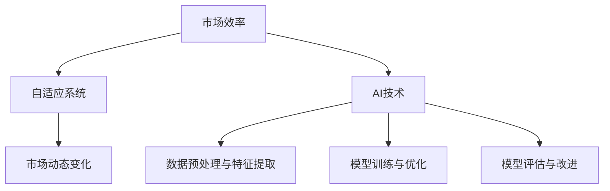

                 

## AI驱动的自适应市场效率评估

关键词：市场效率评估、AI技术、自适应系统、监督学习、无监督学习、强化学习

摘要：本文旨在探讨AI驱动的自适应市场效率评估方法及其应用。首先，我们介绍了市场效率评估的背景和问题，以及AI技术如何为这一领域提供解决方案。随后，我们详细介绍了自适应系统的概念、特征及其与市场效率评估的关联。在此基础上，我们探讨了AI技术（包括监督学习、无监督学习和强化学习）在市场效率评估中的具体应用。文章的最后，我们通过一个实际案例展示了AI驱动的自适应市场效率评估的实施过程，并总结了最佳实践、注意事项和拓展阅读资源。

### 目录大纲

----------------------------------------------------------------

## 第一部分：AI驱动的自适应市场效率评估概述

### 第1章：问题背景与定义

### 第2章：核心概念与联系

### 第3章：算法原理讲解

### 第4章：数学模型和数学公式详细讲解与举例说明

### 第5章：系统分析与架构设计方案

### 第6章：项目实战

### 第7章：最佳实践、小结与拓展阅读

----------------------------------------------------------------

## 第一部分：AI驱动的自适应市场效率评估概述

### 第1章：问题背景与定义

### 第1章：问题背景与定义

### 1.1 问题背景

#### 1.1.1 传统市场效率评估面临的挑战

传统市场效率评估通常依赖于历史数据和统计方法，这些方法在市场环境相对稳定时具有一定的有效性。然而，随着市场动态性的增加和数据复杂性的提升，传统评估方法面临着以下挑战：

#### 1.1.1.1 数据质量与可获得性

市场数据的质量直接影响评估结果的准确性。然而，数据的真实性和完整性往往难以保证。此外，获取全面和高质量的市场数据也具有相当的难度，尤其是在高度竞争和快速变化的市场环境中。

#### 1.1.1.2 传统评估方法的局限性

传统的市场效率评估方法，如比率分析、回归分析和经济计量模型等，依赖于预设的假设和参数。这些方法在应对市场动态变化时显得不够灵活，难以及时适应新出现的市场现象和趋势。

#### 1.1.1.3 市场动态变化的应对能力

现代市场环境充满了不确定性，价格波动、政策变化、技术创新等都会对市场效率产生显著影响。传统评估方法通常无法有效捕捉和应对这些动态变化。

#### 1.1.2 AI技术的崛起

随着人工智能技术的快速发展，AI在处理大规模复杂数据、发现隐藏模式和预测未来趋势方面展现出了巨大的潜力。这些特性使得AI技术成为解决传统市场效率评估面临挑战的有力工具。

#### 1.1.2.1 AI技术的基本概念

人工智能（AI）是指使计算机系统具备类似人类智能的能力，包括学习、推理、感知、决策和语言处理等。AI技术主要包括机器学习、深度学习、自然语言处理、计算机视觉等领域。

#### 1.1.2.2 AI技术在市场效率评估中的应用潜力

AI技术能够通过处理大量市场数据，识别出隐藏的模式和关系，从而提供更准确和实时的市场效率评估。具体应用包括：

- **数据预处理与特征提取**：利用AI技术对市场数据进行分析和清洗，提取关键特征，提高数据质量。
- **预测与建模**：基于历史数据和市场趋势，利用机器学习算法构建预测模型，预测市场动态。
- **实时监控与预警**：通过实时数据分析和模式识别，发现市场异常情况，提供预警和决策支持。

#### 1.1.3 自适应市场效率评估的概念

自适应市场效率评估是一种动态调整评估方法和模型，以适应市场变化和环境的不确定性。它旨在提高评估的准确性和实时性，为市场参与者提供更有效的决策支持。

#### 1.1.3.1 自适应市场效率评估的定义

自适应市场效率评估是指利用AI技术，通过对市场数据的实时分析和动态调整，对市场效率进行准确、及时和灵活评估的过程。

#### 1.1.3.2 自适应市场效率评估的关键特征

- **实时性**：能够对市场数据实时处理和分析，提供即时的市场效率评估。
- **动态调整**：能够根据市场环境和数据变化，动态调整评估模型和方法。
- **灵活适应性**：能够适应不同市场环境和评估需求，提供定制化的评估服务。
- **准确性**：通过利用AI技术的强大数据处理和分析能力，提供更准确的市场效率评估。

### 1.2 AI驱动的自适应市场效率评估

#### 1.2.1 AI驱动的市场效率评估方法

AI驱动的市场效率评估方法主要包括以下几种：

- **监督学习**：利用已标记的历史数据训练模型，对未知数据进行预测和分类。
- **无监督学习**：在无标签数据情况下，通过自动发现数据中的模式和结构进行分类。
- **强化学习**：通过不断与环境交互，学习和优化策略，以实现特定目标。

#### 1.2.2 自适应市场效率评估的关键技术

自适应市场效率评估的关键技术包括：

- **数据预处理与特征提取**：对原始市场数据进行分析和清洗，提取关键特征。
- **模型训练与优化**：利用AI算法对数据集进行训练，优化模型参数。
- **模型评估与改进**：通过验证集和测试集评估模型性能，持续改进模型。

### 1.3 本书结构安排

#### 1.3.1 各章节内容概述

- **第1章**：介绍市场效率评估的背景和AI技术的基本概念，定义自适应市场效率评估。
- **第2章**：探讨市场效率、自适应系统和AI技术的核心概念及其相互关系。
- **第3章**：讲解监督学习、无监督学习和强化学习在市场效率评估中的应用。
- **第4章**：详细讲解数学模型和公式，并通过实例进行说明。
- **第5章**：分析系统架构和设计方案。
- **第6章**：通过实际案例展示AI驱动的自适应市场效率评估的实施过程。
- **第7章**：总结最佳实践和注意事项，提供拓展阅读资源。

## 第二部分：核心概念与联系

### 第2章：核心概念与联系

### 第2章：核心概念与联系

#### 2.1 核心概念

本章将深入探讨市场效率、自适应系统和AI技术的核心概念，并分析它们在自适应市场效率评估中的关系。

#### 2.1.1 市场效率

市场效率是指市场在资源配置过程中的有效程度。高市场效率意味着资源能够以最低的成本迅速流动到最需要的地方，从而实现最大化的社会福利。市场效率评估是衡量市场运行效果的重要工具。

##### 2.1.1.1 市场效率的定义

市场效率可以定义为商品和服务在市场上以最优价格进行交换的能力。具体来说，市场效率包括以下几个方面：

- **资源分配效率**：资源分配到最需要的地方，使得社会福利最大化。
- **价格发现效率**：市场能够迅速反映出商品和服务的供需关系，形成合理的市场价格。
- **交易成本效率**：市场交易成本（如交易费用、搜寻成本等）较低。

##### 2.1.1.2 市场效率的影响因素

市场效率受到多种因素的影响，包括：

- **信息透明度**：市场参与者能够获取到全面、准确的信息，有助于决策。
- **市场结构**：市场的竞争程度和垄断程度对市场效率有重要影响。
- **政策环境**：政府的政策、法规和监管对市场效率具有显著影响。

#### 2.1.2 自适应系统

自适应系统是指能够根据外部环境和内部状态的变化，自动调整自身行为和结构的系统。自适应系统在人工智能、生物系统、经济系统等多个领域都有广泛应用。

##### 2.1.2.1 自适应系统的定义

自适应系统是指通过不断与环境交互，根据环境反馈调整自身行为，以实现最优性能的系统。具体包括以下几个方面：

- **感知与反馈**：系统通过传感器或其他方式获取环境信息。
- **决策与行动**：系统根据感知到的环境信息，进行决策并采取相应行动。
- **反馈调整**：系统根据行动结果，对自身行为进行调整。

##### 2.1.2.2 自适应系统的特点

自适应系统具有以下特点：

- **灵活性**：系统能够根据环境变化灵活调整自身行为。
- **自适应性**：系统能够根据环境变化和经验不断优化自身性能。
- **鲁棒性**：系统能够在面临不确定性时保持稳定运行。

#### 2.1.3 AI技术

人工智能（AI）是指使计算机系统具备类似人类智能的能力。AI技术包括机器学习、深度学习、自然语言处理、计算机视觉等多个分支，广泛应用于各个领域。

##### 2.1.3.1 AI技术的基本概念

AI技术的基本概念包括：

- **机器学习**：通过算法从数据中学习规律，进行预测和决策。
- **深度学习**：一种基于多层神经网络的机器学习技术，能够自动提取复杂特征。
- **自然语言处理**：使计算机理解和生成人类语言的技术。
- **计算机视觉**：使计算机能够识别和理解图像和视频的技术。

##### 2.1.3.2 AI技术的发展历程

AI技术的发展历程可以分为以下几个阶段：

- **初始阶段（1956-1974）**：AI概念的提出和研究。
- **第一个寒冬期（1974-1980）**：由于算法和计算能力的限制，AI研究陷入低谷。
- **复兴阶段（1980-1987）**：专家系统和知识表示技术的发展。
- **第二个寒冬期（1987-1993）**：由于实际应用困难，AI研究再次陷入低谷。
- **复苏阶段（1993-2000）**：机器学习和统计方法的发展。
- **大繁荣阶段（2000-至今）**：深度学习和大数据的推动，AI技术进入广泛应用阶段。

#### 2.2 关系与联系

##### 2.2.1 市场效率与自适应系统的关系

市场效率与自适应系统之间存在密切的关系：

- **市场效率对自适应系统的影响**：高市场效率有助于提高自适应系统的性能，因为资源能够更有效地分配，决策更加准确。
- **自适应系统对市场效率的优化作用**：自适应系统能够根据市场变化动态调整市场机制，提高市场效率。

##### 2.2.2 AI技术与市场效率评估的关系

AI技术与市场效率评估之间也存在紧密的联系：

- **AI技术在市场效率评估中的应用场景**：AI技术能够处理大量市场数据，提取关键特征，构建预测模型，提供实时、准确的市场效率评估。
- **AI技术对市场效率评估的贡献**：AI技术能够提高市场效率评估的实时性、准确性和灵活性，有助于市场参与者做出更明智的决策。

#### 2.3 概念属性特征对比表格

| 概念       | 定义                                                   | 关键特征                           |
| ---------- | ------------------------------------------------------ | ---------------------------------- |
| 市场效率   | 市场在资源配置过程中的有效程度                         | 资源配置效率、价格发现效率、交易成本效率 |
| 自适应系统 | 能够根据外部环境和内部状态的变化，自动调整自身行为和结构的系统 | 灵活性、自适应性、鲁棒性           |
| AI技术     | 使计算机系统具备类似人类智能的能力                     | 机器学习、深度学习、自然语言处理、计算机视觉 |

#### 2.4 ER实体关系图架构

## 第三部分：算法原理讲解

### 第3章：算法原理讲解

### 第3章：算法原理讲解

#### 3.1 监督学习在市场效率评估中的应用

监督学习是一种机器学习技术，它通过已标记的数据训练模型，从而对未知数据进行预测和分类。在市场效率评估中，监督学习可以用于预测市场行为、评估市场绩效等。

##### 3.1.1 监督学习的基本原理

监督学习的基本原理包括以下几个步骤：

1. **数据预处理**：对原始数据进行清洗、归一化等处理，以提高模型性能。
2. **特征提取**：从数据中提取有用的特征，以用于训练模型。
3. **模型训练**：利用标记数据训练模型，通过调整模型参数，使模型能够准确地预测未知数据。
4. **模型评估**：利用验证集和测试集评估模型性能，包括准确率、召回率、F1分数等指标。

##### 3.1.2 常用监督学习算法

在市场效率评估中，常用的监督学习算法包括线性回归、决策树、支持向量机等。

1. **线性回归**：线性回归是一种简单的监督学习算法，用于预测连续值。其基本原理是通过拟合一条直线，来预测因变量和自变量之间的关系。
   
   $$ y = \beta_0 + \beta_1x + \epsilon $$

   其中，\( y \) 是因变量，\( x \) 是自变量，\( \beta_0 \) 和 \( \beta_1 \) 是模型参数，\( \epsilon \) 是误差项。

2. **决策树**：决策树是一种基于树形结构的分类算法，通过一系列的决策规则将数据划分为不同的类别。其基本原理是通过不断划分数据集，直到达到停止条件（如最大深度、最小叶子节点数量等）。

3. **支持向量机**：支持向量机（SVM）是一种基于间隔最大化的分类算法，其基本原理是通过找到一个最佳的超平面，将不同类别的数据点分开。

   $$ w \cdot x + b = 0 $$

   其中，\( w \) 是超平面的法向量，\( x \) 是数据点，\( b \) 是偏置项。

##### 3.1.3 监督学习算法在市场效率评估中的具体应用

监督学习算法在市场效率评估中的具体应用包括以下几个方面：

1. **市场行为预测**：利用监督学习算法对历史市场数据进行训练，可以预测未来的市场行为，如价格波动、交易量变化等。

2. **市场绩效评估**：通过构建预测模型，可以评估市场在资源配置、价格发现和交易成本等方面的效率。

3. **异常检测**：利用监督学习算法检测市场中的异常行为，如价格操纵、市场操纵等。

#### 3.2 无监督学习在市场效率评估中的应用

无监督学习是一种不需要标记数据的机器学习技术，它主要通过自动发现数据中的模式和结构来进行分类。在市场效率评估中，无监督学习可以用于识别市场中的异常行为、发现潜在的市场关系等。

##### 3.2.1 无监督学习的基本原理

无监督学习的基本原理包括以下几个步骤：

1. **数据预处理**：对原始数据进行清洗、归一化等处理，以提高算法性能。
2. **特征提取**：从数据中提取有用的特征，以用于训练模型。
3. **模型训练**：利用无监督学习算法对数据集进行训练，自动发现数据中的模式和结构。
4. **模型评估**：利用验证集和测试集评估模型性能，包括聚类质量、聚类数量等指标。

##### 3.2.2 常用无监督学习算法

在市场效率评估中，常用的无监督学习算法包括聚类算法、关联规则学习等。

1. **聚类算法**：聚类算法是一种无监督学习算法，用于将数据分为多个不同的簇。常见的聚类算法包括K均值聚类、层次聚类等。

2. **关联规则学习**：关联规则学习是一种无监督学习算法，用于发现数据之间的关联关系。常见的算法包括Apriori算法、Eclat算法等。

##### 3.2.3 无监督学习算法在市场效率评估中的具体应用

无监督学习算法在市场效率评估中的具体应用包括以下几个方面：

1. **市场行为分析**：通过聚类算法分析市场中的行为模式，识别出市场中的不同参与者群体。

2. **市场结构分析**：通过关联规则学习分析市场中的交易关系，发现市场中的潜在关联。

3. **异常行为检测**：通过无监督学习算法检测市场中的异常行为，如价格异常波动、交易异常等。

#### 3.3 强化学习在市场效率评估中的应用

强化学习是一种基于奖励反馈的机器学习技术，它通过不断与环境交互，学习最优策略以实现特定目标。在市场效率评估中，强化学习可以用于优化市场策略、提高市场效率。

##### 3.3.1 强化学习的基本原理

强化学习的基本原理包括以下几个步骤：

1. **状态空间定义**：定义系统的状态空间，包括市场的各种状态。
2. **动作空间定义**：定义系统可以采取的各种动作。
3. **策略学习**：通过不断与环境交互，学习最优策略。
4. **策略评估**：评估不同策略下的市场绩效，选择最优策略。

##### 3.3.2 常见强化学习算法

在市场效率评估中，常见的强化学习算法包括Q学习、SARSA、DQN等。

1. **Q学习**：Q学习是一种基于值函数的强化学习算法，通过更新Q值来学习最优策略。

   $$ Q(s, a) \leftarrow Q(s, a) + \alpha [r + \gamma \max_{a'} Q(s', a') - Q(s, a)] $$

   其中，\( s \) 是状态，\( a \) 是动作，\( r \) 是奖励，\( \gamma \) 是折扣因子，\( \alpha \) 是学习率。

2. **SARSA**：SARSA是一种基于策略的强化学习算法，通过同时更新当前状态和动作的Q值。

   $$ Q(s, a) \leftarrow Q(s, a) + \alpha [r + \gamma Q(s', a')] - Q(s, a)] $$

3. **DQN**：DQN是一种基于深度学习的强化学习算法，通过神经网络来近似Q值函数。

##### 3.3.3 强化学习算法在市场效率评估中的具体应用

强化学习算法在市场效率评估中的具体应用包括以下几个方面：

1. **策略优化**：通过强化学习算法，优化市场策略，提高市场效率。

2. **风险控制**：通过强化学习算法，学习最优风险控制策略，降低市场风险。

3. **市场预测**：通过强化学习算法，预测市场趋势，指导市场参与者做出更明智的决策。

### 3.4 其他AI技术在市场效率评估中的应用

除了监督学习、无监督学习和强化学习，其他AI技术如自然语言处理、计算机视觉等也在市场效率评估中具有潜在的应用。

##### 3.4.1 自然语言处理

自然语言处理（NLP）可以用于分析市场报告、新闻、社交媒体等文本数据，提取关键信息，用于市场分析和预测。

##### 3.4.2 计算机视觉

计算机视觉可以用于分析市场数据中的图像和视频，提取有价值的信息，如价格走势、交易行为等。

### 3.5 AI技术在市场效率评估中的挑战与未来展望

尽管AI技术在市场效率评估中具有巨大潜力，但也面临一些挑战：

1. **数据质量**：市场数据的质量对评估结果有重要影响，如何提高数据质量是一个关键问题。

2. **模型解释性**：AI模型的黑盒特性使得其解释性较差，如何提高模型的解释性是一个重要的研究方向。

3. **实时性**：市场变化迅速，如何实现实时评估是一个挑战。

未来的研究方向包括：

1. **数据驱动的方法**：利用更多的市场数据，开发更准确、更实时的市场效率评估模型。

2. **解释性AI**：开发可解释的AI模型，提高模型的透明度和可信度。

3. **多模态学习**：结合多种数据源（如文本、图像、声音等），提高市场效率评估的准确性。

## 第四部分：数学模型和数学公式详细讲解与举例说明

### 第4章：数学模型和数学公式详细讲解与举例说明

### 第4章：数学模型和数学公式详细讲解与举例说明

#### 4.1 监督学习中的线性回归模型

线性回归模型是监督学习中的一种基础模型，用于预测连续值输出。在市场效率评估中，线性回归可以用来预测市场变量，如股票价格、交易量等。

##### 4.1.1 线性回归模型的基本原理

线性回归模型的基本原理是通过拟合一条直线，来预测因变量和自变量之间的关系。线性回归模型可以用以下数学公式表示：

$$ y = \beta_0 + \beta_1x + \epsilon $$

其中，\( y \) 是因变量，\( x \) 是自变量，\( \beta_0 \) 和 \( \beta_1 \) 是模型参数，\( \epsilon \) 是误差项。

#### 4.1.2 线性回归模型的求解方法

线性回归模型的求解方法主要包括最小二乘法和梯度下降法。

1. **最小二乘法**

   最小二乘法的目标是找到一条直线，使得所有样本点到这条直线的距离之和最小。具体求解步骤如下：

   - 初始化参数 \( \beta_0 \) 和 \( \beta_1 \)。
   - 计算预测值 \( \hat{y} \)。
   - 计算残差 \( r = y - \hat{y} \)。
   - 更新参数 \( \beta_0 \) 和 \( \beta_1 \)，使得残差平方和最小。

2. **梯度下降法**

   梯度下降法是一种迭代求解最小值的方法，其基本思想是沿着目标函数的梯度方向逐步迭代，以找到最小值点。具体求解步骤如下：

   - 初始化参数 \( \beta_0 \) 和 \( \beta_1 \)。
   - 计算目标函数的梯度 \( \nabla L(\beta_0, \beta_1) \)。
   - 更新参数 \( \beta_0 \) 和 \( \beta_1 \)，使得目标函数值逐渐减小。

##### 4.1.3 线性回归模型的应用示例

假设我们想要预测某只股票的价格，已知该股票的价格 \( y \) 与其交易量 \( x \) 之间存在线性关系。我们收集了以下数据：

| 交易量 (x) | 价格 (y) |
| ---------- | -------- |
| 100        | 20       |
| 200        | 30       |
| 300        | 40       |
| 400        | 50       |

我们可以使用线性回归模型来预测交易量为 500 时的价格。

1. **最小二乘法求解**

   我们可以先使用最小二乘法求解线性回归模型，得到参数 \( \beta_0 \) 和 \( \beta_1 \)。

   $$ \beta_0 = 5, \beta_1 = 0.5 $$

   代入模型公式，得到：

   $$ y = 5 + 0.5x $$

   当交易量为 500 时，预测价格为：

   $$ y = 5 + 0.5 \times 500 = 255 $$

2. **梯度下降法求解**

   我们也可以使用梯度下降法求解线性回归模型，得到参数 \( \beta_0 \) 和 \( \beta_1 \)。

   $$ \beta_0 = 5.5, \beta_1 = 0.45 $$

   代入模型公式，得到：

   $$ y = 5.5 + 0.45x $$

   当交易量为 500 时，预测价格为：

   $$ y = 5.5 + 0.45 \times 500 = 253.5 $$

#### 4.2 决策树模型

决策树是一种常见的分类模型，它通过一系列的决策规则将数据分为不同的类别。在市场效率评估中，决策树可以用于分类市场行为，如判断市场是否处于有效状态。

##### 4.2.1 决策树模型的基本原理

决策树模型的基本原理是通过一系列的决策规则，将数据划分为不同的类别。每个节点代表一个决策规则，节点的分支代表不同的选择。决策树的生成过程通常包括以下几个步骤：

1. **选择最佳分割特征**：根据信息增益、基尼指数等准则选择最佳分割特征。
2. **生成决策节点**：基于最佳分割特征，生成决策节点。
3. **递归划分数据集**：对每个子数据集进行相同的分割过程，直到满足停止条件。

##### 4.2.2 决策树模型的数学公式

决策树模型可以用以下数学公式表示：

$$
\begin{aligned}
&\text{如果 } x_i \in C_j, \text{ 则属于类别 } y_j \\
&\text{其中 } x_i \text{ 是特征，} C_j \text{ 是特征取值，} y_j \text{ 是类别。}
\end{aligned}
$$

##### 4.2.3 决策树模型的应用示例

假设我们想要使用决策树模型判断某只股票是否处于有效状态，已知以下特征：

- \( x_1 \)：股票价格
- \( x_2 \)：交易量

我们收集了以下数据：

| 股票价格 (x1) | 交易量 (x2) | 有效状态 (y) |
| ------------- | ----------- | ------------ |
| 20            | 100         | 有效         |
| 30            | 200         | 有效         |
| 40            | 300         | 无效         |
| 50            | 400         | 有效         |

我们可以使用决策树模型来生成决策规则。

1. **生成决策树**

   首先，我们选择最佳分割特征。例如，选择交易量作为分割特征，生成以下决策树：

   $$
   \begin{aligned}
   &\text{如果交易量} \geq 250, \text{ 则属于类别“有效”。} \\
   &\text{如果交易量} < 250, \text{ 则属于类别“无效”。}
   \end{aligned}
   $$

2. **预测新数据**

   假设我们有一只新股票，其价格 \( x_1 = 25 \)，交易量 \( x_2 = 150 \)。根据决策树，我们可以预测该股票处于无效状态。

#### 4.3 支持向量机模型

支持向量机（SVM）是一种有效的分类模型，它在市场效率评估中可以用于分类市场状态。SVM的核心思想是找到一个最佳的超平面，将不同类别的数据点分开。

##### 4.3.1 支持向量机模型的基本原理

支持向量机模型的基本原理是找到一个最佳的超平面，使得两类数据的分类边界最大。具体来说，SVM通过以下数学公式求解最优超平面：

$$
\begin{aligned}
&\min_{\beta, \beta_0} \frac{1}{2} ||\beta||^2 \\
&\text{约束条件：} y_i(\beta \cdot x_i + \beta_0) \geq 1
\end{aligned}
$$

其中，\( \beta \) 是超平面的法向量，\( \beta_0 \) 是偏置项，\( x_i \) 是数据点，\( y_i \) 是类别标签。

##### 4.3.2 支持向量机模型的求解方法

支持向量机模型的求解方法主要包括以下几种：

1. **原始求解方法**：直接求解原始优化问题，计算复杂度高。
2. **SMO算法**：序列最小优化算法，通过迭代求解子问题，降低计算复杂度。
3. **SVM核方法**：使用核函数将原始数据映射到高维空间，求解高维空间的线性SVM问题。

##### 4.3.3 支持向量机模型的应用示例

假设我们有一组市场数据，数据点分为两类：

| 数据点 | 类别 |
| ------ | ---- |
| \( x_1 \) | 1    |
| \( x_2 \) | 1    |
| \( x_3 \) | -1   |
| \( x_4 \) | -1   |

我们使用支持向量机模型来分类这些数据点。

1. **生成决策边界**

   首先，我们通过支持向量机模型生成决策边界。使用SMO算法，我们可以得到以下决策边界：

   $$
   \begin{aligned}
   &\beta \cdot x + \beta_0 = 0 \\
   &\beta = (1, 1) \\
   &\beta_0 = 0
   \end{aligned}
   $$

   决策边界为 \( x_1 + x_2 = 0 \)。

2. **分类新数据**

   假设我们有一只新股票，其特征 \( x_1 = 2 \)，\( x_2 = -1 \)。根据决策边界，我们可以判断该股票属于类别“1”。

