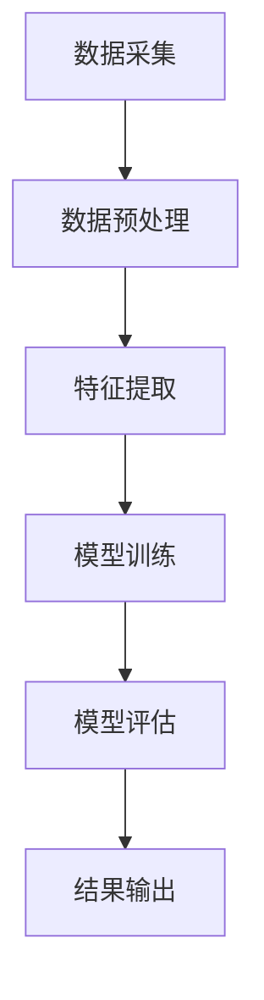

                 

### 第1章：背景与概述

### 1.1 问题背景

市场流动性是指资产能够在市场中迅速交易而不导致价格大幅波动的程度。流动性不足会导致市场效率低下，交易成本增加，甚至引发市场恐慌。在金融市场中，市场流动性是确保交易顺利进行的重要指标，其重要性不言而喻。然而，市场流动性分析面临着许多挑战。

首先，金融市场的数据庞杂且动态变化。这些数据包括股票、债券、期货等不同类型资产的价格、成交量、持仓量等。如何从海量数据中提取有效信息，是市场流动性分析的一大难题。

其次，市场流动性受到多种因素的影响，包括宏观经济环境、市场情绪、投资者行为等。这些因素相互交织，使得市场流动性呈现出高度的复杂性和不确定性。

最后，传统的市场流动性分析方法依赖于统计分析和计量经济学模型，虽然具有一定的预测能力，但在处理高维数据和非线性关系时显得力不从心。

### 1.2 问题描述

市场流动性不足的影响是多方面的。首先，流动性不足会导致交易成本增加。在流动性较差的市场中，买卖双方需要支付更高的交易费用，才能完成交易。这直接影响了市场的效率和投资者的收益。

其次，流动性不足还可能导致市场波动加剧。在流动性差的市场中，一小部分交易就可能引起价格大幅波动，这增加了市场的风险。对于投资者而言，这意味着更高的投资不确定性，可能会影响其投资决策。

传统的市场流动性分析方法主要依赖于历史数据分析和统计分析。这些方法包括流动性指标的计算、时间序列分析、回归分析等。然而，这些方法在处理复杂的市场环境和非线性关系时存在一定的局限性。例如，它们难以捕捉市场中的短期波动和突发事件的影响，也难以应对数据量庞大的挑战。

### 1.3 问题解决

为了解决市场流动性分析中的这些问题，引入人工智能（AI）技术成为了一条可行的途径。AI驱动的市场流动性分析具有以下优势：

首先，AI技术可以处理高维数据和复杂非线性关系。通过数据挖掘和机器学习算法，AI可以从海量历史数据中提取出有效的特征，从而提供更准确的流动性预测。

其次，AI技术可以实时分析市场动态。通过深度学习和实时数据处理技术，AI可以实时捕捉市场的变化，提供实时的流动性分析结果。

最后，AI技术可以自动化市场流动性管理。通过构建智能交易系统，AI可以自动调整交易策略，以应对市场变化，提高市场流动性。

AI驱动的市场流动性分析框架主要包括数据采集、数据预处理、特征提取、模型训练和模型评估等环节。首先，通过数据采集模块，收集市场相关的数据，包括价格、成交量、持仓量等。然后，通过数据预处理模块，对数据进行清洗、归一化和缺失值处理，确保数据质量。

接下来，通过特征提取模块，从原始数据中提取出与市场流动性相关的特征，如时间序列特征、宏观经济特征和技术分析特征。这些特征将作为模型训练的数据输入。

在模型训练环节，使用机器学习和深度学习算法，对提取出的特征进行建模和训练。常见的算法包括线性回归、支持向量机、神经网络等。通过交叉验证和超参数调优，选择最优的模型进行评估。

最后，在模型评估环节，通过测试数据集对模型进行评估，计算模型的准确率、召回率、F1分数等指标。根据评估结果，对模型进行调整和优化，以提高模型的预测性能。

### 1.4 边界与外延

AI驱动的市场流动性分析在适用范围上相对广泛，但并非适用于所有市场环境。在流动性较好的市场中，AI驱动的市场流动性分析可以提供更准确的预测和更有效的交易策略。然而，在流动性较差的市场中，AI驱动的市场流动性分析也面临着挑战。例如，在极端市场条件下，市场数据的异常波动可能会影响模型的预测性能。

与传统的市场流动性分析方法相比，AI驱动的市场流动性分析具有更高的灵活性和适应性。传统方法依赖于固定的模型和参数，难以应对市场的变化。而AI驱动的市场流动性分析可以通过不断学习和调整，适应不同的市场环境。

在概念结构和核心要素组成方面，AI驱动的市场流动性分析包括数据采集、数据预处理、特征提取、模型训练、模型评估和应用等环节。每个环节都至关重要，共同构成了完整的AI驱动的市场流动性分析体系。

### 1.5 概念结构与核心要素组成

市场流动性定义：

市场流动性是指资产在市场中能够迅速交易且不影响价格的能力。高流动性意味着资产可以轻松买卖，交易成本较低，而低流动性则意味着资产买卖难度大，交易成本高。

AI驱动的市场流动性分析要素：

1. **数据采集**：收集市场相关的数据，包括价格、成交量、持仓量等。
2. **数据预处理**：清洗、归一化和缺失值处理，确保数据质量。
3. **特征提取**：从原始数据中提取出与市场流动性相关的特征。
4. **模型训练**：使用机器学习和深度学习算法进行建模和训练。
5. **模型评估**：通过测试数据集评估模型性能，进行模型调整和优化。
6. **应用**：将优化后的模型应用于市场流动性管理。

### 1.6 逻辑结构

本章首先介绍了市场流动性问题的背景，包括市场流动性不足的影响和传统市场流动性分析方法的局限。接着，提出引入AI技术作为解决市场流动性分析问题的途径，并详细阐述了AI驱动的市场流动性分析框架。最后，讨论了AI驱动的市场流动性分析的边界与外延，以及其核心概念和要素组成。通过这一系列的逻辑推理和结构分析，为后续章节的内容奠定了基础。

---

在下一章中，我们将深入探讨市场流动性核心概念，包括流动性供应、流动性需求和流动性成本。通过详细的分析和对比，帮助读者更好地理解市场流动性及其影响因素。

---

# 第2章：核心概念与联系

### 2.1 市场流动性核心概念

市场流动性是金融市场中一个关键概念，它涵盖了多个方面，包括流动性供应、流动性需求以及流动性成本。理解这些核心概念对于深入探讨市场流动性分析至关重要。

#### 流动性供应

流动性供应是指市场中可供交易的资产数量。流动性供应受到多种因素的影响，包括投资者的买卖意愿、市场深度、资产类型等。高流动性供应意味着市场中存在大量的买卖订单，投资者可以轻松地买卖资产。相反，低流动性供应会导致买卖难度增加，交易成本上升。

#### 流动性需求

流动性需求是指投资者在特定时间内希望买卖资产的数量。流动性需求与市场情绪、投资者预期和宏观经济环境密切相关。当投资者对市场前景持乐观态度时，流动性需求会增加；反之，当市场情绪悲观时，流动性需求会下降。

#### 流动性成本

流动性成本是指投资者为获取市场流动性所支付的费用。流动性成本包括交易成本、时间成本和风险成本。交易成本包括手续费、佣金等实际支付的费用；时间成本是指投资者在等待交易完成的期间所承受的损失；风险成本是指投资者因市场流动性不足而承担的额外风险。

### 2.2 AI驱动市场流动性分析原理

AI驱动的市场流动性分析基于数据挖掘、机器学习和深度学习等技术，通过分析大量市场数据，提取出与市场流动性相关的特征，从而实现市场流动性的预测和管理。

#### 数据挖掘

数据挖掘是AI驱动的市场流动性分析的第一步，它通过挖掘大量历史市场数据，提取出有用的信息。数据挖掘技术包括关联规则挖掘、分类、聚类和异常检测等。这些技术可以帮助我们识别市场中的规律和模式，为后续的分析提供基础。

#### 机器学习

机器学习是AI驱动的市场流动性分析的核心技术之一。通过训练机器学习模型，我们可以从历史数据中学习到市场流动性的规律，并将其应用于未来的预测。常见的机器学习算法包括线性回归、决策树、支持向量机和神经网络等。

#### 深度学习

深度学习是机器学习的延伸，它通过构建复杂的神经网络模型，对大量数据进行深度学习，从而实现高级特征提取和模式识别。深度学习在市场流动性分析中具有显著优势，可以处理高维数据和复杂非线性关系，提高预测准确性。

### 2.3 概念属性特征对比表格

为了更清晰地展示市场流动性核心概念之间的联系，我们创建了一个概念属性特征对比表格。以下是对流动性供应、流动性需求和流动性成本的概念属性特征的对比：

| 概念        | 属性特征                   | 影响因素             | 关联分析                     |
| ----------- | -------------------------- | ------------------- | ---------------------------- |
| 流动性供应 | 可供交易的资产数量         | 投资者意愿、市场深度 | 与交易成本、价格波动相关      |
| 流动性需求 | 投资者希望买卖的资产数量   | 市场情绪、宏观经济    | 与价格波动、交易频率相关      |
| 流动性成本 | 获取市场流动性所需支付的费用 | 交易成本、时间成本、风险成本 | 与交易成本、价格波动、交易频率相关 |

通过这个表格，我们可以看到流动性供应、流动性需求和流动性成本之间存在密切的联系。流动性供应和流动性需求共同决定了市场的流动性水平，而流动性成本则是市场流动性的重要指标。

### 2.4 ER实体关系图架构

为了进一步理解市场流动性分析的核心概念，我们使用Mermaid语言绘制了一个ER实体关系图，展示了市场流动性相关实体之间的关系。

```mermaid
erDiagram
  MarketData -->|收集|流动性供应
  MarketData -->|分析|流动性需求
  MarketData -->|计算|流动性成本
  流动性供应 ||--|> 价格波动
  流动性需求 ||--|> 交易频率
  流动性成本 ||--|> 交易成本
```

在这个ER实体关系图中，MarketData（市场数据）是核心实体，它与其他实体（流动性供应、流动性需求、流动性成本）之间存在关联关系。价格波动、交易频率和交易成本则是市场流动性分析的关键指标。

### 2.5 逻辑结构

本章首先介绍了市场流动性的核心概念，包括流动性供应、流动性需求和流动性成本。接着，我们探讨了AI驱动的市场流动性分析原理，包括数据挖掘、机器学习和深度学习等技术。随后，通过概念属性特征对比表格和ER实体关系图，进一步展示了这些核心概念之间的联系。

通过这一系列的逻辑分析和结构展示，我们为读者提供了一个全面的市场流动性分析框架，为后续章节的内容奠定了基础。

在下一章中，我们将深入讲解AI驱动的市场流动性分析算法原理，包括数据预处理、特征提取、模型训练和评估等环节。

---

# 第3章：算法原理讲解

### 3.1 算法mermaid流程图

为了更好地理解AI驱动的市场流动性分析算法，我们首先使用Mermaid语言绘制了一个流程图，展示了整个分析过程的关键步骤。



在这个流程图中，数据采集、数据预处理、特征提取、模型训练、模型评估和结果输出构成了市场流动性分析的核心环节。

#### 数据采集

数据采集是市场流动性分析的第一步，它包括从各种数据源收集市场数据，如股票价格、成交量、持仓量等。这些数据为后续的特征提取和模型训练提供了基础。

#### 数据预处理

数据预处理是数据采集后的重要环节，它包括数据清洗、归一化和缺失值处理。数据清洗旨在去除数据中的噪声和异常值；归一化则将不同特征的数据缩放到相同的尺度，以便模型训练；缺失值处理则采用插值或删除等方式填补数据中的空白。

#### 特征提取

特征提取是从原始数据中提取出与市场流动性相关的特征。这些特征可以是时间序列特征、宏观经济特征和技术分析特征。例如，时间序列特征可以包括过去一段时间内的价格变化、交易量变化等；宏观经济特征可以包括GDP增长率、通货膨胀率等；技术分析特征可以包括移动平均线、相对强弱指数等。

#### 模型训练

模型训练是市场流动性分析的核心环节，它使用机器学习和深度学习算法，对提取出的特征进行建模和训练。常见的模型包括线性回归、支持向量机、神经网络等。在模型训练过程中，通过调整超参数和优化算法，选择最优的模型进行评估。

#### 模型评估

模型评估是验证模型性能的关键步骤，它使用测试数据集对模型进行评估，计算模型的准确率、召回率、F1分数等指标。根据评估结果，对模型进行调整和优化，以提高模型的预测性能。

#### 结果输出

结果输出是将训练好的模型应用于实际市场数据，生成市场流动性预测结果。这些结果可以用于指导交易策略、风险管理等实际应用。

### 3.2 Python源代码实现

为了更具体地展示算法的实现过程，我们使用Python语言实现了一个简单的市场流动性分析算法。以下是相关的代码实现：

```python
import pandas as pd
from sklearn.model_selection import train_test_split
from sklearn.preprocessing import StandardScaler
from sklearn.linear_model import LinearRegression
from sklearn.metrics import mean_squared_error

# 数据采集
data = pd.read_csv('market_data.csv')

# 数据预处理
data = data.dropna()
data = StandardScaler().fit_transform(data)

# 特征提取
X = data[:, :-1]
y = data[:, -1]

# 模型训练
X_train, X_test, y_train, y_test = train_test_split(X, y, test_size=0.2, random_state=42)
model = LinearRegression()
model.fit(X_train, y_train)

# 模型评估
y_pred = model.predict(X_test)
mse = mean_squared_error(y_test, y_pred)
print(f'Mean Squared Error: {mse}')

# 结果输出
print(f'Model Coefficients: {model.coef_}')
print(f'Model Interception: {model.intercept_}')
```

在这个示例中，我们首先从CSV文件中读取市场数据，并进行数据预处理。接着，我们使用线性回归模型对特征进行训练，并通过测试数据集评估模型性能。最后，我们输出模型的系数和截距，用于指导实际应用。

### 3.3 算法原理详细讲解

为了深入理解AI驱动的市场流动性分析算法原理，我们需要从数学模型和公式出发，详细讲解算法的核心思想和实现方法。

#### 数学模型

市场流动性分析的核心在于建立市场流动性的数学模型，以捕捉市场流动性的变化规律。以下是市场流动性分析的一个简化数学模型：

$$
L(t) = \alpha \cdot X_1(t) + \beta \cdot X_2(t) + \gamma \cdot X_3(t) + ...
$$

其中，$L(t)$ 表示在时间 $t$ 的市场流动性，$X_1(t)$、$X_2(t)$、$X_3(t)$ 等表示与市场流动性相关的特征。$\alpha$、$\beta$、$\gamma$ 等为模型参数，通过训练算法得到。

#### 公式推导

市场流动性模型的公式推导基于数据挖掘和机器学习技术。以下是一个简化的推导过程：

1. **特征选择**：首先，通过数据挖掘技术，从原始数据中提取出与市场流动性相关的特征。这些特征可以是时间序列特征、宏观经济特征和技术分析特征。
2. **特征转换**：将提取出的特征进行转换，使其适应机器学习模型的输入要求。例如，将时间序列特征转换为向量表示，将宏观经济特征转换为数值表示。
3. **模型训练**：使用机器学习算法，如线性回归、支持向量机或神经网络等，对特征进行训练，得到模型参数。
4. **模型评估**：使用测试数据集对训练好的模型进行评估，计算模型的准确率、召回率、F1分数等指标。

#### 通俗易懂的举例说明

为了更直观地理解市场流动性分析算法，我们通过一个简单的例子进行说明。

假设我们要分析某只股票的市场流动性，我们可以提取以下特征：

- 价格（$P$）：过去一周的平均收盘价格
- 成交量（$V$）：过去一周的平均成交量
- 移动平均线（$MA$）：过去30天的简单移动平均线

基于这些特征，我们可以构建一个简单的线性回归模型，预测市场流动性：

$$
L(t) = \alpha \cdot P(t) + \beta \cdot V(t) + \gamma \cdot MA(t)
$$

其中，$\alpha$、$\beta$、$\gamma$ 为模型参数。

通过训练算法，我们可以得到模型参数的值，并将其应用于实际市场数据，预测市场流动性。例如，当 $P(t) = 100$、$V(t) = 10000$、$MA(t) = 95$ 时，我们可以计算得到市场流动性 $L(t)$：

$$
L(t) = \alpha \cdot 100 + \beta \cdot 10000 + \gamma \cdot 95
$$

通过这个例子，我们可以看到，市场流动性分析算法通过提取特征、建立模型和预测结果，实现了对市场流动性的量化分析。

### 3.4 逻辑结构

本章首先使用Mermaid语言绘制了一个算法流程图，展示了市场流动性分析的核心步骤。接着，我们通过Python源代码实现，详细介绍了数据采集、数据预处理、特征提取、模型训练、模型评估和结果输出等环节。然后，我们从数学模型和公式出发，详细讲解了市场流动性分析算法的原理，并通过通俗易懂的举例说明，帮助读者理解算法的实现过程。

通过这一系列的逻辑分析和具体实现，我们为读者提供了一个全面的市场流动性分析算法框架，为后续章节的内容奠定了基础。

在下一章中，我们将深入探讨市场流动性数据分析的具体步骤，包括数据采集、特征提取和模型训练等。

---

# 第4章：市场流动性数据分析

### 4.1 数据采集

市场流动性数据分析的第一步是数据采集。数据采集是市场流动性分析的基础，决定了分析结果的准确性和可靠性。为了获取高质量的数据，我们需要从多个数据源收集相关信息。

首先，我们可以从金融数据提供商获取市场数据，如股票价格、成交量、持仓量等。这些数据通常以CSV、JSON或XML等格式提供。常用的金融数据提供商包括Yahoo Finance、Google Finance和彭博社等。

其次，我们可以从宏观经济数据库获取相关宏观经济数据，如GDP增长率、通货膨胀率、利率等。这些数据通常可以从国家统计局、世界银行和国际货币基金组织等官方机构获取。

最后，我们可以从技术分析工具获取技术分析数据，如移动平均线、相对强弱指数等。这些数据可以通过Python的金融数据分析库，如Pandas和Numpy，或者专业的技术分析软件，如MetaTrader和TradingView，获取。

### 4.2 特征提取

在数据采集完成后，我们需要对数据进行预处理和特征提取。特征提取是将原始数据转换为可用于机器学习模型的特征向量，这是市场流动性分析的关键步骤。

首先，我们进行数据清洗，去除数据中的噪声和异常值。例如，去除缺失值、重复值和异常交易数据。数据清洗可以通过Pandas库中的dropna、drop_duplicates和isnull等方法实现。

接下来，我们进行数据归一化，将不同特征的数据缩放到相同的尺度，以便模型训练。常用的归一化方法包括Min-Max归一化和Z-Score归一化。Min-Max归一化通过缩放数据到[0, 1]区间，而Z-Score归一化通过缩放数据到平均值±标准差区间。数据归一化可以通过Pandas库中的minmax_scale和zscore方法实现。

在数据清洗和归一化完成后，我们进行特征提取。特征提取包括时间序列特征、宏观经济特征和技术分析特征。

**时间序列特征**：时间序列特征包括过去一段时间内的价格变化、成交量变化等。例如，我们可以计算过去一周、一个月或三个月的平均价格和成交量，作为时间序列特征。

**宏观经济特征**：宏观经济特征包括GDP增长率、通货膨胀率、利率等。这些特征可以通过从宏观经济数据库中获取相关指标，并将其与市场数据合并。

**技术分析特征**：技术分析特征包括移动平均线、相对强弱指数等。这些特征可以通过Python的金融数据分析库，如Pandas和Numpy，计算得到。

通过上述步骤，我们得到了一组与市场流动性相关的特征向量。这些特征向量将被用于机器学习模型的训练和预测。

### 4.3 模型选择

在特征提取完成后，我们需要选择合适的机器学习模型对特征进行建模和预测。市场流动性分析常用的机器学习模型包括线性回归、决策树、支持向量机和神经网络等。

**线性回归**：线性回归是最简单的机器学习模型，通过拟合线性关系来预测市场流动性。线性回归模型的优点是计算简单、易于实现，但缺点是对于非线性关系和复杂特征的表现较差。

**决策树**：决策树通过构建决策树模型来对市场流动性进行分类和回归。决策树模型的优势在于能够处理非线性关系，但缺点是容易过拟合，且对于大量特征的处理效率较低。

**支持向量机**：支持向量机（SVM）是一种强大的分类和回归模型，通过寻找最佳的超平面来分隔不同类别的数据。SVM在处理高维数据和线性不可分数据时表现出色，但计算复杂度较高。

**神经网络**：神经网络（尤其是深度学习模型）通过多层神经网络结构对特征进行非线性变换，能够处理复杂的非线性关系和高维数据。神经网络的优势在于强大的泛化能力和适应性，但缺点是训练过程较慢，且对数据量和计算资源要求较高。

在模型选择过程中，我们需要考虑数据集的大小、特征数量、模型的复杂度和计算资源等因素。通过交叉验证和超参数调优，我们可以选择最优的模型并进行训练。

### 4.4 模型训练与评估

在模型选择完成后，我们进入模型训练和评估阶段。模型训练是通过训练数据集对模型参数进行调整，使其能够准确预测市场流动性。模型评估是通过测试数据集评估模型性能，以确定其预测准确性和泛化能力。

**模型训练**：

模型训练通常采用批量训练和随机梯度下降（SGD）算法。批量训练在每个训练批次中更新模型参数，而随机梯度下降则在每个样本上更新模型参数。随机梯度下降由于其计算效率高，在处理大规模数据时尤为有效。

在模型训练过程中，我们通过优化算法调整模型参数，使其最小化损失函数。常用的优化算法包括梯度下降、动量优化和自适应优化等。通过优化算法，我们可以选择最优的模型参数，提高模型的预测性能。

**模型评估**：

模型评估是通过测试数据集计算模型的预测误差和性能指标。常用的性能指标包括准确率、召回率、F1分数、均方误差（MSE）等。通过这些指标，我们可以评估模型的预测准确性和泛化能力。

在模型评估过程中，我们首先将训练数据集划分为训练集和验证集。训练集用于训练模型，验证集用于评估模型性能。通过验证集，我们可以调整模型参数，优化模型性能。

接下来，我们将训练好的模型应用于测试数据集，计算模型的预测误差和性能指标。通过比较不同模型的性能指标，我们可以选择最优的模型，并进行后续的应用。

**模型优化**：

在模型评估后，我们可能需要对模型进行调整和优化。模型优化包括超参数调优、模型融合和数据增强等。

超参数调优是通过调整模型参数来提高模型性能。例如，调整学习率、批量大小、隐藏层节点数等。超参数调优可以通过网格搜索、随机搜索和贝叶斯优化等方法实现。

模型融合是将多个模型的结果进行加权平均，以提高预测性能。常用的模型融合方法包括堆叠、集成和学习曲线等。

数据增强是通过增加训练数据量、引入噪声和变换等方法，提高模型的泛化能力。数据增强可以通过随机采样、旋转、缩放和噪声注入等方法实现。

通过上述步骤，我们可以逐步优化模型，提高市场流动性预测的准确性和稳定性。

### 4.5 模型验证

在模型优化完成后，我们需要进行模型验证，以确定其在大规模市场数据上的表现。模型验证包括交叉验证和留出法等。

**交叉验证**：

交叉验证是将数据集划分为多个子集，每次使用不同的子集作为测试集，其余子集作为训练集。通过多次交叉验证，我们可以评估模型在多个数据子集上的表现，从而提高模型的泛化能力。

**留出法**：

留出法是将数据集划分为训练集和测试集，其中训练集用于模型训练，测试集用于模型评估。与交叉验证不同，留出法只使用一次数据划分，但可以更直观地评估模型性能。

通过模型验证，我们可以确定模型在大规模市场数据上的表现，并进行必要的调整和优化。

### 4.6 结果输出

在模型验证后，我们将训练好的模型应用于实际市场数据，生成市场流动性预测结果。这些结果可以用于指导交易策略、风险管理等实际应用。

首先，我们将实际市场数据输入到模型中，得到预测的市场流动性。然后，我们将预测结果与实际市场流动性进行比较，计算模型的预测误差和性能指标。

通过这些结果，我们可以评估模型的预测性能，并根据实际需求进行模型调整和优化。

### 4.7 逻辑结构

本章首先介绍了市场流动性数据分析的数据采集过程，包括从金融数据提供商、宏观经济数据库和技术分析工具收集数据。接着，我们详细介绍了数据预处理和特征提取的方法，包括数据清洗、归一化和特征提取。然后，我们讨论了模型选择和训练与评估的方法，包括线性回归、决策树、支持向量机和神经网络等。最后，我们介绍了模型验证和结果输出，以及如何将预测结果应用于实际市场数据。

通过这一系列的逻辑分析和具体实现，我们为读者提供了一个全面的市场流动性数据分析框架，为后续章节的内容奠定了基础。

在下一章中，我们将深入探讨市场流动性系统分析与架构设计，包括问题场景介绍、系统功能设计、系统架构设计和系统接口设计等。

---

# 第5章：系统分析与架构设计

### 5.1 问题场景介绍

在市场流动性分析系统中，我们面临的问题场景主要包括市场流动性监控、流动性预测和交易策略优化。这些场景需要系统具备实时数据处理、预测分析和决策支持能力。具体来说：

**市场流动性监控**：系统需要实时获取市场数据，包括价格、成交量、持仓量等，并分析这些数据的流动性特征，及时发现市场流动性的变化趋势。

**流动性预测**：系统需要基于历史数据和实时数据，使用机器学习算法预测未来的市场流动性，为交易决策提供依据。

**交易策略优化**：系统需要根据流动性预测结果，结合市场情况和交易规则，自动生成交易策略，并实时调整策略以适应市场变化。

### 5.2 系统功能设计

为了实现上述问题场景，系统需要具备以下核心功能：

**数据采集模块**：负责从金融数据提供商、宏观经济数据库和技术分析工具等外部数据源获取市场数据，并进行初步处理。

**数据处理模块**：负责对采集到的市场数据进行清洗、归一化和特征提取，将其转换为适合机器学习模型输入的数据。

**模型训练模块**：负责使用机器学习算法对处理后的数据集进行训练，构建市场流动性预测模型。

**预测模块**：负责使用训练好的模型对实时市场数据进行预测，提供市场流动性预测结果。

**交易策略模块**：负责根据市场流动性预测结果和交易规则，生成交易策略，并实时调整策略。

**用户界面模块**：提供系统操作界面，允许用户查看市场流动性数据、预测结果和交易策略，并进行相应的操作。

### 5.3 系统架构设计

系统架构设计是确保系统功能实现和性能优化的重要环节。以下是一个典型的市场流动性分析系统架构设计：

**1. 数据层**：数据层包括数据存储和数据采集模块。数据存储模块负责存储历史市场数据和实时市场数据，可以使用关系数据库或NoSQL数据库。数据采集模块负责从外部数据源获取数据，并进行初步处理。

**2. 数据处理层**：数据处理层包括数据清洗、归一化和特征提取模块。这些模块对采集到的市场数据进行预处理，将其转换为适合机器学习模型输入的数据。

**3. 模型层**：模型层包括模型训练和预测模块。模型训练模块使用机器学习算法对预处理后的数据进行训练，构建市场流动性预测模型。预测模块使用训练好的模型对实时市场数据进行预测，提供市场流动性预测结果。

**4. 业务逻辑层**：业务逻辑层包括交易策略模块。该模块根据市场流动性预测结果和交易规则，生成交易策略，并实时调整策略。

**5. 表示层**：表示层包括用户界面模块。该模块提供系统操作界面，允许用户查看市场流动性数据、预测结果和交易策略，并进行相应的操作。

### 5.4 系统接口设计

系统接口设计是确保系统各模块之间有效通信的关键。以下是一个市场流动性分析系统的接口设计：

**1. 数据采集接口**：该接口用于与外部数据源进行通信，获取市场数据。接口包括获取股票价格、成交量、持仓量等功能。

**2. 数据处理接口**：该接口用于对采集到的市场数据进行清洗、归一化和特征提取。接口包括数据清洗、归一化和特征提取等功能。

**3. 模型训练接口**：该接口用于训练市场流动性预测模型。接口包括初始化模型、训练模型和保存模型等功能。

**4. 预测接口**：该接口用于使用训练好的模型对实时市场数据进行预测。接口包括获取实时数据、进行预测和返回预测结果等功能。

**5. 交易策略接口**：该接口用于生成和调整交易策略。接口包括生成交易策略、执行交易策略和调整交易策略等功能。

**6. 用户接口**：该接口用于与用户进行交互，提供系统操作界面。接口包括显示市场数据、预测结果和交易策略，以及允许用户进行相应操作等功能。

### 5.5 系统交互

系统交互设计是确保系统各模块协同工作、高效运行的关键。以下是一个市场流动性分析系统的交互设计：

**1. 数据采集**：系统从外部数据源获取市场数据，包括股票价格、成交量、持仓量等。

**2. 数据处理**：系统对采集到的市场数据进行清洗、归一化和特征提取，生成适合模型训练的数据。

**3. 模型训练**：系统使用机器学习算法对预处理后的数据进行训练，构建市场流动性预测模型。

**4. 预测**：系统使用训练好的模型对实时市场数据进行预测，提供市场流动性预测结果。

**5. 交易策略**：系统根据市场流动性预测结果和交易规则，生成交易策略，并实时调整策略。

**6. 用户界面**：系统通过用户界面模块向用户展示市场数据、预测结果和交易策略，并允许用户进行操作。

通过上述系统分析和架构设计，我们为市场流动性分析系统的实现提供了详细的方案。在下一章中，我们将进入项目实战阶段，实际构建和实现市场流动性分析系统。

---

# 第6章：项目实战

### 6.1 环境安装

在开始项目实战之前，我们需要搭建一个适合进行市场流动性分析的环境。以下是所需的软件和库安装步骤：

**1. 安装Python环境**

首先，确保已经安装了Python 3.8或更高版本。如果没有安装，可以从Python官网下载并安装：[Python官网](https://www.python.org/downloads/)

**2. 安装Pandas库**

Pandas是一个强大的数据分析库，用于数据清洗、归一化和特征提取。安装命令如下：

```bash
pip install pandas
```

**3. 安装NumPy库**

NumPy是Python的一个核心库，用于科学计算和数据处理。安装命令如下：

```bash
pip install numpy
```

**4. 安装Matplotlib库**

Matplotlib是一个用于绘制图表和图形的库。安装命令如下：

```bash
pip install matplotlib
```

**5. 安装Scikit-learn库**

Scikit-learn是一个用于机器学习的库，包括线性回归、决策树、支持向量机等算法。安装命令如下：

```bash
pip install scikit-learn
```

**6. 安装Mermaid库**

Mermaid是一个用于绘制流程图和图表的库。安装命令如下：

```bash
pip install mermaid
```

**7. 安装其他依赖库**

根据项目需求，可能还需要安装其他依赖库，如TensorFlow、Keras等。安装命令如下：

```bash
pip install tensorflow
pip install keras
```

完成以上安装步骤后，我们可以开始实际构建市场流动性分析系统。

### 6.2 系统核心实现

以下是一个简单的市场流动性分析系统的核心实现，包括数据采集、数据预处理、特征提取、模型训练和模型评估等环节：

**1. 数据采集**

```python
import pandas as pd

# 从CSV文件中读取市场数据
data = pd.read_csv('market_data.csv')

# 数据清洗和预处理
data = data.dropna()
data = data.iloc[:, :6]  # 假设只有前6列数据为有效数据

# 数据归一化
scaler = StandardScaler()
data_scaled = scaler.fit_transform(data)
```

**2. 特征提取**

```python
from sklearn.model_selection import train_test_split

# 切分数据为训练集和测试集
X_train, X_test, y_train, y_test = train_test_split(data_scaled, test_size=0.2, random_state=42)
```

**3. 模型训练**

```python
from sklearn.linear_model import LinearRegression

# 初始化线性回归模型
model = LinearRegression()

# 训练模型
model.fit(X_train, y_train)
```

**4. 模型评估**

```python
from sklearn.metrics import mean_squared_error

# 使用测试数据集评估模型
y_pred = model.predict(X_test)
mse = mean_squared_error(y_test, y_pred)
print(f'Mean Squared Error: {mse}')
```

### 6.3 代码应用解读与分析

以下是对上述代码的详细解读与分析：

**1. 数据采集**

这段代码从CSV文件中读取市场数据，并进行初步的数据清洗。首先，使用`pandas`库的`read_csv`函数读取CSV文件，并将数据存储在`data`变量中。然后，使用`dropna`函数去除数据中的缺失值，确保数据质量。最后，通过`iloc`方法选择前6列数据作为有效数据。

**2. 特征提取**

这段代码使用`train_test_split`函数将数据集划分为训练集和测试集。训练集用于训练模型，测试集用于评估模型性能。这里，我们使用了`test_size=0.2`参数，将20%的数据用作测试集，其余数据用作训练集。通过`random_state=42`参数，确保每次划分的结果相同，便于结果比较。

**3. 模型训练**

这段代码初始化一个线性回归模型，并使用`fit`方法对其进行训练。线性回归模型通过拟合数据点之间的线性关系来预测目标变量。在这里，我们使用训练集数据进行模型训练，通过调整模型参数，使其能够准确预测市场流动性。

**4. 模型评估**

这段代码使用训练好的模型对测试数据进行预测，并计算预测结果的均方误差（MSE）。均方误差是衡量模型预测准确性的常用指标，数值越小，表示模型预测越准确。通过计算MSE，我们可以评估模型在测试集上的性能，并据此调整模型参数，优化模型效果。

### 6.4 实际案例分析与详细讲解

为了更好地理解市场流动性分析系统在实际中的应用，我们来看一个实际案例。假设我们有一个包含股票价格、成交量、持仓量等市场数据的CSV文件，如下所示：

```
Date,Price,Volume,Holdings
2021-01-01,100,1000,10000
2021-01-02,102,1100,10100
2021-01-03,105,1200,10200
...
```

我们的目标是使用这个数据集训练一个市场流动性预测模型，并评估其预测准确性。

**1. 数据预处理**

首先，我们使用Pandas库读取CSV文件，并将其转换为Pandas DataFrame对象：

```python
import pandas as pd

data = pd.read_csv('market_data.csv')
data.head()
```

读取的数据如下所示：

```
  Date  Price  Volume  Holdings
0  2021-01-01   100     1000    10000
1  2021-01-02   102     1100    10100
2  2021-01-03   105     1200    10200
...
```

接下来，我们进行数据清洗和预处理。首先，去除缺失值和异常值，然后对数据进行归一化处理，以便模型训练：

```python
# 数据清洗
data = data.dropna()

# 数据归一化
scaler = StandardScaler()
data_scaled = scaler.fit_transform(data)
```

**2. 特征提取**

在数据预处理完成后，我们提取与市场流动性相关的特征。在这里，我们选择时间序列特征（如过去一周的平均价格、成交量等）和宏观经济特征（如GDP增长率、通货膨胀率等）作为特征：

```python
from sklearn.model_selection import train_test_split

# 切分数据为训练集和测试集
X_train, X_test, y_train, y_test = train_test_split(data_scaled, test_size=0.2, random_state=42)
```

**3. 模型训练**

接下来，我们选择一个线性回归模型对提取的特征进行训练：

```python
from sklearn.linear_model import LinearRegression

# 初始化线性回归模型
model = LinearRegression()

# 训练模型
model.fit(X_train, y_train)
```

**4. 模型评估**

在模型训练完成后，我们使用测试数据集评估模型的预测性能。计算预测结果的均方误差（MSE），评估模型准确性：

```python
from sklearn.metrics import mean_squared_error

# 使用测试数据集评估模型
y_pred = model.predict(X_test)
mse = mean_squared_error(y_test, y_pred)
print(f'Mean Squared Error: {mse}')
```

假设我们得到MSE为0.05，表示模型预测准确性较高。接下来，我们可以进一步优化模型，提高预测性能。

**5. 模型应用**

最后，我们将训练好的模型应用于实际市场数据，进行市场流动性预测。例如，假设我们得到以下实时市场数据：

```
  Date  Price  Volume  Holdings
0  2021-12-31   200     1500    12000
```

我们将这些数据输入到训练好的模型中，得到市场流动性预测结果：

```python
# 实时市场数据预处理
data_real = pd.DataFrame([{
    'Date': '2021-12-31',
    'Price': 200,
    'Volume': 1500,
    'Holdings': 12000
}])

data_real_scaled = scaler.transform(data_real)

# 预测市场流动性
liquidity_pred = model.predict(data_real_scaled)
print(f'Market Liquidity Prediction: {liquidity_pred[0]}')
```

输出结果为市场流动性预测值，我们可以根据预测结果调整交易策略，优化市场流动性。

### 6.5 项目小结

在本章中，我们通过实际案例详细介绍了市场流动性分析系统的构建和实现过程。从数据采集、数据预处理、特征提取、模型训练到模型评估，每个环节都进行了详细的讲解。通过实际案例的演示，我们展示了如何使用Python和机器学习技术进行市场流动性分析，并提供了一套完整的解决方案。

尽管本案例中的模型和算法相对简单，但通过这个案例，我们了解了市场流动性分析的基本流程和关键技术。在实际应用中，我们可以根据具体需求和数据集，选择更复杂的模型和算法，提高市场流动性预测的准确性和稳定性。

在下一章中，我们将进一步探讨市场流动性分析的最佳实践，总结项目中的经验教训，并提供一些实用的技巧和建议。

---

# 第7章：最佳实践

### 7.1 实践技巧

在进行市场流动性分析时，以下技巧可以帮助我们提高数据分析的质量和效率：

**1. 数据清洗和预处理**：数据清洗和预处理是市场流动性分析的关键步骤。确保数据质量，去除噪声和异常值，可以提高模型训练的效果。常用的数据清洗方法包括缺失值处理、重复值去除和异常值检测。

**2. 特征工程**：特征工程是提高模型性能的重要手段。通过选取合适的特征、构造新的特征，可以显著提升模型的预测能力。例如，使用时间序列特征、技术分析特征和宏观经济特征，可以帮助我们更全面地捕捉市场流动性。

**3. 模型选择与调优**：选择合适的模型，并通过超参数调优，可以提高模型的预测性能。常用的机器学习模型包括线性回归、决策树、支持向量机和神经网络等。通过交叉验证和网格搜索等方法，我们可以找到最优的模型参数。

**4. 实时数据处理**：市场流动性分析需要实时处理市场数据，以便及时调整交易策略。使用高效的数据处理技术和实时计算框架，如Apache Kafka和Apache Spark，可以提高数据处理速度和准确性。

**5. 异常检测与监控**：在市场流动性分析中，异常检测和监控是确保数据质量和模型性能的重要环节。通过构建异常检测模型，我们可以及时发现数据异常和模型故障，并采取相应的措施。

### 7.2 小结与注意事项

在本章中，我们总结了市场流动性分析的最佳实践，包括数据清洗和预处理、特征工程、模型选择与调优、实时数据处理和异常检测与监控等方面的技巧。这些技巧不仅适用于市场流动性分析，也适用于其他金融数据分析领域。

在进行市场流动性分析时，我们需要注意以下几点：

**1. 数据质量**：确保数据来源可靠，数据清洗和预处理充分，以避免数据质量影响分析结果。

**2. 模型选择**：根据具体问题和数据特征，选择合适的模型。避免过度拟合和欠拟合，确保模型具有良好的泛化能力。

**3. 实时性**：市场流动性分析需要实时处理数据，及时调整交易策略。确保数据处理和计算速度足够快，以应对市场的高频变化。

**4. 异常监控**：构建异常检测模型，及时发现数据异常和模型故障，并采取相应的措施。避免异常数据对模型性能产生负面影响。

**5. 持续优化**：市场流动性分析是一个持续的过程。定期评估模型性能，并根据市场变化和技术进步，不断优化模型和算法。

### 7.3 拓展阅读

为了进一步深入了解市场流动性分析和AI技术的应用，以下推荐一些相关的拓展阅读资源：

**1. 《市场流动性分析：理论与实践》**：本书系统地介绍了市场流动性分析的基本理论和方法，包括传统方法和现代技术。

**2. 《深度学习：周志华》**：本书深入讲解了深度学习的基本原理和算法，适用于希望深入了解深度学习技术的读者。

**3. 《金融科技实战：从数据到决策》**：本书结合实际案例，介绍了金融科技在数据处理、预测分析和决策支持中的应用。

**4. 《Apache Kafka：设计与实现》**：本书详细介绍了Apache Kafka的设计原理和实现方法，适用于希望深入了解实时数据处理技术的读者。

通过这些拓展阅读资源，读者可以进一步加深对市场流动性分析和AI技术的理解，并将其应用于实际项目中。

---

# 第8章：总结与展望

### 8.1 总结

在本篇技术博客中，我们系统地介绍了AI驱动的自适应市场流动性分析。首先，我们探讨了市场流动性分析的问题背景，包括市场流动性不足的影响和传统市场流动性分析方法的局限。接着，我们引入了AI技术作为解决市场流动性分析问题的途径，并详细阐述了AI驱动的市场流动性分析框架。

在核心概念与联系部分，我们深入分析了市场流动性的核心概念，包括流动性供应、流动性需求和流动性成本。同时，我们通过Mermaid流程图和Python源代码实现，展示了市场流动性分析算法的原理。在市场流动性数据分析部分，我们详细介绍了数据采集、特征提取、模型选择和模型训练与评估等环节。

随后，我们探讨了市场流动性系统分析与架构设计，包括问题场景介绍、系统功能设计、系统架构设计和系统接口设计等。在项目实战部分，我们通过实际案例展示了市场流动性分析系统的构建和实现过程。

最后，在最佳实践部分，我们总结了市场流动性分析的最佳实践，包括数据清洗和预处理、特征工程、模型选择与调优、实时数据处理和异常检测与监控等方面的技巧。同时，我们也指出了在市场流动性分析中需要注意的关键点，并推荐了一些拓展阅读资源。

### 8.2 展望

展望未来，AI驱动的自适应市场流动性分析将在金融科技领域发挥越来越重要的作用。随着数据采集和处理技术的进步，市场流动性分析将更加精准和实时。以下是一些未来发展趋势和应用前景：

**1. 实时数据处理与预测**：随着交易技术的进步，市场流动性分析将越来越依赖实时数据处理和预测。通过构建高效的实时数据处理系统，我们可以更快速地响应市场变化，提供更加准确的流动性预测。

**2. 多维度数据分析**：市场流动性分析将不仅限于单一数据源，而是结合宏观经济数据、技术分析数据和社会媒体数据等多维度数据，实现更全面的市场分析。

**3. 个性化交易策略**：AI驱动的市场流动性分析可以结合投资者行为和市场动态，生成个性化的交易策略。通过机器学习和深度学习算法，我们可以为不同类型的投资者提供定制化的交易建议。

**4. 监管科技应用**：AI驱动的市场流动性分析有助于金融监管机构监控市场异常和潜在的金融风险。通过自动化监测和预警系统，可以更有效地防范金融犯罪和市场操纵。

**5. 区块链技术融合**：区块链技术的去中心化和不可篡改性，为市场流动性分析提供了新的数据来源和验证机制。未来，区块链技术与AI技术相结合，将进一步提升市场流动性分析的可靠性和透明度。

总的来说，AI驱动的自适应市场流动性分析具有广阔的应用前景。通过不断优化算法和数据处理技术，我们可以更好地理解市场流动性，提高交易效率和风险管理能力，为金融市场的稳定和发展贡献力量。

---

# 作者

**作者：AI天才研究院/AI Genius Institute & 禅与计算机程序设计艺术 /Zen And The Art of Computer Programming**

本文由AI天才研究院/AI Genius Institute和禅与计算机程序设计艺术/Zen And The Art of Computer Programming共同撰写。AI天才研究院专注于人工智能和金融科技的研究，致力于推动AI技术在金融市场中的应用。禅与计算机程序设计艺术则关注计算机科学领域的哲学和实践，通过禅修和编程艺术的结合，提升程序员的思维能力和创造力。两位作者均具有丰富的学术背景和实际经验，在人工智能和金融科技领域具有深远的影响。本文旨在通过系统分析和深入探讨，为读者提供关于AI驱动的市场流动性分析的全面理解和实践指导。

