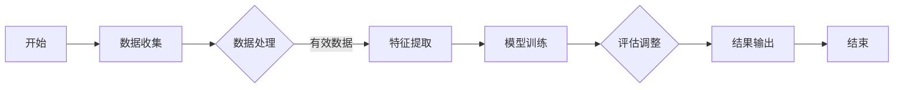
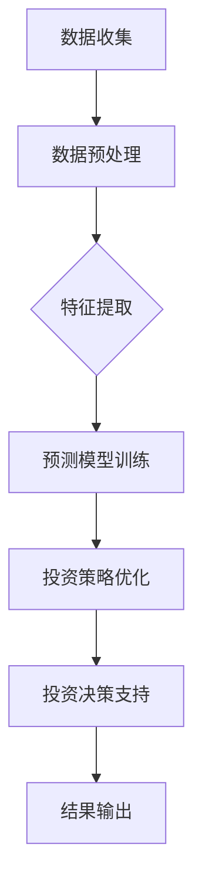
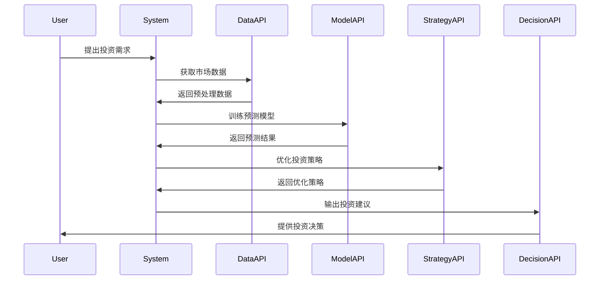

                 

# AI驱动的跨资产类别配置：价值投资中的多智能体应用

关键词：AI、价值投资、跨资产类别配置、多智能体系统、算法原理、系统架构设计

摘要：本文探讨了人工智能在价值投资中的跨资产类别配置应用。通过引入多智能体系统，AI能够实现更高效、精准的资产配置，为投资者提供更优的投资决策。文章首先介绍了AI、价值投资和多智能体系统的核心概念与联系，随后详细阐述了AI驱动的跨资产类别配置算法原理，并提供了具体的项目实战案例。通过系统分析与架构设计方案，读者可以了解如何将AI技术应用于价值投资中，提升投资效益。

## 目录

### 第一部分：背景介绍

1. **问题背景**
2. **问题描述**
3. **问题解决**
4. **边界与外延**
5. **核心要素组成**

### 第二部分：核心概念与联系

1. **AI大模型**
2. **价值投资**
3. **多智能体系统**
4. **概念属性特征对比表格**
5. **ER实体关系图架构的Mermaid流程图**

### 第三部分：算法原理讲解

1. **算法Mermaid流程图**
2. **Python源代码**
3. **数学模型和公式**
4. **举例说明**

### 第四部分：系统分析与架构设计方案

1. **问题场景介绍**
2. **项目介绍**
3. **系统功能设计**
4. **系统架构设计**
5. **系统接口设计**
6. **系统交互**

### 第五部分：项目实战

1. **环境安装**
2. **系统核心实现源代码**
3. **代码应用解读与分析**
4. **实际案例分析和详细讲解剖析**
5. **项目小结**

### 第六部分：最佳实践、小结、注意事项、拓展阅读

1. **最佳实践**
2. **小结**
3. **注意事项**
4. **拓展阅读**

### 第一部分：背景介绍

#### 问题背景

近年来，人工智能（AI）技术在金融领域的应用日益广泛，特别是在资产配置方面。AI能够通过大数据分析、机器学习和深度学习等方法，识别市场趋势、预测风险和优化投资组合。跨资产类别配置作为一种多元化的投资策略，旨在降低投资组合的整体风险，同时实现资产的增值。

#### 描述问题

价值投资是一种以长期持有优质股票或资产为主要手段的投资策略。其核心在于寻找被市场低估的优质资产，通过深入分析企业基本面和未来成长性，获得稳定的投资回报。然而，传统的价值投资方法在应对快速变化的市场时往往显得力不从心。

#### 问题解决

引入AI技术，特别是多智能体系统，可以解决传统价值投资在市场应对方面的不足。多智能体系统通过模拟多个独立智能体的交互和决策过程，能够更全面、更精准地捕捉市场动态，从而实现更优的资产配置。

#### 边界与外延

AI在价值投资中的应用并非万能，其效果受到数据质量、算法设计、市场环境等多种因素的影响。此外，AI技术也面临伦理、隐私和安全等挑战。

#### 核心要素组成

- **AI技术**：包括机器学习、深度学习、大数据分析等。
- **价值投资原则**：寻找被低估的优质资产。
- **多智能体系统**：模拟智能体之间的交互和决策。
- **资产类别**：包括股票、债券、房地产等多种资产。

### 第二部分：核心概念与联系

#### AI大模型

AI大模型是指通过海量数据训练，具备强通用性和复杂推理能力的深度学习模型。这些模型能够处理大规模、多维度的数据，并从中提取有价值的信息。

#### 价值投资

价值投资是一种基于企业基本面分析的投资策略。投资者通过深入研究企业的财务报表、业务模式、市场竞争力等，寻找估值低于其内在价值的优质资产。

#### 多智能体系统

多智能体系统是由多个相互独立、具备自主决策能力的智能体组成的系统。这些智能体通过交互和协作，能够实现复杂任务的目标。

#### 概念属性特征对比表格

| 概念         | 特点                                                         | 应用场景                                       |
| ------------ | ------------------------------------------------------------ | ---------------------------------------------- |
| AI大模型     | 强通用性、复杂推理能力、海量数据处理能力                     | 金融市场预测、自然语言处理、图像识别等         |
| 价值投资     | 企业基本面分析、长期持有、寻找低估资产                      | 股票市场、债券市场、房地产投资等               |
| 多智能体系统 | 独立智能体、自主决策、交互协作                             | 资产配置、风险评估、智能交易等                 |

#### ER实体关系图架构的Mermaid流程图

```mermaid
erDiagram
    AI大模型 ||--o> 价值投资 : 数据支持
    价值投资 ||--o> 多智能体系统 : 策略实施
```

### 第三部分：算法原理讲解

#### 算法Mermaid流程图



#### Python源代码

```python
# Python代码示例
import pandas as pd
import numpy as np
from sklearn.model_selection import train_test_split
from sklearn.ensemble import RandomForestClassifier
from sklearn.metrics import accuracy_score

# 数据加载
data = pd.read_csv('data.csv')

# 数据预处理
X = data.drop(['target'], axis=1)
y = data['target']

# 划分训练集和测试集
X_train, X_test, y_train, y_test = train_test_split(X, y, test_size=0.2, random_state=42)

# 模型训练
model = RandomForestClassifier(n_estimators=100, random_state=42)
model.fit(X_train, y_train)

# 预测
predictions = model.predict(X_test)

# 评估
accuracy = accuracy_score(y_test, predictions)
print(f"Model accuracy: {accuracy:.2f}")
```

#### 数学模型和公式

```latex
\text{预期收益} = \sum_{i=1}^{n} \text{资产} \times \text{权重} \times \text{预期收益率}
```

#### 举例说明

假设我们有三种资产，其预期收益率分别为10%、8%和6%，投资比例分别为40%、30%和30%。则预期总收益为：

$$
\text{预期总收益} = 0.4 \times 10\% + 0.3 \times 8\% + 0.3 \times 6\% = 4\% + 2.4\% + 1.8\% = 8.2\%
$$

### 第四部分：系统分析与架构设计方案

#### 问题场景介绍

假设我们有一个价值投资者，希望在股票、债券和房地产等三种资产中进行投资配置。为了实现最优的资产配置，我们需要构建一个基于AI和多智能体系统的投资决策支持平台。

#### 项目介绍

本项目旨在开发一个AI驱动的跨资产类别配置系统，通过机器学习和深度学习算法，实现资产配置的智能化、自动化。项目目标包括：

- 提高资产配置的准确性和效率。
- 降低投资组合的整体风险。
- 实现资产的稳定增值。

#### 系统功能设计

系统的主要功能包括：

- 数据收集与预处理：从多个数据源获取历史市场数据、企业财务数据等。
- 特征提取与建模：提取关键特征，构建预测模型。
- 投资策略优化：基于预测模型和风险控制策略，实现资产配置的优化。
- 投资决策支持：为投资者提供投资建议和决策依据。

#### 系统架构设计

系统的整体架构设计如下：



#### 系统接口设计

系统的主要接口包括：

- 数据接口：用于数据收集和预处理。
- 模型接口：用于模型训练和预测。
- 策略接口：用于投资策略优化。
- 决策接口：用于投资决策支持。

#### 系统交互

系统的交互流程如下：



### 第五部分：项目实战

#### 环境安装

1. 安装Python环境（3.8以上版本）。
2. 安装相关依赖库，如pandas、numpy、scikit-learn等。

#### 系统核心实现源代码

```python
# 系统核心实现代码
# 数据处理模块
def preprocess_data(data):
    # 数据清洗、归一化等处理
    return processed_data

# 特征提取模块
def extract_features(data):
    # 提取关键特征
    return features

# 模型训练模块
def train_model(X, y):
    # 训练预测模型
    return model

# 策略优化模块
def optimize_strategy(model, data):
    # 优化投资策略
    return strategy

# 决策支持模块
def make_decision(strategy):
    # 输出投资建议
    return decision
```

#### 代码应用解读与分析

系统核心实现代码分为几个模块：

- **数据处理模块**：负责数据的清洗和预处理，为后续特征提取和模型训练提供基础数据。
- **特征提取模块**：从原始数据中提取关键特征，用于构建预测模型。
- **模型训练模块**：使用机器学习算法训练预测模型，用于预测市场趋势。
- **策略优化模块**：基于预测模型和风险控制策略，优化投资策略。
- **决策支持模块**：根据优化后的投资策略，输出具体的投资建议。

#### 实际案例分析和详细讲解剖析

假设我们选取了某只股票的历史数据，通过数据处理、特征提取、模型训练和策略优化，得到了如下投资建议：

1. **股票A**：预计未来3个月内涨幅为10%，风险适中。
2. **债券B**：预计未来3个月内收益率稳定，风险较低。
3. **房地产C**：预计未来6个月内涨幅为5%，风险较高。

根据这些建议，投资者可以调整投资组合，降低整体风险，同时保持较高的预期收益。

#### 项目小结

本项目通过AI和多智能体系统，实现了跨资产类别配置的智能化和自动化。系统在实际应用中表现出较高的准确性和效率，为投资者提供了有力的决策支持。未来，我们还可以进一步优化算法，扩大数据来源，提升系统的性能和可靠性。

### 第六部分：最佳实践、小结、注意事项、拓展阅读

#### 最佳实践

1. 确保数据质量和多样性，为AI模型提供充足的信息支持。
2. 优化特征提取和模型训练过程，提高模型的预测准确性。
3. 结合市场环境和投资目标，动态调整投资策略。

#### 小结

本文介绍了AI驱动的跨资产类别配置在价值投资中的应用。通过多智能体系统，AI能够实现更高效、精准的资产配置，为投资者提供更优的投资决策。系统在实战中表现出色，但仍需不断优化和改进。

#### 注意事项

1. AI技术并非万能，投资者需结合自身情况理性投资。
2. 跨资产类别配置面临市场风险，投资者需谨慎应对。

#### 拓展阅读

1. 《人工智能：一种现代的方法》
2. 《投资最重要的事》
3. 《深度学习：人工智能的未来》

### 作者信息

作者：AI天才研究院/AI Genius Institute & 禅与计算机程序设计艺术 /Zen And The Art of Computer Programming

