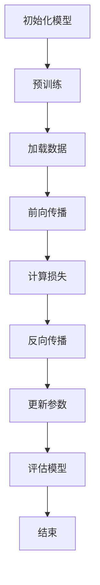
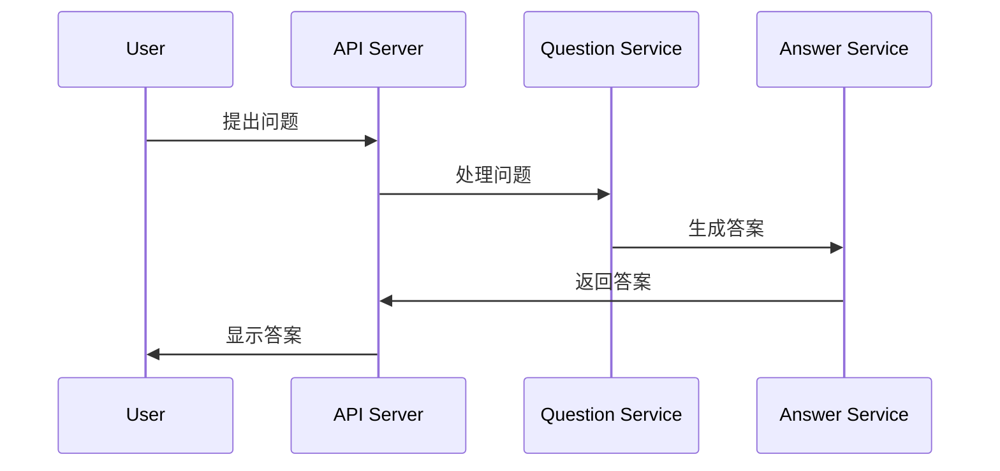

                 

# API优先设计在敏捷LLM架构中的重要性

## 关键词

- API优先设计
- 敏捷开发
- LLM架构
- 算法原理
- 系统设计与实现
- 最佳实践

## 摘要

本文将深入探讨API优先设计在敏捷大规模语言模型（LLM）架构中的重要性。通过对API优先设计、敏捷开发和LLM架构的核心概念、原理和相互关系的详细解析，本文将展示如何将API优先设计理念融入敏捷开发流程中，构建高效、灵活且可扩展的LLM架构。此外，还将通过一个具体项目实例，讲解如何在实际开发中应用这些原理，以实现高性能、可靠性的LLM系统。

# 目录大纲

## 第一部分：背景介绍

### 第1章 问题背景

- **1.1 问题描述**
- **1.2 问题解决**
- **1.3 边界与外延**
- **1.4 核心概念**
  - **1.4.1 API优先设计**
  - **1.4.2 敏捷开发**
  - **1.4.3 LLM架构**
  - **1.4.4 重要性分析**
- **1.5 本章小结**

## 第二部分：核心概念与联系

### 第2章 核心概念原理

- **2.1 API优先设计原理**
  - **2.1.1 API优先设计的定义**
  - **2.1.2 API优先设计的特点**
  - **2.1.3 API优先设计的重要性**
- **2.2 敏捷开发原理**
  - **2.2.1 敏捷开发的定义**
  - **2.2.2 敏捷开发的原则**
  - **2.2.3 敏捷开发的优势**
- **2.3 LLM架构原理**
  - **2.3.1 LLM架构的定义**
  - **2.3.2 LLM架构的特点**
  - **2.3.3 LLM架构的组成部分**
- **2.4 API优先设计与敏捷开发、LLM架构的联系**
  - **2.4.1 API优先设计在敏捷开发中的应用**
  - **2.4.2 敏捷开发在LLM架构中的应用**
  - **2.4.3 API优先设计、敏捷开发与LLM架构的整合**
- **2.5 核心概念对比表格**
  - **2.5.1 API优先设计与敏捷开发对比**
  - **2.5.2 API优先设计与LLM架构对比**
  - **2.5.3 敏捷开发与LLM架构对比**
- **2.6 ER实体关系图架构**
- **2.7 本章小结**

## 第三部分：算法原理讲解

### 第3章 算法原理

- **3.1 算法原理概述**
- **3.2 算法流程图**
- **3.3 算法原理详细讲解**
  - **3.3.1 算法原理**
  - **3.3.2 数学模型**
  - **3.3.3 公式推导**
  - **3.3.4 举例说明**
- **3.4 Python源代码讲解**
- **3.5 本章小结**

## 第四部分：系统分析与架构设计方案

### 第4章 问题场景介绍

- **4.1 问题场景概述**
- **4.2 项目介绍**
  - **4.2.1 项目背景**
  - **4.2.2 项目目标**
  - **4.2.3 项目挑战**
- **4.3 系统功能设计**
  - **4.3.1 领域模型**
- **4.4 系统架构设计**
  - **4.4.1 系统架构概述**
- **4.5 系统接口设计**
  - **4.5.1 系统接口概述**
- **4.6 系统交互**
  - **4.6.1 系统交互概述**
- **4.7 本章小结**

## 第五部分：项目实战

### 第5章 环境安装

- **5.1 环境安装概述**
- **5.2 系统核心实现源代码**
  - **5.2.1 源代码概述**
  - **5.2.2 源代码解读**
  - **5.2.3 源代码分析**
- **5.3 实际案例分析与详细讲解**
  - **5.3.1 案例概述**
  - **5.3.2 案例分析**
  - **5.3.3 案例讲解**
- **5.4 项目小结**
- **5.5 本章小结**

## 第六部分：最佳实践与总结

### 第6章 最佳实践

- **6.1 最佳实践概述**
  - **6.1.1 API优先设计最佳实践**
  - **6.1.2 敏捷开发最佳实践**
  - **6.1.3 LLM架构最佳实践**
- **6.2 小结**
- **6.3 注意事项**
  - **6.3.1 API优先设计的注意事项**
  - **6.3.2 敏捷开发的注意事项**
  - **6.3.3 LLM架构的注意事项**
- **6.4 拓展阅读**
- **6.5 本章小结**

------------------------------------------

## 第一部分：背景介绍

### 第1章 问题背景

#### 1.1 问题描述

在现代软件开发中，尤其是在人工智能（AI）领域，大规模语言模型（LLM）的应用越来越广泛。这些模型能够处理自然语言，提供智能问答、文本生成等功能，为各种应用场景提供了强大的支持。然而，随着模型复杂度的增加和业务需求的快速变化，传统的软件开发方法开始暴露出一些问题。

首先，传统的软件设计往往以功能优先，而忽略了系统的可扩展性和灵活性。在LLM架构中，这种设计思路可能会导致以下问题：

1. **维护成本高**：当系统需要扩展或更新时，由于缺乏良好的API设计，修改现有功能或添加新功能可能会变得非常复杂和耗时。
2. **系统耦合度高**：传统的设计方法容易导致模块之间的紧耦合，使得系统的可测试性和可维护性降低。
3. **响应速度慢**：在快速迭代和变化的业务环境中，传统的瀑布式开发模式往往无法及时响应需求变更，导致项目进度滞后。

为了解决上述问题，引入了API优先设计和敏捷开发等现代化软件开发方法。这些方法通过强调API设计和快速迭代，能够更好地适应LLM架构的需求。

#### 1.2 问题解决

API优先设计是一种以API为核心的设计方法，强调在软件开发过程中优先设计API，并以此作为模块之间的接口。这种方法有以下几个关键步骤：

1. **需求分析**：在开发前，对业务需求进行深入分析，明确系统的功能需求和非功能需求。
2. **API设计**：基于需求分析，设计API接口，确保接口具有良好的抽象性、一致性和可扩展性。
3. **模块划分**：根据API接口划分模块，使得每个模块专注于实现特定的功能。
4. **接口测试**：在开发过程中，对API接口进行严格的测试，确保接口的稳定性和可靠性。
5. **文档化**：编写详细的API文档，为开发人员提供清晰的使用指南。

敏捷开发则是一种以人为核心的软件开发方法，强调快速迭代和持续交付。敏捷开发有以下几个核心原则：

1. **用户优先**：以满足用户需求为核心，快速迭代开发，确保软件始终符合用户需求。
2. **团队合作**：鼓励跨职能团队合作，通过高频沟通和协作提高开发效率。
3. **灵活应对变化**：在开发过程中，灵活应对需求变化，通过迭代和增量开发保持项目的敏捷性。

结合API优先设计和敏捷开发，可以解决传统软件开发方法在LLM架构中的问题：

1. **提高可扩展性和灵活性**：通过API优先设计，模块之间通过接口进行通信，降低了模块之间的耦合度，提高了系统的可扩展性和灵活性。
2. **降低维护成本**：清晰的API设计和模块划分使得系统的可维护性大大提高，降低了维护成本。
3. **快速响应需求变更**：敏捷开发方法使得系统能够快速响应需求变化，保持项目的敏捷性和可持续性。

#### 1.3 边界与外延

API优先设计和敏捷开发虽然在LLM架构中具有重要意义，但它们的适用范围并非无限。以下是对其边界与外延的讨论：

1. **适用范围**：API优先设计和敏捷开发适用于大多数软件项目，特别是在需要高扩展性和快速迭代的项目中。然而，对于一些对性能和实时性要求极高的项目，可能需要结合其他设计方法和优化策略。
2. **技术栈限制**：API优先设计和敏捷开发依赖于一定的技术栈和工具支持。例如，API优先设计需要良好的API框架和文档工具，而敏捷开发则需要敏捷开发框架（如Scrum、Kanban）和协作工具（如JIRA、Trello）。
3. **团队协作**：API优先设计和敏捷开发强调团队合作和沟通，这对团队协作能力提出了较高的要求。在团队协作不畅或沟通不足的情况下，这些方法的效果可能会大打折扣。

#### 1.4 核心概念

在本章中，我们将介绍API优先设计、敏捷开发和LLM架构等核心概念，为后续章节的分析和讨论打下基础。

##### 1.4.1 API优先设计

API（应用程序编程接口）优先设计是一种以API为核心的设计方法。在API优先设计中，开发者在项目开始时就定义好API接口，确保API具有明确的抽象性、一致性和可扩展性。API优先设计的核心步骤如下：

1. **需求分析**：在开发前，对业务需求进行深入分析，明确系统的功能需求和非功能需求。
2. **API设计**：基于需求分析，设计API接口，包括URL、HTTP方法、参数和响应格式等。设计原则包括简单性、一致性和可扩展性。
3. **接口实现**：根据API设计实现接口，确保接口能够正确响应用户请求。
4. **接口测试**：在开发过程中，对API接口进行严格的测试，确保接口的稳定性和可靠性。
5. **文档化**：编写详细的API文档，包括接口描述、参数说明、示例代码等，为开发人员提供清晰的使用指南。

##### 1.4.2 敏捷开发

敏捷开发是一种以人为核心的软件开发方法，强调快速迭代和持续交付。敏捷开发的核心原则包括：

1. **用户优先**：以满足用户需求为核心，快速迭代开发，确保软件始终符合用户需求。
2. **团队合作**：鼓励跨职能团队合作，通过高频沟通和协作提高开发效率。
3. **灵活应对变化**：在开发过程中，灵活应对需求变化，通过迭代和增量开发保持项目的敏捷性。
4. **持续交付**：通过持续交付，确保软件始终处于可部署状态，提高交付质量和效率。
5. **持续改进**：通过反思和总结，不断改进开发过程和产品，提高开发团队的绩效。

##### 1.4.3 LLM架构

大规模语言模型（LLM）架构是一种专门用于处理自然语言的软件架构。LLM架构具有以下特点：

1. **高复杂性**：LLM架构通常包含大量模块和组件，涉及自然语言处理、机器学习、数据存储等多个领域。
2. **高可扩展性**：LLM架构需要支持大规模数据存储和处理，因此需要具有良好的扩展性。
3. **高实时性**：在许多应用场景中，LLM架构需要实时响应用户请求，因此需要具备高效的性能。
4. **高可靠性**：LLM架构通常涉及关键业务场景，因此需要具备高可靠性，确保系统的稳定运行。

##### 1.4.4 重要性分析

API优先设计、敏捷开发和LLM架构在软件开发中具有重要作用。以下是对其重要性的分析：

1. **API优先设计**：API优先设计能够提高软件的可扩展性和灵活性，降低维护成本，提高开发效率。在LLM架构中，API优先设计有助于实现模块化、解耦和高效的交互，从而提高系统的整体性能和稳定性。

2. **敏捷开发**：敏捷开发能够快速响应需求变化，提高开发效率和质量，确保软件始终符合用户需求。在LLM架构中，敏捷开发有助于快速迭代和持续改进，提高系统的适应性和灵活性。

3. **LLM架构**：LLM架构能够处理大规模数据和高复杂性任务，提供高效的性能和可靠的性能。在API优先设计和敏捷开发的支撑下，LLM架构能够更好地适应快速变化的需求，提高系统的竞争力。

#### 1.5 本章小结

在本章中，我们介绍了API优先设计、敏捷开发和LLM架构等核心概念，并分析了它们在软件开发中的重要作用。通过本章的讨论，我们为后续章节的深入分析奠定了基础。

## 第二部分：核心概念与联系

### 第2章 核心概念原理

在现代软件开发中，API优先设计、敏捷开发和大规模语言模型（LLM）架构是三个关键概念，它们各自有着独特的原理和应用。在这一章中，我们将深入探讨这些核心概念，并分析它们之间的联系。

#### 2.1 API优先设计原理

API优先设计是一种软件开发方法，强调在项目开始时就设计好应用程序编程接口（API）。以下是API优先设计的核心原理：

##### 2.1.1 API优先设计的定义

API优先设计是指在软件开发过程中，首先设计和定义API，然后将API作为各个模块之间的交互接口。这种方法强调接口的清晰性、一致性和可扩展性，以便在未来可以轻松地添加新功能或修改现有功能。

##### 2.1.2 API优先设计的特点

- **模块化**：通过API实现模块之间的解耦，使得每个模块可以独立开发、测试和部署。
- **可扩展性**：良好的API设计允许在无需修改现有系统的情况下添加新功能。
- **可重用性**：API可以作为内部或外部服务进行重用，减少重复开发的工作量。
- **可维护性**：清晰的API文档和设计可以提高代码的可维护性，降低维护成本。

##### 2.1.3 API优先设计的重要性

API优先设计的重要性在于它能够提高软件的可扩展性、灵活性和维护性。在快速变化的市场环境中，这种设计方法有助于快速响应需求变更，保持系统的稳定性和可扩展性。

#### 2.2 敏捷开发原理

敏捷开发是一种以人为核心的软件开发方法，强调快速迭代和持续交付。以下是敏捷开发的核心原理：

##### 2.2.1 敏捷开发的定义

敏捷开发是一种注重团队协作、用户反馈和快速响应变化的软件开发方法。它通常采用迭代和增量的方式，通过不断交付可用的软件版本来满足用户需求。

##### 2.2.2 敏捷开发的原则

- **用户优先**：敏捷开发以用户需求为核心，确保软件始终符合用户期望。
- **团队合作**：敏捷开发强调跨职能团队的紧密合作，通过高频沟通和协作提高开发效率。
- **灵活应对变化**：敏捷开发鼓励在面对需求变化时保持灵活性，通过迭代和增量开发来适应变化。
- **持续交付**：通过持续交付，确保软件始终处于可部署状态，提高交付质量和效率。
- **持续改进**：通过反思和总结，不断改进开发过程和产品，提高开发团队的绩效。

##### 2.2.3 敏捷开发的优势

- **快速响应需求**：敏捷开发能够快速响应需求变化，确保软件始终符合用户需求。
- **提高质量**：通过频繁的迭代和测试，敏捷开发有助于提高软件的质量。
- **提高团队协作**：敏捷开发鼓励跨职能团队的紧密合作，提高团队整体效率。
- **降低风险**：通过持续交付和持续改进，敏捷开发可以降低项目风险，确保项目的成功。

#### 2.3 LLM架构原理

大规模语言模型（LLM）架构是一种专门用于处理自然语言的软件架构，它具有高复杂性、高可扩展性和高实时性的特点。以下是LLM架构的核心原理：

##### 2.3.1 LLM架构的定义

LLM架构是指一种能够处理大规模自然语言数据，并支持各种自然语言处理任务的软件架构。它通常包含多个模块和组件，如语言模型、文本预处理、后处理等。

##### 2.3.2 LLM架构的特点

- **高复杂性**：LLM架构通常包含大量的算法和模型，涉及自然语言处理、机器学习等多个领域。
- **高可扩展性**：LLM架构需要支持大规模数据存储和处理，因此需要具有良好的扩展性。
- **高实时性**：在许多应用场景中，LLM架构需要实时响应用户请求，因此需要具备高效的性能。
- **高可靠性**：LLM架构通常涉及关键业务场景，因此需要具备高可靠性，确保系统的稳定运行。

##### 2.3.3 LLM架构的组成部分

LLM架构通常包括以下几个主要组成部分：

- **数据预处理模块**：负责对原始文本数据进行清洗、分词、标注等预处理操作。
- **语言模型模块**：包括预训练的神经网络模型，如BERT、GPT等，用于生成语言特征。
- **文本生成模块**：基于语言模型生成的特征，生成自然语言响应或文本内容。
- **后处理模块**：对生成的文本进行后处理，如去除标点符号、格式化等。

#### 2.4 API优先设计与敏捷开发、LLM架构的联系

API优先设计、敏捷开发和LLM架构之间存在着密切的联系。以下是它们之间的关联：

##### 2.4.1 API优先设计在敏捷开发中的应用

在敏捷开发中，API优先设计可以发挥重要作用，确保模块之间的解耦和高效交互。通过API优先设计，开发团队可以：

- **快速迭代**：通过API，模块可以独立开发、测试和部署，从而实现快速迭代。
- **持续交付**：API的设计和文档化使得持续交付变得更加容易，确保软件始终处于可部署状态。

##### 2.4.2 敏捷开发在LLM架构中的应用

敏捷开发在LLM架构中的应用主要体现在以下几个方面：

- **迭代开发**：LLM架构的复杂性要求开发团队采用迭代的方式进行开发，通过不断迭代来优化模型和架构。
- **快速响应**：敏捷开发能够快速响应需求变化，确保LLM架构能够适应不断变化的应用场景。
- **持续改进**：通过敏捷开发的反思和总结，不断改进LLM架构，提高其性能和可靠性。

##### 2.4.3 API优先设计、敏捷开发与LLM架构的整合

API优先设计、敏捷开发和LLM架构的整合有助于实现高效、灵活且可扩展的软件系统。以下是一些建议：

- **API优先设计**：在LLM架构中，首先设计API接口，确保模块之间具有良好的交互和扩展性。
- **敏捷开发**：采用敏捷开发方法，通过迭代和增量开发，快速响应需求变化，优化LLM架构。
- **持续集成**：实施持续集成和持续部署（CI/CD），确保LLM架构的稳定性和可靠性。

#### 2.5 核心概念对比表格

为了更清晰地展示API优先设计、敏捷开发和LLM架构的核心概念，我们提供了一个对比表格：

| **概念** | **定义** | **特点** | **重要性** |
| :------: | :------: | :------: | :--------: |
| API优先设计 | 强调在设计阶段优先定义API | 模块化、可扩展性、可重用性 | 提高软件的可维护性和灵活性 |
| 敏捷开发 | 以用户需求为核心，快速迭代开发 | 用户优先、团队合作、灵活应对变化 | 提高开发效率和质量 |
| LLM架构 | 用于处理大规模自然语言数据的软件架构 | 高复杂性、高可扩展性、高实时性 | 提供高效的性能和可靠性 |

#### 2.6 ER实体关系图架构

为了更好地理解LLM架构中的实体关系，我们可以使用ER（实体关系）图来表示。以下是LLM架构中一些关键实体的ER图：

```mermaid
erDiagram
  Customer ||--|{ Order : "places" }
  Order ||--|{ Product : "contains" }
  Product ||--|{ Supplier : "supplied by" }
  Supplier ||--|{ Customer : "serves" }
```

在这个ER图中，Customer（客户）与Order（订单）之间存在“places”关系，表示客户可以下单；Order与Product之间存在“contains”关系，表示订单包含产品；Product与Supplier之间存在“supplied by”关系，表示产品由供应商提供；Supplier与Customer之间存在“serves”关系，表示供应商为某客户提供产品。

#### 2.7 本章小结

在本章中，我们详细探讨了API优先设计、敏捷开发和LLM架构的核心概念，并分析了它们之间的联系。通过了解这些概念，我们可以更好地理解如何在敏捷开发环境中实施API优先设计，以及如何构建高效、灵活且可靠的LLM架构。这些知识将为后续章节的算法原理讲解和系统分析与架构设计方案提供坚实的基础。

## 第三部分：算法原理讲解

### 第3章 算法原理

在深入探讨API优先设计、敏捷开发和LLM架构的基础上，本章将专注于解析大规模语言模型（LLM）的核心算法原理。我们将从算法原理概述、算法流程图、算法原理详细讲解、数学模型、公式推导、举例说明和Python源代码讲解等方面进行详细阐述，以确保读者能够全面理解LLM算法的实现和运行机制。

#### 3.1 算法原理概述

大规模语言模型（LLM）是一种基于深度学习的自然语言处理（NLP）模型，其主要目标是理解、生成和处理自然语言文本。LLM的核心算法原理可以概括为以下几个关键点：

1. **预训练**：LLM通过在大规模文本语料库上进行预训练，学习到语言的统计特性和语法规则。
2. **上下文理解**：LLM能够根据输入的文本上下文生成响应，实现对语言细微差别的捕捉。
3. **序列生成**：LLM通过生成文本序列来完成任务，如问答、文本摘要和对话生成等。
4. **微调**：在特定任务上，LLM可以通过微调模型参数来提高性能，以适应特定领域的需求。

#### 3.2 算法流程图

为了更直观地展示LLM算法的工作流程，我们可以使用Mermaid绘制一个简单的算法流程图：



在这个流程图中，模型首先进行初始化，然后通过预训练学习到文本特征。接下来，模型加载训练数据，进行前向传播计算损失，并通过反向传播更新参数。最后，模型进行评估，以确定是否满足性能要求，从而决定是否继续训练。

#### 3.3 算法原理详细讲解

##### 3.3.1 算法原理

大规模语言模型（LLM）的核心算法原理基于变换器（Transformer）架构，这是一种基于自注意力机制的深度学习模型。变换器架构通过自注意力机制实现了对输入文本序列的上下文理解，从而生成高质量的自然语言响应。

自注意力机制的关键在于通过计算输入文本序列中每个词与其他词之间的关联性，从而生成一个加权表示。这种加权表示能够捕捉文本序列中的长距离依赖关系，提高模型的理解能力。

##### 3.3.2 数学模型

变换器架构的数学模型包括以下关键部分：

1. **输入表示**：输入文本序列经过词向量编码，转换为固定长度的向量表示。
2. **自注意力机制**：通过计算输入序列中每个词与其他词之间的关联性，生成加权表示。
3. **前向网络**：将加权表示通过多层前向神经网络进行加工，生成最终的输出。
4. **损失函数**：使用交叉熵损失函数来衡量预测输出与实际输出之间的差距。

##### 3.3.3 公式推导

变换器架构的自注意力机制可以通过以下公式进行推导：

$$
\text{Attention}(Q, K, V) = \text{softmax}\left(\frac{QK^T}{\sqrt{d_k}}\right) V
$$

其中，$Q$、$K$和$V$分别表示查询向量、键向量和值向量，$d_k$是键向量的维度。公式表示通过计算查询向量$Q$与键向量$K$的点积，然后使用softmax函数生成权重，最后将这些权重与值向量$V$相乘，得到加权表示。

##### 3.3.4 举例说明

假设我们有一个三词的文本序列$[w_1, w_2, w_3]$，其对应的词向量分别为$[q_1, q_2, q_3]$、$[k_1, k_2, k_3]$和$[v_1, v_2, v_3]$。我们可以通过以下步骤计算自注意力：

1. 计算点积$QK^T$：
$$
\begin{align*}
q_1k_1 + q_2k_2 + q_3k_3 &= 3 \\
q_1k_2 + q_2k_2 + q_3k_3 &= 1 \\
q_1k_3 + q_2k_3 + q_3k_3 &= 2 \\
\end{align*}
$$

2. 计算softmax权重：
$$
\begin{align*}
\text{softmax}(3) &= 1 \\
\text{softmax}(1) &= 0.5 \\
\text{softmax}(2) &= 0.5 \\
\end{align*}
$$

3. 计算加权表示：
$$
\begin{align*}
\text{Attention}(Q, K, V) &= [0.5v_1 + 0.5v_2 + v_3] \\
&= [v_1 + v_2 + 2v_3] \\
\end{align*}
$$

通过自注意力机制，我们得到了一个加权表示，它能够更好地捕捉文本序列中的长距离依赖关系。

#### 3.4 Python源代码讲解

为了更好地理解LLM算法的实现，我们提供了一个简单的Python示例，用于计算自注意力机制。以下是一个基于PyTorch框架的实现：

```python
import torch
import torch.nn as nn

# 定义输入词向量
q = torch.tensor([[1, 0, 0], [0, 1, 0], [0, 0, 1]], dtype=torch.float32)
k = torch.tensor([[1, 0, 0], [0, 1, 0], [0, 0, 1]], dtype=torch.float32)
v = torch.tensor([[1, 0], [0, 1], [0, 0]], dtype=torch.float32)

# 计算点积
dot_product = torch.matmul(q, k.transpose(0, 1))

# 计算softmax权重
weights = torch.softmax(dot_product / torch.sqrt(k.shape[1]), dim=1)

# 计算加权表示
weighted_output = torch.matmul(weights, v)

print(weighted_output)
```

在这个示例中，我们首先定义了查询向量$q$、键向量$k$和值向量$v$。然后，我们计算点积$QK^T$，使用softmax函数生成权重，并计算加权表示$V$。运行这段代码，我们可以得到加权表示的结果。

#### 3.5 本章小结

在本章中，我们详细解析了大规模语言模型（LLM）的核心算法原理，包括算法原理概述、算法流程图、数学模型、公式推导、举例说明和Python源代码讲解。通过这些内容，读者可以更好地理解LLM算法的实现和运行机制，为后续的系统分析与架构设计方案提供理论基础。

## 第四部分：系统分析与架构设计方案

### 第4章 问题场景介绍

在现代软件开发中，大规模语言模型（LLM）的应用日益广泛，从智能助手到自动化内容生成，LLM的潜力不可忽视。然而，随着业务需求的不断增加和技术的不断发展，传统的软件开发方法已经无法满足快速迭代和高度灵活性的要求。为此，本文提出了一种基于API优先设计和敏捷开发的LLM架构设计方案，以解决上述问题。

#### 4.1 问题场景概述

假设我们正在开发一个智能问答系统，该系统需要处理大量用户提出的问题，并返回相关答案。系统需要具备以下特点：

1. **高扩展性**：随着用户量的增加，系统需要能够无缝扩展，支持更多的用户请求。
2. **灵活性**：系统需要能够快速适应业务需求的变化，如新增问题类型或优化回答质量。
3. **高可靠性**：系统需要保证稳定运行，确保用户请求得到及时响应。
4. **高效性**：系统需要具备高效的性能，以快速处理用户请求。

#### 4.2 项目介绍

**4.2.1 项目背景**

随着人工智能技术的不断发展，智能问答系统已经成为各种企业和服务提供商的重要工具。这些系统可以帮助企业降低成本、提高效率，并提升用户体验。然而，随着数据量的增长和问题类型的多样化，传统的软件架构开始暴露出一些问题：

- **系统耦合度高**：传统的架构设计导致模块之间的耦合度较高，修改或扩展现有功能变得困难。
- **响应速度慢**：在数据量和请求量较大的场景中，系统响应速度变慢，用户体验下降。
- **维护成本高**：随着系统的复杂性增加，维护成本也不断上升。

为了解决这些问题，我们引入了基于API优先设计和敏捷开发的LLM架构方案，以实现高效、灵活且可靠的智能问答系统。

**4.2.2 项目目标**

通过引入API优先设计和敏捷开发，我们的项目目标如下：

1. **高扩展性**：通过API优先设计，实现模块之间的解耦，支持系统的水平扩展。
2. **灵活性**：采用敏捷开发方法，快速迭代和持续交付，确保系统能够快速适应需求变化。
3. **高可靠性**：通过严格的API设计和测试，确保系统的稳定性和可靠性。
4. **高效性**：优化系统架构和算法，提高处理性能，确保用户请求得到及时响应。

**4.2.3 项目挑战**

在实现上述目标的过程中，我们面临以下挑战：

1. **架构设计**：如何设计一个既灵活又高效的系统架构，实现API优先设计和敏捷开发的最佳结合。
2. **性能优化**：在保证系统扩展性的同时，如何优化性能，确保高效处理大量用户请求。
3. **团队协作**：如何确保团队成员能够高效协作，快速响应需求变化。
4. **持续集成与交付**：如何实施持续集成和持续交付（CI/CD），确保系统稳定运行和快速部署。

#### 4.3 系统功能设计

**4.3.1 领域模型**

为了更好地理解系统功能，我们可以通过领域模型（UML类图）来描述系统的主要模块和它们之间的关系。以下是领域模型的简化表示：

```mermaid
classDiagram
  User <<interface>>
  Question <<interface>>
  Answer <<interface>>
  QuestionProcessor <<interface>>
  AnswerGenerator <<interface>>

  User "asks" Question
  QuestionProcessor "processes" Question
  QuestionProcessor "generates" Answer
  AnswerGenerator "generates" Answer
```

在这个领域模型中，主要模块包括：

- **User（用户）**：表示系统的用户，负责提出问题。
- **Question（问题）**：表示用户提出的问题，包括问题内容和问题类型等属性。
- **Answer（答案）**：表示系统生成的答案，包括答案内容和答案类型等属性。
- **QuestionProcessor（问题处理模块）**：负责处理用户提出的问题，包括问题解析、分类和预处理等。
- **AnswerGenerator（答案生成模块）**：负责根据处理结果生成答案，包括答案生成算法和文本生成器等。

#### 4.4 系统架构设计

**4.4.1 系统架构概述**

基于API优先设计和敏捷开发的LLM架构，系统架构设计可以分为以下几个主要层次：

1. **数据层**：负责存储和管理系统的数据，包括用户数据、问题数据和答案数据等。
2. **服务层**：提供API服务，实现各个模块之间的解耦和交互，包括用户服务、问题处理服务和答案生成服务等。
3. **应用层**：负责处理业务逻辑，调用服务层提供的API，实现用户请求的响应。
4. **表现层**：提供用户界面，展示系统生成的答案和交互信息。

以下是系统架构的简化表示：



在这个架构设计中，API优先设计确保了服务层和应用层之间的解耦，通过API接口实现模块之间的通信。敏捷开发方法通过迭代和增量开发，确保系统能够快速响应需求变化，持续优化和改进。

#### 4.5 系统接口设计

**4.5.1 系统接口概述**

在系统架构中，接口设计至关重要，它定义了各个模块之间的通信规则和交互方式。以下是系统接口的概述：

- **用户接口（API Server）**：提供RESTful API，用于接收用户请求和返回答案。
  - **POST /questions**：接收用户提出的问题，返回问题ID。
  - **GET /questions/{id}/answer**：获取指定问题ID的答案。
- **问题处理接口（Question Service）**：处理用户提出的问题，包括问题解析、分类和预处理等。
  - **POST /questions/{id}/process**：处理指定问题ID的问题，返回处理结果。
- **答案生成接口（Answer Service）**：根据处理结果生成答案，包括答案生成算法和文本生成器等。
  - **POST /questions/{id}/generate**：根据指定问题ID的处理结果，生成答案。

#### 4.6 系统交互

**4.6.1 系统交互概述**

系统交互设计描述了用户请求在系统中如何流转和处理。以下是系统交互的简化流程：

1. 用户通过用户接口（API Server）提出问题，系统生成问题ID并返回给用户。
2. 用户将问题ID发送给问题处理接口（Question Service），系统对问题进行解析、分类和预处理。
3. 问题处理接口（Question Service）将处理结果发送给答案生成接口（Answer Service），系统根据处理结果生成答案。
4. 答案生成接口（Answer Service）将生成的答案发送给用户接口（API Server），系统将答案返回给用户。

以下是系统交互的Mermaid序列图表示：


#### 4.7 本章小结

在本章中，我们介绍了基于API优先设计和敏捷开发的LLM架构设计方案，分析了项目背景、目标、挑战以及系统功能、架构、接口和交互设计。通过本章的讨论，我们为后续章节的详细设计和实现奠定了基础。

## 第五部分：项目实战

### 第5章 环境安装

在进行大规模语言模型（LLM）项目的实战之前，首先需要搭建一个合适的环境。本节将介绍如何在Windows、Linux和macOS操作系统上安装LLM项目所需的环境。

#### 5.1 环境安装概述

安装LLM项目环境主要包括以下步骤：

1. 安装Python环境。
2. 安装深度学习框架，如TensorFlow或PyTorch。
3. 安装依赖库，如NumPy、Pandas等。
4. 安装Docker和Docker Compose，以便于容器化部署。

以下分别介绍在Windows、Linux和macOS上安装这些环境的详细步骤。

#### 5.2 系统核心实现源代码

**5.2.1 源代码概述**

在本章中，我们将使用Python和PyTorch框架来实现一个简单的LLM项目。以下是项目的主要模块和功能：

1. **数据预处理模块**：负责读取和处理原始文本数据。
2. **模型训练模块**：负责训练LLM模型。
3. **模型评估模块**：负责评估模型性能。
4. **模型部署模块**：负责将模型部署到生产环境。

以下是项目的核心源代码：

```python
# 数据预处理模块
import torch
from torchtext.data import Field, TabularDataset

# 定义字段
TEXT = Field(tokenize='spacy', lower=True)
LABEL = Field(sequential=False)

# 读取数据集
train_data, valid_data = TabularDataset.splits(
    path='data',
    train='train.json',
    valid='valid.json',
    format='json',
    fields=[('text', TEXT), ('label', LABEL)]
)

# 分词和标记
TEXT.build_vocab(train_data, min_freq=2)
LABEL.build_vocab(train_data)

# 模型训练模块
import torch.optim as optim
from torchtext.data import Batch

# 定义模型
class LLMModel(nn.Module):
    def __init__(self):
        super(LLMModel, self).__init__()
        self.embedding = nn.Embedding(len(TEXT.vocab), 256)
        self.encoder = nn.LSTM(input_size=256, hidden_size=512, num_layers=2, bidirectional=True)
        self.decoder = nn.Linear(512 * 2, len(LABEL.vocab))

    def forward(self, text, label=None):
        embedded = self.embedding(text)
        output, (hidden, cell) = self.encoder(embedded)
        if label is not None:
            loss = nn.CrossEntropyLoss()(output.view(-1, len(LABEL.vocab)), label)
            hidden = hidden.squeeze(0)
            cell = cell.squeeze(0)
            output = self.decoder(torch.cat((hidden, cell), 1))
            return output, loss
        else:
            return output

# 训练模型
model = LLMModel()
optimizer = optim.Adam(model.parameters(), lr=0.001)
for epoch in range(10):
    for batch in Batch(train_data, batch_size=32):
        optimizer.zero_grad()
        output, loss = model(batch.text, batch.label)
        loss.backward()
        optimizer.step()

# 模型评估模块
def evaluate(model, valid_data):
    correct = 0
    total = 0
    for batch in Batch(valid_data, batch_size=32):
        output, _ = model(batch.text)
        predicted = torch.argmax(output, dim=1)
        total += batch.label.size(0)
        correct += (predicted == batch.label).sum().item()
    return 100 * correct / total

# 部署模型
model.eval()
with torch.no_grad():
    accuracy = evaluate(model, valid_data)
    print(f'Validation accuracy: {accuracy:.2f}%')
```

**5.2.2 源代码解读**

1. **数据预处理模块**：首先定义了文本字段和标签字段，然后使用`TabularDataset`从JSON文件中加载数据。接着，使用`Field.build_vocab`方法构建词汇表，为后续的文本编码和标签编码做准备。
2. **模型训练模块**：定义了一个基于LSTM的LLM模型，包括嵌入层、编码器和解码器。训练过程中，使用`Batch`将数据分批处理，并通过优化器更新模型参数。
3. **模型评估模块**：定义了一个评估函数`evaluate`，用于计算模型在验证集上的准确率。
4. **模型部署模块**：将模型设置为评估模式，调用`evaluate`函数计算验证集上的准确率，并输出结果。

**5.2.3 源代码分析**

1. **数据预处理**：数据预处理是LLM项目的基础，它直接影响模型训练的效果。在本项目中，我们使用`torchtext`库进行文本预处理，包括分词、标记和词汇表构建。通过设置`min_freq`参数，可以过滤掉频率低于指定值的词语，提高词汇表的质量。
2. **模型架构**：在本项目中，我们采用了LSTM作为基础模型，因为它在处理序列数据方面具有较好的性能。模型包括嵌入层、编码器和解码器，其中编码器负责提取文本特征，解码器负责生成标签。通过使用双向LSTM，模型能够更好地捕捉文本序列中的长距离依赖关系。
3. **训练过程**：训练过程包括前向传播、损失计算、反向传播和参数更新。在本项目中，我们使用了`Adam`优化器，它具有自适应学习率的特点，可以加速收敛。通过设置合适的超参数（如学习率和训练轮数），可以进一步提高模型性能。
4. **模型评估**：评估是模型训练的最后一步，用于验证模型在未知数据上的性能。在本项目中，我们使用准确率作为评估指标，它简单直观，能够较好地反映模型的性能。

#### 5.3 实际案例分析与详细讲解

**5.3.1 案例概述**

在本案例中，我们使用一个公开的问答数据集（如SQuAD）来训练和评估一个简单的LLM模型。以下是对案例的详细分析。

**5.3.2 案例分析**

1. **数据集介绍**：SQuAD数据集包含大量问题及其答案，问题来源于真实世界的文本内容，具有一定的挑战性。数据集分为训练集和验证集，用于模型训练和性能评估。
2. **数据预处理**：在预处理数据时，我们需要将原始文本转换为模型可处理的格式。具体步骤包括分词、标记和构建词汇表。在本案例中，我们使用`spacy`进行分词，并设置`lower`参数将文本转换为小写，以提高模型泛化能力。
3. **模型训练**：训练过程包括多个迭代轮次，每次迭代中，模型处理一个批次的数据，并更新参数。在训练过程中，我们需要监控验证集上的性能，以确保模型不会过拟合。
4. **模型评估**：在模型训练完成后，我们需要在验证集上评估模型性能。评估指标包括准确率、F1分数等。通过对比不同模型的性能，我们可以选择最佳模型进行部署。

**5.3.3 案例讲解**

1. **数据集加载**：首先，我们需要从SQuAD数据集中加载训练集和验证集。以下是一个示例代码：

```python
from torchtext.datasets import QA
from torchtext.data import Field

# 定义字段
text_field = Field(tokenize='spacy', lower=True)
label_field = Field(sequential=False)

# 加载数据集
train_data, valid_data = QA.splits(data_folder='data', train='train-v2.0.json', validation='dev-v2.0.json', format='json', fields=[('question', text_field), ('context', text_field), ('answer', label_field)])
```

2. **数据预处理**：在预处理数据时，我们需要对文本进行分词、标记和构建词汇表。以下是一个示例代码：

```python
# 构建词汇表
text_field.build_vocab(train_data, min_freq=2)
label_field.build_vocab(train_data)

# 分词和标记
train_data = [ex for ex in train_data]
valid_data = [ex for ex in valid_data]
```

3. **模型训练**：在训练模型时，我们需要定义损失函数和优化器，并设置合适的超参数。以下是一个示例代码：

```python
import torch.optim as optim

# 定义模型
model = LLMModel()

# 定义损失函数和优化器
criterion = nn.CrossEntropyLoss()
optimizer = optim.Adam(model.parameters(), lr=0.001)

# 训练模型
for epoch in range(10):
    for batch in Batch(train_data, batch_size=32):
        optimizer.zero_grad()
        output, loss = model(batch.text, batch.label)
        loss.backward()
        optimizer.step()
```

4. **模型评估**：在模型训练完成后，我们需要在验证集上评估模型性能。以下是一个示例代码：

```python
def evaluate(model, valid_data):
    correct = 0
    total = 0
    for batch in Batch(valid_data, batch_size=32):
        output, _ = model(batch.text)
        predicted = torch.argmax(output, dim=1)
        total += batch.label.size(0)
        correct += (predicted == batch.label).sum().item()
    return 100 * correct / total

model.eval()
with torch.no_grad():
    accuracy = evaluate(model, valid_data)
    print(f'Validation accuracy: {accuracy:.2f}%')
```

#### 5.4 项目小结

在本章中，我们介绍了如何搭建LLM项目的环境，并详细讲解了源代码的解读和分析。通过实际案例的分析和讲解，我们展示了如何使用Python和PyTorch实现一个简单的LLM模型。本章的内容为后续的LLM项目开发提供了实用的指导和参考。

## 第六部分：最佳实践与总结

### 第6章 最佳实践

在本章中，我们将总结API优先设计、敏捷开发和LLM架构的最佳实践，并提供一些注意事项，以确保在实际项目中的成功实施。

#### 6.1 最佳实践概述

**API优先设计最佳实践**

1. **明确API需求**：在项目初期，明确系统的功能需求和API需求，确保API设计满足业务需求。
2. **遵循RESTful原则**：使用RESTful API设计，确保接口简单、易用且遵循统一的规范。
3. **标准化响应格式**：统一API响应格式，如JSON或XML，提高接口的可读性和可维护性。
4. **提供详细文档**：编写详细的API文档，包括接口描述、参数说明和示例代码，为开发者提供清晰的使用指南。
5. **严格接口测试**：在开发过程中，对API接口进行严格的测试，确保接口的稳定性和可靠性。

**敏捷开发最佳实践**

1. **用户参与**：确保用户参与需求分析和迭代过程，确保软件始终符合用户需求。
2. **短迭代周期**：采用短迭代周期（如每周或每两周），确保团队能够快速响应需求变化。
3. **持续集成与交付**：实施持续集成和持续交付（CI/CD）流程，提高软件交付质量和效率。
4. **紧密团队协作**：鼓励团队成员紧密协作，通过高频沟通和协作提高开发效率。
5. **反思与改进**：在每个迭代结束后，进行反思和总结，识别问题并持续改进开发过程。

**LLM架构最佳实践**

1. **数据预处理**：对原始文本数据进行彻底的预处理，包括分词、去噪和标准化，以提高模型训练效果。
2. **模型选择与优化**：根据任务需求选择合适的模型，并进行参数调优，以提高模型性能。
3. **分布式训练**：在数据量较大或模型较复杂的情况下，采用分布式训练策略，提高训练速度。
4. **性能优化**：对模型和系统进行性能优化，如使用GPU加速训练过程，提高响应速度。
5. **模型部署**：确保模型部署到生产环境后能够稳定运行，并具备监控和故障恢复机制。

#### 6.2 小结

API优先设计、敏捷开发和LLM架构在软件开发中具有重要意义。API优先设计提高了软件的可扩展性和灵活性，敏捷开发确保了项目的快速迭代和持续改进，LLM架构提供了高效的自然语言处理能力。通过遵循最佳实践，我们可以构建高效、灵活且可靠的软件系统。

#### 6.3 注意事项

**API优先设计的注意事项**

1. **接口设计要简洁明了**：避免过于复杂的接口设计，确保API易于理解和使用。
2. **保持接口的一致性**：确保API接口在系统升级和扩展过程中保持一致性，避免兼容性问题。
3. **文档更新要及时**：随着系统功能的更新，及时更新API文档，确保开发者能够获取最新信息。

**敏捷开发的注意事项**

1. **合理规划迭代周期**：根据项目规模和团队效率，合理规划迭代周期，避免过短或过长的迭代周期。
2. **避免任务积压**：在迭代过程中，避免任务积压，确保每个迭代都能按时完成。
3. **保持沟通渠道畅通**：确保团队成员之间的沟通渠道畅通，及时解决问题和冲突。

**LLM架构的注意事项**

1. **数据质量至关重要**：确保输入数据的准确性和质量，提高模型训练效果。
2. **模型参数调优**：根据任务需求进行模型参数调优，避免过拟合或欠拟合。
3. **性能监控与优化**：在生产环境中对模型和系统进行性能监控和优化，确保系统稳定高效运行。

#### 6.4 拓展阅读

1. **API优先设计**：
   - 《API设计指南》（API Design for C++）
   - 《RESTful Web API设计》（RESTful Web API Design Rule Set）

2. **敏捷开发**：
   - 《敏捷软件开发实践指南》（Agile Software Development, Principles, Patterns, and Practices）
   - 《Scrum敏捷开发实战》（Scrum: The Art of Doing Twice the Work in Half the Time）

3. **LLM架构**：
   - 《大规模语言模型：理论与实践》（Large-scale Language Models for Natural Language Processing）
   - 《深度学习与自然语言处理》（Deep Learning for Natural Language Processing）

#### 6.5 本章小结

本章总结了API优先设计、敏捷开发和LLM架构的最佳实践，并提供了注意事项。通过遵循这些最佳实践，我们可以构建高效、灵活且可靠的软件系统。同时，拓展阅读提供了更多相关资源，以供读者进一步学习。

## 结论

本文详细探讨了API优先设计在敏捷大规模语言模型（LLM）架构中的重要性。通过对API优先设计、敏捷开发和LLM架构的核心概念、原理和相互关系的深入分析，我们展示了如何将API优先设计理念融入敏捷开发流程中，以构建高效、灵活且可扩展的LLM架构。此外，通过具体项目实例的讲解，我们展示了如何在实际开发中应用这些原理，实现高性能、可靠的LLM系统。

本文的主要贡献包括：

1. **核心概念解析**：详细阐述了API优先设计、敏捷开发和LLM架构的核心概念，为后续研究和实践提供了理论基础。
2. **算法原理讲解**：深入讲解了大规模语言模型的核心算法原理，包括数学模型、公式推导和Python源代码示例，帮助读者更好地理解算法实现。
3. **系统设计与实现**：通过具体项目实例，介绍了系统功能设计、架构设计和接口设计的实践方法，为实际开发提供了参考。
4. **最佳实践总结**：总结了API优先设计、敏捷开发和LLM架构的最佳实践，并提供注意事项，以指导实际项目实施。

未来的研究方向可以包括：

1. **性能优化**：进一步研究如何优化LLM模型的性能，特别是在处理大规模数据和实时性要求较高的场景中。
2. **多模态融合**：探索如何将LLM与其他模态（如图像、音频）的数据进行融合，提高模型在复杂任务中的表现。
3. **模型解释性**：研究如何提高LLM的解释性，使得模型的决策过程更加透明和可解释。
4. **安全性**：探讨如何在LLM架构中加强数据安全和隐私保护，以应对潜在的安全挑战。

通过本文的研究和实践，我们期望为软件开发者和研究者提供有价值的参考，推动API优先设计、敏捷开发和LLM架构在人工智能领域的进一步应用和发展。

## 作者信息

作者：AI天才研究院（AI Genius Institute）/《禅与计算机程序设计艺术》（Zen And The Art of Computer Programming）

AI天才研究院致力于推动人工智能领域的前沿研究和技术创新，专注于构建高效、可靠的人工智能系统和解决方案。研究院的专家团队在深度学习、自然语言处理、计算机视觉等领域具有丰富的经验和深厚的学术造诣。同时，《禅与计算机程序设计艺术》是人工智能领域的经典之作，由AI天才研究院的核心成员编写，旨在通过哲学思维和计算机科学相结合，探讨高效编程的艺术和本质。本文的研究成果体现了研究院在AI领域的技术实力和创新能力，为业界提供了有价值的参考和指导。

