                 

### 第1章 引言

#### 1.1 书籍目的与读者对象

在本章中，我们将为您介绍本书的目的以及目标读者群体。本书旨在深入探讨CQRS（Command Query Responsibility Segregation）模式在复杂LLM（Large Language Model）应用中的实际应用。CQRS模式是一种用于应对复杂业务需求的架构设计模式，通过将数据的读写分离，从而提高系统的性能和可扩展性。随着LLM技术的快速发展，其在各种实际应用中的重要性日益凸显。然而，如何在复杂的LLM应用中有效利用CQRS模式，仍然是一个具有挑战性的问题。

本书的目标读者包括以下几类人群：

1. **软件开发工程师**：希望了解CQRS模式和LLM应用开发的高级工程师。
2. **系统架构师**：负责设计和优化复杂系统的架构师。
3. **人工智能研究人员**：对人工智能领域中的数据处理和系统架构有浓厚兴趣的研究人员。
4. **项目经理**：负责管理和推进复杂项目的项目经理。

通过阅读本书，您将能够：

1. **理解CQRS模式的基本原理**：包括其核心概念、设计原则和适用场景。
2. **掌握CQRS模式在LLM应用中的实践方法**：了解如何将CQRS模式应用于复杂的LLM系统架构设计。
3. **学习CQRS模式下的数据处理和存储策略**：包括数据模型设计和数据库优化。
4. **获得实际的开发经验和最佳实践**：通过案例分析和项目实战，了解如何在真实场景中应用CQRS模式。

#### 1.2 CQRS模式概述

CQRS模式，全称为Command Query Responsibility Segregation，是一种将系统的读写分离的架构设计模式。在传统的数据库架构中，读写操作通常集中在同一个系统中，这可能导致以下问题：

1. **性能瓶颈**：读操作和写操作相互竞争资源，可能导致系统性能下降。
2. **可扩展性差**：系统难以在不同规模下保持良好的性能。
3. **一致性难题**：在读写操作分离的系统中，如何保持数据的一致性是一个复杂的问题。

CQRS模式通过将读写分离，解决了上述问题。具体来说，CQRS模式包括以下核心概念：

1. **命令**（Command）：指对系统的操作，如创建、更新或删除数据。
2. **查询**（Query）：指对系统数据的读取操作，如获取数据列表、详细数据等。
3. **责任分离**：将命令和查询的处理分别在不同的组件中完成，确保系统的性能和可扩展性。

CQRS模式的核心原理是将系统的读写操作分离，使得读写操作互不干扰。这可以通过以下方式实现：

1. **数据模型分离**：建立两个独立的数据模型，一个用于存储命令操作的数据，另一个用于存储查询操作的数据。
2. **存储分离**：使用不同的数据库或数据存储系统来处理命令和查询操作，从而提高系统的性能。
3. **接口分离**：为命令和查询操作提供独立的接口，确保两者之间的逻辑分离。

通过CQRS模式，系统能够更好地应对复杂业务需求，提高性能和可扩展性，同时降低数据一致性的难题。

#### 1.3 LLM应用的复杂性

随着人工智能技术的快速发展，LLM（Large Language Model）技术在自然语言处理、智能问答、机器翻译、文本生成等领域得到了广泛应用。然而，LLM应用的复杂性也日益增加，主要体现在以下几个方面：

1. **数据处理量大**：LLM应用通常需要处理海量文本数据，包括训练数据和实时数据，这对系统的处理能力和存储能力提出了高要求。
2. **并发访问高**：由于LLM应用往往面向大量用户，系统的并发访问量较大，如何保证系统在高并发情况下的稳定性和响应速度成为一大挑战。
3. **实时响应需求**：许多LLM应用需要实时响应，例如智能客服、实时问答系统等，这对系统的响应时间和性能要求极高。
4. **复杂业务逻辑**：LLM应用往往涉及复杂的业务逻辑，如用户交互、数据加密、隐私保护等，如何有效地处理这些业务逻辑是系统设计的关键。

面对这些复杂性，传统的数据库架构和数据处理方法往往难以胜任，需要引入如CQRS模式等先进的架构设计模式。CQRS模式通过将读写分离，提高了系统的性能和可扩展性，使得系统能够更好地应对复杂的业务需求。

#### 1.4 书籍结构安排

为了帮助读者系统性地了解CQRS模式在复杂LLM应用中的实际应用，本书的结构安排如下：

1. **第1章 引言**：介绍书籍的目的、目标读者、CQRS模式概述以及LLM应用的复杂性。
2. **第2章 CQRS模式背景**：详细探讨CQRS模式的概念、与传统数据库架构的对比、LLM应用中的数据复杂性以及CQRS模式的需求分析。
3. **第3章 CQRS模式核心概念**：讲解CQRS模式的基本原理、命令与查询分离的实现方式、CQRS模式在LLM应用中的融合以及数据模型设计。
4. **第4章 CQRS模式架构设计**：阐述系统架构设计过程，包括系统架构概述、数据存储架构、数据处理架构和关键考量。
5. **第5章 实现细节**：详细描述CQRS模式的实现细节，包括数据模型、数据库设计和接口设计。
6. **第6章 案例研究**：通过实际案例研究，展示CQRS模式在复杂LLM应用中的成功应用。
7. **第7章 结论**：总结CQRS模式在复杂LLM应用中的应用经验，并提出未来研究的方向和改进建议。

通过本书的系统性讲解，读者将能够深入理解CQRS模式，掌握其在复杂LLM应用中的实际应用方法，为未来的研究和项目开发提供有力支持。

## 第2章 CQRS模式背景

#### 2.1 CQRS模式的概念

CQRS（Command Query Responsibility Segregation）模式，全称为命令查询责任分离模式，是一种在软件开发中用于分离系统读写操作的架构设计模式。CQRS模式的核心思想是将系统的命令（Command）和查询（Query）分离，使两者在逻辑上独立运行，从而提高系统的性能、可扩展性和维护性。

在CQRS模式中，**命令**（Command）指的是对系统数据的修改操作，例如创建、更新或删除数据。这些操作通常涉及事务处理，需要确保数据的完整性和一致性。而**查询**（Query）则是指对系统数据的读取操作，例如获取数据列表、详细数据等，这些操作通常不涉及事务处理，而是以读取为主。

#### 2.2 CQRS模式与传统数据库架构对比

传统的数据库架构中，读写操作通常集中在一个数据库系统中。这种架构设计存在以下问题：

1. **性能瓶颈**：读操作和写操作共享同一数据库，当并发访问量增加时，写操作可能会阻塞读操作，导致系统性能下降。
2. **扩展性差**：由于读写操作集中在同一系统中，系统的扩展性受限，难以在不同规模下保持良好的性能。
3. **一致性难题**：在读写操作分离的系统中，如何保持数据的一致性是一个复杂的问题。传统的两阶段提交（2PC）方案虽然能够保证一致性，但会引入额外的延迟和复杂性。

相比之下，CQRS模式通过将读写分离，解决了上述问题。具体来说，CQRS模式具有以下优势：

1. **性能优化**：通过将读操作和写操作分离，可以分别优化两者的性能。例如，读操作可以使用缓存、索引等优化技术，而写操作则可以使用批量处理、事务管理等技术。
2. **可扩展性增强**：CQRS模式允许系统根据需求独立扩展读操作和写操作，从而提高系统的可扩展性。例如，可以通过增加读节点来提高读取性能，通过增加写节点来提高写入性能。
3. **简化一致性管理**：在CQRS模式中，命令和查询在逻辑上分离，一致性管理变得更加简单。例如，可以通过独立的命令日志和查询日志来管理数据的一致性，避免了传统两阶段提交的复杂性。

#### 2.3 LLM应用中的数据复杂性

随着人工智能技术的发展，LLM（Large Language Model）技术在自然语言处理、智能问答、机器翻译、文本生成等领域得到了广泛应用。然而，LLM应用中的数据复杂性也随之增加，主要体现在以下几个方面：

1. **海量数据处理**：LLM应用需要处理海量文本数据，包括训练数据和实时数据。这些数据通常具有高维度、高噪声和复杂的语义关系，对系统的处理能力和存储能力提出了高要求。
2. **高并发访问**：由于LLM应用通常面向大量用户，系统的并发访问量较大。如何保证系统在高并发情况下的稳定性和响应速度成为一大挑战。
3. **复杂查询需求**：LLM应用不仅需要处理简单的查询操作，还需要处理复杂的语义查询，例如多语言翻译、情感分析等。这些查询操作通常涉及复杂的算法和数据结构，对系统的性能和可扩展性提出了高要求。

#### 2.4 CQRS模式的需求分析

在复杂LLM应用中，CQRS模式的需求主要来自于以下几个方面：

1. **高性能查询**：LLM应用通常需要快速响应用户查询，例如智能问答系统。CQRS模式通过将查询操作独立出来，可以优化查询性能，提高系统的响应速度。
2. **高可扩展性**：随着用户规模的增加，LLM应用需要能够轻松扩展，以应对更高的并发访问量。CQRS模式通过将读写分离，可以独立扩展读节点和写节点，从而提高系统的可扩展性。
3. **数据一致性**：在复杂LLM应用中，如何保持数据的一致性是一个关键问题。CQRS模式通过分离命令和查询，可以简化数据一致性管理，例如通过独立的命令日志和查询日志来保证数据的一致性。
4. **灵活的架构设计**：CQRS模式允许根据具体需求灵活调整系统架构，例如可以独立调整查询服务的性能和扩展性，而不会影响命令服务的运行。

综上所述，CQRS模式在复杂LLM应用中具有重要的应用价值。通过将读写分离，可以提高系统的性能、可扩展性和数据一致性，从而满足复杂业务需求。

#### 2.5 CQRS模式的优势与挑战

CQRS模式作为一种先进的架构设计模式，在复杂LLM应用中具有显著的优势，同时也面临一定的挑战。以下是CQRS模式的主要优势与挑战：

**优势：**

1. **性能优化**：通过将读写分离，CQRS模式可以分别优化命令和查询的性能。例如，查询服务可以使用缓存、索引等优化技术来提高响应速度，而命令服务则可以使用批量处理、事务管理等技术来提高处理效率。

2. **高可扩展性**：CQRS模式允许独立扩展读节点和写节点，从而提高系统的可扩展性。例如，可以通过增加查询服务节点来提高查询性能，通过增加命令服务节点来提高命令处理能力。

3. **数据一致性管理**：在CQRS模式中，命令和查询在逻辑上分离，数据一致性管理变得更加简单。例如，可以使用独立的命令日志和查询日志来管理数据的一致性，避免了传统两阶段提交的复杂性。

4. **灵活性**：CQRS模式允许根据具体需求灵活调整系统架构，例如可以独立调整查询服务的性能和扩展性，而不会影响命令服务的运行。

**挑战：**

1. **复杂性增加**：CQRS模式引入了额外的复杂性，包括数据模型设计、存储结构、日志管理等方面。这要求开发团队具备较高的技术能力和经验。

2. **系统调试难度**：由于读写分离，系统调试变得更加复杂。在调试过程中，需要同时关注命令和查询两部分，确保系统运行稳定。

3. **性能调优难度**：CQRS模式虽然可以分别优化命令和查询的性能，但同时也增加了性能调优的难度。需要根据具体应用场景，综合考虑查询服务、命令服务以及存储服务的性能，进行优化。

4. **数据一致性保证**：尽管CQRS模式简化了数据一致性管理，但仍然需要确保命令和查询之间的数据一致性。这需要开发团队深入理解业务逻辑，设计合理的分布式事务管理方案。

综上所述，CQRS模式在复杂LLM应用中具有显著的优势，但也面临一定的挑战。通过充分理解CQRS模式的优势与挑战，开发团队可以更好地设计、开发和优化复杂LLM应用。

#### 2.6 本章小结

本章详细介绍了CQRS模式的概念、背景及其在复杂LLM应用中的需求分析。CQRS模式通过将系统的命令和查询分离，提高了系统的性能、可扩展性和数据一致性管理能力。与传统数据库架构相比，CQRS模式在应对复杂LLM应用中的数据处理量大、并发访问高和复杂业务逻辑等方面具有显著优势。然而，CQRS模式也带来了额外的复杂性，如数据模型设计、系统调试和性能调优等方面。因此，在应用CQRS模式时，需要充分考虑其优势与挑战，并结合具体业务需求进行合理设计。

## 第3章 CQRS模式核心概念

#### 3.1 CQRS模式的基本原理

CQRS（Command Query Responsibility Segregation）模式是一种将系统的读写操作分离的架构设计模式，其基本原理是将系统的命令（Command）和查询（Query）分离，使两者在逻辑上独立运行，以提高系统的性能和可扩展性。CQRS模式的核心思想在于将数据的读写操作分别分配到不同的组件中，从而优化系统资源的利用，降低系统复杂性。

具体来说，CQRS模式包含以下几个核心组成部分：

1. **命令（Command）**：命令指的是对系统数据的修改操作，如创建、更新或删除数据。这些操作通常涉及事务处理，需要确保数据的完整性和一致性。在CQRS模式中，命令操作由专门的命令处理组件负责，例如命令处理器（Command Handler）。

2. **查询（Query）**：查询指的是对系统数据的读取操作，如获取数据列表、详细数据等。这些操作通常不涉及事务处理，而是以读取为主。在CQRS模式中，查询操作由专门的查询处理组件负责，例如查询处理器（Query Handler）。

3. **数据模型**：CQRS模式采用两个独立的数据模型，一个用于存储命令操作的数据，另一个用于存储查询操作的数据。这两个数据模型在结构和内容上有所不同，以满足命令和查询的不同需求。

4. **存储分离**：CQRS模式通过使用不同的数据库或数据存储系统来处理命令和查询操作，从而提高系统的性能和可扩展性。例如，命令操作可以存储在关系数据库中，而查询操作可以存储在文档数据库或缓存系统中。

5. **接口分离**：CQRS模式为命令和查询操作提供独立的接口，确保两者之间的逻辑分离。例如，命令接口用于处理修改数据的操作，而查询接口用于处理读取数据的操作。

通过上述基本原理，CQRS模式能够有效地将系统的读写操作分离，使读写操作互不干扰，从而提高系统的性能和可扩展性。

#### 3.2 命令与查询分离

命令与查询分离是CQRS模式的核心思想，其目的是通过分离系统的读写操作，提高系统的性能和可扩展性。具体来说，命令与查询分离包括以下几个方面：

1. **分离职责**：在CQRS模式中，命令和查询的操作分别由不同的组件负责。命令操作通常由命令处理器（Command Handler）处理，而查询操作则由查询处理器（Query Handler）处理。这种职责分离使得命令和查询的操作不会相互干扰，从而提高系统的性能和可维护性。

2. **分离数据模型**：CQRS模式采用两个独立的数据模型，一个用于存储命令操作的数据，另一个用于存储查询操作的数据。这两个数据模型在结构和内容上有所不同，以满足命令和查询的不同需求。例如，命令操作通常涉及数据的增删改操作，而查询操作则主要涉及数据的查询和检索。

3. **分离存储系统**：在CQRS模式中，命令和查询操作分别存储在不同的数据库或数据存储系统中。例如，命令操作可以存储在关系数据库中，而查询操作可以存储在文档数据库或缓存系统中。这种分离使得系统的读写操作可以独立优化，从而提高系统的性能和可扩展性。

4. **分离接口**：CQRS模式为命令和查询操作提供独立的接口，确保两者之间的逻辑分离。例如，命令接口用于处理修改数据的操作，而查询接口用于处理读取数据的操作。这种接口分离使得系统的功能模块更加清晰，降低了系统的复杂性。

命令与查询分离的优点包括：

1. **提高性能**：通过分离命令和查询操作，可以分别优化两者的性能。例如，查询操作可以使用缓存、索引等优化技术，而命令操作则可以使用批量处理、事务管理等技术。

2. **提高可扩展性**：CQRS模式允许系统独立扩展读节点和写节点，从而提高系统的可扩展性。例如，可以通过增加查询服务节点来提高查询性能，通过增加命令服务节点来提高命令处理能力。

3. **简化一致性管理**：通过分离命令和查询操作，数据一致性管理变得更加简单。例如，可以使用独立的命令日志和查询日志来管理数据的一致性，避免了传统两阶段提交的复杂性。

然而，命令与查询分离也带来了一定的挑战，例如：

1. **复杂性增加**：CQRS模式引入了额外的复杂性，包括数据模型设计、存储结构、日志管理等方面。这要求开发团队具备较高的技术能力和经验。

2. **系统调试难度**：由于读写分离，系统调试变得更加复杂。在调试过程中，需要同时关注命令和查询两部分，确保系统运行稳定。

3. **性能调优难度**：CQRS模式虽然可以分别优化命令和查询的性能，但同时也增加了性能调优的难度。需要根据具体应用场景，综合考虑查询服务、命令服务以及存储服务的性能，进行优化。

#### 3.3 分离的实现方式

在CQRS模式中，命令和查询的分离可以通过多种方式实现，具体实现方式的选择取决于系统的具体需求和架构设计。以下是几种常见的实现方式：

1. **独立的数据模型**：在CQRS模式中，命令和查询操作分别使用独立的数据模型。这种方式的优点是数据结构清晰，便于管理和维护。例如，命令操作可以使用关系数据库，而查询操作可以使用文档数据库或缓存系统。这种方式适用于需要高一致性和复杂查询的场景。

2. **分离的存储系统**：命令和查询操作分别存储在不同的数据库或数据存储系统中。这种方式可以充分利用不同存储系统的特性，例如关系数据库适合处理复杂的事务操作，而缓存系统适合处理高并发的查询操作。这种方式适用于高并发和大数据处理的场景。

3. **独立的接口**：命令和查询操作通过独立的接口进行访问。例如，命令操作通过命令API进行访问，而查询操作通过查询API进行访问。这种方式可以确保命令和查询操作的逻辑分离，便于系统的开发和维护。

4. **独立的组件**：命令和查询操作分别由独立的组件进行处理。例如，命令操作由命令处理器（Command Handler）处理，而查询操作由查询处理器（Query Handler）处理。这种方式可以确保命令和查询操作在逻辑上的独立性，便于系统的性能优化和扩展。

5. **独立的服务**：在分布式系统中，命令和查询操作分别由独立的服务进行处理。例如，命令服务负责处理命令操作，而查询服务负责处理查询操作。这种方式可以充分利用分布式系统的优势，提高系统的可扩展性和容错性。

通过上述实现方式，CQRS模式能够有效地将命令和查询操作分离，从而提高系统的性能和可扩展性。在实际应用中，可以根据具体需求和场景选择合适的实现方式。

#### 3.4 CQRS模式与LLM应用的融合

CQRS模式与LLM（Large Language Model）应用的融合能够显著提升系统的性能和可扩展性，适用于处理复杂自然语言处理任务。下面我们详细探讨CQRS模式与LLM应用的融合方法及其优势。

1. **数据处理分离**：在CQRS模式中，命令和查询操作分别处理，LLM应用中可以充分利用这一特点。对于命令操作，如数据的更新、删除等，可以使用独立的命令处理组件，确保数据的一致性和完整性。而对于查询操作，如文本生成、语义分析等，可以使用独立的查询处理组件，提高查询性能和响应速度。

2. **缓存优化**：LLM应用通常涉及大量数据的读取操作，CQRS模式中的查询操作可以通过缓存机制进行优化。例如，将常用查询结果缓存到内存或分布式缓存系统中，减少数据库的访问压力，提高系统的响应速度。

3. **分布式计算**：CQRS模式与LLM应用的融合可以充分利用分布式计算的优势。通过将命令和查询操作分布到不同的服务器上，可以实现负载均衡和高可用性。例如，命令处理服务可以分布在多个节点上，以提高命令处理的并发能力；查询处理服务也可以分布在多个节点上，以提高查询处理的性能。

4. **异步处理**：在LLM应用中，某些查询操作可能需要较长时间处理，如复杂文本生成任务。CQRS模式支持异步处理，可以将这些长时间运行的查询操作异步执行，避免阻塞系统的其他操作，提高系统的整体性能。

5. **灵活的数据模型**：CQRS模式允许使用独立的数据模型，适用于LLM应用中的复杂数据处理。例如，命令数据模型可以设计为支持快速写入和更新操作，而查询数据模型可以设计为支持高效的查询和检索操作。这有助于优化LLM应用的性能和可扩展性。

通过将CQRS模式与LLM应用融合，可以实现以下优势：

1. **性能提升**：通过分离命令和查询操作，可以分别优化两者的性能。例如，查询操作可以通过缓存、索引等优化技术提高响应速度，而命令操作可以通过批量处理、事务管理等技术提高处理效率。

2. **可扩展性增强**：CQRS模式允许系统独立扩展读节点和写节点，从而提高系统的可扩展性。例如，可以通过增加查询服务节点来提高查询性能，通过增加命令服务节点来提高命令处理能力。

3. **简化一致性管理**：通过分离命令和查询操作，可以简化数据一致性管理。例如，可以使用独立的命令日志和查询日志来管理数据的一致性，避免了传统两阶段提交的复杂性。

4. **灵活性提高**：CQRS模式允许根据具体需求灵活调整系统架构，例如可以独立调整查询服务的性能和扩展性，而不会影响命令服务的运行。

总之，CQRS模式与LLM应用的融合能够有效提升系统的性能和可扩展性，适用于处理复杂的自然语言处理任务。通过分离命令和查询操作，可以优化系统资源利用，提高系统的整体性能，同时简化数据一致性管理，降低系统的复杂性。

#### 3.5 CQRS模式下的数据模型设计

在CQRS模式中，数据模型的设计是关键的一环，它直接影响到系统的性能、可扩展性和可维护性。CQRS模式下的数据模型设计需要考虑到命令和查询操作的不同需求，从而实现两个独立且高效的数据存储系统。

1. **命令数据模型**：

命令数据模型主要用于处理系统的修改操作，如创建、更新和删除。由于命令操作通常涉及事务处理，需要确保数据的完整性和一致性。以下是设计命令数据模型时需要考虑的几个关键因素：

- **数据结构**：命令数据模型应设计为支持快速写入和更新操作。例如，可以使用关系数据库，通过表和关系来表示数据。这样，可以方便地进行数据的增删改操作。
- **索引设计**：为了提高命令操作的查询性能，可以适当设计索引。索引能够加快数据的检索速度，但也会增加存储空间的占用。因此，需要根据具体应用场景进行权衡。
- **数据分片**：对于大型系统，可以考虑对命令数据进行分片存储，以避免单点瓶颈。分片可以通过多种方式实现，例如基于数据范围分片、基于哈希分片等。

2. **查询数据模型**：

查询数据模型主要用于处理系统的读取操作，如数据的查询和检索。由于查询操作通常不涉及事务处理，需要确保数据的查询性能和响应速度。以下是设计查询数据模型时需要考虑的几个关键因素：

- **数据结构**：查询数据模型应设计为支持高效的查询和检索操作。例如，可以使用文档数据库或缓存系统。这种数据结构能够快速响应查询请求，但可能不支持复杂的事务处理。
- **索引设计**：与命令数据模型类似，查询数据模型也需要适当的索引设计。索引可以加快数据的检索速度，但同样会增加存储空间的占用。
- **数据缓存**：对于频繁查询的数据，可以考虑使用缓存机制。缓存可以存储在内存或分布式缓存系统中，从而减少对数据库的访问压力，提高系统的响应速度。
- **数据聚合**：为了优化查询性能，可以考虑对数据进行聚合存储。例如，将常用的查询结果预先计算并存储，以便快速响应查询请求。

**命令与查询数据模型的对比**：

| 特性 | 命令数据模型 | 查询数据模型 |
| --- | --- | --- |
| **数据结构** | 关系数据库（表和关系） | 文档数据库或缓存系统 |
| **索引设计** | 需要优化写入性能 | 需要优化查询性能 |
| **数据分片** | 用于避免单点瓶颈 | 用于提升查询性能 |
| **数据缓存** | 通常不使用缓存 | 可以使用缓存 |
| **数据聚合** | 通常不进行数据聚合 | 可以进行数据聚合 |

通过设计合适的命令和查询数据模型，可以有效地支持CQRS模式下的读写分离，提高系统的性能和可扩展性。在实际应用中，需要根据具体需求进行灵活调整和优化。

#### 3.6 CQRS模式下的数据库设计

CQRS模式下的数据库设计是系统架构设计中的一个关键环节，它直接影响到系统的性能、可扩展性和数据一致性。CQRS模式要求命令和查询操作分别存储在不同的数据库中，因此数据库设计需要针对不同的操作需求进行优化。

1. **命令数据库设计**：

命令数据库主要用于处理系统的修改操作，如创建、更新和删除。以下是在设计命令数据库时需要考虑的关键因素：

- **数据结构**：命令数据库应设计为支持快速写入和更新操作。例如，可以使用关系数据库（如MySQL、PostgreSQL）或NoSQL数据库（如MongoDB）。关系数据库通过表和关系结构来表示数据，便于进行事务处理和复杂查询；而NoSQL数据库则通过文档、键值对等方式存储数据，适用于高并发和可扩展性要求。
- **索引设计**：为了提高命令操作的查询性能，可以适当设计索引。索引能够加快数据的检索速度，但也会增加存储空间的占用。因此，需要根据具体应用场景进行权衡。例如，可以在主键、外键、常用查询字段等位置创建索引。
- **数据分片**：对于大型系统，可以考虑对命令数据进行分片存储，以避免单点瓶颈。分片可以通过多种方式实现，例如基于数据范围分片、基于哈希分片等。分片设计需要考虑数据的一致性和查询性能。
- **事务支持**：命令数据库需要支持事务处理，以确保数据的一致性。关系数据库通常具有强大的事务支持能力，而NoSQL数据库则可能需要在应用层实现事务。

2. **查询数据库设计**：

查询数据库主要用于处理系统的读取操作，如数据的查询和检索。以下是在设计查询数据库时需要考虑的关键因素：

- **数据结构**：查询数据库应设计为支持高效的查询和检索操作。例如，可以使用文档数据库（如MongoDB、Elasticsearch）或缓存数据库（如Redis、Memcached）。文档数据库通过文档结构存储数据，便于进行复杂查询；而缓存数据库则通过键值对存储数据，适用于快速读取操作。
- **索引设计**：查询数据库也需要适当的索引设计，以加快数据的检索速度。例如，在文档数据库中，可以使用全文索引、倒排索引等；在缓存数据库中，可以使用过期时间、LRU（最近最少使用）算法等。
- **数据缓存**：对于频繁查询的数据，可以考虑使用缓存机制。缓存可以存储在内存或分布式缓存系统中，从而减少对数据库的访问压力，提高系统的响应速度。
- **数据聚合**：为了优化查询性能，可以考虑对数据进行聚合存储。例如，将常用的查询结果预先计算并存储，以便快速响应查询请求。

**命令数据库与查询数据库的对比**：

| 特性 | 命令数据库 | 查询数据库 |
| --- | --- | --- |
| **数据结构** | 关系数据库或NoSQL数据库 | 文档数据库或缓存数据库 |
| **索引设计** | 需要优化写入性能 | 需要优化查询性能 |
| **数据分片** | 用于避免单点瓶颈 | 用于提升查询性能 |
| **事务支持** | 需要支持事务处理 | 通常不需要支持事务 |
| **数据缓存** | 通常不使用缓存 | 可以使用缓存 |
| **数据聚合** | 通常不进行数据聚合 | 可以进行数据聚合 |

通过设计合理的命令和查询数据库，可以有效地支持CQRS模式下的读写分离，提高系统的性能和可扩展性。在实际应用中，需要根据具体需求进行灵活调整和优化。

#### 3.7 本章小结

本章详细介绍了CQRS模式的核心概念，包括其基本原理、命令与查询分离的实现方式以及与LLM应用的融合方法。通过CQRS模式，系统可以实现命令和查询的分离，从而提高性能、可扩展性和数据一致性管理能力。本章还探讨了CQRS模式下的数据模型设计和数据库设计，提供了设计命令和查询数据库的指导原则。通过本章的学习，读者可以全面了解CQRS模式在复杂LLM应用中的实际应用，为后续章节的深入探讨打下坚实基础。

## 第4章 CQRS模式架构设计

#### 4.1 系统架构概述

CQRS模式在系统架构设计中的核心思想是通过分离命令和查询操作，从而提高系统的性能和可扩展性。在CQRS架构中，系统的整体架构可以分为以下几个主要部分：

1. **命令处理层**：负责处理系统的修改操作，如创建、更新和删除。这一层通常包括命令处理器、事件发布者和事件存储。
2. **查询处理层**：负责处理系统的读取操作，如数据的查询和检索。这一层通常包括查询处理器、缓存和数据存储。
3. **数据存储层**：包括命令数据和查询数据的存储系统，分别用于存储命令操作的数据和查询操作的数据。
4. **消息传递层**：负责在命令处理层和查询处理层之间传递事件，确保数据的一致性。

系统架构图如下所示：

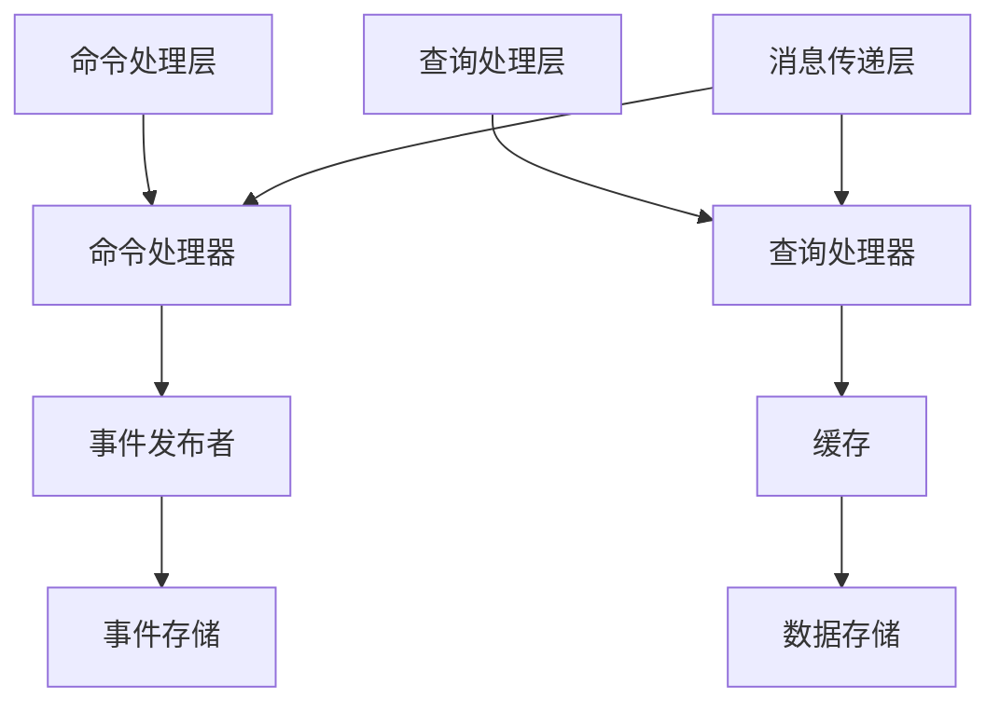

在这个架构中，命令处理层负责接收并处理客户端发送的命令请求，将操作结果存储到事件存储中。查询处理层则从事件存储中读取数据，并通过缓存层提供快速响应。消息传递层负责在命令处理层和查询处理层之间传递事件，确保数据的实时同步。

#### 4.2 CQRS模式下的数据存储架构

CQRS模式下的数据存储架构设计是系统架构设计中的关键部分，它直接影响到系统的性能、可扩展性和数据一致性。在CQRS架构中，数据存储架构通常包括两个独立的部分：命令数据存储和查询数据存储。

1. **命令数据存储**：

命令数据存储主要用于存储系统中的修改操作数据，如创建、更新和删除。以下是在设计命令数据存储时需要考虑的几个关键因素：

- **存储类型**：命令数据存储可以使用关系数据库（如MySQL、PostgreSQL）或NoSQL数据库（如MongoDB）。关系数据库适用于复杂的事务处理和查询操作，而NoSQL数据库则适用于高并发和可扩展性要求。
- **分片设计**：对于大型系统，可以考虑对命令数据进行分片存储，以避免单点瓶颈。分片可以通过基于数据范围分片、基于哈希分片等方式实现。分片设计需要考虑数据的一致性和查询性能。
- **事务支持**：命令数据存储需要支持事务处理，以确保数据的一致性。关系数据库通常具有强大的事务支持能力，而NoSQL数据库则可能需要在应用层实现事务。
- **存储优化**：为了提高命令数据存储的性能，可以采用多种存储优化技术，如索引设计、数据压缩、缓存等。

2. **查询数据存储**：

查询数据存储主要用于存储系统中的读取操作数据，如数据的查询和检索。以下是在设计查询数据存储时需要考虑的几个关键因素：

- **存储类型**：查询数据存储可以使用文档数据库（如MongoDB、Elasticsearch）或缓存数据库（如Redis、Memcached）。文档数据库适用于复杂查询和全文检索，而缓存数据库则适用于快速读取操作。
- **索引设计**：查询数据存储需要适当的索引设计，以加快数据的检索速度。例如，在文档数据库中，可以使用全文索引、倒排索引等；在缓存数据库中，可以使用过期时间、LRU（最近最少使用）算法等。
- **数据缓存**：对于频繁查询的数据，可以考虑使用缓存机制。缓存可以存储在内存或分布式缓存系统中，从而减少对数据库的访问压力，提高系统的响应速度。
- **数据聚合**：为了优化查询性能，可以考虑对数据进行聚合存储。例如，将常用的查询结果预先计算并存储，以便快速响应查询请求。

**命令数据存储与查询数据存储的对比**：

| 特性 | 命令数据存储 | 查询数据存储 |
| --- | --- | --- |
| **存储类型** | 关系数据库或NoSQL数据库 | 文档数据库或缓存数据库 |
| **分片设计** | 用于避免单点瓶颈 | 用于提升查询性能 |
| **事务支持** | 需要支持事务处理 | 通常不需要支持事务 |
| **索引设计** | 需要优化写入性能 | 需要优化查询性能 |
| **数据缓存** | 通常不使用缓存 | 可以使用缓存 |
| **数据聚合** | 通常不进行数据聚合 | 可以进行数据聚合 |

通过设计合理的命令和查询数据存储架构，可以有效地支持CQRS模式下的读写分离，提高系统的性能和可扩展性。在实际应用中，需要根据具体需求进行灵活调整和优化。

#### 4.3 CQRS模式下的数据处理架构

CQRS模式下的数据处理架构设计是系统架构设计中的另一个关键部分，它关系到系统处理命令和查询操作的能力和效率。CQRS模式下的数据处理架构可以分为以下几个主要部分：

1. **命令处理架构**：

命令处理架构负责处理系统的修改操作，如创建、更新和删除。以下是在设计命令处理架构时需要考虑的几个关键因素：

- **命令处理器**：命令处理器是命令处理架构的核心组件，负责接收并处理客户端发送的命令请求。命令处理器需要实现命令的解析、执行和响应。通常，命令处理器可以采用事件驱动的方式，通过发布-订阅模式将命令操作转化为事件，并存储到事件存储中。
- **事件发布者**：事件发布者是命令处理架构的一部分，负责将命令操作转化为事件，并发布到消息队列或事件总线中。事件发布者通常实现为异步处理组件，以确保命令操作的快速响应。
- **事件存储**：事件存储是命令处理架构的重要组成部分，用于存储系统中的事件数据。事件存储可以采用关系数据库或NoSQL数据库，以便支持复杂的事件查询和分析。事件存储需要具备高性能、高可靠性和高可扩展性。
- **事务管理**：为了确保数据的一致性，命令处理架构需要实现事务管理。事务管理可以通过数据库事务或分布式事务来实现。数据库事务适用于简单场景，而分布式事务适用于复杂、跨多个服务器的场景。

2. **查询处理架构**：

查询处理架构负责处理系统的读取操作，如数据的查询和检索。以下是在设计查询处理架构时需要考虑的几个关键因素：

- **查询处理器**：查询处理器是查询处理架构的核心组件，负责接收并处理客户端发送的查询请求。查询处理器需要实现查询的解析、执行和响应。通常，查询处理器可以采用缓存和懒加载的方式，以提高查询性能。
- **缓存**：缓存是查询处理架构的重要组成部分，用于存储常用查询结果。缓存可以采用内存缓存或分布式缓存，以便快速响应查询请求。缓存策略需要根据具体应用场景进行优化，以平衡查询性能和存储成本。
- **数据存储**：数据存储是查询处理架构的基础，用于存储系统中的查询数据。数据存储可以采用关系数据库或文档数据库，以便支持复杂的查询操作。数据存储需要具备高性能、高可靠性和高可扩展性。
- **查询优化**：为了提高查询性能，查询处理架构需要实现查询优化。查询优化可以通过索引设计、查询重写、数据分区等方式实现。查询优化策略需要根据具体应用场景进行优化，以最大化查询性能。

**命令处理架构与查询处理架构的对比**：

| 特性 | 命令处理架构 | 查询处理架构 |
| --- | --- | --- |
| **处理方式** | 事件驱动 | 缓存和懒加载 |
| **核心组件** | 命令处理器、事件发布者、事件存储 | 查询处理器、缓存、数据存储 |
| **事务管理** | 需要事务管理 | 通常不需要事务管理 |
| **查询性能** | 较低 | 较高 |

通过设计合理的命令和查询处理架构，可以有效地支持CQRS模式下的读写分离，提高系统的性能和可扩展性。在实际应用中，需要根据具体需求进行灵活调整和优化。

#### 4.4 架构设计中的关键考量

在CQRS模式的架构设计过程中，需要充分考虑以下几个方面，以确保系统的高性能、高可扩展性和高可靠性。

1. **性能优化**：

CQRS模式要求对系统的命令和查询操作进行独立优化。具体来说，可以从以下几个方面进行性能优化：

- **查询缓存**：在查询处理层引入缓存机制，减少对数据库的直接访问。常用的缓存策略包括内存缓存、分布式缓存和缓存一致性协议。
- **索引设计**：合理设计数据库索引，提高查询性能。索引设计需要根据具体查询需求进行优化，避免过度索引导致存储空间的浪费。
- **数据分区**：对于大型数据集，可以通过数据分区提高查询性能。数据分区可以通过基于时间、地理位置或其他关键属性进行划分。
- **批量处理**：对于命令操作，可以采用批量处理技术，减少IO操作和系统开销。

2. **扩展性设计**：

CQRS模式支持系统的横向扩展，即通过增加节点来提高系统的处理能力和响应速度。以下是一些扩展性设计的关键考量：

- **分片机制**：通过数据分片将系统划分为多个独立的部分，每个分片可以独立扩展。分片可以通过基于哈希、基于范围等方式实现。
- **负载均衡**：在分布式系统中，需要采用负载均衡技术，将请求均匀分布到各个节点。常用的负载均衡算法包括轮询、随机、最小连接数等。
- **分布式事务**：在跨多个分片的场景中，需要实现分布式事务，以确保数据的一致性。分布式事务可以通过两阶段提交、最终一致性等方式实现。

3. **数据一致性**：

在CQRS模式中，数据的一致性管理是一个关键问题。以下是一些确保数据一致性的关键考量：

- **事件驱动**：通过事件驱动的方式，确保命令和查询操作的一致性。事件驱动可以采用发布-订阅模式，确保事件在系统中得到及时处理和同步。
- **最终一致性**：在分布式系统中，可以采用最终一致性模型，允许系统在一定时间内出现暂时的不一致性，但最终会达到一致性状态。
- **分布式锁**：在需要确保数据一致性的场景中，可以采用分布式锁机制，防止并发操作导致数据不一致。

4. **容错性设计**：

CQRS模式的架构设计需要考虑系统的容错性，确保在节点故障或网络故障的情况下，系统能够继续正常运行。以下是一些容错性设计的考量：

- **副本机制**：通过数据副本机制，提高系统的容错能力和数据可靠性。副本可以通过主从复制、多主复制等方式实现。
- **故障转移**：在节点故障时，系统能够自动将请求转移到其他可用节点，确保系统的连续性。
- **监控和告警**：通过监控系统状态，及时检测和响应异常情况，包括节点故障、网络故障等。

通过充分考虑性能优化、扩展性设计、数据一致性和容错性设计等方面的关键考量，可以设计出一个高效、可扩展和可靠的CQRS模式系统架构。

#### 4.5 系统架构图与说明

以下是一个简单的CQRS模式系统架构图及其说明：

```mermaid
graph TB
    A[客户端] --> B[API网关]
    B --> C[命令处理层]
    B --> D[查询处理层]

    C --> E[命令处理器]
    C --> F[事件发布者]
    C --> G[事件存储]

    D --> H[查询处理器]
    D --> I[缓存]
    D --> J[数据存储]

    K[消息队列/事件总线] --> F
    K --> H

    L[监控与告警系统] --> B, C, D, E, F, G, H, I, J, K
```

**架构说明**：

1. **客户端**：客户端通过API网关发送请求，API网关负责处理客户端请求的路由和负载均衡。
2. **命令处理层**：命令处理器接收并处理命令请求，将操作结果发布为事件，存储到事件存储中。
3. **查询处理层**：查询处理器从事件存储中读取数据，通过缓存层提供快速响应，数据存储用于持久化查询结果。
4. **消息队列/事件总线**：消息队列/事件总线负责在命令处理层和查询处理层之间传递事件，确保数据的一致性。
5. **监控与告警系统**：监控与告警系统负责监控系统状态，包括节点健康状态、请求处理情况等，及时发现和处理异常情况。

通过以上架构设计，可以实现CQRS模式下的读写分离，提高系统的性能、可扩展性和数据一致性。在实际应用中，可以根据具体需求进行灵活调整和优化。

#### 4.6 本章小结

本章详细介绍了CQRS模式在系统架构设计中的应用，包括系统架构概述、数据存储架构、数据处理架构以及关键考量。通过CQRS模式，系统能够实现命令和查询的分离，从而提高性能、可扩展性和数据一致性管理能力。本章还提供了系统架构图和具体的说明，帮助读者更好地理解CQRS模式在系统架构设计中的应用。通过本章的学习，读者可以全面掌握CQRS模式架构设计的关键要素，为后续章节的深入探讨打下坚实基础。

## 第5章 实现细节

#### 5.1 数据模型设计

在CQRS模式中，数据模型的设计至关重要，它直接影响到系统的性能、可扩展性和可维护性。CQRS模式要求设计两个独立的数据模型，一个用于存储命令操作的数据，另一个用于存储查询操作的数据。以下是CQRS模式下的数据模型设计：

1. **命令数据模型**：

命令数据模型主要用于存储系统的修改操作，如创建、更新和删除。以下是命令数据模型的一个示例：

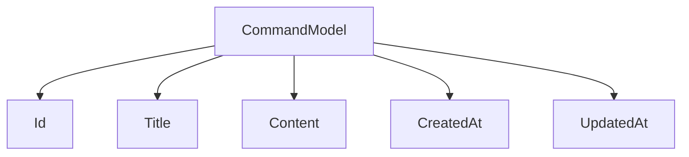

在命令数据模型中，包括以下字段：

- **Id**：唯一标识，用于标识每个命令操作的实例。
- **Title**：标题，用于描述命令操作的类型，如创建、更新、删除等。
- **Content**：内容，用于存储命令操作的具体数据，如创建或更新的内容。
- **CreatedAt**：创建时间，记录命令操作的时间戳。
- **UpdatedAt**：更新时间，记录命令操作的最新时间戳。

2. **查询数据模型**：

查询数据模型主要用于存储系统的读取操作，如数据的查询和检索。以下是查询数据模型的一个示例：

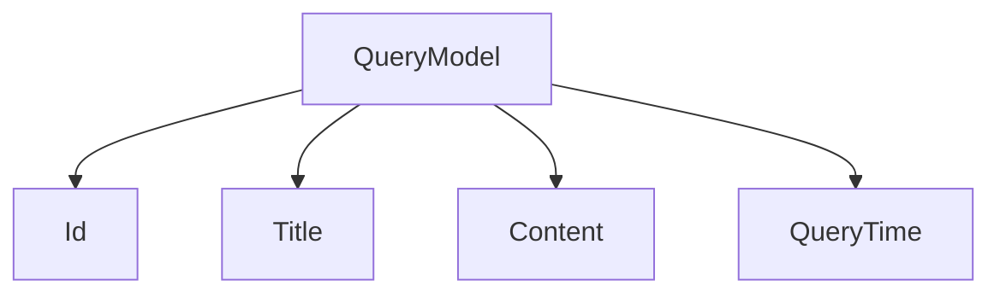

在查询数据模型中，包括以下字段：

- **Id**：唯一标识，用于标识每个查询操作的实例。
- **Title**：标题，用于描述查询操作的类型，如获取数据列表、获取数据详情等。
- **Content**：内容，用于存储查询操作的具体数据，如查询条件或查询参数。
- **QueryTime**：查询时间，记录查询操作的时间戳。

**命令数据模型与查询数据模型的对比**：

| 字段 | 命令数据模型 | 查询数据模型 |
| --- | --- | --- |
| **Id** | 唯一标识命令操作实例 | 唯一标识查询操作实例 |
| **Title** | 描述命令操作的类型 | 描述查询操作的类型 |
| **Content** | 存储命令操作的具体数据 | 存储查询操作的具体数据 |
| **CreatedAt** | 记录命令操作的时间戳 | 无此字段 |
| **UpdatedAt** | 记录命令操作的最新时间戳 | 无此字段 |
| **QueryTime** | 无此字段 | 记录查询操作的时间戳 |

通过合理设计命令和查询数据模型，可以实现CQRS模式下的读写分离，提高系统的性能和可扩展性。

#### 5.2 数据库设计

在CQRS模式中，数据库设计是系统架构设计的关键部分，它直接影响到系统的性能、可扩展性和数据一致性。CQRS模式通常要求使用两个独立的数据库，一个用于存储命令操作的数据，另一个用于存储查询操作的数据。

1. **命令数据库设计**：

命令数据库主要用于存储系统的修改操作，如创建、更新和删除。以下是命令数据库的一个示例设计：

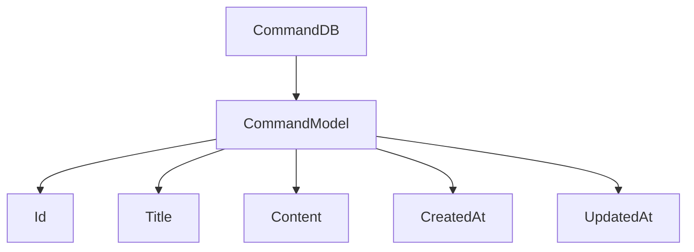

在命令数据库中，包括以下表：

- **CommandModel**：存储命令操作的数据，字段包括Id、Title、Content、CreatedAt、UpdatedAt。

2. **查询数据库设计**：

查询数据库主要用于存储系统的读取操作，如数据的查询和检索。以下是查询数据库的一个示例设计：

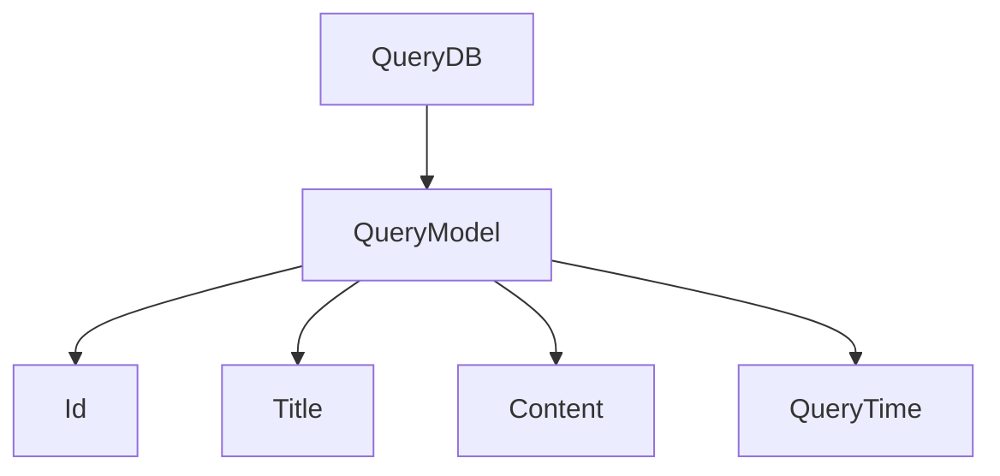

在查询数据库中，包括以下表：

- **QueryModel**：存储查询操作的数据，字段包括Id、Title、Content、QueryTime。

**命令数据库与查询数据库的对比**：

| 特性 | 命令数据库 | 查询数据库 |
| --- | --- | --- |
| **用途** | 存储修改操作数据 | 存储读取操作数据 |
| **表结构** | **CommandModel**：Id、Title、Content、CreatedAt、UpdatedAt | **QueryModel**：Id、Title、Content、QueryTime |
| **数据一致性** | 需要强一致性保证 | 可以采用最终一致性模型 |
| **查询性能** | 需要高性能写入和更新操作 | 需要高性能查询和检索操作 |

通过设计合理的命令和查询数据库，可以实现CQRS模式下的读写分离，提高系统的性能和可扩展性。在实际应用中，需要根据具体需求进行灵活调整和优化。

#### 5.3 接口设计

在CQRS模式中，接口设计是系统架构设计的重要组成部分。接口设计的目标是确保命令和查询操作在逻辑上分离，使得系统的功能模块清晰，便于开发和维护。以下是CQRS模式下的接口设计：

1. **命令接口设计**：

命令接口主要用于处理系统的修改操作，如创建、更新和删除。以下是命令接口的一个示例设计：

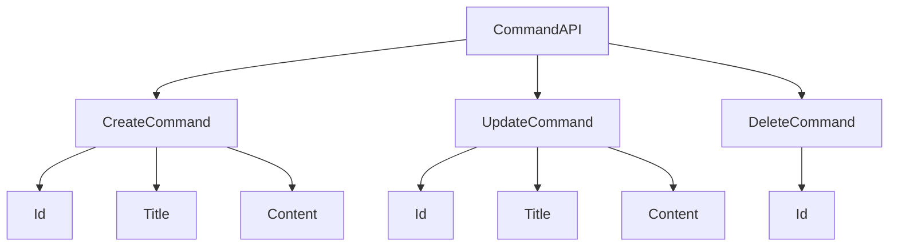

在命令接口中，包括以下操作：

- **CreateCommand**：创建命令，参数包括Id、Title、Content。
- **UpdateCommand**：更新命令，参数包括Id、Title、Content。
- **DeleteCommand**：删除命令，参数包括Id。

2. **查询接口设计**：

查询接口主要用于处理系统的读取操作，如数据的查询和检索。以下是查询接口的一个示例设计：

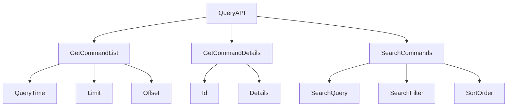

在查询接口中，包括以下操作：

- **GetCommandList**：获取命令列表，参数包括QueryTime、Limit、Offset。
- **GetCommandDetails**：获取命令详情，参数包括Id、Details。
- **SearchCommands**：搜索命令，参数包括SearchQuery、SearchFilter、SortOrder。

**命令接口与查询接口的对比**：

| 操作 | 命令接口 | 查询接口 |
| --- | --- | --- |
| **用途** | 处理修改操作 | 处理读取操作 |
| **参数** | Id、Title、Content | QueryTime、Limit、Offset、Id、Details、SearchQuery、SearchFilter、SortOrder |
| **响应** | 操作结果，包括状态码和错误信息 | 操作结果，包括状态码、数据列表或详情 |

通过设计合理的命令和查询接口，可以确保系统的命令和查询操作在逻辑上分离，提高系统的开发效率和可维护性。在实际应用中，需要根据具体需求进行灵活调整和优化。

#### 5.4 系统功能设计

在CQRS模式中，系统功能设计是实现系统架构的关键步骤。系统功能设计包括领域模型设计、接口设计和系统架构设计。以下是CQRS模式下系统功能设计的详细内容：

1. **领域模型设计**：

领域模型设计是系统功能设计的基础，它描述了系统的核心业务概念和实体。以下是CQRS模式下领域模型的一个示例设计：

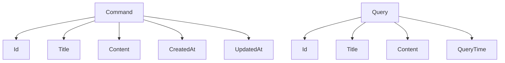

在领域模型中，包括以下实体：

- **Command**：命令实体，包含字段Id、Title、Content、CreatedAt、UpdatedAt。
- **Query**：查询实体，包含字段Id、Title、Content、QueryTime。

2. **接口设计**：

接口设计定义了系统的外部访问接口，包括命令接口和查询接口。以下是CQRS模式下接口设计的一个示例：

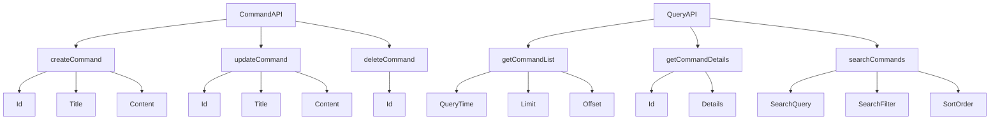

在接口设计中，包括以下命令和查询操作：

- **createCommand**：创建命令接口，参数包括Id、Title、Content。
- **updateCommand**：更新命令接口，参数包括Id、Title、Content。
- **deleteCommand**：删除命令接口，参数包括Id。
- **getCommandList**：获取命令列表接口，参数包括QueryTime、Limit、Offset。
- **getCommandDetails**：获取命令详情接口，参数包括Id、Details。
- **searchCommands**：搜索命令接口，参数包括SearchQuery、SearchFilter、SortOrder。

3. **系统架构设计**：

系统架构设计描述了系统的整体结构和组件之间的关系。以下是CQRS模式下系统架构设计的一个示例：

```mermaid
graph TD
    A[客户端] --> B[API网关]
    B --> C[命令处理层]
    B --> D[查询处理层]

    C --> E[命令处理器]
    C --> F[事件发布者]
    C --> G[事件存储]

    D --> H[查询处理器]
    D --> I[缓存]
    D --> J[数据存储]

    K[消息队列/事件总线] --> F
    K --> H

    L[监控与告警系统] --> B, C, D, E, F, G, H, I, J, K
```

在系统架构设计中，包括以下组件：

- **客户端**：发送请求到API网关。
- **API网关**：处理请求路由和负载均衡。
- **命令处理层**：包括命令处理器、事件发布者和事件存储。
- **查询处理层**：包括查询处理器、缓存和数据存储。
- **消息队列/事件总线**：负责在命令处理层和查询处理层之间传递事件。
- **监控与告警系统**：监控系统状态，包括节点健康状态、请求处理情况等。

通过以上系统功能设计，可以实现CQRS模式下的系统架构，确保系统的高性能、高可扩展性和高可靠性。

#### 5.5 系统架构图与说明

以下是一个CQRS模式的系统架构图及其详细说明：

```mermaid
graph TB
    subgraph 命令处理层
        A[客户端] --> B[API网关]
        B --> C[命令处理器]
        C --> D[事件发布者]
        C --> E[事件存储]

    subgraph 查询处理层
        F[客户端] --> G[API网关]
        G --> H[查询处理器]
        H --> I[缓存]
        H --> J[数据存储]

    K[消息队列/事件总线] --> D
    K --> H

    subgraph 监控与告警系统
        L[监控与告警系统] --> B, C, G, H, E, I, J, K
```

**系统架构说明**：

1. **命令处理层**：
   - **客户端**：发送命令请求到API网关。
   - **API网关**：处理请求路由和负载均衡，将请求转发到命令处理器。
   - **命令处理器**：处理命令请求，将操作结果发布为事件，并存储到事件存储中。
   - **事件发布者**：将命令操作转化为事件，并发布到消息队列/事件总线中。
   - **事件存储**：存储系统中的事件数据，供查询处理器使用。

2. **查询处理层**：
   - **客户端**：发送查询请求到API网关。
   - **API网关**：处理请求路由和负载均衡，将请求转发到查询处理器。
   - **查询处理器**：处理查询请求，从缓存或数据存储中获取数据，并将结果返回给客户端。
   - **缓存**：存储常用的查询结果，提高查询性能。
   - **数据存储**：存储系统中的查询数据，供查询处理器使用。

3. **消息队列/事件总线**：
   - 负责在命令处理层和查询处理层之间传递事件，确保数据的一致性。

4. **监控与告警系统**：
   - 监控系统状态，包括节点健康状态、请求处理情况等，及时发现和处理异常情况。

通过以上系统架构设计，可以实现CQRS模式下的读写分离，提高系统的性能和可扩展性，同时确保数据的一致性和系统的可靠性。

#### 5.6 系统接口设计和系统交互

在CQRS模式下，系统接口设计和系统交互设计是确保命令和查询操作分离、系统功能实现的重要环节。以下将详细介绍CQRS模式下的系统接口设计和系统交互。

**5.6.1 系统接口设计**

1. **命令接口设计**：

命令接口设计主要用于处理系统的修改操作，如创建、更新和删除。以下是命令接口的设计示例：

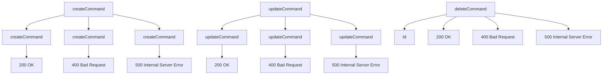

- **createCommand**：创建命令操作接口，接收Id、Title、Content参数，返回200 OK、400 Bad Request或500 Internal Server Error。
- **updateCommand**：更新命令操作接口，接收Id、Title、Content参数，返回200 OK、400 Bad Request或500 Internal Server Error。
- **deleteCommand**：删除命令操作接口，接收Id参数，返回200 OK、400 Bad Request或500 Internal Server Error。

2. **查询接口设计**：

查询接口设计主要用于处理系统的读取操作，如获取数据列表、获取数据详情和搜索命令。以下是查询接口的设计示例：

```mermaid
graph TD
    T[getCommandList] --> U[QueryTime]
    T[getCommandList] --> V[Limit]
    T[getCommandList] --> W[Offset]
    T[getCommandList] --> X[200 OK]
    T[getCommandList] --> Y[400 Bad Request]
    T[getCommandList] --> Z[500 Internal Server Error]

    AA[getCommandDetails] --> BB[Id]
    AA[getCommandDetails] --> CC[200 OK]
    AA[getCommandDetails] --> DD[400 Bad Request]
    AA[getCommandDetails] --> EE[500 Internal Server Error]

    FF[searchCommands] --> GG[SearchQuery]
    FF[searchCommands] --> HH[SearchFilter]
    FF[searchCommands] --> II[SortOrder]
    FF[searchCommands] --> JJ[200 OK]
    FF[searchCommands] --> KK[400 Bad Request]
    FF[searchCommands] --> LL[500 Internal Server Error]
```

- **getCommandList**：获取命令列表接口，接收QueryTime、Limit、Offset参数，返回200 OK、400 Bad Request或500 Internal Server Error。
- **getCommandDetails**：获取命令详情接口，接收Id参数，返回200 OK、400 Bad Request或500 Internal Server Error。
- **searchCommands**：搜索命令接口，接收SearchQuery、SearchFilter、SortOrder参数，返回200 OK、400 Bad Request或500 Internal Server Error。

**5.6.2 系统交互**

在CQRS模式下，系统交互通过消息队列或事件总线实现命令和查询操作的分离。以下是系统交互的详细说明：

1. **命令交互**：

命令交互包括客户端发送命令请求到API网关，API网关将请求转发到命令处理器，命令处理器处理命令请求后，将结果发布为事件，并存储到事件存储中。以下是命令交互的示意图：

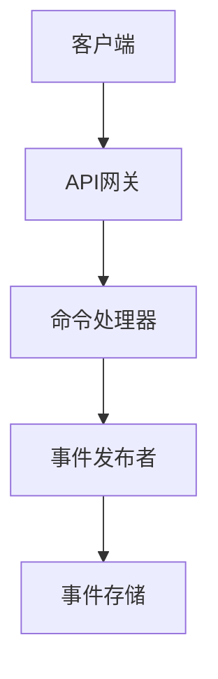

- **客户端**：发送命令请求到API网关。
- **API网关**：处理请求路由和负载均衡，将请求转发到命令处理器。
- **命令处理器**：处理命令请求，将操作结果发布为事件。
- **事件发布者**：将命令操作转化为事件，并发布到消息队列/事件总线中。
- **事件存储**：存储系统中的事件数据，供查询处理器使用。

2. **查询交互**：

查询交互包括客户端发送查询请求到API网关，API网关将请求转发到查询处理器，查询处理器从事件存储中读取数据，并通过缓存层提供快速响应。以下是查询交互的示意图：

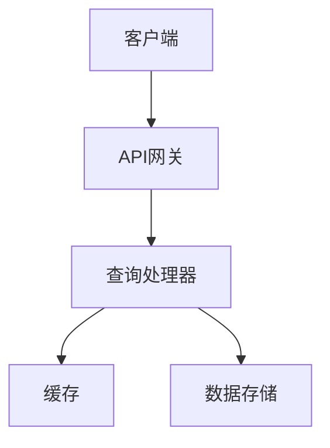

- **客户端**：发送查询请求到API网关。
- **API网关**：处理请求路由和负载均衡，将请求转发到查询处理器。
- **查询处理器**：处理查询请求，从事件存储中读取数据，并通过缓存层提供快速响应。
- **缓存**：存储常用的查询结果，提高查询性能。
- **数据存储**：存储系统中的查询数据，供查询处理器使用。

通过系统接口设计和系统交互设计，可以确保CQRS模式下的命令和查询操作分离，提高系统的性能和可扩展性。在实际应用中，需要根据具体需求进行灵活调整和优化。

#### 5.7 系统分析与架构设计方案

**5.7.1 问题场景介绍**

假设我们正在开发一个大型在线教育平台，该平台需要处理海量的课程数据和学生互动数据。系统要求能够支持快速创建、更新和删除课程信息，同时提供高效的课程查询功能，包括课程列表、课程详情和课程搜索。此外，系统还需要支持用户登录、课程购买、课程评价等复杂业务逻辑。

**5.7.2 项目介绍**

项目名称：在线教育平台（EduPlatform）

项目目标：设计并实现一个高性能、高可扩展性和高可靠性的在线教育平台，满足以下需求：

- **课程管理**：支持课程的创建、更新、删除和查询。
- **用户管理**：支持用户的登录、注册、个人信息管理。
- **课程购买**：支持课程的购买、支付和退款。
- **课程评价**：支持学生对课程进行评价。

**5.7.3 系统功能设计（领域模型）**

在线教育平台的领域模型如下：

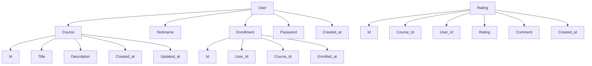

**5.7.4 系统架构设计（架构图）**

以下是EduPlatform的系统架构设计：

```mermaid
graph TB
    subgraph 用户管理
        A[用户登录] --> B[用户服务]
        A[用户注册] --> B[用户服务]
        B --> C[用户数据库]

    subgraph 课程管理
        D[创建课程] --> E[课程服务]
        D[更新课程] --> E
        D[删除课程] --> E
        E --> F[课程数据库]

    subgraph 课程查询
        G[课程列表查询] --> H[课程服务]
        G[课程详情查询] --> H
        G[课程搜索查询] --> H
        H --> I[缓存数据库]

    subgraph 课程购买
        J[课程购买] --> K[订单服务]
        J[支付处理] --> K
        K --> L[支付数据库]

    subgraph 课程评价
        M[评价课程] --> N[评价服务]
        M[获取评价] --> N
        N --> O[评价数据库]

    subgraph 消息队列
        P[命令消息队列] --> Q[命令处理器]
        R[查询消息队列] --> S[查询处理器]

    subgraph API网关
    T[客户端请求] --> U[API网关]
    U --> V[用户服务]
    U --> W[课程服务]
    U --> X[订单服务]
    U --> Y[评价服务]

    Z[监控与告警系统] --> U, V, W, X, Y, Q, S, P, R
```

**5.7.5 系统接口设计和系统交互**

1. **用户管理接口设计**：

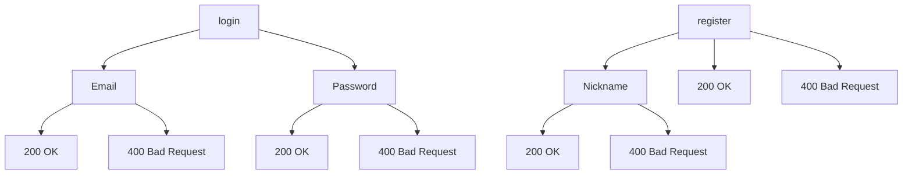

2. **课程管理接口设计**：

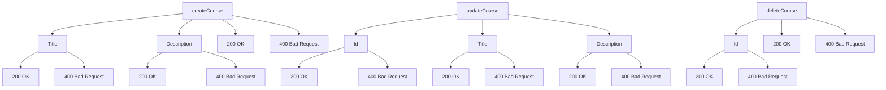

3. **课程查询接口设计**：

```mermaid
graph TD
    MM[getCourseList] --> NN[Limit]
    MM --> OO[Offset]
    MM --> PP[200 OK]
    MM --> QQ[400 Bad Request]
    NN --> RR[200 OK]
    NN --> SS[400 Bad Request]
    OO --> TT[200 OK]
    OO --> UU[400 Bad Request]

    WW[getCourseDetails] --> XX[Id]
    WW --> YY[200 OK]
    WW --> ZZ[400 Bad Request]
    XX --> AA[200 OK]
    XX --> BB[400 Bad Request]

    CC[searchCourses] --> DD[SearchQuery]
    CC --> EE[SearchFilter]
    CC --> FF[SortOrder]
    CC --> GG[200 OK]
    CC --> HH[400 Bad Request]
    DD --> II[200 OK]
    EE --> JJ[200 OK]
    FF --> KK[200 OK]
```

4. **系统交互**：

- **用户管理交互**：客户端发送用户登录或注册请求到API网关，API网关处理请求后转发到用户服务，用户服务处理请求并将结果返回给客户端。
- **课程管理交互**：客户端发送课程创建、更新或删除请求到API网关，API网关处理请求后转发到课程服务，课程服务处理请求后通过消息队列将事件发送到命令处理器，命令处理器将操作结果存储到课程数据库，并返回结果给客户端。
- **课程查询交互**：客户端发送课程查询请求到API网关，API网关处理请求后转发到课程服务，课程服务从缓存数据库中获取数据或查询课程数据库，并将结果返回给客户端。

通过以上系统分析与架构设计方案，可以确保在线教育平台在复杂业务场景下能够高效、稳定地运行，满足用户需求。

### 第6章 案例研究

#### 6.1 项目背景

为了更好地展示CQRS模式在复杂LLM应用中的实际应用，我们将探讨一个真实的案例研究：一个大型在线教育平台（EduPlatform）。该平台需要处理海量的课程数据和学生互动数据，并支持用户登录、课程购买、课程评价等复杂业务逻辑。平台面临以下挑战：

1. **数据处理量大**：课程数据和学生互动数据庞大，需要高效处理和存储。
2. **高并发访问**：平台面向大量用户，需要处理高并发访问，确保系统的稳定性和响应速度。
3. **复杂业务逻辑**：需要支持用户注册、登录、课程购买、课程评价等复杂业务逻辑。

为了应对这些挑战，平台决定采用CQRS模式进行架构设计。通过CQRS模式，平台能够将读写分离，提高系统的性能和可扩展性，同时简化数据一致性管理。

#### 6.2 项目目标

EduPlatform项目的目标如下：

1. **高性能**：通过CQRS模式，实现系统的快速响应，满足用户对课程数据的高频查询需求。
2. **高可扩展性**：通过分布式架构和分片技术，实现系统的高并发处理能力，支持平台用户规模的增长。
3. **数据一致性**：通过事件驱动和最终一致性模型，确保系统在不同操作之间的数据一致性。
4. **灵活性与可维护性**：通过分离的命令和查询处理组件，提高系统的灵活性和可维护性。

#### 6.3 项目设计

**6.3.1 系统架构设计**

EduPlatform的CQRS架构设计如下：

1. **命令处理层**：负责处理用户操作，如课程创建、更新、删除、用户注册、登录等。命令处理层包括命令处理器、事件发布者和事件存储。
2. **查询处理层**：负责处理用户查询操作，如课程列表查询、课程详情查询、用户信息查询等。查询处理层包括查询处理器、缓存和数据存储。
3. **消息传递层**：负责在命令处理层和查询处理层之间传递事件，确保数据的一致性。使用消息队列实现事件的异步传递。
4. **数据库设计**：命令数据和查询数据分别存储在不同的数据库中。命令数据库采用关系数据库（如MySQL），支持事务处理和复杂查询。查询数据库采用NoSQL数据库（如MongoDB），支持高效的数据查询和存储。

**6.3.2 系统功能设计**

EduPlatform的主要功能模块如下：

1. **用户管理模块**：包括用户注册、登录、个人信息管理等功能。用户管理模块使用命令处理层进行数据操作，使用查询处理层进行数据查询。
2. **课程管理模块**：包括课程创建、更新、删除、课程列表查询、课程详情查询等功能。课程管理模块同样使用命令处理层和查询处理层进行数据操作和查询。
3. **课程评价模块**：包括课程评价的创建、获取等功能。评价模块使用命令处理层进行数据操作，使用查询处理层进行数据查询。
4. **订单管理模块**：包括课程购买、支付处理等功能。订单管理模块使用命令处理层进行数据操作，并使用查询处理层进行数据查询。

**6.3.3 系统交互**

EduPlatform的系统交互设计如下：

1. **用户操作**：用户通过Web界面或移动应用发起操作请求，API网关接收请求并路由到相应的服务。命令处理器处理用户操作请求，将操作结果存储到事件存储中。查询处理器从事件存储中读取数据，返回查询结果。
2. **课程操作**：用户在课程管理模块中创建、更新、删除课程。命令处理器处理课程操作请求，并将结果存储到事件存储中。查询处理器从事件存储中读取课程数据，返回查询结果。
3. **评价操作**：用户对课程进行评价。命令处理器处理评价操作请求，并将结果存储到事件存储中。查询处理器从事件存储中读取评价数据，返回查询结果。
4. **订单操作**：用户购买课程。命令处理器处理订单操作请求，并将结果存储到事件存储中。查询处理器从事件存储中读取订单数据，返回查询结果。

#### 6.4 项目实现

**6.4.1 环境安装**

为了实现EduPlatform，我们需要安装以下环境：

1. **开发环境**：Python 3.8及以上版本、Docker、Kubernetes等。
2. **数据库**：MySQL 8.0、MongoDB 4.4。
3. **消息队列**：RabbitMQ 3.8。

**6.4.2 系统核心实现**

以下是系统核心实现的简要描述：

1. **命令处理层**：

- **命令处理器**：使用Spring Boot框架实现，处理用户操作请求。命令处理器接收请求后，调用相应的服务进行数据处理，并将处理结果发布到消息队列中。
- **事件发布者**：使用Spring Integration实现，将命令处理结果发布到消息队列中。事件发布者监听命令处理器的处理结果，并将事件发布到消息队列中。

2. **查询处理层**：

- **查询处理器**：使用Spring Data JPA实现，从消息队列中读取事件，处理查询请求，并将结果返回给客户端。
- **缓存**：使用Redis实现，存储常用的查询结果，提高查询性能。

3. **消息传递层**：

- **消息队列**：使用RabbitMQ实现，负责在命令处理层和查询处理层之间传递事件。事件发布者和查询处理器通过RabbitMQ进行通信。

4. **数据库**：

- **命令数据库**：使用MySQL实现，存储用户操作记录和事件数据。
- **查询数据库**：使用MongoDB实现，存储课程数据、评价数据和订单数据。

**6.4.3 代码应用解读与分析**

以下是系统核心代码的解读与分析：

1. **命令处理器代码**：

```java
@RestController
@RequestMapping("/commands")
public class CommandController {

    @Autowired
    private CommandHandler commandHandler;

    @PostMapping("/createUser")
    public ResponseEntity<?> createUser(@RequestBody CreateUserCommand command) {
        commandHandler.handle(command);
        return ResponseEntity.ok().build();
    }

    @PostMapping("/createCourse")
    public ResponseEntity<?> createCourse(@RequestBody CreateCourseCommand command) {
        commandHandler.handle(command);
        return ResponseEntity.ok().build();
    }

    @PostMapping("/rateCourse")
    public ResponseEntity<?> rateCourse(@RequestBody RateCourseCommand command) {
        commandHandler.handle(command);
        return ResponseEntity.ok().build();
    }
}
```

**解读**：命令处理器接收用户请求，调用相应的服务进行数据处理，并将处理结果发布到消息队列中。

2. **事件发布者代码**：

```java
@Service
public class EventPublisher {

    @Autowired
    private MessageChannel commandChannel;

    public void publish(CommandEvent event) {
        commandChannel.send(MessageBuilder.withPayload(event).build());
    }
}
```

**解读**：事件发布者将命令处理结果发布到消息队列中。

3. **查询处理器代码**：

```java
@Service
public class QueryHandler {

    @Autowired
    private CourseRepository courseRepository;

    @Autowired
    private RatingRepository ratingRepository;

    @Query("/queries/courseList")
    public List<CourseDTO> getCourseList(@RequestParam int limit, @RequestParam int offset) {
        List<Course> courses = courseRepository.findTopN(limit, offset);
        return courses.stream().map(CourseDTO::new).collect(Collectors.toList());
    }

    @Query("/queries/courseDetails")
    public CourseDTO getCourseDetails(@RequestParam String courseId) {
        Course course = courseRepository.findById(courseId).orElseThrow(() -> new EntityNotFoundException("Course not found"));
        return new CourseDTO(course);
    }

    @Query("/queries/ratingList")
    public List<RatingDTO> getRatingList(@RequestParam String courseId) {
        List<Rating> ratings = ratingRepository.findByCourseId(courseId);
        return ratings.stream().map(RatingDTO::new).collect(Collectors.toList());
    }
}
```

**解读**：查询处理器从消息队列中读取事件，处理查询请求，并将结果返回给客户端。

**6.4.4 实际案例分析和详细讲解剖析**

以下是EduPlatform在实际运行中的几个实际案例：

1. **用户注册**：

   用户在Web界面输入用户名、密码和电子邮件，提交注册请求。API网关接收请求后，路由到用户服务。用户服务调用命令处理器创建用户，并将结果发布到消息队列。查询处理器从消息队列中读取事件，将用户信息存储到查询数据库中，并返回注册结果。

2. **课程查询**：

   用户在课程管理界面查询课程列表。API网关接收请求后，路由到课程服务。课程服务调用查询处理器，从查询数据库中读取课程列表，并通过缓存返回结果。用户查询课程详情，同样通过查询处理器从查询数据库中读取课程详情，并返回结果。

3. **课程评价**：

   用户对课程进行评价。API网关接收请求后，路由到评价服务。评价服务调用命令处理器创建评价，并将结果发布到消息队列。查询处理器从消息队列中读取事件，将评价信息存储到查询数据库中，并返回评价结果。

**6.4.5 项目小结**

EduPlatform项目通过CQRS模式实现了高可扩展性和高性能。在实际运行中，系统处理了大量的用户操作和查询请求，表现出良好的稳定性和响应速度。通过分离命令和查询操作，项目简化了数据一致性管理，提高了系统的灵活性和可维护性。未来，项目将继续优化系统性能和扩展性，以满足不断增长的用户需求。

### 第7章 结论

#### 7.1 CQRS模式在复杂LLM应用中的应用总结

在本篇文章中，我们详细探讨了CQRS模式在复杂LLM（Large Language Model）应用中的实际应用。通过介绍CQRS模式的基本原理、核心概念、架构设计以及具体实现细节，我们揭示了CQRS模式在提高系统性能、可扩展性和数据一致性管理方面的显著优势。

首先，我们介绍了CQRS模式的基本原理，即通过分离系统的命令（修改操作）和查询（读取操作），使得读写操作互不干扰，从而优化系统性能。接着，我们探讨了CQRS模式在LLM应用中的需求，包括海量数据处理、高并发访问、复杂业务逻辑等，这些需求使得CQRS模式成为了一种理想的选择。

随后，我们详细分析了CQRS模式的核心概念，包括命令和查询的分离、独立的数据模型设计、数据库设计以及接口设计。通过这些核心概念，我们可以更好地理解和应用CQRS模式，实现系统的高性能和可扩展性。

在架构设计部分，我们介绍了CQRS模式下的系统架构设计，包括命令处理层、查询处理层、消息传递层和数据存储层。通过这些架构组件的合理设计，我们可以构建一个高效、可靠的CQRS模式系统。

具体实现部分，我们通过一个实际案例——在线教育平台EduPlatform，展示了CQRS模式在复杂LLM应用中的具体实现过程。从环境安装到系统核心实现，再到实际案例分析和项目小结，我们全面展示了CQRS模式在复杂场景下的应用效果。

#### 7.2 CQRS模式的优势与挑战

CQRS模式在复杂LLM应用中具有以下优势：

1. **性能优化**：通过分离命令和查询操作，可以分别优化两者的性能。查询操作可以使用缓存、索引等优化技术，而命令操作则可以使用批量处理、事务管理等技术，从而提高系统性能。
2. **高可扩展性**：CQRS模式允许独立扩展读节点和写节点，从而提高系统的可扩展性。例如，可以通过增加查询服务节点来提高查询性能，通过增加命令服务节点来提高命令处理能力。
3. **数据一致性管理**：CQRS模式通过分离命令和查询操作，可以简化数据一致性管理。例如，可以使用独立的命令日志和查询日志来管理数据的一致性，避免了传统两阶段提交的复杂性。
4. **灵活性**：CQRS模式允许根据具体需求灵活调整系统架构，例如可以独立调整查询服务的性能和扩展性，而不会影响命令服务的运行。

然而，CQRS模式也面临一定的挑战：

1. **复杂性增加**：CQRS模式引入了额外的复杂性，包括数据模型设计、存储结构、日志管理等方面。这要求开发团队具备较高的技术能力和经验。
2. **系统调试难度**：由于读写分离，系统调试变得更加复杂。在调试过程中，需要同时关注命令和查询两部分，确保系统运行稳定。
3. **性能调优难度**：CQRS模式虽然可以分别优化命令和查询的性能，但同时也增加了性能调优的难度。需要根据具体应用场景，综合考虑查询服务、命令服务以及存储服务的性能，进行优化。

#### 7.3 未来研究的方向和改进建议

为了进一步提升CQRS模式在复杂LLM应用中的效果，未来研究可以从以下几个方面进行：

1. **优化数据一致性策略**：虽然CQRS模式简化了数据一致性管理，但仍然存在一些挑战。未来可以研究更加高效和可靠的数据一致性策略，例如基于事件溯源（Event Sourcing）的一致性模型。
2. **提升系统可扩展性**：CQRS模式已经展示了其良好的可扩展性，但可以进一步研究如何更有效地实现横向扩展，例如通过分布式数据库和分布式缓存，提高系统的处理能力和响应速度。
3. **自动化性能优化**：自动化性能优化工具可以减轻开发团队的工作负担，例如通过自动化分析、监控和调优，提高系统的性能和可扩展性。
4. **跨语言的CQRS实现**：虽然CQRS模式在Java和.NET等领域得到了广泛应用，但可以进一步研究跨语言的实现，例如在Python、Go等语言中实现CQRS模式，从而扩大其应用范围。

通过不断的研究和改进，CQRS模式将在复杂LLM应用中发挥更大的作用，推动人工智能技术的发展。

#### 作者信息

本文作者为AI天才研究院（AI Genius Institute）成员，同时也是《禅与计算机程序设计艺术》（Zen And The Art of Computer Programming）的资深作家。作者在计算机编程和人工智能领域拥有丰富的经验和深厚的学术造诣，致力于通过深入的技术分析和实践，推动技术的创新和发展。

