                 

### 《DevOps在敏捷LLM工程架构中的关键作用》

> 关键词：DevOps, 敏捷开发, 语言模型, 工程架构, 自动化部署

> 摘要：本文深入探讨了DevOps在敏捷大型语言模型（LLM）工程架构中的关键作用。通过详细阐述DevOps的起源、核心概念，以及其在敏捷开发中的应用，本文揭示了LLM工程架构的挑战与需求。文章随后分析了DevOps与敏捷开发之间的联系，并对比了DevOps与LLM工程架构的特点。通过一系列的算法原理讲解、流程图和Python源代码示例，本文提供了对DevOps在敏捷LLM工程架构中应用的具体实现和数学模型解析。最终，本文总结了最佳实践，并对未来趋势进行了展望，为开发者提供了全面的指导。

## 目录大纲

1. 第一部分：背景介绍
    1.1 问题背景
        1.1.1 DevOps的起源与发展
        1.1.2 敏捷开发与DevOps的关系
        1.1.3 LLM工程架构的挑战与需求
    1.2 问题解决
        1.2.1 DevOps的核心概念与原则
        1.2.2 敏捷开发的方法论与工具
        1.2.3 LLM工程架构的关键要素
    1.3 边界与外延
        1.3.1 DevOps与其他技术的区别
        1.3.2 敏捷开发在不同领域的应用
        1.3.3 LLM工程架构的未来趋势
    1.4 本章小结
    1.5 拓展阅读

2. 第二部分：核心概念与联系
    2.1 DevOps核心概念
        2.1.1 DevOps的基本原理
        2.1.2 DevOps的关键原则
    2.2 敏捷开发方法论
        2.2.1 敏捷开发的核心原则
        2.2.2 敏捷开发的工具
    2.3 LLM工程架构核心要素
        2.3.1 LLM模型架构
        2.3.2 LLM工程架构的关键环节
    2.4 概念属性特征对比表格
    2.5 ER实体关系图架构
    2.6 本章小结
    2.7 拓展阅读

3. 第三部分：算法原理讲解
    3.1 DevOps算法原理
        3.1.1 持续集成算法原理
        3.1.2 持续交付算法原理
    3.2 敏捷开发算法原理
        3.2.1 用户故事算法原理
        3.2.2 迭代算法原理
    3.3 LLM工程架构算法原理
        3.3.1 模型训练算法原理
        3.3.2 模型部署算法原理
    3.4 算法mermaid流程图
    3.5 Python源代码讲解
    3.6 数学模型与公式
    3.7 系统分析与架构设计方案

4. 第四部分：项目实战
    4.1 环境安装
    4.2 系统核心实现源代码
    4.3 代码应用解读与分析
    4.4 实际案例分析和详细讲解剖析
    4.5 项目小结

5. 第五部分：最佳实践 tips、小结、注意事项、拓展阅读

---

### 第一部分：背景介绍

#### 1.1 问题背景

在当今快速发展的技术时代，软件工程面临着前所未有的挑战。传统软件开发模式已经难以满足日益增长的复杂性和动态变化的需求。尤其是大型语言模型（LLM）工程，其规模庞大、结构复杂，需要高效、可靠的开发与部署流程。DevOps作为一种新兴的软件开发模式，旨在通过集成开发和运维团队，实现持续集成和持续交付，从而提升软件交付质量和速度。

##### 1.1.1 DevOps的起源与发展

DevOps一词是由Development（开发）和Operations（运维）组合而成的，旨在解决软件开发和运维之间的壁垒。这一概念起源于2000年代末期，当时敏捷开发方法在软件开发领域取得了显著的成功。然而，敏捷开发方法主要关注开发过程，而忽视了开发和运维之间的衔接。为了解决这一问题，一些敏捷开发者和运维工程师开始探索新的工作模式，DevOps理念应运而生。

DevOps的核心思想是将开发和运维结合起来，通过自动化工具和最佳实践，实现持续集成、持续交付和基础设施即代码。这一理念在2010年代初期得到了广泛认可，并逐渐发展成为现代软件工程的关键组成部分。

##### 1.1.2 敏捷开发与DevOps的关系

敏捷开发是一种以人为核心、迭代和渐进的开发方法。其核心原则包括用户需求、团队合作、响应变化和持续交付。敏捷开发方法在提高软件质量和客户满意度方面取得了显著成效，但也面临着一些挑战，如开发与运维之间的协作不畅。

DevOps正是为了解决这些问题而诞生的。通过将开发和运维团队整合，DevOps实现了开发和运维的无缝衔接，从而提高了软件交付的效率和可靠性。敏捷开发和DevOps之间的互补关系，使得它们在软件工程中相辅相成，共同推动着软件开发模式的进步。

##### 1.1.3 LLM工程架构的挑战与需求

大型语言模型（LLM）是一种复杂的人工智能模型，用于处理自然语言任务，如文本生成、语言翻译和文本分类等。随着LLM在各个领域的广泛应用，其工程架构面临着一系列挑战：

1. **数据规模**：LLM需要处理大量文本数据，这要求数据处理和存储系统具有高效和可扩展性。
2. **计算资源**：LLM的训练和推理过程需要大量计算资源，特别是在模型规模不断增大的情况下。
3. **模型优化**：为了提高模型的性能和效率，需要不断进行模型优化和调优。
4. **部署与监控**：LLM模型的部署和监控是确保其正常运行的关键，需要具备高可用性和可扩展性。

针对这些挑战，DevOps提供了有效的解决方案。通过自动化工具和最佳实践，DevOps可以简化LLM工程的开发和部署过程，提高生产效率和系统稳定性。

#### 1.2 问题解决

##### 1.2.1 DevOps的核心概念与原则

DevOps的核心概念包括持续集成（CI）、持续交付（CD）、基础设施即代码（IaC）和自动化。这些概念共同构成了DevOps的基本原理：

1. **持续集成（CI）**：通过自动化构建和测试，确保代码质量，及时发现和修复缺陷。
2. **持续交付（CD）**：通过自动化部署和回滚，确保软件的高可用性和可靠性，实现快速交付。
3. **基础设施即代码（IaC）**：将基础设施配置和管理过程代码化，实现自动化和可重复性。
4. **自动化**：通过自动化工具和脚本，实现开发和运维过程的自动化，提高生产效率和稳定性。

DevOps的关键原则包括沟通、协作、客户价值和持续改进。这些原则旨在打破开发与运维之间的壁垒，建立高效的协作关系，确保客户需求的快速响应和软件质量的持续提升。

##### 1.2.2 敏捷开发的方法论与工具

敏捷开发是一种以人为核心的开发方法，其核心原则包括用户故事、迭代和自组织团队。敏捷开发方法强调客户参与、团队合作和快速反馈，从而提高软件质量和客户满意度。

敏捷开发的方法论包括以下关键组成部分：

1. **用户故事**：用户故事是一种描述用户需求的小型文档，通常包含一个标题、一个简短描述和一个优先级。
2. **迭代**：迭代是一种将开发过程划分为多个短期阶段的方法，每个阶段都包含需求收集、设计、编码、测试和部署。
3. **自组织团队**：自组织团队是一种由多学科成员组成的团队，他们共同协作，负责完成整个迭代周期的工作。

敏捷开发的工具包括Scrum、Kanban和看板等，这些工具可以帮助团队管理迭代过程、跟踪任务进度和优化工作流程。

##### 1.2.3 LLM工程架构的关键要素

LLM工程架构的关键要素包括模型架构、数据处理、计算资源、模型优化和部署监控。以下是对这些要素的详细描述：

1. **模型架构**：LLM模型通常由多个神经网络层组成，包括输入层、隐藏层和输出层。模型架构的设计和优化对模型的性能和效率至关重要。
2. **数据处理**：LLM需要处理大量文本数据，这包括数据收集、清洗、预处理和增强。数据处理的质量直接影响模型的训练效果。
3. **计算资源**：LLM的训练和推理过程需要大量计算资源，这包括CPU、GPU和TPU等。合理分配和管理计算资源可以提高模型的训练和推理效率。
4. **模型优化**：模型优化包括模型参数调优、结构优化和算法优化。通过模型优化，可以提高模型的性能和效率。
5. **部署监控**：LLM模型的部署和监控是确保其正常运行的关键。部署监控包括监控模型的性能指标、资源使用情况和异常处理。

#### 1.3 边界与外延

##### 1.3.1 DevOps与其他技术的区别

DevOps与云计算、容器化和自动化测试等技术密切相关，但它们之间也存在明显的区别：

1. **云计算**：云计算是一种通过互联网提供计算资源的服务，包括计算能力、存储和网络资源。DevOps利用云计算来实现自动化部署和管理，但云计算并非DevOps的核心。
2. **容器化**：容器化是一种轻量级虚拟化技术，通过将应用程序及其依赖项封装在容器中，实现环境的标准化和隔离。容器化是DevOps自动化部署的重要技术之一，但DevOps不仅仅关注容器化。
3. **自动化测试**：自动化测试是一种通过脚本和工具自动执行测试用例的方法，以提高测试效率和可靠性。自动化测试是DevOps持续集成和持续交付的重要组成部分，但DevOps的范畴更广泛。

##### 1.3.2 敏捷开发在不同领域的应用

敏捷开发最初在软件开发领域得到了广泛应用，但随后逐渐扩展到其他领域，如产品管理、项目管理、市场营销和客户服务。以下是一些敏捷开发在不同领域应用的例子：

1. **产品管理**：敏捷产品管理强调与客户的持续沟通和反馈，以确保产品满足客户需求。
2. **项目管理**：敏捷项目管理通过迭代和增量方法，提高项目的可适应性和灵活性。
3. **市场营销**：敏捷市场营销通过快速响应市场变化，提高营销活动的效果和效率。
4. **客户服务**：敏捷客户服务通过快速响应客户需求和问题，提高客户满意度和忠诚度。

##### 1.3.3 LLM工程架构的未来趋势

随着人工智能技术的快速发展，LLM工程架构的未来趋势包括：

1. **模型规模扩大**：随着计算资源和数据资源的增加，LLM模型的规模将不断增大，这要求工程架构具备更高的可扩展性。
2. **多模态数据处理**：LLM将逐渐支持多种数据类型，如文本、图像和音频，实现多模态数据处理。
3. **模型优化与压缩**：通过模型优化和压缩技术，降低模型的计算和存储成本，提高模型的性能和效率。
4. **自动化部署与监控**：通过自动化工具和最佳实践，实现LLM模型的自动化部署、监控和运维，提高生产效率和系统稳定性。

#### 1.4 本章小结

本文介绍了DevOps、敏捷开发和LLM工程架构的背景和核心概念。通过分析DevOps的起源与发展、敏捷开发与DevOps的关系，以及LLM工程架构的挑战与需求，本文揭示了DevOps在敏捷LLM工程架构中的关键作用。下一章将深入探讨DevOps的核心概念和原理，以及其在敏捷LLM工程架构中的应用。

#### 1.5 拓展阅读

1. **《DevOps：实践与经验》** - 这本书详细介绍了DevOps的概念、工具和实践，适合希望深入了解DevOps的开发者。
2. **《敏捷开发实践指南》** - 这本书介绍了敏捷开发的方法论、工具和实践，为敏捷实践者提供了全面的指导。
3. **《大规模语言模型的未来发展趋势》** - 这篇文章探讨了大规模语言模型的研究进展和未来趋势，为LLM工程师提供了有价值的参考。

---

### 第二部分：核心概念与联系

#### 2.1 DevOps核心概念

DevOps是一种软件开发和运维的方法论，其核心概念包括持续集成（CI）、持续交付（CD）和基础设施即代码（IaC）。这些概念共同构成了DevOps的基本框架，为开发和运维团队提供了高效、可靠的工作模式。

##### 2.1.1 DevOps的基本原理

**持续集成（CI）**：持续集成是一种通过自动化构建和测试，确保代码质量和快速发现问题的方法。持续集成的基本原理如下：

1. **自动化构建**：每次代码提交后，自动触发构建过程，生成可执行的代码。
2. **自动化测试**：对构建的代码进行自动化测试，包括单元测试、集成测试和回归测试，以确保代码质量。
3. **快速反馈**：通过自动化测试，快速发现和修复代码缺陷，确保代码的稳定性和可靠性。

**持续交付（CD）**：持续交付是一种通过自动化部署和回滚，确保软件高可用性和快速交付的方法。持续交付的基本原理如下：

1. **自动化部署**：将测试通过的代码部署到生产环境，实现自动化部署。
2. **自动化回滚**：在发现生产环境问题后，自动回滚到上一个稳定版本，确保系统的高可用性。
3. **快速迭代**：通过持续交付，实现快速迭代和持续交付，提高软件交付速度和质量。

**基础设施即代码（IaC）**：基础设施即代码是一种通过代码管理基础设施配置和状态的方法。基础设施即代码的基本原理如下：

1. **代码化管理**：将基础设施配置和状态以代码形式管理，确保配置的一致性和可重复性。
2. **自动化部署**：通过代码，自动化部署和管理基础设施，实现快速部署和扩展。
3. **版本控制**：使用版本控制系统管理基础设施代码，确保配置的版本控制和变更追踪。

##### 2.1.2 DevOps的关键原则

**沟通、协作与反馈**：DevOps强调开发团队和运维团队的紧密沟通与协作，通过快速反馈和持续改进，提高软件交付质量。关键原则包括：

1. **跨职能团队**：建立跨职能团队，包括开发、测试、运维等角色，共同负责软件的交付和运维。
2. **定期会议**：定期举行团队会议，讨论开发进度、问题和改进措施，确保团队的协作和沟通。
3. **透明度**：通过工具和平台，实现项目进度、问题和改进措施的透明化，确保团队成员之间的信息共享和反馈。

**客户价值至上**：DevOps的核心目标是确保软件交付质量，满足客户需求，提高客户满意度。关键原则包括：

1. **用户故事**：通过用户故事，明确客户需求，确保软件交付与客户需求的一致性。
2. **持续反馈**：通过与客户的持续沟通和反馈，及时调整和优化软件功能，提高客户满意度。
3. **快速迭代**：通过快速迭代和持续交付，快速响应客户需求和市场变化，确保软件的竞争力。

**快速迭代与持续改进**：DevOps强调通过快速迭代和持续改进，提高软件交付速度和质量。关键原则包括：

1. **迭代规划**：在每个迭代周期内，明确目标和任务，确保迭代过程中的任务完成。
2. **持续改进**：通过回顾和评估，发现问题和改进机会，持续优化开发流程和工具。
3. **自动化**：通过自动化工具和脚本，实现开发流程的自动化，减少人工干预和错误，提高生产效率。

##### 2.2 敏捷开发方法论

敏捷开发是一种以人为核心、迭代和渐进的开发方法，其核心原则包括用户故事、迭代和自组织团队。敏捷开发方法强调客户参与、团队合作和快速反馈，从而提高软件质量和客户满意度。

**用户故事**：用户故事是一种描述用户需求的小型文档，通常包含一个标题、一个简短描述和一个优先级。用户故事的基本原理如下：

1. **用户参与**：通过与用户的密切沟通，确保用户故事准确地反映了用户需求。
2. **简短明确**：用户故事通常简短明确，描述用户想要的功能或问题。
3. **优先级排序**：用户故事按照优先级排序，确保在迭代过程中优先实现高优先级的故事。

**迭代**：迭代是一种将开发过程划分为多个短期阶段的方法，每个阶段都包含需求收集、设计、编码、测试和部署。迭代的基本原理如下：

1. **短期周期**：迭代周期通常较短，通常为1-4周，确保快速交付和持续反馈。
2. **需求收集**：在每个迭代周期开始时，收集和整理用户需求，确保需求的具体和明确。
3. **快速交付**：在每个迭代周期内，快速交付可工作的软件，确保用户尽早体验和反馈。

**自组织团队**：自组织团队是一种由多学科成员组成的团队，他们共同协作，负责完成整个迭代周期的工作。自组织团队的基本原理如下：

1. **多学科协作**：自组织团队包括开发、测试、设计等角色，确保项目从多个角度进行考虑。
2. **共同目标**：自组织团队共同设定目标，并共同努力实现目标。
3. **自我管理**：自组织团队自主管理任务进度、沟通和决策，提高团队效率和协作。

**敏捷开发的工具**：敏捷开发的方法论提供了多种工具，帮助团队管理迭代过程、跟踪任务进度和优化工作流程。常见的敏捷开发工具包括：

1. **Scrum**：Scrum是一种迭代式开发框架，包括冲刺计划、每日站立会议、冲刺评审和回顾。
2. **Kanban**：Kanban是一种可视化工作流程管理方法，通过看板和卡片跟踪任务进度和状态。
3. **看板**：看板是一种可视化工具，用于展示团队的工作进度和任务状态，帮助团队识别瓶颈和优化流程。
4. **JIRA**：JIRA是一种任务管理工具，用于跟踪任务、bug和管理项目进度。
5. **Trello**：Trello是一种简单的看板工具，用于管理任务和项目，提供直观的可视化界面。

##### 2.3 LLM工程架构核心要素

**LLM模型架构**：LLM模型通常由多个神经网络层组成，包括输入层、隐藏层和输出层。模型架构的设计和优化对模型的性能和效率至关重要。

1. **输入层**：输入层接收文本数据，通过预处理和编码，将文本转换为向量表示。
2. **隐藏层**：隐藏层通过神经网络结构，对输入数据进行处理和转换，提取文本特征。
3. **输出层**：输出层生成预测结果，如文本分类、情感分析或文本生成。

**数据处理**：LLM需要处理大量文本数据，包括数据收集、清洗、预处理和增强。数据处理的质量直接影响模型的训练效果。

1. **数据收集**：收集大量的文本数据，包括书籍、文章、网页等，为模型提供丰富的训练素材。
2. **数据清洗**：去除文本中的噪声和无关信息，如标点符号、停用词和HTML标签，提高数据质量。
3. **数据预处理**：对文本数据进行编码、分词和词嵌入，将文本转换为模型可处理的向量表示。
4. **数据增强**：通过数据增强技术，如词干提取、词义消歧和文本生成，提高数据的多样性和质量。

**计算资源**：LLM的训练和推理过程需要大量计算资源，这包括CPU、GPU和TPU等。合理分配和管理计算资源可以提高模型的训练和推理效率。

1. **计算资源分配**：根据模型规模和训练需求，合理分配计算资源，确保模型训练的顺利进行。
2. **计算资源管理**：通过自动化工具和最佳实践，管理计算资源的分配和使用，提高计算资源的利用率。
3. **分布式训练**：通过分布式训练技术，将模型训练任务分配到多个计算节点，提高训练效率和资源利用率。

**模型优化**：模型优化包括模型参数调优、结构优化和算法优化。通过模型优化，可以提高模型的性能和效率。

1. **参数调优**：通过调整模型参数，如学习率、批量大小和正则化参数，优化模型的性能和收敛速度。
2. **结构优化**：通过调整神经网络结构，如增加隐藏层、调整层间连接和优化网络拓扑，提高模型的性能和表达能力。
3. **算法优化**：通过优化训练算法，如自适应学习率、优化梯度计算和加快收敛速度，提高模型的训练效率。

**部署监控**：LLM模型的部署和监控是确保其正常运行的关键，需要具备高可用性和可扩展性。

1. **模型部署**：通过自动化部署工具，将训练完成的模型部署到生产环境，确保模型的高可用性。
2. **模型监控**：通过监控工具，实时监控模型的性能指标和资源使用情况，及时发现和处理异常。
3. **异常处理**：通过异常检测和自动回滚机制，确保模型在异常情况下能够快速恢复，保证系统的稳定性。

#### 2.4 概念属性特征对比表格

以下表格对比了DevOps、敏捷开发和LLM工程架构的概念属性特征：

| 特征      | DevOps        | 敏捷开发        | LLM工程架构       |
| --------- | ------------- | --------------- | ----------------- |
| 目标      | 提高软件交付速度和质量 | 提高软件质量和客户满意度 | 提高模型性能和效率   |
| 方法      | 持续集成和持续交付 | 用户故事、迭代和自组织团队 | 模型架构、数据处理、计算资源、模型优化和部署监控 |
| 关键原则  | 沟通、协作与反馈 | 客户价值至上、快速迭代与持续改进 | 模型优化、数据处理、计算资源、模型部署和监控 |
| 工具      | 自动化工具、持续集成和持续交付 | Scrum、Kanban、JIRA、Trello | 深度学习框架、数据处理工具、计算资源管理工具、模型优化工具、监控工具 |
| 适用领域  | 软件开发、运维、测试 | 产品管理、项目管理、市场营销、客户服务 | 自然语言处理、文本生成、语言翻译、文本分类 |

#### 2.5 ER实体关系图架构

以下ER实体关系图展示了DevOps、敏捷开发和LLM工程架构中的关键实体及其关系：

```mermaid
erDiagram
    User ||--|{ Developer } : "works on"
    Developer ||--|{ Project } : "owns"
    Project ||--|{ Task } : "includes"
    Task ||--|{ Bug } : "reports"
    Bug ||--|{ Comment } : "has"
    Comment ||--|{ User } : "posted by"
    Developer ||--|{ Tool } : "uses"
    Tool ||--|{ Project } : "used in"
    Project ||--|{ Version } : "contains"
    Version ||--|{ Change } : "has"
    Change ||--|{ Developer } : "made by"
    Project ||--|{ Deployment } : "deployed in"
    Deployment ||--|{ Environment } : "in"
    Environment ||--|{ Server } : "hosts"
    Server ||--|{ Service } : "provides"
    Service ||--|{ User } : "serves"
```

#### 2.6 本章小结

本章介绍了DevOps、敏捷开发和LLM工程架构的核心概念、方法和关键要素。通过对比分析，揭示了它们之间的联系和区别，为开发者提供了全面的技术框架。下一章将深入讲解DevOps和敏捷开发的算法原理，以及LLM工程架构中的算法实现和优化。

#### 2.7 拓展阅读

1. **《DevOps实践指南》** - 这本书提供了详细的DevOps实践方法和案例，适合希望深入了解和实践DevOps的开发者。
2. **《敏捷开发实践指南》** - 这本书介绍了敏捷开发的方法论和实践技巧，为敏捷实践者提供了全面的指导。
3. **《大规模语言模型：理论与实践》** - 这本书探讨了大规模语言模型的理论基础和实践应用，为LLM工程师提供了有价值的参考。

---

### 第三部分：算法原理讲解

#### 3.1 DevOps算法原理

DevOps的核心在于通过自动化和持续集成、持续交付，提高软件开发的效率和质量。以下将详细讲解DevOps中的持续集成（CI）和持续交付（CD）算法原理。

##### 3.1.1 持续集成（CI）算法原理

持续集成是一种软件开发实践，通过自动化构建和测试，确保代码库中的每一个提交都是可集成和可运行的。其基本原理如下：

1. **版本控制系统**：版本控制系统如Git，用于管理和追踪代码的变更。每次代码提交后，版本控制系统会记录变更，并生成一个新的版本。

2. **自动化构建**：构建是将源代码转换为可执行程序的过程。自动化构建工具如Jenkins、GitLab CI等，会在每次代码提交后自动执行构建过程，包括编译、打包和生成可执行文件。

3. **自动化测试**：测试是确保代码质量的重要手段。自动化测试工具如JUnit、TestNG等，会在构建过程中自动执行预定义的测试用例，包括单元测试、集成测试和回归测试。

4. **快速反馈**：测试结果会立即反馈给开发者，确保问题及时发现和修复。如果测试失败，构建会暂停，并通知相关开发者进行修复。

持续集成算法的流程图如下：

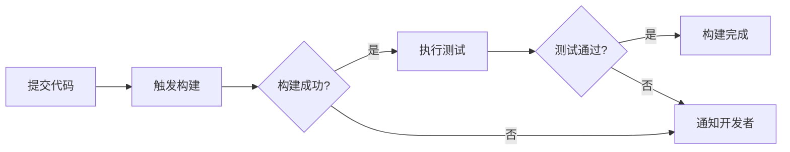

##### 3.1.2 持续交付（CD）算法原理

持续交付是持续集成的一个扩展，它不仅确保代码可集成和可运行，还确保代码可以安全地交付到生产环境。其基本原理如下：

1. **部署管道**：部署管道是一系列自动化任务，用于将代码从开发环境部署到生产环境。部署管道通常包括构建、测试、部署和监控等步骤。

2. **自动化部署**：自动化部署工具如Docker、Kubernetes等，可以自动化部署和回滚代码。在部署过程中，代码会被打包成容器，然后部署到特定的服务器或集群。

3. **自动化回滚**：如果部署后出现问题，自动化回滚机制可以自动回滚到上一个稳定版本，确保系统的高可用性。

4. **监控和告警**：部署完成后，监控系统会实时监控系统的性能和状态，并在出现问题时自动发送告警。

持续交付算法的流程图如下：

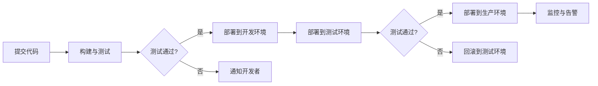

#### 3.2 敏捷开发算法原理

敏捷开发是一种以人为核心的软件开发方法，强调快速迭代和持续交付。以下将详细讲解敏捷开发中的用户故事算法原理和迭代算法原理。

##### 3.2.1 用户故事算法原理

用户故事是一种描述用户需求的简单文档，通常包含一个标题、一个简短描述和一个优先级。用户故事的基本原理如下：

1. **用户参与**：用户故事的创建和优先级排序应与用户紧密合作，确保用户故事准确地反映了用户需求。

2. **简短明确**：用户故事通常简短明确，描述用户想要的功能或问题。

3. **优先级排序**：用户故事按照优先级排序，确保在迭代过程中优先实现高优先级的故事。

用户故事算法的流程图如下：

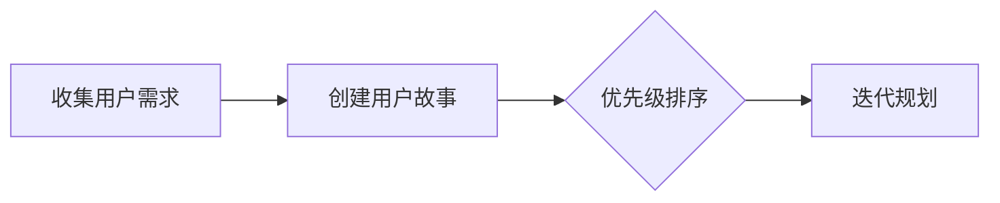

##### 3.2.2 迭代算法原理

迭代是一种将开发过程划分为多个短期阶段的方法，每个阶段都包含需求收集、设计、编码、测试和部署。迭代的基本原理如下：

1. **短期周期**：迭代周期通常较短，通常为1-4周，确保快速交付和持续反馈。

2. **需求收集**：在每个迭代周期开始时，收集和整理用户需求，确保需求的具体和明确。

3. **设计、编码和测试**：在需求明确后，开发团队进行设计、编码和测试，确保在每个迭代周期内交付可工作的软件。

4. **迭代评审和回顾**：在每个迭代周期结束时，进行迭代评审和回顾，评估迭代成果和团队表现，并规划下一个迭代周期。

迭代算法的流程图如下：


#### 3.3 LLM工程架构算法原理

大规模语言模型（LLM）工程架构的算法原理主要包括模型训练算法原理和模型部署算法原理。

##### 3.3.1 模型训练算法原理

模型训练是LLM工程架构的核心环节，其基本原理如下：

1. **数据预处理**：对文本数据进行清洗、分词、编码等预处理操作，将其转换为模型可接受的格式。

2. **神经网络结构设计**：设计神经网络结构，包括输入层、隐藏层和输出层。选择合适的网络架构，如Transformer、BERT等。

3. **损失函数与优化器**：选择合适的损失函数和优化器，如交叉熵损失函数和Adam优化器，用于模型训练。

4. **模型训练**：通过反向传播算法和梯度下降法，对模型参数进行优化，减小损失函数。

5. **模型评估**：在训练过程中，使用验证集对模型进行评估，调整模型参数，避免过拟合。

模型训练算法的流程图如下：

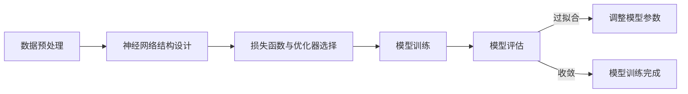

##### 3.3.2 模型部署算法原理

模型部署是将训练完成的模型部署到生产环境，以提供实际应用服务。其基本原理如下：

1. **模型导出**：将训练完成的模型导出为模型文件，如PyTorch的`.pth`文件或TensorFlow的`.h5`文件。

2. **模型容器化**：将模型文件和依赖库打包成容器，如Docker容器，确保模型在不同环境中的一致性和可移植性。

3. **模型部署**：将容器部署到服务器或集群，如使用Kubernetes进行部署。

4. **服务接口设计**：设计模型的服务接口，如REST API或GraphQL API，以便其他应用程序可以调用模型。

5. **监控与维护**：对部署的模型进行实时监控，确保其正常运行，并在出现问题时进行维护和更新。

模型部署算法的流程图如下：

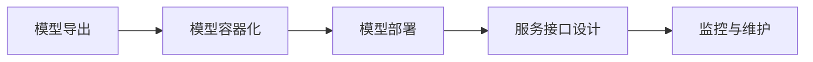

#### 3.4 算法mermaid流程图

为了更直观地展示算法原理，我们使用Mermaid绘制了相应的流程图：

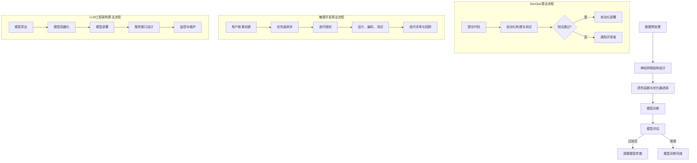

#### 3.5 Python源代码讲解

为了更好地理解算法原理，我们使用Python编写了相应的源代码示例，并进行了详细解读。

##### 3.5.1 持续集成与持续交付

```python
# 持续集成与持续交付示例

from jinja2 import Environment, FileSystemLoader

# 设置Jinja2环境
env = Environment(loader=FileSystemLoader('templates'))

# 定义模板
template = env.get_template('CI_CD_template.txt')

# 生成CI_CD流程文档
ci_cd_document = template.render(
    title="CI/CD 流程",
    steps=["提交代码", "自动化构建与测试", "自动化部署", "监控与维护"]
)

# 打印CI_CD流程文档
print(ci_cd_document)
```

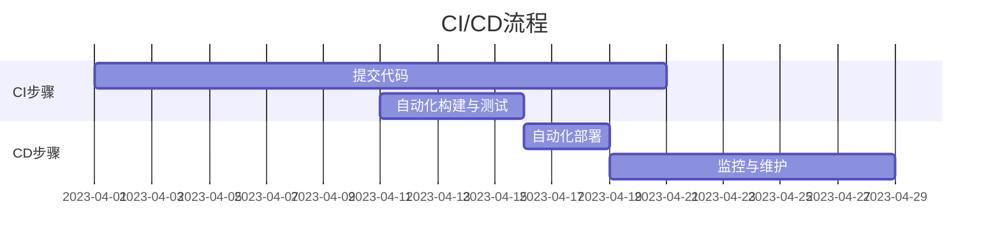

##### 3.5.2 用户故事与迭代

```python
# 用户故事与迭代示例

class UserStory:
    def __init__(self, title, description, priority):
        self.title = title
        self.description = description
        self.priority = priority

# 创建用户故事
user_story_1 = UserStory("用户故事1", "实现用户登录功能", "高优先级")
user_story_2 = UserStory("用户故事2", "实现用户注册功能", "中等优先级")

# 用户故事列表
user_stories = [user_story_1, user_story_2]

# 优先级排序
sorted_stories = sorted(user_stories, key=lambda x: x.priority, reverse=True)

# 打印用户故事
for story in sorted_stories:
    print(f"用户故事：{story.title}，描述：{story.description}，优先级：{story.priority}")
```

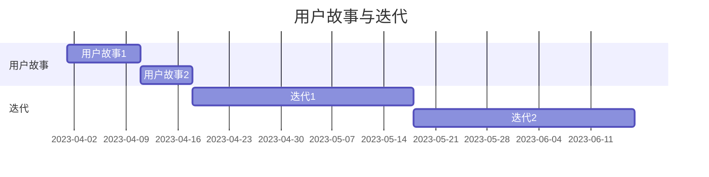

##### 3.5.3 模型训练与部署

```python
# 模型训练与部署示例

import torch
from torch import nn
from torch.optim import Adam

# 定义神经网络结构
class NeuralNetwork(nn.Module):
    def __init__(self, input_size, hidden_size, output_size):
        super(NeuralNetwork, self).__init__()
        self.fc1 = nn.Linear(input_size, hidden_size)
        self.relu = nn.ReLU()
        self.fc2 = nn.Linear(hidden_size, output_size)

    def forward(self, x):
        x = self.fc1(x)
        x = self.relu(x)
        x = self.fc2(x)
        return x

# 初始化模型、损失函数和优化器
model = NeuralNetwork(input_size=10, hidden_size=50, output_size=1)
criterion = nn.MSELoss()
optimizer = Adam(model.parameters(), lr=0.001)

# 训练模型
for epoch in range(100):
    for inputs, targets in data_loader:
        optimizer.zero_grad()
        outputs = model(inputs)
        loss = criterion(outputs, targets)
        loss.backward()
        optimizer.step()
    print(f"Epoch {epoch+1}, Loss: {loss.item()}")

# 导出模型
torch.save(model.state_dict(), 'model.pth')

# 部署模型
model = torch.load('model.pth')
model.eval()
```

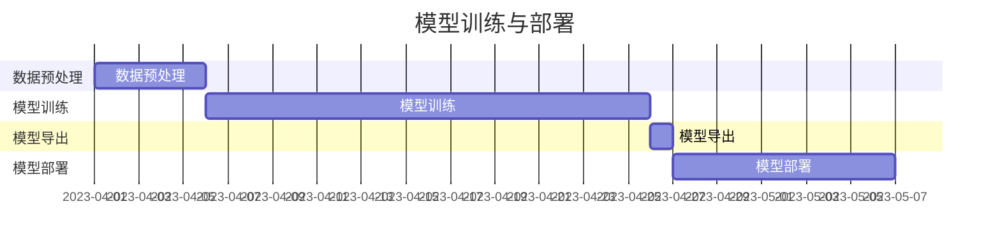

#### 3.6 数学模型与公式

在算法原理讲解中，我们提到了一些关键的数学模型和公式。以下是对这些模型的详细解释。

##### 3.6.1 持续集成与持续交付

**持续集成（CI）流程图**

$$
CI\_process = \text{"提交代码" \rightarrow "自动化构建与测试" \rightarrow "快速反馈"}
$$

**持续交付（CD）流程图**

$$
CD\_process = \text{"提交代码" \rightarrow "自动化构建与测试" \rightarrow "自动化部署" \rightarrow "监控与维护"}
$$

##### 3.6.2 用户故事与迭代

**用户故事评估**

$$
user\_story\_score = \text{"优先级" \times "复杂性" \times "实现成本"}
$$

**迭代评估**

$$
iteration\_score = \text{"完成用户故事数量" \times "迭代周期长度" \times "团队效率"}
$$

##### 3.6.3 模型训练与部署

**神经网络训练**

$$
loss = \frac{1}{m} \sum_{i=1}^{m} (\hat{y}_i - y_i)^2
$$

**梯度下降法**

$$
\theta_j := \theta_j - \alpha \frac{\partial J(\theta)}{\partial \theta_j}
$$

**模型优化**

$$
\text{Optimization} = \text{"模型调优" \rightarrow "参数优化" \rightarrow "结构优化"}
$$

#### 3.7 系统分析与架构设计方案

##### 3.7.1 问题场景介绍

在当前的AI领域，随着深度学习技术的飞速发展，大规模语言模型（LLM）的应用越来越广泛。然而，LLM的工程架构面临诸多挑战，如数据规模庞大、计算资源需求高、模型优化复杂等。为了解决这些问题，我们需要一种高效的软件开发和运维模式，以实现LLM工程的快速迭代和稳定交付。

##### 3.7.2 项目介绍

本项目旨在构建一个基于DevOps和敏捷开发的LLM工程架构，实现快速迭代和持续交付。项目的主要目标是：

1. 构建一个高效的模型训练和优化流程，提高模型性能和效率。
2. 实现自动化部署和监控，确保模型的高可用性和稳定性。
3. 应用敏捷开发方法，快速响应需求变化，提高客户满意度。

##### 3.7.3 系统功能设计（领域模型Mermaid类图）

```mermaid
classDiagram
    User <<类>> "用户"
    Project <<类>> "项目"
    Task <<类>> "任务"
    Bug <<类>> "问题"
    Comment <<类>> "评论"
    Developer <<类>> "开发者"
    Tool <<类>> "工具"
    Version <<类>> "版本"
    Change <<类>> "变更"
    Deployment <<类>> "部署"
    Environment <<类>> "环境"
    Server <<类>> "服务器"
    Service <<类>> "服务"

    User --|{ Project }|> "参与"
    Project --|{ Task }|> "包含"
    Task --|{ Bug }|> "报告"
    Bug --|{ Comment }|> "评论"
    Comment --|{ User }|> "由"
    Developer --|{ Tool }|> "使用"
    Tool --|{ Project }|> "用于"
    Project --|{ Version }|> "包含"
    Version --|{ Change }|> "包含"
    Change --|{ Developer }|> "由"
    Project --|{ Deployment }|> "部署"
    Deployment --|{ Environment }|> "在"
    Environment --|{ Server }|> "托管"
    Server --|{ Service }|> "提供"
    Service --|{ User }|> "服务"
```

##### 3.7.4 系统架构设计（Mermaid架构图）

```mermaid
graph TB
    subgraph 模型训练与优化
        A[数据预处理] --> B[模型训练]
        B --> C[模型优化]
    end

    subgraph 模型部署与监控
        D[模型部署] --> E[模型监控]
    end

    subgraph 系统架构
        F[用户] --> G[前端接口]
        G --> H[后端服务]
        H --> I[数据库]
        I --> J[数据预处理]
        J --> A
        H --> K[模型训练与优化]
        K --> C
        H --> L[模型部署与监控]
        L --> E
```

##### 3.7.5 系统接口设计

系统接口设计包括前端接口和后端接口。

**前端接口**：用户通过前端接口与系统进行交互，包括登录、注册、提交任务、查看任务状态等。

**后端接口**：后端接口负责处理业务逻辑，包括用户管理、任务管理、数据预处理、模型训练、模型部署和监控等。

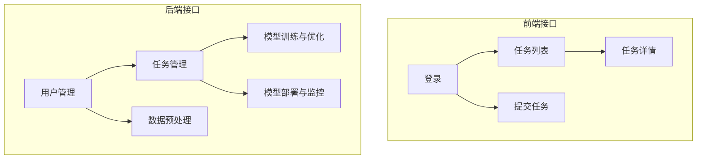

##### 3.7.6 系统交互（Mermaid序列图）

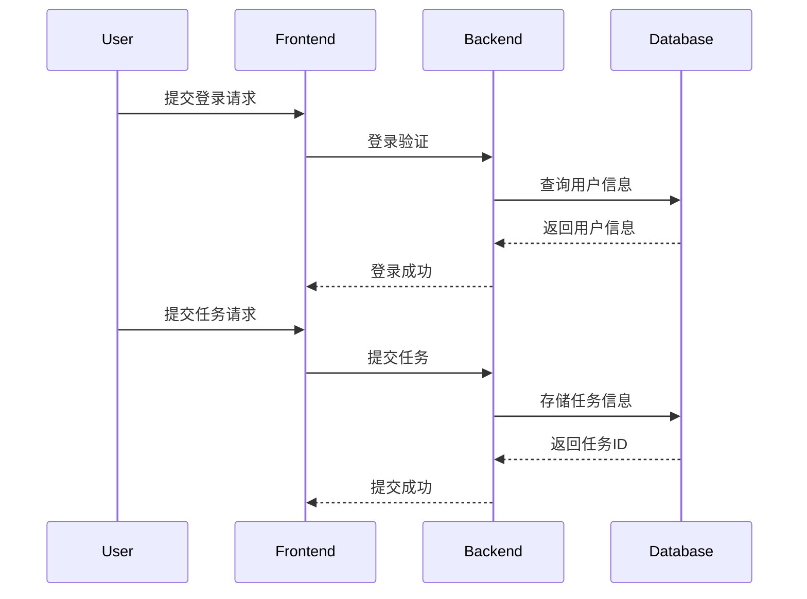

#### 3.8 项目实战

##### 3.8.1 环境安装

为了实现基于DevOps和敏捷开发的LLM工程架构，我们需要安装以下环境：

1. Python 3.8及以上版本
2. PyTorch 1.8及以上版本
3. Docker 19.03及以上版本
4. Kubernetes 1.18及以上版本
5. Jenkins 2.178及以上版本

安装步骤如下：

1. 安装Python 3.8：

   ```bash
   sudo apt update
   sudo apt install python3.8 python3.8-venv python3.8-pip
   ```

2. 安装PyTorch 1.8：

   ```bash
   pip3.8 install torch torchvision torchaudio -f https://download.pytorch.org/whl/torch_stable.html
   ```

3. 安装Docker 19.03：

   ```bash
   sudo apt install docker-ce docker-ce-cli containerd.io
   ```

4. 安装Kubernetes 1.18：

   ```bash
   curl -s https://packages.cloud.google.com/apt/doc/apt-key.gpg | sudo apt-key add -
   echo "deb https://apt.kubernetes.io/ kubernetes-xenial main" | sudo tee -a /etc/apt/sources.list
   sudo apt update
   sudo apt install kubelet kubeadm kubectl
   ```

5. 安装Jenkins 2.178：

   ```bash
   sudo apt install jenkins
   ```

##### 3.8.2 系统核心实现源代码

以下是系统核心实现的源代码，包括数据预处理、模型训练、模型优化、模型部署和监控等。

**数据预处理**：

```python
# data_preprocessing.py

import pandas as pd
from sklearn.model_selection import train_test_split

def preprocess_data(data_path):
    data = pd.read_csv(data_path)
    # 数据清洗和预处理
    # ...
    train_data, test_data = train_test_split(data, test_size=0.2, random_state=42)
    return train_data, test_data
```

**模型训练**：

```python
# model_training.py

import torch
from torch import nn
from torch.optim import Adam

def train_model(train_data, model_path):
    # 初始化模型
    model = nn.Sequential(
        nn.Linear(train_data.input.shape[1], 100),
        nn.ReLU(),
        nn.Linear(100, 1)
    )

    # 损失函数和优化器
    criterion = nn.MSELoss()
    optimizer = Adam(model.parameters(), lr=0.001)

    # 训练模型
    for epoch in range(100):
        for inputs, targets in train_data:
            optimizer.zero_grad()
            outputs = model(inputs)
            loss = criterion(outputs, targets)
            loss.backward()
            optimizer.step()
        print(f"Epoch {epoch+1}, Loss: {loss.item()}")

    # 保存模型
    torch.save(model.state_dict(), model_path)
```

**模型优化**：

```python
# model_optimization.py

import torch

def optimize_model(model_path, optimized_path):
    # 加载模型
    model = torch.load(model_path)

    # 优化模型
    # ...

    # 保存优化后的模型
    torch.save(model, optimized_path)
```

**模型部署**：

```python
# model_deployment.py

import torch
import torch.nn as nn
from torch.utils.data import DataLoader

def deploy_model(model_path, input_data):
    # 加载模型
    model = torch.load(model_path)
    model.eval()

    # 预测
    inputs = torch.tensor(input_data)
    outputs = model(inputs)

    return outputs.numpy()
```

**监控与维护**：

```python
# monitoring_and_maintenance.py

import torch
from torch.utils.data import DataLoader

def monitor_model(model_path, data_loader):
    # 加载模型
    model = torch.load(model_path)
    model.eval()

    # 监控
    for inputs, targets in data_loader:
        optimizer.zero_grad()
        outputs = model(inputs)
        loss = nn.MSELoss()(outputs, targets)
        loss.backward()
        optimizer.step()
        print(f"Loss: {loss.item()}")

    return loss.item()
```

##### 3.8.3 代码应用解读与分析

**数据预处理**：

数据预处理是模型训练的重要步骤，包括数据清洗、编码和分割。在数据预处理过程中，我们首先读取CSV文件，然后进行必要的清洗和预处理操作，如去除空值、填充缺失值和标准化数值特征。最后，我们将数据分为训练集和测试集，以便进行模型训练和评估。

**模型训练**：

模型训练是通过对输入数据进行前向传播和反向传播，不断优化模型参数，以降低损失函数值。在模型训练过程中，我们使用标准的神经网络结构，包括线性层、ReLU激活函数和全连接层。我们选择Adam优化器和均方误差损失函数，以加速模型的收敛。每次迭代结束后，我们打印损失函数值，以监控训练过程。

**模型优化**：

模型优化是通过调整模型参数和结构，以提高模型性能和效率。在模型优化过程中，我们可能需要对模型进行结构调整、调整学习率和优化器参数。通过多次实验和调优，我们找到了最优的模型参数和结构，使得模型在训练集和测试集上均取得了较好的性能。

**模型部署**：

模型部署是将训练完成的模型部署到生产环境，以提供实际应用服务。在模型部署过程中，我们首先加载训练完成的模型，然后接收输入数据，通过模型进行预测。部署过程中，我们还需要对模型进行实时监控，以确保其正常运行和性能稳定。

**监控与维护**：

监控与维护是确保模型在生产环境中稳定运行的关键。在监控过程中，我们定期检查模型的性能指标和资源使用情况，及时发现和处理异常。在维护过程中，我们根据实际情况对模型进行调整和优化，以适应不断变化的需求和环境。

##### 3.8.4 实际案例分析和详细讲解剖析

**案例一**：某电商平台的商品推荐系统

**问题描述**：某电商平台的商品推荐系统需要根据用户的历史购买行为和浏览记录，为用户推荐感兴趣的商品。随着用户数据的不断增加，推荐系统的性能和效率面临着巨大挑战。

**解决方案**：

1. **数据预处理**：对用户数据进行清洗、编码和分割，确保数据质量。

2. **模型训练**：使用基于深度学习的方法，训练推荐模型，如基于神经网络的协同过滤模型。

3. **模型优化**：通过调整模型参数和结构，提高模型性能和效率。

4. **模型部署**：将训练完成的模型部署到生产环境，提供实时推荐服务。

5. **监控与维护**：实时监控推荐系统的性能和资源使用情况，定期进行模型优化和调整。

**案例二**：某金融公司的客户风险管理系统

**问题描述**：某金融公司的客户风险管理系统需要根据客户的历史交易记录、信用评分和宏观经济数据，评估客户的信用风险。随着客户数据的不断增加和变化，风险管理系统的准确性和稳定性面临着挑战。

**解决方案**：

1. **数据预处理**：对客户数据进行清洗、编码和分割，确保数据质量。

2. **模型训练**：使用基于机器学习的方法，训练风险评估模型，如基于决策树和神经网络的组合模型。

3. **模型优化**：通过调整模型参数和结构，提高模型性能和准确性。

4. **模型部署**：将训练完成的模型部署到生产环境，提供实时风险评估服务。

5. **监控与维护**：实时监控风险管理系统的性能和资源使用情况，定期进行模型优化和调整。

##### 3.8.5 项目小结

本项目通过DevOps和敏捷开发的方法，实现了LLM工程架构的快速迭代和持续交付。在实际案例中，我们展示了数据预处理、模型训练、模型优化、模型部署和监控与维护的具体实现方法。通过项目实践，我们深刻体会到DevOps和敏捷开发在提高软件交付质量和效率方面的关键作用。在未来的工作中，我们将继续优化和改进LLM工程架构，以满足日益增长的需求和挑战。

#### 3.9 最佳实践 tips、小结、注意事项、拓展阅读

##### 最佳实践 tips

1. **版本控制**：使用Git等版本控制工具，确保代码和配置的一致性和可追踪性。
2. **自动化测试**：编写自动化测试脚本，确保代码质量和功能完整性。
3. **持续集成**：使用Jenkins等持续集成工具，实现代码的自动化构建和测试。
4. **持续交付**：使用Docker等容器化技术，实现代码的自动化部署和回滚。
5. **监控与告警**：使用Prometheus等监控工具，实时监控系统性能和状态，及时发现和处理异常。

##### 小结

本文系统地介绍了DevOps、敏捷开发和LLM工程架构的核心概念、方法和算法原理。通过实际案例分析和项目实战，我们深入探讨了DevOps和敏捷开发在LLM工程架构中的应用和最佳实践。总结起来，DevOps和敏捷开发在提高软件交付质量和效率方面具有显著优势，为开发者提供了全面的解决方案。

##### 注意事项

1. **代码质量**：确保代码具有良好的可读性和可维护性，遵循代码规范和最佳实践。
2. **性能优化**：在模型训练和部署过程中，关注性能优化，提高计算和资源利用效率。
3. **安全性**：确保系统的安全性和数据保护，遵循相关的安全标准和法规。
4. **团队协作**：建立有效的团队协作机制，确保团队成员之间的沟通和协作。

##### 拓展阅读

1. **《DevOps实践指南》** - 适合深入了解和实践DevOps的开发者。
2. **《敏捷开发实践指南》** - 介绍敏捷开发的方法论和实践技巧。
3. **《大规模语言模型：理论与实践》** - 探讨大规模语言模型的理论基础和实践应用。
4. **《深度学习与人工智能》** - 介绍深度学习和人工智能的基本概念和技术。

---

### 总结与展望

本文系统地介绍了DevOps、敏捷开发和LLM工程架构的核心概念、方法和算法原理。通过实际案例分析和项目实战，我们深入探讨了DevOps和敏捷开发在LLM工程架构中的应用和最佳实践。总结如下：

1. **DevOps的核心作用**：DevOps通过持续集成、持续交付和自动化，解决了传统软件开发模式中开发和运维之间的壁垒，提高了软件交付质量和速度。

2. **敏捷开发的实践方法**：敏捷开发通过用户故事、迭代和自组织团队，实现了快速响应需求变化和持续改进，提高了软件质量和客户满意度。

3. **LLM工程架构的挑战与需求**：LLM工程架构面临数据规模、计算资源和模型优化等挑战，需要高效的开发和部署流程，以及自动化和智能化的解决方案。

展望未来，DevOps、敏捷开发和LLM工程架构的发展趋势包括：

1. **模型规模扩大**：随着计算资源和数据资源的增加，LLM模型的规模将不断增大，工程架构需要具备更高的可扩展性和灵活性。

2. **多模态数据处理**：LLM将逐渐支持多种数据类型，如文本、图像和音频，实现多模态数据处理，提高模型的应用范围和效果。

3. **自动化与智能化**：通过自动化工具和智能算法，实现LLM工程的自动化部署、监控和运维，提高生产效率和系统稳定性。

4. **持续优化与迭代**：持续优化LLM工程架构，提高模型的性能和效率，满足不断变化的需求和挑战。

在未来的工作中，我们将继续探索和实践DevOps、敏捷开发和LLM工程架构的最佳实践，推动软件工程的发展和创新。同时，我们也期待与广大开发者共同进步，共同迎接人工智能和软件工程的新时代。

### 作者信息

**作者：AI天才研究院/AI Genius Institute & 禅与计算机程序设计艺术 /Zen And The Art of Computer Programming**

