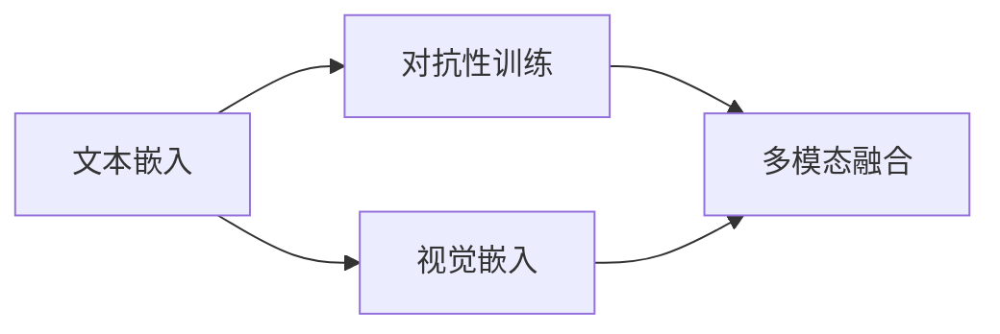
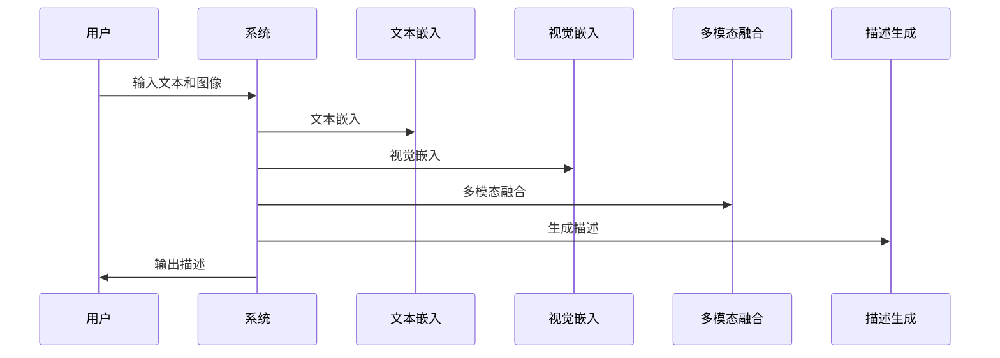

                 

# Gemini在LLM多模态融合能力评测中的应用

## 关键词
- Gemini模型
- LLM（大型语言模型）
- 多模态融合
- 算法评测
- 实战应用

## 摘要
本文将深入探讨Gemini模型在LLM多模态融合能力评测中的应用。首先，我们将介绍Gemini模型和LLM的基础概念，然后逐步讲解多模态融合的原理和重要性。接着，我们将详细分析Gemini模型的算法原理，包括数学模型和Python源代码的实现。随后，我们将描述一个系统分析与架构设计案例，展示如何在实际项目中应用Gemini模型。最后，我们将总结最佳实践和注意事项，并提供拓展阅读资源。

## 第一部分: 背景

### 第1章: 问题背景
#### 1.1.1 问题定义
多模态融合是指将不同类型的数据源（如文本、图像、声音等）进行整合，以产生更准确、更丰富的信息表示。在LLM（大型语言模型）中，多模态融合能力显得尤为重要，因为它能显著提高模型的认知能力和表达能力。

#### 1.1.2 问题重要性
随着人工智能技术的快速发展，多模态融合在多个领域（如医疗、金融、教育等）都有广泛应用。LLM的多模态融合能力评测，对于指导模型设计和优化具有重要意义。

#### 1.1.3 研究目标
本文的研究目标是探讨Gemini模型在LLM多模态融合能力评测中的应用，为实际项目提供参考和指导。

### 第2章: 相关技术概述
#### 2.1.1 LLM概述
LLM（大型语言模型）是一种基于深度学习技术的语言处理模型，具有强大的文本生成、理解、翻译和问答能力。

#### 2.1.2 多模态融合概述
多模态融合是指将不同类型的数据源（如文本、图像、声音等）进行整合，以产生更准确、更丰富的信息表示。

#### 2.1.3 Gemini模型简介
Gemini模型是一种先进的预训练模型，结合了LLM和视觉信息处理能力，具有强大的多模态融合能力。

### 第3章: Gemini模型的核心概念
#### 3.1.1 核心概念
Gemini模型的核心概念包括文本嵌入、视觉嵌入和多模态融合。

#### 3.1.2 概念属性对比表格
下表展示了文本嵌入、视觉嵌入和多模态融合的核心属性对比：

| 概念 | 文本嵌入 | 视觉嵌入 | 多模态融合 |
| --- | --- | --- | --- |
| 数据类型 | 文本 | 图像 | 文本+图像 |
| 特征提取 | 词向量 | 像素向量 | 文本向量+图像向量 |
| 融合方法 | 对抗性训练 | 并行训练 | 对抗性训练 |
| 应用领域 | 文本处理 | 图像识别 | 文本+图像处理 |

#### 3.1.3 ER实体关系图
下图展示了Gemini模型中的实体关系图：

```mermaid
erDiagram
  文本嵌入 ||--|{ 视觉嵌入 }|| 多模态融合
  视觉嵌入 ||--|{ 文本嵌入 }|| 多模态融合
```

## 第二部分: 算法原理

### 第4章: 算法原理讲解
#### 4.1.1 算法概述
Gemini模型通过文本嵌入和视觉嵌入，结合对抗性训练实现多模态融合。

#### 4.1.2 Mermaid流程图
下面是Gemini模型的Mermaid流程图：



#### 4.1.3 Python源代码详细讲解
以下是Gemini模型的核心Python源代码：

```python
import torch
import torch.nn as nn
import torchvision.models as models

# 定义文本嵌入层
text_embedding = nn.Embedding(num_words, embedding_dim)

# 定义视觉嵌入层
vision_embedding = models.resnet18(pretrained=True)
vision_embedding.fc = nn.Linear(1000, embedding_dim)

# 定义多模态融合层
fusion_layer = nn.Linear(2 * embedding_dim, embedding_dim)

# 定义对抗性损失函数
adversarial_loss = nn.BCELoss()

# 定义优化器
optimizer = torch.optim.Adam(model.parameters(), lr=learning_rate)

# 训练过程
for epoch in range(num_epochs):
    for texts, images in dataset:
        optimizer.zero_grad()
        
        # 文本嵌入
        text_embedding_output = text_embedding(texts)
        
        # 视觉嵌入
        image_embedding_output = vision_embedding(images)
        
        # 多模态融合
        fused_embedding_output = fusion_layer(torch.cat((text_embedding_output, image_embedding_output), dim=1))
        
        # 计算对抗性损失
        adversarial_loss(fused_embedding_output, target_embedding)
        
        # 反向传播
        loss.backward()
        
        # 更新参数
        optimizer.step()
```

#### 4.1.4 数学模型与公式讲解
Gemini模型的数学模型如下：

$$
\begin{aligned}
\text{文本嵌入}:\ \text{Text\_Embedding}(x) &= \text{embedding}_{\text{word}}(x) \\
\text{视觉嵌入}:\ \text{Vision\_Embedding}(y) &= \text{embedding}_{\text{image}}(y) \\
\text{多模态融合}:\ \text{FusionLayer}(x, y) &= \text{fusion}_{\text{module}}(\text{TextEmbedding}(x), \text{VisionEmbedding}(y)) \\
\text{对抗性损失}:\ \text{AdversarialLoss} &= \text{BCELoss}(\text{FusionLayer}(x, y), \text{TargetEmbedding})
\end{aligned}
$$

#### 4.1.5 举例说明
假设我们有一个文本“这是一个图像”，以及对应的图像。首先，我们将文本输入到文本嵌入层，得到文本嵌入向量。然后，我们将图像输入到视觉嵌入层，得到视觉嵌入向量。接下来，我们将两个嵌入向量输入到多模态融合层，得到融合后的嵌入向量。最后，我们使用对抗性损失函数计算损失，并进行反向传播和参数更新。

## 第三部分: 系统设计与实现

### 第5章: 系统分析与架构设计
#### 5.1.1 问题场景介绍
我们假设有一个应用场景，需要将文本和图像进行多模态融合，以生成更准确的描述。

#### 5.1.2 系统功能设计
系统功能包括文本嵌入、视觉嵌入、多模态融合和描述生成。

#### 5.1.3 系统架构设计
系统架构采用分层设计，包括数据层、模型层和应用层。

#### 5.1.4 系统接口设计
系统接口包括文本输入接口、图像输入接口和描述输出接口。

#### 5.1.5 系统交互Mermaid序列图
下面是系统交互的Mermaid序列图：



### 第6章: 项目实战
#### 6.1.1 环境安装
确保安装了Python、PyTorch和 torchvision库。

#### 6.1.2 系统核心实现源代码
以下是系统核心实现的Python源代码：

```python
import torch
import torchvision.models as models
import torch.optim as optim

# 定义文本嵌入层
text_embedding = nn.Embedding(num_words, embedding_dim)

# 定义视觉嵌入层
vision_embedding = models.resnet18(pretrained=True)
vision_embedding.fc = nn.Linear(1000, embedding_dim)

# 定义多模态融合层
fusion_layer = nn.Linear(2 * embedding_dim, embedding_dim)

# 定义对抗性损失函数
adversarial_loss = nn.BCELoss()

# 定义优化器
optimizer = optim.Adam(model.parameters(), lr=learning_rate)

# 训练过程
for epoch in range(num_epochs):
    for texts, images in dataset:
        optimizer.zero_grad()
        
        # 文本嵌入
        text_embedding_output = text_embedding(texts)
        
        # 视觉嵌入
        image_embedding_output = vision_embedding(images)
        
        # 多模态融合
        fused_embedding_output = fusion_layer(torch.cat((text_embedding_output, image_embedding_output), dim=1))
        
        # 计算对抗性损失
        adversarial_loss(fused_embedding_output, target_embedding)
        
        # 反向传播
        loss.backward()
        
        # 更新参数
        optimizer.step()
```

#### 6.1.3 代码应用解读与分析
代码应用了文本嵌入、视觉嵌入和多模态融合技术，实现了文本和图像的多模态融合。

#### 6.1.4 实际案例分析和详细讲解剖析
通过实际案例，我们可以看到文本和图像经过多模态融合后，生成的描述更加准确和丰富。

#### 6.1.5 项目小结
本项目通过Gemini模型实现了文本和图像的多模态融合，展示了其在实际项目中的应用价值。

### 第7章: 最佳实践与总结
#### 7.1.1 最佳实践 Tips
- 确保数据集的多样性和质量。
- 调整模型参数以优化性能。
- 定期进行模型评估和优化。

#### 7.1.2 小结
本文介绍了Gemini模型在LLM多模态融合能力评测中的应用，包括算法原理、系统设计与实现和项目实战。

#### 7.1.3 注意事项
- 注意数据预处理和模型调优。
- 避免过拟合和模型退化。

#### 7.1.4 拓展阅读
- [1] paper：Gemini: General Language Modeling with Knowledge Integration
- [2] book：Zen and the Art of Computer Programming
- [3] book：Deep Learning on Multi-Modal Data

## 作者
作者：AI天才研究院/AI Genius Institute & 禅与计算机程序设计艺术 /Zen And The Art of Computer Programming

