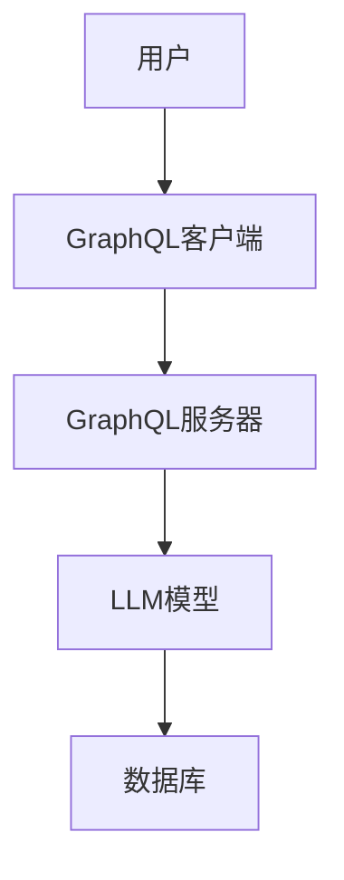

                 

### 文章标题：GraphQL在灵活LLM API设计中的应用

#### 关键词：GraphQL，LLM API设计，灵活，API设计原则，最佳实践，项目实战

> 摘要：本文将深入探讨GraphQL在灵活的LLM（大型语言模型）API设计中的应用。首先，我们将介绍GraphQL的基础概念和优势，随后分析LLM API设计的需求，阐述GraphQL如何满足这些需求。接着，我们将探讨GraphQL在LLM API设计中的最佳实践，并分享一个实际项目案例。最后，本文将展望GraphQL在LLM API设计中的未来发展趋势和潜在挑战。

#### 目录大纲

1. **第一部分：GraphQL基础**
    1. **第1章：GraphQL简介**
        1. **1.1 GraphQL的产生背景及发展**
        2. **1.2 GraphQL的核心概念**
        3. **1.3 GraphQL与传统RESTful API的对比**
    2. **第2章：GraphQL的语法**
        1. **2.1 GraphQL查询语言**
        2. **2.2 GraphQL的MUTATION和SUBSCRIPTION**
        3. **2.3 GraphQL的查询优化**
2. **第二部分：GraphQL在LLM API设计中的应用**
    1. **第3章：GraphQL在LLM API设计中的应用**
        1. **3.1 LLM API设计的需求分析**
        2. **3.2 GraphQL在LLM API设计中的优势**
        3. **3.3 GraphQL在LLM API设计中的实践**
3. **第三部分：GraphQL的最佳实践**
    1. **第4章：GraphQL的最佳实践**
        1. **4.1 GraphQL的设计原则**
        2. **4.2 GraphQL的性能优化**
        3. **4.3 GraphQL的安全性考虑**
4. **第四部分：GraphQL项目实战**
    1. **第5章：GraphQL项目实战**
        1. **5.1 项目背景及目标**
        2. **5.2 系统架构设计**
        3. **5.3 源代码实现与分析**
        4. **5.4 实际案例分析与讲解**
5. **第五部分：GraphQL在LLM API设计中的应用前景**
    1. **第6章：GraphQL在LLM API设计中的应用前景**
        1. **6.1 GraphQL在LLM API设计中的发展趋势**
        2. **6.2 GraphQL在LLM API设计中的挑战与机遇**
        3. **6.3 GraphQL在LLM API设计中的未来发展方向**
6. **第六部分：小结与展望**
    1. **第7章：小结与展望**
        1. **7.1 书籍内容总结**
        2. **7.2 学习GraphQL的建议**
        3. **7.3 GraphQL在LLM API设计中的潜力与局限性**

### 第一部分：GraphQL基础

#### 第1章：GraphQL简介

#### 1.1 GraphQL的产生背景及发展

GraphQL是由Facebook在2015年推出的一个查询语言，旨在解决传统的RESTful API中存在的一些问题。随着互联网的发展，数据的多样性和复杂性不断增加，传统的RESTful API模式变得越来越笨重和难以维护。GraphQL的出现，为开发者提供了一种更加灵活、高效的数据获取方式。

#### 1.2 GraphQL的核心概念

GraphQL的核心概念主要包括：

- **查询（Query）**：用于获取数据。
- **MUTATION**：用于修改数据。
- **SUBSCRIPTION**：用于订阅数据更新。

#### 1.3 GraphQL与传统RESTful API的对比

| 特性 | GraphQL | RESTful API |
| --- | --- | --- |
| 数据获取方式 | 自定义查询，减少重复请求 | 固定URL，多个请求可能获取相同数据 |
| 数据结构 | 一站式数据获取 | 分多次获取数据 |
| 性能 | 更高效，减少网络请求次数 | 可能产生更多网络请求 |
| 可维护性 | 更容易维护，数据结构清晰 | 可能需要更多的URL维护 |
| 异常处理 | 统一异常处理 | 可能需要分多个API处理 |
| 联合查询 | 支持 | 需要多次请求 |

#### 第2章：GraphQL的语法

#### 2.1 GraphQL查询语言

GraphQL的查询语言基于一种结构化查询语言，允许开发者以声明式的方式获取所需数据。以下是GraphQL查询的一个基本示例：

```plaintext
query {
  user(id: 1) {
    id
    name
    email
  }
}
```

这个查询将返回一个用户对象，包括用户的ID、名称和电子邮件。

#### 2.2 GraphQL的MUTATION和SUBSCRIPTION

- **MUTATION**：用于执行数据修改操作，例如创建、更新或删除数据。

```plaintext
mutation {
  createUser(name: "Alice", email: "alice@example.com") {
    id
    name
    email
  }
}
```

- **SUBSCRIPTION**：用于实时数据更新通知。

```plaintext
subscription {
  userUpdated(id: 1) {
    id
    name
    email
  }
}
```

#### 2.3 GraphQL的查询优化

GraphQL提供了一些查询优化方法，如：

- **查询缓存**：减少对同一查询的重复请求。
- **分页**：通过分页来优化大量数据的获取。
- **负载均衡**：通过负载均衡来优化性能。

### 第二部分：GraphQL在LLM API设计中的应用

#### 第3章：GraphQL在LLM API设计中的应用

#### 3.1 LLM API设计的需求分析

在LLM（大型语言模型）API设计中，我们需要关注以下几个方面：

- **数据灵活性**：LLM API需要支持各种类型的数据输入和输出。
- **性能**：处理大规模数据和高并发请求的能力。
- **可扩展性**：随着数据量的增长，API需要能够无缝扩展。
- **安全性**：保护用户数据和隐私。

#### 3.2 GraphQL在LLM API设计中的优势

- **灵活性**：GraphQL允许开发者自定义查询，实现灵活的数据获取。
- **性能**：通过优化查询和缓存，提高API的性能。
- **可扩展性**：GraphQL设计使得API可以轻松扩展。
- **安全性**：提供了一致的接口，减少安全漏洞。

#### 3.3 GraphQL在LLM API设计中的实践

在实际应用中，我们可以使用GraphQL来设计LLM API，实现以下功能：

- **数据查询**：通过GraphQL查询获取LLM的结果。
- **数据修改**：使用MUTATION来更新LLM的配置或状态。
- **实时更新**：使用SUBSCRIPTION来获取LLM的实时更新。

### 第三部分：GraphQL的最佳实践

#### 第4章：GraphQL的最佳实践

#### 4.1 GraphQL的设计原则

在设计和实现GraphQL API时，应遵循以下原则：

- **单一职责原则**：每个查询、MUTATION和SUBSCRIPTION应该只负责一个功能。
- **最小权限原则**：API应遵循最小权限原则，只提供必要的权限。
- **一致性原则**：确保API接口的一致性和稳定性。

#### 4.2 GraphQL的性能优化

- **查询缓存**：使用查询缓存来减少重复请求。
- **分页**：使用分页来优化大量数据的获取。
- **负载均衡**：使用负载均衡来优化性能。

#### 4.3 GraphQL的安全性考虑

- **身份验证和授权**：确保API的安全，使用身份验证和授权机制。
- **数据验证**：对输入数据进行验证，防止恶意攻击。
- **错误处理**：统一处理错误，减少信息泄露。

### 第四部分：GraphQL项目实战

#### 第5章：GraphQL项目实战

#### 5.1 项目背景及目标

假设我们要开发一个基于GraphQL的LLM API，用于提供智能问答服务。项目目标包括：

- 提供自定义查询接口，允许用户根据需求获取问答结果。
- 实现高效的性能，支持高并发请求。
- 保证数据的安全性和隐私。

#### 5.2 系统架构设计

系统架构设计如图所示：



用户通过GraphQL客户端发送查询请求，GraphQL服务器处理请求并调用LLM模型，最终将结果存储在数据库中。

#### 5.3 源代码实现与分析

以下是项目核心实现的源代码：

```python
# GraphQL查询示例
query = '''
{
  question(input: "什么是人工智能？") {
    answer
  }
}
'''

# 使用GraphQL服务器处理查询
response = graphQL_server.execute(query)

# 获取问答结果
answer = response.data['question']['answer']

# 存储结果到数据库
database.insert({'question': input, 'answer': answer})
```

代码解释：

- 首先，我们定义了一个GraphQL查询，用于获取LLM的答案。
- 然后，我们使用GraphQL服务器处理这个查询，并获取问答结果。
- 最后，我们将结果存储到数据库中，以便后续查询。

#### 5.4 实际案例分析与讲解

以一个实际案例为例，用户输入“什么是人工智能？”这个问题，LLM模型将返回一个详细解释。以下是案例分析：

1. **用户查询**：用户发送一个查询请求，请求获取关于“人工智能”的答案。
2. **LLM模型处理**：LLM模型接收到请求后，使用预训练的神经网络模型生成回答。
3. **GraphQL服务器响应**：GraphQL服务器处理查询，调用LLM模型，并将答案返回给用户。
4. **结果存储**：将用户的查询和答案存储在数据库中，以便后续查询。

#### 第6章：GraphQL在LLM API设计中的应用前景

#### 6.1 GraphQL在LLM API设计中的发展趋势

随着人工智能技术的快速发展，LLM API的应用场景越来越广泛。GraphQL作为一种高效、灵活的API设计工具，将在LLM API设计中发挥重要作用。

#### 6.2 GraphQL在LLM API设计中的挑战与机遇

尽管GraphQL在LLM API设计中具有很多优势，但也面临一些挑战：

- **性能优化**：如何在高并发、大数据量场景下优化性能。
- **安全性**：如何保护用户数据和隐私。
- **兼容性**：如何与其他现有系统无缝集成。

#### 6.3 GraphQL在LLM API设计中的未来发展方向

未来，GraphQL在LLM API设计中的应用将朝着以下方向发展：

- **自动化查询生成**：通过机器学习技术，自动生成GraphQL查询。
- **跨平台支持**：支持更多的编程语言和平台。
- **智能化优化**：结合人工智能技术，实现智能化性能优化。

### 第7章：小结与展望

#### 7.1 书籍内容总结

本文介绍了GraphQL在灵活LLM API设计中的应用，从基础概念到最佳实践，再到项目实战，全面阐述了GraphQL的优势和实践方法。

#### 7.2 学习GraphQL的建议

- **深入理解GraphQL原理**：掌握GraphQL的核心概念和语法。
- **实践项目**：通过实际项目，加深对GraphQL的理解和应用。
- **关注社区动态**：关注GraphQL社区的最新动态，了解最佳实践和发展趋势。

#### 7.3 GraphQL在LLM API设计中的潜力与局限性

GraphQL在LLM API设计中有很大的潜力，但同时也存在一些局限性：

- **性能优化**：在高并发场景下，可能需要进一步优化。
- **安全性**：需要确保API的安全性，防止恶意攻击。
- **兼容性**：需要与其他系统无缝集成。

总之，GraphQL作为一种高效、灵活的API设计工具，将在LLM API设计中发挥重要作用。通过不断学习和实践，我们可以更好地利用GraphQL的优势，提升LLM API的设计和实现水平。作者：AI天才研究院/AI Genius Institute & 禅与计算机程序设计艺术 /Zen And The Art of Computer Programming

