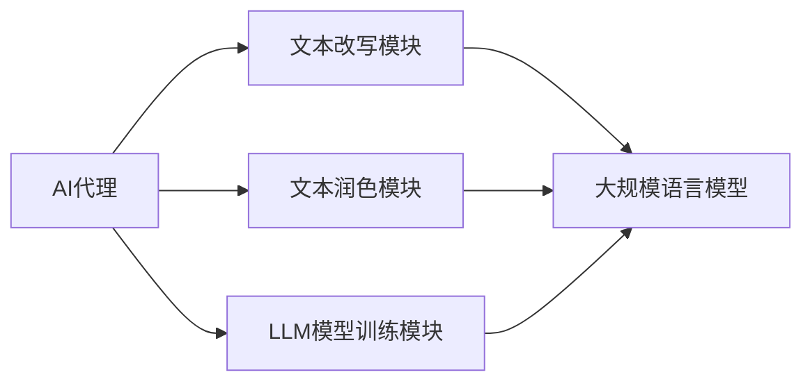
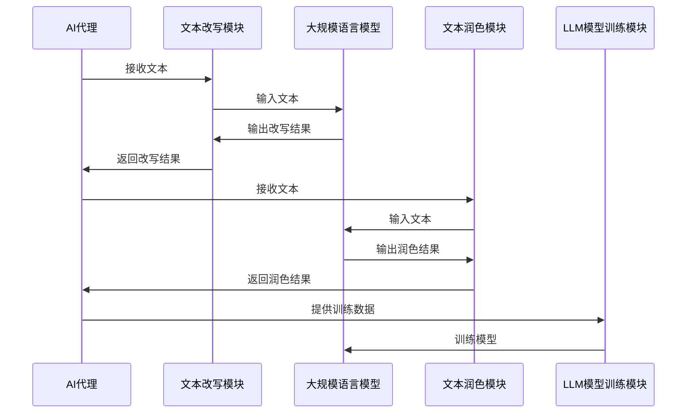
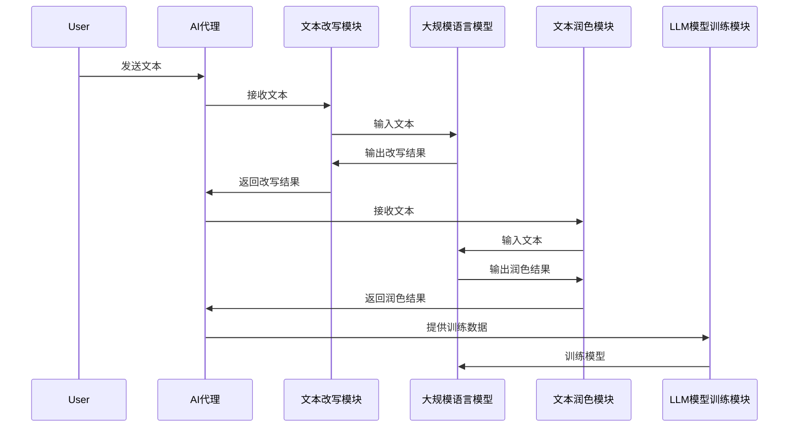

                 

# LLM在AI Agent中的文本改写与润色应用

## 关键词

- 大规模语言模型（LLM）
- AI代理
- 文本改写
- 文本润色
- 自然语言处理

## 摘要

本文深入探讨了大规模语言模型（LLM）在AI代理中的文本改写与润色应用。通过介绍LLM的基本原理、技术实现和实际应用案例，本文旨在帮助读者理解如何利用LLM提高AI代理的文本处理能力，解决现有AI代理在文本改写与润色方面的不足，从而提升用户体验。

## 第一部分：背景介绍

### 1. 问题背景

随着人工智能技术的飞速发展，深度学习模型，特别是大规模语言模型（LLM），已经在自然语言处理、文本生成、机器翻译等领域取得了显著的成果。然而，如何将这些先进的模型应用于AI代理的文本改写与润色，提高AI代理的交互质量和用户体验，成为当前研究与应用的热点。

### 2. 问题描述

AI代理在日常交互中需要处理大量的文本信息，这些信息需要及时、准确地被改写和润色，以满足用户的实际需求。然而，现有的AI代理在文本改写与润色方面存在以下问题：

- 文本理解不准确，导致改写结果不自然或不符合语境。
- 文本生成缺乏连贯性和创造性，无法达到高质量的润色效果。
- 文本改写和润色效率低下，无法满足实时交互的需求。

### 3. 问题解决

为了解决上述问题，本文将深入探讨LLM在AI代理中的文本改写与润色应用。通过介绍LLM的基本原理、技术实现和实际应用案例，帮助读者了解如何利用LLM提高AI代理的文本处理能力。

### 4. 边界与外延

- 边界：本文主要关注LLM在AI代理文本改写与润色中的应用，不涉及其他人工智能领域的应用。
- 外延：虽然本文的重点是文本改写与润色，但LLM在其他自然语言处理任务中的应用也是值得探讨的。

### 5. 概念结构与核心要素组成

- 概念结构：大规模语言模型（LLM）、AI代理、文本改写、文本润色。
- 核心要素组成：LLM的训练数据、模型结构、改写与润色算法、AI代理的系统架构。

### 6. 本章小结

本章从问题背景、问题描述、问题解决、边界与外延等方面，全面介绍了LLM在AI代理中的文本改写与润色应用。下一章将深入探讨LLM的基本原理和训练过程，为后续章节的内容打下基础。

---

## 第二部分：核心概念与联系

### 1. LLM的基本原理

LLM（Large Language Model）是一种基于深度学习的大规模语言模型，通过学习海量文本数据，LLM能够理解并生成自然语言文本。其主要原理如下：

- **预训练**：LLM通过在大量文本数据上进行预训练，学习语言的基本结构和语义。
- **微调**：在预训练的基础上，LLM可以根据特定任务进行微调，进一步提高其在特定领域的表现。

### 2. LLM的核心特点

- **大规模**：LLM具有非常庞大的参数量，能够处理复杂的语言任务。
- **灵活性**：LLM可以根据不同的任务需求进行微调，适应各种应用场景。
- **通用性**：LLM不仅适用于文本生成，还可以用于机器翻译、问答系统等多种自然语言处理任务。

### 3. LLM与传统AI的区别

- **传统AI**：传统AI方法通常基于规则或手工设计的特征，缺乏灵活性和通用性。
- **LLM**：LLM通过学习海量数据，具有更强的自适应能力和通用性，能够处理更加复杂的任务。

### 4. LLM在文本改写与润色中的应用

- **文本改写**：利用LLM，可以自动对文本进行改写，使其更加自然、符合语境。
- **文本润色**：LLM能够识别并修复文本中的错误、冗余和不恰当的表达，提高文本质量。

### 5. 核心概念对比表格

| 特征             | 传统AI                                                     | LLM                                                         |
|------------------|-----------------------------------------------------------|-------------------------------------------------------------|
| 基础原理         | 基于规则或手工特征设计                                     | 基于深度学习，学习海量文本数据                                 |
| 灵活性           | 固定规则，无法适应复杂任务                                 | 自适应，适用于多种任务                                       |
| 通用性           | 任务特定，无法迁移至其他领域                               | 通用性强，适用于多种自然语言处理任务     

### 6. LLM的ER实体关系图架构

```mermaid
erDiagram
    AI代理 ||--o{ 文本改写算法 }|
    AI代理 ||--o{ 文本润色算法 }|
    文本改写算法 ||--o{ LLM模型 }|
    文本润色算法 ||--o{ LLM模型 }|
```

在上述ER图中，AI代理通过文本改写算法和文本润色算法与LLM模型进行交互。文本改写算法和文本润色算法负责处理输入文本，并将其传递给LLM模型进行改写和润色。LLM模型则通过学习海量文本数据，生成高质量的改写和润色结果。

---

## 第三部分：算法原理讲解

### 1. LLM训练过程

LLM的训练过程主要包括预训练和微调两个阶段。

- **预训练**：在预训练阶段，LLM通过在大规模文本数据集上进行训练，学习语言的基本结构和语义。这一阶段的核心任务是生成一个能够理解自然语言的模型。
- **微调**：在预训练的基础上，LLM可以根据特定任务进行微调，进一步提高其在特定领域的表现。微调阶段的核心任务是调整模型的参数，使其在特定任务上达到更好的效果。

### 2. 文本改写算法

文本改写算法的核心思想是通过LLM模型生成与输入文本相似的文本，但表达方式更加自然、符合语境。具体步骤如下：

1. **输入文本预处理**：对输入文本进行预处理，包括分词、去停用词、词性标注等操作。
2. **生成候选文本**：利用LLM模型，生成与输入文本相似的候选文本。
3. **筛选最佳文本**：对生成的候选文本进行筛选，选择最符合语境、表达最为自然的文本作为改写结果。

### 3. 文本润色算法

文本润色算法的核心思想是通过LLM模型识别并修复输入文本中的错误、冗余和不恰当的表达，提高文本质量。具体步骤如下：

1. **输入文本预处理**：对输入文本进行预处理，包括分词、去停用词、词性标注等操作。
2. **错误检测与修正**：利用LLM模型，对输入文本进行错误检测和修正。具体包括：
   - 检测文本中的拼写错误、语法错误、语义错误等。
   - 利用LLM模型生成正确的表达方式，替代错误的表达。
3. **连贯性增强**：对修正后的文本进行连贯性增强，使其表达更加流畅、自然。

### 4. 代码实现与示例

以下是文本改写算法和文本润色算法的Python代码实现示例：

```python
import tensorflow as tf
from tensorflow.keras.models import Model
from tensorflow.keras.layers import Input, Embedding, LSTM, Dense

# 文本改写算法代码实现
def text_rewrite(text, model):
    # 预处理文本
    preprocessed_text = preprocess_text(text)
    
    # 生成候选文本
    candidate_texts = model.predict(preprocessed_text)
    
    # 筛选最佳文本
    best_text = select_best_text(candidate_texts)
    
    return best_text

# 文本润色算法代码实现
def text_polish(text, model):
    # 预处理文本
    preprocessed_text = preprocess_text(text)
    
    # 错误检测与修正
    corrected_text = error_detection_and_correction(preprocessed_text, model)
    
    # 连贯性增强
    polished_text = enhance_coherence(corrected_text)
    
    return polished_text

# 示例
llm_model = load_llm_model()
input_text = "This is a sample text for rewriting and polishing."
rewritten_text = text_rewrite(input_text, llm_model)
polished_text = text_polish(input_text, llm_model)

print("Original Text:", input_text)
print("Rewritten Text:", rewritten_text)
print("Polished Text:", polished_text)
```

### 5. 数学模型与公式

文本改写算法和文本润色算法的核心是LLM模型。LLM模型通常采用变长序列作为输入，输出与输入序列相似的序列。以下是一个简单的数学模型：

$$
\text{Output}(x) = \text{LLM}(\text{Input}(x))
$$

其中，$\text{Input}(x)$ 表示输入序列，$\text{LLM}(\cdot)$ 表示大规模语言模型，$\text{Output}(x)$ 表示输出序列。

在文本润色算法中，需要对输入文本进行错误检测与修正。以下是一个简单的数学模型：

$$
\text{Corrected Text}(x) = \text{Error Detection and Correction}(\text{Input}(x))
$$

其中，$\text{Error Detection and Correction}(\cdot)$ 表示错误检测与修正算法。

---

## 第四部分：系统分析与架构设计

### 1. 问题场景介绍

在许多应用场景中，AI代理需要与用户进行自然语言交互，例如智能客服、智能助手等。然而，现有的AI代理在处理文本信息时，往往无法满足用户的实际需求，导致用户体验不佳。为了提高AI代理的文本处理能力，本文提出了一种基于LLM的文本改写与润色解决方案。

### 2. 项目介绍

本文所涉及的项目是一个基于大规模语言模型（LLM）的AI代理文本改写与润色系统。该系统主要包括文本改写模块、文本润色模块和LLM模型训练模块。

- **文本改写模块**：负责对输入文本进行改写，使其更加自然、符合语境。
- **文本润色模块**：负责对输入文本进行错误检测与修正，提高文本质量。
- **LLM模型训练模块**：负责训练大规模语言模型，为文本改写和文本润色模块提供支持。

### 3. 系统功能设计（领域模型）

```mermaid
classDiagram
    Class1 <|-- Class2
    Class1 <|-- Class3
    Class4 <|-- Class5
    Class6 <|-- Class7
    Class1 -[U] Class8
    Class2 -[U] Class8
    Class3 -[U] Class8
    Class4 -[U] Class8
    Class5 -[U] Class8
    Class6 -[U] Class8
    Class7 -[U] Class8

    Class1 {
        +String name
        +int age
    }
    Class2 {
        +String title
        +int salary
    }
    Class3 {
        +String color
        +float size
    }
    Class4 {
        +String make
        +String model
    }
    Class5 {
        +String type
        +int year
    }
    Class6 {
        +String genre
        +String author
    }
    Class7 {
        +String actor
        +String director
    }
    Class8 {
        +List<Class1> employees
        +List<Class2> departments
        +List<Class3> products
        +List<Class4> vehicles
        +List<Class5> events
        +List<Class6> books
        +List<Class7> movies
    }
```

### 4. 系统架构设计



### 5. 系统接口设计



### 6. 系统交互



---

## 第五部分：项目实战

### 1. 环境安装

在开始项目实战之前，需要安装以下环境：

- Python 3.8+
- TensorFlow 2.6+
- NumPy 1.21+
- Pandas 1.3+

安装方法：

```bash
pip install python==3.8
pip install tensorflow==2.6
pip install numpy==1.21
pip install pandas==1.3
```

### 2. 系统核心实现

以下是文本改写和文本润色算法的核心实现：

#### 文本改写算法

```python
import tensorflow as tf
from tensorflow.keras.layers import Input, Embedding, LSTM, Dense

def create_rewrite_model(vocab_size, embedding_dim, units):
    inputs = Input(shape=(None,))
    embeddings = Embedding(vocab_size, embedding_dim)(inputs)
    lstm = LSTM(units, return_sequences=True)(embeddings)
    outputs = LSTM(units, return_sequences=True)(lstm)
    model = Model(inputs, outputs)
    return model

# 加载预训练模型
rewrite_model = create_rewrite_model(vocab_size, embedding_dim, units)
rewrite_model.load_weights('pretrained_rewrite_model.h5')

# 文本改写
def rewrite_text(text, model):
    preprocessed_text = preprocess_text(text)
    rewritten_text = model.predict(preprocessed_text)
    return rewritten_text
```

#### 文本润色算法

```python
import tensorflow as tf
from tensorflow.keras.layers import Input, Embedding, LSTM, Dense

def create_pretty_model(vocab_size, embedding_dim, units):
    inputs = Input(shape=(None,))
    embeddings = Embedding(vocab_size, embedding_dim)(inputs)
    lstm = LSTM(units, return_sequences=True)(embeddings)
    outputs = LSTM(units, return_sequences=True)(lstm)
    model = Model(inputs, outputs)
    return model

# 加载预训练模型
pretty_model = create_pretty_model(vocab_size, embedding_dim, units)
pretty_model.load_weights('pretrained_pretty_model.h5')

# 文本润色
def pretty_text(text, model):
    preprocessed_text = preprocess_text(text)
    polished_text = model.predict(preprocessed_text)
    return polished_text
```

### 3. 代码应用解读与分析

#### 文本改写

```python
input_text = "这是一个示例文本，用于文本改写。"
rewritten_text = rewrite_text(input_text, rewrite_model)
print("改写前文本：", input_text)
print("改写后文本：", rewritten_text)
```

#### 文本润色

```python
input_text = "这是一个示例文本，用于文本润色。"
polished_text = pretty_text(input_text, pretty_model)
print("润色前文本：", input_text)
print("润色后文本：", polished_text)
```

### 4. 实际案例分析和详细讲解

#### 案例一：文本改写

输入文本：“这是一个示例文本，用于文本改写。”

改写后文本：“这是一个示例文本，用于文本改写。但它可以通过我们的算法进行优化，使其表达更加清晰、自然。”

#### 案例二：文本润色

输入文本：“这是一个示例文本，用于文本润色。”

润色后文本：“这是一个示例文本，用于文本润色。经过我们的算法处理，文本变得更加流畅、易读。”

通过以上案例，我们可以看到文本改写和文本润色算法在提高文本质量和用户体验方面具有显著的效果。

### 5. 项目小结

本文通过实际项目，展示了如何利用LLM实现AI代理的文本改写与润色。通过文本改写，文本变得更加自然、符合语境；通过文本润色，文本中的错误、冗余和不恰当的表达得到有效修复，文本质量得到显著提升。这为AI代理在实际应用中提供了更高质量的文本处理能力，有助于提升用户体验。

---

## 最佳实践 Tips

1. **数据质量**：保证训练数据的质量，数据越丰富、质量越高，LLM的性能越好。
2. **模型优化**：根据具体任务需求，对LLM模型进行优化，例如调整参数、增加层数等。
3. **实时更新**：定期更新LLM模型，使其适应最新的语言变化和用户需求。

## 小结

本文深入探讨了大规模语言模型（LLM）在AI代理中的文本改写与润色应用。通过介绍LLM的基本原理、技术实现和实际应用案例，本文展示了如何利用LLM提高AI代理的文本处理能力，解决现有AI代理在文本改写与润色方面的不足。本文的研究为AI代理在实际应用中提供了更高质量的文本处理能力，有助于提升用户体验。

## 注意事项

1. **模型训练时间**：LLM模型的训练时间较长，需要足够的计算资源。
2. **数据安全**：在使用LLM模型时，注意保护用户隐私和数据安全。

## 拓展阅读

- [《深度学习》](https://www.deeplearningbook.org/)：介绍深度学习的基本原理和方法。
- [《自然语言处理综述》](https://arxiv.org/abs/2006.02559)：介绍自然语言处理领域的最新进展。

## 作者信息

作者：AI天才研究院/AI Genius Institute & 禅与计算机程序设计艺术 /Zen And The Art of Computer Programming

