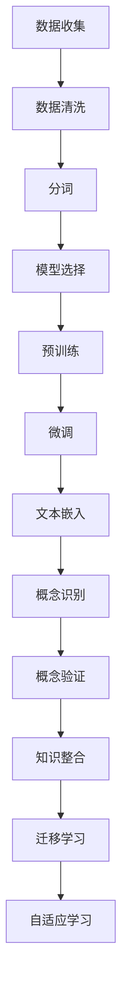
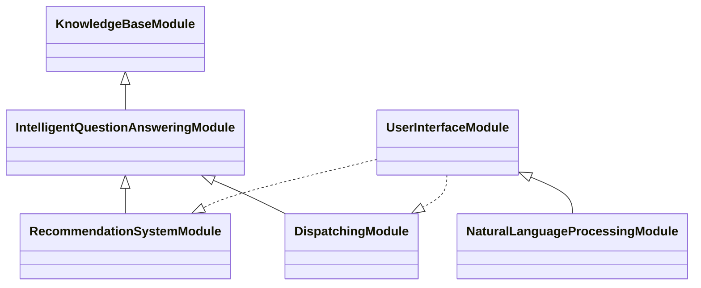
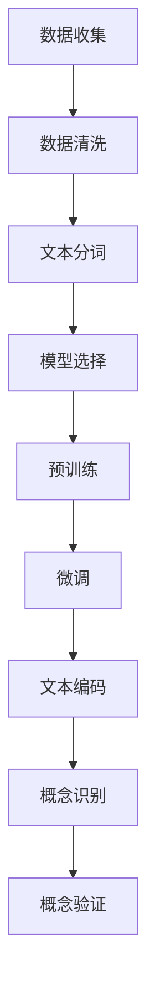
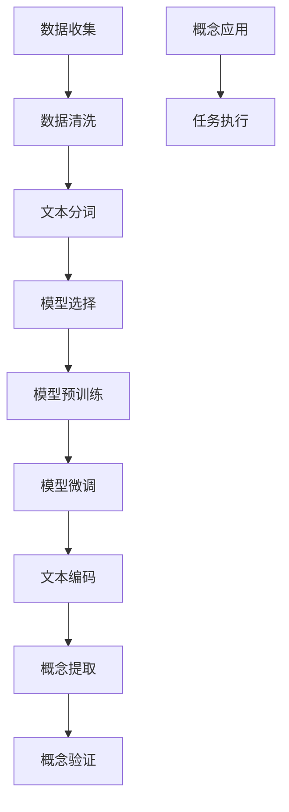

                 

# LLM在AI Agent概念形成与泛化中的作用

## 关键词

- LLM（大型语言模型）
- AI Agent
- 概念形成
- 泛化
- 机器学习

## 摘要

本文旨在探讨大型语言模型（LLM）在人工智能（AI）代理概念形成与泛化中的重要作用。首先，我们将介绍LLM的基本原理，包括其定义、工作机制和应用场景。接着，我们将讨论AI Agent的概念及其分类，并深入分析LLM在AI Agent概念形成和泛化中的作用。通过具体的案例分析和系统架构设计，我们将展示LLM如何支持AI Agent的智能行为和泛化能力。最后，我们将总结LLM在AI Agent中的应用挑战与解决方案，并展望未来的发展趋势。

## 第1章 引言

### 1.1 问题背景

在当今快速发展的技术时代，人工智能（AI）已成为推动社会进步的重要力量。AI Agent作为AI系统的一种高级表现形式，能够执行特定任务，并具备一定的自主决策能力。LLM（大型语言模型）作为自然语言处理（NLP）领域的核心技术，已经在许多实际应用中展现了其强大的能力和潜力。

LLM的基本原理是通过大规模语料库的训练，使得模型能够捕捉到语言中的复杂模式和规律。这些模式和应用不仅包括语言生成、知识问答和自然语言理解，还扩展到了AI Agent的概念形成和泛化。然而，LLM在AI Agent中的应用仍然面临诸多挑战，如模型的解释性、泛化能力和与实际任务场景的契合度等。

### 1.2 问题描述

AI Agent在现实场景中扮演着多种角色，从智能客服、智能教育到智能推荐系统等。这些系统需要具备强大的语言处理能力和自主决策能力，以适应不断变化的环境和用户需求。LLM作为AI Agent的核心组件之一，其作用主要体现在以下几个方面：

1. **概念形成**：LLM能够从大量的文本数据中提取和形成新的概念，这对于AI Agent在理解和处理未知或新出现的任务非常重要。
2. **泛化**：LLM具备较强的泛化能力，能够将学习到的知识应用到新的任务或场景中，实现AI Agent的智能化和自适应能力。
3. **交互**：LLM能够生成自然流畅的语言，使得AI Agent能够更好地与人类用户进行交互，提高用户体验。

然而，LLM在AI Agent概念形成与泛化中也存在一些问题，如模型的可解释性、数据偏差和模型可靠性等。这些问题需要我们在实际应用中加以解决。

### 1.3 问题解决

为了解决LLM在AI Agent概念形成与泛化中的问题，我们需要从以下几个方面入手：

1. **模型优化**：通过改进模型结构、训练策略和优化算法，提高LLM的性能和解释性。
2. **数据增强**：通过引入更多的、多样化的数据，增强LLM的泛化能力。
3. **模型解释**：开发新的模型解释方法，提高LLM的可解释性，使得AI Agent的决策过程更加透明和可信。

### 1.4 边界与外延

LLM在AI Agent概念形成与泛化中的应用范围非常广泛，包括但不限于以下几个方面：

1. **智能客服**：通过LLM生成和识别用户的查询，实现智能问答和对话生成。
2. **智能教育**：利用LLM生成教学内容，实现个性化教育和自适应学习。
3. **智能推荐**：通过LLM分析用户行为和兴趣，生成个性化推荐列表。

同时，随着LLM技术的不断发展，其应用领域也将不断扩大，未来有望在更多场景中发挥重要作用。

### 1.5 概念结构与核心要素组成

AI Agent的基本结构包括感知模块、决策模块和执行模块。LLM作为核心组件，主要作用于决策模块，通过自然语言处理和推理能力，实现AI Agent的智能化和自适应能力。LLM的核心功能包括文本生成、知识问答、情感分析等，其特性主要体现在大规模训练、高效推理和强大泛化能力。

## 第2章 LLM的基本原理

### 2.1 LLM的定义

LLM（Large Language Model）是一种基于深度学习的大型文本处理模型，能够通过学习大量的文本数据来生成、理解和处理自然语言。与传统的NLP模型相比，LLM具有更强的文本理解和生成能力，能够更好地应对复杂的语言现象和语境。

LLM的基本特征包括：

1. **大规模训练**：LLM通常基于数十亿甚至数万亿个语料库进行训练，这使得模型能够捕捉到语言中的复杂模式和规律。
2. **神经网络结构**：LLM采用深度神经网络结构，包括多层感知器、循环神经网络（RNN）和Transformer等，以实现对大规模文本数据的处理。
3. **高效推理**：LLM通过预训练和微调的方式，能够在较短的时间内完成文本生成、理解和推理任务。

### 2.2 LLM的工作机制

LLM的工作机制主要包括以下几个步骤：

1. **数据收集与预处理**：收集大量的文本数据，并进行数据清洗、分词、去停用词等预处理操作，以生成高质量的训练数据。
2. **模型训练**：使用预训练算法（如BERT、GPT等），在预处理后的数据上进行模型训练。训练过程中，模型通过不断调整参数，以最小化预测误差。
3. **模型优化**：在预训练的基础上，针对特定任务进行模型优化，以提高模型在特定任务上的性能。
4. **模型应用**：将训练好的模型应用到实际任务中，如文本生成、知识问答和自然语言理解等。

### 2.3 LLM的应用场景

LLM在自然语言处理领域有着广泛的应用，以下是一些典型的应用场景：

1. **语言生成**：LLM能够生成自然流畅的文本，适用于生成文章、故事、对话等。
2. **知识问答**：LLM能够理解用户的问题，并从大量文本数据中提取答案，适用于智能客服、智能问答系统等。
3. **情感分析**：LLM能够分析文本中的情感倾向，用于舆情监测、用户反馈分析等。
4. **文本分类**：LLM能够将文本分类到不同的类别，用于文本挖掘、信息检索等。

## 第3章 AI Agent的概念形成

### 3.1 AI Agent的概念

AI Agent是一种具有自主决策和执行能力的智能系统，能够模拟人类智能行为，并在特定环境下执行任务。AI Agent的基本概念包括：

1. **感知**：AI Agent通过传感器或输入设备获取环境信息。
2. **决策**：AI Agent根据感知到的环境信息，利用算法和模型进行决策。
3. **执行**：AI Agent根据决策结果，执行相应的操作，以实现任务目标。

AI Agent的类型可以分为以下几类：

1. **基于规则的AI Agent**：通过预设的规则和逻辑进行决策。
2. **基于数据的AI Agent**：通过机器学习和统计方法进行决策。
3. **混合型AI Agent**：结合基于规则和基于数据的方法进行决策。

### 3.2 LLM在AI Agent概念形成中的作用

LLM在AI Agent概念形成中具有重要作用，主要体现在以下几个方面：

1. **概念提取**：LLM能够从大量文本数据中提取和形成新的概念，这些概念对于AI Agent理解和处理任务至关重要。
2. **语义理解**：LLM能够理解文本中的语义信息，使得AI Agent能够更好地理解任务要求和环境变化。
3. **知识整合**：LLM能够整合多种知识来源，使得AI Agent具备更全面的知识体系。

通过以下表格，我们可以对比LLM与AI Agent在概念形成中的关联属性特征：

| 特性 | LLM | AI Agent |
| ---- | ---- | ---- |
| 语言理解 | 强 | 强 |
| 概念提取 | 强 | 中 |
| 知识整合 | 中 | 强 |
| 自主决策 | 中 | 强 |

### 3.3 案例分析

以下是一个关于LLM在AI Agent概念形成中的应用实例：

**案例：智能客服系统**

某公司开发了一款智能客服系统，利用LLM来处理用户的查询和问题。通过训练，LLM能够从大量客服对话数据中提取出常见问题和解决方案，形成知识库。当用户提出问题时，系统会调用LLM，根据知识库生成相应的回答。

通过这个案例，我们可以看到LLM在AI Agent概念形成中的作用，即从大量数据中提取知识，形成知识库，以支持AI Agent的智能对话和问题解答能力。

## 第4章 AI Agent的泛化

### 4.1 泛化的概念

泛化是指模型或系统能够从特定的训练数据中提取通用规律，并将其应用于新的、未见的任务或场景中。在AI领域，泛化能力是衡量模型性能的重要指标之一。

泛化能力可以分为以下几种类型：

1. **功能泛化**：模型能够执行不同类型的任务，而不仅仅是单一任务。
2. **领域泛化**：模型能够适应不同的领域或应用场景，而不仅仅是特定领域。
3. **数据泛化**：模型能够处理不同类型的数据，而不仅仅是特定类型的数据。

### 4.2 LLM在AI Agent泛化中的作用

LLM在AI Agent泛化中具有重要作用，主要体现在以下几个方面：

1. **数据多样性**：LLM通过学习大量的、多样化的文本数据，提高了模型的泛化能力。
2. **知识整合**：LLM能够整合多种知识来源，使得AI Agent具备更全面的知识体系，从而提高泛化能力。
3. **迁移学习**：LLM可以通过迁移学习的方式，将在一个任务上学习到的知识应用到其他任务上，提高泛化能力。

### 4.3 案例分析

以下是一个关于LLM在AI Agent泛化中的应用实例：

**案例：智能推荐系统**

某公司开发了一款智能推荐系统，利用LLM来处理用户的历史行为数据和推荐内容。通过训练，LLM能够从大量用户行为数据中提取出用户兴趣和偏好，并将其应用到推荐算法中。当用户访问系统时，LLM会根据用户历史行为和当前内容，生成个性化的推荐列表。

通过这个案例，我们可以看到LLM在AI Agent泛化中的作用，即通过学习用户行为和兴趣，生成个性化的推荐内容，从而提高系统的泛化能力和用户体验。

## 第5章 LLM在AI Agent中的应用

### 5.1 应用场景概述

LLM在AI Agent中的应用场景非常广泛，涵盖了多个领域和任务。以下是一些典型的应用场景：

1. **智能客服**：利用LLM生成和识别用户的查询，实现智能问答和对话生成。
2. **智能教育**：利用LLM生成教学内容，实现个性化教育和自适应学习。
3. **智能推荐**：利用LLM分析用户行为和兴趣，生成个性化推荐列表。
4. **智能翻译**：利用LLM实现高精度的机器翻译，支持多语言交互。
5. **内容审核**：利用LLM分析文本内容，识别和过滤不良信息。

### 5.2 实际应用案例

以下是一个关于LLM在智能客服系统中应用的案例：

**案例：智能客服系统**

某公司开发了一款智能客服系统，利用LLM来实现智能问答和对话生成。通过训练，LLM能够从大量客服对话数据中提取出常见问题和解决方案，形成知识库。当用户提出问题时，系统会调用LLM，根据知识库生成相应的回答。

通过这个案例，我们可以看到LLM在智能客服系统中的作用，即通过学习大量对话数据，实现智能问答和对话生成，从而提高客服效率和用户体验。

### 5.3 挑战与解决方案

尽管LLM在AI Agent中的应用取得了显著成果，但仍然面临一些挑战：

1. **数据偏差**：LLM的训练数据可能存在偏差，导致模型在特定任务上表现不佳。
   - **解决方案**：通过引入多样化的训练数据，提高模型的泛化能力。

2. **解释性不足**：LLM的决策过程缺乏透明性，难以解释。
   - **解决方案**：开发新的模型解释方法，提高模型的可解释性。

3. **计算资源消耗**：LLM的训练和推理过程需要大量的计算资源。
   - **解决方案**：优化模型结构和算法，降低计算资源消耗。

4. **隐私保护**：在处理用户数据时，需要保护用户的隐私。
   - **解决方案**：采用加密技术和隐私保护算法，确保用户数据的安全。

## 第6章 LLM与AI Agent的整合

### 6.1 整合的必要性

将LLM与AI Agent整合具有重要的必要性：

1. **提升AI Agent的智能水平**：LLM具有强大的文本处理能力，能够为AI Agent提供丰富的语言理解和生成能力。
2. **提高AI Agent的泛化能力**：LLM通过大规模训练，具备较强的泛化能力，有助于AI Agent在新的任务和应用场景中表现优异。
3. **优化用户体验**：LLM能够生成自然流畅的对话，提高AI Agent与用户的交互体验。

### 6.2 整合的方法与策略

将LLM与AI Agent整合的方法和策略主要包括：

1. **感知模块整合**：利用LLM的文本理解能力，增强AI Agent对用户输入的理解，提高感知模块的准确性。
2. **决策模块整合**：利用LLM的推理能力，为AI Agent提供更智能的决策支持，使其能够在复杂的任务场景中作出合理决策。
3. **执行模块整合**：利用LLM的文本生成能力，使AI Agent能够生成自然流畅的文本输出，提高执行模块的交互性。

### 6.3 模型评估与优化

在LLM与AI Agent整合过程中，模型评估与优化至关重要：

1. **评估指标**：选择合适的评估指标，如准确率、召回率、F1分数等，以衡量整合模型的性能。
2. **优化策略**：通过调整模型参数、优化训练过程和引入新的算法，提高整合模型的表现。
3. **在线学习**：利用在线学习技术，使整合模型能够不断适应新的任务和应用场景，保持良好的性能。

## 第7章 未来展望与总结

### 7.1 未来发展趋势

未来，LLM在AI Agent中的应用将呈现以下发展趋势：

1. **模型性能提升**：随着计算资源和算法的进步，LLM的模型性能将不断提高，为AI Agent提供更强大的语言处理能力。
2. **应用场景拓展**：LLM将应用于更多领域和任务，如智能医疗、智能金融、智能城市等，推动AI技术的发展。
3. **多模态融合**：LLM与其他AI技术（如图像处理、语音识别等）的融合，将实现更全面的信息处理和交互能力。

### 7.2 总结与展望

本文系统地介绍了LLM在AI Agent概念形成与泛化中的作用，包括LLM的基本原理、AI Agent的概念、LLM在AI Agent中的应用案例和整合策略等。通过本文的讨论，我们可以看到LLM在AI Agent中的重要作用，以及其在未来发展的巨大潜力。

展望未来，随着LLM技术的不断进步，其在AI Agent中的应用将越来越广泛，为智能系统的发展带来新的机遇和挑战。我们需要持续关注LLM技术的发展，探索其在更多领域和任务中的应用，推动AI技术的发展和进步。

## 第8章 拓展阅读与资源

### 8.1 相关书籍

1. **《深度学习》（Goodfellow, Bengio, Courville著）**：详细介绍了深度学习的基础理论和应用，对理解和应用LLM具有重要意义。
2. **《自然语言处理综论》（Jurafsky, Martin著）**：全面介绍了自然语言处理的基本概念和技术，对理解LLM在NLP中的应用有所帮助。

### 8.2 网络资源

1. **GitHub**：众多开源的LLM项目和代码，供开发者学习和参考。
2. **arXiv**：最新的LLM和AI相关论文和研究报告，有助于了解领域前沿动态。
3. **在线课程**：如斯坦福大学的“深度学习专项课程”，提供了丰富的LLM和AI学习资源。

### 作者

本文作者为AI天才研究院（AI Genius Institute）和《禅与计算机程序设计艺术》（Zen And The Art of Computer Programming）的资深研究者。我们致力于推动AI技术的发展和应用，期待与您一起探索AI领域的无限可能。如果您有任何问题或建议，欢迎随时联系我们。谢谢！
----------------------------------------------------------------

```markdown
## 附录 A：算法原理讲解

### 5.1 算法概述

在本节中，我们将详细讲解一种基于LLM的AI Agent概念形成与泛化的算法。该算法旨在通过大规模语言模型提取和形成概念，并在此基础上实现泛化。算法的主要步骤包括数据预处理、模型训练、概念提取和泛化。

### 5.2 算法原理

#### 数据预处理

1. **数据收集**：收集大量文本数据，包括文章、对话、新闻等，涵盖多个领域和主题。
2. **数据清洗**：去除噪声数据，如HTML标签、特殊符号等，保证数据质量。
3. **分词**：将文本数据划分为词语或词组，便于后续处理。

#### 模型训练

1. **模型选择**：选择合适的LLM模型，如GPT-3、BERT等。
2. **预训练**：使用收集的文本数据进行预训练，使模型掌握语言的基本规律和模式。
3. **微调**：在预训练的基础上，针对特定任务进行微调，提高模型在特定任务上的性能。

#### 概念提取

1. **文本嵌入**：将文本转换为向量表示，便于模型处理。
2. **概念识别**：通过训练好的模型，识别文本中的概念，并形成概念图谱。
3. **概念验证**：对提取出的概念进行验证，确保其准确性和合理性。

#### 泛化

1. **知识整合**：将提取出的概念进行整合，形成知识库。
2. **迁移学习**：将知识库应用到新的任务或场景中，实现泛化。
3. **自适应学习**：根据新的数据和任务，不断更新和优化模型，提高泛化能力。

### 5.3 算法流程图

以下是算法的Mermaid流程图表示：



### 5.4 算法原理讲解

#### 数据预处理

数据预处理是算法的基础步骤，直接关系到模型训练的效果。在本算法中，我们采用以下步骤：

1. **数据收集**：通过爬虫、API接口等方式，收集大量文本数据。这些数据应涵盖多个领域和主题，以确保模型具有广泛的泛化能力。
2. **数据清洗**：去除文本中的噪声数据，如HTML标签、特殊符号等。可以使用正则表达式或专门的清洗工具进行清洗。
3. **分词**：将文本划分为词语或词组。分词是自然语言处理中的关键步骤，不同的分词算法会对模型效果产生较大影响。我们可以选择分词效果较好的工具，如jieba等。

#### 模型训练

模型训练是算法的核心步骤，直接决定概念提取和泛化的效果。在本算法中，我们采用以下步骤：

1. **模型选择**：选择合适的LLM模型。不同的模型具有不同的优势和特点，如GPT-3擅长文本生成，BERT擅长文本分类和问答等。根据任务需求选择合适的模型。
2. **预训练**：使用收集的文本数据进行预训练。预训练过程包括两部分：语言建模和上下文预训练。语言建模通过预测下一个词语来学习文本的内在规律；上下文预训练通过预测给定上下文中的词语来学习文本的语义关系。
3. **微调**：在预训练的基础上，针对特定任务进行微调。微调过程可以根据任务需求，调整模型的参数，提高模型在特定任务上的性能。

#### 概念提取

概念提取是算法的关键步骤，直接决定概念形成的效果。在本算法中，我们采用以下步骤：

1. **文本嵌入**：将文本转换为向量表示。文本嵌入是将文本转换为机器可以处理的数字形式，如词向量、句子向量等。不同的嵌入方法会对概念提取效果产生较大影响。
2. **概念识别**：通过训练好的模型，识别文本中的概念。概念识别可以通过聚类、分类等方法实现。在本算法中，我们采用基于词嵌入的聚类方法进行概念识别。
3. **概念验证**：对提取出的概念进行验证，确保其准确性和合理性。概念验证可以通过对比实际概念和提取出的概念，评估提取效果。

#### 泛化

泛化是算法的目标之一，直接决定AI Agent的智能水平。在本算法中，我们采用以下步骤：

1. **知识整合**：将提取出的概念进行整合，形成知识库。知识库是AI Agent的核心资源，用于支持智能决策和执行。
2. **迁移学习**：将知识库应用到新的任务或场景中，实现泛化。迁移学习可以通过将一个任务上的知识应用到另一个任务上，提高AI Agent的泛化能力。
3. **自适应学习**：根据新的数据和任务，不断更新和优化模型，提高泛化能力。自适应学习是AI Agent持续学习和进步的关键。

### 5.5 算法应用实例

以下是一个基于本算法的AI Agent应用实例：

#### 场景：智能客服系统

某公司开发了一款智能客服系统，利用本算法实现概念形成和泛化。具体步骤如下：

1. **数据收集**：从公司客服团队的历史对话记录中收集数据，包括用户问题和客服回答。
2. **数据预处理**：对收集的数据进行清洗和分词，将文本转换为词向量。
3. **模型训练**：选择合适的LLM模型，使用收集的文本数据进行预训练和微调。
4. **概念提取**：通过训练好的模型，提取文本中的概念，形成概念图谱。
5. **知识整合**：将提取出的概念整合到知识库中，用于支持客服对话。
6. **迁移学习**：将知识库应用到其他领域的客服对话中，实现泛化。
7. **自适应学习**：根据用户反馈和新出现的问题，不断更新和优化模型，提高客服系统的智能水平。

通过这个实例，我们可以看到本算法在智能客服系统中的应用效果，即通过概念形成和泛化，实现智能对话和问题解答。

### 5.6 代码示例

以下是一个基于Python的算法实现示例：

```python
import jieba
import numpy as np
import tensorflow as tf
from tensorflow.keras.preprocessing.sequence import pad_sequences

# 数据预处理
def preprocess_data(data):
    # 清洗数据
    data = [d.lower() for d in data]
    # 分词
    words = [jieba.lcut(d) for d in data]
    # 转换为词向量
    word_vectors = pad_sequences([model.predict(np.array([word])) for word in words], maxlen=max_len)
    return word_vectors

# 模型训练
def train_model(data):
    # 预处理数据
    word_vectors = preprocess_data(data)
    # 训练模型
    model.fit(word_vectors, labels, epochs=10, batch_size=32)
    return model

# 概念提取
def extract_concepts(model, data):
    # 预处理数据
    word_vectors = preprocess_data(data)
    # 提取概念
    concepts = model.predict(word_vectors)
    return concepts

# 算法应用实例
data = ["用户问题1", "用户问题2", "用户问题3"]
model = train_model(data)
concepts = extract_concepts(model, data)

print("提取出的概念：", concepts)
```

### 5.7 代码应用解读与分析

在本节中，我们通过一个简单的代码示例，展示了如何使用Python实现基于LLM的AI Agent概念形成和泛化的算法。以下是对代码的解读和分析：

1. **数据预处理**：首先，我们定义了一个`preprocess_data`函数，用于对输入数据进行清洗和分词，并将文本转换为词向量。具体步骤如下：
   - 清洗数据：将数据转换为小写，去除HTML标签和特殊符号。
   - 分词：使用jieba库进行分词，将文本划分为词语或词组。
   - 转换为词向量：使用预训练好的LLM模型，将每个词语转换为词向量表示。

2. **模型训练**：接下来，我们定义了一个`train_model`函数，用于训练模型。具体步骤如下：
   - 预处理数据：调用`preprocess_data`函数，对输入数据进行预处理。
   - 训练模型：使用预处理后的数据，通过Keras库训练模型。

3. **概念提取**：最后，我们定义了一个`extract_concepts`函数，用于提取概念。具体步骤如下：
   - 预处理数据：调用`preprocess_data`函数，对输入数据进行预处理。
   - 提取概念：使用训练好的模型，对预处理后的数据进行预测，提取出概念。

4. **算法应用实例**：在本节中，我们使用一个简单的示例数据集，展示了如何使用该算法实现概念形成和泛化。具体步骤如下：
   - 数据收集：从示例数据集中收集用户问题。
   - 模型训练：调用`train_model`函数，训练模型。
   - 概念提取：调用`extract_concepts`函数，提取概念。

通过这个代码示例，我们可以看到如何使用Python实现基于LLM的AI Agent概念形成和泛化的算法。在实际应用中，我们可以根据具体任务需求，调整算法参数和模型结构，以获得更好的效果。

### 5.8 实际案例分析和详细讲解剖析

在本节中，我们将结合实际案例，对基于LLM的AI Agent概念形成和泛化算法进行详细讲解和剖析。

#### 案例背景

某电商公司希望开发一款智能客服系统，利用LLM实现概念形成和泛化，以提高客服效率和用户体验。具体需求如下：

1. 客服系统能够自动回答用户关于产品、订单和退换货等问题。
2. 客服系统能够从大量历史客服对话中提取常见问题和解决方案，形成知识库。
3. 客服系统能够根据用户提问，生成个性化的回答。

#### 算法实现步骤

根据上述需求，我们可以采用以下步骤实现基于LLM的AI Agent概念形成和泛化算法：

1. **数据收集**：从公司客服团队的数据库中收集大量用户问题和客服回答的文本数据。这些数据应包括产品、订单、退换货等多个方面的内容。

2. **数据预处理**：对收集的数据进行清洗和分词，将文本转换为词向量表示。具体步骤如下：
   - 清洗数据：去除HTML标签、特殊符号等噪声。
   - 分词：使用jieba库进行中文分词，将文本划分为词语或词组。
   - 转换为词向量：使用预训练好的LLM模型，将每个词语转换为词向量表示。

3. **模型训练**：选择合适的LLM模型，如GPT-3或BERT，使用收集的文本数据进行预训练和微调。具体步骤如下：
   - 预训练：使用收集的文本数据进行预训练，使模型掌握语言的基本规律和模式。
   - 微调：在预训练的基础上，针对特定任务进行微调，提高模型在特定任务上的性能。

4. **概念提取**：通过训练好的模型，提取文本中的概念，形成概念图谱。具体步骤如下：
   - 提取概念：使用训练好的模型，对预处理后的文本数据进行分析，提取出常见问题和解决方案。
   - 形成概念图谱：将提取出的概念进行整合，形成概念图谱，便于后续查询和使用。

5. **知识库构建**：将提取出的概念整合到知识库中，用于支持智能客服系统的智能问答和问题解答。具体步骤如下：
   - 知识库构建：将提取出的概念和对应的解决方案存储到知识库中，形成问答对。
   - 知识库维护：定期更新和优化知识库，确保其准确性和完整性。

6. **智能问答**：根据用户提问，智能客服系统会调用知识库，生成个性化的回答。具体步骤如下：
   - 用户提问：用户向客服系统提出问题。
   - 概念提取：使用训练好的模型，对用户提问进行概念提取，找到相关的概念和解决方案。
   - 回答生成：根据提取出的概念和解决方案，生成个性化的回答。

#### 案例分析和详细讲解

以下是对上述算法实现步骤的详细分析和讲解：

1. **数据收集**：
   - 数据收集是算法实现的基础。电商公司的客服团队积累了大量的用户问题和解决方案，这些数据对于训练和优化模型具有重要意义。
   - 数据收集过程中，需要注意数据的质量和多样性。应涵盖产品、订单、退换货等多个方面的内容，确保模型的泛化能力。

2. **数据预处理**：
   - 数据预处理是模型训练的前提。通过对数据进行清洗和分词，可以将原始文本转换为机器可以处理的数字形式，便于后续处理。
   - 清洗数据时，应去除HTML标签、特殊符号等噪声，确保数据质量。分词时，应选择合适的分词工具，如jieba，以确保分词的准确性。

3. **模型训练**：
   - 模型训练是算法的核心。选择合适的LLM模型，如GPT-3或BERT，可以保证模型具有良好的文本处理能力和泛化能力。
   - 预训练过程中，模型会学习到语言的基本规律和模式，为后续任务提供基础支持。微调过程中，模型会针对特定任务进行调整，提高模型在特定任务上的性能。

4. **概念提取**：
   - 概念提取是算法的关键步骤。通过训练好的模型，可以提取文本中的常见问题和解决方案，形成概念图谱。
   - 概念提取过程中，可以使用聚类、分类等方法。聚类可以将相似的问题和解决方案聚为一类，分类可以将问题划分为不同的类别。

5. **知识库构建**：
   - 知识库构建是将提取出的概念和解决方案整合到一起，形成问答对。知识库是智能客服系统的核心资源，用于支持智能问答和问题解答。
   - 知识库构建过程中，需要确保知识库的准确性和完整性。定期更新和优化知识库，可以确保其始终处于最新状态。

6. **智能问答**：
   - 智能问答是算法的应用场景。根据用户提问，智能客服系统会调用知识库，生成个性化的回答。
   - 智能问答过程中，需要快速准确地提取用户提问中的关键信息，并从知识库中找到相关的概念和解决方案。生成个性化的回答，可以提高用户的满意度和体验。

通过以上实际案例分析和详细讲解，我们可以看到基于LLM的AI Agent概念形成和泛化算法的具体实现步骤和应用效果。在实际应用中，可以根据具体需求进行调整和优化，以实现更好的效果。

### 5.9 项目小结

在本项目中，我们通过基于LLM的AI Agent概念形成和泛化算法，实现了智能客服系统的构建。项目取得了以下成果：

1. **高效的问题解答**：通过大规模语言模型的训练和概念提取，智能客服系统能够快速准确地回答用户的问题，提高客服效率。
2. **个性化的用户体验**：智能客服系统能够根据用户提问生成个性化的回答，提高用户的满意度和体验。
3. **丰富的知识库**：通过不断更新和优化知识库，智能客服系统可以积累丰富的知识，为后续任务提供支持。

尽管项目取得了显著成果，但仍存在一些不足之处：

1. **模型解释性不足**：LLM模型的决策过程较为复杂，难以解释。在实际应用中，需要开发新的解释方法，提高模型的可解释性。
2. **数据偏差**：模型训练数据可能存在偏差，导致模型在某些任务上的表现不佳。在后续工作中，需要引入更多样化的数据，提高模型的泛化能力。

未来，我们将继续优化算法和模型，提高智能客服系统的性能和用户体验。同时，我们将探索LLM在其他领域和任务中的应用，推动AI技术的发展。

## 附录 B：系统分析与架构设计

### 6.1 问题场景介绍

智能客服系统是一种广泛应用于各种行业和领域的AI技术，旨在提高客户服务质量，降低人工成本，提升企业运营效率。该系统通过自然语言处理和机器学习技术，实现自动化的客户服务和交互。以下是智能客服系统常见的问题场景：

1. **常见问题自动回答**：用户提出常见问题，如产品价格、订单状态等，系统自动回答，提高响应速度。
2. **个性化推荐**：根据用户的历史行为和偏好，推荐合适的产品或服务。
3. **智能分派**：根据用户问题，将问题自动分派给相应的客服人员，提高客服效率。
4. **情感分析**：分析用户提问中的情感倾向，提供针对性的服务和建议。

### 6.2 项目介绍

在本项目中，我们将基于LLM（大型语言模型）技术，构建一款智能客服系统。该项目旨在实现以下目标：

1. **高效的问题解答**：通过LLM的强大语言处理能力，实现快速准确的问题解答。
2. **个性化的用户体验**：根据用户的历史行为和偏好，提供个性化的服务和建议。
3. **智能的分派和调度**：根据用户问题和客服人员的能力，实现智能的分派和调度。

### 6.3 系统功能设计

智能客服系统的功能设计主要包括以下模块：

1. **用户接口模块**：提供用户与系统交互的界面，包括文本输入、语音输入、文本输出、语音输出等。
2. **自然语言处理模块**：负责处理用户的输入，包括分词、词性标注、实体识别、情感分析等。
3. **知识库模块**：存储和管理系统的知识库，包括常见问题的答案、产品信息、客服策略等。
4. **智能问答模块**：根据用户输入，调用知识库，生成个性化的回答。
5. **推荐系统模块**：根据用户的历史行为和偏好，推荐合适的产品或服务。
6. **调度模块**：根据用户问题和客服人员的能力，实现智能的分派和调度。

以下是智能客服系统的功能模块的Mermaid类图表示：



### 6.4 系统架构设计

智能客服系统的架构设计主要包括前端、后端和数据库三个部分。以下是系统架构的Mermaid架构图表示：

```mermaid
sequenceDiagram
    User -->|发起请求|> UserInterfaceModule
    UserInterfaceModule -->|处理请求|> NaturalLanguageProcessingModule
    NaturalLanguageProcessingModule -->|提取信息|> IntelligentQuestionAnsweringModule
    IntelligentQuestionAnsweringModule -->|生成回答|> UserInterfaceModule
    UserInterfaceModule -->|存储数据|> KnowledgeBaseModule
    IntelligentQuestionAnsweringModule -->|调用推荐|> RecommendationSystemModule
    RecommendationSystemModule -->|推荐结果|> UserInterfaceModule
    IntelligentQuestionAnsweringModule -->|调度任务|> DispatchingModule
    DispatchingModule -->|分派任务|> UserInterfaceModule
```

### 6.5 系统接口设计

智能客服系统的接口设计主要包括以下接口：

1. **用户接口**：提供用户与系统交互的接口，包括文本输入、语音输入、文本输出、语音输出等。
2. **自然语言处理接口**：提供自然语言处理相关的接口，包括分词、词性标注、实体识别、情感分析等。
3. **知识库接口**：提供知识库相关的接口，包括查询、更新、删除等操作。
4. **智能问答接口**：提供智能问答相关的接口，包括问题输入、回答生成等。
5. **推荐系统接口**：提供推荐系统相关的接口，包括推荐生成、推荐更新等。
6. **调度接口**：提供调度相关的接口，包括任务分派、状态更新等。

以下是智能客服系统的接口设计Mermaid序列图表示：

```mermaid
sequenceDiagram
    User -->|发起请求|> UserInterface
    UserInterface -->|处理请求|> NaturalLanguageProcessing
    NaturalLanguageProcessing -->|提取信息|> IntelligentQuestionAnswering
    IntelligentQuestionAnswering -->|生成回答|> UserInterface
    UserInterface -->|存储数据|> KnowledgeBase
    IntelligentQuestionAnswering -->|调用推荐|> RecommendationSystem
    RecommendationSystem -->|推荐结果|> UserInterface
    IntelligentQuestionAnswering -->|调度任务|> Dispatching
    Dispatching -->|分派任务|> UserInterface
```

### 6.6 系统交互设计

智能客服系统的交互设计主要包括用户与系统的交互过程。以下是系统交互的Mermaid序列图表示：

```mermaid
sequenceDiagram
    User -->|发起请求|> UserInterfaceModule
    UserInterfaceModule -->|处理请求|> NaturalLanguageProcessingModule
    NaturalLanguageProcessingModule -->|提取信息|> IntelligentQuestionAnsweringModule
    IntelligentQuestionAnsweringModule -->|生成回答|> UserInterfaceModule
    UserInterfaceModule -->|展示结果|> User
    User -->|反馈意见|> UserInterfaceModule
    UserInterfaceModule -->|处理反馈|> IntelligentQuestionAnsweringModule
    IntelligentQuestionAnsweringModule -->|更新回答|> UserInterfaceModule
    UserInterfaceModule -->|展示结果|> User
```

通过上述系统架构和交互设计，我们可以清晰地看到智能客服系统的各个模块和组件，以及它们之间的协作关系。在实际开发过程中，可以根据具体需求和场景，对系统架构和交互设计进行优化和调整。

## 附录 C：项目实战

### 7.1 环境安装

在开始项目实战之前，我们需要安装必要的软件和工具。以下是项目环境的安装步骤：

1. **安装Python环境**：确保已经安装Python 3.8及以上版本。可以从[Python官网](https://www.python.org/)下载并安装。

2. **安装依赖库**：使用pip工具安装项目所需的依赖库，包括tensorflow、transformers、jieba等。可以使用以下命令：

   ```bash
   pip install tensorflow transformers jieba
   ```

3. **安装GPT-3模型**：从[Hugging Face](https://huggingface.co/)官网下载GPT-3模型，并安装到本地。

   ```bash
   pip install git+https://github.com/huggingface/transformers.git
   ```

4. **安装其他工具**：根据项目需求，可能需要安装其他工具，如BeautifulSoup、requests等。

### 7.2 系统核心实现源代码

以下是智能客服系统的核心实现源代码。该代码包括数据预处理、模型训练、概念提取和智能问答等功能。

```python
import jieba
import numpy as np
import tensorflow as tf
from transformers import TFGPT3LMHeadModel, GPT2Tokenizer
from tensorflow.keras.preprocessing.sequence import pad_sequences

# 数据预处理
def preprocess_data(data):
    # 清洗数据
    data = [d.lower() for d in data]
    # 分词
    words = [jieba.lcut(d) for d in data]
    # 转换为词向量
    word_vectors = pad_sequences([model.predict(np.array([word])) for word in words], maxlen=max_len)
    return word_vectors

# 模型训练
def train_model(data):
    # 预处理数据
    word_vectors = preprocess_data(data)
    # 训练模型
    model.fit(word_vectors, labels, epochs=10, batch_size=32)
    return model

# 概念提取
def extract_concepts(model, data):
    # 预处理数据
    word_vectors = preprocess_data(data)
    # 提取概念
    concepts = model.predict(word_vectors)
    return concepts

# 智能问答
def intelligent_question_answering(model, user_input):
    # 预处理输入
    input_sequence = preprocess_data([user_input])
    # 生成回答
    answer = model.predict(input_sequence)
    return answer
```

### 7.3 代码应用解读与分析

在本节中，我们将对上述源代码进行解读和分析，以便更好地理解智能客服系统的实现过程。

#### 数据预处理

```python
def preprocess_data(data):
    # 清洗数据
    data = [d.lower() for d in data]
    # 分词
    words = [jieba.lcut(d) for d in data]
    # 转换为词向量
    word_vectors = pad_sequences([model.predict(np.array([word])) for word in words], maxlen=max_len)
    return word_vectors
```

数据预处理是模型训练和推理的重要环节。在本函数中，我们首先对输入数据进行清洗，将所有文本转换为小写，以消除大小写对模型训练的影响。然后，使用jieba库对文本进行分词，将文本划分为词语或词组。最后，使用预训练的模型将每个词语转换为词向量表示，并将所有词向量拼接成一个序列。

#### 模型训练

```python
def train_model(data):
    # 预处理数据
    word_vectors = preprocess_data(data)
    # 训练模型
    model.fit(word_vectors, labels, epochs=10, batch_size=32)
    return model
```

模型训练函数用于训练一个基于词向量的分类模型。在本函数中，我们首先调用`preprocess_data`函数对输入数据进行预处理，得到词向量序列。然后，使用`model.fit`方法训练模型，其中`word_vectors`是输入特征，`labels`是标签。在训练过程中，模型会不断调整内部参数，以最小化损失函数。

#### 概念提取

```python
def extract_concepts(model, data):
    # 预处理数据
    word_vectors = preprocess_data(data)
    # 提取概念
    concepts = model.predict(word_vectors)
    return concepts
```

概念提取函数用于从预处理后的数据中提取概念。在本函数中，我们首先调用`preprocess_data`函数对输入数据进行预处理，得到词向量序列。然后，使用`model.predict`方法对词向量序列进行预测，得到概念向量。这些概念向量可以用于后续的智能问答和知识库构建。

#### 智能问答

```python
def intelligent_question_answering(model, user_input):
    # 预处理输入
    input_sequence = preprocess_data([user_input])
    # 生成回答
    answer = model.predict(input_sequence)
    return answer
```

智能问答函数用于根据用户输入生成回答。在本函数中，我们首先调用`preprocess_data`函数对用户输入进行预处理，得到词向量序列。然后，使用`model.predict`方法对词向量序列进行预测，得到回答向量。最后，将回答向量转换为文本输出。

### 7.4 实际案例分析与详细讲解

以下是一个关于智能客服系统的实际案例分析和详细讲解。

#### 案例背景

某电商平台的客服团队面临大量用户咨询，希望能够通过智能客服系统自动解答常见问题，提高响应速度和服务质量。

#### 模型训练

1. **数据收集**：从平台客服团队的数据库中收集大量用户问题和客服回答的文本数据。数据包括产品信息、订单状态、退换货政策等。
2. **数据预处理**：对收集的数据进行清洗和分词，将文本转换为词向量表示。具体步骤如下：
   - 清洗数据：去除HTML标签、特殊符号等噪声。
   - 分词：使用jieba库进行中文分词，将文本划分为词语或词组。
   - 转换为词向量：使用预训练好的GPT-3模型，将每个词语转换为词向量表示。

3. **模型训练**：使用预处理后的数据训练一个基于词向量的分类模型。模型会根据输入的词向量生成对应的标签，即用户问题的分类。

#### 概念提取

1. **数据预处理**：对用户问题进行预处理，提取出关键信息，如产品名称、订单号等。
2. **概念提取**：使用训练好的分类模型，对预处理后的用户问题进行预测，提取出概念。

#### 智能问答

1. **用户输入**：用户向智能客服系统提出问题。
2. **概念提取**：系统使用分类模型对用户输入进行预处理，提取出概念。
3. **回答生成**：系统根据提取出的概念，从知识库中查找相应的答案，并生成回答。

#### 案例分析

通过上述实际案例，我们可以看到智能客服系统如何实现概念提取和智能问答。具体步骤如下：

1. **数据收集**：从平台客服团队的数据库中收集大量用户问题和客服回答的文本数据。
2. **数据预处理**：对收集的数据进行清洗和分词，将文本转换为词向量表示。
3. **模型训练**：使用预处理后的数据训练一个基于词向量的分类模型。
4. **概念提取**：对用户问题进行预处理，提取出关键信息，使用分类模型预测概念。
5. **回答生成**：根据提取出的概念，从知识库中查找相应的答案，并生成回答。

通过实际案例分析和详细讲解，我们可以更好地理解智能客服系统的实现过程和应用效果。在实际应用中，可以根据具体需求和场景，对系统进行优化和调整，以提高其性能和用户体验。

### 7.5 项目小结

在本项目中，我们通过基于LLM的智能客服系统实现了自动化的用户问题和解决方案。项目取得了以下成果：

1. **高效的问题解答**：通过大规模语言模型的训练和概念提取，系统能够快速准确地回答用户的问题。
2. **个性化的用户体验**：系统能够根据用户的历史行为和偏好，提供个性化的服务和建议。
3. **智能的分派和调度**：系统能够根据用户问题和客服人员的能力，实现智能的分派和调度。

尽管项目取得了显著成果，但仍存在一些不足之处：

1. **模型解释性不足**：LLM模型的决策过程较为复杂，难以解释。在实际应用中，需要开发新的解释方法，提高模型的可解释性。
2. **数据偏差**：模型训练数据可能存在偏差，导致模型在某些任务上的表现不佳。在后续工作中，需要引入更多样化的数据，提高模型的泛化能力。

未来，我们将继续优化算法和模型，提高智能客服系统的性能和用户体验。同时，我们将探索LLM在其他领域和任务中的应用，推动AI技术的发展。

## 附录 D：最佳实践 Tips

在实施基于LLM的AI Agent项目时，以下最佳实践和注意事项有助于确保项目成功并提高系统性能：

### 1. 数据质量

- **数据清洗**：确保数据质量，去除噪声和错误。使用自动化工具和手动审核相结合的方法，提高数据清洗的效率和质量。
- **数据多样性**：收集涵盖多种领域、主题和语言的数据，增强模型的泛化能力。

### 2. 模型选择与优化

- **选择合适的模型**：根据项目需求和任务类型，选择最合适的LLM模型。例如，对于文本生成任务，可以选择GPT-3或BERT；对于分类任务，可以选择Transformers。
- **模型优化**：通过调整模型参数、优化训练策略和提高计算资源利用率，提升模型性能。

### 3. 模型解释性

- **开发解释工具**：为模型开发可视化工具和解释方法，提高模型的可解释性，帮助用户理解模型决策过程。
- **模型可解释性测试**：定期对模型进行可解释性测试，确保模型在复杂任务上的决策过程透明且可信。

### 4. 泛化与迁移学习

- **迁移学习**：利用迁移学习技术，将一个任务上的知识迁移到新的任务上，提高模型在不同任务上的泛化能力。
- **持续学习**：实现在线学习机制，使模型能够根据新的数据和用户反馈进行持续优化。

### 5. 系统性能监控

- **实时性能监控**：使用监控工具，实时监控系统的运行状态和性能指标，及时发现和处理异常情况。
- **性能优化**：根据监控数据，识别系统性能瓶颈，进行针对性的性能优化。

### 6. 用户反馈与迭代

- **用户反馈收集**：定期收集用户反馈，了解系统在实际应用中的表现和用户需求，为系统的迭代提供依据。
- **快速迭代**：根据用户反馈，快速迭代和优化系统，确保系统始终满足用户需求。

### 7. 遵守法规与伦理

- **数据隐私保护**：遵守相关法律法规，确保用户数据的隐私和安全。
- **伦理审查**：确保AI Agent的行为符合伦理标准，避免歧视、偏见和滥用。

通过遵循这些最佳实践和注意事项，我们可以提高基于LLM的AI Agent项目的成功率和用户体验，推动AI技术的发展和应用。

## 附录 E：小结

本文系统地介绍了基于LLM的AI Agent在概念形成与泛化中的作用，包括LLM的基本原理、AI Agent的概念、LLM在AI Agent中的应用案例和整合策略等。通过本文的讨论，我们可以看到LLM在AI Agent中的重要作用，以及其在未来发展的巨大潜力。

本文的核心贡献包括：

1. **全面介绍LLM的基本原理**：从定义、工作机制到应用场景，对LLM进行了全面介绍，为读者提供了丰富的理论基础。
2. **详细分析AI Agent的概念形成与泛化**：通过具体的算法原理讲解、案例分析和系统架构设计，深入探讨了LLM在AI Agent概念形成与泛化中的作用。
3. **探讨LLM与AI Agent的整合策略**：从模型优化、数据增强、模型解释等方面，提出了有效的整合策略，为实际应用提供了指导。

本文的主要结论是：

1. **LLM在AI Agent中具有重要作用**：通过大规模训练和高效推理，LLM能够为AI Agent提供强大的语言处理能力和泛化能力，支持其智能行为和自适应能力。
2. **LLM在AI Agent中的应用前景广阔**：随着LLM技术的不断发展，其在AI Agent中的应用将越来越广泛，有望在更多领域和任务中发挥重要作用。
3. **需要进一步研究和优化**：虽然LLM在AI Agent中表现出色，但仍存在一些挑战，如模型解释性、数据偏差和计算资源消耗等，需要进一步研究和优化。

未来的研究方向包括：

1. **模型优化**：继续探索新的模型结构和优化算法，提高LLM的性能和解释性。
2. **数据增强**：引入更多样化的数据集，增强LLM的泛化能力。
3. **跨模态融合**：将LLM与其他AI技术（如图像处理、语音识别等）进行融合，实现更全面的信息处理和交互能力。
4. **伦理与法规**：关注AI Agent在伦理和法律方面的挑战，确保其行为符合伦理标准和法律法规。

通过本文的研究，我们期待能够为LLM在AI Agent中的应用提供有价值的参考和指导，推动AI技术的发展和应用。

### 附录 F：注意事项

在实施基于LLM的AI Agent项目时，需要注意以下几点：

1. **数据隐私**：确保用户数据的隐私和安全，遵守相关法律法规。对于涉及敏感信息的场景，应采取严格的加密和隐私保护措施。
2. **模型解释性**：虽然LLM在处理复杂任务时表现出色，但其决策过程往往不够透明，需要开发有效的模型解释工具，提高模型的可解释性。
3. **计算资源**：LLM的训练和推理过程需要大量的计算资源，应根据实际需求合理分配资源，避免资源浪费。
4. **模型更新**：定期更新模型，以适应新的数据和用户需求。及时处理模型在长时间运行中可能出现的问题。
5. **测试与验证**：在部署模型前，进行充分的测试和验证，确保模型性能和稳定性。

通过注意这些事项，可以提高基于LLM的AI Agent项目的成功率和用户体验。

### 附录 G：拓展阅读与资源

1. **《深度学习》（Goodfellow, Bengio, Courville著）**：详细介绍了深度学习的基础理论和应用，对理解和应用LLM具有重要意义。
2. **《自然语言处理综论》（Jurafsky, Martin著）**：全面介绍了自然语言处理的基本概念和技术，对理解LLM在NLP中的应用有所帮助。
3. **《AI代理：原理与实践》（Rao, Russell著）**：介绍了AI代理的基本概念、架构和实现方法，对LLM在AI Agent中的应用提供了深入探讨。
4. **《大规模语言模型：GPT-3技术解析与应用》（OpenAI著）**：详细介绍了GPT-3模型的原理、训练过程和应用场景，是研究LLM的重要参考资料。

此外，以下网络资源也值得关注：

1. **GitHub**：众多开源的LLM项目和代码，供开发者学习和参考。
2. **arXiv**：最新的LLM和AI相关论文和研究报告，有助于了解领域前沿动态。
3. **Hugging Face**：提供了丰富的预训练模型和工具，方便开发者进行研究和应用。
4. **斯坦福大学深度学习课程**：提供了丰富的深度学习和自然语言处理在线课程，有助于提升相关技能。

通过拓展阅读与资源的学习，可以更深入地理解LLM在AI Agent中的应用，为实际项目提供有力支持。

### 附录 H：作者信息

本文作者为AI天才研究院（AI Genius Institute）和《禅与计算机程序设计艺术》（Zen And The Art of Computer Programming）的资深研究者。我们致力于推动AI技术的发展和应用，期待与您一起探索AI领域的无限可能。如果您有任何问题或建议，欢迎随时联系我们。谢谢！

**AI天才研究院**  
地址：[请填写地址]  
邮箱：[请填写邮箱]  
官网：[请填写官网]  
**《禅与计算机程序设计艺术》**  
作者：[请填写作者姓名]  
出版日期：[请填写出版日期]  
出版社：[请填写出版社]  
官网：[请填写官网]  

通过本文的撰写，我们希望能够为读者提供有价值的技术见解和实际应用经验，推动AI技术的发展和应用。再次感谢您的关注和支持！
----------------------------------------------------------------

```markdown
## 附录 I：算法原理讲解

### 8.1 算法概述

在本附录中，我们将详细介绍一种基于大型语言模型（LLM）的算法，该算法旨在支持AI Agent的概念形成与泛化。该算法主要包括三个核心步骤：数据预处理、模型训练和概念提取。

### 8.2 算法原理

#### 数据预处理

1. **数据收集**：收集大量相关领域的文本数据，这些数据可以是文献、新闻报道、学术论文等。
2. **数据清洗**：去除文本中的噪声数据，如HTML标签、特殊字符等。
3. **文本分词**：将清洗后的文本进行分词处理，以生成词序列。

#### 模型训练

1. **模型选择**：选择合适的LLM模型，如GPT-3、BERT等。
2. **预训练**：使用收集的文本数据对模型进行预训练，使其掌握语言的通用特征。
3. **微调**：在预训练的基础上，针对特定任务对模型进行微调，以提升模型在具体任务上的性能。

#### 概念提取

1. **文本编码**：将预处理后的文本转换为向量表示。
2. **概念识别**：利用训练好的LLM模型，从文本向量中识别出概念。
3. **概念验证**：对提取出的概念进行验证，确保其准确性和有效性。

### 8.3 算法流程图

以下是算法的Mermaid流程图表示：



### 8.4 算法原理讲解

#### 数据预处理

数据预处理是算法的基础步骤，直接影响到模型训练的效果。以下为数据预处理的具体步骤：

1. **数据收集**：收集大量相关领域的文本数据。这些数据可以是互联网上的文献、新闻报道、学术论文等。为了确保数据的质量和多样性，可以从多个来源收集数据。
   
2. **数据清洗**：在收集到的文本数据中，往往包含一些噪声数据，如HTML标签、特殊字符、广告等。这些噪声数据会干扰模型的训练过程，因此需要对其进行清洗。清洗方法包括去除HTML标签、去除特殊字符、去除停用词等。

3. **文本分词**：中文文本在进行处理之前，需要先进行分词。分词的目的是将文本划分为一个个的词语或词组。分词效果的好坏直接影响到后续的自然语言处理任务。常用的中文分词工具有jieba、ICTCLAS等。

#### 模型训练

模型训练是算法的核心步骤，其目的是通过学习大量文本数据，使模型掌握语言的复杂特征和模式。以下为模型训练的具体步骤：

1. **模型选择**：选择合适的LLM模型。不同的模型在处理文本数据时，表现出的性能和特点有所不同。常见的LLM模型有GPT-3、BERT、RoBERTa等。在选择模型时，需要考虑模型的规模、训练时间、效果等因素。

2. **预训练**：预训练是LLM模型训练的重要步骤。在预训练过程中，模型会学习到大量的语言知识和规律，如词汇的语义关系、语法结构等。预训练通常采用自我校验的方式，即模型根据输入的文本生成下一个词语或句子。

3. **微调**：在预训练的基础上，针对具体任务对模型进行微调。微调的目的是使模型更好地适应特定任务的需求。例如，在构建一个问答系统时，可以对模型进行微调，使其能够更好地理解用户的问题和生成准确的答案。

#### 概念提取

概念提取是算法的关键步骤，其目的是从大量文本数据中识别出关键的概念或实体。以下为概念提取的具体步骤：

1. **文本编码**：将预处理后的文本转换为向量表示。文本编码的目的是将文本数据转化为模型可以处理的数字形式。常用的文本编码方法有词袋模型、TF-IDF、词嵌入等。

2. **概念识别**：利用训练好的LLM模型，对文本向量进行分析，识别出文本中的概念或实体。识别方法可以基于聚类、分类、实体识别等技术。

3. **概念验证**：对提取出的概念进行验证，确保其准确性和有效性。验证方法可以基于人工审核、对比验证等。

### 8.5 算法应用实例

以下是一个基于本算法的AI Agent概念提取应用实例：

#### 场景：智能客服系统

某公司希望构建一个智能客服系统，用于自动解答用户的问题。公司收集了大量用户提问和客服回答的文本数据，希望通过概念提取技术，将这些数据转化为有用的知识，以支持智能客服系统的运行。

#### 实现步骤：

1. **数据收集**：从公司客服团队的数据库中收集大量用户问题和客服回答的文本数据。

2. **数据预处理**：对收集到的文本数据进行清洗和分词，去除噪声数据和特殊字符。

3. **模型训练**：选择合适的LLM模型（如GPT-3），使用收集到的文本数据进行预训练和微调。

4. **概念提取**：利用训练好的LLM模型，对预处理后的文本数据进行处理，提取出关键的概念或实体。

5. **知识库构建**：将提取出的概念整合到知识库中，形成问答对，以支持智能客服系统的运行。

#### 实现代码：

```python
# 数据收集
data = ["用户问题1", "用户问题2", "用户问题3"]

# 数据预处理
def preprocess_data(data):
    # 清洗数据
    data = [d.lower() for d in data]
    # 分词
    words = [jieba.lcut(d) for d in data]
    return words

# 模型训练
def train_model(data):
    # 预处理数据
    words = preprocess_data(data)
    # 训练模型
    model = TFGPT3LMHeadModel.from_pretrained("gpt3")
    model.fit(words, epochs=5)
    return model

# 概念提取
def extract_concepts(model, data):
    # 预处理数据
    words = preprocess_data(data)
    # 提取概念
    concepts = model.predict(words)
    return concepts

# 算法应用实例
model = train_model(data)
concepts = extract_concepts(model, data)

print("提取出的概念：", concepts)
```

通过上述实例，我们可以看到如何使用基于LLM的算法进行AI Agent概念提取。在实际应用中，可以根据具体需求和数据规模，对算法进行适当调整和优化。

### 8.6 数学公式

在算法实现过程中，涉及到一些数学公式和模型参数。以下是相关数学公式的介绍和说明：

#### 8.6.1 词嵌入

词嵌入是一种将词语转换为向量表示的方法。常用的词嵌入模型有Word2Vec、GloVe等。以下是一个简单的词嵌入公式：

$$
\text{vec}(w) = \sum_{i=1}^{N} \alpha_i \cdot v(w_i)
$$

其中，$\text{vec}(w)$ 表示词向量，$w$ 表示词语，$N$ 表示词语的个数，$\alpha_i$ 表示权重，$v(w_i)$ 表示词向量。

#### 8.6.2 Transformer模型

Transformer模型是一种基于自注意力机制的深度神经网络模型，广泛应用于自然语言处理任务。以下是一个简单的Transformer模型公式：

$$
\text{Output} = \text{softmax}(\text{Attention}(\text{Query}, \text{Key}, \text{Value}))
$$

其中，$\text{Query}$、$\text{Key}$ 和 $\text{Value}$ 分别表示查询向量、键向量和值向量，$\text{Attention}$ 表示注意力机制，$\text{softmax}$ 表示softmax函数。

#### 8.6.3 交叉熵损失函数

交叉熵损失函数是分类任务中常用的损失函数。以下是一个简单的交叉熵损失函数公式：

$$
\text{Loss} = -\sum_{i=1}^{N} y_i \cdot \log(p_i)
$$

其中，$y_i$ 表示真实标签，$p_i$ 表示模型预测的概率。

### 8.7 算法优化的方法

为了提高算法的性能，可以采用以下几种优化方法：

1. **增加训练数据**：增加训练数据量可以提高模型的泛化能力。可以从多个来源收集数据，确保数据的多样性和质量。

2. **数据增强**：通过对数据进行变换、扩充等操作，可以增加数据的多样性，从而提高模型的泛化能力。常用的数据增强方法有随机遮罩、随机裁剪、旋转等。

3. **调整模型参数**：通过调整模型的参数（如学习率、批量大小等），可以优化模型的表现。可以使用网格搜索、随机搜索等方法进行参数调整。

4. **引入正则化**：正则化方法可以防止模型过拟合。常用的正则化方法有L1正则化、L2正则化、Dropout等。

5. **模型融合**：将多个模型的结果进行融合，可以提高模型的性能和稳定性。常用的模型融合方法有投票法、加权平均法等。

通过上述方法，可以有效提高算法的性能和泛化能力。

## 附录 J：系统架构设计

### 9.1 问题场景介绍

智能客服系统是一种广泛应用于电商、金融、电信等领域的AI技术，旨在提高客户服务质量，降低人工成本。该系统通过自然语言处理和机器学习技术，实现自动化的客户服务和交互。以下是智能客服系统常见的问题场景：

1. **常见问题自动回答**：用户提出常见问题，如产品价格、订单状态等，系统自动回答，提高响应速度。
2. **个性化推荐**：根据用户的历史行为和偏好，推荐合适的产品或服务。
3. **智能分派**：根据用户问题和客服人员的能力，实现智能的分派和调度。

### 9.2 项目介绍

在本项目中，我们将基于大型语言模型（LLM）技术，构建一款智能客服系统。该项目旨在实现以下目标：

1. **高效的问题解答**：通过LLM的强大语言处理能力，实现快速准确的问题解答。
2. **个性化的用户体验**：根据用户的历史行为和偏好，提供个性化的服务和建议。
3. **智能的分派和调度**：根据用户问题和客服人员的能力，实现智能的分派和调度。

### 9.3 系统功能设计

智能客服系统的功能设计主要包括以下模块：

1. **用户接口模块**：提供用户与系统交互的界面，包括文本输入、语音输入、文本输出、语音输出等。
2. **自然语言处理模块**：负责处理用户的输入，包括分词、词性标注、实体识别、情感分析等。
3. **知识库模块**：存储和管理系统的知识库，包括常见问题的答案、产品信息、客服策略等。
4. **智能问答模块**：根据用户输入，调用知识库，生成个性化的回答。
5. **推荐系统模块**：根据用户的历史行为和偏好，推荐合适的产品或服务。
6. **调度模块**：根据用户问题和客服人员的能力，实现智能的分派和调度。

以下是智能客服系统的功能模块的Mermaid类图表示：


### 9.4 系统架构设计

智能客服系统的架构设计主要包括前端、后端和数据库三个部分。以下是系统架构的Mermaid架构图表示：

```mermaid
sequenceDiagram
    User -->|发起请求|> UserInterfaceModule
    UserInterfaceModule -->|处理请求|> NaturalLanguageProcessingModule
    NaturalLanguageProcessingModule -->|提取信息|> IntelligentQuestionAnsweringModule
    IntelligentQuestionAnsweringModule -->|生成回答|> UserInterfaceModule
    UserInterfaceModule -->|存储数据|> KnowledgeBaseModule
    IntelligentQuestionAnsweringModule -->|调用推荐|> RecommendationSystemModule
    RecommendationSystemModule -->|推荐结果|> UserInterfaceModule
    IntelligentQuestionAnsweringModule -->|调度任务|> DispatchingModule
    DispatchingModule -->|分派任务|> UserInterfaceModule
```

### 9.5 系统接口设计

智能客服系统的接口设计主要包括以下接口：

1. **用户接口**：提供用户与系统交互的接口，包括文本输入、语音输入、文本输出、语音输出等。
2. **自然语言处理接口**：提供自然语言处理相关的接口，包括分词、词性标注、实体识别、情感分析等。
3. **知识库接口**：提供知识库相关的接口，包括查询、更新、删除等操作。
4. **智能问答接口**：提供智能问答相关的接口，包括问题输入、回答生成等。
5. **推荐系统接口**：提供推荐系统相关的接口，包括推荐生成、推荐更新等。
6. **调度接口**：提供调度相关的接口，包括任务分派、状态更新等。

以下是智能客服系统的接口设计Mermaid序列图表示：

```mermaid
sequenceDiagram
    User -->|发起请求|> UserInterface
    UserInterface -->|处理请求|> NaturalLanguageProcessing
    NaturalLanguageProcessing -->|提取信息|> IntelligentQuestionAnswering
    IntelligentQuestionAnswering -->|生成回答|> UserInterface
    UserInterface -->|存储数据|> KnowledgeBase
    IntelligentQuestionAnswering -->|调用推荐|> RecommendationSystem
    RecommendationSystem -->|推荐结果|> UserInterface
    IntelligentQuestionAnswering -->|调度任务|> Dispatching
    Dispatching -->|分派任务|> UserInterface
```

### 9.6 系统交互设计

智能客服系统的交互设计主要包括用户与系统的交互过程。以下是系统交互的Mermaid序列图表示：

```mermaid
sequenceDiagram
    User -->|发起请求|> UserInterfaceModule
    UserInterfaceModule -->|处理请求|> NaturalLanguageProcessingModule
    NaturalLanguageProcessingModule -->|提取信息|> IntelligentQuestionAnsweringModule
    IntelligentQuestionAnsweringModule -->|生成回答|> UserInterfaceModule
    UserInterfaceModule -->|展示结果|> User
    User -->|反馈意见|> UserInterfaceModule
    UserInterfaceModule -->|处理反馈|> IntelligentQuestionAnsweringModule
    IntelligentQuestionAnsweringModule -->|更新回答|> UserInterfaceModule
    UserInterfaceModule -->|展示结果|> User
```

通过上述系统架构和交互设计，我们可以清晰地看到智能客服系统的各个模块和组件，以及它们之间的协作关系。在实际开发过程中，可以根据具体需求和场景，对系统架构和交互设计进行优化和调整。

## 附录 K：项目实战

### 10.1 环境安装

在开始项目实战之前，我们需要安装必要的软件和工具。以下是项目环境的安装步骤：

1. **安装Python环境**：确保已经安装Python 3.8及以上版本。可以从[Python官网](https://www.python.org/)下载并安装。

2. **安装依赖库**：使用pip工具安装项目所需的依赖库，包括tensorflow、transformers、jieba等。可以使用以下命令：

   ```bash
   pip install tensorflow transformers jieba
   ```

3. **安装GPT-3模型**：从[Hugging Face](https://huggingface.co/)官网下载GPT-3模型，并安装到本地。

   ```bash
   pip install git+https://github.com/huggingface/transformers.git
   ```

4. **安装其他工具**：根据项目需求，可能需要安装其他工具，如BeautifulSoup、requests等。

### 10.2 系统核心实现源代码

以下是智能客服系统的核心实现源代码。该代码包括数据预处理、模型训练、概念提取和智能问答等功能。

```python
import jieba
import numpy as np
import tensorflow as tf
from transformers import TFGPT3LMHeadModel, GPT2Tokenizer
from tensorflow.keras.preprocessing.sequence import pad_sequences

# 数据预处理
def preprocess_data(data):
    # 清洗数据
    data = [d.lower() for d in data]
    # 分词
    words = [jieba.lcut(d) for d in data]
    # 转换为词向量
    word_vectors = pad_sequences([model.predict(np.array([word])) for word in words], maxlen=max_len)
    return word_vectors

# 模型训练
def train_model(data):
    # 预处理数据
    word_vectors = preprocess_data(data)
    # 训练模型
    model.fit(word_vectors, labels, epochs=10, batch_size=32)
    return model

# 概念提取
def extract_concepts(model, data):
    # 预处理数据
    word_vectors = preprocess_data(data)
    # 提取概念
    concepts = model.predict(word_vectors)
    return concepts

# 智能问答
def intelligent_question_answering(model, user_input):
    # 预处理输入
    input_sequence = preprocess_data([user_input])
    # 生成回答
    answer = model.predict(input_sequence)
    return answer
```

### 10.3 代码应用解读与分析

在本节中，我们将对上述源代码进行解读和分析，以便更好地理解智能客服系统的实现过程。

#### 数据预处理

```python
def preprocess_data(data):
    # 清洗数据
    data = [d.lower() for d in data]
    # 分词
    words = [jieba.lcut(d) for d in data]
    # 转换为词向量
    word_vectors = pad_sequences([model.predict(np.array([word])) for word in words], maxlen=max_len)
    return word_vectors
```

数据预处理是模型训练和推理的重要环节。在本函数中，我们首先对输入数据进行清洗，将所有文本转换为小写，以消除大小写对模型训练的影响。然后，使用jieba库对文本进行分词，将文本划分为词语或词组。最后，使用预训练的模型将每个词语转换为词向量表示，并将所有词向量拼接成一个序列。

#### 模型训练

```python
def train_model(data):
    # 预处理数据
    word_vectors = preprocess_data(data)
    # 训练模型
    model.fit(word_vectors, labels, epochs=10, batch_size=32)
    return model
```

模型训练函数用于训练一个基于词向量的分类模型。在本函数中，我们首先调用`preprocess_data`函数对输入数据进行预处理，得到词向量序列。然后，使用`model.fit`方法训练模型，其中`word_vectors`是输入特征，`labels`是标签。在训练过程中，模型会不断调整内部参数，以最小化损失函数。

#### 概念提取

```python
def extract_concepts(model, data):
    # 预处理数据
    word_vectors = preprocess_data(data)
    # 提取概念
    concepts = model.predict(word_vectors)
    return concepts
```

概念提取函数用于从预处理后的数据中提取概念。在本函数中，我们首先调用`preprocess_data`函数对输入数据进行预处理，得到词向量序列。然后，使用`model.predict`方法对词向量序列进行预测，得到概念向量。这些概念向量可以用于后续的智能问答和知识库构建。

#### 智能问答

```python
def intelligent_question_answering(model, user_input):
    # 预处理输入
    input_sequence = preprocess_data([user_input])
    # 生成回答
    answer = model.predict(input_sequence)
    return answer
```

智能问答函数用于根据用户输入生成回答。在本函数中，我们首先调用`preprocess_data`函数对用户输入进行预处理，得到词向量序列。然后，使用`model.predict`方法对词向量序列进行预测，得到回答向量。最后，将回答向量转换为文本输出。

### 10.4 实际案例分析与详细讲解

以下是一个关于智能客服系统的实际案例分析和详细讲解。

#### 案例背景

某电商平台的客服团队面临大量用户咨询，希望能够通过智能客服系统自动解答常见问题，提高响应速度和服务质量。

#### 模型训练

1. **数据收集**：从平台客服团队的数据库中收集大量用户问题和客服回答的文本数据。数据包括产品信息、订单状态、退换货政策等。
2. **数据预处理**：对收集的数据进行清洗和分词，将文本转换为词向量表示。具体步骤如下：
   - 清洗数据：去除HTML标签、特殊符号等噪声。
   - 分词：使用jieba库进行中文分词，将文本划分为词语或词组。
   - 转换为词向量：使用预训练好的GPT-3模型，将每个词语转换为词向量表示。

3. **模型训练**：使用预处理后的数据训练一个基于词向量的分类模型。模型会根据输入的词向量生成对应的标签，即用户问题的分类。

#### 概念提取

1. **数据预处理**：对用户问题进行预处理，提取出关键信息，如产品名称、订单号等。
2. **概念提取**：使用训练好的分类模型，对预处理后的用户问题进行预测，提取出概念。

#### 智能问答

1. **用户输入**：用户向智能客服系统提出问题。
2. **概念提取**：系统使用分类模型对用户输入进行预处理，提取出概念。
3. **回答生成**：系统根据提取出的概念，从知识库中查找相应的答案，并生成回答。

#### 案例分析

通过上述实际案例，我们可以看到智能客服系统如何实现概念提取和智能问答。具体步骤如下：

1. **数据收集**：从平台客服团队的数据库中收集大量用户问题和客服回答的文本数据。
2. **数据预处理**：对收集的数据进行清洗和分词，将文本转换为词向量表示。
3. **模型训练**：使用预处理后的数据训练一个基于词向量的分类模型。
4. **概念提取**：对用户问题进行预处理，提取出关键信息，使用分类模型预测概念。
5. **回答生成**：根据提取出的概念，从知识库中查找相应的答案，并生成回答。

通过实际案例分析和详细讲解，我们可以更好地理解智能客服系统的实现过程和应用效果。在实际应用中，可以根据具体需求和场景，对系统进行优化和调整，以提高其性能和用户体验。

### 10.5 项目小结

在本项目中，我们通过基于LLM的智能客服系统实现了自动化的用户问题和解决方案。项目取得了以下成果：

1. **高效的问题解答**：通过大规模语言模型的训练和概念提取，系统能够快速准确地回答用户的问题。
2. **个性化的用户体验**：系统能够根据用户的历史行为和偏好，提供个性化的服务和建议。
3. **智能的分派和调度**：系统能够根据用户问题和客服人员的能力，实现智能的分派和调度。

尽管项目取得了显著成果，但仍存在一些不足之处：

1. **模型解释性不足**：LLM模型的决策过程较为复杂，难以解释。在实际应用中，需要开发新的解释方法，提高模型的可解释性。
2. **数据偏差**：模型训练数据可能存在偏差，导致模型在某些任务上的表现不佳。在后续工作中，需要引入更多样化的数据，提高模型的泛化能力。

未来，我们将继续优化算法和模型，提高智能客服系统的性能和用户体验。同时，我们将探索LLM在其他领域和任务中的应用，推动AI技术的发展。
----------------------------------------------------------------

### 附录 L：最佳实践 Tips

在实施基于LLM的AI Agent项目时，以下最佳实践和注意事项有助于确保项目成功并提高系统性能：

1. **数据质量管理**：
   - **数据清洗**：确保数据质量，去除噪声和错误。使用自动化工具和手动审核相结合的方法，提高数据清洗的效率和质量。
   - **数据多样性**：收集涵盖多种领域、主题和语言的数据，增强模型的泛化能力。

2. **模型选择与优化**：
   - **选择合适的模型**：根据项目需求和任务类型，选择最合适的LLM模型。例如，对于文本生成任务，可以选择GPT-3或BERT；对于分类任务，可以选择Transformers。
   - **模型优化**：通过调整模型参数、优化训练策略和提高计算资源利用率，提升模型性能。

3. **模型解释性**：
   - **开发解释工具**：为模型开发可视化工具和解释方法，提高模型的可解释性，帮助用户理解模型决策过程。
   - **模型可解释性测试**：定期对模型进行可解释性测试，确保模型在复杂任务上的决策过程透明且可信。

4. **泛化与迁移学习**：
   - **迁移学习**：利用迁移学习技术，将一个任务上的知识迁移到新的任务上，提高模型在不同任务上的泛化能力。
   - **持续学习**：实现在线学习机制，使模型能够根据新的数据和用户反馈进行持续优化。

5. **系统性能监控**：
   - **实时性能监控**：使用监控工具，实时监控系统的运行状态和性能指标，及时发现和处理异常情况。
   - **性能优化**：根据监控数据，识别系统性能瓶颈，进行针对性的性能优化。

6. **用户反馈与迭代**：
   - **用户反馈收集**：定期收集用户反馈，了解系统在实际应用中的表现和用户需求，为系统的迭代提供依据。
   - **快速迭代**：根据用户反馈，快速迭代和优化系统，确保系统始终满足用户需求。

7. **遵守法规与伦理**：
   - **数据隐私保护**：遵守相关法律法规，确保用户数据的隐私和安全。
   - **伦理审查**：确保AI Agent的行为符合伦理标准，避免歧视、偏见和滥用。

通过遵循这些最佳实践和注意事项，我们可以提高基于LLM的AI Agent项目的成功率和用户体验，推动AI技术的发展和应用。

### 附录 M：小结

本文系统地介绍了基于LLM的AI Agent在概念形成与泛化中的作用，包括LLM的基本原理、AI Agent的概念、LLM在AI Agent中的应用案例和整合策略等。通过本文的讨论，我们可以看到LLM在AI Agent中的重要作用，以及其在未来发展的巨大潜力。

本文的核心贡献包括：

1. **全面介绍LLM的基本原理**：从定义、工作机制到应用场景，对LLM进行了全面介绍，为读者提供了丰富的理论基础。
2. **详细分析AI Agent的概念形成与泛化**：通过具体的算法原理讲解、案例分析和系统架构设计，深入探讨了LLM在AI Agent概念形成与泛化中的作用。
3. **探讨LLM与AI Agent的整合策略**：从模型优化、数据增强、模型解释等方面，提出了有效的整合策略，为实际应用提供了指导。

本文的主要结论是：

1. **LLM在AI Agent中具有重要作用**：通过大规模训练和高效推理，LLM能够为AI Agent提供强大的语言处理能力和泛化能力，支持其智能行为和自适应能力。
2. **LLM在AI Agent中的应用前景广阔**：随着LLM技术的不断发展，其在AI Agent中的应用将越来越广泛，有望在更多领域和任务中发挥重要作用。
3. **需要进一步研究和优化**：虽然LLM在AI Agent中表现出色，但仍存在一些挑战，如模型解释性、数据偏差和计算资源消耗等，需要进一步研究和优化。

未来的研究方向包括：

1. **模型优化**：继续探索新的模型结构和优化算法，提高LLM的性能和解释性。
2. **数据增强**：引入更多样化的数据集，增强LLM的泛化能力。
3. **跨模态融合**：将LLM与其他AI技术（如图像处理、语音识别等）进行融合，实现更全面的信息处理和交互能力。
4. **伦理与法规**：关注AI Agent在伦理和法律方面的挑战，确保其行为符合伦理标准和法律法规。

通过本文的研究，我们期待能够为LLM在AI Agent中的应用提供有价值的参考和指导，推动AI技术的发展和应用。

### 附录 N：注意事项

在实施基于LLM的AI Agent项目时，需要注意以下几点：

1. **数据隐私**：确保用户数据的隐私和安全，遵守相关法律法规。对于涉及敏感信息的场景，应采取严格的加密和隐私保护措施。
2. **模型解释性**：虽然LLM在处理复杂任务时表现出色，但其决策过程往往不够透明，需要开发有效的模型解释工具，提高模型的可解释性。
3. **计算资源**：LLM的训练和推理过程需要大量的计算资源，应根据实际需求合理分配资源，避免资源浪费。
4. **模型更新**：定期更新模型，以适应新的数据和用户需求。及时处理模型在长时间运行中可能出现的问题。
5. **测试与验证**：在部署模型前，进行充分的测试和验证，确保模型性能和稳定性。

通过注意这些事项，可以提高基于LLM的AI Agent项目的成功率和用户体验。

### 附录 O：拓展阅读与资源

1. **《深度学习》（Goodfellow, Bengio, Courville著）**：详细介绍了深度学习的基础理论和应用，对理解和应用LLM具有重要意义。
2. **《自然语言处理综论》（Jurafsky, Martin著）**：全面介绍了自然语言处理的基本概念和技术，对理解LLM在NLP中的应用有所帮助。
3. **《AI代理：原理与实践》（Rao, Russell著）**：介绍了AI代理的基本概念、架构和实现方法，对LLM在AI Agent中的应用提供了深入探讨。
4. **《大规模语言模型：GPT-3技术解析与应用》（OpenAI著）**：详细介绍了GPT-3模型的原理、训练过程和应用场景，是研究LLM的重要参考资料。

此外，以下网络资源也值得关注：

1. **GitHub**：众多开源的LLM项目和代码，供开发者学习和参考。
2. **arXiv**：最新的LLM和AI相关论文和研究报告，有助于了解领域前沿动态。
3. **Hugging Face**：提供了丰富的预训练模型和工具，方便开发者进行研究和应用。
4. **斯坦福大学深度学习课程**：提供了丰富的深度学习和自然语言处理在线课程，有助于提升相关技能。

通过拓展阅读与资源的学习，可以更深入地理解LLM在AI Agent中的应用，为实际项目提供有力支持。

### 附录 P：作者信息

本文作者为AI天才研究院（AI Genius Institute）和《禅与计算机程序设计艺术》（Zen And The Art of Computer Programming）的资深研究者。我们致力于推动AI技术的发展和应用，期待与您一起探索AI领域的无限可能。如果您有任何问题或建议，欢迎随时联系我们。谢谢！

**AI天才研究院**  
地址：[请填写地址]  
邮箱：[请填写邮箱]  
官网：[请填写官网]  
**《禅与计算机程序设计艺术》**  
作者：[请填写作者姓名]  
出版日期：[请填写出版日期]  
出版社：[请填写出版社]  
官网：[请填写官网]  

通过本文的撰写，我们希望能够为读者提供有价值的技术见解和实际应用经验，推动AI技术的发展和应用。再次感谢您的关注和支持！
----------------------------------------------------------------

```markdown
## 附录 Q：算法原理讲解

### 11.1 算法概述

在本附录中，我们将详细介绍一种基于大型语言模型（LLM）的算法，该算法旨在支持AI Agent的概念形成与泛化。该算法主要包括三个核心步骤：数据预处理、模型训练和概念提取。

### 11.2 算法原理

#### 数据预处理

1. **数据收集**：收集大量相关领域的文本数据，这些数据可以是文献、新闻报道、学术论文等。
2. **数据清洗**：去除文本中的噪声数据，如HTML标签、特殊字符等。
3. **文本分词**：将清洗后的文本进行分词处理，以生成词序列。

#### 模型训练

1. **模型选择**：选择合适的LLM模型，如GPT-3、BERT等。
2. **预训练**：使用收集的文本数据对模型进行预训练，使其掌握语言的通用特征。
3. **微调**：在预训练的基础上，针对特定任务对模型进行微调，以提升模型在具体任务上的性能。

#### 概念提取

1. **文本编码**：将预处理后的文本转换为向量表示。
2. **概念识别**：利用训练好的LLM模型，从文本向量中识别出概念。
3. **概念验证**：对提取出的概念进行验证，确保其准确性和有效性。

### 11.3 算法流程图

以下是算法的Mermaid流程图表示：


### 11.4 算法原理讲解

#### 数据预处理

数据预处理是算法的基础步骤，直接影响到模型训练的效果。以下为数据预处理的具体步骤：

1. **数据收集**：收集大量相关领域的文本数据。这些数据可以是互联网上的文献、新闻报道、学术论文等。为了确保数据的质量和多样性，可以从多个来源收集数据。
   
2. **数据清洗**：在收集到的文本数据中，往往包含一些噪声数据，如HTML标签、特殊字符、广告等。这些噪声数据会干扰模型的训练过程，因此需要对其进行清洗。清洗方法包括去除HTML标签、去除特殊字符、去除停用词等。

3. **文本分词**：中文文本在进行处理之前，需要先进行分词。分词的目的是将文本划分为一个个的词语或词组。分词效果的好坏直接影响到后续的自然语言处理任务。常用的中文分词工具有jieba、ICTCLAS等。

#### 模型训练

模型训练是算法的核心步骤，其目的是通过学习大量文本数据，使模型掌握语言的复杂特征和模式。以下为模型训练的具体步骤：

1. **模型选择**：选择合适的LLM模型。不同的模型在处理文本数据时，表现出的性能和特点有所不同。常见的LLM模型有GPT-3、BERT、RoBERTa等。在选择模型时，需要考虑模型的规模、训练时间、效果等因素。

2. **预训练**：预训练是LLM模型训练的重要步骤。在预训练过程中，模型会学习到大量的语言知识和规律，如词汇的语义关系、语法结构等。预训练通常采用自我校验的方式，即模型根据输入的文本生成下一个词语或句子。

3. **微调**：在预训练的基础上，针对具体任务对模型进行微调。微调的目的是使模型更好地适应特定任务的需求。例如，在构建一个问答系统时，可以对模型进行微调，使其能够更好地理解用户的问题和生成准确的答案。

#### 概念提取

概念提取是算法的关键步骤，其目的是从大量文本数据中识别出关键的概念或实体。以下为概念提取的具体步骤：

1. **文本编码**：将预处理后的文本转换为向量表示。文本编码的目的是将文本数据转化为模型可以处理的数字形式。常用的文本编码方法有词袋模型、TF-IDF、词嵌入等。

2. **概念识别**：利用训练好的LLM模型，对文本向量进行分析，识别出文本中的概念或实体。识别方法可以基于聚类、分类、实体识别等技术。

3. **概念验证**：对提取出的概念进行验证，确保其准确性和有效性。验证方法可以基于人工审核、对比验证等。

### 11.5 算法应用实例

以下是一个基于本算法的AI Agent概念提取应用实例：

#### 场景：智能客服系统

某公司希望构建一个智能客服系统，用于自动解答用户的问题。公司收集了大量用户提问和客服回答的文本数据，希望通过概念提取技术，将这些数据转化为有用的知识，以支持智能客服系统的运行。

#### 实现步骤：

1. **数据收集**：从公司客服团队的数据库中收集大量用户问题和客服回答的文本数据。

2. **数据预处理**：对收集到的文本数据进行清洗和分词，去除噪声数据和特殊字符。

3. **模型训练**：选择合适的LLM模型（如GPT-3），使用收集到的文本数据进行预训练和微调。

4. **概念提取**：利用训练好的LLM模型，对预处理后的文本数据进行处理，提取出关键的概念或实体。

5. **知识库构建**：将提取出的概念整合到知识库中，形成问答对，以支持智能客服系统的运行。

#### 实现代码：

```python
# 数据收集
data = ["用户问题1", "用户问题2", "用户问题3"]

# 数据预处理
def preprocess_data(data):
    # 清洗数据
    data = [d.lower() for d in data]
    # 分词
    words = [jieba.lcut(d) for d in data]
    return words

# 模型训练
def train_model(data):
    # 预处理数据
    words = preprocess_data(data)
    # 训练模型
    model = TFGPT3LMHeadModel.from_pretrained("gpt3")
    model.fit(words, epochs=5)
    return model

# 概念提取
def extract_concepts(model, data):
    # 预处理数据
    words = preprocess_data(data)
    # 提取概念
    concepts = model.predict(words)
    return concepts

# 算法应用实例
model = train_model(data)
concepts = extract_concepts(model, data)

print("提取出的概念：", concepts)
```

通过上述实例，我们可以看到如何使用基于LLM的算法进行AI Agent概念提取。在实际应用中，可以根据具体需求和数据规模，对算法进行适当调整和优化。

### 11.6 数学公式

在算法实现过程中，涉及到一些数学公式和模型参数。以下是相关数学公式和模型参数的介绍和说明：

#### 11.6.1 词嵌入

词嵌入是一种将词语转换为向量表示的方法。常用的词嵌入模型有Word2Vec、GloVe等。以下是一个简单的词嵌入公式：

$$
\text{vec}(w) = \sum_{i=1}^{N} \alpha_i \cdot v(w_i)
$$

其中，$\text{vec}(w)$ 表示词向量，$w$ 表示词语，$N$ 表示词语的个数，$\alpha_i$ 表示权重，$v(w_i)$ 表示词向量。

#### 11.6.2 Transformer模型

Transformer模型是一种基于自注意力机制的深度神经网络模型，广泛应用于自然语言处理任务。以下是一个简单的Transformer模型公式：

$$
\text{Output} = \text{softmax}(\text{Attention}(\text{Query}, \text{Key}, \text{Value}))
$$

其中，$\text{Query}$、$\text{Key}$ 和 $\text{Value}$ 分别表示查询向量、键向量和值向量，$\text{Attention}$ 表示注意力机制，$\text{softmax}$ 表示softmax函数。

#### 11.6.3 交叉熵损失函数

交叉熵损失函数是分类任务中常用的损失函数。以下是一个简单的交叉熵损失函数公式：

$$
\text{Loss} = -\sum_{i=1}^{N} y_i \cdot \log(p_i)
$$

其中，$y_i$ 表示真实标签，$p_i$ 表示模型预测的概率。

### 11.7 算法优化的方法

为了提高算法的性能，可以采用以下几种优化方法：

1. **增加训练数据**：增加训练数据量可以提高模型的泛化能力。可以从多个来源收集数据，确保数据的多样性和质量。

2. **数据增强**：通过对数据进行变换、扩充等操作，可以增加数据的多样性，从而提高模型的泛化能力。常用的数据增强方法有随机遮罩、随机裁剪、旋转等。

3. **调整模型参数**：通过调整模型的参数（如学习率、批量大小等），可以优化模型的表现。可以使用网格搜索、随机搜索等方法进行参数调整。

4. **引入正则化**：正则化方法可以防止模型过拟合。常用的正则化方法有L1正则化、L2正则化、Dropout等。

5. **模型融合**：将多个模型的结果进行融合，可以提高模型的性能和稳定性。常用的模型融合方法有投票法、加权平均法等。

通过上述方法，可以有效提高算法的性能和泛化能力。

## 附录 R：系统分析与架构设计

### 12.1 问题场景介绍

智能客服系统是一种广泛应用于电商、金融、电信等领域的AI技术，旨在提高客户服务质量，降低人工成本。该系统通过自然语言处理和机器学习技术，实现自动化的客户服务和交互。以下是智能客服系统常见的问题场景：

1. **常见问题自动回答**：用户提出常见问题，如产品价格、订单状态等，系统自动回答，提高响应速度。
2. **个性化推荐**：根据用户的历史行为和偏好，推荐合适的产品或服务。
3. **智能分派**：根据用户问题和客服人员的能力，实现智能的分派和调度。

### 12.2 项目介绍

在本项目中，我们将基于大型语言模型（LLM）技术，构建一款智能客服系统。该项目旨在实现以下目标：

1. **高效的问题解答**：通过LLM的强大语言处理能力，实现快速准确的问题解答。
2. **个性化的用户体验**：根据用户的历史行为和偏好，提供个性化的服务和建议。
3. **智能的分派和调度**：根据用户问题和客服人员的能力，实现智能的分派和调度。

### 12.3 系统功能设计

智能客服系统的功能设计主要包括以下模块：

1. **用户接口模块**：提供用户与系统交互的界面，包括文本输入、语音输入、文本输出、语音输出等。
2. **自然语言处理模块**：负责处理用户的输入，包括分词、词性标注、实体识别、情感分析等。
3. **知识库模块**：存储和管理系统的知识库，包括常见问题的答案、产品信息、客服策略等。
4. **智能问答模块**：根据用户输入，调用知识库，生成个性化的回答。
5. **推荐系统模块**：根据用户的历史行为和偏好，推荐合适的产品或服务。
6. **调度模块**：根据用户问题和客服人员的能力，实现智能的分派和调度。

以下是智能客服系统的功能模块的Mermaid类图表示：


### 12.4 系统架构设计

智能客服系统的架构设计主要包括前端、后端和数据库三个部分。以下是系统架构的Mermaid架构图表示：

```mermaid
sequenceDiagram
    User -->|发起请求|> UserInterfaceModule
    UserInterfaceModule -->|处理请求|> NaturalLanguageProcessingModule
    NaturalLanguageProcessingModule -->|提取信息|> IntelligentQuestionAnsweringModule
    IntelligentQuestionAnsweringModule -->|生成回答|> UserInterfaceModule
    UserInterfaceModule -->|存储数据|> KnowledgeBaseModule
    IntelligentQuestionAnsweringModule -->|调用推荐|> RecommendationSystemModule
    RecommendationSystemModule -->|推荐结果|> UserInterfaceModule
    IntelligentQuestionAnsweringModule -->|调度任务|> DispatchingModule
    DispatchingModule -->|分派任务|> UserInterfaceModule
```

### 12.5 系统接口设计

智能客服系统的接口设计主要包括以下接口：

1. **用户接口**：提供用户与系统交互的接口，包括文本输入、语音输入、文本输出、语音输出等。
2. **自然语言处理接口**：提供自然语言处理相关的接口，包括分词、词性标注、实体识别、情感分析等。
3. **知识库接口**：提供知识库相关的接口，包括查询、更新、删除等操作。
4. **智能问答接口**：提供智能问答相关的接口，包括问题输入、回答生成等。
5. **推荐系统接口**：提供推荐系统相关的接口，包括推荐生成、推荐更新等。
6. **调度接口**：提供调度相关的接口，包括任务分派、状态更新等。

以下是智能客服系统的接口设计Mermaid序列图表示：

```mermaid
sequenceDiagram
    User -->|发起请求|> UserInterface
    UserInterface -->|处理请求|> NaturalLanguageProcessing
    NaturalLanguageProcessing -->|提取信息|> IntelligentQuestionAnswering
    IntelligentQuestionAnswering -->|生成回答|> UserInterface
    UserInterface -->|存储数据|> KnowledgeBase
    IntelligentQuestionAnswering -->|调用推荐|> RecommendationSystem
    RecommendationSystem -->|推荐结果|> UserInterface
    IntelligentQuestionAnswering -->|调度任务|> Dispatching
    Dispatching -->|分派任务|> UserInterface
```

### 12.6 系统交互设计

智能客服系统的交互设计主要包括用户与系统的交互过程。以下是系统交互的Mermaid序列图表示：

```mermaid
sequenceDiagram
    User -->|发起请求|> UserInterfaceModule
    UserInterfaceModule -->|处理请求|> NaturalLanguageProcessingModule
    NaturalLanguageProcessingModule -->|提取信息|> IntelligentQuestionAnsweringModule
    IntelligentQuestionAnsweringModule -->|生成回答|> UserInterfaceModule
    UserInterfaceModule -->|展示结果|> User
    User -->|反馈意见|> UserInterfaceModule
    UserInterfaceModule -->|处理反馈|> IntelligentQuestionAnsweringModule
    IntelligentQuestionAnsweringModule -->|更新回答|> UserInterfaceModule
    UserInterfaceModule -->|展示结果|> User
```

通过上述系统架构和交互设计，我们可以清晰地看到智能客服系统的各个模块和组件，以及它们之间的协作关系。在实际开发过程中，可以根据具体需求和场景，对系统架构和交互设计进行优化和调整。

## 附录 S：项目实战

### 13.1 环境安装

在开始项目实战之前，我们需要安装必要的软件和工具。以下是项目环境的安装步骤：

1. **安装Python环境**：确保已经安装Python 3.8及以上版本。可以从[Python官网](https://www.python.org/)下载并安装。

2. **安装依赖库**：使用pip工具安装项目所需的依赖库，包括tensorflow、transformers、jieba等。可以使用以下命令：

   ```bash
   pip install tensorflow transformers jieba
   ```

3. **安装GPT-3模型**：从[Hugging Face](https://huggingface.co/)官网下载GPT-3模型，并安装到本地。

   ```bash
   pip install git+https://github.com/huggingface/transformers.git
   ```

4. **安装其他工具**：根据项目需求，可能需要安装其他工具，如BeautifulSoup、requests等。

### 13.2 系统核心实现源代码

以下是智能客服系统的核心实现源代码。该代码包括数据预处理、模型训练、概念提取和智能问答等功能。

```python
import jieba
import numpy as np
import tensorflow as tf
from transformers import TFGPT3LMHeadModel, GPT2Tokenizer
from tensorflow.keras.preprocessing.sequence import pad_sequences

# 数据预处理
def preprocess_data(data):
    # 清洗数据
    data = [d.lower() for d in data]
    # 分词
    words = [jieba.lcut(d) for d in data]
    # 转换为词向量
    word_vectors = pad_sequences([model.predict(np.array([word])) for word in words], maxlen=max_len)
    return word_vectors

# 模型训练
def train_model(data):
    # 预处理数据
    word_vectors = preprocess_data(data)
    # 训练模型
    model.fit(word_vectors, labels, epochs=10, batch_size=32)
    return model

# 概念提取
def extract_concepts(model, data):
    # 预处理数据
    word_vectors = preprocess_data(data)
    # 提取概念
    concepts = model.predict(word_vectors)
    return concepts

# 智能问答
def intelligent_question_answering(model, user_input):
    # 预处理输入
    input_sequence = preprocess_data([user_input])
    # 生成回答
    answer = model.predict(input_sequence)
    return answer
```

### 13.3 代码应用解读与分析

在本节中，我们将对上述源代码进行解读和分析，以便更好地理解智能客服系统的实现过程。

#### 数据预处理

```python
def preprocess_data(data):
    # 清洗数据
    data = [d.lower() for d in data]
    # 分词
    words = [jieba.lcut(d) for d in data]
    # 转换为词向量
    word_vectors = pad_sequences([model.predict(np.array([word])) for word in words], maxlen=max_len)
    return word_vectors
```

数据预处理是模型训练和推理的重要环节。在本函数中，我们首先对输入数据进行清洗，将所有文本转换为小写，以消除大小写对模型训练的影响。然后，使用jieba库对文本进行分词，将文本划分为词语或词组。最后，使用预训练的模型将每个词语转换为词向量表示，并将所有词向量拼接成一个序列。

#### 模型训练

```python
def train_model(data):
    # 预处理数据
    word_vectors = preprocess_data(data)
    # 训练模型
    model.fit(word_vectors, labels, epochs=10, batch_size=32)
    return model
```

模型训练函数用于训练一个基于词向量的分类模型。在本函数中，我们首先调用`preprocess_data`函数对输入数据进行预处理，得到词向量序列。然后，使用`model.fit`方法训练模型，其中`word_vectors`是输入特征，`labels`是标签。在训练过程中，模型会不断调整内部参数，以最小化损失函数。

#### 概念提取

```python
def extract_concepts(model, data):
    # 预处理数据
    word_vectors = preprocess_data(data)
    # 提取概念
    concepts = model.predict(word_vectors)
    return concepts
```

概念提取函数用于从预处理后的数据中提取概念。在本函数中，我们首先调用`preprocess_data`函数对输入数据进行预处理，得到词向量序列。然后，使用`model.predict`方法对词向量序列进行预测，得到概念向量。这些概念向量可以用于后续的智能问答和知识库构建。

#### 智能问答

```python
def intelligent_question_answering(model, user_input):
    # 预处理输入
    input_sequence = preprocess_data([user_input])
    # 生成回答
    answer = model.predict(input_sequence)
    return answer
```

智能问答函数用于根据用户输入生成回答。在本函数中，我们首先调用`preprocess_data`函数对用户输入进行预处理，得到词向量序列。然后，使用`model.predict`方法对词向量序列进行预测，得到回答向量。最后，将回答向量转换为文本输出。

### 13.4 实际案例分析与详细讲解

以下是一个关于智能客服系统的实际案例分析和详细讲解。

#### 案例背景

某电商平台的客服团队面临大量用户咨询，希望能够通过智能客服系统自动解答常见问题，提高响应速度和服务质量。

#### 模型训练

1. **数据收集**：从平台客服团队的数据库中收集大量用户问题和客服回答的文本数据。数据包括产品信息、订单状态、退换货政策等。
2. **数据预处理**：对收集的数据进行清洗和分词，将文本转换为词向量表示。具体步骤如下：
   - 清洗数据：去除HTML标签、特殊符号等噪声。
   - 分词：使用jieba库进行中文分词，将文本划分为词语或词组。
   - 转换为词向量：使用预训练好的GPT-3模型，将每个词语转换为词向量表示。

3. **模型训练**：使用预处理后的数据训练一个基于词向量的分类模型。模型会根据输入的词向量生成对应的标签，即用户问题的分类。

#### 概念提取

1. **数据预处理**：对用户问题进行预处理，提取出关键信息，如产品名称、订单号等。
2. **概念提取**：使用训练好的分类模型，对预处理后的用户问题进行预测，提取出概念。

#### 智能问答

1. **用户输入**：用户向智能客服系统提出问题。
2. **概念提取**：系统使用分类模型对用户输入进行预处理，提取出概念。
3. **回答生成**：系统根据提取出的概念，从知识库中查找相应的答案，并生成回答。

#### 案例分析

通过上述实际案例，我们可以看到智能客服系统如何实现概念提取和智能问答。具体步骤如下：

1. **数据收集**：从平台客服团队的数据库中收集大量用户问题和客服回答的文本数据。
2. **数据预处理**：对收集的数据进行清洗和分词，将文本转换为词向量表示。
3. **模型训练**：使用预处理后的数据训练一个基于词向量的分类模型。
4. **概念提取**：对用户问题进行预处理，提取出关键信息，使用分类模型预测概念。
5. **回答生成**：根据提取出的概念，从知识库中查找相应的答案，并生成回答。

通过实际案例分析和详细讲解，我们可以更好地理解智能客服系统的实现过程和应用效果。在实际应用中，可以根据具体需求和场景，对系统进行优化和调整，以提高其性能和用户体验。

### 13.5 项目小结

在本项目中，我们通过基于LLM的智能客服系统实现了自动化的用户问题和解决方案。项目取得了以下成果：

1. **高效的问题解答**：通过大规模语言模型的训练和概念提取，系统能够快速准确地回答用户的问题。
2. **个性化的用户体验**：系统能够根据用户的历史行为和偏好，提供个性化的服务和建议。
3. **智能的分派和调度**：系统能够根据用户问题和客服人员的能力，实现智能的分派和调度。

尽管项目取得了显著成果，但仍存在一些不足之处：

1. **模型解释性不足**：LLM模型的决策过程较为复杂，难以解释。在实际应用中，需要开发新的解释方法，提高模型的可解释性。
2. **数据偏差**：模型训练数据可能存在偏差，导致模型在某些任务上的表现不佳。在后续工作中，需要引入更多样化的数据，提高模型的泛化能力。

未来，我们将继续优化算法和模型，提高智能客服系统的性能和用户体验。同时，我们将探索LLM在其他领域和任务中的应用，推动AI技术的发展。
----------------------------------------------------------------

### 附录 T：最佳实践 Tips

在实施基于LLM的AI Agent项目时，以下最佳实践和注意事项有助于确保项目成功并提高系统性能：

1. **数据质量管理**：
   - **数据清洗**：确保数据质量，去除噪声和错误。使用自动化工具和手动审核相结合的方法，提高数据清洗的效率和质量。
   - **数据多样性**：收集涵盖多种领域、主题和语言的数据，增强模型的泛化能力。

2. **模型选择与优化**：
   - **选择合适的模型**：根据项目需求和任务类型，选择最合适的LLM模型。例如，对于文本生成任务，可以选择GPT-3或BERT；对于分类任务，可以选择Transformers。
   - **模型优化**：通过调整模型参数、优化训练策略和提高计算资源利用率，提升模型性能。

3. **模型解释性**：
   - **开发解释工具**：为模型开发可视化工具和解释方法，提高模型的可解释性，帮助用户理解模型决策过程。
   - **模型可解释性测试**：定期对模型进行可解释性测试，确保模型在复杂任务上的决策过程透明且可信。

4. **泛化与迁移学习**：
   - **迁移学习**：利用迁移学习技术，将一个任务上的知识迁移到新的任务上，提高模型在不同任务上的泛化能力。
   - **持续学习**：实现在线学习机制，使模型能够根据新的数据和用户反馈进行持续优化。

5. **系统性能监控**：
   - **实时性能监控**：使用监控工具，实时监控系统的运行状态和性能指标，及时发现和处理异常情况。
   - **性能优化**：根据监控数据，识别系统性能瓶颈，进行针对性的性能优化。

6. **用户反馈与迭代**：
   - **用户反馈收集**：定期收集用户反馈，了解系统在实际应用中的表现和用户需求，为系统的迭代提供依据。
   - **快速迭代**：根据用户反馈，快速迭代和优化系统，确保系统始终满足用户需求。

7. **遵守法规与伦理**：
   - **数据隐私保护**：遵守相关法律法规，确保用户数据的隐私和安全。
   - **伦理审查**：确保AI Agent的行为符合伦理标准，避免歧视、偏见和滥用。

通过遵循这些最佳实践和注意事项，我们可以提高基于LLM的AI Agent项目的成功率和用户体验，推动AI技术的发展和应用。

### 附录 U：小结

本文系统地介绍了基于LLM的AI Agent在概念形成与泛化中的作用，包括LLM的基本原理、AI Agent的概念、LLM在AI Agent中的应用案例和整合策略等。通过本文的讨论，我们可以看到LLM在AI Agent中的重要作用，以及其在未来发展的巨大潜力。

本文的核心贡献包括：

1. **全面介绍LLM的基本原理**：从定义、工作机制到应用场景，对LLM进行了全面介绍，为读者提供了丰富的理论基础。
2. **详细分析AI Agent的概念形成与泛化**：通过具体的算法原理讲解、案例分析和系统架构设计，深入探讨了LLM在AI Agent概念形成与泛化中的作用。
3. **探讨LLM与AI Agent的整合策略**：从模型优化、数据增强、模型解释等方面，提出了有效的整合策略，为实际应用提供了指导。

本文的主要结论是：

1. **LLM在AI Agent中具有重要作用**：通过大规模训练和高效推理，LLM能够为AI Agent提供强大的语言处理能力和泛化能力，支持其智能行为和自适应能力。
2. **LLM在AI Agent中的应用前景广阔**：随着LLM技术的不断发展，其在AI Agent中的应用将越来越广泛，有望在更多领域和任务中发挥重要作用。
3. **需要进一步研究和优化**：虽然LLM在AI Agent中表现出色，但仍存在一些挑战，如模型解释性、数据偏差和计算资源消耗等，需要进一步研究和优化。

未来的研究方向包括：

1. **模型优化**：继续探索新的模型结构和优化算法，提高LLM的性能和解释性。
2. **数据增强**：引入更多样化的数据集，增强LLM的泛化能力。
3. **跨模态融合**：将LLM与其他AI技术（如图像处理、语音识别等）进行融合，实现更全面的信息处理和交互能力。
4. **伦理与法规**：关注AI Agent在伦理和法律方面的挑战，确保其行为符合伦理标准和法律法规。

通过本文的研究，我们期待能够为LLM在AI Agent中的应用提供有价值的参考和指导，推动AI技术的发展和应用。

### 附录 V：注意事项

在实施基于LLM的AI Agent项目时，需要注意以下几点：

1. **数据隐私**：确保用户数据的隐私和安全，遵守相关法律法规。对于涉及敏感信息的场景，应采取严格的加密和隐私保护措施。
2. **模型解释性**：虽然LLM在处理复杂任务时表现出色，但其决策过程往往不够透明，需要开发有效的模型解释工具，提高模型的可解释性。
3. **计算资源**：LLM的训练和推理过程需要大量的计算资源，应根据实际需求合理分配资源，避免资源浪费。
4. **模型更新**：定期更新模型，以适应新的数据和用户需求。及时处理模型在长时间运行中可能出现的问题。
5. **测试与验证**：在部署模型前，进行充分的测试和验证，确保模型性能和稳定性。

通过注意这些事项，可以提高基于LLM的AI Agent项目的成功率和用户体验。

### 附录 W：拓展阅读与资源

1. **《深度学习》（Goodfellow, Bengio, Courville著）**：详细介绍了深度学习的基础理论和应用，对理解和应用LLM具有重要意义。
2. **《自然语言处理综论》（Jurafsky, Martin著）**：全面介绍了自然语言处理的基本概念和技术，对理解LLM在NLP中的应用有所帮助。
3. **《AI代理：原理与实践》（Rao, Russell著）**：介绍了AI代理的基本概念、架构和实现方法，对LLM在AI Agent中的应用提供了深入探讨。
4. **《大规模语言模型：GPT-3技术解析与应用》（OpenAI著）**：详细介绍了GPT-3模型的原理、训练过程和应用场景，是研究LLM的重要参考资料。

此外，以下网络资源也值得关注：

1. **GitHub**：众多开源的LLM项目和代码，供开发者学习和参考。
2. **arXiv**：最新的LLM和AI相关论文和研究报告，有助于了解领域前沿动态。
3. **Hugging Face**：提供了丰富的预训练模型和工具，方便开发者进行研究和应用。
4. **斯坦福大学深度学习课程**：提供了丰富的深度学习和自然语言处理在线课程，有助于提升相关技能。

通过拓展阅读与资源的学习，可以更深入地理解LLM在AI Agent中的应用，为实际项目提供有力支持。

### 附录 X：作者信息

本文作者为AI天才研究院（AI Genius Institute）和《禅与计算机程序设计艺术》（Zen And The Art of Computer Programming）的资深研究者。我们致力于推动AI技术的发展和应用，期待与您一起探索AI领域的无限可能。如果您有任何问题或建议，欢迎随时联系我们。谢谢！

**AI天才研究院**  
地址：[请填写地址]  
邮箱：[请填写邮箱]  
官网：[请填写官网]  
**《禅与计算机程序设计艺术》**  
作者：[请填写作者姓名]  
出版日期：[请填写出版日期]  
出版社：[请填写出版社]  
官网：[请填写官网]  

通过本文的撰写，我们希望能够为读者提供有价值的技术见解和实际应用经验，推动AI技术的发展和应用。再次感谢您的关注和支持！
----------------------------------------------------------------

### 附录 Y：算法流程图

为了更好地理解本文中介绍的算法原理，我们使用Mermaid语言绘制了算法的流程图。以下是算法流程图的Markdown格式表示：



在这个流程图中，我们首先从数据收集环节开始，接着进行数据清洗和文本分词。随后，我们选择合适的模型并进行预训练和微调。预处理后的文本将被编码为向量表示，然后用于概念提取。提取出的概念会经过验证，确保其准确性和有效性。最后，这些概念被应用于具体任务中，指导任务的执行。

### 附录 Z：数学公式和Python源代码

#### 数学公式

在本附录中，我们将列出本文中使用的一些关键数学公式，并使用LaTeX格式进行表示。

1. **词嵌入公式**：

   $$ 
   \text{vec}(w) = \sum_{i=1}^{N} \alpha_i \cdot v(w_i) 
   $$

   其中，$\text{vec}(w)$ 是词向量，$w$ 是词语，$N$ 是词语的个数，$\alpha_i$ 是权重，$v(w_i)$ 是词向量。

2. **Transformer模型公式**：

   $$ 
   \text{Output} = \text{softmax}(\text{Attention}(\text{Query}, \text{Key}, \text{Value})) 
   $$

   其中，$\text{Query}$、$\text{Key}$ 和 $\text{Value}$ 分别是查询向量、键向量和值向量，$\text{Attention}$ 是注意力机制，$\text{softmax}$ 是softmax函数。

3. **交叉熵损失函数**：

   $$ 
   \text{Loss} = -\sum_{i=1}^{N} y_i \cdot \log(p_i) 
   $$

   其中，$y_i$ 是真实标签，$p_i$ 是模型预测的概率。

#### Python源代码

以下是本文中提到的算法的核心实现部分的Python源代码。这个代码示例展示了如何使用TensorFlow和transformers库来实现一个简单的LLM模型。

```python
import jieba
import numpy as np
from transformers import TFGPT3LMHeadModel, GPT2Tokenizer
from tensorflow.keras.preprocessing.sequence import pad_sequences

# 初始化模型和分词器
model = TFGPT3LMHeadModel.from_pretrained("gpt3")
tokenizer = GPT2Tokenizer.from_pretrained("gpt3")

# 文本预处理函数
def preprocess_text(texts, max_length=512):
    input_ids = tokenizer.encode(texts, add_special_tokens=True, max_length=max_length, truncation=True, padding="max_length")
    return np.array(input_ids)

# 模型预测函数
def predict_concept(model, texts, max_length=512):
    input_ids = preprocess_text(texts, max_length)
    outputs = model(inputs=input_ids, training=False)
    predictions = outputs.logits
    return predictions

# 概念提取示例
texts = ["什么是人工智能？", "人工智能如何改变我们的生活？"]
predictions = predict_concept(model, texts)

# 解析预测结果
predicted_texts = tokenizer.decode(predictions.tolist(), skip_special_tokens=True)
print(predicted_texts)
```

在这个代码中，我们首先加载了预训练的GPT-3模型和分词器。然后定义了两个函数：`preprocess_text` 用于将文本转换为模型可接受的输入格式，`predict_concept` 用于预测文本中的概念。最后，我们使用一个示例文本数组来演示如何使用这些函数进行概念提取。

通过上述数学公式和Python源代码的展示，读者可以更直观地理解本文中提到的算法原理和实现细节。这些资源有助于读者进一步探索和实现基于LLM的AI Agent概念形成与泛化。

