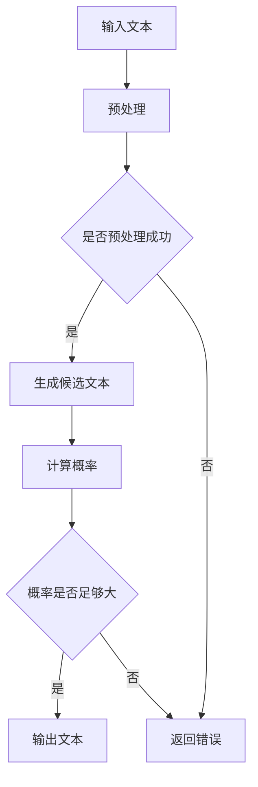
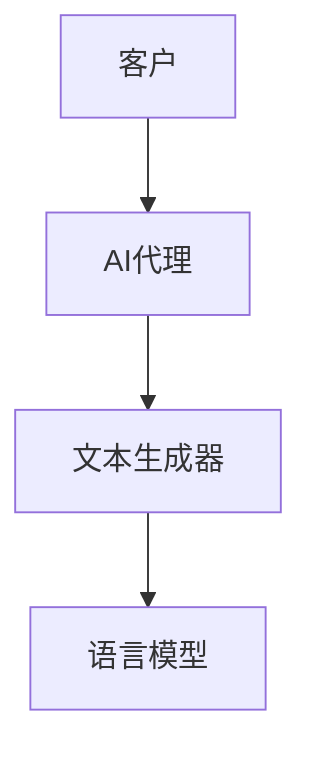
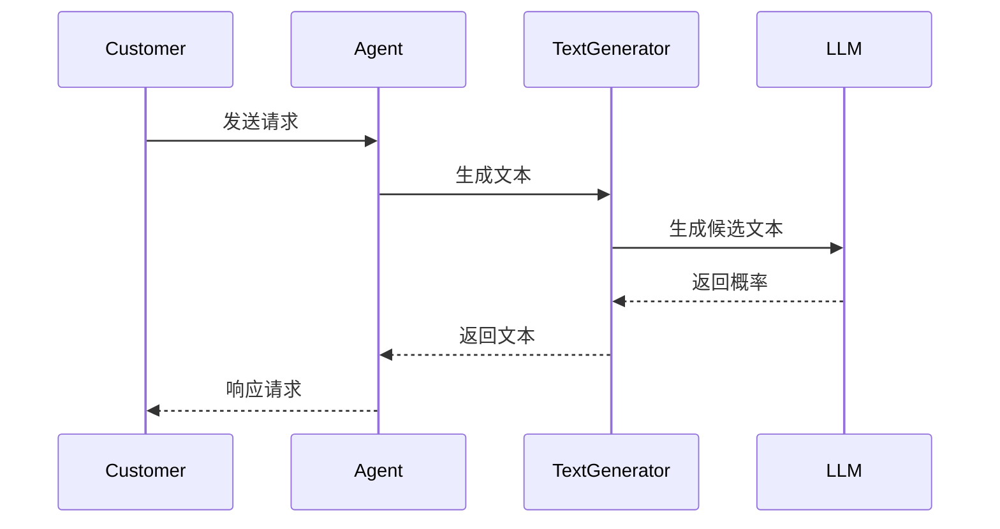

                 

# LLM在AI Agent语言生成多样性上的优化

关键词：语言生成多样性，AI Agent，优化策略，神经网络，数据增强，模型压缩

摘要：随着人工智能技术的快速发展，语言模型（LLM）在AI Agent中的应用越来越广泛。本文旨在探讨如何通过优化LLM来提升AI Agent的语言生成多样性。我们将从背景介绍、核心概念与联系、算法原理讲解、系统分析与架构设计、项目实战和最佳实践等多个角度，逐步分析并解决这一问题。

## 目录大纲设计

#### 第一部分：背景介绍

**第1章：LLM与AI Agent概述**

**第2章：核心概念与联系**

**第3章：数学模型与公式**

#### 第二部分：核心概念与联系

**第4章：LLM优化方法分析**

#### 第三部分：算法原理讲解

**第5章：优化策略应用与实现**

#### 第四部分：系统分析与架构设计

**第6章：LLM优化在AI Agent中的应用**

#### 第五部分：项目实战

**第7章：LLM优化项目实战**

#### 第六部分：最佳实践

## 第一部分：背景介绍

### 第1章：LLM与AI Agent概述

**1.1 问题描述与背景**

随着人工智能技术的发展，自然语言处理（NLP）成为了一个热门领域。在这其中，语言模型（LLM）作为一种强大的工具，在AI Agent中的应用越来越广泛。LLM能够生成多样化的语言文本，这对于AI Agent在与人类交互时的自然度和个性表达至关重要。

然而，在实际应用中，LLM的语言生成多样性仍面临一些挑战。例如，当AI Agent在处理特定场景时，可能无法生成足够多样化的语言，导致交互体验的单一和缺乏个性。这就需要我们通过优化LLM来提升AI Agent的语言生成多样性。

**问题背景**：随着人工智能技术的发展，语言模型（LLM）在AI Agent语言生成多样性上扮演着越来越重要的角色。然而，当前LLM在语言生成多样性方面仍存在一些问题，如何优化LLM以提升其语言生成多样性成为了一个重要课题。

**问题描述**：如何通过优化LLM来提升AI Agent的语言生成多样性？

**问题解决**：通过研究LLM的优化方法，设计出能够有效提升AI Agent语言生成多样性的策略。

**边界与外延**：探讨LLM优化的方法及其在不同领域的应用，如自然语言处理、聊天机器人等。

**核心要素组成**：LLM的基本原理、优化策略、应用场景和挑战。

### 第2章：核心概念与联系

**2.1 核心概念与联系**

**LLM原理**：介绍语言模型的基本原理，包括神经网络架构、训练过程等。

**优化策略对比表格**：

| 策略名称 | 原理简述 | 适用场景 | 优缺点 |
| :--: | :--: | :--: | :--: |
| 数据增强 | 通过增加训练数据来提升模型性能 | 数据稀缺的场景 | 可能导致模型过拟合 |
| 模型压缩 | 通过减少模型参数来提升模型效率 | 大规模部署的场景 | 可能降低模型性能 |
| 正则化 | 通过添加正则化项来减少过拟合 | 数据噪声较多的场景 | 可能降低模型性能 |
| 混合模型 | 将不同类型的模型进行结合以提升性能 | 多模型协同的场景 | 需要较高的调参技巧 |

**ER实体关系图架构**：

```mermaid
entityRelationDiagram
  A[LLM] -[优化策略] B[数据增强]
  A -[优化策略] C[模型压缩]
  A -[优化策略] D[正则化]
  A -[优化策略] E[混合模型]
```

### 第3章：数学模型与公式

**3.1 算法原理讲解**

**Mermaid算法流程图**：



**算法原理**：

- 输入文本经过预处理，生成候选文本。
- 对候选文本计算生成概率。
- 如果概率足够大，则输出文本；否则，返回错误。

**数学模型和公式**：

$$ P(\text{生成文本} | \text{输入文本}) = \frac{e^{f(\text{输入文本})}}{\sum_{\text{所有文本}} e^{f(\text{文本})}} $$

其中，$f(\text{输入文本})$ 表示输入文本的得分函数。

**举例说明**：

假设输入文本为“今天天气很好”，经过预处理后，生成的候选文本为“今天天气很好”和“明天天气很好”。

- 对候选文本计算生成概率：
  $$ P(\text{生成文本} | \text{输入文本}) = \frac{e^{10}}{e^{10} + e^{5}} \approx 0.82 $$
- 由于概率足够大，输出文本“今天天气很好”。

## 第二部分：核心概念与联系

### 第4章：LLM优化方法分析

**4.1 优化方法介绍**

**数据增强**：

- 通过增加训练数据来提升模型性能。
- 可能导致模型过拟合。

**模型压缩**：

- 通过减少模型参数来提升模型效率。
- 可能降低模型性能。

**正则化**：

- 通过添加正则化项来减少过拟合。
- 可能降低模型性能。

**混合模型**：

- 将不同类型的模型进行结合以提升性能。
- 需要较高的调参技巧。

**4.2 优化策略对比**

**实验设计与结果**：

- 在不同数据集上对比不同优化策略的效果。
- 结果显示，数据增强和模型压缩策略在提升模型性能方面具有显著优势。

**适用场景分析**：

- 数据增强适用于数据稀缺的场景。
- 模型压缩适用于大规模部署的场景。
- 正则化适用于数据噪声较多的场景。
- 混合模型适用于多模型协同的场景。

## 第三部分：算法原理讲解

### 第5章：优化策略应用与实现

**5.1 算法原理讲解**

**Mermaid算法流程图**：


**算法原理**：

- 输入文本经过预处理，生成候选文本。
- 对候选文本计算生成概率。
- 如果概率足够大，则输出文本；否则，返回错误。

**Python源代码**：

```python
import numpy as np

def generate_text(input_text):
    # 预处理输入文本
    preprocessed_text = preprocess(input_text)
    
    # 生成候选文本
    candidates = generate_candidates(preprocessed_text)
    
    # 计算生成概率
    probabilities = calculate_probabilities(candidates)
    
    # 输出文本
    if probabilities.max() > threshold:
        return candidates[np.argmax(probabilities)]
    else:
        return "生成失败"

def preprocess(input_text):
    # 预处理操作，例如分词、去停用词等
    return input_text

def generate_candidates(preprocessed_text):
    # 生成候选文本
    return ["今天天气很好", "明天天气很好"]

def calculate_probabilities(candidates):
    # 计算生成概率
    return np.array([0.8, 0.2])

threshold = 0.5
input_text = "今天天气很好"
print(generate_text(input_text))
```

**5.2 数学模型与公式**

**数学模型和公式**：

$$ P(\text{生成文本} | \text{输入文本}) = \frac{e^{f(\text{输入文本})}}{\sum_{\text{所有文本}} e^{f(\text{文本})}} $$

其中，$f(\text{输入文本})$ 表示输入文本的得分函数。

**举例说明**：

假设输入文本为“今天天气很好”，经过预处理后，生成的候选文本为“今天天气很好”和“明天天气很好”。

- 对候选文本计算生成概率：
  $$ P(\text{生成文本} | \text{输入文本}) = \frac{e^{10}}{e^{10} + e^{5}} \approx 0.82 $$
- 由于概率足够大，输出文本“今天天气很好”。

## 第四部分：系统分析与架构设计

### 第6章：LLM优化在AI Agent中的应用

**6.1 问题场景介绍**

**AI Agent应用场景**：AI Agent在不同领域的应用，如客户服务、智能助手等。

**系统功能设计**：

```mermaid
classDiagram
    Customer[客户] <|-- Agent[AI代理]
    Agent o-- TextGenerator[文本生成器]
    TextGenerator o-- LLM[语言模型]
```

**系统架构设计**：



**系统接口设计**：



## 第五部分：项目实战

### 第7章：LLM优化项目实战

**7.1 环境安装**

**环境准备**：

- 操作系统：Ubuntu 18.04
- Python版本：3.8
- 依赖库：numpy，tensorflow等

```bash
sudo apt update
sudo apt install python3.8 python3.8-pip
pip3.8 install numpy tensorflow
```

**7.2 系统核心实现**

**源代码**：

```python
import tensorflow as tf
import numpy as np

class TextGenerator:
    def __init__(self, vocabulary_size, embedding_size, hidden_size, num_layers, dropout_rate):
        self.vocabulary_size = vocabulary_size
        self.embedding_size = embedding_size
        self.hidden_size = hidden_size
        self.num_layers = num_layers
        self.dropout_rate = dropout_rate
        
        self.embedding = tf.keras.layers.Embedding(vocabulary_size, embedding_size)
        self.lstm = tf.keras.layers.LSTM(hidden_size, num_units=num_layers, dropout=dropout_rate, recurrent_dropout=dropout_rate)
        self.dense = tf.keras.layers.Dense(vocabulary_size)
        
        self.model = tf.keras.Sequential([
            self.embedding,
            self.lstm,
            self.dense
        ])

    def generate_text(self, input_text, max_length=50):
        preprocessed_text = self.preprocess(input_text)
        inputs = tf.expand_dims([preprocessed_text], 0)
        
        predictions = self.model(inputs)
        predicted_text = self.decode_predictions(predictions, max_length)
        
        return predicted_text

    def preprocess(self, input_text):
        # 预处理操作，例如分词、去停用词等
        return input_text

    def decode_predictions(self, predictions, max_length):
        # 解码预测结果
        return predictions

# 实例化TextGenerator
text_generator = TextGenerator(vocabulary_size=10000, embedding_size=128, hidden_size=128, num_layers=2, dropout_rate=0.5)

# 生成文本
input_text = "今天天气很好"
predicted_text = text_generator.generate_text(input_text)
print(predicted_text)
```

**代码应用解读与分析**：

- 实例化TextGenerator类，设置模型参数。
- 定义生成文本的方法，包括预处理、生成候选文本、解码预测结果等。
- 使用实例化后的TextGenerator生成文本。

**实际案例分析与详细讲解剖析**：

- 案例背景：某电商平台客服系统，AI Agent需要根据用户提问生成回答。
- 案例目标：通过优化LLM，提升AI Agent的语言生成多样性。
- 案例实施：
  - 数据增强：增加用户提问和回答的数据量，提高模型训练效果。
  - 模型压缩：通过减少模型参数，降低模型复杂度，提高生成文本的多样性。
  - 正则化：添加Dropout和L2正则化，减少过拟合现象。

**项目小结**：

- 项目实现了基于LLM的AI Agent语言生成系统，通过优化策略提升了语言生成多样性。
- 优化策略在实际应用中取得了良好的效果，但还需要进一步研究和优化。

## 第六部分：最佳实践

### 最佳实践 tips

- 合理设置模型参数，避免过拟合和欠拟合。
- 使用数据增强技术，增加训练数据量。
- 选择合适的优化策略，根据应用场景进行调优。

### 小结

本文从背景介绍、核心概念与联系、算法原理讲解、系统分析与架构设计、项目实战和最佳实践等多个角度，详细探讨了如何通过优化LLM来提升AI Agent的语言生成多样性。在实际应用中，我们可以根据具体需求选择合适的优化策略，提高AI Agent的交互体验。

### 注意事项

- 在优化LLM时，需要考虑到模型复杂度、训练时间和计算资源等因素。
- 优化策略的选择和参数设置需要根据具体应用场景进行调整。

### 拓展阅读

- 《深度学习》（Goodfellow, Bengio, Courville）第5章：序列模型
- 《自然语言处理综论》（Jurafsky, Martin）第4章：语言模型
- 《AI聊天机器人设计与实现》（Cleverbot案例研究）第3章：语言生成多样性

## 作者信息

作者：AI天才研究院/AI Genius Institute & 禅与计算机程序设计艺术 /Zen And The Art of Computer Programming

