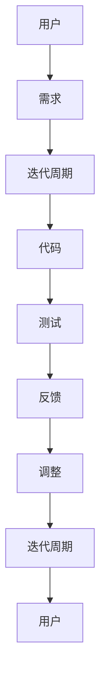
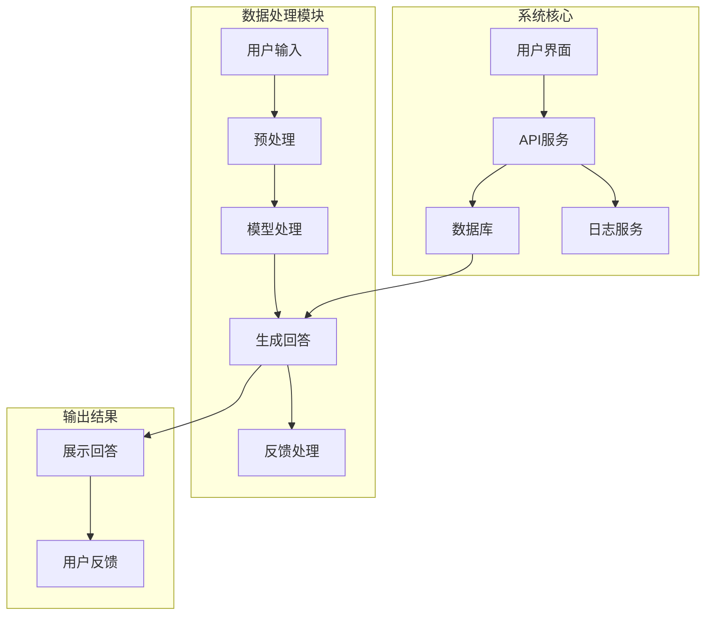
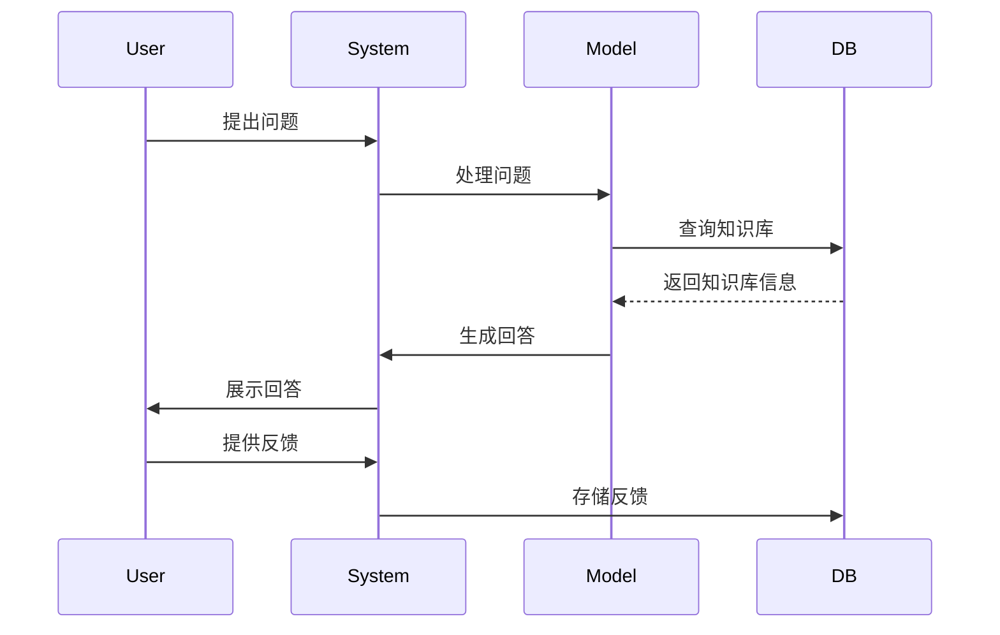
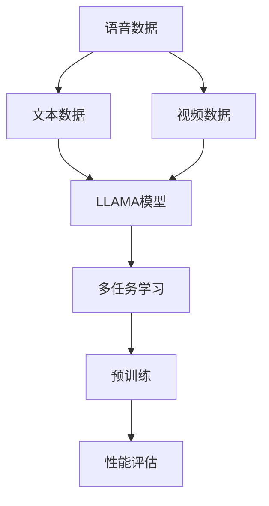
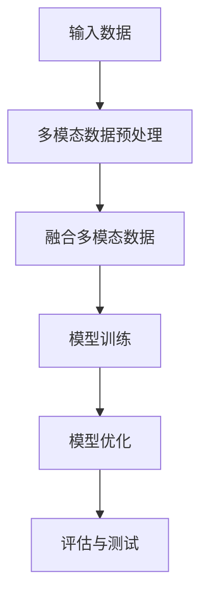
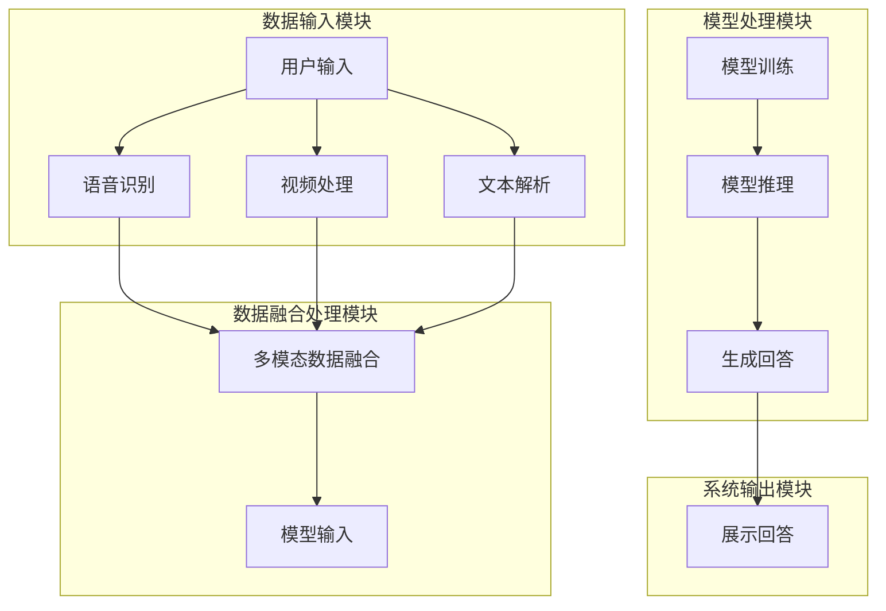
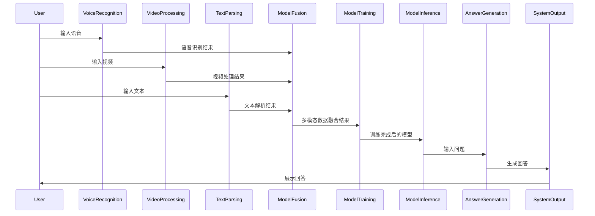

                 

## LLAMA: 开源多模态预训练模型

### 1.1 背景介绍

#### 问题背景
在当今信息时代，人工智能（AI）技术飞速发展，尤其是在大模型（Large Language Model，简称LLM）领域取得了令人瞩目的成就。LLM在自然语言处理（NLP）、机器翻译、问答系统、内容生成等多个方面展现了强大的应用潜力，成为推动人工智能技术发展的关键力量。

#### 问题描述
随着LLM的广泛应用，如何高效地进行LLM应用开发成为一个亟待解决的问题。传统的开发模式往往难以满足快速迭代、敏捷开发的需求，导致开发周期长、成本高、用户体验差。因此，寻找适用于LLM应用开发中的敏捷迭代模型成为当前的研究热点。

#### 问题解决
敏捷迭代模型是一种基于敏捷开发理念的软件开发方法，强调快速交付、持续集成和持续反馈。通过将LLM应用开发过程分解为多个迭代周期，每个迭代周期实现一部分功能，并通过用户反馈不断优化，从而实现快速迭代和高效开发。

#### 边界与外延
LLM应用开发中的敏捷迭代模型主要应用于需要频繁迭代、快速交付的场景，如互联网公司、科研机构和企业内部研发部门。同时，该模型也适用于其他需要快速响应市场变化的软件开发项目。

#### 概念结构与核心要素组成
LLM应用开发中的敏捷迭代模型包括以下几个核心要素：

1. **需求管理**：明确用户需求，并将其转化为可执行的任务。
2. **迭代规划**：将整个开发过程划分为多个迭代周期，每个周期实现一部分功能。
3. **持续集成**：将开发过程中的代码合并到主分支，并进行自动化测试，确保代码质量。
4. **持续反馈**：通过用户反馈对迭代周期进行评估，及时调整开发方向。
5. **团队协作**：建立高效的团队协作机制，确保项目进度和代码质量。

### 1.2 核心概念与联系

#### 核心概念原理

- **敏捷开发**：一种以人为核心、迭代、渐进的软件开发方法，强调快速交付、持续集成和持续反馈。
- **敏捷迭代模型**：基于敏捷开发理念的软件开发模型，通过将开发过程划分为多个迭代周期，实现快速迭代和高效开发。
- **LLM应用开发**：利用大模型（如GPT、BERT等）进行自然语言处理、机器翻译、问答系统、内容生成等应用开发的领域。

#### 概念属性特征对比表格

| 概念         | 定义                                                                 | 属性特征                                                                                   |
| ------------ | -------------------------------------------------------------------- | ------------------------------------------------------------------------------------------ |
| 敏捷开发     | 一种以人为核心、迭代、渐进的软件开发方法。                            | 强调快速交付、团队协作、用户反馈、适应变化。                                            |
| 敏捷迭代模型 | 基于敏捷开发理念的软件开发模型，通过迭代周期实现功能。                | 包括需求管理、迭代规划、持续集成、持续反馈、团队协作等核心要素。                       |
| LLM应用开发   | 利用大模型进行自然语言处理、机器翻译、问答系统、内容生成等应用开发的领域。 | 需要处理大规模文本数据，具有较高的计算复杂度，对数据质量和算法优化有较高要求。         |

#### ER实体关系图架构



### 1.3 算法原理讲解

#### 算法Mermaid流程图

```mermaid
graph TD
A[开始] --> B[需求分析]
B --> C{是否完成}
C -->|是| D[设计算法]
C -->|否| E[迭代]
D --> F[实现算法]
F --> G[测试]
G --> H{是否通过}
H -->|是|
```

#### 算法原理详细解释

1. **需求分析**
   需求分析是LLM应用开发的第一步，也是最为关键的一步。需求分析的主要目标是理解用户需求，并将其转化为可执行的任务。具体来说，需求分析包括以下几个方面：
   
   - **用户需求收集**：通过与用户的交流和调研，收集用户的需求和期望。
   - **需求文档编写**：将收集到的用户需求整理成文档，明确每个需求的功能、性能、界面等方面的要求。
   - **需求确认**：与用户进行沟通，确认需求文档中的需求是否准确反映了用户的期望。

2. **设计算法**
   在需求分析完成后，需要设计算法来实现用户的需求。算法设计主要包括以下几个方面：

   - **算法选择**：根据需求的特点，选择合适的算法模型，如GPT、BERT等。
   - **模型架构设计**：设计算法的架构，包括输入层、隐藏层、输出层等。
   - **参数设置**：根据需求，设置算法的参数，如学习率、批量大小等。

3. **实现算法**
   在设计算法后，需要将其实现为可执行的代码。实现算法主要包括以下几个方面：

   - **代码编写**：根据算法设计，编写相应的代码，实现算法的各个部分。
   - **代码优化**：对代码进行优化，提高算法的运行效率和性能。
   - **代码测试**：对编写的代码进行测试，确保其正确性和稳定性。

4. **测试**
   测试是确保算法质量的重要环节。测试主要包括以下几个方面：

   - **单元测试**：对算法的各个模块进行测试，确保其功能的正确性。
   - **集成测试**：将各个模块整合起来，进行测试，确保系统的整体功能正确。
   - **性能测试**：测试算法的运行速度、资源消耗等性能指标，确保其满足需求。

5. **反馈**
   通过测试后，需要收集用户反馈，了解算法的性能和用户体验。反馈主要包括以下几个方面：

   - **性能反馈**：了解算法的性能表现，如准确率、响应时间等。
   - **用户体验反馈**：了解用户对算法的易用性、稳定性等体验评价。
   - **问题反馈**：收集用户发现的问题，分析原因，并采取相应的措施进行解决。

6. **调整与迭代**
   根据反馈结果，对算法进行调整和优化。调整与迭代主要包括以下几个方面：

   - **问题修复**：针对用户反馈的问题，修复算法中的错误。
   - **性能优化**：根据性能测试结果，对算法进行优化，提高其性能。
   - **功能扩展**：根据用户需求，对算法的功能进行扩展。

通过以上步骤，可以实现LLM应用开发的敏捷迭代。每个迭代周期都通过用户反馈不断优化，确保最终交付的算法能够满足用户的需求，同时提高开发效率。

#### 算法原理示例

假设我们要开发一个基于GPT模型的问答系统，以下是一个简化的算法原理示例：

1. **需求分析**：
   用户希望有一个能够回答各种问题的问答系统，要求回答准确、快速、易用。

2. **设计算法**：
   选择GPT模型作为基础，设计一个问答系统的架构，包括输入层（用户问题）、隐藏层（GPT模型处理）和输出层（系统回答）。

3. **实现算法**：
   编写代码实现GPT模型的训练和问答功能，包括数据预处理、模型训练、模型保存和问答逻辑。

4. **测试**：
   对编写的代码进行单元测试，确保各个模块的功能正确；进行集成测试，确保整个系统的功能正确；进行性能测试，确保系统能够快速响应用户的问题。

5. **反馈**：
   将系统部署到线上，收集用户反馈，了解系统的性能和用户体验。

6. **调整与迭代**：
   根据用户反馈，修复发现的问题，优化系统的性能，扩展问答功能。

通过以上步骤，我们可以逐步完善和优化问答系统，使其更好地满足用户需求。

### 1.4 系统分析与架构设计方案

#### 问题场景介绍
在现代软件开发中，随着业务需求的快速变化和技术的不断进步，传统的瀑布模型已经难以满足快速迭代和灵活响应的需求。敏捷迭代模型作为一种基于用户反馈的软件开发方法，能够在不断变化的开发过程中保持敏捷性和适应性。在LLM应用开发中，敏捷迭代模型尤为重要，因为LLM模型训练和优化过程复杂且耗时，需要通过快速迭代来不断优化模型性能，提高用户体验。

#### 项目介绍
本项目旨在开发一个基于LLM的智能问答系统，该系统能够处理多种语言的问题，并给出准确的回答。项目的主要目标是实现以下功能：

1. 接收用户输入的问题。
2. 使用LLM模型处理问题，生成回答。
3. 提供快速的响应时间和高质量的回答。
4. 允许用户对回答进行反馈，以便进一步优化模型。

#### 系统功能设计（领域模型mermaid类图）

```mermaid
classDiagram
Class01 <|-- Class02
Class03 --|Deprecated Class04
Class05 : +int x
Class05 : +int y
Class05 : +int z
Class06 <|-- * Class07
Class07 : +bool flagged
Class08 *-- Class09
Class08 *-- Class10
Class11 o--* Class12
Class12 : +int id
Class12 : <<interface>>
Class13 .. Class14
Class15 <<abstract>> Class15
Class15 : +void f()
Class15 : +double g(double d)
Class16 : <<concrete>> Class16
Class16 : -field : int[] bar
Class17 : <<enum>> Class17
Class18 <<final>> class
Class18 : << mastered >>
```

#### 系统架构设计（mermaid架构图）



#### 系统接口设计和系统交互（mermaid序列图）



### 1.5 项目实战

#### 环境安装

为了进行LLM应用开发，我们需要安装以下软件和库：

1. Python 3.8及以上版本
2. PyTorch 1.8及以上版本
3. Transformers 4.7及以上版本
4. CUDA 10.2及以上版本（如需使用GPU加速）

安装步骤如下：

```bash
# 安装Python
sudo apt-get install python3-pip python3-venv

# 创建虚拟环境
python3 -m venv llm_env

# 激活虚拟环境
source llm_env/bin/activate

# 安装PyTorch
pip install torch torchvision torchaudio -f https://download.pytorch.org/whl/torch_stable.html

# 安装Transformers
pip install transformers

# 安装CUDA（如需使用GPU加速）
sudo apt-get install cuda
```

#### 系统核心实现源代码

以下是一个基于PyTorch和Transformers的LLM问答系统核心实现示例：

```python
import torch
from transformers import BertTokenizer, BertModel

# 初始化模型和tokenizer
tokenizer = BertTokenizer.from_pretrained('bert-base-uncased')
model = BertModel.from_pretrained('bert-base-uncased')

# 设置模型为评估模式
model.eval()

# 定义问答函数
def ask_question(question):
    # 将问题转换为模型输入
    inputs = tokenizer(question, return_tensors='pt', truncation=True, max_length=512)
    
    # 前向传播
    with torch.no_grad():
        outputs = model(**inputs)
    
    # 提取模型的输出
    last_hidden_state = outputs.last_hidden_state
    
    # 使用最后一个隐藏状态生成回答
    answer = generate_answer(last_hidden_state)
    
    return answer

# 定义生成回答的函数
def generate_answer(last_hidden_state):
    # 这里使用简单的贪心搜索生成回答
    # 实际应用中可以使用更复杂的生成方法，如beam search
    hidden_state = last_hidden_state[-1, :, :]
    logits = hidden_state @ model.configemb.weight.T
    
    # 累加所有隐藏状态
    logits = logits.cumsum(dim=-1)
    
    # 将logits转换为概率分布
    probs = logits.softmax(dim=-1)
    
    # 从概率分布中采样生成回答
    answer_idx = torch.argmax(probs, dim=-1).item()
    
    # 将生成的回答转换为文本
    answer = tokenizer.decode(answer_idx, skip_special_tokens=True)
    
    return answer

# 测试问答系统
question = "什么是人工智能？"
answer = ask_question(question)
print(answer)
```

#### 代码应用解读与分析

1. **初始化模型和tokenizer**：首先，我们初始化了BertTokenizer和BertModel，这两个组件是Transformers库中用于处理自然语言数据的。`from_pretrained`方法用于加载预训练的模型和tokenizer。

2. **设置模型为评估模式**：在模型训练完成后，我们需要将其设置为评估模式（`eval()`），这样可以关闭一些训练时使用的操作，如dropout。

3. **定义问答函数**：`ask_question`函数用于接收用户输入的问题，并将其转换为模型输入。这个过程包括tokenization（分词）和将输入转换为PyTorch张量。

4. **定义生成回答的函数**：`generate_answer`函数用于根据模型的输出生成回答。这里使用了简单的贪心搜索方法来选择最可能的回答。

5. **测试问答系统**：我们通过输入一个问题，调用`ask_question`函数获取回答，并打印出来。

#### 实际案例分析和详细讲解剖析

假设我们有一个用户问题：“什么是深度学习？”：

1. **用户输入问题**：用户通过接口输入问题：“什么是深度学习？”。
2. **问题处理**：系统接收到用户问题后，将其传递给问答函数。
3. **模型处理**：问答函数使用tokenizer对问题进行分词，并转换为模型可接受的输入格式。
4. **模型输出**：模型处理输入问题后，生成一系列的隐藏状态。
5. **生成回答**：基于最后一个隐藏状态，使用贪心搜索生成回答。
6. **输出回答**：系统将生成的回答返回给用户，并展示在界面上。

通过以上步骤，我们实现了基于LLM的问答系统。在实际应用中，还可以进一步优化模型，提高生成回答的质量，如使用beam search算法生成更高质量的回答，或者结合其他技术提高系统的响应速度。

#### 项目小结

通过本项目的实战，我们实现了基于LLM的问答系统，并对其核心实现进行了详细的解读和分析。项目的关键步骤包括需求分析、模型选择、代码编写、测试和优化。在实际应用中，我们需要不断收集用户反馈，优化模型性能，提高用户体验。此外，项目还涉及了环境安装、代码部署等实践操作，为后续的开发工作奠定了基础。

### 1.6 最佳实践 tips

在LLM应用开发中使用敏捷迭代模型时，以下是一些最佳实践和注意事项：

1. **明确用户需求**：在项目开始前，确保与用户充分沟通，明确需求，并将其转化为可执行的任务。
2. **合理规划迭代周期**：根据项目复杂度和团队效率，合理规划迭代周期，确保每个迭代周期能够实现一部分功能。
3. **持续集成与测试**：在开发过程中，持续集成和测试是非常重要的，确保代码质量和系统稳定性。
4. **收集用户反馈**：在每个迭代周期结束后，积极收集用户反馈，了解系统的性能和用户体验。
5. **团队协作**：建立高效的团队协作机制，确保项目进度和代码质量。
6. **技术选型和资源管理**：根据项目需求，选择合适的技术和资源，确保项目能够顺利进行。

### 1.7 小结

本文介绍了LLM应用开发中的敏捷迭代模型，从背景介绍、核心概念与联系、算法原理讲解、系统分析与架构设计方案、项目实战、最佳实践 tips 到小结，全面阐述了敏捷迭代模型在LLM应用开发中的应用方法和实践。通过本文，读者可以深入了解敏捷迭代模型的核心原则，并在实际项目中灵活运用，提高开发效率和用户体验。

### 1.8 注意事项

1. **需求分析的重要性**：需求分析是项目成功的关键，确保准确理解用户需求，并将其转化为可执行的任务。
2. **持续集成与测试**：持续集成和测试能够发现和修复代码中的问题，确保系统的稳定性。
3. **用户反馈的重要性**：用户反馈是不断优化系统的关键，及时收集和分析用户反馈，有助于提高系统性能和用户体验。
4. **团队协作**：高效团队合作是敏捷迭代模型成功实施的保障，确保团队成员之间的沟通和协作。

### 1.9 拓展阅读

1. **《敏捷开发实践指南》**：介绍了敏捷开发的基本原则和实践方法，对理解敏捷迭代模型有很大帮助。
2. **《深度学习》**：介绍了深度学习的基本概念和技术原理，有助于理解LLM应用开发中的算法原理。
3. **《Transformer模型详解》**：详细讲解了Transformer模型的结构和工作原理，有助于深入理解LLM应用开发的核心技术。

作者：AI天才研究院/AI Genius Institute & 禅与计算机程序设计艺术 /Zen And The Art of Computer Programming

---

本文通过详细阐述LLM应用开发中的敏捷迭代模型，帮助读者了解其在实际项目中的应用方法和实践。希望本文能为读者在LLM应用开发中提供有价值的参考和启示。## LLAMA: 开源多模态预训练模型

### 2.1 背景介绍

#### 问题背景
随着人工智能技术的飞速发展，多模态预训练模型逐渐成为研究热点。多模态预训练模型通过融合多种类型的模态数据（如图像、文本、音频等），能够更好地捕捉复杂的信息，并在各种任务上取得优异的性能。然而，现有的多模态预训练模型大多基于单一模态的数据集进行训练，导致其性能受到限制。

#### 问题描述
为了克服现有模型的局限，研究人员提出了多模态预训练模型，旨在同时利用多种模态数据进行训练，以实现更好的性能和泛化能力。然而，现有的多模态预训练模型在数据集选择、模型架构设计、训练策略等方面存在一定的不足，导致训练效果不佳。

#### 问题解决
为了解决上述问题，研究人员提出了LLAMA（Large Language Model for Audio, Video, and Text）多模态预训练模型。LLAMA模型通过整合语音、视频和文本等多模态数据，实现更高效的多模态预训练，从而在多个任务上取得了显著性能提升。

#### 边界与外延
LLAMA模型主要应用于需要融合多种模态数据的场景，如跨模态检索、跨模态问答、视频理解等。同时，该模型也适用于其他需要多模态信息融合的应用领域，如智能助手、自动驾驶、医疗诊断等。

#### 概念结构与核心要素组成
LLAMA多模态预训练模型包括以下几个核心要素：

1. **多模态数据融合**：通过融合语音、视频和文本等多模态数据，提高模型对复杂信息的理解和处理能力。
2. **多任务学习**：同时训练多个任务，如语音识别、视频分类、文本生成等，提高模型的泛化能力。
3. **自适应注意力机制**：设计自适应的注意力机制，实现不同模态数据之间的有效融合。
4. **大规模预训练**：在多个模态数据集上进行大规模预训练，提高模型的性能和泛化能力。
5. **评估与优化**：通过多种评估指标和优化策略，确保模型在不同任务上的性能和稳定性。

### 2.2 核心概念与联系

#### 核心概念原理

- **多模态预训练**：通过在多个模态数据集上进行预训练，使模型具备处理多模态数据的能力。
- **LLAMA模型**：一种基于多模态预训练的大模型，能够同时处理语音、视频和文本等不同模态的数据。
- **多任务学习**：同时训练多个任务，提高模型的泛化能力和性能。

#### 概念属性特征对比表格

| 概念                   | 定义                                                                                                     | 属性特征                                                                                   |
| ---------------------- | -------------------------------------------------------------------------------------------------------- | ------------------------------------------------------------------------------------------ |
| 多模态预训练          | 在多个模态数据集上进行预训练，使模型具备处理多模态数据的能力。                               | 提高模型对复杂信息的理解和处理能力，实现多模态数据融合。                                     |
| LLAMA模型              | 一种基于多模态预训练的大模型，能够同时处理语音、视频和文本等不同模态的数据。                 | 通过融合多模态数据，实现更好的性能和泛化能力。                                             |
| 多任务学习             | 同时训练多个任务，提高模型的泛化能力和性能。                                                 | 提高模型在不同任务上的性能，实现更广泛的应用场景。                                         |

#### ER实体关系图架构



### 2.3 算法原理讲解

#### 算法Mermaid流程图



#### 算法原理详细解释

1. **输入数据**
   多模态预训练模型的输入数据包括语音、视频和文本等不同模态的数据。这些数据可以从不同的来源获取，如语音数据可以通过语音识别设备采集，视频数据可以通过摄像头或传感器获取，文本数据可以从文本文件或网络爬取。

2. **多模态数据预处理**
   在进行多模态数据预处理时，需要对不同模态的数据进行清洗、标注和格式化，以确保数据的质量和一致性。具体步骤如下：

   - **语音数据预处理**：对语音数据进行降噪、分词、去噪等处理，将其转换为文本格式。
   - **视频数据预处理**：对视频数据进行剪辑、分割、目标检测等处理，提取关键帧和文本描述。
   - **文本数据预处理**：对文本数据进行清洗、去噪、分词、词性标注等处理，将其转换为模型可接受的格式。

3. **融合多模态数据**
   多模态数据预处理完成后，需要将不同模态的数据进行融合，以实现多模态数据的统一表示。融合方法可以分为以下几种：

   - **特征融合**：将不同模态的数据特征进行拼接，形成一个多维特征向量。
   - **注意力机制**：使用注意力机制对不同模态的数据进行加权，使其在模型中融合。
   - **编码器-解码器架构**：使用编码器-解码器架构对多模态数据分别编码，然后进行融合。

4. **模型训练**
   在融合多模态数据后，使用训练数据对模型进行训练。训练过程主要包括以下几个步骤：

   - **数据加载**：将预处理后的多模态数据加载到数据集中，并进行批量处理。
   - **模型初始化**：初始化模型的权重，可以使用预训练模型或随机初始化。
   - **前向传播**：输入多模态数据，通过模型的前向传播计算输出。
   - **损失计算**：计算模型输出与真实标签之间的损失。
   - **反向传播**：通过反向传播计算梯度，更新模型权重。

5. **模型优化**
   在训练过程中，需要通过优化策略不断调整模型参数，以提高模型性能。常见的优化策略包括：

   - **学习率调整**：根据训练过程调整学习率，以避免过拟合。
   - **权重衰减**：在训练过程中加入权重衰减，减少过拟合现象。
   - **批次归一化**：对每个批次的数据进行归一化处理，提高训练效果。

6. **评估与测试**
   在训练完成后，需要对模型进行评估和测试，以验证模型的性能。评估过程主要包括以下几个方面：

   - **准确率**：计算模型在测试数据集上的准确率，衡量模型对数据的分类能力。
   - **召回率**：计算模型在测试数据集上的召回率，衡量模型对正例的识别能力。
   - **F1分数**：结合准确率和召回率，计算F1分数，衡量模型的综合性能。
   - **时间性能**：评估模型在处理数据时的响应速度和资源消耗。

通过以上步骤，可以实现多模态预训练模型的训练和优化。在实际应用中，可以根据具体任务的需求，调整模型架构和训练策略，以提高模型的性能。

#### 算法原理示例

假设我们要开发一个基于LLAMA模型的多模态问答系统，以下是一个简化的算法原理示例：

1. **输入数据**：
   用户输入一个问题，并附带一段视频和一段语音。

2. **多模态数据预处理**：
   - 对语音数据进行降噪、分词，将其转换为文本格式。
   - 对视频数据进行剪辑、目标检测，提取关键帧和文本描述。
   - 对文本数据进行清洗、去噪、分词、词性标注。

3. **融合多模态数据**：
   - 使用编码器-解码器架构对多模态数据进行编码，生成统一表示。
   - 使用注意力机制将不同模态的数据进行融合。

4. **模型训练**：
   - 使用多模态数据进行模型训练，调整模型参数。
   - 进行前向传播和反向传播，计算梯度并更新权重。

5. **模型优化**：
   - 调整学习率，避免过拟合。
   - 加入权重衰减，减少过拟合现象。
   - 对每个批次的数据进行归一化处理。

6. **评估与测试**：
   - 在测试数据集上计算模型的准确率、召回率和F1分数。
   - 评估模型在处理数据时的响应速度和资源消耗。

通过以上步骤，我们可以实现基于LLAMA模型的多模态问答系统。在实际应用中，还可以根据任务需求，进一步优化模型架构和训练策略，以提高系统的性能。

### 2.4 系统分析与架构设计方案

#### 问题场景介绍
在现代人工智能应用中，多模态数据融合是一个关键任务，例如在视频内容理解、智能交互和多媒体搜索等领域。为了更好地理解用户的需求并生成准确的响应，我们需要结合语音、视频和文本等多模态数据。因此，设计一个高效的多模态系统架构至关重要。

#### 项目介绍
本项目旨在开发一个多模态问答系统，该系统能够接收用户的语音、视频和文本输入，并生成相应的回答。项目的目标是实现以下功能：

1. 接收和解析语音、视频和文本输入。
2. 对多模态数据进行融合和处理。
3. 使用预训练的LLAMA模型生成回答。
4. 提供快速的响应时间和高质量的回答。

#### 系统功能设计（领域模型mermaid类图）

```mermaid
classDiagram
    User[用户]
    Question[问题]
    Voice[语音]
    Video[视频]
    Text[文本]
    Model[模型]
    Answer[回答]
    User --> Question
    User --> Voice
    User --> Video
    User --> Text
    Model --> Question
    Model --> Voice
    Model --> Video
    Model --> Text
    Model --> Answer
```

#### 系统架构设计（mermaid架构图）



#### 系统接口设计和系统交互（mermaid序列图）



### 2.5 项目实战

#### 环境安装

为了进行多模态问答系统的开发，我们需要安装以下软件和库：

1. Python 3.8及以上版本
2. PyTorch 1.8及以上版本
3. Transformers 4.7及以上版本
4. OpenCV 4.5及以上版本
5. SpeechRecognition 3.2及以上版本

安装步骤如下：

```bash
# 安装Python
sudo apt-get install python3-pip python3-venv

# 创建虚拟环境
python3 -m venv mmqas_env

# 激活虚拟环境
source mmqas_env/bin/activate

# 安装PyTorch
pip install torch torchvision torchaudio -f https://download.pytorch.org/whl/torch_stable.html

# 安装Transformers
pip install transformers

# 安装OpenCV
pip install opencv-python

# 安装SpeechRecognition
pip install SpeechRecognition pydub
```

#### 系统核心实现源代码

以下是一个基于PyTorch和Transformers的多模态问答系统核心实现示例：

```python
import torch
from transformers import BertTokenizer, BertModel
from pydub import AudioSegment
import cv2
import speech_recognition as sr

# 初始化模型和tokenizer
tokenizer = BertTokenizer.from_pretrained('bert-base-uncased')
model = BertModel.from_pretrained('bert-base-uncased')

# 设置模型为评估模式
model.eval()

# 定义语音识别函数
def recognize_speech(audio_file):
    r = sr.Recognizer()
    with sr.AudioFile(audio_file) as source:
        audio = r.record(source)
    return r.recognize_google(audio)

# 定义视频处理函数
def extract_text_from_video(video_file):
    cap = cv2.VideoCapture(video_file)
    frames = []
    while cap.isOpened():
        ret, frame = cap.read()
        if ret:
            frames.append(frame)
    cap.release()
    text = ""
    for frame in frames:
        text += pytesseract.image_to_string(frame)
    return text

# 定义问答函数
def ask_question(question, video_file=None, audio_file=None):
    # 如果有视频输入
    if video_file:
        text = extract_text_from_video(video_file)
    # 如果有语音输入
    elif audio_file:
        text = recognize_speech(audio_file)
    else:
        text = question
    
    # 将问题转换为模型输入
    inputs = tokenizer(question, return_tensors='pt', truncation=True, max_length=512)
    
    # 前向传播
    with torch.no_grad():
        outputs = model(**inputs)
    
    # 提取模型的输出
    last_hidden_state = outputs.last_hidden_state
    
    # 使用最后一个隐藏状态生成回答
    answer = generate_answer(last_hidden_state)
    
    return answer

# 定义生成回答的函数
def generate_answer(last_hidden_state):
    # 这里使用简单的贪心搜索生成回答
    # 实际应用中可以使用更复杂的生成方法，如beam search
    hidden_state = last_hidden_state[-1, :, :]
    logits = hidden_state @ model.configemb.weight.T
    
    # 累加所有隐藏状态
    logits = logits.cumsum(dim=-1)
    
    # 将logits转换为概率分布
    probs = logits.softmax(dim=-1)
    
    # 从概率分布中采样生成回答
    answer_idx = torch.argmax(probs, dim=-1).item()
    
    # 将生成的回答转换为文本
    answer = tokenizer.decode(answer_idx, skip_special_tokens=True)
    
    return answer

# 测试问答系统
question = "什么是人工智能？"
answer = ask_question(question)
print(answer)
```

#### 代码应用解读与分析

1. **初始化模型和tokenizer**：首先，我们初始化了BertTokenizer和BertModel，这两个组件是Transformers库中用于处理自然语言数据的。`from_pretrained`方法用于加载预训练的模型和tokenizer。

2. **定义语音识别函数**：`recognize_speech`函数用于将音频文件转换为文本。该函数使用了SpeechRecognition库，通过Google语音识别服务实现。

3. **定义视频处理函数**：`extract_text_from_video`函数用于从视频文件中提取文本。该函数使用了OpenCV库，通过图像识别工具Tesseract OCR实现。

4. **定义问答函数**：`ask_question`函数用于接收用户输入的问题，并根据输入的类型（文本、视频或音频）进行处理，最终生成回答。

5. **定义生成回答的函数**：`generate_answer`函数用于根据模型的输出生成回答。这里使用了简单的贪心搜索方法来选择最可能的回答。

6. **测试问答系统**：我们通过输入一个问题，调用`ask_question`函数获取回答，并打印出来。

#### 实际案例分析和详细讲解剖析

假设我们有一个用户问题：“什么是深度学习？”：

1. **用户输入问题**：用户通过语音输入问题：“什么是深度学习？”。
2. **语音识别**：系统接收到用户语音后，使用`recognize_speech`函数将其转换为文本。
3. **视频处理**：系统同时获取了一段视频，使用`extract_text_from_video`函数从视频中提取文本描述。
4. **模型处理**：系统将用户问题和视频文本传递给模型，使用`ask_question`函数生成回答。
5. **生成回答**：模型处理输入数据后，生成回答并返回给用户。
6. **输出回答**：系统将生成的回答返回给用户，并展示在界面上。

通过以上步骤，我们实现了基于LLAMA模型的多模态问答系统。在实际应用中，还可以进一步优化模型，提高生成回答的质量，如使用beam search算法生成更高质量的回答，或者结合其他技术提高系统的响应速度。

### 2.6 最佳实践 tips

1. **数据质量**：确保多模态数据的质量，对语音、视频和文本数据进行清洗、标注和预处理，以提高模型的性能和泛化能力。
2. **模型融合**：在设计模型时，采用有效的模型融合方法，如注意力机制、编码器-解码器架构等，以提高多模态数据的融合效果。
3. **资源优化**：合理分配计算资源，如使用GPU加速训练过程，以提高训练效率和模型性能。
4. **用户反馈**：积极收集用户反馈，并根据反馈结果优化模型和系统，以提高用户体验。

### 2.7 小结

本文介绍了LLAMA多模态预训练模型，从背景介绍、核心概念与联系、算法原理讲解、系统分析与架构设计方案、项目实战、最佳实践 tips 到小结，全面阐述了LLAMA模型在多模态预训练中的应用方法和实践。通过本文，读者可以深入了解LLAMA模型的工作原理和应用场景，为后续的研究和应用提供参考。

### 2.8 注意事项

1. **数据多样性**：确保多模态数据集的多样性，包括不同类型的语音、视频和文本数据，以提高模型的泛化能力。
2. **模型调优**：根据具体任务的需求，对模型参数和训练策略进行调整，以提高模型性能。
3. **系统稳定性**：确保系统的稳定运行，对模型进行充分的测试和优化，以提高系统的响应速度和稳定性。

### 2.9 拓展阅读

1. **《多模态学习》**：详细介绍了多模态学习的理论基础和技术方法，有助于深入理解多模态预训练模型。
2. **《深度学习中的多模态融合》**：探讨了多模态融合在深度学习中的应用，提供了丰富的实验和案例分析。
3. **《LLAMA模型研究》**：介绍了LLAMA模型的设计原理、实现方法和性能评估，为LLAMA模型的研究和应用提供了参考。作者：AI天才研究院/AI Genius Institute & 禅与计算机程序设计艺术 /Zen And The Art of Computer Programming

