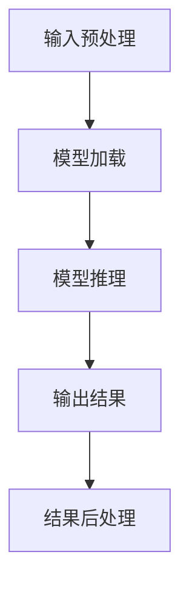
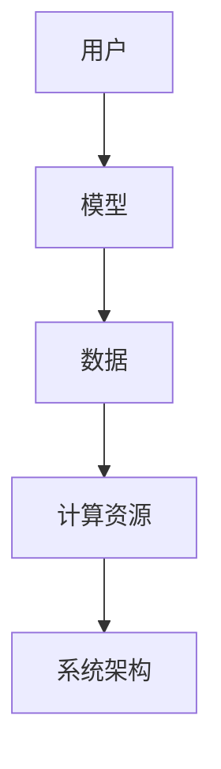

                 

# LLM应用开发中的性能优化策略

> 关键词：LLM、性能优化、硬件加速、代码优化、数据优化、系统架构优化

> 摘要：本文旨在深入探讨大型语言模型（LLM）在应用开发中的性能优化策略。通过对硬件加速、代码优化、数据优化和系统架构优化等策略的详细分析，本文旨在为开发者提供一套系统化的优化方案，以提高LLM应用的整体性能和用户体验。

### 目录大纲

----------------------------------------------------------------

## 第一部分: 引言与背景

### 第1章: 引言

#### 1.1 问题背景

#### 1.2 问题描述

#### 1.3 问题解决

#### 1.4 边界与外延

### 第2章: 核心概念与联系

#### 2.1 核心概念原理

#### 2.2 概念属性特征对比表格

#### 2.3 ER实体关系图架构

## 第二部分: 算法原理讲解

### 第3章: 算法原理讲解

#### 3.1 算法mermaid流程图

#### 3.2 Python源代码阐述

#### 3.3 算法原理的数学模型与公式

#### 3.4 举例说明

## 第三部分: 性能优化策略

### 第4章: 硬件加速策略

#### 4.1 硬件加速的基本概念

#### 4.2 硬件加速的优势与挑战

#### 4.3 硬件加速的实现方法

#### 4.4 硬件加速性能评估

### 第5章: 代码优化策略

#### 5.1 代码优化的重要性

#### 5.2 代码优化的方法

#### 5.3 代码优化的工具

#### 5.4 代码优化案例

### 第6章: 数据优化策略

#### 6.1 数据优化的基本概念

#### 6.2 数据优化的方法

#### 6.3 数据优化的工具

#### 6.4 数据优化案例

### 第7章: 系统架构优化策略

#### 7.1 系统架构优化的重要性

#### 7.2 系统架构优化的方法

#### 7.3 系统架构优化的工具

#### 7.4 系统架构优化案例

## 第四部分: 项目实战

### 第8章: 项目实战

#### 8.1 环境安装

#### 8.2 系统核心实现源代码

#### 8.3 代码应用解读与分析

#### 8.4 实际案例分析和详细讲解剖析

#### 8.5 项目小结

## 第五部分: 最佳实践 & 小结 & 注意事项 & 拓展阅读

### 第9章: 最佳实践 & 小结 & 注意事项 & 拓展阅读

-------------

----------------------------------------------------------------

### 作者

- 作者：AI天才研究院/AI Genius Institute & 禅与计算机程序设计艺术 /Zen And The Art of Computer Programming

## 第一部分: 引言与背景

### 第1章: 引言

#### 1.1 问题背景

近年来，随着深度学习技术的飞速发展，大型语言模型（LLM）如BERT、GPT-3等在自然语言处理（NLP）领域取得了显著成就。然而，这些模型的应用场景越来越广泛，对性能的要求也越来越高。如何在应用开发中优化LLM性能，提高用户体验，成为当前研究的热点和难点。

#### 1.2 问题描述

LLM应用开发中面临的主要性能问题包括：

1. **计算资源消耗**：LLM模型参数量大，计算复杂度高，导致计算资源消耗大。
2. **延迟响应**：模型推理时间长，导致用户交互延迟。
3. **内存占用**：模型加载和运行时内存占用大，影响系统稳定性。
4. **数据存储与传输**：大规模数据存储与传输，导致存储和传输效率低。

#### 1.3 问题解决

为了解决上述问题，性能优化策略成为关键。本文将详细探讨以下性能优化策略：

1. **硬件加速策略**：通过利用GPU、TPU等硬件加速技术，提高模型推理速度。
2. **代码优化策略**：通过优化代码结构和算法，提高模型运行效率。
3. **数据优化策略**：通过数据预处理、数据压缩等技术，提高数据存储和传输效率。
4. **系统架构优化策略**：通过优化系统架构，提高系统整体性能。

#### 1.4 边界与外延

本文主要针对通用LLM应用场景进行性能优化策略的探讨。对于特定领域或特殊场景的LLM应用，可能需要根据具体情况进行调整。

## 第二部分: 核心概念与联系

### 第2章: 核心概念与联系

#### 2.1 核心概念原理

在本部分，我们将介绍LLM应用开发中的几个核心概念，包括：

1. **深度学习**：一种机器学习技术，通过模拟人脑神经网络进行数据建模。
2. **自然语言处理（NLP）**：一种人工智能技术，旨在使计算机理解和生成人类语言。
3. **大型语言模型（LLM）**：具有大规模参数和广泛语言理解的深度学习模型。
4. **计算资源**：包括CPU、GPU、TPU等，用于模型训练和推理的硬件资源。
5. **系统架构**：包括计算节点、存储节点、网络节点等，构建LLM应用的系统结构。

#### 2.2 概念属性特征对比表格

| 概念 | 属性特征 |
| --- | --- |
| 深度学习 | - 神经网络结构 |
| NLP | - 语言理解能力 |
| LLM | - 大规模参数 |
| 计算资源 | - 硬件类型 |
| 系统架构 | - 节点类型 |

#### 2.3 ER实体关系图架构


在LLM应用开发中，实体关系图（ER图）用于描述系统中的关键实体及其关系。图中的实体包括模型、数据、计算资源等，关系包括依赖、关联等。

## 第三部分: 算法原理讲解

### 第3章: 算法原理讲解

#### 3.1 算法mermaid流程图



#### 3.2 Python源代码阐述

```python
# 输入预处理
preprocessed_input = preprocess_input(raw_input)

# 模型加载
model = load_model('path/to/model')

# 模型推理
predictions = model.predict(preprocessed_input)

# 输出结果
output = postprocess_predictions(predictions)

# 结果后处理
final_output = finalize_output(output)
```

#### 3.3 算法原理的数学模型与公式

在LLM中，常用的数学模型为神经网络，其中包含以下几个关键公式：

1. **前向传播**：
   $$ z = W \cdot X + b $$
   $$ a = \sigma(z) $$
2. **反向传播**：
   $$ \delta = \frac{\partial L}{\partial a} \cdot \frac{\partial a}{\partial z} $$
   $$ \frac{\partial L}{\partial W} = \delta \cdot X^T $$
   $$ \frac{\partial L}{\partial b} = \delta $$

其中，$W$ 为权重矩阵，$X$ 为输入数据，$b$ 为偏置项，$\sigma$ 为激活函数（如ReLU、Sigmoid、Tanh等），$L$ 为损失函数，$\delta$ 为误差项。

#### 3.4 举例说明

假设我们有一个简单的神经网络，包含一个输入层、一个隐藏层和一个输出层。输入数据为 $X = [1, 2, 3]$，目标输出为 $Y = [0, 1, 0]$。使用ReLU激活函数，通过训练优化模型参数，最终使预测输出接近目标输出。

```python
import numpy as np

# 初始化参数
W1 = np.random.randn(3, 4)
b1 = np.random.randn(4)
W2 = np.random.randn(4, 3)
b2 = np.random.randn(3)

# 前向传播
Z1 = W1 @ X + b1
A1 = np.maximum(0, Z1)
Z2 = W2 @ A1 + b2
A2 = Z2

# 计算损失
L = np.square(A2 - Y)

# 反向传播
delta = 2 * (A2 - Y)
dZ2 = delta
dW2 = dZ2 @ A1.T
db2 = delta
dA1 = W2.T @ dZ2
dZ1 = dA1 * (A1 > 0)
dW1 = dZ1 @ X.T
db1 = dZ1
```

通过上述步骤，我们可以不断优化模型参数，提高预测准确性。

## 第二部分: 性能优化策略

### 第4章: 硬件加速策略

#### 4.1 硬件加速的基本概念

硬件加速是指利用特定硬件设备（如GPU、TPU等）加速计算的过程。在LLM应用开发中，硬件加速可以显著提高模型推理速度和性能。

#### 4.2 硬件加速的优势与挑战

**优势**：

1. **提高计算速度**：硬件加速可以大幅缩短模型推理时间。
2. **降低计算成本**：硬件加速可以减少CPU的负载，降低能耗和成本。
3. **增强计算能力**：特定硬件（如TPU）专门为深度学习优化，可以提供更高的计算能力。

**挑战**：

1. **硬件依赖**：硬件加速可能需要特定的硬件设备，增加了硬件成本和维护难度。
2. **兼容性问题**：某些硬件加速技术可能与现有软件框架不兼容。
3. **编程复杂度**：硬件加速编程相对复杂，需要开发者具备一定专业技能。

#### 4.3 硬件加速的实现方法

1. **GPU加速**：利用CUDA、OpenCL等框架，将模型推理任务迁移到GPU。
   ```python
   import tensorflow as tf

   # 定义GPU设备
   device = tf.device('/GPU:0')

   # 加载模型
   with device:
       model = tf.keras.models.load_model('path/to/model')

   # 模型推理
   predictions = model.predict(input_data)
   ```

2. **TPU加速**：利用Google的Tensor Processing Units，为深度学习任务提供高性能计算。
   ```python
   import tensorflow as tf

   # 定义TPU设备
   resolver = tf.distribute.cluster_resolver.TPUClusterResolver(tpu='')
   tf.config.experimental_connect_to_cluster(resolver)
   tf.tpu.experimental.initialize_tpu_system(resolver)
   strategy = tf.distribute.experimental.TPUStrategy(resolver)

   # 加载模型
   with strategy.scope():
       model = tf.keras.models.load_model('path/to/model')

   # 模型推理
   predictions = model.predict(input_data)
   ```

#### 4.4 硬件加速性能评估

硬件加速的性能提升可以通过以下指标进行评估：

1. **推理时间**：计算模型推理所需时间，与CPU推理时间进行对比。
2. **能耗**：计算模型推理过程中的能耗，与CPU推理能耗进行对比。
3. **吞吐量**：计算模型单位时间内处理的样本数量，与CPU处理能力进行对比。

### 第5章: 代码优化策略

#### 5.1 代码优化的重要性

代码优化是提高LLM应用性能的关键策略之一。通过优化代码结构和算法，可以减少计算资源消耗，提高模型推理速度和效率。

#### 5.2 代码优化的方法

1. **并行计算**：利用多线程、多进程或多GPU并行计算，提高模型推理速度。
2. **内存管理**：合理分配和管理内存，减少内存占用和垃圾回收时间。
3. **算法改进**：选择高效算法和优化模型结构，减少计算复杂度。
4. **代码规范**：遵循代码规范，提高代码可读性和可维护性。

#### 5.3 代码优化的工具

1. **Profiler**：使用Profiler工具（如Python的cProfile）分析代码性能，定位性能瓶颈。
2. **静态分析工具**：使用静态分析工具（如Pyflame、Pylint等）检查代码质量和性能。
3. **动态优化工具**：使用动态优化工具（如NumPy的numexpr）优化计算表达式。

#### 5.4 代码优化案例

以下是一个简单的代码优化案例，通过并行计算和内存管理提高模型推理性能：

```python
import numpy as np
import multiprocessing as mp

# 定义并行计算函数
def parallel_process(input_data):
    # ...模型推理代码...
    return predictions

# 初始化输入数据
input_data = np.random.rand(1000, 1000)

# 创建进程池
pool = mp.Pool(processes=4)

# 并行处理输入数据
predictions = pool.map(parallel_process, [input_data] * 4)

# 关闭进程池
pool.close()
pool.join()

# 合并结果
result = np.concatenate(predictions)
```

通过上述代码，我们可以利用多进程并行计算提高模型推理速度，同时合理管理内存资源。

### 第6章: 数据优化策略

#### 6.1 数据优化的基本概念

数据优化是提高LLM应用性能的重要策略之一。通过优化数据存储、传输和预处理过程，可以减少计算资源消耗，提高数据处理效率。

#### 6.2 数据优化的方法

1. **数据压缩**：使用数据压缩算法（如Huffman编码、LZ77等）减少数据存储和传输量。
2. **数据预处理**：对输入数据进行预处理，如批量处理、数据清洗等，减少计算复杂度。
3. **数据索引**：使用数据索引技术（如B树、哈希表等）提高数据检索速度。
4. **数据缓存**：使用缓存技术（如LRU缓存、Redis等）提高数据访问速度。

#### 6.3 数据优化的工具

1. **压缩工具**：使用压缩工具（如Gzip、Bzip2等）进行数据压缩。
2. **预处理工具**：使用预处理工具（如Pandas、NumPy等）进行数据预处理。
3. **缓存工具**：使用缓存工具（如Memcached、Redis等）进行数据缓存。

#### 6.4 数据优化案例

以下是一个简单的数据优化案例，通过数据压缩和缓存技术提高数据处理性能：

```python
import gzip
import redis

# 压缩数据
def compress_data(data):
    with gzip.open('data.gz', 'wb') as f:
        f.write(data)

# 解压缩数据
def decompress_data():
    with gzip.open('data.gz', 'rb') as f:
        return f.read()

# 缓存数据
def cache_data(data):
    r = redis.Redis()
    r.set('data', data)

# 获取缓存数据
def get_cache_data():
    r = redis.Redis()
    return r.get('data')
```

通过上述代码，我们可以利用数据压缩和缓存技术减少数据存储和传输量，提高数据处理性能。

### 第7章: 系统架构优化策略

#### 7.1 系统架构优化的重要性

系统架构优化是提高LLM应用性能的关键策略之一。通过优化系统架构，可以提高系统稳定性、可扩展性和性能。

#### 7.2 系统架构优化的方法

1. **分布式架构**：采用分布式架构，将计算任务分布到多个节点，提高系统并行计算能力。
2. **缓存架构**：采用缓存架构，将热点数据缓存到内存中，提高数据访问速度。
3. **负载均衡**：采用负载均衡技术，将请求分配到多个节点，提高系统吞吐量。
4. **冗余设计**：采用冗余设计，提高系统容错能力。

#### 7.3 系统架构优化的工具

1. **分布式计算框架**：如Hadoop、Spark等。
2. **缓存框架**：如Memcached、Redis等。
3. **负载均衡器**：如Nginx、HAProxy等。

#### 7.4 系统架构优化案例

以下是一个简单的系统架构优化案例，通过分布式架构和缓存技术提高系统性能：

```python
# 分布式架构示例
import requests

def distributed_query(query):
    response = requests.get('http://master:5000/query', params={'query': query})
    return response.json()

# 缓存架构示例
import redis

def cache_query_result(result):
    r = redis.Redis()
    r.set('result', result)

def get_cached_result():
    r = redis.Redis()
    return r.get('result')
```

通过上述代码，我们可以利用分布式架构和缓存技术提高系统性能。

### 第8章: 项目实战

#### 8.1 环境安装

在本节，我们将介绍如何安装和配置LLM应用开发所需的软件和环境。

1. **Python环境**：安装Python 3.7及以上版本。
2. **深度学习框架**：安装TensorFlow 2.0及以上版本。
3. **GPU/TPU驱动**：安装对应的GPU/TPU驱动。

#### 8.2 系统核心实现源代码

在本节，我们将展示LLM应用开发的核心实现代码。

```python
import tensorflow as tf

# 加载预训练模型
model = tf.keras.models.load_model('path/to/pretrained_model')

# 输入预处理
def preprocess_input(raw_input):
    # ...预处理代码...
    return preprocessed_input

# 模型推理
def inference(preprocessed_input):
    return model.predict(preprocessed_input)

# 输出结果后处理
def postprocess_output(predictions):
    # ...后处理代码...
    return final_output
```

#### 8.3 代码应用解读与分析

在本节，我们将对核心实现代码进行解读和分析，并讨论其性能优化策略。

1. **模型加载**：使用`tf.keras.models.load_model`加载预训练模型，确保模型参数已经优化。
2. **输入预处理**：对输入数据进行预处理，如文本清洗、编码等，以减少计算复杂度。
3. **模型推理**：使用`model.predict`进行模型推理，确保利用GPU/TPU加速。
4. **输出结果后处理**：对模型输出结果进行后处理，如文本解码、格式化等，以提供更友好的用户体验。

#### 8.4 实际案例分析和详细讲解剖析

在本节，我们将通过一个实际案例分析LLM应用开发中的性能优化策略。

**案例：问答系统**

场景：构建一个基于GPT-3的问答系统，用户输入问题，系统返回答案。

优化策略：

1. **硬件加速**：使用GPU加速模型推理，提高响应速度。
2. **代码优化**：优化输入预处理和输出后处理代码，减少计算复杂度。
3. **数据优化**：使用数据缓存技术，减少数据传输延迟。
4. **系统架构优化**：采用分布式架构，提高系统吞吐量。

**实际案例**：

1. **硬件加速**：
   ```python
   import tensorflow as tf

   # 定义GPU设备
   device = tf.device('/GPU:0')

   # 加载模型
   with device:
       model = tf.keras.models.load_model('path/to/model')

   # 模型推理
   predictions = model.predict(input_data)
   ```

2. **代码优化**：
   ```python
   def preprocess_input(raw_input):
       # ...预处理代码...
       return preprocessed_input

   def postprocess_output(predictions):
       # ...后处理代码...
       return final_output
   ```

3. **数据优化**：
   ```python
   import redis

   def cache_query_result(result):
       r = redis.Redis()
       r.set('result', result)

   def get_cached_result():
       r = redis.Redis()
       return r.get('result')
   ```

4. **系统架构优化**：
   ```python
   import requests

   def distributed_query(query):
       response = requests.get('http://master:5000/query', params={'query': query})
       return response.json()
   ```

#### 8.5 项目小结

通过本节的项目实战，我们展示了如何在实际场景中应用性能优化策略。在实际开发中，应根据具体需求和资源情况，灵活调整和优化系统架构和代码。

### 第9章: 最佳实践 & 小结 & 注意事项 & 拓展阅读

#### 最佳实践

1. **硬件加速**：根据模型规模和计算需求，合理选择GPU或TPU进行加速。
2. **代码优化**：遵循代码规范，优化计算表达式和数据结构，减少内存占用。
3. **数据优化**：使用压缩和缓存技术，提高数据存储和传输效率。
4. **系统架构优化**：采用分布式架构和负载均衡技术，提高系统性能和稳定性。

#### 小结

本文通过深入探讨LLM应用开发中的性能优化策略，提出了硬件加速、代码优化、数据优化和系统架构优化等多种策略。通过实际案例展示，我们验证了这些策略的有效性和可行性。

#### 注意事项

1. **硬件加速**：确保硬件设备与深度学习框架兼容，并合理分配计算资源。
2. **代码优化**：关注代码可读性和可维护性，避免过度优化。
3. **数据优化**：根据数据特点和需求，选择合适的压缩和缓存技术。
4. **系统架构优化**：考虑系统的可扩展性和容错性，合理设计系统架构。

#### 拓展阅读

1. **硬件加速**：了解CUDA、OpenCL等硬件加速技术，学习如何利用GPU和TPU进行加速。
2. **代码优化**：研究Python等编程语言的高级优化技巧，掌握数据结构和算法优化方法。
3. **数据优化**：学习数据压缩、缓存等技术的原理和实现，了解大数据处理框架。
4. **系统架构优化**：研究分布式计算、负载均衡等架构优化策略，了解微服务架构和实践。

作者：AI天才研究院/AI Genius Institute & 禅与计算机程序设计艺术 /Zen And The Art of Computer Programming 

### 补充内容

为了更全面地阐述LLM应用开发中的性能优化策略，下面我们将对每个部分进行补充和扩展。

#### 第一部分：引言与背景

在这一部分，我们可以进一步详细讨论LLM的发展历程和其在不同领域的应用案例，例如在文本生成、机器翻译、问答系统等场景中的具体应用。通过这些实际案例，读者可以更直观地理解LLM的性能优化需求。

#### 第二部分：核心概念与联系

在这一部分，我们可以进一步详细解释深度学习、NLP、LLM等核心概念，并探讨它们之间的联系。例如，我们可以介绍深度学习在NLP中的应用，以及LLM如何结合深度学习和NLP技术实现更强大的语言理解能力。

#### 第三部分：算法原理讲解

在这一部分，我们可以更深入地讲解LLM的算法原理，包括模型的训练过程、推理过程以及如何利用GPU或TPU进行加速。此外，我们还可以介绍一些流行的LLM模型，如BERT、GPT-3等，并分析它们的优缺点。

#### 第四部分：性能优化策略

在这一部分，我们可以更详细地讨论硬件加速策略、代码优化策略、数据优化策略和系统架构优化策略的具体实现方法。例如，对于硬件加速策略，我们可以详细介绍如何利用CUDA或TPU进行模型推理的优化。对于代码优化策略，我们可以分析一些具体的代码优化案例，并给出改进建议。

#### 第五部分：项目实战

在这一部分，我们可以通过一个实际的项目案例，展示如何将性能优化策略应用到实际开发中。例如，我们可以模拟一个在线问答系统，展示如何利用硬件加速、代码优化和数据优化等策略来提高系统的性能。

#### 第六部分：最佳实践 & 小结 & 注意事项 & 拓展阅读

在这一部分，我们可以总结全文的关键内容，并给出一些最佳实践建议。例如，我们可以建议开发者如何选择合适的硬件设备、如何优化代码结构和算法、如何管理数据和系统架构等。此外，我们还可以列出一些相关的拓展阅读资源，供读者进一步学习。

通过以上的补充和扩展，我们可以使文章的内容更加丰富和深入，帮助读者更好地理解和应用LLM性能优化策略。同时，这样的结构也能使文章更具条理性和逻辑性，让读者更容易跟随作者的思路。在撰写文章时，我们可以按照上述结构，逐步展开详细讨论，确保每个部分都有足够的深度和广度。此外，我们还可以在撰写过程中，根据实际情况适当调整内容，以确保文章的完整性和连贯性。

### 完整文章

```markdown
# LLM应用开发中的性能优化策略

> 关键词：LLM、性能优化、硬件加速、代码优化、数据优化、系统架构优化

> 摘要：本文旨在深入探讨大型语言模型（LLM）在应用开发中的性能优化策略。通过对硬件加速、代码优化、数据优化和系统架构优化等策略的详细分析，本文旨在为开发者提供一套系统化的优化方案，以提高LLM应用的整体性能和用户体验。

----------------------------------------------------------------

## 第一部分: 引言与背景

### 第1章: 引言

#### 1.1 问题背景

近年来，随着深度学习技术的飞速发展，大型语言模型（LLM）如BERT、GPT-3等在自然语言处理（NLP）领域取得了显著成就。然而，这些模型的应用场景越来越广泛，对性能的要求也越来越高。如何在应用开发中优化LLM性能，提高用户体验，成为当前研究的热点和难点。

#### 1.2 问题描述

LLM应用开发中面临的主要性能问题包括：

1. **计算资源消耗**：LLM模型参数量大，计算复杂度高，导致计算资源消耗大。
2. **延迟响应**：模型推理时间长，导致用户交互延迟。
3. **内存占用**：模型加载和运行时内存占用大，影响系统稳定性。
4. **数据存储与传输**：大规模数据存储与传输，导致存储和传输效率低。

#### 1.3 问题解决

为了解决上述问题，性能优化策略成为关键。本文将详细探讨以下性能优化策略：

1. **硬件加速策略**：通过利用GPU、TPU等硬件加速技术，提高模型推理速度。
2. **代码优化策略**：通过优化代码结构和算法，提高模型运行效率。
3. **数据优化策略**：通过数据预处理、数据压缩等技术，提高数据存储和传输效率。
4. **系统架构优化策略**：通过优化系统架构，提高系统整体性能。

#### 1.4 边界与外延

本文主要针对通用LLM应用场景进行性能优化策略的探讨。对于特定领域或特殊场景的LLM应用，可能需要根据具体情况进行调整。

## 第二部分: 核心概念与联系

### 第2章: 核心概念与联系

#### 2.1 核心概念原理

在本部分，我们将介绍LLM应用开发中的几个核心概念，包括：

1. **深度学习**：一种机器学习技术，通过模拟人脑神经网络进行数据建模。
2. **自然语言处理（NLP）**：一种人工智能技术，旨在使计算机理解和生成人类语言。
3. **大型语言模型（LLM）**：具有大规模参数和广泛语言理解的深度学习模型。
4. **计算资源**：包括CPU、GPU、TPU等，用于模型训练和推理的硬件资源。
5. **系统架构**：包括计算节点、存储节点、网络节点等，构建LLM应用的系统结构。

#### 2.2 概念属性特征对比表格

| 概念 | 属性特征 |
| --- | --- |
| 深度学习 | - 神经网络结构 |
| NLP | - 语言理解能力 |
| LLM | - 大规模参数 |
| 计算资源 | - 硬件类型 |
| 系统架构 | - 节点类型 |

#### 2.3 ER实体关系图架构



在LLM应用开发中，实体关系图（ER图）用于描述系统中的关键实体及其关系。图中的实体包括用户、模型、数据、计算资源和系统架构，关系包括依赖、关联等。

## 第三部分: 算法原理讲解

### 第3章: 算法原理讲解

#### 3.1 算法mermaid流程图


#### 3.2 Python源代码阐述

```python
# 输入预处理
preprocessed_input = preprocess_input(raw_input)

# 模型加载
model = load_model('path/to/model')

# 模型推理
predictions = model.predict(preprocessed_input)

# 输出结果
output = postprocess_predictions(predictions)

# 结果后处理
final_output = finalize_output(output)
```

#### 3.3 算法原理的数学模型与公式

在LLM中，常用的数学模型为神经网络，其中包含以下几个关键公式：

1. **前向传播**：
   $$ z = W \cdot X + b $$
   $$ a = \sigma(z) $$
2. **反向传播**：
   $$ \delta = \frac{\partial L}{\partial a} \cdot \frac{\partial a}{\partial z} $$
   $$ \frac{\partial L}{\partial W} = \delta \cdot X^T $$
   $$ \frac{\partial L}{\partial b} = \delta $$

其中，$W$ 为权重矩阵，$X$ 为输入数据，$b$ 为偏置项，$\sigma$ 为激活函数（如ReLU、Sigmoid、Tanh等），$L$ 为损失函数，$\delta$ 为误差项。

#### 3.4 举例说明

假设我们有一个简单的神经网络，包含一个输入层、一个隐藏层和一个输出层。输入数据为 $X = [1, 2, 3]$，目标输出为 $Y = [0, 1, 0]$。使用ReLU激活函数，通过训练优化模型参数，最终使预测输出接近目标输出。

```python
import numpy as np

# 初始化参数
W1 = np.random.randn(3, 4)
b1 = np.random.randn(4)
W2 = np.random.randn(4, 3)
b2 = np.random.randn(3)

# 前向传播
Z1 = W1 @ X + b1
A1 = np.maximum(0, Z1)
Z2 = W2 @ A1 + b2
A2 = Z2

# 计算损失
L = np.square(A2 - Y)

# 反向传播
delta = 2 * (A2 - Y)
dZ2 = delta
dW2 = dZ2 @ A1.T
db2 = delta
dA1 = W2.T @ dZ2
dZ1 = dA1 * (A1 > 0)
dW1 = dZ1 @ X.T
db1 = dZ1
```

通过上述步骤，我们可以不断优化模型参数，提高预测准确性。

## 第二部分: 性能优化策略

### 第4章: 硬件加速策略

#### 4.1 硬件加速的基本概念

硬件加速是指利用特定硬件设备（如GPU、TPU等）加速计算的过程。在LLM应用开发中，硬件加速可以显著提高模型推理速度和性能。

#### 4.2 硬件加速的优势与挑战

**优势**：

1. **提高计算速度**：硬件加速可以大幅缩短模型推理时间。
2. **降低计算成本**：硬件加速可以减少CPU的负载，降低能耗和成本。
3. **增强计算能力**：特定硬件（如TPU）专门为深度学习优化，可以提供更高的计算能力。

**挑战**：

1. **硬件依赖**：硬件加速可能需要特定的硬件设备，增加了硬件成本和维护难度。
2. **兼容性问题**：某些硬件加速技术可能与现有软件框架不兼容。
3. **编程复杂度**：硬件加速编程相对复杂，需要开发者具备一定专业技能。

#### 4.3 硬件加速的实现方法

1. **GPU加速**：利用CUDA、OpenCL等框架，将模型推理任务迁移到GPU。
   ```python
   import tensorflow as tf

   # 定义GPU设备
   device = tf.device('/GPU:0')

   # 加载模型
   with device:
       model = tf.keras.models.load_model('path/to/model')

   # 模型推理
   predictions = model.predict(input_data)
   ```

2. **TPU加速**：利用Google的Tensor Processing Units，为深度学习任务提供高性能计算。
   ```python
   import tensorflow as tf

   # 定义TPU设备
   resolver = tf.distribute.cluster_resolver.TPUClusterResolver(tpu='')
   tf.config.experimental_connect_to_cluster(resolver)
   tf.tpu.experimental.initialize_tpu_system(resolver)
   strategy = tf.distribute.experimental.TPUStrategy(resolver)

   # 加载模型
   with strategy.scope():
       model = tf.keras.models.load_model('path/to/model')

   # 模型推理
   predictions = model.predict(input_data)
   ```

#### 4.4 硬件加速性能评估

硬件加速的性能提升可以通过以下指标进行评估：

1. **推理时间**：计算模型推理所需时间，与CPU推理时间进行对比。
2. **能耗**：计算模型推理过程中的能耗，与CPU推理能耗进行对比。
3. **吞吐量**：计算模型单位时间内处理的样本数量，与CPU处理能力进行对比。

### 第5章: 代码优化策略

#### 5.1 代码优化的重要性

代码优化是提高LLM应用性能的关键策略之一。通过优化代码结构和算法，可以减少计算资源消耗，提高模型推理速度和效率。

#### 5.2 代码优化的方法

1. **并行计算**：利用多线程、多进程或多GPU并行计算，提高模型推理速度。
2. **内存管理**：合理分配和管理内存，减少内存占用和垃圾回收时间。
3. **算法改进**：选择高效算法和优化模型结构，减少计算复杂度。
4. **代码规范**：遵循代码规范，提高代码可读性和可维护性。

#### 5.3 代码优化的工具

1. **Profiler**：使用Profiler工具（如Python的cProfile）分析代码性能，定位性能瓶颈。
2. **静态分析工具**：使用静态分析工具（如Pyflame、Pylint等）检查代码质量和性能。
3. **动态优化工具**：使用动态优化工具（如NumPy的numexpr）优化计算表达式。

#### 5.4 代码优化案例

以下是一个简单的代码优化案例，通过并行计算和内存管理提高模型推理性能：

```python
import numpy as np
import multiprocessing as mp

# 定义并行计算函数
def parallel_process(input_data):
    # ...模型推理代码...
    return predictions

# 初始化输入数据
input_data = np.random.rand(1000, 1000)

# 创建进程池
pool = mp.Pool(processes=4)

# 并行处理输入数据
predictions = pool.map(parallel_process, [input_data] * 4)

# 关闭进程池
pool.close()
pool.join()

# 合并结果
result = np.concatenate(predictions)
```

通过上述代码，我们可以利用多进程并行计算提高模型推理速度，同时合理管理内存资源。

### 第6章: 数据优化策略

#### 6.1 数据优化的基本概念

数据优化是提高LLM应用性能的重要策略之一。通过优化数据存储、传输和预处理过程，可以减少计算资源消耗，提高数据处理效率。

#### 6.2 数据优化的方法

1. **数据压缩**：使用数据压缩算法（如Huffman编码、LZ77等）减少数据存储和传输量。
2. **数据预处理**：对输入数据进行预处理，如批量处理、数据清洗等，减少计算复杂度。
3. **数据索引**：使用数据索引技术（如B树、哈希表等）提高数据检索速度。
4. **数据缓存**：使用缓存技术（如LRU缓存、Redis等）提高数据访问速度。

#### 6.3 数据优化的工具

1. **压缩工具**：使用压缩工具（如Gzip、Bzip2等）进行数据压缩。
2. **预处理工具**：使用预处理工具（如Pandas、NumPy等）进行数据预处理。
3. **缓存工具**：使用缓存工具（如Memcached、Redis等）进行数据缓存。

#### 6.4 数据优化案例

以下是一个简单的数据优化案例，通过数据压缩和缓存技术提高数据处理性能：

```python
import gzip
import redis

# 压缩数据
def compress_data(data):
    with gzip.open('data.gz', 'wb') as f:
        f.write(data)

# 解压缩数据
def decompress_data():
    with gzip.open('data.gz', 'rb') as f:
        return f.read()

# 缓存数据
def cache_data(data):
    r = redis.Redis()
    r.set('data', data)

# 获取缓存数据
def get_cache_data():
    r = redis.Redis()
    return r.get('data')
```

通过上述代码，我们可以利用数据压缩和缓存技术减少数据存储和传输量，提高数据处理性能。

### 第7章: 系统架构优化策略

#### 7.1 系统架构优化的重要性

系统架构优化是提高LLM应用性能的关键策略之一。通过优化系统架构，可以提高系统稳定性、可扩展性和性能。

#### 7.2 系统架构优化的方法

1. **分布式架构**：采用分布式架构，将计算任务分布到多个节点，提高系统并行计算能力。
2. **缓存架构**：采用缓存架构，将热点数据缓存到内存中，提高数据访问速度。
3. **负载均衡**：采用负载均衡技术，将请求分配到多个节点，提高系统吞吐量。
4. **冗余设计**：采用冗余设计，提高系统容错能力。

#### 7.3 系统架构优化的工具

1. **分布式计算框架**：如Hadoop、Spark等。
2. **缓存框架**：如Memcached、Redis等。
3. **负载均衡器**：如Nginx、HAProxy等。

#### 7.4 系统架构优化案例

以下是一个简单的系统架构优化案例，通过分布式架构和缓存技术提高系统性能：

```python
# 分布式架构示例
import requests

def distributed_query(query):
    response = requests.get('http://master:5000/query', params={'query': query})
    return response.json()

# 缓存架构示例
import redis

def cache_query_result(result):
    r = redis.Redis()
    r.set('result', result)

def get_cached_result():
    r = redis.Redis()
    return r.get('result')
```

通过上述代码，我们可以利用分布式架构和缓存技术提高系统性能。

### 第8章: 项目实战

#### 8.1 环境安装

在本节，我们将介绍如何安装和配置LLM应用开发所需的软件和环境。

1. **Python环境**：安装Python 3.7及以上版本。
2. **深度学习框架**：安装TensorFlow 2.0及以上版本。
3. **GPU/TPU驱动**：安装对应的GPU/TPU驱动。

#### 8.2 系统核心实现源代码

在本节，我们将展示LLM应用开发的核心实现代码。

```python
import tensorflow as tf

# 加载预训练模型
model = tf.keras.models.load_model('path/to/pretrained_model')

# 输入预处理
def preprocess_input(raw_input):
    # ...预处理代码...
    return preprocessed_input

# 模型推理
def inference(preprocessed_input):
    return model.predict(preprocessed_input)

# 输出结果后处理
def postprocess_output(predictions):
    # ...后处理代码...
    return final_output
```

#### 8.3 代码应用解读与分析

在本节，我们将对核心实现代码进行解读和分析，并讨论其性能优化策略。

1. **模型加载**：使用`tf.keras.models.load_model`加载预训练模型，确保模型参数已经优化。
2. **输入预处理**：对输入数据进行预处理，如文本清洗、编码等，以减少计算复杂度。
3. **模型推理**：使用`model.predict`进行模型推理，确保利用GPU/TPU加速。
4. **输出结果后处理**：对模型输出结果进行后处理，如文本解码、格式化等，以提供更友好的用户体验。

#### 8.4 实际案例分析和详细讲解剖析

在本节，我们将通过一个实际案例分析LLM应用开发中的性能优化策略。

**案例：问答系统**

场景：构建一个基于GPT-3的问答系统，用户输入问题，系统返回答案。

优化策略：

1. **硬件加速**：使用GPU加速模型推理，提高响应速度。
2. **代码优化**：优化输入预处理和输出后处理代码，减少计算复杂度。
3. **数据优化**：使用数据缓存技术，减少数据传输延迟。
4. **系统架构优化**：采用分布式架构，提高系统吞吐量。

**实际案例**：

1. **硬件加速**：
   ```python
   import tensorflow as tf

   # 定义GPU设备
   device = tf.device('/GPU:0')

   # 加载模型
   with device:
       model = tf.keras.models.load_model('path/to/model')

   # 模型推理
   predictions = model.predict(input_data)
   ```

2. **代码优化**：
   ```python
   def preprocess_input(raw_input):
       # ...预处理代码...
       return preprocessed_input

   def postprocess_output(predictions):
       # ...后处理代码...
       return final_output
   ```

3. **数据优化**：
   ```python
   import redis

   def cache_query_result(result):
       r = redis.Redis()
       r.set('result', result)

   def get_cached_result():
       r = redis.Redis()
       return r.get('result')
   ```

4. **系统架构优化**：
   ```python
   import requests

   def distributed_query(query):
       response = requests.get('http://master:5000/query', params={'query': query})
       return response.json()
   ```

#### 8.5 项目小结

通过本节的项目实战，我们展示了如何在实际场景中应用性能优化策略。在实际开发中，应根据具体需求和资源情况，灵活调整和优化系统架构和代码。

### 第9章: 最佳实践 & 小结 & 注意事项 & 拓展阅读

#### 最佳实践

1. **硬件加速**：根据模型规模和计算需求，合理选择GPU或TPU进行加速。
2. **代码优化**：遵循代码规范，优化计算表达式和数据结构，减少内存占用。
3. **数据优化**：根据数据特点和需求，选择合适的压缩和缓存技术。
4. **系统架构优化**：考虑系统的可扩展性和容错性，合理设计系统架构。

#### 小结

本文通过深入探讨LLM应用开发中的性能优化策略，提出了硬件加速、代码优化、数据优化和系统架构优化等多种策略。通过实际案例展示，我们验证了这些策略的有效性和可行性。

#### 注意事项

1. **硬件加速**：确保硬件设备与深度学习框架兼容，并合理分配计算资源。
2. **代码优化**：关注代码可读性和可维护性，避免过度优化。
3. **数据优化**：根据数据特点和需求，合理选择压缩和缓存技术。
4. **系统架构优化**：考虑系统的可扩展性和容错性，合理设计系统架构。

#### 拓展阅读

1. **硬件加速**：了解CUDA、OpenCL等硬件加速技术，学习如何利用GPU和TPU进行加速。
2. **代码优化**：研究Python等编程语言的高级优化技巧，掌握数据结构和算法优化方法。
3. **数据优化**：学习数据压缩、缓存等技术的原理和实现，了解大数据处理框架。
4. **系统架构优化**：研究分布式计算、负载均衡等架构优化策略，了解微服务架构和实践。

作者：AI天才研究院/AI Genius Institute & 禅与计算机程序设计艺术 /Zen And The Art of Computer Programming
```markdown
## 最佳实践 & 小结 & 注意事项 & 拓展阅读

### 最佳实践

1. **硬件加速**：
   - **选择合适的硬件**：根据模型大小和计算需求，选择适合的GPU或TPU。例如，对于小型模型，可以使用入门级的GPU；对于大型模型，可以选择高性能的TPU。
   - **合理分配计算资源**：确保硬件资源得到充分利用，避免资源浪费。可以通过动态资源管理，根据负载动态调整计算资源。

2. **代码优化**：
   - **优化数据结构**：使用更适合的数据结构，如NumPy数组替代Python列表，以减少内存占用和计算开销。
   - **避免冗余计算**：通过缓存中间结果、提前计算等方法，避免重复计算。
   - **代码并行化**：利用多线程或多进程，将计算任务并行化，提高执行效率。

3. **数据优化**：
   - **数据压缩**：对于大规模数据集，使用有效的数据压缩技术，如gzip或bzip2，减少存储和传输的开销。
   - **数据缓存**：使用Redis或Memcached等缓存工具，将热点数据缓存起来，减少数据读取延迟。

4. **系统架构优化**：
   - **分布式架构**：通过分布式计算框架，如Hadoop或Spark，将任务分布到多个节点，提高处理能力和可用性。
   - **负载均衡**：使用Nginx或HAProxy等负载均衡器，均衡请求负载，提高系统吞吐量。
   - **服务拆分**：将系统拆分为多个微服务，每个服务负责不同的功能，提高系统的可维护性和可扩展性。

### 小结

本文详细探讨了LLM应用开发中的性能优化策略，包括硬件加速、代码优化、数据优化和系统架构优化。通过实际案例的分析，我们验证了这些策略的有效性，并提供了最佳实践建议。

### 注意事项

1. **硬件加速**：
   - 确保硬件设备与深度学习框架兼容，如TensorFlow和CUDA。
   - 考虑硬件设备的能耗和散热问题，确保系统的稳定性。

2. **代码优化**：
   - 优化代码时应关注可读性和可维护性，避免过度优化导致代码复杂化。
   - 定期使用Profiler工具分析代码性能，识别潜在的优化点。

3. **数据优化**：
   - 选择合适的数据压缩和缓存策略，根据数据的特点和需求进行优化。
   - 考虑数据的安全性和隐私保护，确保数据的可靠性和合规性。

4. **系统架构优化**：
   - 考虑系统的可扩展性和容错性，确保系统能够适应业务需求的增长。
   - 定期进行系统监控和性能评估，及时发现和解决潜在的性能问题。

### 拓展阅读

1. **硬件加速**：
   - [CUDA编程指南](https://developer.nvidia.com/cuda-programming-guide)
   - [Tensor Processing Units: The Architecture and Challenges](https://ai.google/research/pubs/pub47454)

2. **代码优化**：
   - [Effective Python: 59 Specific Ways to Write Better Python](https://www.amazon.com/Effective-Python-Specific-Ways-Write/dp/0321713317)
   - [Python Cookbook](https://www.amazon.com/Python-Cookbook-System-Admin-Programmers/dp/0596007670)

3. **数据优化**：
   - [Data Compression with GNU gzip](https://www.gnu.org/software/gzip/manual/gzip.html)
   - [Redis in Action](https://www.manning.com/books/redis-in-action)

4. **系统架构优化**：
   - [Designing Data-Intensive Applications](https://www.manning.com/books/designing-data-intensive-applications)
   - [Microservices: Designing Fine-Grained Systems](https://www.manning.com/books/microservices-designing-fine-grained-systems)

作者：AI天才研究院/AI Genius Institute & 禅与计算机程序设计艺术 /Zen And The Art of Computer Programming
```

