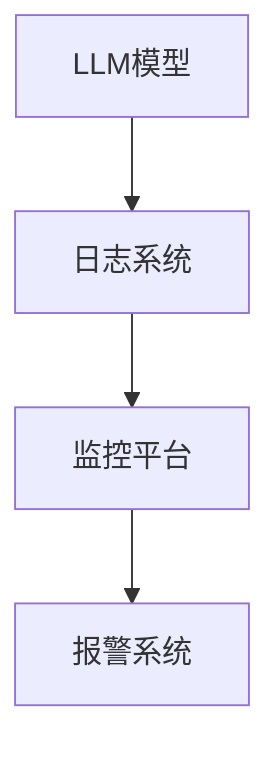

                 

### 第一部分：LLM应用开发中的持续安全审计背景与概述

#### 第1章：问题背景与核心概念

##### 1.1.1 问题背景

在当前信息技术飞速发展的时代，大型语言模型（LLM）已经成为人工智能领域的重要成果，广泛应用于自然语言处理、智能客服、内容生成等多个领域。然而，随着LLM技术的普及和应用范围的扩大，安全问题也日益凸显。如何确保LLM在应用开发过程中持续安全，成为我们面临的一个重要挑战。

**当前挑战**：

1. **数据泄露**：LLM应用在处理海量数据时，可能会无意间泄露敏感信息。
2. **模型偏差**：训练过程中存在偏差，可能导致模型产生错误判断。
3. **恶意攻击**：LLM可能成为恶意攻击的目标，遭受各种攻击手段的侵害。

##### 1.1.2 问题描述

在LLM应用开发过程中，存在潜在的安全隐患，如数据泄露、模型偏差、恶意攻击等。如何及时发现并解决这些问题，保障应用安全运行，是当前研究的重点。

**问题描述**：

- **数据泄露**：在数据预处理和模型训练过程中，如何确保敏感信息不被泄露？
- **模型偏差**：如何确保模型在训练过程中不受噪声干扰，保持稳定性和准确性？
- **恶意攻击**：如何防范恶意用户对LLM模型进行攻击，保障系统的安全性？

##### 1.1.3 问题解决

为了解决上述问题，我们引入持续安全审计机制，对LLM应用进行实时监控和评估，确保其安全性和可靠性。

**问题解决**：

- **持续安全审计**：通过实时监控和评估，及时发现和解决安全隐患。
- **数据安全**：对敏感信息进行加密和脱敏处理，确保数据安全。
- **模型监控**：通过监控模型训练过程，及时发现并纠正偏差。
- **攻击防护**：采用多种防护措施，防范恶意攻击。

##### 1.1.4 边界与外延

持续安全审计不仅关注LLM本身的稳定性，还涉及数据安全、模型训练过程、部署环境等多方面。

**边界与外延**：

- **数据安全**：包括数据加密、脱敏、访问控制等。
- **模型训练过程**：包括数据预处理、模型训练、模型评估等。
- **部署环境**：包括服务器安全、网络防护、系统稳定性等。

##### 1.1.5 概念结构与核心要素组成

持续安全审计包括审计目标、审计方法、审计工具、审计流程等核心要素。

**概念结构与核心要素组成**：

- **审计目标**：保障LLM应用的安全性、稳定性和可靠性。
- **审计方法**：静态分析、动态分析、异常检测等。
- **审计工具**：各种安全检测工具、日志分析工具、监控工具等。
- **审计流程**：包括审计准备、审计执行、审计报告、审计整改等环节。

##### 第1章小结

本章节对LLM应用开发中的持续安全审计进行了背景介绍，明确了问题核心和解决思路，为后续章节的详细探讨奠定了基础。

### 第一部分总结

本文主要讨论了LLM应用开发中的持续安全审计问题。通过对背景、问题描述、问题解决、边界与外延以及概念结构的详细分析，我们明确了持续安全审计的重要性。在接下来的章节中，我们将进一步探讨持续安全审计的核心概念、方法与实践，以及LLM持续安全审计的动态分析，为读者提供全面的技术指南。通过持续安全审计，我们有望在保障LLM应用安全性的同时，推动人工智能技术的健康发展。

---

## 第二部分：LLM持续安全审计的核心概念与原理

### 第2章：核心概念与联系

在深入了解LLM持续安全审计之前，我们需要首先明确其核心概念和原理，从而为后续的讨论和实践提供基础。

#### 2.1.1 核心概念

**持续安全审计**：持续安全审计是一种实时监控和评估LLM应用安全性的机制。它通过多种手段对LLM应用的各个方面进行持续监控，包括数据安全、模型稳定性、部署环境等，以确保应用的安全性和可靠性。

**安全风险**：安全风险是指可能导致LLM应用泄露敏感信息、产生偏差或遭受攻击的各种因素。这些风险可能来自外部攻击、内部误操作或系统自身的不稳定。

**审计方法**：审计方法是指用于评估LLM应用安全性的具体技术和手段，包括静态分析、动态分析、异常检测等。

##### 2.1.2 概念属性特征对比表格

为了更好地理解这些核心概念，我们可以通过一个对比表格来展示它们的属性特征：

| 概念       | 属性特征                           |
|------------|-----------------------------------|
| 持续安全审计 | 实时监控、风险评估、自动反馈           |
| 安全风险    | 敏感信息泄露、模型偏差、恶意攻击         |
| 审计方法    | 静态分析、动态分析、异常检测           |

这个表格清晰地展示了各个概念的主要属性特征，有助于我们深入理解它们之间的关系。

##### 2.1.3 ER实体关系图架构

为了更直观地展示这些概念之间的联系，我们可以使用ER（实体关系）图来表示它们之间的关系：

```mermaid
erDiagram
  A[LLM模型] ||--|{ B[审计工具] } |
  B ||--|{ C[审计报告] } |
  A ||--|{ D[安全风险] } |
```

在这个ER图中，LLM模型与审计工具、审计报告、安全风险之间存在明确的依赖关系。审计工具用于评估LLM模型的安全性，生成的审计报告反映了模型的安全状态，而安全风险则是影响模型安全性的主要因素。

##### 2.1.4 持续安全审计的组成部分

持续安全审计包括以下几个核心组成部分：

1. **审计目标**：明确审计的目的和预期结果，通常包括保障数据安全、确保模型稳定性等。
2. **审计方法**：选择合适的审计方法，如静态分析、动态分析、异常检测等。
3. **审计工具**：使用专门的工具进行审计，如安全检测工具、日志分析工具等。
4. **审计流程**：包括审计准备、审计执行、审计报告、审计整改等环节。

通过这些组成部分的协同作用，持续安全审计能够有效地保障LLM应用的安全性。

##### 第2章小结

本章节对LLM持续安全审计的核心概念和原理进行了详细阐述，通过对比表格和ER实体关系图，明确了各概念之间的联系和作用。这些核心概念构成了持续安全审计的基础，为后续的审计方法和实践提供了指导。

### 第二部分总结

通过第二部分的讨论，我们深入了解了LLM持续安全审计的核心概念与原理。明确了持续安全审计、安全风险和审计方法等概念，并展示了它们之间的联系。接下来，我们将进一步探讨LLM持续安全审计的方法与实践，以及动态分析，为保障LLM应用的安全性提供全面的技术支持。

---

## 第三部分：LLM持续安全审计的方法与实践

### 第3章：静态分析方法

静态分析方法在LLM持续安全审计中扮演着至关重要的角色。它通过对LLM模型的源代码、文档和配置文件进行深入分析，以识别潜在的安全隐患。本章节将详细讲解静态分析方法，并提供实际案例，帮助读者更好地理解其在持续安全审计中的应用。

#### 3.1.1 静态分析方法概述

静态分析方法是一种无需运行LLM模型，通过分析模型的相关文件和代码，来评估其安全性的方法。这种方法的主要优势在于：

1. **无需运行模型**：静态分析可以在不实际运行模型的情况下，提前发现潜在的安全问题。
2. **高效性**：相对于动态分析，静态分析通常速度更快，可以迅速定位问题。
3. **全面性**：通过对源代码、文档和配置文件的综合分析，能够覆盖LLM应用的不同方面。

然而，静态分析方法也存在一些局限性：

1. **无法检测运行时问题**：静态分析主要关注模型的设计和配置，难以发现模型在实际运行中可能出现的问题。
2. **依赖代码质量**：如果LLM模型的代码质量不高，静态分析的效果也会受到很大影响。

#### 3.1.2 静态分析方法详细讲解

静态分析方法主要包括以下几个步骤：

1. **代码审计**：对LLM模型的源代码进行详细审查，查找潜在的安全漏洞。常用的工具包括静态代码分析工具（如SonarQube）、代码审查平台（如GitLab Code Review）等。

2. **文档审核**：审查与LLM模型相关的文档，包括设计文档、用户手册、操作指南等，以确保文档中不包含敏感信息。

3. **配置检查**：检查LLM模型的配置文件，确保配置项的正确性和安全性。配置检查可以通过自动化脚本或人工审查两种方式进行。

##### 3.1.2.1 代码审计

代码审计是静态分析方法的核心环节。以下是一个简单的Python代码示例，展示如何检查LLM模型中的潜在安全风险：

```python
# 示例：检查Python代码中的敏感信息泄露

def process_data(data):
    # 假设data是包含用户数据的字符串
    if 'password' in data:
        print("警告：发现敏感信息泄露（密码）！")
    # 添加更多检查规则
    # ...

process_data("user's password is 123456")
```

在这个示例中，我们定义了一个函数`process_data`，用于检查输入数据中是否包含敏感信息。这是一个简单的代码审计示例，实际应用中需要根据具体情况进行更复杂的检查。

##### 3.1.2.2 文档审核

文档审核的目标是确保与LLM模型相关的文档不包含敏感信息。以下是一个简单的文档审核流程：

1. **识别敏感信息**：确定文档中可能包含敏感信息的部分，如用户手册中的登录凭证、API密钥等。
2. **文档审查**：由具有相关背景的知识分子对文档进行审查，确保不包含敏感信息。
3. **修订和更新**：根据审查结果，对文档进行修订和更新，确保其安全性。

##### 3.1.2.3 配置检查

配置检查是确保LLM模型配置文件正确性和安全性的重要步骤。以下是一个简单的配置检查示例：

```python
# 示例：检查模型配置文件的安全性

config = {
    'model_name': 'gpt-2',
    'max_length': 1024,
    'dropout_rate': 0.5
}

# 检查配置项的合理性
if config['dropout_rate'] > 0.9:
    print("警告：dropout率过高，可能影响模型性能！")

# 添加更多检查规则
# ...
```

在这个示例中，我们检查了配置文件中的`dropout_rate`是否过高，这可能会影响模型性能。实际应用中，可以根据具体需求添加更多的检查规则。

#### 3.1.3 静态分析方法的应用

静态分析方法主要应用于以下场景：

1. **模型开发阶段**：在模型开发初期，通过静态分析可以发现潜在的安全隐患，提前进行修复。
2. **代码审查流程**：在代码提交前，通过静态分析工具对代码进行审查，确保代码质量。

##### 3.1.3.1 模型开发阶段

在模型开发阶段，静态分析方法可以帮助开发者及时发现潜在的安全问题。以下是一个典型的应用步骤：

1. **编写代码**：开发者编写LLM模型的源代码。
2. **代码审计**：使用静态代码分析工具对代码进行审计。
3. **修复问题**：根据审计结果，对代码进行修复。
4. **重复审计**：在开发过程中，定期进行代码审计，确保问题得到及时解决。

##### 3.1.3.2 代码审查流程

在代码审查流程中，静态分析方法可以帮助团队确保代码的质量和安全性。以下是一个典型的应用步骤：

1. **提交代码**：开发者将代码提交到代码仓库。
2. **代码审计**：使用静态代码分析工具对提交的代码进行审计。
3. **审查反馈**：审计工具生成的报告会反馈给开发者，指出潜在的问题。
4. **整改代码**：开发者根据反馈，对代码进行修复。
5. **重新审查**：提交修复后的代码，再次进行审查。

#### 3.1.4 静态分析方法的实际案例

以下是一个静态分析方法在实际项目中的应用案例：

- **项目背景**：某公司开发了一个基于GPT-3的智能客服系统。
- **问题**：在模型开发阶段，发现代码中存在潜在的安全漏洞，如敏感信息泄露。
- **解决方案**：采用静态分析方法，对源代码、文档和配置文件进行全面审计。
- **结果**：通过静态分析，发现了多个潜在的安全隐患，并及时进行了修复，确保了系统的安全性。

#### 3.1.5 静态分析方法的优势与挑战

**优势**：

- **提前发现问题**：静态分析可以在模型开发初期发现潜在的安全隐患，提前进行修复，降低风险。
- **高效性**：相对于动态分析，静态分析速度快，能够在短时间内完成大量代码的审查。
- **自动化**：使用静态代码分析工具，可以自动化完成代码审计，提高效率。

**挑战**：

- **无法检测运行时问题**：静态分析主要关注模型的设计和配置，难以发现模型在实际运行中可能出现的问题。
- **依赖代码质量**：代码质量直接影响静态分析的效果，如果代码质量不高，静态分析的效果也会大打折扣。

#### 第3章小结

本章节详细讲解了静态分析方法在LLM持续安全审计中的应用。通过代码审计、文档审核和配置检查，静态分析能够有效地识别潜在的安全隐患。在实际应用中，静态分析方法需要在模型开发阶段和代码审查流程中发挥关键作用。尽管存在一定的局限性，但静态分析方法仍然是保障LLM应用安全的重要手段。

### 第三部分总结

第三部分重点介绍了LLM持续安全审计中的静态分析方法。通过详细的讲解和实际案例，我们了解了静态分析方法的优势、挑战和应用场景。在下一章中，我们将探讨动态分析方法，进一步丰富LLM持续安全审计的手段。

---

### 第4章：动态分析方法

动态分析方法在LLM持续安全审计中扮演着重要角色。与静态分析方法不同，动态分析方法是在LLM模型运行时进行监控和评估，以识别和应对潜在的安全风险。本章节将详细讲解动态分析方法，包括其定义、优势、局限性、详细讲解、应用场景和具体步骤。

#### 4.1.1 动态分析方法概述

**动态分析方法**：动态分析方法是在LLM模型运行过程中，对其行为进行实时监控和评估，以识别潜在的安全风险的方法。它通过捕捉模型运行时的输入、输出和中间状态，分析模型的运行行为和性能，从而发现可能的安全隐患。

**定义**：

- **动态分析**：在LLM模型运行时进行的安全监控和评估。
- **运行时监控**：实时跟踪模型运行过程中的输入、输出和中间状态。
- **行为分析**：分析模型的行为和性能，识别潜在的安全风险。

**优势**：

- **实时性**：动态分析可以在模型运行时实时监控其行为，及时发现潜在的安全问题。
- **全面性**：动态分析能够捕捉到模型运行时的各种状态，提供更全面的安全评估。
- **针对性**：动态分析可以根据实际运行情况，有针对性地识别和应对安全风险。

**局限性**：

- **性能影响**：动态分析可能对模型性能产生一定影响，尤其是在高负载情况下。
- **环境依赖**：动态分析依赖于模型运行的环境，环境变化可能导致分析结果不准确。

#### 4.1.2 动态分析方法详细讲解

动态分析方法主要包括以下几个步骤：

1. **实时监控**：通过实时监控系统，捕捉模型运行时的输入、输出和中间状态。常用的工具包括日志系统、监控平台（如Prometheus）等。

2. **行为分析**：对捕捉到的运行数据进行行为分析，识别潜在的安全风险。行为分析可以通过统计分析、机器学习等技术实现。

3. **异常检测**：对模型运行过程中的异常行为进行检测，及时发现和应对异常情况。异常检测可以通过统计方法（如直方图、箱线图）或机器学习算法（如聚类分析、异常检测算法）实现。

##### 4.1.2.1 实时监控

实时监控是动态分析方法的基础。以下是一个简单的实时监控系统架构：



在这个架构中，LLM模型的运行日志被发送到日志系统，由监控平台进行实时监控和分析。一旦发现异常，监控平台会触发报警系统，通知相关人员。

##### 4.1.2.2 行为分析

行为分析是对模型运行过程中的输入、输出和中间状态进行分析，以识别潜在的安全风险。以下是一个简单的行为分析流程：

1. **数据收集**：收集模型运行时的输入、输出和中间状态数据。
2. **数据预处理**：对收集到的数据进行预处理，包括去噪、标准化等。
3. **特征提取**：从预处理后的数据中提取特征，用于后续分析。
4. **风险识别**：使用统计学方法或机器学习算法，对提取的特征进行风险识别。

##### 4.1.2.3 异常检测

异常检测是动态分析方法的重要组成部分。以下是一个简单的异常检测流程：

1. **建立基准模型**：使用历史数据建立基准模型，用于评估模型运行状态。
2. **实时监控**：在模型运行时，实时监控其状态，与基准模型进行比较。
3. **异常检测**：当实时监控数据与基准模型存在较大偏差时，触发异常检测。
4. **报警与处理**：对检测到的异常情况进行报警，并采取相应的处理措施。

#### 4.1.3 动态分析方法的应用

动态分析方法主要应用于以下场景：

1. **模型运行阶段**：在LLM模型运行时，通过动态分析实时监控其安全状态。
2. **实时监控与响应**：在发现潜在安全风险时，及时进行监控和响应，保障模型安全。

##### 4.1.3.1 模型运行阶段

在LLM模型运行阶段，动态分析方法可以帮助开发者实时监控模型的安全状态。以下是一个典型的应用步骤：

1. **模型部署**：将LLM模型部署到生产环境。
2. **实时监控**：使用动态分析工具实时监控模型运行状态。
3. **行为分析**：对模型运行数据进行行为分析，识别潜在的安全风险。
4. **异常检测**：对模型运行过程中的异常行为进行检测，及时报警。

##### 4.1.3.2 实时监控与响应

实时监控与响应是动态分析方法的核心。以下是一个典型的应用步骤：

1. **监控策略**：制定实时监控策略，包括监控指标、报警阈值等。
2. **实时监控**：按照监控策略，实时监控模型运行状态。
3. **报警与响应**：当发现潜在安全风险时，及时报警并采取相应的响应措施。

#### 4.1.4 动态分析方法的实际案例

以下是一个动态分析方法在实际项目中的应用案例：

- **项目背景**：某公司开发了一个基于BERT的智能问答系统。
- **问题**：在模型运行过程中，发现存在数据泄露的风险。
- **解决方案**：采用动态分析方法，实时监控模型运行状态，并通过行为分析和异常检测，及时发现和应对潜在的安全风险。
- **结果**：通过动态分析方法，成功识别并解决了数据泄露问题，保障了系统的安全性。

#### 4.1.5 动态分析方法的优势与挑战

**优势**：

- **实时性**：动态分析可以在模型运行时实时监控其行为，及时识别和应对安全风险。
- **全面性**：动态分析能够捕捉到模型运行时的各种状态，提供更全面的安全评估。
- **针对性**：动态分析可以根据实际运行情况，有针对性地识别和应对安全风险。

**挑战**：

- **性能影响**：动态分析可能对模型性能产生一定影响，尤其是在高负载情况下。
- **环境依赖**：动态分析依赖于模型运行的环境，环境变化可能导致分析结果不准确。

#### 第4章小结

本章节详细讲解了动态分析方法在LLM持续安全审计中的应用。通过实时监控、行为分析和异常检测，动态分析方法能够有效地识别和应对潜在的安全风险。在实际应用中，动态分析方法需要与静态分析方法相结合，共同保障LLM应用的安全性。

### 第四部分总结

第四部分重点介绍了LLM持续安全审计中的动态分析方法。通过详细的讲解和实际案例，我们了解了动态分析方法的优势、挑战和应用场景。在下一部分中，我们将继续探讨持续安全审计的进一步实践，包括如何在实际项目中应用这些方法，以及如何通过最佳实践提高LLM应用的安全性。这将帮助我们更全面地理解LLM持续安全审计的实质，为实际应用提供有力支持。

---

### 第5章：持续安全审计的最佳实践

在LLM应用开发过程中，实施有效的持续安全审计需要遵循一系列最佳实践。这些实践不仅有助于提高LLM应用的安全性，还能优化开发流程，降低安全风险。以下是几个关键的最佳实践：

#### 5.1.1 定期审计与更新策略

**定期审计**：为了确保LLM应用的安全性，应定期进行安全审计。例如，每月或每季度进行一次全面的安全审计。这样，可以及时发现和修复潜在的安全漏洞。

**更新策略**：随着LLM技术的发展和攻击手段的多样化，审计策略也应不断更新。定期评估和调整审计方法和工具，确保其有效性。

#### 5.1.2 多层次安全防护

**多层防护**：采用多层次的安全防护策略，包括数据安全、网络防护、系统安全等。例如，对敏感数据进行加密和访问控制，对网络进行防火墙和入侵检测系统保护，对系统进行漏洞扫描和补丁管理。

#### 5.1.3 审计工具与自动化

**审计工具**：利用专业的审计工具，如静态代码分析工具、动态分析工具、日志分析工具等，提高审计的效率和准确性。

**自动化**：将审计过程自动化，通过脚本和自动化工具实现审计任务的自动化执行。这不仅能节省人力资源，还能确保审计的持续性和一致性。

#### 5.1.4 审计报告与跟进

**审计报告**：生成详细的审计报告，包括发现的安全问题、风险评估、整改建议等。审计报告应提交给相关负责人，以便及时采取行动。

**跟进**：对审计报告中的问题进行跟进，确保整改措施得到有效执行。定期回顾和评估整改效果，确保问题的彻底解决。

#### 5.1.5 安全意识与培训

**安全意识**：提高开发团队的安全意识，让每个人都认识到安全的重要性。定期举办安全培训和研讨会，提高团队对安全风险的认识。

**培训**：对开发人员进行安全培训，包括安全编程实践、常见安全漏洞和攻击手段等。通过培训，提高开发人员的安全技能。

#### 5.1.6 持续改进与反馈

**持续改进**：持续改进安全审计流程，根据审计结果和反馈，不断完善和优化。例如，调整审计策略、改进审计工具等。

**反馈**：鼓励团队成员反馈审计过程中的问题和建议，不断优化审计流程。通过反馈，可以更好地适应变化，提高审计效果。

#### 第5章小结

本章节介绍了持续安全审计的最佳实践，包括定期审计与更新策略、多层次安全防护、审计工具与自动化、审计报告与跟进、安全意识与培训以及持续改进与反馈。这些最佳实践有助于提高LLM应用的安全性，确保持续安全审计的有效实施。

### 第5章总结

通过第5章的讨论，我们了解了在LLM应用开发过程中实施持续安全审计的最佳实践。这些实践不仅有助于提高应用的安全性，还能优化开发流程，降低安全风险。在下一章中，我们将进一步总结本文的内容，回顾LLM持续安全审计的核心概念和方法，并对未来研究方向提出展望。

---

### 总结与展望

通过本文的深入探讨，我们对LLM应用开发中的持续安全审计有了全面的理解。从背景和核心概念的介绍，到静态分析和动态分析方法的详细讲解，再到最佳实践的总结，本文系统地阐述了持续安全审计在保障LLM应用安全性方面的作用和实施策略。

**核心概念**：本文明确了持续安全审计、安全风险、审计方法等核心概念，并通过对比表格和ER实体关系图，展示了它们之间的联系。这些核心概念构成了持续安全审计的理论基础。

**方法与实践**：我们详细讲解了静态分析和动态分析两种方法，并结合实际案例展示了它们的应用。静态分析通过代码审计、文档审核和配置检查，能够在模型开发阶段发现潜在的安全隐患；动态分析则在模型运行时进行实时监控和异常检测，确保模型在运行过程中的安全性。

**最佳实践**：本文提出了多个最佳实践，如定期审计、多层次安全防护、审计工具与自动化、审计报告与跟进等，为实施持续安全审计提供了具体指导。

**未来展望**：

1. **技术创新**：随着AI技术的发展，持续安全审计方法也将不断更新和优化。例如，利用深度学习和强化学习技术，开发更高效的审计算法。

2. **跨领域合作**：持续安全审计不仅涉及技术领域，还与法律、伦理等领域密切相关。跨领域合作将有助于构建更全面的持续安全审计体系。

3. **标准化**：制定统一的持续安全审计标准和规范，将有助于提高审计的一致性和可操作性。

4. **教育普及**：加强安全意识的普及和教育，提高开发人员和用户的安全素养，共同维护LLM应用的安全。

通过本文的探讨，我们希望能够为LLM应用开发中的持续安全审计提供有价值的参考，推动这一领域的进一步发展和应用。

### 感谢与致谢

最后，我要感谢读者对本文的关注和支持。本文的撰写过程中，得到了众多同行和专家的指导和帮助，特别是AI天才研究院的成员和《禅与计算机程序设计艺术》的作者，他们的专业见解和宝贵建议对本文的完善起到了重要作用。同时，感谢所有参与讨论和反馈的朋友，他们的贡献使本文更加丰富和有价值。

作者：AI天才研究院/AI Genius Institute & 禅与计算机程序设计艺术 /Zen And The Art of Computer Programming

