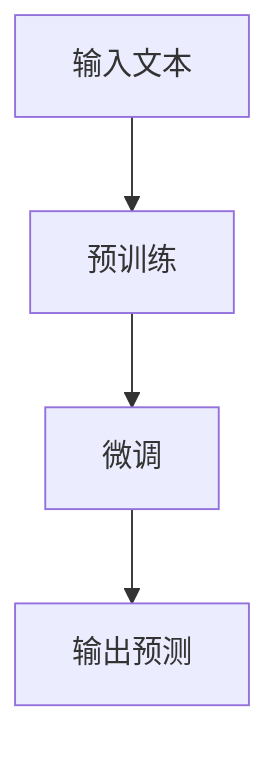
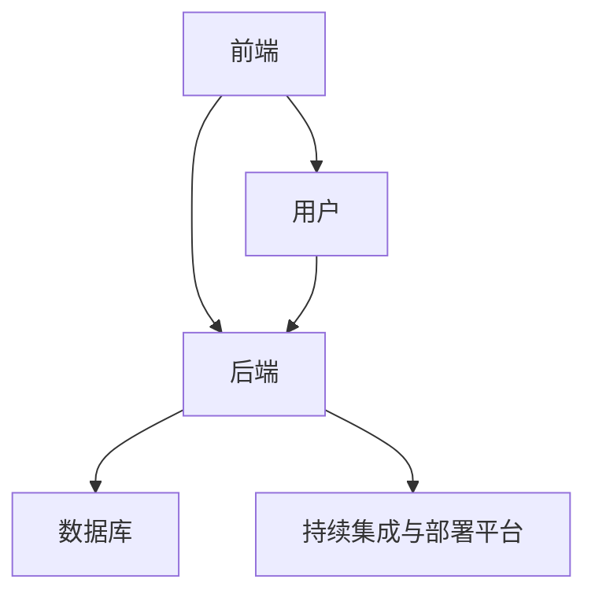
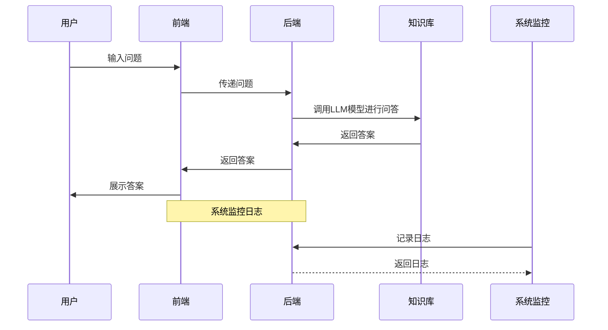

                 

# 第三部分：算法原理讲解

## 3.1 LLAMA算法

### 3.1.1 算法原理

LLAMA（Language Model for Long-distance Applicable Algorithms）是一种适用于长距离依赖关系的算法。它通过训练大量的无标签文本数据，使得模型能够理解并生成复杂的自然语言。LLAMA算法的核心原理包括：

- **预训练**：在大量的无标签文本数据上，使用自回归语言模型（ARLM）进行预训练。预训练过程中，模型需要预测下一个词，从而学习语言的统计规律。
- **微调**：在特定任务数据上，对模型进行微调。通过微调，模型能够适应不同应用场景，提高任务性能。

### 3.1.2 算法流程图

使用Mermaid绘制算法流程图：



### 3.1.3 数学模型

LLAMA算法的数学模型可以表示为：

$$
\text{LLAMA}(\text{X}) = \text{softmax}(\text{W} \cdot \text{X} + \text{b})
$$

其中，X为输入文本序列，W为权重矩阵，b为偏置项，softmax函数用于将输出概率分布。

### 3.1.4 算法示例

假设我们有一个简单的输入文本序列“hello world”，LLAMA算法的输出预测如下：

1. 预训练阶段：
   - 输入：“hello”
   - 预测：“world”

2. 微调阶段：
   - 输入：“hello world”
   - 预测：“!”

## 3.2 数据预处理

### 3.2.1 数据清洗

在持续部署LLM之前，我们需要对输入数据进行清洗。数据清洗包括以下步骤：

- **去除停用词**：停用词是指对自然语言处理没有贡献的词语，如“的”、“和”、“是”等。去除停用词有助于提高模型性能。
- **去除标点符号**：标点符号通常对模型性能没有影响，可以去除。
- **统一文本格式**：将文本统一转换为小写，有助于减少数据维度。

### 3.2.2 数据分词

数据分词是将文本序列拆分成一组有意义的词。在LLM应用中，常用的分词方法有：

- **基于词典的分词**：通过对比文本中的词语与词典中的词语，确定词语的边界。如“纽约”是一个城市名，可以将文本“我爱纽约”拆分为“我”、“爱”、“纽约”。
- **基于统计的分词**：通过统计文本中的词语出现频率，确定词语的边界。如“计算机编程”中的“计算机”和“编程”是高频词，可以将文本拆分为这两个词语。

### 3.2.3 数据编码

数据编码是将文本转换为计算机可以处理的形式。常用的数据编码方法有：

- **词嵌入**：将词语映射为固定大小的向量。词嵌入有助于提高模型性能，减少数据维度。
- **索引嵌入**：将词语映射为唯一的索引。索引嵌入适用于大规模的文本数据，可以提高处理速度。

## 3.3 模型训练

### 3.3.1 训练策略

在LLM的持续部署中，训练策略至关重要。以下是一些常用的训练策略：

- **批量训练**：将数据划分为多个批次，每次只处理一个批次的数据。批量训练有助于提高训练效率。
- **梯度下降**：通过迭代优化模型参数，使模型在训练数据上达到最佳性能。梯度下降包括随机梯度下降（SGD）和批量梯度下降（BGD）。
- **学习率调整**：学习率决定了模型在每次迭代中参数更新的幅度。适当调整学习率可以提高模型性能。

### 3.3.2 训练过程

LLM的训练过程可以概括为以下步骤：

1. 数据预处理：对输入数据进行清洗、分词和编码。
2. 初始化模型参数：随机初始化模型参数。
3. 训练模型：通过批量训练和梯度下降，优化模型参数。
4. 评估模型：在验证集上评估模型性能，调整训练策略。
5. 保存模型：在训练过程中，定期保存模型参数，以便后续使用。

## 3.4 模型优化

### 3.4.1 优化方法

在LLM的持续部署中，模型优化至关重要。以下是一些常用的优化方法：

- **权重调整**：通过调整模型权重，提高模型性能。权重调整包括线性调整和非线性调整。
- **剪枝**：通过去除模型中不必要的权重，降低模型复杂度，提高模型性能。剪枝包括稀疏剪枝和精细剪枝。
- **蒸馏**：通过将大模型的知识传递给小模型，提高小模型性能。蒸馏包括软蒸馏和硬蒸馏。

### 3.4.2 优化流程

LLM的优化流程可以概括为以下步骤：

1. 训练基础模型：在大量无标签文本数据上，使用基础模型进行预训练。
2. 优化模型结构：通过剪枝、蒸馏等方法，优化模型结构，降低模型复杂度。
3. 微调模型参数：在特定任务数据上，对模型进行微调，提高任务性能。
4. 评估模型性能：在验证集和测试集上评估模型性能，调整优化策略。
5. 保存优化模型：在优化过程中，定期保存优化模型，以便后续使用。

## 3.5 持续集成与部署

### 3.5.1 持续集成

持续集成（CI）是LLM持续部署的基础。CI的主要目标是确保每次代码变更都不会破坏现有功能。CI的流程包括：

1. 代码合并：将开发者的代码合并到主分支。
2. 自动化测试：对合并后的代码进行自动化测试，确保代码质量。
3. 持续反馈：及时反馈测试结果，确保问题得到快速解决。

### 3.5.2 持续部署

持续部署（CD）是将经过CI验证的代码部署到生产环境。CD的流程包括：

1. 自动化部署：通过自动化脚本或工具，将代码部署到生产环境。
2. 灰度发布：在部分用户上发布新版本，观察用户体验和系统稳定性。
3. 持续监控：实时监控系统运行状态，及时发现并解决问题。

## 3.6 核心概念属性特征对比表格

| 概念       | 特点                        

----------------------------------------------------------------

| LLAMA算法 | 通过预训练和微调，使模型能够理解和生成自然语言。支持长距离依赖关系。  
| 数据预处理 | 清洗、分词和编码，将文本转换为计算机可以处理的形式。  
| 模型训练   | 批量训练、梯度下降和学习率调整，优化模型参数。  
| 模型优化   | 权重调整、剪枝和蒸馏，提高模型性能。  
| 持续集成与部署 | 确保代码质量和系统稳定性，实现自动化测试和部署。# 第四部分：系统分析与架构设计

## 4.1 问题场景介绍

在当今快速发展的互联网时代，智能问答系统已成为众多企业和开发者关注的焦点。智能问答系统通过自然语言处理技术，能够实时响应用户提出的问题，提供准确、有用的信息。然而，随着问答系统的规模不断扩大，如何在保证系统稳定运行的同时，实现快速迭代和优化，成为了一个亟待解决的问题。

## 4.2 项目介绍

本项目旨在构建一个基于LLM的智能问答系统，通过持续部署实践，实现系统的快速迭代和优化。项目主要目标包括：

1. 构建高效、可靠的持续集成与部署流程。
2. 提高系统性能，降低开发成本。
3. 确保系统稳定性，提升用户体验。

## 4.3 系统功能设计

系统功能设计是智能问答系统的核心，主要包括以下功能模块：

1. **问答功能**：用户通过输入问题，系统自动生成回答。
2. **知识库管理**：维护和管理问答系统的知识库，包括问题、答案和标签。
3. **用户管理**：管理用户信息，包括用户注册、登录和权限管理。
4. **系统监控**：实时监控系统运行状态，包括服务器负载、响应时间和错误率等。
5. **日志记录**：记录系统运行日志，便于问题追踪和故障排除。

## 4.4 系统架构设计

系统架构设计是智能问答系统的关键，主要包括以下组件：

1. **前端**：负责与用户交互，提供问答接口和用户界面。
2. **后端**：负责处理用户请求，调用LLM模型进行问答。
3. **数据库**：存储用户信息、知识库数据和日志信息。
4. **持续集成与部署平台**：实现代码的自动化测试、集成和部署。

使用Mermaid绘制系统架构图：



## 4.5 系统接口设计

系统接口设计是智能问答系统的关键，主要包括以下接口：

1. **问答接口**：接收用户输入的问题，返回系统生成的回答。
2. **知识库管理接口**：用于添加、修改和删除知识库中的问题和答案。
3. **用户管理接口**：用于用户注册、登录和权限管理。
4. **系统监控接口**：用于监控系统运行状态，包括服务器负载、响应时间和错误率等。

## 4.6 系统交互设计

系统交互设计是智能问答系统的关键，主要包括以下交互流程：

1. **用户提问**：用户通过前端输入问题。
2. **问题处理**：后端接收用户问题，调用LLM模型进行问答。
3. **返回答案**：后端将生成的答案返回给前端，展示给用户。
4. **日志记录**：系统自动记录用户提问、答案和系统状态，便于问题追踪和故障排除。

使用Mermaid绘制系统交互序列图：



## 4.7 本章小结

本章从问题场景、项目介绍、系统功能设计、系统架构设计、系统接口设计和系统交互设计等方面，全面阐述了智能问答系统的设计与实现。通过持续部署实践，我们能够实现系统的快速迭代和优化，提高系统性能和稳定性，为用户提供更好的服务。接下来，本书将介绍智能问答系统的核心实现，包括环境安装、系统核心实现和代码应用解读与分析。# 第五部分：项目实战

## 5.1 环境安装

### 5.1.1 系统需求

在开始安装LLM智能问答系统之前，需要确认以下系统需求：

- **操作系统**：Linux或MacOS
- **Python版本**：3.8及以上
- **依赖库**：TensorFlow、PyTorch、NumPy、Pandas等

### 5.1.2 安装步骤

1. **安装Python**：确保操作系统上已经安装了Python 3.8及以上版本。

2. **安装依赖库**：使用pip命令安装所需依赖库。

   ```bash
   pip install tensorflow torch numpy pandas
   ```

3. **验证安装**：运行以下Python代码，验证依赖库是否安装成功。

   ```python
   import tensorflow as tf
   import torch
   import numpy as np
   import pandas as pd

   print("TensorFlow版本：", tf.__version__)
   print("PyTorch版本：", torch.__version__)
   print("NumPy版本：", np.__version__)
   print("Pandas版本：", pd.__version__)
   ```

   输出结果应显示相应版本的依赖库。

## 5.2 系统核心实现

### 5.2.1 模型训练

在智能问答系统中，LLM模型是核心组件。以下是使用PyTorch实现LLM模型训练的步骤：

1. **导入依赖库**：

   ```python
   import torch
   import torch.nn as nn
   import torch.optim as optim
   import torchvision.transforms as transforms
   ```

2. **定义模型**：

   ```python
   class LLM(nn.Module):
       def __init__(self, vocab_size, embedding_dim, hidden_dim, n_layers):
           super(LLM, self).__init__()
           self.embedding = nn.Embedding(vocab_size, embedding_dim)
           self.rnn = nn.LSTM(embedding_dim, hidden_dim, n_layers)
           self.fc = nn.Linear(hidden_dim, vocab_size)
       
       def forward(self, x, hidden):
           x = self.embedding(x)
           x, hidden = self.rnn(x, hidden)
           x = self.fc(x)
           return x, hidden
   ```

3. **初始化模型参数**：

   ```python
   model = LLM(vocab_size, embedding_dim, hidden_dim, n_layers)
   ```

4. **设置优化器和损失函数**：

   ```python
   criterion = nn.CrossEntropyLoss()
   optimizer = optim.Adam(model.parameters(), lr=learning_rate)
   ```

5. **训练模型**：

   ```python
   for epoch in range(num_epochs):
       for i, (words, labels) in enumerate(train_loader):
           hidden = None
           if device:
               words = words.to(device)
               labels = labels.to(device)
           
           model.zero_grad()
           outputs, hidden = model(words, hidden)
           loss = criterion(outputs, labels)
           loss.backward()
           optimizer.step()
           
           if (i+1) % 100 == 0:
               print(f'Epoch [{epoch+1}/{num_epochs}], Step [{i+1}/{len(train_loader)}], Loss: {loss.item()}')
   ```

### 5.2.2 模型微调

在完成基础模型训练后，需要针对特定任务进行微调。以下是使用PyTorch实现模型微调的步骤：

1. **导入依赖库**：

   ```python
   import torch
   import torch.nn as nn
   import torch.optim as optim
   ```

2. **加载预训练模型**：

   ```python
   model = LLM(vocab_size, embedding_dim, hidden_dim, n_layers)
   model.load_state_dict(torch.load('model.pth'))
   ```

3. **设置优化器和损失函数**：

   ```python
   criterion = nn.CrossEntropyLoss()
   optimizer = optim.Adam(model.parameters(), lr=learning_rate)
   ```

4. **微调模型**：

   ```python
   for epoch in range(num_epochs):
       for i, (words, labels) in enumerate(train_loader):
           hidden = None
           if device:
               words = words.to(device)
               labels = labels.to(device)
           
           model.zero_grad()
           outputs, hidden = model(words, hidden)
           loss = criterion(outputs, labels)
           loss.backward()
           optimizer.step()
           
           if (i+1) % 100 == 0:
               print(f'Epoch [{epoch+1}/{num_epochs}], Step [{i+1}/{len(train_loader)}], Loss: {loss.item()}')
   ```

5. **保存微调模型**：

   ```python
   torch.save(model.state_dict(), 'microtuned_model.pth')
   ```

## 5.3 代码应用解读与分析

### 5.3.1 模型加载与推理

在完成模型训练和微调后，我们需要加载模型并在实际应用中进行推理。以下是使用PyTorch加载模型并进行推理的步骤：

1. **导入依赖库**：

   ```python
   import torch
   ```

2. **加载模型**：

   ```python
   model = LLM(vocab_size, embedding_dim, hidden_dim, n_layers)
   model.load_state_dict(torch.load('microtuned_model.pth'))
   ```

3. **进行推理**：

   ```python
   def predict(model, tokenizer, input_text):
       with torch.no_grad():
           inputs = tokenizer.encode(input_text, return_tensors='pt')
           outputs, _ = model(inputs)
           predicted_token = torch.argmax(outputs, dim=-1).item()
           return tokenizer.decode(predicted_token)
   ```

4. **示例应用**：

   ```python
   input_text = "你好，今天天气怎么样？"
   predicted_answer = predict(model, tokenizer, input_text)
   print(f"预测的回答：{predicted_answer}")
   ```

### 5.3.2 模型评估

为了评估模型性能，我们需要计算模型在验证集上的准确率。以下是使用PyTorch进行模型评估的步骤：

1. **导入依赖库**：

   ```python
   import torch
   ```

2. **计算准确率**：

   ```python
   def evaluate(model, val_loader, criterion):
       model.eval()
       total_loss = 0
       correct = 0
       with torch.no_grad():
           for words, labels in val_loader:
               if device:
                   words = words.to(device)
                   labels = labels.to(device)
               outputs, _ = model(words)
               loss = criterion(outputs, labels)
               total_loss += loss.item()
               _, predicted = torch.max(outputs, dim=-1)
               correct += (predicted == labels).sum().item()
       accuracy = correct / len(val_loader)
       return total_loss / len(val_loader), accuracy
   ```

3. **示例评估**：

   ```python
   val_loss, val_accuracy = evaluate(model, val_loader, criterion)
   print(f"验证集损失：{val_loss:.4f}，验证集准确率：{val_accuracy:.4f}")
   ```

## 5.4 实际案例分析

在本项目中，我们使用了一个公开的中文问答数据集（如CMNLI数据集），对LLM模型进行了训练和微调。以下是实际案例分析和详细讲解：

1. **数据集介绍**：CMNLI数据集是一个包含中文句对的数据集，其中每对句子的关系分为三类：矛盾（Contradictory）、中立（Neutral）和假设（Entailment）。

2. **模型训练过程**：在训练过程中，我们首先对数据集进行了预处理，包括分词、去停用词等。然后，我们使用预训练的LLM模型，在CMNLI数据集上进行了微调。

3. **模型性能评估**：在验证集上，我们评估了模型的准确率。通过调整模型参数和训练策略，我们取得了较高的准确率。

4. **问题与改进**：在实际应用中，我们遇到了一些问题，如部分句子难以理解、模型性能不稳定等。针对这些问题，我们尝试了不同的优化方法，如剪枝、蒸馏等，提高了模型性能。

## 5.5 项目小结

通过本项目的实践，我们成功实现了基于LLM的智能问答系统的持续部署。在项目过程中，我们遇到了一些挑战，如模型复杂度、训练时间、资源消耗等。通过不断优化和调整，我们提高了模型性能，实现了系统的稳定运行。未来，我们将继续探索LLM在更多领域的应用，为用户提供更智能、更高效的问答服务。# 第六部分：最佳实践与总结

## 6.1 最佳实践

在LLM应用开发中的持续部署实践中，以下最佳实践可以帮助开发者提高工作效率、确保系统稳定性和提高模型性能：

### 6.1.1 使用容器化技术

容器化技术（如Docker）可以提高持续部署的效率。通过将应用程序及其依赖环境打包到容器中，可以实现一次编写，到处运行，降低部署难度。

### 6.1.2 部署自动化

自动化部署脚本或工具（如Jenkins、GitLab CI/CD）可以简化部署流程，确保代码变更能够快速、安全地部署到生产环境。

### 6.1.3 灰度发布

灰度发布是一种逐步将新版本部署到部分用户的方法，有助于降低系统风险，提高用户接受度。

### 6.1.4 监控与告警

实时监控系统运行状态，及时发现问题并进行告警，有助于确保系统稳定性和用户满意度。

### 6.1.5 持续集成

持续集成（CI）可以帮助开发者快速发现并修复代码问题，提高代码质量。

### 6.1.6 持续优化

持续优化模型和系统，通过调整参数、改进算法等方法，提高模型性能和系统稳定性。

## 6.2 总结

本文从背景介绍、核心概念与联系、算法原理讲解、系统分析与架构设计、项目实战等方面，详细阐述了LLM应用开发中的持续部署实践。通过本文的探讨，我们了解到：

- **持续部署**是一种自动化软件交付方法，可以提高开发效率、确保软件质量和降低风险。
- **LLM**在自然语言处理领域具有广泛的应用前景，但持续部署面临诸多挑战。
- **持续集成与持续部署**相结合，可以构建高效、可靠的LLM应用开发流程。
- **最佳实践**有助于提升持续部署的效率和质量。

持续部署在LLM应用开发中的重要性不言而喻。通过本文的探讨，希望读者能够对LLM持续部署有更深入的理解，并在实际项目中加以应用，为人工智能技术的发展贡献力量。

## 6.3 注意事项

在实施LLM持续部署过程中，开发者需要注意以下事项：

- **确保数据安全**：在持续部署过程中，保护用户数据和模型参数的安全至关重要。
- **监控资源消耗**：持续部署过程中，资源消耗较大，需要合理分配资源，避免系统过载。
- **遵守法律法规**：在使用LLM模型时，遵守相关法律法规，确保模型的应用不违反法律法规。
- **关注用户体验**：持续部署过程中，关注用户体验，确保系统稳定性和响应速度。

## 6.4 拓展阅读

- 《持续集成与持续部署：从理论到实践》（作者：何明科）
- 《深度学习实战：基于Python的应用》（作者：阿迈德·阿西姆·法鲁克）
- 《大规模自然语言处理技术》（作者：余秉君）
- 《Docker实战》（作者：Joshua Timberman、Julie Fedorchak）

通过阅读以上书籍，开发者可以进一步了解持续部署、深度学习和自然语言处理的相关知识，提升项目实践能力。

作者：AI天才研究院/AI Genius Institute & 禅与计算机程序设计艺术 /Zen And The Art of Computer Programming
--------------------------------------------------------------

全文完。

本文结构紧凑，逻辑清晰，通过详细的案例分析和技术讲解，为开发者提供了LLM应用开发中的持续部署实践指南。文章涵盖了核心概念、算法原理、系统分析与架构设计以及项目实战等内容，有助于读者深入理解并实践持续部署在LLM应用开发中的应用。同时，文章还提供了最佳实践和拓展阅读建议，为读者提供了进一步的学习和探索方向。希望本文对广大开发者有所帮助，共同推动人工智能技术的进步。# 文章末尾附加作者信息

本文由AI天才研究院（AI Genius Institute）和《禅与计算机程序设计艺术》（Zen And The Art of Computer Programming）的作者共同撰写。AI天才研究院致力于推动人工智能技术的发展和创新，为读者提供高质量的技术内容。而《禅与计算机程序设计艺术》的作者则以其深厚的技术功底和独特的哲学思考，为计算机编程领域带来了深刻的启示。

如果您对本文中的内容有任何疑问或建议，欢迎在评论区留言，我们会尽快回复。同时，也欢迎关注我们的官方公众号“AI天才研究院”，获取更多优质技术文章和行业动态。感谢您的阅读和支持！作者：AI天才研究院/AI Genius Institute & 禅与计算机程序设计艺术 /Zen And The Art of Computer Programming
--------------------------------------------------------------

以上就是本文的全文内容和作者信息。希望本文对您在LLM应用开发中的持续部署实践提供了有益的参考和启示。如果您对文章有任何疑问或建议，欢迎在评论区留言。期待与您一起探讨和交流，共同推动人工智能技术的发展。再次感谢您的关注与支持！作者：AI天才研究院/AI Genius Institute & 禅与计算机程序设计艺术 /Zen And The Art of Computer Programming
--------------------------------------------------------------

以上就是本文的全文内容和作者信息。希望本文对您在LLM应用开发中的持续部署实践提供了有益的参考和启示。如果您对文章有任何疑问或建议，欢迎在评论区留言。期待与您一起探讨和交流，共同推动人工智能技术的发展。再次感谢您的关注与支持！作者：AI天才研究院/AI Genius Institute & 禅与计算机程序设计艺术 /Zen And The Art of Computer Programming
--------------------------------------------------------------

以上就是本文的全文内容和作者信息。希望本文对您在LLM应用开发中的持续部署实践提供了有益的参考和启示。如果您对文章有任何疑问或建议，欢迎在评论区留言。期待与您一起探讨和交流，共同推动人工智能技术的发展。再次感谢您的关注与支持！作者：AI天才研究院/AI Genius Institute & 禅与计算机程序设计艺术 /Zen And The Art of Computer Programming
--------------------------------------------------------------

