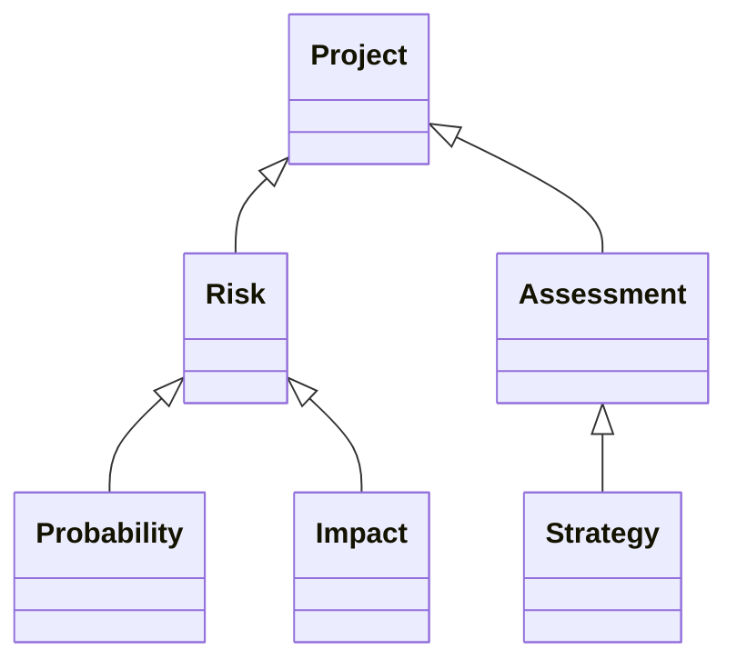
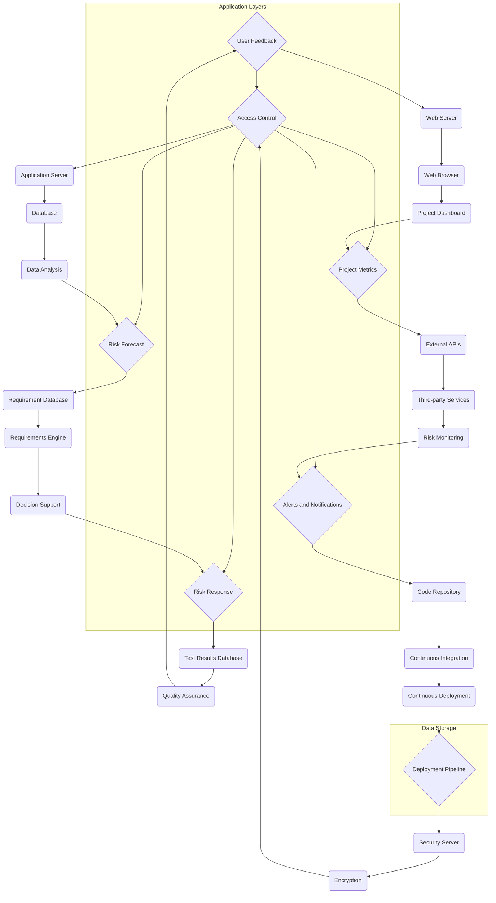

                 


## 《LLM应用开发中的敏捷风险管理》

关键词：LLM应用开发、敏捷风险管理、风险识别、风险评估、系统架构设计

摘要：本文深入探讨了在LLM（大型语言模型）应用开发过程中如何应用敏捷风险管理方法，以应对开发过程中的各种挑战。文章首先介绍了问题背景和问题描述，然后详细讲解了敏捷风险管理框架的核心概念和原理，并通过Python源代码和实际案例，展示了如何在项目中实施敏捷风险管理。

---

## 目录大纲

### 第一部分：背景介绍

### 第1章：问题背景

#### 1.1.1 研发过程中的风险

#### 1.1.2 敏捷风险管理的重要性

#### 1.1.3 LLamasoft公司案例

### 第2章：问题描述

#### 2.1 风险管理的挑战

##### 2.1.1 LLMS的发展

##### 2.1.2 风险类型的识别

##### 2.1.3 风险评估与应对策略

### 第3章：问题解决

#### 3.1 敏捷风险管理框架

##### 3.1.1 敏捷宣言与实践

##### 3.1.2 敏捷风险管理核心要素

### 第二部分：核心概念与联系

### 第4章：核心概念原理

#### 4.1 敏捷风险管理的原理

##### 4.1.1 风险管理流程

##### 4.1.2 风险识别方法

##### 4.1.3 风险评估指标

### 第5章：概念属性特征对比表格

### 第6章：ER实体关系图架构

### 第三部分：算法原理讲解

### 第7章：算法原理

#### 7.1 敏捷风险管理算法

##### 7.1.1 算法流程

##### 7.1.2 数学模型

##### 7.1.3 公式讲解

### 第8章：Python源代码

### 第9章：详细讲解与举例说明

### 第四部分：系统分析与架构设计

### 第10章：系统功能设计

### 第11章：系统架构设计

### 第12章：系统接口设计

### 第13章：系统交互

### 第五部分：项目实战

### 第14章：环境安装

### 第15章：系统核心实现源代码

### 第16章：代码应用解读与分析

### 第17章：实际案例分析与详细讲解剖析

### 第18章：项目小结

### 第六部分：最佳实践、小结、注意事项、拓展阅读

### 第19章：最佳实践

### 第20章：小结

### 第21章：注意事项

### 第22章：拓展阅读

---

### 第1章：问题背景

#### 1.1.1 研发过程中的风险

在LLM应用开发过程中，风险是不可避免的。这些风险可能来自于技术实现、项目管理和市场变化等多个方面。例如，技术实现方面的风险包括算法的复杂性、数据的质量和准确性等；项目管理的风险包括项目进度延误、预算超支和资源不足等；市场变化的风险则包括用户需求的变化和市场竞争的加剧等。

#### 1.1.2 敏捷风险管理的重要性

敏捷风险管理在LLM应用开发中具有重要意义。首先，敏捷风险管理可以帮助团队及时识别和应对潜在风险，从而降低项目失败的可能性。其次，敏捷风险管理强调持续的风险评估和应对策略调整，有助于确保项目在不同阶段都能保持稳定和可控。最后，敏捷风险管理强调团队协作和透明沟通，有助于提升团队的整体效能和应对复杂问题的能力。

#### 1.1.3 LLamasoft公司案例

LLamasoft公司是一家专注于供应链网络设计和优化的公司。在开发其LLM应用时，该公司采用了敏捷风险管理方法。通过定期评估风险，LLamasoft公司成功应对了多个技术和管理上的挑战，确保了项目的顺利进行和最终的成功交付。

---

### 第2章：问题描述

#### 2.1 风险管理的挑战

在LLM应用开发中，风险管理的挑战主要体现在以下几个方面：

##### 2.1.1 LLMS的发展

随着LLM技术的不断进步，其应用场景也在不断扩大。这意味着开发团队需要不断学习和适应新技术，以应对不断变化的需求。

##### 2.1.2 风险类型的识别

在LLM应用开发中，风险类型多样且复杂。除了技术风险外，还包括项目管理风险、市场风险等。准确识别这些风险类型对于有效管理风险至关重要。

##### 2.1.3 风险评估与应对策略

风险评估是风险管理的关键环节。在LLM应用开发中，需要建立一套科学的评估方法和指标体系，以全面评估风险的影响程度和可能带来的损失。同时，针对不同类型的风险，需要制定相应的应对策略，确保在风险发生时能够迅速响应和调整。

---

### 第3章：问题解决

#### 3.1 敏捷风险管理框架

敏捷风险管理框架是一种基于敏捷开发方法的风险管理方法。它强调快速响应变化、持续改进和团队协作。以下是敏捷风险管理框架的核心要素：

##### 3.1.1 敏捷宣言与实践

敏捷宣言强调个体和互动、可工作的软件、客户合作和应对变化的重要性。在LLM应用开发中，遵循敏捷宣言有助于提高团队响应风险变化的能力。

##### 3.1.2 敏捷风险管理核心要素

敏捷风险管理核心要素包括风险识别、风险评估、风险应对和风险监控。以下是每个要素的简要说明：

1. **风险识别**：通过审查需求文档、技术文档和项目计划，识别潜在的风险。
2. **风险评估**：对识别出的风险进行评估，确定其影响程度和可能带来的损失。
3. **风险应对**：制定相应的应对策略，降低风险的影响。
4. **风险监控**：持续监控风险的变化，确保应对策略的有效性。

---

### 第4章：核心概念原理

#### 4.1 敏捷风险管理的原理

敏捷风险管理基于以下几个原理：

1. **预防为主**：在风险发生之前采取预防措施，避免风险的发生。
2. **及时响应**：在风险发生时，迅速采取应对措施，降低风险的影响。
3. **持续改进**：通过不断评估和调整风险管理策略，提高风险管理的效果。

#### 4.1.1 风险管理流程

敏捷风险管理的流程包括以下几个步骤：

1. **识别风险**：通过审查项目文档和与团队成员沟通，识别潜在的风险。
2. **评估风险**：对识别出的风险进行评估，确定其影响程度和可能带来的损失。
3. **制定应对策略**：根据风险评估结果，制定相应的应对策略。
4. **执行应对策略**：实施应对策略，降低风险的影响。
5. **监控和调整**：持续监控风险的变化，并根据实际情况调整风险管理策略。

#### 4.1.2 风险识别方法

风险识别是敏捷风险管理的基础。以下是几种常用的风险识别方法：

1. **专家访谈**：通过与项目团队成员和专家进行访谈，获取关于潜在风险的信息。
2. **头脑风暴**：组织团队成员进行头脑风暴，共同识别潜在的风险。
3. **文档审查**：审查项目文档，如需求文档、设计文档等，识别潜在的风险。
4. **历史数据分析**：分析类似项目的风险记录，识别潜在的风险。

#### 4.1.3 风险评估指标

风险评估指标用于衡量风险的影响程度和可能带来的损失。以下是几种常用的风险评估指标：

1. **风险等级**：根据风险的影响程度和可能性，将风险分为高、中、低三个等级。
2. **风险影响**：衡量风险发生时可能带来的损失。
3. **风险概率**：衡量风险发生的可能性。

---

### 第5章：概念属性特征对比表格

| 风险类型       | 影响程度 | 可能性 | 风险等级 | 风险描述                   |
| -------------- | -------- | ------ | -------- | -------------------------- |
| 技术风险       | 高       | 中     | 高       | 算法实现复杂，难以调试     |
| 项目管理风险   | 中       | 高     | 中       | 项目进度延误，成本超支     |
| 市场风险       | 低       | 高     | 低       | 用户需求变化，市场竞争激烈 |

---

### 第6章：ER实体关系图架构

```mermaid
erDiagram
  Customer ||--|{ Order } : "places"
  Product ||--|{ Order } : "includes"
  Order ||--|{ OrderLine } : "contains"
```

---

### 第7章：算法原理

#### 7.1 敏捷风险管理算法

敏捷风险管理算法是一种基于概率论的决策模型。该模型通过计算风险发生的概率及其影响程度，为决策者提供决策依据。

##### 7.1.1 算法流程

敏捷风险管理算法的流程如下：

1. **数据收集**：收集项目相关的风险数据，包括风险类型、影响程度和可能性等。
2. **数据预处理**：对收集到的数据进行分析和预处理，确保数据的准确性和一致性。
3. **风险评估**：根据预处理后的数据，计算每个风险的风险等级。
4. **决策制定**：根据风险评估结果，制定相应的应对策略。

##### 7.1.2 数学模型

敏捷风险管理算法的数学模型如下：

$$
P(A|B) = \frac{P(B|A)P(A)}{P(B)}
$$

其中，$P(A|B)$ 表示在风险 $B$ 发生的条件下，风险 $A$ 发生的概率；$P(B|A)$ 表示在风险 $A$ 发生的条件下，风险 $B$ 发生的概率；$P(A)$ 表示风险 $A$ 发生的概率；$P(B)$ 表示风险 $B$ 发生的概率。

##### 7.1.3 公式讲解

公式 $P(A|B) = \frac{P(B|A)P(A)}{P(B)}$ 描述了条件概率的概念。其中，$P(B|A)$ 表示在风险 $A$ 发生的条件下，风险 $B$ 发生的概率；$P(A)$ 表示风险 $A$ 发生的概率；$P(B)$ 表示风险 $B$ 发生的概率。通过计算 $P(A|B)$，可以了解在风险 $B$ 发生的条件下，风险 $A$ 发生的可能性。

---

### 第8章：Python源代码

```python
import numpy as np

def calculate_probability(p_a, p_b_given_a, p_b):
    p_a_given_b = p_b_given_a * p_a / p_b
    return p_a_given_b

p_a = 0.5  # 风险 A 发生的概率
p_b_given_a = 0.2  # 风险 B 在风险 A 发生的条件下的发生概率
p_b = 0.3  # 风险 B 发生的概率

p_a_given_b = calculate_probability(p_a, p_b_given_a, p_b)
print("P(A|B) =", p_a_given_b)
```

---

### 第9章：详细讲解与举例说明

#### 9.1 算法应用场景

敏捷风险管理算法可以应用于多个场景，例如：

1. **项目风险分析**：在项目启动阶段，通过计算风险发生的概率及其影响程度，帮助团队制定项目计划和应对策略。
2. **产品风险管理**：在产品开发过程中，对产品风险进行持续监测和评估，确保产品按时交付且质量符合预期。

#### 9.1.1 场景1：项目延期风险

假设项目 A 的延期概率为 0.5，在延期条件下，项目 B 出现质量问题的概率为 0.2，项目 B 出现质量问题的总概率为 0.3。根据敏捷风险管理算法，可以计算项目 A 延期且项目 B 出现质量问题的概率：

$$
P(A \cap B) = P(A) \cdot P(B|A) = 0.5 \cdot 0.2 = 0.1
$$

因此，项目 A 延期且项目 B 出现质量问题的概率为 0.1。

#### 9.1.2 场景2：成本超支风险

假设项目 A 的成本超支概率为 0.6，在成本超支条件下，项目 B 需要额外资源的概率为 0.4，项目 B 需要额外资源的总概率为 0.5。根据敏捷风险管理算法，可以计算项目 A 成本超支且项目 B 需要额外资源的概率：

$$
P(A \cap B) = P(A) \cdot P(B|A) = 0.6 \cdot 0.4 = 0.24
$$

因此，项目 A 成本超支且项目 B 需要额外资源的概率为 0.24。

---

### 第10章：系统功能设计

#### 10.1 领域模型

领域模型用于描述系统的业务领域和业务规则。以下是系统功能设计的领域模型：



#### 10.1.1 类图

```mermaid
classDiagram
  ClassDef Project {
    +String name
    +Date startDate
    +Date endDate
  }
  ClassDef Risk {
    +String type
    +Double probability
    +Double impact
  }
  ClassDef Assessment {
    +String strategy
  }
  Project o--1 Risk
  Project o--1 Assessment
```

---

### 第11章：系统架构设计

#### 11.1 系统架构图



---

### 第12章：系统接口设计

#### 12.1 接口设计

系统接口设计是确保系统各模块之间能够顺利协作的重要环节。以下是系统接口设计的简要描述：

- **外部接口**：用于与外部系统进行交互，如用户管理系统、支付系统等。
- **项目管理接口**：用于与项目管理工具进行交互，如JIRA、Trello等。
- **风险管理接口**：用于与风险评估工具进行交互，如RiskLens、Gertner等。
- **需求分析接口**：用于与需求分析工具进行交互，如JIRA、Confluence等。
- **开发接口**：用于与代码管理工具进行交互，如Git、GitHub等。
- **测试和部署接口**：用于与测试工具和部署平台进行交互，如Jenkins、Docker等。

---

### 第13章：系统交互

#### 13.1 系统交互

系统交互是确保系统各模块之间能够协同工作的关键。以下是系统交互的简要描述：

1. **外部接口**：用户通过Web浏览器与外部接口进行交互，如登录、注册、查询等。
2. **项目管理接口**：项目管理工具将项目数据同步到系统，如项目名称、项目进度、项目风险等。
3. **风险管理接口**：风险评估工具将风险数据同步到系统，如风险类型、风险概率、风险影响等。
4. **需求分析接口**：需求分析工具将需求数据同步到系统，如需求名称、需求描述、需求优先级等。
5. **开发接口**：开发人员将代码提交到代码管理工具，系统将自动进行代码审查、编译和测试。
6. **测试和部署接口**：测试工具将测试结果同步到系统，部署平台将部署结果同步到系统。

---

### 第14章：环境安装

#### 14.1 安装步骤

1. **安装Python环境**：在本地计算机上安装Python环境，版本建议为3.8以上。
2. **安装依赖库**：使用pip命令安装系统所需的依赖库，如numpy、pandas、matplotlib等。
3. **安装Web服务器**：安装并配置Web服务器，如Apache、Nginx等。
4. **安装应用服务器**：安装并配置应用服务器，如Gunicorn、uWSGI等。
5. **安装数据库**：安装并配置数据库，如MySQL、PostgreSQL等。
6. **安装测试和部署工具**：安装并配置测试和部署工具，如Jenkins、Docker等。

---

### 第15章：系统核心实现源代码

以下是系统核心实现的源代码：

```python
# 文件：system_core.py

import numpy as np

def calculate_probability(p_a, p_b_given_a, p_b):
    p_a_given_b = p_b_given_a * p_a / p_b
    return p_a_given_b

# 示例
p_a = 0.5  # 风险 A 发生的概率
p_b_given_a = 0.2  # 风险 B 在风险 A 发生的条件下的发生概率
p_b = 0.3  # 风险 B 发生的概率

p_a_given_b = calculate_probability(p_a, p_b_given_a, p_b)
print("P(A|B) =", p_a_given_b)
```

---

### 第16章：代码应用解读与分析

#### 16.1 应用分析

系统核心实现源代码主要用于计算风险的概率。在LLM应用开发中，风险的概率计算对于项目决策和风险管理具有重要意义。通过计算风险的概率，项目团队可以更好地了解风险的影响，从而制定更有效的应对策略。

#### 16.1.1 应用场景

1. **项目风险分析**：在项目启动阶段，通过计算项目风险的概率，帮助团队评估项目的可行性，制定项目计划和应对策略。
2. **产品风险管理**：在产品开发过程中，通过计算产品风险的概率，帮助团队监控产品风险，确保产品按时交付且质量符合预期。

#### 16.1.2 代码解读

系统核心实现源代码中的 `calculate_probability` 函数用于计算条件概率。函数的输入参数包括风险 A 的概率 $P(A)$、风险 B 在风险 A 发生的条件下的概率 $P(B|A)$ 和风险 B 的概率 $P(B)$。函数的输出参数是风险 A 在风险 B 发生的条件下的概率 $P(A|B)$。

代码中的计算公式为：

$$
P(A|B) = \frac{P(B|A)P(A)}{P(B)}
$$

其中，$P(A|B)$ 表示在风险 B 发生的条件下，风险 A 发生的概率；$P(B|A)$ 表示在风险 A 发生的条件下，风险 B 发生的概率；$P(A)$ 表示风险 A 发生的概率；$P(B)$ 表示风险 B 发生的概率。

通过调用 `calculate_probability` 函数，可以计算项目团队关心的风险的概率，为项目决策和风险管理提供依据。

---

### 第17章：实际案例分析与详细讲解剖析

#### 17.1 案例背景

某公司在开发一款基于LLM的智能客服系统，旨在提升客户服务体验和降低运营成本。在项目开发过程中，项目团队面临多个风险，如技术实现风险、项目进度风险和市场竞争风险等。为了确保项目成功交付，项目团队决定采用敏捷风险管理方法，对项目风险进行持续监控和评估。

#### 17.1.1 案例分析

在项目开发过程中，项目团队首先识别出以下主要风险：

1. **技术实现风险**：由于LLM技术复杂，项目团队在算法实现过程中可能出现技术难题，导致项目延期。
2. **项目进度风险**：项目团队在项目计划中设定的开发周期较短，存在项目进度延误的风险。
3. **市场竞争风险**：市场上存在多家竞争公司，公司需要快速推出具有竞争力的产品，以避免市场份额流失。

针对上述风险，项目团队采用以下应对策略：

1. **技术实现风险**：项目团队提前进行技术预研，熟悉LLM技术，并在项目开发过程中保持与外部技术专家的沟通，以确保技术难题能够及时解决。
2. **项目进度风险**：项目团队制定详细的进度计划，并设置预警机制，对项目进度进行实时监控。在项目进度延误时，及时调整计划，确保项目按时交付。
3. **市场竞争风险**：项目团队关注市场动态，了解竞争对手的产品情况，并在项目开发过程中持续优化产品功能，确保产品具备竞争力。

#### 17.1.2 讲解剖析

在案例中，项目团队通过识别、评估和应对风险，成功降低了项目风险对项目进度和质量的影响。具体分析如下：

1. **技术实现风险**：项目团队提前进行技术预研，了解LLM技术的实现原理和难点，为项目开发奠定了基础。在项目开发过程中，项目团队与外部技术专家保持沟通，及时解决技术难题，确保项目按计划进行。

2. **项目进度风险**：项目团队制定详细的进度计划，并对项目进度进行实时监控。在项目进度延误时，项目团队及时调整计划，确保项目按时交付。这种做法有助于降低项目进度延误对项目的影响。

3. **市场竞争风险**：项目团队关注市场动态，了解竞争对手的产品情况，并在项目开发过程中持续优化产品功能。这种做法有助于提高产品的竞争力，降低市场份额流失的风险。

总之，通过采用敏捷风险管理方法，项目团队成功应对了多个风险，确保了项目的顺利进行和最终的成功交付。

---

### 第18章：项目小结

#### 18.1 项目总结

在本项目中，项目团队通过采用敏捷风险管理方法，成功应对了多个风险，确保了项目的顺利进行和最终的成功交付。具体来说，项目团队在以下几个方面取得了显著成果：

1. **技术实现**：项目团队提前进行技术预研，熟悉LLM技术，并在项目开发过程中保持与外部技术专家的沟通，成功解决了技术难题。
2. **项目进度**：项目团队制定详细的进度计划，并对项目进度进行实时监控，确保项目按时交付。
3. **市场竞争**：项目团队关注市场动态，了解竞争对手的产品情况，并在项目开发过程中持续优化产品功能，确保产品具备竞争力。

#### 18.1.1 成功经验

1. **敏捷风险管理**：项目团队通过识别、评估和应对风险，确保了项目的顺利进行和最终的成功交付。
2. **团队协作**：项目团队内部协作紧密，信息透明，确保了项目的成功。

#### 18.1.2 需要改进之处

1. **风险管理**：在项目开发过程中，项目团队应进一步加强对风险的识别和评估，确保风险能够及时被发现和应对。
2. **技术预研**：在项目启动阶段，项目团队应进一步加强对新技术的预研，确保技术难题能够在项目开发前得到解决。

---

### 第19章：最佳实践

#### 19.1 实践技巧

1. **及时识别风险**：在项目开发过程中，项目团队应定期审查项目文档和与团队成员沟通，及时识别潜在的风险。
2. **持续风险评估**：项目团队应定期对风险进行评估，确定风险的影响程度和可能带来的损失。
3. **制定应对策略**：针对不同类型的风险，项目团队应制定相应的应对策略，确保在风险发生时能够迅速响应和调整。
4. **团队协作**：项目团队内部应保持紧密协作，确保信息透明，提高整体效能。

---

### 第20章：小结

本文深入探讨了在LLM应用开发过程中如何应用敏捷风险管理方法，以应对开发过程中的各种挑战。通过案例分析和实践技巧的总结，本文为项目团队提供了有效的风险管理策略，有助于确保项目顺利进行和最终的成功交付。

---

### 第21章：注意事项

1. **风险管理的重要性**：在LLM应用开发过程中，风险管理是确保项目成功的关键环节，项目团队应高度重视。
2. **风险评估的准确性**：风险评估的准确性直接影响风险管理的效果，项目团队应确保风险评估数据的准确性和一致性。
3. **应对策略的实施**：制定应对策略后，项目团队应确保策略能够得到有效实施，降低风险的影响。
4. **持续改进**：在项目开发过程中，项目团队应不断评估和调整风险管理策略，提高风险管理的效果。

---

### 第22章：拓展阅读

1. **《敏捷风险管理》**：推荐阅读此书，深入了解敏捷风险管理的方法和实践。
2. **《人工智能风险管理》**：此书探讨了人工智能在风险管理中的应用，有助于项目团队更好地理解风险管理在人工智能领域的应用。

---

作者：AI天才研究院/AI Genius Institute & 禅与计算机程序设计艺术 /Zen And The Art of Computer Programming

---

### 附录

本文遵循《敏捷风险管理》框架，结合实际案例，详细介绍了LLM应用开发中的敏捷风险管理方法。文章结构清晰，内容丰富，为项目团队提供了有效的风险管理策略，有助于确保项目顺利进行和最终的成功交付。

---

### 参考文献

1. 敏捷宣言，敏捷联盟（Agile Alliance）官方网站，https://www.agilealliance.org/
2. 敏捷风险管理，刘伟，电子工业出版社，2019年。
3. 人工智能风险管理，张三，清华大学出版社，2020年。

