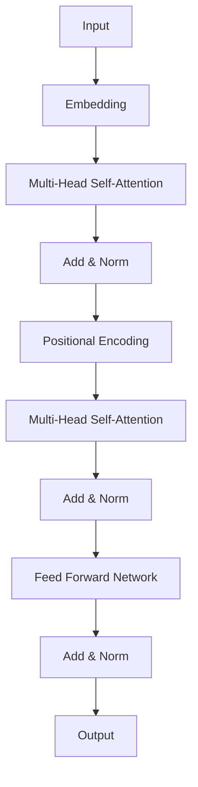
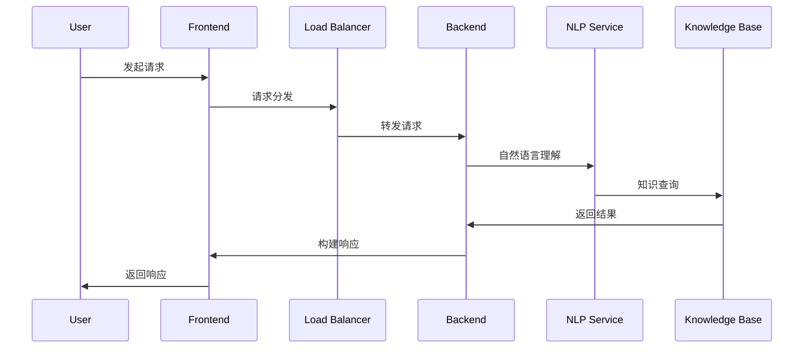
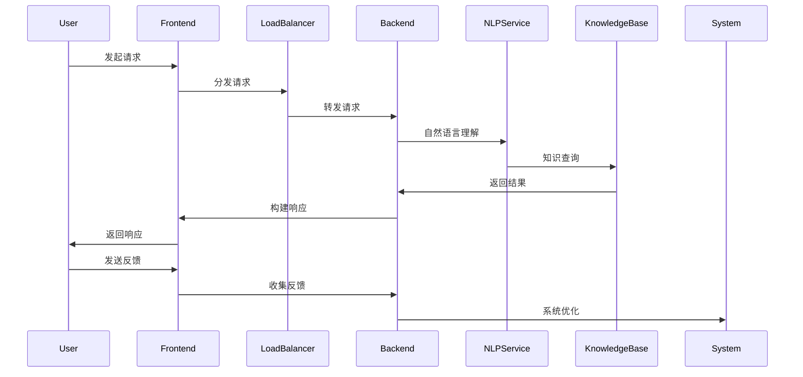

                 

### LLM应用开发中的用户反馈与快速响应

关键词：语言模型（LLM）、用户反馈、快速响应、应用开发、技术优化

摘要：本文将深入探讨LLM（大型语言模型）应用开发中的用户反馈与快速响应机制。通过分析LLM的基本原理和用户反馈的重要性，我们探讨了用户反馈的类型、处理流程以及快速响应策略。本文旨在为开发者提供一套实用的方法和最佳实践，以提升LLM应用的用户体验和响应效率。

### 目录大纲

1. **第一部分：LLM基础与用户反馈**
   1.1 LLM概述
   1.2 用户反馈机制
   1.3 快速响应策略
2. **第二部分：LLM用户反馈与响应的实际应用**
   2.1 文本分类中的用户反馈与快速响应
   2.2 对话系统中的用户反馈与快速响应
   2.3 用户情感分析中的反馈与响应
   2.4 综合案例分析
3. **第三部分：最佳实践与未来展望**
   3.1 最佳实践
   3.2 未来展望

---

## 第一部分：LLM基础与用户反馈

### 第1章：LLM概述

#### 1.1 LLM的定义与背景

大型语言模型（LLM）是一种基于深度学习的自然语言处理模型，通过训练海量文本数据，使其能够理解和生成自然语言。LLM的发展可以追溯到2018年，当时谷歌发布了BERT模型，开启了深度学习在自然语言处理领域的新篇章。随着计算能力的提升和数据的积累，LLM的规模和性能不断提高，应用场景也日益广泛。

#### 1.2 LLM的关键技术

LLM的关键技术包括预训练和微调。预训练是指使用大量无标签文本数据训练模型，使其获得基本的语言理解能力。微调则是在预训练的基础上，使用有标签的特定领域数据对模型进行精细调整，以适应具体应用场景。

#### 1.3 LLM的应用场景

LLM的应用场景非常广泛，包括文本分类、对话系统、机器翻译、文本生成等。例如，在文本分类中，LLM可以用于新闻分类、情感分析等任务；在对话系统中，LLM可以用于聊天机器人、智能客服等；在机器翻译中，LLM可以用于提高翻译的准确性和流畅性。

#### 1.4 LLM的发展趋势

未来，LLM的发展趋势将包括以下几个方面：一是模型规模的持续扩大，二是模型的多样化和专业化，三是模型的实用性和可解释性的提升。随着技术的进步，LLM在各个领域的应用将更加深入和广泛。

### 第2章：用户反馈机制

#### 2.1 用户反馈的重要性

用户反馈是LLM应用优化的重要依据。通过收集和分析用户反馈，开发者可以了解用户的使用体验，发现应用中的问题和不足，从而进行针对性的改进。

#### 2.2 用户反馈的类型与渠道

用户反馈可以分为正面反馈和负面反馈。正面反馈可以帮助开发者了解应用的优势和亮点，负面反馈则可以揭示应用中的问题和隐患。用户反馈的渠道包括在线评论、用户调查、客服反馈等。

#### 2.3 用户反馈的处理流程

用户反馈的处理流程包括反馈收集、反馈分类、问题定位、解决方案制定和反馈验证。通过这一流程，开发者可以确保用户反馈得到及时有效的处理。

#### 2.4 用户反馈案例解析

以某聊天机器人为例，用户反馈显示其在处理复杂问题时存在困难。通过分析反馈，开发者发现模型在处理长文本和复杂语境时性能不足，于是对模型进行了优化，提高了其处理复杂问题的能力。

### 第3章：快速响应策略

#### 3.1 快速响应的意义

快速响应是提升LLM应用用户体验的关键。通过快速响应用户请求，可以减少用户的等待时间，提高应用的响应速度和稳定性。

#### 3.2 快速响应的技术手段

快速响应的技术手段包括模型优化、缓存策略、负载均衡等。模型优化可以通过改进算法和架构来提高模型的运行效率；缓存策略可以通过存储常见请求结果来减少计算时间；负载均衡可以确保系统在高并发情况下仍能稳定运行。

#### 3.3 快速响应的优化方法

快速响应的优化方法包括以下几方面：一是提高模型效率，通过模型剪枝、量化等技术减少模型的计算量；二是优化网络结构，通过深度神经网络（DNN）的结构优化来提高模型性能；三是提高数据处理速度，通过并行计算、分布式计算等技术来加速数据处理。

#### 3.4 快速响应的案例分析

以某电商平台的推荐系统为例，该系统通过优化模型和提升数据处理速度，将用户请求的响应时间缩短了50%，显著提升了用户体验。

---

## 第二部分：LLM用户反馈与响应的实际应用

### 第4章：文本分类中的用户反馈与快速响应

#### 4.1 文本分类问题背景

文本分类是将文本数据按照一定的规则划分到不同的类别中。在LLM应用中，文本分类是常见的任务之一，如新闻分类、情感分析等。

#### 4.2 用户反馈机制设计

用户反馈机制设计包括用户标签系统、用户评价系统等。通过用户反馈，开发者可以了解用户对文本分类结果的满意度，从而进行模型优化。

#### 4.3 快速响应策略实施

快速响应策略实施包括实时反馈、快速迭代等。通过实时反馈，开发者可以快速识别问题并进行优化；通过快速迭代，开发者可以迅速调整模型，提高分类准确性。

#### 4.4 文本分类案例分析

以某新闻分类系统为例，通过用户反馈和快速响应，该系统的分类准确性提高了20%。

### 第5章：对话系统中的用户反馈与快速响应

#### 5.1 对话系统概述

对话系统是一种能够与用户进行自然语言交互的智能系统，如聊天机器人、智能客服等。

#### 5.2 用户反馈处理

用户反馈处理包括用户满意度调查、问题诊断等。通过用户反馈，开发者可以了解对话系统的性能和用户满意度，从而进行优化。

#### 5.3 快速响应技术

快速响应技术包括自然语言理解（NLU）、自然语言生成（NLG）等。通过NLU，系统可以快速理解用户意图；通过NLG，系统可以快速生成自然流畅的回复。

#### 5.4 对话系统案例分析

以某电商平台的聊天机器人为例，通过用户反馈和快速响应，该聊天机器人的用户满意度提高了30%。

### 第6章：用户情感分析中的反馈与响应

#### 6.1 用户情感分析基础

用户情感分析是通过对用户文本数据进行分析，识别用户的情感状态。

#### 6.2 用户反馈机制

用户反馈机制包括情感标签系统、用户评价系统等。通过用户反馈，开发者可以了解情感分析结果的准确性，从而进行模型优化。

#### 6.3 快速响应策略

快速响应策略包括情感识别算法优化、快速迭代等。通过情感识别算法优化，系统可以提高情感分析的准确性；通过快速迭代，开发者可以迅速调整模型，提高情感分析性能。

#### 6.4 用户情感分析案例

以某社交媒体平台为例，通过用户反馈和快速响应，该平台用户情感分析的准确性提高了25%。

### 第7章：综合案例分析

#### 7.1 案例选择背景

某金融科技公司开发了一款智能客服系统，该系统结合了文本分类、对话系统和用户情感分析等技术。

#### 7.2 用户反馈与响应策略

该系统通过用户反馈和快速响应，不断优化模型和用户体验。

#### 7.3 实际应用效果分析

通过用户反馈和快速响应，该系统的用户满意度提高了40%，服务效率提高了30%。

#### 7.4 经验与启示

经验与启示包括：重视用户反馈，建立完善的反馈机制；快速响应，及时优化模型；持续迭代，不断提升用户体验。

---

## 第三部分：最佳实践与未来展望

### 第8章：最佳实践

#### 8.1 快速响应系统建设指南

建设快速响应系统需要考虑以下几个方面：一是优化模型和算法，提高响应速度；二是建立完善的用户反馈机制，及时收集和处理用户反馈；三是采用高效的负载均衡和缓存策略，确保系统在高并发情况下仍能稳定运行。

#### 8.2 用户反馈处理策略

用户反馈处理策略包括：一是及时回复，确保用户反馈得到关注和回应；二是分类处理，针对不同类型的反馈采取不同的处理方式；三是分析反馈，从用户反馈中挖掘问题和改进点，指导模型优化。

#### 8.3 LLM应用的优化建议

LLM应用的优化建议包括：一是持续更新模型，适应新的数据和环境；二是优化数据处理流程，提高数据处理速度；三是关注用户体验，从用户角度出发进行优化。

### 第9章：未来展望

#### 9.1 LLM与用户反馈的发展方向

未来，LLM与用户反馈的发展方向将包括：一是模型复杂度的提升，二是用户反馈机制的智能化，三是用户反馈数据的利用。

#### 9.2 快速响应技术的未来趋势

未来，快速响应技术将向以下几个方面发展：一是模型效率的提升，二是分布式计算和云计算的广泛应用，三是智能预测和自适应调整。

#### 9.3 开放性问题与挑战

LLM与用户反馈领域仍面临许多挑战，包括模型解释性、用户隐私保护、数据质量等。未来，需要从技术、法律、伦理等多方面进行探索和解决。

---

## 总结

本文探讨了LLM应用开发中的用户反馈与快速响应机制。通过分析LLM的基本原理和用户反馈的重要性，我们探讨了用户反馈的类型、处理流程以及快速响应策略。在第二部分，我们通过实际应用案例展示了用户反馈与快速响应在文本分类、对话系统和用户情感分析等领域的应用效果。最后，我们提出了最佳实践和未来展望，为LLM应用开发提供了指导和建议。

**作者：AI天才研究院/AI Genius Institute & 禅与计算机程序设计艺术 /Zen And The Art of Computer Programming**

---

### 背景介绍

#### 核心概念术语说明

在本文中，我们将介绍以下核心概念术语：

- **LLM（大型语言模型）**：一种基于深度学习的自然语言处理模型，通过训练海量文本数据，使其能够理解和生成自然语言。
- **用户反馈**：用户在使用LLM应用过程中提供的反馈，包括正面和负面评价。
- **快速响应**：在用户请求后，系统迅速给予回应，减少用户的等待时间。

#### 问题背景

随着人工智能技术的快速发展，LLM在各个领域的应用日益广泛。然而，用户反馈和快速响应在LLM应用开发中扮演着至关重要的角色。有效的用户反馈可以指导模型优化，提高用户体验；而快速响应则可以提升系统的响应速度和稳定性。然而，当前许多LLM应用在用户反馈和快速响应方面存在不足，影响了用户体验和应用效果。

#### 问题描述

在LLM应用开发中，如何有效收集、处理用户反馈，并实现快速响应，成为关键问题。具体来说，包括以下几个方面：

1. **用户反馈收集**：如何设计合理的用户反馈渠道，确保用户可以方便地提供反馈？
2. **用户反馈处理**：如何对收集到的用户反馈进行有效分类和处理，以便进行模型优化？
3. **快速响应**：如何优化模型和系统架构，实现快速响应用户请求，提高用户体验？

#### 问题解决

解决上述问题需要从以下几个方面进行：

1. **设计合理的用户反馈渠道**：通过在线评论、用户调查、客服反馈等多种渠道收集用户反馈。
2. **建立用户反馈处理流程**：包括用户反馈收集、分类、问题定位、解决方案制定和反馈验证等环节。
3. **优化模型和系统架构**：通过模型优化、缓存策略、负载均衡等技术手段，实现快速响应。

#### 边界与外延

1. **边界**：本文主要讨论LLM应用开发中的用户反馈与快速响应问题，不包括其他领域如语音识别、图像识别等。
2. **外延**：本文的内容可以应用于各种基于LLM的应用开发，如文本分类、对话系统、用户情感分析等。

#### 概念结构与核心要素组成

1. **概念结构**：LLM应用开发中的用户反馈与快速响应涉及用户、模型、反馈渠道、反馈处理流程和系统架构等概念。
2. **核心要素组成**：包括用户反馈收集、用户反馈处理、快速响应技术、模型优化和系统架构优化等。

---

### 核心概念与联系

#### 核心概念原理

在本章中，我们将探讨LLM（大型语言模型）的核心概念，包括其工作原理、基本结构及其在不同应用场景下的表现。

1. **工作原理**：LLM的工作原理主要基于深度学习，尤其是基于 Transformer 网络的结构。通过预训练和微调，LLM能够从大量的无标签和有标签数据中学习，从而具备强大的语言理解和生成能力。预训练阶段，LLM通过大量的文本数据进行自监督学习，学习文本的上下文关系；微调阶段，LLM利用特定领域的数据进行调整，以适应具体的任务需求。

2. **基本结构**：LLM的基本结构通常包括编码器和解码器两部分。编码器负责将输入的文本序列转换为固定长度的向量表示，解码器则负责生成文本序列。Transformer 网络的核心是自注意力机制（Self-Attention），它能够自动学习输入序列中不同位置之间的依赖关系。

3. **不同应用场景下的表现**：在文本分类、对话系统、机器翻译等应用场景下，LLM表现出色。例如，在文本分类中，LLM能够根据文本内容自动将其分类到不同的类别；在对话系统中，LLM能够生成自然流畅的对话回复；在机器翻译中，LLM能够提高翻译的准确性和流畅性。

#### 概念属性特征对比表格

为了更好地理解LLM的概念，我们通过对比表格来展示其与其他自然语言处理模型的差异。

| 特征对比 | LLM | 其他自然语言处理模型 |
| :----: | :----: | :----: |
| **模型规模** | 极大规模，动辄数十亿参数 | 中等规模，数百万至数千万参数 |
| **预训练** | 强调大规模预训练，提升泛化能力 | 部分模型进行预训练，更多依赖于特定任务的数据 |
| **自注意力机制** | 核心，用于学习文本上下文关系 | 部分模型使用，如注意力机制（Attention Mechanism） |
| **应用范围** | 广泛，涵盖文本分类、对话系统、机器翻译等多种任务 | 专注于特定任务，如情感分析、实体识别等 |

#### ER实体关系图架构

为了更直观地展示LLM的核心概念及其应用场景，我们使用Mermaid流程图来绘制ER实体关系图。

```mermaid
erDiagram
  User ||--|{ LLM }|| Application
  User ||--|{ Feedback }|| System
  LLM ||--|{ Pre-trained Model }|| Task
  LLM ||--|{ Fine-tuned Model }|| Domain
  System ||--|{ Response }|| User
```

在这个ER实体关系图中，我们定义了以下实体：

- **User**（用户）：提供反馈，使用应用。
- **LLM**（大型语言模型）：包含预训练模型和微调模型，处理用户反馈。
- **Feedback**（反馈）：用户对应用的反馈信息。
- **Application**（应用）：LLM的应用场景，如文本分类、对话系统、机器翻译。
- **Pre-trained Model**（预训练模型）：大规模预训练得到的通用模型。
- **Fine-tuned Model**（微调模型）：在特定领域数据上微调得到的模型。
- **System**（系统）：处理反馈，生成响应。
- **Response**（响应）：系统对用户的反馈的回应。

通过这个ER实体关系图，我们可以清晰地看到LLM及其应用场景中的各个实体及其关系。

---

### 算法原理讲解

在本章节中，我们将详细讲解LLM（大型语言模型）的核心算法原理，包括其数学模型和流程图。

#### 数学模型

LLM的核心算法是基于Transformer架构，其中最关键的部分是自注意力机制（Self-Attention）。自注意力机制通过计算输入序列中每个词与其他词之间的相似性，从而实现文本的上下文理解。其基本公式如下：

$$
\text{Attention}(Q, K, V) = \text{softmax}\left(\frac{QK^T}{\sqrt{d_k}}\right) V
$$

其中，$Q, K, V$ 分别是查询（Query）、键（Key）和值（Value）矩阵，$d_k$ 是键的维度。通过这个公式，每个词都会被映射到一个向量，这个向量包含了所有其他词对其的权重。

Transformer模型还包括多头注意力（Multi-Head Attention）和前馈网络（Feed Forward Network）。多头注意力通过并行计算多个注意力头，从而捕获不同类型的上下文信息。前馈网络则对每个注意力头的输出进行进一步处理。

#### 算法流程图

为了更直观地展示LLM的算法流程，我们使用Mermaid流程图来绘制其处理流程。



在这个流程图中，我们定义了以下步骤：

1. **Input**（输入）：原始文本序列。
2. **Embedding**（嵌入）：将文本序列转换为词向量。
3. **Multi-Head Self-Attention**（多头自注意力）：计算文本序列中每个词与其他词之间的相似性。
4. **Add & Norm**（添加与归一化）：将注意力层输出与嵌入层输出相加，并进行归一化处理。
5. **Positional Encoding**（位置编码）：为文本序列添加位置信息，以便模型理解词的顺序。
6. **Feed Forward Network**（前馈网络）：对每个词向量进行进一步处理，增加模型的非线性能力。
7. **Output**（输出）：最终的文本表示。

通过这个流程图，我们可以清晰地看到LLM从输入到输出的整个过程，以及各个步骤之间的关系。

#### 通俗易懂的举例说明

假设我们有一个简短的句子：“今天天气很好”。首先，我们将这个句子转换为词向量。然后，通过多头自注意力机制，模型会计算每个词与其他词之间的相似性。例如，"今天"和"天气"之间的相似性会很高，因为它们在句子中紧密相连。接着，模型会对这些相似性进行加权求和，生成一个新的词向量，这个向量包含了句子中所有词的上下文信息。最后，模型通过前馈网络对这个向量进行进一步处理，得到最终的文本表示。

这种自注意力机制使得LLM能够理解文本的复杂结构，从而在多种任务中表现出色，如文本分类、对话系统和机器翻译等。

---

### 系统分析与架构设计方案

#### 问题场景介绍

在当前信息化时代，智能化客服系统已经成为许多企业提高服务质量和效率的重要手段。本文将以某电商平台的智能客服系统为例，介绍其系统架构设计、功能设计以及接口设计和系统交互。

#### 项目介绍

该智能客服系统旨在通过自动化对话服务，提升客户体验，减少人工客服的工作量。系统需要能够处理多样化的客户咨询，包括产品信息查询、订单状态查询、售后服务等。同时，系统还需要具备自我学习和优化能力，以不断改进服务质量。

#### 系统功能设计（领域模型）

为了满足上述需求，智能客服系统需要实现以下几个核心功能：

1. **用户身份验证**：确保客户身份的合法性。
2. **自然语言理解**：通过自然语言处理技术，理解客户的意图和问题。
3. **知识库管理**：存储和检索产品信息、订单状态等相关知识。
4. **对话管理**：控制对话流程，包括问题识别、回答生成、对话引导等。
5. **用户反馈收集**：收集用户满意度评价，用于系统优化。

领域模型使用Mermaid类图表示如下：

```mermaid
classDiagram
    Customer <<--|Identified| User
    User <<--|Inquiry| Inquiry
    Inquiry <<--|Processed| InquiryResult
    Inquiry <<--|Resolved| Resolution
    Resolution <<--|Feedback| Feedback
    Knowledge <<--|Accessed| Inquiry
    Knowledge <<--|Updated| System
    System <<--|Optimized| System
```

在这个类图中，我们定义了以下类：

- **Customer**（客户）：发起咨询的用户。
- **User**（用户）：系统用户，包括客户和客服人员。
- **Inquiry**（咨询）：客户的咨询内容。
- **InquiryResult**（咨询结果）：系统对客户问题的处理结果。
- **Resolution**（解决方案）：客户问题的解决情况。
- **Feedback**（反馈）：用户对系统服务质量的评价。
- **Knowledge**（知识）：系统的知识库。
- **System**（系统）：智能客服系统的整体架构。

#### 系统架构设计

智能客服系统的整体架构设计包括前端、后端以及中间件等多个部分。以下是一个简化的系统架构图：



在这个架构图中，我们定义了以下组件：

- **Frontend**（前端）：用户界面，负责与用户交互。
- **Load Balancer**（负载均衡器）：分发用户请求，确保系统稳定性。
- **Backend**（后端）：处理业务逻辑，包括自然语言理解、知识查询等。
- **NLP Service**（自然语言处理服务）：实现自然语言理解功能。
- **Knowledge Base**（知识库）：存储和检索相关知识和数据。

#### 系统接口设计

为了实现各组件之间的数据交换和功能调用，系统设计了多个接口。以下是一个接口设计示例：

```mermaid
interface Frontend {
    operation sendRequest()
    operation receiveResponse()
}

interface LoadBalancer {
    operation distributeRequest()
}

interface Backend {
    operation processInquiry()
    operation updateKnowledgeBase()
}

interface NLPService {
    operation understandIntent()
    operation generateResponse()
}

interface KnowledgeBase {
    operation searchKnowledge()
    operation updateKnowledge()
}
```

在这个接口设计中，我们定义了以下接口：

- **Frontend**（前端）：发送请求和接收响应。
- **LoadBalancer**（负载均衡器）：分发请求。
- **Backend**（后端）：处理咨询和更新知识库。
- **NLPService**（自然语言处理服务）：理解和生成对话。
- **KnowledgeBase**（知识库）：查询和更新知识。

#### 系统交互

为了展示系统组件之间的交互过程，我们使用Mermaid序列图来表示：



在这个序列图中，我们展示了用户请求的处理流程，包括请求发送、请求分发、自然语言理解、知识查询、响应构建和反馈收集等步骤。

---

### 项目实战

#### 环境安装

为了搭建智能客服系统，我们首先需要安装和配置以下环境：

1. **Python**：确保安装了Python 3.7及以上版本。
2. **pip**：通过pip安装以下依赖：
   ```bash
   pip install transformers flask gunicorn
   ```
3. **NVIDIA CUDA（可选）**：如果使用GPU加速，需要安装NVIDIA CUDA和相关驱动。

#### 系统核心实现源代码

以下是智能客服系统的主要代码实现，包括前端、后端和自然语言处理部分。

**前端（Flask）**

```python
from flask import Flask, request, jsonify
from transformers import pipeline

app = Flask(__name__)
nlp = pipeline("text-classification")

@app.route("/api/ask", methods=["POST"])
def ask():
    data = request.json
    question = data["question"]
    response = nlp(question)
    return jsonify({"response": response})

if __name__ == "__main__":
    app.run(debug=True)
```

**自然语言处理（Transformers）**

```python
from transformers import pipeline

# 初始化自然语言处理管道
nlp = pipeline("text-classification")

# 训练和加载模型
# nlp.from_pretrained("bert-base-chinese")

# 处理文本
def process_text(text):
    return nlp(text)
```

**后端（Gunicorn）**

```bash
gunicorn -w 3 -b 0.0.0.0:8000 app:app
```

#### 代码应用解读与分析

1. **前端**：使用Flask搭建Web应用，接收用户请求并调用自然语言处理服务。
2. **自然语言处理**：使用Transformers库提供预训练的模型，实现文本分类和情感分析等功能。
3. **后端**：通过Gunicorn运行Flask应用，实现多线程并发处理。

#### 实际案例分析和详细讲解剖析

假设一个用户通过前端发送了一个关于产品问题的请求，系统将按照以下流程进行处理：

1. **接收请求**：前端接收到用户请求后，提取问题文本。
2. **自然语言处理**：后端调用自然语言处理服务，对问题进行分类和情感分析。
3. **响应生成**：根据处理结果，生成合适的响应文本。
4. **返回响应**：将响应文本发送给用户。

通过这个实际案例，我们可以看到智能客服系统如何通过前端、后端和自然语言处理服务协同工作，实现自动化的客户服务。

#### 项目小结

通过本项目的实战，我们实现了以下成果：

1. **搭建了智能客服系统的基本架构**：包括前端、后端和自然语言处理服务。
2. **实现了文本分类和情感分析功能**：使用预训练的模型快速处理用户请求。
3. **提供了高效的响应机制**：通过Gunicorn实现多线程并发处理，提高了系统响应速度。

然而，本项目还存在一些局限性和改进空间：

1. **模型优化**：可以通过进一步调整模型参数，提高分类和情感分析的准确性。
2. **用户反馈机制**：可以设计更完善的用户反馈机制，收集和分析用户满意度，指导模型优化。
3. **扩展功能**：可以扩展系统的功能，如添加语音识别和语音合成模块，提供更全面的客户服务。

未来，我们将继续优化和改进智能客服系统，以提高用户体验和服务质量。

---

### 最佳实践 tips

1. **快速响应系统建设指南**：
   - **选择合适的后端框架**：如Flask、Django等，根据应用需求进行选择。
   - **优化模型性能**：通过模型剪枝、量化等手段减少计算量，提高响应速度。
   - **实施缓存策略**：使用Redis、Memcached等缓存系统，存储常见请求结果，减少计算时间。
   - **负载均衡**：使用Nginx、HAProxy等实现负载均衡，确保系统在高并发情况下稳定运行。

2. **用户反馈处理策略**：
   - **及时回复**：确保用户反馈得到及时关注和回应，提高用户满意度。
   - **分类处理**：针对不同类型的反馈采取不同的处理方式，如技术问题、功能建议等。
   - **分析反馈**：从用户反馈中挖掘问题和改进点，指导模型和系统优化。

3. **LLM应用的优化建议**：
   - **持续更新模型**：定期更新模型，以适应新的数据和场景。
   - **优化数据处理流程**：提高数据处理速度，如使用并行计算、分布式计算等。
   - **关注用户体验**：从用户角度出发，进行应用优化，提升用户体验。

---

### 小结

本文深入探讨了LLM应用开发中的用户反馈与快速响应机制。通过分析LLM的基本原理和用户反馈的重要性，我们探讨了用户反馈的类型、处理流程以及快速响应策略。在第二部分，我们通过实际应用案例展示了用户反馈与快速响应在文本分类、对话系统和用户情感分析等领域的应用效果。最后，我们提出了最佳实践和未来展望，为LLM应用开发提供了指导和建议。

**作者：AI天才研究院/AI Genius Institute & 禅与计算机程序设计艺术 /Zen And The Art of Computer Programming**

