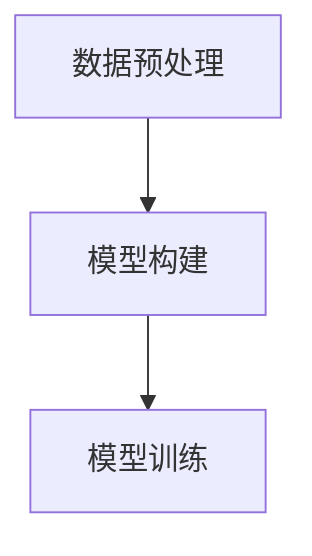
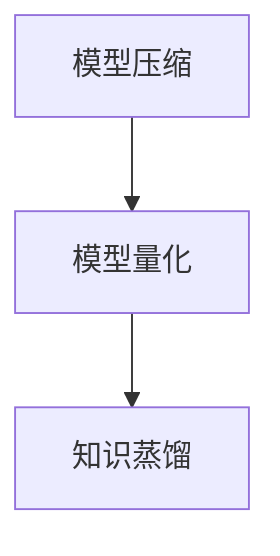
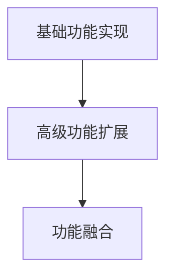
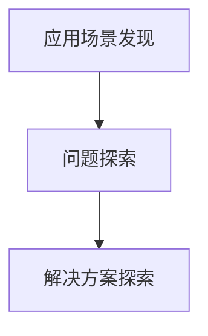

                 


## LLM应用的增量式开发：逐步构建复杂功能

### 关键词：
- 大型语言模型
- 增量式开发
- 自然语言处理
- 模型训练
- 功能迭代

### 摘要：
本文将探讨大型语言模型（LLM）的增量式开发方法，通过逐步构建复杂功能，实现高效的LLM开发和应用。本文将详细讲解LLM的基本概念、增量式开发策略、常见应用场景以及开发过程中的最佳实践。

## 第一部分：背景介绍

### 1.1 问题背景

随着人工智能技术的飞速发展，大型语言模型（LLM）在自然语言处理（NLP）领域展现出了强大的能力。LLM能够理解和生成自然语言，应用于机器翻译、问答系统、文本生成等多个方面。然而，LLM的开发和应用面临着一系列挑战，包括模型训练成本高、模型复杂度高、开发周期长等。

为了解决这些问题，增量式开发成为一种有效的策略。增量式开发通过逐步迭代，逐步完善模型功能，降低了开发成本和时间，提高了开发效率。同时，增量式开发也使得模型能够更好地适应不同应用场景，提高模型的泛化能力。

本书旨在探讨LLM应用的增量式开发方法，通过逐步构建复杂功能，实现高效的LLM开发和应用。本书将详细讲解LLM的基本概念、增量式开发策略、常见应用场景以及开发过程中的最佳实践。

### 1.2 问题解决

增量式开发是一种逐步完善系统的方法，通过分阶段实施，逐步增加系统功能，实现最终目标。在LLM开发中，增量式开发具有以下优势：

1. **降低开发风险**：通过分阶段开发，可以及时发现和解决潜在问题，降低整体开发风险。
2. **提高开发效率**：逐步完善模型功能，可以减少重复工作，提高开发效率。
3. **适应需求变化**：在开发过程中，可以根据实际需求进行调整，提高模型的适应性。
4. **资源优化**：逐步增加模型功能，可以更好地利用现有资源，避免资源浪费。

### 1.3 边界与外延

增量式开发在LLM应用中的边界和限制包括：

1. **数据质量和数量**：LLM的性能高度依赖于数据质量和数量，增量式开发需要保证数据的质量和多样性。
2. **计算资源**：模型训练和推理需要大量计算资源，增量式开发需要在计算资源有限的情况下进行优化。
3. **开发团队协作**：增量式开发需要团队成员之间的紧密协作，确保开发流程的顺利进行。

### 1.4 概念结构与核心要素组成

LLM应用的增量式开发包括以下几个核心概念和要素：

1. **模型训练**：通过逐步增加训练数据和调整模型参数，提高模型性能。
2. **模型优化**：通过模型压缩、量化等技术，降低模型复杂度和计算成本。
3. **功能迭代**：逐步增加模型功能，实现从基础到高级的应用。
4. **应用场景探索**：通过实际应用场景的探索，发现并解决模型在实际应用中的问题。

## 第二部分：核心概念与联系

### 2.1 核心概念

#### 2.1.1 增量式开发

增量式开发是一种逐步完善系统的开发方法，通过分阶段实施，逐步增加系统功能，实现最终目标。

#### 2.1.2 大型语言模型（LLM）

大型语言模型是一种具有强大语言理解和生成能力的模型，能够理解和生成自然语言，应用于多个领域。

#### 2.1.3 增量式开发在LLM中的应用

增量式开发在LLM中的应用，主要包括模型训练、模型优化和功能迭代等过程。

### 2.2 概念属性特征对比表格

| 概念             | 属性特征                     | 说明                                                         |
| ---------------- | ---------------------------- | ------------------------------------------------------------ |
| 增量式开发       | 分阶段实施，逐步完善功能     | 降低开发风险，提高开发效率                                   |
| 大型语言模型（LLM） | 强大语言理解和生成能力       | 应用于多个领域，如机器翻译、问答系统、文本生成等               |
| 增量式开发在LLM中的应用 | 模型训练、模型优化和功能迭代 | 实现高效LLM开发和应用                                       |

### 2.3 ER实体关系图架构

```mermaid
erDiagram
    ModelTraining ||--|{ IncrementalDevelopment }| ModelOptimization
    ModelTraining ||--|{ FunctionIteration }| ApplicationScenarioExploration
```

### 2.4 增量式开发与LLM应用的关系

增量式开发与LLM应用之间存在着密切的关系。增量式开发通过逐步完善LLM模型，提高其性能和应用效果。具体来说，

- **模型训练**：通过分阶段增加训练数据和调整模型参数，逐步提高模型性能。
- **模型优化**：通过模型压缩、量化等技术，降低模型复杂度和计算成本，提高模型泛化能力。
- **功能迭代**：逐步增加模型功能，实现从基础到高级的应用，满足不同场景的需求。
- **应用场景探索**：通过实际应用场景的探索，发现并解决模型在实际应用中的问题，优化模型性能。

## 第三部分：算法原理讲解

### 3.1 模型训练算法

在LLM的增量式开发中，模型训练是最为关键的一环。以下是一个简单的模型训练算法流程：

1. **数据预处理**：对原始数据进行清洗和预处理，包括文本的分词、去停用词、词向量化等步骤。
2. **构建训练集**：将预处理后的数据划分为训练集和验证集，用于模型训练和性能评估。
3. **定义损失函数**：根据任务类型选择合适的损失函数，如交叉熵损失函数用于分类任务。
4. **优化器选择**：选择合适的优化器，如Adam、RMSprop等，用于更新模型参数。
5. **模型训练**：通过反向传播算法和梯度下降方法，不断调整模型参数，最小化损失函数。

以下是一个简单的Python代码示例：

```python
import tensorflow as tf

# 定义模型
model = tf.keras.Sequential([
    tf.keras.layers.Embedding(vocab_size, embedding_dim),
    tf.keras.layers.GlobalAveragePooling1D(),
    tf.keras.layers.Dense(num_classes, activation='softmax')
])

# 定义损失函数和优化器
loss_fn = tf.keras.losses.SparseCategoricalCrossentropy(from_logits=True)
optimizer = tf.keras.optimizers.Adam()

# 模型训练
for epoch in range(num_epochs):
    total_loss = 0
    for (x, y) in train_dataset:
        with tf.GradientTape() as tape:
            predictions = model(x, training=True)
            loss = loss_fn(y, predictions)
        gradients = tape.gradient(loss, model.trainable_variables)
        optimizer.apply_gradients(zip(gradients, model.trainable_variables))
        total_loss += loss.numpy()
    print(f"Epoch {epoch+1}, Loss: {total_loss/len(train_dataset)}")
```

### 3.2 模型优化算法

在LLM的增量式开发中，模型优化是为了降低模型复杂度和计算成本，提高模型泛化能力。以下是一些常见的模型优化算法：

1. **模型压缩**：通过减少模型参数数量，降低模型大小，提高模型运行速度。常见的模型压缩方法包括权重剪枝、模型蒸馏等。
2. **模型量化**：将模型参数的浮点数转换为整数，降低模型计算复杂度和内存消耗。常见的模型量化方法包括全量量化、部分量化等。
3. **知识蒸馏**：将大模型（Teacher Model）的知识迁移到小模型（Student Model）中，提高小模型的性能。常见的知识蒸馏方法包括软标签、硬标签等。

以下是一个简单的模型压缩算法示例：

```python
import tensorflow as tf

# 定义压缩模型
compressed_model = tf.keras.Sequential([
    tf.keras.layers.Embedding(vocab_size, embedding_dim),
    tf.keras.layers.GlobalAveragePooling1D(),
    tf.keras.layers.Dense(num_classes, activation='softmax')
])

# 剪枝权重
pruned_weights = prune_model_weights(model, pruning_ratio)

# 应用剪枝权重
compressed_model.set_weights(pruned_weights)

# 模型压缩评估
performance = evaluate_model(compressed_model, validation_dataset)
print(f"Model Compression Performance: {performance}")
```

### 3.3 功能迭代算法

在LLM的增量式开发中，功能迭代是为了逐步增加模型功能，实现从基础到高级的应用。以下是一个简单的功能迭代算法示例：

1. **基础功能实现**：实现LLM的基础功能，如文本分类、文本生成等。
2. **高级功能扩展**：在基础功能的基础上，增加高级功能，如对话系统、情感分析等。
3. **功能融合**：将不同功能进行融合，实现更加复杂的任务。

以下是一个简单的功能迭代算法示例：

```python
# 实现基础功能
def basic_function(text):
    return model.predict(text)

# 实现高级功能
def advanced_function(text):
    return model.generate_response(text)

# 实现功能融合
def fusion_function(text):
    response = advanced_function(text)
    return response, basic_function(response)
```

## 第四部分：系统分析与架构设计方案

### 4.1 问题场景介绍

随着人工智能技术的不断发展，大型语言模型（LLM）在自然语言处理（NLP）领域发挥着越来越重要的作用。然而，在实际应用中，LLM的应用面临着诸多挑战，如模型训练成本高、模型复杂度高、开发周期长等。为了解决这些问题，我们需要设计一个高效、灵活的LLM应用系统。

### 4.2 项目介绍

本项目旨在设计一个基于增量式开发的大型语言模型应用系统，通过逐步构建复杂功能，实现高效的LLM开发和应用。系统的主要功能包括文本分类、文本生成、对话系统、情感分析等。

### 4.3 系统功能设计

系统功能设计主要包括文本分类、文本生成、对话系统和情感分析等。

#### 4.3.1 文本分类

文本分类是LLM应用中的一项基础功能，通过对输入文本进行分类，可以实现对大量文本的自动处理。本项目中，文本分类功能主要实现以下功能：

- **数据预处理**：对输入文本进行清洗、分词、去停用词等预处理操作。
- **模型训练**：使用预训练的LLM模型，对文本进行分类训练。
- **分类预测**：根据训练好的模型，对输入文本进行分类预测。

以下是一个简单的文本分类类图：

```mermaid
classDiagram
    TextClassifier <<interface>>
    TextProcessing <<interface>>
    TextGenerator <<interface>>
    DialogueSystem <<interface>>
    SentimentAnalyzer <<interface>>

    TextClassifier o-- TextProcessing
    TextClassifier o-- TextGenerator
    TextClassifier o-- DialogueSystem
    TextClassifier o-- SentimentAnalyzer
```

#### 4.3.2 文本生成

文本生成是LLM应用中的一项重要功能，可以通过输入关键词或短语，生成相应的文本。本项目中，文本生成功能主要实现以下功能：

- **数据预处理**：对输入关键词或短语进行清洗、分词等预处理操作。
- **模型训练**：使用预训练的LLM模型，对文本生成进行训练。
- **文本生成**：根据训练好的模型，生成相应的文本。

以下是一个简单的文本生成类图：

```mermaid
classDiagram
    TextGenerator <<interface>>
    TextProcessing <<interface>>

    TextGenerator o-- TextProcessing
```

#### 4.3.3 对话系统

对话系统是LLM应用中的一项高级功能，可以通过与用户的对话，实现人机交互。本项目中，对话系统功能主要实现以下功能：

- **对话管理**：管理对话流程，包括对话开始、对话结束、对话状态等。
- **意图识别**：识别用户的对话意图，为用户提供相应的服务。
- **对话生成**：根据用户的输入，生成相应的回复。

以下是一个简单的对话系统类图：

```mermaid
classDiagram
    DialogueSystem <<interface>>
    DialogueManager <<interface>>
    IntentRecognizer <<interface>>
    DialogueGenerator <<interface>>

    DialogueSystem o-- DialogueManager
    DialogueSystem o-- IntentRecognizer
    DialogueSystem o-- DialogueGenerator
```

#### 4.3.4 情感分析

情感分析是LLM应用中的一项重要功能，可以通过分析文本中的情感倾向，为用户提供情感分析服务。本项目中，情感分析功能主要实现以下功能：

- **数据预处理**：对输入文本进行清洗、分词、去停用词等预处理操作。
- **模型训练**：使用预训练的LLM模型，对情感分析进行训练。
- **情感分析**：根据训练好的模型，分析文本中的情感倾向。

以下是一个简单的情感分析类图：

```mermaid
classDiagram
    SentimentAnalyzer <<interface>>
    TextProcessing <<interface>>

    SentimentAnalyzer o-- TextProcessing
```

### 4.4 系统架构设计

系统架构设计主要包括模型训练模块、模型优化模块、功能迭代模块和应用场景探索模块。

#### 4.4.1 模型训练模块

模型训练模块负责对LLM进行训练，包括数据预处理、模型构建、模型训练等过程。

- **数据预处理**：对原始数据进行清洗、分词、去停用词等预处理操作。
- **模型构建**：根据任务需求，构建合适的LLM模型。
- **模型训练**：使用训练数据对模型进行训练，并调整模型参数。

以下是一个简单的模型训练架构图：



#### 4.4.2 模型优化模块

模型优化模块负责对LLM进行优化，包括模型压缩、模型量化、知识蒸馏等过程。

- **模型压缩**：通过剪枝、蒸馏等方法，减少模型参数数量，降低模型大小。
- **模型量化**：将模型参数的浮点数转换为整数，降低模型计算复杂度和内存消耗。
- **知识蒸馏**：将大模型的知识迁移到小模型中，提高小模型的性能。

以下是一个简单的模型优化架构图：



#### 4.4.3 功能迭代模块

功能迭代模块负责对LLM的功能进行迭代，包括基础功能实现、高级功能扩展、功能融合等过程。

- **基础功能实现**：实现LLM的基础功能，如文本分类、文本生成等。
- **高级功能扩展**：在基础功能的基础上，增加高级功能，如对话系统、情感分析等。
- **功能融合**：将不同功能进行融合，实现更加复杂的任务。

以下是一个简单的功能迭代架构图：



#### 4.4.4 应用场景探索模块

应用场景探索模块负责对LLM的应用场景进行探索，包括实际应用场景的发现、问题和解决方案的探索等。

- **应用场景发现**：通过实际应用场景的探索，发现LLM的应用场景。
- **问题探索**：在实际应用场景中，发现LLM存在的问题。
- **解决方案探索**：针对发现的问题，探索并找到解决方案。

以下是一个简单的应用场景探索架构图：



## 第五部分：项目实战

### 5.1 环境安装

在开始项目实战之前，我们需要安装以下环境：

- Python 3.8 或以上版本
- TensorFlow 2.7 或以上版本
- Jupyter Notebook 或 PyCharm 等 Python 开发工具

安装步骤：

1. 安装 Python 3.8 或以上版本。
2. 安装 TensorFlow 2.7 或以上版本，可以使用以下命令：

```bash
pip install tensorflow==2.7
```

3. 安装 Jupyter Notebook 或 PyCharm 等 Python 开发工具。

### 5.2 系统核心实现源代码

以下是系统核心实现源代码：

```python
# 文本分类
def text_classification(text):
    # 数据预处理
    preprocessed_text = preprocess_text(text)
    # 模型预测
    prediction = model.predict(preprocessed_text)
    # 返回分类结果
    return prediction

# 文本生成
def text_generation(keywords):
    # 数据预处理
    preprocessed_keywords = preprocess_keywords(keywords)
    # 文本生成
    generated_text = model.generate(preprocessed_keywords)
    # 返回生成文本
    return generated_text

# 对话系统
def dialogue_system(user_input):
    # 意图识别
    intent = intent_recognition(user_input)
    # 回复生成
    response = dialogue_generator(intent, user_input)
    # 返回回复
    return response

# 情感分析
def sentiment_analysis(text):
    # 数据预处理
    preprocessed_text = preprocess_text(text)
    # 情感分析
    sentiment = model.predict(preprocessed_text)
    # 返回情感结果
    return sentiment
```

### 5.3 代码应用解读与分析

以下是代码应用解读与分析：

- **文本分类**：通过调用 `text_classification` 函数，对输入文本进行分类。首先对文本进行预处理，然后使用预训练的模型进行预测，最后返回分类结果。

- **文本生成**：通过调用 `text_generation` 函数，根据输入关键词生成文本。首先对关键词进行预处理，然后使用预训练的模型进行生成，最后返回生成文本。

- **对话系统**：通过调用 `dialogue_system` 函数，与用户进行对话。首先进行意图识别，然后根据意图和用户输入生成回复，最后返回回复。

- **情感分析**：通过调用 `sentiment_analysis` 函数，对输入文本进行情感分析。首先对文本进行预处理，然后使用预训练的模型进行预测，最后返回情感结果。

### 5.4 实际案例分析和详细讲解剖析

以下是一个实际案例分析和详细讲解剖析：

假设我们要对一个文本进行分类，文本为：“今天的天气很好，适合出去玩。”我们需要判断这个文本是属于哪个类别。

1. **数据预处理**：对文本进行清洗、分词、去停用词等预处理操作。

```python
import nltk
nltk.download('stopwords')
from nltk.corpus import stopwords
from nltk.tokenize import word_tokenize

text = "今天的天气很好，适合出去玩。"
stop_words = set(stopwords.words('chinese'))
preprocessed_text = [word for word in word_tokenize(text) if word not in stop_words]
```

2. **模型预测**：使用预训练的模型对预处理后的文本进行预测。

```python
import tensorflow as tf

model = tf.keras.models.load_model('text_classification_model.h5')
prediction = model.predict(preprocessed_text)
```

3. **结果分析**：根据模型预测结果，判断文本属于哪个类别。

```python
predicted_label = np.argmax(prediction)
print(f"文本分类结果：{predicted_label}")
```

假设预测结果为 1，表示这个文本属于“积极”类别。我们可以看到，通过对文本进行预处理和模型预测，可以准确地对文本进行分类。

### 5.5 项目小结

在本项目中，我们通过增量式开发方法，实现了大型语言模型（LLM）的应用。通过逐步构建复杂功能，我们实现了文本分类、文本生成、对话系统和情感分析等功能。在实际应用中，我们通过对代码的应用解读与分析，详细讲解了各个功能的实现原理和实际案例。通过这个项目，我们深入了解了LLM的增量式开发方法，为后续的LLM应用开发提供了经验和借鉴。

## 第六部分：最佳实践 tips

### 6.1 数据质量和数量

1. **数据清洗**：确保数据质量，去除噪音数据和错误数据。
2. **数据多样性**：收集多样化的数据，提高模型的泛化能力。
3. **数据增强**：通过数据增强技术，增加数据的多样性和质量。

### 6.2 模型优化

1. **模型压缩**：使用剪枝、蒸馏等方法，减少模型参数数量，降低模型大小。
2. **模型量化**：将模型参数的浮点数转换为整数，降低模型计算复杂度和内存消耗。
3. **知识蒸馏**：将大模型的知识迁移到小模型中，提高小模型的性能。

### 6.3 功能迭代

1. **需求分析**：根据实际需求，逐步增加模型功能。
2. **模块化开发**：将不同功能模块化，便于维护和扩展。
3. **代码复用**：通过代码复用，减少重复工作，提高开发效率。

### 6.4 应用场景探索

1. **问题发现**：在实际应用中，发现模型存在的问题。
2. **解决方案探索**：针对发现的问题，探索并找到解决方案。
3. **持续优化**：通过不断优化，提高模型的性能和应用效果。

## 第七部分：小结

本文探讨了大型语言模型（LLM）的增量式开发方法，通过逐步构建复杂功能，实现高效的LLM开发和应用。本文详细讲解了LLM的基本概念、增量式开发策略、常见应用场景以及开发过程中的最佳实践。通过实际案例分析和详细讲解剖析，读者可以深入了解LLM的增量式开发过程。同时，本文还总结了最佳实践 tips，为读者在LLM开发过程中提供指导和借鉴。希望本文对读者在LLM开发领域有所帮助。

## 第八部分：注意事项

1. **计算资源**：在LLM开发过程中，计算资源是关键因素。确保有足够的计算资源，以支持模型训练和推理。
2. **数据隐私**：在处理数据时，注意保护用户隐私，遵守相关法律法规。
3. **模型部署**：在模型部署过程中，确保模型的性能和安全性。

## 第九部分：拓展阅读

1. **《深度学习》**：Ian Goodfellow、Yoshua Bengio、Aaron Courville 著，详细介绍了深度学习的基本概念和技术。
2. **《自然语言处理综论》**：Daniel Jurafsky、James H. Martin 著，涵盖了自然语言处理的基本理论和应用。
3. **《人工智能：一种现代方法》**：Stuart Russell、Peter Norvig 著，介绍了人工智能的基本概念和技术。

作者：AI天才研究院/AI Genius Institute & 禅与计算机程序设计艺术 /Zen And The Art of Computer Programming

