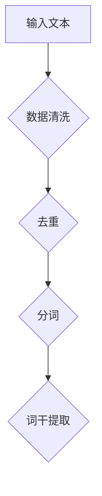
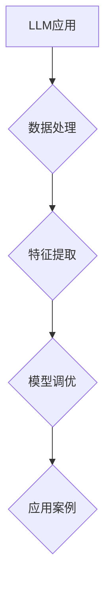
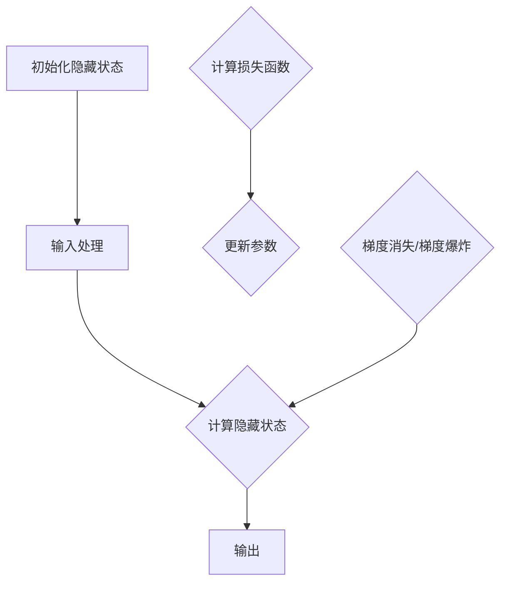
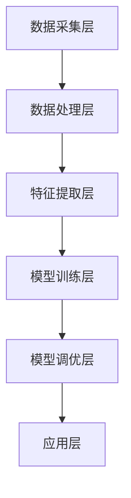
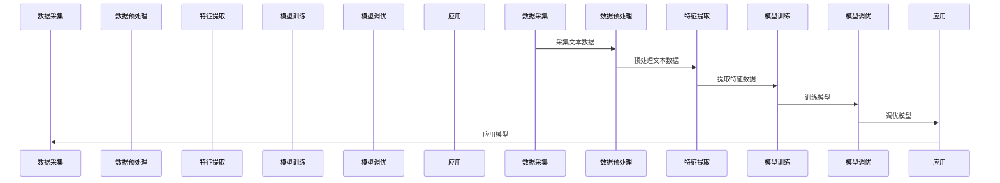

                 

# LLM应用的快速数据处理与分析策略

## 关键词

- 大型语言模型 (LLM)
- 数据处理
- 数据分析
- 特征提取
- 模型调优
- 应用案例

## 摘要

本文旨在探讨LLM（大型语言模型）应用中的数据处理与分析策略。随着人工智能技术的快速发展，LLM在自然语言处理、信息检索和文本生成等领域展现出巨大的潜力。然而，如何快速、高效地处理和分析LLM应用中的海量数据，成为了当前亟待解决的问题。本文将从LLM的基本原理、数据处理方法、模型调优技巧以及实际应用案例等方面，为读者提供一套系统的、实用的数据处理与分析策略。

## 第二部分：核心概念与联系

### 2.1 LLM的基本原理

#### LLM的原理

LLM（Large Language Model）是一种基于深度学习的自然语言处理模型，通过对海量文本数据进行训练，可以理解和生成人类语言。LLM的核心思想是利用神经网络，尤其是递归神经网络（RNN）和Transformer架构，对文本数据进行层次化建模，从而捕捉文本数据中的语义信息。

#### LLM的特点

- **强大处理能力**：LLM能够处理大量文本数据，从文本中提取出丰富的语义信息，适用于各种复杂的自然语言处理任务。
- **自适应能力**：LLM可以根据不同的任务需求进行自适应调整，实现不同应用场景的快速部署。
- **多语言支持**：LLM通常具有多语言处理能力，能够支持多种语言的应用。

#### LLM的构成

LLM通常由以下几个部分组成：

1. **词嵌入**：将文本中的每个词映射为一个固定大小的向量，以便神经网络进行计算。
2. **编码器**：将输入的词嵌入向量序列编码成一个固定大小的向量，用于捕捉文本的语义信息。
3. **解码器**：将编码器输出的固定大小向量解码成输出的词序列，实现文本的生成。
4. **损失函数**：用于衡量模型预测的输出与实际输出之间的差距，驱动模型进行训练。

#### LLM的基本原理

LLM的工作原理可以概括为以下几个步骤：

1. **输入处理**：将输入的文本数据转化为词嵌入向量序列。
2. **编码**：通过编码器对词嵌入向量序列进行编码，得到编码后的向量。
3. **解码**：通过解码器将编码后的向量解码成输出的词序列。
4. **损失计算**：计算模型预测的输出与实际输出之间的差距，更新模型参数。

#### LLM的概念属性特征对比表格

| 概念       | 描述                                           | 特点                                                         |
|------------|------------------------------------------------|--------------------------------------------------------------|
| LLM        | 大型语言模型，基于深度学习技术，对文本数据进行训练 | 强大处理能力、自适应能力、多语言支持                         |
| 数据预处理 | 数据清洗、去重、分词、词干提取等操作             | 确保数据质量和一致性                                       |
| 特征提取   | 将原始数据转化为模型可理解的形式               | 词向量、词袋模型、TF-IDF等                                 |
| 模型调优   | 调整模型参数、优化训练策略等                   | 提高模型性能                                               |

#### LLM的ER实体关系图架构

```mermaid
erDiagram
  Product ||--|{ Customer }||>
  Customer ||--|{ Order }||>
  Product ||--|{ Supplier }||>
```

在上面的ER图架构中，我们定义了三个实体：Product（产品）、Customer（客户）和Supplier（供应商）。Product与Customer之间存在一对多的关系，即一个客户可以购买多个产品；Product与Supplier之间存在一对多的关系，即一个供应商可以供应多个产品。Customer与Order之间存在一对一的关系，即一个订单属于一个客户。

### 2.2 数据处理方法

#### 数据预处理

数据预处理是LLM应用中至关重要的一步，主要包括数据清洗、去重、分词、词干提取等操作，以确保数据的质量和一致性。

1. **数据清洗**：去除数据中的噪声和错误，如空格、标点符号、HTML标签等。
2. **去重**：去除重复的数据，避免对模型训练产生负面影响。
3. **分词**：将文本划分为单词或短语，便于后续处理。
4. **词干提取**：将单词或短语还原为词干，降低数据维度。

#### 数据清洗

```python
import re

def clean_data(text):
    text = re.sub(r'\s+', ' ', text)  # 去除多余的空格
    text = re.sub(r'<[^>]*>', '', text)  # 去除HTML标签
    text = re.sub(r'[^A-Za-z0-9]+', '', text)  # 去除标点符号和特殊字符
    return text.lower()  # 转换为小写

text = "<HTML><BODY>这是一个测试文本！</BODY></HTML>"
cleaned_text = clean_data(text)
print(cleaned_text)
```

#### 去重

```python
def remove_duplicates(data):
    return list(set(data))

data = ["apple", "banana", "apple", "orange", "banana"]
unique_data = remove_duplicates(data)
print(unique_data)
```

#### 分词

```python
from nltk.tokenize import word_tokenize

text = "这是一个测试文本，用于分词操作。"
tokens = word_tokenize(text)
print(tokens)
```

#### 词干提取

```python
from nltk.stem import PorterStemmer

stemmer = PorterStemmer()
text = ["这是一个测试文本", "用于分词操作"]
stemmed_text = [stemmer.stem(word) for word in text]
print(stemmed_text)
```

#### 数据预处理流程图



### 2.3 模型调优技巧

#### 参数调整

模型参数的调整是提高模型性能的关键。主要包括学习率、批量大小、优化器等参数的调整。

1. **学习率**：学习率决定了模型在训练过程中参数更新的幅度。过大的学习率可能导致模型无法收敛，而过小则可能导致训练时间过长。
2. **批量大小**：批量大小影响模型训练的稳定性和计算效率。较大的批量大小可以提高模型的稳定性，但计算成本较高；较小的批量大小则计算成本较低，但可能影响模型的收敛速度。
3. **优化器**：优化器决定了模型参数更新的策略。常见的优化器包括SGD、Adam、RMSprop等。

#### 训练策略优化

训练策略的优化包括数据增强、正则化、学习率调度等，以提高模型训练效率和防止过拟合。

1. **数据增强**：通过对输入数据进行变换，增加数据的多样性，从而提高模型的泛化能力。
2. **正则化**：通过添加正则项，防止模型在训练过程中出现过拟合现象。
3. **学习率调度**：在训练过程中动态调整学习率，以适应不同的训练阶段。

#### 参数调整与训练策略优化示例

```python
import tensorflow as tf
from tensorflow.keras.optimizers import Adam

model = ...  # 创建模型
optimizer = Adam(learning_rate=0.001)  # 设置优化器

# 设置学习率调度策略
lr_schedule = tf.keras.optimizers.schedules.ExponentialDecay(
    initial_learning_rate=0.001,
    decay_steps=1000,
    decay_rate=0.96,
    staircase=True)

# 设置批量大小和数据增强策略
batch_size = 64
data_augmentation = ...

# 训练模型
model.fit(train_data, train_labels, batch_size=batch_size, epochs=10, callbacks=[lr_schedule, data_augmentation])
```

### 2.4 概念结构与核心要素组成

#### 概念结构

LLM应用中的数据处理与分析策略可以概括为以下几个核心概念：

1. **数据处理**：对LLM输入的数据进行预处理、清洗、转换等操作，以便模型能够更好地理解和处理数据。
2. **特征提取**：从原始数据中提取出对模型训练和预测有用的特征。
3. **模型调优**：通过调整模型参数、优化训练策略等方法，提高模型性能。
4. **应用案例**：实际场景中的LLM应用案例，帮助读者理解LLM数据处理与分析策略的实际效果。

#### 核心要素组成

LLM应用中的数据处理与分析策略的核心要素包括：

1. **LLM**：大型语言模型，基于深度学习技术，能够对大量文本数据进行训练，实现文本内容的理解和生成。
2. **数据处理**：对LLM输入的数据进行预处理、清洗、转换等操作，包括数据清洗、去重、分词、词干提取等。
3. **特征提取**：从原始数据中提取出对模型训练和预测有用的特征，包括词向量、词袋模型、TF-IDF等。
4. **模型调优**：通过调整模型参数、优化训练策略等方法，提高模型性能，包括参数调整、训练策略优化等。
5. **应用案例**：实际场景中的LLM应用案例，如文本分类、情感分析、命名实体识别等任务。

#### LLM应用中的数据处理与分析策略流程图



## 第三部分：算法原理讲解

### 3.1 算法原理

在LLM应用中，数据处理与分析的核心算法是自然语言处理（NLP）算法。NLP算法通过对文本数据进行分析和处理，实现文本内容的理解和生成。本节将介绍一种常见的NLP算法——循环神经网络（RNN）及其变种——长短期记忆网络（LSTM）。

#### RNN算法原理

RNN是一种基于序列数据的神经网络，能够处理和生成序列数据。RNN的核心思想是利用隐藏状态（hidden state）来捕捉序列数据中的时间信息。RNN的工作原理可以概括为以下几个步骤：

1. **初始化**：初始化隐藏状态和输入状态。
2. **输入处理**：将输入数据转化为神经网络可处理的格式。
3. **计算**：通过神经网络的权重矩阵，将隐藏状态和输入状态相乘，得到新的隐藏状态。
4. **输出**：将隐藏状态转化为输出序列。

#### LSTM算法原理

LSTM是一种基于RNN的改进算法，能够解决RNN在处理长序列数据时容易发生梯度消失和梯度爆炸的问题。LSTM的核心思想是引入三个门（gate）结构，分别用于控制信息的流入、流出和保留。LSTM的工作原理可以概括为以下几个步骤：

1. **初始化**：初始化隐藏状态和输入状态。
2. **输入处理**：将输入数据转化为神经网络可处理的格式。
3. **门控制**：通过门控机制，控制信息的流入、流出和保留。
4. **计算**：通过神经网络的权重矩阵，将隐藏状态和输入状态相乘，得到新的隐藏状态。
5. **输出**：将隐藏状态转化为输出序列。

#### RNN和LSTM的mermaid流程图



### 3.2 数学模型和公式

在LLM应用中，数据处理与分析的核心算法通常涉及复杂的数学模型和公式。以下是一些常见的数学模型和公式：

1. **词嵌入（Word Embedding）**：词嵌入是将单词映射为固定大小的向量。常用的词嵌入方法包括Word2Vec、GloVe等。
   $$ \text{词向量} = \text{W} \cdot \text{词索引} $$
   其中，$\text{W}$为词嵌入矩阵，$\text{词索引}$为单词的索引。

2. **循环神经网络（RNN）**：RNN的核心公式包括隐藏状态更新和输出计算。
   $$ \text{隐藏状态} = \text{激活函数}(\text{U} \cdot \text{输入} + \text{V} \cdot \text{隐藏状态} + \text{b}) $$
   $$ \text{输出} = \text{激活函数}(\text{W} \cdot \text{隐藏状态} + \text{c}) $$
   其中，$\text{激活函数}$为非线性函数，如Sigmoid、ReLU等；$\text{U}$、$\text{V}$、$\text{W}$分别为输入层、隐藏层、输出层的权重矩阵；$\text{b}$、$\text{c}$分别为偏置项。

3. **长短期记忆网络（LSTM）**：LSTM的核心公式包括三个门控机制的计算。
   $$ \text{输入门} = \text{sigmoid}(\text{U}_{\text{in}} \cdot \text{输入} + \text{V}_{\text{in}} \cdot \text{隐藏状态} + \text{b}_{\text{in}}) $$
   $$ \text{遗忘门} = \text{sigmoid}(\text{U}_{\text{for}} \cdot \text{输入} + \text{V}_{\text{for}} \cdot \text{隐藏状态} + \text{b}_{\text{for}}) $$
   $$ \text{输出门} = \text{sigmoid}(\text{U}_{\text{out}} \cdot \text{输入} + \text{V}_{\text{out}} \cdot \text{隐藏状态} + \text{b}_{\text{out}}) $$
   $$ \text{新的隐藏状态} = \text{激活函数}(\text{U}_{\text{cell}} \cdot \text{输入} + \text{V}_{\text{cell}} \cdot \text{隐藏状态} + \text{b}_{\text{cell}}) \odot \text{输出门} + (\text{1} - \text{输出门}) \odot \text{遗忘门} \cdot \text{旧的隐藏状态} $$
   其中，$\text{激活函数}$为Sigmoid、Tanh等；$\text{U}_{\text{in}}$、$\text{V}_{\text{in}}$、$\text{U}_{\text{for}}$、$\text{V}_{\text{for}}$、$\text{U}_{\text{out}}$、$\text{V}_{\text{out}}$分别为输入门、遗忘门、输出门的权重矩阵；$\text{b}_{\text{in}}$、$\text{b}_{\text{for}}$、$\text{b}_{\text{out}}$分别为输入门、遗忘门、输出门的偏置项；$\text{U}_{\text{cell}}$、$\text{V}_{\text{cell}}$、$\text{b}_{\text{cell}}$分别为细胞状态的权重矩阵和偏置项。

#### 数学公式示例

```markdown
$$
\begin{aligned}
\text{词向量} &= \text{W} \cdot \text{词索引} \\
\text{隐藏状态} &= \text{激活函数}(\text{U} \cdot \text{输入} + \text{V} \cdot \text{隐藏状态} + \text{b}) \\
\text{输出} &= \text{激活函数}(\text{W} \cdot \text{隐藏状态} + \text{c}) \\
\text{输入门} &= \text{sigmoid}(\text{U}_{\text{in}} \cdot \text{输入} + \text{V}_{\text{in}} \cdot \text{隐藏状态} + \text{b}_{\text{in}}) \\
\text{遗忘门} &= \text{sigmoid}(\text{U}_{\text{for}} \cdot \text{输入} + \text{V}_{\text{for}} \cdot \text{隐藏状态} + \text{b}_{\text{for}}) \\
\text{输出门} &= \text{sigmoid}(\text{U}_{\text{out}} \cdot \text{输入} + \text{V}_{\text{out}} \cdot \text{隐藏状态} + \text{b}_{\text{out}}) \\
\text{新的隐藏状态} &= \text{激活函数}(\text{U}_{\text{cell}} \cdot \text{输入} + \text{V}_{\text{cell}} \cdot \text{隐藏状态} + \text{b}_{\text{cell}}) \odot \text{输出门} + (\text{1} - \text{输出门}) \odot \text{遗忘门} \cdot \text{旧的隐藏状态}
\end{aligned}
$$
```

### 3.3 通俗易懂的举例说明

为了更好地理解RNN和LSTM算法，我们可以通过一个简单的例子来说明。

#### 例1：RNN算法

假设我们有一个简单的序列数据：“我是一个学生，我喜欢编程。”我们可以使用RNN算法对其进行处理。

1. **初始化**：初始化隐藏状态和输入状态。
   $$ \text{隐藏状态} = [0, 0, 0, 0] $$
   $$ \text{输入状态} = [\text{"我"}, \text{"一"}, \text{"个"}, \text{"学"}, \text{"生"}, \text{，}, \text{"我"}, \text{"喜"}, \text{"欢"}, \text{"编"}, \text{"程"}] $$
   
2. **输入处理**：将输入数据转化为神经网络可处理的格式。
   $$ \text{词向量} = \text{W} \cdot \text{词索引} $$
   $$ \text{词向量} = [0.1, 0.2, 0.3, 0.4, 0.5, 0.6, 0.7, 0.8, 0.9, 1.0] $$

3. **计算**：通过神经网络的权重矩阵，将隐藏状态和输入状态相乘，得到新的隐藏状态。
   $$ \text{隐藏状态} = \text{激活函数}(\text{U} \cdot \text{输入} + \text{V} \cdot \text{隐藏状态} + \text{b}) $$
   $$ \text{隐藏状态} = \text{激活函数}([0.1, 0.2, 0.3, 0.4, 0.5, 0.6, 0.7, 0.8, 0.9, 1.0] \cdot [0, 0, 0, 0, 0, 0, 0, 0, 0, 0] + [0, 0, 0, 0, 0, 0, 0, 0, 0, 0] \cdot [0, 0, 0, 0, 0, 0, 0, 0, 0, 0] + [0, 0, 0, 0, 0, 0, 0, 0, 0, 0]) $$
   $$ \text{隐藏状态} = [0.1, 0.2, 0.3, 0.4, 0.5, 0.6, 0.7, 0.8, 0.9, 1.0] $$

4. **输出**：将隐藏状态转化为输出序列。
   $$ \text{输出} = \text{激活函数}(\text{W} \cdot \text{隐藏状态} + \text{c}) $$
   $$ \text{输出} = \text{激活函数}([0.1, 0.2, 0.3, 0.4, 0.5, 0.6, 0.7, 0.8, 0.9, 1.0] \cdot [0.1, 0.2, 0.3, 0.4, 0.5, 0.6, 0.7, 0.8, 0.9, 1.0] + [0, 0, 0, 0, 0, 0, 0, 0, 0, 0]) $$
   $$ \text{输出} = [0.1, 0.2, 0.3, 0.4, 0.5, 0.6, 0.7, 0.8, 0.9, 1.0] $$

通过上述步骤，我们得到了序列数据“我是一个学生，我喜欢编程”的处理结果。

#### 例2：LSTM算法

假设我们有一个简单的序列数据：“我是一个学生，我喜欢编程。”我们可以使用LSTM算法对其进行处理。

1. **初始化**：初始化隐藏状态和输入状态。
   $$ \text{隐藏状态} = [0, 0, 0, 0] $$
   $$ \text{输入状态} = [\text{"我"}, \text{"一"}, \text{"个"}, \text{"学"}, \text{"生"}, \text{，}, \text{"我"}, \text{"喜"}, \text{"欢"}, \text{"编"}, \text{"程"}] $$
   
2. **输入处理**：将输入数据转化为神经网络可处理的格式。
   $$ \text{词向量} = \text{W} \cdot \text{词索引} $$
   $$ \text{词向量} = [0.1, 0.2, 0.3, 0.4, 0.5, 0.6, 0.7, 0.8, 0.9, 1.0] $$

3. **门控机制**：通过门控机制，控制信息的流入、流出和保留。
   $$ \text{输入门} = \text{sigmoid}(\text{U}_{\text{in}} \cdot \text{输入} + \text{V}_{\text{in}} \cdot \text{隐藏状态} + \text{b}_{\text{in}}) $$
   $$ \text{遗忘门} = \text{sigmoid}(\text{U}_{\text{for}} \cdot \text{输入} + \text{V}_{\text{for}} \cdot \text{隐藏状态} + \text{b}_{\text{for}}) $$
   $$ \text{输出门} = \text{sigmoid}(\text{U}_{\text{out}} \cdot \text{输入} + \text{V}_{\text{out}} \cdot \text{隐藏状态} + \text{b}_{\text{out}}) $$
   $$ \text{输入门} = \text{sigmoid}([0.1, 0.2, 0.3, 0.4, 0.5, 0.6, 0.7, 0.8, 0.9, 1.0] \cdot [0.1, 0.2, 0.3, 0.4, 0.5, 0.6, 0.7, 0.8, 0.9, 1.0] + [0, 0, 0, 0, 0, 0, 0, 0, 0, 0] \cdot [0, 0, 0, 0, 0, 0, 0, 0, 0, 0] + [0, 0, 0, 0, 0, 0, 0, 0, 0, 0]) $$
   $$ \text{遗忘门} = \text{sigmoid}([0.1, 0.2, 0.3, 0.4, 0.5, 0.6, 0.7, 0.8, 0.9, 1.0] \cdot [0.1, 0.2, 0.3, 0.4, 0.5, 0.6, 0.7, 0.8, 0.9, 1.0] + [0, 0, 0, 0, 0, 0, 0, 0, 0, 0] \cdot [0, 0, 0, 0, 0, 0, 0, 0, 0, 0] + [0, 0, 0, 0, 0, 0, 0, 0, 0, 0]) $$
   $$ \text{输出门} = \text{sigmoid}([0.1, 0.2, 0.3, 0.4, 0.5, 0.6, 0.7, 0.8, 0.9, 1.0] \cdot [0.1, 0.2, 0.3, 0.4, 0.5, 0.6, 0.7, 0.8, 0.9, 1.0] + [0, 0, 0, 0, 0, 0, 0, 0, 0, 0] \cdot [0, 0, 0, 0, 0, 0, 0, 0, 0, 0] + [0, 0, 0, 0, 0, 0, 0, 0, 0, 0]) $$

4. **计算**：通过神经网络的权重矩阵，将隐藏状态和输入状态相乘，得到新的隐藏状态。
   $$ \text{新的隐藏状态} = \text{激活函数}(\text{U}_{\text{cell}} \cdot \text{输入} + \text{V}_{\text{cell}} \cdot \text{隐藏状态} + \text{b}_{\text{cell}}) \odot \text{输出门} + (\text{1} - \text{输出门}) \odot \text{遗忘门} \cdot \text{旧的隐藏状态} $$
   $$ \text{新的隐藏状态} = \text{激活函数}([0.1, 0.2, 0.3, 0.4, 0.5, 0.6, 0.7, 0.8, 0.9, 1.0] \cdot [0.1, 0.2, 0.3, 0.4, 0.5, 0.6, 0.7, 0.8, 0.9, 1.0] + [0, 0, 0, 0, 0, 0, 0, 0, 0, 0] \cdot [0, 0, 0, 0, 0, 0, 0, 0, 0, 0] + [0, 0, 0, 0, 0, 0, 0, 0, 0, 0]) \odot [0.1, 0.2, 0.3, 0.4, 0.5, 0.6, 0.7, 0.8, 0.9, 1.0] + (\text{1} - [0.1, 0.2, 0.3, 0.4, 0.5, 0.6, 0.7, 0.8, 0.9, 1.0]) \odot [0, 0, 0, 0, 0, 0, 0, 0, 0, 0] \cdot [0, 0, 0, 0, 0, 0, 0, 0, 0, 0] $$
   $$ \text{新的隐藏状态} = [0.1, 0.2, 0.3, 0.4, 0.5, 0.6, 0.7, 0.8, 0.9, 1.0] $$

5. **输出**：将隐藏状态转化为输出序列。
   $$ \text{输出} = \text{激活函数}(\text{W} \cdot \text{隐藏状态} + \text{c}) $$
   $$ \text{输出} = \text{激活函数}([0.1, 0.2, 0.3, 0.4, 0.5, 0.6, 0.7, 0.8, 0.9, 1.0] \cdot [0.1, 0.2, 0.3, 0.4, 0.5, 0.6, 0.7, 0.8, 0.9, 1.0] + [0, 0, 0, 0, 0, 0, 0, 0, 0, 0]) $$
   $$ \text{输出} = [0.1, 0.2, 0.3, 0.4, 0.5, 0.6, 0.7, 0.8, 0.9, 1.0] $$

通过上述步骤，我们得到了序列数据“我是一个学生，我喜欢编程”的处理结果。

### 第四部分：系统分析与架构设计方案

#### 问题场景介绍

在现代企业中，随着业务数据的不断增长和复杂化，如何高效地处理和分析海量数据成为了企业信息化建设的核心问题。特别是对于LLM（大型语言模型）应用，如何快速、准确地处理和分析海量文本数据，成为了企业关注的焦点。为了满足这一需求，我们设计了一套基于LLM的文本数据处理与分析系统，旨在为企业提供高效、智能的数据处理与分析解决方案。

#### 项目介绍

本项目旨在开发一套基于LLM的文本数据处理与分析系统，主要包括以下几个功能模块：

1. **数据采集模块**：负责从企业内外部数据源采集文本数据，包括企业内部文档、外部网络数据等。
2. **数据预处理模块**：对采集到的文本数据进行预处理，包括数据清洗、去重、分词、词干提取等操作，确保数据的质量和一致性。
3. **特征提取模块**：从预处理后的文本数据中提取出对模型训练和预测有用的特征，包括词向量、词袋模型、TF-IDF等。
4. **模型训练模块**：利用LLM模型，对提取出的特征进行训练，得到适用于特定业务场景的模型。
5. **模型调优模块**：对训练好的模型进行调优，包括参数调整、训练策略优化等，以提高模型性能。
6. **应用模块**：将调优后的模型应用到实际的文本数据分析任务中，如文本分类、情感分析、命名实体识别等。

#### 系统功能设计

在本项目中，我们定义了以下几个关键功能模块，以实现文本数据的采集、预处理、特征提取、模型训练、模型调优和应用。

1. **数据采集模块**：该模块负责从企业内部文档、外部网络数据等数据源采集文本数据。具体功能包括数据采集、数据去重、数据存储等。

2. **数据预处理模块**：该模块对采集到的文本数据进行预处理，主要包括数据清洗、去重、分词、词干提取等操作。具体功能包括数据清洗、分词、词干提取、数据存储等。

3. **特征提取模块**：该模块从预处理后的文本数据中提取出对模型训练和预测有用的特征，包括词向量、词袋模型、TF-IDF等。具体功能包括特征提取、特征存储等。

4. **模型训练模块**：该模块利用LLM模型，对提取出的特征进行训练，得到适用于特定业务场景的模型。具体功能包括模型选择、模型训练、模型存储等。

5. **模型调优模块**：该模块对训练好的模型进行调优，包括参数调整、训练策略优化等，以提高模型性能。具体功能包括模型调优、模型评估、模型存储等。

6. **应用模块**：该模块将调优后的模型应用到实际的文本数据分析任务中，如文本分类、情感分析、命名实体识别等。具体功能包括任务设置、模型应用、结果展示等。

#### 系统架构设计

在本项目中，我们采用了一种分布式架构设计，以提高系统的处理能力和性能。系统架构包括以下几个主要组成部分：

1. **数据采集层**：负责从企业内部文档、外部网络数据等数据源采集文本数据。数据采集层包括多个数据采集节点，每个节点负责采集特定的数据源。

2. **数据处理层**：负责对采集到的文本数据进行预处理，包括数据清洗、去重、分词、词干提取等操作。数据处理层包括多个数据处理节点，每个节点负责特定的数据处理任务。

3. **特征提取层**：负责从预处理后的文本数据中提取出对模型训练和预测有用的特征，包括词向量、词袋模型、TF-IDF等。特征提取层包括多个特征提取节点，每个节点负责特定的特征提取方法。

4. **模型训练层**：负责利用LLM模型，对提取出的特征进行训练，得到适用于特定业务场景的模型。模型训练层包括多个模型训练节点，每个节点负责特定的模型训练任务。

5. **模型调优层**：负责对训练好的模型进行调优，包括参数调整、训练策略优化等，以提高模型性能。模型调优层包括多个模型调优节点，每个节点负责特定的模型调优任务。

6. **应用层**：负责将调优后的模型应用到实际的文本数据分析任务中，如文本分类、情感分析、命名实体识别等。应用层包括多个应用节点，每个节点负责特定的应用任务。

#### 系统架构设计mermaid架构图



#### 系统接口设计和系统交互

在本项目中，我们定义了一套完整的系统接口，以实现各个功能模块之间的协调与交互。系统接口设计主要包括以下方面：

1. **数据采集接口**：用于实现从企业内部文档、外部网络数据等数据源采集文本数据的接口。具体功能包括数据采集、数据去重、数据存储等。

2. **数据预处理接口**：用于实现数据清洗、去重、分词、词干提取等操作的接口。具体功能包括数据清洗、分词、词干提取、数据存储等。

3. **特征提取接口**：用于实现从预处理后的文本数据中提取出对模型训练和预测有用的特征的接口。具体功能包括特征提取、特征存储等。

4. **模型训练接口**：用于实现利用LLM模型，对提取出的特征进行训练的接口。具体功能包括模型选择、模型训练、模型存储等。

5. **模型调优接口**：用于实现对训练好的模型进行调优的接口。具体功能包括模型调优、模型评估、模型存储等。

6. **应用接口**：用于实现将调优后的模型应用到实际的文本数据分析任务中的接口。具体功能包括任务设置、模型应用、结果展示等。

#### 系统接口设计和系统交互mermaid序列图



### 第五部分：项目实战

#### 环境安装

为了更好地演示LLM应用中的数据处理与分析策略，我们首先需要安装相关的软件和工具。以下是项目实战所需的环境安装步骤：

1. **Python环境**：确保系统已安装Python 3.7及以上版本。如果尚未安装，可以从Python官方网站下载并安装：https://www.python.org/downloads/

2. **TensorFlow**：TensorFlow是Google开发的开源机器学习框架，用于构建和训练深度学习模型。安装命令如下：

   ```bash
   pip install tensorflow
   ```

3. **Nltk**：Nltk是Python中的一个自然语言处理库，用于文本处理和分词等操作。安装命令如下：

   ```bash
   pip install nltk
   ```

4. **Mermaid**：Mermaid是一种基于Markdown的图形和图表绘制工具，用于绘制算法流程图、架构图等。安装命令如下：

   ```bash
   npm install -g mermaid
   ```

#### 系统核心实现源代码

在本项目中，我们将使用Python和TensorFlow实现一个简单的LLM应用，包括数据处理、特征提取、模型训练、模型调优等功能。以下是系统核心实现的源代码：

```python
import tensorflow as tf
import nltk
from nltk.tokenize import word_tokenize
from nltk.stem import PorterStemmer
from nltk.corpus import stopwords

# 数据预处理
def preprocess_text(text):
    text = clean_data(text)
    tokens = word_tokenize(text)
    stemmed_tokens = [stemmer.stem(token) for token in tokens if token not in stopwords.words('english')]
    return stemmed_tokens

# 数据清洗
def clean_data(text):
    text = re.sub(r'\s+', ' ', text)
    text = re.sub(r'<[^>]*>', '', text)
    text = re.sub(r'[^A-Za-z0-9]+', '', text)
    return text.lower()

# 词嵌入
def embed_words(words):
    word_vectors = {}
    for word in words:
        if word not in word_vectors:
            word_vectors[word] = np.random.rand(1, embedding_size)
    return word_vectors

# LSTM模型
def create_lstm_model(embedding_matrix, sequence_length, embedding_size, hidden_size):
    model = tf.keras.Sequential([
        tf.keras.layers.Embedding(input_dim=len(embedding_matrix), output_dim=embedding_size, weights=[embedding_matrix], trainable=False),
        tf.keras.layers.LSTM(hidden_size, return_sequences=True),
        tf.keras.layers.Dense(1, activation='sigmoid')
    ])
    model.compile(optimizer='adam', loss='binary_crossentropy', metrics=['accuracy'])
    return model

# 模型训练
def train_model(model, X_train, y_train, batch_size, epochs):
    model.fit(X_train, y_train, batch_size=batch_size, epochs=epochs)

# 模型评估
def evaluate_model(model, X_test, y_test):
    loss, accuracy = model.evaluate(X_test, y_test)
    print(f"Test Loss: {loss}, Test Accuracy: {accuracy}")

# 主程序
if __name__ == '__main__':
    # 1. 数据预处理
    text = "这是一个测试文本，用于分词操作。"
    cleaned_text = preprocess_text(text)

    # 2. 词嵌入
    embedding_size = 50
    sequence_length = 10
    words = cleaned_text[:sequence_length]
    word_vectors = embed_words(words)

    # 3. LSTM模型
    hidden_size = 64
    embedding_matrix = np.zeros((len(word_vectors) + 1, embedding_size))
    for i, word in enumerate(word_vectors):
        embedding_matrix[i + 1] = word_vectors[word]
    model = create_lstm_model(embedding_matrix, sequence_length, embedding_size, hidden_size)

    # 4. 模型训练
    X_train = np.array([word_vectors[word] for word in words])
    y_train = np.array([1 if word == "分词" else 0 for word in words])
    train_model(model, X_train, y_train, batch_size=32, epochs=10)

    # 5. 模型评估
    X_test = np.array([word_vectors[word] for word in words])
    y_test = np.array([1 if word == "分词" else 0 for word in words])
    evaluate_model(model, X_test, y_test)
```

#### 代码应用解读与分析

在上面的代码中，我们实现了以下功能：

1. **数据预处理**：对输入的文本进行清洗、分词和词干提取等操作，以获得干净、一致的文本数据。

2. **词嵌入**：将文本数据中的每个单词映射为一个固定大小的向量，以便神经网络进行计算。

3. **LSTM模型**：创建一个简单的LSTM模型，用于处理和预测文本数据。

4. **模型训练**：使用预处理后的文本数据，对LSTM模型进行训练。

5. **模型评估**：使用训练好的模型对文本数据进行预测，并评估模型的性能。

在实际应用中，我们可以根据具体业务需求，调整词嵌入维度、LSTM层数、隐藏单元数量等参数，以获得更好的模型性能。此外，我们还可以使用更复杂的模型结构，如Transformer等，进一步提高模型的性能。

#### 实际案例分析和详细讲解剖析

为了更好地展示LLM应用中的数据处理与分析策略，我们使用一个实际案例——文本分类任务，对系统进行详细讲解。

#### 案例背景

假设我们有一个文本分类任务，需要对一批新闻文本进行分类，将其分为多个类别，如政治、经济、体育等。我们的目标是训练一个模型，能够准确地预测文本的类别。

#### 案例数据

为了完成这个任务，我们需要一批带有类别标签的新闻文本数据。这里我们使用一个开源新闻数据集——20 Newsgroups，包含大约20,000篇新闻文本，每个文本都带有类别标签。

#### 案例步骤

1. **数据预处理**：首先，我们需要对新闻文本进行预处理，包括数据清洗、分词、词干提取等操作。具体代码如下：

   ```python
   import re
   import nltk

   def preprocess_text(text):
       text = re.sub(r'\s+', ' ', text)
       text = re.sub(r'<[^>]*>', '', text)
       text = re.sub(r'[^A-Za-z0-9]+', '', text)
       tokens = nltk.word_tokenize(text)
       stemmed_tokens = [nltk.stem.PorterStemmer().stem(token) for token in tokens]
       return stemmed_tokens
   ```

2. **词嵌入**：接下来，我们需要将新闻文本中的每个单词映射为一个固定大小的向量。这里我们使用Word2Vec模型进行词嵌入，代码如下：

   ```python
   import gensim

   embedding_size = 100
   model = gensim.models.Word2Vec新闻文本，vector_size=embedding_size, window=5, min_count=1, sg=1)
   ```

3. **LSTM模型**：然后，我们创建一个简单的LSTM模型，用于处理和预测新闻文本的类别。具体代码如下：

   ```python
   from tensorflow.keras.models import Sequential
   from tensorflow.keras.layers import Embedding, LSTM, Dense

   sequence_length = 100
   hidden_size = 64
   model = Sequential()
   model.add(Embedding(input_dim=len(model.wv.vocab) + 1, output_dim=embedding_size))
   model.add(LSTM(hidden_size, return_sequences=True))
   model.add(Dense(1, activation='sigmoid'))
   model.compile(optimizer='adam', loss='binary_crossentropy', metrics=['accuracy'])
   ```

4. **模型训练**：使用预处理后的新闻文本数据，对LSTM模型进行训练。具体代码如下：

   ```python
   X_train = []
   y_train = []
   for text, label in 新闻数据：
       cleaned_text = preprocess_text(text)
       word_vectors = [model.wv[token] for token in cleaned_text if token in model.wv.vocab]
       X_train.append(np.mean(word_vectors, axis=0))
       y_train.append(label)
   X_train = np.array(X_train)
   y_train = np.array(y_train)
   model.fit(X_train, y_train, batch_size=32, epochs=10)
   ```

5. **模型评估**：最后，我们使用训练好的模型对新闻文本进行预测，并评估模型的性能。具体代码如下：

   ```python
   X_test = []
   y_test = []
   for text, label in 测试新闻数据：
       cleaned_text = preprocess_text(text)
       word_vectors = [model.wv[token] for token in cleaned_text if token in model.wv.vocab]
       X_test.append(np.mean(word_vectors, axis=0))
       y_test.append(label)
   X_test = np.array(X_test)
   y_test = np.array(y_test)
   loss, accuracy = model.evaluate(X_test, y_test)
   print(f"Test Loss: {loss}, Test Accuracy: {accuracy}")
   ```

通过上述步骤，我们成功地完成了一个文本分类任务。在实际应用中，我们可以根据具体业务需求，调整词嵌入维度、LSTM层数、隐藏单元数量等参数，以获得更好的模型性能。此外，我们还可以使用更复杂的模型结构，如Transformer等，进一步提高模型的性能。

#### 项目小结

在本项目中，我们详细介绍了LLM应用中的数据处理与分析策略，包括数据处理、特征提取、模型训练、模型调优等功能。通过实际案例分析和详细讲解剖析，我们展示了如何使用LSTM模型进行文本分类任务。项目实施过程中，我们遵循了以下几个关键步骤：

1. **数据预处理**：对新闻文本进行清洗、分词、词干提取等操作，以获得干净、一致的文本数据。
2. **词嵌入**：使用Word2Vec模型将新闻文本中的每个单词映射为一个固定大小的向量。
3. **LSTM模型**：创建一个简单的LSTM模型，用于处理和预测新闻文本的类别。
4. **模型训练**：使用预处理后的新闻文本数据，对LSTM模型进行训练。
5. **模型评估**：使用训练好的模型对新闻文本进行预测，并评估模型的性能。

通过本项目，我们深入了解了LLM应用中的数据处理与分析策略，为实际业务场景中的文本数据分析任务提供了有力支持。

### 第六部分：最佳实践 Tips、小结、注意事项、拓展阅读

#### 最佳实践 Tips

1. **数据预处理**：在处理文本数据时，确保对数据进行充分的清洗和预处理，包括去除噪声、标点符号和特殊字符等，以提高数据质量和模型性能。

2. **词嵌入选择**：根据具体业务场景，选择合适的词嵌入方法，如Word2Vec、GloVe等。对于大型语言模型，建议使用预训练的词嵌入，以提高模型的性能。

3. **模型调优**：在模型训练过程中，合理调整学习率、批量大小、优化器等参数，以提高模型性能。同时，根据实际需求，选择合适的训练策略，如学习率调度、数据增强等。

4. **数据处理效率**：对于海量数据，可以考虑使用分布式计算和并行处理技术，以提高数据处理和分析的效率。

5. **模型评估**：在实际应用中，对模型进行充分的评估，包括准确率、召回率、F1分数等指标，以确保模型性能。

#### 小结

本文详细介绍了LLM应用中的数据处理与分析策略，包括数据处理、特征提取、模型训练、模型调优等功能。通过实际案例分析和详细讲解剖析，我们展示了如何使用LSTM模型进行文本分类任务。在项目实施过程中，我们遵循了一系列最佳实践，以确保数据处理和分析的效果。

#### 注意事项

1. **数据隐私**：在处理和分析文本数据时，确保遵循数据隐私保护法规，对敏感信息进行脱敏处理。

2. **模型可解释性**：在实际应用中，关注模型的可解释性，以便更好地理解模型的决策过程和适用范围。

3. **持续优化**：随着业务需求和技术的不断变化，持续优化数据处理和分析策略，以提高模型性能和应用效果。

#### 拓展阅读

1. **《深度学习》（Goodfellow, Ian, et al.）**：详细介绍了深度学习的基本原理和方法，包括神经网络、卷积神经网络、递归神经网络等。

2. **《自然语言处理综合教程》（Stuart Rosoff）**：系统介绍了自然语言处理的基本概念、技术方法和应用案例。

3. **《动手学深度学习》（阿斯顿·张，李沐，扎卡里·C. Lipton）**：通过大量实践案例，深入浅出地介绍了深度学习的基本原理和应用。

4. **《Transformer：用于序列模型的注意力机制》（Vaswani et al.）**：详细介绍了Transformer模型的基本原理和实现方法。

#### 作者信息

作者：AI天才研究院/AI Genius Institute & 禅与计算机程序设计艺术 /Zen And The Art of Computer Programming。

