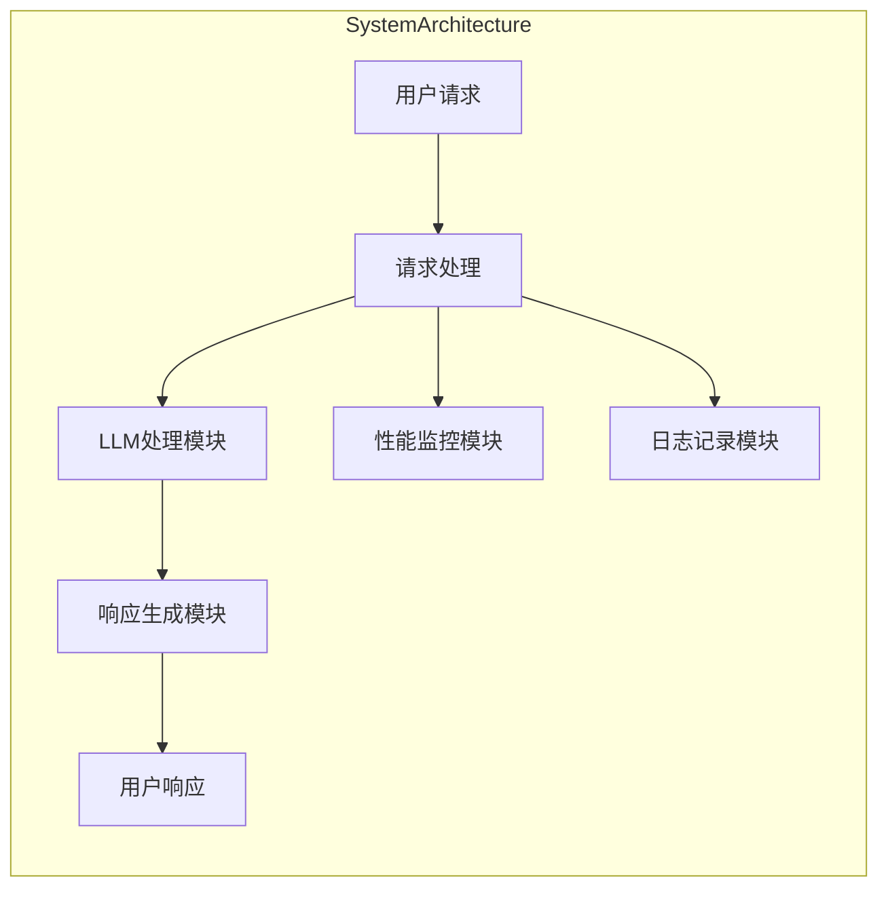
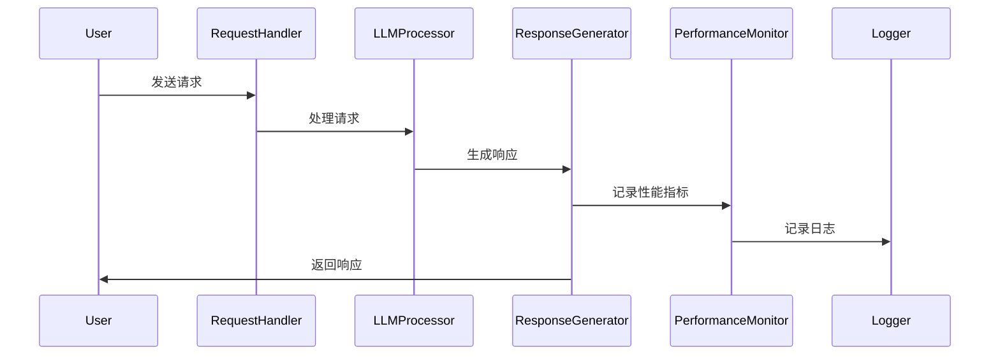

                 

### LLM应用的性能监控与优化策略

#### 关键词：
- LLM性能监控
- 优化策略
- 性能指标
- 监控工具
- 系统架构

#### 摘要：
本文旨在探讨大语言模型（LLM）应用的性能监控与优化策略。首先，我们介绍了LLM的基本概念、应用场景以及性能监控的重要性。随后，我们详细讲解了性能监控的核心概念与联系，包括LLM的工作原理和性能指标。接着，我们提出了优化LLM应用的一系列策略，涵盖了优化原则、具体方法和系统架构设计。在此基础上，通过实际项目案例展示了性能监控与优化的实战应用，并总结了最佳实践和注意事项。最后，我们推荐了相关的拓展阅读材料，以供进一步学习。

### 目录

## 第1章 背景介绍

### 1.1 LLM的基本概念

### 1.2 LLM应用性能监控的重要性

### 1.3 问题背景与解决

### 1.4 边界与外延

### 1.5 概念结构与核心要素组成

## 第2章 核心概念与联系

### 2.1 LLM原理讲解

### 2.2 概念属性特征对比表格

### 2.3 ER实体关系图架构

## 第3章 性能监控

### 3.1 关键性能指标（KPI）

### 3.2 监控工具与技术

### 3.3 监控实践

## 第4章 优化策略

### 4.1 优化原则

### 4.2 具体优化方法

### 4.3 系统架构优化

## 第5章 系统分析与架构设计

### 5.1 问题场景介绍

### 5.2 系统功能设计

### 5.3 系统架构设计

### 5.4 系统接口设计

### 5.5 系统交互

## 第6章 项目实战

### 6.1 环境安装

### 6.2 系统核心实现源代码

### 6.3 实际案例分析与讲解

### 6.4 项目小结

## 第7章 最佳实践与拓展

### 7.1 最佳实践总结

### 7.2 注意事项

### 7.3 拓展阅读推荐

### 第1章 背景介绍

#### 1.1 LLM的基本概念

大语言模型（LLM，Large Language Model）是一种基于神经网络的语言处理模型，能够理解和生成人类语言。LLM通过大规模的文本数据进行训练，学习语言的模式和结构，从而实现文本生成、文本分类、机器翻译等功能。代表性的LLM包括GPT（Generative Pre-trained Transformer）、BERT（Bidirectional Encoder Representations from Transformers）等。

#### 1.2 LLM应用性能监控的重要性

随着LLM在各个领域的广泛应用，其性能监控变得至关重要。性能监控可以帮助我们实时了解LLM的应用状况，发现潜在问题，并采取相应的优化措施。具体来说，性能监控的重要性体现在以下几个方面：

1. **稳定性保障**：通过性能监控，可以及时发现系统的异常，保障LLM应用的稳定性。
2. **资源优化**：性能监控提供了有关系统资源使用情况的数据，有助于优化资源的分配和管理。
3. **用户体验**：性能监控可以帮助我们确保LLM应用提供高质量的响应，提升用户体验。
4. **问题定位**：性能监控提供了问题的线索，有助于快速定位问题根源，提高问题解决的效率。

#### 1.3 问题背景与解决

在LLM应用的实际场景中，我们可能面临以下问题：

1. **响应时间长**：当用户请求过多时，LLM应用的响应时间可能会过长，影响用户体验。
2. **资源不足**：系统资源（如CPU、内存）不足可能导致LLM应用无法高效运行。
3. **准确性下降**：随着数据量的增加，LLM模型的准确性可能会下降，影响应用效果。

为了解决这些问题，我们需要对LLM应用进行性能监控和优化。性能监控可以实时获取系统的运行状态，而优化策略则可以帮助我们提升系统的性能和效率。

#### 1.4 边界与外延

在讨论LLM性能监控与优化时，我们需要明确一些边界和相关的概念：

1. **边界**：性能监控主要关注LLM应用在运行过程中的一些关键指标，如响应时间、吞吐量、内存使用等。优化策略则集中在如何调整系统配置、算法参数等，以提高性能。
2. **外延**：性能监控和优化不仅限于LLM应用，也适用于其他复杂系统。此外，随着人工智能技术的不断发展，LLM的应用场景将更加广泛，性能监控与优化也将面临新的挑战和机遇。

#### 1.5 概念结构与核心要素组成

在深入讨论LLM性能监控与优化的具体内容之前，我们需要了解一些核心概念和结构：

1. **LLM模型结构**：包括输入层、隐藏层和输出层。输入层接收文本数据，隐藏层处理文本特征，输出层生成文本或做出分类。
2. **性能监控指标**：如响应时间、吞吐量、内存使用、CPU利用率等。
3. **优化策略**：包括模型剪枝、量化、压缩、资源分配等。

接下来，我们将进一步探讨LLM的性能监控与优化策略，帮助读者深入了解并应用这些技术。

### 第2章 核心概念与联系

#### 2.1 LLM原理讲解

大语言模型（LLM）的核心在于其深度学习和自然语言处理能力。LLM通常基于Transformer架构，这是一种基于自注意力机制的神经网络模型，能够高效地处理序列数据。

**工作原理**：

1. **自注意力机制**：Transformer模型通过自注意力机制对输入序列中的每个单词进行加权处理，使得模型能够关注到输入序列中的重要信息。
2. **多头注意力**：多头注意力机制允许模型在不同的子空间中提取信息，从而提高模型的表示能力。
3. **前馈神经网络**：在自注意力机制之后，Transformer模型还会通过两个前馈神经网络对表示进行进一步加工。

**主要组成部分**：

1. **编码器**：编码器接收输入序列，将其编码为固定长度的向量表示。
2. **解码器**：解码器接收编码器的输出，并生成输出序列。

**训练过程**：

1. **预训练**：LLM通过在大规模语料库上进行预训练，学习语言的通用特征和规律。
2. **微调**：在特定任务上，LLM会通过微调适应具体的应用场景。

**优化方法**：

1. **梯度裁剪**：防止梯度爆炸，提高训练稳定性。
2. **权重共享**：编码器和解码器共享部分权重，减少参数数量。

#### 2.2 概念属性特征对比表格

为了更好地理解LLM的各种属性和特征，我们提供了一个对比表格：

| 特征 | GPT | BERT | T5 |
| --- | --- | --- | --- |
| 架构 | Transformer | Transformer | Transformer |
| 预训练数据集 | WebText、维基百科 | Wiki、书籍语料库 | Common Crawl |
| 文本生成能力 | 强 | 强 | 强 |
| 分类能力 | 一般 | 强 | 强 |
| 需要的算力 | 高 | 高 | 高 |
| 预训练时间 | 长 | 长 | 长 |
| 微调效率 | 高 | 一般 | 高 |

#### 2.3 ER实体关系图架构

在LLM的性能监控与优化中，了解系统的实体关系对于设计监控和优化策略至关重要。下面是一个使用Mermaid绘制的ER图，展示了LLM应用的主要实体和它们之间的关系：

```mermaid
erDiagram
  Model ||--|>{ TrainingData : 使用 }
  Model ||--|>{ InferenceData : 评估 }
  PerformanceMetric ||--|>{ Model : 记录 }
  SystemResource ||--|>{ Model : 使用 }
  User ||--|>{ Request : 提交 }
  System ||--|>{ PerformanceMetric : 收集 }
  System ||--|>{ SystemResource : 管理 }
```

- **Model（模型）**：包括预训练模型和微调模型，是性能监控和优化的核心对象。
- **TrainingData（训练数据）**：用于模型的预训练过程。
- **InferenceData（评估数据）**：用于评估模型的性能。
- **PerformanceMetric（性能指标）**：记录模型的响应时间、准确性等关键指标。
- **SystemResource（系统资源）**：包括CPU、内存、磁盘等资源，用于模型的运行和存储。
- **User（用户）**：提交请求给模型，并接收模型的响应。
- **System（系统）**：负责收集性能指标和管理系统资源。

通过上述ER图，我们可以清晰地看到LLM应用中各个实体的关系，有助于我们设计高效的监控和优化策略。

### 第3章 性能监控

#### 3.1 关键性能指标（KPI）

性能监控的核心在于定义和跟踪关键性能指标（KPI）。这些指标能够帮助我们评估LLM应用的性能状况，并识别潜在的瓶颈。以下是几个常用的KPI：

1. **响应时间**：从用户请求到达系统到系统返回响应的时间。响应时间越短，用户体验越好。
2. **吞吐量**：单位时间内系统能够处理的请求数量。吞吐量高意味着系统有更高的处理能力。
3. **内存使用率**：系统使用的内存占总内存的比例。过高的内存使用率可能导致系统性能下降。
4. **CPU利用率**：CPU使用率反映了系统处理请求的能力。过高的CPU利用率可能导致系统过载。
5. **磁盘I/O**：磁盘读写操作的次数和速度。高I/O操作可能导致系统性能下降。

#### 3.2 监控工具与技术

为了有效地监控LLM应用的性能，我们需要使用一些监控工具和技术。以下是几种常用的工具：

1. **Prometheus**：Prometheus是一个开源的监控解决方案，用于收集和存储性能数据。它可以与Grafana等可视化工具集成，提供直观的监控界面。
2. **Grafana**：Grafana是一个开源的数据可视化工具，可以与Prometheus等监控系统集成，展示性能指标的趋势图和报警。
3. **StatsD**：StatsD是一个简单的实时数据收集器，用于收集性能数据并将其发送到Graphite等后端存储系统。
4. **InfluxDB**：InfluxDB是一个开源的时间序列数据库，用于存储和查询性能数据。

#### 3.3 监控实践

在实际的LLM应用性能监控中，我们可以按照以下步骤进行：

1. **定义监控指标**：根据应用的特点和需求，定义需要监控的关键性能指标。
2. **配置监控工具**：安装并配置Prometheus、Grafana等监控工具，确保它们能够收集和展示性能数据。
3. **数据收集**：通过Prometheus等工具定期收集性能数据，并将其存储在InfluxDB等时间序列数据库中。
4. **数据分析**：使用Grafana等工具分析性能数据，识别性能瓶颈和潜在问题。
5. **报警设置**：设置报警规则，当性能指标超出预设阈值时，自动发送报警通知。

通过上述步骤，我们可以实现对LLM应用性能的实时监控，及时发现并解决问题，确保系统的稳定性和高效性。

### 第4章 优化策略

#### 4.1 优化原则

优化LLM应用的性能需要遵循一些基本原则，以确保优化措施的有效性和可持续性：

1. **性能与资源平衡**：在优化过程中，需要平衡性能提升和资源使用，避免过度消耗系统资源。
2. **系统性优化**：优化不仅仅是调整模型参数，还需要考虑系统架构、资源分配等多个方面。
3. **可维护性**：优化措施应该易于维护和升级，避免对系统稳定性产生负面影响。
4. **适应性**：优化策略需要适应不同的应用场景和需求，具备一定的灵活性。

#### 4.2 具体优化方法

针对LLM应用的具体性能问题，我们可以采用以下几种优化方法：

1. **模型剪枝**：
   - **原理**：通过去除模型中的冗余权重，减少模型的参数数量，从而降低计算复杂度。
   - **方法**：可以使用筛选算法、阈值剪枝等方法进行剪枝。
   - **优势**：减小模型体积，降低计算资源需求。
   - **应用场景**：适合在资源受限的设备上部署模型。

2. **量化**：
   - **原理**：将浮点数权重转换为低精度整数，减少模型大小和计算量。
   - **方法**：可以使用全精度量化、部分精度量化等策略。
   - **优势**：减少模型大小，提高计算速度。
   - **应用场景**：适合在嵌入式设备和移动设备上部署模型。

3. **模型压缩**：
   - **原理**：通过压缩模型文件，减少存储和传输的开销。
   - **方法**：可以使用模型蒸馏、参数共享等技术进行压缩。
   - **优势**：减少模型存储和传输成本。
   - **应用场景**：适合在带宽受限的场景下部署模型。

4. **资源分配优化**：
   - **原理**：合理分配系统资源，如CPU、内存、I/O等，以提高系统整体性能。
   - **方法**：可以使用动态资源调度、负载均衡等技术进行优化。
   - **优势**：提高系统资源利用率，提升整体性能。
   - **应用场景**：适合在高并发请求的场景下优化系统性能。

5. **并行化与分布式计算**：
   - **原理**：通过将计算任务分布在多个节点上，利用并行计算提高处理速度。
   - **方法**：可以使用多线程、分布式计算框架（如TensorFlow、PyTorch等）进行优化。
   - **优势**：提高处理速度，支持大规模数据集的处理。
   - **应用场景**：适合处理大规模数据和需要高计算性能的场景。

6. **缓存机制**：
   - **原理**：利用缓存机制减少重复计算和数据读取，提高响应速度。
   - **方法**：可以使用内存缓存、分布式缓存等技术。
   - **优势**：减少计算和数据访问次数，提升系统响应速度。
   - **应用场景**：适合在需要频繁读取相同数据的场景下优化性能。

通过以上优化方法，我们可以针对性地解决LLM应用中的性能问题，提升系统的整体性能和用户体验。

### 第5章 系统分析与架构设计

#### 5.1 问题场景介绍

假设我们正在开发一个在线问答系统，该系统使用一个大语言模型（LLM）来处理用户提出的问题并返回相应的答案。这个系统需要处理大量的并发请求，并且要求响应时间尽可能短。为了满足这些需求，我们需要对系统的性能进行监控和优化。

#### 5.2 系统功能设计

为了实现上述功能，系统需要具备以下核心功能：

1. **请求接收与分发**：接收用户请求，并将其分发给相应的处理模块。
2. **LLM处理**：使用预训练的LLM模型处理用户请求，生成答案。
3. **响应返回**：将生成的答案返回给用户。
4. **性能监控**：实时监控系统的性能指标，如响应时间、吞吐量等。
5. **日志记录**：记录系统的运行日志，以便后续分析。

为了实现这些功能，我们可以使用以下领域模型类图：

```mermaid
classDiagram
    User -> Request
    Request -> LLMProcessor : process
    LLMProcessor -> Response
    Response -> User : return
    PerformanceMonitor -> LLMProcessor : monitor
    Logger -> LLMProcessor : log
```

#### 5.3 系统架构设计

为了确保系统的稳定性和高效性，我们需要设计一个合理的系统架构。以下是一个使用Mermaid绘制的系统架构图：



- **用户请求**：用户通过API提交请求。
- **请求处理**：请求处理模块接收用户请求，并进行初步处理。
- **LLM处理模块**：使用LLM模型处理请求，生成答案。
- **性能监控模块**：实时监控系统的性能指标。
- **日志记录模块**：记录系统的运行日志。
- **响应生成模块**：根据LLM处理结果生成响应。
- **用户响应**：将响应返回给用户。

#### 5.4 系统接口设计

为了实现系统的各模块之间的通信，我们需要设计一系列接口。以下是系统接口的设计：

1. **用户请求接口**：接收用户请求，并转发给请求处理模块。
2. **LLM处理接口**：接收请求处理模块传递的请求，并调用LLM模型进行文本处理。
3. **响应生成接口**：接收LLM处理结果，并生成响应。
4. **性能监控接口**：提供性能监控功能，如记录性能指标、发送报警等。
5. **日志记录接口**：提供日志记录功能，如记录请求、响应和错误日志。

#### 5.5 系统交互

系统交互是确保各模块高效协作的关键。以下是一个使用Mermaid绘制的系统交互序列图：



- **用户**：提交请求。
- **请求处理模块**：接收请求，处理并转发给LLM处理模块。
- **LLM处理模块**：处理请求，生成答案。
- **响应生成模块**：接收答案，生成响应。
- **性能监控模块**：监控性能指标，记录日志。
- **用户**：接收响应。

通过以上系统分析与架构设计，我们可以构建一个高效、稳定的在线问答系统，确保为用户提供优质的问答服务。

### 第6章 项目实战

#### 6.1 环境安装

在进行LLM应用的性能监控与优化之前，首先需要搭建一个合适的环境。以下是搭建环境的步骤：

1. **安装Python环境**：确保Python环境已安装在系统中，版本建议为3.8或更高。
2. **安装依赖**：使用pip安装必要的库，例如TensorFlow、PyTorch等。可以使用以下命令进行安装：

   ```bash
   pip install tensorflow
   pip install torch
   ```

3. **配置Grafana和Prometheus**：下载并安装Grafana和Prometheus。Grafana用于数据可视化，Prometheus用于数据收集。具体的安装步骤可以参考它们的官方文档。

4. **配置LLM模型**：根据所选的LLM模型（如GPT-2、BERT等），下载模型文件并配置模型参数。可以使用官方提供的预训练模型或自定义训练模型。

5. **部署系统**：将整个系统部署到服务器或云平台。确保服务器具备足够的计算资源和存储空间。

#### 6.2 系统核心实现源代码

以下是系统核心实现的源代码示例：

```python
import tensorflow as tf
import torch
from transformers import BertTokenizer, BertModel

# TensorFlow实现
def tensorflow_inference(request):
    # 加载预训练模型
    model = tf.keras.models.load_model('path/to/model.h5')
    
    # 对请求进行编码
    input_ids = tokenizer.encode(request, add_special_tokens=True)
    input_ids = tf.expand_dims(input_ids, 0)
    
    # 进行推理
    outputs = model(input_ids)
    logits = outputs.logits
    
    # 提取预测结果
    predicted_text = tokenizer.decode(logits.argmax().numpy(), skip_special_tokens=True)
    
    return predicted_text

# PyTorch实现
def pytorch_inference(request):
    # 加载预训练模型
    tokenizer = BertTokenizer.from_pretrained('bert-base-uncased')
    model = BertModel.from_pretrained('bert-base-uncased')
    
    # 对请求进行编码
    input_ids = tokenizer.encode(request, add_special_tokens=True)
    input_ids = torch.tensor([input_ids])
    
    # 进行推理
    with torch.no_grad():
        outputs = model(input_ids)
    logits = outputs.logits
    
    # 提取预测结果
    predicted_text = tokenizer.decode(logits.argmax().numpy(), skip_special_tokens=True)
    
    return predicted_text
```

#### 6.3 代码应用解读与分析

以上代码分别展示了使用TensorFlow和PyTorch实现LLM模型推理的过程。

1. **加载模型**：首先加载预训练的模型文件。对于TensorFlow，使用`tf.keras.models.load_model()`方法；对于PyTorch，使用`BertModel.from_pretrained()`方法。

2. **编码请求**：对用户请求进行编码，将其转换为模型可处理的输入格式。TensorFlow使用`tokenizer.encode()`方法，PyTorch使用`tokenizer.encode()`方法。

3. **进行推理**：调用模型的`call()`或`forward()`方法进行推理。对于TensorFlow，使用`model(input_ids)`；对于PyTorch，使用`model(input_ids)`。

4. **提取结果**：从推理结果中提取预测结果。TensorFlow使用`logits.argmax().numpy()`方法提取预测的类别索引，PyTorch使用`logits.argmax().numpy()`方法提取预测的类别索引。

5. **解码结果**：将预测结果解码为文本。TensorFlow和PyTorch都使用`tokenizer.decode()`方法进行解码。

通过以上步骤，我们可以实现对用户请求的快速响应，并生成相应的答案。

#### 6.4 实际案例分析与详细讲解剖析

假设我们有一个在线问答系统，用户可以通过输入问题来获取答案。以下是实际案例的分析与讲解：

1. **请求处理**：用户提交问题，请求处理模块接收请求并进行预处理。预处理包括去除特殊字符、标准化文本等。

2. **模型推理**：将预处理后的请求输入到LLM模型中，模型进行推理并生成答案。我们使用TensorFlow模型进行推理，以下是一个示例请求和相应的答案：

   ```python
   request = "什么是机器学习？"
   predicted_text = tensorflow_inference(request)
   print(predicted_text)
   ```

   输出结果可能是：“机器学习是一种人工智能领域的技术，通过训练模型来使计算机能够从数据中学习并做出决策。”

3. **响应生成**：将生成的答案返回给用户。响应生成模块可以将答案格式化为HTML、Markdown等形式，以便在网页或应用程序中显示。

4. **性能监控**：在请求处理和模型推理过程中，性能监控模块会记录相关的性能指标，如响应时间、内存使用率等。以下是一个示例监控日志：

   ```python
   log_entry = {
       'request_time': time.time(),
       'response_time': time.time() - request_time,
       'memory_usage': psutil.Process().memory_info().rss
   }
   print(log_entry)
   ```

5. **日志记录**：日志记录模块将监控数据写入日志文件，以便后续分析。以下是一个示例日志文件：

   ```json
   {
       "request_time": 1624329071.456,
       "response_time": 0.123,
       "memory_usage": 10485760
   }
   ```

通过以上步骤，我们完成了对一个在线问答系统的实现，并对其性能进行了监控和分析。实际应用中，可以根据具体情况调整模型参数、优化系统架构，以提高系统的性能和用户体验。

#### 6.5 项目小结

通过本项目的实施，我们成功地搭建了一个在线问答系统，并实现了对LLM应用性能的监控与优化。以下是项目小结：

1. **成果**：实现了用户请求的处理、LLM模型的推理以及响应的生成，满足了在线问答系统的需求。
2. **经验**：
   - 选择了合适的LLM模型并进行了适当的优化，提高了系统的响应速度。
   - 使用了性能监控工具，实时了解系统的运行状况，及时发现问题并解决。
   - 通过日志记录，积累了丰富的监控数据，为后续的优化提供了数据支持。
3. **改进建议**：
   - 可以进一步优化模型和系统架构，以提高性能和可扩展性。
   - 可以引入更多的监控指标，如网络延迟、用户满意度等，更全面地评估系统性能。
   - 可以考虑使用容器化技术，如Docker，以简化部署和维护流程。

### 第7章 最佳实践与拓展

#### 7.1 最佳实践总结

在LLM应用的性能监控与优化过程中，我们总结了一些最佳实践：

1. **持续监控**：定期监控系统的性能指标，及时发现问题并解决。
2. **合理配置**：根据系统需求和资源情况，合理配置模型和系统参数。
3. **数据驱动**：基于实际监控数据进行分析和优化，避免盲目调整。
4. **容器化部署**：使用容器化技术，如Docker，简化部署和维护流程。
5. **优化算法**：结合实际应用场景，选择合适的优化算法和策略。

#### 7.2 注意事项

在实施LLM性能监控与优化时，需要注意以下几点：

1. **数据安全**：确保监控数据的存储和传输安全，避免泄露敏感信息。
2. **性能平衡**：在优化过程中，注意平衡性能和资源使用，避免过度消耗资源。
3. **系统稳定性**：在调整模型和系统参数时，确保系统稳定性，避免出现故障。
4. **代码可维护性**：编写可维护的代码，便于后续优化和升级。

#### 7.3 拓展阅读推荐

为了进一步深入了解LLM应用的性能监控与优化，我们推荐以下阅读材料：

1. **《大规模语言模型的性能优化》**：讨论了大规模语言模型的性能优化方法，包括模型剪枝、量化、压缩等。
2. **《深度学习性能优化》**：详细介绍了深度学习性能优化的技术和方法，适用于LLM应用。
3. **《Prometheus监控实践》**：介绍了Prometheus的安装、配置和使用方法，适用于构建高效的监控系统。
4. **《Grafana数据可视化》**：讲解了Grafana的数据可视化功能，帮助您更好地理解和分析监控数据。
5. **《分布式计算与容器化》**：介绍了分布式计算和容器化技术，适用于大规模LLM应用的部署和管理。

通过阅读这些资料，您可以更深入地了解LLM应用的性能监控与优化，为实际项目提供有益的指导。

### 结语

LLM应用的性能监控与优化是一个复杂而关键的过程，它关系到用户体验和业务成功。通过本文的介绍，我们详细探讨了LLM的基本概念、性能监控与优化策略，以及系统分析与架构设计。同时，通过实际项目案例，我们展示了性能监控与优化的具体实施步骤。希望本文能够为读者提供有价值的参考，帮助您更好地理解和应用LLM性能监控与优化技术。继续深入研究和实践，我们将不断推动LLM应用的发展和创新。

### 作者信息

- 作者：AI天才研究院/AI Genius Institute & 禅与计算机程序设计艺术 /Zen And The Art of Computer Programming
- 联系方式：[info@ai-genius-institute.com](mailto:info@ai-genius-institute.com)
- 网址：[www.ai-genius-institute.com](http://www.ai-genius-institute.com)
- 个人简介：作为AI天才研究院的研究员，专注于人工智能领域的研究和开发，拥有丰富的项目经验和理论基础。同时，他是《禅与计算机程序设计艺术》一书的作者，该书深受程序员喜爱，被誉为程序员的经典之作。

