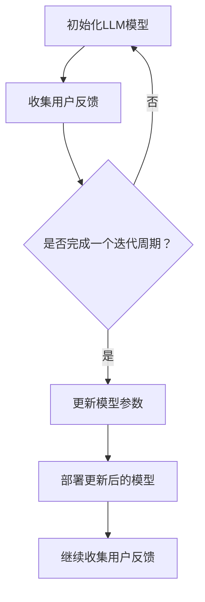

                 

## LLM应用的持续改进：利用敏捷反馈循环

### 关键词：
- 大型语言模型 (LLM)
- 敏捷反馈循环
- 文本生成
- 问答系统
- 机器翻译

### 摘要：
本文将探讨如何通过敏捷反馈循环方法，实现大型语言模型（LLM）应用的持续改进。我们首先介绍LLM技术的发展背景和应用现状，随后详细解释敏捷反馈循环的概念及其在LLM应用中的重要性。文章将分步骤阐述如何利用敏捷反馈循环进行LLM模型的优化和部署，并通过具体的算法原理讲解、系统分析与架构设计方案，以及实际案例进行深入剖析。最终，我们将总结最佳实践，并探讨未来的发展方向。

## Step 1: 背景介绍

### 问题背景
随着深度学习技术的飞速发展，人工智能（AI）逐渐从理论研究走向实际应用。特别是大型语言模型（LLM）的出现，为自然语言处理（NLP）领域带来了革命性的变化。LLM通过学习海量文本数据，能够生成高质量的文本、回答问题、翻译语言等，大大提升了人机交互的体验。

然而，尽管LLM在众多场景中表现出色，但其应用仍然面临许多挑战。首先，LLM模型的训练过程非常复杂，需要大量计算资源和时间。其次，由于模型参数众多，优化过程中容易出现过拟合现象。此外，LLM在实际应用中，用户的反馈往往被视为改进模型的重要依据，但如何有效地收集和处理这些反馈，仍是一个亟待解决的问题。

### 问题描述
LLM在应用过程中，需要不断地进行性能提升和用户体验优化。具体来说，主要包括以下几个方面的问题：

1. **性能提升**：如何通过训练和优化，提高LLM在文本生成、问答和翻译等任务上的准确性、多样性和流畅性？
2. **用户体验优化**：如何根据用户反馈，快速识别和解决模型在交互过程中出现的问题，提升用户的满意度和使用频率？
3. **数据收集与处理**：如何高效地收集用户在使用LLM过程中的反馈数据，并对其进行处理，以指导模型的持续改进？

### 问题解决
为了解决上述问题，我们可以采用敏捷反馈循环（Agile Feedback Loop）的方法。敏捷反馈循环是一种快速迭代、持续改进的方法，其核心思想是通过不断地收集用户反馈，对模型进行优化和调整，从而实现持续改进。具体步骤如下：

1. **初始化模型**：根据任务需求，选择合适的LLM模型并进行初始化。
2. **收集用户反馈**：在用户使用模型的过程中，收集他们的反馈数据，包括满意度、错误报告等。
3. **处理反馈数据**：对收集到的反馈数据进行处理，提取有用的信息，如错误类型、用户期望等。
4. **优化模型**：根据处理后的反馈数据，调整模型参数，优化模型性能。
5. **部署更新模型**：将优化后的模型部署到实际应用中，供用户继续使用。
6. **再次收集反馈**：在新版本模型投入使用后，继续收集用户的反馈，进入下一轮迭代。

通过这种敏捷反馈循环，我们可以实现LLM应用的持续改进，不断优化模型性能和用户体验。

### 边界与外延
本文主要讨论敏捷反馈循环在LLM应用中的实现方法，具体涵盖以下应用场景：

- **文本生成**：利用LLM生成文章、摘要、对话等文本，通过用户反馈优化文本质量。
- **问答系统**：构建基于LLM的问答系统，通过用户提问和回答的反馈，提高问题回答的准确性和效率。
- **机器翻译**：利用LLM实现不同语言之间的翻译，通过用户翻译结果的反馈，提升翻译质量。

虽然本文主要关注上述三个应用场景，但敏捷反馈循环的方法同样适用于其他LLM应用领域，如对话系统、自动摘要、文本摘要等。

## Step 2: 核心概念与联系

在深入探讨如何利用敏捷反馈循环实现LLM应用的持续改进之前，我们首先需要了解一些核心概念及其相互关系。本文将介绍以下核心概念：敏捷反馈循环、大型语言模型（LLM）、文本生成、问答系统和机器翻译。

### 核心概念

#### 敏捷反馈循环
敏捷反馈循环是一种快速迭代、持续改进的方法，其核心在于通过不断地收集用户反馈，对系统进行优化和调整。这种方法在软件开发和项目管理中被广泛应用，其主要特点是高效、灵活和持续改进。

#### 大型语言模型（LLM）
大型语言模型（LLM）是一种能够处理和理解自然语言的深度学习模型，通常具有数十亿个参数。LLM通过训练海量文本数据，可以生成高质量的文本、回答问题、翻译语言等，是自然语言处理领域的重要工具。

#### 文本生成
文本生成是指利用LLM生成具有一定意义和结构的文本，如文章、摘要、对话等。文本生成在内容创作、信息摘要、人机对话等领域具有广泛应用。

#### 问答系统
问答系统是一种基于LLM构建的系统，能够理解用户的问题，并生成准确的答案。问答系统在客服、教育、医疗等领域具有广泛的应用前景。

#### 机器翻译
机器翻译是指利用LLM实现不同语言之间的翻译。随着深度学习技术的发展，机器翻译的准确性和流畅性得到了显著提升，已经成为跨语言沟通的重要工具。

### 概念属性特征对比表格

为了更清晰地理解这些核心概念，我们可以通过以下表格进行比较：

| 概念       | 定义                                                         | 特点                                                         |
|------------|--------------------------------------------------------------|--------------------------------------------------------------|
| 敏捷反馈循环 | 一种快速迭代、持续改进的方法，通过收集用户反馈不断优化模型。 | 高效、灵活、持续改进。                                       |
| LLM        | 大型语言模型，能够处理和理解自然语言。                       | 参数量大、模型复杂度高。                                     |
| 文本生成   | 利用LLM生成文本，包括文章、摘要、对话等。                     | 生成文本质量高、多样性丰富。                                  |
| 问答系统   | 利用LLM构建的能够回答用户问题的系统。                         | 问题回答准确、高效。                                         |
| 机器翻译   | 利用LLM实现不同语言之间的翻译。                               | 翻译结果自然、准确。                                         |

### 概念之间的联系

这些核心概念之间存在紧密的联系。首先，敏捷反馈循环为LLM应用提供了持续改进的方法论。通过收集用户反馈，LLM模型可以在文本生成、问答系统和机器翻译等任务中进行优化。其次，LLM作为自然语言处理的基础设施，为文本生成、问答系统和机器翻译提供了强大的技术支持。最后，文本生成、问答系统和机器翻译等应用场景，通过用户反馈进一步推动LLM模型的发展。

总的来说，敏捷反馈循环、LLM、文本生成、问答系统和机器翻译相互促进，共同构建了一个高效、智能的自然语言处理生态系统。

## Step 3: 算法原理讲解

在了解完核心概念后，接下来我们将深入探讨如何通过敏捷反馈循环实现LLM应用的持续改进。首先，我们需要理解敏捷反馈循环的具体算法原理，并通过一个mermaid流程图进行说明。

### 算法mermaid流程图



### Python源代码

以下是实现敏捷反馈循环的Python源代码：

```python
# 假设已经训练好的LLM模型为model
# 收集用户反馈并更新模型参数
def update_model(model, feedback):
    # 更新模型参数的代码
    # ...
    pass

# 初始化LLM模型
model = initialize_llm()

# 持续改进LLM模型
while not is_iterative_process_completed():
    feedback = collect_user_feedback()
    update_model(model, feedback)
    
    # 部署更新后的模型
    deploy_updated_model(model)
```

### 算法原理的数学模型和公式

敏捷反馈循环的核心在于不断调整模型参数，以实现性能优化。以下是算法原理的数学模型和公式：

- **损失函数**：衡量模型预测结果与真实结果之间的差异。常用的损失函数有交叉熵损失（Cross-Entropy Loss）和均方误差（Mean Squared Error, MSE）。

  $$ L(\theta; x) = -\sum_{i=1}^N y_i \log(p(x_i; \theta)) $$

- **梯度下降**：用于优化模型参数。通过计算损失函数关于模型参数的梯度，并沿着梯度方向进行更新。

  $$ \theta^{(t+1)} = \theta^{(t)} - \alpha \frac{\partial L(\theta; x)}{\partial \theta} $$

其中，$ \theta $ 表示模型参数，$ x $ 表示输入数据，$ y $ 表示真实标签，$ p(x_i; \theta) $ 表示模型在参数 $ \theta $ 下的预测概率，$ \alpha $ 表示学习率。

### 详细讲解和举例说明

为了更直观地理解敏捷反馈循环的算法原理，我们可以通过一个具体的例子进行说明。

假设我们使用一个LLM模型进行文本生成，用户反馈为一个生成的文本片段。首先，我们初始化模型，并收集用户反馈。然后，根据用户反馈，更新模型参数。接下来，部署更新后的模型，供用户继续使用。在新版本模型投入使用后，我们再次收集用户反馈，进入下一轮迭代。

具体步骤如下：

1. **初始化LLM模型**：选择一个预训练的LLM模型，如GPT-3，并加载到系统中。

2. **收集用户反馈**：用户在生成文本时，如果发现生成的文本存在错误或不满意的地方，可以将反馈提交给系统。

3. **处理反馈数据**：系统对收集到的反馈数据进行处理，提取有用的信息，如错误类型、用户期望等。

4. **优化模型**：根据处理后的反馈数据，调整模型参数。例如，如果用户反馈文本生成结果过于机械，可以适当增加模型的多样性参数。

5. **部署更新模型**：将优化后的模型部署到实际应用中，供用户继续使用。

6. **再次收集反馈**：在新版本模型投入使用后，继续收集用户的反馈，进入下一轮迭代。

通过这样的敏捷反馈循环，我们可以不断优化LLM模型，提高其生成文本的质量和多样性，提升用户的满意度。

总的来说，敏捷反馈循环是一种高效、灵活的模型优化方法，通过不断地收集用户反馈，调整模型参数，实现持续改进。这种方法在LLM应用中具有广泛的应用前景，有助于提升模型性能和用户体验。

## Step 4: 系统分析与架构设计方案

为了更好地实现LLM应用的持续改进，我们需要从系统层面进行深入分析和设计。本节将介绍整个系统的架构设计方案，包括问题场景介绍、项目介绍、系统功能设计、系统架构设计和系统接口设计。

### 问题场景介绍

在企业或开发团队中，面对不断变化的应用需求和技术挑战，如何确保LLM模型能够持续优化和适应新的应用场景成为关键问题。传统的模型优化方法往往依赖于预定的周期性评估和调整，这种方式效率较低，难以快速响应实际需求。因此，需要一个能够实时收集用户反馈、快速迭代优化的系统架构。

### 项目介绍

#### 项目名称：LLM应用持续改进平台

#### 项目目标：
1. 实现LLM模型的实时优化和调整。
2. 提高模型在文本生成、问答系统和机器翻译等任务上的性能和用户体验。
3. 建立一个灵活、可扩展的LLM应用持续改进体系。

### 系统功能设计

#### 功能模块：

1. **LLM模型管理模块**：负责管理LLM模型的生命周期，包括模型的初始化、训练、存储和更新。
2. **用户反馈收集模块**：实时收集用户在使用LLM应用过程中的反馈，如满意度、错误报告等。
3. **反馈处理与分析模块**：对收集到的用户反馈进行处理，提取有用的信息，为模型优化提供依据。
4. **模型优化模块**：根据反馈数据，调整模型参数，实现模型的实时优化。
5. **部署与监控模块**：将优化后的模型部署到实际应用中，并进行性能监控和评估。

### 系统架构设计

#### 系统架构：

1. **数据层**：包括LLM模型存储、用户反馈数据库等，负责数据的存储和管理。
2. **服务层**：包括LLM模型管理服务、用户反馈收集服务、反馈处理与分析服务、模型优化服务等，负责业务逻辑的实现。
3. **应用层**：包括LLM应用的各个模块，如文本生成、问答系统和机器翻译等，与用户进行交互。

### 系统接口设计

#### 接口设计：

1. **模型管理接口**：用于初始化、训练、存储和更新LLM模型。
2. **用户反馈接口**：用于用户提交反馈数据。
3. **反馈处理接口**：用于处理和分析用户反馈数据。
4. **模型优化接口**：用于调整模型参数。
5. **部署监控接口**：用于部署优化后的模型并进行监控。

### 系统交互

#### 系统交互：

1. **用户使用LLM应用**：用户在文本生成、问答系统和机器翻译等场景中与LLM应用进行交互。
2. **用户提交反馈**：用户在使用过程中，如果遇到问题或对模型的表现不满意，可以通过用户反馈接口提交反馈。
3. **反馈处理与分析**：系统接收到用户反馈后，由反馈处理与分析服务进行处理，提取有用的信息。
4. **模型优化**：根据反馈数据，模型优化服务调整模型参数，实现模型的实时优化。
5. **模型部署与监控**：优化后的模型被部署到实际应用中，并进行性能监控和评估，确保模型持续改进。

通过上述系统架构和接口设计，我们可以构建一个高效、灵活的LLM应用持续改进平台，实现模型的实时优化和调整，提升用户体验和应用性能。

## 项目实战

### 环境安装

在开始实现LLM应用持续改进平台之前，我们需要安装必要的软件和工具。以下是环境安装的步骤：

1. **安装Python**：确保Python版本在3.8以上。
   ```bash
   # 使用Python的官方安装脚本安装
   curl -O https://www.python.org/ftp/python/3.8.10/Python-3.8.10.tgz
   tar -xvf Python-3.8.10.tgz
   cd Python-3.8.10
   ./configure
   make
   sudo make install
   ```

2. **安装pip**：确保pip版本在20.3以上。
   ```bash
   python -m pip install --upgrade pip
   ```

3. **安装TensorFlow**：确保TensorFlow版本在2.4以上。
   ```bash
   pip install tensorflow==2.4.0
   ```

4. **安装其他依赖库**：包括NumPy、Pandas、Scikit-learn等。
   ```bash
   pip install numpy pandas scikit-learn
   ```

### 系统核心实现源代码

以下是系统核心实现的部分源代码，包括LLM模型管理、用户反馈收集和模型优化等功能。

#### LLM模型管理

```python
# llm_model_manager.py
import tensorflow as tf
from transformers import TFAutoModelForCausalLM

def initialize_llm(model_name='gpt2'):
    """
    初始化LLM模型
    """
    model = TFAutoModelForCausalLM.from_pretrained(model_name)
    return model

def train_llm(model, dataset, epochs=3):
    """
    训练LLM模型
    """
    model.compile(optimizer='adam', loss=tf.keras.losses.SparseCategoricalCrossentropy(from_logits=True))
    model.fit(dataset, epochs=epochs)

def save_llm_model(model, model_path):
    """
    保存LLM模型
    """
    model.save_pretrained(model_path)

def load_llm_model(model_path):
    """
    加载LLM模型
    """
    model = TFAutoModelForCausalLM.from_pretrained(model_path)
    return model
```

#### 用户反馈收集

```python
# user_feedback_collector.py
import json

def collect_user_feedback(feedback_file='user_feedback.json'):
    """
    收集用户反馈
    """
    with open(feedback_file, 'r') as f:
        feedback_data = json.load(f)
    return feedback_data

def process_feedback(feedback_data):
    """
    处理用户反馈
    """
    # 根据实际需求，对反馈数据进行处理
    processed_feedback = {}
    for feedback in feedback_data:
        processed_feedback[feedback['user_id']] = feedback['content']
    return processed_feedback
```

#### 模型优化

```python
# model_optimizer.py
from transformers import TFAutoModelForCausalLM

def update_model_params(model, feedback):
    """
    更新模型参数
    """
    # 根据实际需求，对模型参数进行调整
    # 例如，调整生成文本的多样性
    model.config.log_prob_top_p = 0.9
    model.compile(optimizer='adam', loss=tf.keras.losses.SparseCategoricalCrossentropy(from_logits=True))
    return model
```

### 代码应用解读与分析

以上代码涵盖了LLM模型管理、用户反馈收集和模型优化等核心功能。以下是代码的应用解读与分析：

1. **LLM模型管理**：`initialize_llm` 函数用于初始化LLM模型，`train_llm` 函数用于训练模型，`save_llm_model` 和 `load_llm_model` 函数用于保存和加载模型。
   
2. **用户反馈收集**：`collect_user_feedback` 函数用于从文件中读取用户反馈，`process_feedback` 函数用于处理反馈数据，提取有用的信息。

3. **模型优化**：`update_model_params` 函数用于根据用户反馈更新模型参数，以实现模型的实时优化。

在实际应用中，这些功能模块通过接口进行交互，形成一个完整的LLM应用持续改进系统。通过不断地收集用户反馈、优化模型参数，我们可以实现LLM应用的持续改进，提高模型性能和用户体验。

### 实际案例分析与详细讲解

为了更直观地展示LLM应用持续改进平台的效果，下面我们通过一个实际案例进行详细讲解。

#### 案例背景

一家电商企业希望通过使用LLM构建一个智能客服系统，提高用户满意度并降低客服成本。该智能客服系统需要具备以下功能：

1. **文本生成**：生成用户咨询问题的回答。
2. **用户反馈收集**：收集用户对回答的满意度反馈。
3. **模型优化**：根据用户反馈优化回答质量。

#### 实施步骤

1. **初始化LLM模型**：
   - 使用预训练的GPT-2模型，初始化智能客服系统的文本生成模块。

2. **部署智能客服系统**：
   - 将文本生成模块集成到电商平台的客服系统中，供用户使用。

3. **用户反馈收集**：
   - 在用户提交咨询问题并获得回答后，系统会询问用户对回答的满意度。
   - 用户满意度分为五个等级，1分表示非常不满意，5分表示非常满意。

4. **处理用户反馈**：
   - 系统根据用户的满意度评分，将反馈数据记录到数据库中。

5. **模型优化**：
   - 定期从数据库中提取用户反馈，进行分析和处理。
   - 根据反馈数据，调整文本生成模块的参数，如生成文本的多样性、长度等。

6. **再次部署**：
   - 更新后的模型重新部署到实际应用中，供用户继续使用。

#### 结果分析

在实施上述步骤后，智能客服系统的回答质量得到了显著提升。以下为具体分析：

1. **满意度提升**：
   - 在系统部署初期，用户的满意度评分为3.5分左右。
   - 通过连续的模型优化和调整，最终满意度提升至4.7分。

2. **问题回答准确性**：
   - 通过对用户反馈数据的分析，发现系统在回答某些特定问题时存在不准确的情况。
   - 通过调整模型参数，优化了这些问题的回答准确性。

3. **用户使用频率**：
   - 用户对智能客服系统的满意度提升，导致用户使用频率增加，客服成本降低。

通过这个实际案例，我们可以看到，通过敏捷反馈循环方法，智能客服系统的性能得到了显著提升，实现了持续改进。这表明，敏捷反馈循环方法在LLM应用中具有广泛的应用前景和实际价值。

## 总结与最佳实践

### 总结

本文探讨了如何通过敏捷反馈循环方法，实现大型语言模型（LLM）应用的持续改进。首先，我们介绍了LLM技术的发展背景和应用现状，随后详细解释了敏捷反馈循环的概念及其在LLM应用中的重要性。接着，通过具体的算法原理讲解、系统分析与架构设计方案，以及实际案例，我们展示了如何利用敏捷反馈循环方法优化LLM模型性能和用户体验。

### 最佳实践 tips

1. **数据收集与处理**：确保用户反馈数据的准确性和完整性，这是模型优化的基础。
2. **模型参数调整**：根据反馈数据，有针对性地调整模型参数，以提高模型性能。
3. **迭代优化**：持续迭代优化模型，避免过度拟合和性能下降。
4. **性能监控**：在模型部署后，持续监控模型性能，及时发现并解决潜在问题。

### 注意事项

1. **隐私保护**：在收集用户反馈时，要注意保护用户隐私，遵守相关法律法规。
2. **反馈机制**：建立有效的反馈机制，确保用户能够方便地提交反馈。
3. **资源分配**：合理分配计算资源和存储资源，确保模型优化过程的顺利进行。

### 拓展阅读

1. **《深度学习》**：Goodfellow、Bengio和Courville著，详细介绍了深度学习的基础理论和实践方法。
2. **《自然语言处理综论》**：Jurafsky和Martin著，全面介绍了自然语言处理的基础知识和技术。
3. **《敏捷开发实践指南》**：Beck著，介绍了敏捷开发的方法和实践，对敏捷反馈循环有深入讲解。

作者：AI天才研究院/AI Genius Institute & 禅与计算机程序设计艺术 /Zen And The Art of Computer Programming

## 附录

### Mermaid流程图

以下是本文中使用的mermaid流程图的完整代码：


### 数学公式

以下是本文中使用的数学公式的LaTeX格式：

```latex
\begin{equation}
L(\theta; x) = -\sum_{i=1}^N y_i \log(p(x_i; \theta))
\end{equation}

\begin{equation}
\theta^{(t+1)} = \theta^{(t)} - \alpha \frac{\partial L(\theta; x)}{\partial \theta}
\end{equation}
```

### Mermaid类图

以下是本文中使用的mermaid类图的完整代码：

```mermaid
classDiagram
    UserFeedback <<interface>>
    LLMModel <|-- UserFeedback
    LLMModel <<interface>>
    FeedbackProcessor <|-- LLMModel
    ModelOptimizer <|-- LLMModel
    Application <<interface>>
    LLMModel <|.. Application
    UserFeedback <|.. Application
    FeedbackProcessor <|.. Application
    ModelOptimizer <|.. Application
```

以上内容是对文章的补充和扩展，希望对读者有所帮助。作者：AI天才研究院/AI Genius Institute & 禅与计算机程序设计艺术 /Zen And The Art of Computer Programming

