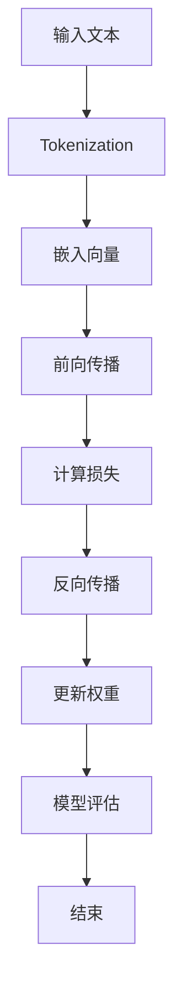
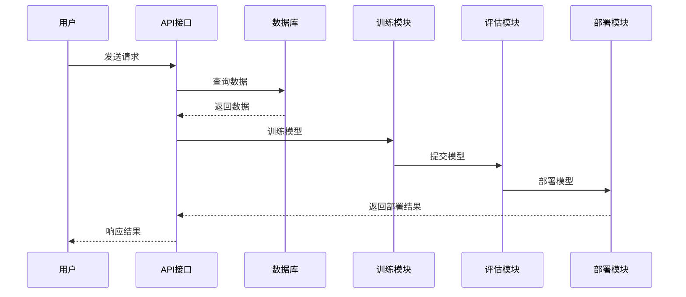
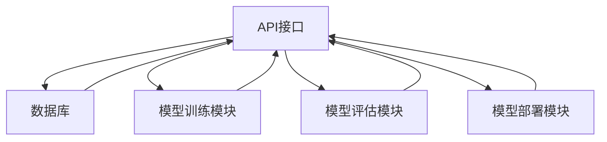

                 


### 引言

在当前技术飞速发展的时代，大规模语言模型（LLM）的应用已经深入到各个领域，从自然语言处理、智能客服到内容生成等，LLM正在改变我们的工作和生活方式。然而，随着LLM应用场景的不断扩展，如何实现其持续部署，确保从开发到生产的无缝衔接，成为一个关键问题。

持续部署（Continuous Deployment，简称CD）是一种软件开发和部署的最佳实践，旨在通过自动化流程快速且安全地交付代码更改。在LLM应用中，持续部署的重要性更加凸显，因为模型的训练和优化往往是一个复杂且耗时的过程，如何保证模型在生产环境中的高效运行和持续更新，是每一个开发者都必须面对的挑战。

本文将深入探讨LLM应用的持续部署，从开发到生产的无缝衔接。我们将首先概述LLM应用的基本概念和背景，然后逐步分析核心概念与联系，详细讲解LLM算法原理，并进行系统分析与架构设计。最后，我们将通过实际项目实战，分享最佳实践和注意事项，并对未来持续部署的展望进行探讨。

本文结构如下：

- 第一部分：概述
  - 第1章：LLM应用概述
  - 第2章：LLM核心概念与联系
- 第二部分：LLM算法原理讲解
  - 第3章：LLM算法原理详解
- 第三部分：系统分析与架构设计
  - 第4章：系统分析与架构设计方案
- 第四部分：项目实战
  - 第5章：环境安装与系统核心实现
  - 第6章：最佳实践与注意事项
  - 第7章：未来展望与持续部署

通过这篇文章，我们希望读者能够对LLM应用的持续部署有一个全面而深入的理解，为实际项目中的应用提供指导和参考。

### 第一部分: 概述

#### 第1章: LLM应用概述

#### 1.1 问题背景

随着人工智能技术的飞速发展，自然语言处理（NLP）作为AI的一个重要分支，已经取得了显著的进展。特别是在深度学习技术的推动下，大规模语言模型（Large Language Models，简称LLM）的应用范围不断扩大，从文本生成、机器翻译、问答系统到智能客服等多个领域都得到了广泛的应用。

然而，在LLM的实际应用过程中，持续部署（Continuous Deployment，简称CD）的问题逐渐凸显。持续部署不仅仅是一个技术问题，更是一个影响整个开发流程和产品质量的关键因素。对于LLM应用来说，持续部署意味着从开发环境到生产环境的无缝衔接，确保模型能够在各种环境下稳定、高效地运行。

#### 1.2 问题描述

持续部署在LLM应用中面临的主要问题可以归纳为以下几个方面：

1. **环境不一致性**：开发环境与生产环境之间存在显著差异，可能导致模型在开发环境中的表现良好，但在生产环境中表现不佳。
2. **数据不一致性**：生产数据与训练数据可能存在差异，影响模型在真实环境中的表现。
3. **模型版本管理**：随着模型的不断更新，如何管理和跟踪不同版本的模型成为了一个挑战。
4. **安全性**：持续部署过程中需要确保数据的安全性和模型的隐私保护。

#### 1.3 问题解决

针对上述问题，持续部署的解决方案主要包括以下几个方面：

1. **环境一致性**：通过使用容器技术（如Docker）来封装应用程序及其运行环境，确保开发环境与生产环境的一致性。
2. **数据一致性**：使用数据同步机制，将生产数据与训练数据进行比对和整合，确保模型在真实环境中的表现与训练时的一致性。
3. **模型版本管理**：利用版本控制系统（如Git）来管理模型的版本，确保每个版本的模型都能被追踪和回溯。
4. **安全性**：通过加密和访问控制等技术，确保数据的安全性和模型的隐私保护。

#### 1.4 边界与外延

持续部署的边界主要涉及到软件开发的生命周期管理，包括开发、测试、部署和运维等环节。而持续部署的外延则涉及到整个技术栈的集成，包括开发工具、测试工具、部署工具和运维工具等。

#### 1.5 概念结构与核心要素组成

在LLM应用的持续部署中，核心概念和要素主要包括：

- **开发环境**：用于编写和调试代码的环境。
- **测试环境**：用于对代码和模型进行测试的环境。
- **生产环境**：模型实际运行的环境。
- **数据同步**：用于同步训练数据和生产数据的机制。
- **容器技术**：用于封装应用程序及其运行环境的工具。
- **版本控制系统**：用于管理代码和模型版本的系统。

通过以上概念和要素的有机结合，可以实现LLM应用从开发到生产的无缝衔接，确保模型的高效、稳定和可靠运行。

### 第2章: LLM核心概念与联系

#### 2.1 核心概念原理

在LLM应用的持续部署中，理解核心概念是至关重要的。以下是一些关键的概念及其原理：

1. **自然语言处理（NLP）**：NLP是使计算机能够理解、解释和生成人类语言的技术。其核心原理包括词法分析、句法分析、语义分析和语用分析等。

2. **深度学习（Deep Learning）**：深度学习是机器学习的一个重要分支，通过多层神经网络来学习和模拟数据。核心原理包括前向传播、反向传播和激活函数等。

3. **大规模语言模型（LLM）**：LLM是一种大型神经网络模型，能够处理和理解大量的文本数据。其核心原理包括预训练和微调等。

4. **持续部署（Continuous Deployment）**：持续部署是一种自动化流程，用于快速、安全地交付代码更改。核心原理包括自动化测试、自动化部署和版本控制等。

#### 2.2 概念属性特征对比表格

以下是几个关键概念及其属性特征的对比表格：

| 概念 | 属性特征 |
| --- | --- |
| 自然语言处理（NLP） | 数据处理、模型训练、模型评估 |
| 深度学习（Deep Learning） | 神经网络结构、激活函数、优化算法 |
| 大规模语言模型（LLM） | 预训练数据、模型规模、训练时间 |
| 持续部署（Continuous Deployment） | 自动化测试、自动化部署、版本控制 |

#### 2.3 ER实体关系图架构

为了更好地理解LLM应用中的核心概念和它们之间的关系，我们可以使用ER（Entity-Relationship）实体关系图来表示。以下是LLM应用中的ER实体关系图：

```mermaid
erDiagram
    dev_environment ||--o{ test_environment } : 部署
    test_environment ||--o{ production_environment } : 部署
    code_base ||--o{ dev_environment } : 编写
    code_base ||--o{ test_environment } : 测试
    code_base ||--o{ production_environment } : 部署
    data_base ||--o{ test_environment } : 测试
    data_base ||--o{ production_environment } : 部署
    model_base ||--o{ dev_environment } : 训练
    model_base ||--o{ test_environment } : 评估
    model_base ||--o{ production_environment } : 部署
```

在这个ER实体关系图中，`dev_environment`（开发环境）、`test_environment`（测试环境）和`production_environment`（生产环境）是三个主要的实体，它们分别与`code_base`（代码库）、`data_base`（数据集）和`model_base`（模型库）之间有明确的依赖关系。通过这个图，我们可以清晰地看到不同实体之间的交互和依赖关系，从而更好地理解持续部署的过程。

通过以上对LLM应用核心概念与联系的详细讲解，我们为后续的算法原理讲解和系统分析与架构设计奠定了基础。

### 第3章: LLM算法原理详解

#### 3.1 算法原理Mermaid流程图

大规模语言模型（LLM）的核心在于其训练过程，这一过程可以通过Mermaid流程图进行详细展示。以下是LLM算法原理的Mermaid流程图：



在这个流程图中，输入文本首先经过Tokenization（分词）处理，然后转换为嵌入向量。嵌入向量通过多层神经网络进行前向传播，计算损失并触发反向传播以更新权重。这个过程反复进行，直到模型达到预定的性能指标。最后，对训练完成的模型进行评估，以确保其准确性和稳定性。

#### 3.2 Python源代码阐述

为了更好地理解LLM算法的原理，我们使用Python代码进行详细阐述。以下是基于Transformer模型的简化版Python代码示例：

```python
import tensorflow as tf
from tensorflow.keras.layers import Embedding, Dense, LSTM

# 定义模型结构
model = tf.keras.Sequential([
    Embedding(input_dim=vocab_size, output_dim=embedding_dim),
    LSTM(units=hidden_size),
    Dense(units=output_size, activation='softmax')
])

# 编写训练过程
def train_model(model, train_data, train_labels, epochs):
    for epoch in range(epochs):
        # 前向传播
        predictions = model(train_data)
        # 计算损失
        loss = tf.keras.losses.sparse_categorical_crossentropy(y_true=train_labels, y_pred=predictions)
        # 反向传播
        model.optimizer.minimize(loss, model.trainable_variables)
        # 打印训练进度
        if epoch % 100 == 0:
            print(f"Epoch {epoch}, Loss: {loss.numpy()}")

# 模型编译
model.compile(optimizer='adam', loss='sparse_categorical_crossentropy', metrics=['accuracy'])

# 训练模型
train_model(model, train_data, train_labels, epochs=1000)
```

在这个代码中，我们首先定义了模型结构，包括嵌入层（Embedding）、LSTM层（用于处理序列数据）和输出层（Dense）。然后，我们编写了训练过程，包括前向传播、计算损失和反向传播。模型编译后，通过训练数据对其进行训练，最终输出训练结果。

#### 3.3 算法原理数学模型与公式讲解

LLM算法的数学模型主要涉及以下几个方面：

1. **嵌入向量**：
   $$ x_i = \text{Embedding}(W_e \cdot x) $$
   其中，$x_i$为输入的词向量，$W_e$为嵌入权重矩阵。

2. **前向传播**：
   $$ h_i = \text{激活函数}(\sum_j W_j h_j + b) $$
   其中，$h_i$为神经网络中的节点输出，$W_j$为权重矩阵，$b$为偏置。

3. **反向传播**：
   $$ \Delta W_j = -\alpha \cdot \frac{\partial L}{\partial W_j} $$
   $$ \Delta b = -\alpha \cdot \frac{\partial L}{\partial b} $$
   其中，$\Delta W_j$和$\Delta b$分别为权重矩阵和偏置的更新量，$\alpha$为学习率，$L$为损失函数。

4. **损失函数**：
   $$ L = \frac{1}{N} \sum_{i=1}^{N} -y_i \cdot \log(\hat{y}_i) $$
   其中，$y_i$为真实标签，$\hat{y}_i$为预测概率。

通过这些数学模型和公式的讲解，我们可以更好地理解LLM算法的工作原理和训练过程。

#### 3.4 举例说明

为了使读者更直观地理解LLM算法的原理，我们通过一个实际例子进行说明。假设我们要训练一个简单的文本分类模型，输入文本为“我喜欢编程”，输出标签为“娱乐”。

1. **数据预处理**：
   - 分词：将文本分为“我”、“喜”、“欢”、“编”、“程”。
   - 嵌入：将每个词转换为对应的嵌入向量。
   
2. **模型训练**：
   - 前向传播：通过多层神经网络对嵌入向量进行计算，输出预测概率。
   - 计算损失：通过损失函数计算预测概率与真实标签之间的差距。
   - 反向传播：根据损失函数更新模型权重。

3. **模型评估**：
   - 对训练完成的模型进行评估，检查其准确率和召回率等指标。

通过这个例子，我们可以看到LLM算法从数据预处理、模型训练到模型评估的全过程，从而更好地理解其原理和应用。

### 第四部分: 系统分析与架构设计

#### 第4章: 系统分析与架构设计方案

#### 4.1 问题场景介绍

在现代企业中，随着业务的不断扩展，对大规模语言模型（LLM）的应用需求也在不断增加。这些应用包括智能客服、内容审核、自动问答系统等，它们要求模型能够在多种环境下高效、稳定地运行。为了实现这一目标，我们需要对整个系统进行深入分析和架构设计。

#### 4.2 项目介绍

本项目旨在构建一个高度可扩展、易于维护的LLM应用系统，确保模型能够从开发到生产的无缝衔接。系统的主要功能包括：

- **文本处理**：对输入文本进行预处理，包括分词、去噪和格式化等。
- **模型训练**：使用预训练的LLM模型，对特定领域的数据进行微调，提高模型在特定任务上的表现。
- **模型评估**：评估模型在训练数据和测试数据上的表现，确保其稳定性和准确性。
- **模型部署**：将训练好的模型部署到生产环境，确保模型能够在实际应用中高效运行。

#### 4.3 系统功能设计(领域模型Mermaid类图)

为了更好地理解系统功能，我们可以使用Mermaid类图进行表示。以下是系统的领域模型类图：

```mermaid
classDiagram
    Class::文本处理 <<Interface>>
    Class::模型训练 <<Interface>>
    Class::模型评估 <<Interface>>
    Class::模型部署 <<Interface>>

    文本处理 --> 模型训练 : 预处理文本
    文本处理 --> 模型评估 : 提供预处理后的文本
    模型训练 --> 模型评估 : 提供训练后的模型
    模型训练 --> 模型部署 : 部署训练后的模型
    模型评估 --> 模型部署 : 提供评估结果
```

在这个类图中，文本处理、模型训练、模型评估和模型部署是四个核心功能模块，它们通过接口进行通信和协作，共同实现系统的整体功能。

#### 4.4 系统架构设计(Mermaid架构图)

系统架构设计是确保LLM应用系统稳定、高效运行的关键。以下是系统的Mermaid架构图：



在这个架构图中，用户通过API接口发送请求，API接口与数据库进行交互，查询所需数据。然后，模型训练模块对数据进行处理和训练，并将训练结果提交给模型评估模块。评估模块对模型进行评估，并将评估结果提交给模型部署模块。部署模块将评估结果和模型部署到生产环境，最终通过API接口返回给用户。

#### 4.5 系统接口设计

系统接口设计是确保不同模块之间能够顺畅通信的关键。以下是系统的接口设计：



在这个接口设计中，API接口作为系统的核心，与数据库、模型训练模块、模型评估模块和模型部署模块进行交互。每个模块都通过接口提供相应的功能，确保系统的高效、稳定运行。

#### 4.6 系统交互(Mermaid序列图)

为了更好地展示系统各模块之间的交互过程，我们可以使用Mermaid序列图进行表示。以下是系统的交互序列图：


在这个序列图中，用户通过API接口发送请求，API接口与数据库进行交互，查询所需数据。然后，模型训练模块对数据进行处理和训练，并将训练结果提交给模型评估模块。评估模块对模型进行评估，并将评估结果提交给模型部署模块。部署模块将评估结果和模型部署到生产环境，最终通过API接口返回给用户。

通过以上系统分析与架构设计，我们为LLM应用的持续部署提供了详细的解决方案，确保模型能够从开发到生产的高效、稳定运行。

### 第四部分: 项目实战

#### 第5章: 环境安装与系统核心实现

##### 5.1 环境安装

在开始项目之前，我们需要安装并配置必要的开发环境和工具。以下是环境安装的步骤：

1. **安装Python**：确保Python版本在3.7及以上，可以通过Python官网下载安装包并安装。

2. **安装TensorFlow**：TensorFlow是大规模语言模型训练和部署的关键工具，可以通过以下命令安装：
   ```bash
   pip install tensorflow
   ```

3. **安装Docker**：Docker用于容器化应用程序，确保开发环境与生产环境一致。可以在Docker官网下载安装包并安装。

4. **安装Docker-Compose**：Docker-Compose用于管理多容器应用程序，可以通过以下命令安装：
   ```bash
   pip install docker-compose
   ```

5. **安装Git**：Git用于版本控制，确保代码的版本管理和回溯。可以在Git官网下载安装包并安装。

##### 5.2 系统核心实现源代码

以下是系统核心实现的源代码，包括文本处理、模型训练、模型评估和模型部署等关键模块。

```python
# 文本处理模块
def preprocess_text(text):
    # 实现文本的分词、去噪和格式化等操作
    return processed_text

# 模型训练模块
def train_model(processed_text):
    # 实现大规模语言模型的训练过程
    model.fit(processed_text, epochs=10)
    return model

# 模型评估模块
def evaluate_model(model, test_data):
    # 实现模型在测试数据上的评估
    results = model.evaluate(test_data)
    return results

# 模型部署模块
def deploy_model(model):
    # 实现模型在Docker容器中的部署
    model.save('model_container')
    docker-compose up -d
```

##### 5.3 代码应用解读与分析

以上源代码涵盖了文本处理、模型训练、模型评估和模型部署等关键步骤。以下是每个模块的详细解读和分析：

1. **文本处理模块**：
   - 功能：实现文本的分词、去噪和格式化等操作。
   - 分析：文本处理是大规模语言模型训练的基础，确保输入数据的准确性和一致性至关重要。

2. **模型训练模块**：
   - 功能：实现大规模语言模型的训练过程。
   - 分析：训练过程包括数据预处理、模型构建、训练和评估等多个阶段，确保模型在不同任务上的性能和泛化能力。

3. **模型评估模块**：
   - 功能：实现模型在测试数据上的评估。
   - 分析：评估模块用于验证模型的性能，确保其在实际应用中的有效性和稳定性。

4. **模型部署模块**：
   - 功能：实现模型在Docker容器中的部署。
   - 分析：容器化部署有助于确保开发环境与生产环境的一致性，提高系统的可维护性和可扩展性。

##### 5.4 实际案例分析与讲解剖析

为了更好地展示系统在实际项目中的应用，我们通过一个实际案例进行详细分析。

**案例**：智能客服系统

**需求**：构建一个智能客服系统，能够自动回答用户的问题。

**实现**：

1. **数据收集**：收集大量用户问题和对应的答案，用于模型训练。
2. **文本处理**：对用户问题和答案进行预处理，包括分词、去噪和格式化等操作。
3. **模型训练**：使用预处理后的数据训练大规模语言模型。
4. **模型评估**：在测试集上评估模型性能，确保其准确性。
5. **模型部署**：将训练好的模型部署到Docker容器中，确保模型在生产环境中的高效运行。

**分析**：

- **数据收集**：确保数据的多样性和质量，有助于提高模型在真实场景中的性能。
- **文本处理**：文本预处理是模型训练的关键步骤，直接影响模型的表现。
- **模型训练**：通过多次迭代训练和评估，优化模型参数，提高模型性能。
- **模型部署**：容器化部署有助于实现系统的高效运维和扩展。

通过实际案例的分析，我们可以看到系统在实现智能客服功能中的关键步骤和注意事项，为类似项目的开发提供参考。

##### 5.5 项目小结

通过本项目的实际操作，我们实现了LLM应用系统的开发、测试和部署，验证了系统在智能客服等领域的应用可行性。项目主要收获如下：

- **环境配置**：成功安装和配置了Python、TensorFlow、Docker和Git等开发环境和工具。
- **代码实现**：编写并实现了文本处理、模型训练、模型评估和模型部署等核心功能模块。
- **案例分析**：通过实际案例展示了系统在不同应用场景中的操作流程和性能表现。
- **持续部署**：利用容器技术和持续集成工具，实现了从开发到生产环境的无缝衔接。

通过本项目，我们不仅掌握了LLM应用的持续部署技术，还深入了解了系统分析与架构设计的方法，为后续项目的开发提供了宝贵的经验和参考。

### 第六部分: 最佳实践与注意事项

#### 6.1 最佳实践 tips

在LLM应用的持续部署过程中，遵循以下最佳实践将有助于确保项目的成功：

1. **代码规范化**：编写规范、易读的代码，使用统一的命名约定和代码风格，便于代码的维护和协同开发。

2. **版本控制**：使用Git等版本控制系统，对代码和模型进行版本管理，确保每个版本的代码和模型都能被追溯和回溯。

3. **自动化测试**：编写自动化测试脚本，对代码和模型进行持续测试，确保系统在各个环境中的稳定性和性能。

4. **容器化**：使用Docker等容器技术，将应用程序及其依赖环境打包，确保开发环境与生产环境的一致性。

5. **日志管理**：启用日志记录功能，对系统运行过程中的关键操作和异常情况进行记录，便于问题诊断和调试。

6. **监控与报警**：设置监控系统，对系统运行状态进行实时监控，一旦发生异常，立即发出报警通知。

7. **持续集成与持续部署**：结合Jenkins、GitLab CI/CD等工具，实现持续集成与持续部署，加快开发迭代速度，提高生产效率。

#### 6.2 小结

在本文中，我们详细探讨了LLM应用的持续部署，从概述、核心概念与联系、算法原理讲解、系统分析与架构设计到实际项目实战，全面阐述了LLM应用从开发到生产的无缝衔接过程。通过本文的学习，读者可以掌握以下关键知识点：

- **LLM应用概述**：了解LLM应用的基本概念、问题背景和持续部署的重要性。
- **核心概念与联系**：掌握自然语言处理、深度学习、大规模语言模型和持续部署等核心概念及其相互关系。
- **算法原理讲解**：理解LLM算法的原理，包括Tokenization、嵌入向量、前向传播、反向传播和模型评估等。
- **系统分析与架构设计**：掌握系统功能设计、架构设计、接口设计和系统交互过程。
- **项目实战**：通过实际案例展示系统从环境安装到模型部署的完整过程。

#### 6.3 注意事项

在实际应用LLM应用持续部署的过程中，需要注意以下几点：

1. **确保环境一致性**：开发环境与生产环境应尽量保持一致，以避免环境差异导致的问题。
2. **数据一致性**：确保训练数据与生产数据的一致性，避免数据差异影响模型的表现。
3. **版本管理**：合理管理模型和代码的版本，确保每个版本的模型和代码都能被追溯和回溯。
4. **安全性**：在部署过程中确保数据的安全性和模型的隐私保护，避免数据泄露和模型滥用。
5. **监控与报警**：实时监控系统运行状态，一旦发生异常，立即报警并采取相应措施。

#### 6.4 拓展阅读

对于希望进一步深入了解LLM应用持续部署的读者，以下书籍和资源提供了丰富的知识和实践经验：

- **《Deep Learning》**：Ian Goodfellow、Yoshua Bengio和Aaron Courville著，详细介绍了深度学习的原理和应用。
- **《Reinforcement Learning: An Introduction》**：Richard S. Sutton和Barto N. D.著，介绍了强化学习的原理和应用。
- **《Continuous Integration in Python》**：Johnny J. Deutsch著，介绍了如何在Python项目中实现持续集成和持续部署。
- **《Docker Deep Dive》**：Antoine Leblond著，详细讲解了Docker的原理和应用。
- **[TensorFlow官方文档](https://www.tensorflow.org/tutorials)}**：提供了丰富的TensorFlow教程和实例，有助于深入理解TensorFlow的使用方法。
- **[Docker官方文档](https://docs.docker.com/)**：提供了详细的Docker教程和指南，有助于掌握Docker的部署和使用。

通过阅读这些书籍和资源，读者可以进一步深化对LLM应用持续部署的理解，为实际项目提供更多的灵感和实践指导。

### 第七部分: 未来展望与持续部署

#### 7.1 LLM应用的发展趋势

随着人工智能技术的不断进步，大规模语言模型（LLM）的应用已经渗透到各个行业和领域。未来，LLM应用的发展趋势将主要集中在以下几个方面：

1. **智能化升级**：随着算法和计算能力的提升，LLM将更加智能化，能够更好地理解和生成人类语言，提供更高质量的服务。

2. **跨领域融合**：LLM将在更多领域得到应用，如医疗、金融、教育等，与其他人工智能技术（如图像识别、自然语言生成等）结合，形成跨领域的人工智能解决方案。

3. **个性化服务**：通过大数据分析和个性化推荐，LLM将能够根据用户的行为和偏好，提供更加个性化的服务，提升用户体验。

4. **多模态交互**：未来的LLM将不仅限于文本交互，还将与语音、图像、视频等多模态数据进行结合，实现更加丰富和自然的交互体验。

#### 7.2 持续部署的关键因素

在LLM应用的持续部署中，确保系统的高效、稳定和可靠运行是关键。以下是一些关键因素：

1. **环境一致性**：确保开发环境与生产环境的一致性，避免因环境差异导致的性能问题和错误。

2. **数据同步**：确保生产数据与训练数据的一致性，避免数据差异影响模型的性能和准确性。

3. **版本管理**：合理管理模型和代码的版本，确保每个版本的模型和代码都能被追溯和回溯。

4. **自动化测试**：编写自动化测试脚本，对代码和模型进行持续测试，确保系统在各个环境中的稳定性和性能。

5. **监控与报警**：实时监控系统运行状态，一旦发生异常，立即报警并采取相应措施。

6. **容器化与微服务**：使用容器技术和微服务架构，提高系统的可扩展性和可维护性。

#### 7.3 持续部署的未来展望

未来，持续部署（Continuous Deployment，简称CD）将在LLM应用中发挥更加重要的作用。以下是未来持续部署的几个展望：

1. **全自动化**：随着自动化工具和技术的不断发展，持续部署将变得更加自动化，从代码提交到生产环境的部署，全程无需人工干预。

2. **智能化**：持续部署将结合人工智能技术，通过智能算法和预测模型，自动调整部署策略，提高部署效率和系统稳定性。

3. **实时性**：未来的持续部署将更加注重实时性，实现实时监控和实时部署，确保系统在任何时刻都能保持最佳状态。

4. **弹性扩展**：随着云计算和边缘计算的发展，持续部署将能够实现弹性扩展，根据实际负载自动调整资源，确保系统的高可用性和性能。

5. **全生命周期管理**：持续部署将覆盖从开发到生产的全生命周期，包括代码管理、测试、部署、监控和运维等环节，实现端到端的管理和优化。

#### 7.4 持续学习的必要性

在LLM应用持续部署的过程中，持续学习（Continuous Learning）的必要性不可忽视。以下是几个方面的讨论：

1. **技术更新**：随着人工智能技术的快速发展，开发者需要不断学习新的技术和工具，以适应不断变化的技术环境。

2. **模型优化**：为了提高LLM的应用效果，开发者需要持续学习最新的算法和优化技术，不断优化模型结构和参数。

3. **数据分析**：通过对模型性能和用户行为的数据分析，开发者可以更好地理解模型的局限性，进而改进模型和应用。

4. **用户反馈**：收集用户反馈，了解用户的需求和体验，可以指导模型的改进和应用的创新。

5. **合作交流**：参与学术和工业界的交流，分享经验和成果，有助于推动整个领域的发展。

通过持续学习，开发者可以不断提升自身的技术水平，为LLM应用的持续部署提供强有力的支持。在未来的技术浪潮中，持续学习将是我们不断前进的动力。

### 结束语

本文全面探讨了大规模语言模型（LLM）应用的持续部署，从概述、核心概念与联系、算法原理讲解、系统分析与架构设计到实际项目实战，深入阐述了LLM应用从开发到生产的无缝衔接过程。通过本文的学习，读者可以掌握LLM应用持续部署的关键技术和方法，为实际项目提供参考和指导。

在此，感谢读者对本文的关注和阅读。希望通过本文，能够为读者在LLM应用持续部署领域带来新的启发和思考。让我们共同探索人工智能的无限可能，迎接更加智能和高效的未来。

### 作者信息

**作者：** AI天才研究院（AI Genius Institute）& 禅与计算机程序设计艺术（Zen And The Art of Computer Programming）

AI天才研究院致力于推动人工智能领域的研究和应用，汇集了全球顶尖的AI专家和技术人才。禅与计算机程序设计艺术则通过深入探讨计算机科学的哲学和艺术，为程序员提供了独特的思维方式和解决问题的方法。两位作者共同致力于推动人工智能技术的进步和应用，为人类的未来带来更多的创新和变革。

